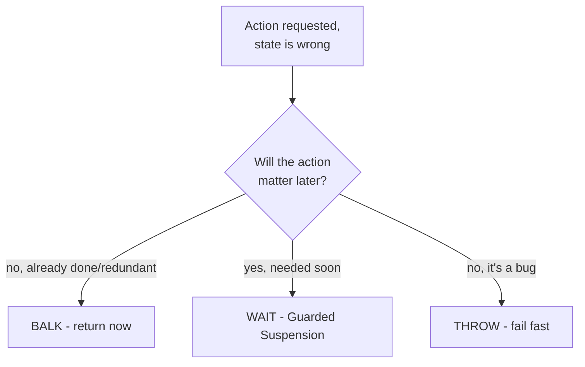
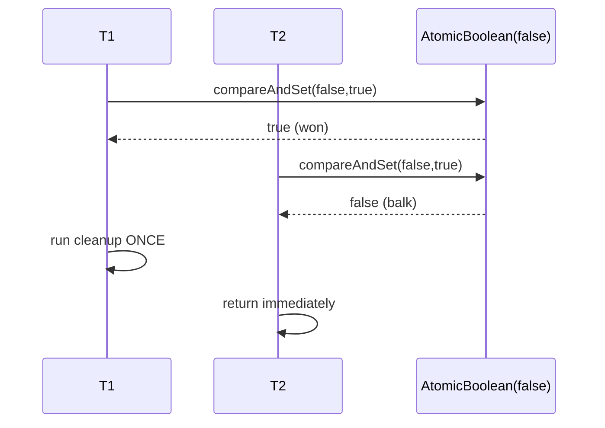

# Balking — Middle Level

> **Source:** Lea, *Concurrent Programming in Java* · Grand, *Patterns in Java* (Balking)
> **Category:** [Concurrency](../README.md) — *"Patterns for coordinating work across threads, cores, and machines."*
> **Prerequisite:** [Junior](junior.md)

## Table of Contents

1. [Introduction](#introduction)
2. [When to Use Balking](#when-to-use-balking)
3. [When NOT to Use Balking](#when-not-to-use-balking)
4. [Real-World Cases](#real-world-cases)
5. [Code Examples — Production-Grade](#code-examples--production-grade)
6. [Balking vs Guarded Suspension](#balking-vs-guarded-suspension)
7. [Idempotency & "Once" Semantics](#idempotency--once-semantics)
8. [Trade-offs](#trade-offs)
9. [Alternatives Comparison](#alternatives-comparison)
10. [Refactoring to Balking](#refactoring-to-balking)
11. [Pros & Cons (Deeper)](#pros--cons-deeper)
12. [Edge Cases](#edge-cases)
13. [Tricky Points](#tricky-points)
14. [Best Practices](#best-practices)
15. [Tasks (Practice)](#tasks-practice)
16. [Summary](#summary)
17. [Related Topics](#related-topics)
18. [Diagrams](#diagrams)

---

## Introduction

At the junior level, Balking is "check a flag, return early, and make the check atomic." At the middle level the interesting questions are *design* questions: **When is balking the right reaction to a wrong state, versus waiting or throwing? How do you keep the no-op from hiding a bug? And which concurrency primitive — `synchronized`, `volatile`, or `AtomicBoolean` — fits the specific guarantee you need?**

The core insight to carry forward: balking is the concurrency expression of **idempotency**. An idempotent operation can be invoked any number of times with the same effect as one invocation; balking is *how* you make lifecycle and persistence methods idempotent in a threaded program. Once you see it that way, you'll recognize balking in places it isn't named: HTTP `PUT`, `CREATE TABLE IF NOT EXISTS`, retry-safe message handlers, and `sync.Once`.

## When to Use Balking

- **The action is already done.** `start()` on a running engine, `close()` on a closed resource. The correct response is "nothing to do."
- **The action isn't needed.** `save()` with no unsaved changes — the dirty flag is `false`.
- **Exactly-once cleanup.** N threads may race to `shutdown()`, but only one should free the resource.
- **Debounce / throttle.** "At most one flush per interval" — balk if a flush happened recently.
- **Retry-safe handlers.** A message redelivered by a queue should be processed once; later deliveries balk on a seen-set / dedupe flag.

The common thread: **a wrong state means the request is redundant or premature in a way where doing nothing is correct.**

## When NOT to Use Balking

- **The caller genuinely needs the work and the state will soon be right.** A consumer asking an empty queue for an item should *wait* (Guarded Suspension), not balk and return null forever.
- **A wrong state signals a programming error.** If `process()` is called before `init()`, silently balking hides the bug. Throw `IllegalStateException` instead — fail fast.
- **The no-op is indistinguishable from success but means something different.** If callers can't tell "I did it" from "I balked" and the difference matters (e.g. money moved vs not), don't swallow it — return a status or throw.
- **Backpressure scenarios.** When the right reaction to "too busy" is to slow the producer, a queue/semaphore is better than dropping work via a balk (unless dropping is the explicit policy — load-shedding).

## Real-World Cases

- **Spring's `SmartLifecycle`.** `start()`/`stop()` implementations commonly balk when `isRunning()` already matches the requested state.
- **Connection pools.** `close()` on an already-closed pooled connection is a no-op (balk), so application code can close defensively.
- **`java.io` and `AutoCloseable`.** The contract for `close()` explicitly allows repeated calls; the idiomatic implementation balks on the second call via a `closed` flag.
- **Debounced UI/log flushing.** Editors and loggers coalesce a burst of "flush" requests into one actual write per window.
- **Kafka/SQS consumers.** At-least-once delivery means duplicates; a dedupe store lets the handler balk on already-processed message IDs (idempotent consumer).

## Code Examples — Production-Grade

### A lifecycle component: idempotent start/stop with status return

```java
public final class HealthMonitor {
    private enum State { STOPPED, RUNNING, CLOSED }
    private State state = State.STOPPED;
    private ScheduledExecutorService scheduler;

    public synchronized boolean start() {
        if (state != State.STOPPED) {
            return false;                 // balk: already running or closed
        }
        scheduler = Executors.newSingleThreadScheduledExecutor();
        scheduler.scheduleAtFixedRate(this::probe, 0, 5, TimeUnit.SECONDS);
        state = State.RUNNING;
        return true;
    }

    public synchronized boolean stop() {
        if (state != State.RUNNING) {
            return false;                 // balk: not running
        }
        scheduler.shutdownNow();
        state = State.STOPPED;
        return true;
    }

    private void probe() { /* ... */ }
}
```

The `enum` state (rather than two booleans) prevents impossible combinations like "running *and* closed," and every transition is a guarded balk under one lock.

### Lock-free once-only shutdown with a latch for waiters

```java
public final class GracefulShutdown {
    private final AtomicBoolean shuttingDown = new AtomicBoolean(false);
    private final CountDownLatch done = new CountDownLatch(1);

    public void shutdown() {
        if (!shuttingDown.compareAndSet(false, true)) {
            return;                        // balk: another thread owns shutdown
        }
        try {
            drainInFlight();
            releaseResources();
        } finally {
            done.countDown();              // wake anyone awaiting completion
        }
    }

    /** Callers who must NOT balk — they need to wait for shutdown to finish. */
    public void awaitTermination() throws InterruptedException {
        done.await();
    }
}
```

Note the deliberate mix: the *cleanup* balks (only one runs it), but `awaitTermination()` is Guarded Suspension — it waits. Real systems combine both.

### Debounced flush (throttle by time)

```java
public final class DebouncedFlusher {
    private final long minIntervalNanos;
    private long lastFlush = Long.MIN_VALUE;   // guarded by 'this'

    DebouncedFlusher(Duration minInterval) {
        this.minIntervalNanos = minInterval.toNanos();
    }

    public synchronized boolean flush() {
        long now = System.nanoTime();
        if (now - lastFlush < minIntervalNanos) {
            return false;                  // balk: flushed too recently
        }
        lastFlush = now;
        doFlush();
        return true;
    }
}
```

### Go: idempotent consumer with an atomic seen-flag

```go
type once struct{ done atomic.Bool }

func (o *once) tryRun(fn func()) bool {
    if !o.done.CompareAndSwap(false, true) {
        return false // balk: already ran
    }
    fn()
    return true
}
```

## Balking vs Guarded Suspension

These two patterns share the *same guard condition* and differ only in the *reaction*. Internalize this table:

| Aspect | **Balking** | **Guarded Suspension** |
|--------|-------------|------------------------|
| Wrong state → | return immediately | block and wait |
| Caller blocks? | ✗ never | ✓ until state changes |
| Primitive | `if (...) return;` | `while (...) wait();` |
| Good when | action redundant / not needed | action needed, will become valid |
| Risk | silent no-op hides bug | deadlock / missed signal / spurious wakeup |
| Example | `close()` twice | consumer on empty queue |

A practical rule: **balk when "later" is meaningless** (the work is already done or no longer relevant); **wait when "later" is the answer** (the work will be doable soon and the caller needs it).

## Idempotency & "Once" Semantics

Balking is the runtime mechanism behind two related guarantees:

- **Idempotent** — *N calls have the same effect as 1.* `close()` is idempotent because the 2nd…Nth calls balk. Useful for retries and defensive cleanup.
- **Exactly-once execution** — *the body runs once, all other callers balk.* This needs an atomic flip: `compareAndSet(false, true)` or `sync.Once`. `volatile` alone is **not** sufficient — two threads can both read `false`.

Distinguish "idempotent result" from "exactly-once side effect." `save()` is idempotent (saving twice = saving once), but you may not care which call did the I/O. `shutdown()` needs *exactly-once* side effects (free the socket once, not twice) — that's the stronger guarantee, and it requires CAS, not just a flag.

## Trade-offs

- **Latency vs correctness:** balking is the lowest-latency reaction (no blocking), but only correct when "do nothing" is right.
- **Lock vs CAS:** `synchronized` is simplest and handles multi-field state; `compareAndSet` is faster and lock-free but only guards a single flag.
- **Silent vs signaled:** silent balks are convenient but lossy for the caller; returning `boolean`/logging trades a little verbosity for observability.
- **Throughput under contention:** lock-free balking (CAS) scales better when many threads hammer the same lifecycle method, because losers don't queue on a monitor.

## Alternatives Comparison

| Approach | Wrong-state reaction | Use when |
|----------|---------------------|----------|
| **Balking** | no-op, return | action redundant; idempotency wanted |
| **Guarded Suspension** | wait | action needed soon |
| **Throw (fail-fast)** | `IllegalStateException` | wrong state = programmer error |
| **Queue the request** | enqueue, process later | work matters, can be deferred |
| **Timeout-balk hybrid** | wait up to T, then balk | bounded patience (e.g. `tryLock(T)`) |

## Refactoring to Balking

**Before** — a non-idempotent `start()` that double-initializes on a race, and callers guard externally:

```java
// Caller code, repeated everywhere:
if (!engine.isStarted()) {
    engine.start();          // race window between check and start!
}
```

**After** — push the guard *inside*, atomic, and let callers call freely:

```java
engine.start();              // safe to call from anywhere; balks if running

// Engine:
public synchronized boolean start() {
    if (started) return false;
    started = true;
    /* init */
    return true;
}
```

The refactor moves the check-then-act out of every caller (where it races) into one atomic place. This is the canonical "extract the guard into the object" move.

## Pros & Cons (Deeper)

**Pros** ✓

- Encapsulates idempotency in one place; callers stop guarding externally (and stop racing).
- Lock-free variants (`compareAndSet`) scale under heavy concurrent calls.
- Composes cleanly with state machines — each balk is a rejected transition.

**Cons** ✗

- **Observability cost:** a `void` balk leaves no trace; debugging "why didn't it save?" is hard. Mitigate with return values and targeted logging.
- **Misuse risk:** balking on a state that means "not ready yet" silently breaks functionality.
- **Single-flag limit for CAS:** multi-field state needs a lock or a single packed state word.

## Edge Cases

- **Dirty-flag ordering.** Reset `changed = false` only *after* a successful write, or restore it on failure — otherwise a failed save loses the edit *and* marks it clean.
- **Re-entrancy.** If the balking method calls back into itself, `synchronized` (re-entrant in Java) won't deadlock, but `compareAndSet` will balk the re-entrant call — usually fine, occasionally surprising.
- **CAS loser side effects.** With `compareAndSet`, the *loser* must do nothing that assumes it won. Don't put cleanup in the `else`.
- **Visibility after balk.** A caller that balked on `start()` and then reads results assumes the winner *finished* startup. It may not have. If the caller needs the work *complete*, balking isn't enough — add a latch.

## Tricky Points

- **`volatile` is a visibility tool, not an atomicity tool.** `volatile boolean started` + `if (!started) started = true;` still races. Use it only for the *read-mostly* balk where exactly-once isn't required.
- **Returning `false` is not failure.** `start()` returning `false` means "already running." Don't log it as an error or retry it.
- **Balk vs no-op-by-accident.** A method that happens to do nothing isn't "balking" unless the no-op is a *deliberate, state-guarded* decision. Naming and intent matter for maintainers.

## Best Practices

- ✓ Use an `enum` state, not a tangle of booleans, for multi-state lifecycles.
- ✓ Return `boolean` (did/balked) by default; switch to `void` only when the no-op is truly uninteresting.
- ✓ Use `compareAndSet` for single-flag once-only side effects; use `synchronized`/`enum` for multi-field state.
- ✓ Log balks that *shouldn't* happen at `WARN`; leave expected balks silent.
- ✗ Never write `if (!flag) flag = true;` outside a lock or CAS.
- ✗ Don't balk where the contract promises the work will be done — throw or wait.

## Tasks (Practice)

1. Convert a `void start()` that races into a `synchronized boolean start()` that balks idempotently.
2. Rewrite a `synchronized` one-shot `close()` using `AtomicBoolean.compareAndSet`; prove only one of two racing callers runs cleanup.
3. Implement `DebouncedFlusher` and write a test that fires 1000 flushes in a tight loop, asserting `doFlush()` ran far fewer times.
4. Take a non-idempotent message handler and make it balk on already-seen IDs using a concurrent set.
5. Identify a place in your codebase where a *wait* was wrongly implemented as a *balk* (returns null/false forever) and fix it.

## Summary

At the middle level, Balking is a **design decision about wrong-state reactions**: balk when the action is redundant or premature-in-a-harmless-way, wait when it's needed soon, throw when it's a programmer error. It is the concurrency mechanism for **idempotency** and **once semantics** — and the choice of primitive follows the guarantee: `synchronized`/`enum` for multi-field state, `AtomicBoolean.compareAndSet` (or `sync.Once`) for lock-free exactly-once side effects, never bare `volatile` for the latter. The recurring hazard is the **silent no-op hiding a bug**, countered by returning a status and logging unexpected balks.

## Related Topics

- [Monitor Object](../02-monitor-object/junior.md) — lock-based atomic check-then-act.
- [Producer–Consumer / Guarded Suspension](../06-producer-consumer/junior.md) — the wait-instead-of-balk twin.
- [Double-Checked Locking](../10-double-checked-locking/junior.md) — once-only *initialization*.

## Diagrams

**Reaction-to-wrong-state decision tree:**



**Exactly-once via CAS (winner vs losers):**


