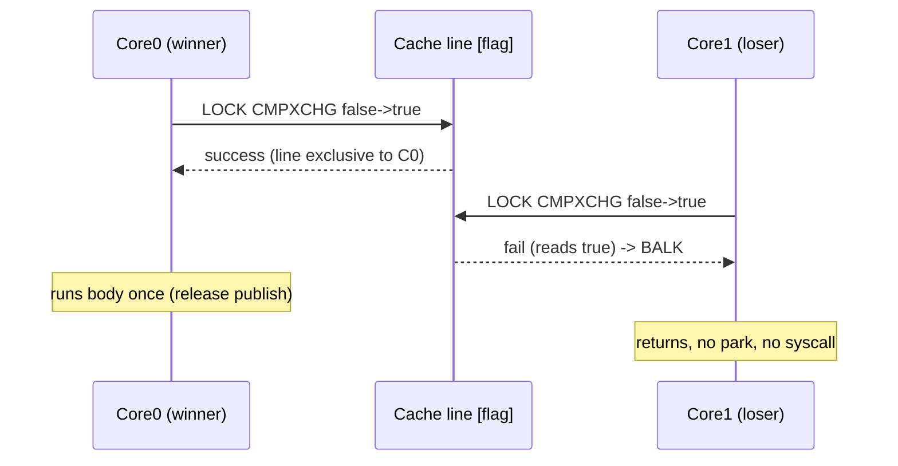
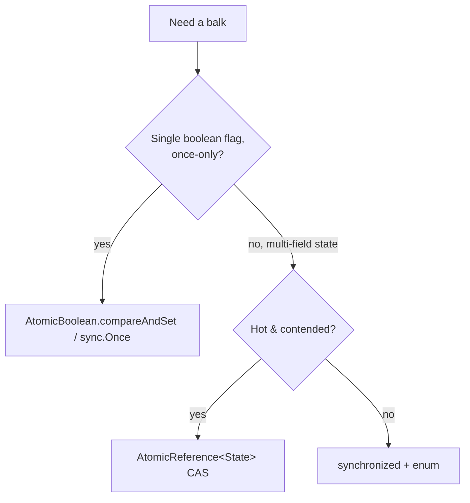

# Balking — Professional Level

> **Source:** Lea, *Concurrent Programming in Java* · Grand, *Patterns in Java* (Balking)
> **Category:** [Concurrency](../README.md) — *"Patterns for coordinating work across threads, cores, and machines."*
> **Prerequisite:** [Senior](senior.md)

## Table of Contents

1. [Introduction](#introduction)
2. [Lock-Free Balking with CAS](#lock-free-balking-with-cas)
3. [AtomicBoolean & State Machines](#atomicboolean--state-machines)
4. [Memory Model and Visibility](#memory-model-and-visibility)
5. [Performance](#performance)
6. [Cross-Language Comparison](#cross-language-comparison)
7. [Microbenchmark Anatomy](#microbenchmark-anatomy)
8. [Diagrams](#diagrams)
9. [Related Topics](#related-topics)

---

## Introduction

At the professional level the questions are mechanical and measurable: *what machine instruction implements the balk, what memory ordering does it impose, what does it cost under contention, and how do I prove the implementation is race-free?* Balking's hot path is a single atomic read-modify-write; getting it right means understanding `compareAndSet` at the level of CPU instructions, the Java Memory Model's release/acquire edges, and the cache-coherence traffic that decides whether your lock-free balk actually scales.

## Lock-Free Balking with CAS

The canonical once-only balk is one `compareAndSet`:

```java
private final AtomicBoolean closed = new AtomicBoolean(false);

public void close() {
    if (!closed.compareAndSet(false, true)) return;  // balk
    cleanup();
}
```

`compareAndSet(false, true)` compiles (on x86-64) to `LOCK CMPXCHG`. The `LOCK` prefix makes the read-compare-write atomic across cores and acts as a full barrier. Exactly one thread observes the `false→true` transition and proceeds; all others read `true` (or lose the CAS) and balk. There is **no lock, no monitor, no parking** — losers return after a single failed instruction.

**Why not a CAS *loop* here?** A retry loop (`do { v = get(); } while(!compareAndSet(v, ...))`) is for state you must *update repeatedly*. A once-only balk needs the opposite: if the CAS fails, you don't retry — you balk. So it's a single CAS, never a loop.

**ABA is irrelevant for a one-shot boolean.** ABA bites when a value goes `A→B→A` and a stale CAS wrongly succeeds. A latch flag only ever goes `false→true` and never back, so there is no A→B→A; no `AtomicStampedReference` needed. (ABA *does* matter for reusable/poolable balks — see pitfalls.)

## AtomicBoolean & State Machines

For multi-state lifecycles, replace the boolean with an `AtomicReference<State>` and make each transition a CAS-guarded balk:

```java
enum State { STOPPED, RUNNING, CLOSED }
private final AtomicReference<State> state = new AtomicReference<>(State.STOPPED);

boolean start() { return state.compareAndSet(State.STOPPED, State.RUNNING); } // false = balk
boolean close() {
    State prev = state.getAndSet(State.CLOSED);
    if (prev == State.CLOSED) return false;          // balk: already closed
    if (prev == State.RUNNING) releaseResources();
    return true;
}
```

`getAndSet` (atomic swap, `XCHG`) is handy when *any* prior non-closed state should run cleanup exactly once: the thread that observes a non-`CLOSED` previous value is the unique winner. For strict source→target transitions, `compareAndSet` is the right tool; for "claim regardless of source," `getAndSet` is.

## Memory Model and Visibility

The balk has two distinct correctness requirements, and you must satisfy both:

1. **Atomicity** of check-then-act — only one thread proceeds.
2. **Visibility / ordering** — the work done by the winner is visible (happens-before) to any thread that later observes the flag as set.

Under the JMM:

- A plain field gives **neither**.
- `volatile` gives **visibility/ordering but not atomic check-then-act** — `if(!v) v=true;` is two accesses with a window between them.
- `AtomicBoolean.compareAndSet` is `volatile`-strength on the field *and* atomic on the RMW. Its success establishes a **release** on the write; a subsequent reader that does an acquiring read sees everything the winner did *before* publishing. `Atomic*` accessors are sequentially consistent by default.
- In Java 9+, `VarHandle` exposes weaker modes (`compareAndSetRelease`, `weakCompareAndSetPlain`) for experts who can prove the weaker ordering suffices — rarely worth it for a once-only balk.

**The subtle bug:** a winner that publishes the flag with release ordering but whose *initialization* a reader accesses *without* an acquiring read can still see stale data. With `AtomicBoolean` you get acquire/release for free; with hand-rolled `volatile` "double-checked" balks you must reason about it explicitly — which is exactly the territory of [Double-Checked Locking](../10-double-checked-locking/junior.md).

## Performance

- **Uncontended balk:** a single CAS that succeeds (or a `volatile` read) is a handful of nanoseconds. The winner pays a cache-line invalidation; losers after the flag is set pay only a (possibly cached) read.
- **Contended once-only:** N threads racing the *first* `compareAndSet` all attempt the RMW; the line ping-pongs once, one wins, the rest see `true`. This is far cheaper than N threads queueing on a monitor, because losers never park/unpark (no syscall, no scheduler involvement).
- **`synchronized` vs CAS:** uncontended, biased/lightweight locking makes them comparable. Under contention, the monitor parks losers (context switches, ~µs each) while CAS losers just re-read. For a hot, single-flag balk, CAS wins decisively.
- **False sharing:** if the `AtomicBoolean`/flag shares a cache line with other hot mutable fields, unrelated writes invalidate it. For ultra-hot flags, pad or `@Contended`.
- **Read-mostly balk after the transition:** once `closed==true` forever, every later call is a cached `volatile` read — effectively free. The cost is entirely in the contended transition window.

## Cross-Language Comparison

| Language | Once-only balk idiom | Mechanism |
|----------|---------------------|-----------|
| **Java** | `AtomicBoolean.compareAndSet(false,true)` | `LOCK CMPXCHG`; acquire/release via JMM |
| **Java** | `synchronized` + flag | monitor; for multi-field state |
| **Go** | `sync.Once.Do(fn)` | atomic fast-path flag + `Mutex` slow path; later calls = one atomic load |
| **Go** | `atomic.Bool.CompareAndSwap(false,true)` | hardware CAS; manual once |
| **C++** | `std::call_once` / `std::once_flag` | platform once primitive |
| **C++** | `std::atomic<bool>.compare_exchange_strong` | `memory_order_acq_rel` you choose |
| **C#** | `Interlocked.CompareExchange` / `Lazy<T>` | CAS / lazy-once |
| **Rust** | `std::sync::Once`, `OnceCell`, `OnceLock` | atomic state machine, no double-init |

Note Go's `sync.Once`: after the first call its `Do` is a single atomic load of `done` (a fast `if done==0` guarded by a mutex only on the slow path), so the steady-state balk is essentially free — a deliberate read-mostly optimization. Java's `AtomicBoolean` balk has the same steady-state shape.

```go
type Once struct {
    done atomic.Uint32
    m    Mutex
}
func (o *Once) Do(f func()) {
    if o.done.Load() == 0 {   // fast path: balk after first
        o.doSlow(f)
    }
}
func (o *Once) doSlow(f func()) {
    o.m.Lock(); defer o.m.Unlock()
    if o.done.Load() == 0 {   // double-check under lock
        defer o.done.Store(1)
        f()
    }
}
```

This is *literally* Double-Checked Locking used to implement a once-balk — note the atomic fast-path read, the lock, and the re-check.

## Microbenchmark Anatomy

Measuring a balk is deceptively easy to get wrong. Anatomy of a correct JMH benchmark:

```java
@State(Scope.Benchmark)
public class BalkBench {
    AtomicBoolean closed;

    @Setup(Level.Invocation)            // fresh flag per invocation for the "win" case
    public void reset() { closed = new AtomicBoolean(false); }

    @Benchmark @Threads(8)
    public boolean contendedFirstClose() {
        return closed.compareAndSet(false, true);   // measures the contended transition
    }
}
```

Pitfalls that ruin balk benchmarks:

- **Dead-code elimination.** If you don't return/consume the result, the JIT deletes the CAS. Return it or use a `Blackhole`.
- **Measuring the read-mostly path by accident.** Benchmarking `close()` after it's already closed measures a free `volatile` read, not the balk's real cost. Use `@Setup(Level.Invocation)` to reset, and accept the setup noise — or measure the two regimes separately.
- **Single-threaded numbers for a contention question.** A balk's cost is *about* contention; `@Threads(1)` tells you nothing about the ping-pong. Sweep `@Threads`.
- **No warmup → measuring the interpreter.** Always warm up so `LOCK CMPXCHG` is JIT-compiled inline, not interpreted.
- **False sharing in the harness.** Co-locating per-thread counters next to the flag inflates numbers; pad them.

Interpret results as: *steady-state balk = ~1 cached volatile read; contended transition = ~1 cache-line ping-pong + 1 CAS; `synchronized` under contention adds park/unpark syscalls.*

## Diagrams

**CAS once-only on the cache line:**



**Decision: which primitive for which balk:**



## Related Topics

- [Double-Checked Locking](../10-double-checked-locking/junior.md) — the once-only *initialization* sibling; `sync.Once` is DCL internally.
- [Monitor Object](../02-monitor-object/junior.md) — the lock alternative for multi-field state.
- [Producer–Consumer / Guarded Suspension](../06-producer-consumer/junior.md) — the waiting counterpart used for balk-loser completion.
