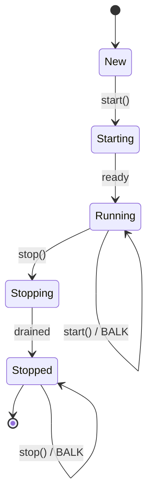
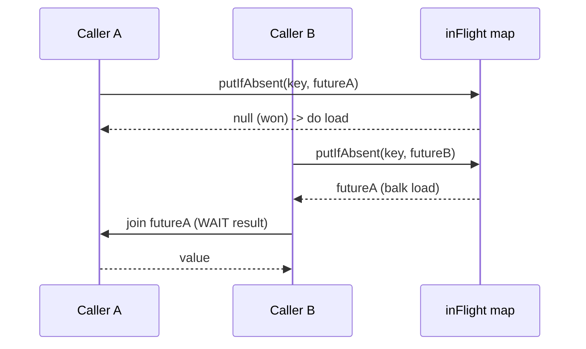

# Balking — Senior Level

> **Source:** Lea, *Concurrent Programming in Java* · Grand, *Patterns in Java* (Balking)
> **Category:** [Concurrency](../README.md) — *"Patterns for coordinating work across threads, cores, and machines."*
> **Prerequisite:** [Middle](middle.md)

## Table of Contents

1. [Introduction](#introduction)
2. [Balking at Architectural Scale](#balking-at-architectural-scale)
3. [State Machines & Balking](#state-machines--balking)
4. [Concurrency Deep Dive](#concurrency-deep-dive)
5. [Testability Strategies](#testability-strategies)
6. [When Balking Becomes a Problem](#when-balking-becomes-a-problem)
7. [Code Examples — Advanced](#code-examples--advanced)
8. [Real-World Architectures](#real-world-architectures)
9. [Pros & Cons at Scale](#pros--cons-at-scale)
10. [Trade-off Analysis Matrix](#trade-off-analysis-matrix)
11. [Migration Patterns](#migration-patterns)
12. [Diagrams](#diagrams)
13. [Related Topics](#related-topics)

---

## Introduction

The senior view of Balking is that it is **not an object-level trick but a system-level idempotency strategy**. The same "wrong state → give up now" shape that closes a socket once also powers idempotent HTTP endpoints, exactly-once-ish message consumers, debounced flushes, and leader-election guards. The hard part at scale is not implementing the balk — it is deciding *where* the authoritative state lives (a field? an `AtomicReference`? a row in the database? a distributed lock?) and ensuring the **check-and-act is atomic at that level of the system**, not just inside one JVM.

This page treats balking as a transition rule on a state machine, dissects the race precisely in terms of the Java Memory Model, and shows where a too-eager balk turns a correctness bug into an invisible one.

## Balking at Architectural Scale

- **Idempotent endpoints.** A `POST /orders` with a client-supplied idempotency key balks (returns the *existing* result) if the key was already processed. The "flag" is a row in a dedupe table; the atomic check-then-act is an `INSERT ... ON CONFLICT DO NOTHING` returning whether the row was new. This is balking with the database as the lock.
- **Debounced/coalesced flushes.** A write-behind cache or a metrics pipeline balks redundant flush triggers, collapsing a burst into one I/O per window. The flag is a timestamp or a "flush scheduled" boolean.
- **Single-flight.** Many concurrent requests for the same uncached key should trigger *one* upstream fetch; the rest balk and await the in-flight result (Go's `golang.org/x/sync/singleflight`). This is balking on "is a fetch already in progress?" combined with guarded suspension for the waiters.
- **Leader-only work.** A node balks on scheduled jobs unless it currently holds leadership — the flag is a distributed lease.

In every case the pattern is identical; only the *storage of the state flag* and the *atomicity mechanism* change (CAS, monitor, DB constraint, distributed lock).

## State Machines & Balking

Model the object as a finite state machine and a balk is a **rejected event** — an event that arrives in a state where it has no legal transition, so it self-loops with no side effect.



This framing is powerful because it makes the *complete* balk policy explicit: for every (state, event) pair you decide **do / balk / wait / throw**. A common senior mistake is to balk reflexively on "not Running" and accidentally swallow `stop()` during `Starting` — the machine then can never stop. An explicit transition table prevents that:

| Event \ State | New | Starting | Running | Stopping | Stopped |
|---------------|-----|----------|---------|----------|---------|
| `start()` | do | balk | balk | throw? | throw? |
| `stop()` | balk | **wait** | do | balk | balk |

The cell `stop()` in `Starting` is exactly where a naive `if (state != RUNNING) return;` is wrong — you want to *wait* for `Running` then stop, not balk.

## Concurrency Deep Dive

### The check-and-act race, precisely

```java
// BROKEN
if (!started) {      // (1) read 'started'
    started = true;  // (2) write 'started'
    init();
}
```

Steps (1) and (2) are separated by a window. Under the Java Memory Model two threads can interleave as `read,read,write,write`, both observing `false`, both running `init()`. Worse, with a *plain* (non-`volatile`) field, thread B may **never observe** thread A's write at all — there's no happens-before edge — so even single-threaded reasoning about "who set it" is invalid.

### Fixes and exactly what they guarantee

| Mechanism | Atomic check-act? | Visibility (happens-before)? | Notes |
|-----------|:---:|:---:|-------|
| plain `boolean` | ✗ | ✗ | broken on both counts |
| `volatile boolean` | ✗ | ✓ | visible but still races on check-then-set |
| `synchronized` | ✓ | ✓ | re-entrant; handles multi-field state |
| `AtomicBoolean.compareAndSet` | ✓ | ✓ | lock-free; single flag; winner-takes-all |
| `AtomicReference` CAS-loop | ✓ | ✓ | for multi-valued state transitions |

`compareAndSet` is the textbook fix: it performs read-compare-write as a single atomic instruction (`LOCK CMPXCHG` on x86) and publishes the write with release/acquire semantics, giving both atomicity *and* a happens-before edge to the thread that reads the flag afterward.

### CAS for richer state than a boolean

When the "flag" is an enum, use an `AtomicReference<State>` and CAS the transition:

```java
private final AtomicReference<State> state = new AtomicReference<>(State.STOPPED);

public boolean start() {
    // balk unless we win the STOPPED -> STARTING transition
    if (!state.compareAndSet(State.STOPPED, State.STARTING)) {
        return false;     // someone else is starting/running/closed
    }
    init();
    state.set(State.RUNNING);
    return true;
}
```

The CAS *is* the balk: only the thread that flips `STOPPED→STARTING` proceeds; concurrent callers see a non-`STOPPED` state and balk.

## Testability Strategies

- **Force the race deterministically.** Inject a barrier or a `CountDownLatch` inside the body so a test can park the winning thread mid-`init()` and fire a second caller, asserting it balked. Don't rely on `Thread.sleep` and luck.
- **Count side effects, not flag values.** Assert "`init()` ran exactly once across 1000 concurrent `start()` calls" with an `AtomicInteger`. This catches the race that a flag inspection misses.
- **Stress + jcstress.** For the lock-free version, OpenJDK's `jcstress` harness exhaustively explores interleavings and detects "both threads ran cleanup" outcomes that ordinary tests almost never hit.
- **Property: idempotence.** Property-based test — for any sequence of `start/stop/close` calls, the observable side effects equal those of the de-duplicated sequence.

## When Balking Becomes a Problem

- **Silent no-ops masking logic errors.** The senior failure mode: a balk that was supposed to be impossible *happens* (because of an upstream bug), and because it's silent, the system limps along with missing work and no signal. **Policy:** balks that violate an invariant should be logged at `WARN`/`ERROR` or counted on a metric, not swallowed. "This `start()` balked because already running" is fine to ignore; "this payment-capture balked because already captured" might be a double-submit you *want* to know about.
- **Balking where you needed to wait.** As shown in the transition table, reflexive balking on "not in the one happy state" can wedge a state machine (a `stop()` lost during `Starting`).
- **Lost completion ordering.** A caller that balks on `start()` may incorrectly assume startup is *finished*. Balking only guarantees "someone owns it," not "it's done." If completion matters, pair the balk with a latch/future the loser awaits.
- **Debounce dropping the last event.** A throttled flush that balks the final trigger can leave the newest data unflushed. Ensure a trailing flush is scheduled.

## Code Examples — Advanced

### Single-flight: one fetch, the rest balk-and-await

```java
final class SingleFlight<K, V> {
    private final ConcurrentMap<K, CompletableFuture<V>> inFlight = new ConcurrentHashMap<>();

    V get(K key, Supplier<V> loader) {
        // putIfAbsent is the atomic balk: only the first caller installs a future.
        CompletableFuture<V> mine = new CompletableFuture<>();
        CompletableFuture<V> existing = inFlight.putIfAbsent(key, mine);
        if (existing != null) {
            return existing.join();        // balk on fetching; WAIT on the result
        }
        try {
            V v = loader.get();
            mine.complete(v);
            return v;
        } finally {
            inFlight.remove(key, mine);
        }
    }
}
```

This is the architectural archetype: **balk on doing the work, but guarded-suspend on the result.** Losers don't duplicate the load and don't return stale nulls.

### Idempotent capture with the DB as the atomic flag

```java
boolean capture(String idempotencyKey, Money amount) {
    // ON CONFLICT DO NOTHING -> rowsInserted==0 means we balk.
    int rows = jdbc.update(
        "INSERT INTO captures(key, amount) VALUES (?,?) ON CONFLICT (key) DO NOTHING",
        idempotencyKey, amount);
    if (rows == 0) {
        log.warn("capture balked: key {} already processed", idempotencyKey);
        return false;                      // balk: someone (or a retry) already did it
    }
    gateway.charge(amount);
    return true;
}
```

## Real-World Architectures

- **Write-behind cache:** dirty entries flushed by a single coalescing task; redundant flush triggers balk.
- **Graceful shutdown:** one `AtomicBoolean` owns the shutdown; signal handlers, health checks, and admin endpoints all call `shutdown()`, all but the first balk, waiters use a latch.
- **Idempotent consumers:** at-least-once brokers (Kafka, SQS) deliver duplicates; handlers balk on a processed-ID store, turning at-least-once into effectively-once.
- **Leader election:** non-leaders balk on cluster-singleton jobs until they acquire the lease.

## Pros & Cons at Scale

**Pros** ✓ — Eliminates duplicate work cheaply; lock-free variants scale to high contention; composes with state machines and distributed dedupe; the foundation of idempotent APIs.

**Cons** ✗ — Silent balks erode observability exactly where it matters (money, data loss); correct atomicity must be guaranteed at the *right scope* (JVM vs DB vs cluster), which is easy to get wrong; balking the wrong event wedges state machines.

## Trade-off Analysis Matrix

| Dimension | `synchronized` balk | CAS balk | DB-constraint balk | Distributed-lock balk |
|-----------|:---:|:---:|:---:|:---:|
| Scope | one JVM | one JVM | one database | whole cluster |
| Contention cost | medium | low | DB round-trip | network + lease |
| Multi-field state | ✓ | hard | ✓ | ✓ |
| Observability | easy to log | easy | easy (rows=0) | needs care |
| Failure mode | none extra | ABA (rare) | constraint must exist | lease expiry / split-brain |

## Migration Patterns

1. **External guard → internal balk.** Replace scattered `if (!x.isRunning()) x.start();` (each a race) with one atomic `x.start()` that balks. Delete the external checks.
2. **`synchronized` → CAS.** When profiling shows monitor contention on a hot, single-flag lifecycle method, migrate to `AtomicBoolean.compareAndSet`; verify with `jcstress`.
3. **Silent → signaled.** Add a return value and a metric to a swallowing balk before you trust it in a money path; you'll often discover it was hiding double-submits.
4. **Local → distributed.** When a single-JVM balk no longer suffices (horizontal scaling), move the flag to a DB unique constraint or a lease, keeping the same "first wins, rest balk" semantics.

## Diagrams

**Single-flight: balk-the-work, wait-the-result:**



## Related Topics

- [Monitor Object](../02-monitor-object/junior.md) — the lock primitive for multi-field balks.
- [Double-Checked Locking](../10-double-checked-locking/junior.md) — once-only initialization, a balk on "already created."
- [Producer–Consumer / Guarded Suspension](../06-producer-consumer/junior.md) — the wait half of single-flight.
