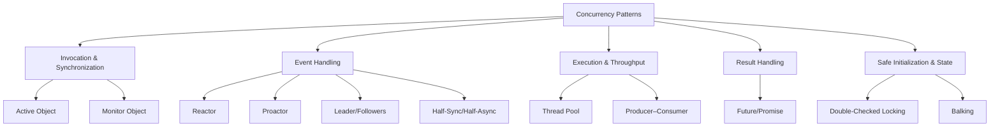

# Concurrency Patterns

> *"The world is concurrent. Things in the world do not share data, they communicate. Concurrency patterns are how we make software behave the same way — safely, scalably, and without losing our minds to race conditions."*

---

## Why a Fourth Category?

The classic **Gang of Four** patterns (Creational, Structural, Behavioral) were written in 1994 for *single-threaded* object-oriented programs. They say almost nothing about threads, locks, event loops, or asynchronous I/O — the realities of every server, mobile app, and distributed system today.

The gap was filled by a different lineage of work:

| Source | Year | Contribution |
|---|---|---|
| **Doug Lea** — *Concurrent Programming in Java* | 1996 | The first systematic catalog of concurrency idioms for an OO language. |
| **POSA2** — *Pattern-Oriented Software Architecture, Vol. 2: Patterns for Concurrent and Networked Objects* (Schmidt, Stal, Rohnert, Buschmann) | 2000 | The canonical reference. Defines Reactor, Proactor, Active Object, Monitor Object, Leader/Followers, Half-Sync/Half-Async, and more. |
| **JSR-166** — `java.util.concurrent` (Doug Lea et al.) | 2004 | Turned these patterns into a standard library: `ExecutorService`, `Future`, `BlockingQueue`, `CompletableFuture`. |

These are **concurrency patterns**: reusable solutions to the recurring problems of *coordinating work across threads, cores, and machines*.

---

## The Patterns in This Section

| # | Pattern | One-line intent |
|---|---|---|
| 01 | **[Active Object](01-active-object/)** | Decouple method *invocation* from method *execution* — each object runs on its own thread, requests queued. |
| 02 | **[Monitor Object](02-monitor-object/)** | Let only one method run inside an object at a time; threads cooperate via condition variables. |
| 03 | **[Reactor](03-reactor/)** | A single-threaded event loop that demultiplexes I/O readiness and dispatches to handlers (`select`/`epoll`). |
| 04 | **[Proactor](04-proactor/)** | Asynchronous, *completion*-based event handling — the OS performs the I/O and notifies you when it's done. |
| 05 | **[Thread Pool](05-thread-pool/)** | Reuse a bounded set of worker threads to execute a stream of tasks; amortize thread cost, cap concurrency. |
| 06 | **[Producer–Consumer](06-producer-consumer/)** | Decouple producers from consumers through a shared bounded buffer; smooth out rate mismatches. |
| 07 | **[Future / Promise](07-future-promise/)** | A placeholder for a value that doesn't exist yet; the promise writes it, the future reads it. |
| 08 | **[Half-Sync/Half-Async](08-half-sync-half-async/)** | Separate simple synchronous processing from fast asynchronous I/O via a queueing layer. |
| 09 | **[Leader/Followers](09-leader-followers/)** | A pool of threads take turns being the one that waits for events — minimal handoff, no dispatcher bottleneck. |
| 10 | **[Double-Checked Locking](10-double-checked-locking/)** | Lazily initialize a shared resource while locking only on the first access — and the memory-model traps that make it hard. |
| 11 | **[Balking](11-balking/)** | If an object is in the wrong state for a request, refuse immediately instead of blocking or queuing. |

---

## How to Read This Section

Each pattern folder contains the same eight-file progression used throughout this roadmap:

| File | Audience | Focus |
|---|---|---|
| `junior.md` | Beginner | What it is, how to use it, runnable examples. |
| `middle.md` | Working dev | When (and when not) to use it, production-grade code, trade-offs. |
| `senior.md` | Senior | What breaks at scale, the memory model, testability. |
| `professional.md` | Specialist | Internals, performance, cross-language and library comparisons. |
| `interview.md` | All | Graded interview questions with model answers. |
| `tasks.md` | All | Hands-on exercises. |
| `find-bug.md` | All | Buggy concurrent code to diagnose and fix. |
| `optimize.md` | All | Performance-tuning walkthroughs. |

---

## Prerequisites

Before this section you should be comfortable with **[the threading & concurrency fundamentals](../../../README.md)** — threads, locks/mutexes, atomics, and the basics of a memory model (happens-before, visibility). The patterns here *compose* those primitives; they do not replace understanding them.

> **A word of caution.** Concurrency patterns are powerful but unforgiving. A pattern applied without understanding the underlying memory model produces code that passes every test on your laptop and corrupts data in production under load. Read the `senior.md` and `find-bug.md` files — that is where the real lessons live.
