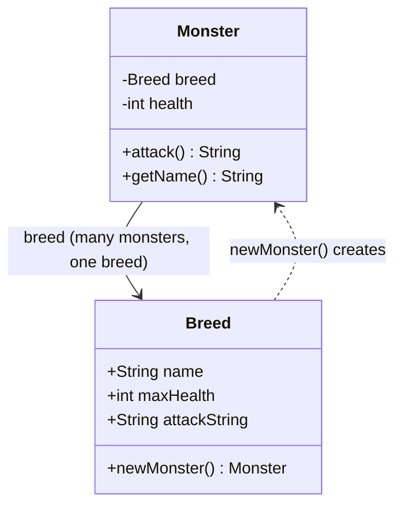

# Type Object — Junior Level

> **Source:** [gameprogrammingpatterns.com/type-object.html](https://gameprogrammingpatterns.com/type-object.html)
> **Category:** [Other (GoF-adjacent)](../README.md)

---

## Table of Contents

1. [Introduction](#introduction)
2. [Prerequisites](#prerequisites)
3. [Glossary](#glossary)
4. [Core Concepts](#core-concepts)
5. [Real-World Analogies](#real-world-analogies)
6. [Mental Models](#mental-models)
7. [Pros & Cons](#pros-cons)
8. [Use Cases](#use-cases)
9. [Code Examples](#code-examples)
10. [Coding Patterns](#coding-patterns)
11. [Clean Code](#clean-code)
12. [Best Practices](#best-practices)
13. [Edge Cases & Pitfalls](#edge-cases-pitfalls)
14. [Common Mistakes](#common-mistakes)
15. [Tricky Points](#tricky-points)
16. [Test Yourself](#test-yourself)
17. [Cheat Sheet](#cheat-sheet)
18. [Summary](#summary)
19. [Further Reading](#further-reading)
20. [Related Topics](#related-topics)
21. [Diagrams](#diagrams)

---

## Introduction

> Focus: **What is it?** and **How to use it?**

**Type Object** is a pattern that lets you define new "kinds of things" as **data** instead of as **code**. Instead of writing a new class for every kind (`Dragon`, `Goblin`, `Troll`), you write **one** class for the thing (`Monster`) and a **separate** class for its kind (`Breed`). Every `Monster` instance holds a reference to the `Breed` it belongs to.

In one sentence: *move the "what kind am I?" distinction out of the class hierarchy and into an object you point at.*

### Why this matters

You're building a game. You have a dragon. Easy:

```java
class Dragon { int health = 230; String attack = "The dragon breathes fire!"; }
```

Then the designer wants a goblin. And a troll. And a skeleton. And — over the next year — eighty more. With the naive approach you write eighty subclasses, each differing only in a couple of numbers and a string:

```java
class Goblin extends Monster { ... }   // health = 20
class Troll  extends Monster { ... }   // health = 48
// ...78 more files...
```

This is the **class explosion** problem. Eighty classes, recompiled every time a designer tweaks a health value, and a designer who can't add a monster without filing a ticket for a programmer.

Type Object collapses all of those into **one** `Monster` class plus a `Breed` object that carries the varying data. Now "add a new monster" means "add a row of data" — no new code, no recompile, and a non-programmer can do it.

---

## Prerequisites

- **Required:** Classes, fields, and constructors.
- **Required:** Object references — understanding that two variables can point at the *same* object.
- **Helpful:** Inheritance and polymorphism (so you can see what Type Object replaces).
- **Helpful:** Reading data from a file (JSON) — Type Object pays off most when types come from data.

---

## Glossary

| Term | Definition |
|------|-----------|
| **Typed Object** | The class whose instances exist in your program — e.g. `Monster`. Many instances. |
| **Type Object** | The class that describes a *kind* — e.g. `Breed`. Few instances, one per kind. |
| **Type reference** | The field on the typed object that points at its type object (`monster.breed`). |
| **Class explosion** | The anti-pattern of one subclass per data variation, producing dozens of near-identical classes. |
| **Data-driven** | Behavior/content defined in data files (JSON, DB rows) rather than in compiled code. |
| **Shared type data** | One `Breed` object referenced by thousands of `Monster` instances (a Flyweight relationship). |

---

## Core Concepts

### 1. Two classes, not a class per kind

The naive design puts each kind in the type system:

```
Monster  ← Dragon, Goblin, Troll, Skeleton, ...   (one subclass per kind)
```

Type Object puts each kind in an object:

```
Monster ──breed──▶ Breed   (one Breed instance per kind; Monster has no subclasses)
```

### 2. The typed object holds per-instance state; the type object holds per-kind data

A single monster has *its own* current health (it takes damage). But *max* health, the attack string, the starting health — those are the same for every dragon, so they live on the `Breed`:

```
Monster:  health (changes per monster)  +  breed (a pointer)
Breed:    name, maxHealth, attackString (same for all monsters of this breed)
```

### 3. One Breed is shared by many Monsters

A thousand goblins point at the *same* `Breed` object. You store the goblin's name and attack string once, not a thousand times. (This is the **Flyweight** relationship — see [Flyweight](../../02-structural/06-flyweight/junior.md).)

### 4. The type object can build instances

The most natural place to create a `Monster` of a given breed is on the breed itself:

```
Monster m = goblinBreed.newMonster();   // the Breed acts as a factory
```

The breed knows the starting health, so it stamps it onto the new monster.

---

## Real-World Analogies

| Concept | Analogy |
|---|---|
| **Typed object (`Monster`)** | A specific paper coffee cup on the counter — it has a current fill level. |
| **Type object (`Breed`)** | The "Large Latte" menu entry — defines size, price, recipe. One menu entry, thousands of cups. |
| **Shared type data** | The menu is printed once; every barista reads the same menu, they don't each memorize their own copy. |
| **Designer authors types** | The shop owner adds a new drink by editing the menu — no need to rebuild the espresso machine (recompile). |
| **Type reference** | Each cup has a sticker pointing back to which drink it is. |

---

## Mental Models

**The intuition:** anything that is the *same for every instance of a kind* belongs on the type object; anything that *differs per instance* stays on the instance.

```
Is this value the same for every Dragon?
   YES → put it on Breed (the type object), shared.
   NO  → put it on Monster (the instance), per-object.
```

**Before vs after:**

```
Before (class explosion):          After (type object):
class Dragon extends Monster {     class Monster {
    int health = 230;                  int health;
    String attack =                    Breed breed;   // ← points at the kind
      "fire breath";              }
}                                  class Breed {
class Goblin extends Monster {         String name;
    int health = 20;                   int maxHealth;
    ...                                String attack;
}                                  }
// ...80 more classes...           // ...80 rows of DATA...
```

---

## Pros & Cons

| Pros | Cons |
|---|---|
| Kills the class explosion — one class instead of dozens | Loses compile-time type safety (a breed is data, not a Java type) |
| New kinds added as **data**, no code, no recompile | Per-kind *behavior* (real code) is hard to express in pure data |
| Non-programmers (designers) can author kinds | Indirection: every property read goes through `monster.breed.x` |
| Memory win: one `Breed` shared by thousands of monsters | You must validate designer-authored data at load time |
| Kinds can be loaded from JSON / DB / config at runtime | Harder to navigate in an IDE (no "go to definition" for a breed) |

### When to use:
- You have **many similar kinds** that differ mainly in **data** (numbers, strings, flags).
- Kinds are **defined by designers or data files**, not programmers.
- You don't know all the kinds at compile time (mods, DLC, live content updates).

### When NOT to use:
- You have **few, fixed kinds** known at compile time → just use subclasses.
- Kinds need **genuinely different behavior/code**, not just different data → use polymorphism/subclasses or Strategy.
- You're building a large entity system where kinds combine independently → look at **Entity-Component-System** (see [Senior](senior.md)).

---

## Use Cases

- **Game monsters / items / spells** — the canonical case. Breeds, item types, spell definitions in JSON.
- **Product catalogs** — `Product` instances point at a `ProductType` (category data, tax class, shipping rules).
- **Ticket / issue systems** — every `Ticket` references a `TicketType` defining its SLA, fields, workflow.
- **Card games** — one `Card` class; thousands of card definitions loaded from data.
- **Simulation entities** — vehicles, plants, units defined in spreadsheets.

---

## Code Examples

### Java — Monster and Breed

```java
class Breed {
    final String name;
    final int maxHealth;
    final String attackString;

    Breed(String name, int maxHealth, String attackString) {
        this.name = name;
        this.maxHealth = maxHealth;
        this.attackString = attackString;
    }

    // The type object acts as a factory.
    Monster newMonster() {
        return new Monster(this);
    }
}

class Monster {
    private final Breed breed;   // type reference
    private int health;          // per-instance state

    Monster(Breed breed) {
        this.breed = breed;
        this.health = breed.maxHealth;   // start at full health
    }

    String attack()  { return breed.attackString; }
    String getName() { return breed.name; }
    int getHealth()  { return health; }
}

public class Demo {
    public static void main(String[] args) {
        Breed dragon = new Breed("Dragon", 230, "The dragon breathes fire!");
        Breed goblin = new Breed("Goblin", 20,  "The goblin stabs you.");

        Monster m1 = dragon.newMonster();
        Monster m2 = goblin.newMonster();

        System.out.println(m1.getName() + ": " + m1.attack());  // Dragon: ...fire!
        System.out.println(m2.getName() + ": " + m2.attack());  // Goblin: ...stabs you.
    }
}
```

**What it does:** there is exactly **one** `Monster` class. "Dragon" and "Goblin" are not classes — they are `Breed` *objects*. Adding "Troll" means constructing one more `Breed`, not writing a class.

---

### Python — Monster and Breed

```python
from dataclasses import dataclass

@dataclass(frozen=True)          # frozen = immutable, safe to share
class Breed:
    name: str
    max_health: int
    attack_string: str

    def new_monster(self) -> "Monster":
        return Monster(self)

class Monster:
    def __init__(self, breed: Breed):
        self.breed = breed                # type reference
        self.health = breed.max_health    # per-instance state

    def attack(self) -> str:
        return self.breed.attack_string

    @property
    def name(self) -> str:
        return self.breed.name

if __name__ == "__main__":
    dragon = Breed("Dragon", 230, "The dragon breathes fire!")
    goblin = Breed("Goblin", 20,  "The goblin stabs you.")

    for m in (dragon.new_monster(), goblin.new_monster()):
        print(f"{m.name}: {m.attack()}")
```

---

### Go — Monster and Breed

Go has no inheritance, so Type Object is *especially* natural here — it's just a struct holding a pointer to another struct.

```go
package main

import "fmt"

type Breed struct {
    Name         string
    MaxHealth    int
    AttackString string
}

// The type object as factory.
func (b *Breed) NewMonster() *Monster {
    return &Monster{breed: b, health: b.MaxHealth}
}

type Monster struct {
    breed  *Breed // type reference (pointer = shared, not copied)
    health int    // per-instance state
}

func (m *Monster) Attack() string { return m.breed.AttackString }
func (m *Monster) Name() string   { return m.breed.Name }

func main() {
    dragon := &Breed{"Dragon", 230, "The dragon breathes fire!"}
    goblin := &Breed{"Goblin", 20, "The goblin stabs you."}

    for _, m := range []*Monster{dragon.NewMonster(), goblin.NewMonster()} {
        fmt.Printf("%s: %s\n", m.Name(), m.Attack())
    }
}
```

**Note the `*Breed` pointer.** Storing a pointer (not a value) is what makes the breed *shared*. If you stored a `Breed` by value, every monster would carry its own copy — losing the memory win and risking divergence.

---

## Coding Patterns

### Pattern 1: Type reference as a field

```java
class Monster { final Breed breed; }   // every instance points at its type
```

### Pattern 2: Type object as factory (`newMonster()`)

The breed creates monsters, stamping starting state from its data:

```java
Monster newMonster() { return new Monster(this); }
```

### Pattern 3: Forwarding reads to the type object

```java
String getName() { return breed.name; }   // Monster delegates to its Breed
```

This keeps the instance thin and the kind's data in one place.

---

## Clean Code

### Make type data immutable

A shared object that anyone can mutate is a bug factory — change one breed and every monster of that breed changes. Mark type-object fields `final` (Java), use `@dataclass(frozen=True)` (Python), or never expose setters (Go).

```java
class Breed {
    final String name;       // ✅ immutable, safe to share
    final int maxHealth;
}
```

### Name the two roles clearly

| ❌ Bad | ✅ Good |
|---|---|
| `MonsterData`, `MonsterInfo` | `Breed` (a domain word for "kind of monster") |
| `type` field | `breed` (concrete) |

Use a domain word for the type object. `Breed`, `ItemType`, `CardDef` read better than `XData`.

---

## Best Practices

1. **Put per-kind data on the type object, per-instance state on the instance.** This split is the whole pattern.
2. **Make the type object immutable** so sharing is safe.
3. **Give the type object a factory method** (`newMonster()`) — it knows the starting state.
4. **Store the type by reference** (pointer/object), never by copy.
5. **Load type objects from data** (JSON/DB) once Type Object proves its worth — that's where it shines (see [Middle](middle.md)).

---

## Edge Cases & Pitfalls

- **Mutating shared type data** — `monster.breed.maxHealth = 0` silently changes *every* monster of that breed. Keep breeds immutable.
- **Storing the type by value** (Go structs, C++ objects) — each instance gets its own copy; you lose sharing and they can drift apart.
- **A missing type** — loading a monster whose breed name isn't in your registry. Decide: error out, or fall back to a default breed?
- **Forgetting the back-reference** — a monster with no breed can't answer `name()` or `attack()`. The reference is mandatory.

---

## Common Mistakes

1. **Writing one subclass per kind anyway**, then *also* adding a Breed — pick one. Type Object replaces the subclasses.
2. **Putting per-instance state on the type object** (e.g. current health on Breed). It would be shared across all monsters — wrong.
3. **Deep-copying the breed into each monster** "to be safe." This defeats the Flyweight memory win entirely.
4. **Mutable breeds.** A setter on a shared object is a landmine.
5. **Using Type Object for two fixed kinds.** If you have exactly `Player` and `Wall`, just write two classes.

---

## Tricky Points

- **Type Object vs subclassing is a *data-vs-code* trade.** Subclasses give you the compiler and custom code per kind; Type Object gives you runtime/data flexibility and loses the compiler. Neither is "better" — it depends on whether kinds vary by data or by behavior.
- **The instance still has a "type" — it's just an object, not a class.** `monster.breed` plays the role `getClass()` would have.
- **The type object is usually also a Flyweight.** "Shared, immutable, intrinsic data" is exactly Flyweight's job description.

---

## Test Yourself

1. What problem does Type Object solve, in one phrase?
2. Where does a monster's *current* health live — on `Monster` or `Breed`? Why?
3. Why must the breed be stored by reference, not by value?
4. Why should the breed be immutable?
5. When should you use subclasses instead of Type Object?

<details><summary>Answers</summary>

1. The class-explosion problem — one class per data variation. Type Object makes kinds *data* instead of *classes*.
2. On `Monster`. It changes per individual monster (each takes its own damage); only kind-wide data goes on `Breed`.
3. So thousands of monsters share *one* breed object — the memory win — and so they don't drift apart.
4. Because it's shared; if any monster could mutate it, it would change every monster of that breed.
5. When you have few, fixed kinds known at compile time, or kinds that need genuinely different *behavior* (code), not just different data.

</details>

---

## Cheat Sheet

```java
// Java — minimal Type Object
class Breed  { final String name; final int maxHealth;
               Monster newMonster() { return new Monster(this); } }
class Monster { final Breed breed; int health;
                Monster(Breed b) { breed = b; health = b.maxHealth; } }
```

```python
# Python
@dataclass(frozen=True)
class Breed:
    name: str; max_health: int
    def new_monster(self): return Monster(self)
class Monster:
    def __init__(self, breed): self.breed, self.health = breed, breed.max_health
```

```go
// Go — store the type by POINTER (shared)
type Breed struct{ Name string; MaxHealth int }
type Monster struct{ breed *Breed; health int }
func (b *Breed) NewMonster() *Monster { return &Monster{b, b.MaxHealth} }
```

---

## Summary

- Type Object = **define kinds as data (objects), not as classes (subclasses)**.
- One typed class (`Monster`) + one type class (`Breed`); each instance points at its type.
- Per-kind data lives on the type object; per-instance state lives on the instance.
- One type object is **shared** by many instances (a Flyweight) — a memory win.
- The type object can act as a **factory** (`newMonster()`).
- Use it for **many data-driven kinds**; avoid it for few fixed kinds or kinds needing real custom code.

---

## Further Reading

- [gameprogrammingpatterns.com/type-object.html](https://gameprogrammingpatterns.com/type-object.html) — Robert Nystrom's canonical treatment.
- *Game Programming Patterns*, Robert Nystrom — the book the chapter is from.
- GoF *Design Patterns* — Flyweight and Prototype, the closest relatives.

---

## Related Topics

- **Next level:** [Type Object — Middle](middle.md)
- **Closest relative:** [Flyweight](../../02-structural/06-flyweight/junior.md) — shared immutable type data.
- **Builds instances like:** [Factory Method](../../01-creational/01-factory-method/junior.md) — the type object is a factory.
- **Alternative for per-kind behavior:** [Strategy](../../03-behavioral/) — when kinds differ by algorithm, not data.

---

## Diagrams



```
   Monster #1 ─┐
   Monster #2 ─┼──▶  Breed "Goblin"   (one shared object)
   Monster #3 ─┘     {name, maxHealth, attack}
```

[← Other Patterns](../README.md) · [Design Patterns](../../README.md) · **Next:** [Type Object — Middle](middle.md)
