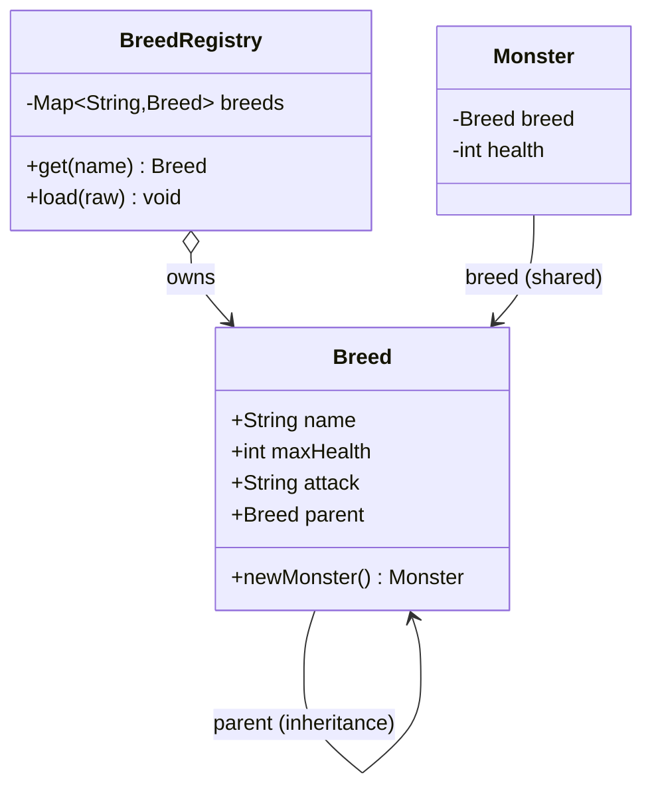

# Type Object — Middle Level

> **Source:** [gameprogrammingpatterns.com/type-object.html](https://gameprogrammingpatterns.com/type-object.html)
> **Category:** [Other (GoF-adjacent)](../README.md)

---

## Table of Contents

1. [Introduction](#introduction)
2. [Prerequisites](#prerequisites)
3. [Glossary](#glossary)
4. [Core Concepts](#core-concepts)
5. [Real-World Analogies](#real-world-analogies)
6. [Mental Models](#mental-models)
7. [Pros & Cons](#pros-cons)
8. [Use Cases](#use-cases)
9. [Code Examples](#code-examples)
10. [Coding Patterns](#coding-patterns)
11. [Clean Code](#clean-code)
12. [Best Practices](#best-practices)
13. [Edge Cases & Pitfalls](#edge-cases-pitfalls)
14. [Common Mistakes](#common-mistakes)
15. [Tricky Points](#tricky-points)
16. [Test Yourself](#test-yourself)
17. [Cheat Sheet](#cheat-sheet)
18. [Summary](#summary)
19. [Further Reading](#further-reading)
20. [Related Topics](#related-topics)
21. [Diagrams](#diagrams)

---

## Introduction

> Focus: **Sharing type data, type inheritance, the type object as a factory, and loading types from data.**

At [junior level](junior.md) you learned the shape: one `Monster` class, a `Breed` object per kind, and a `breed` reference on each monster. That's the skeleton. This level adds the three features that make Type Object worth the trouble in real systems:

1. **Sharing** — thousands of monsters, one breed object (the Flyweight win, measured).
2. **Type inheritance** — a `Breed` can have a *parent* breed and inherit/override its data.
3. **Data-driven loading** — breeds defined in JSON, loaded at startup, with no code per breed.

---

## Prerequisites

- **Required:** The junior-level Monster/Breed model.
- **Required:** Reading and parsing JSON.
- **Helpful:** [Flyweight](../../02-structural/06-flyweight/middle.md) — the sharing mechanism.
- **Helpful:** A registry/map keyed by name (`Map<String, Breed>`).

---

## Glossary

| Term | Definition |
|------|-----------|
| **Breed registry** | A map from breed name → `Breed` object; the single source of truth for kinds. |
| **Type inheritance** | A type object referencing a *parent* type object and inheriting unspecified fields. |
| **Field overriding** | A child breed specifying a field that shadows the parent's value. |
| **Copy-down delegation** | Two strategies for inheritance: copy parent fields at construction, or delegate to parent at read time. |
| **Data-driven loading** | Building type objects from JSON/DB at runtime instead of hardcoding them. |
| **Default fallback** | A sentinel type object returned when a requested kind is missing. |

---

## Core Concepts

### 1. Sharing: one Breed, many Monsters (Flyweight in practice)

The memory math is the point. Suppose a breed carries a 40-byte name, a 60-byte attack string, and a few ints — call it ~120 bytes. With 10,000 goblins:

```
Per-monster copy:   10,000 × 120 B  = 1.2 MB   (data duplicated 10,000×)
Shared breed:       10,000 × 8 B (pointer) + 120 B = ~80 KB
```

A ~15× reduction, and it grows with instance count. The breed is **immutable intrinsic state** shared across instances — textbook [Flyweight](../../02-structural/06-flyweight/middle.md).

### 2. Type inheritance among type objects

Designers want "a Troll is like a Goblin but tougher." Rather than retyping every field, a breed points at a **parent breed** and inherits anything it doesn't override:

```
Breed "Goblin"  { health: 20, attack: "stabs you" }
Breed "Troll"   { parent: Goblin, health: 48 }      // attack inherited from Goblin
```

Two ways to implement it:

- **Copy-down:** when the troll breed is constructed, copy the parent's fields in, then apply the troll's overrides. Reads are fast (no chasing parents); construction does the work once.
- **Delegation:** the troll stores only its overrides; a read that misses falls through to the parent. Lower memory, but every read may walk the chain.

Copy-down is usually right: type objects are built rarely (at load time) and read constantly (the hot path).

### 3. The type object as a factory

The breed is the natural home for "make me one of these," because it knows the starting state:

```java
Monster newMonster() { return new Monster(this); }   // stamps maxHealth, etc.
```

This is [Factory Method](../../01-creational/01-factory-method/middle.md) collapsed onto the type object: no separate factory class, the type *is* the factory.

### 4. Data-driven loading

The payoff: breeds come from a JSON file the designer edits. Adding a monster is editing data — no recompile.

```json
{
  "goblin": { "health": 20, "attack": "The goblin stabs you." },
  "troll":  { "parent": "goblin", "health": 48 }
}
```

---

## Real-World Analogies

| Concept | Analogy |
|---|---|
| **Shared type object** | One restaurant menu on the wall; 200 diners read the same menu, nobody photocopies it. |
| **Type inheritance** | A "Spicy Burger" entry that says "same as Classic Burger, plus jalapeños" — it inherits the recipe. |
| **Copy-down vs delegation** | Printing the full spicy recipe on the menu (copy-down) vs. writing "see Classic Burger" (delegation). |
| **Data-driven loading** | The kitchen reprints the menu nightly from a spreadsheet; no carpenter needed to add a dish. |

---

## Mental Models

**The breed registry is your type system, expressed as data.** In a subclass design, `class Troll extends Goblin` lives in the compiler's symbol table. In Type Object, `"troll": {"parent": "goblin"}` lives in a JSON file and a `Map<String, Breed>`. You moved the type system from compile time to load time.

```
Subclass world             Type Object world
-------------              ------------------
compiler symbol table  →   Map<String, Breed> registry
class Troll extends     →   "troll": { "parent": "goblin" }
recompile to add        →   edit JSON, reload
```

---

## Pros & Cons

| Pros | Cons |
|---|---|
| Sharing gives a real, measurable memory win | Sharing demands immutability — a discipline you must enforce |
| Type inheritance avoids data duplication across kinds | Inheritance chains can form cycles if data is wrong (Troll→Orc→Troll) |
| Data-driven loading lets designers ship content without programmers | You now own a parser + validator for designer data |
| Type object as factory removes a whole factory-class layer | Missing/typo'd type names become *runtime* errors, not compile errors |

### When to use:
- Instance counts are high enough that sharing matters.
- Kinds form natural "is-a-variant-of" families (Troll is a beefier Goblin).
- Content velocity is high — designers add kinds weekly.

### When NOT to use:
- A handful of kinds, rarely changing → subclasses are simpler and type-safe.
- Each kind needs distinct *code* → polymorphism beats data.

---

## Use Cases

- **MMO mob tables** — thousands of spawned mobs, dozens of breeds, designers tuning numbers daily.
- **Loot/item systems** — base item → rare variant → legendary variant via type inheritance.
- **Tower-defense towers** — tower tier 2 inherits tier 1's stats and overrides damage.
- **E-commerce variants** — `ProductType` with a parent category supplying default tax/shipping rules.

---

## Code Examples

### Java — sharing, inheritance, factory, JSON loading

```java
import java.util.*;

final class Breed {
    final String name;
    final int maxHealth;
    final String attack;

    // Copy-down inheritance: resolve parent fields at construction.
    Breed(String name, Integer maxHealth, String attack, Breed parent) {
        this.name = name;
        this.maxHealth = maxHealth != null ? maxHealth
                       : Objects.requireNonNull(parent, "no value and no parent").maxHealth;
        this.attack = attack != null ? attack
                    : parent.attack;
    }

    Monster newMonster() { return new Monster(this); }   // type object as factory
}

final class Monster {
    private final Breed breed;   // shared reference
    private int health;
    Monster(Breed breed) { this.breed = breed; this.health = breed.maxHealth; }
    String describe() { return breed.name + " (" + health + "/" + breed.maxHealth + "): " + breed.attack; }
}

// Registry: builds breeds from data, resolving parents.
final class BreedRegistry {
    private final Map<String, Breed> breeds = new HashMap<>();

    Breed get(String name) {
        Breed b = breeds.get(name);
        if (b == null) throw new NoSuchElementException("unknown breed: " + name);
        return b;
    }

    // 'raw' must be ordered so parents load before children (or do a topo sort).
    void load(Map<String, Map<String, Object>> raw) {
        for (var e : raw.entrySet()) {
            Map<String, Object> d = e.getValue();
            Breed parent = d.containsKey("parent") ? get((String) d.get("parent")) : null;
            breeds.put(e.getKey(), new Breed(
                e.getKey(),
                (Integer) d.get("health"),
                (String)  d.get("attack"),
                parent));
        }
    }
}
```

```java
// Usage
var reg = new BreedRegistry();
reg.load(new LinkedHashMap<>() {{
    put("goblin", Map.of("health", 20, "attack", "The goblin stabs you."));
    put("troll",  Map.of("parent", "goblin", "health", 48));  // attack inherited
}});

Monster m = reg.get("troll").newMonster();
System.out.println(m.describe());   // Troll (48/48): The goblin stabs you.
```

---

### Python — JSON-driven breeds with inheritance

```python
import json
from dataclasses import dataclass

@dataclass(frozen=True)        # immutable → safe to share
class Breed:
    name: str
    max_health: int
    attack: str

    def new_monster(self) -> "Monster":
        return Monster(self)

class Monster:
    def __init__(self, breed: Breed):
        self.breed = breed
        self.health = breed.max_health

class BreedRegistry:
    def __init__(self):
        self._breeds: dict[str, Breed] = {}

    def get(self, name: str) -> Breed:
        try:
            return self._breeds[name]
        except KeyError:
            raise KeyError(f"unknown breed: {name}") from None

    def load(self, raw: dict[str, dict]) -> None:
        # Resolve in dependency order: a child needs its parent first.
        for name in self._topo_order(raw):
            d = raw[name]
            parent = self._breeds[d["parent"]] if "parent" in d else None
            self._breeds[name] = Breed(
                name=name,
                max_health=d.get("health", parent.max_health if parent else None),
                attack=d.get("attack", parent.attack if parent else None),
            )

    @staticmethod
    def _topo_order(raw: dict[str, dict]) -> list[str]:
        ordered, seen = [], set()
        def visit(n: str, stack: set):
            if n in seen: return
            if n in stack: raise ValueError(f"breed inheritance cycle at {n}")
            stack.add(n)
            p = raw[n].get("parent")
            if p:
                if p not in raw: raise KeyError(f"{n} parent {p} not found")
                visit(p, stack)
            stack.discard(n); seen.add(n); ordered.append(n)
        for n in raw: visit(n, set())
        return ordered

reg = BreedRegistry()
reg.load(json.loads('''{
  "goblin": {"health": 20, "attack": "The goblin stabs you."},
  "troll":  {"parent": "goblin", "health": 48}
}'''))
print(vars(reg.get("troll").new_monster()))
```

---

### Go — registry, pointer sharing, copy-down inheritance

```go
package bestiary

import "fmt"

type Breed struct {
    Name      string
    MaxHealth int
    Attack    string
}

func (b *Breed) NewMonster() *Monster {
    return &Monster{breed: b, health: b.MaxHealth}
}

type Monster struct {
    breed  *Breed // pointer → shared, not copied
    health int
}

type Registry struct{ breeds map[string]*Breed }

func NewRegistry() *Registry { return &Registry{breeds: map[string]*Breed{}} }

func (r *Registry) Get(name string) (*Breed, error) {
    b, ok := r.breeds[name]
    if !ok {
        return nil, fmt.Errorf("unknown breed: %s", name)
    }
    return b, nil
}

// raw entries; parents must already be registered (caller orders them).
type rawBreed struct {
    Health *int
    Attack *string
    Parent string
}

func (r *Registry) Add(name string, raw rawBreed) error {
    b := &Breed{Name: name}
    if raw.Parent != "" {
        p, err := r.Get(raw.Parent)
        if err != nil {
            return fmt.Errorf("breed %q: %w", name, err)
        }
        *b = *p           // copy-down: inherit all parent fields...
        b.Name = name     // ...but keep our own name
    }
    if raw.Health != nil {
        b.MaxHealth = *raw.Health // override
    }
    if raw.Attack != nil {
        b.Attack = *raw.Attack
    }
    r.breeds[name] = b
    return nil
}
```

---

## Coding Patterns

### Pattern 1: Registry as the single source of truth

```java
Map<String, Breed> breeds;   // never construct Breed outside the registry
```

Everyone goes through `registry.get(name)`. No stray `new Breed(...)` scattered around.

### Pattern 2: Copy-down inheritance at load time

Resolve the parent chain once, when building the type object — not on every read.

### Pattern 3: Topological load order

A child breed needs its parent built first. Either require the data to be ordered, or topo-sort by `parent` edges (and detect cycles while you're at it).

### Pattern 4: Type object as factory

```python
monster = registry.get("troll").new_monster()
```

---

## Clean Code

### Resolve inheritance once, read it forever

```java
// ❌ Delegation on the hot path: every read walks the parent chain
int maxHealth() { return ownMaxHealth != null ? ownMaxHealth : parent.maxHealth(); }

// ✅ Copy-down: resolved at construction, reads are a plain field access
final int maxHealth;   // already includes inherited value
```

### Keep the registry the only constructor of type objects

If `Breed` can be `new`'d anywhere, you get breeds that aren't in the registry — orphans no one can look up by name. Make the constructor package-private and funnel everything through `registry.load`.

---

## Best Practices

1. **Share by reference; never copy the type object into the instance.**
2. **Make type objects immutable** — it's what makes sharing safe (`final`, `frozen=True`, no setters).
3. **Prefer copy-down inheritance** — pay the resolution cost once at load, not per read.
4. **Detect inheritance cycles at load time** and fail loudly.
5. **Centralize creation in the registry**; the registry owns the map and the parsing.
6. **Fail fast on missing breeds** — a typo in JSON should be a clear load error, not a `null` that crashes three frames later.

---

## Edge Cases & Pitfalls

- **Children loaded before parents** — `get(parent)` throws or returns null. Order the load or topo-sort.
- **Inheritance cycles** — `troll.parent=orc, orc.parent=troll`. Copy-down recurses forever; detect with a visited-set.
- **Partial override semantics** — does a child that omits `attack` inherit it, or get a default? Decide and document; ambiguity here causes silent designer confusion.
- **Mutable collections inside a breed** — a `List<Drop> loot` field that's shared *and* mutable means one monster's loot edit corrupts the breed. Wrap in an unmodifiable view.
- **Hot reload of breeds** — swapping a breed object while monsters point at the old one. See [Professional](professional.md).

---

## Common Mistakes

1. **Delegating reads to the parent on the hot path** — death by a thousand pointer-chases. Copy down.
2. **Letting a breed be mutable** because "it's just config" — config gets mutated, and now every monster of that breed is wrong.
3. **No registry** — breeds constructed ad hoc, so `get("troll")` can't find the one you made elsewhere.
4. **Ignoring load order** and getting `null` parents.
5. **Treating a missing breed as `null`** and propagating it, instead of throwing at the lookup site.

---

## Tricky Points

- **Copy-down vs delegation is the same trade as Prototype vs class inheritance.** Copy-down "flattens" the chain like cloning a prototype; delegation keeps the chain live like a class hierarchy. See [Prototype](../../01-creational/04-prototype/middle.md).
- **The registry *is* an [Abstract Factory](../../01-creational/02-abstract-factory/middle.md)** in disguise: `get(name).newMonster()` produces a family member chosen at runtime.
- **Sharing + immutability = thread safety for free.** Immutable shared breeds need no locks; only the per-instance `health` needs synchronization (see Senior).

---

## Test Yourself

1. Roughly how much memory do you save sharing one 120-byte breed across 10,000 monsters vs copying?
2. What are the two strategies for type inheritance, and which is better on the hot path?
3. Why must breeds load in topological (parent-first) order?
4. Why does sharing *require* immutability?
5. How is the registry related to Abstract Factory?

<details><summary>Answers</summary>

1. ~1.2 MB copied vs ~80 KB shared — roughly 15×, and the ratio grows with instance count.
2. Copy-down (resolve parent at construction) and delegation (chase parent on read). Copy-down is better on the hot path — reads become plain field access.
3. A child copies/reads from its parent, so the parent must already exist when the child is built.
4. Many instances point at one object; if any could mutate it, it would change every instance of that kind.
5. `registry.get(name).newMonster()` selects a "kind" at runtime and produces an instance — exactly Abstract Factory's job.

</details>

---

## Cheat Sheet

```java
// Registry-driven Type Object with copy-down inheritance
class Breed { final String name; final int maxHealth; final String attack;
    Breed(String n, Integer h, String a, Breed parent) {
        name=n; maxHealth = h!=null?h:parent.maxHealth; attack = a!=null?a:parent.attack; }
    Monster newMonster(){ return new Monster(this); } }
Map<String,Breed> registry;        // single source of truth, parents first
Monster m = registry.get("troll").newMonster();
```

```json
{ "goblin": {"health":20,"attack":"stab"},
  "troll":  {"parent":"goblin","health":48} }
```

---

## Summary

- **Sharing** one immutable breed across thousands of monsters is a real memory win (Flyweight).
- **Type inheritance** lets a breed extend a parent breed; **copy-down** beats delegation on the hot path.
- The **type object is a factory** (`newMonster()`), folding Factory Method into the type.
- **Data-driven loading** from JSON is the payoff — designers add kinds without code.
- A **registry** is the single source of truth: it parses data, resolves parents (parent-first / topo-sorted), and is the only place breeds are constructed.

---

## Further Reading

- [gameprogrammingpatterns.com/type-object.html](https://gameprogrammingpatterns.com/type-object.html) — "Inheritance" and "Constructing Monsters" sections.
- [Flyweight](../../02-structural/06-flyweight/middle.md) — the sharing mechanism in depth.
- [Prototype](../../01-creational/04-prototype/middle.md) — copy-down's conceptual cousin.

---

## Related Topics

- **Previous:** [Type Object — Junior](junior.md)
- **Next level:** [Type Object — Senior](senior.md)
- **Sharing:** [Flyweight](../../02-structural/06-flyweight/middle.md)
- **Creation:** [Factory Method](../../01-creational/01-factory-method/middle.md) · [Abstract Factory](../../01-creational/02-abstract-factory/middle.md)

---

## Diagrams



```
JSON ──load──▶ BreedRegistry ──get("troll")──▶ Breed ──newMonster()──▶ Monster
                  (parents first)             (shared, immutable)      (own health)
```

[← Junior](junior.md) · [Other Patterns](../README.md) · [Design Patterns](../../README.md) · **Next:** [Type Object — Senior](senior.md)
