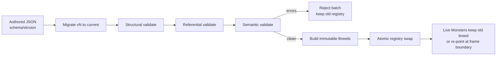
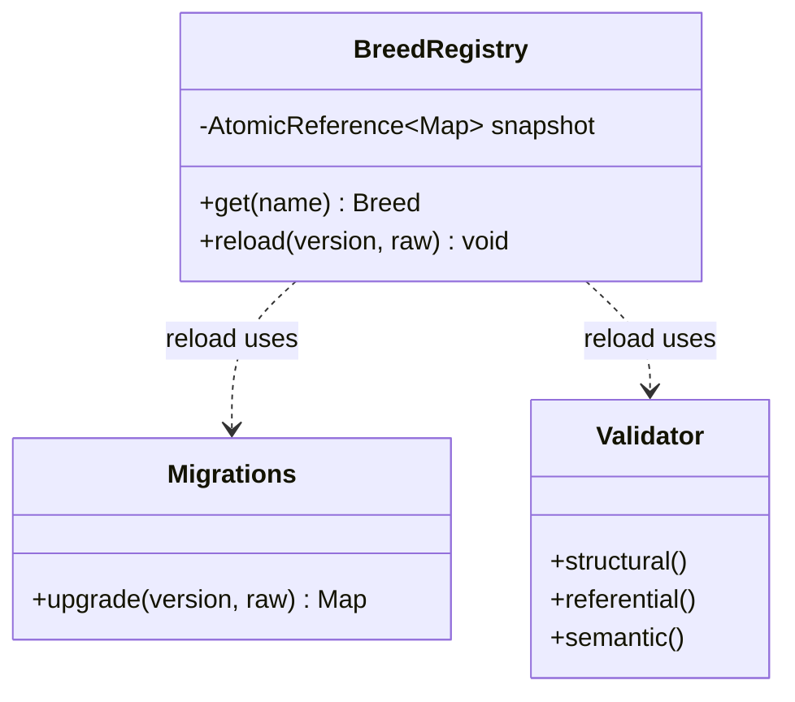

# Type Object — Professional Level

> **Source:** [gameprogrammingpatterns.com/type-object.html](https://gameprogrammingpatterns.com/type-object.html)
> **Category:** [Other (GoF-adjacent)](../README.md)

---

## Table of Contents

1. [Introduction](#introduction)
2. [Prerequisites](#prerequisites)
3. [Glossary](#glossary)
4. [Core Concepts](#core-concepts)
5. [Real-World Analogies](#real-world-analogies)
6. [Mental Models](#mental-models)
7. [Pros & Cons](#pros-cons)
8. [Use Cases](#use-cases)
9. [Code Examples](#code-examples)
10. [Coding Patterns](#coding-patterns)
11. [Clean Code](#clean-code)
12. [Best Practices](#best-practices)
13. [Edge Cases & Pitfalls](#edge-cases-pitfalls)
14. [Common Mistakes](#common-mistakes)
15. [Tricky Points](#tricky-points)
16. [Test Yourself](#test-yourself)
17. [Cheat Sheet](#cheat-sheet)
18. [Summary](#summary)
19. [Further Reading](#further-reading)
20. [Related Topics](#related-topics)
21. [Diagrams](#diagrams)

---

## Introduction

> Focus: **Data-driven architecture at scale — hot reloading, validating designer data, versioning type schemas, and where ECS supersedes Type Object.**

By [senior level](senior.md) the pattern is decided and the trade-offs are clear. The professional concern is the *system* around the type objects: the data pipeline that turns a designer's edit into a live, validated, versioned type object — safely, repeatably, and reversibly. A Type Object system in production is 20% pattern and 80% the machinery that keeps designer-authored data from becoming a runtime liability: schema validation, hot reload without corrupting live instances, schema evolution across save-game versions, and knowing the precise moment to retire it for ECS.

---

## Prerequisites

- **Required:** The senior-level model (hybrid behavior, COW registry, the subclass→ECS spectrum).
- **Required:** Schema validation tooling (JSON Schema or equivalent).
- **Helpful:** Experience with content pipelines and hot-reload systems.
- **Helpful:** Save/load and backward-compatibility concerns.

---

## Glossary

| Term | Definition |
|------|-----------|
| **Content pipeline** | The path from authored data (JSON/spreadsheet) → validated, compiled type objects in memory. |
| **Schema** | A machine-checkable contract for a type object's fields (JSON Schema, protobuf, etc.). |
| **Hot reload** | Replacing type-object data in a running process without restart and without corrupting live instances. |
| **Atomic swap** | Replacing the entire validated registry in one step so readers never see a half-applied reload. |
| **Schema version** | A version tag on the data format enabling migration of old data/saves to new schemas. |
| **Migration** | Code that upgrades data authored against schema vN to vN+1. |
| **Reference integrity** | Guarantee that every cross-reference (parent breed, drop-table id) resolves. |

---

## Core Concepts

### 1. The content pipeline: data is an input, treat it like one

Designer data is *untrusted input* to your engine — held to the same bar as user input crossing a trust boundary. The pipeline is a gauntlet:

```
authored JSON ─▶ parse ─▶ schema-validate ─▶ resolve refs ─▶ semantic-validate
              ─▶ build immutable Breed objects ─▶ atomic registry swap
```

Nothing reaches a live `Monster` until it has cleared every stage. A failed stage rejects the *whole batch* (or the changed file) and leaves the previous registry intact.

### 2. Hot reload without corrupting live instances

The subtlety: live monsters hold references to *old* breed objects. If you mutate breeds in place during reload, you race the game loop and can tear data. The correct model:

- Build a brand-new immutable registry from the new data.
- Validate it fully.
- **Atomically swap** the registry pointer.
- Decide instance policy: existing monsters keep their old breed (snapshot semantics) *or* are re-pointed to the new breed by name (live-update semantics). Both are valid; choose deliberately and document it.

Snapshot semantics (keep old breed) is safest — no live monster's invariants change mid-frame. Re-pointing is what designers usually *want* for tuning, but it must happen at a frame boundary, never mid-update.

### 3. Validating designer-authored data

Three validation layers, increasingly semantic:

1. **Structural (schema):** field exists, right type, in range. `maxHealth` is a positive int.
2. **Referential:** every `parent`, every `dropTableId`, every Strategy key resolves.
3. **Semantic / invariant:** no inheritance cycles; `minDamage <= maxDamage`; a "boss" breed has a death animation. These are domain rules a schema can't express.

Run all three at load and at reload. A failure should name the file, the breed, and the field — designers, not engineers, will read these errors.

### 4. Versioning type schemas

Type-object schemas evolve: a field is renamed, split, given a new default. Two horizons:

- **Content data on disk** — author it with a `schemaVersion`. A chain of migrations upgrades vN → vN+1 → … at load, so old content keeps working.
- **Saved instances** — a save file references breeds by name and may store breed-derived data. When a breed's schema changes, saves must migrate too, or you read garbage.

Never silently reinterpret old data under a new schema. Tag it, migrate it, or reject it.

### 5. Where ECS supersedes Type Object

Type Object scales until kinds stop being a *single axis*. The moment your breeds need flags like `canFly`, `isArmored`, `isPoisonous`, `isUndead` that combine in any of 2ⁿ ways, a monolithic per-kind type object either explodes (one breed per combination) or grows a soup of boolean flags with conditional logic everywhere. That is the **ECS** threshold: decompose into orthogonal components (`Flying`, `Armor`, `Poison`) attached per entity. Type Object answers "what kind?"; ECS answers "what components?" — and at high orthogonality, "what components?" is the better question.

---

## Real-World Analogies

| Concept | Analogy |
|---|---|
| **Content pipeline** | Airport security: every bag (data file) is screened in stages before it reaches the plane (runtime). |
| **Atomic swap on hot reload** | Publishing a website via blue-green deploy — flip traffic to the new version all at once, never serve a half-built page. |
| **Schema versioning + migration** | Database migrations: old rows are upgraded by versioned scripts, never reinterpreted in place. |
| **ECS supersession** | Moving from fixed phone models to modular phones where camera/battery/screen are swappable parts. |

---

## Mental Models

**Designer data is production input with a trust boundary.** Apply the same rigor you'd apply to an API request body: validate structurally, then referentially, then semantically; reject the batch on failure; never let unvalidated data touch a live object. The input-validation discipline transfers directly — treat the content pipeline as the boundary where untrusted data becomes trusted.

**Hot reload is a deploy, not an edit.** Treat each reload as shipping a new immutable artifact (the registry) and flipping to it atomically — not as patching the running one.

```
edit JSON ─▶ [build + validate new registry] ─▶ atomic swap ─▶ old registry GC'd
                       (off the hot path)         (one pointer)   (when no monster refs it)
```

---

## Pros & Cons

| Pros (at scale) | Cons (at scale) |
|---|---|
| Designers iterate on balance without engineering or redeploys | You own a full content pipeline: parse, validate, version, migrate |
| Hot reload shortens the tuning loop from minutes to seconds | Hot reload + live instances is genuinely hard to get race-free |
| Schema validation catches bad content before it ships | Schema evolution is an ongoing tax (migrations forever) |
| Versioning keeps old saves/content loadable | Tooling and error UX for designers is real, ongoing work |
| Clear ECS escape hatch when kinds become multi-axis | Knowing *when* to switch to ECS requires judgment; switching late is costly |

---

## Use Cases

- **Live-ops games** — weekly balance patches and event content shipped as validated data, hot-reloaded on dev, atomically deployed to prod.
- **Moddable engines** — third-party type objects validated against a published schema before loading.
- **Multi-tenant SaaS** — tenants define record types as data; schema versioning keeps existing tenants stable as the platform evolves.
- **Configuration-as-data platforms** — feature/plan "types" defined and hot-reloaded centrally.

---

## Code Examples

### Java — validated, versioned, hot-reloadable registry

```java
import java.util.*;
import java.util.concurrent.atomic.AtomicReference;

/** Immutable, fully resolved type object. */
final class Breed {
    final String name;
    final int maxHealth;
    final int minDamage, maxDamage;
    Breed(String name, int maxHealth, int minDamage, int maxDamage) {
        this.name = name; this.maxHealth = maxHealth;
        this.minDamage = minDamage; this.maxDamage = maxDamage;
    }
    Monster newMonster() { return new Monster(this); }
}

final class Monster {
    private final Breed breed;
    Monster(Breed b) { this.breed = b; }
}

/** Validation failures collected with location for designer-readable errors. */
final class ContentError {
    final String file, breed, field, message;
    ContentError(String file, String breed, String field, String message) {
        this.file = file; this.breed = breed; this.field = field; this.message = message;
    }
    public String toString() { return file + " :: " + breed + "." + field + " — " + message; }
}

final class BreedRegistry {
    // Atomic snapshot → readers are lock-free; reload swaps the whole map.
    private final AtomicReference<Map<String, Breed>> snapshot =
        new AtomicReference<>(Map.of());

    Breed get(String name) {
        Breed b = snapshot.get().get(name);
        if (b == null) throw new NoSuchElementException("unknown breed: " + name);
        return b;
    }

    /** Build + validate a new registry; swap atomically only if clean. */
    void reload(int schemaVersion, Map<String, Map<String, Object>> raw) {
        var migrated = Migrations.upgrade(schemaVersion, raw);   // version → current
        var errors = new ArrayList<ContentError>();
        var next = new HashMap<String, Breed>();

        for (var e : migrated.entrySet()) {
            String name = e.getKey();
            Map<String, Object> d = e.getValue();
            // 1. structural
            Integer hp  = asPositiveInt(d, "maxHealth", name, errors);
            Integer lo  = asPositiveInt(d, "minDamage", name, errors);
            Integer hi  = asPositiveInt(d, "maxDamage", name, errors);
            // 3. semantic invariant
            if (lo != null && hi != null && lo > hi)
                errors.add(new ContentError("breeds.json", name, "minDamage",
                           "minDamage(" + lo + ") > maxDamage(" + hi + ")"));
            if (errors.isEmpty())
                next.put(name, new Breed(name, hp, lo, hi));
        }
        // 2. referential validation would resolve parents/drop-tables here.

        if (!errors.isEmpty())
            throw new ContentValidationException(errors);   // reject batch, keep old registry

        snapshot.set(Map.copyOf(next));   // ATOMIC swap; live monsters keep old breeds (snapshot semantics)
    }

    private static Integer asPositiveInt(Map<String, Object> d, String field,
                                         String breed, List<ContentError> errs) {
        Object v = d.get(field);
        if (!(v instanceof Integer i)) {
            errs.add(new ContentError("breeds.json", breed, field, "missing or not an int"));
            return null;
        }
        if (i <= 0) { errs.add(new ContentError("breeds.json", breed, field, "must be > 0")); return null; }
        return i;
    }
}

final class ContentValidationException extends RuntimeException {
    ContentValidationException(List<ContentError> errors) { super(String.valueOf(errors)); }
}
```

The reload either fully succeeds (atomic swap) or fully fails (old registry intact). There is no partially-applied state.

---

### Go — schema-versioned content loading with migrations

```go
package content

import "fmt"

const CurrentSchema = 3

type rawBreed map[string]any

// Migrate upgrades a batch from its authored schema to CurrentSchema.
func Migrate(version int, breeds map[string]rawBreed) (map[string]rawBreed, error) {
    for v := version; v < CurrentSchema; v++ {
        switch v {
        case 1: // v1→v2: "hp" renamed to "maxHealth"
            for _, b := range breeds {
                if hp, ok := b["hp"]; ok {
                    b["maxHealth"] = hp
                    delete(b, "hp")
                }
            }
        case 2: // v2→v3: split "damage" into min/max
            for _, b := range breeds {
                if dmg, ok := b["damage"].(float64); ok {
                    b["minDamage"], b["maxDamage"] = dmg, dmg
                    delete(b, "damage")
                }
            }
        default:
            return nil, fmt.Errorf("no migration from schema v%d", v)
        }
    }
    return breeds, nil
}
```

Old content authored at v1 still loads: each migration is a small, ordered, tested step. New code never reads `hp` or `damage` directly — migrations normalize first.

---

### Python — three-layer validation with designer-readable errors

```python
from dataclasses import dataclass

@dataclass
class ContentError:
    breed: str
    field: str
    message: str
    def __str__(self): return f"breed '{self.breed}', field '{self.field}': {self.message}"

def validate_breeds(raw: dict[str, dict], strategy_keys: set[str]) -> list[ContentError]:
    errors: list[ContentError] = []
    names = set(raw)

    for name, d in raw.items():
        # 1. structural
        hp = d.get("max_health")
        if not isinstance(hp, int) or hp <= 0:
            errors.append(ContentError(name, "max_health", "must be a positive int"))
        # 2. referential
        parent = d.get("parent")
        if parent is not None and parent not in names:
            errors.append(ContentError(name, "parent", f"unknown breed '{parent}'"))
        atk = d.get("attack_kind")
        if atk is not None and atk not in strategy_keys:
            errors.append(ContentError(name, "attack_kind", f"unknown strategy '{atk}'"))

    # 3. semantic: detect inheritance cycles
    def has_cycle(start: str) -> bool:
        seen, cur = set(), start
        while cur is not None:
            if cur in seen: return True
            seen.add(cur); cur = raw.get(cur, {}).get("parent")
        return False
    for name in raw:
        if has_cycle(name):
            errors.append(ContentError(name, "parent", "inheritance cycle"))

    return errors   # empty == safe to build & swap
```

---

## Coding Patterns

### Pattern 1: Build-validate-swap, never patch-in-place

Construct a complete new immutable registry, validate it whole, then swap one pointer atomically. Reload is all-or-nothing.

### Pattern 2: Versioned data + migration chain

Every data file carries `schemaVersion`; a chain of small migrations normalizes any old version to current before validation.

### Pattern 3: Three-layer validation with located errors

Structural → referential → semantic. Every error names file/breed/field so designers can self-serve fixes.

### Pattern 4: Documented instance-reload policy

Pick snapshot (keep old breed) or live-update (re-point by name at a frame boundary) — and write it down. Silent ambiguity here is a bug magnet.

### Pattern 5: The ECS escape hatch

When breeds sprout orthogonal boolean traits, migrate the multi-axis ones to components rather than multiplying breeds or flags.

---

## Clean Code

### Make invalid content unrepresentable in memory

```java
// ❌ Validate lazily, deep in gameplay — crashes far from the cause
int dmg = monster.breed.maxDamage;     // NPE three systems away if data was bad

// ✅ Only validated, fully-resolved Breeds ever exist; the type guarantees it
final class Breed { final int maxDamage; /* set only after validation passes */ }
```

If a `Breed` object exists, it is valid — validation lives at the boundary, not scattered through gameplay. The runtime never defends against malformed breeds because malformed breeds never get constructed.

---

## Best Practices

1. **Treat designer data as untrusted input** with a full validation gauntlet at the boundary.
2. **Reload = build-validate-atomic-swap.** Never mutate live breeds in place.
3. **Version every schema; migrate, never reinterpret.** Old content and old saves must keep loading.
4. **Produce designer-readable errors** naming file, breed, and field.
5. **Document the instance-reload policy** (snapshot vs re-point) explicitly.
6. **Watch the ECS threshold** — orthogonal traits are the signal to decompose, not to add flags.
7. **Make invalid content unrepresentable** — if a `Breed` exists, it passed validation.

---

## Edge Cases & Pitfalls

- **Reload mid-frame** — swapping while the update loop reads breeds; swap only at frame boundaries and rely on atomic snapshot + immutability.
- **Save references a deleted breed** — a content patch removed "goblin_v1" but old saves spawn it. Keep deprecated breeds or provide a migration mapping.
- **Migration that loses data** — v2→v3 splitting `damage` into min/max guesses both equal; if that's wrong for some breeds, designers must re-author. Migrations should be explicit about lossiness.
- **Validation that passes structurally but violates an invariant** — `minDamage > maxDamage` parses fine; only semantic validation catches it.
- **Cross-file reference order** — breed A in file 1 inherits from breed B in file 2; resolve references *after* merging all files, not per file.
- **Hot reload leaking old registries** — if anything caches the old map beyond live monsters, it never GCs. Hold the registry behind one accessor.

---

## Common Mistakes

1. **Patching breeds in place on reload** — races the game loop, tears data, corrupts live instances.
2. **Reinterpreting old data under a new schema** without a version tag — silent data corruption.
3. **Validating in gameplay** instead of at load — crashes land far from the bad field.
4. **No located errors** — designers get a stack trace, file a ticket, and engineering becomes the content bottleneck (defeating the whole point of Type Object).
5. **Multiplying breeds for trait combinations** (flying-armored-goblin, flying-poison-goblin…) instead of moving to ECS.
6. **Forgetting saves** — migrating content schemas but not the saved instances that reference them.

---

## Tricky Points

- **Snapshot vs live-update reload semantics is a design choice with no universal right answer.** Snapshot preserves in-flight invariants (a monster mid-attack keeps consistent stats); live-update gives designers instant feedback. Many engines do snapshot in prod, live-update in the editor.
- **Schema versioning of *content* and of *saves* are two separate migration problems.** Content migrations run every load; save migrations run once per save upgrade. Conflating them breaks one or the other.
- **Type Object → ECS is a refactor, not a tweak.** It re-shapes data layout, serialization, and every system that reads `monster.breed.x`. Plan it; don't drift into it. The senior-level spectrum's rightmost step has real cost.
- **Atomicity is only as strong as your weakest reader.** If one system reads two fields off the breed across the swap and you ever mutated in place, it could see a torn pair. Immutability + pointer swap is what makes the read atomic.

---

## Test Yourself

1. Why is designer data treated as untrusted input, and what are the three validation layers?
2. Describe the safe hot-reload sequence and why in-place mutation is wrong.
3. What two *separate* schema-versioning problems does a Type Object system have?
4. What are snapshot vs live-update reload semantics, and when would you pick each?
5. What is the precise signal that you should move from Type Object to ECS?

<details><summary>Answers</summary>

1. It crosses a trust boundary into the engine, so it gets the same rigor as API input. Layers: structural (schema — field present, typed, in range), referential (all cross-refs resolve), semantic (domain invariants like no cycles, minDamage ≤ maxDamage).
2. Build a complete new immutable registry → validate it whole → atomically swap one pointer; reject the batch on any error, leaving the old registry intact. In-place mutation races the game loop and can tear data read by live monsters.
3. Migrating *content data* on disk (runs every load) and migrating *saved instances* that reference breeds (runs on save upgrade). They're distinct migration pipelines.
4. Snapshot keeps live instances on their old breed (stable invariants); live-update re-points instances to the new breed by name at a frame boundary (instant tuning). Snapshot for prod safety; live-update for the editor's fast loop.
5. When kinds become free combinations of orthogonal traits (2ⁿ combos), so a per-kind type object either explodes into one breed per combination or rots into flag-soup — decompose into ECS components.

</details>

---

## Cheat Sheet

```
Pipeline : authored data ─▶ parse ─▶ schema(structural) ─▶ refs(referential)
                          ─▶ invariants(semantic) ─▶ build immutable Breeds ─▶ ATOMIC swap
Reload   : build-validate-swap (all-or-nothing); NEVER mutate live breeds in place.
Versioning: schemaVersion on data; migrate vN→current; migrate SAVES separately.
Reload semantics: snapshot (keep old breed) | live-update (re-point by name @ frame boundary).
ECS signal: kinds = free combos of orthogonal traits → decompose into components.
Invariant: if a Breed object exists, it is valid (validate at boundary, not in gameplay).
```

---

## Summary

- A production Type Object system is mostly the **content pipeline**: parse → structural → referential → semantic validation → build immutable type objects → **atomic swap**.
- **Hot reload** is build-validate-swap (all-or-nothing); **never mutate live breeds in place** — it races the game loop.
- **Version schemas** and migrate; handle **content data** and **saved instances** as two separate migration problems; never reinterpret old data silently.
- Choose and **document** the instance-reload policy: snapshot vs live-update.
- **Validate at the boundary** so invalid content is unrepresentable in memory.
- When kinds become **orthogonal trait combinations**, Type Object is superseded by **ECS** — a deliberate refactor, not flag-soup.

---

## Further Reading

- [gameprogrammingpatterns.com/type-object.html](https://gameprogrammingpatterns.com/type-object.html) — the design-decisions section.
- *Game Programming Patterns*, "Component" chapter — the ECS successor.
- JSON Schema / protobuf docs — schema validation and evolution mechanics.
- [Prototype](../../01-creational/04-prototype/professional.md) — copy-down inheritance's deep cousin.

---

## Related Topics

- **Previous:** [Type Object — Senior](senior.md)
- **Interview prep:** [Type Object — Interview](interview.md)
- **Successor at scale:** *Component / ECS* (see *Game Programming Patterns*)
- **Sharing:** [Flyweight](../../02-structural/06-flyweight/professional.md)
- **Creation:** [Abstract Factory](../../01-creational/02-abstract-factory/professional.md)

---

## Diagrams





[← Senior](senior.md) · [Other Patterns](../README.md) · [Design Patterns](../../README.md) · **Next:** [Type Object — Interview](interview.md)
