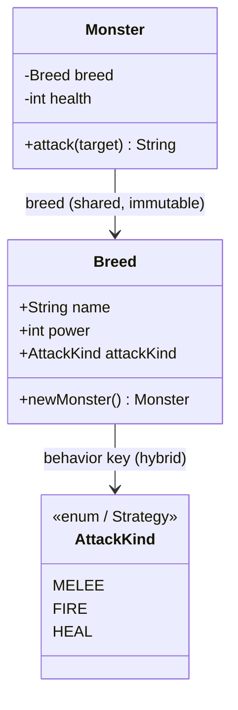

# Type Object — Senior Level

> **Source:** [gameprogrammingpatterns.com/type-object.html](https://gameprogrammingpatterns.com/type-object.html)
> **Category:** [Other (GoF-adjacent)](../README.md)

---

## Table of Contents

1. [Introduction](#introduction)
2. [Prerequisites](#prerequisites)
3. [Glossary](#glossary)
4. [Core Concepts](#core-concepts)
5. [Real-World Analogies](#real-world-analogies)
6. [Mental Models](#mental-models)
7. [Pros & Cons](#pros-cons)
8. [Use Cases](#use-cases)
9. [Code Examples](#code-examples)
10. [Coding Patterns](#coding-patterns)
11. [Clean Code](#clean-code)
12. [Best Practices](#best-practices)
13. [Edge Cases & Pitfalls](#edge-cases-pitfalls)
14. [Common Mistakes](#common-mistakes)
15. [Tricky Points](#tricky-points)
16. [Test Yourself](#test-yourself)
17. [Cheat Sheet](#cheat-sheet)
18. [Summary](#summary)
19. [Further Reading](#further-reading)
20. [Related Topics](#related-topics)
21. [Diagrams](#diagrams)

---

## Introduction

> Focus: **Trade-offs vs subclassing / Strategy / ECS, where Type Object pays, and the sharing/immutability/registration concerns at scale.**

Junior gave you the shape; [middle](middle.md) gave you sharing, inheritance, and data loading. The senior question is not *how* — it's *whether*. Type Object sits at a fork: it buys data-driven flexibility by *spending* compile-time type safety and per-kind code. This level is about judging that trade against the three patterns it competes with — **subclassing**, **Strategy**, and **Entity-Component-System** — and about the concurrency and lifecycle concerns that only surface once the system is real.

---

## Prerequisites

- **Required:** The middle-level registry + inheritance + factory model.
- **Required:** Comfort with polymorphism and interfaces (the thing Type Object replaces).
- **Helpful:** Concurrency basics — shared immutable vs shared mutable state.
- **Helpful:** Familiarity with composition-over-inheritance and component systems.

---

## Glossary

| Term | Definition |
|------|-----------|
| **Type safety (lost)** | The compiler can't check "is this a valid kind?" — a breed name is a string, not a type. |
| **Behavioral type object** | A type object that carries *code* (a function pointer / Strategy), not just data. |
| **Hybrid (data + behavior)** | A type object whose data is custom but whose code comes from a small fixed set of strategies. |
| **Runtime type registration** | Adding new type objects to the registry while the program runs (mods, plugins, hot reload). |
| **ECS** | Entity-Component-System — data and behavior decomposed into orthogonal components; supersedes Type Object at scale. |
| **Intrinsic vs extrinsic state** | Flyweight terms: intrinsic (shared, on the type) vs extrinsic (per-instance, passed in). |

---

## Core Concepts

### 1. The core trade: data flexibility vs code expressiveness

Subclassing and Type Object are duals. Subclassing makes *kinds* first-class to the compiler — you get type checking, per-kind methods, and IDE navigation, at the cost of a recompile per kind and no runtime authoring. Type Object makes kinds first-class to *data* — runtime authoring, designer ownership, no recompile, at the cost of the compiler's help.

```
                 Type-safe?  Per-kind code?  Add kind at runtime?  Designer-friendly?
Subclassing         yes          yes               no                   no
Type Object         no           limited           yes                  yes
```

The decision rule: **do kinds differ by data or by behavior?** Data → Type Object. Behavior → subclassing/Strategy.

### 2. When kinds need *some* behavior: the hybrid

Pure data is rarely enough. A "healer" monster and a "fire-breather" do genuinely different things. The honest answer is a **hybrid**: keep the data on the type object, but let it reference one of a *small, fixed* set of behaviors — a [Strategy](../../03-behavioral/). The set is closed (programmers maintain it); which strategy a breed uses is data (designers choose it).

```
Breed { data..., attackStrategy: "fire" }   // "fire" picks a FireAttack Strategy object
```

This keeps designers in control of *composition* while programmers control *behavior*. If the behavior set becomes large and open-ended, you've outgrown Type Object — that's the ECS signal.

### 3. Runtime type registration

The flexibility argument only fully cashes out when you can register *new* breeds without restarting: mods, DLC, live-ops content drops. That means the registry is mutated at runtime, which raises concurrency: readers (the game loop) vs writers (the loader). Because breeds are immutable, the safe move is **copy-on-write the registry map**, not lock every read.

### 4. Sharing & immutability are load-bearing, not optional

At scale the shared breed is read by many threads (render, AI, physics). If it's immutable, that's lock-free. The instant a breed becomes mutable, every reader needs synchronization and you've lost both the safety and the performance. Immutability isn't a nicety here — it's what makes sharing sound.

---

## Real-World Analogies

| Concept | Analogy |
|---|---|
| **Data vs behavior trade** | A spreadsheet (data, anyone edits, no logic) vs a program (logic, engineers only, compiled). |
| **Hybrid type object** | A recipe card (data) that says "cook using method #3" where methods are a fixed kitchen technique list. |
| **Runtime registration** | A streaming service adding a new content category overnight without redeploying the app. |
| **ECS supersession** | Lego: instead of "kinds of vehicle," you have wheels, engines, wings as components you mix freely. |

---

## Mental Models

**Type Object is a spectrum, not a switch.** Move along it as your needs grow:

```
Subclasses ── Type Object (pure data) ── Type Object + Strategy ── ECS
 few fixed     many data-driven kinds     kinds need some code     kinds = free composition
 kinds                                                              of orthogonal traits
```

Each step trades more compiler help for more runtime flexibility. Pick the *leftmost* point that meets your needs — every step right adds indirection and removes type checking.

**The "is the compiler helping you or fighting you?" test.** If kinds change constantly and the compiler's per-kind classes feel like bureaucracy, move right. If kinds are stable and you keep wishing for type checks on breed names, you moved right too far.

---

## Pros & Cons

| Pros | Cons |
|---|---|
| Runtime / data-driven kinds; mods and live content possible | No compile-time check that a breed name or field is valid |
| Immutable shared type data → lock-free reads across threads | Per-kind *behavior* needs a hybrid (Strategy); pure data can't express it |
| Designers own content; programmers own the engine | Indirection (`monster.breed.x`) and weaker IDE navigation |
| Flat hierarchy — no class explosion, no deep inheritance | At scale, kinds-as-monolithic-types fight orthogonal composition → ECS |
| Type inheritance dedups data | You own validation, versioning, and registration machinery |

### When Type Object pays:
- Many kinds, differing **mainly in data**, authored by **non-programmers**, **not all known at compile time**.

### When it doesn't:
- **Few fixed kinds** → subclasses (keep the compiler).
- **Kinds need rich, divergent code** → polymorphism or Strategy.
- **Kinds are combinations of independent traits** (flying + armored + poisonous in any mix) → **ECS**.

---

## Use Cases

- **Live-service games** — breeds/items hot-loaded; balance patches ship as data, not binaries.
- **Modding platforms** — third parties register new types at runtime against a fixed engine.
- **Configurable SaaS entities** — tenants define custom "record types" (fields, rules) as data.
- **Rules engines** — rule "types" defined in data, each bound to one of a fixed set of evaluators (hybrid).

---

## Code Examples

### Java — hybrid type object (data + Strategy)

```java
import java.util.*;
import java.util.function.*;

// Closed set of behaviors — programmers own this.
enum AttackKind {
    MELEE   ((m, target) -> target + " is struck for " + m.power() + "."),
    FIRE    ((m, target) -> target + " burns for " + (m.power() * 2) + "!"),
    HEAL    ((m, target) -> m.breed().name + " heals itself.");

    final BiFunction<Monster, String, String> fn;
    AttackKind(BiFunction<Monster, String, String> fn) { this.fn = fn; }
}

final class Breed {
    final String name;
    final int power;
    final AttackKind attackKind;   // data chooses behavior from the fixed set
    Breed(String name, int power, AttackKind kind) {
        this.name = name; this.power = power; this.attackKind = kind;
    }
    Monster newMonster() { return new Monster(this); }
}

final class Monster {
    private final Breed breed;
    Monster(Breed b) { this.breed = b; }
    Breed breed() { return breed; }
    int power()    { return breed.power; }
    String attack(String target) { return breed.attackKind.fn.apply(this, target); }
}
```

```java
Breed dragon = new Breed("Dragon", 40, AttackKind.FIRE);
Breed cleric = new Breed("Cleric", 0,  AttackKind.HEAL);
System.out.println(dragon.newMonster().attack("the hero"));  // the hero burns for 80!
```

The breed data (`"FIRE"`) is designer-authored; the *implementation* of fire is engineer-owned. That's the hybrid line.

---

### Go — copy-on-write registry for safe runtime registration

```go
package bestiary

import (
    "fmt"
    "sync/atomic"
)

type Breed struct { // immutable after construction
    Name  string
    Power int
}

// Registry holds an immutable map snapshot in an atomic pointer.
// Readers never lock; writers swap the whole map (copy-on-write).
type Registry struct {
    snapshot atomic.Pointer[map[string]*Breed]
}

func NewRegistry() *Registry {
    r := &Registry{}
    m := map[string]*Breed{}
    r.snapshot.Store(&m)
    return r
}

// Get is lock-free; safe to call from the game loop every frame.
func (r *Registry) Get(name string) (*Breed, bool) {
    m := *r.snapshot.Load()
    b, ok := m[name]
    return b, ok
}

// Register copies the map, adds the breed, atomically swaps. Rare path (mods/hot reload).
func (r *Registry) Register(b *Breed) error {
    for {
        old := r.snapshot.Load()
        if _, exists := (*old)[b.Name]; exists {
            return fmt.Errorf("breed already registered: %s", b.Name)
        }
        next := make(map[string]*Breed, len(*old)+1)
        for k, v := range *old {
            next[k] = v
        }
        next[b.Name] = b
        if r.snapshot.CompareAndSwap(old, &next) {
            return nil
        }
        // lost the race; retry
    }
}
```

Immutable breeds make this sound: readers see a consistent snapshot, writers never mutate in place, no reader lock.

---

### Python — choosing between Type Object and subclasses, in code

```python
# Subclass design: justified when each kind has REAL custom behavior.
class Monster:
    def on_death(self): ...

class Lich(Monster):
    def on_death(self):
        self.resurrect_once()          # genuinely different code → subclass

# Type Object design: justified when kinds differ by DATA.
from dataclasses import dataclass

@dataclass(frozen=True)
class Breed:
    name: str
    max_health: int
    xp_reward: int                     # pure data → type object

# Hybrid: data + a key into a fixed behavior table (best of both for "some" behavior).
DEATH_EFFECTS = {
    "none":       lambda m: None,
    "explode":    lambda m: m.world.damage_nearby(m.pos, 30),
    "resurrect":  lambda m: m.resurrect_once(),
}

@dataclass(frozen=True)
class HybridBreed:
    name: str
    max_health: int
    on_death_key: str                  # data picks a closed-set behavior
    def on_death(self, m): DEATH_EFFECTS[self.on_death_key](m)
```

---

## Coding Patterns

### Pattern 1: Hybrid — data on the type, behavior via Strategy

Carry a key/enum on the type object that selects from a fixed strategy table. Designers compose; programmers implement.

### Pattern 2: Copy-on-write registry

Readers lock-free against an atomic snapshot; writers build a new map and swap. Correct only because breeds are immutable.

### Pattern 3: Validation gate at registration

Every breed entering the registry passes a validator (required fields present, references resolvable, no cycles). Bad data never becomes a live breed.

### Pattern 4: The "leftmost point" decision

Default to subclasses; escalate to Type Object only when kinds become data-driven; add Strategy only when some behavior varies; reach for ECS only when traits compose freely.

---

## Clean Code

### Don't fake behavior with `if (breed.name == "...")`

```java
// ❌ Switching on breed identity — you've reinvented subclassing, badly
if (monster.breed().name.equals("Dragon")) breatheFire();
else if (monster.breed().name.equals("Cleric")) heal();

// ✅ Behavior is data on the type, dispatched uniformly
monster.attack(target);   // breed.attackKind does the right thing
```

A chain of `breed.name` comparisons means behavior wants to live on the type — promote it to a Strategy key. Name-switching defeats the entire pattern: you've coupled engine code to specific data again.

---

## Best Practices

1. **Keep type objects immutable.** It's the precondition for lock-free sharing across threads.
2. **For per-kind behavior, use a hybrid** (data + a key into a closed Strategy set), not name-switching.
3. **Validate at registration**, not at first use — fail loud and early.
4. **Copy-on-write the registry** for runtime registration; never mutate a live map under readers.
5. **Choose the leftmost adequate point** on the subclass→ECS spectrum; resist over-flexibility.
6. **Document which fields a designer may set** and which are engine-computed.

---

## Edge Cases & Pitfalls

- **A breed referencing a Strategy key that doesn't exist** — validate keys against the table at load.
- **Mutable component inside an immutable breed** (a slice/list shared by ref) — defensively copy or use unmodifiable views.
- **Registry reads racing a write** — only safe with COW + immutable breeds; a plain mutable map is a data race.
- **Behavior creep** — designers keep asking for one-off behaviors; each becomes a new Strategy until the table is unmanageable. That's the ECS threshold, not "add another enum value."
- **Breed identity equality** — comparing two *monsters* by their breed pointer (`m1.breed == m2.breed`) answers "same kind?", but comparing *breeds* across a hot reload may surprise you (old vs new object). Compare by name if identity must survive reload.

---

## Common Mistakes

1. **Switching on `breed.name`** instead of putting behavior on the type — re-coupling engine to data.
2. **Making breeds mutable** "for tuning at runtime," then debugging cross-instance corruption and races.
3. **Reaching for Type Object with three fixed kinds** — you gave up the compiler for nothing.
4. **Reaching for subclasses when content velocity is high** — designers blocked on programmers for every monster.
5. **Pushing pure-data Type Object past its limit** when traits compose orthogonally — that's ECS's job, not more enum flags.

---

## Tricky Points

- **Type Object vs Strategy.** Strategy varies an *algorithm* behind an interface; Type Object varies a *kind* via shared data. The hybrid uses Strategy *inside* the type object — they compose, they don't compete.
- **Type Object vs ECS.** Type Object groups all of a kind's data into one monolithic type. ECS shatters that into orthogonal components you mix per entity. Type Object answers "what kind is this?"; ECS answers "what components does this have?" When kinds are really *combinations* of independent traits, ECS wins.
- **The Flyweight is exact, not loose.** The breed *is* the Flyweight's intrinsic state; the monster's `health` is extrinsic. Type Object is Flyweight applied to the "kind" concept.
- **Losing type safety is the price, not a bug.** If you find yourself reintroducing per-breed classes for "safety," reconsider whether you needed Type Object at all.

---

## Test Yourself

1. State the one-line decision rule for Type Object vs subclassing.
2. What is a "hybrid" type object and what problem does it solve?
3. Why is copy-on-write the right registry strategy for runtime registration, and what makes it sound?
4. How do Type Object and Strategy relate — compete or compose?
5. What signal tells you you've outgrown Type Object and should move to ECS?

<details><summary>Answers</summary>

1. Do kinds differ by *data* (→ Type Object) or by *behavior/code* (→ subclassing/Strategy)?
2. A type object carrying data *plus* a key into a fixed set of Strategies. It lets designers compose behavior from an engineer-owned, closed set — covering "some" per-kind behavior without abandoning data-driven kinds.
3. Readers (the game loop) must be lock-free; COW swaps an immutable snapshot so readers never see a partial map. It's sound only because breeds are immutable and the map swap is atomic.
4. They compose: the hybrid puts a Strategy *inside* the type object. Strategy varies an algorithm; Type Object varies a kind.
5. When kinds become *free combinations of orthogonal traits* (any mix of flying/armored/poisonous), so a single monolithic type per kind causes a combinatorial explosion — switch to ECS components.

</details>

---

## Cheat Sheet

```
Decision: kinds differ by DATA → Type Object;  by BEHAVIOR → subclass/Strategy;
          kinds = free combos of traits → ECS.
Spectrum: subclasses ─ TypeObject(data) ─ TypeObject+Strategy ─ ECS   (pick leftmost adequate)
Sharing : immutable breed → lock-free reads;  registry = copy-on-write for runtime registration.
Behavior: hybrid = data on type + key into a FIXED Strategy table (never switch on breed.name).
```

---

## Summary

- Type Object trades **compile-time safety + per-kind code** for **data-driven, runtime, designer-authored kinds**.
- The decision rule: kinds vary by **data → Type Object**, by **behavior → subclass/Strategy**, by **orthogonal traits → ECS**.
- For *some* per-kind behavior, use a **hybrid**: data on the type object plus a key into a fixed **Strategy** set — never `if breed.name == ...`.
- **Immutability** makes shared breeds lock-free; **copy-on-write** makes runtime registration sound.
- Pick the **leftmost adequate** point on the subclass→ECS spectrum; every step right costs type safety and adds indirection.

---

## Further Reading

- [gameprogrammingpatterns.com/type-object.html](https://gameprogrammingpatterns.com/type-object.html) — "Design Decisions" section weighs these trades.
- [Strategy](../../03-behavioral/) — the behavior half of the hybrid.
- [Flyweight](../../02-structural/06-flyweight/senior.md) — the precise sharing relationship.
- *Game Programming Patterns*, "Component" chapter — the ECS direction.

---

## Related Topics

- **Previous:** [Type Object — Middle](middle.md)
- **Next level:** [Type Object — Professional](professional.md)
- **Behavior:** [Strategy](../../03-behavioral/)
- **Sharing:** [Flyweight](../../02-structural/06-flyweight/senior.md)
- **Creation:** [Abstract Factory](../../01-creational/02-abstract-factory/senior.md)

---

## Diagrams



```
subclasses ──▶ Type Object ──▶ Type Object + Strategy ──▶ ECS
  type-safe        data-driven        + per-kind behavior      free trait
  few kinds        many kinds         (closed set)             composition
```

[← Middle](middle.md) · [Other Patterns](../README.md) · [Design Patterns](../../README.md) · **Next:** [Type Object — Professional](professional.md)
