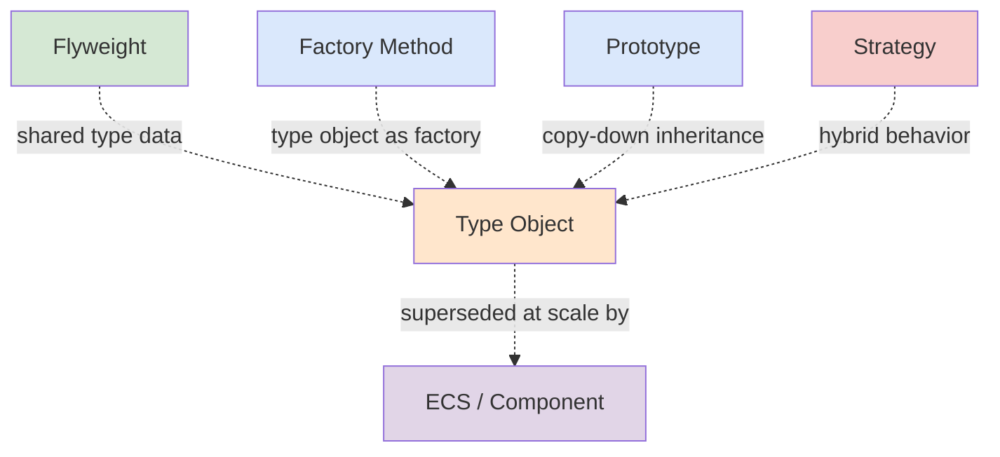

# Other Patterns (GoF-adjacent)

> *"The Gang of Four catalog is not the whole story. Real systems lean on patterns the GoF never named."*

---

## What Are "Other" Patterns?

The four classic categories — [Creational](../01-creational/README.md), [Structural](../02-structural/README.md), [Behavioral](../03-behavioral/README.md) — cover the original 23 Gang of Four patterns. But the patterns engineers actually reach for extend well beyond that catalog. **Other patterns** collects the GoF-*adjacent* ones: patterns that solve the same class of problems (object creation, structure, behavior) but were popularized later, in other communities — game development, data-driven systems, domain modeling.

They share the GoF's vocabulary and rigor; they just weren't in the 1994 book.

### Why a separate category?

Two reasons:

1. **Lineage.** These patterns build on or recombine GoF ideas. Type Object, for instance, is essentially [Flyweight](../02-structural/06-flyweight/junior.md) applied to the concept of "kind," with a dash of [Factory](../01-creational/01-factory-method/junior.md).
2. **Different problem framing.** GoF patterns mostly answer "how do I structure code?" These often answer "how do I move variation *out* of code and into *data*?" — the data-driven mindset that dominates games, config-heavy platforms, and modding.

---

## The Patterns

| Pattern | Intent (one line) | Key Question Answered |
|---|---|---|
| [Type Object](01-type-object/junior.md) | Define "kinds of things" as data objects instead of subclasses | "How do I add new kinds without writing new code?" |

*(This category grows as more GoF-adjacent patterns are added.)*

---

## When to Use These Patterns

| Symptom | Pattern to consider |
|---|---|
| A class hierarchy exploding into dozens of near-identical subclasses that differ only in data | **Type Object** |
| Non-programmers (designers) need to author new "kinds" without engineering involvement | **Type Object** |
| New kinds must be definable at runtime, from JSON/DB/config, without recompiling | **Type Object** |

---

## Relationship to the GoF Catalog

- **[Flyweight](../02-structural/06-flyweight/junior.md)** — the shared, immutable type object *is* a Flyweight (intrinsic state).
- **[Factory Method](../01-creational/01-factory-method/junior.md)** — the type object doubles as a factory (`breed.newMonster()`).
- **[Prototype](../01-creational/04-prototype/junior.md)** — copy-down type inheritance mirrors cloning a prototype.
- **[Strategy](../03-behavioral/)** — hybrid type objects carry a key into a fixed Strategy set for per-kind behavior.
- **Entity-Component-System** — supersedes Type Object when kinds become free combinations of orthogonal traits.

---

## Common Mistakes

1. **Reaching for Type Object with a few fixed kinds** — you lose compile-time safety for no benefit; use subclasses.
2. **Trying to express genuinely different *behavior* as pure data** — that's polymorphism/Strategy's job, not Type Object's.
3. **Mutating shared type objects** — they're shared by every instance; keep them immutable.
4. **Pushing Type Object past orthogonal-trait combinations** — that's the ECS threshold, not more flags.

---

## Pattern Files

- 01-type-object/ — Type Object

[← Back to Design Patterns](../README.md) · [↑ Roadmap Home](../../README.md)
