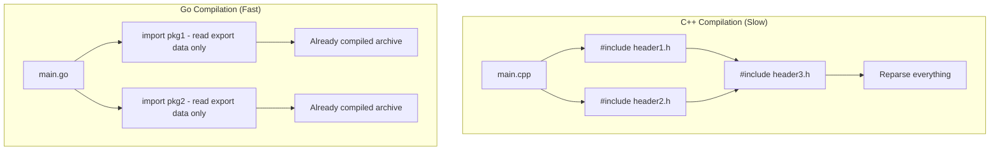
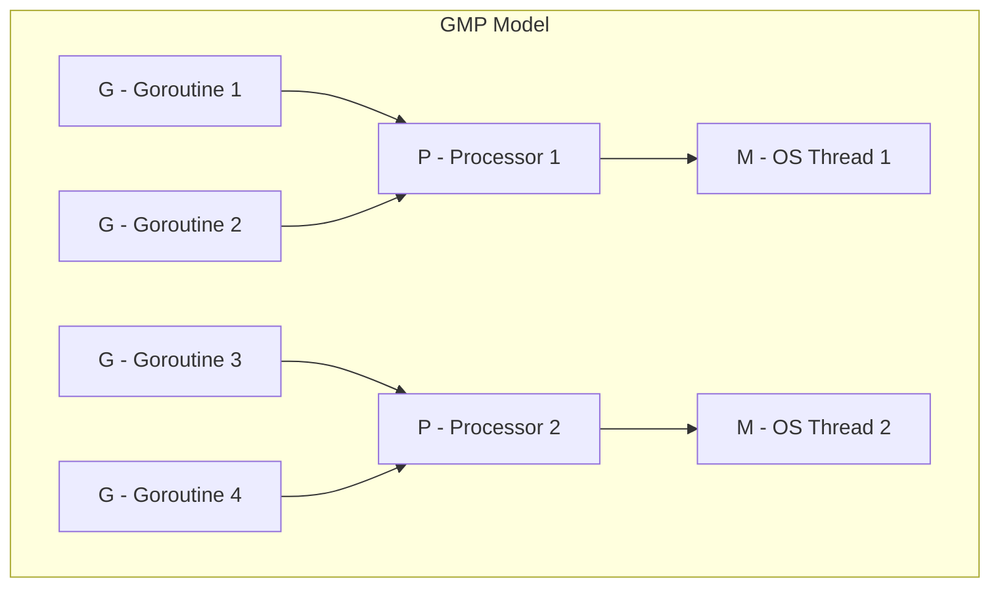

# Why Use Go — Under the Hood

## Table of Contents

1. [Introduction](#introduction)
2. [Fast Compilation: Why Builds Stay Quick](#fast-compilation-why-builds-stay-quick)
3. [Cheap Goroutines: Why Concurrency Scales](#cheap-goroutines-why-concurrency-scales)
4. [Low-Pause GC: Why Latency Stays Predictable](#low-pause-gc-why-latency-stays-predictable)
5. [Single Static Binary: Why Deployment Is Trivial](#single-static-binary-why-deployment-is-trivial)
6. [Test](#test)
7. [Tricky Questions](#tricky-questions)
8. [Summary](#summary)
9. [Further Reading](#further-reading)

---

## Introduction

> Focus: "Why do Go's internals make it a good choice?"

This document looks under the hood at Go — but only far enough to explain *why* its internal design makes it a compelling language to choose. Each section ties a runtime or compiler decision back to a practical reason to use Go:

- **Fast builds** come from a simple compilation model (no header files, DAG imports) → faster iteration.
- **Cheap goroutines** come from an M:N scheduler and tiny growable stacks → easy, scalable concurrency.
- **Low-pause GC** comes from a concurrent collector → predictable latency for services.
- **Trivial deployment** comes from shipping a single static binary → just copy and run.

The deep mechanics of each subsystem (scheduler source, GC write barriers, escape analysis, assembly) live in their own dedicated sections later in the roadmap. Here we stay at the level of *implications for the decision to use Go*.

---

## Fast Compilation: Why Builds Stay Quick

Go's fast compilation is not accidental — it is the result of deliberate design decisions that keep the compiler from re-doing work:

1. **No header files:** Go reads only the source files in the current package plus the *exported* symbols of imported packages (from precompiled archive files). It never reparses a dependency's full source the way C/C++ reparses `#include`d headers.
2. **Import graph is a DAG:** No circular imports are allowed, which enables packages to be compiled in parallel.
3. **Simple grammar:** Only 25 keywords and no ambiguous syntax, so parsing is cheap.
4. **Package-level compilation with caching:** Each package compiles independently, so the build cache can skip anything unchanged.
5. **Unused imports are errors:** The compiler never pulls in code that is not actually needed.



**Why this is a reason to choose Go:** fast builds shorten the edit-compile-run loop. On large codebases where C++ or Rust builds take minutes, comparable Go projects often build in seconds, which keeps developers in flow and makes CI cheaper.

---

## Cheap Goroutines: Why Concurrency Scales

Go's concurrency story rests on two cheap things: the goroutine itself and the way goroutines are scheduled onto threads.

**Tiny, growable stacks.** A goroutine starts with a stack of about 2KB, versus the ~1MB default stack of an OS thread. When a goroutine needs more space, the runtime allocates a larger stack and copies the old one over, adjusting pointers automatically. This means you can have hundreds of thousands of goroutines resident in memory at once — something you simply cannot do with OS threads.

**M:N scheduling (the GMP model).** The runtime multiplexes many goroutines (G) onto a small number of OS threads (M), coordinated by logical processors (P, one per `GOMAXPROCS`). You write straightforward blocking-style code, and the scheduler parks blocked goroutines and runs others on the same thread.



A direct payoff is networking. When a goroutine waits on I/O, the runtime parks it and frees the OS thread to run other goroutines, resuming the parked one when data arrives. So 100K concurrent connections cost ~100K × 2KB of goroutine memory and a handful of threads — not 100K full OS threads.

```go
// Launching ten thousand concurrent tasks is routine in Go.
var wg sync.WaitGroup
for i := 0; i < 10_000; i++ {
    wg.Add(1)
    go func(id int) {
        defer wg.Done()
        // do work, maybe block on I/O — the scheduler handles it
    }(i)
}
wg.Wait()
```

**Why this is a reason to choose Go:** concurrency is cheap enough to use freely. You get scalable, high-concurrency servers with simple sequential-looking code, instead of callback chains or hand-managed thread pools.

---

## Low-Pause GC: Why Latency Stays Predictable

Go ships an automatic garbage collector, so you get memory safety without manual `malloc`/`free`. The reason it is acceptable for latency-sensitive services is that it is designed for short pauses:

- The collector is **concurrent** — most of its work (marking and sweeping) runs alongside your program, not while it is stopped.
- The two stop-the-world phases are brief, typically on the order of tens of microseconds rather than the multi-millisecond pauses associated with older managed runtimes.
- It favors **low pause times** over raw throughput, which is the right trade-off for request-serving systems.

You can observe this directly with `GODEBUG=gctrace=1`:

```
gc 1 @0.020s 2%: 0.024+1.3+0.025 ms clock, 4->4->3 MB, 5 MB goal, 8 P
```

The two clock figures around the concurrent mark (`0.024` and `0.025` ms) are the stop-the-world pauses — well under a millisecond.

**Why this is a reason to choose Go:** you get the safety and productivity of garbage collection while keeping tail latency predictable. That combination is exactly what networked services need, and it is why teams have migrated latency-sensitive systems to Go specifically for its GC behavior.

---

## Single Static Binary: Why Deployment Is Trivial

`go build` produces one self-contained executable. The Go runtime (scheduler, GC, allocator) is statically linked into that binary, and with a pure-Go program there are typically no external shared-library dependencies.

The practical consequences:

1. **Single-binary deployment** — copy one file to the target machine and run it. There is no interpreter or virtual machine to install first.
2. **No version conflicts** — the binary always carries the exact runtime it was built against. There is no equivalent of a mismatched JVM or a broken Python virtualenv.
3. **Easy cross-compilation** — set `GOOS`/`GOARCH` and build a Linux binary from a Mac, or an ARM binary from an x86 host, with no cross-toolchain setup.
4. **Tiny container images** — a static binary can live in a `scratch` or `distroless` image, producing containers measured in megabytes.

```bash
# Build a Linux amd64 binary from any host, then ship just that file.
GOOS=linux GOARCH=amd64 go build -o app .
```

The cost of bundling the runtime is a few megabytes of binary size — a price most teams happily pay for "just copy and run."

**Why this is a reason to choose Go:** deployment and distribution become almost a non-event. This is a major reason Go dominates cloud-native and CLI tooling (Docker, Kubernetes, Terraform, and countless internal tools are written in Go).

---

## Test

### Knowledge Check

**1. Why does Go compile so much faster than C++ on comparable projects?**

<details>
<summary>Answer</summary>
Go has no header files — it reads only the exported symbols of imported packages from precompiled archives, rather than reparsing full dependency source on every translation unit. Combine that with a DAG import graph (enables parallel compilation), a simple grammar, package-level build caching, and unused-import errors, and the compiler avoids almost all redundant work. The payoff is a fast edit-compile-run loop.
</details>

**2. Why can a Go program run hundreds of thousands of goroutines when it could not run that many OS threads?**

<details>
<summary>Answer</summary>
A goroutine starts with a ~2KB growable stack instead of an OS thread's ~1MB stack, and the M:N scheduler multiplexes many goroutines onto a few OS threads. Blocked goroutines (e.g., waiting on I/O) are parked and cost only their small stack, so concurrency scales to the available memory rather than to the number of threads the OS can manage.
</details>

**3. Why is Go's garbage collector acceptable for latency-sensitive services?**

<details>
<summary>Answer</summary>
It is a concurrent collector that does most of its marking and sweeping alongside the running program. Its stop-the-world phases are brief — typically tens of microseconds — and it is tuned to prioritize low pause times over throughput. That keeps tail latency predictable while still giving you automatic memory safety.
</details>

**4. Why is deploying a Go service usually just "copy one file and run it"?**

<details>
<summary>Answer</summary>
`go build` statically links the runtime into a single self-contained binary, and pure-Go programs typically have no external shared-library dependencies. There is no interpreter or VM to install, no runtime version to match, and cross-compilation is a matter of setting `GOOS`/`GOARCH`. The binary also drops cleanly into a minimal container image.
</details>

---

## Tricky Questions

**1. If goroutines are so cheap, does that mean Go gives you free parallelism?**

<details>
<summary>Answer</summary>
No — cheap *concurrency* is not the same as *parallelism*. Goroutines let you structure many independent tasks cheaply, but how many run truly in parallel is bounded by `GOMAXPROCS` (and the number of CPU cores). With `GOMAXPROCS=1`, thousands of goroutines still work correctly, but they time-slice on a single thread rather than running simultaneously. The "why Go" benefit is that the concurrency model is cheap and simple to express; actual speedup still depends on having work that can run in parallel and cores to run it on.
</details>

**2. Go has a garbage collector — doesn't that disqualify it from performance-sensitive work?**

<details>
<summary>Answer</summary>
Not in practice. Two design choices keep GC overhead manageable. First, the collector is concurrent and tuned for sub-millisecond pauses, so it rarely shows up as a latency spike. Second, the compiler's escape analysis keeps many short-lived values on the stack, so they never reach the heap or the GC at all. The result is a language that is safe and productive yet still fast enough for networked services and infrastructure software — which is exactly the niche Go targets.
</details>

**3. The runtime is bundled into every binary — isn't that just bloat?**

<details>
<summary>Answer</summary>
It adds a few megabytes, but that is what buys the single-binary deployment story. Because the runtime is baked in, the target machine needs nothing pre-installed, the binary can never hit a runtime-version mismatch, and it can ship in a `scratch` container. For most teams the size cost is trivial compared to the operational simplicity gained.
</details>

---

## Summary

- **Fast compilation** comes from a deliberately simple build model — no header files, DAG imports, simple grammar, package-level caching — which keeps the edit-compile-run loop short.
- **Cheap goroutines** come from ~2KB growable stacks plus M:N scheduling, so high-concurrency servers are easy to write and scale to memory rather than to thread counts.
- **Low-pause GC** comes from a concurrent collector tuned for sub-millisecond stop-the-world pauses, giving you memory safety with predictable latency.
- **Trivial deployment** comes from a single static binary with the runtime linked in — copy one file and run it, cross-compile freely, ship tiny containers.

**Key takeaway:** Go's internal design choices — a simple compilation model, cheap goroutines on an M:N scheduler, a concurrent low-pause GC, and a self-contained binary — are not just implementation trivia. Each one maps directly to a concrete reason teams choose Go for networked services, infrastructure, and tooling.

---

## Further Reading

- **Effective Go:** [https://go.dev/doc/effective_go](https://go.dev/doc/effective_go) — idiomatic Go and the reasoning behind it.
- **The Go Blog — "Go's march to low-latency GC":** [https://blog.twitch.tv/en/2016/07/05/gos-march-to-low-latency-gc-a6fa96f06eb7/](https://blog.twitch.tv/en/2016/07/05/gos-march-to-low-latency-gc-a6fa96f06eb7/) — a real-world account of why the GC's latency behavior mattered.
- **"Why Go?" case studies:** [https://go.dev/solutions/case-studies](https://go.dev/solutions/case-studies) — teams explaining their decision to adopt Go.
- For the full mechanics behind these points, see the later roadmap sections on the Go toolchain, runtime and internals, concurrency, and performance.