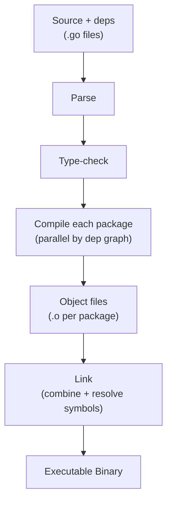
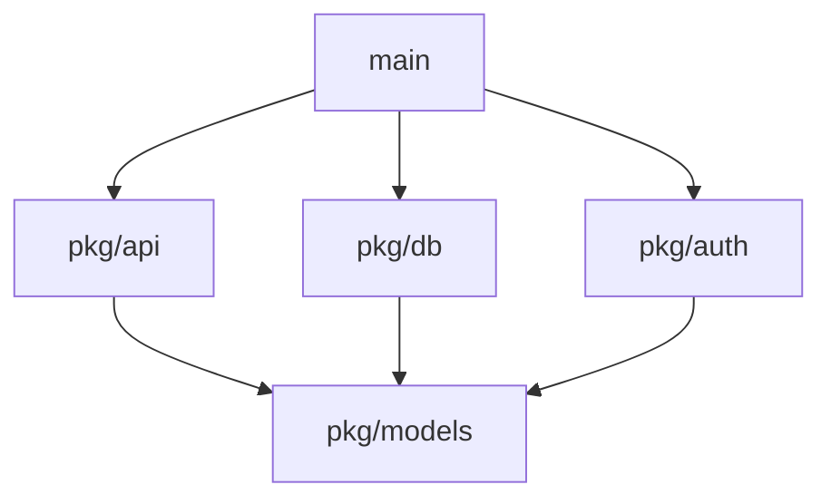

# Go Command — Under the Hood

## Table of Contents

1. [Introduction](#introduction)
2. [What `go build` Does](#what-go-build-does)
3. [The Build Cache](#the-build-cache)
4. [Modules: Download & Resolution](#modules-download--resolution)
5. [What `go build` Produces](#what-go-build-produces)
6. [Build IDs & Reproducibility](#build-ids--reproducibility)
7. [Test](#test)
8. [Tricky Questions](#tricky-questions)
9. [Summary](#summary)
10. [Further Reading](#further-reading)

---

## Introduction

> Focus: "What does the `go` command actually do when you run it?"

When you type `go build`, `go run`, or `go test`, the `go` tool orchestrates a lot of
work behind the scenes: it resolves which packages to build, downloads any missing
module dependencies, checks the build cache to avoid redundant work, drives the
compiler and linker, and finally produces a binary. This document looks under the
hood of the `go` command itself — what it does, in what order, and where it keeps
state — at an overview level.

The deep internals of the compiler (SSA passes, code generation), the linker
(relocations, binary section layout), and the runtime (scheduler, GC bootstrap)
are intentionally out of scope here. Those are covered in their own sections
(`10-go-toolchain` and `14-runtime-and-internals`). Here we stay at the level of
"what the `go` tool drives," not "how the compiler is implemented."

---

## What `go build` Does

When you run `go build ./...`, the `go` command coordinates a multi-stage pipeline.
At a high level:

1. **Resolve packages** — figure out which packages the build targets name, and the
   full set of dependencies via the module graph.
2. **Parse & type-check** — for each package, the compiler reads the `.go` files,
   parses them into a syntax tree, and type-checks them (name resolution, type
   inference, assignment/interface checks).
3. **Compile each package** — the compiler turns each type-checked package into a
   single object file containing machine code plus metadata. Independent packages
   are compiled in parallel based on the dependency graph.
4. **Link** — the linker combines all the object files (your packages, the standard
   library, and the runtime) into one executable, resolving symbols and laying out
   the final binary.



The `go` command is a *driver*: it doesn't compile or link anything itself. It works
out the dependency graph, decides what is out of date, and invokes the underlying
tools (`compile`, `link`, `asm`, and friends) as subprocesses, feeding object files
between them.

```bash
# See the actual commands the go tool runs
go build -x ./...        # print each underlying command
go build -v ./...        # print packages as they are compiled
```

Because compilation happens per package and the package graph is known up front, the
`go` tool compiles independent packages concurrently:



Here `pkg/models` must compile first (everyone depends on it); then `pkg/api`,
`pkg/db`, and `pkg/auth` can compile in parallel; `main` is linked last.

---

## The Build Cache

The `go` command keeps a build cache so it never recompiles a package whose inputs
have not changed. This is the single biggest reason repeated builds are fast.

```bash
go env GOCACHE          # location of the build cache (e.g. ~/.cache/go-build)
go clean -cache         # wipe the build cache
```

The cache is **content-addressed**. For each package the `go` tool computes a cache
key from everything that can affect the output:

```
key = hash(import path
           + source file contents
           + dependency hashes
           + compiler/build flags
           + Go toolchain version
           + GOOS/GOARCH)
```

If a key is already present in the cache, the previously compiled result is reused
and the compiler is never invoked for that package. If anything in the inputs
changes — a source byte, a flag, the Go version — the key changes and the package is
rebuilt. This is why changing a single `-gcflags` value or upgrading Go triggers a
full rebuild: every cache key shifts.

```bash
ls $(go env GOCACHE)
# 00/ 01/ ... ff/  (hex-prefix directories of hash-named entries)
```

`go test` uses the same machinery to cache *test results*: if neither the test
binary nor its inputs changed, you see `(cached)` instead of a re-run.

---

## Modules: Download & Resolution

When your code imports a package that isn't in the standard library or your module,
the `go` command has to find it, download it, and pin a version. This is the module
system, and most of it happens transparently during `go build`/`go test`.

### Resolution

`go.mod` lists your direct dependencies and their minimum versions. The `go` tool
uses **minimal version selection (MVS)**: it walks the dependency graph and, for each
module, picks the *highest minimum version* required by anything in the build. The
exact selected versions (including indirect ones) are recorded in `go.sum` with
cryptographic hashes for integrity.

### Download & the module cache

```bash
go env GOMODCACHE       # where downloaded modules live (e.g. ~/go/pkg/mod)
go env GOPROXY          # where modules are fetched from
```

When a required module/version is not already in `GOMODCACHE`, the `go` command
downloads it — by default through the **module proxy** (`proxy.golang.org`) rather
than cloning the source repository directly. The proxy serves immutable, versioned
zip files, which makes downloads fast and reproducible.

```
go build needs example.com/foo@v1.2.0
        |
        v
in GOMODCACHE?  --yes--> use it
        |
        no
        v
fetch from GOPROXY (proxy.golang.org by default)
        |
        v
verify hash against go.sum (and GONOSUMDB/GOSUMDB checksum db)
        |
        v
unpack into GOMODCACHE (read-only)
```

Downloaded modules are verified against `go.sum` and the checksum database, then
stored read-only in the module cache so every project on the machine can share them.

```bash
go mod download         # pre-fetch all dependencies into GOMODCACHE
go clean -modcache      # remove the entire module cache
GOFLAGS=-mod=mod go build   # let the build update go.mod/go.sum as needed
```

Relevant environment knobs the `go` command honors:

| Variable     | Role                                                       |
|--------------|------------------------------------------------------------|
| `GOPROXY`    | Comma-separated list of proxies (or `direct`/`off`)        |
| `GOMODCACHE` | On-disk location of downloaded modules                     |
| `GOSUMDB`    | Checksum database used to verify new module hashes         |
| `GOPRIVATE`  | Glob patterns that bypass the proxy/checksum db (private repos) |
| `GONOSUMCHECK` / `GOFLAGS` | Adjust verification and default build flags  |

---

## What `go build` Produces

The output of `go build` is a **single executable file**. There is no separate set of
`.so`/`.dll` files to ship alongside it: by default Go links everything — your code,
the standard library, and the runtime — statically into one binary.

```bash
go build -o server ./cmd/server
file ./server       # statically linked (when CGO is disabled)
```

This is why a "do nothing" Go program is still ~1–2 MB: the runtime (scheduler,
garbage collector, memory allocator) is always linked in, because even an empty
`main` runs as a goroutine under that runtime.

```go
package main

func main() {}
```

```bash
CGO_ENABLED=0 go build -ldflags="-s -w" -o minimal main.go
ls -lh minimal      # ~1–2 MB — that's the Go runtime, not your code
```

The single-binary model is a major operational advantage: deployment is "copy one
file and run it," with no runtime, interpreter, or shared libraries to install on the
target machine. The `-ldflags="-s -w"` flags reduce size by stripping the symbol
table and DWARF debug info, at the cost of debuggability.

> Note: cross-compilation is just setting `GOOS`/`GOARCH` before `go build` — the same
> driver, compiler, and linker produce a binary for a different target. No extra
> toolchain install is needed for pure-Go programs.

```bash
GOOS=linux GOARCH=arm64 go build -o server-linux-arm64 ./cmd/server
```

---

## Build IDs & Reproducibility

Every binary the `go` command produces embeds metadata you can inspect with the tool
itself — no third-party tools required:

```bash
go version -m ./server      # Go version + module versions + build settings
```

This works because `go build` stamps a **build ID** and **build info** into the
binary: the Go toolchain version, the main module path, the exact versions of all
dependencies, and the build settings (flags, `CGO_ENABLED`, `GOOS`, `GOARCH`, VCS
revision). Your program can read the same data at runtime:

```go
package main

import (
    "fmt"
    "runtime/debug"
)

func main() {
    info, ok := debug.ReadBuildInfo()
    if !ok {
        return
    }
    fmt.Printf("Go version: %s\n", info.GoVersion)
    fmt.Printf("Module: %s\n", info.Main.Path)
    for _, s := range info.Settings {
        fmt.Printf("  %s = %s\n", s.Key, s.Value)
    }
}
```

```
Go version: go1.22.0
Module: github.com/user/app
  -ldflags = -s -w -X main.version=1.0.0
  -trimpath = true
  CGO_ENABLED = 0
  GOARCH = amd64
  GOOS = linux
  vcs.revision = a1b2c3d
```

### Reproducible builds

Because the build cache key and the embedded build info are both derived from the
inputs, the same source + same toolchain + same flags produce a **byte-for-byte
identical binary**. Two things help make this hold across machines:

- `-trimpath` removes absolute filesystem paths from the binary, so the build does
  not depend on *where* the source lives.
- Pinned dependency versions in `go.mod`/`go.sum` ensure the same source is compiled
  every time.

```bash
go build -trimpath -ldflags="-s -w" -o server ./cmd/server
```

Reproducibility is a property the `go` command gives you almost for free, and it is
what makes supply-chain verification (rebuild and compare hashes) possible.

---

## Test

### Knowledge Questions

**1. Does the `go` command compile and link the code itself?**

<details>
<summary>Answer</summary>
No. The `go` command is a *driver*. It resolves packages and the dependency graph,
decides what is out of date, and then invokes the underlying tools (`compile`,
`link`, `asm`) as subprocesses. Use `go build -x` to see the exact commands it runs.
</details>

**2. Why is a repeated `go build` so much faster than the first one?**

<details>
<summary>Answer</summary>
The build cache (`go env GOCACHE`). It is content-addressed: each package's compiled
output is stored under a key derived from its source, dependencies, flags, and
toolchain version. If the key already exists, the compiler is never re-invoked for
that package. `go test` caches results the same way.
</details>

**3. Where do downloaded dependencies live, and how are they fetched?**

<details>
<summary>Answer</summary>
In the module cache at `go env GOMODCACHE` (default `~/go/pkg/mod`). Missing
modules are fetched through `GOPROXY` (default `proxy.golang.org`), which serves
immutable versioned zips, then verified against `go.sum`/the checksum database and
stored read-only so all projects share them.
</details>

**4. Why is even an empty Go program a ~1–2 MB binary?**

<details>
<summary>Answer</summary>
`go build` statically links the Go runtime (scheduler, garbage collector, memory
allocator) into every binary, because even an empty `main` runs as a goroutine under
that runtime. The single-binary model is what makes Go deployments "copy one file
and run."
</details>

---

## Tricky Questions

**1. You changed one `-gcflags` value and the whole project rebuilt. Why?**

<details>
<summary>Answer</summary>
Build flags are part of the cache key. Changing any flag changes the key for every
affected package, so the cached outputs no longer match and the packages are
recompiled. The same happens when you upgrade the Go toolchain.
</details>

**2. How can you produce a byte-for-byte identical binary on two different machines?**

<details>
<summary>Answer</summary>
Use the same Go toolchain version, pin dependencies via `go.mod`/`go.sum`, and build
with `-trimpath` (so absolute source paths are not baked in). The `go` command derives
both the cache key and the embedded build info from the inputs, so identical inputs
yield an identical binary. This is the basis for reproducible/verifiable builds.
</details>

**3. How can you tell which dependency versions a shipped binary was built with,
without the source?**

<details>
<summary>Answer</summary>
Run `go version -m ./binary`. The `go` command stamps build info — toolchain version,
main module, all dependency versions, and build settings — into every binary. The
program can also read it at runtime via `debug.ReadBuildInfo()`.
</details>

---

## Summary

- The `go` command is a **driver**: it resolves packages, consults the cache, and
  invokes the compiler and linker as subprocesses — it does not compile or link
  itself. (`go build -x` shows the underlying commands.)
- `go build` drives a high-level pipeline — **parse → type-check → compile each
  package (in parallel) → link** — and the on-disk details of each stage live in the
  toolchain/runtime sections, not here.
- The **build cache** (`GOCACHE`) is content-addressed, so unchanged packages (and
  test results) are never recomputed.
- **Modules** are resolved with minimal version selection and downloaded through
  `GOPROXY` into `GOMODCACHE`, verified against `go.sum`.
- `go build` produces a **single statically-linked binary** (runtime included),
  making deployment trivial.
- Builds carry **build IDs and build info** (`go version -m`) and are
  **reproducible** with pinned versions and `-trimpath`.

**Key takeaway:** the `go` command's job is orchestration — figuring out *what* must
be built, reusing *what already is*, fetching *what is missing*, and packaging the
result into one self-contained binary.

---

## Further Reading

- **Docs:** [`go` command reference](https://pkg.go.dev/cmd/go) — every subcommand and flag
- **Docs:** [Go Modules Reference](https://go.dev/ref/mod) — resolution, MVS, proxy, checksum db
- **Blog:** [Go and the build cache](https://go.dev/cmd/go/#hdr-Build_and_test_caching)
- **Blog:** [Module mirror & checksum database](https://go.dev/blog/module-mirror-launch)
- **Next:** `10-go-toolchain` — compiler/linker internals (SSA, codegen, binary layout)
- **Next:** `14-runtime-and-internals` — runtime bootstrap, scheduler, and GC
