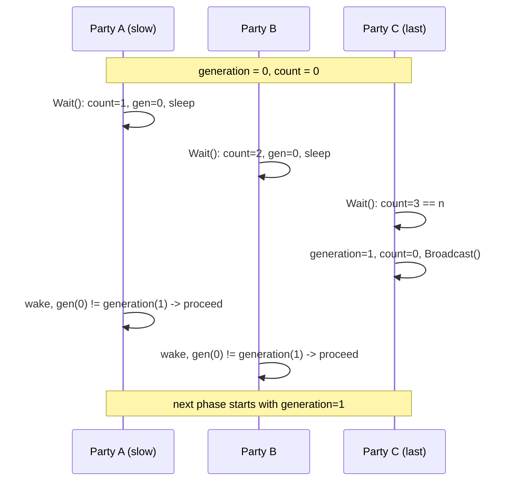

# N-Barrier — Middle Level

## Table of Contents
1. [Introduction](#introduction)
2. [The Reusable Barrier Problem](#the-reusable-barrier-problem)
3. [The Generation Counter](#the-generation-counter)
4. [A Correct Cyclic Barrier](#a-correct-cyclic-barrier)
5. [Channel-Based Barriers](#channel-based-barriers)
6. [A Realistic Phased Simulation](#a-realistic-phased-simulation)
7. [Barrier with a Phase Action](#barrier-with-a-phase-action)
8. [Aborting a Barrier](#aborting-a-barrier)
9. [Trade-offs vs the Naive Approach](#trade-offs-vs-the-naive-approach)
10. [Testing Reusable Barriers](#testing-reusable-barriers)
11. [Anti-Patterns](#anti-patterns)
12. [Cheat Sheet](#cheat-sheet)
13. [Summary](#summary)

---

## Introduction

Junior level built a *one-shot* barrier: N parties meet once, get released, done. Real phased work meets many times — every tick of a simulation, every round of an iterative solver. Reusing the one-shot barrier breaks immediately, because its `count` is stuck at N.

This file fixes that. The key idea is the **generation counter** (sometimes called the *phase* or *cycle* counter), which lets the barrier reset safely even while a fast goroutine is sprinting toward the next phase. We will also build a **channel-based** barrier (no `Cond`), wire a barrier into a real two-phase simulation, add a *phase action* (a hook run once per trip), and learn to *abort* a barrier so a failing party does not deadlock the rest.

---

## The Reusable Barrier Problem

Take the junior barrier and call `Wait()` twice in a loop:

```go
b := NewBarrier(3)
for phase := 0; phase < 2; phase++ {
    go func() { b.Wait() }() // x3
}
```

Phase 0 works. Then `count == 3`. In phase 1, the first caller does `count++` → 4, sees `count == n` is false and `count < n` is false, and *returns without waiting*. The barrier no longer synchronises anything. We must reset `count` to 0 — but *when*, and without letting an early party race ahead?

The naive reset is broken:

```go
// BROKEN reset.
if b.count == b.n {
    b.cond.Broadcast()
    b.count = 0 // a freed party may already be back at Wait(), see count=0, and re-block
}
```

If a just-released, very fast party loops back to `Wait()` and increments `count` *before* a slow party (still inside `cond.Wait()`) wakes and re-checks, the counts get tangled and parties deadlock or skip. This is the famous **"fast goroutine races into the next phase"** bug. The fix is a generation counter.

---

## The Generation Counter

Instead of resetting `count` and hoping nobody is mid-flight, give each *trip* an identity. A waiter records the generation it arrived in, and waits until the generation *changes*, not until the count hits N:

```go
for gen == b.generation {
    b.cond.Wait()
}
```

When the Nth party arrives, it (a) increments `generation`, (b) resets `count` to 0, and (c) broadcasts. Sleeping parties wake, see their stored `gen` no longer equals `b.generation`, and exit the loop. A party that loops back into `Wait()` reads the *new* generation, so it cannot accidentally satisfy an old generation's predicate. The generation acts as a monotonic ticket that cleanly separates phases.



---

## A Correct Cyclic Barrier

```go
package barrier

import "sync"

// Cyclic is a reusable N-party barrier.
type Cyclic struct {
    mu         sync.Mutex
    cond       *sync.Cond
    n          int
    count      int
    generation uint64
}

func NewCyclic(n int) *Cyclic {
    if n <= 0 {
        panic("barrier: n must be > 0")
    }
    c := &Cyclic{n: n}
    c.cond = sync.NewCond(&c.mu)
    return c
}

// Wait blocks until all n parties have called Wait for the current generation.
func (c *Cyclic) Wait() {
    c.mu.Lock()
    defer c.mu.Unlock()

    gen := c.generation
    c.count++
    if c.count == c.n {
        // Last party: open the next phase atomically.
        c.generation++
        c.count = 0
        c.cond.Broadcast()
        return
    }
    for gen == c.generation {
        c.cond.Wait()
    }
}
```

This barrier can be used in a loop forever. The generation comparison is the entire trick. Note that `count` and `generation` are mutated only under the lock, so there is no race even though many goroutines spin through `Wait()` rapidly.

Usage:

```go
b := NewCyclic(n)
var wg sync.WaitGroup
for i := 0; i < n; i++ {
    wg.Add(1)
    go func(id int) {
        defer wg.Done()
        for phase := 0; phase < 10; phase++ {
            doWork(id, phase)
            b.Wait() // everyone finishes phase, then advances together
        }
    }(i)
}
wg.Wait()
```

---

## Channel-Based Barriers

You can build a barrier without `Cond`, using the close-to-broadcast idiom. The Nth arrival closes a "gate" channel, which wakes everyone blocked on `<-gate`. For reuse, swap in a fresh gate each generation.

```go
package barrier

import "sync"

type ChanBarrier struct {
    mu    sync.Mutex
    n     int
    count int
    gate  chan struct{} // closed to release the current generation
}

func NewChanBarrier(n int) *ChanBarrier {
    return &ChanBarrier{n: n, gate: make(chan struct{})}
}

func (b *ChanBarrier) Wait() {
    b.mu.Lock()
    b.count++
    if b.count == b.n {
        // Last party: release everyone and arm a fresh gate.
        close(b.gate)
        b.gate = make(chan struct{})
        b.count = 0
        b.mu.Unlock()
        return
    }
    gate := b.gate // capture THIS generation's gate before unlocking
    b.mu.Unlock()
    <-gate // released when the Nth party closes this exact gate
}
```

The subtlety: each waiter captures *its* generation's `gate` while holding the lock, then blocks on that captured channel. When the Nth party closes it and installs a new one, fast loopers grab the new gate, so old and new phases never collide. This is the channel analogue of the generation counter.

**Cond vs channel barrier:**

| Aspect | `sync.Cond` | Channel (close-to-broadcast) |
|--------|-------------|------------------------------|
| Wake mechanism | `Broadcast()` | `close(gate)` |
| Per-trip allocation | none | one `make(chan struct{})` |
| Composability with `select` | no | yes (can add timeout/cancel) |
| Readability | familiar | very Go-idiomatic |
| Spurious wakeups | yes (needs `for`) | no |

For barriers that must also honour `context` cancellation, the channel form composes better because you can `select` on the gate and `ctx.Done()`.

---

## A Realistic Phased Simulation

A parallel Game of Life. Each worker owns a band of rows. Phase 1: compute the next state of your band (reading the current grid). Barrier. Phase 2: nothing extra here — the swap is done by gating it behind the barrier so all reads complete before any write of the *next* tick.

```go
package main

import (
    "fmt"
    "sync"
)

const (
    rows, cols = 8, 8
    workers    = 4
    ticks      = 5
)

func neighbours(g [][]byte, r, c int) int {
    n := 0
    for dr := -1; dr <= 1; dr++ {
        for dc := -1; dc <= 1; dc++ {
            if dr == 0 && dc == 0 {
                continue
            }
            rr, cc := r+dr, c+dc
            if rr >= 0 && rr < rows && cc >= 0 && cc < cols && g[rr][cc] == 1 {
                n++
            }
        }
    }
    return n
}

func main() {
    cur := make([][]byte, rows)
    next := make([][]byte, rows)
    for i := range cur {
        cur[i] = make([]byte, cols)
        next[i] = make([]byte, cols)
    }
    // A blinker.
    cur[3][2], cur[3][3], cur[3][4] = 1, 1, 1

    b := NewCyclic(workers)
    var wg sync.WaitGroup
    band := rows / workers

    for w := 0; w < workers; w++ {
        wg.Add(1)
        go func(id int) {
            defer wg.Done()
            start, end := id*band, (id+1)*band
            for t := 0; t < ticks; t++ {
                // Phase 1: compute this worker's band into next, reading cur.
                for r := start; r < end; r++ {
                    for c := 0; c < cols; c++ {
                        n := neighbours(cur, r, c)
                        if cur[r][c] == 1 && (n == 2 || n == 3) {
                            next[r][c] = 1
                        } else if cur[r][c] == 0 && n == 3 {
                            next[r][c] = 1
                        } else {
                            next[r][c] = 0
                        }
                    }
                }

                b.Wait() // all bands computed; safe to swap

                // Phase 2: one worker swaps the buffers for the next tick.
                if id == 0 {
                    cur, next = next, cur
                }

                b.Wait() // ensure the swap is visible before the next read phase
            }
        }(w)
    }
    wg.Wait()
    for _, row := range cur {
        fmt.Println(row)
    }
}
```

Two barriers per tick: one after compute (so all reads of `cur` finish before the swap), one after swap (so the swap is visible before the next compute reads `cur`). This *double-barrier per tick* pattern is extremely common in lockstep simulation. Forgetting the second barrier is a classic data race: worker 1 starts reading `cur` for tick *t+1* while worker 0's swap is still in flight.

> Note: `cur, next = next, cur` reassigns the *local* slice header captured by the closure only inside worker 0's goroutine. In a real implementation you would swap shared pointers behind a struct field so all workers see the swap. The double barrier is what makes that visibility safe.

---

## Barrier with a Phase Action

Java's `CyclicBarrier` lets you pass a *barrier action* run once, by the last party, before anyone is released. It is a clean place to do the "merge" or "swap" step.

```go
type ActionBarrier struct {
    mu         sync.Mutex
    cond       *sync.Cond
    n, count   int
    generation uint64
    action     func() // run by the last party, before release
}

func NewActionBarrier(n int, action func()) *ActionBarrier {
    b := &ActionBarrier{n: n, action: action}
    b.cond = sync.NewCond(&b.mu)
    return b
}

func (b *ActionBarrier) Wait() {
    b.mu.Lock()
    defer b.mu.Unlock()
    gen := b.generation
    b.count++
    if b.count == b.n {
        if b.action != nil {
            b.action() // runs while holding the lock, before release
        }
        b.generation++
        b.count = 0
        b.cond.Broadcast()
        return
    }
    for gen == b.generation {
        b.cond.Wait()
    }
}
```

The action runs *under the lock*, so it must be short and must not call `b.Wait()` (re-entrant deadlock). It is ideal for a buffer swap or partial-result fold: it is guaranteed to run exactly once per trip, after all parties arrive and before any is released.

---

## Aborting a Barrier

The biggest operational risk with barriers is the deadlock when one party dies. A production barrier needs an escape hatch: if any party signals failure (or the context is cancelled), every waiter should be released with an error instead of hanging forever.

```go
package barrier

import (
    "context"
    "errors"
    "sync"
)

var ErrBroken = errors.New("barrier: broken")

type Safe struct {
    mu         sync.Mutex
    cond       *sync.Cond
    n, count   int
    generation uint64
    broken     bool
}

func NewSafe(n int) *Safe {
    s := &Safe{n: n}
    s.cond = sync.NewCond(&s.mu)
    return s
}

// Wait returns ErrBroken if any party aborted this generation.
func (s *Safe) Wait(ctx context.Context) error {
    s.mu.Lock()
    if s.broken {
        s.mu.Unlock()
        return ErrBroken
    }
    gen := s.generation
    s.count++
    if s.count == s.n {
        s.generation++
        s.count = 0
        s.cond.Broadcast()
        s.mu.Unlock()
        return nil
    }

    // Watch ctx: cancellation breaks the barrier for everyone.
    stop := context.AfterFunc(ctx, func() {
        s.mu.Lock()
        if gen == s.generation && !s.broken {
            s.broken = true
            s.cond.Broadcast()
        }
        s.mu.Unlock()
    })
    defer stop()

    for gen == s.generation && !s.broken {
        s.cond.Wait()
    }
    broken := s.broken
    s.mu.Unlock()
    if broken {
        return ErrBroken
    }
    return nil
}

// Abort breaks the current generation; all waiters return ErrBroken.
func (s *Safe) Abort() {
    s.mu.Lock()
    s.broken = true
    s.cond.Broadcast()
    s.mu.Unlock()
}
```

`context.AfterFunc` (Go 1.21+) is the clean way to attach cancellation to a `Cond`-based wait, because `Cond` cannot itself `select` on a channel. On cancel, we break the barrier and broadcast so every sleeper wakes and returns `ErrBroken`. This converts a deadlock into a recoverable error — the difference between a frozen service and a graceful failure.

---

## Trade-offs vs the Naive Approach

| Concern | Naive (`WaitGroup` per phase) | Cyclic barrier |
|---------|-------------------------------|----------------|
| Allocation | a fresh `WaitGroup` + re-`Add` each phase | one barrier, reused |
| Correctness of reset | easy to mis-`Add` and panic ("negative counter") | generation counter handles it |
| Coordinator needed | yes — someone must `Wait()` then re-`Add` | no — peers self-organise |
| Phase action hook | manual | built in (ActionBarrier) |
| Abort/cancel | bolt-on | built in (Safe) |
| Mental load | "who re-arms it?" | "everyone meets here" |

The naive multi-phase pattern is "main: `wg.Add(n)`; spawn; `wg.Wait()`; `wg.Add(n)`; spawn again." It works for *re-spawning* workers each phase, but if you want long-lived workers that loop through phases, you cannot keep re-using one WaitGroup safely — and that is exactly where the barrier shines.

---

## Testing Reusable Barriers

```go
func TestCyclicMultiPhase(t *testing.T) {
    const n, phases = 4, 50
    b := NewCyclic(n)
    var inPhase int32 // how many parties are "between" the same barrier trip
    var maxSkew int32
    var wg sync.WaitGroup

    for i := 0; i < n; i++ {
        wg.Add(1)
        go func() {
            defer wg.Done()
            for p := 0; p < phases; p++ {
                cur := atomic.AddInt32(&inPhase, 1)
                for {
                    m := atomic.LoadInt32(&maxSkew)
                    if cur <= m || atomic.CompareAndSwapInt32(&maxSkew, m, cur) {
                        break
                    }
                }
                b.Wait()
                atomic.AddInt32(&inPhase, -1)
                b.Wait() // pair up so the counter is clean each round
            }
        }()
    }
    wg.Wait()
    // No phase should ever have more than n parties active simultaneously.
    if maxSkew > n {
        t.Fatalf("phase skew %d exceeded n=%d", maxSkew, n)
    }
}
```

Always run barrier tests with `-race` and with `GOMAXPROCS` greater than 1. Use a timeout-guarded `wg.Wait()` (as in junior.md) so a deadlock fails fast instead of hanging the test binary.

---

## Anti-Patterns

- **Resetting `count` without a generation counter.** The fast-looper race.
- **Re-using one `WaitGroup` for long-lived looping workers.** You will mis-count and panic.
- **A phase action that calls `Wait()`.** Re-entrant deadlock under the lock.
- **No abort path.** One dead party freezes the whole cohort with no diagnostics.
- **Per-tick allocation of a new barrier.** Wasteful; reuse one cyclic barrier.
- **Single barrier where two are needed** (compute/swap simulations). Subtle data race on the buffer swap.

---

## Cheat Sheet

```go
// Reusable barrier core
gen := b.generation
b.count++
if b.count == b.n {
    b.generation++   // open next phase
    b.count = 0
    b.cond.Broadcast()
    return
}
for gen == b.generation { b.cond.Wait() } // wait for the GENERATION to change
```

| Need | Tool |
|------|------|
| Repeat the meeting each phase | generation counter |
| Run code once per trip | `ActionBarrier` (action under lock) |
| Cancel / fail safely | `Safe` barrier + `context.AfterFunc` |
| Compose with `select` | channel-based barrier |
| Simulation tick | two barriers (after compute, after swap) |

---

## Summary

The leap from junior to middle is **reuse done correctly**. A naive count-reset races: a freed fast goroutine loops back and corrupts the next phase. The generation counter solves it by making waiters block until the *generation changes*, not until the count hits N. From that core you get the cyclic barrier, an optional once-per-trip phase action, and a channel-based variant that composes with `select` for cancellation. Real phased simulations typically use *two* barriers per tick (compute, then swap). And because the worst failure of a barrier is a deadlock, a production-grade barrier carries an abort/cancel path that converts "frozen forever" into a returned `ErrBroken`.
