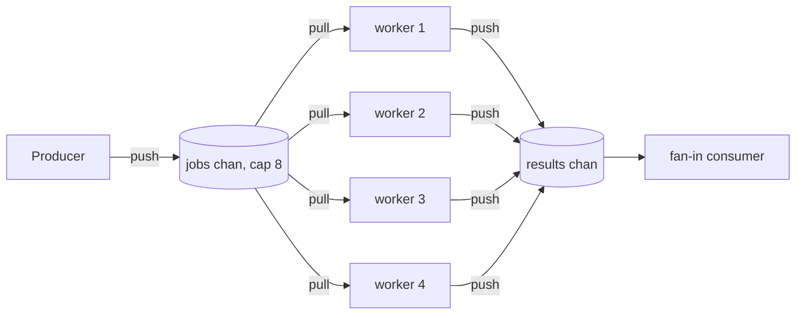

# Push-Pull — Middle Level

## Table of Contents
1. [Introduction](#introduction)
2. [Fan-Out: N Consumers Pulling from One Channel](#fan-out-n-consumers-pulling-from-one-channel)
3. [Fair Work Distribution](#fair-work-distribution)
4. [Bounded vs Unbounded Queues](#bounded-vs-unbounded-queues)
5. [Context Cancellation](#context-cancellation)
6. [Graceful Shutdown and Draining](#graceful-shutdown-and-draining)
7. [Push vs Pull vs Hybrid](#push-vs-pull-vs-hybrid)
8. [A Realistic Pipeline](#a-realistic-pipeline)
9. [Trade-offs vs the Naive Approach](#trade-offs-vs-the-naive-approach)
10. [Testing Push-Pull Systems](#testing-push-pull-systems)
11. [Anti-Patterns](#anti-patterns)
12. [Cheat Sheet](#cheat-sheet)
13. [Summary](#summary)

---

## Introduction

Junior level got us one producer and one consumer with backpressure. Middle level scales it out and hardens it:

- **Fan-out:** many consumers pulling from one shared channel — the worker-pool shape.
- **Bounded vs unbounded:** when (almost never) an unbounded queue is acceptable, and how to bound safely.
- **Cancellation:** `context` so a stopped consumer does not deadlock the producer.
- **Draining:** stopping cleanly without losing buffered work.
- **Push vs pull vs hybrid:** the deeper distinction and credit-based pull.

These are the things that turn a toy producer/consumer into something you can ship.

---

## Fan-Out: N Consumers Pulling from One Channel

One producer pushes onto a channel; N consumers all pull from it. Each item goes to *exactly one* consumer (whichever is free) — this is fan-out, not broadcast. The Go runtime distributes pulls fairly enough for most purposes.

```go
package main

import (
    "fmt"
    "sync"
)

func main() {
    jobs := make(chan int, 8)
    results := make(chan int, 8)

    const workers = 4
    var wg sync.WaitGroup

    // N consumers (workers) all pull from the same jobs channel.
    for w := 0; w < workers; w++ {
        wg.Add(1)
        go func(id int) {
            defer wg.Done()
            for j := range jobs { // each job pulled by one worker
                results <- j * j
            }
        }(w)
    }

    // One producer pushes jobs, then closes.
    go func() {
        defer close(jobs)
        for i := 1; i <= 20; i++ {
            jobs <- i
        }
    }()

    // Close results once all workers are done.
    go func() {
        wg.Wait()
        close(results)
    }()

    sum := 0
    for r := range results { // fan-in: merge results
        sum += r
    }
    fmt.Println("sum:", sum)
}
```

Three idioms to internalise:

1. **Shared pull channel = automatic load distribution.** Free workers pull; busy ones do not. No dispatcher logic needed.
2. **The producer closes `jobs`** when done; each worker's `range` ends.
3. **A separate goroutine closes `results`** *after* `wg.Wait()`, because multiple workers send to `results` and the close must happen after the last send. (Closing `results` from inside a worker would race/panic.)



---

## Fair Work Distribution

Go's channel does not guarantee strict round-robin, but it does guarantee that a ready receiver makes progress — so work flows to whichever worker is free. For *most* workloads this is the right kind of fairness: faster workers naturally pull more, slower workers pull less, and the system self-balances. This is exactly the behaviour ZeroMQ's PUSH/PULL sockets provide across a network ("fair queuing"), and NATS queue groups provide across subscribers. The in-process channel is the same idea.

When you need *strict* per-worker fairness or affinity (e.g., session stickiness), a single shared channel is the wrong tool — give each worker its own channel and route explicitly. But do not reach for that unless you have a real requirement; the shared channel is simpler and self-balancing.

---

## Bounded vs Unbounded Queues

| Property | Bounded (buffered channel) | Unbounded (growing slice/list) |
|----------|-----------------------------|--------------------------------|
| Producer when consumer slow | blocks (backpressure) | never blocks |
| Memory under overload | capped at capacity | grows until OOM |
| Latency under overload | bounded (queue can't grow) | unbounded (items wait behind a huge backlog) |
| Failure mode | slowdown | crash |
| Implementation | `make(chan T, n)` | custom, with a mutex + cond |

**Default to bounded.** The only legitimate uses for an unbounded queue are narrow: when you have a hard guarantee the producer's *total* output is bounded (e.g., a finite batch), or when dropping/blocking is unacceptable *and* you have separately bounded the input rate upstream. Even then, prefer a bounded channel sized to the known maximum.

If you truly need an unbounded queue (e.g., to never block a latency-critical producer), the safe shape is a bounded channel plus an explicit overflow policy — **block, drop, or spill to disk** — chosen consciously:

```go
// Drop-on-full: never block the producer, but lose items under overload.
func tryPush(ch chan<- Item, it Item) (delivered bool) {
    select {
    case ch <- it:
        return true
    default:
        return false // dropped; record a metric
    }
}
```

Dropping is honest about overload; an unbounded queue hides it until you crash.

---

## Context Cancellation

The junior-level deadlock was: consumer stops, producer blocks forever on a full channel. The fix is `context`: both sides watch `ctx.Done()` and stop.

```go
func produce(ctx context.Context, out chan<- int) {
    defer close(out)
    for i := 0; ; i++ {
        select {
        case out <- i: // push (may block on backpressure)
        case <-ctx.Done(): // cancelled while trying to push
            return
        }
    }
}

func consume(ctx context.Context, in <-chan int) {
    for {
        select {
        case v, ok := <-in:
            if !ok {
                return // producer closed the channel
            }
            handle(v)
        case <-ctx.Done():
            return // stop pulling
        }
    }
}
```

The crucial line is `case out <- i` inside a `select` with `<-ctx.Done()`. Without it, a cancelled producer that is blocked on a full channel never notices the cancellation — it stays parked. **Every potentially-blocking push or pull in a cancellable pipeline must be wrapped in a `select` with `ctx.Done()`.**

---

## Graceful Shutdown and Draining

There are two distinct shutdowns:

1. **Drain (finish the work).** Stop accepting new items, but process everything already pushed. Producer closes the channel; consumers `range` to completion. No data lost. Use for normal shutdown.
2. **Abort (drop the work).** Stop now; remaining items are discarded. Cancel the context; consumers exit immediately. Use for emergency shutdown or when results no longer matter.

Drain pattern:

```go
func run(ctx context.Context) error {
    jobs := make(chan Job, 64)
    var wg sync.WaitGroup

    for i := 0; i < workers; i++ {
        wg.Add(1)
        go func() {
            defer wg.Done()
            for j := range jobs { // drains to completion
                process(j)
            }
        }()
    }

    // Producer: stop pushing on cancel, but always close so workers drain.
    err := pushAll(ctx, jobs) // returns when input exhausted or ctx done
    close(jobs)               // signal "no more"; workers finish the buffer
    wg.Wait()                 // wait for the buffer to be fully drained
    return err
}
```

The key sequencing: **close the channel, then `wg.Wait()`.** Closing tells workers "no more after the buffer"; `range` drains the buffer; `wg.Wait()` confirms every buffered item was processed. Reversing them (wait before close) deadlocks — workers `range` forever on an open, empty channel.

A subtle data-loss bug: if you `ctx.Cancel()` and the workers' loops `select` on `ctx.Done()` *first*, they may exit with items still buffered. For *drain* semantics, do **not** put `ctx.Done()` in the worker loop — let it `range` to completion and rely on the producer closing the channel. Use `ctx` only for *abort* semantics.

---

## Push vs Pull vs Hybrid

The pattern's name hides a real distinction:

- **Push (producer-driven).** The producer decides when items flow and forces them downstream. A blocked push provides backpressure. Go channels are push-with-backpressure by default.
- **Pull (consumer-driven).** The consumer decides when to fetch the next item. Useful when the consumer must control its own rate precisely (e.g., it issues a "give me one more" request). Implemented with a *request* channel.
- **Hybrid / credit-based.** The consumer sends *credits* ("I can handle 5 more") upstream; the producer pushes only up to the available credit. This is how HTTP/2 and gRPC flow control work, and how reactive-streams libraries implement backpressure across boundaries that lack a blocking channel.

Pull / credit example:

```go
// Consumer pulls one item at a time by requesting it.
type Puller struct {
    req  chan struct{} // consumer -> producer: "send me one"
    data chan int      // producer -> consumer: the item
}

func (p *Puller) producer() {
    defer close(p.data)
    for i := 0; ; i++ {
        if _, ok := <-p.req; !ok { // wait for a pull request
            return
        }
        p.data <- i // serve exactly one
    }
}
```

In-process, a buffered channel's blocking *is* backpressure, so explicit credit is rarely needed. Credit-based pull earns its keep across a network (where you cannot block a remote producer) — which is why distributed brokers use it.

---

## A Realistic Pipeline

A three-stage pipeline: read lines → parse → aggregate. Each stage is a push-pull pair; bounded channels backpressure the whole chain to the slowest stage.

```go
package main

import (
    "bufio"
    "context"
    "fmt"
    "strconv"
    "strings"
)

func readLines(ctx context.Context, r *bufio.Scanner) <-chan string {
    out := make(chan string, 32)
    go func() {
        defer close(out)
        for r.Scan() {
            select {
            case out <- r.Text():
            case <-ctx.Done():
                return
            }
        }
    }()
    return out
}

func parse(ctx context.Context, in <-chan string) <-chan int {
    out := make(chan int, 32)
    go func() {
        defer close(out)
        for line := range in {
            n, err := strconv.Atoi(strings.TrimSpace(line))
            if err != nil {
                continue // skip bad lines
            }
            select {
            case out <- n:
            case <-ctx.Done():
                return
            }
        }
    }()
    return out
}

func main() {
    ctx, cancel := context.WithCancel(context.Background())
    defer cancel()

    sc := bufio.NewScanner(strings.NewReader("1\n2\nbad\n4\n5\n"))
    nums := parse(ctx, readLines(ctx, sc))

    sum := 0
    for n := range nums { // final consumer; pulls aggregate
        sum += n
    }
    fmt.Println("sum:", sum) // 12
}
```

Each stage returns a receive-only channel, owns its goroutine, and closes its output on completion or cancellation. Backpressure flows backward: if `parse` is slow, `readLines` blocks on `out <- ...`, which slows the scanner — exactly bounding memory to the buffer sizes. This is the canonical Go pipeline, and it is push-pull all the way down.

---

## Trade-offs vs the Naive Approach

| Concern | Naive (one goroutine, no channel / unbounded slice) | Push-pull (bounded channels) |
|---------|-----------------------------------------------------|------------------------------|
| Memory under load | unbounded (slice grows) | bounded (buffer cap) |
| Parallelism | none | fan-out to N workers |
| Backpressure | none (or manual) | automatic |
| Cancellation | ad hoc | `ctx` + `select` |
| Data loss on shutdown | likely | controllable (drain vs abort) |
| Complexity | low | moderate (close/drain sequencing) |

The naive "read everything into a slice, then process" works until the input is bigger than RAM. Push-pull streams it with bounded memory and optional parallelism — at the cost of getting the close/drain/cancel choreography right.

---

## Testing Push-Pull Systems

```go
func TestPipelineProcessesAll(t *testing.T) {
    ctx := context.Background()
    in := make(chan int, 4)
    out := square(ctx, in) // a stage that pushes v*v

    go func() {
        defer close(in)
        for i := 1; i <= 100; i++ {
            in <- i
        }
    }()

    got := 0
    for range out {
        got++
    }
    if got != 100 {
        t.Fatalf("processed %d, want 100", got)
    }
}

func TestCancellationStopsProducer(t *testing.T) {
    ctx, cancel := context.WithCancel(context.Background())
    out := produce(ctx) // pushes forever until ctx done
    <-out               // pull one
    cancel()
    // Drain whatever is buffered; the producer must stop and close.
    done := make(chan struct{})
    go func() { for range out { }; close(done) }()
    select {
    case <-done:
    case <-time.After(time.Second):
        t.Fatal("producer did not stop on cancel (leak)")
    }
}
```

Always run with `-race`. Add a `goleak`-style check to confirm no producer goroutine outlives a cancelled pipeline.

---

## Anti-Patterns

- **Unbounded queue "to avoid blocking the producer."** OOM waiting to happen. Bound and pick an overflow policy.
- **`ctx.Done()` in worker loops when you want drain semantics.** Causes silent data loss on shutdown.
- **`wg.Wait()` before `close(ch)`.** Deadlock — workers `range` an open channel forever.
- **Closing a fan-in result channel from a worker.** Multiple senders → close races / panics. Close it once, after `wg.Wait()`, from a dedicated goroutine.
- **A blocking push with no `select`/`ctx` in a cancellable pipeline.** A cancelled-but-blocked producer never exits.
- **One giant buffer to "fix" backpressure.** Hides overload and wastes memory.

---

## Cheat Sheet

```go
// Fan-out: N pullers, one channel
for w := 0; w < n; w++ {
    wg.Add(1)
    go func() { defer wg.Done(); for j := range jobs { work(j) } }()
}
go func() { wg.Wait(); close(results) }() // close fan-in AFTER all senders done

// Cancellable push
select {
case out <- v:
case <-ctx.Done():
    return
}

// Drain: close then wait
close(jobs)
wg.Wait()
```

| Need | Tool |
|------|------|
| Parallel consumers | fan-out: N goroutines `range` one channel |
| Never block producer | bounded chan + drop policy (not unbounded) |
| Stop without losing work | drain: close, then `wg.Wait()` |
| Stop immediately | abort: cancel `ctx`, `select` on `Done()` |
| Cross-network backpressure | credit/pull (conceptual; see professional.md) |

---

## Summary

Middle-level push-pull is about scale and lifecycle. Fan-out — N consumers pulling from one shared channel — gives automatic, self-balancing work distribution (the same fair-queuing ZeroMQ PUSH/PULL and NATS queue groups give across a network). Always bound your queues: an unbounded queue trades a controlled slowdown for an OOM crash, so if you must not block the producer, use a bounded channel with an explicit drop/spill policy. Wrap every blocking push/pull in a `select` with `ctx.Done()` so cancellation actually propagates, and distinguish *drain* (close the channel, then `wg.Wait()`, lose nothing) from *abort* (cancel the context, exit now, drop the rest). The push/pull/credit distinction matters most across networks; in-process, the channel's blocking already gives you backpressure for free.
