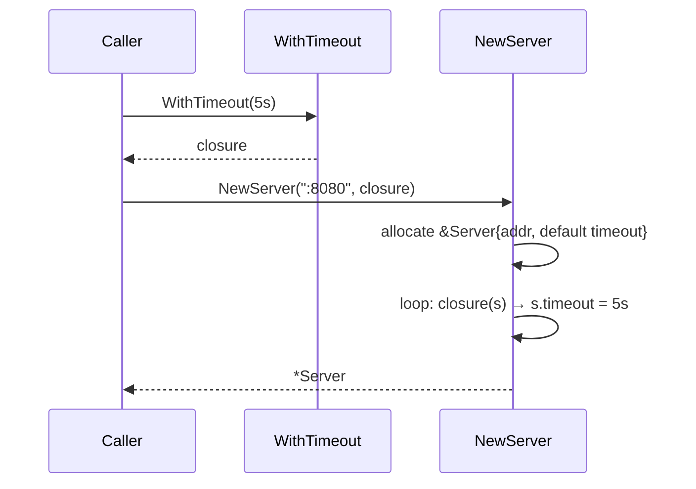
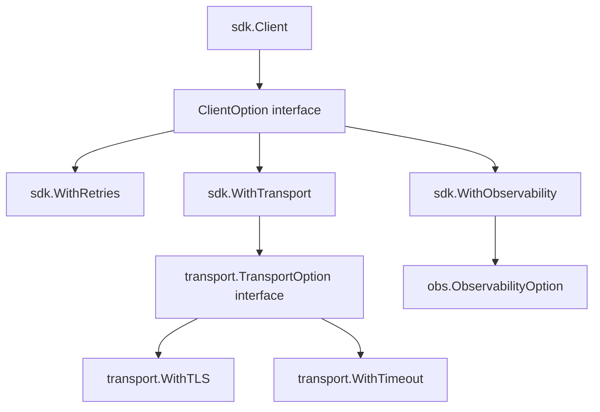
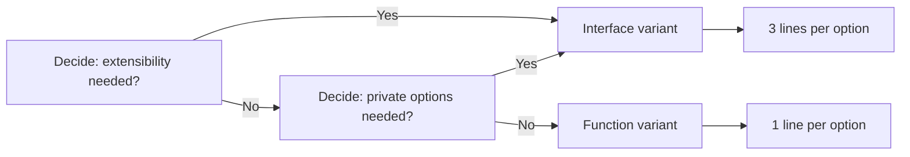

# Functional Options — Interview Questions

Interview prep for the functional-options pattern across all skill levels. The pattern shows up in nearly every Go interview because it sits at the intersection of three things interviewers care about: idiomatic Go, API design, and a candidate's instinct for evolution and backwards-compatibility. A candidate who can only recite the shape is junior; one who can argue *when not to use it* is middle; one who can place it correctly inside an SDK and reason about versioning is senior.

Use this file the way you'd use a deck of flashcards before a Go-heavy onsite at a place like Google, Uber, Cloudflare, or any team that maintains a public Go library. Each question is annotated with the level it targets, the ideal answer at that level, common wrong answers, and follow-ups the interviewer is likely to ask.

---

## Table of Contents

1. [What interviewers actually test for](#1-what-interviewers-actually-test-for)
2. [Junior-level questions](#2-junior-level-questions)
3. [Middle-level questions](#3-middle-level-questions)
4. [Senior-level questions](#4-senior-level-questions)
5. [Live coding challenges](#5-live-coding-challenges)
6. [System design conversation starters](#6-system-design-conversation-starters)
7. [Common interview traps and red flags](#7-common-interview-traps-and-red-flags)
8. [Questions to ask the interviewer](#8-questions-to-ask-the-interviewer)
9. [Cross-references](#9-cross-references)

---

## 1. What interviewers actually test for

The pattern itself is small enough that a junior can implement it after one read. The signal interviewers want is across three dimensions:

| Dimension | Junior signal | Middle signal | Senior signal |
|-----------|---------------|---------------|---------------|
| Mechanics | Can write the four pieces from memory | Knows the function vs interface variants | Can refactor between variants in a live codebase |
| API design | Knows positional vs variadic split | Knows when *not* to use options | Designs option APIs that survive multiple major versions |
| Trade-offs | Can list pros/cons of config struct vs options | Picks the right variant per situation | Argues about API surface area, embeddability, third-party extension |

The pattern is also a proxy for general Go judgment. A candidate who insists every constructor must use options is as wrong as one who refuses to use it. Calibrated answers are the ones that earn points.

---

## 2. Junior-level questions

These check that the candidate can write the pattern, name it, and explain its parts. They should take 1–2 minutes each in an interview.

---

### Q1 (junior). What is the functional-options pattern and what problem does it solve?

**Ideal answer.** It's a Go idiom for configuring a type with many optional parameters. The constructor takes one or more required positional arguments and a variadic slice of `Option` values, where each `Option` is a function that mutates the target. Each option is built by a `WithX` constructor function. The pattern solves three problems Go has by language design:

1. No method overloading — you can't write `NewServer(addr)`, `NewServer(addr, timeout)`, `NewServer(addr, timeout, logger)` as separate functions.
2. No default arguments — there's no syntax for "if not passed, use 30s".
3. Adding a new option must be backwards compatible — you can't add fields to an exported config struct without breaking positional struct literals.

The pattern fixes all three by making each option an independent function value, applied in order inside the constructor.

```go
type Option func(*Server)

func WithTimeout(d time.Duration) Option {
    return func(s *Server) { s.timeout = d }
}

func NewServer(addr string, opts ...Option) *Server {
    s := &Server{addr: addr, timeout: 30 * time.Second}
    for _, opt := range opts { opt(s) }
    return s
}
```

**Common wrong answers.**
- "It's the Go version of the Builder pattern." — Related but distinct. Builders are multi-phase and stateful; options are a single-phase variadic.
- "It's how you do dependency injection in Go." — Wrong axis. DI is about wiring dependencies; options are about configuration. They can overlap but aren't the same problem.

**Follow-up.** *Could you implement it without closures, using just interfaces?* (This pulls into Q9 below.)

---

### Q2 (junior). Why is `type Option func(*Server)` the convention, not `type Option func(s *Server) *Server`?

**Ideal answer.** Two reasons.

First, options mutate the target by pointer. Returning a new `*Server` would force every option to allocate or copy, and would make the constructor's loop look like `s = opt(s)` instead of `opt(s)`. That's a fluent-builder idiom, not a functional-options one.

Second, the pattern leans on the fact that the target is being incrementally configured *in place* before being returned. The caller never sees the half-built target. Returning a `*Server` from each option implies the option could substitute a different `*Server`, which violates the model.

**Common wrong answers.** "Because closures can't return pointers" — false; they can.

**Follow-up.** *Then how would you express an option that needs to fail?* (Pulls into the error-returning option variant — Q3 of the middle section.)

---

### Q3 (junior). Where should default values live: in the option function, or in the constructor?

**Ideal answer.** In the constructor, always. The option function should be a dumb setter. Reasoning:

If the default lives in `WithTimeout` (`if d == 0 { d = 30*time.Second }`), then `NewServer(addr)` gives one default, but `NewServer(addr, WithTimeout(0))` gives the *same* default — the caller can no longer say "I really do want zero". And worse, when the library bumps its default from 30s to 60s a year later, callers who passed `WithTimeout(0)` still get 30s — they're frozen on the old default forever.

Putting the default in the constructor literal makes it the single source of truth:

```go
func NewServer(addr string, opts ...Option) *Server {
    s := &Server{addr: addr, timeout: 30 * time.Second}  // ← only here
    for _, opt := range opts { opt(s) }
    return s
}
```

**Common wrong answers.** "In a package-level var so it's overridable" — encourages global mutation, breaks test isolation. Bad.

**Follow-up.** *What if the default depends on another field?* (Set the dependent default *after* the loop, when all options have run.)

---

### Q4 (junior). Why are options variadic instead of taking a `[]Option`?

**Ideal answer.** Two reasons:

1. **Call-site ergonomics.** `NewServer(":8080", WithTimeout(5*time.Second), WithLogger(l))` reads naturally. `NewServer(":8080", []Option{WithTimeout(...), WithLogger(...)})` makes the caller construct a slice literal every time.

2. **Both forms are still possible.** A variadic parameter accepts the spread form too: `NewServer(":8080", opts...)` works when you have a `[]Option` value. So `...Option` strictly dominates `[]Option`.

**Common wrong answers.** "Variadic is faster" — there's a tiny slice allocation cost for variadic dispatch, but it's irrelevant.

**Follow-up.** *Show me a case where you'd build a `[]Option` first instead of passing options inline.* (Conditional construction, environment-specific defaults — pulls into middle §5.)

---

### Q5 (junior). What happens if I pass the same option twice?

**Ideal answer.** Both run, in order. The second one wins for replace-style options:

```go
NewServer(":8080", WithTimeout(5*time.Second), WithTimeout(10*time.Second))
// s.timeout == 10*time.Second
```

For additive options like `WithHeader(key, value)`, both effects accumulate:

```go
NewClient(WithHeader("X", "1"), WithHeader("Y", "2"))
// c.headers has both X and Y
```

The behaviour is entirely determined by what the option's closure does. The pattern doesn't enforce idempotence.

**Common wrong answers.** "It's an error" — no, the loop doesn't check.

**Follow-up.** *Should the constructor detect and reject duplicates?* (Almost always no — it surprises callers who legitimately build option lists by appending overrides on top of defaults.)

---

### Q6 (junior). Why does this constructor look wrong?

```go
func NewServer(opts ...Option) *Server {
    s := &Server{}
    for _, opt := range opts { opt(s) }
    return s
}
```

**Ideal answer.** Two problems:

1. **No required arguments.** A `Server` with no address is meaningless, but `NewServer()` compiles. Required parameters should be positional so the compiler enforces them.

2. **No defaults.** Every field starts at its zero value. `s.timeout == 0` usually means "no timeout, block forever" — a footgun if the caller forgets `WithTimeout`.

The corrected version:

```go
func NewServer(addr string, opts ...Option) *Server {
    s := &Server{
        addr:    addr,
        timeout: 30 * time.Second,
    }
    for _, opt := range opts { opt(s) }
    return s
}
```

**Common wrong answers.** "It's fine for internal use" — fine for an internal helper, but the question framing implies a public constructor.

**Follow-up.** *What if `addr` can fail to parse?* (Return `(*Server, error)` from the constructor — pulls into the fallible-constructor discussion.)

---

### Q7 (junior). How do you make an option that takes no arguments, like `WithDebug()`?

**Ideal answer.** Same shape, just no parameter:

```go
func WithDebug() Option {
    return func(s *Server) { s.debug = true }
}
```

It's still a constructor function returning an `Option`. Don't shortcut it to `var WithDebug Option = func(s *Server) { ... }` — the function form is consistent with the rest of the API and lets you add parameters later without breaking callers.

**Common wrong answers.** "Use a package-level variable" — works, but inconsistent with the other `WithX` functions. Future-proofs poorly.

**Follow-up.** *What if `WithDebug` needs to depend on something — like an env var?* (Read the env var *inside* the closure, not at the call to `WithDebug` — or just have the caller decide and pass the bool.)

---

### Q8 (junior). What's the difference between these two and which is idiomatic?

```go
// A
type Option func(*Server)

// B
type Option interface { apply(*Server) }
```

**Ideal answer.** A is the function variant — short, idiomatic, used by `chi`, `zap`'s public API, and most small libraries. B is the interface variant — used by `grpc-go`, the Google APIs Go SDK, and most large libraries that need extensibility.

The function variant is the default. Move to the interface variant when:
- External packages need to implement options (because they can implement an exported interface but they can't extend an exported function type).
- You want some options to be private (define unexported types implementing the unexported `apply` method, only constructable inside your package).

For a junior, A is the right default. Knowing B exists and roughly when to use it is a middle-level signal.

**Common wrong answers.** "B is always better because interfaces are more flexible" — flexibility you don't need is bloat.

**Follow-up.** *gRPC uses the interface variant. Why?* (External `grpc/credentials`, `grpc/balancer`, etc., must define their own DialOptions without depending on `grpc` internals.)

---

### Q9 (junior). Walk me through what happens when I call `NewServer(":8080", WithTimeout(5*time.Second))`.

**Ideal answer.** Step by step:

1. `WithTimeout(5*time.Second)` is evaluated *first* — it's an argument, so Go evaluates it before calling `NewServer`. It returns a function value `func(s *Server) { s.timeout = 5*time.Second }`. That closure has captured the value `5*time.Second`.

2. `NewServer` is called with `addr=":8080"` and `opts=[]Option{<the closure>}`.

3. Inside `NewServer`, the constructor allocates `s := &Server{addr: ":8080", timeout: 30 * time.Second}` — defaults are set.

4. The loop runs: `for _, opt := range opts { opt(s) }`. With one entry, it calls the closure once. The closure overwrites `s.timeout` to `5*time.Second`.

5. `NewServer` returns the now-fully-configured `*Server`.



**Common wrong answers.** "The closure runs at construction time" — true but missing the order. "The default is applied after the option" — wrong; defaults are first.

**Follow-up.** *Where does the closure live in memory — stack or heap?* (Heap. The closure outlives the call to `WithTimeout` because it's passed into another function and held in the variadic slice.)

---

### Q10 (junior). What's a sensible naming convention for option functions?

**Ideal answer.** `WithX` returning `Option`. The reasons it became standard:

- Reads naturally inside the call: `NewServer(":8080", WithTimeout(5*time.Second))` is a sentence.
- Distinguishes options from regular setters (which are `SetX`). A setter mutates an existing object; `WithX` is for *construction*.
- Disambiguates when multiple types share a package: `ServerOption`, `ClientOption`, and their `WithX` functions can coexist because the return type tells the compiler which constructor accepts them.

A few popular packages use `EnableX`/`DisableX` for boolean toggles (e.g., `EnableDebug()`). That's fine and reads better in those cases. Avoid `OptX`, `XOption`, `SetX`, or unprefixed function names — they confuse readers.

**Common wrong answers.** "`Set` is shorter and clearer" — confuses options with setters and breaks the convention.

**Follow-up.** *If your package has Server, Client, and Listener, and all three are configurable, how do you name the option types?* (`ServerOption`, `ClientOption`, `ListenerOption` — qualify the type name so the compiler can route `WithTimeout(...) ServerOption` vs `WithTimeout(...) ClientOption` correctly.)

---

## 3. Middle-level questions

These check the candidate can pick the right variant, reason about evolution, and avoid hidden bugs. Expect 3–5 minutes each.

---

### Q1 (middle). When would you *not* use functional options?

**Ideal answer.** Four cases:

1. **Internal helpers.** A function used in one place inside one package doesn't need an API contract. A plain config struct is shorter and equally clear.

2. **Highly stable, large configurations where every field is independent.** `tls.Config` is the canonical example. The fields are documented as a unit, the defaults are well-known per field, and there's no expectation of evolution that breaks struct literals.

3. **Multi-phase construction.** If the object has to be parsed, validated, then built, then connected — options can't express the phases. Use a builder.

4. **Heavily polymorphic configuration.** If the configuration is itself a tree (e.g., middleware chains, routing rules), options become unwieldy. Use a fluent API or a config struct that holds the tree.

The general rule: use options when you have a small constructor, sensible defaults, and a public API likely to grow.

**Common wrong answers.** "Always use them; they're idiomatic." — Cargo-culting. Idiomatic means *right for the situation*.

**Follow-up.** *If you started with a config struct and the API exploded to 30 fields, would you migrate to options?* (Usually no — the cost of breaking callers exceeds the benefit. Better to deprecate the struct, ship a new constructor with options alongside it, and let callers migrate gradually.)

---

### Q2 (middle). Implement an option that can fail. Show me three different ways and tell me when you'd use each.

**Ideal answer.**

**Way 1 — Defer validation to the constructor.**

```go
type Option func(*Server)

func WithTLSFromFiles(cert, key string) Option {
    return func(s *Server) { s.tlsCert, s.tlsKey = cert, key }
}

func NewServer(addr string, opts ...Option) (*Server, error) {
    s := &Server{addr: addr}
    for _, opt := range opts { opt(s) }
    if s.tlsCert != "" {
        c, err := tls.LoadX509KeyPair(s.tlsCert, s.tlsKey)
        if err != nil { return nil, fmt.Errorf("load tls: %w", err) }
        s.tls = &tls.Config{Certificates: []tls.Certificate{c}}
    }
    return s, nil
}
```

Use when only a few options can fail.

**Way 2 — Option returns an error.**

```go
type Option func(*Server) error

func WithTLSFromFiles(cert, key string) Option {
    return func(s *Server) error {
        c, err := tls.LoadX509KeyPair(cert, key)
        if err != nil { return err }
        s.tls = &tls.Config{Certificates: []tls.Certificate{c}}
        return nil
    }
}

func NewServer(addr string, opts ...Option) (*Server, error) {
    s := &Server{addr: addr}
    for _, opt := range opts {
        if err := opt(s); err != nil { return nil, err }
    }
    return s, nil
}
```

Use when many options can fail.

**Way 3 — Pre-validated input.**

```go
func MustLoadTLS(cert, key string) *tls.Config { /* panic on error */ }
func WithTLS(c *tls.Config) Option { return func(s *Server) { s.tls = c } }
```

Use when the option's input is already a parsed thing — let the caller handle the error before constructing it.

The choice is about *where the error surfaces*. Way 1 surfaces it in `NewServer`. Way 2 surfaces it inside the option, propagated through `NewServer`. Way 3 surfaces it earlier, before the constructor is even called.

**Common wrong answers.** "Panic in the option" — only acceptable for programmer errors (invalid constants), not for runtime failures like file-not-found.

**Follow-up.** *What if I change my mind and want to migrate from way 1 to way 2 later? Is that a breaking change?* (Yes — `Option` changes from `func(*Server)` to `func(*Server) error`. Every caller's option list still works because they're using `WithX` functions, but any caller who defined their own `Option func(*Server)` value breaks. So make the choice up front.)

---

### Q3 (middle). What's wrong with this option?

```go
func WithHeaders(h map[string]string) Option {
    return func(c *Client) { c.headers = h }
}
```

**Ideal answer.** It shares the caller's map by reference. If the caller mutates `h` after the call, the client sees the mutation:

```go
m := map[string]string{"X": "a"}
c := NewClient(WithHeaders(m))
m["X"] = "b"        // c.headers["X"] is now "b"
```

That's a surprise. The fix is a defensive copy at option-construction time:

```go
func WithHeaders(h map[string]string) Option {
    h2 := make(map[string]string, len(h))
    for k, v := range h { h2[k] = v }
    return func(c *Client) { c.headers = h2 }
}
```

The cost is one map allocation per call to `WithHeaders`, which is fine — `NewClient` isn't a hot path.

The same trap applies to slices, channels, and any other reference type. For pointers (`*tls.Config`, `*log.Logger`) the convention is reversed — the caller *expects* sharing, so don't copy. Document it.

**Common wrong answers.** "Make the field a `sync.Map`" — solves a different problem (concurrent access), not the aliasing bug.

**Follow-up.** *What's the rule for when to copy vs share?* (Copy by default for value-collection types — maps, slices. Share for pointer-to-struct types where the caller owns the lifetime. Document either way.)

---

### Q4 (middle). Show me how you'd compose options to build environment-specific defaults.

**Ideal answer.**

```go
package presets

func Production() []server.Option {
    return []server.Option{
        server.WithReadTimeout(5 * time.Second),
        server.WithWriteTimeout(10 * time.Second),
        server.WithMaxConns(10_000),
        server.WithSampling(0.01),
    }
}

func Development() []server.Option {
    return []server.Option{
        server.WithReadTimeout(60 * time.Second),
        server.WithMaxConns(10),
        server.WithDebug(),
    }
}
```

Usage:

```go
opts := presets.Production()
opts = append(opts, server.WithLogger(myLogger))   // override or extend
s := server.NewServer(":8080", opts...)
```

The key idiom: options are values. They compose by append. *Later options win* because the constructor's loop applies them in order. To override a default, append on top of the bundle; to extend, append additional options.

You can also write a `Combine` helper:

```go
func Combine(opts ...server.Option) server.Option {
    return func(s *server.Server) {
        for _, o := range opts { if o != nil { o(s) } }
    }
}

var ProductionProfile = Combine(presets.Production()...)
```

This collapses a `[]Option` into a single `Option`, useful when you want a "profile" name in the call site:

```go
s := server.NewServer(":8080", ProductionProfile, server.WithLogger(myLogger))
```

**Common wrong answers.** "Use a global config struct" — defeats the purpose; you've recreated the config-struct pattern.

**Follow-up.** *What if two preset bundles set conflicting values?* (Order wins. Document it: "later options override earlier ones".)

---

### Q5 (middle). Walk me through the generic options variant. When is it worth using?

**Ideal answer.**

```go
package opt

type Option[T any] func(*T)

func Apply[T any](t *T, opts []Option[T]) {
    for _, o := range opts {
        if o != nil { o(t) }
    }
}
```

Use site:

```go
type Server struct { addr string; timeout time.Duration }

func WithTimeout(d time.Duration) opt.Option[Server] {
    return func(s *Server) { s.timeout = d }
}

func NewServer(addr string, opts ...opt.Option[Server]) *Server {
    s := &Server{addr: addr, timeout: 30*time.Second}
    opt.Apply(s, opts)
    return s
}
```

Worth using when:

- The codebase has many target types and you want a single reusable `Apply` with nil-skipping, logging, or instrumentation.
- You're building reusable combinators (`opt.If[T]`, `opt.Compose[T]`) and don't want to duplicate them per target.

Not worth using when:

- One package, one target type. The generic version adds a type parameter to every signature and saves nothing.

The Go community defaults to plain `type Option func(*Server)` per package. Generics are an option-infrastructure optimisation, not a per-package one.

**Common wrong answers.** "Always use generics — they're newer." — Cargo-culting the language feature.

**Follow-up.** *What if your option needs to constrain `T`?* (Then you're past functional options. You probably want a fluent builder; the generic constraint syntax gets noisy and harms readability.)

---

### Q6 (middle). How would you test that an option is applied correctly?

**Ideal answer.** Apply the option to a fresh target and inspect the field:

```go
func TestWithTimeout(t *testing.T) {
    s := &Server{}
    WithTimeout(5 * time.Second)(s)
    if s.timeout != 5*time.Second {
        t.Fatalf("WithTimeout: got %v, want 5s", s.timeout)
    }
}
```

For options applied through the public constructor:

```go
func TestNewServer_AppliesOptions(t *testing.T) {
    s := NewServer(":8080",
        WithTimeout(5*time.Second),
        WithLogger(testLogger),
    )
    if s.Timeout() != 5*time.Second { t.Fatal("timeout not applied") }
    if s.Logger() != testLogger    { t.Fatal("logger not applied") }
}
```

Two practical patterns:

1. **Test the option, not the constructor.** Each option is independently testable by applying it to a zero-valued target. Cheaper and more focused.

2. **Test default behaviour separately.** A separate test asserts that `NewServer(":8080")` (no options) produces the documented defaults. This catches "someone changed the default literal" regressions.

If the field is unexported and you don't want to expose a getter just for testing, place the test in the same package (`server_test` vs `server` — use `package server` for white-box tests).

**Common wrong answers.** "Mock the constructor." — Constructors are simple enough that mocking them tests nothing.

**Follow-up.** *How would you property-test that any sequence of options produces a valid `*Server`?* (Generate random option sequences with `testing/quick` or `rapid`, assert post-construction invariants. Useful for libraries with many interacting options.)

---

### Q7 (middle). Suppose I have an option that needs to read another option's effect. Show me the trap and how you'd fix it.

**Ideal answer.** The trap is order-dependence:

```go
func WithLogger(l *log.Logger) Option {
    return func(s *Server) {
        s.logger = l
        s.metrics.attachLogger(l)   // s.metrics may be nil right now
    }
}

func WithMetrics(m *Metrics) Option {
    return func(s *Server) { s.metrics = m }
}
```

If a caller writes `NewServer(addr, WithLogger(l), WithMetrics(m))`, `s.metrics` is nil when `WithLogger`'s closure runs. The fix is to *defer cross-field wiring to the constructor's post-loop block*:

```go
func WithLogger(l *log.Logger) Option { return func(s *Server) { s.logger = l } }
func WithMetrics(m *Metrics) Option   { return func(s *Server) { s.metrics = m } }

func NewServer(addr string, opts ...Option) *Server {
    s := &Server{addr: addr}
    for _, opt := range opts { opt(s) }
    // cross-field wiring
    if s.logger != nil && s.metrics != nil {
        s.metrics.attachLogger(s.logger)
    }
    return s
}
```

Each option sets *one* field. The constructor reconciles them after all options have run. This breaks the dependency on call order.

**Common wrong answers.** "Document that callers must pass `WithMetrics` first." — Pushes a contract onto the caller they'll forget. Always-on bug.

**Follow-up.** *Could you detect this with `go vet`?* (No — it's a semantic dependency, not a syntactic mistake. Hence the discipline of "options set one field, constructor reconciles".)

---

### Q8 (middle). Explain what this benchmark output is telling us:

```
BenchmarkNoOpts-8        100000000   10.2 ns/op    0 B/op    0 allocs/op
BenchmarkFiveOpts-8       40000000   31.7 ns/op    0 B/op    0 allocs/op
BenchmarkFiveIfaceOpts-8  30000000   42.1 ns/op    0 B/op    0 allocs/op
BenchmarkConfig-8        200000000    6.8 ns/op    0 B/op    0 allocs/op
```

**Ideal answer.** Each is a constructor benchmark. Observations:

1. **Zero allocations in the constructor for both option variants.** The closures inside `WithX` were allocated when the option list was built (outside the benchmark loop). The constructor only iterates and calls. Zero allocs inside the hot path.

2. **Function variant ~30% faster than interface variant.** The interface variant adds an itab lookup per option call. At 5 options that's ~10ns total — irrelevant unless this is a per-request constructor.

3. **Config struct is fastest** because it's just field assignment, no function calls. But the gap is in single-digit nanoseconds — choose by ergonomics, not by this.

4. **The number to actually worry about** is the allocation of the closures themselves. `WithTimeout(5*time.Second)` allocates ~16-32 bytes for the captured environment. If you build the same option list every request, reuse a pre-built `[]Option` variable.

The takeaway: don't optimise the pattern. Optimise the caller — pre-build option slices, cache them as package variables when possible.

**Common wrong answers.** "Use the config struct because it's faster." — Trading API quality for nanoseconds.

**Follow-up.** *How would you profile to confirm the closure allocation is the cost?* (Run with `-benchmem` and check `B/op` for the *caller's* path, not the constructor's. `go test -bench=. -benchmem -memprofile=mem.out` then `go tool pprof mem.out`.)

---

### Q9 (middle). What's the danger of accepting `[]Option` and passing it on as `opts...`?

**Ideal answer.** Two dangers.

**One — accidental mutation of the caller's slice.**

```go
func newDerivedServer(parentOpts []Option, extra ...Option) *Server {
    all := append(parentOpts, extra...)   // may mutate parentOpts' backing array
    return NewServer(":8080", all...)
}
```

If `parentOpts` has spare capacity, `append` writes into its backing array. The caller, who still holds `parentOpts`, sees the extra options. Subtle.

Fix:

```go
all := append([]Option{}, parentOpts...)
all = append(all, extra...)
```

The first append explicitly allocates a fresh slice. The second is safe.

**Two — nil entries in the slice.**

If a caller builds `opts := []Option{cond1Result, cond2Result}` where `cond1Result` happened to be `nil`, the constructor panics on `opt(s)`. Some libraries harden against this:

```go
for _, opt := range opts {
    if opt == nil { continue }
    opt(s)
}
```

Others treat `nil` as a programmer bug. Pick one and document it.

**Common wrong answers.** "Just always copy the slice." — Right defensively, but understand *why* — to break aliasing.

**Follow-up.** *Should the loop skip nil options or panic?* (Style call. Document it. `grpc-go` skips nils silently. `chi` panics. Either is defensible.)

---

### Q10 (middle). When would you reach for a builder instead of functional options?

**Ideal answer.** When construction has *phases* that must happen in a specific order, or *intermediate types* that aren't the final target.

Example: a SQL query builder.

```go
q := New().Select("id", "name").From("users").Where("age > ?", 18).OrderBy("name").Build()
```

You can't express this with options. The intermediate states (`Selectable`, `Filterable`, `Sortable`) aren't `*Query`. Each method returns a different type, encoding the legal next operations.

Functional options are correct when:
- One target type.
- Single-phase construction.
- Order doesn't matter (or only matters for the rare override-wins case).

Builders are correct when:
- Multiple intermediate types.
- Order matters and is encoded in the type system.
- Construction can fail at multiple steps.

The boundary: if your "options" have rules like "must call WithA before WithB", that's a builder in disguise. Stop fighting the pattern; switch.

**Common wrong answers.** "Builders are old, options are new — always pick options." — Wrong axis. Both exist because different problems need different tools.

**Follow-up.** *Could you implement a builder using functional options as the API surface?* (Yes — `New("users", WithSelect("id"), WithWhere("age > 18"), WithOrderBy("name"))` works for simple cases. But the type-state encoding goes away. Tradeoff: simpler API, weaker static guarantees.)

---

## 4. Senior-level questions

These check architectural judgment, evolution-over-time, and the ability to reason about ecosystems. Expect 5–10 minutes each and follow-ups that branch into adjacent topics.

---

### Q1 (senior). You're designing a public Go SDK with ~50 configuration knobs. Walk me through how you'd structure the option API.

**Ideal answer.** Several decisions in sequence.

**Decision 1 — One option type or many?**

If knobs split naturally into subsystems (e.g., transport options, retry options, observability options), I'd split into `TransportOption`, `RetryOption`, `ObservabilityOption`. Each subsystem becomes its own subpackage with its own `WithX`. The top-level constructor takes a `[]ClientOption` where `ClientOption` is the umbrella, with adapters like `WithTransport(opts ...TransportOption) ClientOption`.

This is the gRPC model: `grpc.WithTransportCredentials(...)`, `grpc.WithKeepaliveParams(...)` — flat at the top, but internally each touches a different sub-config.

**Decision 2 — Function variant or interface variant?**

Interface variant, for two reasons:
- Subpackages (`sdk/retry`, `sdk/transport`) need to define their own options without circular imports. An exported `Option` interface lets them implement it.
- Some options must be private (e.g., internal feature flags). Unexported types implementing an unexported method on `Option` give that.

**Decision 3 — Error handling?**

Way-2 (option-returning-error) for the public surface. With 50 knobs, several will validate. Forcing the constructor to be fallible up front is fine for a library — callers will check the error anyway.

**Decision 4 — Defaults?**

Constructor literals. Plus exported functions like `DefaultRetryPolicy()` that return ready-built `RetryOption` bundles for callers who want to read the defaults explicitly.

**Decision 5 — Documentation.**

Each `WithX` gets a doc comment explaining: what it sets, its default, when to override it, and any cross-option interactions. The package-level godoc shows the most common usage patterns. The README has a "five-minute setup" with sensible defaults and a "production checklist" pointing to the knobs that matter at scale.

**Decision 6 — Versioning posture.**

Adding new `WithX` is always non-breaking. Removing one is a breaking change reserved for major versions. Renaming is breaking. So plan names carefully — the first commit's option list is the surface you'll live with.



**Common wrong answers.**
- "Put all 50 knobs in one struct." — Wins on simplicity, loses on evolution.
- "Use generics for everything." — Adds type-parameter noise without solving a real problem.

**Follow-up.** *How would you migrate an existing SDK with a `Config` struct to this design without breaking callers?* (Pulls into Q3 below.)

---

### Q2 (senior). How would you evolve an options API across a major version?

**Ideal answer.** Major versions are the *only* time you can remove or rename options. Strategy:

**v1 → v2 with no API break:**
- Add new options freely.
- Mark deprecated options with `// Deprecated: use WithNewThing instead.` doc comments.
- Document removal target in the deprecation note.

**v1 → v2 with API break:**
- Move the package path (`sdk/v2`) per Go module versioning rules.
- Remove deprecated options.
- Rename options where needed.
- Provide a migration tool (`gomvc` script or sed-style rewrite) that translates v1 option calls to v2.

The Go ecosystem treats `package/v2` as a different package. Callers can import both during migration:

```go
import (
    sdk "github.com/x/sdk"
    sdkv2 "github.com/x/sdk/v2"
)
```

A wrapper in v2 can accept v1 options via an adapter:

```go
package sdkv2

func FromV1Options(v1opts []sdk.Option) []Option {
    out := make([]Option, 0, len(v1opts))
    for _, o := range v1opts {
        // best-effort translation
    }
    return out
}
```

But translating opaque function options is hard. For the interface variant, you can type-switch on the concrete option types. For the function variant, you can't — the options are anonymous closures. *This is one reason the interface variant matters at scale.*

**The hardest evolution:** changing the type of an existing option.

```go
// v1
func WithTimeout(d time.Duration) Option

// v2
func WithTimeout(d time.Duration, policy TimeoutPolicy) Option
```

There's no way to do this non-breaking. Solutions:
- Introduce `WithTimeoutPolicy(d, policy)`. Keep `WithTimeout(d)` calling it with a default policy. Deprecate `WithTimeout`.
- Or hold the change for v2 and ship both versions during the transition.

**Common wrong answers.** "Just rename and document the break." — Breaks users without offering a migration path. Lazy.

**Follow-up.** *What does Kubernetes' client-go do? gRPC-go?* (gRPC-go has used the interface variant for a decade and added/deprecated options without major-version breaks. Client-go uses a mix of options and config structs and has had several painful migrations as a result.)

---

### Q3 (senior). The team's existing SDK uses a `Config` struct. Users complain that adding fields breaks them. What's your migration plan?

**Ideal answer.** Multi-phase, no flag day.

**Phase 1 — Introduce options alongside the struct.**

```go
// existing
func NewClient(cfg Config) *Client

// new, doesn't replace the old
func NewClientWithOptions(opts ...Option) *Client
```

Both paths converge internally — `NewClientWithOptions` builds a `Config` and delegates to `NewClient`, or vice versa. Document the new path as preferred.

**Phase 2 — Deprecate the struct fields you want to remove.**

Per-field deprecation comments. Run a deprecation linter so users see warnings on the old API.

**Phase 3 — Provide a translation tool.**

Either a `gomvc` script that rewrites callers, or a shim package that exposes `NewClientFromConfig(cfg)` so the migration is a 1-line change for users.

**Phase 4 — Cut v2.**

In the next major version, remove `NewClient(cfg Config)` and the `Config` struct (or unexport them). v2 lives at a new module path. v1 enters bug-fix-only mode for ~12 months.

**Key principle:** never break compilation in a minor version. Options are append-only for the entire major version's life. Breaking changes wait for the major bump and get a proper migration path.

**Common wrong answers.** "Just deprecate and remove next minor." — Breaks users; you'll get bug reports.

**Follow-up.** *How would you measure that users have actually migrated?* (Telemetry: if your SDK is open source, you can't. If it's internal, log option-vs-config usage. Either way, give the deprecation a long horizon — months, not weeks.)

---

### Q4 (senior). Argue for and against the interface variant in a large multi-team Go monorepo.

**Ideal answer.**

**For:**
- **Private options.** Team A's package can define options of type `Option` that only Team A's package can construct. External callers see `func WithFoo() Option` but can't extend the option set themselves.
- **Type-switchable options.** A debugger or test helper can iterate options and inspect them: `if o, ok := opt.(*loggerOption); ok { ... }`. With function options, you can only call them blindly.
- **Cross-team extensibility.** Team B can define `Option` implementers in their own package without depending on Team A's internals.

**Against:**
- **More code.** Every option becomes a struct, a method, and a constructor. Three lines vs one.
- **More cognitive load.** New engineers must learn the pattern as "interface + struct + method", not just "function".
- **Marginal perf cost.** Interface dispatch is slightly slower. At constructor time this is irrelevant; in a hot loop it can matter.
- **Less debuggable.** Each option type is a separate identifier in stack traces. With function options, the option's behaviour is right there in the closure.

**My take in a monorepo:** the cost of the interface variant amortises over the project's life. Once everyone's used to it, the boilerplate is muscle memory. For a library that other teams will extend, it's the right default. For a leaf package no one else extends, the function variant is fine.



**Common wrong answers.** "Interfaces are always more flexible, so use them." — Flexibility you don't need is bloat.

**Follow-up.** *What if you start with function and later need to migrate to interface?* (Painful — every external caller's option list still works, but anyone who defined their own `Option func(*T)` value has to refactor. Plan early.)

---

### Q5 (senior). Critique this real-world option API. What would you change?

```go
package db

type Config struct {
    Host     string
    Port     int
    User     string
    Password string
    Timeout  time.Duration
    MaxConns int
    TLSCert  string
    TLSKey   string
    Logger   Logger
    Metrics  Metrics
}

func New(c Config) (*DB, error) {
    if c.Host == "" { return nil, errors.New("host required") }
    if c.Port == 0  { c.Port = 5432 }
    if c.Timeout == 0 { c.Timeout = 30 * time.Second }
    // ...
}
```

**Ideal answer.** Problems:

1. **Required fields mixed with optional ones.** `Host` is required but `Port` defaults to 5432. The struct literal can't enforce required-ness. A caller passes `Config{}` and gets a runtime error, not a compile error.

2. **Zero-value ambiguity for `Timeout` and `MaxConns`.** Did the user pass 0 because they want zero, or because they didn't set it? The constructor guesses by replacing 0 with the default. If a user actually wants 0... they can't.

3. **TLS as two separate strings is a footgun.** Calling `New(Config{TLSCert: "foo"})` (forgetting `TLSKey`) compiles. Should be one `*TLSConfig` or two options that are validated together.

4. **`Logger` and `Metrics` are interfaces, so zero value is `nil`.** Probably means "no logging" but is ambiguous.

5. **Adding a new field breaks callers using positional struct literals.** A subset of Go programmers writes `Config{"localhost", 5432, ...}`.

**My redesign:**

```go
package db

type Option interface { apply(*db) }

func WithHost(h string) Option           { return hostOpt{h} }
func WithPort(p int) Option              { return portOpt{p} }
func WithCredentials(u, p string) Option { return credsOpt{u, p} }
func WithTimeout(d time.Duration) Option { return timeoutOpt{d} }
func WithMaxConns(n int) Option          { return maxOpt{n} }
func WithTLS(c *tls.Config) Option       { return tlsOpt{c} }
func WithLogger(l Logger) Option         { return logOpt{l} }

func New(host string, opts ...Option) (*DB, error) {
    d := &db{
        host:     host,
        port:     5432,
        timeout:  30 * time.Second,
        maxConns: 10,
    }
    for _, o := range opts { o.apply(d) }
    if d.host == "" { return nil, errors.New("host required") }
    return wrap(d), nil
}
```

Changes:
- `host` is positional — required, can't be forgotten.
- Everything else is an option with a default in the constructor.
- TLS is one option taking a `*tls.Config`, not two file path strings. Loading the cert is the caller's concern (or a `LoadTLS(cert, key) (*tls.Config, error)` helper).
- `WithCredentials` couples user+password — you can't pass one without the other.
- Interface variant chosen for the reasons in Q4.

**Common wrong answers.** "It's fine as-is, just add validation." — Misses the structural problems.

**Follow-up.** *How would you migrate existing callers of `New(Config{...})` to the new API without breaking them?* (Keep both `New(host, opts...)` and `NewFromConfig(c Config)` for one major version. Deprecate the latter.)

---

### Q6 (senior). You see this in a PR. Reject it or accept it?

```go
type Option func(*Server)

var (
    defaultTimeout = 30 * time.Second
    defaultLogger  = log.Default()
)

func NewServer(addr string, opts ...Option) *Server {
    s := &Server{
        addr:    addr,
        timeout: defaultTimeout,
        logger:  defaultLogger,
    }
    for _, opt := range opts { opt(s) }
    return s
}

// In a test:
func TestServer_DebugMode(t *testing.T) {
    defaultLogger = bytes.NewBuffer(...)
    defer func() { defaultLogger = log.Default() }()
    s := NewServer(":8080")
    // ...
}
```

**Ideal answer.** Reject. Two problems:

1. **Package-level mutable defaults.** Tests that mutate `defaultLogger` will leak state if any test forgets the `defer`. Parallel tests (`t.Parallel()`) make this catastrophic — one test's mutation is visible to all others.

2. **Hidden source of truth.** A reader has to grep for `defaultLogger`'s assignment to know what the default is. With a literal in the constructor, it's right there.

The fix:

```go
func NewServer(addr string, opts ...Option) *Server {
    s := &Server{
        addr:    addr,
        timeout: 30 * time.Second,
        logger:  log.Default(),
    }
    for _, opt := range opts { opt(s) }
    return s
}
```

If the test needs to override the logger, it does so explicitly:

```go
buf := &bytes.Buffer{}
s := NewServer(":8080", WithLogger(log.New(buf, "", 0)))
```

That's what options are for. The whole point of the pattern is to give the caller control. Tests are callers.

**Common wrong answers.** "Use `sync.Mutex` to protect the var." — Solves a concurrency symptom, not the design bug.

**Follow-up.** *When is a package-level default acceptable?* (When it's truly read-only — a `var DefaultTimeout = 30 * time.Second` consumed only by callers who want to introspect the library's defaults. Never mutate it in tests; use `WithTimeout` instead.)

---

### Q7 (senior). How does the functional-options pattern interact with dependency injection?

**Ideal answer.** They solve adjacent problems but get confused. Clarify:

- **Functional options** configure *one* type's construction.
- **Dependency injection** wires *multiple* types' dependencies together.

They compose. A DI container produces a `Logger`, a `Metrics`, a `TLSConfig`. The constructor for `Server` takes those and uses them through options:

```go
container.Provide(NewServer)

func NewServer(deps Deps, opts ...Option) *Server {
    // deps came from DI: Logger, Metrics, TLS
    s := &Server{addr: deps.Addr, logger: deps.Logger, /*...*/}
    for _, opt := range opts { opt(s) }
    return s
}
```

The boundary: options are for *user-specified* configuration. DI is for *graph-resolved* dependencies. A user shouldn't have to pass `WithLogger(myLogger)` when the system already wired the logger; conversely, DI shouldn't choose user-tunable settings like `MaxConns`.

In practice, in a large service:
- Top-level configuration (env, flags, config files) → translated into options.
- System dependencies (DB pool, tracer) → injected.
- Both meet at the `New` constructor.

**Common wrong answers.** "DI is just functional options at scale." — Wrong axis; they answer different questions.

**Follow-up.** *Would you use a DI library like `wire` or `fx` in addition to options?* (Yes for large services. `wire` generates compile-time DI; you still use options for tunable knobs. They coexist well.)

---

### Q8 (senior). Show me how Go's standard library (or a major OSS project) uses or avoids functional options. What can we learn?

**Ideal answer.** Three real examples.

**`net/http.Server` — config struct.**

```go
srv := &http.Server{
    Addr:         ":8080",
    ReadTimeout:  5 * time.Second,
    WriteTimeout: 10 * time.Second,
    Handler:      mux,
}
```

A struct, not options. Why? `http.Server` predates the options idiom in mainstream Go. The struct is the canonical "things you configure about an HTTP server" — every field is documented, the zero value is mostly sensible, and the struct itself is the *thing*. Stability has won out over evolvability.

**`grpc.NewServer` — interface options.**

```go
s := grpc.NewServer(
    grpc.Creds(credentials.NewTLS(cfg)),
    grpc.KeepaliveParams(keepalive.ServerParameters{...}),
)
```

Interface options, with subpackages (`credentials`, `keepalive`) defining their own option-builders. The interface variant is essential because gRPC's subsystems are independently versioned packages.

**`zap.NewProduction` — function options + named profile.**

```go
logger, _ := zap.NewProduction(zap.AddCaller(), zap.WithSampling(...))
```

`zap` exposes named constructors (`NewProduction`, `NewDevelopment`) that bundle sensible defaults, *plus* options to override. This is the "preset + override" pattern from §5 of the middle file.

**Lessons:**
- The pattern lost to the config struct in the standard library mostly because of historical timing.
- The interface variant wins for extensible, multi-package libraries.
- Named preset constructors (`NewProduction`) are a powerful complement to options — they communicate intent without forcing the caller to remember 10 options.

**Common wrong answers.** "stdlib avoids options because Go discourages them." — False; stdlib predates the idiom.

**Follow-up.** *If you were rewriting `net/http.Server` today, would you use options?* (Probably yes — the struct's field-by-field documentation is decent but every new field is a potential breakage for positional literals. Options would also let stdlib introduce things like `WithTLSAutoCert` without bloating the struct further. But the migration cost is enormous.)

---

### Q9 (senior). Critique this approach to "required options":

```go
type Option func(*Client)
type requiredOption Option   // unexported type alias

func WithRequiredURL(u string) requiredOption {
    return func(c *Client) { c.url = u }
}

func WithTimeout(d time.Duration) Option {
    return func(c *Client) { c.timeout = d }
}

// Constructor accepts one required followed by optional
func NewClient(req requiredOption, opts ...Option) *Client {
    c := &Client{}
    Option(req)(c)
    for _, opt := range opts { opt(c) }
    return c
}
```

**Ideal answer.** It's clever but bad design. Issues:

1. **Compile-time enforcement is the wrong goal.** If `url` is required, make it a `string` positional argument. The type system already enforces it.

2. **`requiredOption` is opaque.** A reader has to follow the type alias and the call signature to understand that "you must pass one URL". A `url string` parameter says it loudly.

3. **Only one required field works.** If you have two required things (URL and credentials), this trick doesn't scale — `func New(req1, req2 requiredOption, opts ...Option)` is unreadable.

4. **No room for an error.** If `url` is invalid, the option can't return an error without changing the whole `Option` type.

**The right form:**

```go
func NewClient(url string, opts ...Option) (*Client, error) {
    if url == "" { return nil, errors.New("url required") }
    c := &Client{url: url, timeout: 30 * time.Second}
    for _, opt := range opts { opt(c) }
    return c, nil
}
```

Plain, obvious, idiomatic.

**When the trick *is* useful:** when the required parameter is itself an enum-of-options ("choose one of these three behaviors") and you want to force the caller to pick one. That's still rare.

**Common wrong answers.** "It's clever, ship it." — Cleverness in API design is a tax on every reader for the lifetime of the API.

**Follow-up.** *What if my "required" thing is a complex object that should be built incrementally?* (Then it's a builder, not options.)

---

### Q10 (senior). Where does the functional-options pattern fail at scale?

**Ideal answer.** Five places.

**1. Combinatorial validation.**

When N options have M interactions and validation requires checking all M, the constructor's post-loop validation grows quadratic. You end up with a 100-line constructor that's pure validation. Split into a builder with phases or a `Validate()` method called separately.

**2. Discoverability.**

A user looking at `NewServer(":8080")` doesn't know what options exist until they read the godoc. Some IDEs surface `WithX` autocomplete; many don't. Config structs are *visible* (just type `Config{` and the IDE shows all fields).

**3. Read-back.**

After construction, reading what was configured requires getters: `s.Timeout()`, `s.Logger()`. With a config struct it's `s.Config.Timeout`. The pattern loses to introspection.

**4. Serialization.**

A `Config` struct can be loaded from YAML/JSON/env. A `[]Option` cannot — closures aren't serializable. Systems with config files end up with a "translate config to options" layer, which is annoying.

**5. Concurrent option application.**

If two goroutines somehow share the half-built target, the loop has no synchronization. Not a real bug in normal use (the constructor is single-threaded) but it surfaces when people try to "apply options to a running server" — they shouldn't, but the pattern doesn't stop them.

**My architectural rule:** options are great for *construction-time* configuration. They're a poor fit for runtime configuration changes, persistent config files, or scenarios needing introspection. For those, accept that you'll have a hybrid: options for the constructor, a config struct internally, and maybe a `Reconfigure()` method for runtime changes.

**Common wrong answers.** "They scale fine." — They scale to ~20 options. Past that the patterns above bite.

**Follow-up.** *How does Kubernetes handle large configurations?* (Config structs with thousands of fields, generated from protobuf. Options would be unworkable. Kubernetes uses a configuration-style API explicitly.)

---

## 5. Live coding challenges

These are the kind of "implement this in 15 minutes" exercises onsites use. The candidate should code in Go on a shared editor while talking through choices.

---

### Challenge 1. Implement a `Logger` with functional options supporting level, output, format (JSON or text), and timestamp on/off.

**Expected solution.**

```go
package logger

import (
    "io"
    "os"
    "time"
)

type Level int

const (
    LevelDebug Level = iota
    LevelInfo
    LevelWarn
    LevelError
)

type Format int

const (
    FormatText Format = iota
    FormatJSON
)

type Logger struct {
    level     Level
    out       io.Writer
    format    Format
    withTime  bool
}

type Option func(*Logger)

func WithLevel(l Level) Option       { return func(lg *Logger) { lg.level = l } }
func WithOutput(w io.Writer) Option  { return func(lg *Logger) { lg.out = w } }
func WithFormat(f Format) Option     { return func(lg *Logger) { lg.format = f } }
func WithTimestamps(on bool) Option  { return func(lg *Logger) { lg.withTime = on } }

func New(opts ...Option) *Logger {
    lg := &Logger{
        level:    LevelInfo,
        out:      os.Stderr,
        format:   FormatText,
        withTime: true,
    }
    for _, opt := range opts { opt(lg) }
    return lg
}

func (lg *Logger) Log(level Level, msg string) {
    if level < lg.level { return }
    // format and write
    _ = time.Now()
    _, _ = lg.out.Write([]byte(msg))
}
```

**What the interviewer is checking.**
- Did you put defaults in the constructor? (Yes, in `New`.)
- Did you use named types for levels/formats, not bare ints/strings? (Yes — type safety.)
- Did you handle `nil` writer or zero level appropriately? (Defaults cover it.)
- Did you separate construction from logging? (Yes.)

**Common stumbles.** Forgetting to set a default for `out` (writing to `nil` panics). Letting `WithLevel(0)` clobber the default with `LevelDebug` — but that's the *correct* behavior because 0 is `LevelDebug`, which is a valid choice.

---

### Challenge 2. Add a `WithFields(fields map[string]any)` option that's *additive* — multiple calls accumulate.

**Expected solution.**

```go
type Logger struct {
    // ... existing fields ...
    fields map[string]any
}

func WithFields(fields map[string]any) Option {
    // Defensive copy in case caller mutates the passed map.
    copy := make(map[string]any, len(fields))
    for k, v := range fields { copy[k] = v }
    return func(lg *Logger) {
        if lg.fields == nil {
            lg.fields = make(map[string]any)
        }
        for k, v := range copy {
            lg.fields[k] = v
        }
    }
}
```

**What the interviewer is checking.**
- Did you copy the caller's map? (Yes, to break aliasing.)
- Did you lazy-init the destination map? (Yes — saves an allocation when no fields are set.)
- Did you merge instead of replacing? (Yes — that's what "additive" means.)
- Did you think about field-name collisions across calls? (Documented or coded; "last wins" is the natural semantics.)

**Common stumbles.** Replacing instead of merging. Aliasing the caller's map directly (test it by mutating after the call).

---

### Challenge 3. Implement a `Retry` configuration with options for max attempts, base delay, max delay, and a custom backoff function. Validate that maxAttempts > 0.

**Expected solution.**

```go
package retry

import (
    "errors"
    "time"
)

type BackoffFunc func(attempt int) time.Duration

type Config struct {
    maxAttempts int
    baseDelay   time.Duration
    maxDelay    time.Duration
    backoff     BackoffFunc
}

type Option func(*Config)

func WithMaxAttempts(n int) Option        { return func(c *Config) { c.maxAttempts = n } }
func WithBaseDelay(d time.Duration) Option { return func(c *Config) { c.baseDelay = d } }
func WithMaxDelay(d time.Duration) Option  { return func(c *Config) { c.maxDelay = d } }
func WithBackoff(f BackoffFunc) Option     { return func(c *Config) { c.backoff = f } }

func New(opts ...Option) (*Config, error) {
    c := &Config{
        maxAttempts: 3,
        baseDelay:   100 * time.Millisecond,
        maxDelay:    10 * time.Second,
        backoff:     exponentialBackoff,
    }
    for _, opt := range opts { opt(c) }
    if c.maxAttempts <= 0 {
        return nil, errors.New("retry: maxAttempts must be > 0")
    }
    if c.baseDelay < 0 || c.maxDelay < c.baseDelay {
        return nil, errors.New("retry: invalid delays")
    }
    return c, nil
}

func exponentialBackoff(attempt int) time.Duration {
    return time.Duration(1 << attempt) * 100 * time.Millisecond
}
```

**What the interviewer is checking.**
- Did you choose the right error model? (Constructor returns error — appropriate for cross-option validation.)
- Did you provide a sensible default backoff function? (Yes — exponential.)
- Did you validate the cross-option invariant (`maxDelay >= baseDelay`)? (Yes.)
- Is `BackoffFunc` a named type? (Yes — clearer than `func(int) time.Duration`.)

**Common stumbles.** Forgetting to validate. Putting the default backoff inside the option (re-allocates per call). Returning `*Config` without an error and panicking on validation failure.

---

### Challenge 4. Implement a `Cache` that supports options for max size, TTL, and an optional eviction callback. The callback shape is `func(key string, value any)`.

**Expected solution.**

```go
package cache

import "time"

type EvictionFunc func(key string, value any)

type Cache struct {
    maxSize int
    ttl     time.Duration
    onEvict EvictionFunc
    // internal: actual store, mutex, etc.
}

type Option func(*Cache)

func WithMaxSize(n int) Option           { return func(c *Cache) { c.maxSize = n } }
func WithTTL(d time.Duration) Option      { return func(c *Cache) { c.ttl = d } }
func WithEvictionCallback(f EvictionFunc) Option {
    return func(c *Cache) { c.onEvict = f }
}

func New(opts ...Option) *Cache {
    c := &Cache{
        maxSize: 1000,
        ttl:     5 * time.Minute,
        onEvict: nil,
    }
    for _, opt := range opts { opt(c) }
    return c
}

func (c *Cache) evict(k string, v any) {
    if c.onEvict != nil { c.onEvict(k, v) }
}
```

**What the interviewer is checking.**
- Did you handle the nil-callback case? (Yes — `onEvict == nil` is a valid state.)
- Did you avoid forcing a callback (it's truly optional)? (Yes.)
- Did you use a named function type? (Yes.)

**Common stumbles.** Defaulting `onEvict` to a no-op function, which allocates and is slower than the nil check. Forgetting that `EvictionFunc` runs synchronously inside whatever caller triggered the eviction — worth a comment.

**Follow-up.** *What if the eviction callback can panic?* (Wrap it in a `defer/recover` inside `evict`. Documented contract: "panics in the callback are recovered and logged".)

---

### Challenge 5. Convert this function-variant options code to the interface variant. Then show me when each variant is preferable.

```go
type Server struct { addr string; timeout time.Duration }
type Option func(*Server)
func WithTimeout(d time.Duration) Option { return func(s *Server) { s.timeout = d } }
func New(addr string, opts ...Option) *Server {
    s := &Server{addr: addr, timeout: 30*time.Second}
    for _, opt := range opts { opt(s) }
    return s
}
```

**Expected solution.**

```go
type Server struct { addr string; timeout time.Duration }

type Option interface { apply(*Server) }

type timeoutOption struct{ d time.Duration }
func (o timeoutOption) apply(s *Server) { s.timeout = o.d }

func WithTimeout(d time.Duration) Option { return timeoutOption{d: d} }

func New(addr string, opts ...Option) *Server {
    s := &Server{addr: addr, timeout: 30*time.Second}
    for _, opt := range opts { opt.apply(s) }
    return s
}
```

**Discussion expected:**

| Use function variant when | Use interface variant when |
|---------------------------|----------------------------|
| Small package, single team | Large package, multiple teams |
| <10 options | >20 options, many subpackages |
| No private options needed | Some options must be unexported |
| Speed matters in a tight loop | Speed is a non-factor (constructors aren't hot) |
| Simplicity is the priority | Extensibility is the priority |

The transformation is mechanical: each `WithX` becomes a struct + method + constructor. The constructor body changes `opt(s)` to `opt.apply(s)`. The trade-off is boilerplate for extensibility.

**Common stumbles.** Forgetting that `apply` is unexported (which is *intentional* — it prevents external packages from calling it directly, only constructing options via the public `WithX` functions). Using a pointer receiver when value works fine (option types are small; value receiver is idiomatic).

---

## 6. System design conversation starters

These are open-ended, no single right answer. The interviewer is gauging how the candidate reasons under ambiguity.

---

### Starter 1. Design a Go SDK for our hypothetical payment API. Would you use functional options? Justify.

**Skeleton of a strong answer.**

Yes, mostly — with caveats.

The client constructor itself uses options:

```go
client, err := payments.New(
    payments.WithAPIKey("sk_test_..."),
    payments.WithEndpoint("https://api.example.com"),
    payments.WithTimeout(10 * time.Second),
    payments.WithRetries(3),
    payments.WithIdempotency(true),
)
```

Per-request configuration is a different question. Some SDKs use options per call:

```go
client.Charge(ctx, amount, payments.WithIdempotencyKey("xyz"), payments.WithMetadata(...))
```

Others use a request struct:

```go
client.Charge(ctx, ChargeRequest{Amount: amount, IdempotencyKey: "xyz", Metadata: ...})
```

**Argue for the request struct on per-call:**
- Many fields, often serialized from JSON anyway.
- Stripe/AWS-style — they translate well from their HTTP request bodies.
- Easier to log/audit.

**Argue for options on the client constructor:**
- Few fields, sensible defaults, public API likely to grow.
- Caller wants to write one line, not a config struct.

The hybrid (options for client construction, struct for per-call) is what most modern SDKs do — `stripe-go`, `aws-sdk-go-v2`, `cloudflare-go`. Not coincidence.

---

### Starter 2. Design the configuration system for a distributed worker pool.

**Skeleton of a strong answer.**

Top-level worker construction uses options:

```go
pool, _ := worker.New(
    worker.WithConcurrency(100),
    worker.WithQueue(redisQueue),
    worker.WithLogger(l),
    worker.WithMetrics(m),
    worker.WithRetry(retry.New(retry.WithMaxAttempts(3))),
    worker.WithRateLimit(1000),
)
```

Per-job options use a struct (jobs are data, not configuration):

```go
pool.Enqueue(Job{ID: "...", Payload: ..., Priority: 10, Deadline: time.Now().Add(1*time.Hour)})
```

Key observation: I'd reach for *nested options* for subsystems like retry and rate limiting. `worker.WithRetry(retry.New(...))` takes a fully-built `*retry.Config`, not raw retry parameters. That keeps the worker package's option list short and lets the retry package evolve independently.

Discuss with the interviewer:
- How do options interact with config files (YAML)? (Translate at startup; don't try to deserialize options.)
- What if the user wants to reconfigure live? (Don't. Build a new pool, swap atomically.)
- How do we test option combinations? (Property tests over the space.)

---

### Starter 3. We're migrating a Java SDK to Go. The Java SDK uses the builder pattern. What's your translation?

**Skeleton of a strong answer.**

Java's builder:

```java
Client c = Client.builder()
    .endpoint("...")
    .timeout(Duration.ofSeconds(10))
    .retries(3)
    .build();
```

Two Go translations:

**Option 1 — functional options (idiomatic):**

```go
c, err := client.New(
    client.WithEndpoint("..."),
    client.WithTimeout(10 * time.Second),
    client.WithRetries(3),
)
```

**Option 2 — fluent builder (Java-style):**

```go
c, err := client.NewBuilder().
    Endpoint("...").
    Timeout(10 * time.Second).
    Retries(3).
    Build()
```

Prefer Option 1 unless:
- The construction has phases (parse, validate, build).
- You need different return types at different stages (type-state).
- The team is more Java than Go and pushback against options would be too high.

Option 2 looks like Java but loses the variadic compositional power: you can't pass a `[]Option` slice, you can't write reusable preset bundles as values, and the chain reads top-down which is unusual in Go.

When porting, I'd push for options unless there's a strong reason. The pattern is more idiomatic and the resulting Go code reads more like Go and less like Java pretending to be Go.

---

### Starter 4. You're designing an HTTP middleware library. How do middlewares accept configuration?

**Skeleton of a strong answer.**

Each middleware is a constructor function returning an `http.Handler` wrapper:

```go
func RateLimit(opts ...RateLimitOption) func(http.Handler) http.Handler {
    cfg := &rateLimitConfig{
        rate:   100,
        burst:  200,
        window: time.Second,
    }
    for _, opt := range opts { opt(cfg) }
    return func(next http.Handler) http.Handler {
        return http.HandlerFunc(func(w http.ResponseWriter, r *http.Request) {
            if !cfg.allow(r) {
                http.Error(w, "rate limit exceeded", http.StatusTooManyRequests)
                return
            }
            next.ServeHTTP(w, r)
        })
    }
}

mux.Use(RateLimit(WithRate(1000), WithBurst(2000)))
```

Each middleware has its own option type (`RateLimitOption`, `AuthOption`, `LoggingOption`) — they don't share, because the configurations are unrelated. This is the "subsystem options" pattern.

Discussion points:
- Should the middleware accept the wrapped handler as part of construction or be applied later? (Convention is curry: `RateLimit(opts...)(next)`. Lets you compose without naming the next handler at config time.)
- Should config be a struct or options? (Options if there are 3+ knobs and they may grow. Struct if 1-2 and they're stable.)
- How do middlewares share configuration like loggers? (Pass them via options to each middleware, or use context — but context is for per-request, not configuration.)

---

### Starter 5. The team wants to expose a CLI flag for every option. How do you keep them in sync?

**Skeleton of a strong answer.**

Two options sets cannot directly share. Strategies:

1. **Generate options from flags.** Define flags once with the `flag` package or `pflag`/`viper`. At startup, read flags, *then* construct an option list:

   ```go
   func optionsFromFlags() []server.Option {
       var opts []server.Option
       if *timeout != 0    { opts = append(opts, server.WithTimeout(*timeout)) }
       if *maxConns != 0   { opts = append(opts, server.WithMaxConns(*maxConns)) }
       return opts
   }
   ```

   Verbose but explicit. Each new option requires updating two places.

2. **Generate flags from options.** Use code generation: a tool reads the `WithX` declarations and emits flag definitions. Single source of truth (the options); flags are derived.

3. **Use a config struct as the bridge.** Define an internal config struct with `json`/`yaml`/`mapstructure` tags. Flags fill the struct (viper/cobra handle that). At construction time, translate struct → options. The struct is the integration point.

Strategy 3 is the most common in production. The internal struct isn't part of the public API — it's a translation layer. The public API stays clean options; the operational config stays struct-based.

Discussion:
- Trade-off: the bridge adds ~50 lines of translation but cleanly separates "library API" from "operator-facing config".
- Drift risk: if someone adds an option but forgets the bridge, ops can't set it. Catch via tests or codegen.

---

## 7. Common interview traps and red flags

Things candidates do that lose points. The interviewer is watching for these.

### Trap 1. Treating options as a religion.

A candidate who insists every constructor must use options — even for an internal helper that's used in one place — loses senior points. The pattern is a tool. Knowing when *not* to apply it is a maturity signal.

### Trap 2. Forgetting that options run on a half-built target.

Junior candidates often write options that depend on other fields being set first ("the logger option also wires up metrics, but only if metrics were already configured"). Cross-field dependencies belong in the constructor's post-loop block, not in options.

### Trap 3. Allocating large defaults at package load time.

```go
var defaultClient = &http.Client{Transport: &http.Transport{ /* many fields */ }}

func NewServer(...) {
    s := &Server{client: defaultClient}   // shared!
}
```

Every server shares the same `*http.Client`. Mutating its transport mutates everyone's. Allocate fresh per call inside the constructor.

### Trap 4. Mixing positional and option-encoded required arguments.

If `addr` is required, it's a positional argument, not `WithAddr("...")`. The compiler should enforce it. Don't be clever.

### Trap 5. Premature genericism.

```go
func WithTimeout[T any](d time.Duration) Option[T] { ... }
```

For one target type, this is gratuitous. Generics buy you something across many target types or a shared options infrastructure. Don't reach for them on day one.

### Trap 6. Ignoring nil entries in the options slice.

If callers compose options dynamically (`opts := []Option{cond1Opt, cond2Opt}`), a `nil` entry crashes the loop. Either defend against it (`if opt == nil { continue }`) or document that nils are forbidden. Be deliberate.

### Trap 7. Reaching into the struct from options instead of through getters/setters.

If an option's job is to call a method (e.g., `s.metrics.Enable(true)`), and that method panics on nil, the order of options matters. Setters that are robust to partial state, plus post-loop reconciliation, fix it.

### Trap 8. "Just use a struct" without engaging with the trade-offs.

A candidate who instinctively pulls toward struct-based config is fine — *if* they can articulate why for the specific problem. If they default to it because options "feel weird," that's a junior signal.

### Red flag. Couldn't name another Go pattern they'd consider instead.

Senior candidates should mention builders, config structs, and DI as adjacent tools and know when each wins. If options is the only pattern they reach for, they haven't worked on diverse APIs.

### Red flag. Confidently asserts options are "the only Go-idiomatic way."

Go is idiomatic when it solves the problem with minimal ceremony. Sometimes that's options; sometimes it's a one-line constructor with three positional args. Dogma is the red flag.

### Red flag. Doesn't ask about the consumer.

A senior designs the API for its consumers. Asking "is this a library or an internal service?", "how many fields do you expect?", "will it grow?" — those signal architectural thinking. Diving straight into code without asking is a junior pattern.

---

## 8. Questions to ask the interviewer

A candidate who asks good questions signals their level. Use these to probe the team's context and convey your own thinking.

### From a junior candidate

- "Does the codebase already have a convention for options — function or interface variant?"
- "Should the constructor return an error, or do you prefer infallible constructors with a separate Validate?"
- "Are there existing helper packages (logger, metrics) I should expect to receive via options?"

These signal: aware of conventions, willing to fit in, not reinventing.

### From a middle candidate

- "How do you handle config-file-driven options? Is there a bridge struct, or do you generate options at startup?"
- "What's the team's stance on the interface variant — used everywhere, only for extensible libraries, or never?"
- "When you've evolved an option API, how did you handle deprecation? Major-version bumps or in-place?"

These signal: thinking beyond the pattern itself, aware of operational concerns, has seen evolution.

### From a senior candidate

- "How do options interact with your dependency injection framework? Where's the boundary?"
- "What's been the hardest evolution of an options API your team has done? What did you learn?"
- "Do you use options as the public surface but a config struct internally, or unify? What were the trade-offs?"
- "How do you handle option API surface area at scale — are there packages where you've regretted the choice?"

These signal: focused on long-term architecture, learning from team experience, calibrating to the specific organization.

### Red flag question (don't ask)

- "Is functional options always better than a config struct?" — signals you're looking for a rule. There isn't one.

---

## 9. Cross-references

Topics that come up alongside functional options in onsite loops:

- **Interface design** — function vs interface variant pulls into broader questions of when to define interfaces, how small to keep them, and where to put them (the consumer or the producer's package). See [02-interfaces](../../11-advanced-topics/) when present.
- **Generics (Go 1.18+)** — the generic option variant is a common path into generics questions. Know `type Option[T any] func(*T)`, but also know when not to use it.
- **Error handling patterns** — the option-can-fail discussion intersects with error wrapping, `errors.Is`/`errors.As`, and the "should this constructor return an error" question. See [error-handling](../../09-error-handling/) when present.
- **Builder pattern** — the natural next pattern to compare against. See `02-builder-pattern/` (the next file in this directory).
- **Dependency injection** — when configuration meets dependency wiring. Tools like `wire` and `fx` use functional options heavily.
- **API versioning** — major-version migrations of options APIs are a real topic. The interface variant exists in part to make these tractable.
- **Reflection and introspection** — read-back of constructed configuration. Options make this harder than structs.
- **Testing patterns** — testing options independently, applying them to a fresh target, asserting defaults.

The functional-options pattern is a small pattern with a large surface area in interviews. It exists because Go's small-language design — no overloading, no defaults, no kwargs — left this gap, and the community filled it with the most Go-idiomatic answer it could. A candidate who's mastered it has internalized something about Go's design philosophy: *make the common case short, make the right thing easy, make the wrong thing hard to write*. That's the real signal interviewers are after.

---

## Further reading

- Rob Pike's original "self-referential functions" post: https://commandcenter.blogspot.com/2014/01/self-referential-functions-and-design.html
- Dave Cheney's "functional options for friendly APIs": https://dave.cheney.net/2014/10/17/functional-options-for-friendly-apis
- `grpc-go` DialOption: https://pkg.go.dev/google.golang.org/grpc#DialOption
- `zap` Options: https://pkg.go.dev/go.uber.org/zap#Option
- Related: [junior.md](junior.md)
- Related: [middle.md](middle.md)
