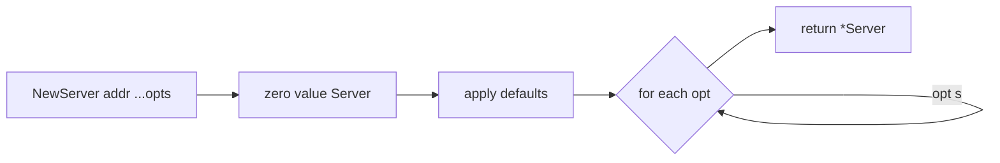

# Functional Options — Junior

## 1. The problem this pattern solves

You want to configure a `Server`. The Server has many tunable knobs: address, read timeout, write timeout, idle timeout, TLS config, logger, max connections. In Go there is no method overloading and there are no default arguments. The naive solutions all hurt:

```go
// Telescoping constructors — every new option means a new function
func NewServer(addr string) *Server
func NewServerWithTimeout(addr string, timeout time.Duration) *Server
func NewServerWithTimeoutAndLogger(addr string, timeout time.Duration, l *log.Logger) *Server
// ...this explodes combinatorially.
```

```go
// One giant config struct — exported, mutable, every field is public
type Config struct {
    Addr         string
    ReadTimeout  time.Duration
    WriteTimeout time.Duration
    IdleTimeout  time.Duration
    TLS          *tls.Config
    Logger       *log.Logger
    MaxConns     int
}
func NewServer(c Config) *Server
```

The struct works but has problems we will spell out in §3. Functional options are Go's idiomatic answer: keep the constructor signature small, let the caller pass zero or more *functions* that mutate the configuration, and choose sensible defaults inside the constructor.

```go
s := NewServer(":8080",
    WithReadTimeout(5 * time.Second),
    WithLogger(myLogger),
)
```

That call reads like English, requires no struct literal, allows zero options, and lets you add new options later without breaking callers. This file walks through how it works, why it's idiomatic, and the small set of rules that make it correct.

---

## 2. Table of Contents

1. [The problem this pattern solves](#1-the-problem-this-pattern-solves)
2. [Table of Contents](#2-table-of-contents)
3. [The minimum implementation](#3-the-minimum-implementation)
4. [Why a config struct is not enough](#4-why-a-config-struct-is-not-enough)
5. [The four pieces](#5-the-four-pieces)
6. [Option naming conventions](#6-option-naming-conventions)
7. [Defaults belong in the constructor](#7-defaults-belong-in-the-constructor)
8. [What an Option closure captures](#8-what-an-option-closure-captures)
9. [Required vs optional parameters](#9-required-vs-optional-parameters)
10. [A second worked example: HTTP client](#10-a-second-worked-example-http-client)
11. [Common mistakes a junior makes](#11-common-mistakes-a-junior-makes)
12. [Tricky points](#12-tricky-points)
13. [Quick test](#13-quick-test)
14. [Cheat sheet](#14-cheat-sheet)
15. [What to learn next](#15-what-to-learn-next)

---

## 3. The minimum implementation

The smallest correct version of the pattern. Read it once, then we will dissect it.

```go
package server

import (
    "log"
    "os"
    "time"
)

type Server struct {
    addr         string
    readTimeout  time.Duration
    writeTimeout time.Duration
    logger       *log.Logger
}

// Option is the canonical type name. It is a function that mutates *Server.
type Option func(*Server)

// Each "With" function returns an Option that sets one field.
func WithReadTimeout(d time.Duration) Option {
    return func(s *Server) { s.readTimeout = d }
}

func WithWriteTimeout(d time.Duration) Option {
    return func(s *Server) { s.writeTimeout = d }
}

func WithLogger(l *log.Logger) Option {
    return func(s *Server) { s.logger = l }
}

// NewServer takes the required arg first, then a variadic list of Options.
func NewServer(addr string, opts ...Option) *Server {
    s := &Server{
        addr:         addr,
        readTimeout:  30 * time.Second,            // sensible default
        writeTimeout: 30 * time.Second,            // sensible default
        logger:       log.New(os.Stderr, "", 0),   // sensible default
    }
    for _, opt := range opts {
        opt(s)
    }
    return s
}
```

Usage:

```go
// Zero options — all defaults.
s1 := NewServer(":8080")

// One option.
s2 := NewServer(":8080", WithLogger(myLogger))

// Several options, any order.
s3 := NewServer(":8080",
    WithReadTimeout(5*time.Second),
    WithWriteTimeout(10*time.Second),
    WithLogger(myLogger),
)
```

That is the whole pattern. The rest of this document explains *why* each line is the way it is.

---

## 4. Why a config struct is not enough

The config-struct alternative looks attractive. Let's spell out the four reasons functional options beat it for *exported* APIs.

### 4.1 Zero value ambiguity

```go
type Config struct {
    ReadTimeout time.Duration  // zero means... what?
}
```

If a caller passes `Config{}`, did they want a `ReadTimeout` of zero (which usually means "no timeout — block forever") or did they want the library's default? You cannot tell. With options, *not passing* `WithReadTimeout(...)` is unambiguously "use the default". The library sets the default; the caller only sets what they want to override.

### 4.2 Default evolution

Say you ship `Config{ReadTimeout: 30s}` as the default. A year later you change the default to `60s`. Callers who passed `Config{}` were getting `30s` (your zero-replacement code) and now get `60s` — but they never asked. With options, the default lives only in the constructor: callers who said nothing still get the new default; callers who said `WithReadTimeout(30 * time.Second)` are unaffected.

### 4.3 Adding new options is non-breaking

Add a new field to an exported struct: every caller using a positional literal (`Config{":8080", 30 * time.Second, nil}`) breaks. Add a new `WithX` option: every existing caller compiles unchanged.

### 4.4 Validation and dependencies

```go
WithTLS(cfg *tls.Config) Option {
    return func(s *Server) {
        if cfg == nil { return }
        s.tls = cfg
    }
}
```

The option is a function — it can validate, transform, or refuse silently. A config struct field is just a slot; validation has to live in the constructor as a long block of post-hoc checks. With options, the check sits next to the thing it checks.

### When the config struct *is* fine

Two cases where you should prefer a config struct, not options:

- **Internal APIs** within one package, where no compatibility cost exists.
- **Highly stable configurations** with no defaults to worry about — for example, `tls.Config` itself. The standard library uses a struct here for a good reason: every field is conceptually independent, the defaults are well-known, and the struct is the *thing* (not just configuration for some other thing).

If the API is exported, has defaults, and might grow new knobs over time — use functional options.

---

## 5. The four pieces

Every functional-options implementation has the same four pieces.

| Piece | Job |
|-------|-----|
| The target type (`Server`) | Holds the configured state |
| The `Option` type | A function that mutates the target |
| The `WithX` functions | Each returns one `Option` |
| The constructor | Sets defaults, applies options in order, returns the target |

The pattern is so regular that once you've seen one, you can write the next from memory. Watch for the small mistakes a beginner makes — they all live in one of these four pieces.



---

## 6. Option naming conventions

There is a community convention. Follow it, because every reader of your code knows it.

| Convention | Example |
|------------|---------|
| Each option function is named `WithX` | `WithTimeout`, `WithLogger`, `WithTLS` |
| The option *type* is `Option` (or `<TypeName>Option` if multiple types share the package) | `type Option func(*Server)` |
| Required parameters come **before** the variadic options | `NewServer(addr string, opts ...Option)` |
| `New<Type>` returns the type, not an error, unless an option can fail | `func NewServer(...) *Server` vs `func NewServer(...) (*Server, error)` |

A few packages use `<Verb>X` instead of `With<X>` — for example `SetTimeout`. The reason `With` won is that it reads naturally inside the constructor call: `NewServer(":8080", WithTimeout(5*time.Second))` is one sentence. Use `With` unless there's a strong local convention against it.

If you have multiple option-taking types in the same package, qualify the option type:

```go
type ServerOption func(*Server)
type ClientOption func(*Client)
```

Otherwise both `WithTimeout` functions would have the same `Option` return type and the compiler couldn't distinguish them at the call site.

---

## 7. Defaults belong in the constructor

This is the rule most beginners get wrong.

```go
// Wrong — default in the option function
func WithReadTimeout(d time.Duration) Option {
    return func(s *Server) {
        if d == 0 {
            d = 30 * time.Second   // "default"
        }
        s.readTimeout = d
    }
}
```

The option function should not know about defaults. If the caller passes `WithReadTimeout(0)` they may genuinely mean zero. The constructor sets the field to the default *first*, then options run, so anything the caller didn't override stays at the default.

```go
// Right — default in the constructor, option is dumb
func WithReadTimeout(d time.Duration) Option {
    return func(s *Server) { s.readTimeout = d }
}

func NewServer(addr string, opts ...Option) *Server {
    s := &Server{
        addr:        addr,
        readTimeout: 30 * time.Second,   // default lives here
    }
    for _, opt := range opts {
        opt(s)
    }
    return s
}
```

One source of truth for each default. Easier to update. Easier to test.

---

## 8. What an Option closure captures

`WithLogger(myLogger)` returns a function. The function *captures* `myLogger` — the variable name disappears, the value is now sealed inside the closure.

```go
opt := WithLogger(myLogger)
// opt is now a function: func(s *Server) { s.logger = myLogger }
myLogger = nil       // doesn't affect opt — opt has its own copy of the *log.Logger value
opt(srv)             // srv.logger == the original myLogger (a *log.Logger value)
```

Two things to internalize:

1. The closure captures the *value* of the variable at the time `WithLogger` is called, not the variable itself, when the captured thing is a value type (string, int, bool, slice header, pointer).
2. If the captured thing is a *pointer*, you've captured the pointer value — mutations to the pointed-at object still show up later.

```go
// Pointer capture — mutations are visible
mu := &myMutableStruct{Field: 1}
opt := WithSomething(mu)
mu.Field = 99
opt(srv)             // srv now sees Field=99 because it holds the same pointer
```

This matters most when you `WithLogger`-style with a pointer to a buffered logger or a `*tls.Config`. If you mutate that struct after creating the option, the server's view changes too. Usually fine; occasionally a bug. Worth knowing.

---

## 9. Required vs optional parameters

Functional options are for *optional* settings. Required parameters should be positional arguments — making them options means the caller can forget them.

```go
// Wrong — caller can omit the required addr
func NewServer(opts ...Option) *Server { ... }
// caller: NewServer()   // compiles fine, server has no address — runtime bug

// Right — addr is positional, can't be forgotten
func NewServer(addr string, opts ...Option) *Server { ... }
// caller: NewServer()   // compile error
```

If a required parameter can fail (network address parsing, TLS cert loading), the constructor should return an error:

```go
func NewServer(addr string, opts ...Option) (*Server, error) {
    if addr == "" {
        return nil, errors.New("server: addr is required")
    }
    s := &Server{addr: addr, /* defaults */}
    for _, opt := range opts {
        opt(s)
    }
    return s, nil
}
```

Don't lean on the type system to enforce required-ness through option types. Keep it positional and obvious.

---

## 10. A second worked example: HTTP client

Re-do the pattern with a different domain so the shape stays in your head. A small HTTP client.

```go
package httpclient

import (
    "net/http"
    "time"
)

type Client struct {
    httpClient *http.Client
    baseURL    string
    userAgent  string
    headers    map[string]string
    retries    int
}

type Option func(*Client)

func WithTimeout(d time.Duration) Option {
    return func(c *Client) { c.httpClient.Timeout = d }
}

func WithUserAgent(ua string) Option {
    return func(c *Client) { c.userAgent = ua }
}

func WithHeader(key, value string) Option {
    return func(c *Client) {
        if c.headers == nil {
            c.headers = make(map[string]string)
        }
        c.headers[key] = value
    }
}

func WithRetries(n int) Option {
    return func(c *Client) { c.retries = n }
}

func NewClient(baseURL string, opts ...Option) *Client {
    c := &Client{
        httpClient: &http.Client{Timeout: 30 * time.Second},
        baseURL:    baseURL,
        userAgent:  "default-client/1.0",
        headers:    nil,
        retries:    3,
    }
    for _, opt := range opts {
        opt(c)
    }
    return c
}
```

Three things worth pointing out:

1. **`WithHeader` can be called multiple times.** Each call adds one header. The pattern doesn't change — only the option's behaviour is "additive" rather than "replacing".
2. **Lazy map allocation.** The default `headers` is `nil`. The option lazily initialises the map on first use, so callers who never call `WithHeader` don't allocate.
3. **The constructor handles cross-option interactions.** If timeout and retries had to be coupled (e.g., total budget = timeout × retries), that coupling logic lives in the constructor *after* the options loop, not in any individual option.

---

## 11. Common mistakes a junior makes

### 11.1 Returning `Option` by reference

```go
// Wrong — Option is a function value, no reason to wrap it
func WithLogger(l *log.Logger) *Option { ... }

// Right — return the value type
func WithLogger(l *log.Logger) Option { ... }
```

A function value is already small (a function pointer + closure pointer). Wrapping it in `*Option` adds an allocation and indirection for no benefit.

### 11.2 Mutating a shared default

```go
// Wrong — defaults stored in a package-level variable
var defaultHeaders = map[string]string{"User-Agent": "default"}

func NewClient(opts ...Option) *Client {
    c := &Client{headers: defaultHeaders}   // points at shared map
    for _, opt := range opts { opt(c) }
    return c
}
```

`WithHeader(...)` then mutates `defaultHeaders`, and the next call to `NewClient` sees the mutation. Copy the map (or build a new one) in the constructor.

### 11.3 Forgetting that order matters

Options run in the order the caller passed them. If `WithDebug()` enables verbose logging and `WithLogger(l)` swaps in a logger, the order changes which logger sees the debug flag.

```go
NewServer(":8080", WithDebug(), WithLogger(quietLogger))
// quietLogger ends up debug-enabled
NewServer(":8080", WithLogger(quietLogger), WithDebug())
// quietLogger ends up debug-enabled too (debug is a flag, not a fact about a specific logger)
```

Most options don't interact. When they do, the *constructor* should handle the ordering, not the caller. We come back to this in [middle.md](middle.md).

### 11.4 Treating `Option` as a no-op when validation fails

```go
// Wrong — silently swallow invalid input
func WithTimeout(d time.Duration) Option {
    return func(s *Server) {
        if d < 0 { return }   // silently ignored
        s.readTimeout = d
    }
}
```

The caller passed `WithTimeout(-1)` expecting *something* to happen. Silent skip masks a bug. Either validate at option-construction time (panic on garbage input, since it's a programmer error caught at compile-test time), or thread validation through a fallible constructor (`NewServer(...) (*Server, error)`).

We treat the validation choices in detail in [middle.md](middle.md) §4.

---

## 12. Tricky points

### 12.1 `nil` Option in the variadic slice

```go
opts := []Option{WithLogger(l), nil, WithRetries(5)}
NewServer(":8080", opts...)
// inside the constructor: opt(s) — panic on the nil entry
```

If you accept options from outside (loaded from config, built dynamically), defensive code should skip nils:

```go
for _, opt := range opts {
    if opt == nil { continue }
    opt(s)
}
```

Whether to harden against this is a style call. Many popular libraries don't — they consider passing `nil` a programmer bug. Either is defensible. Be consistent within your package.

### 12.2 An option that needs to "see" other options

What if `WithTLS` makes sense only after `WithAddr`? The pattern doesn't let one option read another. Two ways out:

- **Defer cross-field reasoning to the constructor.** Each option sets its own field; the constructor, after the loop, validates the combination.
- **Use a builder pattern instead.** If the dependencies are complex enough that the constructor's post-validation gets ugly, the wrong tool is functional options. See `02-builder-pattern` for that case.

### 12.3 Recording call order vs ignoring it

If you want to apply options in a specific order regardless of caller order, sort them inside the constructor — but this is almost always overengineering. Order is the caller's contract. Don't take it away from them silently.

---

## 13. Quick test

**Q1.** Why is this option function wrong?

```go
func WithTimeout(d time.Duration) Option {
    if d <= 0 {
        d = 30 * time.Second
    }
    return func(s *Server) { s.readTimeout = d }
}
```

<details><summary>Answer</summary>

The default lives in the option, not in the constructor. If `NewServer` later changes its default to `60 * time.Second`, callers who passed `WithTimeout(0)` still get `30s`. Defaults must have one source of truth, and that source is the constructor's initial struct literal.
</details>

**Q2.** What's the output?

```go
package main

import "fmt"

type T struct{ v int }
type Option func(*T)

func With(n int) Option { return func(t *T) { t.v = n } }

func New(opts ...Option) *T {
    t := &T{v: 10}
    for _, o := range opts { o(t) }
    return t
}

func main() {
    t := New(With(20), With(30), With(40))
    fmt.Println(t.v)
}
```

<details><summary>Answer</summary>

`40`. Options run in order; each call to `With` returns a function that overwrites `t.v`. The last one wins.
</details>

**Q3.** Should this constructor return an error?

```go
func NewServer(addr string, opts ...Option) *Server {
    s := &Server{addr: addr}
    for _, opt := range opts { opt(s) }
    return s
}
```

<details><summary>Answer</summary>

Depends. If no option can fail and there's no validation, no. If you want to validate cross-option invariants (e.g., `readTimeout > 0`, `tls` and `addr` consistent), then yes — return `(*Server, error)`. Functional-options purists keep the constructor infallible and put validation in `s.Validate()` or in `s.Start()`. Both are valid.
</details>

---

## 14. Cheat sheet

| What | How |
|------|-----|
| Option type | `type Option func(*T)` |
| Option constructor name | `WithX`, returns `Option` |
| Apply options | `for _, opt := range opts { opt(t) }` |
| Defaults | Set in constructor *before* the loop |
| Required params | Positional, *before* `opts ...Option` |
| Validation | After the loop; return `error` if needed |
| Multiple targets in one package | Suffix the option type (`ServerOption`, `ClientOption`) |
| Nil-safe | `if opt == nil { continue }` — optional, be consistent |

---

## 15. What to learn next

In order:

1. **[middle.md](middle.md)** — Generic options, error-returning options, options as a slice, applying options to nested structs, comparison with the config-struct pattern in detail.
2. **[02-builder-pattern](../02-builder-pattern/)** — When functional options aren't enough (complex multi-stage construction, conditional fields).
3. **[03-strategy-pattern](../03-strategy-pattern/)** — A related pattern where the *behaviour*, not just configuration, is what varies.

The functional-options pattern is one of the few that Go originated rather than borrowed. It exists because of the language's small surface (no overloading, no defaults, no keyword args) — and once you've internalised it, you'll see it in nearly every well-designed Go library: `grpc-go`, `zap`, `chi`, `tracer`, `prometheus`. Read those packages with this file in hand.
