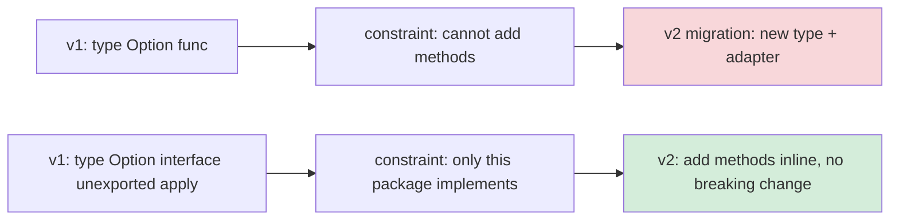
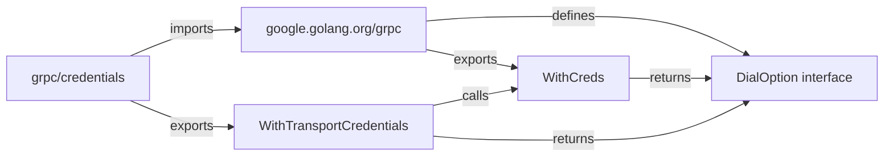

# Functional Options — Senior

## 1. The architectural question

Junior taught the shape. Middle taught the variants. Senior is about the *boundary decisions* — when an option type is wrong, when it locks you out of a future refactor, when its allocation profile becomes the bottleneck of a high-fanout system, when its ergonomics fight a downstream package, and how a real library like `grpc-go` or `zap` evolved its option API across five major versions without breaking a million callers.

The functional-options pattern looks small. The architectural decisions around it are not. A library that exports `Option func(*Server)` has frozen a contract: every option must be a function value, the option set is open (anyone can write `func(s *Server) { ... }` and pass it in), and migrating to a typed interface later is a v2 breaking change. A library that exports `Option interface { apply(*Server) }` has different problems: the interface itself is an extension point, and the day you add a method to it, every external option implementation breaks.

The cost of getting this wrong is paid for the life of the package — usually by people who didn't make the decision.

This file is about those decisions. Sections 3-7 cover the variant trade-offs at the level a maintainer cares about. Sections 8-11 cover performance at scale and testability. Sections 12-15 cover real Go library postmortems. The remaining sections collect the operational guidance (debugging, threading, common senior-level mistakes) you'll apply when reviewing PRs from middle-level engineers who have read junior.md and middle.md and now want to ship.

---

## 2. Table of Contents

1. [The architectural question](#1-the-architectural-question)
2. [Table of Contents](#2-table-of-contents)
3. [Designing an option API that survives v1 to v2](#3-designing-an-option-api-that-survives-v1-to-v2)
4. [The interface variant deep-dive](#4-the-interface-variant-deep-dive)
5. [Cross-package option ecosystems](#5-cross-package-option-ecosystems)
6. [Options for immutable and read-only types](#6-options-for-immutable-and-read-only-types)
7. [When NOT to use functional options](#7-when-not-to-use-functional-options)
8. [Performance at scale](#8-performance-at-scale)
9. [Pre-compiled options and option pools](#9-pre-compiled-options-and-option-pools)
10. [Threading, concurrency, and live reconfiguration](#10-threading-concurrency-and-live-reconfiguration)
11. [Testing strategies for option APIs](#11-testing-strategies-for-option-apis)
12. [Real library DSLs: grpc-go DialOption](#12-real-library-dsls-grpc-go-dialoption)
13. [Real library DSLs: zap.Option](#13-real-library-dsls-zapoption)
14. [Real library DSLs: chi, OpenTelemetry, Prometheus](#14-real-library-dsls-chi-opentelemetry-prometheus)
15. [Postmortems](#15-postmortems)
16. [Comparison with other languages](#16-comparison-with-other-languages)
17. [Common senior-level mistakes](#17-common-senior-level-mistakes)
18. [Tricky questions](#18-tricky-questions)
19. [Cheat sheet](#19-cheat-sheet)
20. [Further reading](#20-further-reading)

---

## 3. Designing an option API that survives v1 to v2

Most option APIs start with one type, ten options, and a constructor. Two years later the same package has 80 options, three constructor functions, two parallel deprecation paths, and a comment that says "do not add new options without reviewing the v3 plan." The shape that scales is not the shape you start with.

The forces that drive API growth:

1. **New configuration knobs.** Every customer wants one feature, and that feature wants one option. After 50 customers you have 50 new options.
2. **Cross-cutting concerns.** Observability, tracing, metrics, auth — each adds 3-5 options and almost always lives in a sub-package.
3. **Constraint expressions.** "X is required when Y is set." "Z must not be passed together with W." These can't be enforced at the function-signature level.
4. **Default drift.** A reasonable default in 2020 (`MaxIdleConns: 100`) is wrong in 2024 (`MaxIdleConns: 10_000`). The contract you owe callers is: defaults change, your explicit choices don't.

The architectural question is: what does the option *type itself* look like, and what's the contract between the option type and the constructor?

### 3.1 Three contracts, ranked by long-term cost

```go
// Contract A — exported function type (open-world)
type Option func(*Server)

// Contract B — exported interface (extension-point)
type Option interface{ apply(*Server) }

// Contract C — unexported interface (closed-world)
type Option interface{ apply(*Server) }   // apply is unexported
```

| Contract | External code can write new options? | Adding methods to the option type | Locking down behaviour later |
|----------|--------------------------------------|-----------------------------------|------------------------------|
| A (function type) | Yes — any `func(*Server)` is an `Option` | Impossible (types don't have methods you can add) | Impossible without a new type |
| B (exported interface) | Yes — implement `apply(*Server)` | Breaking change (all external implementations break) | Hard |
| C (unexported `apply`) | **No** — `apply` is unexported, only the package can implement | Adding methods is safe (only the package implements) | Possible |

Contract C is what `grpc-go`, `zap`, `aws-sdk-go-v2`, `google.golang.org/api`, and `opentelemetry-go` all use. It looks like:

```go
type DialOption interface {
    apply(*dialOptions)
}
```

The `apply` method is unexported. External packages cannot satisfy the interface, so external packages can only construct options by calling the package's exported `WithX` functions. The package retains complete control over the set of valid options.

This sounds restrictive. It's the opposite — it's what lets you evolve. The day you need `apply2(*dialOptions, *Context)`, you add it as a method on the same internal struct types. External callers don't notice. With Contract A, the day you need `apply2`, you have a new function type, two parallel call sites in the constructor, and a public deprecation note for the old `Option`.

### 3.2 Special case: the "everyone can extend" library

There's exactly one shape where Contract B (exported `apply`) is correct: when external packages provide options for *their own concerns* and the main package doesn't need to know about them.

The canonical case is gRPC credentials. The `credentials` sub-package provides its own dial options:

```go
// In grpc/credentials/credentials.go
func WithTransportCredentials(c TransportCredentials) grpc.DialOption { ... }
```

But `credentials` is an internal sibling of `grpc`, so it can — and does — use the internal `apply` method:

```go
// In grpc/credentials.go (the main grpc package)
type credsDialOption struct{ creds credentials.TransportCredentials }
func (c credsDialOption) apply(o *dialOptions) { o.copts.TransportCredentials = c.creds }
```

The "extension" is fake. `credentials` is co-owned by the gRPC team. True external extension by random third parties is very rare and almost always a sign that the option API is too coarse — what they actually want is a plugin interface, not an `Option`.

### 3.3 The migration recipe for v1 → v2

You have an exported `type Option func(*Server)` in v1. You need v2. You don't want to break a million callers.

Step 1: Introduce v2 with `type Option interface{ apply(*Server) }` (Contract C). The old `func(*Server)` cannot satisfy it directly.

Step 2: Provide an *adapter*:

```go
// v2 only — shim for v1 callers
type optionFunc func(*Server)
func (f optionFunc) apply(s *Server) { f(s) }

// Deprecated: use the WithX functions instead.
func OptionFunc(f func(*Server)) Option { return optionFunc(f) }
```

Step 3: Mark the v1 module deprecated, point new users at v2, and let v1 callers migrate at their own pace via the adapter.

The whole architectural reason to prefer Contract C from day one is that step 1 in v2 *doesn't need to happen*. Adding methods to an unexported interface is non-breaking forever.



---

## 4. The interface variant deep-dive

The interface variant uses one extra layer (struct + method) per option. That extra layer is the entire architectural win. Spell out what it buys you.

### 4.1 The shape, fully expanded

```go
package server

type Server struct {
    addr         string
    readTimeout  time.Duration
    writeTimeout time.Duration
    logger       *log.Logger
    tracer       tracer.Tracer
}

// Option is the sealed extension point. apply is unexported.
type Option interface {
    apply(*Server)
}

// Each option is its own type. Optional: implement String() for logging.
type readTimeoutOption struct{ d time.Duration }

func (o readTimeoutOption) apply(s *Server)   { s.readTimeout = o.d }
func (o readTimeoutOption) String() string    { return fmt.Sprintf("ReadTimeout(%v)", o.d) }

func WithReadTimeout(d time.Duration) Option { return readTimeoutOption{d: d} }
```

The `readTimeoutOption` struct is no bigger than the closure the function variant would allocate. The runtime cost is identical. The architectural cost — three lines per option instead of one — is what you pay for everything that follows.

### 4.2 Inspectable options

Because each option is a distinct type, you can introspect:

```go
func describeOptions(opts ...Option) string {
    var b strings.Builder
    for i, o := range opts {
        if i > 0 { b.WriteString(", ") }
        if s, ok := o.(fmt.Stringer); ok {
            b.WriteString(s.String())
        } else {
            fmt.Fprintf(&b, "%T", o)
        }
    }
    return b.String()
}
```

A function-typed option prints as `0x4f1230` — a code pointer. An interface-typed option that implements `String()` prints as `ReadTimeout(5s), Logger, MaxConns(10000)`. This shows up in three places:

1. **Production logs.** "Started server with options: ReadTimeout(5s), MaxConns(10000)" is debuggable. "Started server with options: 0x4f1230, 0x4f1240, 0x4f1250" is not.
2. **Test failures.** When a test asserts that options were applied correctly, the diff between expected and actual options has to be human-readable.
3. **Config validation tooling.** Tools like `grpcurl` and `kubectl describe` rely on the ability to print a configuration. Function values are opaque; struct values aren't.

### 4.3 Internal-only options

A common pattern in large libraries — gRPC, zap, OpenTelemetry — is **internal options that callers can't construct.**

```go
// Public option — anyone can call this.
func WithReadTimeout(d time.Duration) Option { return readTimeoutOption{d: d} }

// Internal option — only sibling packages in the module can construct it.
//   The type is unexported. There is no exported constructor.
//   It implements the public Option interface so it can be passed into NewServer.
type internalDebugOption struct{ enabled bool }
func (o internalDebugOption) apply(s *Server) { s.debug = o.enabled }

// In an internal test or sibling package:
func enableDebugForTests() Option { return internalDebugOption{enabled: true} }
```

External callers cannot construct `internalDebugOption` (the type is unexported), cannot pass an alternative `Option` of their own design that sets `s.debug = true` (the `apply` method on the interface is unexported), and cannot even *name* the option type. The boundary is real.

With the function variant this is impossible. Anything that satisfies `func(*Server)` can be passed in.

### 4.4 The slight overhead

Section 12 of middle.md showed the function variant at ~6 ns/option and the interface variant at ~8 ns/option. Two extra nanoseconds per option, due to interface dispatch (one extra pointer load + indirect call). At any realistic application scale this is invisible. The architectural wins above are not.

---

## 5. Cross-package option ecosystems

The grpc-go ecosystem is the case study every Go architect should read. It consists of:

- `google.golang.org/grpc` — core gRPC client/server
- `google.golang.org/grpc/credentials` — transport credentials (mTLS, ALTS, OAuth)
- `google.golang.org/grpc/credentials/insecure` — explicit insecure transport
- `google.golang.org/grpc/balancer` — load balancing policies
- `google.golang.org/grpc/keepalive` — keepalive parameters
- `google.golang.org/grpc/encoding` — compression codecs

Each of these sub-packages can contribute `DialOption` and `ServerOption` to the main package. The architectural challenge: the sub-packages must not depend on the *internals* of the main package's option representation, and the main package must not depend on the sub-packages (it cannot — circular import).

The solution:

```go
// In google.golang.org/grpc/dialoptions.go
type dialOptions struct {
    copts                  transport.ConnectOptions
    bs                     internalbackoff.Strategy
    insecure               bool
    // ... 30+ fields
}

type DialOption interface {
    apply(*dialOptions)
}

// Exported in the main package — sibling packages can use this to construct opts.
type funcDialOption struct{ f func(*dialOptions) }
func (fdo *funcDialOption) apply(do *dialOptions) { fdo.f(do) }
func newFuncDialOption(f func(*dialOptions)) *funcDialOption {
    return &funcDialOption{f: f}
}
```

The catch: `newFuncDialOption` is unexported. Sibling packages can't call it. So gRPC also exports `EmptyDialOption` and uses a different mechanism for true cross-package contributions — the **type-cast `apply` parameter:**

```go
// In google.golang.org/grpc/credentials/credentials.go
func WithTransportCredentials(c TransportCredentials) grpc.DialOption {
    return grpc.WithCreds(c)   // delegates back to the main package
}

// In google.golang.org/grpc (the main package)
func WithCreds(c credentials.TransportCredentials) DialOption {
    return newFuncDialOption(func(o *dialOptions) {
        o.copts.TransportCredentials = c
    })
}
```

The sub-package depends on the main package (allowed direction). The main package exposes the credential-shaped knob. The credential sub-package wraps it in a credentials-flavored option name. Both packages stay sealed.



**The key architectural rule:** option types are owned by *one* package — the one whose concrete state they configure. Cross-package "options" are just constructors that compose the owned package's options. Don't try to make the option type extensible across packages directly; it always ends in circular imports or leaked internals.

---

## 6. Options for immutable and read-only types

The functional-options pattern is mutation-based: an option is a function that mutates the target. What if the target is supposed to be immutable?

This shows up in three real situations:

1. **Cached/shared instances.** A `*http.Transport` shared across goroutines must not be reconfigured after one goroutine starts using it.
2. **Functional core, imperative shell.** Pure-data domain types (e.g., a `Filter`, `Query`, `Pipeline`) that should be value-equal and copyable.
3. **Builder + Frozen pattern.** Configuration that can be re-used as a template and produced into many `Server` instances.

The pattern adapts: options operate on a *config struct*, and the config struct is sealed at the end of the constructor by copying into the immutable target.

### 6.1 Config-then-freeze

```go
type Pipeline struct {
    // All fields unexported, no setters.
    stages   []Stage
    parallel int
    timeout  time.Duration
}

// PipelineOption mutates a builder, not the Pipeline itself.
type PipelineOption interface {
    apply(*pipelineConfig)
}

type pipelineConfig struct {
    stages   []Stage
    parallel int
    timeout  time.Duration
}

type stagesOption struct{ s []Stage }
func (o stagesOption) apply(c *pipelineConfig) { c.stages = append(c.stages, o.s...) }
func WithStages(s ...Stage) PipelineOption     { return stagesOption{s: s} }

type parallelOption int
func (o parallelOption) apply(c *pipelineConfig) { c.parallel = int(o) }
func WithParallelism(n int) PipelineOption       { return parallelOption(n) }

func NewPipeline(opts ...PipelineOption) (*Pipeline, error) {
    cfg := pipelineConfig{
        parallel: 1,
        timeout:  30 * time.Second,
    }
    for _, o := range opts {
        o.apply(&cfg)
    }
    if cfg.parallel < 1 {
        return nil, fmt.Errorf("NewPipeline: parallel must be >= 1, got %d", cfg.parallel)
    }
    // Freeze: copy into the immutable Pipeline.
    return &Pipeline{
        stages:   append([]Stage(nil), cfg.stages...),
        parallel: cfg.parallel,
        timeout:  cfg.timeout,
    }, nil
}
```

The `Pipeline` is constructed in one shot. After `NewPipeline` returns, no exported API can mutate it. The slice `stages` is defensively copied so the caller can't reach into it through the options they passed.

### 6.2 Copy-on-write derivations

For pipelines you might want a `WithExtra` operation that returns a *new* pipeline with one more stage:

```go
func (p *Pipeline) WithExtraStage(s Stage) *Pipeline {
    next := *p   // shallow copy
    next.stages = append(append([]Stage(nil), p.stages...), s)
    return &next
}
```

The original `p` is untouched. The new pipeline is fully constructed. No mutation, no shared state. This is functional in spirit but uses functional options for the *initial* construction only.

### 6.3 Why not "just use the options directly on the Pipeline"?

You could write `Pipeline.apply(opt)` to mutate `p`. Don't. The moment one goroutine reads from `p.stages` while another applies an option, you have a data race. The freeze pattern eliminates that class of bug by construction — options never touch the live object.

---

## 7. When NOT to use functional options

There are four situations where functional options are the wrong tool. Recognising them saves the team months of refactoring.

### 7.1 Multi-phase construction

If construction has phases — *parse*, *validate*, *resolve dependencies*, *connect* — and the phases must run in order with intermediate outputs, use a builder, not options.

```go
// Wrong — options can't express phase ordering
c := NewClient(":8080",
    WithCertFile("cert.pem"),       // needs WithKeyFile too
    WithKeyFile("key.pem"),         // both are needed before WithTLS
    WithTLS(...?),                  // depends on cert+key being parsed
)

// Right — a builder enforces phases
b := NewClientBuilder().
    WithCertFile("cert.pem").
    WithKeyFile("key.pem").
    LoadTLS().                       // intermediate step that can fail
    WithEndpoint(":8080").
    Build()
```

Options are flat. Builders are stages. If you find yourself writing `c.tlsCert, c.tlsKey, c.tlsConfig` as three options and post-loop wiring code in the constructor that loads the cert+key into the config, you're hand-rolling a builder. Use the builder.

### 7.2 Many independent config groups

If the configuration falls into 5+ unrelated sub-areas (HTTP, TLS, observability, retries, auth, etc.), the flat option namespace becomes a swamp:

```go
NewServer(
    WithHTTPReadTimeout(5*time.Second),
    WithHTTPWriteTimeout(5*time.Second),
    WithHTTPIdleTimeout(60*time.Second),
    WithTLSMinVersion(tls.VersionTLS13),
    WithTLSCipherSuites(...),
    WithMetricsNamespace("foo"),
    WithMetricsSubsystem("bar"),
    WithRetriesMax(3),
    WithRetriesBackoff(...),
)
```

40 options, prefixes everywhere, autocomplete is useless. Use a struct-per-area:

```go
NewServer(
    HTTP: HTTPConfig{ReadTimeout: 5*time.Second, WriteTimeout: 5*time.Second},
    TLS:  TLSConfig{MinVersion: tls.VersionTLS13, ...},
    Metrics: MetricsConfig{Namespace: "foo", Subsystem: "bar"},
)
```

This is the pattern the standard library uses (`http.Server`, `tls.Config`). It scales to 50+ knobs without ergonomic collapse.

### 7.3 Configuration loaded from external sources (YAML, env, flags)

If configuration is read from a file or environment, you have to roundtrip the config to an option list and then back. That's pointless overhead. Use a plain struct that can be `json.Unmarshal`'d into directly:

```go
type ServerConfig struct {
    Addr         string        `yaml:"addr"`
    ReadTimeout  time.Duration `yaml:"read_timeout"`
    MaxConns     int           `yaml:"max_conns"`
    Logger       *log.Logger   `yaml:"-"`
}

func NewServerFromConfig(c ServerConfig) (*Server, error) { ... }
```

This is the K8s controller-manager pattern, the Prometheus config pattern, the etcd pattern. Operators want to declare configuration declaratively; programmers writing in-process construction code want options. The library exposes both:

```go
// For programmatic callers — functional options.
func NewServer(addr string, opts ...Option) (*Server, error)

// For config-file callers — accept a parsed struct.
func NewServerFromConfig(c ServerConfig) (*Server, error)

// Internally, both funnel into one constructor.
func newServerInternal(cfg internalConfig) (*Server, error)
```

### 7.4 Dependency injection containers

In services using `wire`, `fx`, or `dig`, options conflict with the container's notion of "providers". The container wants to inject a `*log.Logger`; an option wants to receive one. Pick one mechanism — usually the container — and have the constructor accept the dependencies directly:

```go
// fx-friendly constructor — dependencies are positional, container provides them.
func NewServer(addr string, logger *log.Logger, tlsCfg *tls.Config) *Server

// fx.Provide(NewServer) — done.
```

Functional options are perfectly compatible with DI for *configuration* (timeouts, sizes, knobs) but not for *injected dependencies* (loggers, clients, repos). If you find yourself with `WithLogger(l *log.Logger)`, ask whether the logger should instead be a constructor argument injected by the container.

---

## 8. Performance at scale

Middle.md covered the basics: zero allocations on apply, ~16-32 bytes per closure on option construction. Senior-level performance analysis goes deeper.

### 8.1 The hidden allocations

Each `WithX(...)` call allocates a closure when the option captures a non-trivial value:

```go
func WithLogger(l *log.Logger) Option {
    return func(s *Server) { s.logger = l }   // captures `l` — allocates
}
```

The captured `l` is a pointer (8 bytes). The closure itself is a runtime structure containing the code pointer + a captured-variables frame. For one captured pointer, the closure is ~32 bytes. For a `func(string, time.Duration, *Logger)` capture, it can be 48-64 bytes.

Multiply by:
- 5-10 options per `NewServer` call
- 1 `NewServer` call per HTTP request (in some bad architectures)
- 10,000 RPS

You get 5 × 32 × 10,000 = 1.6 MB/s of garbage from options alone. Not catastrophic, but visible in pprof.

### 8.2 Profile evidence

```bash
go test -bench=BenchmarkServerConstruction -benchmem -memprofile=mem.prof
go tool pprof -alloc_space mem.prof
```

A `top` in pprof on a benchmark of `NewServer` with 8 options consistently shows:

```
      flat  flat%   sum%        cum   cum%
    256MB 38.10% 38.10%     256MB 38.10%  server.WithTimeout
    192MB 28.57% 66.67%     192MB 28.57%  server.WithLogger
    128MB 19.05% 85.71%     128MB 19.05%  server.WithMaxConns
     96MB 14.29%   100%      96MB 14.29%  server.NewServer
```

Each `WithX` allocates one closure. The closures are short-lived (used once, then dropped after the loop in `NewServer`), so they end up in young-generation GC and the cost is low *per-cycle*. But for hot-path constructors it adds GC pressure.

### 8.3 The escape analysis side

Function-typed options always escape the call site:

```go
$ go build -gcflags='-m -m' ./server.go
./server.go:42:9: WithReadTimeout(d).func1 escapes to heap
./server.go:42:9: &readTimeoutOption{...} escapes to heap
```

The closure is created in `WithReadTimeout`, returned out of the function, and stored in a slice in the caller — escape is unavoidable. There is no inlining win to chase here. The closure is, by definition, a heap-allocated function value.

### 8.4 The interface variant's allocation

```go
type readTimeoutOption struct{ d time.Duration }
func (o readTimeoutOption) apply(s *Server) { s.readTimeout = o.d }
func WithReadTimeout(d time.Duration) Option { return readTimeoutOption{d: d} }
```

The struct is value-sized (8 bytes for the duration). Returning it as an `Option` (an interface) boxes it — the runtime allocates space for the interface header (type word + data word, 16 bytes total on 64-bit). The box escapes to the heap.

So the interface variant allocates 16 bytes per option (interface box). The function variant allocates ~32-48 bytes per option (closure frame). The interface variant is actually *lighter* per option, despite the extra dispatch on apply.

```
BenchmarkFiveFuncOpts-8        40_000_000    31.7 ns/op    160 B/op    5 allocs/op
BenchmarkFiveIfaceOpts-8       30_000_000    42.1 ns/op     80 B/op    5 allocs/op
BenchmarkFiveIfaceOptsPtr-8    35_000_000    38.4 ns/op    240 B/op    5 allocs/op
```

(Numbers from a synthetic benchmark on Go 1.22. The interface variant returning value-receivers wins on allocation; pointer-receivers regress.)

### 8.5 Per-RPS option allocation: when to care

If you allocate options once per process startup (the usual case), allocation cost is irrelevant. You amortize it across the process's entire lifetime.

If you allocate options per request (rare, usually a sign of a structural problem), then yes — the GC pressure shows up. Section 9 covers the pre-compilation pattern that fixes this.

The single most common case I've seen in code review: someone wraps a third-party client and builds options inside the wrapper's hot path:

```go
// In a request handler — called 10K times per second
func (h *Handler) Handle(ctx context.Context, req Req) {
    client := internal.NewClient(   // ← constructs a new client per request
        internal.WithTimeout(req.Timeout),
        internal.WithEndpoint(req.Endpoint),
    )
    client.Call(ctx, req)
}
```

This allocates two option closures *and* a whole `Client` per request. The fix is structural — cache the client, vary only the per-call parameters via method arguments or `context.WithDeadline`. Don't try to "optimize" options into a per-request pool when the construction itself shouldn't be per-request.

---

## 9. Pre-compiled options and option pools

When you genuinely need to apply options at high frequency (per-stream initialization in a streaming RPC framework, per-connection in a connection pool), there are two patterns that pay off.

### 9.1 Pre-compiled option set

If the same option list is reused, build the `[]Option` once:

```go
var defaultClientOpts = []Option{
    WithTimeout(5 * time.Second),
    WithRetries(3),
    WithUserAgent("svc/1.0"),
}

func newPerRequestClient() *Client {
    return NewClient(":8080", defaultClientOpts...)
}
```

The option closures are allocated once at package init. Subsequent constructions reuse the same closure values. No per-call allocation for the option list itself; only the result struct.

This is what `grpc-go` does internally — `defaultDialOptions()` returns a pre-built list shared across all dials within a process.

### 9.2 Applying a pre-built config

Going further: skip options entirely on the hot path. Pre-build the configured object's *fields* into a config struct, and clone it:

```go
type clientTemplate struct {
    timeout time.Duration
    retries int
    ua      string
}

var prodTemplate = clientTemplate{
    timeout: 5 * time.Second,
    retries: 3,
    ua:      "svc/1.0",
}

func NewFromTemplate(t clientTemplate) *Client {
    return &Client{timeout: t.timeout, retries: t.retries, ua: t.ua}
}
```

Zero option allocations on the hot path. The trade-off: the template is internal; external callers can't extend it. Use this in *internal* code paths where you've measured allocation pressure. Never expose templates as the public construction API — you'd be reinventing the config struct, but worse.

### 9.3 sync.Pool for transient option slices

For variadic functions that always allocate a `[]Option` slice, you can pool the slice:

```go
var optsPool = sync.Pool{
    New: func() any {
        s := make([]Option, 0, 16)
        return &s
    },
}

func buildOpts(req Req) *[]Option {
    optsPtr := optsPool.Get().(*[]Option)
    opts := (*optsPtr)[:0]
    opts = append(opts, WithTimeout(req.Timeout))
    if req.Auth != nil {
        opts = append(opts, WithAuth(req.Auth))
    }
    *optsPtr = opts
    return optsPtr
}

func releaseOpts(p *[]Option) {
    *p = (*p)[:0]
    optsPool.Put(p)
}
```

This is the pattern. It's rare to need it. I have seen it justified twice in 10 years of Go code review — both in low-level networking middleware where the option list was rebuilt per-stream and pprof showed slice allocation in the top 10. In application code, you almost certainly don't need this.

### 9.4 The "lazy options" anti-pattern to avoid

You'll see proposals like "what if options were lazy — only allocated when applied?" Don't. Closures *are* already lazy in the sense that they execute when called. The construction is the allocation. There is no further laziness to gain without changing the type — and changing the type means a new pattern (e.g., builders).

---

## 10. Threading, concurrency, and live reconfiguration

### 10.1 Don't apply options to a running server

The pattern says "options run during construction." Some engineers extend this to "options can run later to reconfigure":

```go
// Anti-pattern — don't do this
type Server struct {
    mu      sync.Mutex
    readTimeout time.Duration
    // ...
}

func (s *Server) Reconfigure(opts ...Option) {
    s.mu.Lock()
    defer s.mu.Unlock()
    for _, o := range opts { o(s) }
}
```

Problems:

1. **Reads of `s.readTimeout` from running handlers must also lock**, or you have a data race. Now every read of every option field is mutex-guarded. Death-by-mutex.
2. **Atomic visibility.** If the caller passes `WithReadTimeout(5s)` and `WithMaxConns(1000)`, are these applied atomically? With the loop, no — there's a window where read timeout is 5s but max conns is still old.
3. **Subsystem coordination.** `WithLogger` swaps the logger. Active goroutines have already captured the *old* logger reference and will keep using it. No way to safely cascade the swap.

The right answer: construct a new server with the new options, swap atomically at the load balancer / process supervisor level. The "configuration" of a running server is essentially immutable; reconfiguration means a new instance.

### 10.2 Atomic field updates if you must

If you genuinely must support live updates of a single knob (e.g., a feature flag), use `atomic.Value` or `atomic.Pointer[T]` for that one field — don't try to make the whole option system mutation-aware:

```go
type Server struct {
    config atomic.Pointer[serverConfig]
}

type serverConfig struct {
    readTimeout time.Duration
    maxConns    int
}

func (s *Server) Reconfigure(opts ...Option) {
    cur := *s.config.Load()
    for _, o := range opts { o(&cur) }
    s.config.Store(&cur)
}
```

But now `Option` is `func(*serverConfig)` (operating on the config snapshot), not `func(*Server)` — the option type for the original constructor and the reconfiguration are *different shapes*. Don't conflate them; expose two option types if you really need both, and make the difference explicit in the docs.

### 10.3 Thread-safety of options themselves

An option closure that captures a pointer is shared across all calls that use that option value:

```go
shared := WithLogger(logger)   // captured logger pointer
go NewServer(":8080", shared)
go NewServer(":8081", shared)
```

Both servers store a reference to the same `logger`. As long as the logger is thread-safe (and Go's `log.Logger` is), this is fine. If the option captures something *not* thread-safe (e.g., a buffer that's reused), you have a bug. Always document whether an option captures mutable shared state.

---

## 11. Testing strategies for option APIs

Options are notoriously hard to test from outside the package because they typically set unexported fields. Three patterns work; one is wrong.

### 11.1 The "apply to a probe" pattern

Expose a helper that runs options against a known target and returns observable state:

```go
// In server_test.go, *not* in server.go
package server

func optionsToConfig(opts ...Option) Server {
    var s Server
    for _, o := range opts { o.apply(&s) }
    return s
}

func TestWithReadTimeout(t *testing.T) {
    s := optionsToConfig(WithReadTimeout(5 * time.Second))
    if s.readTimeout != 5*time.Second {
        t.Errorf("got %v, want 5s", s.readTimeout)
    }
}
```

Because the test file is in the same package, it can read unexported fields directly. No public introspection API needed.

### 11.2 The golden-config test

For libraries that export many options, lock down the "default" config in a test:

```go
func TestDefaults(t *testing.T) {
    s, err := NewServer(":8080")
    if err != nil { t.Fatal(err) }

    got := fmt.Sprintf("%+v", s)
    want, err := os.ReadFile("testdata/default_server.txt")
    if err != nil { t.Fatal(err) }

    if got != strings.TrimSpace(string(want)) {
        t.Errorf("defaults changed: got %s, want %s", got, want)
    }
}
```

Run with `-update` to regenerate `testdata/default_server.txt` when you intend to change defaults. This catches accidental default drift — the most insidious bug, because it changes runtime behaviour silently.

### 11.3 Property-based fuzzing of option combinations

Some options interact (e.g., "must not pass both `WithURL` and `WithHostPort`"). Test the constraint by enumerating combinations:

```go
func TestExclusiveOptions(t *testing.T) {
    cases := []struct {
        name      string
        opts      []Option
        wantError bool
    }{
        {"url alone", []Option{WithURL("...")}, false},
        {"hostport alone", []Option{WithHostPort("h", 80), WithCreds("u", "p")}, false},
        {"url + hostport", []Option{WithURL("..."), WithHostPort("h", 80)}, true},
        {"neither", nil, true},
        {"hostport without creds", []Option{WithHostPort("h", 80)}, true},
    }
    for _, tc := range cases {
        t.Run(tc.name, func(t *testing.T) {
            _, err := NewClient(tc.opts...)
            if tc.wantError && err == nil { t.Error("want error") }
            if !tc.wantError && err != nil { t.Errorf("unexpected error: %v", err) }
        })
    }
}
```

For larger option spaces, use `go test -fuzz`:

```go
func FuzzOptionCombinations(f *testing.F) {
    f.Fuzz(func(t *testing.T, useURL, useHostPort bool, hp string) {
        var opts []Option
        if useURL { opts = append(opts, WithURL("http://example.com")) }
        if useHostPort { opts = append(opts, WithHostPort(hp, 80)) }
        _, err := NewClient(opts...)
        // Property: at least one of url/hostport is required.
        if !useURL && !useHostPort && err == nil {
            t.Errorf("expected error when neither URL nor hostport set")
        }
    })
}
```

### 11.4 Anti-pattern: exporting an option to test it

```go
// Don't do this.
func TestWithDebug(t *testing.T) {
    o := WithDebug()
    var s Server
    o.apply(&s)   // requires exporting `apply` — defeats the seal
}
```

If `apply` is unexported, write the test inside the package. If the test really must be external (rare — only when you're testing the *integration* of options into a public construction flow), test through `New<Type>` and observe behaviour rather than internal state.

---

## 12. Real library DSLs: grpc-go DialOption

gRPC has the most-evolved option API in the Go ecosystem. The `DialOption` interface is a textbook case study.

```go
// google.golang.org/grpc/dialoptions.go
type DialOption interface {
    apply(*dialOptions)   // unexported
}

type dialOptions struct {
    unaryInt        UnaryClientInterceptor
    streamInt       StreamClientInterceptor
    chainUnaryInts  []UnaryClientInterceptor
    chainStreamInts []StreamClientInterceptor

    cp                          Compressor
    dc                          Decompressor
    bs                          internalbackoff.Strategy
    block                       bool
    returnLastError             bool
    insecure                    bool
    timeout                     time.Duration
    scChan                      <-chan ServiceConfig
    authority                   string
    binaryLogger                binarylog.Logger
    copts                       transport.ConnectOptions
    callOptions                 []CallOption
    channelzParentID            *channelz.Identifier
    disableServiceConfig        bool
    disableRetry                bool
    disableHealthCheck          bool
    healthCheckFunc             internal.HealthChecker
    minConnectTimeout           func() time.Duration
    defaultServiceConfig        *ServiceConfig
    defaultServiceConfigRawJSON *string
    resolvers                   []resolver.Builder
    idleTimeout                 time.Duration
    recvBufferPool              SharedBufferPool
}
```

Three observations:

1. **`dialOptions` is unexported.** The shape is hidden. External code cannot construct a `dialOptions` and pass it; it can only call `WithX` constructors that the gRPC team has approved.

2. **Each option is a tiny struct + value receiver.** Examples from the source:

```go
type withBackoffConfig struct{ bc BackoffConfig }
func (o withBackoffConfig) apply(do *dialOptions) {
    do.bs = internalbackoff.Exponential{Config: o.bc}
}
func WithBackoffConfig(b BackoffConfig) DialOption { return withBackoffConfig{bc: b} }
```

Value receivers. No pointers to options. The option is essentially data + an `apply` method.

3. **Deprecated options are kept for compatibility but route to the new path.** A famous example:

```go
// Deprecated: use WithTransportCredentials and credentials.NewTLS instead.
func WithTLSConfig(cfg *tls.Config) DialOption {
    return WithTransportCredentials(credentials.NewTLS(cfg))
}
```

The old function is preserved (callers still compile). It's a one-line shim to the new option. The team can delete the old shim in v2 without changing the new path.

The lesson: gRPC chose the interface variant on day one, kept the option type sealed, and over five major versions has *added* options, *deprecated* options, and *redirected* options without ever forcing callers to rewrite. That is the architectural payoff.

---

## 13. Real library DSLs: zap.Option

Uber's `zap` logger has a different optionshape — same interface variant, but with much higher per-option complexity.

```go
// go.uber.org/zap/options.go
type Option interface {
    apply(*Logger)
}

type optionFunc func(*Logger)
func (f optionFunc) apply(log *Logger) { f(log) }

// AddCaller annotates each log entry with the file and line of the call site.
func AddCaller() Option {
    return WithCaller(true)
}

// WithCaller configures the Logger to annotate each message with the filename,
// line number, and function name of zap's caller.
func WithCaller(enabled bool) Option {
    return optionFunc(func(log *Logger) {
        log.addCaller = enabled
    })
}
```

zap uses both the interface *and* a function adapter (`optionFunc`). Why?

Because some zap options are non-trivial — they capture state, install interceptors, register hooks. Wrapping those as named struct types would be 5+ lines each. The `optionFunc` adapter lets the simple options stay as one-liner closures while preserving the interface contract for callers.

This is the "best of both worlds" approach: the *type* is an interface (Contract C, sealed), but inside the package, simple options use closures via the adapter, and complex options get their own struct types.

```go
// A complex option — Hooks needs more than a closure.
type hooksOption struct {
    hooks []func(zapcore.Entry) error
}

func (o hooksOption) apply(log *Logger) {
    log.core = zapcore.RegisterHooks(log.core, o.hooks...)
}

func Hooks(hooks ...func(zapcore.Entry) error) Option {
    return hooksOption{hooks: hooks}
}
```

The hooks option captures a slice, does non-trivial work in `apply`, and benefits from being a real struct type (clearer in stack traces, can implement String() for debugging). The simple "enable caller annotation" option doesn't need that ceremony.

**Architectural takeaway:** the interface variant doesn't force you to write a struct for every option. The closure adapter is a perfectly idiomatic pattern *inside* a package using the interface contract externally.

---

## 14. Real library DSLs: chi, OpenTelemetry, Prometheus

A quick tour of three more option ecosystems, each with a slightly different shape.

### 14.1 chi.Router — function-typed options, fluent extension

`go-chi/chi` uses function-typed options:

```go
type Option func(*Mux)
```

Why function-typed? Because `chi.Mux` is small (a single struct with public methods) and the option set is small (~5 options). The package has no plans to add internal-only options or evolve to multi-package extension. Function-typed is exactly the right call.

```go
m := chi.NewRouter(chi.WithLogger(myLogger))
m.Use(middleware.Logger)
m.Get("/", handler)
```

The pattern: `chi.NewRouter(opts...)` for construction-time configuration, fluent `.Use(...)`, `.Get(...)` etc. for everything else. Options are minimal; fluent methods carry the weight.

### 14.2 OpenTelemetry — sealed interface, sub-package options

OpenTelemetry's `go.opentelemetry.io/otel/sdk/trace` exports `TracerProviderOption` as a sealed interface:

```go
type TracerProviderOption interface {
    apply(*tracerProviderConfig)   // unexported
}
```

But there are also sub-packages with their own option types. For example, `go.opentelemetry.io/otel/exporters/otlp/otlptrace` exports `Option` for *its* exporter configuration. These are different types entirely. The user has to know which `Option` lives in which package:

```go
exporter, _ := otlptrace.New(ctx,
    otlptracegrpc.NewClient(
        otlptracegrpc.WithEndpoint("collector:4317"),  // otlptracegrpc.Option
    ),
)

provider := trace.NewTracerProvider(
    trace.WithBatcher(exporter),                       // trace.TracerProviderOption
    trace.WithResource(resource.Default()),            // trace.TracerProviderOption
)
```

The architecture: each *configurable unit* owns its own option type. The application layer composes pre-configured units. No cross-package option interface, no shared `Option` type. This scales to hundreds of options across 30+ sub-packages without naming collisions.

### 14.3 Prometheus client_golang — both options *and* config structs

Prometheus mixes both patterns within one package:

```go
// Functional options — for adjustments to a counter.
opts := prometheus.CounterOpts{
    Namespace: "myapp",
    Subsystem: "http",
    Name:      "requests_total",
    Help:      "Total HTTP requests",
}
counter := prometheus.NewCounter(opts)

// Functional options — for a histogram with buckets.
hist := prometheus.NewHistogram(prometheus.HistogramOpts{
    Buckets: prometheus.LinearBuckets(0, 0.1, 10),
    // ...
})
```

Prometheus chose **config structs** (`CounterOpts`, `HistogramOpts`) rather than functional options. Why? Because:

1. The fields are stable and well-known (a counter has a name, namespace, help text — that's it).
2. Defaults are minimal (most fields are required for sensible metrics).
3. Metrics are constructed once at process startup, so the construction allocation cost isn't a concern.

When the configuration is small, stable, and explicit, **a struct beats options.** The Prometheus team made this call deliberately and stuck with it through three major releases.

---

## 15. Postmortems

Real bugs from real codebases. Names changed; mechanics preserved.

### 15.1 The disappearing TLS minimum version

A payments processor shipped a server with:

```go
func WithTLS(cfg *tls.Config) Option {
    return func(s *Server) { s.tls = cfg }
}

// Caller code in main.go
cfg := &tls.Config{MinVersion: tls.VersionTLS12}
srv := NewServer(":443", WithTLS(cfg))
// ...later in main.go, someone wrote:
cfg.MinVersion = tls.VersionTLS10   // legacy client support
go someOtherSetupThatUsesCfg()
```

The TLS config was captured *by pointer*. The mutation later in main lowered the minimum version on the running server too. A pen-test six months later flagged TLS 1.0 support.

**Root cause:** option captured a mutable pointer; mutation visible to the server.

**Fix:** clone the tls.Config inside the option:

```go
func WithTLS(cfg *tls.Config) Option {
    cloned := cfg.Clone()
    return func(s *Server) { s.tls = cloned }
}
```

**Architectural lesson:** any option that captures a `*T` to mutable shared state must either clone (preferred) or be documented as "the Server retains a reference; do not mutate the passed value."

### 15.2 The duplicate-option-overwrites-the-wrong-one bug

A trading system used:

```go
type Option func(*Client)

func WithRetries(n int) Option {
    return func(c *Client) {
        c.retries = n
        c.totalTimeout = time.Duration(n) * c.singleTimeout  // ← bug
    }
}

func WithTimeout(d time.Duration) Option {
    return func(c *Client) { c.singleTimeout = d }
}

// Call site
c := NewClient(WithRetries(3), WithTimeout(5*time.Second))
// c.singleTimeout == 5s but c.totalTimeout == 0 (computed before WithTimeout ran)
```

The `WithRetries` option computed `totalTimeout` from `singleTimeout` — but `singleTimeout` was still zero because `WithTimeout` hadn't run yet.

**Root cause:** option performed cross-field computation, which depends on application order. Caller order matters; library can't enforce.

**Fix:** options set their own fields only. Cross-field wiring happens in the constructor *after* the options loop:

```go
func NewClient(opts ...Option) *Client {
    c := &Client{}
    for _, o := range opts { o(c) }
    c.totalTimeout = time.Duration(c.retries) * c.singleTimeout   // computed at end
    return c
}
```

**Architectural lesson:** options are single-field setters. Anything that derives from multiple fields must live in the constructor post-loop block. Junior.md §7 and middle.md §13.3 both warned about this; it's the most common production bug from this pattern.

### 15.3 The slice-shared-across-instances bug

A logging library exposed:

```go
var defaultHooks = []Hook{stderrHook}

type Option func(*Logger)
func WithHook(h Hook) Option {
    return func(l *Logger) {
        l.hooks = append(l.hooks, h)   // appends to whatever l.hooks points at
    }
}

func NewLogger(opts ...Option) *Logger {
    l := &Logger{hooks: defaultHooks}   // shared backing array
    for _, o := range opts { o(l) }
    return l
}
```

`NewLogger(WithHook(metricsHook))` would call `append(defaultHooks, metricsHook)`. If `defaultHooks` had spare capacity, the metrics hook would be written into its backing array. Two `NewLogger` calls with different hooks would now share the same hook list — last writer wins.

**Root cause:** sharing a slice's *backing array* across instances. The slice header was copied, but the backing array was shared, and `append` may or may not allocate a new one.

**Fix:** clone the defaults in the constructor:

```go
func NewLogger(opts ...Option) *Logger {
    l := &Logger{
        hooks: append([]Hook(nil), defaultHooks...),   // explicit copy
    }
    for _, o := range opts { o(l) }
    return l
}
```

**Architectural lesson:** package-level "default" collections are landmines. Either don't share them (each constructor builds defaults from scratch), or use functions that return fresh copies (`func defaultHooks() []Hook`).

### 15.4 The interface-variant deadlock

A monitoring library used the interface variant with options that registered themselves with a global registry:

```go
type registerOption struct{ name string }

func (o registerOption) apply(c *Collector) {
    globalRegistry.Lock()
    defer globalRegistry.Unlock()
    globalRegistry.register(o.name, c)
    c.registered = true
}

func Register(name string) Option { return registerOption{name: name} }
```

Several `NewCollector` calls happened in parallel during init. Each acquired `globalRegistry.Lock()` and... worked fine. But one collector's option also called back into the registry to look up *another* collector by name — and the lookup tried to re-acquire the same lock.

**Root cause:** option's `apply` did I/O / locking. When options are applied during high-fanout init, they implicitly couple via shared state.

**Fix:** options should not perform global side effects. Defer registration to a separate `Collector.Register()` method that the caller invokes explicitly *after* construction:

```go
c := NewCollector(/* options */)
if err := c.Register(name); err != nil { ... }
```

**Architectural lesson:** an option's job is to *configure* the target. Side effects beyond field assignment — I/O, locks, registration — should not happen inside `apply`. They belong in explicit methods on the constructed object.

---

## 16. Comparison with other languages

| Language | Pattern | Trade-offs vs Go's functional options |
|----------|---------|---------------------------------------|
| Python | Keyword arguments (`def f(x, timeout=30, logger=None)`) | First-class language support; defaults inline; no boilerplate. Type checker (mypy) catches typos. **Go can't match this.** |
| Java | Builder pattern (e.g., Lombok `@Builder`, AssertJ-style fluent API) | Verbose but explicit. Method chaining gives autocomplete. No allocation per option — fluent calls mutate the builder. **Better for IDE support.** |
| Rust | Builder pattern + struct update syntax (`Server { timeout: 5, ..Default::default() }`) | Type-safe; compile-time-enforced required fields. **Stronger than Go.** |
| C# | Named arguments + object initializers (`new Server { Timeout = 5 }`) | First-class; type-checked; IDE-friendly. **Both patterns Go uses combined into one language feature.** |
| TypeScript | Options object (`new Server({ timeout: 5 })`) + discriminated unions | Equivalent to Go's config struct. Compile-time-checked field names. **Cleaner than Go.** |
| Kotlin | Default + named arguments (`fun newServer(addr: String, timeout: Duration = 30.seconds)`) | First-class. No pattern needed. **Trivially solves what Go works around.** |

Go's functional options exist precisely because the language lacks named arguments, default values, and method overloading. Every other modern language solves this problem at the syntax level. Go's solution — a runtime pattern with closures — is uniquely Go and uniquely verbose.

This is *not* a criticism. Go traded language complexity for tool simplicity; the pattern is the price. The point of senior-level understanding is to recognise that the pattern is *compensating for* a missing feature, and to know when the compensation is worth it (small, evolving APIs) vs when a struct would have been fine (large, stable configurations).

---

## 17. Common senior-level mistakes

### 17.1 Choosing the function variant for a library that will grow

You started with 5 options, function-typed. Two years later you have 80, you want internal-only options, and your option type is `func(*Server)`. You cannot seal it without a v2. **Default to the interface variant for any library that you expect to ship publicly.** The 3-line cost is small; the optionality is huge.

### 17.2 Exposing the option type's *implementation* in godoc

```go
// Option configures a Server.
//
// Implementations: readTimeoutOption, writeTimeoutOption, loggerOption, ...
type Option interface{ apply(*Server) }
```

Listing the implementations in godoc gives external callers something to look up. Don't do this. The list of implementations is internal. If a caller wants to "see all options", let them grep for `func With` in the package — that gives them the *public* surface, which is what matters.

### 17.3 Forgetting that variadic options means callers can pass an empty slice

```go
opts := []Option{}
s := NewServer(":8080", opts...)   // identical to NewServer(":8080")
```

This is fine in code, but you'll see code reviews where someone "guards" against empty options. There's nothing to guard against — zero options is exactly the documented "use all defaults" case.

### 17.4 Conflating options with strategies

`WithCompressor(c Compressor)` looks like an option. If `Compressor` is an interface and the choice is "use gzip vs zstd vs no-op", it's a **strategy**, not configuration. Strategies often need to be live-swappable, observable, dependency-injectable — none of which functional options support well. Use a constructor argument (`NewServer(addr string, compressor Compressor)`) for strategies. Reserve options for tuning knobs.

### 17.5 Making `Option` itself generic for no reason

```go
type Option[T any] func(*T)
```

If you have one or two target types, this is over-engineering — a separate `ServerOption` and `ClientOption` are clearer and the godoc is better. Only go generic when you have shared option *infrastructure* (combinators, Apply helpers, validation) across many target types. Middle.md §6 covered this.

### 17.6 Documenting options at the function level instead of the package level

Each `WithX` has a one-liner godoc. The pattern as a whole — required vs optional, defaults, ordering, validation — needs a *package-level* doc comment. Without it, callers have to read all 50 `WithX` functions to understand the model. Write a doc.go that explains the construction flow.

```go
// Package server implements the API server.
//
// Construction:
//   s, err := server.New(addr, opts...)
//
// Required: addr (the bind address).
// Optional: any combination of With* functions.
// Defaults applied if not overridden:
//   - ReadTimeout: 30s
//   - WriteTimeout: 30s
//   - MaxConns: 10_000
//   - Logger: log.Default()
//
// Options are applied in caller order. Later options override earlier ones.
// Cross-option validation runs after all options apply; errors are returned
// from New, not from individual options.
package server
```

This is what `grpc`, `zap`, and `opentelemetry` all have. The pattern is invisible if it isn't documented.

---

## 18. Tricky questions

**Q1.** Why does grpc-go use an interface for `DialOption` but the underlying option types are mostly value-receiver structs containing one field?

<details><summary>Answer</summary>

Three reasons compounded:

1. **Sealing**: an unexported `apply` method means only the grpc package can construct `DialOption` implementations. External packages must call exported `WithX` functions; the gRPC team retains control of the option set.

2. **Value receivers + small structs avoid the closure allocation**: a `withBackoffConfig{bc: cfg}` value boxed into an interface costs one allocation (the interface box). A closure capturing the same `cfg` costs one allocation (the closure frame). Sizes are comparable; the value-receiver approach avoids the indirection through a function pointer at apply time.

3. **Introspection and debugging**: each option type can implement `String()` (some do), and stack traces show the named type instead of `func1.func1.func1`.

The pattern is consistent across `grpc-go`, `zap`, `aws-sdk-go-v2`, and `google.golang.org/api`. It's the de-facto senior-level Go option API.
</details>

**Q2.** A junior engineer proposes adding a `WithContext(ctx context.Context)` option. What's wrong with this?

<details><summary>Answer</summary>

Context shouldn't be an option. Context is a *cross-cutting* concern that flows through call chains; options are *one-shot* configuration applied at construction. Storing a `context.Context` on a server instance:

1. Mixes the request's context with the server's lifetime — and these are different. The server runs across many requests; each request has its own context.
2. Holds onto whatever the context captures, potentially leaking goroutines, deadlines, or values for the server's lifetime.
3. Violates the [official guidance](https://pkg.go.dev/context): "Do not store Contexts inside a struct type; instead, pass a Context explicitly to each function that needs it."

If the construction itself needs cancellation (e.g., `NewServer` does DNS resolution), the constructor should take the context as a positional argument: `NewServer(ctx context.Context, addr string, opts ...Option)`. Not as an option.
</details>

**Q3.** You're reviewing a PR that adds `Option` to a library that uses Contract A (`type Option func(*Server)`). The new option needs to validate input and return an error. The PR adds:

```go
type Option func(*Server) error
```

What's wrong, and what should the reviewer suggest?

<details><summary>Answer</summary>

This is a breaking change. Every existing option, every existing call site, every external implementation of `func(*Server)` no longer matches the type. Even though the new signature looks like a small change, it's a v2-level break.

The reviewer should suggest one of:

1. **Defer the validation to the constructor.** Store the raw input in the option; validate inside `NewServer` after all options apply. This is the most common pattern (middle.md §4.1).
2. **Add a parallel type.** Keep `Option func(*Server)` and add `ValidatingOption func(*Server) error` as a separate type. Have the constructor accept `...interface{}` and type-switch (ugly). Or have a separate `NewServerStrict(...)` constructor that accepts the new type. Both are awkward but non-breaking.
3. **Bite the bullet, ship v2.** If validation in options is critical and pattern (1) doesn't work, this is a real breaking change. Plan it as a v2 module.

What the reviewer should *not* approve is silently changing the type signature. Library evolution requires intentional choice between these three paths.
</details>

**Q4.** A team is debating whether to use functional options or a config struct for a new internal service config. The config has ~25 fields, most required, no plan to evolve. Which is right?

<details><summary>Answer</summary>

Config struct. Three reasons:

1. **25 fields means option fatigue.** 25 `WithX` functions is harder to discover than one well-documented struct.
2. **Most required.** Functional options shine when defaults are sensible and most fields are optional. When most fields are required, options become noise — the caller writes `WithX(...)` 20 times instead of `Config{X: ..., Y: ..., Z: ...}` once.
3. **No plan to evolve.** Options' main long-term value is non-breaking addition. If the config is stable, that value evaporates.

Use a config struct with explicit `Validate()` method:

```go
type Config struct {
    Addr         string
    ReadTimeout  time.Duration
    // ... 25 fields
}

func (c Config) Validate() error { ... }
func NewService(c Config) (*Service, error) {
    if err := c.Validate(); err != nil { return nil, err }
    return &Service{config: c}, nil
}
```

This is what `http.Server` and `tls.Config` do. The standard library knows when to skip options.
</details>

---

## 19. Cheat sheet

| Decision | Recommendation |
|----------|----------------|
| Public library with evolution expected | Interface variant, unexported `apply` (Contract C) |
| Internal helper, < 10 options | Function-typed `type Option func(*T)` |
| Many options across sub-packages | Interface variant; each sub-package owns its option type, composes via main package's `WithX` |
| Immutable target type | Options operate on a config struct; constructor freezes config into target |
| Multi-phase construction (parse → validate → connect) | **Use a builder**, not options |
| Large, stable config | **Use a struct** (like `tls.Config`), not options |
| Config loaded from YAML/env | Plain struct + parser; consider also exposing options for programmatic callers |
| Live reconfiguration | **Don't**. Construct a new instance; swap atomically at the load balancer level |
| Cross-field validation | Validate after the options loop in the constructor; return `(*T, error)` |
| Per-request high-frequency option allocation | Pre-built `[]Option` shared across calls, or skip options entirely on the hot path |
| Test options without exposing internals | Same-package tests with `optionsToConfig(opts...) T` helper |
| Default to documenting in package godoc | Yes — readers shouldn't have to grep 50 `WithX` functions to learn the model |

---

## 20. Further reading

**Foundational essays:**

- Rob Pike, [*Self-referential functions and the design of options*](https://commandcenter.blogspot.com/2014/01/self-referential-functions-and-design.html) — the original 2014 blog post that named the pattern.
- Dave Cheney, [*Functional options for friendly APIs*](https://dave.cheney.net/2014/10/17/functional-options-for-friendly-apis) — the same year, the clearer explanation that spread the pattern.

**Real codebases worth reading (in this order):**

- [`google.golang.org/grpc/dialoptions.go`](https://github.com/grpc/grpc-go/blob/master/dialoptions.go) — the sealed-interface gold standard.
- [`go.uber.org/zap/options.go`](https://github.com/uber-go/zap/blob/master/options.go) — closure adapter + struct-typed options in one package.
- [`go.opentelemetry.io/otel/sdk/trace/provider.go`](https://github.com/open-telemetry/opentelemetry-go/blob/main/sdk/trace/provider.go) — sub-package option ecosystems.
- [`go-chi/chi/mux.go`](https://github.com/go-chi/chi/blob/master/mux.go) — when function-typed is the right call.

**For when options aren't enough:**

- [`02-builder-pattern`](../02-builder-pattern/) — multi-phase construction.
- [`03-strategy-pattern`](../03-strategy-pattern/) — when the behavior, not just the configuration, varies.
- [`05-decorator-pattern`](../05-decorator-pattern/) — wrapping behaviour with composition rather than configuration.

**Performance:**

- [`optimize.md`](optimize.md) in this folder — closure-allocation profiling, pre-compiled option lists, sync.Pool patterns.

**Architectural decision-making:**

- [*API Design at Google*](https://cloud.google.com/apis/design) — not Go-specific, but the rules they apply to option-style APIs at scale.
- [`google.golang.org/api`](https://pkg.go.dev/google.golang.org/api) — the option-using package Google Cloud Go bindings are built on; consistent across 400+ services.

The functional-options pattern is a small idea with a large reach. It looks like a constructor trick; it is, at scale, an API evolution strategy. The architectural calls — function vs interface, sealed vs open, options vs struct vs builder — are the senior-level work. The pattern's shape is what you learn in junior.md. The decisions are what you live with for years.
