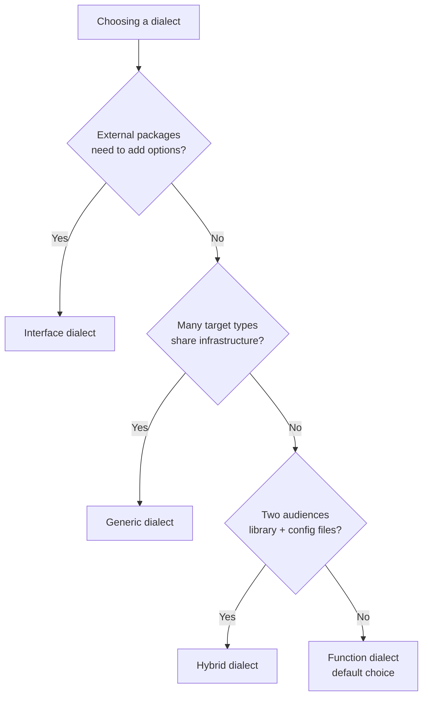
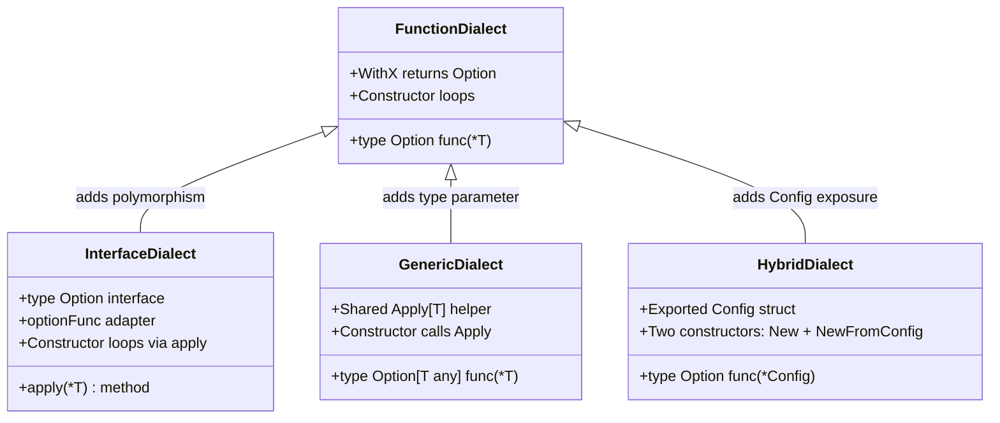
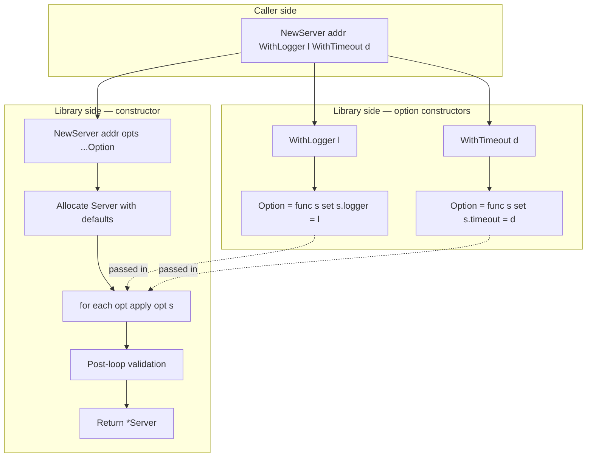
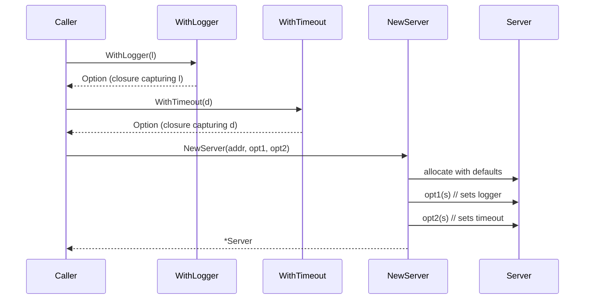

# Functional Options — Specification

> **Focus:** A precise reference for the functional-options pattern as practised in the Go ecosystem. Unlike `unsafe.Pointer` or `defer`, this is not a language feature — it is a *convention* layered on top of three language features (variadic parameters, function types, function literals/closures). This document specifies the convention by anchoring it to the Go language spec sections that make it possible, the original 2014 writings that named it, and the dialects that the major Go libraries (`grpc-go`, `zap`, `chi`, OpenTelemetry, Prometheus, etc.) have settled into.
>
> The audience files (junior/middle) explain *why* and *when*. This file is the canonical lookup.
>
> **Primary sources:**
> - Rob Pike, *Self-referential functions and the design of options*, 24 Jan 2014. https://commandcenter.blogspot.com/2014/01/self-referential-functions-and-design.html
> - Dave Cheney, *Functional options for friendly APIs*, 24 Oct 2014. https://dave.cheney.net/2014/10/17/functional-options-for-friendly-apis
> - Go language specification: https://go.dev/ref/spec
> - `google.golang.org/grpc` source: https://pkg.go.dev/google.golang.org/grpc
> - `go.uber.org/zap` source: https://pkg.go.dev/go.uber.org/zap
> - `github.com/go-chi/chi/v5` source: https://pkg.go.dev/github.com/go-chi/chi/v5
> - `go.opentelemetry.io/otel` source: https://pkg.go.dev/go.opentelemetry.io/otel
> - `github.com/prometheus/client_golang` source: https://pkg.go.dev/github.com/prometheus/client_golang

---

## 1. Historical origins

The pattern was not invented in one place. It emerged from two adjacent ideas posted by Rob Pike and Dave Cheney in 2014, then was canonised by `grpc-go` in 2015 and copied by everyone else.

### 1.1 Rob Pike's "self-referential functions" (January 2014)

In *Self-referential functions and the design of options*, Pike was solving a specific irritation: he wanted a `package ssh` whose `Listen` function would take optional configuration *and* could **return** the previous value of each option so the caller could later restore it. His sketch:

```go
// From Pike's blog post (paraphrased to match modern style).
type option func(*Foo) option

func verbosity(v int) option {
    return func(f *Foo) option {
        previous := f.verbosity
        f.verbosity = v
        return verbosity(previous)   // returns the option that would undo this
    }
}

func (f *Foo) Option(opts ...option) (previous option) {
    for _, opt := range opts {
        previous = opt(f)
    }
    return previous
}
```

Two important details from the original:

1. The option *type* returned itself — the "self-referential" trick. An option both *set* a value and *gave you back* the option to restore it.
2. The option was applied via a *method* on `*Foo`, not in a constructor. Pike's example was about reconfiguring an already-built object.

The self-referential return value never caught on — almost no production code uses it — but the shape `type option func(*Foo)` did.

### 1.2 Dave Cheney's "functional options for friendly APIs" (October 2014)

Cheney's post took Pike's shape and stripped the self-referential return. The result was the constructor pattern we use today:

```go
// From Cheney's post (lightly modernised).
type Option func(*Server)

func Timeout(d time.Duration) Option {
    return func(s *Server) {
        s.timeout = d
    }
}

func NewServer(addr string, options ...Option) *Server {
    s := &Server{addr: addr}
    for _, opt := range options {
        opt(s)
    }
    return s
}
```

Cheney's contribution was the framing: this is how you make a Go API *friendly* in a language with no overloading, no defaults, and no keyword arguments. He explicitly contrasted it with the three alternatives — telescoping constructors, exported config structs, and builder objects — and named when each loses.

### 1.3 gRPC adoption (2015)

`grpc-go` adopted the pattern early but with one consequential modification: the option type became an **interface**, not a function. The reason was practical — `grpc-go` is composed of many sub-packages (`credentials`, `balancer`, `keepalive`, etc.) that each needed to define their own dial-time options, and an interface lets each sub-package supply implementations without depending on `grpc` internals.

This is the moment the pattern bifurcated into two dialects:

- The **function dialect** (Cheney's original): `type Option func(*T)`.
- The **interface dialect** (gRPC): `type Option interface { apply(*T) }`, with private adapter types.

Both are correct; both are widely used. Section 8 documents when to pick which.

### 1.4 Evolution

From 2015 onward the pattern spread to nearly every well-designed Go library. The community settled on a small set of naming and structural conventions (§9, §10) but kept the underlying mechanics tiny. The Go 1.18 generics release added a third dialect — `Option[T any]` — but uptake has been slow and the function/interface split still dominates.

---

## 2. Underlying Go spec mechanics

The pattern is built from three language features. Each is quoted (or paraphrased with section reference) from the Go specification at https://go.dev/ref/spec.

### 2.1 Variadic parameters

> **Function types** ([spec §Function types](https://go.dev/ref/spec#Function_types)):
> *"The final incoming parameter in a function signature may have a type prefixed with `...`. A function with such a parameter is called **variadic** and may be invoked with zero or more arguments for that parameter."*

The variadic parameter is what allows `NewServer(":8080")`, `NewServer(":8080", WithLogger(l))`, and `NewServer(":8080", WithLogger(l), WithTimeout(t))` all to compile against the same declaration. Without it, the pattern would not exist in this shape.

> *"Within the function, the parameter is equivalent to a parameter of type `[]T`. ... When invoked, the actual arguments are converted to a new slice of type `[]T`."*

This means `for _, opt := range opts` is iteration over a real slice — the variadic isn't sugar, the slice is the parameter. Therefore `opts` can be appended to, sliced, passed elsewhere, all the usual slice operations.

The spread operator at the call site (`NewServer(":8080", opts...)`) is also spec-defined:

> *"If `f` is variadic with a final parameter `p` of type `...T`, then within `f` the type of `p` is equivalent to type `[]T`. If `f` is invoked with no actual arguments for `p`, the value passed to `p` is `nil`. Otherwise, the value passed is a new slice of type `[]T` ... unless the final argument is assignable to a slice type `[]T` and is followed by `...`, in which case it is passed unchanged."*

The `...` spread is *not* a copy. Passing a pre-built `[]Option` with `...` hands the same backing array to the function.

### 2.2 Function types

> **Function types** ([spec §Function types](https://go.dev/ref/spec#Function_types)):
> *"A function type denotes the set of all functions with the same parameter and result types. The value of an uninitialized variable of function type is `nil`."*

Two consequences for the pattern:

1. **`type Option func(*Server)` is a named type whose underlying type is `func(*Server)`.** Any function literal with signature `func(s *Server)` is assignable to `Option`. The named type adds a label for godoc and method-attachment; it does not restrict who can construct values.

2. **The zero value is `nil`.** An `Option` variable that is never assigned is `nil`, and calling `nil(s)` panics. This is the source of the "nil option" trap documented in `middle.md` §15.3.

### 2.3 Type identity for function types

> **Type identity** ([spec §Type identity](https://go.dev/ref/spec#Type_identity)):
> *"Two function types are identical if they have the same number of parameters and result values, corresponding parameter and result types are identical, and either both functions are variadic or neither is. Parameter and result names are not required to match."*

This is why `type Option func(*Server)` and `func(s *Server)` are interconvertible. A function literal `func(s *Server) { s.x = 1 }` has type `func(*Server)`, and Go's assignability rules ([spec §Assignability](https://go.dev/ref/spec#Assignability)) say that a value of an unnamed type is assignable to a named type with the same underlying type. The `Option` label is therefore *documentary*, not *protective*.

### 2.4 Function literals (closures)

> **Function literals** ([spec §Function literals](https://go.dev/ref/spec#Function_literals)):
> *"A function literal represents an anonymous function. Function literals are closures: they may refer to variables defined in a surrounding function. Those variables are then shared between the surrounding function and the function literal, and they survive as long as they are accessible."*

This is the heart of the pattern. The expression `WithLogger(myLogger)` evaluates inside `WithLogger`'s frame, where `l *log.Logger` is a parameter. The returned `func(s *Server) { s.logger = l }` *closes over* `l`. After `WithLogger` returns, the captured `l` lives in the closure's environment until the closure itself is unreachable.

The mechanics: the Go compiler allocates a closure record (a small heap object) holding the captured variables, and the returned function value is a pair `{code_ptr, env_ptr}` where `env_ptr` points to that record. The runtime cost is one heap allocation per `WithX` call. See `middle.md` §12 for measured numbers.

### 2.5 Why the pattern *requires* all four

Remove any one of the four spec features and the pattern collapses:

| Spec feature | Removed → pattern can't |
|--------------|------------------------|
| Variadic parameters | Caller can't pass arbitrary number of options |
| Function as a first-class type | `Option` can't be a value |
| Type identity for function types | Can't define `type Option func(*T)` and accept literals |
| Closures | `WithX(value)` couldn't capture `value` |

Go has all four. C-style languages without first-class functions cannot host this pattern; languages with overloading and default arguments don't need it.

---

## 3. The canonical signature shapes

Every functional-options implementation uses one of the signature shapes in this table. These are the shapes the community has settled on.

| Shape | Declaration | Used by |
|-------|-------------|---------|
| **Function alias** | `type Option func(*T)` | `chi`, most application code |
| **Function alias + error** | `type Option func(*T) error` | OpenTelemetry exporter options, `pgx` connect options |
| **Interface + private adapter** | `type Option interface { apply(*T) }` with `type optionFunc func(*T); func (f optionFunc) apply(t *T) { f(t) }` | `grpc-go`, `zap`, `mongo-go-driver`, Google APIs |
| **Generic function alias (1.18+)** | `type Option[T any] func(*T)` | Rare; some internal generic utility packages |
| **Sealed interface** | `type Option interface { isOption() }` with multiple implementing types | `cobra` flags (loosely); some configuration DSLs |
| **Functor + builder hybrid** | `type Option func(*T)` plus chainable `WithX().AndY()` methods on the result of `New` | `resty` (partially) |

The first three account for >95% of production usage. The remainder are listed for completeness.

### 3.1 Constructor shapes

The constructor that consumes options follows one of these signatures:

| Constructor signature | When |
|-----------------------|------|
| `func New(required..., opts ...Option) *T` | Infallible construction |
| `func New(required..., opts ...Option) (*T, error)` | At least one option (or required arg) can fail |
| `func New() *T` then `func (t *T) Configure(opts ...Option)` | Reconfigurable target (rare; Pike's original sketch) |
| `func Default(opts ...Option) *T` | Top-level config, no required args |

The first two are the only ones you'll write in 99% of cases.

---

## 4. Standard library use

The Go standard library is **not** a heavy user of functional options. The pattern post-dates most of `net/http`, `crypto/tls`, `database/sql`, etc., and the standard library has a strong bias toward exported config structs. Knowing which std-lib packages do and don't use the pattern matters for understanding *when* the pattern is the right choice.

### 4.1 Packages that use functional options

#### `text/template` and `html/template`

`Template.Option(opts ...string)` accepts string-encoded "options" like `"missingkey=error"`. This is a **degenerate** form — the options are strings, not functions, and the meaning is parsed inside the method. It pre-dates the modern pattern and should not be treated as canonical.

#### `log/slog` (Go 1.21+)

`slog.NewJSONHandler(w, opts *HandlerOptions)` takes a **pointer to an options struct**, not functional options. This is interesting: the team had the functional-options pattern available and chose not to use it. Reading the [proposal](https://github.com/golang/go/issues/56345), the reason was that the option set was small, stable, and lent itself to direct field access for inspection (`opts.Level` is more useful than a private field with no accessor).

`slog` is a deliberate counter-example: a 2021 standard-library API where functional options were considered and rejected in favour of a config struct. Worth reading the proposal discussion to see the trade-off being made explicit.

#### `os/exec`

`exec.Command(name, args...)` is variadic but the variadic is *arguments to the program*, not options. `*exec.Cmd` is configured by direct field assignment afterward. This is the **post-construction mutation** style — the API equivalent of a config struct but with the struct exposed directly.

### 4.2 Packages that explicitly do *not* use the pattern (counter-examples)

#### `crypto/tls`

`tls.Config` is the textbook exported config struct. Every field is public, the zero value is documented to mean "library default", and the struct is used as a *parameter* (passed to `net.Listen`, `http.Server.TLSConfig`) rather than constructed by a `New` function. This is the **right** choice for `tls.Config`:

- Every field is conceptually independent.
- The defaults are documented at the field level.
- The struct *is* the configuration object — it isn't configuration *for* something else.

When you see a Go API where the configuration is itself the central object, prefer the struct.

#### `database/sql`

`sql.Open(driverName, dataSourceName string) (*DB, error)` takes two strings. The DSN encodes all driver-specific options. `*DB` is then configured by methods like `SetMaxOpenConns`, `SetConnMaxLifetime`. This is the **post-construction setter** style.

Why not functional options? Because `database/sql` predates the pattern (Go 1.0), and because the driver abstraction means `sql` itself doesn't know what options are legal. Functional options would require enumeration of every possible knob in the `sql` package.

#### `net/http`

`http.Server{Addr: ":8080", ReadTimeout: 5*time.Second}` is a struct literal. `http.Client{Timeout: 30*time.Second}` likewise. No functional options. Same reason as `tls.Config`: the type *is* the configuration.

### 4.3 Standard library summary

| Package | Style |
|---------|-------|
| `text/template` | String "options" (degenerate) |
| `log/slog` | Options struct pointer |
| `os/exec` | Post-construction mutation |
| `crypto/tls` | Exported config struct |
| `database/sql` | DSN + post-construction setters |
| `net/http` | Exported config struct |
| `net` (`Dialer`) | Exported config struct |
| `archive/tar` | Exported config struct |
| `compress/gzip` | Constructor + setter methods |

**Functional options are not the standard library's idiom.** They are the *third-party-library* idiom. This is worth remembering when designing APIs: the pattern is right for many libraries, but the standard library's choices show that other shapes remain valid.

---

## 5. Documented use in real libraries

The pattern's authoritative definitions live in the most-used open-source Go libraries. This section walks through how five of them implement it. All snippets are short and attributed; consult the source for full context.

### 5.1 `grpc-go` — three coexisting option interfaces

`google.golang.org/grpc` defines **three** separate option interfaces because it has three different configuration surfaces. From [`grpc/dialoptions.go`](https://github.com/grpc/grpc-go/blob/master/dialoptions.go) and related files:

```go
// DialOption configures a *ClientConn (used by grpc.Dial).
type DialOption interface {
    apply(*dialOptions)
}

// ServerOption configures a *Server (used by grpc.NewServer).
type ServerOption interface {
    apply(*serverOptions)
}

// CallOption configures one RPC (passed to method invocations).
type CallOption interface {
    before(*callInfo) error
    after(*callInfo, *csAttempt)
}
```

Note that `CallOption` has *two* methods — `before` and `after` — because some call options must observe the response. This is a clean illustration of why gRPC needs the interface dialect: a function-typed option couldn't carry two distinct hook points.

The construction pattern within `grpc-go`:

```go
// From grpc-go (paraphrased):
type funcDialOption struct {
    f func(*dialOptions)
}

func (fdo *funcDialOption) apply(do *dialOptions) { fdo.f(do) }

func newFuncDialOption(f func(*dialOptions)) *funcDialOption {
    return &funcDialOption{f: f}
}

func WithTransportCredentials(creds credentials.TransportCredentials) DialOption {
    return newFuncDialOption(func(o *dialOptions) {
        o.copts.TransportCredentials = creds
    })
}
```

The `funcDialOption` adapter lets `grpc` define options using closures internally while still presenting `DialOption` (an interface) to the public. External packages that want to define their own options implement `DialOption` directly with their own struct types.

This is the **adapter** sub-pattern within the interface dialect: the public type is an interface, but the most common implementation is a tiny struct wrapping a closure.

### 5.2 `zap` — interface with public adapter

`go.uber.org/zap` uses the same shape as gRPC but exposes the adapter publicly. From [`zap/options.go`](https://github.com/uber-go/zap/blob/master/options.go):

```go
// An Option configures a Logger.
type Option interface {
    apply(*Logger)
}

// optionFunc wraps a func so it satisfies the Option interface.
type optionFunc func(*Logger)

func (f optionFunc) apply(log *Logger) { f(log) }

// WithCaller configures the Logger to annotate each message with the filename, line number, and function name of zap's caller, or not, depending on the value of enabled. This is a generalized form of AddCaller.
func WithCaller(enabled bool) Option {
    return optionFunc(func(log *Logger) {
        log.addCaller = enabled
    })
}
```

The notable choice is that `optionFunc` is **lowercase** — unexported. External packages can implement `Option` by writing their own struct, but they cannot use the adapter shortcut. zap retains control of who can define options as anonymous functions.

zap's pattern is the most-imitated shape in production Go code. The shortcut is essentially:

> "I want an interface for flexibility, but I don't want to write three lines per option."

The `optionFunc` adapter is the answer.

### 5.3 `chi` router — pure function dialect

`github.com/go-chi/chi/v5` uses the simplest dialect. From [`chi/mux.go`](https://github.com/go-chi/chi/blob/master/mux.go):

```go
// Option is the option function type.
type Option func(*Mux)

// WithMiddleware adds middleware to the router.
// (Illustrative — chi uses methods more than options for middleware.)
```

chi mostly uses *methods* (`r.Use(middleware)`) rather than functional options at construction time. The few options it does have are function-typed. This reflects an honest design choice: most router configuration happens *after* the router is built, not at construction.

### 5.4 OpenTelemetry — interface dialect, fanned out across packages

`go.opentelemetry.io/otel` is structured like gRPC: many sub-packages, each defining its own option types. From the [`sdk/trace`](https://pkg.go.dev/go.opentelemetry.io/otel/sdk/trace) package:

```go
type TracerProviderOption interface {
    apply(tracerProviderConfig) tracerProviderConfig
}

type tracerProviderOptionFunc func(tracerProviderConfig) tracerProviderConfig

func (fn tracerProviderOptionFunc) apply(cfg tracerProviderConfig) tracerProviderConfig {
    return fn(cfg)
}

func WithBatcher(e SpanExporter, options ...BatchSpanProcessorOption) TracerProviderOption {
    return tracerProviderOptionFunc(func(cfg tracerProviderConfig) tracerProviderConfig {
        cfg.spanProcessors = append(cfg.spanProcessors, NewBatchSpanProcessor(e, options...))
        return cfg
    })
}
```

Two non-trivial choices here:

1. **The option takes a config struct by value and returns a modified copy.** This is the *value-mutation* variant — options don't mutate; they transform. The result is that options are pure functions, which makes them easier to test and combine but allocates a new config per option call. OpenTelemetry decided the cleanliness was worth the per-construction overhead.

2. **Options for sub-components are passed through.** `WithBatcher(e, opts...)` takes its own variadic `BatchSpanProcessorOption` list — options nested inside options. This is the *forwarding* pattern (`middle.md` §8.2) and OpenTelemetry uses it heavily.

### 5.5 Prometheus client — function dialect with typed factories

`github.com/prometheus/client_golang` uses functional options for collector and registry configuration. From [`prometheus/registry.go`](https://github.com/prometheus/client_golang/blob/main/prometheus/registry.go) and related files, the shape is the function dialect, but with a wrinkle: many configuration structs are exported (`CounterOpts`, `HistogramOpts`) because Prometheus needs the configuration to be inspectable for metadata.

```go
// HistogramOpts bundles options for creating a Histogram. (Exported struct,
// not functional options.)
type HistogramOpts struct {
    Namespace string
    Subsystem string
    Name      string
    Help      string
    // ...
}

func NewHistogram(opts HistogramOpts) Histogram { ... }
```

This is a hybrid: functional options exist elsewhere in the package (for `Registry`, `Pusher`) but for `Metric` configuration the team chose a config struct because the configuration is *data* (metric name, labels, help text) rather than *behaviour*.

The take-away from Prometheus is that functional options and config structs can coexist in one package. Use options for the behavioural surface; use a struct for the data surface.

### 5.6 Summary table

| Library | Dialect | Adapter exposure | Notes |
|---------|---------|------------------|-------|
| `grpc-go` | Interface | Private (`newFuncDialOption`) | Three coexisting option interfaces |
| `zap` | Interface | Private (`optionFunc`) | Most-imitated shape |
| `chi` | Function | — | Methods over options |
| OpenTelemetry | Interface | Private | Value-mutation, not pointer-mutation |
| Prometheus | Mixed | — | Functional options + exported config structs |
| `mongo-go-driver` | Interface | Public via builder methods | `ClientOptions` is itself an option-building struct |
| `pgx` (v5) | Function + error | — | `type Option func(*ConnConfig) error` |
| `cobra` | Methods | — | `Command{}` literal + post-construction setters |

---

## 6. The specification of the pattern itself

An implementation of functional options consists of the following five elements. A correct implementation has all five; a missing element is a defect.

**Element A — A target type.**
A struct type `T` (typically pointer-receiver methods) that holds the configured state.

```go
type Server struct {
    addr         string
    readTimeout  time.Duration
    // ...
}
```

**Element B — An option type.**
Either a function type `type Option func(*T)` (function dialect) or an interface `type Option interface { apply(*T) }` (interface dialect). Optionally `... error` for fallible options.

**Element C — Option constructors.**
A set of exported functions, each named `WithXxx`, each taking the configuration value(s) and returning one `Option`. The body returns a closure (function dialect) or an adapter wrapping a closure (interface dialect).

```go
func WithReadTimeout(d time.Duration) Option {
    return func(s *Server) { s.readTimeout = d }
}
```

**Element D — A constructor.**
A function `func New(required..., opts ...Option) *T` (or `(*T, error)`) that:
1. Allocates `&T{}` with default field values set in the struct literal.
2. Iterates over `opts` and applies each.
3. Optionally performs post-loop validation.
4. Returns the configured `*T`.

**Element E — A convention for naming, ordering, and behaviour.**
1. Each option function is named `WithX` where X describes the value being set.
2. Required parameters precede `opts ...Option` in the constructor signature.
3. Defaults live in the constructor's struct literal, never in option functions.
4. Options that depend on each other are resolved in the constructor's post-loop block, not by options reading each other.
5. Options applied multiple times use last-write-wins semantics unless the option is documented as additive (e.g., `WithHeader(k, v)` appending).

A "functional-options API" without all five elements is one of the following:

| Missing element | Resulting pattern |
|-----------------|-------------------|
| A (no target struct) | Free-function configuration |
| B (no option type) | Telescoping constructors |
| C (no option constructors) | Direct struct literal |
| D (no constructor that loops) | Builder pattern (caller calls each setter) |
| E (no naming/ordering convention) | An ad-hoc API that happens to look like options |

---

## 7. Anti-patterns

What people sometimes do that violates the pattern's intent. Each is real — observed in production Go code — and each should be rejected in code review.

### 7.1 The leaky default

```go
// Anti-pattern: default lives in the option function.
func WithTimeout(d time.Duration) Option {
    return func(s *Server) {
        if d == 0 {
            d = 30 * time.Second
        }
        s.timeout = d
    }
}
```

Defaults must live in the constructor's struct literal. The option function's job is to set the value the caller passed — nothing else. See `junior.md` §7 for the full discussion.

### 7.2 The required option

```go
// Anti-pattern: required configuration disguised as an option.
func WithAddr(addr string) Option {
    return func(s *Server) { s.addr = addr }
}

func NewServer(opts ...Option) *Server { ... }
// NewServer() compiles; runtime bug when addr is empty.
```

Required parameters belong in the positional argument list. Options are for *optional* configuration. The compiler cannot enforce "you must pass `WithAddr`".

### 7.3 The silent swallow

```go
// Anti-pattern: invalid input silently ignored.
func WithRetries(n int) Option {
    return func(c *Client) {
        if n < 0 { return }   // silently ignored
        c.retries = n
    }
}
```

`WithRetries(-1)` is a programmer error. The option should panic at *option-construction time* (so the bug surfaces immediately, with a stack trace at the call site), or the constructor should be fallible. Silent skip masks bugs.

### 7.4 The exported option type

```go
// Anti-pattern: the option type is exported but its implementations are not.
type Option struct {
    setter func(*Server)
}

func WithLogger(l *log.Logger) Option {
    return Option{setter: func(s *Server) { s.logger = l }}
}
```

If the type is exported but its field is unexported, callers can't construct an `Option` themselves — they're limited to the `WithX` functions the library provides. That's fine, but a function-typed alias or an interface with a private method achieves the same encapsulation with less ceremony.

### 7.5 Options reading the target

```go
// Anti-pattern: option reads other options' results.
func WithSecureTimeout() Option {
    return func(s *Server) {
        if s.tls != nil {
            s.timeout = 5 * time.Second
        }
    }
}
```

The behaviour depends on whether `WithTLS(...)` was applied earlier or later. The pattern's iteration order is "caller's order", which makes this fragile.

Move cross-option logic to the constructor's post-loop block:

```go
func NewServer(opts ...Option) *Server {
    s := &Server{ /* defaults */ }
    for _, opt := range opts { opt(s) }
    if s.tls != nil && s.timeout == defaultTimeout {
        s.timeout = 5 * time.Second
    }
    return s
}
```

### 7.6 The mutable shared default

```go
// Anti-pattern: package-level default that callers can mutate.
var DefaultLogger = log.New(os.Stderr, "", 0)

func NewServer(opts ...Option) *Server {
    s := &Server{logger: DefaultLogger}
    for _, opt := range opts { opt(s) }
    return s
}
```

Every server now shares one `*log.Logger`. If a test calls `srv.logger.SetPrefix("test")` once, every other server's logger is also prefixed. Allocate per server.

### 7.7 Generic-for-the-sake-of-generic

```go
// Anti-pattern: generic option for one target type.
type Option[T any] func(*T)

func WithReadTimeout[T any](d time.Duration) Option[T] { ... }
```

If you have one `T`, the generic parameter adds noise without leverage. Use `type Option func(*Server)` until you genuinely have multiple `T`s that want shared infrastructure.

---

## 8. Variations and dialects

The pattern has four major dialects. Choosing between them is the main design decision.

### 8.1 Function dialect

```go
type Option func(*Server)

func WithLogger(l *log.Logger) Option {
    return func(s *Server) { s.logger = l }
}
```

**Pick when:** small library, < 15 options, no external packages need to add their own options, no public/private split needed.

**Used by:** Cheney's original, `chi`, most application code, most internal packages.

### 8.2 Interface dialect

```go
type Option interface {
    apply(*Server)
}

type optionFunc func(*Server)

func (f optionFunc) apply(s *Server) { f(s) }

func WithLogger(l *log.Logger) Option {
    return optionFunc(func(s *Server) { s.logger = l })
}
```

**Pick when:** large library, options span sub-packages, external packages must add options, you want public/private option distinction, you want options to carry methods beyond `apply` (e.g., `String()` for logging).

**Used by:** `grpc-go`, `zap`, `mongo-go-driver`, OpenTelemetry, Google APIs (`google.golang.org/api/option`).

### 8.3 Generic dialect (Go 1.18+)

```go
type Option[T any] func(*T)

func Apply[T any](t *T, opts []Option[T]) {
    for _, o := range opts {
        if o != nil { o(t) }
    }
}
```

**Pick when:** you have shared option-handling infrastructure across many target types in one codebase (composer combinators, conditional helpers, test utilities) and the per-call ergonomics aren't a blocker.

**Used by:** internal generic-utility packages; rarely in published library APIs.

### 8.4 Hybrid dialect

Some libraries combine functional options with exported config structs:

```go
type Config struct {
    ReadTimeout  time.Duration
    WriteTimeout time.Duration
    // ...
}

type Option func(*Config)

func WithReadTimeout(d time.Duration) Option { ... }

// New accepts options, builds a Config internally.
func New(addr string, opts ...Option) *Server { ... }

// NewFromConfig accepts the config directly.
func NewFromConfig(addr string, c Config) *Server { ... }
```

**Pick when:** you have two audiences — library callers (who want options) and configuration-driven callers (who want to load a YAML/JSON config into a struct and pass it).

**Used by:** some configuration-heavy libraries (some HTTP server frameworks, some k8s controllers).

### 8.5 Dialect comparison





---

## 9. Code conventions

Established by community usage. Not enforced by the language; expected by readers.

### 9.1 Naming

| Identifier | Convention | Example |
|------------|------------|---------|
| Option type | `Option`, or `<Target>Option` if multiple in one package | `Option`, `ServerOption`, `DialOption` |
| Option constructor | `WithX` where X is the value being set | `WithLogger`, `WithTimeout` |
| Additive option | Still `WithX`, document additive behaviour | `WithHeader(k, v)`, `WithMiddleware(m)` |
| Private adapter | `optionFunc` (lowercase) | `type optionFunc func(*T)` |
| Composite/profile | `WithX` returning multiple options bundled | `WithProductionDefaults()` |
| Negating option | `WithoutX` or `WithX(false)` | `WithoutLogging()`, `WithCaller(false)` |

Avoid `Set`-prefixed option constructors (`SetTimeout`) — they read as imperative methods on the target, not as values. `With` was the convention that won because `NewServer(addr, WithTimeout(5s))` reads naturally.

### 9.2 Ordering of constructor parameters

```go
func NewServer(
    addr string,           // required
    handler http.Handler,  // required
    opts ...Option,        // optional, always last
) *Server
```

Variadic parameters must be last per Go spec. Required parameters always precede the variadic. This is non-negotiable.

### 9.3 Validation

| When | How |
|------|-----|
| Option input is statically wrong | Panic at option-construction time |
| Option input may fail at runtime | Constructor returns error; option stores intent, constructor performs the action |
| Cross-option invariants | Post-loop check in constructor; return error |
| Required combination of options | Post-loop check; return error with a clear message |

```go
// Good: validation at the right layer.
func WithRetries(n int) Option {
    if n < 0 {
        panic(fmt.Sprintf("WithRetries: n must be >= 0, got %d", n))
    }
    return func(s *Server) { s.retries = n }
}
```

Panic is appropriate because passing `-1` is a programmer bug, not a runtime condition. Tests catch it.

### 9.4 Error handling

| Situation | Pattern |
|-----------|---------|
| All options infallible, no validation | `func New(...) *T` |
| Some options can fail; defer to constructor | `func New(...) (*T, error)` |
| Many options can fail | `type Option func(*T) error` + `func New(...) (*T, error)` |
| Constructor wants to bubble errors | Add `err error` field to `*T`, check after loop |

### 9.5 Godoc conventions

```go
// WithReadTimeout sets the maximum duration for reading the entire request,
// including the body. A zero or negative value means no timeout.
//
// The default is 30 seconds.
func WithReadTimeout(d time.Duration) Option {
    return func(s *Server) { s.readTimeout = d }
}
```

Conventional godoc structure for an option:
1. One-line summary in the form `WithX sets the Y to Z.` or `WithX configures the Y to do Z.`
2. Edge-case behaviour (zero, nil, negative).
3. The default value (so callers can know what they're overriding without reading the constructor).

State the default in the godoc, *not* the option function. The option function doesn't set the default; the constructor does. But the *caller* needs to know the default to decide whether to override.

### 9.6 Type-aliased options for multiple targets

```go
type ServerOption func(*Server)
type ClientOption func(*Client)

func WithServerTimeout(d time.Duration) ServerOption { ... }
func WithClientTimeout(d time.Duration) ClientOption { ... }
```

When a package has multiple option-taking targets, suffix the option type. Don't reuse the bare `Option` name — Go's type identity rules make `func(*Server)` and `func(*Client)` distinct types anyway, but the explicit suffix is for the reader.

### 9.7 Test conventions

```go
// build constructs a Server with the given options for assertion in tests.
func build(t *testing.T, opts ...Option) *Server {
    t.Helper()
    s, err := NewServer(":0", opts...)
    if err != nil {
        t.Fatalf("NewServer: %v", err)
    }
    return s
}

func TestWithReadTimeout(t *testing.T) {
    s := build(t, WithReadTimeout(5*time.Second))
    if s.readTimeout != 5*time.Second {
        t.Errorf("readTimeout = %v, want %v", s.readTimeout, 5*time.Second)
    }
}
```

The standard testing idiom: a helper that builds the target, one test per option, asserting the field is set. The unexported field reads work inside the test in the same package.

---

## 10. Related patterns

The functional-options pattern shares space with three classical patterns. Each is distinct but often confused.

### 10.1 Builder

```go
// Builder pattern
s := NewServerBuilder().
    Addr(":8080").
    ReadTimeout(5 * time.Second).
    Logger(myLogger).
    Build()
```

| Aspect | Builder | Functional options |
|--------|---------|--------------------|
| Construction phases | Multiple, ordered | Single |
| Intermediate state | Visible (the builder) | Hidden |
| Conditional fields | Method calls or branching | `If(cond, opt)` combinator |
| Fluent reads | Yes | No |
| Idiomatic in Go? | Less so | More so |

The builder pattern is the right choice when construction has genuine phases (e.g., parse → validate → connect). Functional options are right when configuration is one phase with many optional knobs.

### 10.2 Strategy

```go
// Strategy pattern
type Compressor interface {
    Compress([]byte) []byte
}
type GzipCompressor struct{}
type LzwCompressor struct{}

// Used by passing the strategy:
func NewServer(c Compressor) *Server { ... }
```

Strategy varies *behaviour*. Functional options vary *configuration*. They look similar — both are "pass a thing in to control something" — but:

- Strategy: the thing *is* the behaviour. The target calls methods on it.
- Functional options: the thing *applies* the behaviour. After application, the option is discarded.

In Go, strategy is implemented with interfaces; functional options with functions or option-interfaces. The pattern can be combined: `WithCompressor(c Compressor) Option` installs a strategy via an option.

### 10.3 Decorator

```go
// Decorator pattern
type Logger interface { Log(string) }
type TimestampedLogger struct{ inner Logger }
func (t TimestampedLogger) Log(s string) { t.inner.Log(time.Now().String() + " " + s) }
```

Decorator *wraps* a target; functional options *configure* a target. The mechanics are different even when the surface looks similar.

Sometimes confused because both can express "add a behaviour":

```go
// Functional option way
NewServer(addr, WithMetrics())

// Decorator way
WithMetrics(NewServer(addr))
```

Both produce a server with metrics. The functional-options version retains a single `*Server` type; the decorator version produces a `*MetricsServer` or `*WrappedServer`. For chained behavioural composition (multiple cross-cutting concerns), decorator scales better. For mostly-data configuration, options scale better.

### 10.4 Configuration object

```go
// Configuration object (= exported config struct)
s := NewServer(Config{
    Addr:        ":8080",
    ReadTimeout: 5 * time.Second,
})
```

Discussed at length in `junior.md` §4 and `middle.md` §10. The same trade-offs apply.

---

## 11. The pattern as a graph

Relationships between the pieces.





---

## 12. Quick-reference: canonical signatures

| Signature | Dialect | Failure mode |
|-----------|---------|--------------|
| `type Option func(*T)` | Function | Infallible |
| `type Option func(*T) error` | Function | Per-option error |
| `type Option interface { apply(*T) }` | Interface | Infallible |
| `type Option interface { apply(*T) error }` | Interface | Per-option error |
| `type Option[T any] func(*T)` | Generic | Infallible |
| `func New(req..., opts ...Option) *T` | — | Infallible |
| `func New(req..., opts ...Option) (*T, error)` | — | Constructor error |
| `func WithX(value Value) Option` | — | Standard |
| `func WithX(value Value) (Option, error)` | — | Rare; option construction itself fails |

---

## 13. The pattern's limits

Cases where functional options are the *wrong* tool, summarised from §4 and §10:

| Situation | Better choice |
|-----------|---------------|
| Configuration is itself the central object | Exported config struct (`tls.Config`) |
| Configuration loaded from a file (YAML, JSON) | Exported config struct + unmarshal |
| Multi-phase construction (parse → validate → build) | Builder |
| Behaviour varies, not configuration | Strategy interface |
| Required parameters dominate | Positional arguments |
| Standard library predates 2014 | Whatever the package already does |
| Internal helper, no compatibility cost | Plain config struct |

The pattern is best when:

- The API is exported.
- Most knobs are optional with sensible defaults.
- The set of knobs may grow.
- Construction is one phase.

Outside that envelope, reach for one of the alternatives.

---

## 14. Further reading

### 14.1 Original sources

- Rob Pike, *Self-referential functions and the design of options*, 24 Jan 2014.
  https://commandcenter.blogspot.com/2014/01/self-referential-functions-and-design.html
- Dave Cheney, *Functional options for friendly APIs*, 17 Oct 2014.
  https://dave.cheney.net/2014/10/17/functional-options-for-friendly-apis

### 14.2 Go specification sections

- Variadic parameters: https://go.dev/ref/spec#Function_types
- Type identity: https://go.dev/ref/spec#Type_identity
- Assignability: https://go.dev/ref/spec#Assignability
- Function literals (closures): https://go.dev/ref/spec#Function_literals
- Calls (variadic spread): https://go.dev/ref/spec#Calls

### 14.3 Library documentation

- `grpc-go` DialOption: https://pkg.go.dev/google.golang.org/grpc#DialOption
- `grpc-go` ServerOption: https://pkg.go.dev/google.golang.org/grpc#ServerOption
- `grpc-go` CallOption: https://pkg.go.dev/google.golang.org/grpc#CallOption
- `zap` Option: https://pkg.go.dev/go.uber.org/zap#Option
- `chi` Mux options: https://pkg.go.dev/github.com/go-chi/chi/v5
- OpenTelemetry TracerProviderOption: https://pkg.go.dev/go.opentelemetry.io/otel/sdk/trace#TracerProviderOption
- Google API options: https://pkg.go.dev/google.golang.org/api/option
- `mongo-go-driver` options: https://pkg.go.dev/go.mongodb.org/mongo-driver/mongo/options

### 14.4 Related Go design discussions

- `slog` design proposal (counter-example, why not options): https://github.com/golang/go/issues/56345
- The `log/slog` API discussion: https://github.com/golang/go/discussions/54763
- Go FAQ on overloading and defaults: https://go.dev/doc/faq#overloading

### 14.5 Related skill files in this roadmap

- `junior.md` — the minimum implementation
- `middle.md` — variants, generics, dialects in practice
- `../02-builder-pattern/` — when options aren't enough
- `../03-strategy-pattern/` — when behaviour varies, not configuration

---

## 15. Glossary

| Term | Definition |
|------|------------|
| **Option** | A value (function or interface) that, when applied to a target, mutates one or more fields of the target. |
| **Option constructor** | A function named `WithX` that returns an Option. |
| **Function dialect** | The variant where `Option` is a function type. |
| **Interface dialect** | The variant where `Option` is an interface with an `apply` method. |
| **Adapter** | A struct or function type that wraps a closure to satisfy an Option interface. |
| **Closure capture** | The compiler's heap-allocation of variables that a function literal references from its enclosing scope. |
| **Defaults block** | The struct literal at the top of a constructor that establishes default field values. |
| **Post-loop validation** | The code after the `for _, opt := range opts` loop that checks invariants across multiple options. |
| **Last-write-wins** | The semantic that, when an option is passed twice, the later application overrides the earlier. |
| **Additive option** | An option that appends to a slice/map field rather than overwriting it (e.g., `WithHeader`). |
| **Forwarding option** | An option that takes a nested option list and forwards it to a sub-component. |
| **Profile** | A pre-built `[]Option` returned by a helper function, representing a named configuration set (e.g., `ProductionDefaults()`). |
