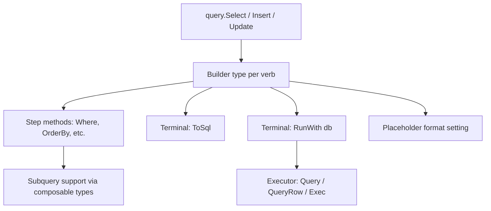
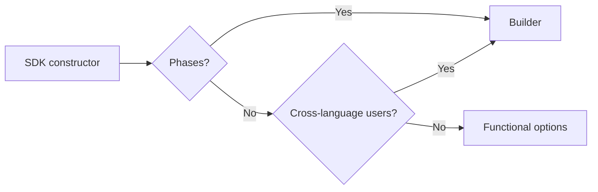
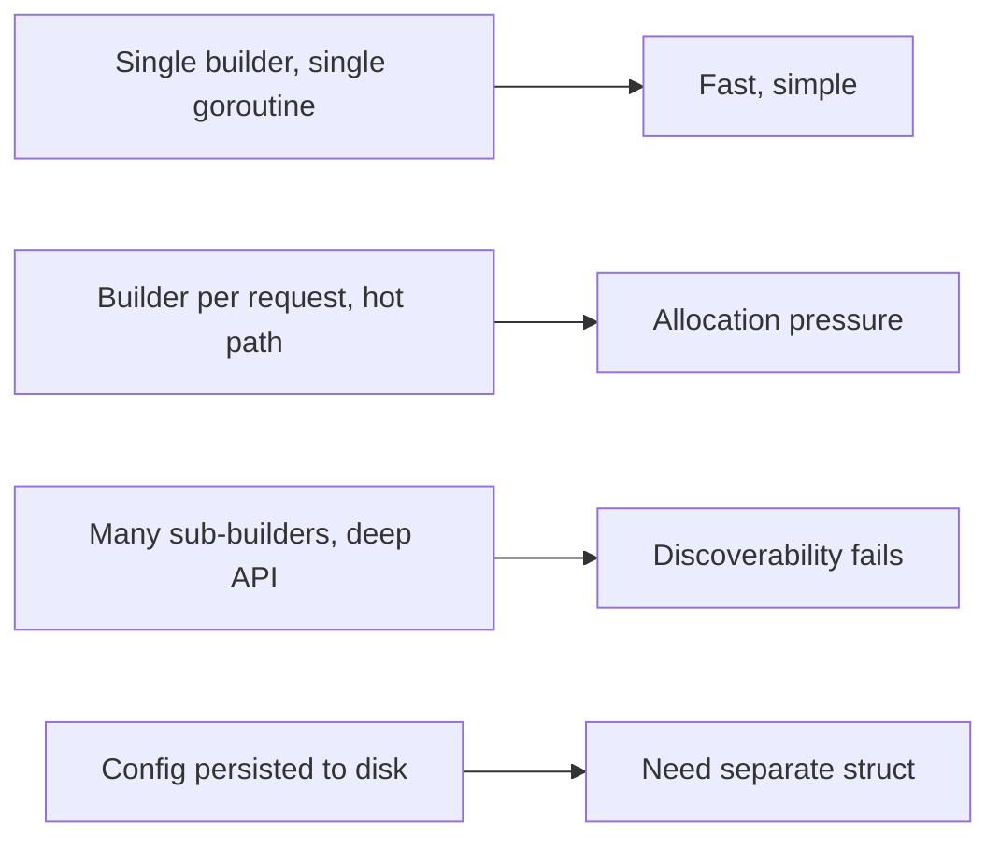
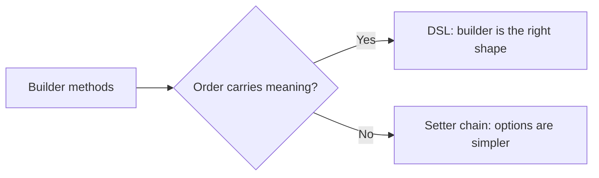

# Builder Pattern — Interview Questions

Interview prep for the Go Builder pattern across all skill levels. The pattern is a frequent topic in Go-heavy interviews because it sits at the seam between idiomatic Go and patterns that arrived from Java/C#. A candidate's answers reveal three things simultaneously: whether they understand the mechanics, whether they understand *when not to* reach for a builder (functional options usually win), and whether they can reason about evolution — naming, deprecation, multi-terminal APIs, and SDK ergonomics.

Use this file the way you'd use flashcards before a Go-heavy onsite at Cloudflare, Uber, Google, DigitalOcean, or anywhere that maintains a public Go library. Each question has the level it targets, the ideal answer at that level, common wrong answers, and follow-ups the interviewer is likely to chain into.

---

## Table of Contents

1. [What interviewers actually test for](#1-what-interviewers-actually-test-for)
2. [Junior-level questions](#2-junior-level-questions)
3. [Middle-level questions](#3-middle-level-questions)
4. [Senior-level questions](#4-senior-level-questions)
5. [Live coding challenges](#5-live-coding-challenges)
6. [System design conversation starters](#6-system-design-conversation-starters)
7. [Common interview traps and red flags](#7-common-interview-traps-and-red-flags)
8. [Questions to ask the interviewer](#8-questions-to-ask-the-interviewer)
9. [Cross-references](#9-cross-references)

---

## 1. What interviewers actually test for

The shape of a builder is easy. The judgment around it is hard. Interviewers calibrate signal across these axes:

| Dimension | Junior signal | Middle signal | Senior signal |
|-----------|---------------|---------------|---------------|
| Mechanics | Can write the four pieces (type, entry, steps, `Build`) | Knows the four shapes (pointer, value, stage-typed, multi-terminal) | Can refactor between shapes mid-project, can mix with functional options |
| Design judgment | "It's the Builder pattern" | Can argue when *not* to use a builder | Can place a builder correctly inside an SDK and reason about versioning and Director pattern |
| Idioms vs Java | Pattern recognition only | Knows why Go's builder isn't Java's | Can articulate what's lost translating Java builders to Go and what's gained |
| Error handling | Defers to `Build()` | Distinguishes intrinsic vs combination validation | Argues about whether builders should return errors at all in a config-loaded environment |
| Comparison | Names the pattern | Compares to functional options and config structs | Picks per-situation; defends in code review |

There's also a meta-signal: a candidate who insists every constructor with three fields needs a builder loses senior points. A candidate who reflexively rejects the pattern because "Go uses functional options" also loses senior points. The right answer is *almost always* situational, and the interviewer is watching how the candidate navigates the situation.

One more thing: builders are a Java/C# import that landed awkwardly in Go. Many candidates have written builders in those languages and recite the GoF version. Recognising what Go *changes* about the pattern — no overloading, no inheritance hierarchies for builders, single-use semantics, deferred-error handling — is the senior cut.

---

## 2. Junior-level questions

These check that the candidate can write the pattern, name its parts, and avoid the most common bugs. Aim for 1–2 minutes each.

---

### Q1 (junior). What is the Builder pattern, and what problem does it solve in Go?

**Ideal answer.** It's a construction pattern where a separate type (the Builder) accumulates configuration step-by-step, and a terminal call (`Build`) produces the final object. The shape is:

```go
srv, err := NewServerBuilder().
    Addr(":8080").
    ReadTimeout(5 * time.Second).
    UseTLS("cert.pem", "key.pem").
    Build()
```

It solves problems that functional options and config structs handle poorly:

1. **Multi-phase construction.** Some objects need parsing, validation, then assembly. Options can't express phases.
2. **Order-dependent steps.** SQL `SELECT...FROM...WHERE...` reads naturally as a chain; options would scramble that order.
3. **Derived state.** If `WriteTimeout` defaults to `2 * ReadTimeout`, the builder can compute it in `Build()` after every step has run.

The Go-idiomatic version uses a pointer receiver, captures errors in a `b.err` field, and returns `*Builder` from intermediate steps so calls chain.

**Common wrong answers.**
- "It's how Java does construction in Go." — Half right; the Go version is meaningfully different (single-use, deferred error, no inheritance).
- "It's just functional options with chaining." — No. Functional options accumulate a `[]Option`; builders accumulate *state* on a typed struct.

**Follow-up.** *Why is this pattern less common in Go than in Java?* (Because Go has functional options and lacks overloading + default arguments. Builders are reserved for genuinely multi-phase domains. Pulls into Q3.)

---

### Q2 (junior). Walk me through the four pieces of a minimal builder.

**Ideal answer.** Four pieces:

1. **Builder type** — a struct holding accumulated state plus an `err` field.

   ```go
   type Builder struct {
       addr        string
       readTimeout time.Duration
       err         error
   }
   ```

2. **Entry constructor** — returns a fresh builder with sane defaults.

   ```go
   func NewServerBuilder() *Builder {
       return &Builder{readTimeout: 30 * time.Second}
   }
   ```

3. **Step methods** — each returns `*Builder` so the chain continues, and short-circuits if `b.err` is already set.

   ```go
   func (b *Builder) Addr(a string) *Builder {
       if b.err != nil { return b }
       if a == "" { b.err = errors.New("Addr: empty"); return b }
       b.addr = a
       return b
   }
   ```

4. **Terminal method** — usually `Build()` returns the constructed object plus an error.

   ```go
   func (b *Builder) Build() (*Server, error) {
       if b.err != nil { return nil, b.err }
       if b.addr == "" { return nil, errors.New("Build: addr required") }
       return &Server{addr: b.addr, readTimeout: b.readTimeout}, nil
   }
   ```

The four pieces hang together: the builder accumulates, the steps chain, the terminal commits.

**Common wrong answers.** Skipping the error capture. Returning `Builder` (value) from steps instead of `*Builder`. Forgetting defaults in the entry constructor.

**Follow-up.** *Why is `err` captured in the builder instead of returned from each step?* (Pulls into Q5.)

---

### Q3 (junior). When would you choose a builder over functional options?

**Ideal answer.** When *any* of these hold:

- **Construction has phases.** Steps must happen in a specific order, or each step's result changes what the next step is allowed to do.
- **Fields depend on each other.** Setting one field affects the meaning of another, and the dependency is too messy for the constructor's post-loop block.
- **The chain reads like a sentence in the domain.** SQL `Select...From...Where`, HTTP `NewRequest...WithMethod...WithBody`, AST `If...Then...Else` — domains where order is part of the language.
- **You need terminal variants.** `Build()`, `Plan()`, `Validate()`, `Explain()` — multiple ways to finalize the same accumulated state.

Functional options for everything else. The default is options; the builder is a deliberate escalation.

A useful test: try writing the API with options. If you end up with options whose docs say "must be called after `WithX`", that's a builder in disguise. Switch.

**Common wrong answers.**
- "Builder for >3 fields." — Field count isn't the criterion. `http.Server` has 20+ fields and is a struct.
- "Builder when validation is needed." — Options can validate too. The criterion is phasing.

**Follow-up.** *Show me a builder that's actually misapplied.* (A `ConfigBuilder` for three independent fields. Pulls into Q8.)

---

### Q4 (junior). Why does each step method return `*Builder`?

**Ideal answer.** So calls chain:

```go
NewServerBuilder().Addr(":8080").ReadTimeout(5*time.Second).Build()
```

If `Addr` returned nothing, you'd have to write:

```go
b := NewServerBuilder()
b.Addr(":8080")
b.ReadTimeout(5 * time.Second)
srv, _ := b.Build()
```

Which works, but the chain version reads as one expression and matches the domain (Server-Addr-ReadTimeout-Build is a "configure then build" sentence). Returning `*Builder` is what enables the fluent syntax.

The pointer matters too. Returning `Builder` (value) means each step returns a copy, and the chain operates on different objects unless you reassign. Returning `*Builder` keeps the chain pointing at one underlying builder throughout.

**Common wrong answers.** "It's required by Go" — false. Go doesn't enforce a return type on methods.

**Follow-up.** *Could you return something other than `*Builder` from intermediate steps?* (Pulls into the stage-typed builder, Q5 of the middle section. Yes — each step can return a *different* builder type to enforce ordering at compile time.)

---

### Q5 (junior). Why is the error captured in `b.err` instead of returned from each step?

**Ideal answer.** Because the chain breaks otherwise:

```go
// Returning error from each step
b, err := NewServerBuilder().Addr(":8080")
if err != nil { /* ... */ }
b, err = b.ReadTimeout(5 * time.Second)
if err != nil { /* ... */ }
b, err = b.UseTLS(cert, key)
if err != nil { /* ... */ }
srv, err := b.Build()
```

You've reinvented functional options badly. The chain is gone, the error-check boilerplate is everywhere, and there's no advantage over plain function calls.

The deferred-error pattern captures the first error and short-circuits subsequent steps:

```go
func (b *Builder) Addr(a string) *Builder {
    if b.err != nil { return b }      // short-circuit
    if a == "" { b.err = errors.New("Addr: empty"); return b }
    b.addr = a
    return b
}

func (b *Builder) Build() (*Server, error) {
    if b.err != nil { return nil, b.err }
    /* ... */
}
```

The caller writes the natural chain and checks the error once at the end. If `Addr` failed, `ReadTimeout` and `UseTLS` are no-ops, and `Build` returns the original `Addr` error.

**Common wrong answers.**
- "Because Go can't return errors from chain methods." — False; it can. The choice is intentional.
- "Use panic for invalid options." — Only for programmer errors; never for runtime input.

**Follow-up.** *What if a later step needs to check whether an earlier step succeeded?* (Expose `b.Err() error` as a non-terminal inspector. Rare but legitimate.)

---

### Q6 (junior). What's the bug?

```go
func (b *Builder) Addr(a string) *Builder {
    b.addr = a
}
```

**Ideal answer.** Two bugs. First, it doesn't return — the Go compiler will reject this (missing return). Second, if you "fix" it as `return nil`, the chain panics on the next call (`nil.ReadTimeout(...)` is a nil pointer dereference).

The right fix is always `return b`:

```go
func (b *Builder) Addr(a string) *Builder {
    b.addr = a
    return b
}
```

Returning the receiver is the entire mechanism by which chaining works. Always `return b` (or `return &b` for value-receiver variants).

**Common wrong answers.** "Return a new builder." — Wrong for pointer-receiver builders; you want to mutate in place.

**Follow-up.** *What changes if the receiver is by value?* (You return the value, and the caller must reassign. Pulls into the value-receiver discussion.)

---

### Q7 (junior). What's `Build()` supposed to do that step methods don't?

**Ideal answer.** Three things:

1. **Final validation.** Check required fields, cross-field invariants, anything that can only be evaluated once all steps have run.
2. **Resource acquisition.** Open the listener, load TLS certs, connect to dependencies — anything that has side effects.
3. **Produce the final object.** Copy the accumulated state into a fresh `*Server` (or whatever the target is) and return it.

After `Build()`, the builder is throwaway. The target doesn't reference the builder. Calling `Build()` twice on the same builder is undefined behaviour — you may get two targets sharing internal state via slices or maps.

Step methods just accumulate state and capture errors. They don't allocate the target, don't acquire resources, don't validate cross-field invariants. `Build()` is where the work happens.

**Common wrong answers.**
- "Build returns the builder." — No, it returns the target type.
- "Build just calls a constructor on the accumulated state." — Often true, but it's also the place to validate and resource-acquire.

**Follow-up.** *What happens if you call `Build()` twice?* (Undefined; treat the builder as single-use. Pulls into junior §8 of `junior.md`.)

---

### Q8 (junior). Identify the smell:

```go
type ConfigBuilder struct {
    addr    string
    timeout time.Duration
    logger  *log.Logger
}

func NewConfigBuilder() *ConfigBuilder { return &ConfigBuilder{} }
func (b *ConfigBuilder) Addr(a string) *ConfigBuilder       { b.addr = a; return b }
func (b *ConfigBuilder) Timeout(d time.Duration) *ConfigBuilder { b.timeout = d; return b }
func (b *ConfigBuilder) Logger(l *log.Logger) *ConfigBuilder    { b.logger = l; return b }
func (b *ConfigBuilder) Build() *Config { return &Config{ /* ... */ } }
```

**Ideal answer.** It's a builder being used where functional options would be cleaner. Three signals:

1. **All fields are independent.** No phases, no dependencies, no order.
2. **No validation in any step.** Just plain assignment.
3. **No error from `Build()`.** Nothing can fail.

This is exactly what functional options exist for:

```go
type Option func(*Config)

func WithAddr(a string) Option         { return func(c *Config) { c.addr = a } }
func WithTimeout(d time.Duration) Option { return func(c *Config) { c.timeout = d } }
func WithLogger(l *log.Logger) Option    { return func(c *Config) { c.logger = l } }

func NewConfig(opts ...Option) *Config {
    c := &Config{timeout: 30 * time.Second}
    for _, opt := range opts { opt(c) }
    return c
}
```

Same ergonomics at the call site, less code, fewer types to document, no terminal method needed. The builder here is cargo-culted from Java.

**Common wrong answers.** "Looks fine to me." — Misses that the pattern is over-applied.

**Follow-up.** *When would you go back to a builder for a `Config`?* (When you add a phase — e.g., reading the config from a file and validating against a schema — or terminal variants like `Validate()` and `Build()`.)

---

### Q9 (junior). What's wrong with this `Build()`?

```go
func (b *Builder) Build() *Server {
    return &Server{
        addr:    b.addr,
        headers: b.headers,   // map
    }
}
```

**Ideal answer.** It shares `b.headers` with the resulting `*Server`. If the caller keeps a reference to the builder and calls `b.Header("X", "Y")` after `Build()`, the already-built `*Server` sees the mutation. Subtle aliasing bug.

The fix is to copy maps and slices in `Build()`:

```go
func (b *Builder) Build() *Server {
    h := make(map[string]string, len(b.headers))
    for k, v := range b.headers { h[k] = v }
    return &Server{addr: b.addr, headers: h}
}
```

Same trap applies to slices, channels, and any other reference type. For pointer-to-struct fields (`*log.Logger`, `*tls.Config`), sharing is *intended* — the caller owns the lifetime. Document either way.

**Common wrong answers.** "Use `sync.Mutex`." — Doesn't solve aliasing; the problem isn't concurrency.

**Follow-up.** *Should `Build()` deep-copy nested structs too?* (Only if they contain reference types. A struct of pure values is fine to copy shallowly.)

---

### Q10 (junior). How does Go's builder differ from Java's?

**Ideal answer.** Five differences worth naming.

1. **Pointer receivers, not value-with-fluent-chain.** Java builders mutate the builder in place via fluent setters; Go does the same but more explicitly.

2. **Deferred error capture.** Java throws exceptions. Go captures errors in `b.err` and surfaces them in `Build()`.

3. **Single-use.** Java builders are often reused (call `build()` twice, get two objects). Go builders are conventionally single-use because their fields may include shared slices/maps.

4. **No inheritance hierarchy.** Java has abstract `Builder<T>` base classes with subclass-specific builders. Go uses composition (an embedded `Builder` field) or just separate builder types per target.

5. **Comparison with functional options.** Java doesn't have an equivalent of `func(*Server)` — its equivalents are either Builder or a giant constructor with overloads. Go's functional options are usually preferred over builders unless construction is phased.

Concretely: a Go builder for a single-field target is a code smell; in Java it's standard. Recognising when Go's preferred alternative (functional options or just a struct literal) wins is the maturity signal.

**Common wrong answers.** "They're identical." — Misses the idiomatic differences.

**Follow-up.** *Translate this Java builder to Go.* (Usually the answer is "this should be functional options". Pulls into Q3 of system design.)

---

## 3. Middle-level questions

These check whether the candidate can pick the right variant, handle complex domains, and reason about trade-offs. Expect 3–5 minutes each.

---

### Q1 (middle). Walk me through the four canonical Go builder shapes. When does each win?

**Ideal answer.**

**Shape 1 — Pointer-receiver mutating builder.** The default.

```go
func (b *Builder) Addr(a string) *Builder { b.addr = a; return b }
```

One allocation (the builder itself), zero allocations per chain step. Single-use. The right choice for ~80% of builders.

**Shape 2 — Value-receiver copying builder.** Each step returns a fresh copy.

```go
func (b Builder) Addr(a string) Builder { b.addr = a; return b }
```

One allocation per step. Reusable — callers can fork mid-chain. Use when forking is genuinely common (parameterised test fixtures, A/B configuration profiles).

**Shape 3 — Stage-typed builder.** Each step returns a *different* type to enforce ordering at compile time.

```go
type AddrStage struct{}
type TimeoutStage struct{ addr string }
type FinalStage struct{ addr string; timeout time.Duration }

func (s AddrStage) Addr(a string) TimeoutStage { return TimeoutStage{addr: a} }
func (s TimeoutStage) ReadTimeout(d time.Duration) FinalStage { return FinalStage{addr: s.addr, timeout: d} }
func (s FinalStage) Build() *Server { /* ... */ }
```

Verbose — one type per step. Use only when misordering is catastrophic (cryptographic key derivation, multi-step authentication). Rare in idiomatic Go; common in Rust (typestate) and Kotlin.

**Shape 4 — Multi-terminal builder.** One builder with multiple `Build`-like terminals.

```go
func (b *Builder) Build() (*Server, error)
func (b *Builder) Plan() *ServerPlan
func (b *Builder) Validate() error
```

Each terminal is a different "view" of the accumulated state. Use when callers benefit from inspection without committing. Real examples: squirrel's `.ToSql()` vs `.Exec()`, resty's `.Build()` vs `.Do()`.

The decision tree:
- Need to fork? Shape 2 or `Clone()`.
- Need compile-time order enforcement? Shape 3.
- Need multiple views of the accumulated state? Shape 4.
- Otherwise: Shape 1.

**Common wrong answers.** "Always pointer-receiver." — Correct as a default, wrong as a rule.

**Follow-up.** *Show me when Shape 3 would actually pay for itself.* (A cryptographic API where forgetting `WithNonce` before `Encrypt` is a security bug. The compiler enforcing the order is worth the verbosity.)

---

### Q2 (middle). Implement `Clone()` for a builder. What's the trap?

**Ideal answer.**

```go
func (b *Builder) Clone() *Builder {
    c := *b                                          // shallow copy
    c.columns = append([]string(nil), b.columns...)  // deep-copy slices
    c.wheres  = append([]string(nil), b.wheres...)
    c.args    = append([]any(nil),    b.args...)
    if b.headers != nil {
        c.headers = make(map[string]string, len(b.headers))
        for k, v := range b.headers { c.headers[k] = v }
    }
    return &c
}
```

The trap: `c := *b` is a shallow copy. It duplicates the slice *headers* (pointer, length, capacity) but not the underlying arrays. So `c.wheres` and `b.wheres` initially share the same backing array.

If either builder then appends, and the original had spare capacity, the append writes into the shared array — silently mutating the other builder. With no spare capacity, the append allocates a new array, and the two builders diverge from that point. The behaviour depends on capacity, which is not reproducible across test runs.

The deep copy explicitly creates new backing arrays. Same for maps and channels.

Usage:

```go
base := query.Select("id", "name").From("users").Where("active = ?", true)
prod := base.Clone().Limit(100)
test := base.Clone().Limit(10)
// base is unchanged; prod and test are independent
```

**Common wrong answers.**
- "Use `reflect.DeepCopy`." — There isn't one; you'd need a library. Manual copy is fine and explicit.
- "Just `c := *b; return &c`." — The classic bug. Look at the slices.

**Follow-up.** *How would you test that `Clone()` works correctly?* (Mutate one builder, assert the other is unchanged. Include the "spare capacity in the slice" edge case.)

---

### Q3 (middle). I have a builder with `Where(cond, args...)`. Two calls should AND together. Show me the implementation, and tell me the danger.

**Ideal answer.**

```go
func (b *Builder) Where(cond string, args ...any) *Builder {
    if b.err != nil { return b }
    b.wheres = append(b.wheres, cond)
    b.args   = append(b.args, args...)
    return b
}

func (b *Builder) Build() (string, []any, error) {
    if b.err != nil { return "", nil, b.err }
    var sb strings.Builder
    sb.WriteString("SELECT ... FROM ... ")
    if len(b.wheres) > 0 {
        sb.WriteString(" WHERE ")
        sb.WriteString(strings.Join(b.wheres, " AND "))
    }
    return sb.String(), b.args, nil
}
```

The danger: a caller passing a clause with `OR` inside it gets surprising precedence:

```go
b.Where("a = ?", 1).Where("b = ? OR c = ?", 2, 3)
// produces: WHERE a = ? AND b = ? OR c = ?
// which is: WHERE (a = ? AND b = ?) OR c = ?
```

In SQL, `AND` binds tighter than `OR`, so the second clause's `OR` extends across the whole expression. Bug-prone.

The defensive fix is to parenthesise each clause:

```go
b.wheres = append(b.wheres, "("+cond+")")
```

Now the output is `WHERE (a = ?) AND (b = ? OR c = ?)` — unambiguous. Most production query builders (squirrel, goqu) do this.

A second danger is placeholder mismatch. If the caller writes `Where("a = ?", 1, 2)` (two args, one `?`), the builder happily appends both args. The error surfaces at query execution time, far from the bug. Mitigation: count `?` in the clause and validate against `len(args)`.

**Common wrong answers.** "Just trust the caller." — They'll get it wrong. The library should protect them.

**Follow-up.** *How does squirrel handle this?* (It exposes typed expressions — `squirrel.Or{squirrel.Eq{"a": 1}, squirrel.Eq{"b": 2}}` — so the precedence is encoded structurally, not in raw strings.)

---

### Q4 (middle). Show me how you'd bridge a builder API and a functional options API in the same package.

**Ideal answer.** Two bridges, depending on which is primary.

**Bridge 1 — Options inside the builder chain.**

```go
type Builder struct {
    /* ... */
    retries int
    tracer  Tracer
}

type Option func(*Builder)

func (b *Builder) With(opts ...Option) *Builder {
    for _, o := range opts {
        if o == nil { continue }
        o(b)
    }
    return b
}

func WithRetries(n int) Option { return func(b *Builder) { b.retries = n } }
func WithTracer(t Tracer) Option { return func(b *Builder) { b.tracer = t } }
```

Usage:

```go
req, err := http.NewRequestBuilder("POST", "https://api.example.com/users").
    Header("Content-Type", "application/json").
    Body(payload).
    With(WithRetries(3), WithTracer(tracer)).
    Build()
```

Builder methods (`Header`, `Body`) handle structural configuration. `With(opts...)` handles open-ended, extensible options. Adding a new option is a non-breaking change; adding a new builder method is also non-breaking (it's a new method on the builder type).

**Bridge 2 — Builder produces a functional-options-configured object.**

```go
type Server struct { /* ... */ }
type ServerOption func(*Server)

func WithReadTimeout(d time.Duration) ServerOption {
    return func(s *Server) { s.readTimeout = d }
}

type Builder struct {
    addr string
    opts []ServerOption
}

func (b *Builder) Addr(a string) *Builder { b.addr = a; return b }
func (b *Builder) Option(opt ServerOption) *Builder {
    b.opts = append(b.opts, opt)
    return b
}

func (b *Builder) Build() (*Server, error) {
    if b.addr == "" { return nil, errors.New("addr required") }
    s := &Server{addr: b.addr, readTimeout: 30 * time.Second}
    for _, o := range b.opts { o(s) }
    return s, nil
}
```

The builder is the interface; functional options are the mechanism. Good when migrating a legacy options API into a phased builder.

**When to bridge:** when you're adding a builder to a package that *already* has functional options; when some configuration is structural (changes the object's shape) and some is behavioural; when you need a transition between patterns.

When not to bridge: starting fresh. Pick one. Mixing looks rich on paper and is confusing in practice.

**Common wrong answers.** "Both at once for flexibility." — Often results in two APIs to maintain and two to teach.

**Follow-up.** *Real example?* (`grpc-go`'s `DialOption` is functional options; `protobuf-go`'s message construction uses builder-like setters. The packages can interop because the option types are exported interfaces.)

---

### Q5 (middle). Walk me through a stage-typed builder. When is it worth the verbosity?

**Ideal answer.**

```go
type AddrStage struct{}
type WithAddr struct{ addr string }
type WithTimeout struct {
    addr    string
    timeout time.Duration
}

func NewServerBuilder() AddrStage { return AddrStage{} }

func (a AddrStage) Addr(addr string) WithAddr {
    return WithAddr{addr: addr}
}

func (a WithAddr) ReadTimeout(d time.Duration) WithTimeout {
    return WithTimeout{addr: a.addr, timeout: d}
}

func (w WithTimeout) Build() (*Server, error) {
    return &Server{addr: w.addr, readTimeout: w.timeout}, nil
}
```

Each step returns a new type. The compiler enforces that you can't call `ReadTimeout` before `Addr`, or `Build` before both. Misordering is a *compile* error.

Worth the verbosity when:

- **Safety-critical ordering.** Cryptographic key derivation: `WithSalt(...).WithIterations(...).Derive(password)` — forgetting the salt is a security bug.
- **Highly constrained DSL.** A formal builder where the order *is* the language: state machine construction, network packet assembly.
- **Public library where misuse is expensive.** If the cost of a runtime "Build: addr required" is operational pain, compile-time enforcement is worth the API surface.

Not worth it when:

- The ordering is conventional but not enforced semantically. SQL `WHERE` before `ORDER BY` is convention, not requirement — both produce valid SQL.
- The number of stages is large. With 10 steps, you have 10 types and the API surface grows by 10× compared to a pointer-receiver builder.
- The caller is internal and follows the convention anyway.

Rust uses this aggressively (typestate pattern). Go uses it rarely. The middle-level instinct is "tempting but usually too much".

**Common wrong answers.** "It's better because it's safer." — Safer in the type system, worse in API surface. Trade-off.

**Follow-up.** *Could you achieve the same thing at runtime with a phase counter?* (Yes — `if b.phase != 0 { panic("Addr after other steps") }`. Cheaper to maintain. Pulls into middle.md §11.3.)

---

### Q6 (middle). The builder accumulates a `[]string` for SQL columns. How would you handle the `*` wildcard?

**Ideal answer.** Two approaches.

**Approach 1 — Sentinel.**

```go
func (b *Builder) Star() *Builder {
    if b.err != nil { return b }
    b.columns = []string{"*"}    // replace, not append
    return b
}

func Select(cols ...string) *Builder {
    if len(cols) == 0 {
        return &Builder{err: errors.New("Select: no columns")}
    }
    return &Builder{columns: cols}
}
```

`Star()` clears any existing columns. Calling `Select("id").Star()` produces `SELECT * FROM ...`. The semantics are "Star wins, regardless of order".

**Approach 2 — Encoded as `*` directly.**

```go
sql, args, _ := query.Select("*").From("users").Build()
```

`*` is just another column string. The builder doesn't distinguish. Most SQL builders (including squirrel) take this path — the wildcard isn't special at the builder layer; it's special at the SQL parser layer.

The choice depends on whether the builder ever needs to *know* "this is a wildcard query" — e.g., to refuse a `Limit` on a `SELECT *` from a giant table. If yes, Approach 1; if no, Approach 2.

A third option is to expose `Star()` as a shortcut while still accepting `Select("*")` for explicit use:

```go
func (b *Builder) Star() *Builder { return b.Columns("*") }
```

Backed by a single underlying setter. Convenient and consistent.

**Common wrong answers.** "Reject `*` because it's bad practice." — Library authors shouldn't make stylistic decisions for users.

**Follow-up.** *How would you handle `COUNT(*)`, `SUM(x)`, etc.?* (Either as opaque strings, or via typed expressions. Squirrel and goqu both expose typed column expressions for safety.)

---

### Q7 (middle). What's the issue with this test fixture builder?

```go
func NewUser() *UserBuilder {
    return &UserBuilder{
        name:  "Alice",
        email: "alice@example.com",
        role:  "user",
    }
}

func (b *UserBuilder) WithRole(r string) *UserBuilder { b.role = r; return b }

func (b *UserBuilder) Create(t *testing.T, db *sql.DB) *User {
    t.Helper()
    u := &User{name: b.name, email: b.email, role: b.role}
    if err := db.Insert(u); err != nil {
        t.Fatalf("create user: %v", err)
    }
    return u
}

// Test
func TestAdminCanDeleteUser(t *testing.T) {
    admin := NewUser().WithRole("admin").Create(t, db)
    user := NewUser().Create(t, db)
    // ...
}
```

**Ideal answer.** Three problems.

1. **Hardcoded defaults cause collisions.** Both `admin` and `user` get email `alice@example.com`. If the database has a unique constraint on email, the second insert fails. The fixture should generate unique values:

   ```go
   var userCounter atomic.Uint64

   func NewUser() *UserBuilder {
       n := userCounter.Add(1)
       return &UserBuilder{
           name:  fmt.Sprintf("user%d", n),
           email: fmt.Sprintf("user%d@example.com", n),
           role:  "user",
       }
   }
   ```

2. **No cleanup.** Tests that create users don't clean them up. Test isolation breaks; the third test sees the first two test's data. Pair with `t.Cleanup`:

   ```go
   func (b *UserBuilder) Create(t *testing.T, db *sql.DB) *User {
       t.Helper()
       u := &User{ /* ... */ }
       if err := db.Insert(u); err != nil { t.Fatalf("create user: %v", err) }
       t.Cleanup(func() { _ = db.Delete(u.ID) })
       return u
   }
   ```

3. **The terminal is `Create`, not `Build`.** Fine *if documented*. The builder pattern is flexible — terminals can have any name that fits the domain. But callers expect `Build()` by default; `Create` suggests side effects. Be explicit in the godoc.

A clean fixture builder:

```go
admin := NewUser().WithRole("admin").Create(t, db)
viewer := NewUser().WithRole("viewer").Create(t, db)
defer cleanupRest()  // or rely on t.Cleanup
```

Each user is independent. Tests can run in parallel (`t.Parallel()`) without interfering.

**Common wrong answers.** "Add a mutex." — Doesn't fix the unique-email problem.

**Follow-up.** *How do you handle related fixtures — e.g., a user with a posts?* (Builder methods like `WithPost(NewPost().Title("hello"))`. Nested fixtures. Pulls into the test data management discussion.)

---

### Q8 (middle). When does the builder pattern hurt performance, and how do you mitigate it?

**Ideal answer.** Three places performance can hurt.

**1. Allocations from `*Builder`.** Each `NewBuilder()` allocates a builder on the heap. For a constructor that runs once at startup, irrelevant. For a per-request constructor, ~50ns and one allocation. Mitigation: pool the builders with `sync.Pool` if profiles show it.

**2. Allocations from value-receiver builders.** Each step copies the builder. For a 10-step chain, 10 allocations. Mitigation: switch to pointer receivers unless you genuinely need forking.

**3. String concatenation in SQL/text builders.** Naive `result + clause` allocates a new string per step. Use `strings.Builder` internally:

```go
func (b *Builder) Build() (string, []any, error) {
    var sb strings.Builder
    sb.Grow(estimatedSize(b))   // pre-allocate if you can estimate
    sb.WriteString("SELECT ")
    /* ... */
    return sb.String(), b.args, nil
}
```

`strings.Builder` amortises allocations. Calling `.Grow(n)` if you have an estimate (e.g., 100 bytes for a typical query) further reduces.

**4. Closure allocations in functional-options-hybrid builders.** If `With(opts ...Option)` accepts function options, every `WithX(value)` call allocates a closure. Mitigation: pre-build the option list as a package variable when it's stable.

Benchmarks (from middle.md, abbreviated):

```
BenchmarkPointerBuilder-8        20000000   54.7 ns/op   48 B/op   1 allocs/op
BenchmarkValueBuilder-8           5000000  213.5 ns/op  240 B/op   5 allocs/op
BenchmarkSQLBuilderNaive-8        2000000  742.0 ns/op  680 B/op  12 allocs/op
BenchmarkSQLBuilderStringsBuilder-8 5000000 295.0 ns/op 144 B/op   3 allocs/op
```

The pattern's overhead is rarely the bottleneck. Profile first, optimise where the profile says.

**Common wrong answers.** "Builders are always slow." — Pointer-receiver builders are ~50ns and one alloc. Most apps don't notice.

**Follow-up.** *Show me where `sync.Pool` for builders would actually pay off.* (Per-request HTTP middleware that builds a per-request query. 10k requests/sec × 50ns is non-trivial. Profile before optimising.)

---

### Q9 (middle). I have a `Builder` and want to extract a common prefix. Show me the options.

**Ideal answer.** Three patterns, from simplest to most structured.

**Pattern 1 — Factory function.**

```go
func defaultUserQuery() *query.Builder {
    return query.Select("id", "name").
        From("users").
        Where("deleted_at IS NULL")
}

sqlActive, _, _ := defaultUserQuery().Where("active = ?", true).Build()
sqlAdmin, _, _ := defaultUserQuery().Where("role = ?", "admin").Build()
```

A function returning a fresh builder. Cheapest, simplest, no special builder machinery. Each call allocates a new builder; there's no shared state.

**Pattern 2 — `Clone()` method.**

```go
base := query.Select("id", "name").From("users").Where("deleted_at IS NULL")

sqlActive, _, _ := base.Clone().Where("active = ?", true).Build()
sqlAdmin, _, _ := base.Clone().Where("role = ?", "admin").Build()
```

The base is built once, cloned per derived query. Useful when the base is expensive to construct.

**Pattern 3 — Director pattern.**

```go
type Director struct{ tenantID string }

func (d *Director) UserQuery(b *query.Builder) *query.Builder {
    return b.
        From("users").
        Where("deleted_at IS NULL").
        Where("tenant_id = ?", d.tenantID)
}

d := &Director{tenantID: "acme"}
sqlActive, _, _ := d.UserQuery(query.Select("id", "name")).Where("active = ?", true).Build()
```

The director encapsulates "what every query needs" and carries state (the tenant ID). Useful when the prefix depends on context — tenancy, environment, feature flags.

In Go, Pattern 3 is often a free function rather than a struct method:

```go
func userQuery(b *query.Builder) *query.Builder {
    return b.From("users").Where("deleted_at IS NULL")
}
```

A struct buys you a method receiver. Use it only when there's state. For stateless transforms, a free function is cleaner.

**Common wrong answers.** "Use a package-level constant." — A `*Builder` is mutable; sharing it as a const is unsafe.

**Follow-up.** *What's the cost of Pattern 1 vs Pattern 2?* (Pattern 1 builds the base every time — N allocations for N derived queries. Pattern 2 builds the base once and clones — N+1 allocations. For non-trivial prefixes, Pattern 2 wins.)

---

### Q10 (middle). What's the right error model for a builder used during config-file loading?

**Ideal answer.** It depends on whether the config file is trusted.

**Trusted config (e.g., loaded from disk at startup, by the operator).**

The builder validates per-step and surfaces errors at `Build()`. Failures are fatal at startup; the process logs and exits. The deferred-error pattern handles this naturally:

```go
b := server.NewServerBuilder()
for _, cfg := range loadedConfigs {
    b = b.Addr(cfg.Addr).ReadTimeout(cfg.ReadTimeout)
}
srv, err := b.Build()
if err != nil { log.Fatalf("config error: %v", err) }
```

A single error at the end is fine — the operator reads the error and fixes the config.

**Untrusted config (e.g., received from user via API, applied to a per-request object).**

Per-step errors are more useful because the API can return a specific error pointing at the bad field. The builder's `b.err` is a single error, but you can augment it:

```go
type Builder struct {
    errs []error    // multiple errors
    /* ... */
}

func (b *Builder) Addr(a string) *Builder {
    if a == "" { b.errs = append(b.errs, errors.New("Addr: empty")); return b }
    b.addr = a
    return b
}

func (b *Builder) Build() (*Server, error) {
    if len(b.errs) > 0 {
        return nil, errors.Join(b.errs...)   // Go 1.20+
    }
    /* ... */
}
```

Returning multiple errors is useful for "validate the entire request and show all the issues at once" — common in API form validation.

The third axis is whether the builder runs in a hot path. Config loading is once per startup — verbose validation is fine. Per-request builders should keep validation cheap (positional argument checks, not full schema validation).

**Common wrong answers.**
- "Always panic." — Unsafe for any user-influenced input.
- "Always return on first error." — Bad UX when the user has 5 issues; they fix one, retry, get another, retry, etc.

**Follow-up.** *Where does `errors.Join` fit in?* (Go 1.20+ adds it. Useful when you want to surface multiple validation errors as one error value while keeping them inspectable with `errors.Is` / `errors.As`.)

---

## 4. Senior-level questions

These check architectural judgment and evolution across versions, ecosystems, and team contexts. Expect 5–10 minutes each.

---

### Q1 (senior). You're designing a query-builder library to compete with squirrel and goqu. Walk me through the API surface.

**Ideal answer.** Several decisions in sequence.

**Decision 1 — Entry function naming.**

`Select(cols ...string)`, `Insert(table)`, `Update(table)`, `Delete(table)`. Each entry returns a builder typed to the verb. The verb names the entry to mirror SQL grammar. This is what squirrel does (`squirrel.Select`, `squirrel.Insert`).

**Decision 2 — Typed clauses vs raw strings.**

Both. The default is raw strings (`Where("a = ?", 1)`) because it's idiomatic and matches what callers already know. For composability, expose typed expressions:

```go
b.Where(query.And(
    query.Eq("a", 1),
    query.Or(query.Lt("b", 10), query.Gt("c", 100)),
))
```

The typed expressions compose; the raw strings are a fast path. Both produce the same SQL.

**Decision 3 — Placeholder style.**

`?` is the default (MySQL, SQLite). Postgres uses `$1, $2, ...`. Expose a `PlaceholderFormat` option:

```go
b := query.Select("*").From("users").PlaceholderFormat(query.Dollar)
```

The `PlaceholderFormat` is set once on the builder and applied during `Build()`. Squirrel does this.

**Decision 4 — Terminal methods.**

```go
sql, args, _ := b.ToSql()                 // raw SQL + args
rows, err := b.RunWith(db).Query(ctx)     // execute
row := b.RunWith(db).QueryRow(ctx)        // execute, single row
_, err := b.RunWith(db).Exec(ctx)         // execute, no rows
```

`ToSql()` is the inspectable terminal. `RunWith(db)` is a builder-of-an-executor — it returns a new wrapper that has `Query`, `QueryRow`, `Exec` terminals. Two levels of builder, but each level is small.

**Decision 5 — Composability.**

The builder must support nesting:

```go
subq := query.Select("user_id").From("orders").Where("amount > ?", 100)
b := query.Select("name").From("users").Where(query.Sq("id IN ?", subq))
```

Subqueries are first-class. The outer builder embeds the inner builder's SQL and args.

**Decision 6 — Error handling.**

Deferred error capture. `ToSql()` returns `(string, []any, error)`. `RunWith(db).Query(ctx)` checks the error first and short-circuits.

**Decision 7 — Caching and identity.**

The builder is single-use *unless* the caller calls `Clone()` or stores intermediate values. Document the lifecycle clearly.

**Decision 8 — Versioning posture.**

Adding new builder methods is non-breaking. Removing or renaming is breaking — reserved for major versions. Plan names carefully.

Squirrel and goqu both made these decisions. Squirrel is more raw-string-friendly; goqu is more typed-expression-heavy. The choice between them is a stylistic preference.



**Common wrong answers.**
- "Just wrap database/sql." — That's not a query builder; that's an ORM.
- "Generic over the dialect." — Adds noise without obvious benefit; runtime dialect setting is fine.

**Follow-up.** *Why does squirrel return `interface{ Sqlizer }` from `Where`?* (Because the argument can be a raw string, a typed expression, or a subquery. Polymorphism via an interface lets all three coexist.)

---

### Q2 (senior). How do you evolve a builder API across a major version?

**Ideal answer.** Major versions are the only time you remove or rename. Within a major version, builders evolve by *adding*.

**Within v1 (non-breaking):**

- Add new builder methods freely. `b.NewMethod(...)` doesn't break existing chains.
- Add new terminals freely. `b.NewTerminal()` doesn't break `b.Build()`.
- Add new `WithX` options on a hybrid builder.
- Deprecate methods with `// Deprecated: use NewMethod instead.` comments.
- Add new types of arguments that broaden the existing signature — e.g., `Where(expr)` where `expr` was previously `string` becomes `expr` of type `Sqlizer` interface. The interface is satisfied by `string` via an alias type, so old callers don't break.

**Cross-version (breaking):**

- Move the package path (`pkg/v2`) per Go module versioning.
- Remove deprecated methods.
- Rename methods (because renaming is breaking — change in v2).
- Change the receiver type — e.g., switch from pointer receivers to value receivers. Catastrophic break; only at major version.
- Change `Build()`'s return type from `(*X, error)` to `(*X, BuildResult, error)`.

**The hardest evolution:** changing what an existing method does. Adding a new SQL dialect that handles `WHERE` differently might require changing the signature of `Where`. Solutions:

- Introduce `WhereV2(...)`. Keep `Where(...)` calling the legacy implementation. Document the deprecation.
- Or hold the change for v2.

**Migration tools:** for changes too large for hand-migration, ship a `gofmt -r` rewrite rule or a custom tool that translates v1 chains to v2:

```bash
gofmt -r 'NewBuilder().Old(a).Build()' -> 'NewBuilderV2().New(a).Build()'
```

Reduces caller effort.

**The squirrel evolution example.** Squirrel has stayed at v1 for ~8 years by adding methods without breaking. The cost is some legacy methods that everyone wishes were named differently (e.g., `Suffix` for trailing SQL fragments — non-obvious). The benefit is no migration debt.

**Common wrong answers.** "Just rename and tell users to update." — Lazy. The Go ecosystem tolerates breaks at major versions; outside that, you'll get bug reports.

**Follow-up.** *What about removing a *deprecated* method within a minor version?* (Still breaks compilation. Go's stability guarantee applies to the *exported API*, including deprecated parts. Reserve removal for major versions.)

---

### Q3 (senior). You see this PR. Accept or reject?

```go
type Builder struct {
    mu       sync.Mutex
    addr     string
    timeout  time.Duration
    /* ... */
}

func (b *Builder) Addr(a string) *Builder {
    b.mu.Lock()
    defer b.mu.Unlock()
    b.addr = a
    return b
}

func (b *Builder) Build() (*Server, error) {
    b.mu.Lock()
    defer b.mu.Unlock()
    /* ... */
}
```

**Ideal answer.** Reject.

The builder is single-threaded by design. Adding a mutex to make it "thread-safe" misunderstands the pattern.

Reasons:

1. **The locks add cost.** Every step now takes the lock. For a 10-step chain, that's 10 lock acquisitions. Pointer-receiver builders are fast (~50ns); locks make them ~200ns.

2. **The locks don't prevent the underlying bug.** If two goroutines hold a `*Builder` and one calls `Addr`, the other calls `Build`, the mutex serializes but doesn't define ordering. The result is non-deterministic: you might `Build()` before `Addr`, or after. The mutex doesn't help.

3. **The pattern's contract is single-threaded.** Document it: "Builder is not safe for concurrent use. Each goroutine must use its own builder." The locks are a band-aid over a contract violation.

4. **If concurrent assembly is actually needed**, the architecture is wrong. The answer is "one goroutine collects from channels and calls the builder serially", not "make the builder thread-safe".

```go
// Right
go func() {
    b := NewBuilder()
    for input := range inputs {
        b.Step(input)
    }
    out <- b.Build()
}()
```

One builder per goroutine; goroutines coordinate via channels, not shared state.

**Common wrong answers.** "Locks are always safer." — Cost without benefit.

**Follow-up.** *When would a builder actually need synchronisation?* (Never in well-designed code. If you genuinely need it, you're using the pattern wrong.)

---

### Q4 (senior). Critique this real-world builder API:

```go
type RequestBuilder struct {
    method  string
    url     string
    headers http.Header
    body    io.Reader
    err     error
    ctx     context.Context
    timeout time.Duration
    retries int
    client  *http.Client
}

func NewRequest(method, url string) *RequestBuilder {
    return &RequestBuilder{
        method:  method,
        url:     url,
        headers: http.Header{},
        client:  http.DefaultClient,
    }
}

func (r *RequestBuilder) Header(k, v string) *RequestBuilder { /* ... */ }
func (r *RequestBuilder) Body(b io.Reader) *RequestBuilder { /* ... */ }
func (r *RequestBuilder) JSONBody(v any) *RequestBuilder { /* ... */ }
func (r *RequestBuilder) Context(ctx context.Context) *RequestBuilder { /* ... */ }
func (r *RequestBuilder) Timeout(d time.Duration) *RequestBuilder { /* ... */ }
func (r *RequestBuilder) Retries(n int) *RequestBuilder { /* ... */ }
func (r *RequestBuilder) Client(c *http.Client) *RequestBuilder { /* ... */ }

func (r *RequestBuilder) Build() (*http.Request, error) { /* ... */ }
func (r *RequestBuilder) Do() (*http.Response, error) { /* ... */ }
```

**Ideal answer.** Several issues.

**Issue 1 — `Method` and `URL` are positional, but everything else is chained. Inconsistent.**

If `method` and `url` are required, that's fine. But the choice should be deliberate. Compare to resty, which exposes everything via the builder including `Method` and `URL`. Either is defensible; this one isn't documented.

**Issue 2 — `Body` and `JSONBody` are alternative terminals for body content. Calling both is ambiguous.**

```go
r.Body(strings.NewReader("foo")).JSONBody(struct{ X int }{1})
// what wins?
```

Document the rule (later overrides earlier) or make them mutually exclusive (set `b.err` if both are called).

**Issue 3 — `Timeout`, `Retries`, `Client` are *behavioural* configuration mixed with *structural* configuration.**

`Method`, `URL`, `Header`, `Body` describe the request itself. `Timeout`, `Retries`, `Client` describe how to *execute* the request. Mixing them in one builder is fine but the godoc should clarify.

Better: split into two layers.

```go
req, err := NewRequest("GET", "https://...").Header("X", "Y").Build()
// req is just *http.Request — the structural part

resp, err := NewExecutor().Timeout(5*time.Second).Retries(3).Client(c).Do(ctx, req)
// Executor handles the behavioural part
```

Cleaner separation. Each builder is smaller.

**Issue 4 — `Do()` couples building with execution.**

A caller who wants to inspect the request before sending (logging, signing, mutating) can't with `Do()`. They have to call `Build()`, mutate, then send manually.

Resty handles this with `Build()` returning a `*Request` wrapper that has `.Send()`, and the caller can mutate the wrapper between `Build()` and `Send()`.

**Issue 5 — `Context()` is awkward.**

The HTTP request *carries* a context (`http.Request.Context()`). Setting the context on the builder is fine, but `Do(ctx)` accepting a context is more idiomatic — it matches `db.QueryContext`, `client.Get` patterns. Don't bake the context into the builder; pass it at execution time.

**Common wrong answers.** "Looks fine." — Misses the structural/behavioural split.

**Follow-up.** *Compare to resty's actual API.* (Resty splits into `Client` (configured once) and `Request` (per-call). The `Client` carries `Retries`, `Timeout`, `Transport`. The `Request` carries `Headers`, `Body`, `Method`, `URL`. Clear separation.)

---

### Q5 (senior). How do builders interact with code generation? Real example: `protobuf-go`.

**Ideal answer.** Code-generated builders are a force multiplier but introduce constraints.

**The pattern.** `protoc-gen-go` generates a `*Message` type for each protobuf message. Construction looks like:

```go
m := &pb.User{
    Name:  "Alice",
    Email: "alice@example.com",
    Roles: []string{"admin"},
}
```

Plain struct literal. No builder. Why?

1. **Protobuf messages are stable schemas.** The fields are documented in the `.proto` file. Adding a field is non-breaking by protobuf design (unknown fields are preserved). Struct literals don't break.

2. **Code generation can update both the struct and any builder simultaneously.** No version drift between them.

3. **Protobuf has explicit `Builder` types in some languages (Java) because Java doesn't have struct literals. Go doesn't need the indirection.**

**The middle ground — protobuf-go's `Build()` for `Marshal`.** While `*Message` is constructed directly, the surrounding *operation* uses options:

```go
data, err := proto.Marshal(m)              // simple
data, err := proto.MarshalOptions{          // builder-like
    Deterministic: true,
    UseCachedSize: true,
}.Marshal(m)
```

The `MarshalOptions` struct *is* a builder-ish thing — you set fields, then call the terminal method `Marshal`. It's a struct because the options are stable; if they grew dynamically, it would be a builder.

**The lesson.** Code generation can replace builders. When the schema is the source of truth and changes happen through codegen, the runtime builder is redundant. Reserve builders for cases where the API surface is hand-written.

**fx (Uber's DI framework) example.** fx exposes options:

```go
app := fx.New(
    fx.Provide(NewServer),
    fx.Provide(NewDB),
    fx.Invoke(func(s *Server) { /* ... */ }),
)
```

Each `fx.Provide`, `fx.Invoke` is an option. fx could have used a builder (`fx.NewBuilder().Provide(...).Invoke(...).Build()`) — they chose functional options. Why? Because the DSL is naturally a list of providers; there's no phase between them. Builder ergonomics don't add value.

**Common wrong answers.** "Codegen always replaces builders." — Sometimes it complements them.

**Follow-up.** *When would you generate a builder from a schema?* (When the schema has many phases — multi-step protocol construction, finite state machines. The generator emits stage-typed builders.)

---

### Q6 (senior). Argue for and against builders in a public Go SDK.

**Ideal answer.**

**For builders:**

1. **Multi-phase construction.** When an SDK call goes through "configure client, configure request, configure execution", a chain reads naturally.

2. **Discoverability.** Modern IDEs show available methods after typing `.`. A builder makes the API explorable.

3. **Type-state for safety-critical APIs.** Stage-typed builders prevent misuse at compile time.

4. **Terminal variants.** `Build()` vs `Plan()` vs `Validate()` vs `Execute()` — the builder lets you expose multiple terminals on one accumulated state.

5. **Migration from Java/C# SDKs.** Java/C# developers expect builders. An SDK targeting cross-language users benefits from familiar shape.

**Against builders:**

1. **Functional options are more idiomatic in Go.** Go developers expect `WithX(...)` more than `b.X(...)`. Builders read as Java in Go.

2. **More types.** Each builder adds a type, methods, godoc. For a 50-method SDK, that's substantial overhead.

3. **Composition is harder.** Options are values you can put in a slice and pass around. Builder methods are calls; you can't pre-build a "production preset" as a value the same way.

4. **Forking is harder.** Pointer-receiver builders are single-use. Forking requires `Clone()` or value receivers, both with caveats.

5. **Read-back is harder.** After `Build()`, the configuration is inside the target. With functional options, the caller still has the `[]Option` and can introspect.

**My take.** For Go-native SDKs targeting Go developers: prefer functional options. Use builders only for phases. For cross-language SDKs or SDKs with strong stage-typed safety requirements: builders. The grpc-go SDK uses options for client construction and a builder-ish interface for streaming RPCs (because streaming has phases). That's the right split.



**Common wrong answers.** "Always builder — it's safer." — At the cost of API noise.

**Follow-up.** *What does AWS SDK v2 use?* (Both — functional options for the client constructor, request/response structs for per-call data. Mirrors the protobuf pattern.)

---

### Q7 (senior). How would you migrate a `Config` struct API to a builder, gradually?

**Ideal answer.** Multi-phase, non-breaking.

**Starting point:**

```go
func NewServer(cfg Config) (*Server, error) {
    if cfg.Addr == "" { return nil, errors.New("addr required") }
    if cfg.Timeout == 0 { cfg.Timeout = 30 * time.Second }
    /* ... */
}
```

**Phase 1 — Introduce the builder alongside the struct.**

```go
func NewServer(cfg Config) (*Server, error) { /* unchanged */ }

func NewServerBuilder() *Builder { return &Builder{} }
func (b *Builder) Addr(...) *Builder { /* ... */ }
func (b *Builder) Build() (*Server, error) {
    cfg := Config{Addr: b.addr, Timeout: b.timeout, /* ... */}
    return NewServer(cfg)
}
```

The builder is a *facade* over `NewServer(Config)`. Both APIs work. Document the builder as the preferred path.

**Phase 2 — Deprecate the struct fields piecemeal.**

```go
type Config struct {
    Addr    string
    // Deprecated: use NewServerBuilder().Timeout(...).Build()
    Timeout time.Duration
    // ...
}
```

Per-field deprecation comments. Run a deprecation linter (golangci-lint with the `staticcheck SA1019` check) so users see warnings.

**Phase 3 — Migrate internal callers.**

```bash
# Convert internal package usage
grep -lr "NewServer(Config{" | xargs gofmt -r 'NewServer(Config{X: x}) -> NewServerBuilder().X(x).Build()'
```

A `gofmt -r` rule rewrites simple cases. Complex cases (config from file) stay as-is for now.

**Phase 4 — Cut v2.**

```
github.com/x/server/v2
```

In v2, remove `NewServer(Config)` and the `Config` struct (or unexport them). v2 is builder-only. v1 stays alive for ~12 months in bug-fix mode.

**Key principle:** never break compilation in a minor version. The builder is added; the struct is deprecated; the migration tool is available. Removal waits for the major bump.

**Common wrong answers.** "Just remove and document." — Breaks users.

**Follow-up.** *What if some users prefer the struct API?* (They keep using v1, or you keep `NewServer(Config)` in v2 as a thin facade over the builder. Trade-off: more API surface to maintain.)

---

### Q8 (senior). Where does the builder pattern fail at scale?

**Ideal answer.** Five places.

**1. Builders with too many methods.**

A builder with 50 methods is unmanageable. Users can't remember which methods exist, IDEs struggle to autocomplete, godoc becomes a wall of names. Split into sub-builders (`ServerBuilder.Network().Addr(...)`) or fall back to a config struct.

**2. Order-dependent semantics that can't be enforced.**

If `Limit` only makes sense after `OrderBy`, but the builder can't enforce it, users write subtly wrong chains. Stage-typed builders fix this but add verbosity. The middle ground — runtime panic on misordering — is fragile.

**3. Read-back.**

After `Build()`, the target's state is inside the target. With a config struct, the operator can `fmt.Printf("%+v", cfg)` and see everything. With a builder, getters are required:

```go
func (s *Server) Addr() string { return s.addr }
func (s *Server) Timeout() time.Duration { return s.timeout }
```

For a 50-field server, that's 50 getters. Verbose.

**4. Serialisation.**

A builder chain isn't serialisable. A config struct can be saved to YAML, sent over the wire, diffed. Builders are operational APIs, not data APIs. If the system needs to persist configuration, it needs both — builder for construction, struct for storage. Maintain two representations, with translation between them.

**5. Concurrent operation builders.**

When two goroutines independently build similar requests, the builder doesn't help them share state. Each builds its own from scratch. For per-request hot paths, the builder allocation per request dominates.



**Architectural rule.** Builders are great for *construction-time* APIs. They're poor for read-back, serialisation, and shared state. For systems that need all three, accept a hybrid: builder for construction, struct internally, translation at the boundary.

**Common wrong answers.** "They scale fine." — They scale to ~20 methods and a few terminals. Past that the patterns above bite.

**Follow-up.** *How does Kubernetes' client-go handle this?* (It uses struct-based config (`rest.Config`) because the config is loaded from disk, sent over the wire, and inspected operationally. Builders would be impractical at that scale.)

---

### Q9 (senior). What's the relationship between the Builder pattern and Domain-Specific Languages?

**Ideal answer.** A fluent builder is a DSL embedded in Go's syntax.

```go
result := query.
    Select("id", "name").
    From("users").
    Where("active = ?", true).
    OrderBy("created_at DESC").
    Limit(100).
    Build()
```

This reads as SQL — because the builder maps SQL grammar to Go method names. The builder is the surface; the underlying execution is the parser/compiler.

Three observations:

**1. The fidelity of the DSL is limited by Go's syntax.**

Go has no `?:` operator, no `match` keyword, no operator overloading. A SQL DSL can express `WHERE x = 1` but not `WHERE x = ?` with the same syntax as raw SQL. The builder approximates.

**2. The DSL's expressiveness depends on the builder's polymorphism.**

```go
// Limited — only string conditions
b.Where("a = ?", 1)

// Richer — typed expressions
b.Where(query.And(
    query.Eq("a", 1),
    query.Or(query.Lt("b", 10), query.Gt("c", 100)),
))
```

The second form is more expressive because the builder exposes typed expression types. Squirrel and goqu both do this.

**3. DSLs as builders work when the domain has a natural grammar.**

SQL: `SELECT...FROM...WHERE...ORDER BY...LIMIT`. Natural.
HTTP: `NewRequest...Header...Body...Send`. Natural.
Cryptographic key derivation: `WithSalt...WithIterations...Derive`. Natural.

DSLs as builders fail when the domain is *flat*:

```go
b.Name("foo").Email("foo@bar").Role("admin")
```

That's not a DSL; it's a setter chain. Functional options serve it better.

**The architectural lesson.** A builder is a DSL when the *order of methods* carries semantic meaning. If reordering produces the same result, it's not a DSL; it's a fancy setter chain.



**Common wrong answers.** "All builders are DSLs." — Conflates "fluent" with "expressive".

**Follow-up.** *What about builders for AST construction in compilers?* (Strong DSL fit. The grammar is hierarchical; method calls map to AST node types. Most compiler frontends generate or hand-write a builder for their IR.)

---

### Q10 (senior). When would you reject a builder during code review and demand a redesign?

**Ideal answer.** Five red flags that warrant rejection.

**1. Builder for a value object with no phases.**

```go
type PointBuilder struct{ x, y int }
func (b *PointBuilder) X(x int) *PointBuilder { b.x = x; return b }
func (b *PointBuilder) Y(y int) *PointBuilder { b.y = y; return b }
func (b *PointBuilder) Build() Point { return Point{X: b.x, Y: b.y} }
```

A `Point{X: 1, Y: 2}` literal is one line. The builder adds 10 lines and an extra type. Reject; use a struct literal.

**2. Builder where every method just sets a field with no validation.**

```go
func (b *Builder) Addr(a string) *Builder    { b.addr = a; return b }
func (b *Builder) Port(p int) *Builder       { b.port = p; return b }
func (b *Builder) Logger(l Logger) *Builder  { b.logger = l; return b }
```

Functional options serve this better. Reject; rewrite as options.

**3. Builder with mutable global state.**

```go
var defaultBuilder = NewBuilder()

// caller mutates the global
defaultBuilder.Addr(":8080").Build()
```

Tests interfere with each other. Reject; require a fresh builder per construction.

**4. Builder that returns `interface{}` from `Build()`.**

```go
func (b *Builder) Build() interface{} { /* ... */ }
```

The whole point of the builder is to produce a typed object. Returning `interface{}` defeats it. The caller can't use the result without a type assertion. Reject; return the concrete type.

**5. Builder that holds resources after `Build()`.**

```go
type Builder struct {
    conn *net.Conn   // acquired in WithConnection
}

func (b *Builder) WithConnection(c *net.Conn) *Builder { b.conn = c; return b }
func (b *Builder) Build() *Server { return &Server{conn: b.conn} }
```

If the caller never calls `Build()` (because they decided not to, or an earlier step errored), the resource leaks. Reject; resources should be acquired in `Build()`, not in step methods.

These are not stylistic preferences; they're correctness or maintainability bugs. The pattern itself isn't broken — the application of it is.

**Common wrong answers.** "Style preferences aren't worth blocking on." — Wrong when the pattern is being misused enough to cause bugs.

**Follow-up.** *What's the test for "is this builder warranted"?* (Try writing the API as functional options. If you can, you don't need the builder. If you can't, the builder is justified.)

---

## 5. Live coding challenges

These are the "implement this in 15–20 minutes" exercises onsite interviews use. The candidate codes on a shared editor while talking through choices.

---

### Challenge 1. Build a SQL query builder supporting `SELECT`, `FROM`, `WHERE`, `ORDER BY`, `LIMIT`.

**Expected solution.**

```go
package query

import (
    "errors"
    "fmt"
    "strings"
)

type Builder struct {
    columns []string
    table   string
    wheres  []string
    args    []any
    orderBy string
    limit   int
    err     error
}

func Select(cols ...string) *Builder {
    if len(cols) == 0 {
        return &Builder{err: errors.New("Select: no columns")}
    }
    out := make([]string, len(cols))
    copy(out, cols)
    return &Builder{columns: out}
}

func (b *Builder) From(t string) *Builder {
    if b.err != nil { return b }
    if t == "" { b.err = errors.New("From: empty table"); return b }
    b.table = t
    return b
}

func (b *Builder) Where(cond string, args ...any) *Builder {
    if b.err != nil { return b }
    if cond == "" { b.err = errors.New("Where: empty condition"); return b }
    b.wheres = append(b.wheres, "("+cond+")")
    b.args = append(b.args, args...)
    return b
}

func (b *Builder) OrderBy(col string) *Builder {
    if b.err != nil { return b }
    if col == "" { b.err = errors.New("OrderBy: empty"); return b }
    b.orderBy = col
    return b
}

func (b *Builder) Limit(n int) *Builder {
    if b.err != nil { return b }
    if n < 0 { b.err = fmt.Errorf("Limit: negative (%d)", n); return b }
    b.limit = n
    return b
}

func (b *Builder) Build() (string, []any, error) {
    if b.err != nil { return "", nil, b.err }
    if b.table == "" { return "", nil, errors.New("Build: From required") }

    var sb strings.Builder
    sb.Grow(64)
    sb.WriteString("SELECT ")
    sb.WriteString(strings.Join(b.columns, ", "))
    sb.WriteString(" FROM ")
    sb.WriteString(b.table)
    if len(b.wheres) > 0 {
        sb.WriteString(" WHERE ")
        sb.WriteString(strings.Join(b.wheres, " AND "))
    }
    if b.orderBy != "" {
        sb.WriteString(" ORDER BY ")
        sb.WriteString(b.orderBy)
    }
    if b.limit > 0 {
        fmt.Fprintf(&sb, " LIMIT %d", b.limit)
    }
    return sb.String(), b.args, nil
}
```

Usage:

```go
sql, args, err := query.Select("id", "name").
    From("users").
    Where("active = ?", true).
    Where("created_at > ?", since).
    OrderBy("created_at DESC").
    Limit(100).
    Build()
```

**What the interviewer is checking.**
- Deferred error handling (`b.err` field, short-circuit each step). Yes.
- Defensive parenthesisation in `Where`. Yes — `"(" + cond + ")"`.
- `strings.Builder` for output, not naive concatenation. Yes.
- Defensive copy of `cols` in `Select`. Yes — protects against caller mutation.
- Validation of inputs (empty conditions, negative limit). Yes.

**Common stumbles.**
- Forgetting to parenthesise `Where` clauses — produces precedence bugs.
- Using `+` to build the SQL string — quadratic in chain length.
- Returning `b.args` directly, sharing the slice with the caller — minor since `args` is read-only after Build, but worth a comment.
- Not validating `n < 0` for `Limit`.

**Follow-up.** *Add support for `INSERT INTO ... VALUES ...`.* (New entry function `Insert(table)`, new `Values(...)` step. The terminal `Build()` switches on whether `columns` or `values` are present.)

---

### Challenge 2. Build an HTTP request builder.

**Expected solution.**

```go
package httpreq

import (
    "bytes"
    "context"
    "encoding/json"
    "errors"
    "fmt"
    "io"
    "net/http"
)

type Builder struct {
    method  string
    url     string
    headers http.Header
    body    io.Reader
    err     error
}

func New(method, url string) *Builder {
    if method == "" {
        return &Builder{err: errors.New("New: empty method")}
    }
    if url == "" {
        return &Builder{err: errors.New("New: empty url")}
    }
    return &Builder{
        method:  method,
        url:     url,
        headers: http.Header{},
    }
}

func (b *Builder) Header(k, v string) *Builder {
    if b.err != nil { return b }
    b.headers.Set(k, v)
    return b
}

func (b *Builder) AddHeader(k, v string) *Builder {
    if b.err != nil { return b }
    b.headers.Add(k, v)
    return b
}

func (b *Builder) Body(r io.Reader) *Builder {
    if b.err != nil { return b }
    b.body = r
    return b
}

func (b *Builder) JSONBody(v any) *Builder {
    if b.err != nil { return b }
    data, err := json.Marshal(v)
    if err != nil { b.err = fmt.Errorf("JSONBody: %w", err); return b }
    b.body = bytes.NewReader(data)
    b.headers.Set("Content-Type", "application/json")
    return b
}

func (b *Builder) Build(ctx context.Context) (*http.Request, error) {
    if b.err != nil { return nil, b.err }
    req, err := http.NewRequestWithContext(ctx, b.method, b.url, b.body)
    if err != nil { return nil, fmt.Errorf("Build: %w", err) }
    for k, vs := range b.headers {
        for _, v := range vs { req.Header.Add(k, v) }
    }
    return req, nil
}
```

Usage:

```go
req, err := httpreq.New("POST", "https://api.example.com/users").
    Header("X-Request-ID", "abc123").
    JSONBody(struct{ Name string }{Name: "Alice"}).
    Build(ctx)
if err != nil { /* ... */ }
resp, err := http.DefaultClient.Do(req)
```

**What the interviewer is checking.**
- Required arguments are positional (`method`, `url`). Yes.
- Method/url validation in the entry function. Yes.
- Distinction between `Header` (Set) and `AddHeader` (Add). Yes — matters for multi-value headers.
- `JSONBody` sets the content-type automatically. Yes — convenience that catches a common bug.
- Context passed to `Build()`, not stored on the builder. Yes — idiomatic.
- Returns `*http.Request`, not a wrapper. Yes — callers may want to customise further.

**Common stumbles.**
- Storing context on the builder. Goes stale and is non-idiomatic.
- Forgetting to set `Content-Type` in `JSONBody`.
- Using `Header.Set` for `AddHeader` (overrides previous values silently).
- Failing to wrap errors from `json.Marshal` and `http.NewRequest`.

**Follow-up.** *Add automatic retry support.* (Two paths: add `Retries(n)` to this builder and return a custom client, or split into `Builder` + `Executor` as in senior Q4.)

---

### Challenge 3. Implement a clone-able builder.

**Expected solution.**

```go
package query

func (b *Builder) Clone() *Builder {
    if b == nil { return nil }
    c := *b
    // Deep-copy slices
    if b.columns != nil {
        c.columns = append([]string(nil), b.columns...)
    }
    if b.wheres != nil {
        c.wheres = append([]string(nil), b.wheres...)
    }
    if b.args != nil {
        c.args = append([]any(nil), b.args...)
    }
    // Deep-copy maps
    if b.headers != nil {
        c.headers = make(map[string]string, len(b.headers))
        for k, v := range b.headers { c.headers[k] = v }
    }
    return &c
}
```

Usage:

```go
base := query.Select("id", "name").From("users").Where("deleted_at IS NULL")
prod := base.Clone().Where("env = ?", "production").Limit(100)
test := base.Clone().Where("env = ?", "test").Limit(10)
// base, prod, test are all independent
```

Test:

```go
func TestClone_Independence(t *testing.T) {
    base := Select("id").From("users").Where("a = ?", 1)
    cloned := base.Clone().Where("b = ?", 2)

    baseSQL, _, _ := base.Build()
    cloneSQL, _, _ := cloned.Build()

    if baseSQL == cloneSQL {
        t.Fatal("clone and base produce identical SQL — clone is not independent")
    }
    if !strings.Contains(cloneSQL, "b = ?") {
        t.Fatal("clone is missing its own where clause")
    }
    if strings.Contains(baseSQL, "b = ?") {
        t.Fatal("base was mutated by clone's where call")
    }
}
```

**What the interviewer is checking.**
- Shallow copy of the struct itself (`c := *b`). Yes.
- Deep copy of every slice and map. Yes — the critical bit.
- Nil-check before copying (`if b.columns != nil`). Yes — avoids allocating empty backing arrays.
- Returns `*Builder`, not `Builder`. Yes — preserves chain semantics.
- Test that exercises independence. Yes — proves the fix works.

**Common stumbles.**
- Forgetting to copy one of the slices (often the args).
- Using `copy()` instead of `append(nil, ...)` — `copy()` requires the destination to be the right length first.
- Returning `&c` of a local that was overwritten by a loop. Subtle Go bug — but not present here because `c` is allocated outside the loops.

**Follow-up.** *What if one of the slice elements is itself a pointer? Do you need to deep-copy further?* (Depends on the contract. If the elements are immutable values, no. If they're mutable structs the clone owns, yes. Document the depth of the clone.)

---

### Challenge 4. Build a test fixture builder for a `User` with related `Post`s.

**Expected solution.**

```go
package fixtures

import (
    "fmt"
    "sync/atomic"
    "testing"

    "your/pkg/db"
)

var userCounter atomic.Uint64

type UserBuilder struct {
    name    string
    email   string
    role    string
    posts   []*PostBuilder
}

func NewUser() *UserBuilder {
    n := userCounter.Add(1)
    return &UserBuilder{
        name:  fmt.Sprintf("user%d", n),
        email: fmt.Sprintf("user%d@example.com", n),
        role:  "user",
    }
}

func (b *UserBuilder) Name(name string) *UserBuilder  { b.name = name; return b }
func (b *UserBuilder) Email(e string) *UserBuilder    { b.email = e; return b }
func (b *UserBuilder) Role(r string) *UserBuilder     { b.role = r; return b }

func (b *UserBuilder) WithPost(p *PostBuilder) *UserBuilder {
    b.posts = append(b.posts, p)
    return b
}

func (b *UserBuilder) Create(t *testing.T, store *db.Store) *db.User {
    t.Helper()
    u := &db.User{Name: b.name, Email: b.email, Role: b.role}
    if err := store.InsertUser(u); err != nil {
        t.Fatalf("create user: %v", err)
    }
    t.Cleanup(func() { _ = store.DeleteUser(u.ID) })

    for _, pb := range b.posts {
        pb.userID = u.ID
        _ = pb.Create(t, store)
    }
    return u
}

type PostBuilder struct {
    title  string
    body   string
    userID int64
}

var postCounter atomic.Uint64

func NewPost() *PostBuilder {
    n := postCounter.Add(1)
    return &PostBuilder{
        title: fmt.Sprintf("post%d", n),
        body:  "lorem ipsum",
    }
}

func (b *PostBuilder) Title(t string) *PostBuilder  { b.title = t; return b }
func (b *PostBuilder) Body(s string) *PostBuilder   { b.body = s; return b }

func (b *PostBuilder) Create(t *testing.T, store *db.Store) *db.Post {
    t.Helper()
    p := &db.Post{Title: b.title, Body: b.body, UserID: b.userID}
    if err := store.InsertPost(p); err != nil {
        t.Fatalf("create post: %v", err)
    }
    t.Cleanup(func() { _ = store.DeletePost(p.ID) })
    return p
}
```

Usage:

```go
func TestAdmin_CanSeeAllPosts(t *testing.T) {
    admin := fixtures.NewUser().Role("admin").Create(t, store)
    author := fixtures.NewUser().
        WithPost(fixtures.NewPost().Title("hello world")).
        WithPost(fixtures.NewPost().Title("goodbye world")).
        Create(t, store)

    posts := store.PostsByUser(admin.ID, author.ID)
    if len(posts) != 2 { t.Fatalf("got %d posts, want 2", len(posts)) }
}
```

**What the interviewer is checking.**
- Unique defaults via atomic counter. Yes — avoids unique-constraint collisions.
- `t.Cleanup` for automatic teardown. Yes — supports `t.Parallel()`.
- Nested builders (`WithPost(NewPost())`). Yes — composable fixtures.
- `Create` as the terminal (rather than `Build` + manual insert). Yes — matches fixture-builder convention.
- `t.Helper()` so failure points correctly. Yes.
- Foreign key wiring (`pb.userID = u.ID`). Yes — relationships are real.

**Common stumbles.**
- Hardcoded defaults that collide across tests.
- Missing cleanup, leading to test interference.
- Forgetting `t.Helper()`.
- Not wiring foreign keys before inserting children.

**Follow-up.** *How would you handle a circular relationship — `User` has a `bestFriend *User`?* (Two passes: insert all users first, then update relationships. Or accept a `*User` argument explicitly: `NewUser().BestFriend(otherUser)`.)

---

### Challenge 5. Refactor this config-struct API to a builder.

```go
package server

type Config struct {
    Addr         string
    ReadTimeout  time.Duration
    WriteTimeout time.Duration
    TLSCert      string
    TLSKey       string
    Logger       *log.Logger
    MaxConns     int
}

func New(cfg Config) (*Server, error) {
    if cfg.Addr == "" { return nil, errors.New("addr required") }
    if cfg.ReadTimeout == 0 { cfg.ReadTimeout = 30 * time.Second }
    if cfg.WriteTimeout == 0 { cfg.WriteTimeout = 30 * time.Second }
    if cfg.MaxConns == 0 { cfg.MaxConns = 1000 }
    if cfg.Logger == nil { cfg.Logger = log.Default() }

    s := &Server{ /* ... */ }
    if cfg.TLSCert != "" {
        tls, err := tls.LoadX509KeyPair(cfg.TLSCert, cfg.TLSKey)
        if err != nil { return nil, fmt.Errorf("load tls: %w", err) }
        s.tls = &tls.Config{Certificates: []tls.Certificate{tls}}
    }
    return s, nil
}
```

**Expected solution.**

```go
package server

import (
    "crypto/tls"
    "errors"
    "fmt"
    "log"
    "time"
)

type Builder struct {
    addr         string
    readTimeout  time.Duration
    writeTimeout time.Duration
    tlsCertFile  string
    tlsKeyFile   string
    logger       *log.Logger
    maxConns     int
    err          error
}

func NewBuilder() *Builder {
    return &Builder{
        readTimeout:  30 * time.Second,
        writeTimeout: 30 * time.Second,
        maxConns:     1000,
        logger:       log.Default(),
    }
}

func (b *Builder) Addr(a string) *Builder {
    if b.err != nil { return b }
    if a == "" { b.err = errors.New("Addr: empty"); return b }
    b.addr = a
    return b
}

func (b *Builder) ReadTimeout(d time.Duration) *Builder {
    if b.err != nil { return b }
    if d < 0 { b.err = errors.New("ReadTimeout: negative"); return b }
    b.readTimeout = d
    return b
}

func (b *Builder) WriteTimeout(d time.Duration) *Builder {
    if b.err != nil { return b }
    if d < 0 { b.err = errors.New("WriteTimeout: negative"); return b }
    b.writeTimeout = d
    return b
}

func (b *Builder) UseTLS(certFile, keyFile string) *Builder {
    if b.err != nil { return b }
    if certFile == "" || keyFile == "" {
        b.err = errors.New("UseTLS: certFile and keyFile required")
        return b
    }
    b.tlsCertFile = certFile
    b.tlsKeyFile = keyFile
    return b
}

func (b *Builder) Logger(l *log.Logger) *Builder {
    if b.err != nil { return b }
    if l == nil { b.err = errors.New("Logger: nil"); return b }
    b.logger = l
    return b
}

func (b *Builder) MaxConns(n int) *Builder {
    if b.err != nil { return b }
    if n <= 0 { b.err = errors.New("MaxConns: must be positive"); return b }
    b.maxConns = n
    return b
}

func (b *Builder) Build() (*Server, error) {
    if b.err != nil { return nil, b.err }
    if b.addr == "" { return nil, errors.New("Build: Addr required") }

    s := &Server{
        addr:         b.addr,
        readTimeout:  b.readTimeout,
        writeTimeout: b.writeTimeout,
        logger:       b.logger,
        maxConns:     b.maxConns,
    }
    if b.tlsCertFile != "" {
        cert, err := tls.LoadX509KeyPair(b.tlsCertFile, b.tlsKeyFile)
        if err != nil { return nil, fmt.Errorf("Build: load TLS: %w", err) }
        s.tls = &tls.Config{Certificates: []tls.Certificate{cert}}
    }
    return s, nil
}

// Optional: backwards-compatible facade
func New(cfg Config) (*Server, error) {
    b := NewBuilder()
    if cfg.Addr != "" { b = b.Addr(cfg.Addr) }
    if cfg.ReadTimeout != 0 { b = b.ReadTimeout(cfg.ReadTimeout) }
    if cfg.WriteTimeout != 0 { b = b.WriteTimeout(cfg.WriteTimeout) }
    if cfg.TLSCert != "" { b = b.UseTLS(cfg.TLSCert, cfg.TLSKey) }
    if cfg.Logger != nil { b = b.Logger(cfg.Logger) }
    if cfg.MaxConns != 0 { b = b.MaxConns(cfg.MaxConns) }
    return b.Build()
}
```

Usage:

```go
srv, err := server.NewBuilder().
    Addr(":8080").
    ReadTimeout(5 * time.Second).
    UseTLS("cert.pem", "key.pem").
    Logger(myLogger).
    Build()
```

**What the interviewer is checking.**
- Defaults moved to `NewBuilder()`. Yes — single source of truth.
- TLS handled as a paired option (`UseTLS(cert, key)`) rather than two separate fields. Yes — prevents "set cert, forget key" bug.
- Per-step validation for intrinsic errors (empty, negative, nil). Yes.
- Build-time validation for required field (`addr`). Yes.
- Backwards-compatible facade for `Config`. Yes — non-breaking migration.
- Resource acquisition (TLS load) in `Build()`. Yes — not in `UseTLS`.

**Common stumbles.**
- Forgetting the backwards-compatible facade.
- Validating `Addr` per-step *and* in `Build()` (double-checking).
- Acquiring TLS resources in `UseTLS` (leak if the chain errors later).
- Letting `Logger(nil)` clobber the default.

**Follow-up.** *Should this also accept functional options for behavioural config?* (Hybrid pattern. `b.With(WithRetries(3))` for retries. The builder handles structural; options handle extensible behaviour. Pulls into middle Q4.)

---

## 6. System design conversation starters

Open-ended. The interviewer is gauging architectural reasoning.

---

### Starter 1. Design a fluent API for a workflow engine. Builders, options, or both?

**Skeleton of a strong answer.**

Workflows have phases — defining, configuring, running, observing. Each phase has its own concerns.

**Phase 1: Defining the workflow.** A builder fits because the workflow is a graph of steps with dependencies.

```go
wf := workflow.New("user-onboarding").
    Step("create_user", createUser).
    Step("send_email", sendEmail).After("create_user").
    Step("notify_slack", notifySlack).After("create_user").
    Step("audit_log", auditLog).After("send_email", "notify_slack").
    Build()
```

Each `Step` adds a node. `After(...)` adds edges. `Build()` validates the graph (no cycles, all referenced steps exist) and returns the runnable workflow.

**Phase 2: Configuring execution.** Functional options work — execution is a list of independent knobs.

```go
runner := workflow.NewRunner(wf,
    workflow.WithMaxConcurrency(10),
    workflow.WithRetryPolicy(retry.Exponential(3)),
    workflow.WithMetrics(prometheus.Default),
    workflow.WithTracer(tracer),
)
```

**Phase 3: Running.** Methods on the runner — `Run(ctx)`, `RunAsync(ctx)`, `RunWithInput(ctx, input)`.

**Phase 4: Observing.** Callback-based or channel-based — not a builder.

The split is deliberate: builders for *structural* construction (the workflow graph), options for *behavioural* configuration (the runner). Each pattern is used where it fits, not forced everywhere.

Discussion points:
- How do steps reference each other — by string name or typed reference?
- How does the builder validate the DAG?
- Can workflows be composed (workflow as a step in another workflow)?
- How does serialisation work (workflow.toJSON for storage)?

---

### Starter 2. The team is building a new ORM. Where does the builder pattern fit?

**Skeleton of a strong answer.**

Three layers.

**Layer 1 — Query construction.** Fluent builder, modelled on squirrel/goqu.

```go
users, err := orm.Select("id", "name").
    From("users").
    Where(orm.Eq{"active": true}).
    OrderBy("created_at DESC").
    Limit(100).
    Run(ctx, db)
```

Each step accumulates clauses. The terminal `Run` executes; `ToSQL` exposes the raw SQL+args for debugging.

**Layer 2 — Schema definition.** Builder for table/column DSL.

```go
schema := orm.NewSchema().
    Table("users", func(t *orm.TableBuilder) {
        t.Column("id").Int().PrimaryKey()
        t.Column("name").String().NotNull()
        t.Column("email").String().Unique()
        t.Index("idx_users_email", "email")
    }).
    Build()
```

Nested builders — the outer schema builder, the inner table builder, the column builder. Each layer has its own grammar.

**Layer 3 — Connection management.** Functional options for connection pool, retries, logging.

```go
db, err := orm.Connect(dsn,
    orm.WithMaxOpenConns(50),
    orm.WithConnMaxLifetime(time.Hour),
    orm.WithLogger(l),
    orm.WithSlowQueryThreshold(100*time.Millisecond),
)
```

The split:
- Schema and queries: builder (because they're DSLs).
- Connection: options (because it's a flat configuration).
- Migrations: builder per migration, with `Up()` and `Down()` terminals.

Discussion:
- Should the schema DSL be code-first (Go code generates SQL) or schema-first (SQL parses into Go)? The builder shape suggests code-first.
- How do typed query results work — generics over the result type, or `interface{}` with reflection?
- Migration safety — the builder can enforce "always add a backfill before NOT NULL constraint" via stage typing.

---

### Starter 3. Design the API for a feature-flag library. Builders fit?

**Skeleton of a strong answer.**

Feature flags have two distinct APIs.

**API 1 — Client construction.** Functional options.

```go
client, err := flags.NewClient(apiKey,
    flags.WithPollInterval(30*time.Second),
    flags.WithFallbackToDefaults(true),
    flags.WithUserContext(extractUser),
)
```

Flat configuration, no phases. Options dominate.

**API 2 — Flag evaluation.** Builder for the evaluation context.

```go
result := client.NewEvaluation("new-checkout-flow").
    User(userID).
    Trait("plan", "premium").
    Trait("country", "US").
    Default(false).
    Bool()
```

Why builder here? Because the evaluation has phases:
1. Identify the flag.
2. Build the context (user + traits).
3. Choose the terminal type (`.Bool()`, `.String()`, `.Int()`, `.JSON(&dst)`).

The typed terminals are the key — different flags return different types, and the builder lets the caller commit to a type at the end.

```go
on := client.NewEvaluation("flag-a").User(u).Default(false).Bool()
variant := client.NewEvaluation("flag-b").User(u).Default("control").String()
config := client.NewEvaluation("flag-c").User(u).Default(nil).JSON()
```

Compare to LaunchDarkly's API (`client.BoolVariation(flagKey, user, defaultValue)`) — flat, no builder. Either works. The builder shines when traits accumulate dynamically:

```go
ev := client.NewEvaluation("flag-a").User(u)
for k, v := range request.Headers {
    ev = ev.Trait("header_"+k, v)
}
on := ev.Default(false).Bool()
```

The accumulation is natural in a builder; awkward in a flat call.

Discussion:
- Should evaluation be sync (network call) or async (cached)? Builder doesn't force the choice.
- How do you test evaluation without a real server? Mock the client; the builder API stays the same.
- How does the builder interact with structured logging? Each evaluation logs traits — the builder can emit them.

---

### Starter 4. We're designing a CI/CD pipeline DSL in Go. Builder or YAML?

**Skeleton of a strong answer.**

Both, layered.

**Layer 1 — DSL surface.** YAML for end users.

```yaml
pipeline:
  steps:
    - name: build
      run: go build ./...
    - name: test
      run: go test ./...
      after: build
```

YAML is the canonical surface because pipelines are config — they're versioned with the code, edited by ops, diff-friendly.

**Layer 2 — Internal representation.** Builder, programmatically constructed.

```go
p := pipeline.New("ci").
    Step("build", "go build ./...").
    Step("test", "go test ./...").After("build").
    Build()
```

The YAML loader produces a `*Pipeline` via the builder. The builder is the internal API; YAML is the external one.

**Why both?**

1. **YAML for users.** Stable, declarative, diff-able.
2. **Builder for programmatic construction.** Some pipelines are generated — e.g., per-microservice in a monorepo. Generating YAML from Go is annoying; generating via the builder is natural.
3. **Builder is the validation point.** YAML lets users write nonsense; the builder validates (no cycles, all step names referenced, etc.). The YAML loader runs the builder, surfacing errors with line numbers.

Discussion:
- What's the schema for the YAML? Define it once, generate JSON Schema for editor autocomplete.
- How does the builder handle templating? Strings can reference variables; the builder validates references.
- Can the pipeline be composed? Yes — `pipeline.Subpipeline("subpipeline.yaml")` as a step.

---

### Starter 5. Build a CLI argument parser. Is builder the right pattern?

**Skeleton of a strong answer.**

Probably yes, with caveats.

```go
parser := cli.NewParser("myapp").
    Description("Does the thing").
    Subcommand("serve", func(s *cli.Subcommand) {
        s.Description("Start the server")
        s.Flag("port", 8080, "port to listen on")
        s.Flag("verbose", false, "verbose logging")
        s.Handler(serveCmd)
    }).
    Subcommand("migrate", func(s *cli.Subcommand) {
        s.Description("Run database migrations")
        s.Flag("direction", "up", "up or down")
        s.Handler(migrateCmd)
    }).
    Build()
```

Why builder?
- Subcommands are nested — a flat options API would be awkward.
- Validation: subcommand names must be unique, flag names within a subcommand must be unique, etc. The builder enforces.
- The closure pattern for subcommands (`func(s *cli.Subcommand)`) lets you scope flag definitions to the right subcommand.

Alternatives:
- `cobra` uses a struct-based API. `cobra.Command{Use: "...", Run: ..., Flags: ...}`. Each command is a value; subcommands are added via `.AddCommand(child)`. Functional, but verbose.
- `kingpin` and `urfave/cli/v2` use builder-like APIs.
- `pflag` is the underlying flag library; flags are top-level.

The builder pattern wins for CLI parsers because the structure is inherently hierarchical. Subcommands have flags; flags have validators; some flags require values, others don't. A struct literal forces you to remember the shape; the builder guides you through it.

Discussion:
- Should flags be typed (`s.IntFlag("port", 8080)`) or untyped (`s.Flag("port", "8080")` with conversion later)? Typed is safer; untyped is more flexible.
- How are global flags handled (apply to every subcommand)? A separate builder method, or a parent-flag concept.
- How does the help text work? Auto-generated from the builder's accumulated state — that's a major advantage of the builder shape.

---

## 7. Common interview traps and red flags

Things candidates do that lose points.

### Trap 1. Reciting the GoF Builder verbatim.

Books describe Director, Concrete Builder, Abstract Builder. In Go, the Director is usually a function, the Abstract Builder is unnecessary (no inheritance), and there's typically one builder per target. A candidate who reproduces the Java/UML diagram without translating to Go signals memorisation, not understanding.

### Trap 2. Insisting every constructor needs a builder.

Cargo-culting the pattern. Three independent fields with no validation? Functional options. A single `addr string`? Plain function. The builder is a deliberate escalation, not a default.

### Trap 3. Mixing `b.err` with returning errors from steps.

```go
func (b *Builder) Addr(a string) (*Builder, error) {
    if a == "" { return nil, errors.New("empty") }
    /* ... */
}
```

Either capture errors in `b.err` or return them — never both. Mixing destroys the chaining contract.

### Trap 4. Calling `Build()` twice on the same builder.

```go
s1, _ := b.Build()
b.Addr(":9090")
s2, _ := b.Build()
```

Undefined behaviour. The builder copies values, but slices/maps may alias. Document single-use, or implement `Clone()`.

### Trap 5. Storing context.Context on the builder.

```go
b := NewBuilder().Context(ctx)
```

Context is per-call, not per-config. Pass it to `Build(ctx)` or to subsequent execution methods. Storing it on the builder leads to stale contexts.

### Trap 6. Using panic for invalid input.

```go
func (b *Builder) Addr(a string) *Builder {
    if a == "" { panic("empty addr") }
    /* ... */
}
```

Only acceptable for programmer errors (constants known at compile time). Runtime input — config files, env vars, user input — should never panic. Use `b.err`.

### Trap 7. Forgetting that builder methods are not thread-safe.

A builder is single-goroutine by design. Sharing across goroutines is a race. If a candidate adds a mutex "for safety", they've misunderstood the pattern.

### Trap 8. Inheriting from `BaseBuilder` via embedding.

```go
type ServerBuilder struct { BaseBuilder }
```

The embedded methods return `*BaseBuilder`, not `*ServerBuilder`. Chains break across the boundary. Go's embedding doesn't preserve type identity through method dispatch. Use composition with explicit forwarding, or accept the broken chain.

### Trap 9. Reaching for stage-typed builders to "make it safer".

Stage typing is a big API expansion. Three steps = three types. Reserve it for genuinely safety-critical APIs (crypto, network protocols). For typical configuration, the deferred-error pattern is enough.

### Red flag. Couldn't articulate when builder beats functional options.

Senior candidates should have a quick answer: "phases, dependencies, derived state, multi-terminal". If the candidate hedges or says "it depends", they probably haven't internalised the distinction.

### Red flag. Suggests using `reflect` to copy a builder.

```go
return reflect.New(reflect.TypeOf(b).Elem()).Interface().(*Builder)
```

Overengineered. Reflection is slow, breaks type safety, and misses non-default values. Hand-rolled `Clone()` is faster and correct.

### Red flag. Doesn't consider the consumer.

A senior designs the API for its consumers. "Are these flags going to be set programmatically or loaded from config?" "Is this called once at startup or per request?" "Will users extend this externally?" — signals architectural thinking. Diving into code without asking is a junior pattern.

### Red flag. Suggests embedding the builder in the target type.

```go
type Server struct {
    Builder    // embed
}
```

Now the Server has chainable methods (`Addr`, `ReadTimeout`). Looks clever; is awful. The Server is supposed to be the *output* of the builder, not the builder itself. Embedding conflates the two roles. Each chain method now mutates the Server, breaking the "construct once, then use" contract.

---

## 8. Questions to ask the interviewer

A candidate who asks good questions signals their level. Use these to probe the team's context.

### From a junior candidate

- "Does the codebase already have builders, or is this a new pattern for the team?"
- "Should `Build()` validate and return errors, or are panics acceptable for misconfiguration?"
- "Are there existing builders I should follow for naming conventions?"

These signal: aware of conventions, willing to fit in.

### From a middle candidate

- "How does the team decide between builders and functional options? Is it written down?"
- "What's the team's stance on multi-terminal builders (`Build()`, `Plan()`, `Validate()`)? Used, or seen as overkill?"
- "When you've evolved a builder API, what's been the hardest change?"

These signal: thinking about evolution, aware of trade-offs.

### From a senior candidate

- "Where does the builder pattern live in your architecture — public SDK, internal helpers, or both? Different conventions per layer?"
- "How do builders interact with your config-loading layer (YAML, env vars)? Bridge struct, or direct construction?"
- "Have you regretted a builder API in production? What did you learn?"
- "How do you handle versioning of builders in libraries with backward-compatibility guarantees?"

These signal: long-term architecture thinking, operational awareness.

### Red flag questions (don't ask)

- "Is the builder pattern always better than functional options?" — Signals you're looking for a rule. There isn't one.
- "Should every struct have a builder?" — Signals over-application of the pattern.
- "Do you use the GoF Director?" — Signals book-learning, not Go-specific understanding.

---

## 9. Cross-references

Topics that come up alongside the builder pattern in onsite loops:

- **Functional options** — the most common alternative. See [01-functional-options/interview.md](../01-functional-options/interview.md). Most builder vs not-builder questions are really builder vs functional options.
- **Interface design** — when a builder takes a `*tls.Config` vs an interface like `TLSConfigurer`. Smaller interfaces, larger builders. See [02-interfaces](../../11-advanced-topics/) when present.
- **Generics (Go 1.18+)** — `Builder[T any]` for shared infrastructure. Real example: code-generated builders for protobuf messages.
- **Error handling patterns** — the deferred-error model the builder uses. `errors.Is`, `errors.As`, `errors.Join`. See [error-handling](../../09-error-handling/) when present.
- **Concurrency patterns** — builders are single-goroutine; reasoning about why and what to do when you need concurrent assembly.
- **Refactoring techniques** — migrating from struct-based config to builder, builder to options, etc. See refactoring-techniques skill.
- **API versioning** — major-version migrations of builder APIs. Renaming, removing, restructuring.
- **Code generation** — `protoc-gen-go`, `wire`, `fx` — when generated builders replace hand-written ones.
- **DSL design** — fluent builders as embedded DSLs in Go. Squirrel and goqu are reference implementations.
- **Test fixture patterns** — fixture builders for integration tests. See test-data-management skill.

The builder pattern is small in mechanics but large in design judgement. The most common Go-interview mistake isn't getting the syntax wrong — it's applying the pattern where it doesn't belong. Knowing *when not to* use a builder is the senior cut. A candidate who reaches for functional options first, escalates to builders only for phases and dependencies, and recognises when neither is the right answer (sometimes a struct literal is fine) has internalised something about Go's design philosophy: *match the pattern to the problem, not the problem to the pattern*.

---

## Further reading

- Squirrel SQL builder: https://github.com/Masterminds/squirrel
- goqu SQL builder: https://github.com/doug-martin/goqu
- resty HTTP client: https://github.com/go-resty/resty
- Uber fx DI: https://github.com/uber-go/fx (compare to options-based wiring)
- protobuf-go message construction: https://pkg.go.dev/google.golang.org/protobuf/proto
- Rob Pike on Go's lack of overloading and Go's design philosophy: https://commandcenter.blogspot.com/
- Related: [junior.md](junior.md)
- Related: [middle.md](middle.md)
- Related: [../01-functional-options/interview.md](../01-functional-options/interview.md)
