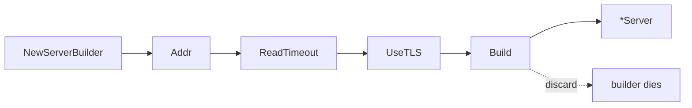

# Builder Pattern — Junior

## 1. What the Builder pattern actually is

You have a struct that's expensive to construct correctly. Maybe it has a dozen fields, several of which depend on each other. Maybe construction has multiple phases — parse input, validate, allocate resources, return the finished thing. A single constructor call is awkward; functional options ([../01-functional-options/](../01-functional-options/)) work for "set N independent knobs", but they break down when you need *steps* — when one configuration choice changes what the next step does.

The Builder pattern is the answer. You introduce a separate type (the Builder) whose only job is to accumulate configuration step-by-step, and then produce the final object via a terminal call:

```go
srv, err := NewServerBuilder().
    Addr(":8080").
    ReadTimeout(5 * time.Second).
    UseTLS("cert.pem", "key.pem").
    Build()
```

Three things to notice already:

1. The intermediate calls (`Addr`, `ReadTimeout`, `UseTLS`) return the builder, so they chain.
2. The terminal call (`Build`) returns the final `*Server` (and an error).
3. The builder is throwaway. It exists to construct the server. After `Build()`, you don't reuse it.

This file teaches the minimum mechanics, why Go's idiom is *not* the Java-style "fluent builder is mandatory for every struct", and when you genuinely need this pattern over alternatives.

---

## 2. Table of Contents

1. [What the Builder pattern actually is](#1-what-the-builder-pattern-actually-is)
2. [Table of Contents](#2-table-of-contents)
3. [Functional options vs Builder — choose first](#3-functional-options-vs-builder--choose-first)
4. [The minimum implementation](#4-the-minimum-implementation)
5. [The four canonical Go shapes](#5-the-four-canonical-go-shapes)
6. [Pointer receiver vs value receiver](#6-pointer-receiver-vs-value-receiver)
7. [Error handling — defer to `Build()`](#7-error-handling--defer-to-build)
8. [What happens after `Build()`](#8-what-happens-after-build)
9. [A second worked example: SQL query builder](#9-a-second-worked-example-sql-query-builder)
10. [Common mistakes a junior makes](#10-common-mistakes-a-junior-makes)
11. [Tricky points](#11-tricky-points)
12. [Quick test](#12-quick-test)
13. [Cheat sheet](#13-cheat-sheet)
14. [What to learn next](#14-what-to-learn-next)

---

## 3. Functional options vs Builder — choose first

Before writing any builder, ask: do you actually need one? Most Go code that thinks it needs a builder needs functional options instead.

| Use functional options when… | Use Builder when… |
|------------------------------|-------------------|
| All fields are independent | Fields have **dependencies** or **phases** |
| One-shot construction | Multi-step process with validation between steps |
| `New(opts...)` reads fine | Caller benefits from a guided, IDE-completable sequence |
| Final object is plain data | Final object has **derived state** computed from inputs |
| You want zero per-call allocation | Builder cost is amortised (one server per process) |

Concrete examples where Builder genuinely fits:

- **SQL query builder** — `Select(...).From(...).Where(...).GroupBy(...)`. Each call records *what kind of clause* this is. Order matters; some calls invalidate others (`Where` after `OrderBy` is fine, `Select` after `OrderBy` is a programmer bug).
- **HTTP request builder** — `NewRequest(...).WithMethod(...).WithBody(...).Build()`. Body type changes the headers; method changes whether the body is allowed.
- **Test fixture builder** — `NewUser().WithRole("admin").WithSubscription("active").Create()` — common in test code, where the final `Create()` actually persists.
- **Code generators / DSL builders** — building a graph of AST nodes where each builder method links nodes together.

Functional options for the rest. If you're tempted to write a builder for a value object with eight independent fields, you don't need a builder.

---

## 4. The minimum implementation

The smallest correct version. Read it once, then we'll dissect.

```go
package server

import (
    "errors"
    "fmt"
    "time"
)

type Server struct {
    addr         string
    readTimeout  time.Duration
    writeTimeout time.Duration
    tls          *TLSConfig
}

// Builder is a separate type. It accumulates configuration.
type Builder struct {
    addr         string
    readTimeout  time.Duration
    writeTimeout time.Duration
    tlsCertFile  string
    tlsKeyFile   string
    err          error
}

// NewServerBuilder returns a fresh builder with defaults.
func NewServerBuilder() *Builder {
    return &Builder{
        readTimeout:  30 * time.Second,
        writeTimeout: 30 * time.Second,
    }
}

// Each step returns the same builder, so calls chain.
func (b *Builder) Addr(a string) *Builder {
    if b.err != nil { return b }
    if a == "" {
        b.err = errors.New("Addr: empty address")
        return b
    }
    b.addr = a
    return b
}

func (b *Builder) ReadTimeout(d time.Duration) *Builder {
    if b.err != nil { return b }
    b.readTimeout = d
    return b
}

func (b *Builder) WriteTimeout(d time.Duration) *Builder {
    if b.err != nil { return b }
    b.writeTimeout = d
    return b
}

func (b *Builder) UseTLS(certFile, keyFile string) *Builder {
    if b.err != nil { return b }
    b.tlsCertFile = certFile
    b.tlsKeyFile = keyFile
    return b
}

// Build is the terminal call. It does final validation and produces the Server.
func (b *Builder) Build() (*Server, error) {
    if b.err != nil {
        return nil, b.err
    }
    if b.addr == "" {
        return nil, errors.New("Build: Addr is required")
    }
    s := &Server{
        addr:         b.addr,
        readTimeout:  b.readTimeout,
        writeTimeout: b.writeTimeout,
    }
    if b.tlsCertFile != "" {
        tls, err := loadTLS(b.tlsCertFile, b.tlsKeyFile)
        if err != nil {
            return nil, fmt.Errorf("Build: load TLS: %w", err)
        }
        s.tls = tls
    }
    return s, nil
}
```

Usage:

```go
srv, err := NewServerBuilder().
    Addr(":8080").
    ReadTimeout(5 * time.Second).
    UseTLS("cert.pem", "key.pem").
    Build()
if err != nil {
    log.Fatal(err)
}
```

That's the pattern. The rest of this file explains the design choices behind each line.

---

## 5. The four canonical Go shapes

Go developers have settled on four shapes for builders. Pick by what your situation needs.

### 5.1 Pointer-receiver mutating builder (shown above)

```go
func (b *Builder) Addr(a string) *Builder { b.addr = a; return b }
```

- Each step mutates the builder in place.
- Cheap — one allocation total (the builder itself).
- The terminal `Build()` returns the constructed object.
- **Most common in Go.** Use this as your default.

### 5.2 Value-receiver copying builder (immutable)

```go
type Builder struct { /* fields */ }

func (b Builder) Addr(a string) Builder { b.addr = a; return b }
```

- Each step returns a *copy* of the builder.
- More allocations (one per chained call).
- The builder is reusable — you can branch:
  ```go
  base := NewServerBuilder().Addr(":8080")
  prod := base.ReadTimeout(5*time.Second).Build()
  test := base.ReadTimeout(1*time.Minute).Build()
  ```
- Use when callers genuinely want to fork a partially-configured builder. Otherwise §5.1.

### 5.3 Stage-typed builder (compile-time enforcement)

```go
type AddrBuilder struct{}
type TimeoutBuilder struct{ addr string }
type FinalBuilder struct{ addr string; timeout time.Duration }

func NewServerBuilder() AddrBuilder { return AddrBuilder{} }
func (b AddrBuilder) Addr(a string) TimeoutBuilder { return TimeoutBuilder{addr: a} }
func (b TimeoutBuilder) ReadTimeout(d time.Duration) FinalBuilder { return FinalBuilder{addr: b.addr, timeout: d} }
func (b FinalBuilder) Build() (*Server, error) { /* ... */ }
```

- The compiler enforces the order: `NewServerBuilder().ReadTimeout(...)` is a compile error.
- Powerful but verbose. Three types per builder. Each new step is a refactor.
- Rare in idiomatic Go. Common in Rust ("typestate" pattern), Kotlin, F#.
- Reserve for *truly* ordered phases where misordering is catastrophic (e.g., cryptographic key derivation steps).

### 5.4 Terminal-method variants (multiple `Build`s)

```go
type Builder struct { /* ... */ }

func (b *Builder) Build() (*Server, error) { /* returns started server */ }
func (b *Builder) Plan() *ServerPlan       { /* returns description without starting */ }
func (b *Builder) Validate() error         { /* returns error without building */ }
```

- One builder, multiple terminal calls. Each produces a different "view".
- Useful when callers sometimes want to *inspect* the config without committing.
- Add this *after* §5.1 is in place — don't design for it from day one.

---

## 6. Pointer receiver vs value receiver

Most Go builders use pointer receivers (§5.1). Three reasons:

### 6.1 Zero allocation per chain step

```go
// Pointer receiver — one builder allocation, then mutations
b := NewServerBuilder()       // alloc once
b.Addr(":8080")               // no alloc
b.ReadTimeout(5*time.Second)  // no alloc
b.Build()                     // builds the final Server

// Value receiver — one allocation per step
b := NewServerBuilder()       // alloc once
b = b.Addr(":8080")           // copy & return new value
b = b.ReadTimeout(5*time.Second) // another copy
```

For a 10-step chain, that's 1 alloc vs 10 — a 10× difference. At call sites that run once per process, irrelevant. In a hot-path constructor (per-request, per-frame), it matters.

### 6.2 Method chains read cleaner with `*Builder`

```go
// Pointer — chain works on the original builder
NewServerBuilder().Addr(":8080").ReadTimeout(...).Build()

// Value — same, but every call is a copy under the hood
```

Both *look* the same at the call site. The difference is invisible until you store an intermediate:

```go
b := NewServerBuilder()
b.Addr(":8080")     // pointer: mutates b
                    // value: returns a new builder, original b unchanged — silent bug
```

If you choose value-receiver semantics, document it loudly. Most Go code expects pointer semantics for chained methods.

### 6.3 Mutability is intentional

A builder *is* a mutable accumulator. Hiding that behind value semantics fights the pattern. If you want immutability, use functional options — that's their wheelhouse.

---

## 7. Error handling — defer to `Build()`

The hardest design choice in any builder. Each step might fail; how do you report it?

### 7.1 The deferred-error pattern (idiomatic Go)

```go
type Builder struct {
    /* fields */
    err error
}

func (b *Builder) Addr(a string) *Builder {
    if b.err != nil { return b }     // short-circuit
    if a == "" {
        b.err = errors.New("Addr: empty")
        return b
    }
    b.addr = a
    return b
}

func (b *Builder) Build() (*Server, error) {
    if b.err != nil { return nil, b.err }
    // final validation + construction
    return &Server{ /* ... */ }, nil
}
```

The pattern: the first error is *captured* in the builder. Every subsequent step checks the field and returns early. The terminal `Build()` returns the first error.

**Why this works:** callers write the natural chain and check the error once at the end:

```go
srv, err := NewServerBuilder().
    Addr(":8080").
    ReadTimeout(5 * time.Second).
    UseTLS("cert.pem", "key.pem").
    Build()
if err != nil { /* handle */ }
```

If `Addr(":8080")` had failed, `ReadTimeout` and `UseTLS` would have been no-ops. `Build()` returns the original error.

### 7.2 Why not return `error` from every step?

```go
// Anti-idiom
b, err := NewServerBuilder().Addr(":8080")
if err != nil { /* ... */ }
b, err = b.ReadTimeout(5*time.Second)
if err != nil { /* ... */ }
```

This destroys the chaining. You've reinvented functional options badly. Don't do it.

### 7.3 Why not panic?

```go
// Anti-idiom
func (b *Builder) Addr(a string) *Builder {
    if a == "" { panic("empty addr") }
    b.addr = a
    return b
}
```

A `panic` reaches further than the caller expects. For *programmer errors* (clearly impossible inputs in production), panic is sometimes defensible. For *runtime errors* (a config file with a bad value), it's always wrong. Use deferred error capture.

### 7.4 When the error matters before `Build()`

If a later step needs to know the result of an earlier validation (e.g., `UseTLS` needs to know `Addr` was valid because the TLS cert must match the hostname), the builder *can* expose a `.Err() error` method:

```go
b := NewServerBuilder().Addr(":8080").UseTLS(...)
if b.Err() != nil { /* handle without Build() */ }
```

But this is rare. The deferred pattern handles 95% of cases.

---

## 8. What happens after `Build()`

The builder's lifecycle:



Three rules:

1. **The builder is single-use.** After `Build()`, treat it as garbage. Reusing it is undefined behaviour — most builders copy fields *into* the Server but leak references via pointer-typed fields (e.g., a `*tls.Config`). Calling `Build()` twice can produce two Servers that share state in surprising ways.

2. **The Server doesn't reference the Builder.** `Build()` copies values into a fresh `*Server`. The builder is no longer needed; GC reclaims it.

3. **If you need to "rebuild" with tweaks, build a new builder.** Or use the value-receiver shape (§5.2) which makes branching explicit.

```go
// Wrong — reusing a builder
b := NewServerBuilder().Addr(":8080")
s1, _ := b.Build()
b.Addr(":9090")
s2, _ := b.Build()  // are s1 and s2 sharing state? undefined.

// Right — fresh builder per Server
b := func() *Builder { return NewServerBuilder().ReadTimeout(5*time.Second) }
s1, _ := b().Addr(":8080").Build()
s2, _ := b().Addr(":9090").Build()
```

If your domain genuinely calls for reusable builders (e.g., a factory of identical servers with one varying field), wrap the construction in a function and call it twice.

---

## 9. A second worked example: SQL query builder

A different domain. Watch how the same shape applies.

```go
package query

import (
    "fmt"
    "strings"
)

type Builder struct {
    table   string
    columns []string
    wheres  []string
    args    []any
    orderBy string
    limit   int
    err     error
}

func Select(cols ...string) *Builder {
    if len(cols) == 0 {
        return &Builder{err: fmt.Errorf("Select: no columns")}
    }
    return &Builder{columns: cols}
}

func (b *Builder) From(t string) *Builder {
    if b.err != nil { return b }
    if t == "" { b.err = fmt.Errorf("From: empty table"); return b }
    b.table = t
    return b
}

func (b *Builder) Where(cond string, args ...any) *Builder {
    if b.err != nil { return b }
    b.wheres = append(b.wheres, cond)
    b.args = append(b.args, args...)
    return b
}

func (b *Builder) OrderBy(col string) *Builder {
    if b.err != nil { return b }
    b.orderBy = col
    return b
}

func (b *Builder) Limit(n int) *Builder {
    if b.err != nil { return b }
    if n < 0 { b.err = fmt.Errorf("Limit: negative"); return b }
    b.limit = n
    return b
}

func (b *Builder) Build() (string, []any, error) {
    if b.err != nil { return "", nil, b.err }
    if b.table == "" { return "", nil, fmt.Errorf("Build: From required") }

    var sb strings.Builder
    sb.WriteString("SELECT ")
    sb.WriteString(strings.Join(b.columns, ", "))
    sb.WriteString(" FROM ")
    sb.WriteString(b.table)
    if len(b.wheres) > 0 {
        sb.WriteString(" WHERE ")
        sb.WriteString(strings.Join(b.wheres, " AND "))
    }
    if b.orderBy != "" {
        sb.WriteString(" ORDER BY ")
        sb.WriteString(b.orderBy)
    }
    if b.limit > 0 {
        fmt.Fprintf(&sb, " LIMIT %d", b.limit)
    }
    return sb.String(), b.args, nil
}
```

Usage:

```go
sql, args, err := query.Select("id", "name", "email").
    From("users").
    Where("active = ?", true).
    Where("created_at > ?", since).
    OrderBy("created_at DESC").
    Limit(100).
    Build()
```

Three things worth noting:

1. **`Select` is the entry point**, not `NewBuilder`. SQL reads `SELECT...FROM...` so the API mirrors it. Naming the entry function after the first verb makes the chain natural.
2. **`Where` is additive.** Each call appends a clause. The builder accumulates state; the terminal call assembles it.
3. **Returning `(sql, args, error)`** is idiomatic for SQL builders — the args are inseparable from the SQL string (placeholder positions matter), so return them together.

---

## 10. Common mistakes a junior makes

### 10.1 Forgetting to return the builder

```go
func (b *Builder) Addr(a string) *Builder {
    if a == "" { return b }
    b.addr = a
    // forgot: return b
}
```

Compile error (missing return). But if you accidentally fix it as `return nil`, the next chained call panics. Always `return b` from intermediate methods.

### 10.2 Mutating shared state in `Build()`

```go
func (b *Builder) Build() *Server {
    return &Server{
        headers: b.headers,   // shares the map!
    }
}
```

If `b.headers` is a map (or slice), the resulting `*Server` shares it with the builder. Subsequent calls to `b.Header(...)` mutate the already-built server. Copy in `Build()`:

```go
func (b *Builder) Build() *Server {
    h := make(map[string]string, len(b.headers))
    for k, v := range b.headers { h[k] = v }
    return &Server{headers: h}
}
```

### 10.3 Building incrementally without a `Build()` call

```go
type Builder struct { Server *Server }   // public field

func NewBuilder() *Builder { return &Builder{Server: &Server{}} }
func (b *Builder) Addr(a string) *Builder { b.Server.addr = a; return b }

// caller
b := NewBuilder().Addr(":8080")
srv := b.Server   // skip Build()
```

The builder is supposed to be the *transient* state, separate from the final object. Exposing the Server during construction lets callers skip validation. Don't do it.

### 10.4 Using a builder when you don't need one

```go
type ConfigBuilder struct{ addr string; timeout time.Duration; logger *log.Logger }
func NewConfigBuilder() *ConfigBuilder { return &ConfigBuilder{} }
func (b *ConfigBuilder) Addr(a string) *ConfigBuilder { /* ... */ }
func (b *ConfigBuilder) Timeout(d time.Duration) *ConfigBuilder { /* ... */ }
func (b *ConfigBuilder) Logger(l *log.Logger) *ConfigBuilder { /* ... */ }
func (b *ConfigBuilder) Build() *Config { /* ... */ }
```

Three independent fields, no dependencies, no phases. This is functional options pretending to be a builder. Cost: more code, more types, more documentation, no benefit. Use functional options.

---

## 11. Tricky points

### 11.1 Receiver shadowing

```go
func (b *Builder) Addr(a string) *Builder {
    b := *b           // accidental local copy
    b.addr = a
    return &b
}
```

The reassignment `b := *b` creates a *local* `Builder` copy. Mutating it leaves the original unchanged. Calling chain returns a `&b` of the local copy, breaking aliasing for subsequent chain steps. Don't shadow the receiver.

### 11.2 Goroutines and the builder

```go
b := NewServerBuilder().Addr(":8080")
go func() { b.ReadTimeout(5*time.Second) }()
go func() { b.WriteTimeout(10*time.Second) }()
// race
srv, _ := b.Build()
```

Builders are *not* thread-safe. The pattern is single-threaded by design: one goroutine accumulates, one goroutine calls `Build()`. If you need concurrent assembly, the answer is rarely "synchronise the builder" — it's "have a single goroutine collect from channels".

### 11.3 Embedding builders

```go
type BaseBuilder struct{ /* common fields */ }
func (b *BaseBuilder) Common(...) *BaseBuilder { /* ... */ }

type ServerBuilder struct {
    BaseBuilder
    /* server-specific */
}
func (b *ServerBuilder) Addr(...) *ServerBuilder { /* ... */ }

// Caller:
b := NewServerBuilder().Common(...).Addr(":8080")
//                       ^^^^^^^^^^ returns *BaseBuilder, can't chain to Addr!
```

The embedded `Common` returns `*BaseBuilder`, not `*ServerBuilder`. The chain breaks. To embed cleanly, you either:
- Don't chain across types — provide non-chained `Common` setters and chain only same-type methods.
- Override `Common` on `*ServerBuilder` to return `*ServerBuilder`.

This is awkward and is one reason Go builders rarely use embedding. Use composition (a separate struct field) instead.

---

## 12. Quick test

**Q1.** What's the bug?

```go
func (b *Builder) Addr(a string) Builder {
    b.addr = a
    return *b
}
```

<details><summary>Answer</summary>

Returns `Builder` (value), not `*Builder` (pointer). The next chained call operates on a *copy* of the builder. If you call `b.ReadTimeout(...)` on the return value, the original `b` is unchanged — but the chain returns yet another copy, so the final `Build()` sees the right state by luck. Or unluck: if the caller stored an intermediate, the intermediate is stale.

Always return the pointer type when the receiver is a pointer.
</details>

**Q2.** What's the output?

```go
package main

import "fmt"

type Builder struct{ value int }

func (b *Builder) Add(n int) *Builder { b.value += n; return b }

func main() {
    b1 := &Builder{}
    b2 := b1.Add(1).Add(2).Add(3)
    fmt.Println(b1.value, b2.value)
}
```

<details><summary>Answer</summary>

`6 6`. Both `b1` and `b2` point at the same `Builder`. `Add` mutates `*b` and returns `b`, so the chain accumulates 1+2+3=6 in the one builder. `b2 == b1` (same address).
</details>

**Q3.** Identify the alternative:

```go
NewServer(":8080",
    WithReadTimeout(5*time.Second),
    WithWriteTimeout(10*time.Second),
    WithLogger(myLogger),
)
```

vs.

```go
NewServerBuilder().
    Addr(":8080").
    ReadTimeout(5*time.Second).
    WriteTimeout(10*time.Second).
    Logger(myLogger).
    Build()
```

Which pattern, and when would you pick which?

<details><summary>Answer</summary>

First is functional options, second is builder. For three independent setters and no phases, functional options is the right call — less code, less indirection, less type machinery. Switch to builder only when you have validation between steps, phases, or derived state. See §3 for the decision table.
</details>

---

## 13. Cheat sheet

| What | How |
|------|-----|
| Builder type | `type Builder struct { ... err error }` |
| Entry point | `NewXBuilder() *Builder` or domain-named (`Select(...)`, `NewRequest(...)`) |
| Step method | `func (b *Builder) Step(args) *Builder { if b.err != nil { return b }; ...; return b }` |
| Terminal | `func (b *Builder) Build() (*X, error)` |
| Error strategy | Capture first error in `b.err`; check at every step start; return from `Build()` |
| Receiver | Pointer (`*Builder`) by default |
| Threading | Single goroutine — don't try to share |
| Lifecycle | Single-use; discard after `Build()` |

---

## 14. What to learn next

In order:

1. **[middle.md](middle.md)** — Fluent builders for complex domains, generics in builders, builder reuse via copy, builder ↔ functional-options interop, multi-terminal builders.
2. **[../01-functional-options/](../01-functional-options/)** — Re-read with builder context. Most Go construction is functional options; you should pick the right tool each time.
3. **[../03-strategy-pattern/](../03-strategy-pattern/)** — When the constructed thing's *behaviour* varies, not just its config. Often pairs with a builder.

Builders are over-applied. The pattern is great for genuine multi-phase construction (SQL, HTTP requests, AST nodes, test fixtures) and a poor fit for simple value objects. Knowing *when not to use* a builder is half the skill.
