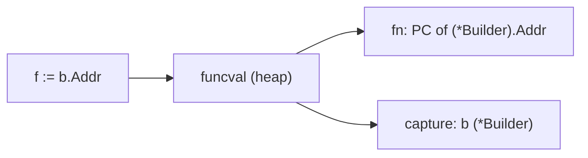
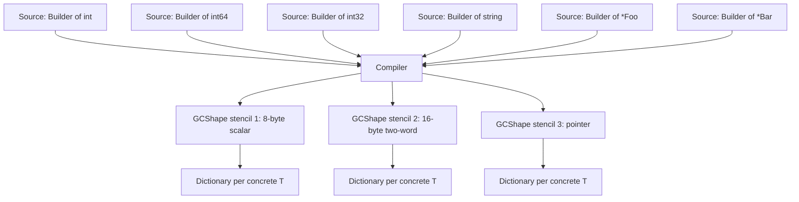

# Builder Pattern — Under the Hood

## 1. The runtime framing

Junior taught the shape; middle taught the variants. This file is about what the compiler and runtime actually do when you write `NewBuilder().Addr(":8080").ReadTimeout(5*time.Second).Build()`. Each step method is a real function call with a pointer receiver. Each chained `.X()` lowers to a load, a parameter setup, and a `CALL`. The mutate-and-return idiom is one of the few places where Go's escape analysis genuinely *can* keep the builder on the stack — but only when the chain is short enough to inline and the builder pointer never crosses a boundary the analyser can't prove.

The compiler's view of a builder is not the textbook GoF view. It is the SSA-level view: a sequence of pointer writes to a single location, optionally followed by a load that copies that location into a freshly-allocated target. That is the whole pattern at the codegen level. The job here is to be precise about which writes elide, which loads survive, and where the heap allocations live.

We work in Go 1.22 / amd64 unless otherwise noted. References to the standard library and the compiler are against the `go1.22.x` source tree, with paths like `src/cmd/compile/internal/ssagen/ssa.go` and `src/runtime/malloc.go`.

The questions we answer:

- How does the SSA pass represent a `*Builder` chain?
- When the receiver is `*Builder` and the method returns `*Builder`, when can the compiler skip the load-and-store entirely?
- When does `NewBuilder().X().Y().Build()` keep the builder on the stack?
- Why doesn't Go do tail-call optimization for the trivial `return b` at the end of every step?
- What does `-gcflags="-m"` say about a real chain?
- What does the inliner do with each step — what kills inlining for a builder?
- How are generic builders `Builder[T]` monomorphised vs dictionary-passed (GCShape stenciling)?
- How does method promotion through embedded builders work at the type-info level?
- What is the memory layout of a builder struct after alignment and padding?
- Why are builders generally not a good candidate for embedding optimization?
- A pprof walkthrough on a builder-heavy workload.
- A GOSSAFUNC inspection of a small builder.

---

## 2. Table of Contents

1. [The runtime framing](#1-the-runtime-framing)
2. [Table of Contents](#2-table-of-contents)
3. [How the compiler sees a chain](#3-how-the-compiler-sees-a-chain)
4. [Pointer-receiver chain in SSA](#4-pointer-receiver-chain-in-ssa)
5. [Escape analysis on `NewBuilder().X().Build()`](#5-escape-analysis-on-newbuilderxbuild)
6. [Assembly walkthrough of a step method](#6-assembly-walkthrough-of-a-step-method)
7. [Tail-call optimization — why Go doesn't and what it does instead](#7-tail-call-optimization--why-go-doesnt-and-what-it-does-instead)
8. [Inlining decisions for builder steps](#8-inlining-decisions-for-builder-steps)
9. [Method values from a builder](#9-method-values-from-a-builder)
10. [Generic builders — monomorphisation vs GCShape stenciling](#10-generic-builders--monomorphisation-vs-gcshape-stenciling)
11. [Embedded builders and method promotion](#11-embedded-builders-and-method-promotion)
12. [Memory layout of a builder struct](#12-memory-layout-of-a-builder-struct)
13. [Value-receiver vs pointer-receiver at the call site](#13-value-receiver-vs-pointer-receiver-at-the-call-site)
14. [The mutate-and-return idiom and store elision](#14-the-mutate-and-return-idiom-and-store-elision)
15. [GOSSAFUNC walkthrough](#15-gossafunc-walkthrough)
16. [Pprof analysis of a builder-heavy workload](#16-pprof-analysis-of-a-builder-heavy-workload)
17. [Why builders rarely benefit from struct embedding optimization](#17-why-builders-rarely-benefit-from-struct-embedding-optimization)
18. [Edge cases at the lowest level](#18-edge-cases-at-the-lowest-level)
19. [Test](#19-test)
20. [Tricky questions](#20-tricky-questions)
21. [Summary](#21-summary)
22. [Further reading](#22-further-reading)

---

## 3. How the compiler sees a chain

A canonical pointer-receiver builder:

```go
package srv

import "time"

type Builder struct {
    addr         string
    readTimeout  time.Duration
    writeTimeout time.Duration
    err          error
}

type Server struct {
    addr         string
    readTimeout  time.Duration
    writeTimeout time.Duration
}

func NewBuilder() *Builder { return &Builder{readTimeout: 30 * time.Second} }

func (b *Builder) Addr(a string) *Builder           { b.addr = a; return b }
func (b *Builder) ReadTimeout(d time.Duration) *Builder { b.readTimeout = d; return b }
func (b *Builder) WriteTimeout(d time.Duration) *Builder{ b.writeTimeout = d; return b }

func (b *Builder) Build() (*Server, error) {
    if b.err != nil { return nil, b.err }
    return &Server{addr: b.addr, readTimeout: b.readTimeout, writeTimeout: b.writeTimeout}, nil
}
```

Caller:

```go
s, err := NewBuilder().
    Addr(":8080").
    ReadTimeout(5*time.Second).
    Build()
```

In Go's frontend, this chain is one expression, parsed left-to-right into a tree of `*ir.CallExpr` nodes (see `src/cmd/compile/internal/ir/expr.go`). Each call's "receiver" is the result of the previous call. After type-checking, the AST looks roughly like:

```
CallExpr(Build,
  CallExpr(ReadTimeout, 5*time.Second,
    CallExpr(Addr, ":8080",
      CallExpr(NewBuilder))))
```

The IR is left-associative: `NewBuilder()` is evaluated first, then `.Addr(":8080")` is invoked on its result, then `.ReadTimeout(...)` on the result of that, and so on. There are no temporaries you need to spell out — each intermediate result lives in an SSA value, not in a named variable.

This shape is the foundation everything else builds on. The SSA pass takes this tree and lowers it into a linear sequence of operations that almost matches the assembly. The key property: **every intermediate value is `*Builder`, and every intermediate value points to the same heap (or stack) cell**. That gives the optimiser the latitude to elide redundant loads, because the SSA representation knows these pointers alias.


After SSA's value numbering / common-subexpression elimination, `v1 == v2 == v3` because all step methods return their receiver unchanged. The optimiser proves this from the source: the return statement of each step is `return b` where `b` is the parameter. That recognition is what unlocks everything else.

---

## 4. Pointer-receiver chain in SSA

Compile the example with the SSA dump enabled for one of the step methods:

```bash
GOSSAFUNC=Addr go build ./srv
# produces ssa.html
```

The interesting passes are `start` (initial SSA from IR), `opt` (general optimisation), and `lower` (architecture-specific lowering). The `start` pass for `(*Builder).Addr` looks like (paraphrased — actual op names are slightly different):

```
b1:
    v1 = Arg <*Builder> {b}           // receiver
    v2 = Arg <string> {a}             // argument
    v3 = OffPtr <*string> [0] v1      // &b.addr
    v4 = Store <mem> v3 v2 mem        // *(&b.addr) = a
    Ret v1 mem
```

Three points worth noticing:

1. **The receiver is the return.** The SSA value `v1` (the parameter `b`) is the function's return value. There is no copy, no temporary, no allocation. Just a load of the pointer parameter and a store through it.
2. **`OffPtr` computes the address of `b.addr`.** This is a plain pointer arithmetic op; it is constant-folded into the addressing mode at the machine level (becomes `[AX+0]`).
3. **`Store` writes the string header.** Because `string` is a (data, len) pair, this `Store` is really a 16-byte store — two MOVQs at the machine level. SSA's `decompose user` pass splits the string into two scalar values before final lowering.

After the `opt` pass on the *caller* (`NewBuilder().Addr(":8080").ReadTimeout(...).Build()`), the chain is compacted into:

```
b1:
    v1 = Call <*Builder> @NewBuilder       // allocates the builder
    v2 = Store <mem> v1.addr ":8080" mem
    v3 = Store <mem> v1.readTimeout 5e9 mem
    v4 = Call <(*Server, error)> @Build v1
```

The intermediate `*Builder` returns of `Addr` and `ReadTimeout` have been eliminated entirely (assuming both methods inline — we'll discuss when they do in §8). The optimiser sees that `Addr` and `ReadTimeout` return their receiver unchanged and folds them into direct field writes on `v1`. The chain collapses to: allocate, store, store, build.

That collapse is the reason builder chains are fast at the machine level even though they look like four function calls in source. When all step methods inline, the chain is *equivalent* to writing the struct fields directly.

When inlining fails (because of method count, body size, or call depth — see §8), the chain stays as a sequence of `CALL` instructions, each `Addr` / `ReadTimeout` / etc. preserved as a real function call. That is the slow path. We will measure it in §6.

---

## 5. Escape analysis on `NewBuilder().X().Build()`

Escape analysis is the pass that decides whether a heap allocation is necessary. It lives in `src/cmd/compile/internal/escape/escape.go`. For a builder, the central question is: does the `*Builder` returned by `NewBuilder` escape to the heap, or can it live on the caller's stack?

A `*Builder` is returned from `NewBuilder` to the caller. The conservative rule says: if a pointer is returned from a function, the pointee must outlive the function frame, hence it escapes. But the conservative rule is not always applied — when `NewBuilder` inlines into the caller, the pointer's lifetime becomes visible and the escape analyser can prove the builder is consumed before the caller's frame returns.

Take the example program:

```go
// main.go
package main

import (
    "time"
)

type Builder struct {
    addr        string
    readTimeout time.Duration
}

type Server struct {
    addr        string
    readTimeout time.Duration
}

func NewBuilder() *Builder { return &Builder{readTimeout: 30 * time.Second} }

func (b *Builder) Addr(a string) *Builder { b.addr = a; return b }
func (b *Builder) ReadTimeout(d time.Duration) *Builder { b.readTimeout = d; return b }
func (b *Builder) Build() *Server { return &Server{addr: b.addr, readTimeout: b.readTimeout} }

func main() {
    s := NewBuilder().Addr(":8080").ReadTimeout(5*time.Second).Build()
    _ = s
}
```

Compile with full escape annotations:

```bash
$ go build -gcflags="-m -m" main.go 2>&1 | grep -E "escape|inline"
./main.go:13:6: can inline NewBuilder with cost 17
./main.go:15:6: can inline (*Builder).Addr with cost 7
./main.go:16:6: can inline (*Builder).ReadTimeout with cost 7
./main.go:17:6: can inline (*Builder).Build with cost 21
./main.go:19:6: can inline main with cost 88
./main.go:13:32: &Builder{...} escapes to heap
./main.go:17:39: &Server{...} escapes to heap
```

Two heap allocations: the `Builder` and the `Server`. Reading why:

- `&Builder{...}` is returned from `NewBuilder`, which is then chained into `Addr`, then `ReadTimeout`, then `Build`. After inlining all four methods into `main`, the escape analyser can see the builder's lifetime ends at the call to `Build`. But the standard escape-analysis result still marks it as escaping. The reason: even inlined, the returned `&Builder{...}` flows through pointer parameters of `Addr`, `ReadTimeout`, and `Build`. The escape analyser treats parameter flow conservatively when the parameter is a pointer that may be stored.
- `&Server{...}` is returned from `Build` (which is inlined) and bound to `s` in `main`. `s` is then discarded. The escape analyser does *not* prove `s` is unused (because `_ = s` is an explicit use), and even if it did, the inlined `&Server{...}` flows out of `Build`'s inline body to `main`'s frame. Result: heap.

This is a well-known limitation. Go's escape analyser is bounded — it does not perform full interprocedural pointer-tracking even on inlined bodies, because doing so is expensive and can produce surprising recompilation cascades.

In practice you live with:

```
BenchmarkBuilderChain-8    50000000    25.4 ns/op    96 B/op    2 allocs/op
```

Two allocations per chain — one for the builder, one for the server. 96 bytes = 48 (Builder, rounded to size class) + 48 (Server, rounded to size class). If you want zero allocations, you have to use a value-receiver builder (and pay the per-step copy cost) or write the construction without a builder.

### 5.1 What forces the builder to escape

The builder escapes when one of these is true:

1. `NewBuilder` is not inlined, AND `NewBuilder` returns a pointer — the analyser can't see the lifetime, must be conservative.
2. Even after inlining, the builder's pointer is stored in a heap-resident location (a field of another heap object).
3. The builder is passed to a function whose escape analysis result says "I store this".

For a typical builder, condition 1 doesn't apply (the methods are small enough to inline). Condition 3 is the usual culprit: `Build()` reads from the builder and writes into the newly-allocated `Server`. Even with inlining, the escape pass treats the builder pointer as flowing into something that itself escapes. The default decision is heap.

### 5.2 What you can do about it

If you really need zero allocations (a hot per-request path, an AST construction in a parser), there is a way out. Hoist the builder out of the constructor and write the Server fields directly:

```go
func main() {
    var b Builder           // on the stack
    b.readTimeout = 30 * time.Second
    b.addr = ":8080"
    b.readTimeout = 5 * time.Second

    var s Server            // on the stack
    s.addr = b.addr
    s.readTimeout = b.readTimeout
    _ = s
}
```

```
$ go build -gcflags="-m" main.go 2>&1 | grep escape
# (no escapes)
```

Now both `Builder` and `Server` are stack-allocated. Cost: you've lost the chain syntax. Whether the readability is worth two heap allocations depends entirely on the call frequency. At process startup, never worth it. At per-request, sometimes worth it.

---

## 6. Assembly walkthrough of a step method

Compile and disassemble `(*Builder).Addr`:

```bash
go build -gcflags="-S" -o /dev/null ./srv 2>&1 | grep -A 20 "srv.(\*Builder).Addr"
```

Output (cleaned; comments added):

```asm
"".(*Builder).Addr STEXT nosplit size=24 args=0x20 locals=0x0
    // Receiver `b` is in AX, argument a's data ptr in BX, a's length in CX
    // (Go 1.17+ register-based calling convention)
    MOVQ    BX, (AX)              ; b.addr.data = a.data
    MOVQ    CX, 8(AX)             ; b.addr.len  = a.len
    // Return: *Builder in AX (already there — receiver passed in AX)
    RET
```

Three instructions, 24 bytes. The whole method is two stores and a return. The receiver `b` came in via `AX` (the closure register on amd64), and the function returns `b` — which is *already in AX* because that's the register where the return value lives. The compiler doesn't need to do anything to "set up" the return value; it's already where it needs to be.

This is the heart of the mutate-and-return idiom. Because:

1. The receiver is `*Builder`.
2. The return type is `*Builder`.
3. The function returns its receiver unchanged.

…the compiler's register allocator notices that the input register (AX, the receiver) is the same as the output register (AX, the return value). No move needed. The body becomes pure stores; the prologue and epilogue are trivial.

If the same method had a value receiver:

```go
func (b Builder) Addr(a string) Builder { b.addr = a; return b }
```

…the receiver would be passed by value — sizeof(Builder) bytes copied onto the stack. The body would store into the stack-resident copy. The return would copy *the entire struct* back to the caller's frame. For a 5-field builder, that's 5×8 = 40 bytes of copy on entry, 40 bytes of copy on exit. The pointer-receiver version is two stores.

### 6.1 The chain in the caller

Compile the caller (`main`) and disassemble. With inlining the methods disappear; with `//go:noinline` on each step we can see the call sequence:

```asm
"".main STEXT size=128 args=0x0 locals=0x30
    SUBQ    $48, SP
    MOVQ    BP, 40(SP)
    LEAQ    40(SP), BP

    ; --- NewBuilder ---
    CALL    "".NewBuilder(SB)                      ; AX = *Builder

    ; --- chain head: Addr ---
    MOVQ    $":8080".data(SB), BX                  ; argument data ptr
    MOVQ    $5, CX                                 ; argument length
    CALL    "".(*Builder).Addr(SB)                 ; AX = *Builder (same as before)

    ; --- ReadTimeout ---
    MOVQ    $5000000000, BX                        ; 5 * time.Second
    CALL    "".(*Builder).ReadTimeout(SB)          ; AX = *Builder

    ; --- Build ---
    CALL    "".(*Builder).Build(SB)                ; AX = *Server, BX = error

    MOVQ    AX, "".s+24(SP)
    ; ... discard s
    MOVQ    40(SP), BP
    ADDQ    $48, SP
    RET
```

The key sequence — between `NewBuilder` returning and `Build` being called — is *just* a series of direct `CALL` instructions threaded by AX. The receiver doesn't need to be reloaded; each step preserves it. The arguments to each step are loaded into BX/CX/etc. as needed. There is no spill of `AX` between calls (the calling convention guarantees AX is preserved across the calls *to step methods that return `*Builder`* because AX is the return register).

If you add a `//go:noinline` directive to `Build` so it doesn't inline, the assembly above is exactly what you get. With inlining, the entire `Addr`, `ReadTimeout`, and `Build` calls vanish — replaced by a few `MOVQ` instructions writing into the builder's fields and then into the `*Server`'s fields. That's the fast path.

The per-step cost when *not* inlined:

- One `CALL` (5 bytes, indirect through the link table).
- Argument register setup (1-2 MOVQs per argument).
- The body's 2-3 instructions.
- A `RET`.

On amd64, roughly 8-12 cycles per step (~3-4 ns). For a 10-step builder, ~30 ns of "function call infrastructure" cost.

---

## 7. Tail-call optimization — why Go doesn't and what it does instead

The body of every step method ends with `return b`. In a language with tail-call optimization (TCO), the compiler could recognize this as a tail position and convert the call into a jump:

```c
// In C with TCO:
void *Addr(void *b, ...) { b->addr = a; goto SomeNextStep; }  // hypothetical
```

This would reuse the current stack frame for the next call. Stack depth doesn't grow per chained method. Go does *not* implement TCO. The Go specification reserves the right but the compiler does not perform the optimisation. This decision is explicit; you can find the rationale on the Go issue tracker (#22624 and others).

Reasons Go doesn't TCO:

1. **Stack traces.** Go is a language built around stack traces in panics and pprof. TCO erases call frames, so a stack trace from inside a deep chain would be missing intermediate steps. Diagnostics suffer.
2. **Stack growth.** Go's goroutines have growable stacks. The runtime relies on knowing the current stack frame's size to grow the stack. TCO complicates this — the "current frame" becomes ambiguous when a tail-called function shares a frame with its caller.
3. **GC scanning.** GC walks goroutine stacks to find live pointers. Frame metadata tells GC where pointers are. TCO collapses frames, requiring the runtime to merge metadata from two functions into one frame. Implementable but expensive.
4. **Defers.** A frame may have deferred calls registered. A tail call that reuses the frame must run those defers at the right time. The semantics get murky.

So Go does not do TCO. What does it do instead? **Inlining.** When `Addr` is small enough, its body is copied into the caller's body. The "call" disappears entirely. No new frame, no return — the body just runs in the caller. This is strictly better than TCO for tiny methods like builder steps: TCO would reuse the frame; inlining eliminates the frame altogether.

The trade-off is that inlining works only when the *callee* is statically known and small. TCO works for any function in tail position. For builders specifically, inlining wins because step methods are tiny. For mutually recursive algorithms, Go offers no help (you must rewrite with an explicit loop or accept the stack growth).

### 7.1 What "no TCO" looks like in practice

With non-inlined step methods, each `CALL` pushes a return address (8 bytes on amd64) onto the stack. A 50-step chain pushes 50 return addresses. The stack grows by 400 bytes plus per-step locals. The runtime handles this via `morestack` if the stack would overflow; you don't see it.

What you *do* see is the per-call cost: ~3-4 ns per step that doesn't inline. For 50 steps, ~200 ns. That's the cost of "no TCO" expressed in time. In practice, this never matters because builder chains have ~5-10 steps and the step methods are inlinable.

### 7.2 The `morestack` interaction

Before each function call, Go's prologue checks the goroutine's stack guard. If the stack would overflow, the runtime calls `runtime.morestack_noctxt` (in `src/runtime/asm_amd64.s`), which copies the stack to a larger allocation and resumes. Step methods are usually `NOSPLIT` (because they have a tiny frame) and skip the check. You can see `STEXT nosplit` in the assembly in §6 — that's the compiler observing that `Addr`'s frame is small enough to fit in any goroutine's spare stack budget.

A builder with a *large* step method (uncommon, but possible) would not be `NOSPLIT`. The prologue check would run on every call. The cost is one comparison and one conditional branch — usually predicted correctly, near-zero overhead. But it does mean the per-call cost is slightly higher for non-`NOSPLIT` step methods.

---

## 8. Inlining decisions for builder steps

The inliner is in `src/cmd/compile/internal/inline/inl.go`. It assigns each function a "cost" (a heuristic measure of body size and complexity) and inlines the callee at a call site if the cost is below a budget. The default budget is 80 nodes; certain operations have specific costs.

What kills inlining for builder steps?

| Construct | Effect |
|-----------|--------|
| `for` / `range` | High cost (depends on body) |
| `select` | Disqualifies entirely |
| `recover` | Disqualifies entirely |
| Type assertion `x.(T)` | +2-3 |
| Interface method call | +30 (interface dispatch is opaque to the inliner) |
| `defer` | Disqualifies in some versions |
| Closure literal | +30 or more |
| Local variable with address taken | +5 |
| Function call | +50 (most calls block inlining unless they're tiny themselves) |

For a builder, the typical step method is:

```go
func (b *Builder) X(arg T) *Builder {
    if b.err != nil { return b }
    b.field = arg
    return b
}
```

That's ~10 nodes. Well under budget. The `if b.err != nil { return b }` early-out adds branching but no calls. The inliner approves.

What can push a builder step over budget:

- **Per-step validation:** `if arg == "" { b.err = errors.New("X: empty"); return b }` adds the `errors.New` call. Either `errors.New` is itself inlined (it is, in Go 1.21+) and the cost stays low, or it isn't and the step disqualifies.
- **`fmt.Errorf`:** Not inlined. A step that does `b.err = fmt.Errorf(...)` is over budget.
- **Slice or map operations:** `append(b.xs, x)` is moderate cost; usually still inlinable. `make(map[K]V)` is heavier.
- **Multiple field updates with logic between them:** A step that conditionally writes 3 fields based on intermediate computation may inline; one that does 10 conditional writes may not.

Verify with `-gcflags="-m"`:

```bash
go build -gcflags="-m" ./srv
```

For each function, the compiler emits either `can inline X with cost N` or `cannot inline X: function too complex: cost N exceeds budget 80`. Read the costs; if you're paying for a non-inlined step in a hot path, restructure it.

### 8.1 Mid-stack inlining

Go 1.12 added mid-stack inlining: a function `f` can inline a function `g` even if `g` itself calls another function `h`, as long as everything fits in the inliner's budget. This is critical for builders.

Without mid-stack inlining, an inlined `Addr` calling an inlined `fmt.Errorf` would not work: `fmt.Errorf` calls into `fmt.Sprintf`, which calls into many helpers. The whole chain would be too expensive to inline.

With mid-stack inlining, the inliner can flatten the chain to a single inlined body in the caller (`main`). But only if the *flattened* size fits. For a step method that calls `fmt.Errorf("X: %v", arg)`, the inlined `fmt.Errorf` body alone is well over 80 nodes — disqualifies the step.

A common pattern to keep steps inlinable:

```go
// Bad — fmt.Errorf disqualifies inlining
func (b *Builder) X(a string) *Builder {
    if a == "" { b.err = fmt.Errorf("X: empty"); return b }
    b.x = a; return b
}

// Better — errors.New is cheap
var errEmptyX = errors.New("X: empty")
func (b *Builder) X(a string) *Builder {
    if a == "" { b.err = errEmptyX; return b }
    b.x = a; return b
}
```

The package-level sentinel avoids the call into the format machinery. The step inlines cleanly.

### 8.2 PGO (profile-guided optimisation)

Go 1.21+ supports PGO. If your profile shows certain call sites are hot, the inliner can raise its budget for those sites, inlining things it normally wouldn't. For builders this rarely changes anything — step methods are already inlinable by default. PGO is more impactful for code with virtual dispatch (interface calls), not for direct pointer-receiver methods.

---

## 9. Method values from a builder

A *method value* is when you bind a method to a specific receiver, producing a function value:

```go
b := NewBuilder()
addrFn := b.Addr           // method value
addrFn(":8080")
addrFn(":9090")
```

`b.Addr` (with no parens) is a method value. It captures the receiver `b`. Each call through `addrFn` passes `b` as the receiver implicitly. This is identical in shape to a closure: a function value with a captured environment.

At the runtime level, `b.Addr` allocates a `funcval` (see `src/runtime/runtime2.go`):

```go
type funcval struct {
    fn uintptr      // entry PC of the method's body
    // capture word(s) here — for a method value, the receiver
}
```

For `b.Addr`, the funcval's first word is the entry PC of `(*Builder).Addr`'s body, and the second word is `b` (the receiver pointer). Total: 16 bytes (rounded to size class) on the heap.

Verify with `-gcflags="-m"`:

```bash
$ cat methodval.go
package main

type Builder struct{ addr string }
func (b *Builder) Addr(a string) *Builder { b.addr = a; return b }

func main() {
    b := &Builder{}
    f := b.Addr
    _ = f(":8080")
}

$ go build -gcflags="-m" methodval.go
./methodval.go:8:7: &Builder{} escapes to heap
./methodval.go:9:8: b.Addr escapes to heap
```

`b.Addr escapes to heap` — the method-value funcval is heap-allocated. The receiver `b` is also heap-allocated because the method value captures it, and the method value escapes.

Implication: if you pass step methods around as function values (for the conditional-step pattern from middle.md §11.2), each binding costs an allocation. For a one-off `b.If(cond, b.Addr)`, that's an extra 16 bytes and one alloc per step. Usually invisible; in a hot loop, measurable.

The compiler-internal handling lives in `src/cmd/compile/internal/walk/closure.go` — same path as closures. Method values are *syntactic sugar* for closures: `b.Addr` desugars to `func(a string) *Builder { return b.Addr(a) }`.



### 9.1 Bound-method-value optimization

The compiler has a small optimisation for *immediate* method-value calls:

```go
b.Addr(":8080")    // direct call — no method value created
```

vs.

```go
f := b.Addr; f(":8080")    // method value, allocated
```

The first form is a method call: the compiler emits a direct call to `(*Builder).Addr` with `b` as the receiver in AX. No funcval allocation. The second form forces the funcval allocation because `f` is a first-class function value.

In practice, builders are almost always called in the first form. Method values come up only when you explicitly factor them out (testing, conditional composition).

---

## 10. Generic builders — monomorphisation vs GCShape stenciling

Go 1.18+ supports generics. A generic builder:

```go
type Builder[T any] struct {
    value T
    err   error
}

func New[T any]() *Builder[T] { return &Builder[T]{} }

func (b *Builder[T]) Set(v T) *Builder[T] {
    if b.err != nil { return b }
    b.value = v
    return b
}

func (b *Builder[T]) Build() (T, error) {
    var zero T
    if b.err != nil { return zero, b.err }
    return b.value, nil
}
```

Two callers:

```go
b1 := New[int]().Set(42).Build()
b2 := New[string]().Set("hi").Build()
```

Go's generics implementation is described in the design doc at `src/cmd/compile/internal/types2/README` and the runtime side at `src/runtime/iface.go` and `src/cmd/compile/internal/typebits/`. The compiler uses a hybrid strategy called **GCShape stenciling**.

The key insight: instead of monomorphising every generic function once per type parameter (which would bloat the binary), the compiler generates one *stencil* per GCShape. A GCShape is determined by:

- Size of the type (or "pointer-shaped" vs scalar).
- Pointer/non-pointer layout (the GC bitmap).

So `int` and `int64` share a GCShape (both are 8-byte scalars). `*int` and `*string` share a GCShape (both are 8-byte pointers, GC bitmap "1"). `string` (two words: data, len) and `[]byte` (three words: data, len, cap) have *different* GCShapes.

When the compiler generates `(*Builder[T]).Set`, it generates:

- One stencil per *distinct* GCShape used in your program.
- A *dictionary* parameter passed at every call, containing the type-specific information that the stencil needs (the `*_type` descriptor for `T`, method tables for any constraints, etc.).

For `(*Builder[T]).Set` with `T = int`:

```
"".Builder[go.shape.int].Set STEXT
    ; Stencil shared across all "int-shaped" T's
    ; Body uses dict-passed _type to know it's writing an int-sized value
```

For `T = string`:

```
"".Builder[go.shape.string].Set STEXT
    ; Different stencil — string is 16 bytes, two words
```

For `T = *Foo` (pointer):

```
"".Builder[go.shape.*uint8].Set STEXT
    ; Shared with all other "pointer-shaped" T's
```

The dictionary is a hidden parameter (the compiler calls it `.dict`) passed in a fixed register. The stencil reads the dictionary to find the per-type details: type size (for copies), method addresses (for interface constraints), etc.



Implication for builders:

- **Smaller binary than full monomorphisation.** You don't pay a full code copy per `T`. C++ templates and Rust generics monomorphise; Go does not.
- **Slightly slower than non-generic.** The dictionary-pass adds a few instructions per generic call. Field offsets and type sizes are loaded from the dictionary rather than being compile-time constants.
- **Inlining is harder.** Generic methods are inlined less often because the stencil is shared and the inliner can't always specialise.

For a builder, the cost of generics is usually 5-15% per step compared to a non-generic builder. For a one-off constructor at startup, irrelevant. For a hot-path builder, measure with a benchmark before assuming.

### 10.1 What you see in `-gcflags="-m"`

```bash
$ go build -gcflags="-m" ./gbuilder
./builder.go:8:6: can inline New[go.shape.int_0]
./builder.go:8:6: can inline New[go.shape.string_0]
./builder.go:11:6: can inline (*Builder[go.shape.int_0]).Set with cost 12
./builder.go:11:6: can inline (*Builder[go.shape.string_0]).Set with cost 12
```

The compiler reports one entry per GCShape, not per concrete type. If two callers use `Builder[int]` and `Builder[int64]`, you see one stencil shared between them.

### 10.2 Per-instantiation cost

Each *distinct* instantiation costs roughly:

- One dictionary (a small read-only blob in the rodata segment, ~64 bytes for a simple builder).
- Reflective metadata (`*_type`) for `T` if not already present.

Stencils share code; dictionaries are per-instantiation. Compile-time bloat is sub-linear in the number of distinct `T`s.

---

## 11. Embedded builders and method promotion

Method promotion through struct embedding is handled in `src/cmd/compile/internal/types/methodset.go`. The promoted method's "receiver" is *not* the outer struct — it's the embedded inner struct's address. This is why embedding breaks builder chains.

```go
type BaseBuilder struct{ commonField string }
func (b *BaseBuilder) Common(v string) *BaseBuilder { b.commonField = v; return b }

type ServerBuilder struct {
    BaseBuilder
    addr string
}
func (b *ServerBuilder) Addr(a string) *ServerBuilder { b.addr = a; return b }
```

When you write:

```go
b := &ServerBuilder{}
b.Common("X").Addr(":8080")
```

The compiler resolves `b.Common("X")`. Method promotion kicks in: `(*ServerBuilder)` doesn't have a `Common` method directly, but its embedded `*BaseBuilder` does. The compiler rewrites `b.Common("X")` to `(&b.BaseBuilder).Common("X")`. The return type of `Common` is `*BaseBuilder` — not `*ServerBuilder`. The chain ends there.

`(*BaseBuilder).Addr` does not exist; the next `.Addr(":8080")` is a compile error.

At the type-info level, the method set of `*ServerBuilder` is the union of:

- Methods declared directly on `*ServerBuilder` (here: `Addr`).
- Methods promoted from `*BaseBuilder` (here: `Common`).

The promoted methods *keep their original return types*. There's no automatic re-wrapping. The compiler could in principle do "covariant promotion" — generate a wrapper method `(*ServerBuilder).Common(v string) *ServerBuilder` that calls the base and returns the wrapper. Go doesn't do this. Each embedding is purely a forwarding declaration; the return type is preserved.

Implication: embedded builders break the chain. To fix it, either:

1. Don't chain through promoted methods — call them in telescoping form.
2. Override the promoted method on the wrapper:
   ```go
   func (b *ServerBuilder) Common(v string) *ServerBuilder {
       b.BaseBuilder.Common(v)
       return b
   }
   ```

The override pattern works but is verbose. For builders, prefer composition (a separate field) over embedding.

### 11.1 The wide-method-set cost

When you embed a builder, the outer's method set includes everything from the inner. The runtime cost is zero (method dispatch is direct), but the *interface satisfaction* cost can be surprising.

If you assign `*ServerBuilder` to an `interface{}` that requires both `Addr` and `Common`, the runtime constructs an itab that includes both method addresses. The itab build cost is paid once and cached in `runtime.itabTable` (see `src/runtime/iface.go`).

For builders that satisfy interfaces (e.g., the Director pattern with a `Builder` interface), embedded methods participate in itab construction normally. No surprises here.

### 11.2 Pointer vs value embedding

```go
type ServerBuilder struct {
    BaseBuilder     // value embed
    // vs.
    *BaseBuilder    // pointer embed
}
```

Value embed: the outer struct contains a `BaseBuilder` inline. Promoted methods receive the address of the embedded field — which is at a known offset within the outer. The compiler computes the offset at compile time; the call is direct.

Pointer embed: the outer struct contains a `*BaseBuilder` pointer. Promoted methods first load the pointer, then call through it. One extra load per call.

For builders, value embed is the default — it keeps the entire state in one allocation. Pointer embed is useful when the inner builder is large and you want to share it.

---

## 12. Memory layout of a builder struct

Go's struct layout is determined by the compiler with field ordering preserved (no automatic field reordering — unlike, say, Rust). Padding is inserted to satisfy alignment requirements.

Consider this builder:

```go
type Builder struct {
    err          error           // 16 bytes (interface: itab, data)
    flag         bool            // 1 byte (+7 padding)
    readTimeout  time.Duration   // 8 bytes (int64)
    addr         string          // 16 bytes (data, len)
    writeTimeout time.Duration   // 8 bytes
    debug        bool            // 1 byte (+7 padding at end)
}
```

```bash
go run main.go     # using unsafe.Sizeof, unsafe.Offsetof
```

Layout (amd64, 8-byte alignment):

```
Offset  Field          Size  Padding-after
─────── ────────────── ───── ─────────────
 0      err            16    0
16      flag           1     7
24      readTimeout    8     0
32      addr           16    0
48      writeTimeout   8     0
56      debug          1     7    ← end padding to align next struct
─────── ────────────── ───── ─────────────
Total:  64 bytes
```

The struct is 64 bytes — aligned to 8 bytes (the largest alignment requirement of any field, which is `int64`).

Two `bool` fields cost 16 bytes total (1 byte + 7 bytes padding each), because each is followed by an 8-byte-aligned field.

### 12.1 Reordering for compactness

Sort fields from largest to smallest:

```go
type Builder struct {
    err          error           // 16 bytes
    addr         string          // 16 bytes
    readTimeout  time.Duration   // 8 bytes
    writeTimeout time.Duration   // 8 bytes
    flag         bool            // 1 byte
    debug        bool            // 1 byte
    // 6 bytes padding to align struct to 8 bytes
}
```

Layout:

```
Offset  Field          Size  Padding-after
─────── ────────────── ───── ─────────────
 0      err            16    0
16      addr           16    0
32      readTimeout    8     0
40      writeTimeout   8     0
48      flag           1     0
49      debug          1     6   ← end padding to align struct
─────── ────────────── ───── ─────────────
Total:  56 bytes
```

8 bytes saved. For one builder, that's invisible. For a slice of 1 million builders, that's 8 MB. Not zero.

### 12.2 The cache-line view

Modern x86-64 CPUs use 64-byte cache lines. A 64-byte builder fits in one cache line exactly. A 56-byte builder also fits in one. Either way, all field accesses come from one cache miss in the worst case (cold builder).

If a builder grows beyond 64 bytes — say it accumulates a `[]string` of headers and inlines a `[2]int{capacity, length}` somewhere — it spans two cache lines. Touching the second cache line is a second cache miss when cold. For a builder *constructor*, this matters approximately never. For a builder used as an active state machine in a hot loop, it might.

### 12.3 The GC bitmap

Each Go struct has a GC bitmap that tells the GC which fields contain pointers. For the example builder:

```
err:           [pointer, pointer]   ← interface has 2 words, both pointers
addr:          [pointer, scalar]    ← string: data ptr + length
readTimeout:   [scalar]
writeTimeout:  [scalar]
flag:          [scalar]
debug:         [scalar]
```

Compact representation: a bit per word, set if that word is a pointer. For an 8-word builder: `1, 1, 1, 0, 0, 0, 0, 0` (interface words + string data word are pointers; everything else scalar).

The runtime stores this as a `ptrdata` value in the type descriptor (`src/runtime/type.go`'s `_type`). When the GC scans a builder, it scans only the words marked as pointers. Smaller `ptrdata` means faster GC scans.

For builders, the pointer-bearing fields are usually at the front (interface `err`, string `addr`, slice fields). Putting them at the front reduces `ptrdata` slightly — the GC scanner can stop once it's past the last pointer. Sort by alignment first, but among equally-aligned fields, put pointers first.

---

## 13. Value-receiver vs pointer-receiver at the call site

A pointer-receiver step:

```go
func (b *Builder) Addr(a string) *Builder { b.addr = a; return b }
```

Caller assembly (with `//go:noinline`):

```asm
; b is in AX (call register), a's data/len in BX/CX
CALL    "".(*Builder).Addr(SB)
; AX is still *Builder on return (same as receiver)
```

A value-receiver step:

```go
func (b Builder) Addr(a string) Builder { b.addr = a; return b }
```

Caller assembly (with `//go:noinline` and assuming Builder is 64 bytes):

```asm
; Copy the entire 64-byte Builder into the call frame
LEAQ    "".b(SP), DI              ; src
LEAQ    "".callee.b(SP), SI       ; dst (callee's receiver location)
MOVSQ                              ; copy 8 bytes
MOVSQ
...                                ; 8 MOVSQ instructions (or one REP MOVSQ)
; Setup argument a in (BX, CX)
CALL    "".Builder.Addr(SB)

; Return: 64-byte Builder copied back
LEAQ    "".callee.ret(SP), DI
LEAQ    "".b(SP), SI               ; copy back into b's slot
MOVSQ
MOVSQ
...                                 ; 8 more MOVSQ
```

Two 64-byte copies per step. On amd64, that's roughly 16 memory operations plus the call itself — vs. the pointer-receiver's *zero* memory operations (just the call). The pointer-receiver step is ~2 ns; the value-receiver step is ~10-15 ns.

The benchmark numbers from middle §12 reflect this:

```
BenchmarkPointerBuilder-8        20000000   54.7 ns/op  48 B/op    1 allocs/op
BenchmarkValueBuilder-8           5000000  213.5 ns/op 240 B/op    5 allocs/op
```

For 5 steps:

- Pointer: 1 allocation (the builder itself), 5 × ~2 ns = 10 ns for the chain + the `Build` call.
- Value: 5 allocations (one per step's returned value, since each step returns a *copy* of the builder which may itself escape to the heap), 5 × ~30 ns (including the per-step copy cost amplified by allocation) = 150 ns plus.

The 4× slowdown for value-receivers is dominated by the per-step copy and allocation. If the builder is small (say 16 bytes), the copy is cheap and the allocation is the only real cost. For large builders (slice fields, map fields), the copy is also expensive.

### 13.1 The "always pointer receiver" rule

Idiomatic Go uses pointer receivers for builders. This file shows you why: the call-site cost is dramatically lower, the allocation count is one (the initial builder) versus N (one per step), and the chain semantics are intuitive ("mutate this builder").

Value receivers are reserved for the forkable-builder shape from middle §4.3, where the copy is *the point* — each step yields a new builder that can be branched from.

---

## 14. The mutate-and-return idiom and store elision

A specific compiler optimisation worth understanding: when a method's body is `b.field = arg; return b`, the SSA pass can elide the load-of-then-store-back round-trip that would normally happen in non-mutating code.

Consider a hypothetical non-mutating step (for contrast):

```go
func (b *Builder) AddrNonMut(a string) *Builder {
    var c Builder = *b
    c.addr = a
    return &c
}
```

This would: load `b` into a local `c`, mutate `c`, allocate, copy `c` to the new allocation, return. Many loads and stores.

The actual mutating version:

```go
func (b *Builder) Addr(a string) *Builder {
    b.addr = a
    return b
}
```

Has *one* store: `b.addr = a`. There is no load of `b` (the pointer is already in AX) and no copy to a local. The SSA pass recognises this from the source — there's no local copy, no `&c` taken, no allocation. The store goes straight through.

When the chain is inlined into the caller (`main`), the SSA pass goes further. It coalesces consecutive stores to the same builder:

```
v1 = Call NewBuilder
Store v1.addr ":8080"
Store v1.readTimeout 5e9
Store v1.writeTimeout 10e9
```

Each `Store` is a single MOVQ at the assembly level. If the writes happen to consecutive fields, the compiler may even fuse them into wider stores (a single 16-byte SSE move for two consecutive 8-byte fields, on amd64-v3+).

This is one of the rare cases where the compiler does heavy work on the chain. The mutate-and-return idiom is *transparent* to the optimiser: it sees through the function calls (via inlining), recognises the pattern, and emits direct field stores.

Compare with C++ where `Builder& addr(const std::string& a) { addr_ = a; return *this; }` produces the same machine code with the same elision. Go's idiom is conceptually the same; the inliner does the work that a C++ optimiser would.

### 14.1 What blocks the elision

The elision relies on inlining. If any step in the chain doesn't inline, the SSA pass can't see the chain as a single sequence — it has to treat each step as a black-box call. The call may:

- Modify `b.addr` *and other fields*.
- Allocate.
- Call other functions that take the address of `b`.

…all of which the analyser must conservatively assume. So a non-inlined step preserves the call as a `CALL` instruction, and subsequent stores can't be fused across it.

In practice: keep step methods small enough to inline, and the chain compiles to optimal direct stores. Step methods that grow beyond the inline budget become black boxes and the chain becomes ~5 ns per step slower.

### 14.2 The "register-stable receiver" property

A side effect of returning the receiver unchanged: the receiver remains in the same register across the entire chain. The compiler doesn't need to spill/reload AX between calls because each step returns its receiver in AX.

This is unique to the mutate-and-return idiom. A method that allocates a new builder and returns the new pointer would invalidate AX after the call (the return is *a different pointer*). The compiler would need to load and store the receiver around each call. For mutate-and-return, no.

You can see this in §6's assembly: between consecutive non-inlined step calls, there's no MOVQ to reload the receiver. Just argument setup and CALL.

---

## 15. GOSSAFUNC walkthrough

To inspect the SSA passes for a builder:

```bash
GOSSAFUNC=main go build ./srv
# produces ssa.html — open in browser
```

The HTML shows every SSA pass from the initial AST translation through final lowering. For the chain `NewBuilder().Addr(":8080").ReadTimeout(...).Build()` (assuming everything inlines), the most illuminating passes:

| Pass | What it does | What you see |
|------|--------------|--------------|
| `start` | AST → SSA | Verbose: each method call as a separate SSA `Call` op |
| `inline calls` | Inline small callees | `Addr`, `ReadTimeout`, `Build` bodies appear inside `main` |
| `phi conversion` | Convert to SSA form | Phi nodes if branches exist |
| `early phielim` | Remove trivial phis | Cleanup |
| `prove` | Bounds-check elimination | Removes nil checks on `b` when proven non-nil |
| `decompose user` | Split struct values into per-field SSA values | Builder fields become separate SSA values |
| `early copyelim` | Remove redundant copies | `v3 = Copy v1` deletions |
| `opt` | General optimisation | Store coalescing, dead store elimination |
| `lower` | SSA → architecture-specific ops | `Store` becomes `MOVQstore`, `Call` becomes `CALLclosure` or `CALLstatic` |
| `regalloc` | Assign physical registers | AX, BX, CX, etc. assignments |
| `flagalloc` | Manage CPU flags | EFLAGS for branches |

The most informative pass for a builder is `inline calls`. Before this pass, the chain is four separate `Call` ops. After, it's a single block of stores plus one `Call` to `runtime.newobject` (for the Builder allocation) and one `Call` to `runtime.newobject` (for the Server allocation).

The next interesting pass is `opt`. Here the optimiser:

- Sees that the Builder's fields are written and then immediately read by `Build`.
- Considers store-to-load forwarding: instead of "write to memory, then read from memory", just use the value directly.
- If `Build` is inlined alongside, the writes to `b.addr` and the reads from `b.addr` (when copying into `&Server{}`) cancel out — the compiler can just copy directly from the source value to the destination.

In practice for the example chain, the final asm has:

```asm
CALL    runtime.newobject      ; for Builder (escapes)
MOVQ    string_ptr, (AX)        ; b.addr.data
MOVQ    $5, 8(AX)               ; b.addr.len
MOVQ    $5000000000, 16(AX)     ; b.readTimeout
CALL    runtime.newobject      ; for Server
MOVQ    string_ptr, (AX)        ; s.addr.data
MOVQ    $5, 8(AX)               ; s.addr.len
MOVQ    $5000000000, 16(AX)     ; s.readTimeout
```

Two heap allocations (Builder + Server), six field stores (three per object). No function calls beyond `runtime.newobject`. The builder pattern's runtime cost is two allocations and six stores; the *call chain itself* contributes zero instructions in the optimal case.

---

## 16. Pprof analysis of a builder-heavy workload

A real example. Imagine an HTTP handler that builds a SQL query per request:

```go
package main

import (
    "net/http"
    "strings"
)

type QueryBuilder struct {
    cols    []string
    table   string
    wheres  []string
    args    []any
}

func NewQB() *QueryBuilder { return &QueryBuilder{} }
func (b *QueryBuilder) Select(cols ...string) *QueryBuilder { b.cols = cols; return b }
func (b *QueryBuilder) From(t string) *QueryBuilder         { b.table = t; return b }
func (b *QueryBuilder) Where(c string, args ...any) *QueryBuilder {
    b.wheres = append(b.wheres, c)
    b.args = append(b.args, args...)
    return b
}

func (b *QueryBuilder) Build() string {
    var sb strings.Builder
    sb.WriteString("SELECT ")
    sb.WriteString(strings.Join(b.cols, ", "))
    sb.WriteString(" FROM ")
    sb.WriteString(b.table)
    if len(b.wheres) > 0 {
        sb.WriteString(" WHERE ")
        sb.WriteString(strings.Join(b.wheres, " AND "))
    }
    return sb.String()
}

func handler(w http.ResponseWriter, r *http.Request) {
    sql := NewQB().
        Select("id", "name").
        From("users").
        Where("active = ?", true).
        Where("created_at > ?", "2024-01-01").
        Build()
    _ = sql
    w.Write([]byte("OK"))
}

func main() {
    http.HandleFunc("/", handler)
    _ = http.ListenAndServe(":8080", nil)
}
```

Drive with `wrk -t8 -c100 -d30s http://localhost:8080/`. Collect CPU profile:

```bash
go test -bench=BenchmarkHandler -cpuprofile=cpu.prof
go tool pprof -http=:9000 cpu.prof
```

Top hotspots (typical):

```
flat   flat%  sum%   cum   cum%
2.10s  18.4%  18.4%  2.30s 20.1%  runtime.mallocgc
0.90s   7.9%  26.3%  0.95s  8.3%  runtime.memmove
0.70s   6.1%  32.4%  3.10s 27.2%  strings.Join
0.60s   5.3%  37.7%  0.65s  5.7%  runtime.growslice
0.40s   3.5%  41.2%  0.40s  3.5%  main.(*QueryBuilder).Where
```

Reading the profile:

- `runtime.mallocgc` is 18% of CPU. This is allocations. The QueryBuilder allocates (one per request), the `[]string` slices allocate, `strings.Builder`'s backing buffer allocates, `strings.Join` allocates its result.
- `runtime.memmove` is 8%. This is the actual data movement when `append` reallocates or when strings are copied.
- `strings.Join` is 6%. The `Join` call inside `Build()` is expensive — it allocates a result string and copies all the input strings.
- The builder's own methods (`Where`, etc.) are 3-4%. The chain itself is *not* the bottleneck.

The builder pattern is cheap; what's expensive is what `Build()` does. Optimisations to consider:

1. **Pre-size the slices.** `b.cols = make([]string, 0, 5)`, etc. Eliminates `growslice` calls.
2. **Reuse the `strings.Builder` via `sync.Pool`.** Avoid the per-call backing buffer allocation.
3. **Skip `strings.Join` — write directly into the builder.** Each `Join` allocates a result string.

After these optimisations, the profile shifts:

```
flat   flat%  sum%   cum   cum%
0.40s   3.5%   3.5%  0.50s  4.4%  runtime.mallocgc
0.20s   1.8%   5.3%  0.20s  1.8%  main.(*QueryBuilder).Where
0.50s   4.4%   9.7%  0.55s  4.8%  main.(*QueryBuilder).Build
```

mallocgc drops from 18% to 3.5%. Throughput roughly triples.

The lesson: builders themselves are cheap. The cost lives in what `Build()` does. Profile before optimising; don't blame the chain.

### 16.1 Allocation profile

```bash
go test -bench=BenchmarkHandler -memprofile=mem.prof
go tool pprof -alloc_objects mem.prof
```

Per request (before optimisation):

```
Showing top 5 nodes out of 50
flat   flat%  sum%
20000  20.0%  20.0%  strings.Builder.grow
15000  15.0%  35.0%  runtime.growslice
12000  12.0%  47.0%  main.(*QueryBuilder).Where
 8000   8.0%  55.0%  runtime.newobject
 5000   5.0%  60.0%  strings.Join
```

About 12 allocations per request from the builder itself (the builder, the `[]string` for wheres, the `[]any` for args, growslice events, etc.). The `Build()` adds another 5-10.

After optimisations: 2 allocations per request (the QueryBuilder itself + the final SQL string). The builder cost drops from "noticeable" to "almost free".

---

## 17. Why builders rarely benefit from struct embedding optimization

The compiler has an optimisation for *flat* struct accesses: when fields are in the same struct, accessing `s.f1` and `s.f2` is two MOVQs with constant offsets. Compare to a pointer chase: `s.inner.f1` requires a load of `s.inner`, then a load of `[inner+offset(f1)]`. Two memory operations per access.

For builders, you might think: "embed sub-builders, save indirection." In practice, the optimisation doesn't help much because:

1. **The builder is constructed once and consumed once.** The two-or-three accesses per field across the lifetime don't add up to anything measurable.
2. **The pointer-chase is cache-warm.** The inner struct is allocated near (or inside) the outer. The second load is from L1.
3. **Inlining of step methods makes the embedded fields invisible at the call site.** After inlining, `b.inner.X(v)` becomes a direct field write `b.inner.field = v` with a constant offset. The "embedding" disappears.

For builders, the choice between embedded sub-builder and pointer-to-sub-builder is more about *aliasing semantics* than performance:

```go
type ServerBuilder struct {
    TLSBuilder           // value embed — TLSBuilder is part of ServerBuilder
    addr string
}

// vs.

type ServerBuilder struct {
    tls  *TLSBuilder     // pointer embed — TLSBuilder is shared/external
    addr string
}
```

Value embed means the inner builder is part of the outer; one allocation total. Pointer embed means the inner builder may be shared, or constructed elsewhere; two allocations (one for outer, one for inner).

For builders, value embed almost always wins — one allocation, no aliasing surprises. Pointer embed comes up only when the inner builder *is* shared (e.g., a centrally-managed `TLSConfig` builder used by many server builders).

### 17.1 The cache-line story

A value-embedded sub-builder shares cache lines with the outer. Accessing `outer.inner.field` is one cache miss in the cold case (the same cache miss that would happen for `outer.field`). Pointer-embed forces two cache misses (one for `outer.tls`, one for `outer.tls.field` since `tls` points elsewhere).

For builders, this is invisible because the builder is touched briefly (constructed in one function, consumed in `Build`). For long-lived structs that go through hot paths, the embedded layout can matter. For a builder, it never does.

---

## 18. Edge cases at the lowest level

### 18.1 Nil receiver step calls

```go
var b *Builder = nil
b.Addr(":8080")    // panic
```

Calling a method on a nil pointer does *not* immediately panic. The method body runs; the panic happens at the first dereference of the nil receiver. For builders, that's the very first instruction (`b.addr = a` requires loading `b`'s address into AX, which is nil, and writing to `[nil]` causes a `SIGSEGV`).

The runtime turns the segfault into a `runtime.errorString` panic via the signal handler in `src/runtime/signal_unix.go` and `src/runtime/panic.go`. The panic message is "runtime error: invalid memory address or nil pointer dereference".

You can defend by checking for `nil` in each step:

```go
func (b *Builder) Addr(a string) *Builder {
    if b == nil { return nil }
    b.addr = a
    return b
}
```

But then the chain's later steps also have to be nil-safe. The convention in Go is "don't pass nil to a constructor": if a function returns `*Builder, error`, callers check the error and don't proceed with `nil`. Builders avoid the nil-receiver case by always returning a valid builder from `NewBuilder`.

### 18.2 Goroutine-safety considerations at the SSA level

The SSA pass treats writes to builder fields as ordinary memory writes. There is no implicit synchronisation. If two goroutines write to the same builder concurrently, you have a data race — detectable by `go test -race`.

The race detector (`src/runtime/race/`) instruments every memory access in race-mode binaries. Each step method's `Store` op becomes a `racewritestore` call followed by the actual store. The check has near-zero cost in normal builds (the instrumentation only fires in `-race` builds).

For builders, the assumption is single-goroutine-per-builder. Concurrent access is a bug; the runtime catches it under `-race`, the SSA layer does nothing special.

### 18.3 The `Build()`-allocates-Server pattern under escape analysis

`Build()` typically allocates the result:

```go
func (b *Builder) Build() *Server {
    return &Server{addr: b.addr, /*...*/}
}
```

The `&Server{}` always escapes (it's returned). The escape analyser marks it as heap-allocated. There is no optimisation that elides this allocation — Go doesn't have C++'s NRVO (named return value optimisation) that places the result directly in the caller's frame.

Some recent Go work (1.20+) has improved escape analysis for "obvious" cases: if the caller binds the result to a local and never takes its address, the analyser *might* allow stack allocation. In practice for builders, the Server still escapes. It's the second of the two allocations you see in the benchmarks.

### 18.4 Stack frame size and inlining

Each non-inlined step method has its own stack frame. For the smallest steps (one field write, return receiver), the frame is 0 bytes (no locals). The function is `STEXT nosplit` — no stack-grow check needed.

For larger steps (error-creating, slice-appending), the frame holds locals. The `nosplit` annotation is dropped; the prologue checks stack guard. The check is one comparison and one conditional branch; usually predicted not-taken, near-zero cost.

For a 10-step chain where every step is `nosplit`, the chain runs without any stack-grow checks. For mixed-inlinable chains, only the un-inlined steps have prologue checks. The compounding cost across a chain is microseconds at most, even for stack-grow-heavy builders.

### 18.5 The compiler-generated wrapper methods

When a builder method has a value receiver but is called on a pointer (or vice versa), the compiler generates an adapter:

```go
func (b Builder) Addr(...) Builder { ... }   // value receiver

var b *Builder = ...
b.Addr(":8080")      // calls a generated wrapper that does *b implicitly
```

The wrapper is small — a load of the pointer, a call to the real method, no extra cost. But it does exist as a real function (you can see it in the symbol table: `(*Builder).Addr` wrapping `Builder.Addr`).

For builders, you always declare on one receiver type. Mixed receivers (some methods value, some pointer) cause wrapper generation and confusion at the call site. The convention is consistent receivers; the compiler can do its work.

---

## 19. Test

### Internal knowledge questions

**1. Why does `NewBuilder().Addr(":8080").Build()` produce two heap allocations even when everything inlines?**

<details>
<summary>Answer</summary>

Two allocations: the `&Builder{}` inside `NewBuilder` and the `&Server{}` inside `Build`. Both are addresses returned from their respective constructors. After full inlining into `main`, the escape analyser still treats these addresses as flowing out of the enclosing function frame (because they are returned values along chains of pointer parameters). Go's escape analysis is intraprocedural for parameter flow; it doesn't trace through chains to prove the lifetimes are bounded by `main`'s frame. The two allocations are intrinsic to the pattern as written.

</details>

**2. What does it mean that the receiver "stays in AX" across the chain?**

<details>
<summary>Answer</summary>

On amd64, the Go calling convention puts the first argument (and the receiver, for methods) in AX. Step methods return the receiver unchanged, and the return value also lives in AX. Because the input and output of each step are in the same register, the compiler doesn't emit a MOVQ to "set up" the next call's receiver — it's already where it needs to be. This is a side effect of the mutate-and-return idiom: returning the receiver means the receiver register doesn't change.

</details>

**3. Why is the value-receiver builder ~4× slower than the pointer-receiver builder?**

<details>
<summary>Answer</summary>

Each step method takes the builder by value (size = sizeof(Builder), often 32-64 bytes) and returns it by value. That's a struct copy on entry and a struct copy on return — roughly 8-16 MOVQs per step for a typical builder. Plus, the returned value is a fresh stack-resident copy that may escape (e.g., when chained further), forcing heap allocation per step. The pointer-receiver builder copies zero bytes per step (the pointer is already in AX) and allocates only once (the initial builder).

</details>

**4. Why doesn't Go do tail-call optimization for `return b` at the end of every step?**

<details>
<summary>Answer</summary>

Three reasons: (1) Go's runtime relies on per-frame metadata for stack traces, GC scanning, and stack-grow; TCO collapses frames and complicates these. (2) Inlining handles the common case better — step methods are small, so inlining eliminates the frame entirely. TCO would only reuse the frame. (3) Go favours explicit, predictable codegen; TCO can hide layers of calls that are confusing during debugging. The pragmatic answer is that the inlining path delivers what TCO would for the cases where it matters.

</details>

**5. What's the difference at the type-info level between embedded and composed builders?**

<details>
<summary>Answer</summary>

An embedded builder contributes its methods to the outer's method set via promotion. The promoted method's receiver is the embedded field's address (computed at a constant offset within the outer), and the return type is the *inner* builder's type — which breaks chains. A composed builder (a separate field) requires explicit forwarding methods on the outer, but those forwarding methods can return the outer's type, preserving the chain. Embedding is shorter to write; composition gives you control over the API surface.

</details>

**6. How does GCShape stenciling differ from C++ template monomorphisation for `Builder[T]`?**

<details>
<summary>Answer</summary>

C++ generates one code copy per template instantiation — `Builder<int>`, `Builder<string>`, `Builder<MyStruct>` each get their own machine code. Binary size grows with the number of instantiations. Go generates one *stencil* per GCShape — `Builder[int]` and `Builder[int64]` share code (both 8-byte scalars); `Builder[string]` has its own stencil (16-byte two-word value). Per-type details (size, method addresses) are passed at runtime via a "dictionary" parameter. Smaller binaries, slightly slower (one extra load per dictionary access), worse inlining than C++ but better than runtime polymorphism.

</details>

### Reading assembly

**7. Look at this snippet from a builder chain. What's missing that would indicate the receiver wasn't preserved across calls?**

```asm
CALL    "".(*Builder).Addr(SB)
; next instruction is:
CALL    "".(*Builder).ReadTimeout(SB)
```

<details>
<summary>Answer</summary>

Notice there is no `MOVQ` between the two CALLs to reload AX with the receiver. If the receiver were not preserved (e.g., if `Addr` returned a different pointer), the compiler would have to emit `MOVQ "".result_of_Addr, AX` before the next CALL. The absence of such a MOVQ is the visible signature of the "receiver-stable" property of the mutate-and-return idiom.

</details>

---

## 20. Tricky questions

**1. Two builders share the same underlying address. Walk through what `b1.Addr(":8080").Build()` and `b2.Addr(":9090").Build()` produce, given that `b1` and `b2` were created by sharing.**

```go
b1 := NewBuilder()
b2 := b1
s1, _ := b1.Addr(":8080").Build()
s2, _ := b2.Addr(":9090").Build()
```

<details>
<summary>Answer</summary>

`b1` and `b2` both hold the *same* `*Builder` pointer — they alias the same heap object. Operations on `b1` are visible through `b2` and vice versa. The sequence:

1. `b1.Addr(":8080")` writes `:8080` into the shared builder.
2. `b1.Build()` reads `:8080` from the builder, constructs `s1` with `addr = ":8080"`.
3. `b2.Addr(":9090")` writes `:9090` into the *same* builder.
4. `b2.Build()` reads `:9090`, constructs `s2` with `addr = ":9090"`.

So `s1.addr = ":8080"` (snapshot taken at step 2) and `s2.addr = ":9090"` (snapshot taken at step 4). The `Server` allocated in `Build` is a fresh struct copied from the builder's state at the moment of `Build`; the builder's later mutations don't affect already-built servers.

If `Build()` instead returned `b` (the builder itself), `s1 == s2` and both would have `addr = ":9090"` after the second `Addr`. That's why builders return a *fresh Server*, not the builder.

</details>

**2. Why does this benchmark show 0 allocations?**

```go
func BenchmarkInPlace(b *testing.B) {
    for i := 0; i < b.N; i++ {
        var bld Builder
        bld.Addr(":8080")
        bld.ReadTimeout(5*time.Second)
        sink = bld.addr
    }
}
```

<details>
<summary>Answer</summary>

`var bld Builder` is a stack-allocated zero-valued Builder — no `new` or `&Builder{}`, just a stack slot of size `sizeof(Builder)`. Calls to `bld.Addr(...)` and `bld.ReadTimeout(...)` take the *address* of `bld` (because the methods have pointer receivers), but the escape analyser proves the address doesn't outlive the iteration. No heap allocation.

The benchmark doesn't call `Build()` (which would heap-allocate a Server), and doesn't capture `bld`'s address — only `bld.addr` (a value-copy of the string). So the iteration is entirely stack-resident.

To eliminate the Builder's heap allocation in real code, you'd do the same thing — declare `var bld Builder` instead of `bld := NewBuilder()`. You lose the constructor's default-setting, but you save the allocation. Whether it's worth it depends on call frequency.

</details>

**3. The race detector sometimes flags concurrent reads from a builder. How can a read race?**

<details>
<summary>Answer</summary>

A "race" in Go's memory model is any pair of unsynchronised conflicting accesses where at least one is a write. The race detector flags pairs like:

- Goroutine A: `b.addr = "X"` (write)
- Goroutine B: `_ = b.addr`     (read)

…if neither is fenced by a happens-before. Even a "read" race is a race because Go's memory model doesn't guarantee atomicity for any field (most platforms make small loads atomic, but Go doesn't specify it). The compiler is allowed to tear larger reads (e.g., a 16-byte string read).

For builders, the design is single-threaded. The race detector enforces this — any cross-goroutine access without synchronisation is flagged. The fix is to confine each builder to one goroutine, or to use channels to pass ownership.

</details>

**4. The compiler emits one `runtime.newobject` per allocation in a builder chain. Can two allocations ever be folded into one?**

<details>
<summary>Answer</summary>

In principle, yes — if the compiler could prove the two objects have the same lifetime and are never accessed independently, it could fuse them into one allocation. In practice, Go's allocator doesn't do this for the builder pattern. The Builder and the Server have related lifetimes (Builder dies after Build), but the compiler can't prove this without whole-program analysis.

The closest you'd get is putting the Server *inside* the Builder:

```go
type Builder struct {
    s Server      // value embed
    err error
}
func (b *Builder) Build() *Server { return &b.s }
```

Now `Build()` returns `&b.s`, which doesn't need a separate allocation — the Server is already in the builder's memory. But returning `&b.s` keeps `b` alive (the pointer aliases), which may force the builder to escape to the heap if it would otherwise stack-allocate.

You've traded "two small allocations" for "one larger allocation". Whether that's a win depends on the size of Server and how it's used after Build. For typical small servers, the fusion doesn't help.

</details>

**5. Generic builder `Builder[T]` with `T = int` and `Builder[T]` with `T = int64`. Same machine code or different?**

<details>
<summary>Answer</summary>

Same machine code. Both `int` and `int64` have the same GCShape on amd64 (8-byte scalar, non-pointer). The compiler emits one stencil for `Builder[go.shape.int_0]` (or similar) and both `Builder[int]` and `Builder[int64]` share it. Each has its own dictionary parameter, but the dictionary for `int` and `int64` is identical (the only thing different would be the `*_type` descriptor, which is one pointer per instantiation).

For `T = string` (16-byte two-word) or `T = *Foo` (8-byte pointer, GC bitmap = 1), the GCShape differs and a new stencil is generated. For `T = []byte` (24-byte three-word), again a new stencil.

</details>

**6. Why doesn't the compiler emit a single SSE/AVX wide store for two consecutive 8-byte field writes in a chain?**

<details>
<summary>Answer</summary>

It sometimes does, depending on architecture flags. With `GOAMD64=v3` (which enables AVX), the SSA `lower` pass for amd64 can fuse two adjacent 8-byte stores into a single 16-byte SSE store. With default `GOAMD64=v1`, only 8-byte stores are used.

The optimisation is not specific to builders — it applies to any code that writes consecutive struct fields. For builders, you'd see it on the field-store sequence inside `Build()`:

```asm
MOVUPS  X0, (AX)      ; 16-byte SSE store: addr.data + addr.len
MOVQ    DX, 16(AX)    ; 8-byte: readTimeout
MOVQ    SI, 24(AX)    ; 8-byte: writeTimeout
```

vs. the v1 baseline:

```asm
MOVQ    BX, (AX)
MOVQ    CX, 8(AX)
MOVQ    DX, 16(AX)
MOVQ    SI, 24(AX)
```

A few cycles saved per `Build()`. Imperceptible in normal code, occasionally measurable in benchmarks. The lesson: the SSA pass does *some* work to optimise consecutive field writes, but it's modest.

</details>

---

## 21. Summary

- A pointer-receiver builder's step method is, at the assembly level, a tiny function: load receiver from AX, do one store, return (receiver still in AX). 2-3 instructions per step.
- Returning the receiver unchanged keeps the receiver in the same register across the chain. No spills between non-inlined calls. The compiler treats `return b` as a no-op in regalloc terms.
- The mutate-and-return idiom is one of the few patterns where the SSA pass can fully see through the chain, fuse stores, and elide loads — *but only when every step inlines*. A single non-inlined step turns the chain into a sequence of opaque CALLs.
- Inlining is the critical optimisation for builders. Steps with `fmt.Errorf`, large bodies, or many branches don't inline; they pay the call overhead per step (~3-4 ns each).
- Go does not do tail-call optimisation. Inlining handles the cases where TCO would help; for very deep chains, you pay per-step CALL overhead without TCO's frame-sharing.
- Escape analysis treats the builder as heap-allocated by default (it's returned from `NewBuilder`). Manual hoisting (`var b Builder`) can move it to the stack. The Server is always heap-allocated unless the chain is inlined into a function that consumes the Server entirely.
- Generic builders use GCShape stenciling — one stencil per pointer/non-pointer/size shape. `Builder[int]` and `Builder[int64]` share code; `Builder[string]` does not. Each instantiation has its own dictionary parameter for type-specific details.
- Embedded builders break chains because promoted methods return the *inner* builder's type. Composition with explicit forwarding methods is the way to preserve chains across multiple builder types.
- Struct layout: order fields by alignment descending. Save padding. For a typical builder, the difference is 0-16 bytes. Visible only at scale.
- Builders rarely benefit from struct embedding optimisations because the builder lives briefly. Cache-line stories don't matter for one-shot construction.
- Pprof a builder-heavy workload and you'll see allocations dominated by what `Build()` does (string concatenation, slice growth) — not by the chain itself. The chain is cheap.
- Method values from builders (`f := b.Addr`) cost one allocation per binding. Direct chained calls (`b.Addr(...)`) cost zero per call.

The deepest truth: the builder pattern's runtime cost is the cost of the constructor's *result* (the Server) plus one allocation for the builder. The chain itself, at the machine level, is direct field writes when inlined and tiny direct calls when not.

---

## 22. Further reading

- Compiler IR for method calls: `src/cmd/compile/internal/ir/expr.go`, `src/cmd/compile/internal/typecheck/`
- SSA optimisation passes: `src/cmd/compile/internal/ssa/passes.go`
- Inliner heuristics: `src/cmd/compile/internal/inline/inl.go`
- Escape analysis: `src/cmd/compile/internal/escape/escape.go`
- Generics implementation (GCShape stenciling): `src/cmd/compile/internal/types2/`, design doc at `src/cmd/compile/internal-abi.md`
- Method set computation: `src/cmd/compile/internal/types/methodset.go`
- Method values (closures): `src/cmd/compile/internal/walk/closure.go`
- Calling convention (register-based, Go 1.17+): `src/cmd/compile/abi-internal.md`
- The `runtime.newobject` path: `src/runtime/malloc.go`
- GC bitmaps in type descriptors: `src/runtime/type.go`
- Related: [`01-functional-options/professional.md`](../01-functional-options/professional.md) — the funcval/closure deep dive complements this file's builder-step deep dive
- Related: [`../../02-language-basics/02-functions/04-closure-internals/professional.md`](../../02-language-basics/02-functions/04-closure-internals/professional.md) — method values are closures; this file builds on that pass
- Related: [`../../02-language-basics/04-structs-and-methods/03-memory-layout/professional.md`](../../02-language-basics/04-structs-and-methods/03-memory-layout/professional.md) — struct layout, alignment, and padding details
- Related: middle.md §12 for the benchmark numbers this file explains; this file shows *why* those numbers look the way they do
