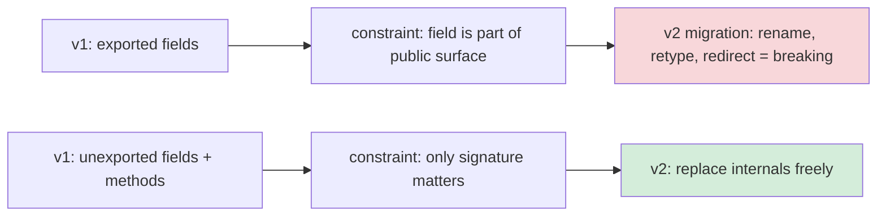
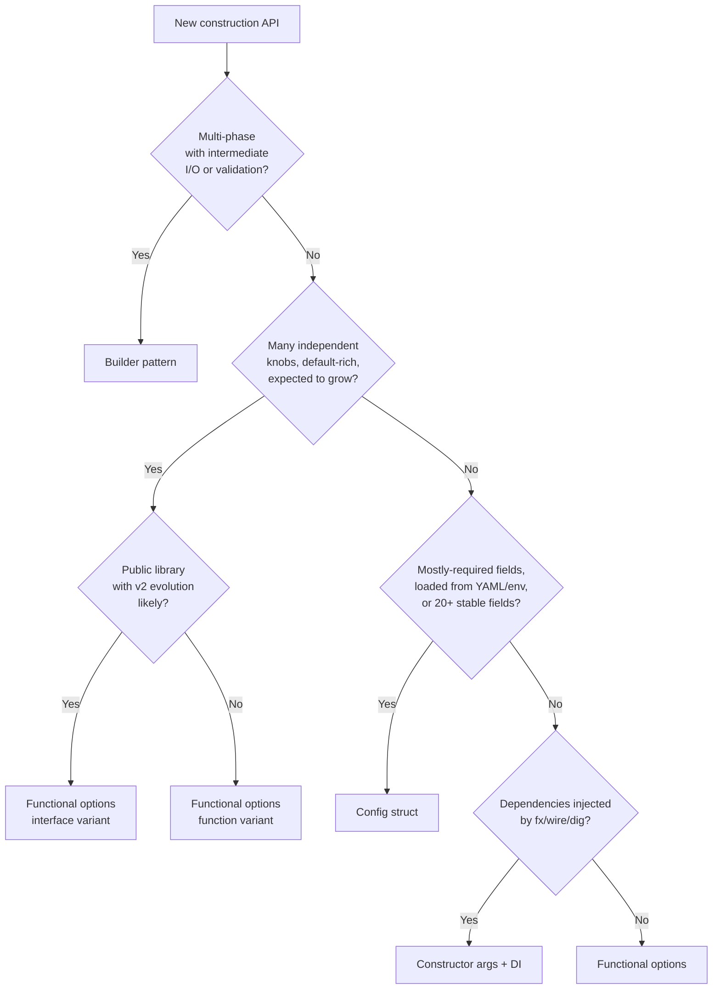
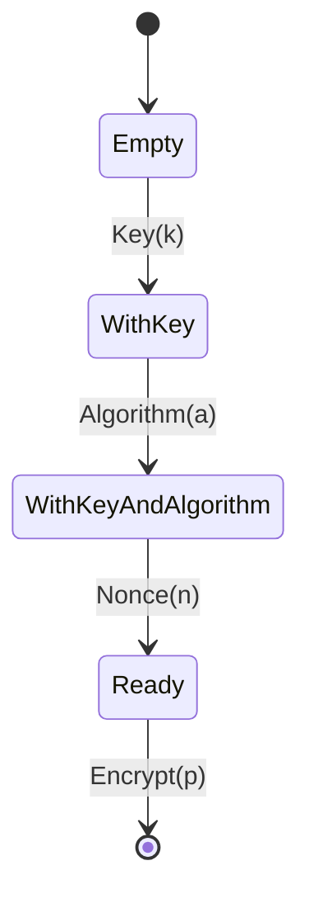
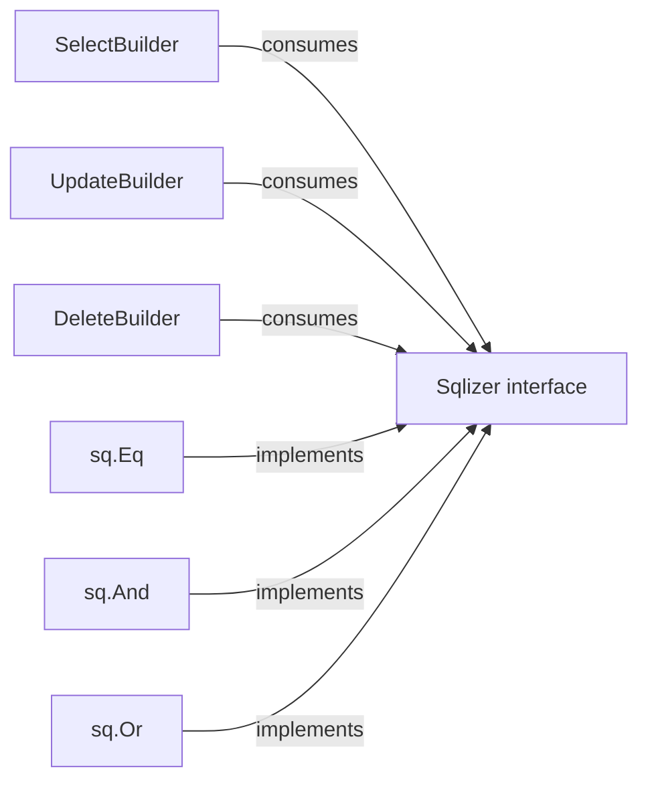
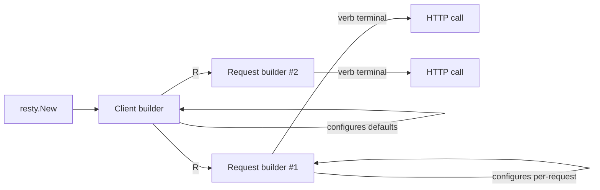

# Builder Pattern — Senior

## 1. The architectural question

Junior taught the shape. Middle taught the variants. Senior is about the *boundary decisions* — when a builder is the wrong abstraction at scale, when its fluent chain hides a fragile state machine, when type-state encoding pays for itself in lines of code, when allocation becomes the bottleneck of a request handler, when the same builder type leaks across three packages and freezes the contract for the next five years.

A library that exports `type Builder struct{}` with twelve chained methods has frozen a contract. Every method's name, signature, return type, and *order* of permissible calls is part of the public surface. Adding a step is non-breaking; reordering steps is a breaking change in disguise (existing chains compile but produce different SQL, different requests, different objects). Removing a step is a major-version event. Refactoring two chained methods into one ("we realised `WithUserAgent` should take a `*Header` instead of a `string`") sends a deprecation note out into ten thousand call sites.

The cost of getting this wrong is paid for the life of the package — usually by people who didn't make the decision.

This file is about those decisions. Sections 3-7 cover API-evolution trade-offs at the level a maintainer cares about. Sections 8-11 cover concurrency, performance, and testability at scale. Sections 12-16 walk through real Go library DSLs (`squirrel`, `goqu`, `resty`, `protobuf-go`, `kubernetes/client-go`, `chi`, `fx`, `ent`). Section 17 is postmortems — real bugs from real builders. The remaining sections collect the senior-level guidance (cross-language comparison, common mistakes, decision tree) you'll apply when reviewing PRs from middle-level engineers who have read junior.md and middle.md and now want to ship.

---

## 2. Table of Contents

1. [The architectural question](#1-the-architectural-question)
2. [Table of Contents](#2-table-of-contents)
3. [Designing a Builder API that survives v1 to v2](#3-designing-a-builder-api-that-survives-v1-to-v2)
4. [Builder vs functional options vs config struct vs DI — the decision tree](#4-builder-vs-functional-options-vs-config-struct-vs-di--the-decision-tree)
5. [Stage-typed (typestate) builders — when the Rust pattern pays off in Go](#5-stage-typed-typestate-builders--when-the-rust-pattern-pays-off-in-go)
6. [Builders as DSL hosts](#6-builders-as-dsl-hosts)
7. [Multi-package builder ecosystems](#7-multi-package-builder-ecosystems)
8. [Concurrency: building a builder whose target is concurrent-safe](#8-concurrency-building-a-builder-whose-target-is-concurrent-safe)
9. [Performance at scale](#9-performance-at-scale)
10. [Builder ↔ code generation](#10-builder--code-generation)
11. [Testability: builders as test-data factories](#11-testability-builders-as-test-data-factories)
12. [Real library DSLs: squirrel and goqu](#12-real-library-dsls-squirrel-and-goqu)
13. [Real library DSLs: resty](#13-real-library-dsls-resty)
14. [Real library DSLs: protobuf-go and kubernetes client-go](#14-real-library-dsls-protobuf-go-and-kubernetes-client-go)
15. [Real library DSLs: chi, gorilla mux, fx DI](#15-real-library-dsls-chi-gorilla-mux-fx-di)
16. [Anti-patterns at scale](#16-anti-patterns-at-scale)
17. [Postmortems](#17-postmortems)
18. [Comparison with other languages](#18-comparison-with-other-languages)
19. [Common senior-level mistakes](#19-common-senior-level-mistakes)
20. [Tricky questions](#20-tricky-questions)
21. [Cheat sheet](#21-cheat-sheet)
22. [Further reading](#22-further-reading)

---

## 3. Designing a Builder API that survives v1 to v2

Most builders start with one type, five methods, and a `Build()` terminal. Two years later the same builder has forty methods, two parallel chains, a `BuildContext()` and a `BuildLegacy()`, a deprecated `New()` and a `NewV2()`, and a documentation comment that says "do not add methods without consulting the v3 plan". The shape that scales is rarely the shape you start with.

The forces that drive API growth:

1. **New configuration knobs.** Every customer wants a new step. After two years you have forty steps.
2. **New terminal flavours.** `Build()` returns the object. Then someone wants `Plan()`, `Validate()`, `Explain()`, `ToSQL()`, `Marshal()`. Each requires a separate code path.
3. **Cross-cutting validation.** A new product constraint requires "if `WithRetries` is called, `WithTimeout` is required." This can't be enforced at the function-signature level.
4. **Default drift.** A reasonable default in 2021 (`WithReadTimeout(30*time.Second)` implicit) is wrong in 2024 (`WithReadTimeout` is now required). The contract you owe callers is: defaults change, your explicit choices don't.
5. **Subsystem decomposition.** What started as one builder becomes two — `RequestBuilder` and `ResponseBuilder` — that must compose.

The architectural question is: what does the *builder type itself* look like, and what's the contract between its methods, its terminal, and its target?

### 3.1 Three contracts, ranked by long-term cost

```go
// Contract A — exported struct fields (open-world)
type Builder struct {
    Addr        string
    Timeout     time.Duration
    Headers     map[string]string
}

// Contract B — unexported fields + exported methods (sealed but readable)
type Builder struct {
    addr     string
    timeout  time.Duration
    headers  map[string]string
}
func (b *Builder) Addr(a string) *Builder { ... }

// Contract C — unexported fields + exported methods + opaque target (fully sealed)
type Builder struct { /* unexported */ }
type Server struct { /* unexported, no setters */ }
func (b *Builder) Build() (Server, error) { ... }
```

| Contract | External code can mutate state? | Adding a field | Adding a method | Locking down behaviour later |
|----------|---------------------------------|----------------|-----------------|------------------------------|
| A | Yes — any field is mutable | Non-breaking but bypasses validation | Trivially additive | Impossible |
| B | No — only via methods | Non-breaking | Non-breaking | Possible but requires care |
| C | No — fields and methods sealed | Non-breaking | Non-breaking | Possible without callers noticing |

Contract C is what `squirrel`, `aws-sdk-go-v2`, `kubernetes/client-go`, and `ent` all use. The builder is a struct with no exported fields. The target is similarly opaque. The exported methods are the only contract surface. The day you need to change the storage format, rewire validation, or insert a new internal step, no caller notices.

Contract A is a classic Go anti-pattern when applied to builders. It looks ergonomic — "just set the field directly" — but it ties you to the field's name, type, and position in the struct. Any future internal refactor breaks every caller.



### 3.2 The terminal contract

The `Build()` method's signature is, alongside the entry-point constructor, the second most important architectural decision. Three common shapes:

```go
// Shape 1 — pointer return + error
func (b *Builder) Build() (*Server, error)

// Shape 2 — value return + error
func (b *Builder) Build() (Server, error)

// Shape 3 — multiple returns
func (b *Builder) Build() (string, []any, error)   // squirrel-style
```

Shape 1 is the default. It's right for any target that's expensive to copy, embeds locks, or is shared. Returning by pointer also means the same target can be returned across multiple calls if you want (though most builders don't).

Shape 2 is right for *value objects* — immutable, small (<200 bytes), pure data. The caller gets a copy; mutation of their copy doesn't affect the builder or anyone else's. The pattern enforces immutability through Go's value semantics.

Shape 3 is right for *transient* targets where the "object" is really a tuple. SQL builders are the canonical case: the query is a string and an args slice, neither useful without the other. Returning them as a `*Query` would be over-engineering.

The terminal also decides *what runs there*. Three styles:

```go
// Style A — pure assembly
func (b *Builder) Build() (*Server, error) {
    return &Server{addr: b.addr, timeout: b.timeout}, nil
}

// Style B — assembly + validation
func (b *Builder) Build() (*Server, error) {
    if b.addr == "" { return nil, errors.New("addr required") }
    if b.timeout <= 0 { return nil, errors.New("timeout must be positive") }
    return &Server{addr: b.addr, timeout: b.timeout}, nil
}

// Style C — assembly + validation + I/O
func (b *Builder) Build() (*Server, error) {
    if err := b.validate(); err != nil { return nil, err }
    s := &Server{...}
    if err := s.listen(); err != nil { return nil, err }   // actual listen()
    return s, nil
}
```

Style A is honest but rarely sufficient. Style B is the default. Style C is dangerous — it means `Build()` has side effects (it opens a socket, hits the network, allocates resources), and the caller doesn't always know. If `Build()` does I/O, it must take a `context.Context` argument: `Build(ctx context.Context) (*Server, error)`. Calling `Build()` without a context when it does I/O is a smell that bites in production when shutdown handling matters.

The senior-level rule: declare in package godoc what the terminal does. If `Build()` is pure, say so. If it does I/O, say so and require a context. Don't let the caller find out at debug time.

### 3.3 The migration recipe for v1 → v2

You have an exported `Builder` with twenty methods, all returning `*Builder`. You need v2 because: a critical method's signature must change, ordering rules have shifted, or the target type itself must split into two.

Step 1: Don't break v1. Keep it compiling.

Step 2: Add the v2 path as a parallel package or a new sub-namespace. The minimum-disruption pattern is:

```go
package server

// v1 builder (legacy)
type Builder struct { /* ... */ }
func NewBuilder() *Builder { return &Builder{} }
// ... existing methods unchanged

// v2 builder, alongside
type BuilderV2 struct { /* ... */ }
func NewBuilderV2() *BuilderV2 { return &BuilderV2{} }
// ... v2 methods

// Migration adapter
func (b *Builder) ToV2() *BuilderV2 {
    return &BuilderV2{ /* translated fields */ }
}
```

Step 3: Mark v1 methods with `// Deprecated:` godoc comments pointing at v2 equivalents. `go vet` and IDE tooling pick this up.

Step 4: After 12-18 months and observed adoption, drop v1 in a major release.

`kubernetes/client-go` did this twice with its options builders. `aws-sdk-go` lived as v1 for years while v2 was being built; the two coexisted in `aws-sdk-go-v2`, an entirely separate import path. This is the pattern: if a v2 is necessary, give it a different import path and let v1 live in maintenance mode. Don't try to evolve a single package across breaking changes; you'll thrash the docs and confuse every reader.

---

## 4. Builder vs functional options vs config struct vs DI — the decision tree

The hardest senior-level call is *which pattern to pick at all*. Junior and middle gave you the rules of thumb; senior gives you the decision tree.



The tree compresses years of code review. Walk through it on every new constructor:

1. **Does construction have *phases*?** Each phase taking input from the previous, possibly doing I/O or validation between? → **Builder.** Otherwise not a builder.
2. **Are there many *independent* knobs with sensible defaults?** No phase coupling, no ordering matters? → **Functional options.**
3. **Is the configuration mostly *required* and stable across versions?** Loaded from a file? → **Config struct.**
4. **Are dependencies (logger, db, tracer) injected from a container?** → **Positional constructor args + DI.**

### 4.1 The mixed-mode pattern

Real systems use all four. A `*Server` constructor in a mature service:

```go
// Dependencies: injected.
// Configuration: struct (stable shape, often from YAML).
// Tuning knobs: options.
// Multi-phase setup (cert loading, listener binding): builder.

func NewServer(
    logger *log.Logger,       // DI: positional
    metrics metrics.Sink,     // DI: positional
    cfg ServerConfig,         // Config struct
    opts ...ServerOption,     // Tuning knobs
) (*Server, error)

// For multi-phase TLS setup:
func NewTLSContext(certFile, keyFile string) *TLSBuilder { ... }
```

The senior call: don't force everything into one pattern. The same struct can have:
- positional args for things the container provides
- a config struct for the operator-tunable shape
- options for the developer-tunable knobs
- a separate builder for the multi-phase parts

`gRPC` does this. `kubernetes/client-go` does this. Picking one pattern dogmatically is the junior move.

### 4.2 When a builder is the *wrong* call

I've reviewed dozens of PRs adding builders. The four common bad reasons:

1. **"Java does it this way."** Java has no functional options, no struct literals with field tags, no varargs of typed functions. Their builder is a workaround for these gaps. Go doesn't need it as compensation.
2. **"It reads nicer."** Aesthetic preference is not an architectural reason. Functional options read fine; config structs read fine.
3. **"We might add more fields later."** Functional options handle growth better — adding a `WithX` function is strictly additive, while adding a builder method requires deciding where it fits in the documented order.
4. **"It's the GoF pattern."** GoF is a 1994 book about C++. Half its patterns don't translate to Go. The builder pattern translates partially — and most cases where it does translate are *also* cases functional options would solve.

The senior question to ask is: *what does a builder give me that the alternatives don't?* If the answer is "phase enforcement, intermediate I/O, or DSL-like construction", you have a builder use case. If the answer is "it feels right", you don't.

---

## 5. Stage-typed (typestate) builders — when the Rust pattern pays off in Go

The stage-typed builder encodes phase-correctness in the type system: `NewBuilder()` returns a builder that has only the methods valid in phase 1; calling a phase-1 method returns a builder that has only the methods valid in phase 2; and so on. The compiler enforces ordering. Misordering is a compile error, not a runtime error.

This is the **typestate** pattern, named in Rust where it's idiomatic. In Go it's heavyweight but possible.

### 5.1 The shape

```go
package crypto

// Each state is its own type. Each state's methods return the next state's type.

type Empty struct{}

type WithKey struct{ key []byte }

type WithKeyAndAlgorithm struct {
    key  []byte
    algo Algorithm
}

type Ready struct {
    key  []byte
    algo Algorithm
    nonce []byte
}

func New() Empty { return Empty{} }

func (e Empty) Key(k []byte) WithKey {
    return WithKey{key: append([]byte(nil), k...)}
}

func (w WithKey) Algorithm(a Algorithm) WithKeyAndAlgorithm {
    return WithKeyAndAlgorithm{key: w.key, algo: a}
}

func (w WithKeyAndAlgorithm) Nonce(n []byte) Ready {
    return Ready{key: w.key, algo: w.algo, nonce: append([]byte(nil), n...)}
}

func (r Ready) Encrypt(plaintext []byte) ([]byte, error) {
    return r.algo.Encrypt(r.key, r.nonce, plaintext)
}
```

Call sites are forced to follow the order:

```go
ciphertext, err := crypto.New().
    Key(k).
    Algorithm(crypto.AES256GCM).
    Nonce(nonce).
    Encrypt(payload)

// This won't compile:
// crypto.New().Algorithm(crypto.AES256GCM)
// Empty has no Algorithm method.
```



### 5.2 The cost

Three explicit costs:

1. **N types per builder.** A four-stage chain is four types. Naming them gets clumsy: `Empty`, `WithKey`, `WithKeyAndAlgorithm`, `Ready`. Hungarian-naming makes godoc tedious.
2. **Branching gets ugly.** What if some phases are optional? You need a state for "after-A-but-before-B" and "after-B-but-before-A" — combinatorial explosion. The Rust pattern handles this with generics and marker traits; Go's type system can express it but verbosely.
3. **Errors must be deferred.** Each state's method takes ownership of the previous state's value. If a state-transition method fails, what does it return? Returning the same state means the chain can be retried — but the chain is value-receiver, so the original state is gone. Most typestate builders in Go return `(NextState, error)`, but that breaks the chain syntax.

```go
func (w WithKey) Algorithm(a Algorithm) (WithKeyAndAlgorithm, error) {
    if !a.IsValid() {
        return WithKeyAndAlgorithm{}, errors.New("invalid algorithm")
    }
    return WithKeyAndAlgorithm{key: w.key, algo: a}, nil
}

// Call site is now staircased:
state1, err := crypto.New().Key(k).Algorithm(crypto.AES256GCM)
if err != nil { return err }
state2, err := state1.Nonce(nonce)
if err != nil { return err }
return state2.Encrypt(payload)
```

The Rust answer is `Result<NextState, Error>` with `?` for propagation. Go has no `?`. You either accept the staircase or use deferred-error capture — but deferred-error capture defeats the entire reason to use typestate (the compile-time guarantee).

### 5.3 When typestate pays off in Go

A short list:

| Domain | Why typestate wins |
|--------|--------------------|
| Cryptographic primitives (key derivation, signing) | Misordering steps is catastrophic — a wrong-order chain can leak key material |
| Database transaction lifecycle (Begin → exec → Commit/Rollback) | Forgetting Commit is a real production bug; Compile-time enforcement helps |
| Protocol state machines (TLS handshake, gRPC stream) | Sending the wrong message in the wrong phase is a protocol violation |
| Memory-safe IO buffers (zero-copy, ownership transfer) | Reading after release is a use-after-free |

If your domain isn't one of these, typestate is over-engineering. The pointer-receiver mutating builder with deferred-error capture (junior §5.1) covers 95% of real Go builders.

### 5.4 Real-world typestate in Go

`github.com/rsc/quote/v3` doesn't use it. Nobody famous in Go uses it for everyday builders. The closest mainstream example is `github.com/oklog/ulid/v2`:

```go
// ulid.Make() returns a ULID — but constructing one by hand uses a tiny typestate:
e := ulid.Monotonic(rand.Reader, 0)
id, err := ulid.New(ulid.Timestamp(time.Now()), e)
```

There's a *small* typestate — you can't pass a `time.Time` where the constructor expects a `uint64` timestamp. But the example shows the Go style: a *minimal* type discipline (one constructor per shape) instead of a full chained typestate. Most idiomatic Go projects pick this middle ground.

For the rare case where you genuinely need typestate, write it. For everything else, the runtime-checked builder is enough and 10x clearer.

---

## 6. Builders as DSL hosts

A builder is not just a way to construct an object — at scale, it becomes a *domain-specific language*. The shape of the chain teaches the reader the domain model. This is the architectural payoff of the builder pattern when the alternatives can't match it.

### 6.1 SQL query builders as DSLs

A SQL query is a sentence in a sub-language. A builder for SQL is a way to write that sentence in Go syntax instead of string concatenation.

```go
// squirrel — github.com/Masterminds/squirrel
q := sq.Select("id", "name").
    From("users").
    Where(sq.And{
        sq.Eq{"active": true},
        sq.Or{
            sq.Eq{"role": "admin"},
            sq.GtOrEq{"score": 100},
        },
    }).
    OrderBy("created_at DESC").
    Limit(50)

sql, args, err := q.ToSql()
```

The Go code reads as nearly the SQL it produces. The DSL works because:

1. **Method names mirror SQL keywords.** `Select`, `From`, `Where`, `OrderBy` — same names, same casing, same order.
2. **The `Where` argument is a sub-DSL.** `sq.And{}`, `sq.Eq{}`, `sq.GtOrEq{}` are nested struct literals representing predicate algebra.
3. **The chain is a sentence, not a config tree.** SQL is sequential; the chain is sequential.

This is the builder pattern at its most justified. Functional options would butcher it (`WithSelect`, `WithFrom`, `WithWhere`... the `With` prefix breaks the SQL-keyword mirror). A config struct would be flat where SQL is nested.

### 6.2 HTTP request builders as DSLs

`resty` (`github.com/go-resty/resty/v2`) provides a builder API that mirrors the HTTP request structure:

```go
resp, err := client.R().
    SetHeader("Content-Type", "application/json").
    SetBody(map[string]any{"user": "alice"}).
    SetQueryParam("verbose", "1").
    SetAuthToken(token).
    Post("https://api.example.com/users")
```

The terminal is *the HTTP verb itself* — `Post`, `Get`, `Put`, `Delete`. Not `Build()` and then `.Do()`. The verb-as-terminal pattern fits HTTP because the verb is the act, not just one more knob.

Compare with `net/http`:

```go
req, err := http.NewRequest("POST", "https://api.example.com/users", body)
if err != nil { return err }
req.Header.Set("Content-Type", "application/json")
req.Header.Set("Authorization", "Bearer "+token)
q := req.URL.Query()
q.Set("verbose", "1")
req.URL.RawQuery = q.Encode()
resp, err := client.Do(req)
```

Five lines of imperative mutation vs five lines of fluent chain. `resty`'s shape isn't just prettier; it's *teaching the reader* the HTTP request structure. The builder *is* the documentation.

### 6.3 Router builders as DSLs

`chi` and `gorilla/mux` use builders for URL routing:

```go
// chi
r := chi.NewRouter()
r.Use(middleware.Logger)
r.Route("/api/v1", func(r chi.Router) {
    r.Get("/users", listUsers)
    r.Route("/users/{id}", func(r chi.Router) {
        r.Get("/", getUser)
        r.Put("/", updateUser)
        r.Delete("/", deleteUser)
    })
})
```

Each `Route` call gives you a *sub-router builder*. The chain is nested, mirroring the URL tree structure. This is where the builder pattern earns its place against options — the nesting can't be expressed in flat options.

```mermaid
flowchart TD
    Root[chi.Router /]
    Root --> API[/api/v1/]
    API --> Users[/api/v1/users]
    API --> User["/api/v1/users/{id}"]
    User --> Get[GET]
    User --> Put[PUT]
    User --> Del[DELETE]
```

### 6.4 DI builders as DSLs

`fx` (`go.uber.org/fx`) uses a builder-like API for dependency-injection module composition:

```go
app := fx.New(
    fx.Provide(NewLogger),
    fx.Provide(NewDB),
    fx.Provide(NewServer),
    fx.Invoke(StartServer),
    fx.Module("metrics",
        fx.Provide(NewMetricsRegistry),
        fx.Invoke(RegisterMetrics),
    ),
)
```

Each `fx.Provide`, `fx.Invoke`, `fx.Module` is an option, applied to a builder under the hood. The DSL teaches the reader: providers compose by type, invocations consume the graph, modules group together.

The architectural lesson across all four examples: **a builder reads as a DSL when its method names match the domain's vocabulary**. If the method names are generic (`WithFoo`, `WithBar`), you don't have a DSL — you have functional options wearing a builder costume. The litmus test is reading the chain to a domain expert; if they understand it without seeing the type definitions, you've built a DSL. If they don't, you've built infrastructure.

---

## 7. Multi-package builder ecosystems

The single-package builder is straightforward. The cross-package builder is where senior-level discipline matters. Three real-world cases.

### 7.1 The squirrel ecosystem

`Masterminds/squirrel` exports four builder types:

```go
type SelectBuilder struct { /* ... */ }
type InsertBuilder struct { /* ... */ }
type UpdateBuilder struct { /* ... */ }
type DeleteBuilder struct { /* ... */ }
```

Each is its own type. The reason: SQL `SELECT`, `INSERT`, `UPDATE`, `DELETE` have *different* methods. `SelectBuilder.Where` exists; `InsertBuilder.Where` does not (you don't `WHERE` an `INSERT`). Trying to unify them into one builder with a flag would let invalid combinations compile.

The sub-package `squirrel/expr` provides expression builders (the `And`, `Or`, `Eq` types above) that are *consumed* by all four query builders. The expression types are decoupled from any particular query builder — a `sq.Eq` works in `Select.Where`, `Update.Where`, and `Delete.Where` identically.

The architectural pattern:



Each query builder is closed (no external implementations). The expression types are *open* via the `Sqlizer` interface — any package can add a new expression type that implements `ToSql() (string, []any, error)` and it composes with all existing query builders.

This is the right partition: **builders are sealed; the values they consume are an open interface**. Want to add a new clause type? Implement `Sqlizer`. Want to add a new query type (e.g., `MERGE`)? You need a new builder type in squirrel itself.

### 7.2 The protobuf-go ecosystem

`google.golang.org/protobuf` generates message builders via `protoc-gen-go`:

```go
// Auto-generated
type User struct {
    state         protoimpl.MessageState
    sizeCache     protoimpl.SizeCache
    unknownFields protoimpl.UnknownFields
    Id    int64  `protobuf:"..."`
    Name  string `protobuf:"..."`
    Email string `protobuf:"..."`
}

func (m *User) Reset()         { *m = User{} }
func (m *User) String() string { return protoimpl.X.MessageStringOf(m) }
func (m *User) ProtoMessage()  {}
// ... GetId, GetName, GetEmail
```

There is no builder. Construction is by struct literal:

```go
u := &pb.User{
    Id:    42,
    Name:  "alice",
    Email: "alice@example.com",
}
```

This is the *right call* for protobuf because:

1. **Fields are stable.** Once defined in `.proto`, they don't churn.
2. **No phases.** Setting `Name` then `Email` is the same as `Email` then `Name`.
3. **No validation needed at the language level.** Protobuf validation happens at serialize/deserialize boundaries.
4. **The struct must round-trip cleanly.** A builder would add complexity to the codegen story.

The architectural lesson: **don't generate builders if struct literals suffice**. The protobuf team made this call deliberately. They could have generated a `UserBuilder` per message; they chose not to.

When protobuf does need a builder, it's for things like the encoding options:

```go
opts := protojson.MarshalOptions{
    UseProtoNames: true,
    EmitUnpopulated: true,
    Indent: "  ",
}
b, err := opts.Marshal(msg)
```

That's a config struct, not a builder. Same reason: stable shape, no phases, no validation between fields.

### 7.3 The kubernetes client-go list options

`k8s.io/client-go` exposes a peculiar builder-like pattern for list options:

```go
podList, err := clientset.CoreV1().Pods("default").List(
    ctx,
    metav1.ListOptions{
        LabelSelector: "app=web",
        FieldSelector: "status.phase=Running",
        Limit:         100,
        Continue:      token,
        ResourceVersion: "0",
    },
)
```

It's a config struct, not a builder. But `LabelSelector` and `FieldSelector` are *themselves* DSLs — string-encoded predicate languages. A more "Go-style" approach would have been:

```go
selector := labels.NewSelector().
    Add("app", labels.Equals, "web").
    Add("env", labels.NotEquals, "test")
podList, _ := clientset.CoreV1().Pods("default").List(ctx, metav1.ListOptions{
    LabelSelector: selector.String(),
})
```

And in fact `k8s.io/apimachinery/pkg/labels` provides exactly this — a `Selector` builder. The pattern: the outer construction is a config struct; the inner DSL is a builder; the builder produces a string that fits into the struct's field.

This is the hybrid Go pays for: structs for stable shapes, builders for sub-languages embedded in those structs. Trying to make everything one or the other forces compromises.

---

## 8. Concurrency: building a builder whose target is concurrent-safe

The builder pattern is single-threaded by design. The *target* it produces, however, often needs to be concurrent-safe. The senior-level question is: how do you design a builder so the target is safe-to-share by construction?

### 8.1 The seal-then-share invariant

The pattern:

1. The builder is held by one goroutine.
2. `Build()` produces the target by *copying* the builder's accumulated state into a fresh target struct.
3. The target is then shared across goroutines.
4. The builder is discarded; no further mutation is possible.

```go
type Server struct {
    addr    string
    timeout time.Duration
    routes  map[string]http.Handler   // safe to share if no further writes
}

type ServerBuilder struct {
    addr    string
    timeout time.Duration
    routes  map[string]http.Handler
}

func (b *ServerBuilder) Route(pattern string, h http.Handler) *ServerBuilder {
    if b.routes == nil { b.routes = make(map[string]http.Handler) }
    b.routes[pattern] = h
    return b
}

func (b *ServerBuilder) Build() (*Server, error) {
    // Copy map: caller's builder must not mutate target's routes.
    routes := make(map[string]http.Handler, len(b.routes))
    for k, v := range b.routes {
        routes[k] = v
    }
    return &Server{
        addr:    b.addr,
        timeout: b.timeout,
        routes:  routes,
    }, nil
}
```

The defensive copy in `Build()` is the seal. After `Build()`, the builder cannot reach the target's routes. The target's routes are now owned by the target alone. If the target is shared across goroutines, all goroutines see the same immutable routes; no race.

### 8.2 What breaks the invariant

Three common bugs:

```go
// BUG 1: shallow share
func (b *ServerBuilder) Build() (*Server, error) {
    return &Server{routes: b.routes}, nil  // shares the map
}

// Later, in user code:
srv1, _ := b.Build()
srv2, _ := b.Build()
b.Route("/new", handler)   // mutates both srv1.routes and srv2.routes
```

```go
// BUG 2: target exposes setters
type Server struct {
    Routes map[string]http.Handler  // exported, mutable
}
// Caller can mutate Routes after Build(). Race city if Routes is shared.
```

```go
// BUG 3: target shares a pointer to internal state
type Server struct {
    config *Config  // shared pointer
}
type Config struct { Timeout time.Duration }
// Caller mutates *config; target sees the change.
```

The senior rule: **fields in the target that are slices, maps, channels, or pointers must be defensively copied or made immutable**. Fields that are values (int, bool, string, time.Duration) are safe — Go's value semantics protect them.

### 8.3 atomic.Pointer for live-swappable targets

Sometimes you do want to swap a configured target atomically — e.g., on config reload:

```go
type Server struct {
    cfg atomic.Pointer[serverConfig]
}

type serverConfig struct {
    timeout time.Duration
    routes  map[string]http.Handler
}

func (s *Server) Reconfigure(b *ServerBuilder) error {
    newCfg, err := b.buildConfig()
    if err != nil { return err }
    s.cfg.Store(newCfg)  // atomic swap
    return nil
}

func (s *Server) Handle(r *http.Request) http.Handler {
    cfg := s.cfg.Load()
    return cfg.routes[r.URL.Path]
}
```

The builder produces a fresh `*serverConfig`. The atomic store swaps the live pointer. Concurrent readers see either the old config or the new one — never a mix.

This is the live-reconfiguration pattern done right. The builder still runs single-threaded; only the *target's pointer* is atomic. Don't try to make the builder itself concurrent.

### 8.4 The builder-pool anti-pattern

```go
// ANTI-PATTERN
var builderPool = sync.Pool{
    New: func() any { return &Builder{} },
}

func construct() *Server {
    b := builderPool.Get().(*Builder)
    defer func() { *b = Builder{}; builderPool.Put(b) }()
    return b.Addr(":8080").Timeout(5*time.Second).Build()
}
```

Pooling builders looks like a performance win. It's almost always wrong:

1. **Builders are cheap** — one allocation. Pooling saves nanoseconds, costs complexity.
2. **Resetting is bug-prone** — `*b = Builder{}` only works if no field is a pointer to shared state.
3. **Concurrency is fragile** — `Get()` and `Put()` are atomic, but the builder itself isn't. Forget the `defer Put()` and you leak.

If the builder is on your hot path, the architectural problem is bigger than allocation. Section 9 covers when this matters and what the real fix is.

---

## 9. Performance at scale

Middle.md showed the benchmarks: pointer-receiver builder ~54 ns/op with 1 allocation, value-receiver builder ~213 ns/op with 5 allocations. Senior-level performance analysis goes deeper.

### 9.1 The hidden costs

A builder chain has three allocation sources:

1. **The builder itself** — one allocation when `NewXBuilder()` is called.
2. **Slice/map growth** — each `Where`, `Header`, `Field` call may grow internal slices.
3. **The target** — one allocation in `Build()`.

For a chain that calls `Where()` ten times with a builder pre-sized for two:

```go
type Builder struct {
    wheres []string  // initial cap=2
}

func (b *Builder) Where(cond string) *Builder {
    b.wheres = append(b.wheres, cond)  // grows: 2 → 4 → 8 → 16
    return b
}
```

Ten `Where` calls cause three slice grow-allocations (2→4, 4→8, 8→16). Total: 1 (builder) + 3 (slice grows) + 1 (target) = 5 allocations for a chain that looked like it had only one builder allocation.

The fix: pre-size in `NewXBuilder` based on observed call counts:

```go
func NewBuilder() *Builder {
    return &Builder{
        wheres: make([]string, 0, 16),
    }
}
```

For libraries used in hot paths (squirrel, goqu, resty), this matters. Profile with `-benchmem` and check the `B/op` column.

### 9.2 String allocation in the terminal

A SQL builder's `Build()` produces a string. Naive implementations allocate one string per builder method:

```go
// BAD
func (b *Builder) Build() (string, error) {
    sql := "SELECT " + strings.Join(b.columns, ", ")
    sql += " FROM " + b.table
    for _, w := range b.wheres {
        sql += " WHERE " + w
    }
    return sql, nil
}
```

Each `+=` creates a new string. A 10-clause query allocates 10 intermediate strings. Use `strings.Builder`:

```go
// GOOD
func (b *Builder) Build() (string, error) {
    var sb strings.Builder
    sb.Grow(256)  // pre-allocate; tune from profile
    sb.WriteString("SELECT ")
    sb.WriteString(strings.Join(b.columns, ", "))
    sb.WriteString(" FROM ")
    sb.WriteString(b.table)
    for i, w := range b.wheres {
        if i == 0 { sb.WriteString(" WHERE ") } else { sb.WriteString(" AND ") }
        sb.WriteString(w)
    }
    return sb.String(), nil
}
```

`strings.Builder` reuses a single backing buffer, growing geometrically. The final `String()` returns the buffer's contents without copying (it does an unsafe trick — see the runtime source). One allocation for the buffer, one for the final string.

### 9.3 sync.Pool for the target's intermediate state

When the builder's `Build()` produces a large intermediate (e.g., a buffer for serialised data), pool the intermediate:

```go
var bufPool = sync.Pool{
    New: func() any { return new(bytes.Buffer) },
}

func (b *Builder) Build() ([]byte, error) {
    buf := bufPool.Get().(*bytes.Buffer)
    defer func() { buf.Reset(); bufPool.Put(buf) }()
    // ... write to buf ...
    out := make([]byte, buf.Len())
    copy(out, buf.Bytes())
    return out, nil
}
```

Note the `copy` — we don't return `buf.Bytes()` directly because we're putting `buf` back in the pool. Returning it would let the caller hold a pointer into a pool-owned buffer.

`protobuf-go` does this internally for marshal buffers. `database/sql` does it for prepared-statement arg slices. It's worth the complexity only when profiles say so.

### 9.4 Allocation-free chains via direct struct construction

The fastest path is no builder at all — construct the target with a struct literal:

```go
// Direct: ~2 ns/op, 0 allocs (if target stays on the stack)
s := Server{addr: ":8080", timeout: 5*time.Second}
```

The senior question: *when is the builder's readability worth the allocation cost*?

| Use case | Builder cost matters? |
|----------|----------------------|
| Server at process startup | No |
| SQL query per HTTP request | Marginal — measure first |
| Test fixture per test case | No |
| Protocol message in network handler | Yes — direct construction |
| Per-frame game object | Yes — direct construction |
| Configuration once per app lifetime | No |

For the marginal cases (SQL per request), the optimization order is:
1. Pre-size internal slices in `NewBuilder()`.
2. Use `strings.Builder` in `Build()`.
3. Cache the parsed query if the query shape is reused.
4. Only then consider `sync.Pool` for the builder or its intermediates.

Skipping to step 4 is the junior move. Step 3 — caching — usually beats steps 1, 2, and 4 combined when the query shape is stable.

### 9.5 The escape analysis lens

Run `go build -gcflags='-m'` on builder code and look at what escapes:

```
./builder.go:42:9: &Builder{} escapes to heap
./builder.go:55:9: &Server{...} escapes to heap
```

The builder and the target both escape — they're returned from their constructor functions. There's no escape analysis to win for them. What you *can* win is escape analysis for the chain's intermediate values:

```go
func (b *Builder) Where(cond string, args ...any) *Builder {
    b.args = append(b.args, args...)  // args escapes if append grows
    return b
}
```

If `args` is small and the slice has capacity, no escape. If it grows, the new backing array escapes. Pre-sizing eliminates this in the common case.

For a deeper dive, the optimize.md file covers builder-specific profiling techniques.

---

## 10. Builder ↔ code generation

Builders are tedious to write. A struct with 30 fields requires 30 method definitions, each near-identical. Code generation is the obvious response. The senior-level question is: when does generation help, and when does it hurt?

### 10.1 protoc-gen-go: chose not to generate builders

The Protobuf Go compiler generates getter methods (`GetUserName() string`) for every field, but *not* setter or builder methods. To set a field, you assign directly:

```go
u := &pb.User{}
u.Name = "alice"
u.Email = "alice@example.com"
```

Why? Three reasons:

1. **The struct already supports literal initialization.** A builder would be redundant syntax.
2. **Generated code is read more than written.** Less code is better.
3. **Round-tripping via reflection (Marshal/Unmarshal) needs predictable field access.** Builders complicate the reflection path.

The protobuf team explicitly considered builder generation in 2019 and rejected it. The decision is documented in the `google/protobuf` design notes.

### 10.2 ent: chose to generate builders

`entgo.io/ent` is an ORM that generates per-entity builders:

```go
// Generated by ent
user, err := client.User.
    Create().
    SetName("alice").
    SetEmail("alice@example.com").
    SetAge(30).
    Save(ctx)
```

Why does ent generate them?

1. **Validation per field.** `SetAge(-1)` fails at the field level via generated validators.
2. **Type-safe queries.** `client.User.Query().Where(user.NameEQ("alice"))` — the predicate `user.NameEQ` is also generated, type-checked against the `Name` field.
3. **The target is a database row, not a Go struct.** The "Create" terminal does I/O (insert into the DB). The chain encodes both the row's fields and the database operation.

Ent's generation is justified because the builder is doing real work — validation, predicate construction, I/O dispatch — that you can't replicate with struct literals.

The pattern: **generate builders when the chain does work beyond field assignment**. Don't generate them as a syntactic preference.

### 10.3 sqlc, go-jet, bob — query builders by codegen

A growing class of Go libraries generate type-safe SQL query builders from the database schema:

- `sqlc` — generates plain functions per query (not builders).
- `go-jet/jet` — generates a typed SQL DSL with builder-like assembly.
- `stephenafamo/bob` — generates a builder per table.

Each chooses a different shape. `sqlc` is the simplest — one function per `.sql` file query. `jet` is the richest DSL. `bob` is the middle ground. The architectural choice mirrors §10.1 vs §10.2: does the generated code do work beyond field assignment, or is it just a typed wrapper?

If it's just a typed wrapper, `sqlc` is enough. If you need a query *language* (composable predicates, sub-queries, complex JOINs), `jet` or `bob` justify the generation complexity.

### 10.4 The senior trade-off

Generated builders have two non-obvious costs:

1. **The generator is a dependency.** Anyone building the project needs the generator installed. Generator versions drift. Cross-platform builds get harder.
2. **The generated code shape can't change without regenerating everywhere.** A new feature in the generator (e.g., support for a new field type) requires every downstream project to regenerate. This is fine for monorepos; painful for polyrepo ecosystems.

When deciding to generate:

| Question | Generate builders? |
|----------|--------------------|
| Does the builder do work beyond field assignment? | Yes → generate |
| Is the field set stable (no churn)? | Yes → either works; lean to no-generation |
| Is the team willing to maintain the generator? | No → don't generate |
| Are users programmers, or operators (kubectl-style users)? | Operators → don't generate; expose declarative API instead |

The reflexive "generate everything" is the junior move. The reflexive "never generate" is also wrong. Senior is matching the tool to the problem.

---

## 11. Testability: builders as test-data factories

Builders shine in test code. Production code can usually use struct literals; tests need *variation* — many similar objects with one or two fields differing. Builders make this clean.

### 11.1 The fixture builder pattern

```go
// test/users.go
package test

func NewUser() *UserBuilder {
    return &UserBuilder{
        id:        uuid.NewString(),
        name:      "Test User",
        email:     "test@example.com",
        role:      "user",
        active:    true,
        createdAt: time.Now(),
    }
}

func (b *UserBuilder) WithRole(r string) *UserBuilder {
    b.role = r
    return b
}

func (b *UserBuilder) Inactive() *UserBuilder {
    b.active = false
    return b
}

func (b *UserBuilder) Build() *User {
    return &User{
        ID:        b.id,
        Name:      b.name,
        Email:     b.email,
        Role:      b.role,
        Active:    b.active,
        CreatedAt: b.createdAt,
    }
}
```

Test code:

```go
func TestAdminAccess(t *testing.T) {
    admin := test.NewUser().WithRole("admin").Build()
    user := test.NewUser().WithRole("user").Build()
    inactive := test.NewUser().Inactive().Build()
    // ...
}
```

The pattern: *every field has a sensible default*. Only the fields the test cares about are explicit. This is the inverse of production builders, where required fields force explicit setting. Test builders are forgiving by design.

### 11.2 The persistence variant

Test builders often double as persistence helpers:

```go
func (b *UserBuilder) Create(t *testing.T, db *sql.DB) *User {
    t.Helper()
    u := b.Build()
    _, err := db.ExecContext(t.Context(),
        "INSERT INTO users (id, name, email, role, active) VALUES (?, ?, ?, ?, ?)",
        u.ID, u.Name, u.Email, u.Role, u.Active)
    if err != nil { t.Fatal(err) }
    return u
}
```

`Create(t, db)` is a different terminal than `Build()`. Same builder, two terminals (junior §5.4). The `Create` variant inserts the user into the test database and returns the persisted record.

`factory_bot` (Ruby) and `factory_boy` (Python) popularised this pattern; Go test libraries like `bxcodec/faker` and home-grown builders replicate it.

### 11.3 The clone-and-modify pattern

For sets of related test cases:

```go
base := test.NewUser().WithRole("admin")
cases := []struct {
    name string
    u    *User
}{
    {"active admin",   base.Build()},
    {"inactive admin", base.Inactive().Build()},
}
```

This works if the builder uses value receivers (middle §4.3). With pointer receivers, `base.Inactive()` mutates `base`, so the first case's user becomes inactive too. The senior call: for test builders specifically, value receivers are often correct *despite* the allocation cost, because the variation pattern is the point.

Alternatively, define `Clone()` explicitly:

```go
b1 := test.NewUser().WithRole("admin")
active := b1.Clone().Build()
inactive := b1.Clone().Inactive().Build()
```

### 11.4 Fluent assertions

A related pattern: builders for *assertions*. `testify/assert` is the dominant Go assertion library, but for complex assertions, fluent builders win:

```go
// Hypothetical fluent assertion
assert.That(t, user).
    HasField("Name", "alice").
    HasField("Role", "admin").
    HasField("Active", true).
    HasNoFieldsMissing()
```

The Go ecosystem hasn't standardised this; `stretchr/testify` is non-fluent. `gomega` (Ginkgo's matcher library) is fluent. The pattern works; the call site is whether your tests' assertion logic is complex enough to justify the abstraction. For most Go projects: no. For BDD-style projects: yes.

### 11.5 The "fixture drift" hazard

The fixture builder's biggest risk: tests depend on the fixture's defaults. When you add a field to `User` and default it in the builder, every existing test inherits the new default — possibly silently breaking assumptions.

```go
// Before
func NewUser() *UserBuilder { return &UserBuilder{name: "Test"} }

// After (added a field)
func NewUser() *UserBuilder { return &UserBuilder{name: "Test", verified: true} }
// Existing tests now have verified=true users. Did they want that?
```

The senior call: when adding a field with a non-zero default to a test fixture, audit every test that uses the fixture. Or — better — make the default the zero value (`verified: false`) and force the small number of tests that need `verified=true` to call `WithVerified()` explicitly.

This is the same lesson as the production-builder "default drift" problem (§3), but the consequences are different: drift in tests means silently passing tests, which is worse than failing tests.

---

## 12. Real library DSLs: squirrel and goqu

Two SQL builders, two different architectural styles. Worth knowing both.

### 12.1 squirrel — composable struct expressions

`Masterminds/squirrel` uses the immutable-builder shape (value receivers):

```go
q := sq.Select("id", "name").
    From("users").
    Where(sq.Eq{"active": true}).
    OrderBy("created_at DESC")

q1 := q.Limit(10)   // q is unchanged
q2 := q.Limit(100)  // q is unchanged
```

Forking is trivial: assignment is fork. The cost is per-call allocation; squirrel's authors accepted this because SQL queries are rarely built in hot paths.

Predicates are *struct-based*, not method-based:

```go
sq.And{
    sq.Eq{"role": "admin"},
    sq.Or{
        sq.Gt{"score": 100},
        sq.Eq{"vip": true},
    },
}
```

`sq.Eq`, `sq.And`, `sq.Or` are *types* (specifically, `map[string]interface{}` and `[]Sqlizer`). They satisfy the `Sqlizer` interface (`ToSql() (string, []interface{}, error)`). This is the Open/Closed principle applied: predicates are an extension point — external packages can add new predicate types (e.g., a `JsonbContains` predicate for PostgreSQL JSONB) by implementing `Sqlizer`.

The architectural pattern: **builder methods consume an interface, not a concrete type**. The interface is the extension seam. The builder itself is closed.

### 12.2 goqu — method-based DSL

`doug-martin/goqu` uses a richer DSL with method-based predicate construction:

```go
q := goqu.From("users").
    Where(
        goqu.C("active").IsTrue(),
        goqu.C("score").Gt(100),
    ).
    Order(goqu.C("created_at").Desc()).
    Limit(50)

sql, args, _ := q.ToSQL()
```

`goqu.C("active")` returns a `*Column`. `.IsTrue()`, `.Gt(100)`, `.Desc()` are methods on `*Column` that return expression types. The chain is *deeper* than squirrel — each predicate is itself a chain.

The result: more discoverable via autocomplete (IDE shows you all methods on `*Column`), more typing per query, harder to compose dynamically (you can't easily build a `[]Predicate` and unmarshal a JSON of conditions into it).

The senior trade-off:

| Aspect | squirrel | goqu |
|--------|----------|------|
| Discoverability | Lower (need to know the type names) | Higher (autocomplete drives you) |
| Composability | Higher (predicates are struct values) | Lower (predicates are chain results) |
| Verbosity | Lower | Higher |
| Type safety | Looser (`interface{}` everywhere) | Tighter (typed expressions) |
| Hot-path allocation | Higher (every value escapes) | Higher (more chain steps allocate) |

Neither is universally better. The decision turns on whether your queries are *static* (known at compile time) or *dynamic* (built from user input or runtime metadata). Static → goqu. Dynamic → squirrel. Both → mix them; nothing prevents using squirrel for the dynamic parts and a hand-written string for the static parts.

### 12.3 The lesson

Two query builder libraries in the same ecosystem can make opposite calls and both be correct. **There is no one right shape for a builder DSL**. The shape encodes the intended use; pick the use case first, the shape second.

---

## 13. Real library DSLs: resty

`go-resty/resty/v2` is the most popular HTTP client library that isn't `net/http`. Its builder API is a master class in fluent design.

### 13.1 Two-level builder

resty has *two* builders: the `Client` and the `Request`. The client is configured once (base URL, retries, default headers, TLS), then forks into requests:

```go
client := resty.New().
    SetBaseURL("https://api.example.com").
    SetTimeout(10 * time.Second).
    SetRetryCount(3).
    SetHeader("User-Agent", "myapp/1.0")

resp, err := client.R().                          // R() creates a request builder
    SetHeader("Authorization", "Bearer "+token).
    SetQueryParam("verbose", "1").
    SetBody(map[string]any{"user": "alice"}).
    Post("/users")
```

Architectural pattern: **the upper builder produces a sub-builder factory**. `client.R()` returns a new `*Request`, pre-populated with client defaults. The request is forkable; the client is the source of truth.



This shape is right for *any client library that has long-lived client config + short-lived per-call config*. SQL drivers do it (`*sql.DB` long-lived, `*sql.Tx` short-lived). gRPC does it (`*grpc.ClientConn` + per-RPC options). Redis clients do it.

### 13.2 The verb-as-terminal pattern

resty's request terminal is the HTTP verb:

```go
.Get("/users/42")
.Post("/users")
.Put("/users/42")
.Delete("/users/42")
.Patch("/users/42")
```

The verb is also the destination URL. The chain doesn't have a `Build()` followed by a `Do()` — the verb is the act. This is right because:

1. **HTTP verb and URL are inseparable.** You don't build a request without a verb. Combining them into one terminal forces the caller to specify both.
2. **The chain reads naturally.** "Set this header, set that param, then POST to /users" matches how HTTP requests are described in API docs.
3. **There's no useful intermediate state.** A built-but-not-sent request can be useful (testing, signing) — resty exposes that as `.Send()`, where you set the verb via `.Method = "POST"` separately. The dual API covers both cases without compromising the common path.

The senior insight: **the terminal's name carries information**. `Build()` says "produce the object". `Post("/users")` says "perform this specific action". When the action is intrinsic to the construction, name the terminal after the action.

### 13.3 Middleware as builder steps

resty supports middleware via builder methods:

```go
client.OnBeforeRequest(func(c *resty.Client, r *resty.Request) error {
    r.SetHeader("X-Request-ID", uuid.NewString())
    return nil
})

client.OnAfterResponse(func(c *resty.Client, r *resty.Response) error {
    metrics.Observe(r.Time())
    return nil
})
```

Middleware functions are registered on the client. Every request runs them. This is the *Decorator* pattern composed with the builder: the builder configures a pipeline; the pipeline runs at request time.

This is also where the builder pattern intersects with the *Strategy* pattern (next chapter in the design-patterns roadmap). The builder *configures* the strategies; the strategies *execute* at runtime. Keep them conceptually separate even when they share a builder.

---

## 14. Real library DSLs: protobuf-go and kubernetes client-go

Two cases of explicit "no builder" — and why.

### 14.1 protobuf-go: struct literals everywhere

As covered in §7.2, the Protobuf Go compiler generates plain structs without builders. Construction is:

```go
u := &pb.User{Id: 42, Name: "alice"}
```

For nested messages:

```go
order := &pb.Order{
    Id:    "ord-001",
    User:  &pb.User{Id: 42, Name: "alice"},
    Items: []*pb.OrderItem{
        {Sku: "SKU-1", Quantity: 2},
        {Sku: "SKU-2", Quantity: 1},
    },
}
```

The struct literal *is* the DSL. Nesting in Go struct literal syntax mirrors nesting in protobuf message definitions. No builder needed.

When the protobuf team did want a builder-like API, they put it in a separate library: `google.golang.org/protobuf/types/dynamicpb` provides dynamic message construction. The static `.pb.go` files stay simple.

### 14.2 kubernetes/client-go: struct literals + sub-builders for selectors

K8s objects are described as Go structs that mirror their YAML/JSON representation:

```go
pod := &corev1.Pod{
    ObjectMeta: metav1.ObjectMeta{
        Name:      "nginx",
        Namespace: "default",
        Labels:    map[string]string{"app": "nginx"},
    },
    Spec: corev1.PodSpec{
        Containers: []corev1.Container{
            {
                Name:  "nginx",
                Image: "nginx:1.21",
                Ports: []corev1.ContainerPort{
                    {ContainerPort: 80},
                },
            },
        },
    },
}
```

There is no `PodBuilder`. Why?

1. **The YAML/JSON parsers fill structs directly.** Operators write YAML; the Go client reads it. A builder would add a layer.
2. **The struct shape is canonical.** Every K8s SDK in every language mirrors this shape. Adding a builder would diverge from the canonical model.
3. **Field counts are large** (PodSpec has 30+ fields). A builder would have 30+ methods, ergonomically worse than struct literal.

But for *selectors*, where the user is constructing a string-DSL programmatically, K8s does provide builders:

```go
sel := labels.SelectorFromSet(labels.Set{"app": "nginx"})

// Or more dynamically:
req, _ := labels.NewRequirement("env", selection.NotEquals, []string{"prod"})
sel := labels.NewSelector().Add(*req)
```

The decision: struct for the canonical shape, builder for the sub-language. Same pattern as §7.3.

### 14.3 The lesson

**The presence or absence of a builder reflects the construction model**. Protobuf and K8s have *declarative* objects — describe the desired state, the system does the rest. Declarative objects use struct literals; the structs *are* the description. Imperative actions (build a selector, run a query, send a request) use builders because they have steps with side effects.

If you can't decide whether to use a builder, ask: is what I'm constructing a *description* or a *procedure*? Descriptions get structs. Procedures get builders.

---

## 15. Real library DSLs: chi, gorilla mux, fx DI

Three builder-style APIs, each shaped by its domain.

### 15.1 chi.Router — nested route builders

`go-chi/chi` exposes a `Router` interface with builder methods that return... the same router:

```go
r := chi.NewRouter()
r.Use(middleware.Logger)
r.Use(middleware.Recoverer)
r.Get("/", indexHandler)
r.Route("/api", func(r chi.Router) {
    r.Use(auth.Required)
    r.Get("/users", listUsers)
    r.Route("/users/{id}", func(r chi.Router) {
        r.Get("/", getUser)
        r.Put("/", updateUser)
    })
})
```

The unusual choice: `Route` takes a *closure*. The closure receives a sub-router scoped to the prefix. Inside the closure, you configure that sub-router. The chain doesn't extend across the closure boundary — it nests.

Why? Because URL routing is genuinely nested. The closure structure makes the nesting visible. A flat chain (`r.Route("/api").Get("/users", listUsers).Get("/posts", listPosts)`) would put `/api/users` and `/api/posts` at the same chain depth, hiding the nesting. The closure makes "everything inside applies to /api" explicit at the indentation level.

The trade-off: closures are harder to refactor (you can't extract a sub-route to a variable easily) and harder to compose (you can't merge two sub-routers as values). For most projects, the readability win dominates.

### 15.2 gorilla/mux — chained matchers

`gorilla/mux` (now archived but historically dominant) uses chained matchers:

```go
r := mux.NewRouter()
r.HandleFunc("/users/{id}", getUser).
    Methods("GET").
    Headers("Accept", "application/json").
    Queries("verbose", "{verbose:1|0}").
    Schemes("https")
```

Each method (`Methods`, `Headers`, `Queries`, `Schemes`) adds a *matcher* to the route. The route only matches if all matchers match. This is the *Specification* pattern in builder form — each method contributes a clause to a compound predicate.

Compared to chi's closure-nested style, gorilla's chained-matcher style is *flatter*. Each route is one chain; no closures. The cost: nested routes (`/api/v1/...`) require subrouting setup that's less ergonomic than chi's `Route(prefix, func(r))`. The libraries optimised for different routing shapes.

### 15.3 fx.New — option-style with implicit ordering

`go.uber.org/fx` looks like functional options but is doing builder-like work:

```go
app := fx.New(
    fx.Provide(NewLogger, NewDB, NewServer),
    fx.Invoke(StartServer),
    fx.Module("metrics",
        fx.Provide(NewMetricsRegistry),
        fx.Invoke(RegisterMetrics),
    ),
)
```

Each `fx.Provide`, `fx.Invoke`, `fx.Module` is an option. `fx.New` accumulates them into an internal builder and produces an `*App`. The chain is flat, but the *dependency graph* is implicit — fx topologically sorts providers based on their argument and return types.

This is a hybrid: builder ergonomics (the `fx.New(...)` call site reads as a configuration) with options' open-extension (anyone can write a new `fx.Option` that contributes providers).

The architectural lesson: **the distinction between builder and options can blur**. fx is a builder underneath; the public API is options-shaped. The choice was about *what callers see*, not what the implementation is. When the call site reads as a sequence of declarations rather than a procedure, options-shape often wins even if you're doing builder-like work internally.

---

## 16. Anti-patterns at scale

Six anti-patterns that show up in real codebases. Recognising them in code review saves projects.

### 16.1 The "everything is a builder" anti-pattern

```go
// In a service codebase
configBuilder := NewConfigBuilder().WithAddr(":8080").WithTimeout(5*time.Second).Build()
loggerBuilder := NewLoggerBuilder().WithLevel("info").WithFormat("json").Build()
dbBuilder := NewDBBuilder().WithDSN("...").WithPoolSize(10).Build()
// ...
```

Three independent objects, three builders, none with phases or validation. This is functional options pretending to be a builder. The code is verbose, the builders are throwaway, and there's no architectural reason for them.

**Fix:** use struct literals or functional options. Reserve builders for phased construction.

### 16.2 The "chain hides validation" anti-pattern

```go
b := NewBuilder().
    Addr(addr).        // silently swallows empty addr
    Timeout(timeout).  // silently swallows negative timeout
    UseTLS(cert, key). // silently swallows missing cert
    Build()            // succeeds with a misconfigured server
```

Deferred-error capture (junior §7.1) is the right pattern *only when callers check the error from Build()*. In code that ignores the build error (more common than it should be), failures are invisible.

**Fix:** for safety-critical builders, *also* validate eagerly at each step and surface errors via a separate `Err()` method, *and* fail loudly in `Build()`. Defence in depth.

### 16.3 The "shared builder state" anti-pattern

```go
// At package init
var defaultClient = NewClientBuilder().WithTimeout(5*time.Second)

// In handler 1
client := defaultClient.WithAuth(token1).Build()

// In handler 2
client := defaultClient.WithAuth(token2).Build()
```

If the builder uses pointer receivers, `WithAuth(token1)` mutates the shared `defaultClient`. Now handler 2's client has both tokens. The bug manifests as authorisation cross-talk in production.

**Fix:** either use value receivers (every call returns a fresh builder), or never share a builder — use a factory function that returns a fresh builder.

```go
func defaultClient() *ClientBuilder {
    return NewClientBuilder().WithTimeout(5*time.Second)
}
// Each handler:
client := defaultClient().WithAuth(token).Build()
```

### 16.4 The "deeply nested builder" anti-pattern

```go
srv, err := NewServerBuilder().
    WithRouter(NewRouterBuilder().
        WithMiddleware(NewMiddlewareBuilder().
            WithLogger(NewLoggerBuilder().
                WithLevel("debug").
                WithFormat("json").
                Build()).
            WithMetrics(NewMetricsBuilder().
                WithNamespace("myapp").
                Build()).
            Build()).
        Build()).
    Build()
```

Five levels of builders, each producing an input to the next. The code is unreadable. Each builder's defaults are buried.

**Fix:** flatten via construction helpers:

```go
logger := newDebugLogger()
metrics := newAppMetrics("myapp")
mw := newDefaultMiddleware(logger, metrics)
router := newDefaultRouter(mw)
srv, err := NewServerBuilder().WithRouter(router).Build()
```

Builders are for *direct* configuration of *one* object. When you need to construct several objects in a tree, use plain functions for the leaves; reserve the builder for the root.

### 16.5 The "I/O in step methods" anti-pattern

```go
func (b *Builder) UseTLS(certFile, keyFile string) *Builder {
    if b.err != nil { return b }
    cert, err := tls.LoadX509KeyPair(certFile, keyFile)  // disk I/O
    if err != nil { b.err = err; return b }
    b.cert = &cert
    return b
}
```

The step method does disk I/O. Three problems:

1. **Hidden cost.** The chain looks like cheap configuration; one step reads from disk.
2. **No context propagation.** The I/O is uncancellable.
3. **Tests are slow and brittle.** Every test that exercises this builder hits the filesystem.

**Fix:** step methods accept *parsed inputs*; I/O lives in the constructor's entry point or a separate `LoadTLS` helper.

```go
cert, err := loadTLS(ctx, certFile, keyFile)
if err != nil { return err }
srv, _ := NewServerBuilder().Cert(cert).Build()
```

### 16.6 The "post-Build mutation" anti-pattern

```go
srv, _ := NewServerBuilder().Addr(":8080").Build()
srv.SetReadTimeout(10*time.Second)   // setter on the target
srv.SetWriteTimeout(10*time.Second)
```

The builder pattern's contract is: *construction happens via Build; the target is then immutable from the outside*. Setters on the target break this contract. Now construction is half-builder, half-setter; readers can't tell from the constructor where configuration ends and runtime mutation begins.

**Fix:** either add the method to the builder (`Builder.ReadTimeout`), or accept the configuration is incomplete and use a config struct instead.

---

## 17. Postmortems

Four real bugs from production codebases. Names changed; mechanics preserved.

### 17.1 The shared-slice header bug (squirrel-style builder)

A startup's API gateway used a custom SQL builder shaped like squirrel:

```go
type Builder struct {
    wheres []string
    args   []any
}

func (b Builder) Where(cond string, args ...any) Builder {
    b.wheres = append(b.wheres, cond)
    b.args   = append(b.args, args...)
    return b
}
```

Value receivers, looks immutable. But `append` may or may not allocate a new backing array. If the slice has spare capacity, append writes into the *existing* array and returns the same slice header with a longer length.

Consider:

```go
base := Builder{wheres: make([]string, 0, 4), args: make([]any, 0, 4)}
q1 := base.Where("a = ?", 1)
q2 := base.Where("b = ?", 2)

// Both q1.wheres and q2.wheres point at the same backing array.
// q1.wheres = ["a = ?"], q2.wheres = ["b = ?"]
// But the backing array has "b = ?" at index 0.
// q1.wheres still has len 1 — it sees "a = ?" via its slice header? Actually no.

// Both writes go to index 0. Whichever happened second wins.
// q1.wheres[0] == "b = ?". Surprise.
```

The forks aren't actually independent. The backing array is shared. Writes via append clobber each other.

**Root cause:** value receivers create *shallow* copies of the builder. Slices inside are slice headers; the backing arrays are shared.

**Fix:** copy slices defensively in every step method:

```go
func (b Builder) Where(cond string, args ...any) Builder {
    b.wheres = append(append([]string(nil), b.wheres...), cond)
    b.args   = append(append([]any(nil),    b.args...),   args...)
    return b
}
```

Now `b.wheres` is a fresh slice for every call. Forking is truly independent. Cost: an allocation per step, paid for safety.

**Architectural lesson:** value-receiver builders are not automatically immutable. The Go language gives you value semantics on the *struct header*; slices, maps, channels, and pointers inside the struct are shared across the copies. Any builder claiming forkability must defend against this — explicitly copying mutable types — or document the sharing.

### 17.2 The validation race (concurrent builder)

A team built a request batching system where many goroutines contributed to a single builder:

```go
type BatchBuilder struct {
    mu   sync.Mutex
    reqs []Request
    err  error
}

func (b *BatchBuilder) Add(r Request) *BatchBuilder {
    b.mu.Lock()
    defer b.mu.Unlock()
    if b.err != nil { return b }
    if !r.IsValid() {
        b.err = fmt.Errorf("invalid request: %v", r)
        return b
    }
    b.reqs = append(b.reqs, r)
    return b
}

func (b *BatchBuilder) Build() (*Batch, error) {
    b.mu.Lock()
    defer b.mu.Unlock()
    if b.err != nil { return nil, b.err }
    return &Batch{Requests: b.reqs}, nil
}
```

Goroutines called `Add` in parallel. Mutex protected the slice. Looks correct.

Production bug: a goroutine called `Add(invalidReq)` while another called `Build()`. The `Build()` saw `b.err` set, returned the error — but the *other* `Add` calls had already succeeded with valid requests. The error from one goroutine's bad input was attributed to the whole batch.

**Root cause:** builders are single-threaded by design. Making them concurrent-safe with a mutex doesn't fix the *semantic* problem — which goroutine's error blames the batch?

**Fix:** abandon the shared-builder approach. Use a channel:

```go
type BatchAccumulator struct {
    ch chan Request
}

func (a *BatchAccumulator) Run(ctx context.Context) (*Batch, error) {
    var reqs []Request
    for {
        select {
        case r := <-a.ch:
            if !r.IsValid() {
                continue   // log, drop, or signal back — but don't poison the batch
            }
            reqs = append(reqs, r)
        case <-ctx.Done():
            return &Batch{Requests: reqs}, nil
        }
    }
}
```

One goroutine accumulates. Others submit requests via the channel. Validation errors stay local to the submitting goroutine.

**Architectural lesson:** the builder pattern's contract is single-threaded accumulation. If you have multiple producers, the right pattern is a channel + a single consumer goroutine. "Synchronising the builder" with locks fights the pattern and breeds attribution bugs.

### 17.3 The unbounded growth bug (test fixture builder)

A team's test fixture builder accumulated state across test cases:

```go
var userFixture = NewUserBuilder()   // package-level

func TestSignIn(t *testing.T) {
    u := userFixture.WithRole("user").Build()
    // ...
}

func TestAdmin(t *testing.T) {
    u := userFixture.WithRole("admin").Build()
    // ...
}
```

Pointer-receiver builder. Each test mutated the package-level `userFixture`. The tests passed in isolation. They failed in random orders.

The CI ran tests in parallel. `TestSignIn` and `TestAdmin` mutated `userFixture` concurrently. The build saw mixed state. Sometimes a "user" user had admin permissions; sometimes vice versa.

**Root cause:** package-level builder + pointer receivers + parallel tests = shared mutable state.

**Fix:** factory function returning a fresh builder:

```go
func userFixture() *UserBuilder { return NewUserBuilder() }

func TestSignIn(t *testing.T) {
    u := userFixture().WithRole("user").Build()
    // ...
}
```

The `()` is the fix. Each test gets its own builder.

**Architectural lesson:** package-level builder variables are landmines. If a builder is meant to be a template, expose it as a *function* that returns a fresh instance. Never as a variable.

### 17.4 The panic-in-defer bug (typestate builder)

A cryptocurrency exchange used a typestate builder for transaction construction:

```go
type Unsigned struct { /* ... */ }
type Signed struct { /* ... */ }
type Broadcast struct { /* ... */ }

func (u Unsigned) Sign(priv *PrivateKey) Signed { /* ... */ }
func (s Signed) Verify() Signed { /* panics if invalid */ }
func (s Signed) Broadcast(client *Client) (Broadcast, error) { /* ... */ }
```

`Verify()` panicked on invalid signatures. The pattern was: panic is for programmer errors; an invalid signature was treated as one (since `Sign` should never produce them).

A subtle bug in the signing code occasionally produced invalid signatures (a non-deterministic nonce). The `Verify()` panic propagated up through the chain... straight past a `defer client.Close()` that should have released a network resource.

The panic happened mid-chain. The `defer` was set up in the calling function. But because Go's `defer` runs when the *function* exits, and the chain was all in one function, the order was:

```go
func processTx(tx Unsigned) {
    client := dial()
    defer client.Close()    // runs LAST after panic
    
    broadcast, err := tx.Sign(priv).Verify().Broadcast(client)
    //                              ^^^^^^^ panics here
    // The rest of this function doesn't run.
    // `defer client.Close()` does run as part of panic unwinding.
}
```

The `defer` *did* run. The bug was different: `client.Close()` itself acquired a lock and tried to send a final message. The message send failed because the connection was now in an inconsistent state due to the panic. The `Close()` panic'd. Both panics propagated. The goroutine died with a confused stack trace pointing at `Close()`, not at the original `Verify()` failure.

**Root cause:** panic in a step method (`Verify`) escaped through a deferred cleanup (`Close`). The cleanup wasn't panic-safe.

**Fix:** two changes:

```go
// 1. Verify returns an error, doesn't panic.
func (s Signed) Verify() (Signed, error) { /* ... */ }

// 2. Close is panic-safe.
func (c *Client) Close() error {
    defer func() {
        if r := recover(); r != nil {
            log.Printf("Close: recovered from panic: %v", r)
        }
    }()
    return c.realClose()
}
```

**Architectural lesson:** builders that panic are dangerous. Panic semantics in Go are intentionally narrow — they're for *truly unrecoverable* programmer errors. A builder step that "shouldn't fail in production" failing in production becomes a panic that propagates through whatever resource-management code the caller wrote. The deferred-error pattern (junior §7.1) is safer because it's explicit; the caller has to check.

If you must use panic — for example in a typestate transition that's structurally impossible to reach with valid input — document it loudly in the godoc and ensure all callers use `recover` at the appropriate boundary.

---

## 18. Comparison with other languages

| Language | Pattern | Trade-offs vs Go's builder |
|----------|---------|---------------------------|
| Java | Builder via `@Builder` (Lombok) or hand-rolled `XBuilder` class with fluent setters | First-class IDE support; `@Builder` annotation generates the boilerplate. Type-safe but verbose. No "telescoping constructor" workaround needed because Java has overloading. **Go's builder is more manual; Lombok auto-generates.** |
| C# | Fluent API via extension methods + `with`-expressions for records | Records with `with` give immutable update syntax: `oldVal with { Field = newVal }`. Builders are still used for complex composition (EF Core query builders). **C# offers struct-update syntax Go lacks.** |
| Rust | Builder pattern + typestate via marker traits | The typestate pattern is idiomatic in Rust because the type system supports it cleanly. `?` operator handles errors in chains. **Stronger than Go.** |
| Kotlin | DSL builders via lambdas-with-receivers + extension functions | The "type-safe builders" pattern is built into the language. HTML, Anko (UI), Ktor, Gradle all use it. **Far more concise than Go for nested DSLs.** |
| Scala | Implicit builders + monadic chains (`for { ... yield ... }`) | The compiler can synthesize builders from case classes. **Compile-time guarantees Go can't match.** |
| TypeScript | Fluent classes + intersection types for staged builders | Stage-typed builders via mapped types: `Builder<T> extends Builder<T & { field: V }>`. **Type-level computation Go's type system can't do.** |
| Python | `attrs`/`dataclass` + chained methods | Dataclasses give struct-literal-like construction with defaults. Chained methods on regular classes work fine. **Pythonic style prefers struct construction; builder is rare.** |
| Swift | Result builders (`@resultBuilder`) for DSLs (SwiftUI) | First-class language support for DSL builders. SwiftUI's view tree is built this way. **Go has nothing equivalent.** |

Go's builder pattern is *manual where other languages are automatic*. There's no `@Builder` annotation, no result-builder language feature, no struct-update syntax. Every method must be hand-written. This makes Go's builders verbose to write but cheap to understand — there's no language magic, no hidden compilation step, no annotation processor.

The trade-off mirrors functional options (senior §16 of the previous topic): Go traded language complexity for tool simplicity. Builder boilerplate is part of the price.

The senior insight: when porting a pattern from another language to Go, ask whether the original pattern was solving a Go problem or a *that language's* problem. Java's builder solves Java's overloading limits. Kotlin's DSL solves Kotlin's lambda receivers. Go's builder solves Go's *phased construction* problem. The shape that survives the port is the shape that addresses Go's actual problem; the rest is cargo-culting.

---

## 19. Common senior-level mistakes

### 19.1 Generating builders for protobuf-style data

You inherit a protobuf-generated `.pb.go` file and decide to "add a builder for ergonomics". You write `UserBuilder` with `SetName`, `SetEmail`, `Build`. Now every protobuf message has two construction APIs — struct literal and builder. The codebase has both; readers don't know which to use.

**Don't.** Protobuf chose struct literals for the reasons in §14.1. Adding a builder duplicates the model. If your team really needs ergonomic construction, write *one* helper function per common construction shape — not a full builder.

### 19.2 Making `Build()` mutate the builder

```go
func (b *Builder) Build() (*Server, error) {
    if b.timeout == 0 { b.timeout = 30 * time.Second }   // mutation
    return &Server{...}, nil
}
```

Calling `Build()` twice would produce two servers — but the second call sees a builder where `timeout` is already 30s, not zero. If a future step depended on `timeout == 0` meaning "unset", the second `Build()` produces a different result.

**Fix:** compute resolved values in a helper that doesn't mutate:

```go
func (b *Builder) resolvedTimeout() time.Duration {
    if b.timeout == 0 { return 30 * time.Second }
    return b.timeout
}

func (b *Builder) Build() (*Server, error) {
    return &Server{timeout: b.resolvedTimeout()}, nil
}
```

Now `Build()` is idempotent. Calling it twice gives the same result.

### 19.3 Returning the target from a builder step

```go
func (b *Builder) Build() (*Server, error) { ... }
func (b *Builder) Addr(a string) *Server { ... }   // wrong return type
```

Senior engineers know this is wrong but it shows up via *accident* — a refactor changes `Addr` to return the target instead of the builder. Now the chain breaks at `Addr`. Subsequent calls operate on the target, not the builder.

Code review catches this; static analysis doesn't (the return type is valid; the chain just doesn't compile beyond `Addr`).

**Defence:** lint rule that flags builder methods (matching a name pattern like `*Builder.*`) returning anything other than `*Builder` or the terminal types.

### 19.4 Conflating builder receivers across the codebase

```go
// In package server
func (b *Builder) Timeout(d time.Duration) *Builder { ... }   // pointer

// In package proxy
func (b Builder) Timeout(d time.Duration) Builder { ... }      // value
```

Two builders, both called "Builder". One mutates, one copies. A developer used to the server's builder writes `b.Timeout(5*time.Second)` for the proxy's builder, forgetting to assign the return value. The proxy's builder is unchanged.

**Defence:** team conventions. Pick one shape (pointer-receiver, almost always) and stick to it across the codebase. Document the convention in CONTRIBUTING.md.

### 19.5 Exporting internal builder types

```go
package server

type Builder struct { /* ... */ }
type internalBuilder struct { /* ... */ }   // helper

// Accidentally returns the internal type
func (b *Builder) WithLogger(l *log.Logger) internalBuilder { ... }
```

This compiles. The exported method has an unexported return type. `go doc` shows the method but external callers can't name the return type. They can chain methods on it (the type is reachable), but can't assign to a variable.

This is *technically* legal Go and used deliberately by some libraries (gRPC's `funcDialOption` is unexported but reachable). But for builders specifically, it confuses callers. Either fully expose or fully hide.

### 19.6 Not documenting the lifecycle

A builder's package godoc usually documents the methods. It rarely documents:

- Is the builder safe to use after `Build()`?
- Is the builder safe to fork (clone)?
- Are the step methods order-sensitive?
- Does `Build()` do I/O?

These are *contract* questions. Without explicit documentation, callers infer. Inferences are often wrong. The fix is a doc.go file:

```go
// Package server provides the HTTP server.
//
// Construction:
//   srv, err := server.NewBuilder().Addr(":8080").Build()
//
// Lifecycle:
//   - The builder is single-use. After Build() returns, do not call further
//     methods on the builder.
//   - Step methods are order-insensitive except for UseTLS, which must come
//     after Addr.
//   - Build() performs no I/O. The Server.ListenAndServe method is where I/O
//     begins.
//
// Errors:
//   - Step methods capture the first error in the builder. Subsequent steps
//     are no-ops. Build() returns the captured error.
package server
```

This is what gRPC, zap, OpenTelemetry, and aws-sdk-go-v2 all have. The pattern is invisible if it isn't documented.

---

## 20. Tricky questions

**Q1.** A library exports `type Builder struct { ... }` with all exported fields. The maintainer wants to add validation that some fields are required. Without a v2, what can they do?

<details><summary>Answer</summary>

Three partial solutions, none clean:

1. **Add a `Validate() error` method.** Callers must opt in to validation. Doesn't help callers who don't call `Validate()`.
2. **Add a `Build() (*T, error)` method.** Callers who use `Build()` get validation. Callers who construct the struct directly bypass it. The `Builder` becomes a parallel API.
3. **Document the new requirements in godoc.** Trust callers to comply.

None of these are clean because the exported fields are part of the public contract. Future callers can do `b := &Builder{Field: x}` and bypass any constructor. The maintainer is locked into permitting struct-literal construction for the life of v1.

**Architectural lesson:** exported fields on a builder are a one-way door. Once shipped, you can never enforce additional invariants without a v2. This is why §3.1 ranks Contract A (exported fields) as the highest long-term cost.
</details>

**Q2.** A team is writing a builder for a `*tls.Config`. They want the builder to enforce "TLS 1.2 minimum" by default but allow overrides. They write:

```go
func NewTLSBuilder() *TLSBuilder {
    return &TLSBuilder{
        cfg: tls.Config{MinVersion: tls.VersionTLS12},
    }
}

func (b *TLSBuilder) Build() *tls.Config { return &b.cfg }
```

What's wrong?

<details><summary>Answer</summary>

`Build()` returns a pointer to `b.cfg`. The builder and the returned `*tls.Config` share the same struct. If the caller later mutates the returned config (e.g., `cfg.MinVersion = tls.VersionTLS10`), the builder's state changes too. If the builder is reused, the next `Build()` returns the modified state.

Worse: `tls.Config` itself contains slices (`Certificates`, `CipherSuites`). Returning `&b.cfg` means the slices are shared. Any goroutine that gets the `*tls.Config` and mutates its slice header (rare but possible) affects the builder.

**Fix:** return a deep copy.

```go
func (b *TLSBuilder) Build() *tls.Config {
    return b.cfg.Clone()   // standard library: tls.Config.Clone() handles deep copy
}
```

`tls.Config.Clone()` is the right tool. For builders of standard-library types, look for a `Clone()` method on the target — Go's stdlib provides them where appropriate.

**Architectural lesson:** returning `&b.cfg` ties the target's lifetime to the builder's. The target should outlive the builder cleanly; that requires copy on return.
</details>

**Q3.** A senior engineer reviewing a PR sees a typestate builder with 6 states. The PR author explains it's for an HTTP request flow: created → headers set → body set → URL set → method set → sent. Is this a good fit for typestate?

<details><summary>Answer</summary>

No, and here's why:

1. **The ordering isn't actually required.** HTTP requests don't care if you set the body before the headers or vice versa. Both orders produce identical requests. The typestate is *over-constraining* — enforcing an order that's an arbitrary choice, not a domain requirement.
2. **The states have no useful invariants.** A "headers set" state isn't *meaningfully different* from "headers not set" — the request is invalid either way until everything's set. The states are bookkeeping, not safety.
3. **The verbosity cost is huge.** 6 types, 5+ transition methods each. Compared to a single-type builder with 5 methods, the LOC is 6× higher.

**The senior call:** reject the typestate. Use a single-type builder. The HTTP request shape is order-insensitive; the typestate adds noise without safety.

**Architectural lesson:** typestate is for genuinely *order-sensitive* domains. HTTP requests aren't one. Cryptographic key derivation is. TLS handshake state machines are. Protobuf doesn't need it. Builder/CRUD operations don't need it. If the question "can I reorder these steps?" has the answer "yes, semantically equivalent", typestate is wrong.
</details>

**Q4.** You're designing a new internal library for distributed config. The config has ~30 stable fields, loaded mostly from YAML in production but constructed programmatically in tests. A team member proposes a builder. Another proposes a struct. Who's right?

<details><summary>Answer</summary>

Struct, with caveats.

Reasons against the builder:
1. **30 fields means 30 chained methods.** Discoverability is worse than IDE autocomplete over a struct's fields.
2. **Stable fields.** Functional options' main long-term value (open extension) is moot.
3. **YAML loading.** Adding a builder layer between YAML and the config struct adds round-tripping. The standard library's `encoding/yaml` deserialises into structs directly.

The senior pattern:

```go
type Config struct {
    Addr        string        `yaml:"addr"`
    Timeout     time.Duration `yaml:"timeout"`
    // ... 28 more fields
}

func (c Config) Validate() error { ... }

func NewService(cfg Config) (*Service, error) {
    if err := cfg.Validate(); err != nil { return nil, err }
    return &Service{cfg: cfg}, nil
}

// For tests:
func DefaultTestConfig() Config {
    return Config{Addr: ":0", Timeout: time.Second}
}

// Test:
cfg := DefaultTestConfig()
cfg.Timeout = 10 * time.Second
svc, _ := NewService(cfg)
```

Struct + `DefaultTestConfig()` helper. Tests modify fields directly. Production loads from YAML directly. No builder ceremony.

The *caveat*: if the test-side construction has many one-off mutations and the `Default*Config` proliferation becomes ugly, add a small test-only builder *just for tests*:

```go
// test/config_builder.go
func NewConfigBuilder() *ConfigBuilder { ... }
func (b *ConfigBuilder) WithTimeout(d time.Duration) *ConfigBuilder { ... }
```

The production API stays struct-based; the test ergonomics get a builder.

**Architectural lesson:** the right pattern can differ between production and test code. Don't force one shape on both. The standard library does this (`http.Server` is a struct in production; tests often use a builder helper).
</details>

**Q5.** A PR adds a `Reset() *Builder` method to a builder, citing "we want to reuse builders to avoid allocations". The builder is used once per HTTP request in a 50K RPS service. Is this a good idea?

<details><summary>Answer</summary>

Probably not, and here's the analysis:

1. **Measure first.** What's the actual allocation cost? At 50K RPS, one extra builder allocation per request is 50K allocations/second. With a 64-byte builder, that's 3.2 MB/s of allocation pressure. Modern Go GC handles this without breaking a sweat. Confirm with pprof before optimizing.

2. **`Reset()` is bug-prone.** Resetting `*b = Builder{}` only works if the builder has no pointer-to-shared-state fields. Forgetting to nil out a slice means the next builder reuses stale data.

3. **The `sync.Pool` approach (§8.4) is even worse.** Pooling builders introduces explicit lifecycle (Get/Put) that's easy to mess up.

4. **The architectural question.** Why is the builder per-request? If the configuration is identical across requests, build once at startup. If only a few fields change per request, pass *those fields* as method arguments instead of constructing a whole new object.

The right fix is usually structural: the per-request construction isn't necessary in the first place. The wrong fix is `Reset()`.

**When `Reset()` would be justified:** in a tight loop where the builder's chain is unavoidable (e.g., constructing per-stream protocol messages in a network framework), and pprof shows the builder's allocation in the top 10. I've seen one case in production where this was the right call. It's not common.

**Architectural lesson:** "we want to reuse to avoid allocations" is almost always a sign of a structural problem upstream. Fix the structure first; optimize allocations second.
</details>

---

## 21. Cheat sheet

| Decision | Recommendation |
|----------|----------------|
| Public library, expected to evolve | Unexported fields + exported methods (Contract C) |
| Internal helper, few fields, stable | Struct literal — skip the builder |
| Phased construction with I/O between phases | Builder, with `Build(ctx)` taking a context |
| Order-sensitive critical domain (crypto, protocol state machines) | Typestate builder, accept the verbosity |
| Order-insensitive configuration | Single-type builder with deferred-error capture |
| Many independent knobs, no phases | **Functional options**, not builder |
| Mostly required fields loaded from YAML | **Config struct**, not builder |
| Test fixture with many variations | Builder with `WithX` setters; factory function returns fresh builder |
| Per-request high-frequency construction | Profile first; likely a structural problem upstream |
| Concurrent producers feeding one builder | Use a channel + single consumer goroutine; don't lock the builder |
| Need to fork mid-chain | Value-receiver builder with explicit slice/map deep copies, or `Clone()` |
| Builder result must be immutable | Return value (not pointer), or use copy-then-freeze in `Build()` |
| Multi-package builder ecosystem | One package owns the builder type; other packages compose via factory functions |
| Code-generated builders | Justify by the work the chain does (validation, I/O); don't generate just for syntax |
| `Build()` performs I/O | Require `context.Context` argument; document loudly in godoc |
| Builder's target embeds a slice/map | `Build()` must defensively copy before returning |
| Documenting the pattern | Package doc.go with construction model, lifecycle, error semantics |

---

## 22. Further reading

**Foundational essays:**

- Joshua Bloch, *Effective Java* 3rd ed. Item 2: *Consider a builder when faced with many constructor parameters* — the original case for the pattern. Reading it after Go gives perspective on what the pattern compensates for.
- Eric Evans, *Domain-Driven Design* chapter 6: *The Building Blocks of a Model-Driven Design* — the Builder pattern in DDD context, where it pairs with the Factory and Repository patterns.

**Real codebases worth reading (in this order):**

- [`Masterminds/squirrel`](https://github.com/Masterminds/squirrel) — value-receiver SQL builder with Sqlizer interface as extension seam.
- [`doug-martin/goqu`](https://github.com/doug-martin/goqu) — method-based SQL DSL; comparison study to squirrel.
- [`go-resty/resty`](https://github.com/go-resty/resty) — HTTP request builder with two-level client/request architecture.
- [`go-chi/chi`](https://github.com/go-chi/chi) — nested router builder with closure-scoped sub-routers.
- [`uber-go/fx`](https://github.com/uber-go/fx) — DI container that looks like options, builds like a builder.
- [`entgo/ent`](https://github.com/ent/ent) — code-generated builders that justify the codegen complexity.
- [`google.golang.org/protobuf`](https://pkg.go.dev/google.golang.org/protobuf) — the case study for *not* generating builders.

**Patterns that pair with the builder:**

- [`01-functional-options`](../01-functional-options/) — when functional options is the right call instead.
- [`03-strategy-pattern`](../03-strategy-pattern/) — builders configure strategies; the runtime executes them.
- [`05-decorator-pattern`](../05-decorator-pattern/) — wrapping behaviour built up via builder chains.

**Performance:**

- [`optimize.md`](optimize.md) in this folder — allocation-free chains, sync.Pool patterns, escape analysis of builder bodies.

**Architectural decision-making:**

- [*API Design at Google*](https://cloud.google.com/apis/design) — broader API design principles that constrain when builders are appropriate.
- The Go standard library `net/http`, `tls`, `crypto/x509` — repeatedly chose config structs over builders. Reading those decisions teaches when the pattern doesn't fit.

The builder pattern in Go is one of a small family of construction tools. Its architectural job is *phased construction* — assembling something that requires multiple steps with validation, I/O, or DSL-shaped composition between them. Where the steps aren't phased, options or structs are better. Where the steps are typestate-critical, the Rust-style pattern earns its verbosity. Where they're not, the simple pointer-receiver mutating builder with deferred-error capture covers the vast majority of real Go code. The senior-level skill is recognising which shape the problem wants, and rejecting the pattern when the problem wants something else.
