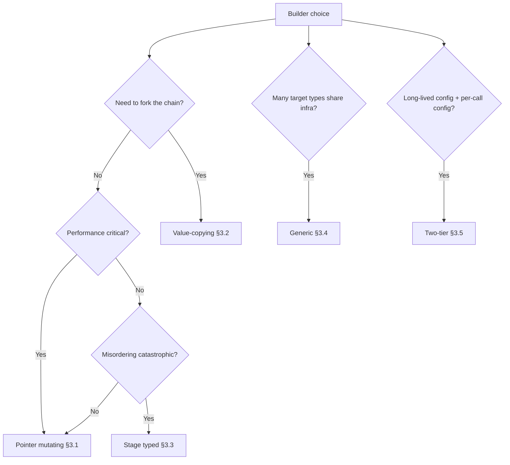
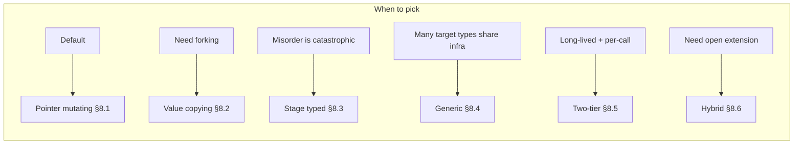
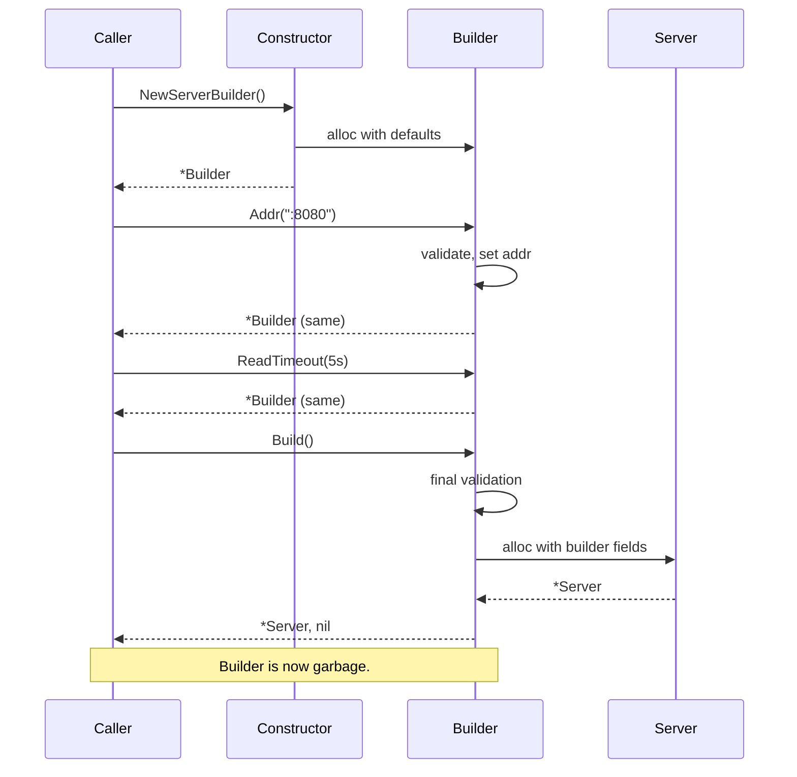
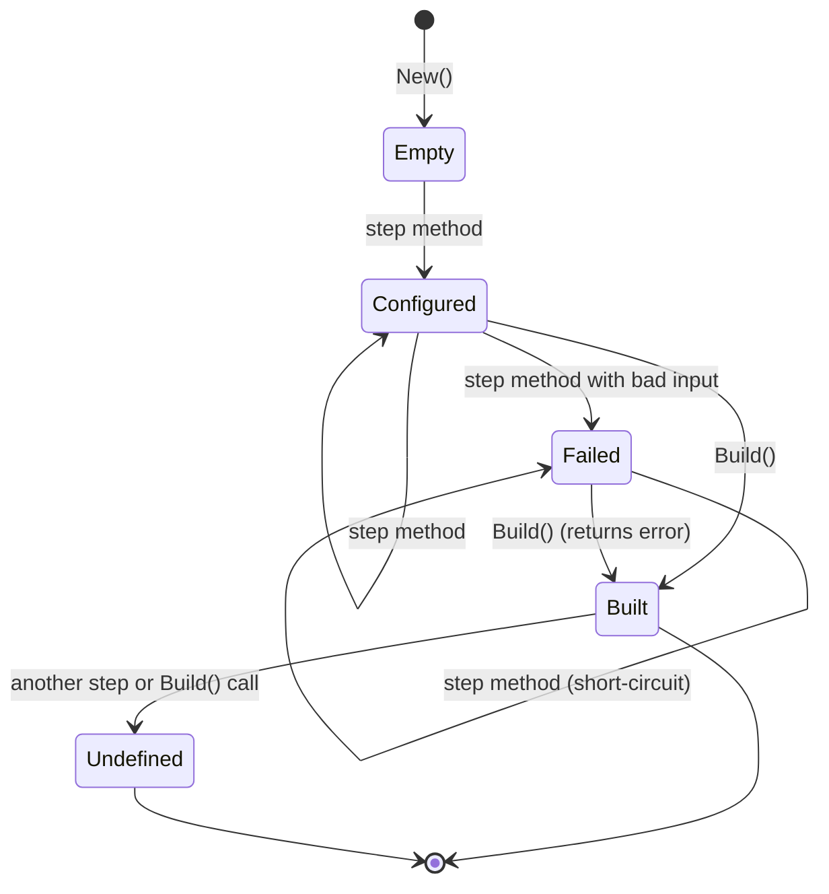

# Builder Pattern — Specification

> **Focus:** A precise reference for the Builder pattern as practised in the Go ecosystem. Unlike functional options, the Builder pattern is a Gang-of-Four pattern with three decades of history outside Go, and its Go form is a deliberate adaptation — many of the GoF roles (Director, ConcreteBuilder, AbstractBuilder) survive in name only, while new shapes (the deferred-error builder, the value-copy builder, the generic accumulator) have grown up around the language's specific affordances (method values, pointer-vs-value receivers, generics, no inheritance).
>
> The audience files (junior/middle) explain *why* and *when*. This file is the canonical lookup: what the pattern is, what it descends from, how Go's spec mechanics enable each variant, what the recognised shapes are, where each shape appears in real libraries, what counts as an anti-pattern, and the boundaries against neighbouring patterns (Functional Options, Factory Method, Composite).
>
> **Primary sources:**
> - Erich Gamma, Richard Helm, Ralph Johnson, John Vlissides, *Design Patterns: Elements of Reusable Object-Oriented Software* (Addison-Wesley, 1994), Chapter 3 — "Builder".
> - Joshua Bloch, *Effective Java* (3rd edition, Addison-Wesley, 2018), Item 2: *"Consider a builder when faced with many constructor parameters"*.
> - Go language specification: https://go.dev/ref/spec
> - `Masterminds/squirrel` source: https://pkg.go.dev/github.com/Masterminds/squirrel
> - `doug-martin/goqu` source: https://pkg.go.dev/github.com/doug-martin/goqu/v9
> - `go-resty/resty` source: https://pkg.go.dev/github.com/go-resty/resty/v2
> - `google.golang.org/protobuf` source: https://pkg.go.dev/google.golang.org/protobuf
> - `kubernetes/client-go` source: https://pkg.go.dev/k8s.io/client-go
> - `go-chi/chi` source: https://pkg.go.dev/github.com/go-chi/chi/v5
> - `text/template` source: https://pkg.go.dev/text/template
> - `strings.Builder` source: https://pkg.go.dev/strings#Builder

---

## 1. Historical origins

The Builder pattern has three lineages that converge in modern Go usage. Recognising which ancestry a particular Go API descends from is the first step in reading it correctly.

### 1.1 Gang of Four (1994)

The original Builder is defined in *Design Patterns* (Gamma, Helm, Johnson, Vlissides, 1994), Chapter 3, with this intent:

> *"Separate the construction of a complex object from its representation so that the same construction process can create different representations."*

The GoF Builder has four participants: **Builder** (abstract interface for creating parts of a Product), **ConcreteBuilder** (concrete assembler), **Director** (driver that calls step methods in a specific order, encapsulating the construction algorithm), and **Product** (the final assembled object).

The canonical 1994 example was a document converter: a Director walks an RTF document calling methods like `ConvertCharacter`, `ConvertParagraph` on whichever Builder is plugged in. An `ASCIIBuilder` produces a plain-text Product; a `TeXBuilder` produces a TeX-formatted Product. The Director doesn't know which Builder it's driving; the same construction *algorithm* yields different *representations*.

Two things often get lost in modern retellings: **the Director is essential, not optional** — GoF Builder is fundamentally about separating *what to build* from *how to represent each step*; and **the chained-method "fluent" syntax is absent** — 1994 calls look like `builder.BuildPart1(); builder.BuildPart2(); product := builder.GetResult();`. Fluent chaining is a later innovation. The Go community has retained the separate-builder-type + terminal-call skeleton and largely discarded the Director-as-class (§6, §10.3).

### 1.2 Joshua Bloch and *Effective Java* (2001, expanded 2008/2018)

Item 2 of *Effective Java* — "Consider a builder when faced with many constructor parameters" — is responsible for the modern fluent shape. Bloch's argument: telescoping constructors get unreadable past three parameters; JavaBeans-style setters leave the object in a half-constructed state and prevent immutability; a static nested `Builder` class with chainable setters and a terminal `build()` method gives readable construction *and* immutability.

```java
Pizza p = new Pizza.Builder(12).cheese(true).pepperoni(true).bacon(false).build();
```

This is the shape Java, Kotlin, and Swift developers expect when they hear "builder". Three Bloch design points carried into Go essentially unchanged: **a separate builder type** (concrete, not an interface), **a terminal `build()` method** that returns the constructed object and discards the builder, and **each setter returns `this`** (or `*Builder` in Go) to enable chaining. The major *divergence* from GoF: Bloch's Builder has no Director — the caller drives construction. This matches how Go developers write builders today.

### 1.3 C# and the fluent interface

Eric Evans and Martin Fowler coined the term *fluent interface* in 2005 (https://martinfowler.com/bliki/FluentInterface.html). C#'s LINQ and Entity Framework's query builder (`db.Users.Where(u => u.Active).OrderBy(u => u.Name).Take(10)`) cemented the style across the Microsoft stack from 2007 onward.

These C# APIs share a structural feature pure Bloch-builders lack: each chained call returns a *different* type from the previous one. `IQueryable<User>.Where(...)` returns `IQueryable<User>`; `Select(...)` may return `IQueryable<UserDto>`. The fluent chain *narrows or refines the type* at each step. Go later borrowed this for the stage-typed builder shape (§3.3). When Go builder APIs feel "C#-flavoured" — multiple sub-builders, terminal methods that execute against a database/HTTP/RPC connection — they descend from this LINQ/EF lineage. `squirrel`, `goqu`, `resty`, `kubernetes/client-go` all show this influence.

### 1.4 Go community evolution

Go's adoption of Builder happened in three rough phases.

**Phase 1 (2010–2014): the SQL builders.** `Masterminds/squirrel` (first commit 2014) is the archetypal early Go builder — pointer receivers, chained method calls, `ToSql()` as the terminal:

```go
sql, args, err := squirrel.Select("id", "name").
    From("users").
    Where(squirrel.Eq{"active": true}).
    OrderBy("created_at DESC").
    Limit(10).
    ToSql()
```

This shape — verb-named entry point, lowercase fluent steps, `ToSql()` terminal — became the default for the next decade of Go SQL libraries (`goqu`, `bun`, `sq`).

**Phase 2 (2014–2018): the HTTP request builders.** Standard `net/http.NewRequest` is *not* a builder — it returns a `*http.Request` whose fields you mutate directly. As HTTP clients grew more complex (auth, retries, timeouts, tracing), the community wrapped `net/http` in builder-shaped layers. `go-resty/resty` (first release 2015) is the most-used example:

```go
resp, err := resty.New().R().
    SetHeader("Content-Type", "application/json").
    SetAuthToken(token).
    SetBody(payload).
    Post("https://api.example.com/users")
```

Two-tier structure: `resty.New()` returns a *client* builder; `.R()` returns a *request* builder. Documented in §5.3.

**Phase 3 (2018–present): generics and code-generated builders.** Go 1.18 (March 2022) added generics. The first wave of generic builders were utility libraries — generic option-appliers, generic config validators — rather than user-facing APIs. The more important development is **code-generated builders**: Protocol Buffers, gRPC, Kubernetes' OpenAPI-generated clients all emit builder code from schemas. Section 5.4 covers protobuf message construction.

---

## 2. Underlying Go spec mechanics

The Builder pattern uses six language features. Each is quoted (or paraphrased with section reference) from the Go specification at https://go.dev/ref/spec.

### 2.1 Methods with pointer receivers

> **Method declarations** ([spec §Method declarations](https://go.dev/ref/spec#Method_declarations)):
> *"A method is a function with a receiver."*

> **Method sets** ([spec §Method sets](https://go.dev/ref/spec#Method_sets)):
> *"The method set of a type `T` consists of all methods declared with receiver type `T`. The method set of a pointer type `*T` is the set of all methods declared with receiver `*T` or `T`."*

A method with receiver `(b *Builder)` mutates the value the caller is holding; a method with receiver `(b Builder)` operates on a copy. The choice is the source of the §3.1 vs §3.2 fork.

### 2.2 Method values

> **Method values** ([spec §Method values](https://go.dev/ref/spec#Method_values)):
> *"The expression `x` is evaluated and saved during the evaluation of the method value; the saved copy is then used as the receiver in any calls, which may be executed later."*

The "saved copy" wording matters for builders. `addrFn := b.Addr` captures the receiver `b` *now*. For a pointer-receiver builder the captured receiver is the pointer — so calls through `addrFn` operate on the same builder. For a value-receiver builder the captured receiver is the *current value*, and subsequent calls operate on that frozen snapshot. This is the mechanic behind the "method value alias" trap in `middle.md` §15.2.

### 2.3 Variadic parameters

> **Function types** ([spec §Function types](https://go.dev/ref/spec#Function_types)):
> *"The final incoming parameter in a function signature may have a type prefixed with `...`. A function with such a parameter is called variadic and may be invoked with zero or more arguments for that parameter."*

Variadic parameters allow builders to accept option-list arguments:

```go
func (b *Builder) Headers(h ...Header) *Builder { ... }
func (b *Builder) With(opts ...Option) *Builder { ... }
```

The hybrid builder/functional-options pattern (`middle.md` §8) depends entirely on this feature. Without variadic parameters, a builder could not cleanly accept a variable set of options inside a step method.

### 2.4 Type parameters (Go 1.18+)

> **Type parameter declarations** ([spec §Type parameter declarations](https://go.dev/ref/spec#Type_parameter_declarations)):
> *"A type parameter list declares the type parameters of a generic function or type declaration. ... Each type parameter is a unique identifier and the corresponding type constraint is the union of all the types listed in the constraint."*

Generic builders use a type parameter on the builder struct:

```go
type Builder[T any] struct { ... }
func (b *Builder[T]) X(...) *Builder[T] { ... }
```

The constraint is usually `any` because the builder treats the target opaquely. When the builder needs the target to satisfy an interface (e.g., `Validate()`), the constraint is that interface:

```go
type Validator interface { Validate() error }
type Builder[T Validator] struct { value T; err error }
```

Type parameters on methods are *not* permitted in Go (as of 1.22) — only on the enclosing type. This forces generic builders to bind `T` at builder construction and propagate it through every method.

### 2.5 Composite literals

> **Composite literals** ([spec §Composite literals](https://go.dev/ref/spec#Composite_literals)):
> *"Composite literals construct new composite values each time they are evaluated."*

The terminal `Build()` always uses a composite literal to construct the target: `return &Server{addr: b.addr, readTimeout: b.readTimeout, ...}`. The composite literal copies values from the builder into the target. Slices and maps are *header copies* — the underlying arrays are shared. This is the source of the §7.2 anti-pattern.

### 2.6 Why the pattern *requires* all six

| Spec feature | Removed → pattern becomes |
|--------------|--------------------------|
| Methods with receivers | Free-function setters; not a builder |
| Pointer receivers | Every step copies; value-receiver-only is rare |
| Method values | Cannot pass mid-chain methods around (minor) |
| Variadic parameters | Cannot have `With(opts ...)`; hybrid pattern impossible |
| Type parameters | No generic builders; one builder type per target |
| Composite literals | Terminal `Build()` requires per-field assignment statements |

Go has all six. The Builder pattern in Go is a direct consequence of this combination.

---

## 3. Canonical signature shapes

Five shapes account for essentially all Go builder code. Each is documented with its declaration, the language features it leans on, and the libraries that exemplify it.

| Shape | Declaration | Receiver | Used by |
|-------|-------------|----------|---------|
| **Pointer mutating** | `func (b *Builder) X(...) *Builder` | `*Builder` | `Masterminds/squirrel`, most Go code |
| **Value copying** | `func (b Builder) X(...) Builder` | `Builder` (value) | `goqu` (partially), some immutable-config libraries |
| **Stage typed** | `func (b AddrBuilder) Addr(string) TimeoutBuilder` | varies per stage | Rare; some cryptographic-key DSLs |
| **Generic** | `func (b *Builder[T]) X(...) *Builder[T]` | `*Builder[T]` | Internal test-fixture frameworks; rare in published APIs |
| **Two-tier (client + request)** | Two coupled builders | both `*` | `go-resty/resty`, `kubernetes/client-go`, gRPC `CallOption` |

### 3.1 Pointer mutating

```go
type Builder struct {
    addr        string
    readTimeout time.Duration
    err         error
}

func New() *Builder { return &Builder{readTimeout: 30 * time.Second} }

func (b *Builder) Addr(a string) *Builder {
    if b.err != nil { return b }
    if a == "" {
        b.err = errors.New("Addr: empty")
        return b
    }
    b.addr = a
    return b
}

func (b *Builder) Build() (*Server, error) { ... }
```

The default. One heap allocation total (the `*Builder`); chain methods are zero-allocation. Mutation is explicit. Forking the chain mid-way is unsafe — every chain shares the same builder.

**Pick when:** single-use construction, no need to fork the chain, performance matters.
**Used by:** `Masterminds/squirrel`, `doug-martin/goqu`'s `SelectDataset` (with caveats — see §5.2), most application-level builders.

### 3.2 Value copying

```go
type Builder struct {
    addr        string
    readTimeout time.Duration
}

func (b Builder) Addr(a string) Builder {
    b.addr = a
    return b
}
```

Every chain step returns a copy. The original builder is unchanged after the call:

```go
base := New().Addr(":8080")
prod := base.ReadTimeout(5 * time.Second)
test := base.ReadTimeout(1 * time.Minute)
// base is unchanged; prod and test diverged from it
```

Forking is trivial — assignment forks. Cost: one allocation per chain step (5 steps = 5 builder copies). Slices and maps must be deep-copied inside each method to avoid sharing backing arrays (see §7.3 anti-pattern).

**Pick when:** forking the chain is the *primary* use case, the chain is short, allocation cost is acceptable.
**Used by:** `doug-martin/goqu` (every dataset method returns a new `*SelectDataset` for immutability — see §5.2), some functional-style query libraries.

### 3.3 Stage typed

```go
type AddrBuilder struct{}
type TimeoutBuilder struct{ addr string }
type FinalBuilder struct{ addr string; timeout time.Duration }

func New() AddrBuilder                                  { return AddrBuilder{} }
func (b AddrBuilder) Addr(a string) TimeoutBuilder      { return TimeoutBuilder{addr: a} }
func (b TimeoutBuilder) Timeout(d time.Duration) FinalBuilder {
    return FinalBuilder{addr: b.addr, timeout: d}
}
func (b FinalBuilder) Build() (*Server, error) { ... }
```

Each stage is a distinct type. The compiler enforces order: `New().Timeout(5*time.Second)` is a compile error because `AddrBuilder` has no `Timeout` method.

This is the *typestate pattern*, well known in Rust and Kotlin. In Go it's rare — three types per builder, every new step is a refactor — but the safety it provides is real when misordering is catastrophic (e.g., setting a cipher before generating a key in cryptographic builders).

**Pick when:** misordering steps would produce a broken-but-compiling object, and runtime validation is insufficient.
**Used by:** some cryptographic-key DSLs, occasional state-machine builders. Not widespread in Go.

### 3.4 Generic

```go
type Builder[T any] struct {
    apply []func(*T)
    err   error
}

func New[T any]() *Builder[T] { return &Builder[T]{} }

func (b *Builder[T]) With(f func(*T)) *Builder[T] {
    if b.err != nil { return b }
    b.apply = append(b.apply, f)
    return b
}

func (b *Builder[T]) Build() (*T, error) {
    if b.err != nil { return nil, b.err }
    var t T
    for _, f := range b.apply { f(&t) }
    return &t, nil
}
```

The builder is abstracted over the target type. `T` is bound at construction; all chain methods preserve it. The body of each "step" is a closure passed by the caller — at this point the builder is essentially functional options dressed in a builder skin.

**Pick when:** writing library infrastructure that must support many target types with shared validation, logging, or composition logic.
**Used by:** internal test-fixture frameworks, generic DSL libraries; rare in user-facing APIs because `Builder[Server]` reads worse than `ServerBuilder`.

### 3.5 Two-tier (client + request)

```go
// Tier 1: client builder (long-lived, configured once).
type Client struct { /* ... */ }
type ClientBuilder struct { /* ... */ }

func NewClient() *ClientBuilder { return &ClientBuilder{} }
func (cb *ClientBuilder) Timeout(d time.Duration) *ClientBuilder { ... }
func (cb *ClientBuilder) Build() *Client { ... }

// Tier 2: request builder (short-lived, one per call, parented to a Client).
type Request struct { client *Client; /* ... */ }

func (c *Client) R() *Request { return &Request{client: c} }
func (r *Request) Header(k, v string) *Request { ... }
func (r *Request) Get(url string) (*Response, error) { ... }   // terminal
```

The client and request builders share state (the request inherits the client's configuration) but live at different time scales. The client is built once at process startup; requests are built per call. This is the most common shape for production HTTP/RPC libraries.

**Pick when:** the target has both long-lived configuration (auth, base URL, retry policy) and per-call configuration (URL path, headers, body).
**Used by:** `go-resty/resty`, `kubernetes/client-go`, gRPC's `ClientConn` + `CallOption`, AWS SDK v2's `Client` + `Options` pattern.

---

## 4. Standard library use

The Go standard library is **not** a heavy user of the Builder pattern. The patterns it does use are either chained-but-not-builder (returning the same type for ergonomic reasons without separating builder from target), or accumulator patterns (`strings.Builder`) that share the name but not the semantics. Knowing which std-lib APIs are and are not builders matters because beginners often mis-classify them.

### 4.1 Chained APIs that look like builders but aren't

#### `text/template.New(...).Option(...).Funcs(...).Parse(...)`

```go
t, err := template.New("greeting").
    Option("missingkey=error").
    Funcs(template.FuncMap{"upper": strings.ToUpper}).
    Parse(`Hello, {{.Name}}!`)
```

`*template.Template` is returned from each step, so the chain compiles. But the *target and the builder are the same type*. There is no separate builder; there is no terminal `Build()`. The chain is convenience over four separate statements. Reusing the value mid-chain is safe — `t.Option("missingkey=zero")` works after the chain. `Parse` is a step *and* a side-effecting operation; it is not a `Build()` terminal. This is a *fluent setter API*, not a Builder.

#### `net/http.Request.WithContext(ctx)`, `time.NewTicker`, `time.NewTimer`

`WithContext` is a value-copying setter (single call, no chain, no accumulator). `NewTicker`/`NewTimer` are factory functions returning fully-constructed objects. None of these are builders.

### 4.2 The `strings.Builder` namesake

`strings.Builder` is the standard-library type *named* "Builder" — and it isn't a GoF Builder. It's an *accumulator*, sometimes called the **Stream Builder** or **Buffer Builder** in other languages.

```go
var b strings.Builder
b.WriteString("Hello, ")
b.WriteString("world!")
s := b.String()
```

The distinction:

| Aspect | GoF Builder | `strings.Builder` |
|--------|-------------|-------------------|
| Constructs | An object with many fields | A single output (string) |
| Steps are | Heterogeneous (`Addr`, `Timeout`, …) | Homogeneous (`Write`, `WriteString`, …) |
| Order of steps | Often significant | Strictly significant (output order matters) |
| Terminal | `Build()`, returns target | `String()`, returns the accumulated buffer |
| Target type | A separate type | The accumulator *is* the target view |

`strings.Builder` is the *Java-StringBuilder* lineage: an efficient, mutable buffer with a finalisation step. `bytes.Buffer` is a near-identical sibling. Both implement `io.Writer`, which is the *interface* that defines the role.

When Go code uses "Builder" in a type name, check first which lineage it belongs to. `strings.Builder` and `bytes.Buffer` are accumulators. Application-level `Builder` types named after a domain (`UserBuilder`, `ServerBuilder`, `QueryBuilder`) are GoF builders. The two are not interchangeable.

### 4.3 `net/http.NewRequest` — explicit anti-builder

```go
req, err := http.NewRequest("POST", url, body)
req.Header.Set("Content-Type", "application/json")
req.Header.Set("Authorization", "Bearer "+token)
```

`http.NewRequest` could have been a builder and isn't. The team chose post-construction mutation: headers are configured after the request exists; the request is mutable for its whole lifetime; there is no frozen terminal state. This works for `net/http` because the request is a stable data structure. It doesn't generalise to APIs where construction has phases. The community wrappers (`resty`, `req`) replaced this style with builders.

### 4.4 Standard library summary

| Package | Style |
|---------|-------|
| `text/template` | Fluent setters on target (not a Builder) |
| `strings.Builder` | Accumulator (not a GoF Builder) |
| `bytes.Buffer` | Accumulator (not a GoF Builder) |
| `net/http.Request` | Post-construction mutation (anti-Builder) |
| `time.NewTicker` / `NewTimer` | Factory function (not a Builder) |
| `database/sql.DB` | Factory + post-construction setters |
| `encoding/json.NewEncoder` | Factory + post-construction setters |

**The Builder pattern is not a standard library idiom.** It is firmly a *third-party-library* idiom. This mirrors functional options — both patterns post-date most of the standard library and live primarily in the ecosystem around it.

---

## 5. Documented use in real libraries

The Builder pattern's authoritative definitions live in third-party Go libraries. This section walks through how five of them implement it. Snippets are short, attributed, and lightly edited for clarity. Consult the source for full context.

### 5.1 `Masterminds/squirrel` — the archetypal Go SQL builder

`github.com/Masterminds/squirrel` is the most-used SQL builder in Go. From [`squirrel/select.go`](https://github.com/Masterminds/squirrel/blob/master/select.go):

```go
type SelectBuilder builder.Builder   // alias over lann/builder reflection machinery

func Select(columns ...string) SelectBuilder {
    return SelectBuilder(builder.EmptyBuilder).Columns(columns...)
}
func (b SelectBuilder) From(from string) SelectBuilder {
    return builder.Set(b, "From", newPart(from)).(SelectBuilder)
}
func (b SelectBuilder) Where(pred interface{}, rest ...interface{}) SelectBuilder {
    return builder.Append(b, "WhereParts", newWherePart(pred, rest...)).(SelectBuilder)
}
func (b SelectBuilder) ToSql() (string, []interface{}, error) { /* assembles */ }
```

Three notable choices: **`SelectBuilder` is a value type** (each method returns a new `SelectBuilder` via reflection — value-copying §3.2); **`ToSql()` is the terminal, not `Build()`** — the terminal is named after what it produces; **errors are returned only from the terminal** (intermediate methods can't return errors because their return type is `SelectBuilder`, not `(SelectBuilder, error)` — the deferred-error pattern). `squirrel` is the canonical reference for SQL builder in Go.

### 5.2 `doug-martin/goqu` — value-immutable builders all the way down

`github.com/doug-martin/goqu/v9` takes the immutability axis further:

```go
// goqu's exec/select_dataset.go (paraphrased):
func (sd *SelectDataset) Where(expressions ...exp.Expression) *SelectDataset {
    return sd.copy(sd.clauses.WhereAppend(expressions...))
}
func (sd *SelectDataset) copy(clauses exp.SelectClauses) *SelectDataset {
    return &SelectDataset{clauses: clauses, dialect: sd.dialect /* ... */}
}
func (sd *SelectDataset) ToSQL() (string, []interface{}, error) { ... }
```

Each method returns a *new* `*SelectDataset` with new clauses. The original is unchanged. `goqu` is a pointer-receiver builder externally but value-copying internally: every chain step allocates. This is the explicit, expensive choice — `goqu` traded performance for fork-safety:

```go
base := goqu.From("users").Where(goqu.Ex{"active": true})
adminQuery, _, _ := base.Where(goqu.Ex{"role": "admin"}).ToSQL()
userQuery, _, _ := base.Where(goqu.Ex{"role": "user"}).ToSQL()
// base is unchanged; adminQuery and userQuery diverge cleanly
```

If your library needs to support branching from a partially-built query, follow `goqu`. If you don't need branching, follow `squirrel` (less reflection, fewer allocations, simpler types).

### 5.3 `go-resty/resty` — two-tier client + request

`github.com/go-resty/resty/v2` is the canonical Go HTTP client built as a builder. From [`resty/client.go`](https://github.com/go-resty/resty/blob/master/client.go) and [`resty/request.go`](https://github.com/go-resty/resty/blob/master/request.go):

```go
// Long-lived, configured-once HTTP client.
type Client struct {
    HostURL string
    Header  http.Header
    /* ... */
}

func New() *Client                              { return createClient(&http.Client{}) }
func (c *Client) SetBaseURL(url string) *Client { c.HostURL = strings.TrimRight(url, "/"); return c }
func (c *Client) SetAuthToken(t string) *Client { c.Header.Set("Authorization", "Bearer "+t); return c }

// R returns a *Request scoped to this Client. Inherits base URL, headers, auth.
func (c *Client) R() *Request { return &Request{Header: http.Header{}, Client: c} }

// Short-lived, per-call request builder.
type Request struct {
    URL    string
    Method string
    Header http.Header
    Client *Client
    /* ... */
}

func (r *Request) SetHeader(h, v string) *Request { r.Header.Set(h, v); return r }
func (r *Request) SetBody(b interface{}) *Request { r.body = b; return r }

// Terminal methods: each performs the HTTP call.
func (r *Request) Get(url string) (*Response, error)  { return r.Execute(MethodGet, url) }
func (r *Request) Post(url string) (*Response, error) { return r.Execute(MethodPost, url) }
```

Two builder layers; each terminal differs by HTTP verb. The `Request` builder has no `Build()` returning `*http.Request`; each verb is its own terminal, and the conversion to `*http.Request` happens inside `Execute`. The `SetX` naming is `resty`'s choice (Java-style). Most Go builders use `WithX` or just `X`; `resty`'s `SetX` is a stylistic outlier.

### 5.4 `google.golang.org/protobuf` — code-generated direct construction

Protocol Buffers in Go are interesting because most "builder" code is *generated* by `protoc-gen-go`. For a `.proto` message, the generated Go is *not* a fluent builder — it's a plain struct with exported fields:

```go
// Generated by protoc-gen-go:
type User struct {
    state         protoimpl.MessageState
    /* internal fields */

    Name   string   `protobuf:"bytes,1,opt,name=name,proto3"`
    Age    int32    `protobuf:"varint,2,opt,name=age,proto3"`
    Emails []string `protobuf:"bytes,3,rep,name=emails,proto3"`
}

// Construction via struct literal:
u := &User{Name: "Alice", Age: 30, Emails: []string{"a@example.com"}}
```

Proto3 in Go is the **anti-builder choice** — exported fields, direct construction. The reasons: generated code aims for minimal API surface; reflection-based marshalling needs field access anyway; the proto generator targets many languages and matches the lowest common denominator. The `google.golang.org/protobuf` package also exposes a *reflection-based* `protoreflect.MessageBuilder` for dynamic construction when the message type isn't known at compile time — a true GoF Builder, used by tools that build protobuf messages from JSON, YAML, or other dynamic sources. End-user protobuf code uses struct literals; reflection-heavy frameworks use the runtime builder.

### 5.5 `kubernetes/client-go` — config struct + scope-narrowing chain

```go
pods, err := clientset.CoreV1().Pods("default").List(ctx, metav1.ListOptions{
    LabelSelector: "app=nginx",
    Limit:         100,
})
```

`ListOptions` is a struct literal — *not* a builder. The chain `clientset.CoreV1().Pods("default").List(...)` is fluent navigation through resource scopes (cluster → API group → namespace → resource), but each step returns a *narrower interface*, not a builder accumulating configuration. This is closer to the C# LINQ-style refinement chain (§1.3) than to a Bloch-style builder. `kubernetes/client-go` does not use the GoF Builder pattern for any of its primary APIs; it uses exported config structs and chained scope-narrowing.

### 5.6 `chi` and `gorilla/mux` — DSL-flavoured fluent routers

```go
r := chi.NewRouter()
r.Use(middleware.Logger)
r.Get("/", indexHandler)
r.Route("/api/v1", func(r chi.Router) {
    r.Use(authMiddleware)
    r.Get("/users", listUsers)
})

// gorilla/mux (archived):
r := mux.NewRouter()
r.HandleFunc("/users/{id:[0-9]+}", userHandler).Methods("GET").Host("api.example.com")
```

`chi.Router` is mutable; the chain doesn't produce a terminal `Build()`. Routes are registered eagerly; the router is itself the target. `gorilla/mux`'s `HandleFunc` returns a `*mux.Route` whose `Methods`/`Host` are setters refining that route. The chain looks like a builder but the route is the target, not an accumulator. The discriminator between Builder and fluent-API-on-mutable-target is whether there is a *separate, transient builder type* with a *terminal `Build()`* that produces an *immutable target*. By that criterion, `chi` and `gorilla/mux` are fluent APIs, not builders.

### 5.7 Library summary

| Library | Pattern | Receiver | Terminal | Notes |
|---------|---------|----------|----------|-------|
| `Masterminds/squirrel` | Pointer mutating (value-typed) | Value (reflection-driven) | `ToSql()` | Archetypal Go SQL builder |
| `doug-martin/goqu` | Pointer mutating (copy on every step) | `*SelectDataset` | `ToSQL()` | Explicit immutability |
| `go-resty/resty` | Two-tier (client + request) | `*Client`, `*Request` | `Get()` / `Post()` / `Execute()` | `SetX` naming (Java style) |
| `protobuf-go` (generated) | Direct struct construction (not a builder) | — | — | Generated; matches multi-language baseline |
| `protobuf-go` (`MessageBuilder`) | Reflection-based GoF Builder | Interface | `Build()` | For dynamic construction only |
| `kubernetes/client-go` | Config struct + scope-narrowing chain | varies | `List` / `Watch` / `Get` | Not a Builder despite the fluent surface |
| `chi`, `gorilla/mux` | Fluent setters on target (not a Builder) | `*Router`, `*Route` | None explicit | Routes are registered eagerly |

---

## 6. The specification of the pattern itself

An implementation of the Builder pattern consists of the following six elements. A correct implementation has all six; a missing element is a defect or a sign that you've chosen a different pattern.

**Element A — A target type (Product).** A struct type `T` (typically pointer-receiver methods) representing the constructed object. Fields may be exported or unexported depending on whether the target is intended to be mutable after construction.

**Element B — A separate builder type.** A distinct struct type `Builder` (or `XBuilder`) whose only purpose is to accumulate configuration. The builder's fields shadow or precompute the target's fields and typically carry one additional field — `err error` — for deferred errors.

**Element C — A constructor function.** A function returning a freshly-allocated builder with defaults applied. Typically named `New`, `NewXBuilder`, or named after the first verb of a DSL (`Select`, `From`, `Request`).

```go
func NewServerBuilder() *Builder {
    return &Builder{readTimeout: 30 * time.Second, writeTimeout: 30 * time.Second}
}
```

**Element D — Step methods.** Methods on `*Builder` (or `Builder` value-receiver) that mutate or copy-and-mutate the builder. Each step method: (1) returns the builder (or a copy) for chaining; (2) short-circuits on prior error if the builder uses deferred errors; (3) performs intrinsic validation and stores the value.

```go
func (b *Builder) Addr(a string) *Builder {
    if b.err != nil { return b }
    if a == "" { b.err = errors.New("Addr: empty"); return b }
    b.addr = a
    return b
}
```

**Element E — A terminal method.** A method (`Build` or domain-named) that performs final validation, allocates the target, copies builder fields into the target (deep-copying slices and maps), and returns the target plus an optional error.

```go
func (b *Builder) Build() (*Server, error) {
    if b.err != nil { return nil, b.err }
    if b.addr == "" { return nil, errors.New("Build: Addr required") }
    return &Server{addr: b.addr, readTimeout: b.readTimeout, writeTimeout: b.writeTimeout}, nil
}
```

**Element F — Conventions for lifecycle and error handling.** (1) Single-use — calling `Build()` twice is undefined unless documented. (2) Single-threaded — concurrent step calls are a race. (3) Errors deferred via `b.err`, returned from `Build()`. (4) Caller never mutates the builder after `Build()`.

A "Builder API" without all six elements is one of the following:

| Missing element | Resulting pattern |
|-----------------|-------------------|
| A (no target struct) | Not a Builder — a free-function DSL |
| B (no separate builder type) | Fluent setter API on a mutable target (e.g., `text/template`, `chi`) |
| C (no constructor function) | The user starts from a zero-value struct (unusual) |
| D (no step methods) | Direct struct construction |
| E (no terminal method) | Fluent setter API; target lives inside the builder forever |
| F (no error/lifecycle convention) | Ad-hoc API that happens to chain |

### 6.1 The five recognisable shapes

These map onto §3 and form the standard taxonomy:



### 6.2 Invariants

A correct Go Builder satisfies these invariants. Violations are defects.

| Invariant | Statement |
|-----------|-----------|
| **Single use** | After `Build()`, the builder is discarded. Subsequent calls produce undefined behaviour unless documented. |
| **Single thread** | Step methods are not safe for concurrent use. One goroutine assembles; one goroutine builds. |
| **Terminal returns target** | `Build()` (or its domain-named equivalent) returns the constructed target, not the builder. |
| **No aliasing** | `Build()` deep-copies slices, maps, and other reference types from the builder into the target. |
| **Deferred error semantics** | If the builder uses `b.err`, every step short-circuits on prior error and `Build()` is the sole reporter. |
| **Defaults in constructor** | Default values are set in the constructor (`New`) — not in step methods, not in `Build()`. |
| **No target mutation post-build** | The constructed target is treated as immutable once `Build()` returns. (Enforced by unexported fields when stronger guarantees are needed.) |

---

## 7. Anti-patterns

What people do that violates the pattern's intent. Each is observed in production Go code; each should be rejected in code review.

### 7.1 Builder for simple value objects

```go
type ConfigBuilder struct { addr string; timeout time.Duration; logger *log.Logger }
func (b *ConfigBuilder) Addr(a string) *ConfigBuilder { b.addr = a; return b }
func (b *ConfigBuilder) Timeout(d time.Duration) *ConfigBuilder { b.timeout = d; return b }
func (b *ConfigBuilder) Logger(l *log.Logger) *ConfigBuilder { b.logger = l; return b }
func (b *ConfigBuilder) Build() *Config { return &Config{addr: b.addr, timeout: b.timeout, logger: b.logger} }
```

Three independent fields, no dependencies, no phases. This is functional options pretending to be a builder. Use `NewConfig(addr, WithTimeout(...), WithLogger(...))` instead. Builder earns its weight when there are *phases* or *derived state* — not when there are merely many setters.

### 7.2 Mutating the target after `Build()`

```go
// Anti-pattern: Build copies references into the target, so subsequent
// builder mutations are visible on the constructed server.
func (b *Builder) Headers(h map[string]string) *Builder { b.headers = h; return b }

func (b *Builder) Build() *Server {
    return &Server{headers: b.headers}   // shares the map
}

// Caller:
b := NewBuilder().Headers(map[string]string{"X-Init": "1"})
s1 := b.Build()
b.Headers(map[string]string{"X-Init": "2"})   // mutates s1.headers via aliasing
```

`Build()` must deep-copy reference types. The correct shape:

```go
func (b *Builder) Build() *Server {
    h := make(map[string]string, len(b.headers))
    for k, v := range b.headers { h[k] = v }
    return &Server{headers: h}
}
```

The same applies to slices (`append([]T(nil), src...)`) and any other reference type.

### 7.3 Builder with public mutable target field

```go
// Anti-pattern: the builder exposes the in-progress target directly.
type Builder struct {
    Server *Server   // exported field
}

func NewBuilder() *Builder                       { return &Builder{Server: &Server{}} }
func (b *Builder) Addr(a string) *Builder        { b.Server.addr = a; return b }

// Caller:
b := NewBuilder().Addr(":8080")
srv := b.Server   // bypasses Build() and any validation
```

The builder's whole point is that it's a *transient* type separate from the target. Exposing the target during construction lets callers skip validation and produces undefined behaviour. Keep the target unexposed until `Build()` returns it.

### 7.4 Threading a mutex through step methods

```go
type Builder struct {
    mu      sync.Mutex
    headers map[string]string
}

func (b *Builder) Header(k, v string) *Builder {
    b.mu.Lock()
    defer b.mu.Unlock()
    b.headers[k] = v
    return b
}
```

A builder is single-threaded by design (§6.2). Adding locks fights the pattern. If your application genuinely needs concurrent assembly, have one goroutine receive on a channel and call the builder serially, or split the work into N separate builders and merge results. Synchronising the builder hides the design problem rather than solving it.

### 7.5 Mixing builder semantics (value + pointer receivers)

```go
func (b *Builder) Addr(a string) *Builder    { b.addr = a; return b }
func (b Builder) Timeout(d time.Duration) Builder {   // value receiver!
    b.timeout = d
    return b
}
```

If `Addr` is pointer-receiver (mutating) and `Timeout` is value-receiver (copying), the chain produces silent bugs. `b := NewBuilder().Addr(":8080").Timeout(5*time.Second).Addr(":9090")` mutates the original on `Addr`, copies on `Timeout`, then `Addr(":9090")` mutates *the copy*. Whether `Addr(:9090)` overwrites `Addr(:8080)` depends on chain order in ways the type system doesn't reveal. The whole builder must commit to one receiver style.

### 7.6 Required parameters as step methods

```go
func (b *Builder) MustAddr(a string) *Builder { b.addr = a; return b }
func (b *Builder) Build() (*Server, error) {
    if b.addr == "" { return nil, errors.New("MustAddr required") }
    /* ... */
}
// Caller can write `NewBuilder().Build()` and only fail at runtime.
```

Required parameters belong on the constructor: `func NewServerBuilder(addr string) *Builder`. The compiler then enforces that `addr` is provided. Stage-typing (§3.3) is the more elaborate version of this principle.

### 7.7 Multiple `Build()` calls with shared state

```go
b := NewBuilder().Addr(":8080")
s1, _ := b.Build()
s2, _ := b.Build()  // s1 and s2 may share map/slice fields; undefined.
```

Even when the builder *appears* to support reuse, the targets share underlying references unless `Build()` deep-copies. The contract: one builder per target. For shared prefixes, wrap the chain in a function.

### 7.8 The "almost builder" with exported target fields

```go
type Server struct {
    Addr        string         // exported
    ReadTimeout time.Duration  // exported
}
func (b *Builder) Build() Server { return b.s }

// Caller bypasses the builder:
s := NewBuilder().Build()
s.Addr = ":9090"   // direct mutation of the "built" target
```

If the target's fields are exported, `Build()` returns a value the caller can mutate. The careful step-by-step assembly is trivially bypassed. If the builder must be the sole route into the target, the target's fields must be unexported and the target must live in the same package as the builder.

---

## 8. Variants and dialects

The pattern has six recognisable variants. Choosing between them is the main design decision.

### 8.1 Pointer-receiver mutating (default)

Pointer-receiver, single-use, deferred errors. See §3.1. This is what you write unless you have a reason to choose otherwise.

**Used by:** `Masterminds/squirrel` (externally — internally it's value-immutable via reflection), most application-level builders, most internal package builders.

### 8.2 Value-receiver copying

Value-receiver, fork-friendly, every step allocates. See §3.2.

**Used by:** `doug-martin/goqu`, immutable-config libraries.

### 8.3 Stage-typed (typestate)

Multiple builder types, one per stage. Compile-time enforcement of order.

**Used by:** rare in published Go libraries; some cryptographic-key DSLs use it.

### 8.4 Generic accumulator

`Builder[T any]` with closure-list semantics. See §3.4. Essentially functional options behind a builder façade.

**Used by:** internal test-fixture generators, generic DSL frameworks.

### 8.5 Two-tier (client + request)

Long-lived configured client builder; short-lived per-call request builder. See §3.5.

**Used by:** `go-resty/resty`, `kubernetes/client-go` (scope chain rather than configuration chain), gRPC `ClientConn` + `CallOption`.

### 8.6 Hybrid (builder + functional options)

The builder accepts a `With(opts ...Option) *Builder` method for extensibility. See `middle.md` §8.

**Used by:** libraries that want both a structured builder for primary configuration and an open-extension story for advanced configuration.

### 8.7 Dialect comparison



---

## 9. Code conventions

Established by community usage. Not enforced by the language; expected by readers.

### 9.1 Naming

| Identifier | Convention | Example |
|------------|------------|---------|
| Builder type | `Builder`, or `<Target>Builder` if multiple in one package | `Builder`, `ServerBuilder`, `SelectBuilder` |
| Constructor | `NewXBuilder`, or domain-named for DSLs | `NewServerBuilder`, `Select(cols ...)`, `From(table)` |
| Step method | Same as target field, or domain verb | `Addr(...)`, `Timeout(...)`, `Where(...)`, `From(...)` |
| Terminal | `Build()`, or domain-named | `Build()`, `ToSql()`, `Execute()`, `Get(url)` |
| Fork helper | `Clone()` or `Copy()` | `func (b *Builder) Clone() *Builder` |
| Conditional helper | `If(cond, f)` or `When(cond, f)` | `func (b *Builder) If(cond bool, f func(*Builder)) *Builder` |
| Inspection helper | `Tap(f)`, `Debug(...)`, `Plan()` | `func (b *Builder) Tap(f func(*Builder)) *Builder` |

`SetX` (Java-style) appears in `resty` and some Go HTTP clients but is uncommon elsewhere. `WithX` is reserved for functional options to avoid confusing the two patterns; in a builder, the step methods are usually just `X(...)`.

### 9.2 Receiver convention

Pointer receivers throughout, except:

- Value-copying builders (§3.2) — value receivers throughout.
- Stage-typed builders (§3.3) — value receivers (each stage is a small struct, value semantics make the stage transitions clean).

Mixing receivers within one builder is the §7.5 anti-pattern.

### 9.3 Constructor entry points

| Style | Example | Notes |
|-------|---------|-------|
| `New` prefix | `NewServerBuilder()` | Standard when there's one builder per package |
| Domain verb | `Select("id", "name")`, `From("users")` | DSL-flavoured; reads as a sentence |
| Required argument | `NewServerBuilder(addr string)` | When some configuration is non-optional |

For DSL builders (SQL, expression construction), the entry point is named after the first verb of the language being modelled. For configuration builders, `NewXBuilder` is the safe default.

### 9.4 Error handling

| Strategy | Pattern |
|----------|---------|
| Deferred error in builder | `b.err`; each step short-circuits; `Build()` returns it |
| Build-time only | No `b.err`; validation in `Build()` only |
| Per-step error return | `func (b *Builder) X(...) (*Builder, error)` — anti-pattern, breaks chains |

Deferred error is the consensus pattern. Build-time-only is acceptable for builders whose intermediate steps cannot fail (rare; usually `Limit(-1)` etc. can fail). Per-step error returns destroy chaining and should not be used.

### 9.5 Terminal method naming

| Domain | Conventional terminal |
|--------|----------------------|
| Generic | `Build() (*T, error)` |
| SQL | `ToSql() (string, []any, error)` |
| HTTP | `Execute()`, `Get(url)`, `Post(url)`, …, `Send()` |
| Image/document | `Render()`, `Generate()` |
| Validation | `Validate() error` (often alongside `Build`) |

Multi-terminal builders are documented in `middle.md` §7; each terminal must be idempotent (running it twice produces equivalent results).

### 9.6 Default values

Defaults are set in the constructor's struct literal:

```go
func NewServerBuilder() *Builder {
    return &Builder{
        readTimeout:  30 * time.Second,
        writeTimeout: 30 * time.Second,
    }
}
```

Not in step methods. Not in `Build()`. The constructor establishes the baseline; step methods record deltas; `Build()` materialises the result.

### 9.7 Godoc conventions

```go
// NewServerBuilder returns a builder for constructing a *Server.
//
// Defaults:
//   - ReadTimeout: 30s
//   - WriteTimeout: 30s
//   - TLS: disabled
//
// Addr is required; call b.Addr(...) before Build.
func NewServerBuilder() *Builder { ... }

// Addr sets the listen address (e.g., ":8080"). Required.
// Returns the builder for chaining.
func (b *Builder) Addr(a string) *Builder { ... }

// Build validates the configuration and returns the constructed *Server.
// The builder is single-use; do not call Build twice on the same builder.
func (b *Builder) Build() (*Server, error) { ... }
```

Three documentation conventions:

1. The constructor's godoc lists the defaults, so callers know what they're overriding.
2. Required steps are marked "Required" in their godoc.
3. The terminal method's godoc states the single-use contract.

### 9.8 Tests

```go
// build is a test helper that returns a Server or fails the test.
func build(t *testing.T, fn func(*Builder)) *Server {
    t.Helper()
    b := NewServerBuilder().Addr(":0")
    fn(b)
    s, err := b.Build()
    if err != nil {
        t.Fatalf("Build: %v", err)
    }
    return s
}

func TestReadTimeout(t *testing.T) {
    s := build(t, func(b *Builder) { b.ReadTimeout(5 * time.Second) })
    if s.readTimeout != 5*time.Second {
        t.Errorf("readTimeout = %v, want %v", s.readTimeout, 5*time.Second)
    }
}
```

The standard testing idiom: a helper that drives the builder, one test per step method, asserting the resulting target field. Unexported fields are accessible from same-package tests.

---

## 10. Related patterns

The Builder pattern shares space with four classical patterns. Each is distinct but often confused.

### 10.1 Functional Options

| Aspect | Builder | Functional Options |
|--------|---------|--------------------|
| Construction phases | Multiple, ordered | Single |
| Intermediate state | Visible (the builder) | Hidden |
| Conditional fields | Method calls or `If(cond, f)` | `if cond { opts = append(opts, WithX(...)) }` |
| Fluent reads | Yes | No |
| Type machinery | Builder type + step methods | One type alias + `WithX` functions |
| Allocation cost | One per chain (pointer) or N per chain (value) | One closure allocation per `WithX` call |
| Idiomatic in Go? | When there are phases | When there are independent knobs |

The two patterns are *complementary*, not competing. See `middle.md` §8 for the hybrid pattern where a builder accepts options.

### 10.2 Factory Method

```go
// Factory Method
func NewServer(addr string) *Server {
    return &Server{addr: addr, readTimeout: 30*time.Second, /* ... */}
}
```

Factory Method is the *terminal piece* of a Builder. A Builder *is* a factory with intermediate state. If there's no intermediate state — if every parameter is set in one call — you have a factory method, not a builder.

A common mistake is to add a builder layer on top of a factory that doesn't need it. The discriminator: if the factory's parameter list fits cleanly on one or two lines with named arguments, you don't need a builder. If the configuration has phases, derived state, or many optional fields that interact, the builder is justified.

### 10.3 Director

The GoF Director is the class that drives the Builder. In the original RTF-converter example, the Director walks the document and calls `ConvertCharacter`, `ConvertParagraph` on whichever Builder is plugged in.

In Go, the Director is typically a *function*, not a class:

```go
func ApplyProductionDefaults(b *Builder) *Builder {
    return b.
        ReadTimeout(5 * time.Second).
        WriteTimeout(5 * time.Second).
        MaxConnections(1000)
}

// Caller:
srv, err := ApplyProductionDefaults(NewServerBuilder().Addr(":8080")).Build()
```

A free function captures the "common chain" pattern without introducing a type. A struct-typed Director (`type Director struct { ... }; func (d *Director) Drive(b *Builder)`) is justified only when there's *state* to attach to the director (tenant ID, connection pool, logger). For pure transformations, free functions are cleaner. See `middle.md` §6 for the discussion.

### 10.4 Composite

The Composite pattern represents a tree of objects where each node has the same interface. Builders intersect with Composite when the constructed target is a tree:

```go
// Building an AST
expr := NewExprBuilder().
    Add(
        NewExprBuilder().Number(1),
        NewExprBuilder().Number(2),
    ).
    Build()
```

Each step's argument is itself a built expression. This recursive use of builders is common in expression-tree, AST, and configuration-tree construction. The builder per node is plain; the composition is what makes it interesting. See `middle.md` §11.4 for the composite chain pattern.

### 10.5 Decorator

Decorator wraps a target to extend behaviour:

```go
type Logger interface { Log(string) }
type TimestampedLogger struct{ inner Logger }
func (t TimestampedLogger) Log(s string) { t.inner.Log(time.Now().String() + " " + s) }
```

A Builder configures a target; a Decorator wraps a target. They can compose — a builder method might wrap the in-progress target with a decorator:

```go
func (b *Builder) WithLoggingDecorator() *Builder {
    b.wrap = append(b.wrap, func(s *Server) *Server { return NewLoggingServer(s) })
    return b
}
```

But the two patterns address different problems: Builder is about *constructing* the target; Decorator is about *extending* the target. Don't conflate them.

---

## 11. The pattern as a graph

Relationships between the pieces, visualised.





---

## 12. Quick-reference: canonical signatures

| Signature | Shape | Failure mode |
|-----------|-------|--------------|
| `type Builder struct { ... err error }` | Pointer mutating | Deferred |
| `func (b *Builder) X(arg T) *Builder` | Step method (pointer) | Stores `b.err` |
| `func (b Builder) X(arg T) Builder` | Step method (value) | Stores `err` on copy |
| `func (b *Builder) Build() (*T, error)` | Terminal | Returns `b.err` or validation error |
| `func (b *Builder) Build() T` | Terminal (value) | Same; target is value-returned |
| `func New() *Builder` | Constructor | None (defaults only) |
| `func New(req ...) *Builder` | Constructor with required args | Compiler enforces required args |
| `func (b *Builder) Clone() *Builder` | Fork helper | None |
| `func (b *Builder) Tap(f func(*Builder)) *Builder` | Inspection helper | None |
| `func (b *Builder) If(cond bool, f func(*Builder)) *Builder` | Conditional helper | None |
| `type Builder[T any] struct { ... }` | Generic | Stores closure list |
| `func (b *Builder[T]) Build() (*T, error)` | Generic terminal | Applies closures, validates |

---

## 13. The pattern's limits

Cases where the Builder pattern is the *wrong* tool, summarised from §4, §7, and §10:

| Situation | Better choice |
|-----------|---------------|
| Configuration is itself the central object | Exported config struct (`tls.Config`, `net/http.Server`) |
| All configuration is independent knobs | Functional options |
| Configuration loaded from a file (YAML, JSON) | Exported config struct + unmarshal |
| Target is mutable for its whole lifetime | Direct struct construction + setters |
| Generated code (protobuf, OpenAPI) | Direct struct construction |
| Few required fields, no optionals | Factory function |
| Standard library predates 2008 | Whatever the package already does |

The pattern is best when:

- Construction has phases (validation between steps, derived state, ordered choices).
- The target should be immutable after construction.
- The configuration space is large and varied.
- The API is exported and stability matters.
- The chain reads like a sentence in the problem domain (SQL, HTTP, AST).

Outside that envelope, reach for one of the alternatives.

---

## 14. Further reading

### 14.1 Original sources

- Erich Gamma, Richard Helm, Ralph Johnson, John Vlissides, *Design Patterns: Elements of Reusable Object-Oriented Software* (Addison-Wesley, 1994), Chapter 3 — "Builder", pp. 97–106.
- Joshua Bloch, *Effective Java* (3rd edition, Addison-Wesley, 2018), Item 2: *"Consider a builder when faced with many constructor parameters"*.
- Martin Fowler, *Fluent Interface*, 20 Dec 2005. https://martinfowler.com/bliki/FluentInterface.html
- Eric Evans, Martin Fowler, *Fluent Interfaces* (joint coinage), 2005.

### 14.2 Go specification sections

- Method declarations: https://go.dev/ref/spec#Method_declarations
- Method sets: https://go.dev/ref/spec#Method_sets
- Method values: https://go.dev/ref/spec#Method_values
- Function types and variadic parameters: https://go.dev/ref/spec#Function_types
- Type parameter declarations: https://go.dev/ref/spec#Type_parameter_declarations
- Composite literals: https://go.dev/ref/spec#Composite_literals
- Assignability: https://go.dev/ref/spec#Assignability

### 14.3 Library documentation

- `Masterminds/squirrel` (SQL builder): https://pkg.go.dev/github.com/Masterminds/squirrel
- `doug-martin/goqu` (SQL DSL): https://pkg.go.dev/github.com/doug-martin/goqu/v9
- `go-resty/resty` (HTTP request builder): https://pkg.go.dev/github.com/go-resty/resty/v2
- `google.golang.org/protobuf` (`MessageBuilder` reflection API): https://pkg.go.dev/google.golang.org/protobuf/reflect/protoreflect
- `kubernetes/client-go` (list/watch options): https://pkg.go.dev/k8s.io/client-go
- `go-chi/chi` router: https://pkg.go.dev/github.com/go-chi/chi/v5
- `strings.Builder` (accumulator, not GoF Builder): https://pkg.go.dev/strings#Builder
- `bytes.Buffer` (accumulator sibling): https://pkg.go.dev/bytes#Buffer
- `text/template` (fluent setters, not Builder): https://pkg.go.dev/text/template

### 14.4 Related Go design discussions

- Go FAQ on overloading and defaults: https://go.dev/doc/faq#overloading
- Go proposal #43651 (typestate builders in Go via generics, discussed but not adopted): https://github.com/golang/go/issues/43651
- The `lann/builder` reflection-driven immutable builder library underpinning squirrel: https://github.com/lann/builder
- `protoc-gen-go` design (why generated protobuf is not a Builder): https://github.com/protocolbuffers/protobuf-go

### 14.5 Related skill files in this roadmap

- `junior.md` — the minimum implementation
- `middle.md` — variants, generics, multi-terminal builders, the Director, hybrid patterns
- `../01-functional-options/` — the pattern Builder is most often compared with
- `../03-strategy-pattern/` — when behaviour varies and a Builder installs the strategy
- `../04-factory-method/` — when there are no phases and the constructor suffices

---

## 15. Glossary

| Term | Definition |
|------|------------|
| **Builder** | A separate type whose role is to accumulate configuration step-by-step, then produce a target via a terminal method. |
| **Target** (Product) | The object the builder constructs. Typically a struct with unexported fields. |
| **Step method** | A method on the builder that records configuration and returns the builder (or a copy) for chaining. |
| **Terminal method** | The method that finalises construction. Conventionally `Build()`; in DSL builders, named for the domain (`ToSql()`, `Execute()`, `Get(url)`). |
| **Deferred error** | The pattern of storing the first error in `b.err`, short-circuiting subsequent steps, and reporting from `Build()`. |
| **Director** | A class or function that drives a builder through a fixed sequence of steps. In Go, usually a free function. |
| **Stage-typed builder** | A builder where each stage is a distinct type, enforcing construction order at compile time. Also called the *typestate pattern*. |
| **Value-copying builder** | A builder whose step methods use value receivers and return a new copy each step. Forks naturally; allocates per step. |
| **Pointer-mutating builder** | A builder whose step methods use pointer receivers and mutate in place. The default Go shape. |
| **Two-tier builder** | A pair of coupled builders where one is long-lived (client, connection) and the other is short-lived (request, call). |
| **Fluent interface** | An API style where each method returns a value usable as the next call's receiver. Builders are fluent; not all fluent APIs are builders. |
| **Accumulator** | A type like `strings.Builder` or `bytes.Buffer` that gathers homogeneous content via repeated calls. Not a GoF Builder despite the name. |
| **Forking** | Branching a partially-built chain into two divergent chains. Native to value-copying builders; requires `Clone()` in pointer-mutating builders. |
| **Single-use builder** | A builder whose contract is that `Build()` may be called only once. The default in Go. |
| **Composite literal Build** | The implementation pattern where `Build()` constructs the target via a struct literal (`&Server{addr: b.addr, ...}`). |
