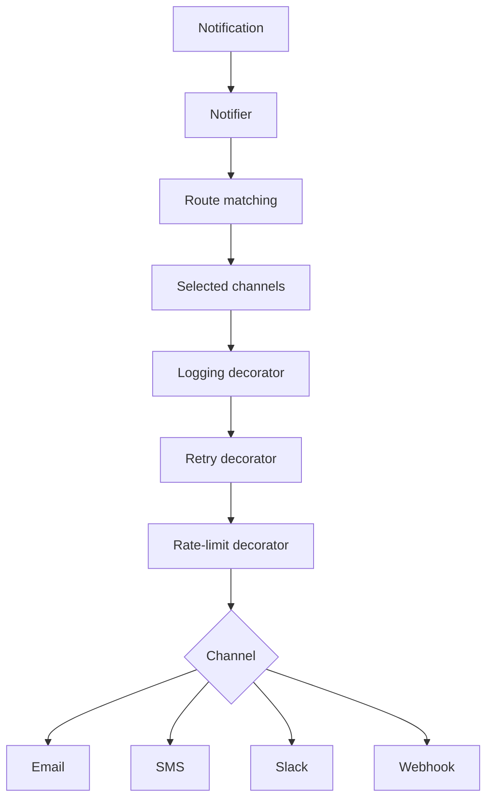
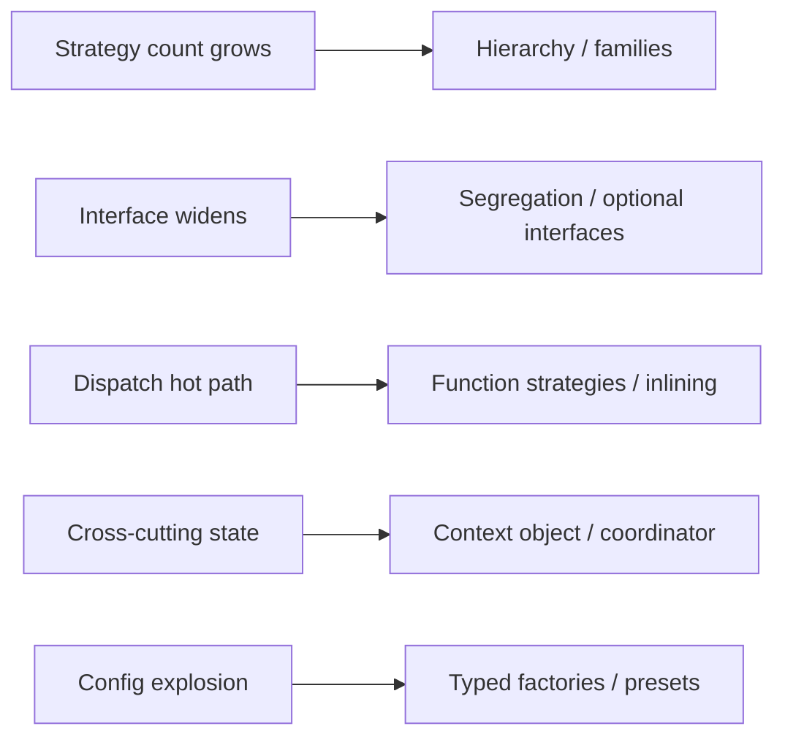
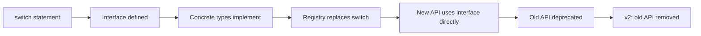

# Strategy Pattern — Interview Questions

Interview prep for the Go Strategy pattern across all skill levels. The pattern is among the most-asked topics in Go interviews because it sits at the centre of how Go does polymorphism. A candidate's answers reveal four things simultaneously: whether they recognise Strategy in idiomatic Go (where the name is rarely uttered), whether they can pick between interface and function variants correctly, whether they understand interface segregation deeply enough to keep strategies small, and whether they can navigate the typed-nil trap that bites every Go programmer at least once.

Use this file the way you'd use flashcards before an onsite at Google, Cloudflare, Uber, DigitalOcean, or any Go-heavy team that ships interfaces in public APIs. Each question has the level it targets, the ideal answer at that level, common wrong answers, and follow-ups the interviewer is likely to chain into.

---

## Table of Contents

1. [What interviewers actually test for](#1-what-interviewers-actually-test-for)
2. [Junior-level questions](#2-junior-level-questions)
3. [Middle-level questions](#3-middle-level-questions)
4. [Senior-level questions](#4-senior-level-questions)
5. [Live coding challenges](#5-live-coding-challenges)
6. [System design conversation starters](#6-system-design-conversation-starters)
7. [Common interview traps and red flags](#7-common-interview-traps-and-red-flags)
8. [Questions to ask the interviewer](#8-questions-to-ask-the-interviewer)
9. [Cross-references](#9-cross-references)

---

## 1. What interviewers actually test for

Strategy is the most invisible pattern in Go. Recognising it under idiomatic Go's surface is the first hurdle. Choosing the right *shape* (interface vs function) is the second. Avoiding the gotchas (typed-nil, oversized interfaces, registry side-effects) is the third. Senior signal comes from architecture decisions: when to expose the strategy interface in your package boundary, how to evolve it across versions, when to use a registry, when to compose, and when to reach for generics.

| Dimension | Junior signal | Middle signal | Senior signal |
|-----------|---------------|---------------|---------------|
| Pattern recognition | Can name Strategy when shown `sort.Slice` | Recognises Strategy in unfamiliar APIs | Identifies Strategy embedded in distributed system design |
| Shape choice | Picks function or interface, can defend | Knows when to expose both (HandlerFunc adapter) | Designs APIs that evolve cleanly across both shapes |
| Interface design | Small interfaces, role-named | Segregates wide interfaces; optional via type assertion | Argues about interface stability vs. flexibility in public SDKs |
| Idioms vs other languages | Knows Java has explicit Strategy classes | Articulates why Go's interfaces *are* Strategy | Translates Java/Kotlin Strategy hierarchies to Go without losing meaning |
| Traps | Knows nil-interface and oversized-interface smells | Handles typed-nil correctly | Defends against typed-nil at API boundaries; documents nil semantics |
| Testing | Writes a mock that satisfies the interface | Uses in-memory fakes, function adapters | Designs the strategy interface to *make* testing easy |

The meta-signal interviewers watch for: candidates who *over-apply* the pattern lose senior points. A `Strategy` interface for every variable behaviour is as bad as no interface at all. Candidates who declare `PaymentStrategy` instead of `Gateway` are showing they know the GoF name but not the Go culture. Senior candidates name interfaces after the role; junior candidates name them after the pattern.

One more axis: Strategy in Go is so deeply embedded in the language that some interviewers test by *not* naming the pattern. They show you a piece of code with an `io.Writer` and ask "what's the design choice here?" The expected answer mentions Strategy by name *only if relevant*, otherwise treats the code as idiomatic Go. Knowing when to invoke the GoF vocabulary and when to skip it is itself a signal.

---

## 2. Junior-level questions

These check that the candidate can recognise Strategy in idiomatic Go code, write a small implementation, and avoid the obvious bugs. Aim for 1–2 minutes each.

---

### Q1 (junior). What is the Strategy pattern, and where does it show up in idiomatic Go?

**Ideal answer.** Strategy is the pattern where an operation's *core* is fixed but one specific step varies. The varying step is lifted into its own type — in Go, almost always an interface or a function value — and passed in as a parameter. The caller picks at runtime which version runs.

In Go you've used it constantly without naming it:

```go
sort.Slice(users, func(i, j int) bool { return users[i].Age < users[j].Age })
```

The "core" is the sort algorithm. The "varying step" is the comparator. The `func(i, j int) bool` is the strategy.

Other stdlib examples: `io.Reader` and `io.Writer` (varying source/destination), `http.Handler` (varying request handling), `sort.Interface` (varying comparison rule), `json.Marshaler` (varying serialization), `database/sql` drivers (varying database).

The reason Strategy doesn't have a name in Go is that single-method interfaces are *the* idiom for it. Naming an interface `XxxStrategy` would be redundant.

**Common wrong answers.**
- "It's a creational pattern." — No, it's behavioural. Builder is creational.
- "It's about inheritance." — Java-flavoured. Go has no inheritance; Strategy works via interface satisfaction.

**Follow-up.** *Show me where Strategy lives in the standard library beyond sort.* (Pulls into Q2 — naming a few of `io.Writer`, `http.Handler`, `cipher.Block`, `compress/gzip.Writer`, etc.)

---

### Q2 (junior). Walk me through the two Go shapes of Strategy and when each fits.

**Ideal answer.** Two shapes.

**Shape 1 — Interface.** Used when the strategy has multiple methods, has state, or is published across package boundaries.

```go
type Gateway interface {
    Charge(ctx context.Context, amount int) error
}

type StripeGateway struct { apiKey string }
func (s *StripeGateway) Charge(ctx context.Context, amount int) error { /* ... */ }
```

**Shape 2 — First-class function.** Used when the strategy is a single operation with a fixed signature and no state.

```go
type ChargeFunc func(ctx context.Context, amount int) error

func NewProcessor(c ChargeFunc) *Processor { /* ... */ }
```

The decision is mostly mechanical:
- Single method, fixed signature, no state → function.
- Multiple methods, state, or published API → interface.
- Need both (some callers prefer one shape) → interface + adapter (the `http.HandlerFunc` pattern).

Most "strategy" decisions take 30 seconds. The community uses functions wherever they fit because they're less code, less indirection, and equally idiomatic.

**Common wrong answers.**
- "Always interface — functions can't have state." — Closures hold state. Functions can be as stateful as interface implementations.
- "Always function — interfaces are slower." — The dispatch difference is ~1 ns. Imperceptible outside hot loops.

**Follow-up.** *Show me the `http.HandlerFunc` trick that gets both shapes at one call site.* (Pulls into the adapter idiom, Q4 of middle.)

---

### Q3 (junior). Why is naming an interface `PaymentStrategy` considered un-idiomatic in Go?

**Ideal answer.** Because Go names interfaces after the *role* the interface plays, not the *pattern* it implements. `io.Reader` says "something to read from". `http.Handler` says "something that handles HTTP requests". `sort.Interface` is a quirky exception that documents itself in the package name.

`PaymentStrategy` says "this is the Strategy pattern applied to payments" — but the caller doesn't care about the pattern. The caller cares about what the interface *does*. The right name is `Gateway`, or `Charger`, or `Payment` — whatever describes the role.

The smell compounds: once you name one interface `XxxStrategy`, you create pressure to name every interface that way. Soon you have `LoggerStrategy`, `RetryStrategy`, `CacheStrategy` — pattern names instead of role names. The codebase reads as "applied GoF" instead of as Go.

**Common wrong answers.** "It doesn't matter, just a convention." — Conventions are how Go codebases communicate. Breaking them costs reviewers attention.

**Follow-up.** *Java does name interfaces `XxxStrategy`. Why is that fine there but not in Go?* (Java has explicit pattern vocabulary because it has classes and inheritance; the name disambiguates from a base class. Go has neither — the role name is enough.)

---

### Q4 (junior). What's wrong with this interface?

```go
type Gateway interface {
    Charge(ctx context.Context, amount int) error
    Refund(ctx context.Context, id string) error
    Cancel(ctx context.Context, id string) error
    GetStatus(ctx context.Context, id string) (string, error)
    GetTransactions(ctx context.Context) ([]Transaction, error)
    GetMetrics() Metrics
    SetWebhookURL(string) error
    Subscribe(chan<- Event) error
}
```

**Ideal answer.** It's too wide. Every implementation has to satisfy eight methods even if the consumer only calls `Charge`. New gateways that don't support refunds or webhooks have to stub them with `errors.New("not supported")` — a code smell. Tests have to mock eight methods to exercise one.

Apply interface segregation:

```go
type Charger interface { Charge(ctx context.Context, amount int) error }
type Refunder interface { Refund(ctx context.Context, id string) error }
type Subscriber interface { Subscribe(ch chan<- Event) error }
```

Each consumer accepts the narrowest interface it needs. Implementations can satisfy one or several. A new gateway that supports only charging fits without stubbing.

Go's rule: "the interface should be the smallest surface the consumer needs." The benefit isn't theoretical — it surfaces the moment a partial-capability gateway joins.

**Common wrong answers.**
- "Looks comprehensive — leave it." — Misses that consumers don't use most of it.
- "Add an embedded interface for the core part." — Helps the documentation but doesn't fix the bloat.

**Follow-up.** *How do you handle optional capabilities?* (Optional interfaces and type assertion: `if r, ok := c.(Refunder); ok { ... }`.)

---

### Q5 (junior). Spot the bug.

```go
type Charger interface { Charge() error }

type StripeGateway struct{ /* ... */ }
func (s *StripeGateway) Charge() error { return nil }

func newGateway(useStripe bool) Charger {
    var sg *StripeGateway
    if useStripe {
        sg = &StripeGateway{}
    }
    return sg
}

func main() {
    g := newGateway(false)
    if g == nil {
        fmt.Println("no gateway")
    } else {
        g.Charge()
    }
}
```

**Ideal answer.** The typed-nil trap. `newGateway(false)` returns `(type=*StripeGateway, value=nil)` — a non-nil interface wrapping a nil pointer. The check `g == nil` compares the interface to a *typeless* nil interface; they're not equal because the returned interface has a type. So the `else` branch runs, calling `g.Charge()` on a nil receiver — usually a panic.

The fix: never assign a typed nil to a variable of interface type. Return a typeless nil instead:

```go
func newGateway(useStripe bool) Charger {
    if !useStripe {
        return nil // typeless nil, the interface is nil
    }
    return &StripeGateway{}
}
```

Now `g == nil` works as expected.

The deeper rule: an interface is the pair `(type, value)`. The interface is nil only when *both* are nil. Assigning a typed nil leaves the type slot set, and the interface lies about being non-nil.

**Common wrong answers.**
- "Add a nil check before calling Charge." — Treats the symptom, not the cause. The interface should *be* nil if there's no gateway.
- "Use a sentinel `NoopGateway`." — Valid for "default behaviour" cases, but doesn't fix the bug; the caller still gets the wrong nilness.

**Follow-up.** *What if `Charge()` doesn't dereference the receiver — does the panic still happen?* (No — the method just returns nil. But the bug is still there; the next method that does dereference will panic. Always avoid the trap.)

---

### Q6 (junior). What's the bug in this strategy switch?

```go
type GatewayKind int
const (
    Stripe GatewayKind = iota
    PayPal
    Square
)

func Charge(kind GatewayKind, amount int) error {
    switch kind {
    case Stripe:
        return stripeCharge(amount)
    case PayPal:
        return paypalCharge(amount)
    case Square:
        return squareCharge(amount)
    }
    return errors.New("unknown gateway")
}
```

**Ideal answer.** The switch *is* the strategy, badly. Three problems:

1. **Adding a new gateway means editing this function.** Open/closed violation — the function should be closed to modification, open to extension via new types.
2. **Every caller depends on the enum.** Tight coupling. A gateway in a different package can't be added without changing the core package.
3. **The compiler doesn't help.** Missing a case is a runtime error (`unknown gateway`), not a compile error.

The Strategy refactor:

```go
type Charger interface {
    Charge(amount int) error
}

func Process(c Charger, amount int) error {
    return c.Charge(amount)
}
```

Now `StripeGateway`, `PayPalGateway`, `SquareGateway` each implement `Charger`. Adding a fourth gateway is a new type, not a switch edit. Callers depend on `Charger`, not the enum.

The enum-dispatch anti-pattern is one of the strongest signals of "Strategy in disguise" code. Recognising it is a junior signal; reflexively refactoring it is a middle signal.

**Common wrong answers.**
- "The switch is fine — it's explicit." — Explicit and rigid. Hard to extend, hard to test.
- "Use generics." — Generics don't fix the underlying open/closed problem.

**Follow-up.** *Where might enum dispatch be appropriate?* (When the set of variants is genuinely closed and small, and adding cases is a deliberate breaking change. e.g., HTTP method enums.)

---

### Q7 (junior). Show me the simplest possible Strategy in Go.

**Ideal answer.** A single function parameter.

```go
func MaxBy[T any](items []T, less func(a, b T) bool) T {
    best := items[0]
    for _, it := range items[1:] {
        if less(best, it) {
            best = it
        }
    }
    return best
}

// Usage:
oldest := MaxBy(users, func(a, b User) bool { return a.Age < b.Age })
```

The `less` parameter is the strategy. The function `MaxBy` is the context. No interfaces, no constructors, no ceremony. This is the pattern at its smallest.

The interface variant adds a type and a method:

```go
type Less[T any] interface { Less(a, b T) bool }

func MaxBy[T any](items []T, less Less[T]) T { /* same body */ }
```

Same result, more code. For a single-method, single-purpose strategy, the function variant wins on every axis: less code, less indirection, easier to write inline.

**Common wrong answers.**
- "Define an interface first." — Premature. Functions are fine.
- "Use a struct with a method." — Even more code. Justified only when state needs to be encapsulated.

**Follow-up.** *When would you promote `less` to an interface?* (When you need to plug in additional methods — e.g., `Equal`, `Hash` — alongside `Less`. The interface earns its keep when the strategy gains operations.)

---

### Q8 (junior). Identify the strategy in this code.

```go
type Cart struct {
    items     []Item
    discounts []Discount
}

func (c *Cart) Total() int {
    sub := c.subtotal()
    total := sub
    for _, d := range c.discounts {
        total -= d.Apply(total)
    }
    return total
}

type Discount interface { Apply(subtotal int) int }
```

**Ideal answer.** `Discount` is the strategy interface. `Cart.Total` is the context — its algorithm (subtotal then apply discounts) is fixed, but the discount calculation is delegated to whatever satisfies `Discount`.

Each concrete discount (`FlatDiscount`, `PercentDiscount`, `BogoDiscount`) is a concrete strategy. The slice `[]Discount` is composition — multiple strategies applied in order.

Three things to note:
1. **The cart doesn't know about discount types.** Adding a new discount is a new struct, not a change to `Cart`.
2. **Discounts compose.** A `[]Discount` is the composition — no separate "CompositeDiscount" type needed.
3. **The interface is small.** One method. Easy to implement, easy to mock.

This is textbook Strategy applied idiomatically: small interface, role-named, accepted by the consumer.

**Common wrong answers.**
- "It's the Visitor pattern." — No. Visitor double-dispatches over a type hierarchy. Discount just dispatches over the discount type.
- "It's Decorator." — Close — Decorator wraps a strategy with cross-cutting behaviour. Here, discounts aren't decorating each other; they're independent strategies applied sequentially.

**Follow-up.** *How would you handle a discount that depends on the cart's contents (e.g., "10% off if total > $100")?* (Change the interface signature: `Apply(c *Cart) int` — strategy now sees the full cart. Or pass relevant data to a richer signature. The signature evolves with requirements.)

---

### Q9 (junior). What does this output, and why?

```go
type Less func(a, b int) bool

func main() {
    nums := []int{3, 1, 4, 1, 5, 9, 2, 6}

    asc := Less(func(a, b int) bool { return a < b })
    desc := Less(func(a, b int) bool { return a > b })

    sort.Slice(nums, asc)
    fmt.Println(nums)

    sort.Slice(nums, desc)
    fmt.Println(nums)
}
```

**Ideal answer.** First line: `[1 1 2 3 4 5 6 9]`. Second line: `[9 6 5 4 3 2 1 1]`.

Two observations:

1. **Strategy values are first-class.** `asc` and `desc` are just function values. Stored in variables, passed to `sort.Slice`, exchanged at runtime. No special "strategy" type machinery — just function literals with a named type.
2. **`Less(...)` is a type conversion.** The underlying function `func(a, b int) bool` is converted to the named type `Less`. The conversion is free at runtime; it's just documentation that this function plays the "less than" role.

The named type is optional. You could pass the anonymous function directly to `sort.Slice` and get the same result. Naming it via a type alias adds clarity when the strategy is shared across functions or stored in a struct.

**Common wrong answers.**
- "It panics because `Less` isn't the right type." — Wrong. The type matches the function signature; sort.Slice accepts `func(i, j int) bool` and the conversion handles it (with adapter logic in this case).

Actually — let me check. `sort.Slice(nums, asc)` — `asc` is `Less = func(a, b int) bool`. `sort.Slice` accepts `func(i, j int) bool`. The signatures differ in parameter names but match structurally. Go's type system uses structural matching for function types, so this works. The output is as described.

**Follow-up.** *Why give the function type a name (`Less`) instead of just passing the literal?* (Documentation and shared definitions. If multiple call sites use the same function shape, naming the type centralises the contract and lets you write helper functions like `Reverse(less Less) Less`.)

---

### Q10 (junior). When is Strategy the wrong pattern?

**Ideal answer.** When the varying step is:

1. **Trivial and unlikely to grow.** A single boolean parameter is simpler than a strategy. `Print(verbose bool)` doesn't need a `PrintMode` strategy.

2. **Tightly coupled to the context's internals.** If the strategy needs access to half the context's private state, you have a code-smell — the operation isn't really separable. Either redesign (move the operation out of the context) or accept that it's part of the context.

3. **Going to change at compile time, never at runtime.** Some "strategies" are really compile-time configuration. Generics or build tags fit better.

4. **A single implementation forever.** If the codebase will only ever have one strategy and you're certain (e.g., the algorithm is mandated by a spec), the interface adds indirection without benefit. You can always extract it later when a second implementation appears.

5. **State machines.** If the "strategy" changes itself based on internal state transitions, that's the State pattern, not Strategy. The semantics differ enough to use the right name.

The opposite mistake — over-applying Strategy — is more common than the right mistake. Every variable in a program is a potential strategy. Most don't deserve one.

**Common wrong answers.**
- "Strategy is always good." — Cargo culting.
- "Strategy is for OO; Go doesn't need it." — Wrong. Go uses Strategy more than any other GoF pattern; it just doesn't name it.

**Follow-up.** *What's the difference between Strategy and State?* (Strategy is chosen by the caller; State changes itself. A traffic light's `Tick()` advances the state — that's State. Calling `sort.Slice(items, less)` with a comparator the caller chose — that's Strategy.)

---

## 3. Middle-level questions

These check whether the candidate can pick the right shape, design strategy APIs that scale, and reason about composition, lifetime, and testing. Expect 3–5 minutes each.

---

### Q1 (middle). Walk me through the `http.HandlerFunc` adapter pattern and when to apply it.

**Ideal answer.** The canonical Go idiom for "accept either an interface or a function with the same signature at the same call site".

```go
// from net/http
type Handler interface {
    ServeHTTP(ResponseWriter, *Request)
}

type HandlerFunc func(ResponseWriter, *Request)

func (f HandlerFunc) ServeHTTP(w ResponseWriter, r *Request) {
    f(w, r)
}
```

The trick: `HandlerFunc` is a *named function type*, and named types can have methods. The `ServeHTTP` method just invokes the underlying function. So any `HandlerFunc` value satisfies `Handler`.

This gives callers a choice:

```go
mux.Handle("/users", &userHandler{})                  // interface
mux.Handle("/posts", http.HandlerFunc(handlePost))    // function via adapter
mux.HandleFunc("/comments", handleComment)            // shortcut
```

Apply the pattern when:

- The strategy has a single method.
- Some callers will have a stateful implementation (struct) and others will have a one-off behaviour (function).
- You're publishing the API across packages — both shapes need to be ergonomic.

Don't apply when:

- The interface has multiple methods. You can't adapter-ise five methods cleanly.
- The function form would be confusing without context (e.g., a strategy with an obscure signature is clearer as a struct method).
- The call site is rare. Adding the adapter is permanent API surface; don't add it speculatively.

The adapter type is ~five lines, costs nothing at runtime (the method call inlines), and dramatically improves call-site ergonomics.

**Common wrong answers.**
- "Just accept `interface{}` and type-switch." — Throws away type safety.
- "Use generics." — Generics don't help here; the issue is *both* call sites, not type parameters.

**Follow-up.** *Define this adapter for a `Charger` interface.* (One-line `type ChargeFunc func(...); func (f ChargeFunc) Charge(...) error { return f(...) }`.)

---

### Q2 (middle). When should the strategy interface live in the consumer's package vs. the implementation's package?

**Ideal answer.** Almost always in the consumer's package. The Go idiom is "accept interfaces, return concrete types" — and the interfaces are *declared by the consumer*.

```go
// In package payment (the consumer):
type Gateway interface {
    Charge(ctx context.Context, amount int) error
}

// In package stripe (the implementation):
type Client struct { apiKey string }

func (c *Client) Charge(ctx context.Context, amount int) error { /* ... */ }
```

The `stripe` package doesn't import `payment`. It just happens to satisfy the `payment.Gateway` interface structurally. The `payment` package depends on no specific implementation.

Why this order matters:

1. **Implementation reuse.** Stripe's `Client` can be used by any consumer that defines a `Charger` interface — `payment`, `subscriptions`, `audit`, whatever. If `Gateway` lived in `stripe`, every consumer would have to import `stripe`.

2. **Dependency direction.** Consumers depend on interfaces; implementations depend on nothing about the consumer. Tests can swap implementations without touching `stripe`.

3. **Interface segregation.** Each consumer defines the narrowest interface it needs. `payment.Gateway` might be one method; `audit.Charger` might be a different one method. Stripe's `Client` satisfies both.

The exception: when the package *is* the abstraction (e.g., `io`, `sort`, `database/sql`). These packages publish the interface because the entire package is the contract.

**Common wrong answers.**
- "Put the interface where the implementations are." — Reverses the dependency direction. Common Java import.
- "Put it in a shared types package." — Bloats the shared package and creates a single point of churn.

**Follow-up.** *What happens if two consumers want different methods from the same implementation?* (Each defines its own interface; the implementation satisfies both. That's interface segregation in action.)

---

### Q3 (middle). Compare strategy registries (e.g., `database/sql.Register`) to explicit construction. When does each win?

**Ideal answer.** Two patterns for "choose a strategy by name at runtime."

**Registry:**

```go
package codec

var registry = map[string]Codec{}

func Register(name string, c Codec) {
    if _, dup := registry[name]; dup {
        panic("codec: " + name + " already registered")
    }
    registry[name] = c
}

func Get(name string) (Codec, error) {
    c, ok := registry[name]
    if !ok { return nil, fmt.Errorf("codec: unknown %q", name) }
    return c, nil
}
```

Implementations register in `init()`. Importing `_ "myorg/codec_gzip"` (blank import) wires up gzip support.

**Explicit:**

```go
codec := codec.NewGzip()
processor := NewProcessor(codec)
```

The caller picks the strategy directly; no global state.

**Registry wins when:**
- Selection is configuration-driven (config file says `codec: gzip`).
- Third parties register their own implementations (database drivers).
- The set of strategies grows independently of the core (image format decoders).

**Explicit wins when:**
- Selection is known at code time (a payment processor wired to Stripe explicitly).
- Tests need isolation (registry persists across tests; one test's registration affects others).
- Initialization order matters and you want to control it.
- Dependency direction should flow inward (registry inverts it via init-time side effects).

**Real examples.**
- `database/sql.Register` — registry, because DSNs come from config files.
- `image.RegisterFormat` — registry, because new formats arrive via plugins.
- `compress/gzip` — used explicitly via `gzip.NewWriter`, no registry.
- `crypto/cipher.Block` — explicit, because the cipher is part of the application's design, not config.

The registry pattern has hidden costs:
- Global mutable state.
- Init-order dependencies (a panic during init is hard to debug — far from the call site).
- Hard to test in isolation.

For application code, prefer explicit. For libraries that *must* accept plugins, registry is justified.

**Common wrong answers.**
- "Registry is always more flexible." — Flexibility at the cost of testability and init complexity.
- "Explicit is always cleaner." — Doesn't accommodate plugin architectures.

**Follow-up.** *How does `database/sql` handle driver lifecycle?* (Drivers register at init; `sql.Open(driverName, dsn)` looks up the driver and creates a connection. The driver itself is a strategy; the DSN configures the strategy.)

---

### Q4 (middle). How do you compose strategies — chains, fallbacks, weighted selection?

**Ideal answer.** The composition itself is a strategy. It implements the same interface as the underlying strategies it composes.

**Chain — try each in order until one succeeds:**

```go
type ChainResolver []Resolver

func (cs ChainResolver) Resolve(name string) (string, error) {
    var lastErr error
    for _, r := range cs {
        v, err := r.Resolve(name)
        if err == nil { return v, nil }
        lastErr = err
    }
    return "", fmt.Errorf("ChainResolver: all failed: %w", lastErr)
}
```

`ChainResolver` is a `[]Resolver` plus a method that itself satisfies `Resolver`. Pass it anywhere a `Resolver` is expected.

**Fallback — primary + backup:**

```go
type FallbackResolver struct {
    Primary, Backup Resolver
}

func (f FallbackResolver) Resolve(name string) (string, error) {
    v, err := f.Primary.Resolve(name)
    if err == nil { return v, nil }
    return f.Backup.Resolve(name)
}
```

Two-strategy chain, but the struct makes the relationship explicit. Readers see "primary + backup" immediately.

**Weighted — randomized selection:**

```go
type WeightedRouter struct {
    routes  []Resolver
    weights []int
    rnd     *rand.Rand
}

func (w *WeightedRouter) Resolve(name string) (string, error) {
    total := 0
    for _, x := range w.weights { total += x }
    pick := w.rnd.Intn(total)
    for i, x := range w.weights {
        pick -= x
        if pick < 0 { return w.routes[i].Resolve(name) }
    }
    return w.routes[len(w.routes)-1].Resolve(name)
}
```

For A/B tests, canary rollout, traffic shaping.

**The composition principle:** strategies satisfy interfaces; compositions satisfy the same interface. You stack them without changing the contract:

```go
var r Resolver = ChainResolver{
    cacheResolver,
    FallbackResolver{Primary: dnsResolver, Backup: hostsResolver},
}
```

Three levels of composition, one interface throughout. This is why small interfaces matter — composability is free.

**Common wrong answers.**
- "Use a switch to pick the strategy." — Hardcodes the selection logic; doesn't compose.
- "Define a `CompositeStrategy` type with a list of strategies." — That's just `[]Strategy` with a wrapper; the wrapper rarely adds value.

**Follow-up.** *Where does this composition pattern show up in HTTP middleware?* (Middleware chains. Each middleware wraps a `Handler` and produces a `Handler`. Same composition principle.)

---

### Q5 (middle). How would you test a function that takes a strategy interface?

**Ideal answer.** Three approaches, picked by complexity.

**Approach 1 — Manual mock struct.**

```go
type mockGateway struct {
    chargeCalled bool
    lastAmount   int
    returnID     string
    returnErr    error
}

func (m *mockGateway) Charge(ctx context.Context, amount int) (string, error) {
    m.chargeCalled = true
    m.lastAmount = amount
    return m.returnID, m.returnErr
}

func TestProcessor_ChargesGateway(t *testing.T) {
    g := &mockGateway{returnID: "test_123"}
    p := NewProcessor(g)

    id, err := p.Process(ctx, Order{AmountCents: 1000})

    if err != nil { t.Fatal(err) }
    if !g.chargeCalled { t.Error("Charge not called") }
    if g.lastAmount != 1000 { t.Errorf("amount = %d", g.lastAmount) }
    if id != "test_123" { t.Errorf("id = %q", id) }
}
```

Direct, explicit, no magic. Best for tests where the mock's behaviour is non-trivial.

**Approach 2 — Function adapter for one-off behaviour.**

```go
func TestProcessor_HandlesGatewayError(t *testing.T) {
    p := NewProcessor(payment.ChargeFunc(func(ctx context.Context, amount int) (string, error) {
        return "", errors.New("gateway down")
    }))

    _, err := p.Process(ctx, Order{AmountCents: 1000})
    if err == nil { t.Fatal("expected error") }
}
```

When you just need "return this error" or "capture this argument", the function form is shorter than a mock struct.

**Approach 3 — In-memory fake.**

```go
type InMemoryGateway struct {
    mu      sync.Mutex
    charges map[string]int
}

func NewInMemoryGateway() *InMemoryGateway {
    return &InMemoryGateway{charges: make(map[string]int)}
}

func (g *InMemoryGateway) Charge(_ context.Context, amount int) (string, error) {
    g.mu.Lock()
    defer g.mu.Unlock()
    id := fmt.Sprintf("mem_%d", len(g.charges))
    g.charges[id] = amount
    return id, nil
}
```

A real-behaviour fake. Used when:
- Mocks would be brittle (too much setup per test).
- The real implementation is slow, expensive, or impossible in tests.
- Multiple tests share fixture-like behaviour.

The fake validates real invariants. For a payment gateway, "charge then refund gives the right balance" is a property a mock can't easily express; the fake encodes it naturally.

**The decision rule.** If you only need to verify "the function was called", use a mock. If you need realistic behaviour across multiple methods, use a fake. If you need a one-line stub, use a function adapter.

**Common wrong answers.**
- "Use gomock / testify mocks for everything." — Adds dependency; manual mocks are usually clearer for simple cases.
- "Test against the real implementation." — Slow, flaky, expensive. Use fakes for unit tests; real implementations for integration tests.

**Follow-up.** *What if the strategy interface has 10 methods and your test only uses one?* (Embed a default-noop struct: `type baseGateway struct{}` with no-op methods; embed it in your test mock and override the one you need. Or split the interface — interface segregation.)

---

### Q6 (middle). What's the right way to handle a "default" strategy?

**Ideal answer.** Three options, each with trade-offs.

**Option 1 — Default in the constructor.**

```go
func NewProcessor(g Gateway) *Processor {
    if g == nil {
        g = &noopGateway{}
    }
    return &Processor{gateway: g}
}
```

The constructor silently substitutes a default. Tests that don't care about charging can pass `nil`. Production code passes a real gateway.

Downside: silent default. A caller who expected to set a gateway and forgot will get a noop that returns errors at runtime, not at construction.

**Option 2 — Reject nil, require explicit.**

```go
func NewProcessor(g Gateway) (*Processor, error) {
    if g == nil {
        return nil, errors.New("NewProcessor: gateway is nil")
    }
    return &Processor{gateway: g}, nil
}
```

The caller must provide a gateway. Failures surface at construction. For tests, expose an `InMemoryGateway` they can use.

Downside: more verbose for callers.

**Option 3 — Functional options with a default.**

```go
func NewProcessor(opts ...Option) *Processor {
    p := &Processor{gateway: &defaultGateway{}}
    for _, opt := range opts { opt(p) }
    return p
}

func WithGateway(g Gateway) Option { return func(p *Processor) { p.gateway = g } }
```

The default is baked in; callers override via options. Familiar pattern but heavier than needed for a single field.

**The choice depends on context.**

- Library code with strict contracts → Option 2 (reject nil).
- Application code with sensible defaults → Option 1 (silent default).
- Multi-field configuration → Option 3 (options).

A subtlety: the default strategy itself should be valid behaviour. A `noopGateway` that returns nil is dangerous (silently succeeds in production). A default that returns `errors.New("gateway not configured")` is safer — fails fast.

**Common wrong answers.**
- "Always panic on nil." — Acceptable in init/test code, not in library code.
- "Document that nil is not allowed; trust the caller." — Trust is for friends, not callers.

**Follow-up.** *What if the default needs configuration (e.g., a default logger that needs a writer)?* (Then it's not really a default — it's just another strategy. Either accept the configuration in the constructor or require explicit construction.)

---

### Q7 (middle). How do generics change Strategy in Go 1.18+?

**Ideal answer.** Generics let you parameterise strategies by data type without losing type safety.

Before generics:

```go
func MaxInt(items []int, less func(a, b int) bool) int { /* ... */ }
func MaxString(items []string, less func(a, b string) bool) string { /* ... */ }
func MaxUser(items []User, less func(a, b User) bool) User { /* ... */ }
```

Three near-duplicates. Or one function with `interface{}` that loses type safety:

```go
func Max(items []interface{}, less func(a, b interface{}) bool) interface{} { /* ... */ }
```

With generics:

```go
func Max[T any](items []T, less func(a, b T) bool) T {
    best := items[0]
    for _, it := range items[1:] {
        if less(best, it) { best = it }
    }
    return best
}
```

One function, type-safe across all element types. The strategy `less func(a, b T) bool` is parameterised.

**When generics help:**
- Operations on slices, maps, channels agnostic to element type — map, filter, reduce, sort, partition.
- Pipelines where multiple stages transform `T` to `U` to `V`.
- Cache implementations parameterised by key and value type.
- Type-safe registries: `Registry[Codec]` vs. `map[string]interface{}`.

**When they don't help:**
- Business logic — `Charge[Stripe]` vs. `Charge[PayPal]` doesn't buy anything; the implementations differ enough that one shared signature is misleading.
- Strategies with multiple methods. Go's generics on methods are limited; you can't have a method `Do(t T)` declared on a non-generic interface where `T` varies per instance.
- Strategies that need reflection (`reflect` doesn't see type parameters cleanly).

**The deeper point.** Generics excel when the strategy is *structurally polymorphic* — the algorithm works the same regardless of the data type. They flounder when it's *domain polymorphic* — different types mean genuinely different logic.

Stdlib examples: `slices.SortFunc`, `slices.IndexFunc`, `cmp.Compare` — all generic strategies.

**Common wrong answers.**
- "Use generics for everything to avoid `interface{}`." — Over-applies them. Sometimes `interface{}` (or `any`) is fine — when you genuinely don't care about the type.
- "Generics replace interfaces." — They complement, not replace. Interfaces describe behaviour; generics parameterise type. Many APIs use both.

**Follow-up.** *Can you have a generic strategy interface?* (Yes — `type Less[T any] interface { Less(a, b T) bool }`. But methods on generic interfaces can't be specialised per-instance; the type parameter is fixed when the interface variable is created.)

---

### Q8 (middle). Walk me through the cost of interface dispatch vs. direct function calls. When does it matter?

**Ideal answer.** Three call types, measured.

```
BenchmarkDirectCall-8           1000000000   0.85 ns/op   0 B/op   0 allocs/op
BenchmarkFunctionStrategy-8     1000000000   0.91 ns/op   0 B/op   0 allocs/op
BenchmarkInterfaceStrategy-8     700000000   1.62 ns/op   0 B/op   0 allocs/op
BenchmarkClosureCapture-8        500000000   2.10 ns/op  16 B/op   1 allocs/op
```

**Direct call.** ~0.85 ns. The compiler inlines simple functions; the call is barely visible.

**Function strategy.** ~0.91 ns. The function pointer adds an indirect call, but Go's compiler often devirtualises monomorphic call sites. For simple closures, it's essentially free.

**Interface strategy.** ~1.62 ns. The dispatch goes through the interface table (itab) — one indirect load to find the method, one indirect call. Always a non-inlined call. ~0.8 ns more than direct.

**Closure that escapes.** ~2.10 ns + 16 B + 1 allocation. The cost isn't the dispatch — it's the *creation* of the closure on the heap. If you create the closure once and reuse it, the alloc amortises. If you create per-call, it dominates.

**When it matters:**

- **Tight inner loops, millions of calls/sec.** Sorting 10M elements with an interface-typed `Less` is measurably slower than with a function-typed one. Switch to function if profiling shows the dispatch is a bottleneck.
- **Hot paths with heap-allocated closures.** Constructing the closure per request, where the request is high-throughput, adds GC pressure. Pre-construct the closure once and reuse.

**When it doesn't matter:**

- Per-request strategies (a few thousand calls/sec) — the dispatch is invisible.
- One-time-at-startup strategies — the dispatch happens once; cost is meaningless.
- Strategies where the underlying work is non-trivial (e.g., database query, HTTP call) — the dispatch is dwarfed by the actual work.

**The rule.** Don't optimise the strategy dispatch unless profiling tells you to. The pattern's cost is rarely the bottleneck. When it is, switch from interface to function, or inline the operation entirely.

**Common wrong answers.**
- "Always use interfaces — they're idiomatic." — Idiomatic, but in a hot path, function may win.
- "Use generics to avoid dispatch entirely." — Generics monomorphise per instantiation, so the dispatch is direct. But generics don't replace interfaces in all cases; weigh the readability cost.

**Follow-up.** *Show me a real case where switching from interface to function changed performance.* (Sorting algorithms in `sort` package use `sort.Interface` for stability; `sort.Slice` uses `func(i, j int) bool` for ergonomics. The latter is slightly faster because the closure is monomorphic — no interface dispatch.)

---

### Q9 (middle). How do you evolve a strategy interface across versions without breaking callers?

**Ideal answer.** Two scenarios.

**Scenario 1 — Adding capability.**

You have:

```go
type Gateway interface {
    Charge(ctx context.Context, amount int) error
}
```

You want to add `Refund`. Don't add it to `Gateway` — that breaks every existing implementation. Instead, introduce a new interface:

```go
type Refunder interface {
    Refund(ctx context.Context, id string) error
}
```

Consumers that need refund accept `Refunder`. Implementations that support it expose the method on the concrete type. Callers can type-assert:

```go
if r, ok := gateway.(Refunder); ok {
    r.Refund(ctx, id)
}
```

The original `Gateway` is untouched. Old code keeps working.

**Scenario 2 — Changing existing methods.**

You have:

```go
type Gateway interface {
    Charge(amount int) error
}
```

You realise you need a `context.Context`. Adding it to `Charge` breaks every implementor.

Three options:

a) **New method, deprecate the old.** Add `ChargeCtx(ctx context.Context, amount int) error`. Keep `Charge` as a wrapper. Document deprecation. Eventually remove in v2.

b) **Hold for major version.** Cut v2, change the signature there. v1 stays untouched. Users opt into v2 explicitly.

c) **Optional interface for the new behaviour.** Define `ContextualCharger` with the new signature. Implementations satisfying both are detected by type assertion at runtime.

**The rule.** Interface methods are *contracts*. Adding methods to an existing interface is a breaking change for implementations (every implementor must add the method). Removing methods breaks consumers (every caller of the removed method). Plan for evolution: keep interfaces small, segregate aggressively, and use major versions for restructuring.

Real example: `database/sql.Driver` has been evolved with `DriverContext`, `Connector`, `SessionResetter` — each a new optional interface that drivers may implement. The original `Driver` is intact.

**Common wrong answers.**
- "Just bump v2 for every change." — Discourages contributions; v2 has migration cost.
- "Break the interface and let users update." — Breaks the Go module compatibility promise.

**Follow-up.** *How do you tell consumers about deprecated methods?* (Godoc `// Deprecated:` comments. `go vet` and IDE warnings pick them up. Run a linter (e.g., `staticcheck SA1019`) to catch usage.)

---

### Q10 (middle). What's the right error model for a strategy that can fail in multiple ways?

**Ideal answer.** Depends on what callers need to do.

**Pattern 1 — Single error return.**

```go
type Charger interface {
    Charge(ctx context.Context, amount int) error
}
```

Caller distinguishes failure modes via `errors.Is` and `errors.As`:

```go
if errors.Is(err, payment.ErrCardDeclined) { /* ... */ }

var rateErr *payment.RateLimitError
if errors.As(err, &rateErr) {
    time.Sleep(rateErr.RetryAfter)
}
```

This is the dominant Go style. The interface stays small; the error sentinels and types do the categorisation. Consumers handle the cases they care about.

**Pattern 2 — Typed error result.**

```go
type ChargeResult struct {
    ID     string
    Status ChargeStatus  // Approved | Declined | Pending | Failed
}

type Charger interface {
    Charge(ctx context.Context, amount int) (ChargeResult, error)
}
```

The result carries semantic outcome; the error reserved for system failures (network, panic, etc.). Useful when "declined" is a normal outcome and shouldn't be conflated with errors.

**Pattern 3 — Multiple methods for multiple outcomes.**

```go
type Charger interface {
    Charge(ctx context.Context, amount int) error
    ChargeWithApproval(ctx context.Context, amount int) (Approval, error)
}
```

Different methods for different shapes. Rare; usually overkill.

**The decision rule.**

- Use sentinels + `errors.Is` for known, named failure modes.
- Use typed errors + `errors.As` when the error carries data (retry-after, declined-reason, etc.).
- Use result types when "expected outcomes" include non-success states (declined ≠ failed).
- Keep the interface surface small. One method with rich error returns beats five methods with simple ones.

A gotcha: returning `(string, error)` where empty string means "no result" is ambiguous. Either use a pointer (`*Result`), an explicit "not found" sentinel, or document the meaning. Don't rely on zero-value-as-signal.

**Common wrong answers.**
- "Use panic for unrecoverable errors." — Strategies should return errors. Panics are for programmer bugs (nil dereference, slice out of bounds), not domain failures.
- "Define one error type for the package." — Loses distinction between system and domain errors. Use sentinels + types.

**Follow-up.** *Where does `errors.Join` fit?* (When the strategy aggregates multiple sub-strategies' errors — e.g., "tried gzip, snappy, lz4, all failed". Join preserves each error for `errors.Is` inspection.)

---

## 4. Senior-level questions

These check architectural judgment, evolution across versions, and the ability to design strategy-based subsystems for scale. Expect 5–10 minutes each.

---

### Q1 (senior). You're designing a notification system that supports email, SMS, push, Slack, and arbitrary webhooks. Walk me through the architecture.

**Ideal answer.** Several decisions in sequence.

**Decision 1 — The core strategy interface.**

```go
type Channel interface {
    Send(ctx context.Context, n Notification) error
}
```

One method. The notification carries all the data; the channel decides how to deliver it. Each channel (Email, SMS, Push, Slack, Webhook) is a `Channel` implementation.

A wider initial interface would tempt over-design. Resist.

**Decision 2 — Where does the dispatch logic live?**

Two layers:

```go
type Notifier struct {
    channels map[string]Channel  // name -> channel
    routes   []Route
}

type Route struct {
    Match    func(Notification) bool
    Channels []string
}
```

The `Notifier` orchestrates. `Route` matches notifications to channels. The matching itself is a strategy (a `func(Notification) bool`), allowing arbitrary routing rules — by user, by severity, by time of day, etc.

**Decision 3 — Channel registration.**

Use a registry (Section 3 Q3). Channels register at startup:

```go
notifier.Register("email", emailChannel)
notifier.Register("sms", smsChannel)
```

Registration is explicit (not init-side-effect-based) because the channel set is application-specific, not plugin-driven.

**Decision 4 — Composition.**

Routes apply multiple channels. The `[]Channel` per route is composition by sequence — send to each channel. For fallback (send via Slack, if that fails send via email), a `FallbackChannel` decorator implements `Channel`:

```go
type FallbackChannel struct {
    Primary, Backup Channel
}

func (f FallbackChannel) Send(ctx context.Context, n Notification) error {
    if err := f.Primary.Send(ctx, n); err == nil { return nil }
    return f.Backup.Send(ctx, n)
}
```

`FallbackChannel` is itself a `Channel`. Recursive composition.

**Decision 5 — Cross-cutting concerns.**

Logging, retries, rate limiting, deduplication — each is a decorator. The `Channel` interface stays simple; decorators wrap it:

```go
ch = NewRetryingChannel(ch, retry.Exponential(3))
ch = NewRateLimitedChannel(ch, rate.Limit(100))
ch = NewLoggingChannel(ch, logger)
```

The decorator pattern composes with Strategy because both share the same interface. (Cross-reference: Decorator pattern.)

**Decision 6 — Async vs sync.**

For high-throughput, dispatch to a queue:

```go
type AsyncChannel struct {
    Inner Channel
    Queue chan<- Notification
}

func (a *AsyncChannel) Send(ctx context.Context, n Notification) error {
    select {
    case a.Queue <- n: return nil
    case <-ctx.Done(): return ctx.Err()
    }
}
```

The queue is drained by a worker pool calling `a.Inner.Send`. The async wrapper is itself a `Channel`. Hides the async-ness from callers.

**Decision 7 — Observability.**

Each channel reports metrics. Use an `expvar` or Prometheus counter per channel type. The `Notifier` aggregates.



**Common wrong answers.**
- "Use a giant switch on notification type." — Tight coupling; doesn't extend.
- "Make every channel inherit from a base class." — Java thinking; Go doesn't have inheritance.

**Follow-up.** *How do you handle a channel that requires per-recipient config (e.g., webhook URL per user)?* (The channel implementation takes a recipient-lookup strategy: `WebhookChannel{LookupURL: func(userID string) string}`. Strategies all the way down.)

---

### Q2 (senior). Design a rate-limiter library. Where do strategies fit?

**Ideal answer.** Three layers of strategy.

**Layer 1 — The limiter algorithm.**

```go
type Limiter interface {
    Allow(ctx context.Context, key string) (bool, error)
}
```

Algorithms (token bucket, leaky bucket, sliding window, fixed window) each implement `Limiter`. The interface is small; consumers pass it around without caring which algorithm.

**Layer 2 — The key extractor.**

```go
type KeyFunc func(*http.Request) string
```

For HTTP rate limiting, the key might be the IP, the user ID, the API key, or some hash. The `KeyFunc` strategy lets users pick — or compose.

**Layer 3 — The action on rate-limit hit.**

```go
type ExceededAction interface {
    OnExceeded(ctx context.Context, w http.ResponseWriter, r *http.Request)
}
```

Some apps return 429. Some queue and retry. Some shadow-allow but log. The action is a strategy.

**Composing the layers:**

```go
mw := ratelimit.Middleware(
    ratelimit.WithLimiter(tokenBucket),
    ratelimit.WithKey(byUserID),
    ratelimit.WithExceededAction(returnTooManyRequests),
)
```

Each axis is a strategy. The composition is the middleware.

**Where Strategy shines here:**

- New algorithm? Implement `Limiter`. Don't touch existing code.
- New key extraction? Implement `KeyFunc`. Compose with existing keys via fallback (try header, then cookie, then IP).
- New action? Implement `ExceededAction`. Reuse other axes.

**The senior decision: how segregated should the strategies be?**

Three strategies (algorithm, key, action) feels right. Splitting further — e.g., separating "compute the cost of this request" from "allow/deny" — is over-segmented; most users don't need it. Combining — e.g., one interface with `Allow(req *Request) (bool, error)` — couples algorithm to HTTP. Limits reuse for non-HTTP use cases (database queries, internal services).

**Architectural insight.** A library that exposes strategies at multiple axes (algorithm × key × action) lets users compose. A library that exposes one strategy (algorithm only, with hardcoded key and action) forces users to fork for any variation.

**Common wrong answers.**
- "One interface, configurable via tags." — Couples too tightly.
- "Make everything a struct field." — Loses the polymorphism of strategy.

**Follow-up.** *How does this scale across a distributed system?* (The `Limiter` interface is local; for distributed limiting, implementations talk to Redis or a coordinator. The interface stays the same; the implementation hides the distribution.)

---

### Q3 (senior). Critique this real-world strategy API.

```go
type Compressor interface {
    Name() string
    Version() string
    Compress(data []byte) ([]byte, error)
    Decompress(data []byte) ([]byte, error)
    CompressionRatio() float64
    CompressLevel() int
    SetCompressLevel(level int)
    SupportsStreaming() bool
    StreamCompress(r io.Reader, w io.Writer) error
    StreamDecompress(r io.Reader, w io.Writer) error
    Metrics() Metrics
    Reset()
}
```

**Ideal answer.** Several issues.

**Issue 1 — Too wide.** Twelve methods. Most consumers care about `Compress` and `Decompress`. The rest (name, version, ratio, level, metrics, reset) are operational, not core.

**Issue 2 — Mixing capability and metadata.**

`Name()`, `Version()`, `SupportsStreaming()` are metadata. `Compress()` and `StreamCompress()` are capabilities. Mixing them forces every implementation to know about both. A new compressor that doesn't support streaming has to return an error from `StreamCompress` — code smell.

**Issue 3 — Mutability in the interface.**

`SetCompressLevel(int)` mutates the strategy. If the strategy is shared across goroutines (common), this is a data race. Strategies should be immutable; configuration goes in the constructor.

**Issue 4 — Conflating sync and streaming.**

`Compress(data []byte) ([]byte, error)` and `StreamCompress(r io.Reader, w io.Writer) error` are two different operations. A streaming compressor doesn't naturally support `Compress(data []byte)` without buffering. A batch compressor doesn't naturally support streaming without re-implementation.

**Issue 5 — Operational concerns in the strategy interface.**

`Metrics()` returns metrics — but metrics are an orthogonal concern. Each strategy reporting its own metrics is fine; *requiring* the interface to expose them couples observability to capability.

**Better design:**

```go
type Compressor interface {
    Compress(data []byte) ([]byte, error)
    Decompress(data []byte) ([]byte, error)
}

type StreamingCompressor interface {
    Compress(w io.Writer) io.WriteCloser
    Decompress(r io.Reader) io.ReadCloser
}

// Metadata via optional interfaces
type Named interface { Name() string }
type Versioned interface { Version() string }
```

Each capability is its own interface. Metadata is opt-in via type assertion. Implementations satisfy the capabilities they support. Consumers ask for the narrowest interface they need.

**Compare to stdlib.** `compress/gzip` doesn't have a unified `Compressor` interface. `gzip.NewWriter` and `gzip.NewReader` are concrete types. `compress/flate` similar. Each algorithm exposes its own constructor; no shared interface across the package. This sounds limiting but is intentional — each algorithm has subtle parameters that don't generalise cleanly.

If you genuinely need a unified interface (registry of compressors), define the minimum surface — `Compressor { Compress; Decompress }` — and accept that streaming, metadata, level-tuning are per-implementation.

**Common wrong answers.**
- "Looks fine — it covers all cases." — Misses that "covers all cases" is the smell.
- "Add an abstract base class." — Java thinking.

**Follow-up.** *How would you handle compression level (gzip 1-9, zstd 1-22)?* (As a constructor parameter, not an interface method. `gzip.NewWriterLevel(w, gzip.BestCompression)`. The level is part of the configuration; the interface stays clean.)

---

### Q4 (senior). How do you handle Strategy at module boundaries — exposing interfaces in a public Go SDK?

**Ideal answer.** Three questions, three answers.

**Question 1 — Should the interface be in the public SDK or only in the internal package?**

If consumers are expected to provide their own implementations (e.g., a logging interface they can plug their own logger into): expose it. Document the contract.

If consumers only choose among implementations you provide: expose the constructors, not the interface. Internally, the package uses the interface; externally, callers just instantiate concrete types.

**Question 2 — How small should the public interface be?**

Tiny. The interface is a *contract* — once published, breaking it is a major version. Adding a method is breaking (every implementor must add the method). Removing or renaming is breaking.

Start minimal: the smallest set of methods that lets you do useful work. Add capability via *new* interfaces (segregation), not by widening the existing one.

The grpc-go example: `grpc.ServiceRegistrar` is *one method*. `grpc.ClientConn` evolves via separate interfaces (`Stream`, `Invoker`). The package has been API-stable for years partly because the core interfaces never grew.

**Question 3 — Should the interface allow nil?**

Document the answer. If nil is allowed, behaviour must be defined ("a nil Logger discards messages"). If not, surface the rejection — return an error from constructors, or panic at the obvious boundary.

The typed-nil trap (see junior Q5) is especially dangerous at module boundaries. If `MyConstructor(l Logger) *Server` accepts a `Logger` interface, a caller passing `(*MyLogger)(nil)` gets a non-nil interface that crashes on first use. Defend at the boundary:

```go
func New(l Logger) *Server {
    if l == nil || reflect.ValueOf(l).IsNil() {
        l = noopLogger{}
    }
    return &Server{logger: l}
}
```

The `reflect.ValueOf(l).IsNil()` catches typed nils. Some SDKs do this; many don't and document "nil values not supported".

**Senior architectural pattern.** Public SDKs often expose:

- **Provider interfaces** — small, stable, consumer-defined (`logging.Logger`, `tracing.Tracer`).
- **Concrete configuration types** — `Config`, `Options`, returned by constructors.
- **Internal interfaces** — for testing, not public; mocks live in test packages.

The split mirrors the difference between "extension points" (interfaces) and "configuration" (structs). Each plays a distinct role; mixing them creates surface area you regret.

**Common wrong answers.**
- "Expose everything — flexibility is good." — Each exposed interface is a contract you can't break.
- "Hide interfaces — they're implementation detail." — Then consumers can't plug in their own implementations.

**Follow-up.** *What's a real example of an SDK that handled this well?* (`golang.org/x/oauth2`. `TokenSource` interface is one method. Implementations are exposed via concrete types. The SDK has been stable for ~10 years.)

---

### Q5 (senior). Where do strategies fail at scale?

**Ideal answer.** Five places.

**1. Too many strategies.**

A system with 50 implementations of one interface is unwieldy. Tests grow; documentation fragments; users can't tell which to pick. Mitigation: hierarchy. Group strategies into families (`compressor.Streaming`, `compressor.Batch`); expose a higher-level chooser.

**2. Strategy interfaces that grow.**

The interface starts with one method. Six months later it has eight. Every implementation must adapt. The interface becomes a maintenance burden because it's no longer "the minimum surface" but "the union of every consumer's needs". Mitigation: aggressive segregation, optional interfaces, willingness to cut v2 when the segregation can't be done backward-compatibly.

**3. Hot-path dispatch overhead.**

For ~1ns per call, the overhead is invisible. For ~100ns per call, on a tight inner loop with 10M iterations, that's 1 second of dispatch overhead. Mitigation: function strategies instead of interfaces; for ultra-hot loops, inline the operation.

**4. Cross-cutting state.**

When a strategy needs to share state with other strategies (e.g., "the rate limiter and the cache need to see the same request key"), the strategy boundaries blur. Mitigation: a context object passed alongside the strategy call (`*RequestContext`), or pulling the cross-cutting concern out of the strategies into a coordinator.

**5. Configuration explosion.**

Each strategy has its own configuration. With 20 strategies, the configuration surface is enormous. Mitigation: typed factories that produce pre-configured strategies; documentation that groups "presets" (e.g., "production preset" wires up 10 strategies with sensible defaults).



**The architectural rule.** Strategies are great for *plugging behaviour into well-defined points*. They struggle when those points proliferate, the boundaries blur, or the dispatch becomes a bottleneck. Profile, measure, segregate. Trust the pattern but verify it scales.

**Common wrong answers.**
- "Strategies scale fine — Go is fast." — Optimistic.
- "Switch to inheritance." — Go doesn't have it.

**Follow-up.** *What's an example of a system that hit one of these problems and resolved it?* (Kubernetes controllers. Each controller was a strategy; the controller-runtime library generalised them. The interface grew, segregated, eventually stabilised at `Reconciler { Reconcile(ctx, req) (Result, error) }`. Years of evolution.)

---

### Q6 (senior). Argue both sides: should every behaviour-varying point in a Go program be a Strategy?

**Ideal answer.** Two arguments.

**For Strategy everywhere:**

1. **Open/closed principle.** Adding behaviour without changing existing code. Strategies are the only Go mechanism that delivers this cleanly.
2. **Testability.** A Strategy is mockable; a baked-in switch is not.
3. **Composition.** Strategies compose into chains, fallbacks, decorators. Switches don't.
4. **Discovery.** A strategy interface documents the variation point. A switch buries it in code.
5. **Consistency.** When every variation is a strategy, the codebase has one mental model.

**Against:**

1. **API surface explosion.** Each strategy is an interface + types + tests. Twenty strategies for one program is a lot of surface for variations that won't change.
2. **Over-abstraction.** A `LogStrategy` for a hardcoded `fmt.Println("error")` is silly. The variation is theoretical, not actual.
3. **Dispatch cost.** Hot loops with strategies pay the dispatch tax for variations that occur once at startup.
4. **Cognitive load.** A reader has to follow the strategy injection through the constructor, the call site, the implementation. A `switch` is local.
5. **YAGNI.** Most variations imagined upfront don't materialise.

**The senior answer.**

The right default is *not* "Strategy everywhere". It's "Strategy when the variation is real, observable, and likely to grow". The signs:

- More than one implementation exists or is imminent.
- The variation crosses a package boundary (someone outside this package needs to inject behaviour).
- The variation is config-driven (user picks via flag, file, or runtime).
- The variation is independently testable.

If none of these hold, hardcode it. If one or two hold, hardcode it but make the call site easy to extract later. If three or four hold, Strategy it now.

The cost of *not* using Strategy when you should: a switch statement that grows into spaghetti.
The cost of *using* Strategy when you shouldn't: an interface and types you maintain for no caller.

Both are real. Senior engineers triangulate.

**Common wrong answers.**
- "Always strategy — it's the SOLID way." — Cargo-culted.
- "Never strategy — keep it simple." — Misses the cases where Strategy genuinely simplifies.

**Follow-up.** *Give me an example of a variation that you'd hardcode despite multiple implementations existing.* (Sort algorithms in `sort.Slice`. The implementation is fixed (introsort variant); users don't choose. The variation is the comparator — that's a strategy. The algorithm itself isn't.)

---

### Q7 (senior). How do you migrate a codebase from hardcoded switch-based dispatch to Strategy?

**Ideal answer.** Multi-phase, non-breaking.

**Starting point:**

```go
func Charge(kind string, amount int) error {
    switch kind {
    case "stripe": return stripeCharge(amount)
    case "paypal": return paypalCharge(amount)
    case "square": return squareCharge(amount)
    }
    return errors.New("unknown gateway")
}
```

**Phase 1 — Introduce the interface alongside the switch.**

```go
type Charger interface {
    Charge(amount int) error
}

type stripeCharger struct{}
func (s stripeCharger) Charge(amount int) error { return stripeCharge(amount) }

// Existing switch still works
func Charge(kind string, amount int) error { /* unchanged */ }

// New API
func ChargeWith(c Charger, amount int) error { return c.Charge(amount) }
```

Both APIs coexist. The new one delegates to the interface; the old one is unchanged.

**Phase 2 — Refactor the switch into a registry.**

```go
var registry = map[string]Charger{
    "stripe": stripeCharger{},
    "paypal": paypalCharger{},
    "square": squareCharger{},
}

func Charge(kind string, amount int) error {
    c, ok := registry[kind]
    if !ok { return errors.New("unknown gateway") }
    return c.Charge(amount)
}
```

The switch is gone; the registry handles dispatch. New gateways are added by registering. The signature of `Charge(kind, amount)` is unchanged — backward compatible.

**Phase 3 — Migrate callers to the interface API.**

Find call sites of `Charge(kind, amount)`. Replace with `ChargeWith(c, amount)` where the caller can look up `c` once. Tooling: `gofmt -r` rewrite rules, or simple grep + manual edits.

**Phase 4 — Deprecate the string-keyed API.**

```go
// Deprecated: use ChargeWith instead.
func Charge(kind string, amount int) error { /* delegates */ }
```

Callers see the deprecation warning. Eventually (next major version), remove `Charge`.

**Phase 5 — Open the registry to plugins.**

If applicable, expose `Register(name string, c Charger)` so third parties can add gateways without modifying the core.

**The key principle.** Migrations are non-breaking until a major version. The switch-to-strategy migration is staged so each phase is independently shippable. No big-bang rewrite; no production risk.



**Common wrong answers.**
- "Rewrite the function and let callers update." — Breaks compilation; risky.
- "Use reflection to dispatch." — Slower than the switch; doesn't gain anything.

**Follow-up.** *What if the switch has 50 cases?* (Same migration, just bigger. Consider hierarchy: group cases into sub-strategies. The migration may take weeks of small commits.)

---

### Q8 (senior). What's the relationship between Strategy and dependency injection?

**Ideal answer.** Strategy *is* dependency injection at the function-parameter level.

DI frameworks (in Java, Spring; in Go, wire/fx/dig) ship a container that resolves dependencies at startup. They inject implementations of interfaces into consumers. The interfaces — `Logger`, `DB`, `EmailSender`, etc. — are Strategy interfaces.

Without a framework, Go does the same with constructor parameters:

```go
func NewService(db DB, log Logger, mail EmailSender) *Service { ... }
```

Each parameter is a strategy. The caller picks which implementation. That's DI without a framework.

The framework adds:

- Automatic resolution (the framework figures out the dependency graph).
- Lifecycle management (start/stop hooks, init order).
- Configuration parsing (load from YAML, env, etc.).

The framework doesn't add new patterns. Under the hood, it's still Strategy + constructor injection.

**When to use a DI framework in Go:**

- Large applications with many components and dependencies that change frequently.
- Teams that need standardised wiring conventions.
- Apps where lifecycle (graceful shutdown, init ordering) is non-trivial.

**When manual injection is fine:**

- Small to medium applications.
- Apps where wiring is mostly stable.
- Teams that prefer explicit code over framework magic.

Manual wiring tends to win in Go culture because:

- The "main" function reads as documentation: every dependency, every wire, every parameter.
- Tests don't need framework mocks — pass an in-memory implementation directly.
- Compile errors when wiring breaks are immediate; framework errors often appear at startup.

The Strategy pattern is the *substrate* for DI. The framework is a layer above it. Both deliver the same architectural property: behaviour injection through interfaces.

**Common wrong answers.**
- "DI is a separate pattern." — DI applies the Strategy pattern + lifecycle conventions.
- "Go doesn't need DI." — Every constructor that takes an interface is doing DI.

**Follow-up.** *Show me a case where wire (codegen DI) wins over manual injection.* (Apps with 50+ dependencies, deep graphs, and frequent additions. The wire generator produces the wiring code; you maintain a small set of provider functions. Manual wiring works but grows large.)

---

### Q9 (senior). Describe Strategy in distributed systems. What changes?

**Ideal answer.** Three things change.

**1. The strategy crosses network boundaries.**

In-process, a strategy is a method call. Across a network, it's an RPC. The interface remains the same conceptually but adds:

- Latency (1ms vs 1ns).
- Failure modes (network errors, timeouts, partial failures).
- Serialisation (the request and response are wire-formatted).

The local interface is wrapped:

```go
type Charger interface {
    Charge(ctx context.Context, amount int) error
}

// Implementation calls a remote gRPC service
type GRPCCharger struct { client pb.PaymentServiceClient }
func (g *GRPCCharger) Charge(ctx context.Context, amount int) error {
    _, err := g.client.Charge(ctx, &pb.ChargeRequest{Amount: int64(amount)})
    return err
}
```

The consumer doesn't know it's remote. Good — the abstraction holds.

**2. Strategy selection becomes a routing problem.**

Multiple instances of the same service exist. The "strategy" is now "pick which instance to call". Routing strategies — round-robin, weighted, consistent-hash, least-loaded — are themselves Strategies, applied at the load-balancer or client side.

```go
type Picker interface {
    Pick(ctx context.Context) (*Endpoint, error)
}

type RoundRobinPicker struct { /* ... */ }
type ConsistentHashPicker struct { /* ... */ }
```

gRPC-Go uses this pattern explicitly: `balancer.Picker` is an interface; concrete pickers (`pick_first`, `round_robin`, `xds`) implement it. Selection is a strategy.

**3. Strategy state may be distributed.**

A rate limiter that limits per-user across multiple instances needs distributed state (Redis, etc.). The local `Limiter` interface stays; the implementation gets complex.

```go
type RedisLimiter struct { client *redis.Client }
func (l *RedisLimiter) Allow(ctx context.Context, key string) (bool, error) {
    // SCRIPT call to Redis with rate-limit logic
}
```

The strategy interface is unchanged. The distributed concerns are hidden in the implementation.

**Architectural insight.** The Strategy pattern's main contribution to distributed systems is *abstracting the distribution*. Consumers code against the interface; they don't care if the implementation is local, RPC, or distributed-with-shared-state. The flexibility is huge — you can develop against an in-memory implementation and swap to distributed at deploy time.

**Common wrong answers.**
- "Strategies don't work in distributed systems." — Wrong. They're foundational.
- "You need a service mesh for this." — A service mesh implements Strategy in infrastructure. The pattern is the same.

**Follow-up.** *How does gRPC's interceptor pattern relate to Strategy?* (Interceptors are decorators wrapping the RPC strategy. Logging, auth, retries — each is an interceptor that implements the `UnaryServerInterceptor` or `UnaryClientInterceptor` interface. Strategy + Decorator combined.)

---

### Q10 (senior). When would you reject a Strategy-based design during code review?

**Ideal answer.** Six red flags.

**1. Strategy interface with `interface{}` (or `any`) signature.**

```go
type Strategy interface { Do(interface{}) interface{} }
```

Defeats the type system. Tests must type-assert; callers risk runtime panics. Reject; use generics or specific types.

**2. Strategy for a variation that's hardcoded forever.**

```go
type LogStrategy interface { Log(string) }
// Only ever has one implementation: fmt.Println
```

Speculative abstraction. Reject; just call `log.Println` directly. Extract later if a second implementation appears.

**3. Strategy interface that mutates the receiver.**

```go
type Compressor interface {
    SetLevel(int)
    Compress([]byte) ([]byte, error)
}
```

Strategies should be immutable. If state changes between calls, it's not a strategy — it's an object. Reject; pass level in the constructor, or make level a parameter to `Compress`.

**4. Strategy with too many methods.**

```go
type Storage interface {
    Read(key string) ([]byte, error)
    Write(key string, data []byte) error
    Delete(key string) error
    List(prefix string) ([]string, error)
    Subscribe(prefix string, ch chan<- Event) error
    Lock(key string) error
    Snapshot() ([]byte, error)
    Restore([]byte) error
}
```

Reject; segregate. `Reader`, `Writer`, `Subscriber`, `Locker`, `SnapshotRestorer` — each consumer accepts the narrowest interface it needs.

**5. Strategy injected via global state.**

```go
var DefaultGateway Gateway

func Charge(amount int) error { return DefaultGateway.Charge(amount) }
```

Tests can't isolate. Concurrent tests interfere. Reject; pass the strategy as a parameter.

**6. Strategy named after the pattern.**

```go
type LoggerStrategy interface { Log(string) }
type CompressorStrategy interface { Compress([]byte) []byte }
type CacheStrategy interface { Get(key string) []byte }
```

Style smell. Reject; rename to `Logger`, `Compressor`, `Cache`.

These aren't stylistic preferences — they're correctness, testability, or maintainability bugs. The pattern itself isn't broken; the application is.

**Common wrong answers.**
- "It's just style; let it ship." — Sometimes. But the patterns above cause real bugs, not just ugly code.

**Follow-up.** *What's the test for "is this strategy warranted"?* (Two or more implementations exist or are imminent; the variation crosses a package boundary; the variation is testable. If none, hardcode. If all, Strategy.)

---

## 5. Live coding challenges

These are the "implement this in 15–20 minutes" exercises onsite interviews use. The candidate codes on a shared editor while talking through choices.

---

### Challenge 1. Sortable users with multiple criteria.

Implement a system that sorts `[]User` by any field — name, age, created date — and supports composite sorts (sort by age then by name as tiebreaker).

**Expected solution.**

```go
package users

import (
    "sort"
    "time"
)

type User struct {
    Name      string
    Age       int
    CreatedAt time.Time
}

// Less is the strategy.
type Less func(a, b User) bool

// SortBy applies a single comparator.
func SortBy(users []User, less Less) {
    sort.Slice(users, func(i, j int) bool { return less(users[i], users[j]) })
}

// Named comparators
func ByName(a, b User) bool      { return a.Name < b.Name }
func ByAge(a, b User) bool       { return a.Age < b.Age }
func ByCreatedAt(a, b User) bool { return a.CreatedAt.Before(b.CreatedAt) }

// Compose chains comparators for stable tiebreaking.
func Compose(lessers ...Less) Less {
    return func(a, b User) bool {
        for _, l := range lessers {
            if l(a, b) { return true }
            if l(b, a) { return false }
        }
        return false
    }
}

// Reverse flips the order.
func Reverse(l Less) Less {
    return func(a, b User) bool { return l(b, a) }
}
```

Usage:

```go
SortBy(users, ByAge)
SortBy(users, Compose(ByAge, ByName))
SortBy(users, Reverse(ByCreatedAt))
SortBy(users, Compose(ByAge, Reverse(ByName)))
```

**What the interviewer is checking.**
- Function-typed strategy (`Less`). Yes — single-method "strategy" as a function.
- Composability (`Compose`, `Reverse`). Yes — strategies that produce strategies.
- Use of `sort.Slice` (stdlib Strategy at work). Yes.
- Stable tiebreaking via composition. Yes.
- No interface where a function suffices. Yes.

**Common stumbles.**
- Using an `interface { Less(a, b User) bool }` instead of `func` — works, but more ceremony for a single method.
- Implementing `Compose` with three-way comparison instead of two `Less` checks — over-engineered.
- Forgetting that `sort.Slice` accepts `func(i, j int) bool` (index-based), not `func(a, b T) bool` (value-based) — need to adapt.

**Follow-up.** *How would this change with `slices.SortFunc` (Go 1.21+)?* (Cleaner: `slices.SortFunc(users, cmp)` where `cmp` returns `int`. Modernise to `cmp.Compare` style.)

---

### Challenge 2. Compression strategy registry.

Build a registry that supports multiple compression algorithms (gzip, snappy, lz4), allows registration of new ones, and exposes a uniform interface for compression/decompression.

**Expected solution.**

```go
package codec

import (
    "errors"
    "fmt"
    "sync"
)

type Codec interface {
    Compress(data []byte) ([]byte, error)
    Decompress(data []byte) ([]byte, error)
}

type Registry struct {
    mu     sync.RWMutex
    codecs map[string]Codec
}

func NewRegistry() *Registry {
    return &Registry{codecs: make(map[string]Codec)}
}

func (r *Registry) Register(name string, c Codec) error {
    if name == "" { return errors.New("Register: empty name") }
    if c == nil { return errors.New("Register: nil codec") }

    r.mu.Lock()
    defer r.mu.Unlock()
    if _, dup := r.codecs[name]; dup {
        return fmt.Errorf("Register: %q already registered", name)
    }
    r.codecs[name] = c
    return nil
}

func (r *Registry) Get(name string) (Codec, error) {
    r.mu.RLock()
    defer r.mu.RUnlock()
    c, ok := r.codecs[name]
    if !ok { return nil, fmt.Errorf("Get: unknown codec %q", name) }
    return c, nil
}

func (r *Registry) Names() []string {
    r.mu.RLock()
    defer r.mu.RUnlock()
    names := make([]string, 0, len(r.codecs))
    for n := range r.codecs { names = append(names, n) }
    return names
}

// A concrete codec
type GzipCodec struct{}

func (GzipCodec) Compress(data []byte) ([]byte, error) {
    var buf bytes.Buffer
    w := gzip.NewWriter(&buf)
    if _, err := w.Write(data); err != nil { return nil, err }
    if err := w.Close(); err != nil { return nil, err }
    return buf.Bytes(), nil
}

func (GzipCodec) Decompress(data []byte) ([]byte, error) {
    r, err := gzip.NewReader(bytes.NewReader(data))
    if err != nil { return nil, err }
    defer r.Close()
    return io.ReadAll(r)
}
```

Usage:

```go
reg := codec.NewRegistry()
reg.Register("gzip", codec.GzipCodec{})
reg.Register("snappy", codec.SnappyCodec{})

c, err := reg.Get("gzip")
compressed, err := c.Compress(data)
```

**What the interviewer is checking.**
- Small interface (`Codec`). Yes — two methods.
- Thread-safe registry (sync.RWMutex). Yes — registries are often read-heavy.
- Returns error from `Register` instead of panicking. Yes — friendlier to runtime use.
- `Names()` for discovery. Yes — useful for ops.
- Codec implementations are simple structs (no state). Yes — strategies should be immutable.
- Returns concrete codec from constructor (`GzipCodec{}`), accepts interface in registry. Yes.

**Common stumbles.**
- Forgetting the lock on `Get` — races on concurrent registration.
- Panicking on duplicate registration — fine for init-time use, but Register returning an error is more flexible.
- Making `Codec` a struct with function fields — works but reads as configuration, not as a strategy.
- Implementing each codec in the registry package — couples gzip imports to consumers who don't need gzip.

**Follow-up.** *How would you support streaming compression (io.Reader/Writer-based)?* (Add a `StreamingCodec` interface for streaming; codecs may satisfy one or both. Interface segregation.)

---

### Challenge 3. Payment processor with multiple gateways.

Implement a payment processor that supports Stripe, PayPal, and Square, with optional retry, logging, and metrics decorators.

**Expected solution.**

```go
package payment

import (
    "context"
    "errors"
    "fmt"
    "log"
    "time"
)

type Order struct {
    ID          string
    AmountCents int
    Currency    string
}

type Gateway interface {
    Charge(ctx context.Context, o Order) (string, error)
}

type Processor struct {
    gateway Gateway
}

func NewProcessor(g Gateway) (*Processor, error) {
    if g == nil { return nil, errors.New("NewProcessor: nil gateway") }
    return &Processor{gateway: g}, nil
}

func (p *Processor) Process(ctx context.Context, o Order) (string, error) {
    if o.AmountCents <= 0 { return "", errors.New("Process: invalid amount") }
    return p.gateway.Charge(ctx, o)
}

// Concrete gateways
type StripeGateway struct{ apiKey string }
func NewStripeGateway(apiKey string) *StripeGateway { return &StripeGateway{apiKey: apiKey} }
func (s *StripeGateway) Charge(ctx context.Context, o Order) (string, error) {
    // Call Stripe API
    return "stripe_ch_" + o.ID, nil
}

type PayPalGateway struct{ clientID, secret string }
func NewPayPalGateway(id, sec string) *PayPalGateway { return &PayPalGateway{clientID: id, secret: sec} }
func (p *PayPalGateway) Charge(ctx context.Context, o Order) (string, error) {
    return "pp_" + o.ID, nil
}

// Decorators

type RetryingGateway struct {
    Inner    Gateway
    Attempts int
    Backoff  time.Duration
}

func (r *RetryingGateway) Charge(ctx context.Context, o Order) (string, error) {
    var lastErr error
    for i := 0; i < r.Attempts; i++ {
        id, err := r.Inner.Charge(ctx, o)
        if err == nil { return id, nil }
        lastErr = err
        select {
        case <-ctx.Done(): return "", ctx.Err()
        case <-time.After(r.Backoff * time.Duration(1<<i)):
        }
    }
    return "", fmt.Errorf("RetryingGateway: %d attempts: %w", r.Attempts, lastErr)
}

type LoggingGateway struct {
    Inner Gateway
    Log   *log.Logger
}

func (l *LoggingGateway) Charge(ctx context.Context, o Order) (string, error) {
    l.Log.Printf("Charge: order=%s amount=%d", o.ID, o.AmountCents)
    id, err := l.Inner.Charge(ctx, o)
    if err != nil { l.Log.Printf("Charge failed: %v", err) }
    return id, err
}
```

Usage:

```go
var g Gateway = NewStripeGateway("sk_test_...")
g = &RetryingGateway{Inner: g, Attempts: 3, Backoff: 100 * time.Millisecond}
g = &LoggingGateway{Inner: g, Log: logger}

p, err := NewProcessor(g)
id, err := p.Process(ctx, Order{ID: "o123", AmountCents: 1000, Currency: "USD"})
```

**What the interviewer is checking.**
- Small interface (`Gateway`). Yes — one method.
- Decorators implement the same interface. Yes — composable.
- Constructor rejects nil. Yes — fails fast.
- Concrete types (`*StripeGateway`) are returned from their constructors. Yes — "return concrete, accept interface".
- Retry uses exponential backoff with context cancellation. Yes — production-quality.
- Order validation in `Process`, not in `Charge`. Yes — separation of concerns.

**Common stumbles.**
- Putting validation in every concrete gateway — duplicated logic.
- Hardcoding the retry count in the processor — should be configurable per-gateway.
- Returning the interface from concrete constructors — limits caller's access to type-specific methods.
- Forgetting `ctx.Done()` in retry — uninterruptible.

**Follow-up.** *How would you add a circuit breaker?* (Another decorator that implements `Gateway`. Opens on consecutive failures; short-circuits to error without calling Inner. Cross-reference: Circuit Breaker pattern.)

---

### Challenge 4. HTTP middleware chain.

Implement an HTTP middleware system. Each middleware is a strategy that wraps a `http.Handler`. The chain is composable; the order matters.

**Expected solution.**

```go
package mw

import (
    "log"
    "net/http"
    "time"
)

// Middleware is the strategy.
type Middleware func(http.Handler) http.Handler

// Chain composes middlewares right-to-left so the first listed runs first.
func Chain(mws ...Middleware) Middleware {
    return func(h http.Handler) http.Handler {
        for i := len(mws) - 1; i >= 0; i-- {
            h = mws[i](h)
        }
        return h
    }
}

// Logging middleware
func Logging(logger *log.Logger) Middleware {
    return func(next http.Handler) http.Handler {
        return http.HandlerFunc(func(w http.ResponseWriter, r *http.Request) {
            start := time.Now()
            logger.Printf("-> %s %s", r.Method, r.URL.Path)
            next.ServeHTTP(w, r)
            logger.Printf("<- %s %s (%v)", r.Method, r.URL.Path, time.Since(start))
        })
    }
}

// Recovery middleware
func Recovery(logger *log.Logger) Middleware {
    return func(next http.Handler) http.Handler {
        return http.HandlerFunc(func(w http.ResponseWriter, r *http.Request) {
            defer func() {
                if v := recover(); v != nil {
                    logger.Printf("panic: %v", v)
                    http.Error(w, "internal server error", http.StatusInternalServerError)
                }
            }()
            next.ServeHTTP(w, r)
        })
    }
}

// Auth middleware
func RequireAuth(verifier func(token string) bool) Middleware {
    return func(next http.Handler) http.Handler {
        return http.HandlerFunc(func(w http.ResponseWriter, r *http.Request) {
            token := r.Header.Get("Authorization")
            if !verifier(token) {
                http.Error(w, "unauthorized", http.StatusUnauthorized)
                return
            }
            next.ServeHTTP(w, r)
        })
    }
}

// Rate limit middleware
func RateLimit(perSecond int) Middleware {
    limiter := newTokenBucket(perSecond)
    return func(next http.Handler) http.Handler {
        return http.HandlerFunc(func(w http.ResponseWriter, r *http.Request) {
            if !limiter.Allow() {
                http.Error(w, "too many requests", http.StatusTooManyRequests)
                return
            }
            next.ServeHTTP(w, r)
        })
    }
}
```

Usage:

```go
chain := mw.Chain(
    mw.Recovery(logger),
    mw.Logging(logger),
    mw.RateLimit(100),
    mw.RequireAuth(verifyJWT),
)

http.Handle("/api", chain(http.HandlerFunc(handleAPI)))
```

**What the interviewer is checking.**
- `Middleware` is `func(http.Handler) http.Handler` — function-typed strategy. Yes.
- Chain composes right-to-left so listing order matches execution order. Yes.
- Each middleware wraps the next with `http.HandlerFunc`. Yes — uses the HandlerFunc adapter.
- Recovery middleware uses `defer recover()`. Yes — catches panics.
- Middlewares return new `http.Handler`s; don't mutate inputs. Yes.
- Configurable behaviour via closure (logger, verifier, rate). Yes.

**Common stumbles.**
- Composing left-to-right (so the *last* listed runs first) — confusing for users.
- Forgetting `defer recover()` — Recovery middleware doesn't actually recover.
- Mutating the request in middleware without copying — affects later middlewares.
- Returning from `ServeHTTP` without short-circuiting — the chain continues even on auth failure.

**Follow-up.** *How does this compare to chi's middleware chain?* (chi defines `chi.Middleware = func(http.Handler) http.Handler` — same shape. The router's `Use(...)` method adds to an internal chain. The composition is identical.)

---

### Challenge 5. Generic Map / Filter / Reduce.

Implement type-safe `Map`, `Filter`, `Reduce` for slices using Go generics.

**Expected solution.**

```go
package slices

// Map applies fn to each element and returns a new slice.
func Map[T, R any](items []T, fn func(T) R) []R {
    out := make([]R, len(items))
    for i, it := range items {
        out[i] = fn(it)
    }
    return out
}

// Filter returns elements for which keep returns true.
func Filter[T any](items []T, keep func(T) bool) []T {
    out := make([]T, 0, len(items))
    for _, it := range items {
        if keep(it) { out = append(out, it) }
    }
    return out
}

// Reduce accumulates a value across the slice.
func Reduce[T, R any](items []T, init R, fn func(R, T) R) R {
    acc := init
    for _, it := range items {
        acc = fn(acc, it)
    }
    return acc
}

// Compose chains a Map and a Filter for efficiency.
func MapFilter[T, R any](items []T, fn func(T) R, keep func(R) bool) []R {
    out := make([]R, 0, len(items))
    for _, it := range items {
        r := fn(it)
        if keep(r) { out = append(out, r) }
    }
    return out
}
```

Usage:

```go
nums := []int{1, 2, 3, 4, 5}

squared := slices.Map(nums, func(n int) int { return n * n })
// [1 4 9 16 25]

even := slices.Filter(nums, func(n int) bool { return n%2 == 0 })
// [2 4]

sum := slices.Reduce(nums, 0, func(acc, n int) int { return acc + n })
// 15

// Composition
ages := slices.Map(users, func(u User) int { return u.Age })
adultAges := slices.Filter(ages, func(a int) bool { return a >= 18 })
```

**What the interviewer is checking.**
- Type parameters `T` and `R` for shape flexibility. Yes.
- Pre-allocated output slice in `Map` (known length). Yes.
- Pre-allocated capacity in `Filter` (best case). Yes.
- Both functional (`fn` parameter is the strategy). Yes.
- `Reduce` has `init R` so `R` can be inferred from the call site or specified. Yes.

**Common stumbles.**
- Using `interface{}` instead of generics — defeats type safety.
- Allocating in `Map` with `append` instead of indexing — wasteful (since length is known).
- Filter doesn't pre-allocate any capacity, leading to multiple reallocations.
- Forgetting that Go can't always infer multi-parameter generics — sometimes need to be explicit.

**Follow-up.** *How does this compare to `slices.SortFunc`?* (Same idea — generic function with a strategy parameter. `slices.SortFunc[T any](s []T, cmp func(a, b T) int)` is the stdlib version of this idea, applied to sort.)

---

## 6. System design conversation starters

Open-ended. The interviewer is gauging architectural reasoning.

---

### Starter 1. Design a notification system supporting email, SMS, push, Slack, and arbitrary webhooks.

**Skeleton of a strong answer.**

Notifications have three phases.

**Phase 1 — Notification construction.** The caller creates a `Notification`:

```go
n := notify.New("user-signup").
    To(userID).
    Subject("Welcome").
    Body("Hello, world").
    Priority(notify.High).
    Build()
```

Builder pattern fits because the notification has structured fields and optional ones.

**Phase 2 — Routing.** A `Router` strategy decides which channels to use:

```go
type Router interface {
    Route(n Notification) []Channel
}

type ByPriorityRouter struct{ channels map[Priority][]Channel }
type ByUserPreferenceRouter struct{ prefs PreferenceStore }
```

Each routing rule is a strategy. Routers can compose (try user preference, fall back to priority default).

**Phase 3 — Channel dispatch.** Each `Channel` is a Strategy:

```go
type Channel interface {
    Send(ctx context.Context, n Notification) error
}
```

Email, SMS, Push, Slack, Webhook each implement it.

**Cross-cutting concerns** as decorators:

- `RetryingChannel` retries on failure.
- `RateLimitedChannel` enforces per-channel limits.
- `MetricsChannel` reports send counts.
- `DeduplicatingChannel` skips notifications already sent recently.

Each decorator implements `Channel`. Compose freely.

**Discussion points:**

- How do user preferences get encoded? Probably a `PreferenceStore` interface (another strategy).
- How are templates rendered? `Template` interface, with HTML, plaintext, Slack-block, push-payload implementations.
- How are failures handled — dead-letter queue, alert on threshold, silent log? Each is a policy strategy.
- How does the system scale to millions of notifications per minute? Channels queue internally; workers drain queues. The channel interface is unchanged — the implementation is asynchronous.

The strategies layer cleanly: construction (builder), routing (router strategy), dispatch (channel strategy), cross-cutting (decorators). Each axis is independently extensible.

---

### Starter 2. Build a distributed rate limiter for an API gateway.

**Skeleton of a strong answer.**

Three strategy axes.

**Axis 1 — The algorithm.**

```go
type Limiter interface {
    Allow(ctx context.Context, key string) (bool, error)
}
```

Implementations: token bucket, leaky bucket, sliding window log, sliding window counter, fixed window. Each has trade-offs (burst tolerance, memory, precision).

**Axis 2 — The key extractor.**

```go
type KeyFunc func(*http.Request) string
```

By IP, by user ID, by API key, by route + user. Composable — a primary key with a fallback (if user, use user ID; otherwise IP).

**Axis 3 — The storage backend.**

```go
type Storage interface {
    Increment(ctx context.Context, key string, ttl time.Duration) (int, error)
}
```

Local (in-memory map for single-node), Redis (distributed), Memcached. The algorithm implementations parameterise over the storage strategy.

**Composing:**

```go
limiter := ratelimit.NewSlidingWindow(
    ratelimit.WithStorage(redisStorage),
    ratelimit.WithKey(byUserID),
    ratelimit.WithRate(100, time.Minute),
)
```

The middleware uses the limiter:

```go
mw := ratelimit.Middleware(limiter,
    ratelimit.OnExceeded(returnTooManyRequests),
)
```

**Discussion points:**

- How does the local-vs-distributed switch work? The `Storage` strategy abstracts it. Locally, an in-memory map. Distributed, a Redis client. Same `Limiter` interface.
- How do you handle Redis being down? Fallback strategy: degrade to a more permissive local limit, or fail closed.
- How is the rate configured? Per-route, per-user-tier, or per-API-key. Configuration is a strategy too: `RateLookup func(*Request) (int, time.Duration)`.
- How do you test? In-memory `Storage` for unit tests; testcontainer Redis for integration.

The architectural payoff: every axis is swappable. New algorithm? New `Limiter` impl. New storage? New `Storage` impl. New routing? New `KeyFunc`. The orthogonal axes mean you don't need to rebuild the system to extend.

---

### Starter 3. Design a retry framework. Strategy where?

**Skeleton of a strong answer.**

Retries have several decision points.

**Decision 1 — The retry policy.**

```go
type Policy interface {
    NextDelay(attempt int, lastErr error) (time.Duration, bool)
}
```

Returns the next delay and whether to retry. Implementations:
- `FixedDelay(d)` — same delay each time.
- `Exponential(base, factor)` — exponential backoff.
- `ExponentialWithJitter(base, factor, jitter)` — adds randomness.
- `MaxAttempts(p, n)` — wraps another policy with a cap.

Each policy is a Strategy.

**Decision 2 — The "should retry" predicate.**

```go
type Retryable func(err error) bool
```

Network errors? Retry. 5xx HTTP responses? Retry. 4xx? Don't (caller's bug). Application-specific errors? Customizable.

**Decision 3 — The operation being retried.**

```go
type Operation[T any] func(ctx context.Context) (T, error)
```

Generic over the return type. The caller provides the function.

**The retry runner:**

```go
func Do[T any](ctx context.Context, op Operation[T], policy Policy, retryable Retryable) (T, error) {
    var zero T
    var lastErr error
    for attempt := 0; ; attempt++ {
        result, err := op(ctx)
        if err == nil { return result, nil }
        lastErr = err
        if !retryable(err) { return zero, err }

        delay, retry := policy.NextDelay(attempt, err)
        if !retry { return zero, lastErr }

        select {
        case <-ctx.Done(): return zero, ctx.Err()
        case <-time.After(delay):
        }
    }
}
```

Usage:

```go
result, err := retry.Do(ctx,
    func(ctx context.Context) (Response, error) { return http.Get(url) },
    retry.ExponentialWithJitter(100*time.Millisecond, 2.0, 0.3).MaxAttempts(5),
    retry.OnNetworkError,
)
```

**Discussion points:**

- How do you avoid the thundering herd when many clients retry simultaneously? Jitter in the policy. Discussion of jitter algorithms (full, equal, decorrelated).
- How do you handle context cancellation cleanly? The `select` on `ctx.Done()` aborts retries. The policy doesn't need to know about cancellation.
- How is observability handled? A decorator: `LoggingPolicy{Inner Policy}` logs each attempt. Or callbacks: `WithOnRetry(func(attempt int, err error))`.
- How does this compose with circuit breakers? They wrap each other — the breaker observes the retry's final result and trips after N consecutive failures.

The strategies factor cleanly: policy (when to retry, how long), retryable (whether to retry), operation (what to retry). Each axis varies independently.

---

### Starter 4. A/B routing for a content-delivery system.

**Skeleton of a strong answer.**

A/B routing splits traffic between variants based on rules. The strategies:

**Strategy 1 — The routing decision.**

```go
type Router interface {
    Route(ctx context.Context, req Request) Variant
}
```

Implementations:
- `HashRouter` — hash of user ID mod N.
- `WeightedRouter` — random selection based on weights.
- `RuleRouter` — apply a list of `Rule` strategies until one matches.

**Strategy 2 — The rule.**

```go
type Rule interface {
    Apply(ctx context.Context, req Request) (Variant, bool)  // bool = matched
}
```

Implementations:
- `CountryRule{Countries: ..., Variant: ...}` — country-based.
- `UserSegmentRule{Segment: "beta-testers", Variant: ...}` — by segment.
- `TimeWindowRule{Start, End}` — time-based.

Composable into a `RuleRouter` chain.

**Strategy 3 — The variant resolver.**

```go
type Variant struct {
    Name    string
    Backend string  // upstream URL or identifier
    Config  map[string]any
}
```

Variants are data. They're chosen by the router strategy.

**Strategy 4 — The metric emitter.**

```go
type Emitter interface {
    Record(ctx context.Context, req Request, variant Variant)
}
```

Each variant assignment is recorded for analysis. Implementations: Prometheus, custom analytics, no-op.

**Composing:**

```go
router := abtest.Compose(
    abtest.Rule(abtest.CountryRule{Countries: []string{"US"}, Variant: variantA}),
    abtest.Rule(abtest.UserSegmentRule{Segment: "beta", Variant: variantB}),
    abtest.Default(variantControl),
)

handler := abtest.Middleware(router, emitter)(myHandler)
```

**Discussion points:**

- How do you avoid users flipping between variants on different visits? Sticky assignment via hash of user ID — the router computes the same variant for the same user.
- How do you handle a configuration update mid-flight? The router reads from a `Config` strategy that reloads on signal. Existing assignments stay; new ones use the new config.
- How do you measure the experiment? Emit each assignment, correlate with downstream business metrics. The Emitter strategy is the glue to your analytics pipeline.
- How do you safely roll back? Set all variants' weight to 0 except control. The router immediately stops routing to the variant.

The pattern lets you compose complex routing rules without changing the core. Each axis (rules, weights, sticky assignment, emission) is its own strategy.

---

### Starter 5. Design cache eviction strategies for a high-throughput cache.

**Skeleton of a strong answer.**

A cache has structure (the data store) and policy (when to evict). The eviction policy is a strategy.

**Strategy 1 — The eviction policy.**

```go
type Policy interface {
    OnAccess(key string)
    OnInsert(key string)
    Evict() (key string, ok bool)
}
```

Implementations:
- `LRU` — least recently used (doubly linked list + map).
- `LFU` — least frequently used (frequency counter + sorted structure).
- `FIFO` — first in, first out (queue).
- `TLRU` — time-aware LRU (entries expire after TTL).
- `Random` — sample N keys, evict the worst (S3FIFO-style).

Each is a `Policy` implementation. The cache itself doesn't care which.

**Strategy 2 — The size estimator.**

```go
type Sizer[V any] interface {
    Size(v V) int  // in bytes
}
```

For "max 1GB cache", you need to know each value's size. For homogeneous values, a constant. For heterogeneous, a custom sizer (e.g., `len(s)` for strings).

**Strategy 3 — The storage backend.**

```go
type Storage[K comparable, V any] interface {
    Get(K) (V, bool)
    Set(K, V)
    Delete(K)
    Len() int
}
```

Local map, sharded map (for high-concurrency), Redis (for distributed). The cache wraps the storage with eviction policy and size enforcement.

**The cache:**

```go
type Cache[K comparable, V any] struct {
    storage Storage[K, V]
    policy  Policy
    sizer   Sizer[V]
    maxSize int
    size    int
}

func (c *Cache[K, V]) Get(k K) (V, bool) {
    v, ok := c.storage.Get(k)
    if ok { c.policy.OnAccess(fmt.Sprint(k)) }
    return v, ok
}

func (c *Cache[K, V]) Set(k K, v V) {
    sz := c.sizer.Size(v)
    for c.size+sz > c.maxSize {
        ek, ok := c.policy.Evict()
        if !ok { break }
        c.storage.Delete(any(ek).(K))
        c.size -= c.sizer.Size(/* evicted */)
    }
    c.storage.Set(k, v)
    c.policy.OnInsert(fmt.Sprint(k))
    c.size += sz
}
```

**Discussion points:**

- How do you make the cache thread-safe? Sync at the boundary (one big lock) or sharded for concurrency.
- How do you measure cache effectiveness? Hit rate, eviction rate, latency. Each is a `Metrics` strategy.
- How does TTL interact with LRU? `TLRU` combines both — LRU eviction but also evicts expired entries on read.
- How would you handle "warm-up" — preloading the cache? An init strategy that bulk-loads, separate from the runtime policy.

The strategies decouple the cache shape from the policy. New policy? New `Policy` impl. New storage? New `Storage` impl. The cache code is stable; the policies vary.

---

## 7. Common interview traps and red flags

Things candidates do that lose points.

### Trap 1. Naming the interface `XxxStrategy`.

```go
type PaymentStrategy interface { Charge(...) }
```

Pattern name, not role name. Idiomatic Go names interfaces after the role (`Charger`, `Gateway`). The candidate who writes `PaymentStrategy` signals "I learned the GoF book" instead of "I write Go".

### Trap 2. Designing a wide interface upfront.

```go
type Gateway interface {
    Charge(...); Refund(...); Capture(...); Authorize(...); /* 8 methods */
}
```

YAGNI. Every implementation must satisfy every method, even those that don't apply. Start with one method; segregate as new capabilities appear.

### Trap 3. Falling into the typed-nil trap.

```go
var sg *StripeGateway      // nil
g := Gateway(sg)            // non-nil interface wrapping nil
if g == nil { /* false */ }
g.Charge(...)               // panic
```

This is *the* Go interview gotcha. Candidates who don't recognise it lose interface-design points.

### Trap 4. Using enum dispatch instead of interfaces.

```go
switch kind {
case "stripe": return stripeCharge(amount)
case "paypal": return paypalCharge(amount)
}
```

Open/closed violation. Every new gateway requires editing the switch. Strategy fixes it. Candidates who write switches when interfaces apply signal lack of pattern recognition.

### Trap 5. Returning the interface from a concrete constructor.

```go
func NewStripeGateway(...) Gateway { return &StripeGateway{} }
```

The constructor should return the concrete type. Callers needing Stripe-specific behaviour (`SetWebhookSecret`) can't get to it without a type assertion. "Accept interfaces, return concrete types."

### Trap 6. Storing context.Context in a strategy struct.

```go
type Charger struct { ctx context.Context }
```

Context is per-call, not per-strategy. Stale contexts cause subtle bugs. Pass context as a method parameter, not a struct field.

### Trap 7. Using `interface{}` (or `any`) as a strategy interface.

```go
type Strategy interface{}  // any value satisfies
```

Defeats the type system. The strategy interface needs *at least one method* to be useful. The empty interface is a "no contract" — callers can't call anything on it without type assertion.

### Trap 8. Calling `Build()`-style work in the strategy interface.

The strategy interface should be small and side-effect-light. If a method on the interface acquires resources, holds locks, or starts goroutines, the interface is doing too much. Refactor: separate the "construct" step (factory) from the "use" step (strategy).

### Trap 9. Using global state to inject strategies.

```go
var DefaultGateway Gateway

func Charge(amount int) error { return DefaultGateway.Charge(amount) }
```

Tests can't isolate. Concurrent tests interfere. Race conditions on initialisation. Inject strategies as parameters, not globals.

### Trap 10. Adding methods to an existing interface without versioning.

```go
type Gateway interface {
    Charge(...) error
    Refund(...) error  // newly added
}
```

Breaks every implementation outside the package. Use optional interfaces and type assertion instead, or cut v2.

### Red flag. Couldn't articulate when Strategy beats functional options.

If the candidate hedges or says "they're the same thing", they haven't internalised the distinction. Strategy is about *varying behaviour at runtime*. Options are about *configuring at construction*. Different problems.

### Red flag. Suggests reflection to choose strategies.

```go
strategy := reflect.New(reflect.TypeOf(...)).Interface().(Strategy)
```

Slow, fragile, type-unsafe. A registry or factory function is faster, safer, and clearer.

### Red flag. Refuses to use Strategy because "Go doesn't have it".

Junior misunderstanding. Strategy is the most-used GoF pattern in Go — it's just unnamed. Candidates who insist Go doesn't have Strategy don't recognise `io.Writer`, `http.Handler`, `sort.Interface`, etc.

### Red flag. Insists every interface is Strategy.

Opposite mistake. `error` is an interface, but it's not Strategy in any useful sense. `fmt.Stringer` is an interface, but it's not Strategy. Strategy is when an *operation* varies. Most interfaces describe *capabilities*, which is a different (overlapping) concept.

---

## 8. Questions to ask the interviewer

A candidate who asks good questions signals their level. Use these to probe the team's context.

### From a junior candidate

- "Does the codebase prefer function-typed strategies or interface-typed ones? Is there a convention?"
- "Where should the strategy interface live — with the consumer or with the implementations?"
- "How do you usually test code that takes an interface — mocks, fakes, or in-memory implementations?"

Signal: aware of conventions, wants to fit in.

### From a middle candidate

- "How does the team decide when to add a new interface vs. extend an existing one?"
- "Have you seen the typed-nil trap bite this codebase? How do you defend against it at module boundaries?"
- "Where do you draw the line between Strategy (runtime variation) and functional options (construction-time configuration)?"
- "When does the team reach for a registry pattern vs. explicit construction?"

Signal: thinking about evolution and trade-offs.

### From a senior candidate

- "Where in the architecture do strategies cross network boundaries? How are those abstractions managed?"
- "How does the team version public interfaces? Major-bump for any change, or optional interfaces for additions?"
- "Have you regretted a strategy interface design? What did the post-mortem reveal?"
- "When does the team's hot-path performance require switching from interface to function strategies?"
- "How do you handle the cross-cutting concerns (logging, metrics, retries) — decorators per strategy, or a coordinator layer?"

Signal: long-term architecture thinking, operational awareness.

### Red flag questions (don't ask)

- "Is Strategy always better than other patterns?" — Looking for a rule. There isn't one.
- "Should every variation be a Strategy?" — Signals over-application.
- "Does Go have Strategy?" — Signals not having read the standard library.

---

## 9. Cross-references

Topics that come up alongside Strategy in onsite loops:

- **Functional options** — when "configuration at construction time" is the question instead of "varying behaviour at runtime". See [01-functional-options/interview.md](../01-functional-options/interview.md). Strategy and options often appear in the same API; knowing the boundary is the test.
- **Decorator pattern** — when strategies need cross-cutting concerns (logging, retry, caching) layered on. Decorators implement the same interface as the strategy and wrap it. See [04-decorator-pattern/](../04-decorator-pattern/) when present.
- **State pattern** — when a "strategy" changes itself based on internal transitions. State is Strategy *plus* self-transition rules. See [14-state-pattern/](../14-state-pattern/) when present.
- **Command pattern** — Strategy + bundled arguments stored as a value. Useful when you need to queue, log, or undo operations. See [13-command-pattern/](../13-command-pattern/) when present.
- **Interface design** — naming, segregation, evolution. The most-used skill alongside Strategy.
- **Generics** — `Strategy[T]` for shape-polymorphic strategies. `slices.SortFunc`, `slices.IndexFunc` are stdlib examples.
- **Error handling patterns** — `errors.Is`, `errors.As`, `errors.Join`. Strategies often need rich error returns.
- **Concurrency patterns** — strategies in concurrent code: are they shared, are they immutable, are they thread-safe?
- **Refactoring techniques** — extracting a Strategy from a switch, migrating an enum-dispatch system to interface-dispatch.
- **API versioning** — evolving public strategy interfaces across major versions.
- **Dependency injection** — Strategy is the substrate of DI. Manual injection vs. framework-based.

The Strategy pattern is the smallest, most-used, most-invisible GoF pattern in Go. The interview gold is in the *judgement* around it: when to use it, when to skip it, how to keep the interface small, how to evolve it without breaking callers. A candidate who reaches for an interface only when the variation is real, names it after the role, segregates aggressively, and handles the typed-nil trap consistently has internalised something deep about Go's design philosophy: *interfaces describe roles, not patterns; small interfaces compose; clarity beats cleverness*.

---

## Further reading

- The standard library's `io.Reader`, `io.Writer`, `sort.Interface`, `http.Handler` — Strategy's canonical Go implementations.
- `database/sql/driver` — Strategy at scale, with backward-compatible evolution via optional interfaces.
- `crypto/cipher` — `Block`, `Stream`, `AEAD` interfaces; Strategy for cryptographic primitives.
- `compress/*` — gzip, flate, zlib, bzip2 — separate strategies per algorithm without a shared interface (deliberate).
- gRPC-Go interceptors (`UnaryServerInterceptor`, `StreamServerInterceptor`) — Strategy + Decorator combined.
- Rob Pike, "Don't Design With Interfaces, Discover Them" — the philosophy behind Go's interface culture.
- Effective Go's interface section: https://go.dev/doc/effective_go#interfaces
- Related: [junior.md](junior.md)
- Related: [middle.md](middle.md)
- Related: [professional.md](professional.md)
- Related: [../02-builder-pattern/interview.md](../02-builder-pattern/interview.md)
- Related: [../01-functional-options/interview.md](../01-functional-options/interview.md)
