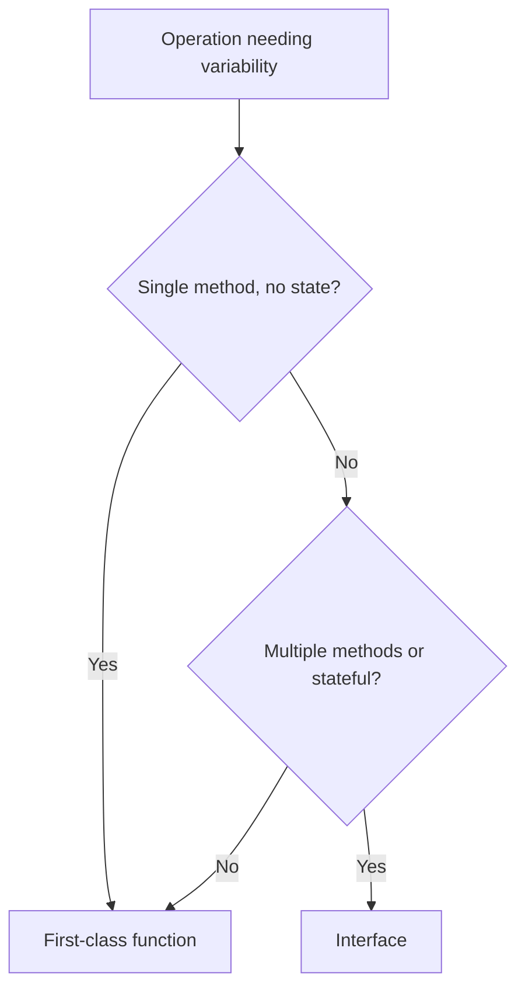

# Strategy Pattern — Junior

## 1. What the Strategy pattern actually is

You have an operation whose *core* is fixed, but one specific *step* varies. Sorting always compares-and-swaps, but the comparison rule depends on the data. Compression always reads-bytes-and-writes-bytes, but the algorithm could be gzip, zstd, or LZ4. Payment processing always validates-and-charges, but the gateway is Stripe, PayPal, or in-house.

The Strategy pattern names this: lift the varying step into its own *type* (in Go, almost always an interface or a function value), pass it as a parameter, and let the caller pick at runtime which version runs.

```go
// The varying step is sorting's comparator.
sort.Slice(users, func(i, j int) bool { return users[i].Age < users[j].Age })

// Now sort by name instead — same operation, different strategy.
sort.Slice(users, func(i, j int) bool { return users[i].Name < users[j].Name })
```

`sort.Slice` is a strategy-using function. The strategy here is the `func(i, j int) bool` you pass in. Everything else — partitioning, recursion, swapping — stays the same.

This file teaches:

1. The two Go shapes (interface vs first-class function) and when to pick which.
2. Why Strategy is *the* most common GoF pattern in Go — usually invisibly, via single-method interfaces.
3. How it differs from State, Template Method, and Command (often confused).

If you've used `io.Writer`, `http.Handler`, or `sort.Interface`, you've already used Strategy. The pattern has no name in Go because it's the default way of doing things.

---

## 2. Table of Contents

1. [What the Strategy pattern actually is](#1-what-the-strategy-pattern-actually-is)
2. [Table of Contents](#2-table-of-contents)
3. [The two Go shapes](#3-the-two-go-shapes)
4. [Minimum implementation — interface variant](#4-minimum-implementation--interface-variant)
5. [Minimum implementation — function variant](#5-minimum-implementation--function-variant)
6. [Choosing between interface and function](#6-choosing-between-interface-and-function)
7. [Strategy vs polymorphism — the same thing](#7-strategy-vs-polymorphism--the-same-thing)
8. [Strategy in the standard library](#8-strategy-in-the-standard-library)
9. [A second worked example: discount calculation](#9-a-second-worked-example-discount-calculation)
10. [Strategy vs Template Method vs State vs Command](#10-strategy-vs-template-method-vs-state-vs-command)
11. [Common mistakes a junior makes](#11-common-mistakes-a-junior-makes)
12. [Tricky points](#12-tricky-points)
13. [Quick test](#13-quick-test)
14. [Cheat sheet](#14-cheat-sheet)
15. [What to learn next](#15-what-to-learn-next)

---

## 3. The two Go shapes

The GoF book described Strategy in terms of classes and inheritance. Go has neither, but the pattern survives in two clean shapes:

| Shape | Definition | When to pick |
|-------|------------|--------------|
| **Interface** | `type Sorter interface { Sort([]int) }` | Strategy has multiple methods, or needs state, or is published across packages |
| **First-class function** | `type Less func(i, j int) bool` | Strategy is a single operation, no state, simple signature |

Both are "Strategy" in the GoF sense — a separate type whose value can be swapped at runtime. The Go community uses the function variant whenever it fits because it's less code, less indirection, and equally idiomatic.



Most "strategy" decisions in real Go code take 30 seconds: a `func` if the signature is simple, an `interface` otherwise.

---

## 4. Minimum implementation — interface variant

A payment processor that delegates the actual charge to a gateway-specific implementation.

```go
package payment

import (
    "context"
    "fmt"
)

// Gateway is the strategy. Each implementation handles one payment provider.
type Gateway interface {
    Charge(ctx context.Context, amountCents int, currency string) (chargeID string, err error)
}

// Processor uses a Gateway. The processor's logic is the same regardless of provider.
type Processor struct {
    gateway Gateway
}

func NewProcessor(g Gateway) *Processor {
    return &Processor{gateway: g}
}

func (p *Processor) Process(ctx context.Context, order Order) (string, error) {
    if order.AmountCents <= 0 {
        return "", fmt.Errorf("Process: zero/negative amount")
    }
    id, err := p.gateway.Charge(ctx, order.AmountCents, order.Currency)
    if err != nil {
        return "", fmt.Errorf("Process: %w", err)
    }
    // ... post-charge bookkeeping, the same for every gateway ...
    return id, nil
}

// Two concrete strategies:

type StripeGateway struct{ apiKey string }

func (s *StripeGateway) Charge(ctx context.Context, amount int, ccy string) (string, error) {
    // call Stripe's API
    return "stripe_ch_123", nil
}

type PayPalGateway struct{ clientID, secret string }

func (p *PayPalGateway) Charge(ctx context.Context, amount int, ccy string) (string, error) {
    // call PayPal's API
    return "pp_xyz", nil
}
```

Usage:

```go
p1 := payment.NewProcessor(&payment.StripeGateway{apiKey: "..."})
id, err := p1.Process(ctx, order)

p2 := payment.NewProcessor(&payment.PayPalGateway{clientID: "...", secret: "..."})
id2, err := p2.Process(ctx, order)
```

The `Processor.Process` logic is identical in both cases. Only the gateway differs. That's Strategy.

### What makes this idiomatic Go

- The interface (`Gateway`) is *small* — one method. Go's culture is "small interfaces". A `Charge` method is enough; don't preemptively add `Refund`, `Capture`, etc. unless the processor actually uses them.
- The interface is declared *where it's used* (the `payment` package), not where the implementations live. Stripe and PayPal SDKs don't import `payment`; they just happen to satisfy the interface.
- Concrete types are exported (`StripeGateway`) but the consumer types accept the interface. Accept interfaces, return concrete types.

---

## 5. Minimum implementation — function variant

Same problem with a single-method interface, written as a function instead.

```go
package payment

import (
    "context"
    "fmt"
)

// ChargeFunc is the strategy as a function value.
type ChargeFunc func(ctx context.Context, amountCents int, currency string) (string, error)

type Processor struct {
    charge ChargeFunc
}

func NewProcessor(c ChargeFunc) *Processor { return &Processor{charge: c} }

func (p *Processor) Process(ctx context.Context, order Order) (string, error) {
    if order.AmountCents <= 0 {
        return "", fmt.Errorf("Process: zero/negative amount")
    }
    return p.charge(ctx, order.AmountCents, order.Currency)
}
```

Strategy values are now just functions:

```go
stripeCharge := func(ctx context.Context, amount int, ccy string) (string, error) {
    // call Stripe
    return "stripe_ch_123", nil
}

p := payment.NewProcessor(stripeCharge)
id, _ := p.Process(ctx, order)
```

Or via a closure that captures configuration:

```go
func NewStripeCharge(apiKey string) payment.ChargeFunc {
    return func(ctx context.Context, amount int, ccy string) (string, error) {
        // use apiKey to call Stripe
        return "stripe_ch_123", nil
    }
}

p := payment.NewProcessor(NewStripeCharge("sk_test_..."))
```

This is shorter than the interface variant. No type declarations for each gateway, no method receiver boilerplate. The closure captures the API key the same way the `StripeGateway` struct held it.

### When the function variant is enough

If your strategy is *one operation* with a *fixed signature*, the function variant is almost always shorter and clearer. The interface variant earns its keep when:

- The strategy has multiple operations (e.g., `Charge` + `Refund` + `Capture`).
- The strategy needs to expose state or introspection (e.g., "give me the gateway name").
- You expect downstream packages to define many implementations, and a named interface improves documentation and IDE navigation.

For a single function with a clean signature, just use the function.

---

## 6. Choosing between interface and function

A more concrete decision table than §3.

| Signal | Lean toward |
|--------|-------------|
| One method, fixed args | Function |
| Implementation needs config that varies per instance | Either (closure captures config; struct holds config) |
| Two or more related methods | Interface |
| The strategy *is* a value with identity (e.g., the gateway has a Name(), an ID()) | Interface |
| Callers want to mock for tests | Either — both mock easily |
| Hot path with millions of calls | Function (one fewer interface dispatch) |
| External authors will write implementations | Interface (documented contract, easier to discover) |
| The strategy may need to evolve to multiple methods | Interface (so adding a method doesn't break the contract type) |

Don't over-think this. Most real codebases mix both shapes and that's fine — pick what reads best at the call site.

---

## 7. Strategy vs polymorphism — the same thing

In a Java or C++ textbook, "Strategy" is a named pattern: an interface, several implementing classes, a context object that holds a reference and delegates. In Go, the same thing happens any time you accept an interface and call its method. There's no separate "Strategy" file or naming convention — it's just *how Go works*.

```go
// This is Strategy. There's no need to label it.
func WriteAll(w io.Writer, data []byte) error {
    _, err := w.Write(data)
    return err
}
```

The `io.Writer` is the strategy interface. `*os.File`, `*bytes.Buffer`, `*gzip.Writer` are concrete strategies. `WriteAll` is the context. The pattern is in the bones of the standard library.

Knowing the name is useful when:

- Reading non-Go code and translating concepts (a Java codebase's `XxxStrategy` interface is almost always Go's `Xxx` interface).
- Discussing design with developers from non-Go backgrounds.
- Recognising when a piece of Go code is *implementing* Strategy and could be simplified by using a `func` type instead.

But you don't need to *name* anything Strategy in Go code. Naming an interface `PaymentStrategy` is a smell — name it `Gateway` (or `Charger`, or just `Payment`).

---

## 8. Strategy in the standard library

You've used Strategy hundreds of times in stdlib without thinking about it:

| Where | Strategy type | What varies |
|-------|---------------|-------------|
| `sort.Slice` / `sort.Sort` | `func(i, j int) bool` / `sort.Interface` | Comparison rule |
| `io.Copy` | `io.Reader` and `io.Writer` | Source and destination |
| `http.Handle` | `http.Handler` (interface) or `http.HandlerFunc` (function) | Request handling |
| `json.Marshaler` / `json.Unmarshaler` | Interface | Custom serialization |
| `flag.Var` | `flag.Value` interface | Custom flag parsing |
| `errors.Is` / `errors.As` | Sentinel error or target | Error matching |
| `runtime.SetFinalizer` | `interface{}` plus finalizer func | Cleanup behaviour |
| `template.Funcs` | `template.FuncMap` (map of strategies) | Template function calls |

Look at `http.HandlerFunc`:

```go
// from net/http
type Handler interface {
    ServeHTTP(ResponseWriter, *Request)
}

type HandlerFunc func(ResponseWriter, *Request)

func (f HandlerFunc) ServeHTTP(w ResponseWriter, r *Request) {
    f(w, r)
}
```

That's the trick for getting "interface or function" at the same call site: define both. `HandlerFunc` is a type with a method that satisfies `Handler`, but instances of `HandlerFunc` are just functions. Callers can pass either:

```go
http.Handle("/api", &MyHandler{})                       // interface form
http.Handle("/api", http.HandlerFunc(handleAPI))        // function form
http.HandleFunc("/api", handleAPI)                      // shortcut
```

This is *the* canonical Go strategy idiom. We come back to it in detail in `middle.md` §6.

---

## 9. A second worked example: discount calculation

A checkout that supports different discount strategies — flat off, percentage, BOGO.

```go
package checkout

// Discount is the strategy.
type Discount interface {
    Apply(subtotalCents int) (discountCents int)
}

type Cart struct {
    items     []Item
    discounts []Discount
}

func (c *Cart) Total() int {
    sub := c.subtotal()
    var total = sub
    for _, d := range c.discounts {
        total -= d.Apply(total) // each discount applies to the running total
    }
    if total < 0 {
        total = 0
    }
    return total
}

func (c *Cart) subtotal() int {
    sub := 0
    for _, it := range c.items {
        sub += it.PriceCents * it.Quantity
    }
    return sub
}

// Three concrete strategies:

type FlatDiscount struct{ AmountCents int }

func (d FlatDiscount) Apply(_ int) int { return d.AmountCents }

type PercentDiscount struct{ Percent float64 }

func (d PercentDiscount) Apply(subtotal int) int {
    return int(float64(subtotal) * d.Percent / 100)
}

type CodeDiscount struct {
    Code        string
    AmountCents int
}

func (d CodeDiscount) Apply(_ int) int { return d.AmountCents }
```

Usage:

```go
cart := &Cart{
    items: []Item{{PriceCents: 1000, Quantity: 2}},
    discounts: []Discount{
        PercentDiscount{Percent: 10},  // 10% off
        FlatDiscount{AmountCents: 100}, // then $1 off
    },
}
fmt.Println(cart.Total()) // 1700: 2000 - 200 (10%) - 100 (flat)
```

Three things to notice:

1. **The cart doesn't know about discount types.** Adding a new discount means writing a new struct that implements `Discount`. The cart's code doesn't change.
2. **Discounts compose.** A `[]Discount` is a list of strategies applied in order. We didn't need a "composite discount" type; the slice is the composition.
3. **Each discount is small.** `FlatDiscount{AmountCents: 100}` is the entire strategy. No constructor, no setup. That's what good Go strategies look like.

---

## 10. Strategy vs Template Method vs State vs Command

Four GoF patterns that beginners mix up. The differences matter once you've seen each in practice.

### Strategy

```
Operation [varies in one step] = swappable strategy
```

The *whole step* is replaced. Caller chooses which implementation runs.

### Template Method

```
Operation [has a fixed skeleton, varying sub-steps] = inherited subclasses fill in sub-steps
```

In Go, Template Method is rare because we don't have inheritance. The closest equivalent is a struct with several function fields the caller sets:

```go
type Sorter struct {
    Less    func(a, b Item) bool
    OnSwap  func(i, j int)   // optional hook
    OnFinal func([]Item)     // optional hook
}
```

But this is *just* multiple strategies in one struct. Go doesn't really separate Template Method from Strategy.

### State

```
Operation [behaves differently based on the object's current state]
```

State is Strategy *plus* the rule that the strategy changes itself. A traffic light's `Tick()` advances to the next state; a TCP connection's `Read()` behaves differently when in `Closed` vs `Established`. The strategy *is* the state; transitions are part of the pattern.

We cover State separately in `../14-state-pattern/`.

### Command

```
Operation [captured as an object that can be queued, logged, undone]
```

Command bundles a function and its parameters into a value you can store. Strategy is a function; Command is a function-with-args ready to execute later. Command is about *when* an operation runs; Strategy is about *which* operation runs.

```go
// Command — encapsulates the call
type Cmd interface { Execute() error }
type SendEmailCmd struct{ To, Subject string }
func (c SendEmailCmd) Execute() error { /* sends */ }

queue := []Cmd{SendEmailCmd{To: "alice@..."}, SendEmailCmd{To: "bob@..."}}
for _, c := range queue { c.Execute() }
```

We cover Command in `../13-command-pattern/`.

### Decision table

| You need to… | Pattern |
|--------------|---------|
| Swap one step of an algorithm | Strategy |
| Define a skeleton with overridable sub-steps | Template Method |
| Change behaviour based on internal state | State |
| Encapsulate a call (with args) as a queueable object | Command |

In Go, Strategy is the default. The others are special cases.

---

## 11. Common mistakes a junior makes

### 11.1 Naming the interface "XxxStrategy"

```go
// Smell
type PaymentStrategy interface { Charge(...) }

// Idiomatic
type Gateway interface { Charge(...) }
```

In Go, the *role* the interface plays is its name. `io.Reader` is "something to read from", not "ReaderStrategy". `Gateway` says what the thing *is*; `PaymentStrategy` says what *pattern* it implements (and the caller doesn't care).

### 11.2 Designing a big interface upfront

```go
// Anti-idiom
type Gateway interface {
    Charge(...) error
    Refund(...) error
    Capture(...) error
    Authorize(...) error
    GetTransaction(...) error
    ListTransactions(...) error
    /* 8 more methods */
}
```

Now every gateway implementation must implement 8 methods, even if your processor only ever calls `Charge`. Start with the methods you actually use. Add to the interface when a real caller needs it.

```go
// Better
type Charger interface { Charge(...) error }
type Refunder interface { Refund(...) error }

// Implementations may satisfy one or both, depending on capability
```

This is *interface segregation* — Go's most under-appreciated principle.

### 11.3 Returning the strategy interface from a constructor

```go
// Anti-idiom
func NewStripeGateway(...) Gateway { return &StripeGateway{} }

// Idiomatic
func NewStripeGateway(...) *StripeGateway { return &StripeGateway{} }
```

The constructor returns the concrete type. The consumer (the `Processor`) accepts the interface. This way, callers can use Stripe-specific methods (`StripeGateway.SetWebhookSecret(...)`) without type assertions, and still pass the same instance into anything expecting a `Gateway`.

### 11.4 Mixing function and interface forms inconsistently

```go
// Anti-idiom — accept a function in one place, an interface in another, for the same role
func ProcessOne(g Gateway, o Order) error { /* ... */ }
func ProcessAll(c ChargeFunc, os []Order) error { /* ... */ }
```

The caller now juggles two adapters. Pick one shape per role. If you genuinely need both, define both *and* the adapter (like `http.HandlerFunc`).

---

## 12. Tricky points

### 12.1 nil strategy

```go
p := NewProcessor(nil) // gateway is nil
p.Process(ctx, order)  // panics in p.gateway.Charge(...)
```

Constructors should either reject nil or provide a default. Most production code rejects:

```go
func NewProcessor(g Gateway) (*Processor, error) {
    if g == nil {
        return nil, errors.New("NewProcessor: gateway is nil")
    }
    return &Processor{gateway: g}, nil
}
```

### 12.2 The "interface vs `*T`" trap

```go
var g Gateway = &StripeGateway{}
if g == nil { fmt.Println("nil") } // doesn't print, even if the concrete pointer is nil

var sg *StripeGateway      // nil pointer
g = sg                     // interface holding a (nil, *StripeGateway) pair
if g == nil { /* won't fire */ }
g.Charge(ctx, 100, "USD")  // nil pointer dereference in the method body
```

An interface is `(type, value)`. Assigning a typed nil to an interface gives you a non-nil interface that wraps a nil. Test interfaces with care; we cover the rules in `middle.md` §10.

### 12.3 Closure capture in a loop

```go
gateways := []string{"stripe", "paypal", "square"}
processors := make([]*Processor, 0, len(gateways))
for _, g := range gateways {
    processors = append(processors, NewProcessor(func() ChargeFunc {
        // before Go 1.22: the closure captures the *variable* `g`,
        // so every closure sees the last value ("square")
        return func(ctx context.Context, a int, c string) (string, error) {
            return g + "_ch", nil
        }
    }()))
}
```

In Go 1.22+ the `for` loop variable is per-iteration, so this works. In Go 1.21 and earlier, you had to manually rebind: `g := g`. Worth knowing because plenty of pre-1.22 codebases still exist.

### 12.4 Strategy with side effects in the constructor

```go
// Anti-idiom
type StripeGateway struct{ client *http.Client }

func NewStripeGateway(apiKey string) *StripeGateway {
    sg := &StripeGateway{client: &http.Client{}}
    sg.checkAuth(apiKey) // blocking network call in constructor
    return sg
}
```

Constructors that do I/O are surprising. They block, they can fail, and tests have to stub the network. Defer the work to first use or to an explicit `Start(ctx)` method.

---

## 13. Quick test

**Q1.** Which is more idiomatic Go?

```go
type SortStrategy interface { Sort([]int) }

vs

type Sorter interface { Sort([]int) }
```

<details><summary>Answer</summary>

`Sorter`. The Go convention names the interface after the *role* (what it does), not the pattern it implements. `io.Reader` not `ReaderStrategy`. `http.Handler` not `HandlerStrategy`.
</details>

**Q2.** What's wrong here?

```go
type Gateway interface {
    Charge(ctx context.Context, amount int) error
    Refund(ctx context.Context, id string) error
    Cancel(ctx context.Context, id string) error
    GetStatus(ctx context.Context, id string) (string, error)
    GetTransactions(ctx context.Context) ([]Transaction, error)
}

func (p *Processor) Process(o Order) error {
    _, err := p.gateway.Charge(context.Background(), o.AmountCents)
    return err
}
```

<details><summary>Answer</summary>

The `Processor` only calls `Charge`. The interface is too wide — every implementor has to support five methods even though the processor uses one. Split it:

```go
type Charger interface { Charge(ctx context.Context, amount int) error }
```

This is *interface segregation*. Strategies should be the minimum surface the consumer needs.
</details>

**Q3.** Function or interface — which would you use?

```
A CSV reader where you can plug in different delimiter rules: comma, tab, semicolon, custom.
```

<details><summary>Answer</summary>

Function — a `Delimiter func(rune) bool` (returns true if the rune is a delimiter). It's one operation, fixed signature, no state. The interface variant would be needless ceremony.

If the rule grew to "handle quoted fields, escapes, multi-line strings" — multiple operations — an interface makes more sense. Start with the function; promote to interface when complexity demands it.
</details>

---

## 14. Cheat sheet

| What | How |
|------|-----|
| Single-method, simple signature | `type X func(args) result` |
| Multi-method strategy | `type X interface { Method1(...); Method2(...) }` |
| Naming | After the role (`Reader`, `Gateway`), not the pattern (`ReaderStrategy`) |
| Interface size | Smallest that satisfies the consumer; segregate when consumers diverge |
| Interface location | Same package as the consumer, not the implementation |
| Constructor return type | Concrete type for implementations, interface for consumer parameters |
| Default strategy | Provide one (constructor sets it if nil), or reject nil with error |
| Combining strategies | `[]Strategy` and a loop — no "composite strategy" type needed |
| Adapter between forms | `type FuncStrategy func(...) result` with a method that implements the interface (see `http.HandlerFunc`) |

---

## 15. What to learn next

In order:

1. **[middle.md](middle.md)** — Strategy registries, named strategy lookup, dynamic dispatch costs, the `func + interface` adapter trick, strategy composition, testability and mocking strategies, generic strategies.
2. **[../04-decorator-pattern/](../04-decorator-pattern/)** — When you wrap a strategy with cross-cutting concerns (logging, retries, caching). Decorator wraps Strategy.
3. **[../01-functional-options/](../01-functional-options/)** — Options for *configuring* a thing; Strategy for *replacing one step* of a thing. Related, distinct.

Strategy is the most useful and the most invisible pattern in Go. Recognising it makes you write smaller interfaces and resist the urge to declare types like `PaymentStrategy`. Once it's internalised, you'll see it everywhere — and that's the right way to feel about it.
