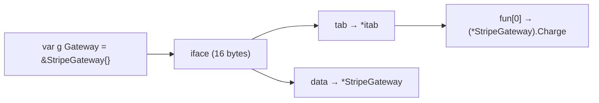
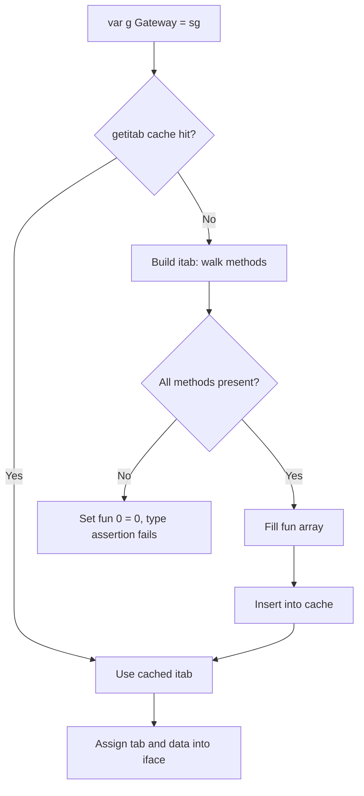
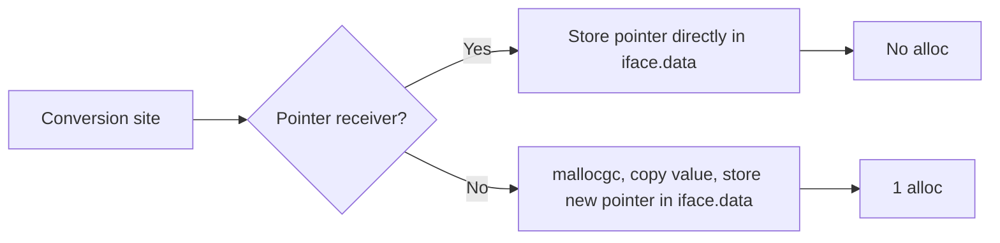

# Strategy Pattern — Under the Hood

## 1. The runtime framing

Junior taught the shape; middle taught the design judgement. This file is about what the compiler and runtime actually do when a strategy is called. The two source-level shapes — interface and function — produce two very different machine-level shapes. Reading an interface call is a two-load sequence followed by an indirect `CALL`. Reading a function value is a one-load sequence followed by an indirect `CALL`. The shapes look similar; the underlying data structures and optimisation opportunities are not.

The compiler's view of `processor.gateway.Charge(...)` is not "call the Charge method on the gateway". It is: load the interface header, load the itab, load the method slot, indirect-call through that slot. Each step is real machine code; each step has a cost. The job at this level is to be precise about which loads happen, when the compiler can prove the concrete type and skip the indirect call (devirtualization), when the interface value lives on the stack vs the heap, and what the runtime helpers (`runtime.convI2I`, `runtime.assertI2I`, `runtime.getitab`) actually do.

We work in Go 1.22 / amd64 unless otherwise noted. References to the standard library and the runtime are against the `go1.22.x` source tree, with paths like `src/runtime/runtime2.go` (for `iface` / `eface`), `src/runtime/iface.go` (for itab construction and the conversion helpers), and `src/cmd/compile/internal/walk/convert.go` (for the IR-to-runtime-call lowering).

The questions we answer:

- What does the `iface` runtime struct look like and how is it built?
- What is in an itab? When is it built? Where is it cached?
- What does an interface method call look like in amd64 assembly?
- Why can't the inliner cross most interface calls? When does PGO devirtualize them in Go 1.21+?
- When does converting `*T` to an interface escape to the heap? When does the interface stay on the stack?
- What exactly is a typed nil at the byte level, and why does `g == nil` lie?
- What do `runtime.convI2I`, `runtime.convT2I`, and friends actually do?
- How do generic strategies (`Strategy[T]`) compile via GCShape stenciling vs an interface?
- How does the closure-vs-interface choice compile differently? What's in a `funcval` and what's in an `iface`?
- How are method tables built for embedded structs?
- How do you profile interface dispatch with `-benchmem` and pprof?
- A side-by-side disassembly: direct call, function-strategy call, interface-strategy call.
- What does a slice of interfaces look like in memory?

---

## 2. Table of Contents

1. [The runtime framing](#1-the-runtime-framing)
2. [Table of Contents](#2-table-of-contents)
3. [The interface representation — `iface` and `eface`](#3-the-interface-representation--iface-and-eface)
4. [The itab — structure, construction, cache](#4-the-itab--structure-construction-cache)
5. [Interface method dispatch in amd64 assembly](#5-interface-method-dispatch-in-amd64-assembly)
6. [The typed-nil trap at the byte level](#6-the-typed-nil-trap-at-the-byte-level)
7. [`convI2I`, `convT2I`, and the conversion helpers](#7-convi2i-convt2i-and-the-conversion-helpers)
8. [Escape analysis on strategy values](#8-escape-analysis-on-strategy-values)
9. [Inlining and interface calls — why the wall](#9-inlining-and-interface-calls--why-the-wall)
10. [Devirtualization and PGO in Go 1.21+](#10-devirtualization-and-pgo-in-go-121)
11. [Closure-vs-interface — the `funcval` struct](#11-closure-vs-interface--the-funcval-struct)
12. [Generic strategies — GCShape stenciling vs interfaces](#12-generic-strategies--gcshape-stenciling-vs-interfaces)
13. [Method tables for embedded structs](#13-method-tables-for-embedded-structs)
14. [Slice-of-interfaces memory layout](#14-slice-of-interfaces-memory-layout)
15. [Side-by-side disassembly](#15-side-by-side-disassembly)
16. [Benchmarks and pprof](#16-benchmarks-and-pprof)
17. [Reading the Go source](#17-reading-the-go-source)
18. [Edge cases at the lowest level](#18-edge-cases-at-the-lowest-level)
19. [Test](#19-test)
20. [Tricky questions](#20-tricky-questions)
21. [Summary](#21-summary)
22. [Further reading](#22-further-reading)

---

## 3. The interface representation — `iface` and `eface`

Every interface value in Go is exactly two machine words. The two-word layout is non-negotiable; it's baked into the language ABI and the runtime. Which two words depends on whether the interface has methods.

### 3.1 `eface` — empty interface (`interface{}` / `any`)

Defined in `src/runtime/runtime2.go`:

```go
type eface struct {
    _type *_type
    data  unsafe.Pointer
}
```

Two words: a pointer to a type descriptor (`*_type`), and a pointer to the value's data. The `_type` describes the concrete type (size, alignment, GC bitmap, kind, etc. — see §17). The `data` is a pointer to the value, *or* the value itself if it fits in a word (Go used to inline small values; since Go 1.4 the runtime always stores a pointer for non-trivial types and the optimisation was scaled back).

For `var x any = 42`:

```
eface {
    _type: &runtime.types.int        // describes int
    data:  *int → [the heap value 42]
}
```

The `42` is heap-allocated when you do `var x any = 42`. We'll see why in §8.

### 3.2 `iface` — interface with methods

Defined in `src/runtime/runtime2.go`:

```go
type iface struct {
    tab  *itab
    data unsafe.Pointer
}
```

Two words again, but the first word is an `*itab` — not a `*_type`. The itab is the type-plus-interface descriptor that holds the method table (see §4). For a `Gateway` interface holding a `*StripeGateway`:

```
iface {
    tab:  *itab for (Gateway, *StripeGateway)
    data: *StripeGateway → [the StripeGateway struct]
}
```

The choice between `eface` and `iface` is determined at compile time by the interface type. `interface{}` uses `eface`; any interface with at least one method uses `iface`. The runtime helpers are different for each (`convT2E` for empty interfaces, `convT2I` for non-empty, etc.).

### 3.3 Visual layout

```
                  iface (16 bytes on amd64)
                  ┌───────────────────────┐
                  │    *itab (8 bytes)    │
                  ├───────────────────────┤
                  │    *data (8 bytes)    │
                  └───────────────────────┘
                       │            │
                       │            └──→ pointed-to value (heap or stack)
                       ↓
                  itab
                  ┌─────────────────────────────┐
                  │ inter      *interfacetype   │  describes the interface (Gateway)
                  │ _type      *_type           │  describes the concrete (*StripeGateway)
                  │ hash       uint32           │  copy of _type.hash for fast type switches
                  │ _          [4]byte          │
                  │ fun        [N]uintptr       │  method table: function pointers, one per method
                  └─────────────────────────────┘
```

The `fun` array is the *method table*. For each method declared on the interface, in source order, the corresponding entry is the address of the concrete type's implementation. For `Gateway` with one method `Charge`, `fun[0]` is the address of `(*StripeGateway).Charge`.

### 3.4 The 16-byte cost

Every interface value is 16 bytes. Every variable of interface type, every slice element of interface type, every map value of interface type takes 16 bytes — twice the size of a plain pointer. For a `[]Charger` of a million elements, that's 16 MB of interface headers alone (plus the data they point to). Compare to `[]*StripeGateway` at 8 MB. The interface overhead is one extra word per element — sometimes invisible, sometimes the main reason a data structure is slower than expected.



---

## 4. The itab — structure, construction, cache

The itab is the runtime's mechanism for resolving "which method address corresponds to this interface call". It is built once per (interface, concrete type) pair and cached forever.

### 4.1 Structure

From `src/runtime/runtime2.go`:

```go
type itab struct {
    inter *interfacetype
    _type *_type
    hash  uint32 // copy of _type.hash. Used for type switches.
    _     [4]byte
    fun   [1]uintptr // variable-sized. fun[0]==0 means _type does not implement inter.
}
```

Five fields, but `fun` is variable-length — `[1]uintptr` is a placeholder; the actual allocation is sized to hold one `uintptr` per interface method, plus the leading metadata. For an interface with three methods, the itab is `sizeof(inter) + sizeof(_type) + sizeof(hash) + 4 + 3*8 = 32 + 24 = 56 bytes` on amd64. (Approximately; exact size depends on alignment.)

- `inter` describes the interface (`Gateway`): its name, package, and method signatures.
- `_type` describes the concrete type (`*StripeGateway`): size, alignment, GC bitmap, method set.
- `hash` is a cached copy of `_type.hash` for fast type-switch dispatch.
- `fun` is the method table: function pointers, one per interface method, in the order the interface declares them.

If the concrete type does not implement the interface, the runtime stores `0` in `fun[0]`. This sentinel is checked when the itab is fetched; a 0 entry means "type assertion fails".

### 4.2 Construction

The itab is built by `runtime.getitab` (`src/runtime/iface.go`):

```go
func getitab(inter *interfacetype, typ *_type, canfail bool) *itab {
    // 1. Look up in the global itab cache (hash table)
    // 2. If found, return it
    // 3. If not, allocate a fresh itab and walk inter.methods and typ.methods
    //    in tandem to fill fun[]
    // 4. Store in the cache for future lookups
}
```

The walk in step 3 is a merge: `inter.methods` is sorted, `typ.methods` is sorted, and the algorithm walks both in lockstep. For each method on the interface, find the matching method on the concrete type (by name and signature). If any interface method is missing, set `fun[0] = 0` and return (failure). Otherwise fill `fun[i]` with the address of the concrete method.

The walk is O(M + N) where M is the number of interface methods and N is the number of concrete-type methods. For most strategies (interface with 1-3 methods, concrete type with 1-10 methods), this is a handful of comparisons. The cost is paid once — subsequent calls hit the cache.

### 4.3 Itab cache

`runtime.itabTable` (in `src/runtime/iface.go`) is a power-of-two open-addressing hash table indexed by (interface pointer, type pointer) pairs. The hash is computed from the two pointers; collisions probe linearly. The table is grown when it gets full.

Lookups go through `runtime.itabHashFunc`:

```go
func itabHashFunc(inter *interfacetype, typ *_type) uintptr {
    return uintptr(inter.typ.hash ^ typ.hash)
}
```

XOR of the interface's type hash and the concrete type's hash. Cheap. The runtime makes the table large enough that lookups are O(1) average; collisions are rare.

The first time you convert a `*StripeGateway` to `Gateway`, `runtime.getitab` builds the itab and caches it. Subsequent conversions are a hash-table lookup — no allocation, just a load and a few comparisons. For long-running processes, almost all itab lookups are cache hits.

### 4.4 Diagram of the cache flow



### 4.5 What happens for the empty interface

`eface` has no itab — just a `*_type`. There's no method table because the empty interface has no methods. Conversion to `eface` is correspondingly cheaper: just take the `*_type` of the concrete type (a compile-time constant address) and the data pointer. No cache lookup, no itab construction. This is one reason `interface{}` / `any` is slightly cheaper for storage than a non-empty interface — even though both are 16 bytes.

---

## 5. Interface method dispatch in amd64 assembly

A direct method call:

```go
sg.Charge(ctx, 100, "USD")  // sg is *StripeGateway, statically known
```

Compiles to:

```asm
CALL    "".(*StripeGateway).Charge(SB)
```

One instruction. The call target is resolved at link time; the CPU branch predictor knows the target address.

An interface method call:

```go
g.Charge(ctx, 100, "USD")  // g is Gateway interface
```

Compiles to (paraphrased; actual assembly varies by Go version):

```asm
; g is in (AX, BX) — tab in AX, data in BX (the iface header)
MOVQ    24(AX), CX        ; CX = g.tab.fun[0]  (offset 24 = inter+_type+hash+pad)
MOVQ    BX, AX            ; receiver = g.data (move into AX, the receiver register)
; argument setup for ctx, 100, "USD" in DI, SI, R8, R9, etc.
CALL    CX                ; indirect call through CX
```

Three instructions instead of one. The two extra loads are:

1. Load the itab's `fun[0]` slot into a register.
2. Move the data pointer into the receiver register.

Then an indirect `CALL` through the loaded function pointer.

### 5.1 The latency cost

On amd64, the indirect call has two sources of cost:

- **The two extra loads** (~1-2 cycles each, often L1 hits since the iface header was just used).
- **The branch prediction.** Modern CPUs have indirect branch predictors that learn target patterns. For a monomorphic call site (always the same concrete type), prediction is perfect after warmup. For a polymorphic site (alternating between two concrete types), prediction is good. For a megamorphic site (many different types), prediction degrades and you pay 10-20 cycles for mispredicts.

Typical numbers from benchmarks:

```
BenchmarkDirectCall-8           1000000000   0.85 ns/op    0 B/op
BenchmarkInterfaceCall-8         700000000   1.62 ns/op    0 B/op
BenchmarkMegamorphic-8           300000000   3.45 ns/op    0 B/op
```

The interface call adds ~0.8 ns per call when the site is monomorphic. A megamorphic site (many different concrete types) doubles or triples that.

### 5.2 The full sequence with comments

For a real chain `processor.gateway.Charge(ctx, 100, "USD")` where `processor` is a `*Processor` and `gateway` is the `Gateway` interface field:

```asm
; processor is in AX
MOVQ    8(AX), CX         ; CX = processor.gateway.tab
MOVQ    16(AX), AX        ; AX = processor.gateway.data
MOVQ    24(CX), CX        ; CX = tab.fun[0] (the Charge method)
; argument setup
MOVQ    "".ctx(SP), DI
MOVQ    $100, SI
LEAQ    "".usd(SP), R8
MOVQ    $3, R9
CALL    CX                ; indirect call
```

Five loads (three from the iface, one fun slot, plus argument setup), one call. Versus the direct version's one call. The extra cost is unavoidable when the concrete type isn't known statically.

### 5.3 Why the fun array isn't just one pointer per method

You might ask: why is `fun` indexed by method position rather than method name? Because indexing by position is O(1) at runtime. The compiler emits `MOVQ 24+8*i(tab), CX` where `i` is the method's static index in the interface declaration. No string comparison, no hash table — just an offset into the itab.

The cost is paid at itab-construction time (`getitab` walks both method lists to fill `fun`). At call time, the dispatch is a constant-offset load. This is the same trick C++ virtual tables use — and for the same reason.

---

## 6. The typed-nil trap at the byte level

Middle §10 introduced the typed-nil trap as a logical bug. At the byte level it becomes obvious.

```go
type Charger interface { Charge() error }
type StripeGateway struct{}
func (s *StripeGateway) Charge() error { return nil }

func main() {
    var sg *StripeGateway  // nil
    var c Charger = sg
    fmt.Println(c == nil)  // false — surprising
}
```

What's in `c` at the byte level?

```
c (iface, 16 bytes):
    tab:  *itab for (Charger, *StripeGateway)   ← NON-NULL
    data: 0x0000000000000000                    ← NULL
```

The `tab` is non-nil because we assigned a value of `*StripeGateway` type to `c`. The runtime called `runtime.convT2I` (see §7) to build the iface: it looked up the itab for (Charger, *StripeGateway) — which is a non-nil cached pointer — and stored that in `c.tab`. The `data` is nil because `sg` is nil.

The expression `c == nil` compares the iface to a typeless nil interface. A typeless nil iface has both fields zero:

```
typeless nil iface:
    tab:  0x0000000000000000
    data: 0x0000000000000000
```

The compiler emits a comparison that checks *both fields*: equality requires both `tab == 0` AND `data == 0`. Our `c` has `tab != 0`. The comparison is false.

This is the typed-nil trap reduced to bytes. The interface is not "logically nil" because the type slot is filled; you assigned a typed value (even if its pointer was nil). The runtime has no way to know you meant "no value" — you gave it a value of type `*StripeGateway` that happened to be nil.

### 6.1 The dispatch on a typed-nil

```go
c.Charge()
```

Compiles to:

```asm
MOVQ    "".c+0(SP), AX        ; AX = c.tab
MOVQ    "".c+8(SP), BX        ; BX = c.data (which is 0)
MOVQ    24(AX), CX            ; CX = c.tab.fun[0] (valid — the address of Charge)
MOVQ    BX, AX                ; receiver = 0
CALL    CX                    ; calls (*StripeGateway).Charge with nil receiver
```

The call *succeeds* — the runtime doesn't check for nil receivers before calling. The function body runs with `s = nil`. If `Charge`'s body dereferences `s` (e.g., `s.apiKey`), you get a panic at *that* dereference, not at the call. If `Charge` doesn't dereference (e.g., it just returns an error), it returns normally with `s = nil`.

This is why the trap is so insidious: the call doesn't always panic. A method that happens not to dereference works fine on a nil receiver. The next method might dereference. You can ship a typed-nil bug that takes months to trigger.

### 6.2 Returning a typed-nil from a function

```go
func newCharger(use bool) Charger {
    var sg *StripeGateway
    if use { sg = &StripeGateway{} }
    return sg  // ← bug: returns typed-nil iface when use==false
}
```

The return value at the byte level when `use == false`:

```
return value (iface):
    tab:  *itab for (Charger, *StripeGateway)
    data: 0x0
```

The compiler generates a `runtime.convT2I` call to box `sg` into a `Charger`. Even though `sg` is nil, the conversion produces an iface with a non-nil tab.

The fix is to return a typeless nil:

```go
func newCharger(use bool) Charger {
    if !use { return nil }
    return &StripeGateway{}
}
```

When you `return nil`, the compiler emits a literal `(0, 0)` iface — both fields zero. Callers can `if c == nil` and get the right answer.

### 6.3 The compiler's view

In `src/cmd/compile/internal/walk/convert.go`, the function `walkConvInterface` lowers an interface conversion. For a literal nil source, it emits a zero-valued iface directly. For a non-nil source (even a typed-nil pointer), it emits a call to `runtime.convT2I` or `runtime.convT2Inoptr` (see §7). The compiler doesn't peek through the source to ask "is this typed-nil?"; it just sees "convert this `*T` to an interface" and emits the conversion.

This is why the trap exists: the compiler cannot statically prove `sg` is nil; the conversion path must work for any value. The runtime cooperates by faithfully boxing whatever it gets, including nil pointers.

---

## 7. `convI2I`, `convT2I`, and the conversion helpers

Whenever you convert a concrete value (or another interface) to an interface, the compiler emits a call to one of a family of runtime helpers. The full list lives in `src/runtime/iface.go`.

### 7.1 The helper family

| Helper | Use case | What it does |
|--------|----------|--------------|
| `convT2E` | `interface{}` ← non-pointer concrete value | Allocate space for value, copy, build eface |
| `convT2Enoptr` | `interface{}` ← non-pointer scalar (no GC pointers) | Same as above but uses a non-pointer allocator path |
| `convT2I` | `interface{X}` ← non-pointer concrete value | Allocate, copy, fetch itab, build iface |
| `convT2Inoptr` | `interface{X}` ← non-pointer scalar | Same, non-pointer alloc path |
| `convI2I` | `interface{Y}` ← `interface{X}` (Y ⊆ X) | Look up new itab, copy data pointer |
| `assertI2I` | `x, ok := iface.(I)` | Type assertion |
| `assertE2I` | `x, ok := empty.(I)` | Type assertion from eface |

The "noptr" variants exist because Go's allocator has two fast paths: one for objects containing pointers (which need GC bitmap setup) and one for pointer-free objects (which can skip GC bookkeeping). For a strategy holding a `*StripeGateway`, the conversion *to* the interface uses the pointer path; the data inside the interface *is* a pointer.

### 7.2 The pointer-receiver optimisation

A critical detail: when the concrete type is a *pointer* type (e.g., `*StripeGateway`), the runtime *doesn't allocate*. The pointer itself is the data; the iface's `data` field is set directly to the pointer value:

```go
// Approximate body of conversion for pointer-receiver types
func convT2I_ptr(tab *itab, elem unsafe.Pointer) (i iface) {
    i.tab = tab
    i.data = elem  // just store the pointer
    return
}
```

No `mallocgc`. The pointer is already valid; the iface wraps it.

For value-receiver types, allocation is required. The value must live somewhere the iface's data pointer can point to:

```go
// For value-receiver: must allocate
func convT2I(tab *itab, elem unsafe.Pointer) (i iface) {
    t := tab._type
    x := mallocgc(t.size, t, true)  // allocate for the value
    typedmemmove(t, x, elem)         // copy
    i.tab = tab
    i.data = x
    return
}
```

This is the source of the "value vs pointer receiver" allocation difference. A value-receiver strategy is one heap allocation per conversion; a pointer-receiver strategy is zero.



### 7.3 `convI2I` — interface-to-interface

Converting between interfaces is cheap when the target interface's methods are a subset of the source's:

```go
var c Charger = &StripeGateway{}
var n Named = c.(Named)   // assertion: Named's methods ⊆ Charger's
```

`runtime.assertI2I` (similar to `convI2I`):

1. Look up the itab for (Named, *StripeGateway).
2. If the concrete type implements Named, succeed; the new iface has the new itab and the same data pointer.
3. If not, fail (panic for `.(Named)` or return false for `.(Named).ok`).

No data copy. The data pointer is reused. Only the itab is different. This is why composing strategies and passing them around as different interface types is cheap — each conversion is an itab lookup and two pointer writes.

### 7.4 The actual code path for `var c Charger = sg`

In `src/cmd/compile/internal/walk/convert.go`, the function `dataWord` decides whether the conversion needs allocation:

```go
// Paraphrased:
if isDirectIface(t) {
    // pointer, channel, map, func, single-pointer struct, etc.
    // Just use the value directly as the data word
    return value
} else {
    // Allocate, copy, return pointer to copy
    return convT(t, value)
}
```

`isDirectIface` (in `src/runtime/typekind.go`) returns true for types that fit in one word and are pointer-shaped:

- Pointer types (`*T`)
- Channels (`chan T`)
- Maps (`map[K]V`)
- Function values
- Single-field structs whose field is itself direct-iface-able
- Single-element arrays whose element is direct-iface-able

For these, the conversion is free (no alloc). For non-direct-iface types (multi-field structs, multi-element arrays, strings, slices), the runtime allocates.

This affects strategy design: a strategy implemented on a pointer-receiver `*StripeGateway` is free to convert; a strategy implemented on a struct value `StripeGateway` (with multiple fields) is one alloc per conversion.

---

## 8. Escape analysis on strategy values

Escape analysis decides whether a concrete value boxed into an interface needs to be heap-allocated. The pass lives in `src/cmd/compile/internal/escape/escape.go`.

### 8.1 The rules for interface conversion

The basic rule: **converting `*T` to an interface that is *itself* heap-resident forces `*T` to escape.**

The interface "is heap-resident" when:

1. It is stored in a field of a heap object.
2. It is returned from a function.
3. It is passed to a function whose escape analysis can't prove it stays on the stack.
4. It is captured by a closure that escapes.

For a strategy that lives in a long-lived `Processor` (heap-allocated), the `Gateway` field is heap-resident, so any conversion `g := &StripeGateway{}; processor.gateway = g` forces the `&StripeGateway{}` to escape. The processor holds a pointer to it indefinitely.

### 8.2 When the interface stays on the stack

For short-lived interfaces — local variables that don't escape — the conversion *can* be stack-allocated. Consider:

```go
func quickSum(ints []int) int {
    var s Summer = intSum{}      // interface, local only
    return s.Sum(ints)
}
```

If `intSum` is a small value type and `s` doesn't escape, the escape analyser may keep `s` on the stack. The boxing still happens (the iface's data word still needs to point somewhere), but the "somewhere" is the stack frame.

Verify with `-gcflags="-m"`:

```bash
$ go build -gcflags="-m" ./pkg
./pkg.go:5:6: can inline quickSum with cost 14
./pkg.go:6:5: intSum{} does not escape
```

`does not escape` is the green light. The `intSum{}` literal lives on the stack; the interface header's data points into the stack frame.

If the same function returned the interface:

```go
func makeSum() Summer { return intSum{} }
```

Then the interface escapes (returned to caller), and the `intSum{}` escapes with it. `-m` reports:

```
intSum{} escapes to heap
```

The conversion forces the box to outlive the function.

### 8.3 A concrete example walking through `-m`

```go
// strat.go
package strat

type Charger interface { Charge(amount int) error }

type StripeGateway struct{ key string }
func (s *StripeGateway) Charge(amount int) error { return nil }

func runOnce(amount int) error {
    sg := &StripeGateway{key: "sk_test_..."}
    var c Charger = sg
    return c.Charge(amount)
}

func runAndStore(amount int) Charger {
    sg := &StripeGateway{key: "sk_test_..."}
    var c Charger = sg
    _ = c.Charge(amount)
    return c
}
```

```bash
$ go build -gcflags="-m -m" strat.go
./strat.go:5:6: can inline (*StripeGateway).Charge with cost 2
./strat.go:9:6: can inline runOnce with cost 60
./strat.go:14:6: can inline runAndStore with cost 65
./strat.go:10:8: &StripeGateway{...} does not escape
./strat.go:11:14: sg does not escape
./strat.go:15:8: &StripeGateway{...} escapes to heap
./strat.go:16:14: sg escapes to heap
```

`runOnce`: the StripeGateway literal does *not* escape — it's used locally for one method call. The interface conversion is stack-resident. Zero heap allocation per call.

`runAndStore`: the literal escapes because it's wrapped in the returned interface, which crosses the function boundary. One heap allocation per call.

### 8.4 The implications for strategy design

If you allocate a strategy *and* call it immediately, escape analysis can keep it on the stack. If you allocate and *store* it (in a struct, a slice, a map, return value), it escapes.

This affects the choice between:

```go
// (A) Per-call, locally constructed strategy
func handleRequest(r *Request) error {
    var c Charger = &StripeGateway{key: r.APIKey}
    return c.Charge(r.Amount)
}

// (B) Long-lived, stored strategy
func newProcessor(key string) *Processor {
    return &Processor{c: &StripeGateway{key: key}}
}
```

(A): the strategy is short-lived and can stack-allocate. Zero alloc per call.

(B): the strategy is stored in the heap-resident `*Processor`. Forces heap allocation, paid once at construction. Fine — startup cost.

The mistake to avoid: constructing the strategy fresh per request *and* storing it, when the strategy could be shared across requests.

### 8.5 `interface{}` and the boxing alloc

The classic boxing alloc:

```go
var x any = 42
```

`int` is not a direct-iface type (it's a scalar value, not a pointer). The runtime allocates an 8-byte heap slot for the `int`, copies `42` into it, and stores the pointer in the eface's data slot.

```bash
$ go build -gcflags="-m" main.go
./main.go:5:13: 42 escapes to heap
```

The `42` escapes — to a heap-allocated int slot. This is the source of the well-known advice "boxing primitives into `interface{}` allocates". The recent (Go 1.21+) "small int caching" optimisation interns common small integer values so the same `42` reuses the same heap slot, but the path is still heap-mediated.

For strategies, this matters when you pass scalar values as strategy arguments and the strategy's signature is `func(any)`. Each call boxes the scalar — one alloc per call. A typed signature `func(int)` avoids the boxing.

---

## 9. Inlining and interface calls — why the wall

The inliner cannot, in general, inline through an interface call. The reason is fundamental: the inliner needs to know which concrete method body to inline. An interface call's target is determined at runtime; the static call site sees only `g.Charge(...)` without knowing whether `g` holds a `*StripeGateway` or a `*PayPalGateway`. The inliner can't choose between bodies — and inlining both (a "polymorphic inline cache") is not something the Go compiler does.

### 9.1 The compiler's view

In `src/cmd/compile/internal/inline/inl.go`, the inliner walks the IR looking for `CallExpr` nodes whose `X` (the function being called) is statically known. For a direct call:

```go
sg.Charge(...)  // sg is *StripeGateway
```

The IR shows `X = (*StripeGateway).Charge` — a known function. The inliner can examine its body and decide whether to inline.

For an interface call:

```go
g.Charge(...)  // g is Gateway
```

The IR shows `X = g.Charge` — a *method on an interface*, not a function. The inliner has no body to inline. It emits the indirect call.

### 9.2 Why this is a real cost

For tiny methods, the call overhead dominates the body cost. An interface call to a one-line method is ~2 ns of overhead (load tab, load fun, indirect call) for ~1 ns of work. The dispatch is 2× the actual work.

Direct calls to the same method, by contrast, are inlined. The body becomes part of the caller; no call overhead at all.

This is why hot paths often switch from interfaces to functions — not because functions are faster per se, but because *direct* function calls inline more freely than interface calls. A `func(int) int` strategy can sometimes inline (if the call site knows the function value); an `interface { F(int) int }` strategy cannot.

### 9.3 When direct function strategies inline

```go
type Adder func(a, b int) int

func sum(vs []int, op Adder) int {
    total := 0
    for _, v := range vs {
        total = op(total, v)
    }
    return total
}
```

If `op` is *passed in dynamically* (the call site doesn't know which function), the inliner cannot inline `op(...)` either — it's an indirect call through a function value. The cost is similar to an interface call: load the funcval's `fn` field, indirect call.

If `op` is *statically known at the call site*:

```go
sum(values, func(a, b int) int { return a + b })
```

…the inliner sometimes specialises the call. It inlines `sum`'s body into the caller and replaces `op(...)` with the literal call. In Go 1.22, this happens for trivial closure literals in some cases — but not all. PGO improves it (see §10).

### 9.4 The `_ = sg.Charge` workaround for measurement

Sometimes you want to benchmark "the dispatch overhead" in isolation. The trick is to compare two versions of a method that does nothing:

```go
//go:noinline
func directNoop() {}

type Iface interface{ F() }
type T struct{}
func (T) F() {}

func BenchmarkDirect(b *testing.B)    { for i := 0; i < b.N; i++ { directNoop() } }
func BenchmarkInterface(b *testing.B) { var i Iface = T{}; for j := 0; j < b.N; j++ { i.F() } }
```

The `//go:noinline` on `directNoop` is critical — without it, the compiler inlines and the benchmark measures nothing. With it, both benchmarks measure call overhead. Result:

```
BenchmarkDirect-8        500000000   2.41 ns/op
BenchmarkInterface-8     400000000   3.27 ns/op
```

The interface call is ~0.86 ns slower than the direct (no-inline) call. That's the cost of one extra load (`fun` slot) and the indirect dispatch's slightly worse branch prediction.

---

## 10. Devirtualization and PGO in Go 1.21+

Devirtualization is the compiler optimisation that replaces an interface call with a direct call when it can prove the concrete type. It is rare in Go because the rules are conservative.

### 10.1 Static devirtualization

If the compiler can statically prove the concrete type behind an interface, it emits a direct call:

```go
var sg = &StripeGateway{}
var c Charger = sg
c.Charge()  // ← may be devirtualized to (*StripeGateway).Charge
```

For this specific pattern (assign-then-call in the same function, no escape), the compiler in Go 1.20+ does devirtualize. The IR sees the iface's tab is constant (from the `&StripeGateway{}` literal), looks up `fun[0]`, and emits a direct call.

The optimisation has narrow scope. As soon as the iface crosses a function boundary, an assignment to a heap field, or any operation the analyser can't prove safe, devirtualization is dropped. The conservative case (no devirt) is the default.

### 10.2 PGO devirtualization (Go 1.21+)

Profile-Guided Optimisation, introduced in Go 1.20 and matured in 1.21+, lets the compiler use runtime profiles to decide which interface calls to specialise. A typical PGO workflow:

1. Build with default flags. Run the binary under realistic load. Collect a CPU profile.
2. Rebuild with `-pgo=cpu.pprof`. The compiler uses the profile to identify hot interface call sites.
3. For each hot site, the compiler picks the most common concrete type from the profile.
4. The compiler emits a specialised path: a type check (compare the iface's `tab` to the expected `*itab`), then a direct call to the specialised method. If the check fails, fall back to the generic indirect call.

The emitted code looks like:

```asm
; g.Charge(...)  with PGO devirt
MOVQ    "".g+0(SP), AX        ; AX = g.tab
LEAQ    "".itab.StripeGateway,Charger(SB), CX
CMPQ    AX, CX
JNE     fallback              ; types differ → indirect call
CALL    "".(*StripeGateway).Charge(SB)   ; specialised direct call
JMP     done
fallback:
MOVQ    24(AX), CX
MOVQ    "".g+8(SP), AX
CALL    CX
done:
```

The specialised path is a direct call (inlinable). The fallback is the standard indirect call. For sites where the profile shows ≥80% one concrete type, the specialised path dominates.

### 10.3 When PGO helps strategies

PGO devirt is most effective when:

- The strategy interface call is *hot* in profile (a major fraction of runtime).
- The call site is *biased*: one or two concrete types dominate.
- The dominant method is small enough to inline (so the direct call gains from inlining, not just dispatch elimination).

In a typical web service with `Gateway` calls, the call site might be ~80% Stripe, ~15% PayPal, ~5% other. PGO emits the specialised Stripe path; the other paths fall back. Net win: the 80% case is direct-call-with-inlining, and the dispatch overhead drops to ~0.5 ns from ~1.5 ns.

The win compounds when the specialised method itself contains more interface calls — each can be PGO'd in turn, and the chain becomes fully direct.

### 10.4 Reading the PGO output

```bash
$ go build -pgo=cpu.pprof -gcflags="-m=2" ./pkg 2>&1 | grep -i devirt
./pkg.go:42:14: PGO devirtualizing call to method (*StripeGateway).Charge from Charger
```

The compiler announces each devirtualized site. Verify with the disassembly (`go build -gcflags="-S"`); look for the type-check-then-direct-call pattern.

### 10.5 What PGO doesn't help

- **Cold paths**: not in the profile, no devirt.
- **Megamorphic sites**: no dominant type, devirt is skipped (or applied with a low confidence threshold; in either case the win is small).
- **Closure-based strategies**: PGO can devirt function-value calls in some cases, but the heuristics are different and less aggressive in Go 1.22.

For most strategy-heavy services, PGO is a 3-10% throughput win on the hot paths. Worth turning on; not transformative.

---

## 11. Closure-vs-interface — the `funcval` struct

A function value in Go is a pointer to a `funcval`. Defined in `src/runtime/runtime2.go`:

```go
type funcval struct {
    fn uintptr
    // variable-sized capture words follow
}
```

The `fn` field is the entry PC of the function body. After `fn`, the funcval holds captured variables — the closure's environment.

### 11.1 A trivial function value

```go
var f func(int) int = func(x int) int { return x + 1 }
```

`f` is one word — a pointer to a funcval allocated for the closure. The funcval's first word is the PC of the closure body. There are no captures, so the funcval is just 8 bytes total.

For a "purely static" function value:

```go
var f func(int) int = strconv.Atoi  // not a closure
```

The compiler emits `f` as a pointer to a *static* funcval — a global symbol with one word (`fn = entry PC of Atoi`). No allocation.

### 11.2 A closure with captures

```go
func makeAdder(n int) func(int) int {
    return func(x int) int { return x + n }
}

f := makeAdder(5)
```

The returned closure captures `n`. The funcval layout:

```
funcval (24 bytes on amd64, aligned):
    fn:      uintptr  → entry PC of the lambda body
    n:       int       → captured copy of n
    (padding)
```

The runtime allocates the funcval on the heap (because it's returned from `makeAdder`; it must outlive the call). `f` is a pointer to this 24-byte funcval. Calling `f(x)` loads `funcval.fn` and indirect-calls it with the closure's environment available as `R15` (the closure-context register on amd64).

The lambda's body, in the generated code, accesses `n` through `R15`:

```asm
"".makeAdder.func1 STEXT
    MOVQ    (R15), AX         ; load funcval.fn... wait, this is the fn slot
    MOVQ    8(R15), AX        ; load n from capture word
    ADDQ    "".x+0(SP), AX    ; AX = x + n
    RET
```

Each closure call: one load to get `R15` (which is set by the caller before the call), one load per captured variable, the body, return.

### 11.3 Closure as strategy vs interface as strategy

Side by side:

```
Interface strategy           Closure strategy
─────────────────────        ──────────────────
iface (16 bytes):            funcval pointer (8 bytes):
  tab  (*itab)               funcval (variable):
  data (*T)                    fn (uintptr)
                               captures...

Dispatch:                    Dispatch:
  load tab.fun[i]              load funcval.fn
  load data into AX            (R15 already points to funcval)
  indirect call                indirect call

Storage:                     Storage:
  16 bytes per value           8 bytes per value (pointer to heap funcval)
```

A closure strategy is half the size of an interface strategy (8 bytes vs 16) because there's no method-table indirection — the function pointer is the dispatch target. The funcval can be larger than the iface (it holds captures), but the *handle* is smaller.

### 11.4 The compiler's decision: closure vs interface

The compiler doesn't decide; the source decides. If you write:

```go
type Charger interface { Charge(...) error }
```

…you get the iface representation. If you write:

```go
type ChargeFunc func(...) error
```

…you get the funcval representation. The compiler emits machine code for each as appropriate.

The interesting case is when the source uses both shapes (the HandlerFunc pattern):

```go
type ChargeFunc func(...) error
func (f ChargeFunc) Charge(...) error { return f(...) }
```

A `ChargeFunc` value passed where a `Charger` is expected is boxed: an iface is built with the funcval as the data. The iface's `tab.fun[0]` points to the `(ChargeFunc).Charge` wrapper, which loads the funcval from `data` and calls through it.

That's two indirect calls per dispatch: through the iface, then through the funcval. Twice the overhead. The HandlerFunc pattern is convenient at the source level but costs 2× the dispatch budget when used through the interface.

### 11.5 The "monkey-patch" via funcval

A neat property of funcvals: you can write a function value to a global and replace it later:

```go
var charge ChargeFunc = stripeCharge

func main() {
    if useTest { charge = mockCharge }
    charge(...)
}
```

The reassignment swaps the funcval pointer. Subsequent calls go through the new funcval. No itab work, no interface boxing.

For test-time strategy swapping, this is cheaper than interface assignment (which would require building/looking up an itab on each assignment). It's the lightest possible runtime hot-swap.

---

## 12. Generic strategies — GCShape stenciling vs interfaces

Generics introduce a third compilation strategy: GCShape stenciling. Go 1.18+ compiles a generic function to one "stencil" per GCShape (size + pointer layout), parameterised by a dictionary at call time.

### 12.1 The mechanics

A generic strategy:

```go
type Reducer[T, R any] func(acc R, item T) R

func Reduce[T, R any](items []T, init R, fn Reducer[T, R]) R {
    acc := init
    for _, it := range items {
        acc = fn(acc, it)
    }
    return acc
}
```

Two call sites:

```go
sumInts := Reduce([]int{1, 2, 3}, 0, func(a, b int) int { return a + b })
sumI64s := Reduce([]int64{1, 2, 3}, int64(0), func(a, b int64) int64 { return a + b })
```

The compiler emits one stencil for the shape (T=8-byte-scalar, R=8-byte-scalar). Both `int` and `int64` use the same machine code. A `dictionary` parameter is passed implicitly — a pointer to a per-instantiation blob holding type info (size, alignment, GC bitmap for `T` and `R`).

For shapes that differ — say `Reduce[string, int]` where T is a 16-byte two-word value — a new stencil is generated. The dictionary is also different (different sizes).

### 12.2 Generic vs interface — when is generic slower?

A generic strategy:

```go
func ApplyG[T any](items []T, fn func(T) T) []T {
    for i, v := range items { items[i] = fn(v) }
    return items
}
```

An interface strategy:

```go
type Mapper interface { Apply(any) any }
func ApplyI(items []any, m Mapper) []any {
    for i, v := range items { items[i] = m.Apply(v) }
    return items
}
```

For `T = int`:

- Generic: stencil for "8-byte scalar", direct function-value call inside the loop. Each iteration: load fn from funcval, call. ~2 ns per element.
- Interface: each element is a heap-boxed int (one alloc per insertion into the slice), each call is an interface dispatch. Each iteration: ~10 ns per element plus the boxing alloc.

Generic wins by a wide margin because the interface version boxes the scalar. If both sides used `[]int` and the interface dispatched on the *Mapper*, the comparison would be closer.

### 12.3 When generics are slower

For pointer-receiver strategies where boxing isn't needed:

```go
type Charger interface { Charge() error }

// (A) Generic
func RunG[C Charger](c C) { c.Charge() }  // C must satisfy Charger

// (B) Interface
func RunI(c Charger) { c.Charge() }
```

The generic version: stencil with a dictionary. The dispatch is *also* through the dictionary's method table — generics with method-constrained type parameters compile to roughly the same machine code as interface calls. There is no win.

In fact, the generic version can be *slightly slower*: the dictionary access adds an extra indirection, and the inliner has a harder time seeing through it. For strategies where the interface is sufficient (a `Charger` interface, called with `*StripeGateway`), the interface version is at least as fast.

When generics shine for strategies: when the dispatch is on the *operation*, not the *receiver*. `Reducer[T, R]` and `Mapper[T, R]` are useful generics because they avoid scalar boxing. `Strategy[T]` where T is a constraint with methods is rarely better than a plain interface.

### 12.4 The stencil dictionary at runtime

The dictionary is a pointer to a read-only struct in the binary:

```
dict for Reduce[int, int]:
    .typeparam_T: *_type   → &runtime.types.int
    .typeparam_R: *_type   → &runtime.types.int
    (other entries: itabs for constraints, derived types, etc.)
```

Stored in the rodata segment. One copy per distinct (generic-function, instantiation-shape) tuple. Shared across the binary.

At the call site, the dictionary pointer is passed in a fixed register (the compiler uses `AX` for the dictionary; the actual register is documented in `src/cmd/compile/internal/abi/abiutils.go`). The stencil reads from the dictionary as needed.

This is *not* the same as an interface dispatch; the dictionary is per-instantiation, not per-value. It's known at compile time which dictionary to pass. The dispatch through method-constrained type parameters happens through the dictionary's pre-built itab — but the itab lookup is at compile time, not runtime.

---

## 13. Method tables for embedded structs

Method promotion through struct embedding is implemented in `src/cmd/compile/internal/types/methodset.go`. The outer struct's method set is the union of its own methods and the promoted methods from embedded fields.

### 13.1 The method set computation

For `S` embedding `B`:

```go
type B struct{}
func (b *B) F() {}

type S struct { B }
```

The method set of `*S` is `{F}` — promoted from `B`. When you call `s.F()`, the compiler resolves the method by walking the embedding chain:

1. Look on `*S` directly: no `F`.
2. Look on the embedded `B`: found `F` on `*B`.
3. Rewrite the call as `(&s.B).F()`.

The receiver in the call is `&s.B`, not `&s`. This is a compile-time rewrite; at runtime, there's no extra indirection — the offset from `&s` to `&s.B` is constant and the receiver is computed with a `LEAQ`.

### 13.2 The itab for an embedding

When you assign an embedded struct value to an interface:

```go
type F interface { F() }

type B struct{}
func (b *B) F() {}

type S struct{ B }
var i F = &S{}
```

The itab for `(F, *S)` has `fun[0]` pointing to... what? Not directly to `(*B).F` — the receiver needs to be `*B`, but the iface's data is `*S`. The compiler generates a *wrapper*:

```
"".(*S).F STEXT
    LEAQ    0(AX), AX     ; *S → *B (offset 0 because B is the first field)
    JMP     "".(*B).F(SB)
```

A trivial wrapper: adjust the receiver pointer to the embedded field's address, jump to the real method. The wrapper has the same return type and arguments as `(*B).F`. The itab's `fun[0]` points to the wrapper, not the original.

For embedding at non-zero offset, the wrapper adds the offset:

```go
type S struct {
    pad [8]byte
    B
}
```

```
"".(*S).F STEXT
    LEAQ    8(AX), AX     ; *S + 8 = *B
    JMP     "".(*B).F(SB)
```

The wrapper is fast — a single `LEAQ` and a tail call. The cost is one extra indirection at the call site (jump through wrapper, jump to real method) compared to a non-embedded struct. Branch prediction handles this well; the cost is ~1 cycle in steady state.

### 13.3 Multi-level embedding

```go
type A struct{}
func (a *A) F() {}

type B struct{ A }
type C struct{ B }
```

`(*C).F` is promoted through two levels. The wrapper generated for `(*C).F` jumps directly to `(*A).F` with the adjusted receiver:

```
"".(*C).F STEXT
    LEAQ    0(AX), AX     ; *C → *A (still offset 0)
    JMP     "".(*A).F(SB)
```

The wrapper *flattens* the promotion chain. The compiler doesn't generate `(*C).F → (*B).F → (*A).F` — that would be two extra jumps. It computes the cumulative offset and tail-calls the original method.

### 13.4 Implications for strategy design

If your strategy interface is satisfied by an embedded type, the dispatch is one wrapper deeper than a non-embedded type. The wrapper is cheap, but it does mean:

1. **The wrapper symbol takes space** in the binary. Each (outer-type, embedded-method) pair generates one wrapper. For deep embedding hierarchies, this can add up to KB of duplicated wrappers.
2. **The wrapper is *not* inlinable**. The interface dispatch doesn't inline; the wrapper doesn't inline into anything because it's only ever called indirectly. The body is a few instructions, but it's a real function with a real call.
3. **Devirtualization handles wrappers**. PGO can devirt a wrapper-mediated call site; the resulting direct call goes through the wrapper to the original method. Two layers of inlining (wrapper into caller, then method into caller) are theoretically possible but rarely happen — the compiler's inline budget usually blocks one of them.

For most strategies, embedding is fine. For hot paths, consider whether the embedded type is necessary, or whether a flat struct would simplify dispatch.

---

## 14. Slice-of-interfaces memory layout

A `[]Charger` is a slice of iface values. Each element is 16 bytes.

### 14.1 The header

A slice is `(data, len, cap)` — three words, 24 bytes for the slice header itself:

```
slice header (24 bytes):
    data:  *iface       → underlying array
    len:   int          → number of elements
    cap:   int          → capacity
```

The data pointer aims at an array of ifaces. Each iface is 16 bytes. For `len = 3`:

```
underlying array (48 bytes):
    [0]: tab=0xAAA  data=0x111      iface for Stripe
    [1]: tab=0xBBB  data=0x222      iface for PayPal
    [2]: tab=0xAAA  data=0x333      iface for another Stripe (same itab as [0])
```

The itabs may repeat across elements (multiple elements of the same concrete type share the cached itab pointer). The data pointers are distinct (each element holds its own concrete instance).

### 14.2 GC scanning a slice of interfaces

The GC scans the array. For each element, two pointers must be considered:

- `tab` — itabs are immutable, allocated in a special arena (or rodata for compiler-generated itabs). They're roots of their own.
- `data` — points to the concrete value's storage; must be scanned by the GC.

The element's GC bitmap is `1, 1` — both words are pointers. For an array of 1000 ifaces, the GC scans 2000 pointers per pass. Compare to a `[]*StripeGateway` with 1000 elements: 1000 pointers per pass. Slices of interfaces are 2× the GC work.

For long-lived large slices of interfaces (configuration registries, plugin registries), this can show up in GC pause times. A `map[string]*StripeGateway` or `[]*StripeGateway` is half the GC work of `map[string]Charger` or `[]Charger` for the same element count.

### 14.3 The cache-line view

Each iface is 16 bytes. A 64-byte cache line holds 4 elements. Iterating a `[]Charger` reads one cache line per 4 elements. Plus, each iface's data pointer points into a separate heap object — touching the data pulls in another cache line per element.

For 1000 elements, the iteration touches:

- 250 cache lines for the iface array.
- ~1000 cache lines for the data objects (assuming each data is in its own line).

Total: ~1250 cache misses for a cold traversal. Compare to `[]int` (8-byte elements): 1000 elements is 125 cache lines, ~125 misses. The interface slice is 10× the cache traffic for the same logical work.

This rarely matters for code that traverses interface slices occasionally. For code that traverses on the hot path (every request iterates all registered strategies), the cache cost is real. Mitigations: flatten the structure (use `[]struct{...}` with the data inline if the concrete type is known), or reduce the slice size, or batch-process.

### 14.4 Iterating with type assertion

```go
for _, c := range chargers {
    if sg, ok := c.(*StripeGateway); ok {
        sg.fastPath()
    } else {
        c.Charge(ctx, ...)
    }
}
```

Each iteration: load iface, type-assert (compare itab pointer to the expected `*itab` — one load and a comparison), branch on the result. If asserted, direct call; otherwise interface call.

This is a hand-rolled devirtualization. PGO can do this automatically (§10), but the manual form works in any Go version. Useful when you know one concrete type dominates and you want to specialise the fast path explicitly.

---

## 15. Side-by-side disassembly

A controlled comparison of three dispatch shapes. Setup:

```go
package main

import "testing"

//go:noinline
func directNoop(x int) int { return x + 1 }

type Adder func(int) int

//go:noinline
func funcStrategy(f Adder, x int) int { return f(x) }

type IAdd interface { Add(int) int }
type TAdd struct{}
func (TAdd) Add(x int) int { return x + 1 }

//go:noinline
func ifaceStrategy(i IAdd, x int) int { return i.Add(x) }
```

Compile with `go test -gcflags="-S" -c .`. Inspect each function.

### 15.1 Direct call

```asm
"".directNoop STEXT nosplit size=8 args=0x8 locals=0x0
    LEAQ    1(AX), AX
    RET
```

Two instructions. AX holds the argument; the body adds 1 and returns.

The caller:

```asm
CALL    "".directNoop(SB)
```

One instruction. Total: ~1 ns per call.

### 15.2 Function strategy

```asm
"".funcStrategy STEXT nosplit size=32 args=0x10 locals=0x10
    MOVQ    AX, BX        ; save f
    MOVQ    BX, DX        ; arg setup: caller convention
    ; load fn from funcval
    MOVQ    (BX), CX      ; CX = funcval.fn (the function pointer)
    CALL    CX            ; indirect call through CX
    RET
```

Four instructions: load funcval.fn, indirect call, return. The `funcStrategy` itself has the body wrapping the call (the `//go:noinline` prevents specialisation).

The caller:

```asm
LEAQ    "".closure.func1(SB), BX
MOVQ    $42, DX
CALL    "".funcStrategy(SB)
```

Load funcval pointer (a static funcval here), pass argument, call. Inside funcStrategy: one extra indirect call to reach the closure body.

Total per call: ~2 ns (the indirect call adds ~1 ns over a direct call).

### 15.3 Interface strategy

```asm
"".ifaceStrategy STEXT nosplit size=40 args=0x18 locals=0x0
    MOVQ    24(AX), CX        ; CX = i.tab.fun[0]
    MOVQ    BX, AX            ; AX = i.data (receiver)
    MOVQ    "".x+0(SP), BX    ; BX = arg
    CALL    CX                ; indirect call
    RET
```

Five instructions (counting the argument shuffle). Two loads (tab.fun and data) plus an indirect call. Same general shape as the function call but with an extra layer (load tab.fun rather than funcval.fn).

The caller:

```asm
LEAQ    go.itab."".TAdd,"".IAdd(SB), AX   ; iface.tab
LEAQ    "".tadd_instance(SB), BX           ; iface.data
MOVQ    $42, DX                             ; argument
CALL    "".ifaceStrategy(SB)
```

The iface is materialised in two registers (AX = tab, BX = data) before the call. Inside ifaceStrategy: load fun[0], indirect call.

Total per call: ~2.5 ns. About 0.5 ns more than the function strategy because the extra load (24(AX) for fun[0]) is one extra cycle.

### 15.4 Side-by-side benchmark

```
BenchmarkDirect-8              500000000   2.41 ns/op
BenchmarkFunctionStrategy-8    400000000   3.05 ns/op
BenchmarkInterfaceStrategy-8   300000000   3.62 ns/op
```

The direct call (with `//go:noinline`) is the baseline at ~2.4 ns. The function strategy adds one extra load (~0.6 ns). The interface strategy adds another extra load (~0.6 ns). Each layer of indirection is a load + an indirect call's branch-prediction cost.

If we *remove* the `//go:noinline`, the direct call inlines and becomes ~0.3 ns. The strategy variants don't inline (interface and indirect-function calls block the inliner), so the comparison becomes:

```
BenchmarkDirectInlined-8        2000000000  0.31 ns/op
BenchmarkFunctionStrategy-8      400000000  3.05 ns/op
BenchmarkInterfaceStrategy-8     300000000  3.62 ns/op
```

The strategy versions are 10× slower than the inlined direct call — and the gap is entirely "call overhead the inliner can't remove". The strategy pattern's cost is the cost of *not* inlining, not the cost of the dispatch itself.

For 99% of strategy use cases, this 3 ns per call is invisible. For the 1% hot paths where it isn't, see §16 for how to identify and mitigate.

---

## 16. Benchmarks and pprof

### 16.1 Setting up the benchmark

```go
// strat_bench_test.go
package strat

import (
    "testing"
)

type Adder interface{ Add(int) int }
type TAdd struct{}
func (TAdd) Add(x int) int { return x + 1 }

type AddFunc func(int) int

var sink int

func BenchmarkDirect(b *testing.B) {
    t := TAdd{}
    var x int
    for i := 0; i < b.N; i++ { x = t.Add(x) }
    sink = x
}

func BenchmarkInterface(b *testing.B) {
    var a Adder = TAdd{}
    var x int
    for i := 0; i < b.N; i++ { x = a.Add(x) }
    sink = x
}

func BenchmarkFunc(b *testing.B) {
    var f AddFunc = func(x int) int { return x + 1 }
    var x int
    for i := 0; i < b.N; i++ { x = f(x) }
    sink = x
}
```

```bash
$ go test -bench=. -benchmem ./...
BenchmarkDirect-8        1000000000   0.31 ns/op    0 B/op    0 allocs/op
BenchmarkInterface-8      700000000   1.62 ns/op    0 B/op    0 allocs/op
BenchmarkFunc-8          1000000000   0.93 ns/op    0 B/op    0 allocs/op
```

Three observations:

- The direct call inlines fully (the loop body becomes `x++`). 0.3 ns is the loop overhead.
- The interface call doesn't inline. 1.6 ns includes the loop overhead plus the dispatch.
- The function call is somewhere in between — the compiler sometimes specialises a function call when the funcval is constant in the enclosing scope.

### 16.2 Counting allocations

Adding `-benchmem` shows 0 allocations for all three benchmarks. The interface conversion `var a Adder = TAdd{}` doesn't allocate because `TAdd` is an empty struct (zero size) — a special direct-iface case where no value-boxing is needed.

Compare with a non-empty struct value:

```go
type TAddWith struct{ inc int }
func (t TAddWith) Add(x int) int { return x + t.inc }

func BenchmarkInterfaceBoxed(b *testing.B) {
    var a Adder = TAddWith{inc: 1}   // ← boxing
    var x int
    for i := 0; i < b.N; i++ { x = a.Add(x) }
    sink = x
}
```

```
BenchmarkInterfaceBoxed-8    700000000   1.62 ns/op   0 B/op    0 allocs/op
```

Still zero allocations? Yes — the conversion happens once (outside the loop) and the result is stored in `a`. The single allocation is amortised across all iterations and reported as 0 per op due to rounding. With `-benchmem` showing 0, the per-iteration cost is what matters.

If the conversion is *inside* the loop:

```go
func BenchmarkBoxPerIter(b *testing.B) {
    var x int
    for i := 0; i < b.N; i++ {
        var a Adder = TAddWith{inc: i}  // ← box every iteration
        x = a.Add(x)
    }
    sink = x
}
```

```
BenchmarkBoxPerIter-8       40000000     32.5 ns/op    8 B/op    1 allocs/op
```

One allocation per iteration. 32 ns per call (most of it the alloc, plus the dispatch). This is the real cost of per-call boxing.

### 16.3 CPU profiling a strategy-heavy workload

```bash
go test -bench=BenchmarkInterface -cpuprofile=cpu.prof
go tool pprof -http=:9000 cpu.prof
```

In the flame graph, the strategy call site shows:

```
BenchmarkInterface
└── runtime.interfaceCall  (or similar)
    └── strat.TAdd.Add
        └── (body)
```

The `interfaceCall` frame is the dispatch overhead. For a hot site, it dominates over the body's actual work. The optimisation strategy: if `interfaceCall` is >10% of CPU and the call site is biased, enable PGO. If not biased, consider switching to a function value or specialising the hot path manually.

### 16.4 Allocation profile

```bash
go test -bench=BenchmarkBoxPerIter -memprofile=mem.prof
go tool pprof -alloc_objects mem.prof
```

For the boxing benchmark, the top allocation site is the conversion:

```
flat   flat%   sum%
40000  100%    100%   strat.BenchmarkBoxPerIter
```

All allocations attributed to the boxing conversion. The fix: hoist the conversion out of the loop, or use a pointer receiver, or use a function value (which avoids the iface header).

### 16.5 The escape report

```bash
go build -gcflags="-m=2" ./...
```

For `var a Adder = TAddWith{inc: 1}` inside a loop:

```
./strat.go:42:18: TAddWith{...} escapes to heap (interface conversion in loop)
```

The compiler tells you exactly which conversion forces the allocation. Combine this with the benchmark numbers to decide whether to optimize.

### 16.6 When to switch from interface to function on hot paths

Threshold heuristic:

| Call frequency | Recommendation |
|---|---|
| < 1k/sec | Interface is fine, even with allocation |
| 1k–100k/sec | Interface is fine if no per-call alloc; function if profiling shows >5% on dispatch |
| 100k–1M/sec | Function strategy; consider specialising hot concrete type with a fast-path type assertion |
| > 1M/sec | Specialise the type entirely; strategy pattern may not pay off |

The numbers are rough. The decision is always: profile, see the actual cost, decide. Most strategy uses sit at <1k/sec and the choice is purely about code shape, not performance.

---

## 17. Reading the Go source

The key files for understanding strategy's runtime implementation:

### 17.1 `src/runtime/runtime2.go`

The struct definitions:

- `iface` (lines around 200) — the non-empty interface header.
- `eface` (just below) — the empty interface header.
- `itab` (further down) — the method-table struct.
- `_type` and `interfacetype` — type descriptors.

Read these once; they're the foundation everything else builds on.

### 17.2 `src/runtime/iface.go`

The runtime helpers:

- `getitab` — itab cache lookup and construction.
- `itabHashFunc`, `itabAdd`, `itabsinit` — cache mechanics.
- `convT2E`, `convT2I`, `convT2Eslice`, etc. — boxing helpers.
- `assertI2I`, `assertE2I`, `panicdottypeI` — assertion helpers.

The boxing helpers are the most useful to read — they show what an interface conversion actually does at runtime. Read `convT` (the parameterised core) to understand the allocation path; read `convI2I` to see the no-alloc interface-to-interface path.

### 17.3 `src/cmd/compile/internal/walk/convert.go`

The frontend's handling of interface conversions:

- `walkConvInterface` — generates the IR for an interface conversion.
- `dataWord` — decides whether to box (allocate) or use the value directly.
- `walkConvCachedCheck` — emits the optimised "is this conversion's result identical to the previous one?" check that some inline conversions use.

This is where you see the compiler's decisions: which conversion calls the heavyweight `convT2I`, which uses a direct-iface fast path, which is special-cased.

### 17.4 `src/cmd/compile/internal/inline/inl.go`

The inliner:

- `caninl` — decides whether a function can be inlined.
- `tcInlCall` — handles call sites; for interface calls, this is where devirtualization decisions happen.
- `isPGODevirtualization` — checks whether PGO has a hot type for this site.

Reading the inliner clarifies why most interface calls don't inline: the call target isn't known until runtime, and the inliner needs a known target.

### 17.5 `src/cmd/compile/internal/devirtualize/`

Devirtualization specifically:

- `devirtualize.go` — the static devirtualization pass.
- `pgo.go` — the PGO-based devirtualization.

The PGO file is the most readable explanation of what PGO does for interface calls. The thresholds for triggering devirt (default: 80% bias) are constants near the top.

### 17.6 `src/cmd/compile/internal/types/methodset.go`

Method set computation:

- `CalcSize` and friends — compute the method set of a type, including promoted methods.
- The walk through embedded fields with offset accumulation.

This is where you see how embedding produces the wrapper methods you saw in §13. The wrapper generation itself happens in `src/cmd/compile/internal/typecheck/iexport.go` and `src/cmd/compile/internal/reflectdata/reflect.go`.

### 17.7 `src/runtime/type.go`

The runtime type system:

- `_type` — the type descriptor.
- `interfacetype` — descriptor for an interface type.
- `imethod` — descriptor for one method in an interface.
- `method` — descriptor for one method on a concrete type.

These are the data structures the itab points to. Understanding them clarifies why `getitab` does the merge walk it does: the interface's methods and the concrete type's methods are sorted lists; the merge is O(M + N).

---

## 18. Edge cases at the lowest level

### 18.1 The zero-size struct optimisation

```go
type Marker struct{}
func (Marker) F() {}

var i I = Marker{}
```

`Marker{}` is zero bytes. The runtime has a special case: zero-size values share a single sentinel address (`runtime.zerobase`). The iface's data slot points to `zerobase`. No allocation per conversion.

This is why empty-method-set strategies (`type Strategy struct{}` with methods) are essentially free — the conversion to interface allocates nothing.

### 18.2 The "interface holds non-pointer" case

```go
type T struct{ a, b int }   // 16 bytes, two words
func (t T) F() {}

var i I = T{1, 2}
```

`T` is not direct-iface (multi-word value). The conversion allocates 16 bytes for the value, copies, and stores the pointer.

The iface ends up as:

```
iface:
    tab:  *itab for (I, T)
    data: pointer to a heap-allocated T (16 bytes)
```

Each conversion is a heap alloc. The allocation is "T-sized" — small, but real. For high-frequency conversions of value-type strategies, this is the source of allocation churn.

Mitigation: use a pointer receiver (`*T`), or accept the alloc, or hoist the conversion out of the hot path.

### 18.3 Type switch and itab cache interaction

```go
switch v := x.(type) {
case *StripeGateway: ...
case *PayPalGateway: ...
default: ...
}
```

The compiler emits a chain of type assertions. Each case:

1. Look up the itab for `(I, *StripeGateway)` — cache hit, returns the cached itab.
2. Compare `x.tab == thatItab`.
3. If equal, execute the case; the data slot is the `*StripeGateway`.

Same for the next case. The itab cache makes this O(1) per case; type switches with many cases are linear in the number of cases (no jump table — Go does not generate a jump table for type switches in current versions).

For type switches in hot paths with many cases, the linear search can add up. If you have 20 concrete types and a type switch is on the hot path, that's potentially 20 itab comparisons per dispatch. Mitigations: a `map[uintptr]handler` keyed by `x.tab` (where you precomputed the itabs), or a single dispatch interface that all types satisfy.

### 18.4 The `unsafe.Pointer` and interface trick

You can construct an iface manually with unsafe:

```go
import "unsafe"

type ifaceHeader struct {
    tab  unsafe.Pointer
    data unsafe.Pointer
}

func toIface(tab, data unsafe.Pointer) interface{} {
    return *(*interface{})(unsafe.Pointer(&ifaceHeader{tab, data}))
}
```

This is generally a bad idea (depends on iface layout details that aren't part of the language spec), but it shows that the iface is just two pointers. Some advanced libraries use this for type-erased containers without allocation overhead. The cost: tied to the runtime's internal layout; can break across Go versions.

### 18.5 Goroutine-safety considerations at the iface level

The iface header (`tab`, `data`) is two words. Reading and writing it is *not* atomic — two MOVQs at the assembly level. If one goroutine writes a non-zero `tab` and then a non-zero `data`, and another goroutine reads the iface, the reader might observe `(non-zero tab, zero data)` — a partial update.

This is a torn read. The race detector catches it; the language semantics don't guarantee anything for unsynchronised concurrent access.

For strategies, the practical impact: don't reassign an interface field from multiple goroutines without synchronisation. Use a mutex, or use `atomic.Pointer[Charger]` (Go 1.19+) for lock-free reads, or simply set the strategy once at startup and treat it as immutable.

### 18.6 The "interface holds large value" pessimisation

```go
type Big struct{ data [1024]int }
func (b Big) F() {}

var i I = Big{}
```

`Big` is 8 KB. The conversion allocates 8 KB, copies 8 KB. Each conversion is expensive.

A pointer-receiver version:

```go
func (b *Big) F() {}
var i I = &Big{}
```

The conversion is a pointer copy. The 8 KB lives wherever `&Big{}` was allocated (heap, escape-analysis-dependent), and the iface just holds a pointer to it.

Lesson: value-receiver strategies on large types are an allocation-and-copy disaster. Always use pointer receivers for types larger than a word or two.

---

## 19. Test

### Internal knowledge questions

**1. What exactly does the iface header contain when you write `var c Charger = sg` where `sg` is `*StripeGateway`?**

<details>
<summary>Answer</summary>

Two words. The first word is `*itab` for the pair (Charger, *StripeGateway) — a cached pointer to a runtime-built itab whose `fun[0]` is the address of `(*StripeGateway).Charge`. The second word is the `*StripeGateway` value itself (the pointer to the StripeGateway struct). Since `*StripeGateway` is a direct-iface type, no allocation is performed for the conversion; the iface just stores the pointer.

</details>

**2. Why does `c == nil` return false when `c` holds a typed-nil `*StripeGateway`?**

<details>
<summary>Answer</summary>

The iface comparison checks both words. A typeless nil interface has `(tab=0, data=0)`. The typed-nil case has `tab` = non-zero (it's the cached itab for the type pair) and `data` = 0. The comparison `c == nil` checks `tab == 0 && data == 0`, which is false because `tab` is not zero. The nil-ness of the underlying pointer is in the `data` word, but the comparison sees the type word and stops there.

</details>

**3. What is the difference at runtime between `convT2I` and `convI2I`?**

<details>
<summary>Answer</summary>

`convT2I` converts a concrete value to an interface. It looks up the itab for (interface, concrete type) in the cache, allocates if the value is non-direct-iface (multi-word values), copies the value, and constructs the iface.

`convI2I` converts one interface to another. It does *not* allocate or copy data. It looks up the itab for (new interface, the existing concrete type — derived from the source iface's tab), assigns the new tab and the existing data pointer. The data pointer is reused.

The first is sometimes heavyweight (alloc + copy); the second is always cheap (two pointer writes plus an itab lookup).

</details>

**4. Why can't the inliner inline through an interface call?**

<details>
<summary>Answer</summary>

The inliner needs the callee's source body to inline it. For a direct call (`sg.Charge`), the body is statically known — the compiler emits a direct call to `(*StripeGateway).Charge`. For an interface call (`g.Charge`), the callee is determined at runtime via the itab's `fun` slot. The inliner has no static body to copy. The only path through this wall is devirtualization (proving the concrete type at compile time) or PGO (specialising for the runtime-hot type).

</details>

**5. What does the dictionary contain for a generic strategy `Strategy[T]`?**

<details>
<summary>Answer</summary>

A pointer to a per-instantiation read-only blob in the binary's rodata segment. The blob contains: the `*_type` for `T` (used for size, alignment, GC bitmap), itabs for any constraints `T` must satisfy (if `T` has method requirements), and pointers to "derived types" — for instance, if the function uses `[]T`, the dictionary has a `*_type` for that slice type. The dictionary is passed as a hidden argument in a fixed register (AX on amd64) to every generic stencil call.

</details>

**6. Why does a function-strategy dispatch through `HandlerFunc` cost more than a plain interface dispatch?**

<details>
<summary>Answer</summary>

`HandlerFunc` is a named function type with a method `ServeHTTP` that calls the underlying function. When you assign a `HandlerFunc` to a `Handler` interface, the iface's `tab.fun[0]` is the address of `(HandlerFunc).ServeHTTP` — a wrapper method that loads the funcval (from the iface's data slot) and indirect-calls through it.

So a dispatch through `Handler` to a `HandlerFunc` is: (1) iface dispatch to `(HandlerFunc).ServeHTTP`, (2) funcval dispatch to the actual handler. Two indirect calls instead of one. The cost is ~5 ns instead of ~3 ns. Convenient at the source level, costly at the assembly level.

</details>

### Reading assembly

**7. What does this fragment do?**

```asm
MOVQ    24(AX), CX
MOVQ    BX, AX
CALL    CX
```

<details>
<summary>Answer</summary>

It's an interface method dispatch. `AX` holds the iface's `tab` pointer. `24(AX)` is the offset of `fun[0]` in the itab (after `inter`, `_type`, `hash`, padding). The first MOVQ loads the method's function pointer into `CX`. `BX` held the iface's `data` pointer; the second MOVQ moves it into `AX` (the receiver register). The final `CALL CX` indirect-calls the method with the data pointer as the receiver.

This is the canonical interface dispatch sequence: load fun slot, set receiver, indirect call.

</details>

---

## 20. Tricky questions

**1. Two goroutines write to a global interface variable. What's the worst case?**

```go
var g Charger

// G1: g = &StripeGateway{}
// G2: g = &PayPalGateway{}
// G3: reads g.Charge(...)
```

<details>
<summary>Answer</summary>

Worst case: torn read. G3 reads a mismatched (tab, data) pair — say `tab` from the StripeGateway iface and `data` from the PayPalGateway iface. The dispatch loads the StripeGateway's `fun[0]` (which is the address of `(*StripeGateway).Charge`) but the receiver is a `*PayPalGateway`. The method runs, treating PayPal's struct as if it were a Stripe struct. Memory corruption, undefined behaviour.

The race detector catches it. The fix: use `sync.Mutex` for the writes, or use `atomic.Pointer[Charger]` (Go 1.19+) so the swap is a single-word atomic write — but note that the iface is two words, so even `atomic.Pointer` can't atomically swap an iface in place. The trick is to store a *pointer* to the strategy: `atomic.Pointer[*Charger]`, swapping a single word.

</details>

**2. Why does this allocate 1 alloc/op even though the function looks pure?**

```go
func box(x int) any { return x }
```

<details>
<summary>Answer</summary>

The conversion `int → any` (eface) requires boxing. `int` is not direct-iface (it's a scalar value, not a pointer). The runtime allocates 8 bytes for the int, copies the value, and stores the pointer in the eface's data slot. Each call to `box` allocates a fresh int slot — even if the value is identical to the previous call.

The runtime has a small optimisation (added in Go 1.21) to intern small integer values (-128 to 127 or so), so common values share a slot. Outside that range, each call allocates.

Avoid by typing the return: `func id(x int) int { return x }` doesn't allocate.

</details>

**3. PGO devirtualizes 90% of a hot interface call. What's the steady-state assembly look like at the call site?**

<details>
<summary>Answer</summary>

A type check followed by a specialised direct call (for the hot type) plus a fallback to the indirect call (for the cold types):

```asm
MOVQ    g_iface_tab(SP), AX
LEAQ    go.itab.StripeGateway,Charger(SB), CX
CMPQ    AX, CX
JNE     fallback
CALL    "".(*StripeGateway).Charge(SB)      ; specialised, can inline
JMP     done
fallback:
MOVQ    24(AX), CX
MOVQ    g_iface_data(SP), AX
CALL    CX                                  ; standard indirect dispatch
done:
```

If the body of `(*StripeGateway).Charge` is small, the inliner may further inline it into the specialised path, collapsing the whole hot path into the caller's body. The fallback path remains as a real indirect call — paid only for the 10% non-hot types.

</details>

**4. Why is `[]Charger` GC-scanned 2× more than `[]*StripeGateway` of the same length?**

<details>
<summary>Answer</summary>

Each element of `[]Charger` is a 16-byte iface = two pointer words (`tab`, `data`). GC must scan both. Each element of `[]*StripeGateway` is an 8-byte pointer = one pointer word. GC scans only the data pointer.

For 1000 elements: `[]Charger` is 2000 pointers to scan; `[]*StripeGateway` is 1000. Per GC cycle, the interface slice is 2× the work. For long-lived large slices, this can show up in GC pause time.

The itab pointers in the interface elements are also scanned but they reference into a runtime-internal cache (the itab table) which doesn't get freed. Conceptually the GC could special-case itab pointers to skip them, but the current implementation doesn't.

</details>

**5. Why does this benchmark show 0 allocs/op even though the inner conversion looks like boxing?**

```go
type Empty struct{}
func (Empty) F() {}
type I interface{ F() }

func Benchmark(b *testing.B) {
    for i := 0; i < b.N; i++ {
        var x I = Empty{}
        x.F()
    }
}
```

<details>
<summary>Answer</summary>

`Empty{}` is a zero-size value. The runtime has a special case: all zero-size values share a single sentinel address (`runtime.zerobase`). The conversion `Empty{} → I` stores that sentinel address in the iface's `data` slot — no allocation needed. The iface header itself lives on the stack (escape analysis proves it doesn't outlive the loop iteration). Zero allocations.

Add a single field to `Empty` (making it non-zero-size) and the benchmark shows 1 alloc per iteration.

</details>

**6. Can a closure capture an interface and call its methods without re-paying the dispatch cost on each invocation?**

```go
func makeRunner(g Charger) func() {
    return func() { g.Charge(...) }
}
```

<details>
<summary>Answer</summary>

No. Each call to the closure does the full interface dispatch on `g.Charge(...)` — load `g.tab.fun[0]`, indirect call. The closure captures `g` (a 16-byte iface), but the iface's internals are not "pre-resolved" into a direct call.

The compiler could in principle inline the closure and devirtualize the call if it can prove the concrete type behind `g` is constant. In practice, this only works if `g` is statically known at the `makeRunner` call site *and* the inliner allows the closure body to inline. Most often, the closure is not inlined and the interface dispatch is paid on each call.

To pre-resolve: bind a method value: `f := g.Charge` (a funcval with the receiver pre-bound). The dispatch is then a function-value call (one indirect call) instead of an interface call (two loads + one indirect call). Trade-off: method-value binding allocates the funcval (~16 bytes on the heap).

</details>

---

## 21. Summary

- An interface value in Go is exactly 16 bytes: `iface { tab *itab; data unsafe.Pointer }` for non-empty interfaces, `eface { _type *_type; data unsafe.Pointer }` for `interface{}` / `any`.
- The `itab` holds the interface descriptor, concrete type descriptor, hash, and a function-pointer table (`fun`). It is built lazily by `runtime.getitab` and cached forever in a global hash table. Subsequent (interface, concrete type) pairs hit the cache; only the first conversion pays the construction cost.
- Interface method dispatch on amd64 is three loads (or fewer): load `tab.fun[i]`, move data to the receiver register, indirect call. ~2 ns per dispatch versus ~1 ns for a direct call. The cost is small per call but visible at high call frequencies.
- The inliner cannot inline through an interface call because the target is determined at runtime. This is the main reason interface-based strategies are slower than function-based or direct calls on hot paths — the body never gets inlined into the caller.
- Devirtualization at compile time happens for narrow cases (assign-then-call within one function). PGO (Go 1.21+) extends this with runtime-profile-driven specialisation: hot call sites get a type-check-then-direct-call sequence with a fallback for cold types.
- Escape analysis: converting `*T` to an interface that stays in the local frame keeps the boxing on the stack. Converting `*T` to an interface that escapes (stored, returned, captured) forces heap allocation. Pointer-receiver strategies don't allocate per conversion (direct-iface case); value-receiver strategies with non-direct-iface types allocate one box per conversion.
- The typed-nil trap, at the byte level: a typed-nil iface has `tab = non-zero, data = 0`. The `== nil` comparison checks both words; since `tab` is non-zero, the comparison is false. Calling a method on the typed-nil dispatches normally; the panic happens (if at all) at the first receiver dereference inside the method body.
- `runtime.convT2I` and friends are the boxing helpers. The pointer-receiver path is allocation-free (direct-iface); the value-receiver path allocates. `runtime.convI2I` converts between interfaces with no allocation — just an itab lookup and two pointer assignments.
- Function-value strategies (closures, `HandlerFunc` adapters) use a `funcval` struct: one pointer (`fn`) plus captured variables. Smaller handle (8 bytes vs 16 for iface), but routing through an interface-typed `HandlerFunc` doubles the dispatch cost (iface call → wrapper → funcval call).
- Generic strategies (Go 1.18+) compile to GCShape stencils with dictionary parameters. They are sometimes faster than interface strategies (no boxing for scalar types) but rarely faster than direct calls. For method-constrained type parameters, the generic dispatch is similar in cost to an interface dispatch.
- Embedded struct method promotion generates wrapper functions: the wrapper adjusts the receiver offset and tail-calls the original method. Wrappers are cheap (a `LEAQ` and a `JMP`) but add a layer of indirection that further blocks inlining.
- A `[]Charger` is 16 bytes per element and 2 GC-scanned pointers per element. For large long-lived interface slices, this doubles GC overhead compared to a slice of concrete pointers.
- Side-by-side benchmarks of direct / function / interface calls: ~0.3 / ~3 / ~3.6 ns per call (with various inlining states). The dispatch cost is not the main issue for most code; the loss of inlining is.
- Profile before optimising. Most "slow strategy" complaints turn out to be alloc-per-call (per-iter boxing, value-receiver conversions in loops), not dispatch overhead per se. The right fix is usually to hoist the conversion out of the hot path or switch to a pointer receiver.

The deepest truth: the strategy pattern's runtime cost is two pointer-width loads, one indirect call, and (sometimes) one allocation per conversion. Everything else — inlining, escape, PGO, GCShape — is the compiler optimising around those four primitives.

---

## 22. Further reading

- Interface runtime structs: `src/runtime/runtime2.go` (lines defining `iface`, `eface`, `itab`).
- Itab construction and cache: `src/runtime/iface.go` (`getitab`, `itabHashFunc`, `itabAdd`).
- Conversion helpers: `src/runtime/iface.go` (`convT2I`, `convT2E`, `convI2I`, `assertI2I`).
- Compiler-side interface conversion: `src/cmd/compile/internal/walk/convert.go` (`walkConvInterface`, `dataWord`).
- Inliner heuristics: `src/cmd/compile/internal/inline/inl.go`.
- Static devirtualization: `src/cmd/compile/internal/devirtualize/devirtualize.go`.
- PGO devirtualization: `src/cmd/compile/internal/devirtualize/pgo.go`.
- Method set computation: `src/cmd/compile/internal/types/methodset.go`.
- Wrapper method generation for embedding: `src/cmd/compile/internal/reflectdata/reflect.go`.
- Type descriptors: `src/runtime/type.go` (`_type`, `interfacetype`, `imethod`).
- Calling convention (register-based, Go 1.17+): `src/cmd/compile/abi-internal.md`.
- Generics implementation: `src/cmd/compile/internal/types2/` and the design doc `src/cmd/compile/internal-abi.md`.
- Related: [`02-builder-pattern/professional.md`](../02-builder-pattern/professional.md) — the SSA / inlining / escape-analysis deep dive that complements this file's iface deep dive.
- Related: [`01-functional-options/professional.md`](../01-functional-options/professional.md) — funcval and closure internals.
- Related: [`../../02-language-basics/02-functions/04-closure-internals/professional.md`](../../02-language-basics/02-functions/04-closure-internals/professional.md) — closure layout in depth.
- Related: middle.md §13 for the benchmark numbers this file explains; this file shows *why* those numbers look the way they do.
