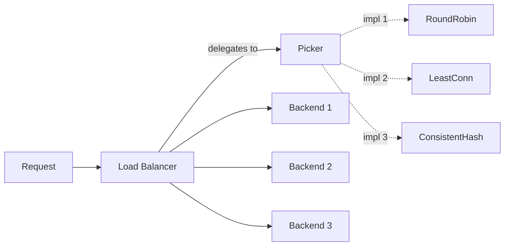
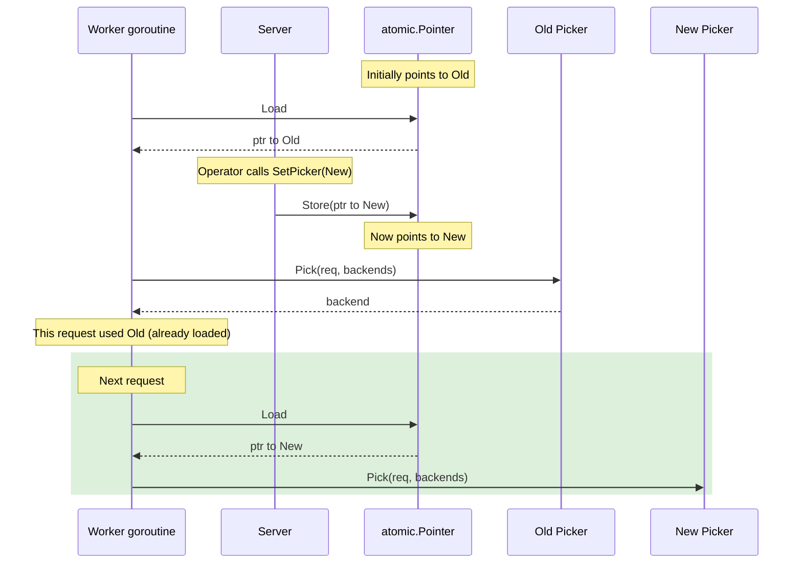
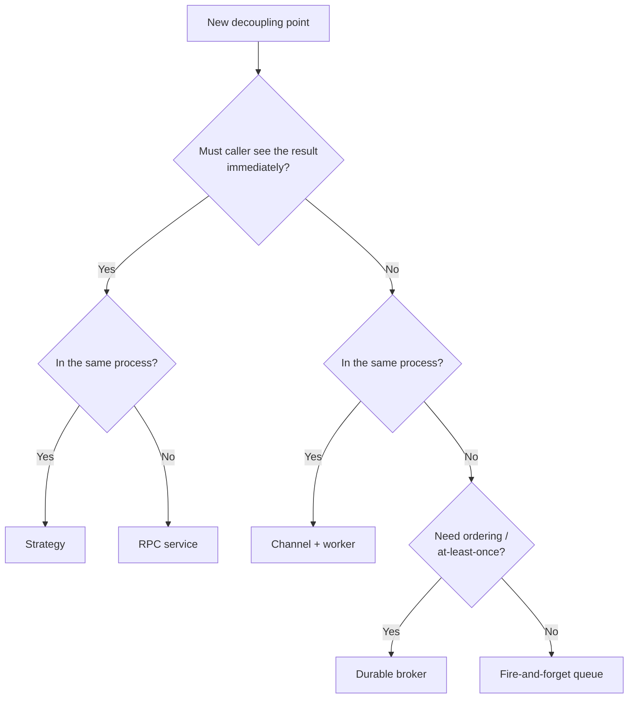
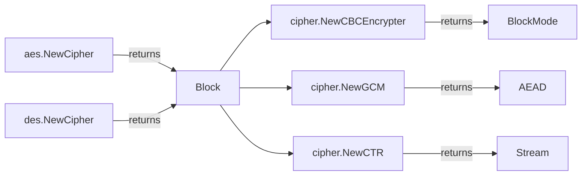

# Strategy Pattern — Senior

## 1. The architectural question

Junior taught the shape. Middle taught the composition and the traps. Senior is about what happens when a strategy interface stops being a local design choice and becomes a *system boundary*. The day your `Charger` interface ships in v1.0.0, you've frozen a contract that lives in three monorepos, six microservices, two SDKs, and an indeterminate number of customer plugins. Adding a method is now a major-version event. Renaming an argument is a major-version event. Changing the receiver kind (value to pointer) is a major-version event. The pattern that was invisible at junior level — "just accept an interface" — becomes the single largest source of breaking changes in any mature Go library.

The senior-level forces:

1. **Distributed systems** that select strategies dynamically at runtime — sharding, consensus, routing, load balancing — where the strategy *is* the architecture.
2. **Hot-swap** of strategies under live traffic without a restart, requiring `atomic.Pointer`, careful drain semantics, and observability for which strategy is active.
3. **Plugin systems** that load strategies from outside the binary (`hashicorp/go-plugin`, gRPC interceptors, WASM modules) where the trust boundary and the interface boundary coincide.
4. **Strategy explosion** — registries with forty implementations, half of which are minor variations of the others, all maintained by different teams, with no clear deprecation policy.
5. **Cross-cutting composition** — middleware chains, interceptor stacks, retry/breaker/timeout wrappers — where the "strategy" is actually a pipeline.
6. **Concurrency-safety contracts** that the interface signature can't express: "this method must be goroutine-safe", "this method must not block longer than ctx", "this method holds no goroutines after returning".
7. **Versioning across major library releases** — non-breaking evolution of a strategy interface used by code you don't control.

Sections 3-7 cover distributed-system patterns where Strategy is load-bearing. Sections 8-11 cover hot-swap, plugins, versioning, and the contract problem. Sections 12-15 walk real Go libraries — `crypto/cipher`, `database/sql/driver`, `compress/*`, `http.RoundTripper`, gRPC interceptors. Section 16 covers anti-patterns at scale. Section 17 is postmortems. The remaining sections collect the senior-level guidance you'll apply when reviewing middle-level PRs.

---

## 2. Table of Contents

1. [The architectural question](#1-the-architectural-question)
2. [Table of Contents](#2-table-of-contents)
3. [Strategy in distributed systems](#3-strategy-in-distributed-systems)
4. [Runtime strategy hot-swap with atomic.Pointer](#4-runtime-strategy-hot-swap-with-atomicpointer)
5. [Strategy versioning across major releases](#5-strategy-versioning-across-major-releases)
6. [Strategy as plugin system](#6-strategy-as-plugin-system)
7. [Strategy composition at scale: middleware and interceptor chains](#7-strategy-composition-at-scale-middleware-and-interceptor-chains)
8. [Concurrency contracts that interfaces can't express](#8-concurrency-contracts-that-interfaces-cant-express)
9. [Contract testing and Liskov for Go](#9-contract-testing-and-liskov-for-go)
10. [Strategy vs Visitor, Strategy vs Chain of Responsibility](#10-strategy-vs-visitor-strategy-vs-chain-of-responsibility)
11. [Architectural decision: strategy vs message passing vs RPC service](#11-architectural-decision-strategy-vs-message-passing-vs-rpc-service)
12. [Real Go libraries: crypto/cipher](#12-real-go-libraries-cryptocipher)
13. [Real Go libraries: database/sql driver](#13-real-go-libraries-databasesql-driver)
14. [Real Go libraries: compress/* and http.RoundTripper](#14-real-go-libraries-compress-and-httproundtripper)
15. [Real Go libraries: gRPC interceptors](#15-real-go-libraries-grpc-interceptors)
16. [Performance at scale: devirtualization, itabs, generics](#16-performance-at-scale-devirtualization-itabs-generics)
17. [Anti-patterns at scale](#17-anti-patterns-at-scale)
18. [Postmortems](#18-postmortems)
19. [Cross-language comparison](#19-cross-language-comparison)
20. [Common senior-level mistakes](#20-common-senior-level-mistakes)
21. [Tricky questions](#21-tricky-questions)
22. [Cheat sheet](#22-cheat-sheet)
23. [Further reading](#23-further-reading)

---

## 3. Strategy in distributed systems

When a system is bigger than one process, Strategy becomes load-bearing architecture. The choice of "which implementation runs" is no longer a local decision; it determines where data lives, which node answers, how failures propagate, and what consistency guarantees hold. Four canonical distributed-system Strategy slots are worth knowing.

### 3.1 Load balancers as strategies

A load balancer's job is "given N backends, pick one for this request". The picking rule *is* the strategy.

```go
package lb

type Backend interface {
    Addr() string
    Healthy() bool
}

type Picker interface {
    Pick(req *Request, backends []Backend) (Backend, error)
}

// Round-robin
type RoundRobin struct{ next atomic.Uint64 }

func (r *RoundRobin) Pick(_ *Request, bs []Backend) (Backend, error) {
    if len(bs) == 0 { return nil, ErrNoBackends }
    n := r.next.Add(1)
    return bs[(n-1)%uint64(len(bs))], nil
}

// Least-connections
type LeastConn struct{ conns map[string]*atomic.Int64 }

func (l *LeastConn) Pick(_ *Request, bs []Backend) (Backend, error) {
    var best Backend
    var min int64 = math.MaxInt64
    for _, b := range bs {
        if !b.Healthy() { continue }
        c := l.conns[b.Addr()].Load()
        if c < min { min = c; best = b }
    }
    if best == nil { return nil, ErrNoBackends }
    return best, nil
}

// Consistent hash (for session affinity)
type ConsistentHash struct{ ring *hashring.HashRing }

func (h *ConsistentHash) Pick(req *Request, bs []Backend) (Backend, error) {
    node, ok := h.ring.GetNode(req.SessionKey())
    if !ok { return nil, ErrNoBackends }
    for _, b := range bs {
        if b.Addr() == node { return b, nil }
    }
    return nil, ErrBackendVanished
}
```

`gRPC`'s `balancer.Picker` interface is exactly this shape. `envoy`'s policy enum is the same idea in C++. Three strategies, one consumer (`Pick`), no shared state between strategies — except for the consistent-hash ring, which is itself a separate concern composed *into* the strategy.

The architectural payoff: load-balancing policy becomes a deployment knob. SRE swaps `RoundRobin` for `LeastConn` via config; no rebuild. New policy types ship behind the same interface.



### 3.2 Consensus algorithms as strategies

`etcd`, `tikv`, `cockroachdb` all expose consensus as an interface — Raft is the default, but the abstraction allows for Paxos variants, replicated state machines, or test-only deterministic protocols. The strategy boundary is the replication protocol; the consumer is the higher-level KV layer.

```go
type Consensus interface {
    Propose(ctx context.Context, op []byte) (LogIndex, error)
    Apply(ctx context.Context) (<-chan AppliedOp, error)
    LeaderHint() NodeID
}
```

Why pluggable? Three reasons:
1. **Testing.** A "single-node always-commits" strategy lets unit tests exercise the KV layer without spinning up three replicas.
2. **Migration.** Moving from Raft v1 to Raft v2 (with pre-vote, joint consensus, learner replicas) is a strategy swap, not a rewrite.
3. **Domain variation.** Some replicas care about strict linearizability (Raft); some accept causal consistency (CRDT-based gossip). Same interface, different guarantees.

The senior lesson: the *interface contract* in a distributed system is also a *guarantee contract*. `Consensus.Propose` doesn't just say "send these bytes"; it says "they will be applied in this order on all replicas, with these durability guarantees, under these failure conditions". Two strategies that satisfy the type signature but differ in their guarantee surface are *not* interchangeable. We come back to this in §9 (contract testing).

### 3.3 Sharding strategies

How does a request find its data? The shard-key-to-node mapping is a strategy.

```go
type Sharder interface {
    Shard(key []byte) NodeID
    Rebalance(oldRing, newRing []NodeID) []Migration
}

// Hash-mod-N — simplest, terrible for resharding
type HashMod struct{ n int }
func (h HashMod) Shard(k []byte) NodeID { return NodeID(crc32.ChecksumIEEE(k) % uint32(h.n)) }

// Consistent hashing — sublinear migration on resize
type ConsistentHash struct{ ring *hashring.Ring }

// Range-based — preserves locality, supports range scans
type RangeShard struct{ ranges []KeyRange }

// Geographic — strategy considers request origin
type Geo struct{ regionByPrefix map[string]NodeID }
```

Choosing between them is an architectural decision with long-tail consequences. Hash-mod-N is trivial but makes resharding rebalance O(N) of the data. Consistent hashing rebalances O(1/N) of the data but loses range-scan locality. Range-based supports range scans but suffers hotspots if the key distribution is skewed. Geographic minimises latency but couples to physical infrastructure.

These can't be unit-tested into equivalence; they're *not* equivalent. The `Sharder` interface is structural; the semantic differences are architectural. When a system exposes "pluggable sharding", what it really means is "you'll pick one once, and migrating later is a multi-quarter project".

### 3.4 Routing strategies in microservice meshes

In a service mesh (Istio, Linkerd, Consul), the strategy for routing a request to a particular version, region, or canary is configurable per-deployment.

```go
type Route interface {
    Match(req *Request) bool
    Destination() Cluster
}

type RoutingPolicy interface {
    Select(req *Request, routes []Route) (Cluster, error)
}

// Header-based — sticky session by cookie
type HeaderMatch struct{ header, value string }

// Percentage — canary rollout, 1% to new version
type Weighted struct{ weights map[Cluster]int }

// Latency-aware — pick lowest-RTT cluster
type LatencyAware struct{ rtts map[Cluster]*atomic.Int64 }

// Failure-aware — circuit-breaker on error rate
type CircuitAware struct{ breakers map[Cluster]*CircuitBreaker }
```

The mesh's data plane runs these strategies on every request. Selection latency budget is microseconds; the strategy implementations must be allocation-free and lock-free in the hot path. Envoy's xDS protocol exists precisely to ship these strategies (as protobuf configs) to data-plane nodes without restarting them — which is also the topic of §4 (hot-swap).

### 3.5 The composition that matters

In a real distributed system, you don't pick *one* strategy at any layer. You compose them:

```
Request arrives
  → Service mesh routing strategy (decide cluster)
     → Load balancer picking strategy (decide instance)
        → Sharding strategy (decide which data node)
           → Consensus strategy (decide who answers)
```

Four layers, four strategy interfaces, each operating on a different scope. The senior-level skill is *separating the layers* — making sure the sharding strategy can't see what the load balancer is doing, and the consensus protocol doesn't care about routing percentages. Coupling them with a `// it's all just configuration` mindset is how you build a single-strategy-class with twelve fields and no testability.

---

## 4. Runtime strategy hot-swap with atomic.Pointer

The problem: a long-running service has a configured strategy (e.g., the load balancer's `Picker`). Operations wants to switch from `RoundRobin` to `LeastConn` without restarting. Concurrent requests are in flight. How do you swap the strategy safely?

### 4.1 The naive approach (wrong)

```go
type Server struct {
    picker Picker  // shared field
}

func (s *Server) SetPicker(p Picker) { s.picker = p }

func (s *Server) Handle(req *Request) {
    backend, _ := s.picker.Pick(req, s.backends)  // data race
    // ...
}
```

Plain assignment to `s.picker` while another goroutine reads it is a data race per the Go memory model. The race detector flags it. In practice on x86 you may get away with "torn read" of the interface header (a two-word struct: type pointer + data pointer), but on weakly-ordered architectures (ARM64) you can observe a half-updated interface — wrong type pointer paired with new data pointer. Undefined behaviour.

### 4.2 The mutex approach (works, slow)

```go
type Server struct {
    mu     sync.RWMutex
    picker Picker
}

func (s *Server) SetPicker(p Picker) {
    s.mu.Lock()
    s.picker = p
    s.mu.Unlock()
}

func (s *Server) Handle(req *Request) {
    s.mu.RLock()
    p := s.picker
    s.mu.RUnlock()
    backend, _ := p.Pick(req, s.backends)
}
```

Correct. Every request pays an RLock/RUnlock pair. At 50K RPS, the RWMutex's atomic operations contend on the same cache line, costing ~50-100ns each — measurable in profiles. Worse, an `RLock` blocks if a `Lock` is pending, so a swap during peak traffic causes a small latency spike.

### 4.3 The atomic.Pointer approach (right)

Go 1.19 added `atomic.Pointer[T]` — a typed, lock-free pointer with atomic load/store.

```go
type Server struct {
    picker atomic.Pointer[pickerHolder]
}

// Indirection: atomic.Pointer holds a *pointer*; interfaces are two words.
type pickerHolder struct{ p Picker }

func NewServer(p Picker) *Server {
    s := &Server{}
    s.picker.Store(&pickerHolder{p: p})
    return s
}

func (s *Server) SetPicker(p Picker) {
    s.picker.Store(&pickerHolder{p: p})
}

func (s *Server) Handle(req *Request) {
    p := s.picker.Load().p
    backend, _ := p.Pick(req, s.backends)
}
```

Reads cost one atomic load (~1ns). Writes cost one atomic store. No mutex, no contention, no torn reads. Concurrent requests either see the old picker (in flight when the swap happened) or the new picker (started after the swap). Neither sees a half-state.

The `pickerHolder` indirection is necessary: `atomic.Pointer[T]` requires `T` to be a struct, not an interface. The wrapper struct holds the interface and the pointer is what's atomic.



### 4.4 What hot-swap doesn't fix

Hot-swap of the *pointer* doesn't drain in-flight requests. If a request is mid-`Pick()` when the swap happens, it completes against the old strategy. Usually fine — `Pick()` is fast. For strategies that hold longer-lived state (e.g., a connection pool, a state machine), naive hot-swap leaks the old strategy's resources.

```go
type ConnPoolStrategy struct {
    pool *ConnPool
}

func (s *ConnPoolStrategy) Get() *Conn { return s.pool.Get() }

// Hot-swap:
server.SetStrategy(NewConnPoolStrategy(newConfig))
// The OLD ConnPoolStrategy still has open connections.
// Nothing closed them. Connection leak.
```

The fix: the strategy interface includes a lifecycle:

```go
type Strategy interface {
    Pick(req *Request) Backend
    Close() error   // called when strategy is replaced
}

func (s *Server) SetStrategy(new Strategy) {
    old := s.strategy.Swap(&strategyHolder{s: new})
    if old != nil {
        // Wait for in-flight requests using old strategy to drain.
        time.AfterFunc(s.drainGracePeriod, func() {
            old.s.Close()
        })
    }
}
```

The drain grace period is a tuning knob. Too short, you close connections mid-request. Too long, you accumulate old strategies waiting to close. For most services, 30 seconds to a few minutes is sane. `envoy` calls this "graceful shutdown of the old listener" — same problem, same solution.

### 4.5 Generation counters as an alternative

For cases where atomic.Pointer's indirection cost matters, a generation counter + per-strategy slot works:

```go
type Server struct {
    strategies [2]Strategy   // double-buffered
    gen        atomic.Uint64 // even = strategies[0], odd = strategies[1]
}

func (s *Server) Current() Strategy {
    return s.strategies[s.gen.Load()&1]
}

func (s *Server) Swap(new Strategy) {
    next := (s.gen.Load() + 1) & 1
    s.strategies[next] = new       // write to inactive slot
    s.gen.Add(1)                   // commit (even↔odd toggles)
}
```

The double-buffered approach skips the heap allocation per swap (no `&pickerHolder{}`). The cost: only two slots are addressable, and a writer must coordinate with itself (no two concurrent `Swap` calls). For *operator-initiated* swaps (one per minute, by humans), this is fine. For *traffic-driven* swaps (one per request based on some condition), use `atomic.Pointer` or rethink the design.

---

## 5. Strategy versioning across major releases

You shipped `Charger` v1.0.0:

```go
type Charger interface {
    Charge(ctx context.Context, amount int) error
}
```

Customers wrote implementations. Two years later you need to add `currency` to the API. Three options. Two are wrong.

### 5.1 Option A — add the method (breaking)

```go
type Charger interface {
    Charge(ctx context.Context, amount int) error
    ChargeCurrency(ctx context.Context, amount int, currency string) error
}
```

Every existing implementation breaks. Customer SDKs need to be updated. Their CI fails. Their deploys fail. You've broken the contract.

This is the *Java/C# trap* — adding methods to interfaces is OK in those languages because of default-method inheritance (Java 8+) or because you can ship a new interface (`ICharger2`). In Go, every implementation must satisfy all methods; adding one breaks everyone.

### 5.2 Option B — change the signature (also breaking)

```go
type Charger interface {
    Charge(ctx context.Context, amount int, currency string) error  // new arg
}
```

Worse. Every call site breaks. Every implementation breaks. The compiler error appears in every downstream codebase the day they upgrade.

### 5.3 Option C — segregated optional interface (right)

```go
// v1 contract — unchanged forever
type Charger interface {
    Charge(ctx context.Context, amount int) error
}

// v2 extension — opt-in
type CurrencyCharger interface {
    Charger
    ChargeCurrency(ctx context.Context, amount int, currency string) error
}
```

Consumers that need currency support type-assert:

```go
func chargeWithCurrency(c Charger, ctx context.Context, amount int, ccy string) error {
    if cc, ok := c.(CurrencyCharger); ok {
        return cc.ChargeCurrency(ctx, amount, ccy)
    }
    // Fall back to old interface
    return c.Charge(ctx, amount)
}
```

Existing implementations still satisfy `Charger`. New implementations can additionally satisfy `CurrencyCharger`. No breakage. The consumer codepath branches at the type assertion.

This is *optional interfaces*, also called *capability detection*. The standard library uses it pervasively:

- `io.WriteString` checks if the writer implements `io.StringWriter` (avoids byte conversion).
- `io.Copy` checks for `io.WriterTo` and `io.ReaderFrom` (avoids intermediate buffer).
- `net/http.ResponseWriter` is type-asserted for `http.Flusher`, `http.Hijacker`, `http.Pusher`.
- `database/sql` checks `driver.NamedValueChecker`, `driver.SessionResetter`, `driver.Validator`.

The pattern is documented but not enforced. Senior-level discipline: *every interface extension must come via a new interface, not by adding methods to the existing one*.

### 5.4 The graceful deprecation cycle

For methods that need to be *replaced* (not just added):

```go
type Charger interface {
    // Deprecated: Use ChargeWithMeta. Will be removed in v3.
    Charge(ctx context.Context, amount int) error
    
    // ChargeWithMeta is the v2 contract.
    ChargeWithMeta(ctx context.Context, amount int, meta Meta) error
}
```

Wait — this still requires every implementer to implement both. The graceful version uses optional interfaces:

```go
// v1, frozen
type Charger interface {
    Charge(ctx context.Context, amount int) error
}

// v2, optional
type MetaCharger interface {
    ChargeWithMeta(ctx context.Context, amount int, meta Meta) error
}

// Consumer prefers v2, falls back to v1
func chargeBest(c Charger, ctx context.Context, amount int, meta Meta) error {
    if mc, ok := c.(MetaCharger); ok {
        return mc.ChargeWithMeta(ctx, amount, meta)
    }
    return c.Charge(ctx, amount)
}
```

The consumer codepath has the branching. The interfaces never break. After 12-18 months, you can ship a major version that drops `Charger` in favour of `MetaCharger` — at which point the breaking change is *intentional* and gated by the major version bump.

### 5.5 The "wrapper interface" mistake

A common middle-level "fix" for evolution that becomes a senior-level disaster:

```go
type Charger interface {
    Charge(req ChargeRequest) (ChargeResponse, error)
}

type ChargeRequest struct {
    Amount   int
    Currency string  // added in v1.1
    Meta     Meta    // added in v1.2
    Hold     bool    // added in v1.3
    // ...
}
```

The interface now never changes — but `ChargeRequest` grows forever. Implementations have to handle every field a future version might add. Backwards compatibility comes from the request struct being open for additive change, which works *only* if implementations:

1. Don't validate "extra" fields (they accept unknown future fields).
2. Don't depend on fields being zero-valued in old versions.

Neither is enforced by the type system. You're trading interface evolution for struct evolution. The struct's grown to 47 fields, half of them deprecated, none of them removable.

This pattern works for protocols (HTTP, gRPC, Protobuf) where the wire format has explicit extensibility rules. It's *miserable* for Go interfaces — there's no `unknown_fields` slot, no formal optionality, no validation discipline.

If you need this shape, **use protobuf or capnproto for the request type**, not a Go struct. The wire format brings the discipline. A bare Go struct doesn't.

---

## 6. Strategy as plugin system

A plugin is a strategy whose implementation lives outside your binary. Loaded dynamically, talked to over an IPC boundary, frequently shipped by third parties. The interface boundary is also a *security and trust* boundary.

### 6.1 The native Go plugin package (rarely used)

`plugin` (`plugin.Open`, `plugin.Lookup`) loads `.so` files at runtime:

```go
p, err := plugin.Open("payment_stripe.so")
if err != nil { return err }
sym, err := p.Lookup("Charger")
if err != nil { return err }
c, ok := sym.(*Charger)
if !ok { return errors.New("type mismatch") }
```

This works on Linux/macOS. In practice nobody uses it because:

1. **Go version coupling.** Plugin must be built with the *exact same* Go version as the host. Mismatch panics on load.
2. **CGO contamination.** Plugins can't be cross-compiled from a different OS. Building Linux plugins on macOS doesn't work.
3. **No Windows support.**
4. **Unload is unsupported.** Once loaded, a plugin stays in memory until process exit.
5. **Shared memory model.** Plugin and host share the heap; a plugin bug can crash the host.

The Go team has explicitly *discouraged* using `plugin` for new projects. It exists for very specific use cases (extending Go programs with native code that needs the same runtime). For Strategy-as-plugin, use option 6.2 or 6.3.

### 6.2 hashicorp/go-plugin: subprocess + gRPC

`hashicorp/go-plugin` runs each plugin as a *separate subprocess* and communicates via gRPC over a Unix socket:

```go
// Host
client := plugin.NewClient(&plugin.ClientConfig{
    HandshakeConfig: handshakeConfig,
    Plugins:         pluginMap,
    Cmd:             exec.Command("./payment_stripe"),
    AllowedProtocols: []plugin.Protocol{plugin.ProtocolGRPC},
})
defer client.Kill()

rpcClient, err := client.Client()
raw, err := rpcClient.Dispense("charger")
charger := raw.(Charger)

err = charger.Charge(ctx, 1000, "USD")  // gRPC call under the hood
```

Architectural benefits:

1. **Crash isolation.** Plugin crash doesn't take down the host. Host can restart the plugin.
2. **Language independence.** Plugins can be written in Rust, Python, anything that speaks gRPC.
3. **Version independence.** Plugin and host can be built with different Go versions.
4. **Security boundary.** Plugin runs in a separate process with separate permissions (you can launch it under a different uid, in a chroot, etc.).
5. **Hot reload.** Kill subprocess, start new one.

Cost: each call crosses the process boundary. ~50-200µs per call vs ~1-2ns for in-process. For low-frequency operations (terraform providers, packer builders, vault auth backends — all use go-plugin) this is irrelevant. For per-request Strategy in a hot path, it's a non-starter.

### 6.3 gRPC services as remote strategies

The maximalist version: the strategy lives in a different service entirely, accessed via gRPC.

```go
type PaymentGateway interface {
    Charge(ctx context.Context, amount int) error
}

type GRPCGateway struct{ client pb.PaymentClient }

func (g *GRPCGateway) Charge(ctx context.Context, amount int) error {
    _, err := g.client.Charge(ctx, &pb.ChargeRequest{Amount: int64(amount)})
    return err
}
```

The strategy implementation is now a microservice. The interface is the gRPC API. Versioning is protobuf versioning. Plugin distribution is "deploy a new service".

When this is right:
- The strategy's implementation has independent scaling needs (a fraud-detection strategy that wants 50 cores; the main service has 8).
- The strategy is owned by a different team with a different deploy cadence.
- The strategy has compliance requirements (PCI, GDPR) that mean it can't share a process with code that handles other data.

When this is wrong:
- Per-request latency budget is < 1ms.
- The strategy needs to call back into the host (turning the gRPC into a bidi stream and complicating everything).
- "I just want to add a new compression algorithm" — that's an in-process strategy, not a microservice.

### 6.4 WASM strategies (the future)

`wasmer-go`, `wasmtime-go`, `wazero` let you load WebAssembly modules in-process with sandboxing:

```go
runtime := wazero.NewRuntime(ctx)
mod, _ := runtime.InstantiateModuleFromBinary(ctx, wasmBytes)
charge := mod.ExportedFunction("charge")
result, _ := charge.Call(ctx, amount)
```

The WASM module is sandboxed — it can't read your host's memory, can't make syscalls except through explicit imports, and can't crash the host. Plugin authors write in Rust, AssemblyScript, Go-with-tinygo, or anything that targets WASM.

Trade-offs:
- **Pro:** crash-safe, language-independent, in-process (no IPC overhead).
- **Pro:** can be sandboxed per-tenant — each customer's strategy runs in its own WASM instance.
- **Con:** strategy can't easily share complex Go structs with host (everything serialises across the WASM boundary).
- **Con:** debugging is painful — stack traces stop at the WASM boundary.
- **Con:** ecosystem still maturing in 2026.

For "plugin systems that need to scale to thousands of tenant-supplied strategies", WASM is increasingly the right answer. Cloudflare Workers, Fastly Compute@Edge, envoy filters, dapr components all run WASM-based strategies in production.

### 6.5 The plugin interface design rule

Whatever the transport (plugin, subprocess, gRPC, WASM), the strategy interface for plugins should follow stricter rules than in-process interfaces:

1. **All arguments and returns are serializable.** No `*sql.DB`, no `chan T`, no `func()`. The wire boundary forces this anyway; design for it from day one.
2. **Every operation takes a `context.Context`.** Cancellation must work across the boundary.
3. **No callbacks.** If the plugin needs to call back into the host, design the protocol explicitly (e.g., the host polls the plugin for events). Implicit callbacks via interface methods don't survive serialisation.
4. **Errors are values, not panics.** Panics across IPC boundaries are catastrophic. Every method returns `error`.
5. **Idempotency is documented.** The plugin may be retried, killed mid-call, restarted. Idempotency keys at the interface level prevent double-charges.
6. **Versioning is explicit in the handshake.** Plugin announces "I implement Charger v2"; host accepts or rejects.

A plugin Strategy interface that ignores these rules works in the happy path and falls apart at scale. The constraints come from the IPC boundary; embracing them up front prevents painful rewrites.

---

## 7. Strategy composition at scale: middleware and interceptor chains

A single strategy is rarely enough. Production systems wrap strategies in stacks of cross-cutting concerns: logging, retries, timeouts, circuit breakers, metrics, tracing, authentication, authorisation, rate limiting. The pattern: each wrapper *is* a strategy of the same interface.

### 7.1 The middleware shape

```go
type Charger interface {
    Charge(ctx context.Context, amount int) error
}

// A Middleware is a function that takes a Charger and returns a Charger.
type ChargerMiddleware func(Charger) Charger

// Compose a chain
func Chain(c Charger, mws ...ChargerMiddleware) Charger {
    // Apply in reverse so the first middleware is outermost
    for i := len(mws) - 1; i >= 0; i-- {
        c = mws[i](c)
    }
    return c
}
```

Each middleware decorates the strategy:

```go
func WithLogging(log *log.Logger) ChargerMiddleware {
    return func(next Charger) Charger {
        return chargerFunc(func(ctx context.Context, amount int) error {
            log.Printf("charge: amount=%d", amount)
            err := next.Charge(ctx, amount)
            if err != nil { log.Printf("charge failed: %v", err) }
            return err
        })
    }
}

func WithRetry(attempts int) ChargerMiddleware {
    return func(next Charger) Charger {
        return chargerFunc(func(ctx context.Context, amount int) error {
            var err error
            for i := 0; i < attempts; i++ {
                if err = next.Charge(ctx, amount); err == nil { return nil }
                if !isRetryable(err) { return err }
            }
            return fmt.Errorf("after %d attempts: %w", attempts, err)
        })
    }
}

func WithCircuitBreaker(cb *CircuitBreaker) ChargerMiddleware {
    return func(next Charger) Charger {
        return chargerFunc(func(ctx context.Context, amount int) error {
            return cb.Execute(func() error { return next.Charge(ctx, amount) })
        })
    }
}

func WithTimeout(d time.Duration) ChargerMiddleware {
    return func(next Charger) Charger {
        return chargerFunc(func(ctx context.Context, amount int) error {
            ctx, cancel := context.WithTimeout(ctx, d)
            defer cancel()
            return next.Charge(ctx, amount)
        })
    }
}

// chargerFunc is the function adapter
type chargerFunc func(ctx context.Context, amount int) error
func (f chargerFunc) Charge(ctx context.Context, amount int) error { return f(ctx, amount) }
```

Composition at the construction site:

```go
c := Chain(
    &StripeGateway{...},
    WithCircuitBreaker(cb),
    WithRetry(3),
    WithTimeout(5*time.Second),
    WithLogging(log),
)
```

The resulting `c` runs: logging → timeout → retry → circuit breaker → Stripe. The *order matters*:

- **Logging outermost** so we log even if other middlewares short-circuit.
- **Timeout before retry** so the overall budget covers all attempts.
- **Retry before circuit breaker** so the breaker sees aggregate failure rate, not per-attempt.
- **Circuit breaker before the call** so we short-circuit when downstream is unhealthy.

Get the order wrong and the system behaves subtly wrong:


### 7.2 The senior-level ordering pitfalls

| Wrong order | Consequence |
|-------------|-------------|
| Retry outside timeout | Each retry has its own timeout; total time = attempts × timeout. Latency budget blown. |
| Circuit breaker inside retry | Breaker trips after `attempts × failures`, not single failure. Trip threshold meaningless. |
| Logging inside timeout | When the timeout fires, the log of the request was already emitted, but the response is the timeout error — confusing telemetry. |
| Metrics outside circuit breaker | Metrics double-count: the metric records the request, the breaker rejects without calling the inner. Now you have requests with no downstream call. |
| Auth inside retry | Each retry re-authenticates; multiplies auth load by attempt count. |
| Rate limiter inside circuit breaker | When the breaker is open, the rate limiter slot is consumed for free. |

These mistakes don't show up in unit tests. They show up in production during incidents, when the order of layers determines whether your system survives the next failure.

### 7.3 The dynamic chain problem

So far the chain is *static* — built once at startup. What if you want middleware to vary per-request?

```go
// Anti-pattern
func handle(req *Request) {
    c := Chain(base, mws...) // builds the chain per request — allocations
    c.Charge(...)
}
```

Per-request chain construction allocates every middleware wrapper. At 50K RPS with 5 middlewares, that's 250K function value allocations per second. Profilable.

The fix depends on the actual variation:

```go
// Variation 1: middleware that branches on context
func WithFeatureFlag(flag string) ChargerMiddleware {
    return func(next Charger) Charger {
        return chargerFunc(func(ctx context.Context, amount int) error {
            if !flags.Enabled(ctx, flag) { return next.Charge(ctx, amount) }
            // Apply the feature behaviour
            return featureBehaviour(ctx, next, amount)
        })
    }
}
```

Build the chain once, including the *feature-flag-aware* middleware. The branching happens inside; the chain doesn't change. No per-request allocation.

```go
// Variation 2: stable chains keyed by tenant
type ChainCache struct {
    chains sync.Map  // tenantID -> Charger
}

func (cc *ChainCache) Get(tenantID string) Charger {
    if c, ok := cc.chains.Load(tenantID); ok { return c.(Charger) }
    c := buildChainFor(tenantID)
    actual, _ := cc.chains.LoadOrStore(tenantID, c)
    return actual.(Charger)
}
```

Chains per tenant, cached. First request for a tenant builds the chain; subsequent requests reuse.

### 7.4 Interceptor stacks in gRPC

gRPC's interceptor model is exactly middleware:

```go
type UnaryServerInterceptor func(
    ctx context.Context,
    req interface{},
    info *UnaryServerInfo,
    handler UnaryHandler,
) (resp interface{}, err error)

grpc.NewServer(
    grpc.ChainUnaryInterceptor(
        grpcprom.UnaryServerInterceptor,
        grpczap.UnaryServerInterceptor(logger),
        grpcrecovery.UnaryServerInterceptor(),
        grpcauth.UnaryServerInterceptor(authFn),
    ),
)
```

Same shape, same ordering rules, same pitfalls. gRPC's `ChainUnaryInterceptor` is `Chain` from §7.1 with a fixed function shape.

We cover gRPC interceptors in detail in §15.

---

## 8. Concurrency contracts that interfaces can't express

A `Charger` interface declares one method. It doesn't declare:

- Whether `Charge` is goroutine-safe (callable from multiple goroutines concurrently).
- Whether it blocks.
- Whether it spawns goroutines.
- Whether those goroutines outlive the call.
- Whether it allocates.
- Whether it's deterministic.
- Whether it has side effects on subsequent calls.
- Whether it honours context cancellation.

These are all part of the contract — but Go's type system can't express them. They live in documentation, in code review, in cultural conventions, or worse, in nobody's head.

### 8.1 Documenting goroutine-safety

The Go standard library has a convention: if a type's methods are safe to call from multiple goroutines concurrently, the godoc says so. Otherwise it's assumed unsafe.

```go
// Charger executes payment charges.
//
// Implementations must be safe for concurrent use by multiple goroutines.
type Charger interface {
    Charge(ctx context.Context, amount int) error
}
```

This sentence is load-bearing. Without it, the consumer doesn't know if they need to serialise calls. Implementers might happily use non-thread-safe internals.

Counter-example: `sql.Rows` is explicitly *not* safe for concurrent use. Its godoc says so. `sql.DB` is safe. Same package, different rules per type.

Strategy interfaces should pick one rule and document it:

| Interface contract | Implementation requirement |
|--------------------|---------------------------|
| "Safe for concurrent use" | Implementers must serialise their own internal state |
| "Single-goroutine only" | Consumer must serialise calls; useful for stateful strategies (sort comparators, parsers) |
| "Stateless, no implicit serialisation needed" | Implementations have no mutable state — pure functions |

### 8.2 Strategies that hold goroutines

A subtle anti-pattern: strategies that spawn background goroutines without a clean shutdown path.

```go
type AsyncCharger struct {
    queue chan chargeOp
}

func NewAsyncCharger() *AsyncCharger {
    a := &AsyncCharger{queue: make(chan chargeOp, 100)}
    go a.worker()  // background goroutine, lives forever
    return a
}

func (a *AsyncCharger) Charge(ctx context.Context, amount int) error {
    done := make(chan error)
    a.queue <- chargeOp{amount: amount, done: done}
    return <-done
}

func (a *AsyncCharger) worker() {
    for op := range a.queue { /* ... */ }
}
```

The worker goroutine runs forever. If `AsyncCharger` is replaced (e.g., via hot-swap), the old worker doesn't stop. Goroutine leak. Multiplied over a long-running service that reloads strategies hourly: thousands of leaked goroutines.

The fix: strategies that own goroutines must implement `io.Closer`:

```go
type AsyncCharger struct {
    queue chan chargeOp
    done  chan struct{}
    wg    sync.WaitGroup
}

func NewAsyncCharger() *AsyncCharger {
    a := &AsyncCharger{
        queue: make(chan chargeOp, 100),
        done:  make(chan struct{}),
    }
    a.wg.Add(1)
    go a.worker()
    return a
}

func (a *AsyncCharger) Close() error {
    close(a.done)  // signal worker to stop
    a.wg.Wait()    // wait for it
    return nil
}

func (a *AsyncCharger) worker() {
    defer a.wg.Done()
    for {
        select {
        case op := <-a.queue: /* ... */
        case <-a.done: return
        }
    }
}
```

The senior rule: **if your strategy spawns a goroutine, the strategy must be Closable, and the hot-swap path must call Close on the old one** (after a drain period — §4.4).

### 8.3 Strategy reload safety

A strategy reload should preserve safety invariants. Three real failure modes:

```go
// FAILURE 1: reload during in-flight work
old := strat.Load()
go old.Process(...)  // started just before reload
strat.Store(new)
// 'old' is still running; if 'old' relied on package-global state that the
// new strategy modified during init, 'old' sees inconsistent state.
```

Mitigation: strategies *don't* mutate package-global state during init. All state is encapsulated in the strategy instance.

```go
// FAILURE 2: shared resources between strategies
type StripeStrategy struct{ pool *ConnPool }

oldS := NewStripeStrategy(sharedPool)
newS := NewStripeStrategy(sharedPool)  // SAME pool
strat.Store(newS)
oldS.Close()  // closes the pool — newS now broken
```

Mitigation: strategies own their resources. If multiple strategies need a shared pool, the pool is a separate object with explicit ownership.

```go
// FAILURE 3: configuration race
type Strategy struct {
    cfg atomic.Pointer[Config]
}

oldS.cfg.Store(newConfig)  // updates old strategy in place
// vs.
newS := NewStrategy(newConfig)
strat.Store(newS)  // installs new strategy
// Mixing these styles produces unpredictable state.
```

Mitigation: pick one reload model and stick to it. Either strategies are immutable and you swap *instances* (preferred), or strategies are mutable and you swap *configs* atomically inside the instance. Not both.

---

## 9. Contract testing and Liskov for Go

The Liskov Substitution Principle says: subtypes should be substitutable for their base types without breaking program correctness. In Go interface terms: any value satisfying an interface should behave like any other value satisfying the same interface, as far as the consumer can observe.

Go's compiler enforces *structural* satisfaction — same methods, same signatures. It doesn't enforce *behavioural* satisfaction. Two `Charger` implementations might both compile but disagree on whether a negative amount is an error, whether retries are idempotent, whether context cancellation is honoured. The contract violation only shows up at runtime, often in production.

The senior-level discipline: **contract tests** — a shared test suite that every implementation runs against. If you ship a `Charger` interface, you ship a `ChargerContract` suite that asserts behaviour every implementation must satisfy.

### 9.1 The contract test pattern

```go
package payment_test

// ChargerContract is the shared behavioural specification.
// Every Charger implementation must pass this suite.
func ChargerContract(t *testing.T, newCharger func() Charger) {
    t.Run("Positive amount succeeds", func(t *testing.T) {
        c := newCharger()
        err := c.Charge(context.Background(), 1000)
        if err != nil { t.Fatal(err) }
    })
    
    t.Run("Negative amount fails", func(t *testing.T) {
        c := newCharger()
        err := c.Charge(context.Background(), -1)
        if err == nil { t.Error("expected error for negative amount") }
    })
    
    t.Run("Zero amount fails", func(t *testing.T) {
        c := newCharger()
        err := c.Charge(context.Background(), 0)
        if err == nil { t.Error("expected error for zero amount") }
    })
    
    t.Run("Context cancellation honoured", func(t *testing.T) {
        c := newCharger()
        ctx, cancel := context.WithCancel(context.Background())
        cancel()
        err := c.Charge(ctx, 1000)
        if !errors.Is(err, context.Canceled) {
            t.Errorf("got %v, want %v", err, context.Canceled)
        }
    })
    
    t.Run("Idempotency: same idempotency key returns same charge", func(t *testing.T) {
        c := newCharger()
        ctx := context.WithValue(context.Background(), idempotencyKey, "key-123")
        err1 := c.Charge(ctx, 1000)
        err2 := c.Charge(ctx, 1000)
        if err1 != err2 { t.Errorf("idempotency broken: %v vs %v", err1, err2) }
    })
    
    t.Run("Concurrent calls are safe", func(t *testing.T) {
        c := newCharger()
        var wg sync.WaitGroup
        for i := 0; i < 100; i++ {
            wg.Add(1)
            go func() {
                defer wg.Done()
                c.Charge(context.Background(), 1000)
            }()
        }
        wg.Wait()
        // No race detector trips, no panics
    })
}
```

Each implementation runs the contract suite:

```go
// stripe_test.go
func TestStripeContract(t *testing.T) {
    payment.ChargerContract(t, func() payment.Charger {
        return NewStripeGateway(testAPIKey, stripeMockEndpoint)
    })
}

// paypal_test.go
func TestPayPalContract(t *testing.T) {
    payment.ChargerContract(t, func() payment.Charger {
        return NewPayPalGateway(testCreds, paypalMockEndpoint)
    })
}
```

When a new implementation is written, running the contract tests is the first acceptance criterion. When the contract changes (e.g., a new behaviour is required), the contract suite changes, and every implementation re-runs. Implementations that newly fail are flagged.

This is *the* discipline that distinguishes "we have an interface" from "we have a contract". The contract test suite makes Liskov substitution mechanically checkable.

### 9.2 Fuzz testing strategy implementations

For strategies that operate on arbitrary inputs (encoders, decoders, parsers, compressors), fuzz testing is essential:

```go
func FuzzCharger(f *testing.F) {
    impls := []func() Charger{
        func() Charger { return NewStripeGateway(...) },
        func() Charger { return NewPayPalGateway(...) },
    }
    f.Add(1000)
    f.Add(0)
    f.Add(-1)
    f.Add(math.MaxInt32)
    
    f.Fuzz(func(t *testing.T, amount int) {
        for _, newC := range impls {
            c := newC()
            err := c.Charge(context.Background(), amount)
            // Property: same input, same error class across implementations
            // (each implementation's error is its own, but the *category* should match)
            if amount <= 0 && err == nil {
                t.Errorf("%T accepted non-positive amount %d", c, amount)
            }
        }
    })
}
```

Fuzz testing finds inputs where implementations disagree. Two `Compressor` implementations should produce decompressable output for any byte sequence — a fuzz test that feeds random bytes to each and round-trips finds bugs neither author would have anticipated.

`golang.org/x/text` uses contract+fuzz testing extensively for its many encoder/decoder strategies. Bugs found this way include UTF-8 decoders that disagree on overlong-encoding handling, time-zone strategies that disagree on DST transitions, and collation strategies that disagree on Unicode normalisation.

### 9.3 The "every implementation must pass" rule

Some teams ship the contract tests but allow implementations to skip tests they don't want to satisfy:

```go
func TestStripeContract(t *testing.T) {
    payment.ChargerContract(t, func() payment.Charger { ... },
        payment.SkipIdempotency,   // we don't support idempotency yet
    )
}
```

This is a code smell. If an implementation can skip parts of the contract, the contract isn't really a contract. Either:

1. The skipped behaviour is genuinely optional → segregate it into a separate interface (§5.3).
2. The skipped behaviour is required → the implementation must satisfy it before shipping.

"Allow skipping for now" becomes permanent. Don't.

---

## 10. Strategy vs Visitor, Strategy vs Chain of Responsibility

Three patterns that overlap in practice. The differences are about *what* varies and *who decides*.

### 10.1 Strategy

```
Operation has one variable step. Caller picks which strategy runs.
Decision is made before the call.
```

```go
sort.Slice(s, func(i, j int) bool { ... })  // caller picks comparator
```

### 10.2 Visitor

```
Operation traverses a fixed data structure. The operation varies; the structure doesn't.
The structure dispatches to the visitor by node type.
```

```go
type ExprVisitor interface {
    VisitLit(*LitExpr)
    VisitBinOp(*BinOpExpr)
    VisitCall(*CallExpr)
}

type Expr interface {
    Accept(ExprVisitor)
}

func (e *LitExpr) Accept(v ExprVisitor)   { v.VisitLit(e) }
func (e *BinOpExpr) Accept(v ExprVisitor) { v.VisitBinOp(e) }
```

The visitor is "the operation". The structure (AST nodes) is fixed. Adding a new operation = a new visitor. Adding a new node type = breaking every visitor.

In Go, Visitor is rare because:
- You can `switch v := e.(type)` and get the same dispatch without ceremony.
- Adding a new node type to an interface-based visitor breaks every implementation; the compiler tells you. Adding a new case to a type switch only warns at runtime.
- The "double dispatch" Visitor solves doesn't really exist in Go.

When Visitor *does* fit: when the structure is large and stable, and you want the compiler to flag missing cases. AST walkers in static analysis tools (`go/ast.Walk` doesn't use Visitor, but `golangci-lint` linters often do).

The difference from Strategy: Strategy varies *one operation*; Visitor varies *many operations on a fixed structure*.

### 10.3 Chain of Responsibility

```
Operation passes through a chain of handlers.
Each handler decides whether to handle, modify, or pass on.
The decision is made by each handler at call time.
```

```go
type Handler interface {
    Handle(req *Request) (*Response, bool) // bool = "I handled it"
}

type Chain []Handler

func (c Chain) Handle(req *Request) *Response {
    for _, h := range c {
        if resp, handled := h.Handle(req); handled {
            return resp
        }
    }
    return nil
}
```

The classic example: error middleware. Each middleware sees the request, decides if it applies, either responds or passes to the next.

The difference from Strategy: Strategy picks *one* implementation up front; Chain of Responsibility tries each in order until one accepts.

The difference from middleware (§7): middleware *always* runs (it's a pipeline). CoR tries handlers until one says "I got this" (it's a chain of conditional handlers).

### 10.4 The decision criteria

| You want… | Use… |
|-----------|------|
| One operation, multiple implementations, caller picks which | Strategy |
| Multiple operations on a fixed structure | Visitor (rare in Go; switch usually suffices) |
| A sequence of conditional handlers; first match wins | Chain of Responsibility |
| A pipeline where every step runs | Middleware (composition of strategies) |

In a real codebase you mix them. An HTTP server has:
- **Strategy** for the request handler (which function processes `/users/{id}`).
- **Middleware** for cross-cutting concerns (logging, auth, metrics).
- **Chain of Responsibility** for error handling (each error handler decides "is this my kind of error?").
- **Visitor** rarely — maybe in the routing tree if it walks an AST of route patterns.

Knowing the names lets you partition the code: each concern lives in the right pattern. Putting all of them under a "strategies" folder erases the distinction.

---

## 11. Architectural decision: strategy vs message passing vs RPC service

Strategy is one of three ways to decouple "who runs this" from "what runs". The other two are message passing and RPC. Knowing when to choose which is a senior-level architectural call.

### 11.1 Strategy (in-process)

```go
type Charger interface { Charge(ctx context.Context, amount int) error }

func (p *Processor) Process(o Order) error {
    return p.charger.Charge(ctx, o.Amount)
}
```

- Synchronous, in-process, type-checked at compile time.
- Latency: nanoseconds.
- Failure modes: panics, returned errors.
- Versioning: every change requires rebuild of caller.

### 11.2 Message passing (in-process, async)

```go
type ChargeEvent struct { OrderID string; Amount int }
var charges = make(chan ChargeEvent, 1000)

func (p *Processor) Process(o Order) {
    charges <- ChargeEvent{OrderID: o.ID, Amount: o.Amount}
}

func chargeWorker() {
    for e := range charges { /* process */ }
}
```

- Asynchronous, in-process, type-checked.
- Latency: microseconds (channel send + receive).
- Failure modes: channel closed, dropped events, backpressure.
- Versioning: producer and consumer must agree on the event struct.

### 11.3 Message passing (out-of-process via broker)

```go
publisher.Publish("charges", &ChargeEvent{...})
// elsewhere
consumer.Subscribe("charges", handleCharge)
```

- Asynchronous, out-of-process, schema-checked (often protobuf/avro).
- Latency: milliseconds (network + broker).
- Failure modes: broker down, message lost, duplicates delivered, ordering issues.
- Versioning: schema evolution rules apply.

### 11.4 RPC service (out-of-process, sync)

```go
resp, err := paymentClient.Charge(ctx, &pb.ChargeRequest{Amount: amount})
```

- Synchronous, out-of-process, protobuf-checked.
- Latency: low milliseconds (network + service).
- Failure modes: service down, timeout, partial failure, retry storms.
- Versioning: protobuf field-tag discipline.

### 11.5 The decision tree



Walk through it:

1. **Synchronous result required?** Yes → Strategy or RPC. No → Channel or queue.
2. **Same process?** Yes → Strategy/Channel. No → RPC/Broker.
3. **For async out-of-process: ordering matters?** Yes → Kafka, Pulsar, NATS JetStream. No → SQS, fire-and-forget.

### 11.6 The trap: choosing too far on the spectrum

The two common senior-level mistakes:

**Trap A: turning a Strategy into an RPC service prematurely.**

"This Charger interface might want to be a microservice some day, so let's make it a gRPC client now." Result: every charge crosses the network, taking 10× longer, with retry/timeout/circuit-breaker complexity, for a feature that might never need it. The right move is to keep it in-process with a clean interface; if you need to extract later, you can replace the implementation with a gRPC client without changing the caller.

**Trap B: shoving cross-process concerns into a Strategy.**

A `Charger` interface where one implementation calls a remote service synchronously, and the consumer treats it like any other strategy — no retries, no timeouts, no circuit breaker, no metrics. Production breaks the first time the remote service is slow. The fix isn't "stop using strategies"; it's "the remote-call strategy must be wrapped in the right middleware" (§7).

The senior rule: **the right shape isn't determined by the technology, it's determined by the latency, ordering, and failure-mode requirements**. Strategy is right when you need synchronous in-process composition. RPC is right when the implementation must run elsewhere. Message passing is right when the work is asynchronous. Use the shape that matches the constraints, not the shape that's familiar.

---

## 12. Real Go libraries: crypto/cipher

`crypto/cipher` is one of the cleanest Strategy designs in the Go standard library. It deserves a study.

### 12.1 The interfaces

```go
package cipher

// Block represents a block-encryption strategy (AES, DES, etc.)
type Block interface {
    BlockSize() int
    Encrypt(dst, src []byte)
    Decrypt(dst, src []byte)
}

// BlockMode encrypts/decrypts a sequence of blocks.
type BlockMode interface {
    BlockSize() int
    CryptBlocks(dst, src []byte)
}

// Stream represents a stream cipher.
type Stream interface {
    XORKeyStream(dst, src []byte)
}

// AEAD is authenticated encryption with associated data.
type AEAD interface {
    NonceSize() int
    Overhead() int
    Seal(dst, nonce, plaintext, additionalData []byte) []byte
    Open(dst, nonce, ciphertext, additionalData []byte) ([]byte, error)
}
```

Four interfaces, each addressing a different concern:
- `Block` — the primitive block cipher (single block in, single block out).
- `BlockMode` — how to combine blocks (CBC, ECB, CTR — wrapping a `Block`).
- `Stream` — XOR-based stream cipher.
- `AEAD` — block-cipher-with-MAC modes (GCM, ChaCha20-Poly1305).

### 12.2 The composition

Strategies compose by *function*, not by inheritance:

```go
import (
    "crypto/aes"
    "crypto/cipher"
)

key := make([]byte, 32)
// 1. Get a Block primitive
block, _ := aes.NewCipher(key)        // Block

// 2. Wrap it in a mode
mode := cipher.NewCBCEncrypter(block, iv)  // BlockMode, parameterised by Block
mode.CryptBlocks(dst, src)

// 3. Or wrap it in AEAD
gcm, _ := cipher.NewGCM(block)         // AEAD, parameterised by Block
ct := gcm.Seal(nil, nonce, plaintext, aad)
```

The factory functions (`NewCBCEncrypter`, `NewGCM`) take a `Block` and return a different interface. The block cipher is reusable across modes; the modes are reusable across block ciphers.



### 12.3 What makes it senior-level good

1. **Interfaces are minimal.** `Block` has three methods. `Stream` has one. No "Init", no "Reset", no "GetName".
2. **Composition is explicit.** No magic — you literally pass the `Block` into the mode factory.
3. **No registry.** Caller chooses, statically, which combination. No string lookup, no init-time side effects.
4. **Symmetric and asymmetric concerns separated.** Block ciphers (symmetric) in `crypto/cipher`; public-key (asymmetric) in `crypto/rsa`, `crypto/ecdsa`. The Strategy boundary aligns with the cryptographic boundary.
5. **Lifetime is clear.** `aes.NewCipher` returns a `Block` that's reusable across calls. The caller controls its lifetime. No hidden goroutines, no internal state evolution.

### 12.4 What the design avoids

- No "CipherStrategy" interface that takes a cipher *name* (would force string lookup and runtime errors).
- No "encrypt with whatever's configured" — the caller picks each primitive.
- No fluent builder. Construction is direct function calls.
- No hidden middleware (logging, metrics) — the Strategy is pure crypto; observability is a different concern at a different layer.

The lesson: **a strategy interface should encode only what varies in the primitive operation**. Cross-cutting concerns belong outside the strategy. This is the discipline that lets `crypto/cipher` stay tiny and survive twenty years of Go's evolution without breaking changes.

---

## 13. Real Go libraries: database/sql driver

`database/sql/driver` is the Strategy pattern at the SDK boundary. Anyone can implement a SQL driver by satisfying its interfaces. PostgreSQL, MySQL, SQLite, ClickHouse, Snowflake — all plug in via this contract.

### 13.1 The interfaces

```go
package driver

type Driver interface {
    Open(name string) (Conn, error)
}

type Conn interface {
    Prepare(query string) (Stmt, error)
    Close() error
    Begin() (Tx, error)
}

type Stmt interface {
    Close() error
    NumInput() int
    Exec(args []Value) (Result, error)
    Query(args []Value) (Rows, error)
}

type Tx interface {
    Commit() error
    Rollback() error
}

type Rows interface {
    Columns() []string
    Close() error
    Next(dest []Value) error
}
```

The shape: nested strategies. `Driver` produces `Conn`; `Conn` produces `Stmt`, `Tx`; `Stmt` produces `Rows`. Each is a strategy interface; each driver implementation provides its own concrete types.

### 13.2 The optional-interface evolution

`database/sql/driver` is a *case study* in evolving interfaces via optional capabilities:

```go
// v1 (Go 1.0)
type Stmt interface {
    Exec(args []Value) (Result, error)
}

// v1.8 — added context-aware variants as OPTIONAL interfaces
type StmtExecContext interface {
    ExecContext(ctx context.Context, args []NamedValue) (Result, error)
}

// v1.8 — also added
type StmtQueryContext interface {
    QueryContext(ctx context.Context, args []NamedValue) (Rows, error)
}

type NamedValueChecker interface {
    CheckNamedValue(*NamedValue) error
}

type SessionResetter interface {
    ResetSession(ctx context.Context) error
}

type Validator interface {
    IsValid() bool
}
```

The consumer (`database/sql`) checks for each optional interface:

```go
// from database/sql/sql.go (paraphrased)
if execer, ok := stmt.(driver.StmtExecContext); ok {
    return execer.ExecContext(ctx, args)
}
// Fall back to legacy interface
return stmt.Exec(legacyArgs)
```

Drivers that haven't been updated still work — they satisfy `Stmt` (v1.0) but not `StmtExecContext` (v1.8). The consumer falls back. Drivers that have been updated get the better path.

This is the §5.3 pattern at scale. `database/sql/driver` has *thirteen* optional interfaces accumulated over fifteen years. None of them broke an existing driver. Every addition was strictly additive.

### 13.3 The cost of optional interfaces

The consumer code path is now:

```go
func (db *DB) exec(ctx context.Context, query string, args []any) (Result, error) {
    if execer, ok := db.driver.(driver.DriverContext); ok {
        // Use context-aware path
        connector, err := execer.OpenConnector(name)
        // ...
    }
    
    conn, err := db.driver.Open(name)
    if err != nil { return nil, err }
    
    stmt, err := conn.Prepare(query)
    if err != nil { return nil, err }
    
    if execer, ok := stmt.(driver.StmtExecContext); ok {
        // ...
    }
    
    // ... fallback path
}
```

Type assertions everywhere. The fallback chains are deep. New contributors to `database/sql` find it confusing because the optional-interface pattern, multiplied across thirteen capabilities, looks like spaghetti.

The senior-level lesson: **optional interfaces are the right pattern, but they don't scale to dozens free of cost**. After ~5 optional interfaces, the consumer code becomes a maintenance burden. At some point, you need a *capability-bitmask* approach or a *v2 with a unified interface*. `database/sql` chose to live with the spaghetti because backwards compatibility for existing drivers was the higher priority.

### 13.4 The driver-side discipline

A driver author reading this should know:

1. Implement only the methods you can implement well. Skip the optional ones if you don't have native support — the consumer falls back.
2. Don't half-implement: if `StmtExecContext` is going to do the same thing as `Stmt.Exec` plus ignore the context, just don't implement `StmtExecContext`. The fallback is honest; the half-implementation is a lie.
3. When you add support for a new optional interface, that's a *minor* version bump on your driver. Document it.

This discipline — "implement what you can; let the consumer fall back for what you can't" — is the same as the contract testing pattern in §9. Optional interfaces are the *mechanism*; clean fallback is the *contract*.

---

## 14. Real Go libraries: compress/* and http.RoundTripper

Two more standard library Strategy interfaces, each with lessons.

### 14.1 compress/gzip, compress/zstd, compress/flate

The `compress/*` packages don't share a single `Compressor` interface. Each provides its own type:

```go
import "compress/gzip"
w := gzip.NewWriter(out)
w.Write(data)
w.Close()

import "compress/zlib"
w := zlib.NewWriter(out)
w.Write(data)
w.Close()
```

Both satisfy `io.WriteCloser` — the *generic* interface from `io`. The Strategy boundary is `io.WriteCloser`, not a `compress.Compressor` interface.

Why? Because the unifying contract is "write bytes, close". The compression algorithm is an implementation detail of the writer. The consumer only needs `io.WriteCloser`:

```go
func compressTo(w io.WriteCloser, data []byte) error {
    if _, err := w.Write(data); err != nil { return err }
    return w.Close()
}

compressTo(gzip.NewWriter(out), data)
compressTo(zlib.NewWriter(out), data)
```

This is *Strategy via small interface*. The package-specific type (`*gzip.Writer`) is the strategy. The interface is the consumer-visible contract. Different packages, different concrete types, one shared interface — but the interface is `io.WriteCloser`, defined elsewhere.

Lesson: **don't invent a new interface when the standard library already has the right one**. `io.Reader`, `io.Writer`, `io.Closer`, `io.WriteCloser`, `io.ReadWriter` — these are the de facto strategy interfaces for byte-processing in Go.

### 14.2 http.RoundTripper

`net/http` has the Strategy pattern at the heart of its client:

```go
type RoundTripper interface {
    RoundTrip(*Request) (*Response, error)
}
```

One method. Every HTTP request goes through `RoundTrip`. The default `http.Transport` is one implementation; you can swap in alternatives.

```go
client := &http.Client{
    Transport: &http.Transport{...},  // default
}

// Or a custom one
client.Transport = &LoggingRoundTripper{Inner: client.Transport}
```

Custom `RoundTripper` implementations:

```go
// Logging wrapper
type LoggingRoundTripper struct{ Inner http.RoundTripper }

func (l *LoggingRoundTripper) RoundTrip(r *http.Request) (*http.Response, error) {
    log.Printf("HTTP %s %s", r.Method, r.URL)
    return l.Inner.RoundTrip(r)
}

// Retry wrapper
type RetryRoundTripper struct{ Inner http.RoundTripper; N int }

func (rt *RetryRoundTripper) RoundTrip(r *http.Request) (*http.Response, error) {
    for i := 0; i < rt.N; i++ {
        resp, err := rt.Inner.RoundTrip(r)
        if err == nil && resp.StatusCode < 500 { return resp, nil }
    }
    // ...
}
```

This is the §7 middleware pattern applied to HTTP. Every cross-cutting concern (logging, retry, tracing, metrics, auth) is a `RoundTripper`. Composition is wrapping.

OpenTelemetry's `otelhttp` package provides:

```go
client.Transport = otelhttp.NewTransport(client.Transport)
```

One line, and every HTTP request from this client is traced. The Strategy boundary made this possible.

### 14.3 The two-interface trick: Handler and RoundTripper

`http.Handler` is the *server-side* Strategy:

```go
type Handler interface {
    ServeHTTP(ResponseWriter, *Request)
}
```

`http.RoundTripper` is the *client-side* Strategy. They're symmetric: handler processes incoming, round-tripper processes outgoing. Both are single-method interfaces. Both have function adapters (`http.HandlerFunc`, function values for `RoundTripper` via a small struct).

Both pair with middleware. Server middleware wraps `Handler`:

```go
func WithLogging(h http.Handler) http.Handler {
    return http.HandlerFunc(func(w http.ResponseWriter, r *http.Request) {
        log.Printf("%s %s", r.Method, r.URL)
        h.ServeHTTP(w, r)
    })
}
```

Client middleware wraps `RoundTripper`:

```go
func WithLogging(rt http.RoundTripper) http.RoundTripper {
    return roundTripperFunc(func(r *http.Request) (*http.Response, error) {
        log.Printf("%s %s", r.Method, r.URL)
        return rt.RoundTrip(r)
    })
}
```

Same pattern, different direction. Knowing both makes you fluent in Go HTTP.

---

## 15. Real Go libraries: gRPC interceptors

gRPC's interceptor model is the canonical "Strategy + middleware" combination in modern Go.

### 15.1 The interceptor types

```go
// Server-side
type UnaryServerInterceptor func(
    ctx context.Context,
    req interface{},
    info *UnaryServerInfo,
    handler UnaryHandler,
) (resp interface{}, err error)

type StreamServerInterceptor func(
    srv interface{},
    ss ServerStream,
    info *StreamServerInfo,
    handler StreamHandler,
) error

// Client-side
type UnaryClientInterceptor func(
    ctx context.Context,
    method string,
    req, reply interface{},
    cc *ClientConn,
    invoker UnaryInvoker,
    opts ...CallOption,
) error

type StreamClientInterceptor func(
    ctx context.Context,
    desc *StreamDesc,
    cc *ClientConn,
    method string,
    streamer Streamer,
    opts ...CallOption,
) (ClientStream, error)
```

Four interceptor function types — unary and streaming, on client and server. Each is a *Strategy* for "what to do when an RPC happens", and chains compose into middleware stacks.

### 15.2 The composition

```go
import (
    grpcprom "github.com/grpc-ecosystem/go-grpc-middleware/v2/interceptors/prometheus"
    grpczap "github.com/grpc-ecosystem/go-grpc-middleware/v2/interceptors/logging"
    grpcrecovery "github.com/grpc-ecosystem/go-grpc-middleware/v2/interceptors/recovery"
    grpcauth "github.com/grpc-ecosystem/go-grpc-middleware/v2/interceptors/auth"
)

s := grpc.NewServer(
    grpc.ChainUnaryInterceptor(
        grpcrecovery.UnaryServerInterceptor(),  // outermost: recover panics
        grpcprom.NewUnaryServerInterceptor(),
        grpczap.UnaryServerInterceptor(logger),
        grpcauth.UnaryServerInterceptor(authFn),  // innermost: requires auth
    ),
)
```

The order rules from §7.2 apply directly:

| Position | Concern | Why this position |
|----------|---------|-------------------|
| 1st (outermost) | Recovery | Must catch panics from everything inside |
| 2nd | Metrics/Prometheus | Records every request, including auth failures |
| 3rd | Logging | Logs after metrics (so logs show metric labels) |
| 4th | Auth | Innermost: rejects unauthorised before reaching the handler |

The chain runs in order from the outermost to the innermost; the response unwinds in reverse. The `handler` argument is the "next in chain" — calling it advances; not calling it short-circuits.

### 15.3 The senior-level pattern: interceptor as cross-cutting Strategy

What makes gRPC interceptors notably good design:

1. **Single function type per direction.** No interface boilerplate — middlewares are just functions.
2. **The `handler` continuation is explicit.** Each interceptor decides whether to call it; not calling it is a legal short-circuit (e.g., auth rejection).
3. **Context propagation is mandatory.** Every interceptor receives and passes `context.Context`. Cancellation, deadlines, request-scoped values flow through cleanly.
4. **Streaming is a separate type.** gRPC didn't try to unify unary and streaming under one interceptor type. Different concerns, different signatures.
5. **No global state.** Every interceptor is a function value. Multiple servers can have different interceptor chains in the same process.

### 15.4 What goes wrong

Interceptor misuse is a frequent source of production incidents:

**Bug: panicking interceptor without recovery first.**

```go
grpc.ChainUnaryInterceptor(
    grpcprom.NewUnaryServerInterceptor(),
    grpcrecovery.UnaryServerInterceptor(),  // recovery is 2nd, not 1st
    handler,
)
```

A panic in `grpcprom` (e.g., during metric registration race) crashes the server. Recovery should always be outermost.

**Bug: auth interceptor that returns wrong error.**

```go
func authInterceptor(ctx context.Context, req any, info *grpc.UnaryServerInfo, h grpc.UnaryHandler) (any, error) {
    if !authorized(ctx) {
        return nil, errors.New("unauthorized")  // plain error
    }
    return h(ctx, req)
}
```

Plain `error` produces gRPC status `Unknown`, not `Unauthenticated`. Clients can't reliably react. Use `status.Error(codes.Unauthenticated, "...")`.

**Bug: interceptor that captures `req` for retry without copying.**

```go
func retryInterceptor(ctx context.Context, method string, req, reply any, ...) error {
    for i := 0; i < 3; i++ {
        if err := invoker(ctx, method, req, reply, ...); err == nil {
            return nil
        }
        // req might have been mutated by a previous attempt
    }
    return errLastAttempt
}
```

Some interceptors (e.g., gzip compression) mutate `req` in place. Retrying with the mutated `req` produces wrong output. Either deep-copy `req` before retry or document "retries are not safe with this interceptor chain".

**Bug: missing context propagation in custom interceptor.**

```go
func loggerInterceptor(ctx context.Context, req any, info *grpc.UnaryServerInfo, h grpc.UnaryHandler) (any, error) {
    log.Printf("%s", info.FullMethod)
    return h(context.Background(), req)  // discards ctx!
}
```

The handler now runs with `context.Background()` — no deadline, no cancellation, no request-scoped values. Tracing breaks. Timeouts break. The bug is subtle because the call still works; only edge cases fail.

The senior rule: **interceptors must propagate context unchanged or via `context.WithValue/WithCancel/WithTimeout` — never replace it with a fresh context**.

---

## 16. Performance at scale: devirtualization, itabs, generics

Interface dispatch in Go is not free, but the cost is widely misunderstood. Senior-level performance work requires knowing what the compiler can and can't optimise.

### 16.1 The interface call cost

A Go interface value is two words: a pointer to a type descriptor (specifically an *interface table* or `itab`) and a pointer to the data. An interface method call:

1. Loads the itab from the interface header.
2. Looks up the method's function pointer in the itab.
3. Calls the function indirectly.

```
direct call:      CALL func              (~1-2 cycles)
interface call:   MOV  rdx, [rax+8]      (load itab)
                  MOV  rcx, [rdx+method] (load function pointer)
                  CALL rcx                (indirect call)
```

The extra two memory loads and the indirect branch cost ~2-3ns on modern x86. The indirect branch is sometimes mispredicted (no static target), adding 5-10ns in the bad case.

For most strategies, this is invisible. For hot inner loops (millions of calls per second), it can dominate.

### 16.2 Devirtualization

The Go compiler can sometimes prove the dynamic type of an interface value at the call site and replace the indirect call with a direct one. This is *devirtualization*.

```go
// Devirtualization possible
var c Charger = &StripeGateway{}
c.Charge(ctx, 100, "USD")  // compiler may inline as if c were *StripeGateway

// Devirtualization usually fails
func process(c Charger) {
    c.Charge(ctx, 100, "USD")  // compiler doesn't know c's concrete type
}
```

Go's devirtualization is conservative — it triggers only in narrow cases:

- The interface variable is local, never assigned from another function.
- The compiler's escape analysis proves the variable doesn't escape.
- The interface has a single method (some additional rules apply for multi-method).

In Go 1.21+, the compiler also devirtualizes some cross-function cases via *profile-guided optimization* (PGO): you collect a profile in production, feed it back to the compiler, and it specialises hot interface calls based on observed types.

```bash
# Collect profile
go test -cpuprofile=cpu.pprof -bench=.
# Re-build with PGO
go build -pgo=cpu.pprof ./...
```

With PGO, an interface call where 95% of the dispatches go to one concrete type can be specialised as "if it's *StripeGateway, inline; else, indirect call". The cost is one type comparison; the benefit is full inlining of the hot path.

### 16.3 The itab cache

Each `(interface, concrete)` pair has a unique itab. The runtime maintains a global itab cache: when you assign a concrete type to an interface, the runtime looks up (or computes and caches) the itab.

```go
var c Charger = &StripeGateway{}  // first assignment: itab lookup (slow)
var c Charger = &StripeGateway{}  // subsequent: cached (fast)
```

The first assignment of a `(*StripeGateway, Charger)` pair can be ~200ns due to the cache lookup and possible computation. Subsequent assignments hit the cache (~1ns).

This matters when:
- You assign a fresh interface value per request.
- You use many distinct (interface, concrete) pairs.

For most code, the cache is warm and the cost is invisible. For pathological cases (e.g., a generic dispatch table with thousands of types), the cache can become a bottleneck.

### 16.4 Generics as alternative

Go 1.18+ generics can replace some interface dispatch with monomorphization (one function per concrete type):

```go
// Interface dispatch
func process(c Charger) { c.Charge(...) }

// Generic — monomorphized per call site
func processG[C Charger](c C) { c.Charge(...) }
```

The generic version is *not* automatically faster. Go's generics implementation uses *GC shape stenciling* — one compiled function per group of types with the same GC layout. Pointers are all the same shape; so are `int`/`int32` mostly. The compiler emits one function for all pointer types and dispatches by *itab* internally. This is sometimes slower than direct interface dispatch (because of the extra shape lookup).

The win from generics is at *type-safety*, not *performance*. Don't replace interfaces with generics expecting speed; profile before and after.

Where generics *do* help: when the generic function's body can be heavily inlined and specialised by escape analysis. Small accessor methods on generic types can devirtualize cleanly. Larger methods usually don't.

### 16.5 Benchmark reality check

```
BenchmarkDirectCall-8           1000000000   0.85 ns/op   0 B/op
BenchmarkFunctionValue-8        1000000000   0.91 ns/op   0 B/op
BenchmarkInterfaceCall-8         700000000   1.62 ns/op   0 B/op
BenchmarkInterfaceMisprediction  500000000   3.41 ns/op   0 B/op
BenchmarkGenericCall-8          1000000000   0.88 ns/op   0 B/op
BenchmarkInterfaceColdItab-8     100000000   8.20 ns/op   0 B/op
```

Observations:
- Direct call is the floor.
- Function value is essentially the same as direct.
- Interface call adds ~0.8ns when the branch is well-predicted.
- Misprediction (when call sites see varied concrete types) adds another 1.5-2ns.
- Generic with monomorphization matches direct.
- Cold itab (first dispatch of a new pair) is an order of magnitude slower.

For a Strategy invoked per HTTP request, none of these matter. For a Strategy invoked per element in a sort of 10M items, the difference between direct (0.85ns) and mispredicted interface (3.4ns) is 25 seconds of real time. Profile first.

### 16.6 When to escape the interface

For genuine hot paths where interface dispatch dominates the profile, three escape hatches:

1. **Type-switch the common case.**

```go
func charge(c Charger, amount int) error {
    if sg, ok := c.(*StripeGateway); ok {
        return sg.Charge(amount)  // direct call, fully inlinable
    }
    return c.Charge(amount)  // fall back to interface
}
```

Works if 95%+ of calls are the same type. PGO does this automatically.

2. **Specialise the loop.**

```go
// Instead of:
for _, item := range items {
    strategy.Process(item)
}

// Inline the strategy for the common case:
if sg, ok := strategy.(*StripeGateway); ok {
    for _, item := range items {
        sg.processSpecialised(item)
    }
} else {
    for _, item := range items {
        strategy.Process(item)
    }
}
```

The branch is outside the loop; the inner loop is hot-path-monomorphic.

3. **Eliminate the strategy entirely.**

If the variation isn't actually used (only one strategy is ever installed in production), kill the interface. A function call to a known concrete type is the fastest path. Don't pay for flexibility you don't use.

---

## 17. Anti-patterns at scale

Six anti-patterns from real codebases.

### 17.1 Enum dispatch masquerading as strategy

```go
type GatewayKind int
const (
    Stripe GatewayKind = iota
    PayPal
    Square
)

func Charge(kind GatewayKind, amount int) error {
    switch kind {
    case Stripe: return chargeStripe(amount)
    case PayPal: return chargePayPal(amount)
    case Square: return chargeSquare(amount)
    }
    return errors.New("unknown gateway")
}
```

The switch *is* the strategy, badly. Adding a new gateway requires editing the function (Open/Closed violation). Worse, every implementation lives in one package — no segregation by team, no plugin loading, no dynamic registration.

**Fix:** interface with concrete implementations. The switch becomes implicit interface dispatch.

The pattern shows up in code reviews as "we'll refactor it to an interface later". Later never comes; the switch grows to 47 cases.

### 17.2 Leaky strategy abstractions

```go
type Charger interface {
    Charge(ctx context.Context, amount int) error
    Stripe() *stripe.Client  // leaks implementation
    PayPal() *paypal.Client
}

func (s *StripeGateway) Charge(...) error { ... }
func (s *StripeGateway) Stripe() *stripe.Client { return s.client }
func (s *StripeGateway) PayPal() *paypal.Client { return nil }
```

The interface advertises gateway-specific accessors that only some implementations support. Consumers do `if c.Stripe() != nil { ... }` — defeating the abstraction.

**Fix:** if consumers genuinely need access to the specific implementation, type-assert explicitly. If they don't, remove the methods.

```go
// Better
if sg, ok := c.(*StripeGateway); ok {
    sg.SetWebhookSecret(...)
}
```

The type assertion is explicit; the interface stays clean.

### 17.3 Strategy explosion

```go
type Compressor interface { Compress([]byte) []byte }

// Registered:
// "gzip-1", "gzip-2", "gzip-3", "gzip-6", "gzip-9"
// "zstd-1", "zstd-3", "zstd-9", "zstd-19", "zstd-22"
// "snappy", "lz4", "lz4hc", "lzo", "lzma", "lzma2"
// "brotli-1", "brotli-6", "brotli-11"
// ... 47 implementations total
```

Forty-seven strategies, half of them minor variations (gzip-1 through gzip-9 differ only in compression level). Each maintained, tested, documented. Most never used in production.

**Fix:** parameterise instead of multiplying.

```go
type Compressor interface { Compress([]byte) []byte }

type GzipCompressor struct{ Level int }
func (g GzipCompressor) Compress(b []byte) []byte { ... }

// One implementation, configurable.
```

The Strategy boundary is "which algorithm". The compression level is a *parameter*, not a separate strategy. Don't multiply strategies for parameters.

### 17.4 Configuration via 10 strategies

```go
type Server struct {
    Auth      AuthStrategy
    Logging   LoggingStrategy
    Metrics   MetricsStrategy
    Tracing   TracingStrategy
    Caching   CachingStrategy
    Throttle  ThrottleStrategy
    Compress  CompressStrategy
    Encrypt   EncryptStrategy
    Validate  ValidateStrategy
    Render    RenderStrategy
}
```

Ten strategy fields. None of them ever vary in practice — there's one auth implementation, one logging implementation, etc. The team added "strategies" because the architect said "make it extensible".

**Fix:** use direct fields. If a strategy genuinely varies (e.g., logger format differs between dev and prod), use it. If it doesn't, the interface is overhead with no benefit.

```go
type Server struct {
    Logger    *zap.Logger
    Metrics   *prometheus.Registry
    DB        *sql.DB
    // ... actual dependencies, concrete types
}
```

Extensibility is a cost. Pay it where the cost is justified.

### 17.5 The "configuration object as strategy" pattern

```go
type Config struct {
    Provider string  // "stripe", "paypal", "square"
    APIKey   string
    // ...
}

func ConfigToCharger(cfg Config) Charger {
    switch cfg.Provider {
    case "stripe": return NewStripeGateway(cfg.APIKey)
    case "paypal": return NewPayPalGateway(cfg.APIKey)
    case "square": return NewSquareGateway(cfg.APIKey)
    }
    return nil
}
```

Configuration is stringly-typed; the switch is the actual strategy selection. Adding a provider requires editing both the config validation and the switch.

**Fix:** registry pattern (middle.md §5) or factory functions:

```go
var factories = map[string]func(cfg Config) (Charger, error){
    "stripe": NewStripeFromConfig,
    "paypal": NewPayPalFromConfig,
}

func ConfigToCharger(cfg Config) (Charger, error) {
    f, ok := factories[cfg.Provider]
    if !ok { return nil, fmt.Errorf("unknown provider %q", cfg.Provider) }
    return f(cfg)
}
```

Adding a provider = adding a factory entry. The switch goes away.

### 17.6 Strategy as god-object

```go
type SuperGateway interface {
    Charge(...)
    Refund(...)
    Capture(...)
    Authorize(...)
    GetTransaction(...)
    ListTransactions(...)
    HandleWebhook(...)
    ConfigureFraud(...)
    SetWebhookEndpoint(...)
    Statement(...)
    Reconcile(...)
    // ... 23 more methods
}
```

The interface is "everything any payment system might do". Each implementation must support 30 methods. Most return "not supported".

**Fix:** segregate (junior §11.2 and middle §3). The interface is too big; split it into capabilities.

```go
type Charger interface { Charge(...) error }
type Refunder interface { Refund(...) error }
type FraudConfigurer interface { ConfigureFraud(...) error }
// ... etc.
```

Each implementation implements what it can. Consumers accept the narrowest interface.

---

## 18. Postmortems

Four real bugs. Names changed; mechanics preserved.

### 18.1 The wrong default

A fintech API gateway had a `Charger` interface with multiple implementations: `StripeGateway`, `PayPalGateway`, and `MockGateway` (for tests). The constructor accepted a `Charger`, defaulting to `MockGateway` if nil:

```go
func NewProcessor(c Charger) *Processor {
    if c == nil {
        c = &MockGateway{}
    }
    return &Processor{charger: c}
}
```

In tests, the `MockGateway` returned successful charges immediately without doing anything. Tests passed.

In production, a config refactor accidentally passed `nil` for the gateway:

```go
var cfg Config
// cfg.Charger was renamed to cfg.PaymentGateway in a refactor;
// old call site still references cfg.Charger which is now zero-value (nil)
p := NewProcessor(cfg.Charger)  // nil
```

Every charge "succeeded" in production for six hours before someone noticed revenue numbers were flat. The mock gateway recorded zero, the real gateway was never called, the customers were never billed.

**Root cause:** the default strategy was *silent* and *productionally meaningful* (charges look successful, but no money moved). A safer default would have been a `noopGateway` that returns "not configured" errors — failure-mode visible immediately.

**Fix:** the default for production code should *fail loudly* when used. The mock that's safe in tests is dangerous when accidentally deployed.

```go
func NewProcessor(c Charger) (*Processor, error) {
    if c == nil {
        return nil, errors.New("NewProcessor: gateway is required")
    }
    return &Processor{charger: c}, nil
}
```

Reject nil. Or — if a default is genuinely needed — use a "loud noop" that logs at WARN every call:

```go
type unconfiguredGateway struct{ logger *log.Logger }

func (u *unconfiguredGateway) Charge(...) error {
    u.logger.Println("WARN: unconfigured gateway used; no charge happened")
    return errors.New("gateway not configured")
}
```

Now the production logs scream. The bug is found in minutes, not hours.

**Architectural lesson:** *defaults must fail in the direction that's safe for the environment they run in*. A test default fails by succeeding (charges pass without doing anything). A production default must fail by erroring (you don't accidentally process traffic).

### 18.2 The registry race

A cloud platform had a strategy registry for image processors:

```go
var registry = map[string]ImageProcessor{}
var registryMu sync.RWMutex

func Register(name string, p ImageProcessor) {
    registryMu.Lock()
    registry[name] = p
    registryMu.Unlock()
}

func Get(name string) ImageProcessor {
    registryMu.RLock()
    defer registryMu.RUnlock()
    return registry[name]
}
```

Processors registered in their `init()` functions. The platform supported plugin loading — new processors could be registered at runtime via a control-plane API.

Production incident: a customer's image processing job intermittently produced corrupt output. Investigation revealed:

1. Job started with processor "jpeg-v2".
2. Mid-processing, an admin pushed a new "jpeg-v2" implementation (a fix for a bug).
3. The `Register` overwrote the old "jpeg-v2" with the new one.
4. The job's *next* call to `Get("jpeg-v2")` returned the new processor.
5. The job was now mid-pipeline with two different processor versions handling stages.

The corruption came from the version mismatch — stage 1 was encoded with v2.0; stage 2 was processed with v2.1, which had subtly different memory layout assumptions.

**Root cause:** the registry allowed live overwrite. The consumer (the job) didn't pin its processor for the job's lifetime.

**Fix:** two changes.

```go
// 1. Registry doesn't allow overwrite
func Register(name string, p ImageProcessor) error {
    registryMu.Lock()
    defer registryMu.Unlock()
    if _, exists := registry[name]; exists {
        return fmt.Errorf("processor %q already registered", name)
    }
    registry[name] = p
    return nil
}

// 2. Consumer captures the processor reference once
type Job struct {
    processor ImageProcessor  // captured at job start
}

func NewJob(processorName string) (*Job, error) {
    p := Get(processorName)
    if p == nil { return nil, fmt.Errorf("unknown processor %q", processorName) }
    return &Job{processor: p}, nil
}

// All stages use j.processor, not Get(...) per stage
```

For upgrades, register with a versioned name: `"jpeg-v2.0"` and `"jpeg-v2.1"`. The consumer chooses which version explicitly.

**Architectural lesson:** *mutable global registries are landmines*. Either make the registry write-once (panic on duplicate) or design consumers to capture references once and never re-lookup. The mistake was thinking "the registry is just a lookup" — it's actually a *contract about identity*.

### 18.3 The type assertion misuse

A B2B API used an optional interface for "extended" gateway capabilities:

```go
type Charger interface { Charge(ctx context.Context, amount int) error }

type RefundCharger interface {
    Charger
    Refund(ctx context.Context, chargeID string) error
}

func processRefund(c Charger, id string) error {
    rc, ok := c.(RefundCharger)
    if !ok {
        return errors.New("gateway does not support refunds")
    }
    return rc.Refund(context.Background(), id)
}
```

For two years, every gateway implementation also satisfied `RefundCharger`. The check `c.(RefundCharger)` always succeeded. Tests passed.

A new gateway integration (a B2B partner) was added that didn't support refunds. The team carefully implemented `Charger` but not `RefundCharger`. They deployed.

On the first refund attempt, the type assertion failed and returned the "not supported" error — but the error went into a generic error handler that *swallowed it and returned 200 OK* to the customer.

```go
func handleRefund(w http.ResponseWriter, r *http.Request) {
    err := processRefund(gateway, refundID)
    if err != nil {
        log.Printf("refund error: %v", err)
        // BUG: didn't return; falls through to 200 OK
    }
    w.WriteHeader(http.StatusOK)
    json.NewEncoder(w).Encode(map[string]string{"status": "ok"})
}
```

Customers got 200 OK responses for refunds that never happened. Discovered three weeks later during reconciliation.

**Root cause:** *two* bugs compounded:

1. The type assertion's failure path returned an error that wasn't checked in the HTTP handler.
2. The error message ("not supported") was logged but not surfaced to the customer.

**Fix:** at the language level:

```go
func handleRefund(w http.ResponseWriter, r *http.Request) {
    err := processRefund(gateway, refundID)
    if err != nil {
        http.Error(w, err.Error(), http.StatusBadRequest)
        return  // CRITICAL
    }
    // success path
}
```

But the deeper fix is *architectural*: gateway capability mismatches should fail at *configuration time*, not at request time.

```go
// At startup
func ConfigureGateway(g Charger) error {
    if config.RefundsEnabled {
        if _, ok := g.(RefundCharger); !ok {
            return errors.New("config: refunds enabled but gateway doesn't support them")
        }
    }
    return nil
}
```

Startup fails fast. Refunds-supported is a property checked once, not on every refund attempt. Production deploys catch the mismatch before traffic flows.

**Architectural lesson:** *capability checks should run at boot, not per-request*. Per-request type assertions catch problems too late — after the request has already been counted, billed, logged, traced.

### 18.4 The leaked typed-nil

A team built an analytics pipeline with a pluggable storage backend:

```go
type Storage interface {
    Write(ctx context.Context, key string, value []byte) error
}

type S3Storage struct{ client *s3.Client }
func (s *S3Storage) Write(ctx context.Context, key string, value []byte) error { ... }

func NewStorage(cfg Config) Storage {
    if cfg.S3Bucket == "" { return nil }  // INTENT: no storage configured
    return &S3Storage{client: s3.New(cfg)}
}

// Caller
storage := NewStorage(cfg)
if storage == nil {
    log.Println("no storage configured")
    return
}
storage.Write(ctx, key, value)
```

Looks correct. But in production:

```go
func NewStorage(cfg Config) Storage {
    var s *S3Storage  // typed nil
    if cfg.S3Bucket != "" {
        s = &S3Storage{client: s3.New(cfg)}
    }
    return s  // BUG: returns (*S3Storage)(nil) wrapped in Storage interface
}
```

The function returns a *typed* nil — an interface value with type `*S3Storage` and data `nil`. The caller's check `storage == nil` is *false* (the interface has a type). The next line, `storage.Write(...)`, dispatches to `(*S3Storage).Write` with a nil receiver. If `Write` accesses `s.client`, it panics.

The team had reviewed this code. The bug compiled, tested, code-reviewed, and shipped.

The trigger was specific: when `cfg.S3Bucket` was empty *and* the caller didn't check (because tests had it set). Hit when a customer's config was incomplete.

**Root cause:** the typed-nil trap (middle §10), applied at architectural scope. The strategy's *constructor* returned a typed nil; every caller had to know to compare-by-type rather than compare-to-nil.

**Fix:** the constructor must return *typeless* nil:

```go
func NewStorage(cfg Config) Storage {
    if cfg.S3Bucket == "" {
        return nil  // typeless
    }
    return &S3Storage{client: s3.New(cfg)}
}
```

Or use the optional-error pattern:

```go
func NewStorage(cfg Config) (Storage, error) {
    if cfg.S3Bucket == "" {
        return nil, errors.New("storage: S3Bucket not configured")
    }
    return &S3Storage{client: s3.New(cfg)}, nil
}
```

The error variant is preferred because it's explicit. The caller can't accidentally use a nil storage.

**Architectural lesson:** *constructors that return interfaces must never return a typed nil*. The typed-nil trap is the single most common interface bug in Go codebases. The defence is *at the constructor level* — fix the return type's nil semantics once, prevent the bug at every call site forever.

---

## 19. Cross-language comparison

| Language | Strategy idiom | Trade-offs vs Go |
|----------|----------------|------------------|
| **Java** | Interface + multiple implementing classes; often `XxxStrategy` named. Lambda expressions for single-method (`Comparator<T>`). | Verbose; explicit `implements`; runtime polymorphism via vtables. Default methods (Java 8+) allow interface evolution Go lacks. **Java is closer to "everything is Strategy" but more ceremonial.** |
| **C#** | Interface + classes; delegates for single-method strategies. Records with pattern matching. | Delegates are first-class function pointers like Go function values. `IComparer<T>` is the same as Go's `sort.Interface`. **C# is closer in style to Go than Java.** |
| **Rust** | Traits + generic monomorphization, or `dyn Trait` for dynamic dispatch. | Traits give compile-time and runtime polymorphism. `Box<dyn Charger>` is the equivalent of a Go interface; impl-trait specialisation is much richer. **Rust's type system expresses contracts Go's doesn't.** |
| **Kotlin** | Interfaces + lambda expressions; `fun interface` for single-method. Default methods supported. | Kotlin's `fun interface` is exactly Go's "function type that satisfies a single-method interface" — the `http.HandlerFunc` pattern is a language feature. **Kotlin makes the adapter free.** |
| **Scala** | Traits + implicit conversions + typeclass pattern; `Ordering[T]` is a typeclass strategy. | Implicit resolution lets the compiler find the strategy automatically — no explicit pass-through. **Scala's strategies are often invisible at call sites.** |
| **TypeScript** | Interfaces + classes + function types. Structural typing like Go. | Structural typing means types satisfy interfaces implicitly, like Go. But TypeScript's type system is much richer — mapped types, conditional types, template literals. **Similar shape, more type-level power.** |
| **Python** | Duck typing + ABCs (`abc.ABC`) for explicit interfaces. | No compile-time enforcement; everything is runtime. `Protocol` (PEP 544, Python 3.8+) brings structural typing closer to Go. **More flexible, less safe.** |
| **Go** | Single-method interfaces + concrete types or function types + adapter. | The pattern *is* idiomatic Go; no language ceremony. Trade-off: no default methods, no generic specialisation of interfaces, no implicit resolution. **Verbose at the interface level, minimal at the call site.** |

The architectural lesson: Go traded language-level features (default methods, implicit resolution, fun interfaces) for a smaller compiler and simpler runtime. The Strategy pattern in Go is *more pervasive* (every interface is Strategy) but *less expressive* (the language can't help you evolve interfaces without breakage).

When porting from another language, the question is: what was the original language's Strategy implementation compensating for? Java's verbose `class XxxStrategy implements YyyStrategy` compensates for the lack of function values; Go has them, so it doesn't need the verbosity. Rust's typestate compensates for the inability to enforce phase ordering at runtime; Go can do it at runtime, which is usually enough. Don't bring the foreign pattern's compensations into Go.

---

## 20. Common senior-level mistakes

### 20.1 Designing strategies for hypothetical future variation

A team designs a `Strategy` interface for compression with three implementations. The interface has methods `Compress`, `Decompress`, `EstimateSize`, `OptimizeFor(workload string)`, and `Configure(opts map[string]any)`. The `OptimizeFor` and `Configure` methods exist for "future workload-specific tuning".

Two years later, no implementation has ever returned anything but `nil` for `OptimizeFor`. No caller has ever called `Configure` with a non-empty map. The methods sit there, satisfied by stub implementations, polluting documentation.

**Fix:** YAGNI. Build the interface to match *current* needs. Add methods when a real need appears, not in anticipation.

### 20.2 Mixing layers in one strategy interface

```go
type GatewayClient interface {
    Charge(...) error                            // business operation
    SetHTTPTimeout(d time.Duration)              // transport config
    EnableMetrics(reg *prometheus.Registry)      // observability config
    SetLogger(l *log.Logger)                     // observability config
}
```

The interface mixes business operations (`Charge`) with infrastructure configuration (`SetHTTPTimeout`, `EnableMetrics`). Implementations must support all of these. Mocks become complex.

**Fix:** the business interface stays small. Configuration happens in the constructor or via middleware (§7).

```go
type Charger interface { Charge(...) error }

func NewStripeGateway(cfg StripeConfig) *StripeGateway { /* ... */ }
// Timeout, metrics, logger are in cfg, not on the interface
```

### 20.3 Strategy as workflow

```go
type Workflow interface {
    Start() error
    Step1() error
    Step2() error
    Step3() error
    Finish() error
}
```

This isn't Strategy; it's a fragile workflow encoded as method calls. The order is implicit; the caller must invoke methods correctly. Errors don't compose.

**Fix:** if the steps are a workflow, model it as one — a state machine, a saga, or a sequential function with named sub-functions. Strategy is *one operation* with varying implementation; this is *one implementation* with varying caller orchestration.

### 20.4 Strategy without contract documentation

Many Go strategy interfaces ship with godoc that lists the methods and nothing else:

```go
// Charger charges payments.
type Charger interface {
    Charge(ctx context.Context, amount int) error
}
```

Implementer questions left unanswered: Is the amount in cents or dollars? Can it be negative (a refund)? Zero? What does the error wrap (network errors? validation errors? both)? Is the implementation safe for concurrent use? Does it honour context cancellation? Are charges idempotent?

**Fix:** every strategy interface needs a contract godoc block. Reference §9 and `database/sql/driver` for examples.

```go
// Charger charges payments.
//
// The amount is in cents (e.g., 1000 = $10.00). Implementations must
// reject zero and negative amounts with a wrapped ErrInvalidAmount.
//
// Implementations must be safe for concurrent use by multiple goroutines.
//
// Charges should be idempotent when the context carries an idempotency key
// via the package's WithIdempotencyKey function.
//
// Implementations must honour ctx.Done(): if the context is canceled
// during the call, the implementation must abort and return ctx.Err().
type Charger interface {
    Charge(ctx context.Context, amount int) error
}
```

### 20.5 Returning interfaces from constructors

```go
func NewStripeGateway(...) Charger { return &StripeGateway{...} }
```

The constructor returns the interface, not the concrete type. Now callers can't access Stripe-specific methods without a type assertion. The implementer's specific configuration methods become invisible.

**Fix:** accept interfaces, return concrete types (junior §11.3, repeated at senior scale).

```go
func NewStripeGateway(...) *StripeGateway { return &StripeGateway{...} }
```

The exception is when the constructor genuinely returns different types based on input:

```go
func NewGateway(kind string) Charger {
    switch kind {
    case "stripe": return &StripeGateway{}
    case "paypal": return &PayPalGateway{}
    }
    return nil
}
```

But this is the *factory* pattern, not the *strategy* pattern. Separate concerns.

### 20.6 Forgetting that interface satisfaction is structural

```go
package a
type Charger interface { Charge(ctx context.Context, amount int) error }

package b
type Charger interface { Charge(ctx context.Context, amount int) error }
```

Two interfaces, *identical structurally*, in different packages. Go's type system treats them as compatible at the value level (an implementation of `a.Charger` also satisfies `b.Charger`), but at the *declared* type level they're distinct.

This causes confusing errors:

```go
func usesA(c a.Charger) { ... }

var x b.Charger = &StripeGateway{}
usesA(x)  // works — x's dynamic type satisfies a.Charger
```

vs.

```go
func returnsA() a.Charger { return ... }
var x b.Charger = returnsA()  // compile error: a.Charger doesn't satisfy b.Charger
```

The compiler is right but the error is confusing. Cause: someone defined the same interface in two packages instead of importing.

**Fix:** define interfaces *once*, where they're consumed. Don't duplicate.

---

## 21. Tricky questions

**Q1.** A library exports `type Charger interface { Charge(amount int) error }`. The library wants to add context support. What's the safest evolution?

<details><summary>Answer</summary>

Optional interface:

```go
// Existing — frozen
type Charger interface {
    Charge(amount int) error
}

// New — opt-in
type ContextCharger interface {
    ChargeContext(ctx context.Context, amount int) error
}
```

Consumer prefers the new interface, falls back to the old:

```go
func chargeBest(c Charger, ctx context.Context, amount int) error {
    if cc, ok := c.(ContextCharger); ok {
        return cc.ChargeContext(ctx, amount)
    }
    return c.Charge(amount)
}
```

This is exactly what `database/sql/driver` did when adding context to `Stmt.Exec` → `StmtExecContext.ExecContext`. Existing implementations don't break; new ones get context support.

The wrong answers:
- Adding `Charge(ctx, amount)` to `Charger` — breaks every existing implementation.
- Making a new major version of the package — over-engineering for a backwards-compatible addition.
- Adding an `if ctx == nil` overload — Go has no overloading.

**Architectural lesson:** every interface evolution should be additive via a *new* interface, not destructive of the existing one.
</details>

**Q2.** A team built a strategy registry with `init()` registration. Now they want to support different strategies per-tenant (multi-tenant SaaS). What's wrong with extending the registry to be tenant-scoped?

<details><summary>Answer</summary>

Several things, in order of severity:

1. **`init()` runs once at process startup.** A tenant-scoped registry needs *per-tenant* registration, which init() can't express.

2. **Global mutable state is a tenant-isolation hazard.** If tenant A registers `compressor_X` and tenant B doesn't, but the registry is shared, tenant B can access tenant A's strategy.

3. **Plugin loading at runtime requires a registry that's mutable post-init, which conflicts with thread-safe registries that are write-once.** You can't have both "register at boot only" and "register per-tenant at runtime".

The right architecture:

```go
type StrategyResolver interface {
    Get(name string) (Strategy, error)
}

type TenantResolver struct {
    tenant   string
    base     *GlobalRegistry
    overrides map[string]Strategy
}

func (t *TenantResolver) Get(name string) (Strategy, error) {
    if s, ok := t.overrides[name]; ok { return s, nil }
    return t.base.Get(name)
}
```

Each tenant gets its own resolver. The resolver consults tenant-specific overrides first, then falls back to the global registry. The global registry remains write-once; per-tenant configuration is its own concern.

This is the *layered resolver* pattern. It scales to tenant isolation without breaking the registry's safety guarantees.

**Architectural lesson:** when extending a registry, ask if you're extending the *registry* (the storage) or the *resolution* (how lookups work). Most tenant-isolation problems are resolution problems, not storage problems.
</details>

**Q3.** A microservice has a `Charger` interface with 3 implementations. A new requirement: every charge must be traced via OpenTelemetry, every metric must be recorded in Prometheus, every error must be logged with structured context. Where do you put this code?

<details><summary>Answer</summary>

Wrap each implementation in middleware. Don't put it inside the implementations.

```go
func InstrumentCharger(c Charger, tracer trace.Tracer, meter metric.Meter, logger *zap.Logger) Charger {
    c = WithLogging(logger)(c)
    c = WithMetrics(meter)(c)
    c = WithTracing(tracer)(c)
    return c
}
```

The implementation (`StripeGateway`, etc.) is pure business logic. Cross-cutting concerns live in middleware (§7). Composition at the construction site.

The wrong answers:

1. **Adding `tracer`, `meter`, `logger` fields to every implementation.** Now every implementation must accept them, initialise them, call them correctly. Code duplication; easy to forget one.

2. **Adding the cross-cutting code inline at every call site.** "Just wrap `c.Charge(...)` with a span" at every caller. Now the *consumer* has to remember tracing rules.

3. **A new interface `TracedCharger` that extends `Charger`.** Now there are two interfaces; consumers have to know which to accept. And the optional-interface decision tree starts.

Middleware is the right shape. The implementation says what the action does; middleware says *how* it's observed. Two concerns, two layers.

**Architectural lesson:** cross-cutting concerns belong in middleware. The strategy interface stays focused on the business operation; middleware adds the observability, the resilience, the rate limiting, the auth.
</details>

**Q4.** You're designing a payment processor that supports many gateways. A senior engineer proposes a fluent builder: `NewProcessor().WithStripe(...).WithFallback(...).Build()`. Another proposes a config struct: `NewProcessor(Config{Primary: stripe, Fallback: paypal})`. Who's right?

<details><summary>Answer</summary>

Neither, fully. The right answer depends on the *axis of variation*.

The fluent builder pretends the construction has phases. It doesn't — primary and fallback are independent fields. There's no ordering requirement. The builder is ceremony.

The config struct is closer, but it conflates *configuration* (primary, fallback) with *behaviour* (what happens when primary fails). If the behaviour is fixed ("try primary, on error try fallback"), the config struct is fine. If the behaviour might vary (retry primary 3x before fallback; weighted distribution; canary 5% to fallback), then it's not configuration — it's composition.

The pattern that scales:

```go
type Charger interface { Charge(...) error }

// Primary
stripe := NewStripeGateway(...)

// Composed via middleware
charger := WithFallback(NewPayPalGateway(...))(
    WithRetry(3)(
        stripe,
    ),
)

processor := NewProcessor(charger)
```

The processor accepts a `Charger`. The composition (primary, fallback, retries) is built outside the processor. The processor doesn't care; it just calls `Charge`.

This separates:
- **What** charges (the primary strategy)
- **How** failure is handled (the middleware chain)
- **Who** consumes the result (the processor)

Each layer is independently testable. Adding a new failure-handling policy doesn't change the processor's signature.

**Architectural lesson:** when you find yourself proposing a builder or config struct that has fields *implying behaviour* (`Fallback`, `RetryCount`, `Timeout`), ask if that behaviour is configuration or composition. Configuration goes in a struct. Composition goes in middleware.
</details>

**Q5.** A team is shipping a v2 of a library that includes an interface change. Their v1 has been deployed by hundreds of customers for two years. The change: `Charge(amount int)` → `Charge(amount int, currency string)`. What's the migration plan?

<details><summary>Answer</summary>

The migration has three layers — code, deploy, and communication.

**Code:** ship v2 as a separate import path.

```go
// v1 stays as is, frozen
import "example.com/payment"

// v2 is a new module
import "example.com/payment/v2"
```

The `v2` suffix is the Go module versioning convention (post-Go 1.11). Customers explicitly opt into the new major version. v1 stays buildable, deployable, and supported.

In v2, the interface is changed:

```go
// v2/payment.go
type Charger interface {
    Charge(ctx context.Context, amount int, currency string) error
}
```

Optionally, provide a v1-to-v2 adapter:

```go
// v2/adapter.go
type V1Adapter struct{ V1 paymentv1.Charger }

func (a V1Adapter) Charge(ctx context.Context, amount int, currency string) error {
    if currency != "USD" {
        return errors.New("v1 adapter only supports USD")
    }
    return a.V1.Charge(amount)
}
```

Customers can wrap their v1 implementations for v2 callers during transition.

**Deploy:** parallel for 12-18 months. Customer adoption is gradual. Production traffic on both versions for the overlap period.

**Communication:**

- Release notes explain v1 → v2 mapping.
- v1's godoc gets `Deprecated:` annotations pointing at v2.
- A migration guide shows the adapter pattern.
- Major-version bump is signalled in the version number (v1.x → v2.0.0) and the import path.

After 18 months and >90% migration (measured by your telemetry), drop v1 in a follow-up release.

The wrong moves:
- Adding `Charge` and `ChargeWithCurrency` to a single interface (forces every v1 implementation to implement both).
- Renaming `Charge` to `ChargeWithCurrency` in place (compile breaks every customer overnight).
- Removing v1 immediately on v2 release (customers can't upgrade without rewriting).

**Architectural lesson:** *breaking changes are a transition cost paid over months, not a one-time event*. Plan for parallel-version support, adapter patterns, and gradual migration. Go's module versioning gives you the mechanism; the discipline is yours.
</details>

---

## 22. Cheat sheet

| Decision | Recommendation |
|----------|----------------|
| Public library, expected to evolve | Optional interfaces (§5.3); never add methods to existing interfaces |
| Strategy chosen per request from config | Registry pattern with explicit lookup; reject unknown names loudly |
| Strategy varies at runtime (hot-swap) | `atomic.Pointer[T]` with a wrapper struct; close old strategy after drain period |
| Strategy lives outside the binary | Subprocess + gRPC (`hashicorp/go-plugin`), or WASM if security matters |
| Cross-cutting concerns (logging, retry, metrics) | Middleware composition; never inside implementations |
| Strategy interface evolution | Optional interface for additions; major version for replacements |
| Strategy interface for plugins | Strict rules: serializable args, context everywhere, no callbacks, errors not panics |
| Strategy with goroutines | Must implement `io.Closer`; hot-swap must close old |
| Concurrent producers feeding a strategy | Don't — use a channel + single consumer; strategy stays single-threaded |
| Contract enforcement | Shared contract test suite every implementation runs |
| Performance-critical hot path | Profile first; PGO devirtualization beats interface dispatch |
| Strategy in distributed system | Each layer separately; sharding ≠ routing ≠ consensus ≠ load balancing |
| Default strategy | Fail loudly in production, safe in tests; never silently succeed in production |
| Constructor returning interface | Don't — return concrete type; consumer accepts interface |
| Constructor returning nil interface | Return typeless nil only; never typed nil wrapping a nil pointer |
| Interface size | Smallest the consumer needs; segregate ruthlessly |
| Interface naming | Role name (`Charger`); not pattern name (`PaymentStrategy`) |
| `Strategy` vs `Visitor` | Strategy varies *one operation*; Visitor varies *many operations on a fixed structure* |
| `Strategy` vs `Chain of Responsibility` | Strategy picks one impl; CoR tries each until one matches |
| `Strategy` vs RPC | RPC when impl runs elsewhere; Strategy when in-process |
| Documentation | Contract godoc block: concurrency, idempotency, errors, context, lifecycle |
| Cross-language port | Drop the foreign language's compensations; embrace Go's idioms |

---

## 23. Further reading

**Foundational essays:**

- *Effective Go* (golang.org/doc/effective_go) — the canonical guide; the "Interfaces" section is the bedrock of idiomatic strategy use.
- Rob Pike, *Go Proverbs* — "The bigger the interface, the weaker the abstraction." The whole proverb list is strategy-adjacent.
- Russ Cox, *Codebase Refactoring (with help from Go)* (research.swtch.com) — the discussion of how interfaces enable refactoring at scale.

**Real Go codebases worth reading (in this order):**

- [`crypto/cipher`](https://pkg.go.dev/crypto/cipher) — minimal, composable strategy interfaces. The model for "strategies that combine cleanly".
- [`database/sql/driver`](https://pkg.go.dev/database/sql/driver) — the optional-interface evolution at scale; case study in 15 years of additive change.
- [`net/http`](https://pkg.go.dev/net/http) — `Handler`, `RoundTripper`, `Transport` — the canonical strategy pair in client and server.
- [`compress/gzip`, `compress/flate`, `compress/zstd`](https://pkg.go.dev/compress/) — strategy via `io.Reader`/`io.Writer`; the case for reusing standard interfaces.
- [`google.golang.org/grpc`](https://pkg.go.dev/google.golang.org/grpc) — interceptor chains; the canonical middleware-as-strategy implementation.
- [`hashicorp/go-plugin`](https://github.com/hashicorp/go-plugin) — strategy as subprocess; production-grade plugin system.
- [`tetratelabs/wazero`](https://github.com/tetratelabs/wazero) — strategy as WASM; the future of in-process plugin sandboxing.

**Distributed systems:**

- *Designing Data-Intensive Applications* by Martin Kleppmann — chapters on replication, partitioning, consensus. The systems vocabulary for §3.
- The Raft paper (Diego Ongaro, John Ousterhout) — the canonical consensus strategy.
- *Site Reliability Engineering* (Beyer et al.) — operational concerns that make strategy hot-swap non-negotiable.

**Patterns that pair with Strategy:**

- [`02-builder-pattern`](../02-builder-pattern/) — builders configure strategies; the runtime executes them.
- [`04-decorator-pattern`](../04-decorator-pattern/) — wrapping strategies with cross-cutting concerns.
- [`13-command-pattern`](../13-command-pattern/) — strategy + bound arguments = command.
- [`14-state-pattern`](../14-state-pattern/) — strategy that knows when to swap itself.

**Performance:**

- Dave Cheney, *High Performance Go Workshop* — the canonical Go performance material; covers interface dispatch costs and devirtualization.
- The Go team's PGO documentation (golang.org/doc/pgo) — how profile-guided optimization rewrites interface calls.

**Cross-language references:**

- *Design Patterns* (Gamma et al.) — the original Strategy chapter, for the C++/Smalltalk perspective.
- *Programming Rust* (Blandy et al.) — chapter on traits, for comparison to Go's interfaces.
- *Functional and Reactive Domain Modeling* (Debasish Ghosh) — Scala's type-class approach to strategy.

The Strategy pattern in Go is so deeply embedded in the language that the architectural skill isn't "deciding to use it" — it's *deciding the boundary of the interface*, *governing its evolution*, *composing it at scale*, *enforcing the contract that the type system doesn't*, and *recognising when the in-process pattern wants to become an out-of-process service*. The senior-level mistake is treating these decisions as local choices when they're system-wide commitments. The senior-level discipline is the opposite: treat every published interface as a contract you'll honour for years, design with that horizon in mind, and reach for the simpler shape (struct, function, plain call) whenever the pattern's flexibility isn't being used.
