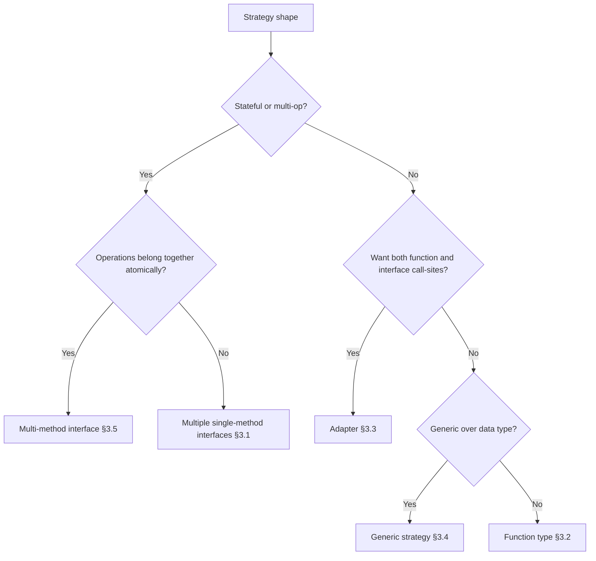
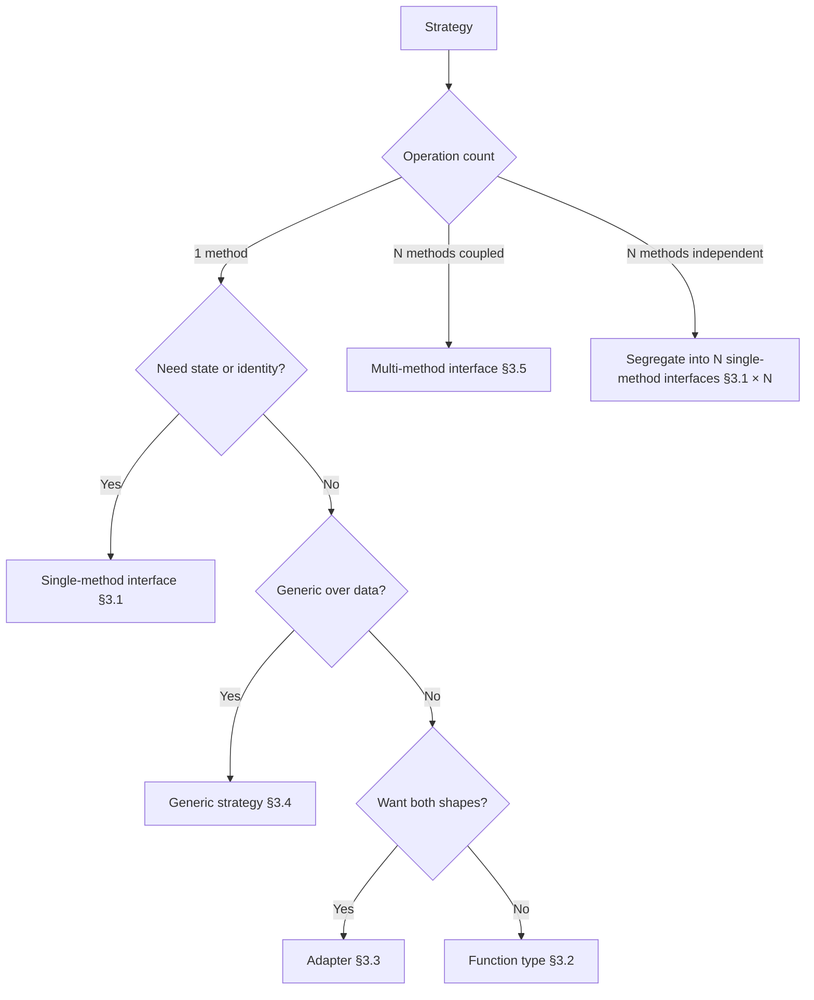
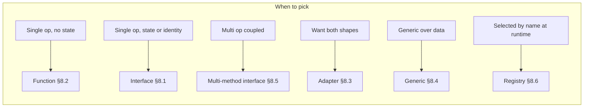
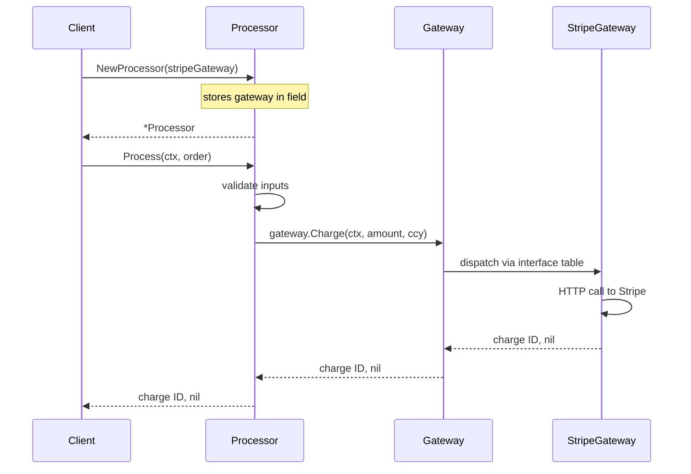
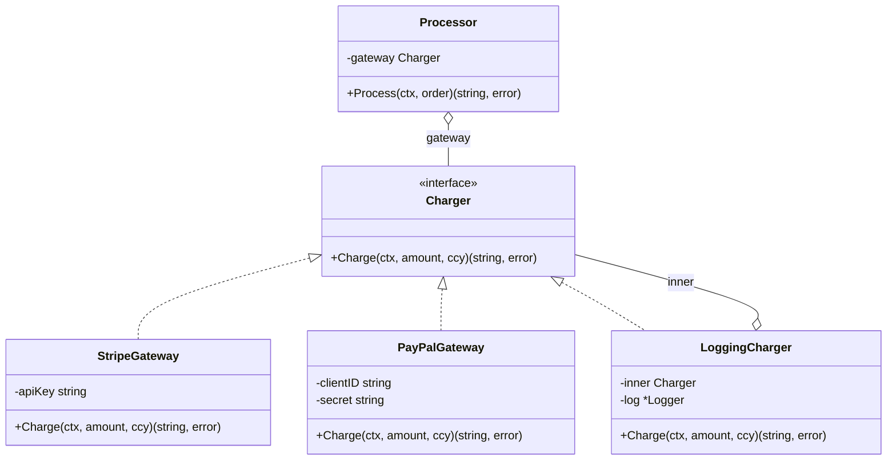
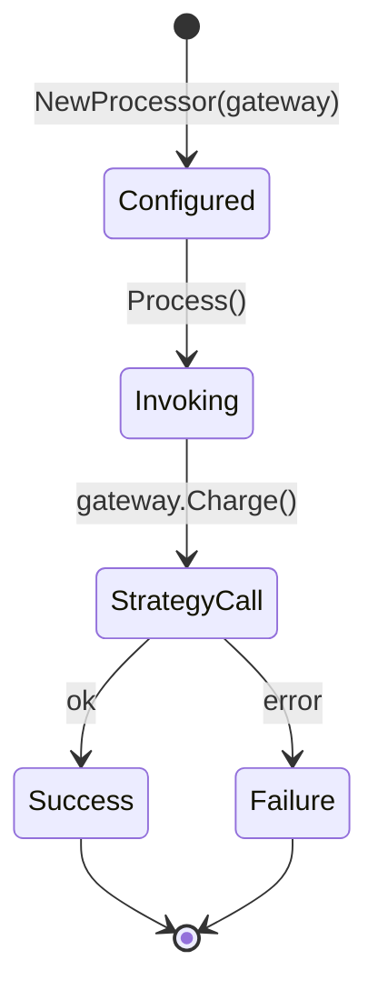

# Strategy Pattern — Specification

> **Focus:** A precise reference for the Strategy pattern as practised in the Go ecosystem. Unlike most GoF patterns whose Go renderings need careful translation, Strategy survives almost intact — it just stops *looking* like a pattern. The Go community's small-interface culture (Pike, Cox, Cheney, Donovan) made the pattern's structural skeleton — *a single-method type whose value is plugged into a consumer* — the language's default shape for behavioural variation. Every `io.Reader`, `http.Handler`, `sort.Interface`, `crypto/cipher.Block`, and `database/sql/driver.Driver` is a Strategy in the GoF sense.
>
> The audience files (junior/middle) explain *why* and *when*. This file is the canonical lookup: the pattern's historical antecedents, the Go spec mechanics that make each shape work, the five recognisable signature shapes, the standard-library APIs that embody each shape, the documented use in real third-party libraries, the formal invariants, the anti-patterns, the variants, the naming conventions, and the boundaries against neighbouring patterns (Template Method, State, Command, Decorator, Visitor).
>
> **Primary sources:**
> - Erich Gamma, Richard Helm, Ralph Johnson, John Vlissides, *Design Patterns: Elements of Reusable Object-Oriented Software* (Addison-Wesley, 1994), Chapter 5 — "Strategy", pp. 315–323.
> - Robert C. Martin, *Agile Software Development: Principles, Patterns, and Practices* (Prentice Hall, 2002) — "Favor composition over inheritance".
> - Rob Pike, *Go Proverbs* (Gopherfest, November 2015). https://go-proverbs.github.io
> - Rob Pike, *Don't communicate by sharing memory; share memory by communicating* (Go blog, 2010).
> - Go language specification: https://go.dev/ref/spec
> - *Effective Go*: https://go.dev/doc/effective_go
> - `net/http` source: https://pkg.go.dev/net/http
> - `io` package: https://pkg.go.dev/io
> - `sort` package: https://pkg.go.dev/sort
> - `crypto/cipher` package: https://pkg.go.dev/crypto/cipher
> - `database/sql/driver` package: https://pkg.go.dev/database/sql/driver
> - `google.golang.org/grpc` interceptors: https://pkg.go.dev/google.golang.org/grpc
> - `go-chi/chi` router middleware: https://pkg.go.dev/github.com/go-chi/chi/v5
> - `prometheus/client_golang` collectors: https://pkg.go.dev/github.com/prometheus/client_golang
> - `go.opentelemetry.io/otel` samplers and exporters: https://pkg.go.dev/go.opentelemetry.io/otel

---

## 1. Historical origins

The Strategy pattern is older than its name. Its essence — *select an algorithm at runtime by holding it as a value* — appears in every language with first-class functions, every object-oriented language with polymorphic dispatch, and every functional language with higher-order parameters. The 1994 GoF book gave the OO presentation its current name. Go's contribution is that the pattern stopped being a *pattern* and became the *default*.

### 1.1 Gang of Four (1994)

The original Strategy is defined in *Design Patterns* (Gamma, Helm, Johnson, Vlissides, 1994), Chapter 5, with this intent:

> *"Define a family of algorithms, encapsulate each one, and make them interchangeable. Strategy lets the algorithm vary independently from clients that use it."*

The GoF Strategy has three participants: **Strategy** (an abstract interface declaring the operation), **ConcreteStrategy** (a class that implements the algorithm), and **Context** (the object that holds a reference to a Strategy and delegates the variable step to it). The canonical 1994 example was a `Composition` (text layout) holding a `Compositor` reference, where `SimpleCompositor`, `TeXCompositor`, and `ArrayCompositor` produced different line-breaking algorithms behind the same `Compose()` method.

Three points often get lost in modern retellings: **the Strategy interface is a *named role***, not a wrapper around a function (GoF assumed languages without first-class functions); **the Context owns the Strategy reference** as instance state — runtime swapping is a feature; and **the algorithm and the data it operates on are decoupled** — the Context passes the data into the Strategy method as arguments. Go retains all three. What changes is the *machinery*: an interface declaration replaces an abstract class, structural satisfaction replaces explicit inheritance, and the Context owns an `interface` field rather than a pointer to a base class.

### 1.2 Composition over inheritance (Robert C. Martin and the SOLID era)

The 1994 GoF text argued Strategy as a *replacement for subclassing*. Robert Martin made the argument structural. In *Agile Software Development: Principles, Patterns, and Practices* (2002), Martin's "Favor composition over inheritance" principle (popularised earlier by Coplien and the GoF themselves) is presented as the foundation under Strategy:

> *"Whenever an algorithm or behaviour might vary, do not encode the variation in a class hierarchy. Encode it in a separate object whose type is the abstraction of the behaviour. Hold that object via composition. Subclassing locks you into a single decomposition; composition lets the decomposition change at runtime."*

Martin's *open–closed principle* — software entities open for extension, closed for modification — operates on Strategy as its workhorse. To add a new compression algorithm, write a new `Compressor`; do not modify the `Pipeline`. To add a new payment gateway, write a new `Gateway`; do not modify the `Processor`. The Context is *closed* to modification because it depends on the interface, not the concrete implementations; the system is *open* to extension because new strategies can be added without recompiling the Context.

Go was designed with this philosophy in mind. Pike, Thompson, and Griesemer's 2007–2009 design documents (later published as the FAQ and the *Effective Go* document) reject inheritance explicitly. The Go *FAQ* on inheritance is direct:

> *"Object-oriented programming, at least in the best-known languages, involves too much discussion of the relationships between types, relationships that often could be derived automatically. Go takes an unusual approach and lets the compiler do the work."*
> — *Go FAQ*, https://go.dev/doc/faq#inheritance

Structural interface satisfaction is the language-level realisation of "favor composition". The compiler computes the inheritance graph from method sets, and Strategy is the natural shape that falls out.

### 1.3 First-class functions in functional languages

A separate lineage runs through Lisp (1958), ML (1973), and Haskell (1990). In these languages, functions are values: you can store them in variables, pass them as arguments, return them from other functions, and place them in data structures. The "Strategy pattern" in Lisp is just *pass the function*. McCarthy's original `mapcar` (1958) is a Strategy consumer:

```lisp
(mapcar #'square '(1 2 3 4))  ; the strategy is #'square
```

ML and Haskell formalised this with higher-order types: `map :: (a -> b) -> [a] -> [b]`. The Strategy *interface* is the function type itself; the *Context* is the higher-order function; the *ConcreteStrategy* is any callable value of the right type. There is no pattern to name because the language treats functions as ordinary data.

Go inherited first-class functions through C (where they exist as function pointers) and Lisp (through Pike's familiarity with the early Bell Labs Plan 9 dialects). When a Go strategy fits in one function signature, the function form is preferred — this is the language acknowledging its functional ancestry. When the strategy has identity, state, or multiple operations, the interface form is preferred — this is the language acknowledging its OO ancestry. The two shapes coexist in the same idiom (the `HandlerFunc` adapter, §3.3), which is Go's distinctive contribution.

### 1.4 Rob Pike, small interfaces, and the Go culture

The shape of Strategy in Go is determined less by 1994 and more by a 2014–2016 sequence of talks and writings by Rob Pike and the early Go team. Three are decisive.

**"Don't communicate by sharing memory; share memory by communicating"** (Pike, 2010) — the proverb that frames Go's concurrency. Indirectly relevant: the same principle that says "design around communicating values, not mutating shared state" produces small interfaces as the unit of communication. Strategies *are* values that travel between packages.

**"The interface method set is the type"** (Pike, *Go at Google*, 2012) — the assertion that in Go, a type *is* what its method set says it is. An interface with one method is a complete abstraction. There is no need for class hierarchies or marker interfaces; if your type has `Read(p []byte) (n int, err error)`, it is an `io.Reader`. This is structural typing, and it makes Strategy trivial: declare the smallest interface that captures the variability, and any value satisfying it is a strategy.

**"The bigger the interface, the weaker the abstraction"** (Pike, *Go Proverbs*, 2015) — the maxim driving Go's culture of single-method interfaces. `io.Reader`, `io.Writer`, `io.Closer`, `fmt.Stringer`, `error`, `sort.Interface` (an exception — three methods), `http.Handler`, `http.Flusher`, `http.Hijacker` — all single-method or near-single-method. Each is a Strategy interface in GoF terms. The proverb's practical effect: when Go developers feel the urge to declare a "Strategy" with 5–10 methods, the culture redirects them to declare 5–10 separate interfaces and segregate them at the consumption point.

Pike's *Go Proverbs* collectively form the unwritten constitution of Go API design. The three most relevant to Strategy:

> *"The bigger the interface, the weaker the abstraction."*
>
> *"Accept interfaces, return structs."*
>
> *"A little copying is better than a little dependency."*

The first compels small Strategy interfaces. The second compels consumers to accept Strategy interfaces (the GoF Context) while implementations return their concrete types. The third compels duplication of small interface declarations across packages rather than dragging a shared abstraction package into every consumer.

### 1.5 Go community evolution

The Strategy pattern's life in Go has three phases.

**Phase 1 (2009–2012): standard library establishes the idiom.** The initial `io`, `sort`, `net/http`, `flag`, and `encoding/json` packages all use Strategy as their primary extension mechanism. By the time Go 1.0 shipped (March 2012), the pattern was so embedded in the standard library that the *name* "Strategy" never appears in the documentation — what would be a `RenderStrategy` in Java is just `io.Writer` here.

**Phase 2 (2012–2018): the ecosystem mimics the standard library.** Third-party packages (gRPC, Prometheus, Kubernetes' `client-go`, gorilla/mux, chi, cobra) all replicate the small-interface idiom. `grpc.UnaryInterceptor` is `Strategy`. `prometheus.Collector` is `Strategy`. `chi.Middleware` is `Strategy` (with a function-typed signature). The community converges on the conventions documented in §9.

**Phase 3 (2018–present): generics widen the toolkit.** Go 1.18 (March 2022) added type parameters. The first generic strategies appeared in slice/map/iterator utility libraries — `Map[T, R any](items []T, f func(T) R) []R` is a generic Strategy consumer. The standard library `slices.SortFunc`, `slices.IndexFunc`, `slices.BinarySearchFunc` (Go 1.21, 2023) replaced the `interface{}`-based `sort.Slice` with generic alternatives. The function-typed Strategy and the generic Strategy converge: a comparator `func(a, b T) int` is both a function value and a parametric Strategy.

The interface-based Strategy has not gone away. `io.Reader`, `http.Handler`, and `crypto/cipher.Block` remain the dominant shape for *multi-method* or *stateful* strategies. Generics extended the *single-function* Strategy with type parameters but did not displace the interface form.

---

## 2. Underlying Go spec mechanics

The Strategy pattern uses seven language features. Each is quoted (or paraphrased with section reference) from the Go specification at https://go.dev/ref/spec.

### 2.1 Interface types and structural satisfaction

> **Interface types** ([spec §Interface types](https://go.dev/ref/spec#Interface_types)):
> *"An interface type defines a type set. A variable of interface type can store a value of any type that is in the type set of the interface. Such a type is said to implement the interface."*

> **Implementing an interface** ([spec §Implementing an interface](https://go.dev/ref/spec#Implementing_an_interface)):
> *"A type `T` implements an interface if `T` is not an interface and is an element of the type set of the interface; or `T` is an interface and the type set of `T` is a subset of the type set of the interface."*

The crucial phrase is "is an element of the type set". Implementation is *structural* — there is no `implements` keyword, no explicit declaration, no dependency from the implementer to the interface. A `*os.File` satisfies `io.Reader` because it has a `Read(p []byte) (n int, err error)` method, full stop. This is the property that makes Strategy disappear in Go: declaring a Strategy interface in package `A` does *not* require any change to package `B`'s types that happen to satisfy it.

```go
// package os, written years before package io existed in its current form
type File struct { /* ... */ }
func (f *File) Read(p []byte) (n int, err error) { /* ... */ }

// package io, declares the interface
type Reader interface {
    Read(p []byte) (n int, err error)
}

// At any call site:
var r io.Reader = (*os.File)(nil)  // satisfied automatically; no import dependency between os→io
```

This is the structural-typing payoff: the Strategy interface can be added or replaced *after* the implementations exist.

### 2.2 Method sets

> **Method sets** ([spec §Method sets](https://go.dev/ref/spec#Method_sets)):
> *"The method set of a type determines the interfaces that the type implements and the methods that can be called using a receiver of that type. The method set of a defined type `T` consists of all methods declared with receiver type `T`. The method set of a pointer to a defined type `T` (where `T` is neither a pointer nor an interface) is the set of all methods declared with receiver `*T` or `T`."*

The receiver-kind distinction matters for Strategy: if a strategy's method has a pointer receiver, only the pointer to the concrete type satisfies the interface — the value type does not. This is the source of the §7.5 anti-pattern, where a value is assigned to an interface variable and the assignment fails to compile because the methods are pointer-receiver only.

```go
type Charger interface { Charge() error }

type StripeGateway struct{ /* ... */ }
func (s *StripeGateway) Charge() error { return nil }

var c Charger = StripeGateway{}   // compile error: StripeGateway does not implement Charger
var c Charger = &StripeGateway{}  // ok
```

### 2.3 Function types as values

> **Function types** ([spec §Function types](https://go.dev/ref/spec#Function_types)):
> *"A function type denotes the set of all functions with the same parameter and result types. The value of an uninitialised variable of function type is `nil`."*

Functions are first-class values: assignable, passable, comparable to `nil`, but not comparable to each other (function values are not ordered). A `func(int, int) bool` value is *itself* a Strategy. The function-typed Strategy is the GoF Strategy with the indirection of `interface{Compare(int, int) bool}` collapsed away.

### 2.4 Named function types and methods on them

> **Type declarations** ([spec §Type declarations](https://go.dev/ref/spec#Type_declarations)):
> *"A type definition creates a new, distinct type with the same underlying type and operations as the given type and binds an identifier, the type name, to it. The new type is called a *defined type*."*

> **Method declarations** ([spec §Method declarations](https://go.dev/ref/spec#Method_declarations)):
> *"A method is a function with a receiver. ... The receiver type must be a defined type `T` or a pointer to a defined type `T`, both declared in the same package as the method."*

Combining these: you can *name* a function type, and then you can *declare methods* on the named type. This is the mechanic behind the `HandlerFunc` adapter (§3.3):

```go
type HandlerFunc func(ResponseWriter, *Request)
func (f HandlerFunc) ServeHTTP(w ResponseWriter, r *Request) { f(w, r) }
```

`HandlerFunc` is a function type *with a method* — `ServeHTTP` — that makes it satisfy the `Handler` interface. A value of type `HandlerFunc` is simultaneously a function value (callable directly) and an interface implementation (passable where `Handler` is required). The trick is one of Go's signature idioms and only works because (a) function types are first-class, (b) defined types may be function-typed, and (c) methods can be declared on any defined type in the same package.

### 2.5 Type assertions and type switches

> **Type assertions** ([spec §Type assertions](https://go.dev/ref/spec#Type_assertions)):
> *"For an expression `x` of interface type, but not a type parameter, and a type `T`, the primary expression `x.(T)` asserts that `x` is not `nil` and that the value stored in `x` is of type `T`. ... If a type assertion holds, the value of the expression is the value stored in `x` and its type is `T`. If the type assertion is false, a run-time panic occurs."*

> **Type switches** ([spec §Type switches](https://go.dev/ref/spec#Type_switches)):
> *"A type switch compares types rather than values. ... A case clause of the form `case T1, T2, ...` is read as: `switch t := x.(type)` evaluated for each `Ti`."*

Type assertions let the consumer ask whether the Strategy *also* implements a richer interface (the optional-interface idiom, §12.3 of `middle.md` and §6.6 below). Type switches let the consumer dispatch on the strategy's concrete type when behaviour depends on it (rare, but used in `net/http.ResponseWriter` to detect `http.Hijacker`, `http.Flusher`, `http.CloseNotifier` capabilities).

### 2.6 Type parameters (Go 1.18+)

> **Type parameter declarations** ([spec §Type parameter declarations](https://go.dev/ref/spec#Type_parameter_declarations)):
> *"A type parameter list declares the type parameters of a generic function or type declaration. ... Each type parameter is a unique identifier and the corresponding type constraint is the type set of all the types listed in the constraint."*

Generic Strategy types parameterise the data the strategy operates on:

```go
type Less[T any] func(a, b T) bool
type Reducer[T, R any] func(acc R, item T) R
```

The Strategy interface's "method shape" is parameterised. Before generics, slice utilities had to take `[]any` and lose type safety, or be specialised per element type, or use reflection. Generics let one Strategy declaration cover all element types while preserving type safety end-to-end.

### 2.7 Interface embedding

> **Interface types — embedding** ([spec §Interface types](https://go.dev/ref/spec#Interface_types)):
> *"An interface `T` may use a (possibly qualified) interface type name `E` as an interface element. This is called *embedding* interface `E` in `T`. The type set of `T` is the intersection of the type sets defined by `T`'s explicitly declared methods and the type sets of `T`'s embedded interfaces."*

Embedding composes strategy interfaces:

```go
type ReadWriter interface {
    Reader
    Writer
}
```

`io.ReadWriter` is the composition of `io.Reader` and `io.Writer`. The consumer that needs both reads and writes accepts `io.ReadWriter`; the consumer that needs only reads accepts `io.Reader`. Embedding is the interface-segregation knob: split first, compose on demand.

### 2.8 Why the pattern *requires* most of these

| Spec feature | Removed → pattern becomes |
|--------------|--------------------------|
| Interface types | No Strategy interface; only the function shape |
| Structural satisfaction | Implementations must declare conformance explicitly (Java/C# style) |
| Method sets / receiver kinds | The receiver-mismatch trap (§7.5) ceases; but value-vs-pointer semantics collapse |
| Function types as values | Only the interface shape; no `sort.Slice`, no `http.HandlerFunc` |
| Named function types with methods | The HandlerFunc adapter is impossible; consumers must wrap functions in struct types |
| Type assertions | Optional interfaces are impossible; capability detection requires another mechanism |
| Type parameters | Strategy is monomorphic over data type; slice/map utilities can't be generic |
| Interface embedding | No interface composition; the consumer must accept the wide interface or a custom adapter |

Go has all eight. The Strategy pattern in Go is a direct consequence of this combination.

---

## 3. Canonical signature shapes

Five shapes account for essentially all Go strategy code. Each is documented with its declaration, the language features it leans on, and the standard-library or third-party APIs that exemplify it.

| Shape | Declaration | Used by |
|-------|-------------|---------|
| **Single-method interface** | `type Strategy interface { Do(args) result }` | `io.Reader`, `io.Writer`, `http.Handler`, `sort.Interface`, `fmt.Stringer`, `error` |
| **Function type** | `type Strategy func(args) result` | `http.HandlerFunc` (its `Handler`-conformance aside), `sort.Slice`'s `less`, `slices.SortFunc`'s `cmp` |
| **Adapter (named func with method)** | `type StrategyFunc ...; func (f StrategyFunc) Method(...) ...` | `http.HandlerFunc`, `http.RoundTripperFunc` (community), `grpc-go`'s middleware adapter idiom |
| **Generic strategy** | `type Strategy[T any] func(args) result` or `interface { Do(T) }` | `slices.SortFunc`, `slices.IndexFunc`, `cmp.Compare` |
| **Multi-method interface** | `type Strategy interface { Do1(...); Do2(...); ... }` | `sort.Interface`, `crypto/cipher.Block`, `database/sql/driver.Driver`, `flag.Value` |

### 3.1 Single-method interface

```go
package io

type Reader interface {
    Read(p []byte) (n int, err error)
}
```

The default Go shape for an extension point with state, identity, or multiple potential implementations from external packages. The interface declaration lives in the consumer package; implementations live wherever they happen to.

```go
// Consumer
func Copy(dst Writer, src Reader) (n int64, err error) {
    buf := make([]byte, 32*1024)
    for {
        nr, er := src.Read(buf)
        if nr > 0 {
            nw, ew := dst.Write(buf[:nr])
            // ...
        }
        if er != nil { /* ... */ }
    }
}
```

**Pick when:** strategy has state (a buffered reader, a configured client), strategy may have multiple operations later (start with one, segregate as needed), strategy is implemented by types in packages the consumer doesn't import, you want strategy values to be inspectable via `reflect.Type` or `fmt.Sprintf("%T")`.

**Used by:** `io.Reader`, `io.Writer`, `io.Closer`, `fmt.Stringer`, `error`, `http.Handler`, `http.RoundTripper`, `flag.Value` (two methods, but the principle is the same).

### 3.2 Function type

```go
package sort

// `Less` is not a declared type; it's an inline function-typed parameter.
func Slice(x any, less func(i, j int) bool) { /* ... */ }
```

Or with a named function type (common in third-party APIs):

```go
type Less func(i, j int) bool
```

The default Go shape for a strategy that is a single operation with a clean signature, no state, no identity. The function form removes the wrapper struct that an interface would impose. Allocations are minimal — a non-escaping closure compiles to zero allocation.

```go
sort.Slice(users, func(i, j int) bool { return users[i].Age < users[j].Age })

// or with a named type:
type Less func(i, j int) bool
sortBy := func(field string) Less { /* ... */ }
sort.Slice(users, sortBy("name"))
```

**Pick when:** strategy is one operation, signature is fixed, no need for the value to expose other operations, hot-path performance matters (function dispatch is marginally cheaper than interface dispatch — see §13 of `middle.md`).

**Used by:** `sort.Slice`, `sort.SliceStable`, `slices.SortFunc`, `slices.IndexFunc`, `strings.IndexFunc`, `strings.FieldsFunc`, `bufio.SplitFunc`, `path/filepath.WalkFunc`.

### 3.3 Adapter (named function type with method satisfying an interface)

```go
package http

type Handler interface {
    ServeHTTP(ResponseWriter, *Request)
}

type HandlerFunc func(ResponseWriter, *Request)

func (f HandlerFunc) ServeHTTP(w ResponseWriter, r *Request) {
    f(w, r)
}
```

The most distinctive Go Strategy idiom. The Strategy is declared as an interface (for the formal contract, the documentation, the multi-implementation story), *and* as a named function type with a method that satisfies the interface (so callers can pass either). The method body is one line: invoke the function. The cost at runtime is one extra method-call frame, which the compiler often inlines away.

```go
// At the consumer:
func Serve(h Handler) { /* ... */ h.ServeHTTP(w, r) /* ... */ }

// At the call site, three options:
http.Serve(listener, &MyHandler{})                       // interface form
http.Serve(listener, http.HandlerFunc(handleRoot))       // function form, explicit conversion
http.HandleFunc("/", handleRoot)                         // function form, convenience wrapper
```

The trick generalises. Wherever you publish a strategy interface, you can publish a sibling function-typed adapter and let callers choose. The adapter type is ~five lines and is essentially free at runtime.

**Pick when:** the strategy is single-method, the signature is simple, and you want both ergonomic forms at the call site. The interface form supports stateful implementations and richer test doubles; the function form supports terse inline closures.

**Used by:** `http.HandlerFunc`, `http.HandlerFunc.ServeHTTP`. Community echoes: `RoundTripperFunc` in many HTTP middleware libraries (rsc/quote's `httpadapter`, hashicorp/go-cleanhttp, etc.), `MiddlewareFunc` in chi and gorilla/mux, `LoggerFunc` in zap and slog.

### 3.4 Generic strategy (Go 1.18+)

```go
// Function form
type Less[T any] func(a, b T) bool

func Sort[T any](items []T, less Less[T]) { /* ... */ }

// Or directly inline as in slices.SortFunc:
func SortFunc[S ~[]E, E any](x S, cmp func(a, b E) int)
```

```go
// Interface form (rare for single-method strategies)
type Comparable[T any] interface {
    CompareTo(other T) int
}
```

The strategy is parameterised by the data type it operates on. Generic strategies are most common as function types (a comparator, a transformer, a predicate). Generic interface strategies are rarer because Go does not allow type parameters on methods, only on the enclosing type — so an interface like `Strategy[T]` must bind `T` at declaration of the implementer, not per-call.

```go
// stdlib slices, Go 1.21+
slices.SortFunc(users, func(a, b User) int {
    return cmp.Compare(a.Age, b.Age)
})
slices.IndexFunc(users, func(u User) bool { return u.Active })
slices.BinarySearchFunc(sorted, target, cmp.Compare[int])
```

**Pick when:** the strategy is structurally polymorphic — the operation is the same shape across types — and the call site benefits from type-safety on the element. Generic strategies are the right tool for slice/map/iterator utilities, generic algorithms, and library code that supports arbitrary user types.

**Used by:** `slices.SortFunc`, `slices.SortStableFunc`, `slices.IndexFunc`, `slices.ContainsFunc`, `slices.BinarySearchFunc`, `maps.DeleteFunc`, `cmp.Compare`, the broader ecosystem of generic-utility libraries (`samber/lo`, `thoas/go-funk`, etc.).

### 3.5 Multi-method interface

```go
package sort

type Interface interface {
    Len() int
    Less(i, j int) bool
    Swap(i, j int)
}
```

```go
package crypto/cipher

type Block interface {
    BlockSize() int
    Encrypt(dst, src []byte)
    Decrypt(dst, src []byte)
}
```

The strategy has multiple operations that *belong together* — they share state, they are always implemented as a unit, they form a coherent role. Multi-method strategies are rarer than single-method ones (the Go culture pushes toward segregation), but they exist where the role genuinely is multi-operation:

- `sort.Interface` because sorting is fundamentally `len + less + swap`, and an algorithm that has only one of the three cannot be sorted.
- `crypto/cipher.Block` because a block cipher is `block-size + encrypt + decrypt`, all needed for any meaningful use.
- `database/sql/driver.Driver` (and its descendants `Conn`, `Stmt`, `Rows`, `Tx`) because a SQL driver has a coherent lifecycle and the lifecycle steps must all be present.
- `flag.Value` is two methods (`String() string`, `Set(string) error`) for symmetric reasons.

**Pick when:** the operations are conceptually atomic — no implementation could meaningfully provide some without the others. Otherwise segregate into multiple single-method interfaces and compose at the consumption site.

**Used by:** `sort.Interface`, `crypto/cipher.Block`, `crypto/cipher.BlockMode`, `crypto/cipher.Stream`, `database/sql/driver.Driver`, `flag.Value`, `encoding/binary.ByteOrder`, `image.Image`.

### 3.6 Shape comparison



---

## 4. Standard library use

Unlike Builder and Functional Options, Strategy is the *defining idiom* of the Go standard library. Every major package exposes its extension points as small interfaces or function types. This section walks through the most-used examples.

### 4.1 `io.Reader`, `io.Writer`, `io.Closer`

```go
// from io
type Reader interface {
    Read(p []byte) (n int, err error)
}

type Writer interface {
    Write(p []byte) (n int, err error)
}

type Closer interface {
    Close() error
}
```

Three of the most-implemented interfaces in the Go ecosystem. `io.Reader` alone has dozens of standard-library implementations: `*os.File`, `*bytes.Buffer`, `*strings.Reader`, `*bytes.Reader`, `*bufio.Reader`, `*gzip.Reader`, `*flate.Reader`, `*tls.Conn`, `*http.Body`, and so on. Every one is a Strategy in the GoF sense — the algorithm of "read bytes from a source" varies, the consumer (e.g., `io.Copy`, `json.Decoder`, `bufio.Scanner`) is agnostic.

The interface declarations themselves predate most implementations. `os.File` was written without knowing `io.Reader` would be the universal abstraction; `gzip.Reader` was written in a separate package; `tls.Conn` in another. None of them imports an "interface package"; they each have a `Read([]byte) (int, error)` method and that suffices.

Embedding composes them:

```go
type ReadCloser interface {
    Reader
    Closer
}

type ReadWriter interface {
    Reader
    Writer
}

type ReadWriteCloser interface {
    Reader
    Writer
    Closer
}
```

`http.Response.Body` is `io.ReadCloser`. `net.Conn` is `io.ReadWriteCloser` (and more). The interface segregation lets callers accept the narrowest form.

### 4.2 `sort.Interface` and `sort.Slice`

```go
// from sort
type Interface interface {
    Len() int
    Less(i, j int) bool
    Swap(i, j int)
}

func Sort(data Interface) { /* ... */ }

func Slice(x any, less func(i, j int) bool) { /* ... */ }
```

`sort` exposes *two* Strategy shapes for the same algorithm. `sort.Sort` takes the multi-method interface; `sort.Slice` takes a function and uses reflection to perform the swap. Until Go 1.21, this was the canonical example of "two shapes for one role" before the adapter idiom was generalised. With Go 1.21+ generics, `slices.SortFunc` replaces `sort.Slice` with a type-safe, reflection-free alternative:

```go
// Go 1.21+
slices.SortFunc(users, func(a, b User) int { return cmp.Compare(a.Age, b.Age) })
```

The `sort.Interface` form remains for backward compatibility and for algorithms that genuinely need the three operations as a unit (e.g., sorting a non-slice container).

### 4.3 `net/http.Handler`, `http.HandlerFunc`, `http.RoundTripper`

```go
// from net/http
type Handler interface {
    ServeHTTP(ResponseWriter, *Request)
}

type HandlerFunc func(ResponseWriter, *Request)

func (f HandlerFunc) ServeHTTP(w ResponseWriter, r *Request) { f(w, r) }

type RoundTripper interface {
    RoundTrip(*Request) (*Response, error)
}
```

`Handler` is the canonical adapter idiom (§3.3). `RoundTripper` is the request-side strategy — `http.Client.Transport` is `RoundTripper`, and a Decorator that wraps `RoundTripper` to add logging, retries, auth, or metrics is the canonical HTTP middleware pattern. The standard library does not ship a `RoundTripperFunc` adapter, but the community has converged on:

```go
type RoundTripperFunc func(*http.Request) (*http.Response, error)
func (f RoundTripperFunc) RoundTrip(r *http.Request) (*http.Response, error) { return f(r) }
```

### 4.4 `flag.Value`

```go
// from flag
type Value interface {
    String() string
    Set(string) error
}
```

The two-method strategy for custom command-line flag parsing. `flag.Var(value Value, name, usage string)` lets you plug in any custom type — your own duration parser, your own enum, your own list type — and have it participate in `flag.Parse()`. Implementations exist for `bool`, `int`, `string`, `time.Duration`, and any user type that satisfies the interface.

### 4.5 `encoding/json` and `encoding` interfaces

```go
// from encoding/json
type Marshaler interface {
    MarshalJSON() ([]byte, error)
}

type Unmarshaler interface {
    UnmarshalJSON([]byte) error
}

// from encoding
type TextMarshaler interface {
    MarshalText() (text []byte, err error)
}

type TextUnmarshaler interface {
    UnmarshalText(text []byte) error
}
```

The `encoding/json` decoder *checks* whether the target type implements `json.Unmarshaler` (or `encoding.TextUnmarshaler`, or no marshalling interface, falling back to reflection). Each implementation is a Strategy for how a particular type serialises itself. The decoder's loop is the Context; the type's `MarshalJSON`/`UnmarshalJSON` is the strategy.

```go
type Duration time.Duration

func (d Duration) MarshalJSON() ([]byte, error) {
    return json.Marshal(time.Duration(d).String())
}

func (d *Duration) UnmarshalJSON(b []byte) error {
    var s string
    if err := json.Unmarshal(b, &s); err != nil { return err }
    td, err := time.ParseDuration(s)
    *d = Duration(td)
    return err
}
```

The standard library's `encoding/xml`, `encoding/gob`, `database/sql.Scanner`, `database/sql/driver.Valuer`, and the third-party `gopkg.in/yaml.v3` all follow the same pattern: an interface that the consumer can detect via type assertion, providing a per-type Strategy for serialisation.

### 4.6 `crypto/cipher`

```go
// from crypto/cipher
type Block interface {
    BlockSize() int
    Encrypt(dst, src []byte)
    Decrypt(dst, src []byte)
}

type BlockMode interface {
    BlockSize() int
    CryptBlocks(dst, src []byte)
}

type Stream interface {
    XORKeyStream(dst, src []byte)
}
```

Three Strategy interfaces at different levels of the cryptographic stack. `Block` is a block cipher (AES, DES, 3DES); `BlockMode` is a block-cipher *mode of operation* (CBC, ECB); `Stream` is a stream cipher (CTR, OFB, CFB, CHACHA20). Each level composes: `cipher.NewCBCEncrypter(block, iv)` takes a `Block` and returns a `BlockMode`; `cipher.NewCTR(block, iv)` takes a `Block` and returns a `Stream`.

```go
block, _ := aes.NewCipher(key)       // returns Block (AES)
stream := cipher.NewCTR(block, iv)   // wraps Block into Stream (CTR mode)
stream.XORKeyStream(dst, src)
```

The Strategy at one level becomes the parameter of the Strategy at the next. This is composition of strategies in the cleanest form Go offers.

### 4.7 `database/sql/driver`

```go
// from database/sql/driver
type Driver interface {
    Open(name string) (Conn, error)
}

type Conn interface {
    Prepare(query string) (Stmt, error)
    Close() error
    Begin() (Tx, error)
}

type Stmt interface {
    Close() error
    NumInput() int
    Exec(args []Value) (Result, error)
    Query(args []Value) (Rows, error)
}

type Rows interface {
    Columns() []string
    Close() error
    Next(dest []Value) error
}
```

`database/sql.Register(name string, driver Driver)` is the registry idiom (`middle.md` §5): each driver — `github.com/lib/pq` for PostgreSQL, `github.com/go-sql-driver/mysql` for MySQL, `github.com/mattn/go-sqlite3` for SQLite — registers itself by name in `init()`, and `sql.Open("postgres", dsn)` looks up the registered driver Strategy. The `database/sql` package is the Context; the driver is the Strategy.

The `Conn`, `Stmt`, `Rows`, `Tx` interfaces are themselves strategies returned by methods on parent strategies — the lifecycle of a database operation is a chain of Strategy values, each produced by the previous one.

### 4.8 `compress/*` packages

`compress/gzip`, `compress/flate`, `compress/zlib`, `compress/lzw`, `compress/bzip2` all expose `Reader` and `Writer` types that satisfy `io.Reader` and `io.Writer`. The strategy here is *the compression algorithm*; the consumer is anything that reads/writes through `io.Reader`/`io.Writer`. Third-party packages — `github.com/golang/snappy`, `github.com/klauspost/compress/zstd`, `github.com/pierrec/lz4` — slot into the same interfaces.

```go
var src io.Reader = strings.NewReader(text)
src = gzip.NewWriter(src)        // wraps in gzip — actually returns *gzip.Writer, demonstration
// Better: a decompression reader wraps a compressed reader
zr, _ := gzip.NewReader(compressedSrc)
io.Copy(dst, zr)                 // dst doesn't know it's reading gzip
```

The "compression algorithm" is a Strategy whose interface is `io.Reader`/`io.Writer`. The pattern is so embedded in the architecture that no one calls it "Strategy" — it is just "wrapping a Reader".

### 4.9 `errors.Is` and `errors.As`

```go
// from errors
func Is(err, target error) bool
func As(err error, target any) bool

// The unwrapping interfaces:
type interface { Unwrap() error }
type interface { Unwrap() []error }
type interface { Is(target error) bool }
type interface { As(target any) bool }
```

`errors.Is` and `errors.As` traverse a chain of wrapped errors and, at each node, *delegate* the comparison to either a default rule or the error's own `Is`/`As` method if it implements one. The custom `Is` and `As` methods are Strategy implementations for "how do I compare myself to a target".

```go
type NotFoundError struct{ Resource string }
func (e *NotFoundError) Error() string { return "not found: " + e.Resource }
func (e *NotFoundError) Is(target error) bool {
    _, ok := target.(*NotFoundError)
    return ok
}

var ErrNotFound = &NotFoundError{}
errors.Is(someErr, ErrNotFound)  // uses NotFoundError's custom Is
```

### 4.10 `runtime.SetFinalizer`

```go
func SetFinalizer(obj any, finalizer any)
```

The finalizer is a Strategy for "what to do when this object is garbage-collected". It's a function value (`func(*T)`) attached to a value of type `*T`. Rarely used in application code; mentioned here for completeness because it's a documented Strategy attachment point in the runtime.

### 4.11 Standard library summary

| Package | Strategy interface or function type | Role |
|---------|------------------------------------|------|
| `io` | `Reader`, `Writer`, `Closer`, `Seeker`, `ReaderAt`, `WriterTo`, `ReaderFrom` | Stream of bytes |
| `sort` | `Interface`, `sort.Slice`'s `less` | Comparison and swap |
| `slices` (1.21+) | `slices.SortFunc`'s `cmp`, `IndexFunc`'s `pred` | Generic comparison and predicate |
| `cmp` (1.21+) | `cmp.Ordered`, `cmp.Compare[T]` | Generic ordering |
| `net/http` | `Handler`, `HandlerFunc`, `RoundTripper`, `Flusher`, `Hijacker`, `CloseNotifier` | HTTP request/response handling |
| `flag` | `Value`, `Getter` | Custom flag parsing |
| `encoding/json` | `Marshaler`, `Unmarshaler` | JSON serialisation |
| `encoding` | `TextMarshaler`, `TextUnmarshaler`, `BinaryMarshaler`, `BinaryUnmarshaler` | Text/binary serialisation |
| `encoding/xml` | `Marshaler`, `Unmarshaler`, `MarshalerAttr`, `UnmarshalerAttr` | XML serialisation |
| `fmt` | `Stringer`, `GoStringer`, `Formatter`, `Scanner` | Formatting and scanning |
| `errors` | `interface{ Unwrap() error }`, `interface{ Is(error) bool }`, `interface{ As(any) bool }` | Error chain traversal |
| `crypto/cipher` | `Block`, `BlockMode`, `Stream`, `AEAD` | Cryptographic algorithms |
| `database/sql/driver` | `Driver`, `Conn`, `Stmt`, `Rows`, `Tx`, `Result`, `Value`, `Valuer` | SQL driver lifecycle |
| `database/sql` | `Scanner` | Row column scanning |
| `image` | `Image`, `PalettedImage`, `RGBA`, `Quantizer`, `Drawer` | Pixel access and drawing |
| `compress/*` | `io.Reader`/`io.Writer` re-use | Compression algorithm |
| `hash` | `Hash`, `Hash32`, `Hash64` | Hashing algorithm |
| `runtime` | `SetFinalizer` callback | Garbage-collection callback |
| `path/filepath` | `WalkFunc`, `WalkDirFunc` | Per-file callback during walk |
| `text/template` | `template.FuncMap` (map of strategies) | Template function calls |
| `bufio` | `SplitFunc` | Scanner split rule |

The pattern is so pervasive that listing it exhaustively for the standard library is a multi-page exercise. The takeaway: nearly every extension point in the standard library is a Strategy in one of the five shapes from §3.

---

## 5. Documented use in real libraries

The third-party ecosystem follows the standard library's lead and amplifies it. This section walks through five major libraries to show how Strategy is expressed in production code.

### 5.1 `google.golang.org/grpc` — interceptors

gRPC for Go exposes its cross-cutting extension point as two Strategy types: `UnaryServerInterceptor`, `UnaryClientInterceptor`, `StreamServerInterceptor`, `StreamClientInterceptor`. From [`grpc/interceptor.go`](https://github.com/grpc/grpc-go/blob/master/interceptor.go):

```go
type UnaryServerInterceptor func(
    ctx context.Context,
    req any,
    info *UnaryServerInfo,
    handler UnaryHandler,
) (resp any, err error)

type UnaryHandler func(ctx context.Context, req any) (any, error)
```

`UnaryServerInterceptor` is a function-typed Strategy that wraps a `UnaryHandler`. The interceptor receives the request, can mutate context, can short-circuit (return early without calling the handler), can transform the response, can recover from panics. Multiple interceptors are chained via `grpc.ChainUnaryInterceptor(i1, i2, i3)`, which itself returns an interceptor whose body invokes each in order. The chain is composition of strategies (`middle.md` §6) realised in the gRPC layer.

```go
func loggingInterceptor(ctx context.Context, req any, info *grpc.UnaryServerInfo, handler grpc.UnaryHandler) (any, error) {
    start := time.Now()
    resp, err := handler(ctx, req)
    log.Printf("%s took %v err=%v", info.FullMethod, time.Since(start), err)
    return resp, err
}

s := grpc.NewServer(
    grpc.ChainUnaryInterceptor(loggingInterceptor, authInterceptor, metricsInterceptor),
)
```

This shape is *Strategy + Decorator* combined: each interceptor wraps the next, all share the same interface (function type), and the chain is the composition. gRPC's design here is among the cleanest realisations of layered strategies in any Go library.

### 5.2 `go-chi/chi` — middleware

`github.com/go-chi/chi/v5` exposes middleware as a function-typed Strategy:

```go
type Middlewares []func(http.Handler) http.Handler

type Router interface {
    Use(middlewares ...func(http.Handler) http.Handler)
    // ...
}
```

The middleware type is `func(http.Handler) http.Handler` — a function that takes a handler and returns a wrapped handler. This is the *Decorator* shape, but each middleware is also a Strategy for "what cross-cutting concern to apply". The router holds a slice of middlewares; on each request, the slice composes (innermost first) into a single chain.

```go
r := chi.NewRouter()
r.Use(middleware.Logger)
r.Use(middleware.Recoverer)
r.Use(middleware.Compress(5))
r.Get("/users", listUsers)
```

Each `middleware.X` is a Strategy. The router is the Context. The chain composition is identical in spirit to gRPC interceptors (§5.1) — same pattern, slightly different signature (HTTP-shaped rather than RPC-shaped).

### 5.3 `prometheus/client_golang` — collectors

`github.com/prometheus/client_golang/prometheus` exposes metric collection as a Strategy:

```go
type Collector interface {
    Describe(chan<- *Desc)
    Collect(chan<- Metric)
}
```

A Collector is a two-method Strategy: `Describe` enumerates the metric descriptors it produces; `Collect` emits the current values. The Prometheus registry holds a set of Collectors; on each scrape, it iterates them and emits the union of their metrics.

Standard library counters, gauges, histograms, and summaries each implement `Collector`. User-defined collectors (e.g., one that wraps an OS metric, a Kubernetes API, a database statistic) implement the same interface and register with the same `Register`/`MustRegister` calls.

```go
type DBStatsCollector struct { db *sql.DB; desc *prometheus.Desc }

func (c *DBStatsCollector) Describe(ch chan<- *prometheus.Desc) { ch <- c.desc }
func (c *DBStatsCollector) Collect(ch chan<- prometheus.Metric) {
    stats := c.db.Stats()
    ch <- prometheus.MustNewConstMetric(c.desc, prometheus.GaugeValue, float64(stats.OpenConnections))
}

prometheus.MustRegister(&DBStatsCollector{db: db, desc: ...})
```

`Collector` is a two-method Strategy where the operations are coupled (a Collector that can Describe but not Collect is meaningless) — fitting the §3.5 multi-method shape.

### 5.4 `go.opentelemetry.io/otel` — samplers and exporters

OpenTelemetry-Go uses Strategy at every extension point. Two notable ones:

```go
// Sampler decides whether a span is sampled.
type Sampler interface {
    ShouldSample(parameters SamplingParameters) SamplingResult
    Description() string
}

// SpanExporter exports completed spans.
type SpanExporter interface {
    ExportSpans(ctx context.Context, spans []ReadOnlySpan) error
    Shutdown(ctx context.Context) error
}
```

`AlwaysSample`, `NeverSample`, `TraceIDRatioBased`, `ParentBased` are concrete sampler strategies. `stdouttrace.Exporter`, `otlptracegrpc.Exporter`, `jaeger.Exporter`, `zipkin.Exporter` are concrete exporter strategies. The tracer provider is the Context, configured with one sampler and one or more exporters at construction time. Each exporter is itself a Strategy that delegates to a transport (gRPC, HTTP, file).

The chain pattern recurs: a `BatchSpanProcessor` is itself a Strategy that wraps a `SpanExporter` and adds batching/buffering — Decorator on top of Strategy, same shape as `middle.md` §11.

### 5.5 `kubernetes/client-go` — REST clients and informers

```go
// rest.Interface — the wire-level Strategy
type Interface interface {
    GetRateLimiter() flowcontrol.RateLimiter
    Verb(verb string) *Request
    Post() *Request
    Put() *Request
    Patch(pt types.PatchType) *Request
    Get() *Request
    Delete() *Request
    APIVersion() schema.GroupVersion
    // ...
}
```

`rest.Interface` is the Kubernetes REST client Strategy. Concrete implementations include `rest.RESTClient` (production), `testing.FakeClient` (for tests), and any custom implementation that satisfies the interface (rare but possible). The typed clients (`CoreV1().Pods("ns")`, `AppsV1().Deployments("ns")`) all wrap `rest.Interface`; substituting a fake REST client at construction substitutes the entire wire layer for testing.

The informer framework — `cache.SharedInformer`, `cache.SharedIndexInformer` — exposes event handlers as a Strategy:

```go
type ResourceEventHandler interface {
    OnAdd(obj any, isInInitialList bool)
    OnUpdate(oldObj, newObj any)
    OnDelete(obj any)
}

type ResourceEventHandlerFuncs struct {
    AddFunc    func(obj any)
    UpdateFunc func(oldObj, newObj any)
    DeleteFunc func(obj any)
}
func (r ResourceEventHandlerFuncs) OnAdd(obj any, isInInitialList bool) { /* delegates */ }
func (r ResourceEventHandlerFuncs) OnUpdate(oldObj, newObj any)         { /* delegates */ }
func (r ResourceEventHandlerFuncs) OnDelete(obj any)                    { /* delegates */ }
```

`ResourceEventHandlerFuncs` is the §3.3 adapter — a struct of function fields with a method shim that satisfies `ResourceEventHandler`. Callers can pass either a hand-rolled struct implementing `ResourceEventHandler` or a `ResourceEventHandlerFuncs` literal with only the callbacks they care about. This is the same idiom as `http.HandlerFunc`, generalised to multi-method interfaces.

### 5.6 Library summary

| Library | Strategy | Shape | Notes |
|---------|----------|-------|-------|
| `google.golang.org/grpc` | `UnaryServerInterceptor`, etc. | Function (§3.2) | Chain composes via `ChainUnaryInterceptor` |
| `go-chi/chi` | `func(http.Handler) http.Handler` | Function (Decorator-shaped) | Aliased to `Middlewares []func(http.Handler) http.Handler` |
| `prometheus/client_golang` | `Collector` | Multi-method interface (§3.5) | Two coupled operations |
| `go.opentelemetry.io/otel` | `Sampler`, `SpanExporter`, `MetricExporter` | Multi-method interface (§3.5) | Composed via `BatchSpanProcessor` etc. |
| `kubernetes/client-go` | `rest.Interface`, `ResourceEventHandler` | Multi-method interface + adapter (§3.5 + §3.3) | Adapter named `ResourceEventHandlerFuncs` |
| `aws-sdk-go-v2` | `middleware.FinalizeMiddleware`, etc. | Multi-method interface | Pipeline of strategies, similar to gRPC interceptors |
| `gorilla/websocket` | `Upgrader.CheckOrigin func(*http.Request) bool` | Function (§3.2) | Strategy for origin validation |
| `cobra` | `*Command.RunE func(cmd *Command, args []string) error` | Function (§3.2) | Strategy per subcommand |
| `viper` | `viper.RemoteProvider` interface | Multi-method interface (§3.5) | Strategy for remote config sources |
| `zap` / `slog` | `Sink`, `Handler` | Multi-method interface (§3.5) | Strategy for log output |

The recurring pattern across these libraries: each has *one* primary Strategy interface that defines its core extension axis, plus optional adapter types (function-typed or struct-of-funcs) for callers who don't want to declare types. The ecosystem standardised on the standard library's idioms.

---

## 6. The specification of the pattern itself

An implementation of the Strategy pattern in Go consists of the following five elements. A correct implementation has all five; a missing element is a defect or a sign that you've chosen a different pattern.

**Element A — A strategy type.** A type whose values represent the variable operation. In Go, almost always one of:
- A single-method interface (§3.1).
- A function type, anonymous or named (§3.2).
- A multi-method interface where the methods are coupled (§3.5).

**Element B — Concrete strategy values.** Values of types that satisfy the strategy type. For interface strategies, the satisfaction is structural — no `implements` declaration. For function-typed strategies, any function literal or named function of the right signature qualifies.

**Element C — A consumer (Context).** A type — usually a struct, sometimes a function — that holds a strategy value and invokes it as part of a fixed algorithm. The consumer does not know which concrete strategy it holds; it interacts only through the strategy type.

```go
type Processor struct {
    gateway Gateway  // strategy field
}

func (p *Processor) Process(ctx context.Context, o Order) (string, error) {
    // fixed algorithm
    if o.AmountCents <= 0 { return "", errors.New("invalid amount") }
    id, err := p.gateway.Charge(ctx, o.AmountCents, o.Currency)  // delegated step
    if err != nil { return "", fmt.Errorf("Process: %w", err) }
    // more fixed algorithm
    return id, nil
}
```

**Element D — A configuration point.** A way for the strategy to be supplied to the consumer. The three common shapes:
- *Constructor injection:* `NewProcessor(g Gateway) *Processor`. Set at construction, never changed.
- *Field assignment:* `p.gateway = g`. Settable post-construction, can change.
- *Per-call parameter:* `p.Process(ctx, order, gateway)`. Supplied at every invocation.

Constructor injection is the default; field assignment is uncommon and slightly suspect; per-call parameter is rare but appears in functional shapes (`sort.Slice`).

**Element E — Conventions for lifecycle, identity, and contract.** (1) The strategy is conceptually immutable across calls — the consumer assumes calling the same strategy twice with the same arguments yields the same result (or fails the same way). (2) The strategy has identity only if its concrete type does; the consumer should not depend on identity beyond what the interface exposes. (3) The contract on the strategy method is documented on the interface declaration (not the implementations).

A "Strategy API" without all five elements is one of the following:

| Missing element | Resulting pattern |
|-----------------|-------------------|
| A (no strategy type) | Hardcoded algorithm; no variation point |
| B (no concrete strategies) | An unimplemented interface; an unused abstraction |
| C (no consumer) | A free-floating interface; the strategy is the API |
| D (no configuration point) | An interface used for type-checking but never plugged in |
| E (no contract) | Ad-hoc interface; implementations diverge unpredictably |

### 6.1 The five recognisable shapes



### 6.2 Invariants

A correct Go Strategy satisfies these invariants. Violations are defects or surprising designs.

| Invariant | Statement |
|-----------|-----------|
| **Structural satisfaction** | Implementations must not declare conformance; the compiler computes it from method sets. |
| **Documented contract** | The strategy type's documentation states the contract; implementations follow it without re-stating. |
| **No identity dependence** | The consumer must not compare strategy values for equality, depend on `==`, or use them as map keys (unless the strategy type is explicitly comparable). |
| **Idempotent inspection** | If the consumer type-asserts the strategy to a richer interface (optional-interface pattern), it does so once and caches the result. |
| **No mutation through the strategy interface** | Strategy methods may mutate the strategy's own state, but the consumer must not assume this and must not interpret it. |
| **Concurrency contract is explicit** | Either the strategy is safe for concurrent use (typical for stateless or read-only ones), or it isn't, and the documentation says which. |
| **Nil contract is explicit** | Either the consumer accepts a nil strategy (with documented behaviour — usually "use a default"), or it rejects nil (panic or error). The contract is documented. |

### 6.3 The relationship to GoF roles

| GoF role | Go realisation |
|----------|----------------|
| **Strategy** (abstract class/interface) | Interface (§3.1, §3.5) or function type (§3.2, §3.4) |
| **ConcreteStrategy** | Any type satisfying the interface, or any function of the right type |
| **Context** | The consumer struct (or function) holding the strategy |
| **Client** | The caller that picks the concrete strategy and gives it to the Context |

The mapping is one-to-one. The structural-typing twist is that *ConcreteStrategy* values can be added without modifying *Strategy* — a property the GoF book did not have to address because Smalltalk and C++ both required explicit inheritance.

### 6.4 The relationship to first-class functions

In a language with first-class functions, the Strategy interface with one method is equivalent to a function type with the same signature. Go's culture embraces both:

```go
// Interface form
type Less interface {
    Less(i, j int) bool
}

// Function form (preferred when no state needed)
type Less func(i, j int) bool
```

The function form is shorter; the interface form supports state and multiple implementations from external packages that may also need to expose other methods. The §3.3 adapter unifies them.

### 6.5 The relationship to higher-order functions

A consumer that accepts a function-typed strategy is a *higher-order function* in functional programming terms. `sort.Slice`, `slices.SortFunc`, `slices.IndexFunc` are all higher-order functions. The "Strategy pattern" naming for these is a GoF anachronism — they predate the book by decades — but the *role* is the same: vary the algorithm, fix the loop.

### 6.6 The optional-interface idiom

A consumer can ask whether its strategy *also* satisfies a richer interface:

```go
type Charger interface { Charge(ctx context.Context, amount int) error }
type Named interface { Name() string }

func describe(c Charger) string {
    if n, ok := c.(Named); ok {
        return n.Name()
    }
    return fmt.Sprintf("%T", c)
}
```

The strategy interface stays small; richer behaviour is *probed* via type assertion. This is the standard library's pattern: `http.ResponseWriter` is small (three methods), but at runtime callers probe `http.Flusher`, `http.Hijacker`, `http.CloseNotifier`, `http.Pusher` to access optional capabilities. The strategy doesn't have to declare any of them; the implementation declares whichever ones it supports.

---

## 7. Anti-patterns

What people do that violates the pattern's intent. Each is observed in production Go code; each should be rejected in code review.

### 7.1 Naming the interface after the pattern

```go
// Smell
type PaymentStrategy interface { Charge(...) error }
type SortingStrategy interface { Sort([]int) }
type CompressionStrategy interface { Compress([]byte) []byte }
```

In Go, interface names describe the role, not the pattern. `Gateway`, `Sorter`, `Compressor`. The pattern is so default that naming it explicitly is noise. The Java/C# habit of `XxxStrategy` reads as "this thing wraps a pattern", which is the wrong framing — in Go, *all* interfaces are pattern realisations; the interesting fact is what the interface *does*.

**Rule:** name the interface after what it *is* (`Reader`, `Charger`, `Compressor`, `Sampler`) — never after what *pattern* it implements.

### 7.2 The big interface with stubbed methods

```go
type Gateway interface {
    Charge(ctx context.Context, amount int) error
    Refund(ctx context.Context, id string) error
    Authorize(ctx context.Context, amount int) error
    Capture(ctx context.Context, id string) error
    Void(ctx context.Context, id string) error
    GetTransaction(ctx context.Context, id string) (*Transaction, error)
    ListTransactions(ctx context.Context) ([]*Transaction, error)
    Webhook(req *http.Request) error
}

type SquareGateway struct{}
func (s *SquareGateway) Charge(...) error                    { return realChargeImpl() }
func (s *SquareGateway) Refund(...) error                    { return errors.New("not supported") }
func (s *SquareGateway) Authorize(...) error                 { return errors.New("not supported") }
// ... five more "not supported"
```

The implementation must satisfy the whole interface even if it can only do one thing. The consumer that calls only `Charge` forces every gateway to declare seven unused methods. The fix is interface segregation (`middle.md` §3):

```go
type Charger interface    { Charge(...) error }
type Refunder interface   { Refund(...) error }
type Authorizer interface { Authorize(...) error }
// ...
```

The processor accepts `Charger`. The refund handler accepts `Refunder`. The gateway implementations expose whichever methods they support. Capability detection happens via type assertion (§6.6).

**Rule:** the smallest interface that satisfies the *consumer* is the right interface. Wider interfaces force unimplemented stubs.

### 7.3 Enum dispatch masquerading as strategy

```go
type GatewayKind int
const (
    Stripe GatewayKind = iota
    PayPal
    Square
)

func Charge(kind GatewayKind, amount int) error {
    switch kind {
    case Stripe:  return chargeStripe(amount)
    case PayPal:  return chargePayPal(amount)
    case Square:  return chargeSquare(amount)
    }
    return errors.New("unknown gateway")
}
```

The switch *is* the strategy, expressed as an enum dispatch. Adding a fourth gateway means modifying `Charge`. This violates the open–closed principle and defeats the purpose of having strategies. Use a strategy type instead:

```go
type Charger interface { Charge(amount int) error }

var charger Charger = pickByKind(kind)
charger.Charge(amount)
```

Enum dispatch is acceptable when (a) the cases are *closed* and will not change (e.g., HTTP methods, days of week), and (b) the operation is small enough that wrapping each case in a type is unwarranted. For domains where the case set is *open* — gateways, codecs, drivers — enum dispatch is an anti-pattern that becomes harder to remove the longer it persists.

**Rule:** if the cases will grow, use a strategy type. If the cases are fixed by an external standard, an enum is fine.

### 7.4 The empty interface as a strategy type

```go
type Strategy any
func Run(s Strategy) { /* ??? */ }
```

`any` (or `interface{}`) has no method set; nothing about it is constrained. A strategy parameter typed as `any` is not a Strategy — it's an untyped value. The consumer has no way to invoke an operation through it without a type assertion or reflection, which defeats the abstraction.

The same applies to `[]any` strategy slices:

```go
// Smell
var strategies []any = []any{stripeGateway, paypalGateway}

// Better
var strategies []Charger = []Charger{stripeGateway, paypalGateway}
```

**Rule:** the strategy type must have at least one method (interface form) or be a concrete function type. Empty interfaces and `any` are never the right strategy type.

### 7.5 Stateful global strategy with runtime mutation

```go
var globalCharger Charger

func SetCharger(c Charger) { globalCharger = c }

func ProcessOrder(o Order) error {
    return globalCharger.Charge(o.AmountCents)
}
```

The strategy is global. Tests can't run in parallel without race conditions on the global. Multiple subsystems can't have different strategies simultaneously. The choice of strategy at any given moment is implicit and depends on whichever `SetCharger` ran last.

The fix is dependency injection: pass the strategy to whichever component needs it, at construction. Globals turn the strategy from a runtime parameter into a hidden environmental state.

```go
type Processor struct{ c Charger }

func NewProcessor(c Charger) *Processor { return &Processor{c: c} }
func (p *Processor) Process(o Order) error { return p.c.Charge(o.AmountCents) }
```

**Rule:** strategies are values; pass them as parameters or store them in struct fields. Avoid global strategy variables, especially mutable ones.

### 7.6 Mixing function and interface inconsistently

```go
// Anti-pattern: same role, two shapes, no adapter
func ProcessOne(g Gateway, o Order) error    { return g.Charge(o.AmountCents) }
func ProcessAll(c ChargeFunc, os []Order) error { /* uses c directly */ }
```

The caller now juggles two adapters. Pick one shape per role. If both shapes are needed, define both *plus* the adapter (`http.HandlerFunc` idiom — §3.3).

```go
// Better
type Charger interface { Charge(amount int) error }
type ChargeFunc func(amount int) error
func (f ChargeFunc) Charge(amount int) error { return f(amount) }

func ProcessOne(c Charger, o Order) error      { return c.Charge(o.AmountCents) }
func ProcessAll(c Charger, os []Order) error   { /* uses c.Charge */ }
```

**Rule:** if a role admits both function and interface shapes, publish both — with the adapter — so callers can pick. Don't surface both shapes without the adapter and force the caller to bridge.

### 7.7 Strategy with side effects in the constructor

```go
type StripeGateway struct{ client *http.Client }

func NewStripeGateway(apiKey string) *StripeGateway {
    sg := &StripeGateway{client: &http.Client{}}
    sg.verifyAuth(apiKey)  // blocking network call in constructor
    return sg
}
```

The constructor performs I/O. Tests have to stub the network. Boot becomes order-sensitive. Failure modes during construction are unclear. The fix is to make construction pure (defaults only) and defer the I/O to first use or to an explicit `Start(ctx)` method.

**Rule:** constructors set defaults; they don't perform I/O. If validation requires the network, expose a separate `Validate(ctx)` or `Start(ctx)` method.

### 7.8 The "MustHave" wrapper that hides errors

```go
type MustCharger struct{ inner Charger }
func (m MustCharger) Charge(amount int) error {
    if err := m.inner.Charge(amount); err != nil {
        panic(err)
    }
    return nil
}
```

This wraps a Charger to convert errors into panics. Useful only in test code or controlled scripts. In production, hiding errors behind panics destroys the ability to handle them — and Strategy's point is to be embedded in a Context that does handle them.

**Rule:** the Strategy interface defines an error return; honour it. Don't wrap to panic except in tightly scoped, documented contexts (often test fixtures).

### 7.9 Single-method interface with a method named after the pattern

```go
type Strategy interface { Execute() error }
type Command interface { Run() error }
type Algorithm interface { Apply(input []byte) []byte }
```

The method name should describe what the operation *does*, not its category. `Charge`, `Read`, `Compress`, `ServeHTTP`, `Sort` — domain-named methods. `Execute`, `Run`, `Apply`, `Do` — pattern-named methods. The latter are vague; they fail to communicate the contract.

**Rule:** the strategy method name describes the action in the domain's vocabulary. Pattern names (`Execute`, `Apply`) are reserved for genuinely abstract patterns like `Command` and `Visitor` where the action is intentionally generic.

### 7.10 Strategy returning the wrong abstraction

```go
type Gateway interface { Charge(amount int) (*StripeChargeResponse, error) }
```

The strategy returns a *concrete* type — `*StripeChargeResponse`. Every implementation must produce a value of that exact type, even if PayPal's response shape is different. This couples the abstraction to one implementation.

**Rule:** strategy method return types are themselves abstractions (or domain types defined in the strategy's package, not the implementer's). `Charge` returns `(chargeID string, err error)` or `(*ChargeResult, error)` where `ChargeResult` is defined alongside `Gateway`. Concrete-typed return values defeat the abstraction.

---

## 8. Variants and dialects

The pattern has six recognisable variants in Go practice. Each is appropriate in different situations.

### 8.1 Single-method interface (default)

The default Go shape for a strategy with state, identity, or multiple potential implementations. See §3.1.

**Used by:** `io.Reader`, `http.Handler`, `prometheus.Collector` (multi-method but similar), the bulk of standard-library extension points.

### 8.2 Function-typed strategy

The default Go shape for a strategy with no state and a single operation. See §3.2.

**Used by:** `sort.Slice`, `slices.SortFunc`, `path/filepath.WalkFunc`, gRPC interceptors, chi middleware.

### 8.3 Interface + function adapter

Publish both shapes; let callers pick. See §3.3.

**Used by:** `net/http.HandlerFunc` (the canonical example), `kubernetes/client-go`'s `ResourceEventHandlerFuncs`, many community adapters for `RoundTripper`.

### 8.4 Generic strategy (Go 1.18+)

Parameterised over the data type. See §3.4.

**Used by:** `slices` package (Go 1.21+), `cmp.Compare`, generic utility libraries.

### 8.5 Multi-method interface

The strategy has multiple operations that belong together. See §3.5.

**Used by:** `sort.Interface`, `crypto/cipher.Block`, `database/sql/driver.Driver`, `flag.Value`, `prometheus.Collector`, `image.Image`.

### 8.6 Strategy registry

The strategy is selected by name at runtime from a global registry. See `middle.md` §5.

**Used by:** `database/sql.Register`, `image.RegisterFormat`, `encoding/gob`, `compress/gzip`-style driver patterns.

### 8.7 Dialect comparison



---

## 9. Code conventions

Established by community usage. Not enforced by the language; expected by readers.

### 9.1 Naming

| Identifier | Convention | Example |
|------------|------------|---------|
| Strategy interface | Role noun, often ending in `-er` | `Reader`, `Writer`, `Charger`, `Sorter`, `Handler`, `Sampler` |
| Single-method strategy method | Verb naming the action | `Read`, `Write`, `Charge`, `Sort`, `ServeHTTP` |
| Multi-method strategy | Role noun without `-er` if methods are heterogeneous | `Image`, `Driver`, `Conn`, `Stmt`, `Value` |
| Function-typed strategy | Action verb suffixed with `Func` | `HandlerFunc`, `WalkFunc`, `SplitFunc`, `CompareFunc` |
| Adapter type | Interface name + `Func` | `HandlerFunc`, `RoundTripperFunc`, `ResourceEventHandlerFuncs` |
| Consumer (Context) | Domain noun | `Processor`, `Server`, `Encoder`, `Pipeline` |

The `-er` suffix is *Effective Go*'s recommendation:

> *"By convention, one-method interfaces are named by the method name plus an `-er` suffix or similar modification to construct an agent noun: `Reader`, `Writer`, `Formatter`, `CloseNotifier` etc."*
> — *Effective Go*, https://go.dev/doc/effective_go#interface-names

When the strategy is a function type, append `Func`. When publishing both, the interface gets the agent noun (`Handler`), the function type gets the same noun with `Func` (`HandlerFunc`).

### 9.2 Interface size

| Size | Use |
|------|-----|
| 1 method | Default; preferred when achievable |
| 2 methods | Acceptable when methods are *symmetric* (`MarshalJSON`/`UnmarshalJSON`, `String`/`Set`) or *coupled* (`Read`/`Close`) |
| 3 methods | Justified only when the operations are atomic (`sort.Interface`'s `Len`/`Less`/`Swap`) |
| 4+ methods | Almost always a sign that segregation is needed |

The Go culture's strong bias is toward 1- or 2-method interfaces. When you find yourself drafting a 5-method strategy interface, stop and ask: do the consumers use all five? If not, split.

### 9.3 Interface location

Strategy interfaces live in the *consumer* package, not the implementer's.

```go
// Good
package payment

type Gateway interface { Charge(...) error }

type Processor struct{ g Gateway }
```

Stripe SDK, PayPal SDK, Square SDK are all separately authored packages with their own types. Each is a `Gateway` because its method set matches, without any of them importing `payment`. This is *"accept interfaces, return structs"*:

> *"Many of the interfaces in Go's standard library are very small. A `Reader` has just a `Read` method. A `Writer` has just a `Write` method. ... Try to keep your interfaces small. Make them satisfy a single role."*
> — *Effective Go*, paraphrased; see also Pike's *Go Proverbs*.

### 9.4 Receiver convention

For interface implementers:

| Strategy state | Receiver kind |
|----------------|---------------|
| Stateless (configuration in fields, never mutated) | Pointer receiver (`*T`); consistency with §9.5 |
| Stateful (mutated during use) | Pointer receiver (`*T`) |
| Value semantics (small struct, immutable, copy-friendly) | Value receiver (`T`) |

Mixing receivers on the same type is the §7.5 trap from `middle.md` and the §10.2 anti-pattern from `02-builder-pattern/specification.md`. Choose one style per type.

### 9.5 Constructor entry points

| Style | Example | Notes |
|-------|---------|-------|
| `New` prefix | `NewStripeGateway(apiKey)` | Standard when the implementation has its own configuration |
| Bare verb | `Decode(r io.Reader)`, `Open(name)` | When the constructor *is* the operation |
| Singleton instance | `var DefaultClient = &Client{}` | When one instance suffices process-wide |

Constructors return the *concrete* type, not the interface:

```go
// Good
func NewStripeGateway(apiKey string) *StripeGateway { ... }

// Anti-idiom (loses callers' ability to use Stripe-specific methods)
func NewStripeGateway(apiKey string) Gateway { ... }
```

This is the *"Accept interfaces, return structs"* proverb. The caller assigns the concrete return into an interface variable when passing it to a consumer:

```go
sg := payment.NewStripeGateway("sk_...")  // *StripeGateway
sg.SetWebhookSecret(secret)               // Stripe-specific method
p := NewProcessor(sg)                     // Gateway parameter; conversion implicit
```

### 9.6 Error handling

Strategy methods that can fail return `error` as the last (or only) return value. The error type is `error` — not a domain-specific type — unless the strategy is intrinsically domain-bound:

```go
// Idiomatic
type Charger interface { Charge(amount int) (string, error) }

// Anti-idiom: leaks implementation detail
type Charger interface { Charge(amount int) (string, *StripeError) }
```

For multi-error reporting, the strategy returns `error` and the value may be a wrapped multi-error (`errors.Join` since Go 1.20). The consumer interprets via `errors.Is`/`errors.As`.

### 9.7 nil-strategy contracts

Two equally valid contracts:

| Contract | Implementation |
|----------|----------------|
| Reject nil | `NewProcessor(g Gateway) (*Processor, error)` — returns error if g is nil |
| Default if nil | `NewProcessor(g Gateway) *Processor` — falls back to a sentinel default |

Document which contract applies in the consumer's documentation. The §7.5 anti-pattern (`middle.md` §10) is to accept a typed-nil concrete pointer and treat it as nil; *always* compare to the *interface*-typed nil, not a concrete-typed nil.

### 9.8 Godoc conventions

```go
// Charger charges a payment provider for a given amount. Implementations
// must be safe for concurrent use by multiple goroutines. The returned
// charge identifier is opaque and must not be parsed by callers.
type Charger interface {
    // Charge attempts to charge the given amount in the smallest currency
    // unit (e.g. cents for USD). On success, returns a non-empty charge
    // identifier and a nil error. On failure, returns an empty identifier
    // and a non-nil error; callers should check errors.Is(err, ErrDeclined)
    // for the common case.
    Charge(ctx context.Context, amount int, currency string) (string, error)
}
```

Three documentation conventions:

1. The interface's godoc states the role and any cross-cutting contract (concurrency, lifecycle, identity).
2. Each method's godoc states pre-conditions, post-conditions, units, and common error sentinels.
3. Implementations re-state nothing — they reference the interface's documentation.

### 9.9 Testing conventions

| Test target | Pattern |
|-------------|---------|
| Consumer with mocked strategy | Manual mock struct; function-adapter stub for one-offs |
| Strategy implementation in isolation | Direct test of the concrete type |
| Integration with real strategy | Use an in-memory implementation (`middle.md` §9.3) where possible |
| Strategy compliance with interface contract | A shared test suite that takes a strategy and exercises the documented contract |

The shared compliance test suite — a function `func TestCharger(t *testing.T, c Charger)` that exercises every clause of the contract — lets multiple implementations share the same tests:

```go
func TestStripeGateway(t *testing.T) {
    TestCharger(t, NewStripeGateway(testKey))
}

func TestPayPalGateway(t *testing.T) {
    TestCharger(t, NewPayPalGateway(testCreds))
}
```

This is `database/sql`'s approach to driver testing — the `database/sql` test suite is a Strategy-compliance test that every driver runs.

---

## 10. Related patterns

The Strategy pattern shares space with five classical patterns. Each is distinct but often confused.

### 10.1 Template Method

The Template Method pattern fixes a *skeleton* of an algorithm in a base class, with overridable *steps* in subclasses. The skeleton calls the steps in a fixed order; subclasses customise individual steps.

In a class-based language:

```java
abstract class ReportBuilder {
    public final String build() {  // fixed skeleton
        var sb = new StringBuilder();
        header(sb);     // overridable step
        body(sb);       // overridable step
        footer(sb);     // overridable step
        return sb.toString();
    }
    abstract void header(StringBuilder sb);
    abstract void body(StringBuilder sb);
    abstract void footer(StringBuilder sb);
}
```

In Go, with no inheritance, Template Method becomes a Strategy with multiple methods:

```go
type ReportParts interface {
    Header(w io.Writer)
    Body(w io.Writer)
    Footer(w io.Writer)
}

func BuildReport(parts ReportParts) string {
    var sb strings.Builder
    parts.Header(&sb)
    parts.Body(&sb)
    parts.Footer(&sb)
    return sb.String()
}
```

The distinction collapses: Template Method in Go is *Strategy with a multi-method interface*. The Go community doesn't usually distinguish them.

| Aspect | Template Method (Java) | Go equivalent |
|--------|------------------------|---------------|
| Skeleton lives | In the abstract base class | In a free function or consumer struct |
| Steps live | As abstract methods in subclasses | As methods on the strategy interface |
| Variation mechanism | Inheritance | Composition (a strategy field) |
| Distinct from Strategy? | Yes, in OO theory | No, in Go practice |

### 10.2 State

The State pattern is Strategy *plus* the rule that the strategy transitions itself between states. A TCP connection's `Read()` behaves differently when in `Closed`, `Listening`, `Established`. The strategy *is* the state; transitions are part of the pattern.

```go
type ConnectionState interface {
    Read(p []byte) (int, error)
    Write(p []byte) (int, error)
    Close() error
    Transition() ConnectionState  // returns the next state
}
```

In Strategy, the consumer picks the strategy. In State, the strategy picks the next strategy. Strategy is about *which algorithm runs*; State is about *which behaviour mode applies, and when that mode changes*.

Covered separately in `../14-state-pattern/`.

### 10.3 Command

The Command pattern bundles a function and its parameters into a value that can be stored, queued, logged, undone. Strategy is "which algorithm runs"; Command is "what operation, captured with its args, ready to execute".

```go
type Cmd interface { Execute() error }

type SendEmailCmd struct{ To, Subject, Body string }
func (c SendEmailCmd) Execute() error { /* sends */ }

queue := []Cmd{
    SendEmailCmd{To: "alice@x", Subject: "Hi"},
    SendEmailCmd{To: "bob@x", Subject: "Hi"},
}
for _, c := range queue { c.Execute() }
```

A Command is a self-contained operation; a Strategy is an interchangeable algorithm. A Command holds its arguments; a Strategy takes them at invocation. A queue of Commands has heterogeneous operations; a queue of Strategies has uniform operations on different inputs.

Covered separately in `../13-command-pattern/`.

### 10.4 Decorator

The Decorator pattern wraps a target to add cross-cutting behaviour without changing the target's interface. In Go, a Decorator is *a Strategy that wraps another Strategy of the same interface*:

```go
type LoggingCharger struct{ inner Charger; log *log.Logger }
func (l *LoggingCharger) Charge(ctx context.Context, amount int) error {
    l.log.Printf("Charge: %d", amount)
    err := l.inner.Charge(ctx, amount)
    if err != nil { l.log.Printf("Charge failed: %v", err) }
    return err
}
```

`LoggingCharger` is a `Charger`. It wraps a `Charger`. The chain `Logging(Retry(Stripe))` is Strategy composition (`middle.md` §11) on the same interface. Decorator and Strategy pair natively in Go because both use the same interface contract — there is no Decorator-vs-Strategy syntactic distinction at the call site.

The relationship:
- Strategy = "which implementation".
- Decorator = "additional behaviour around an implementation".
- Both implement the same interface.
- The chain `A → B → C → leaf` is *N decorators around a strategy*.

Covered separately in `../04-decorator-pattern/`.

### 10.5 Visitor

The Visitor pattern lets you add operations to a class hierarchy without modifying it: each operation is a Visitor object that the hierarchy's nodes invoke via a double-dispatch method. Visitor is Strategy specialised for *traversal of heterogeneous structures*.

In Go, Visitor is rare because:

- Go has no class hierarchies; the "set of node types" is often a small enum or a sealed interface.
- Type switches accomplish the dispatch directly: `switch n := node.(type) { case *Add: ...; case *Mul: ... }`.
- Adding an operation means adding a function with a type switch — no Visitor object needed.

When Visitor *is* used in Go, the visitor is a multi-method interface and the dispatch is done via the structure's `Walk(v Visitor)` method:

```go
type Node interface { Walk(v Visitor) }

type Visitor interface {
    VisitAdd(*Add)
    VisitMul(*Mul)
    VisitNumber(*Number)
}
```

This shape exists in `go/ast` (`ast.Walk(v Visitor, node Node)`), in `github.com/antlr/antlr4`-generated Go parsers, and occasionally in DSL libraries. It's not common in application code.

Covered separately in `../15-visitor-pattern/`.

### 10.6 Summary

| Pattern | Distinct from Strategy in Go? | Notes |
|---------|-------------------------------|-------|
| Template Method | No — collapses into multi-method Strategy | The skeleton is a function; steps are interface methods |
| State | Yes — adds self-transition | The strategy picks the next strategy |
| Command | Yes — bundles operation with args | Strategy takes args at invocation; Command stores them |
| Decorator | Subtle — both implement the same interface | Decorator = Strategy that wraps another Strategy |
| Visitor | Yes — adds double dispatch | Rare in Go; type switches usually suffice |

---

## 11. The pattern as a graph

Relationships between the pieces, visualised.







---

## 12. Quick-reference: canonical signatures

| Signature | Shape | Notes |
|-----------|-------|-------|
| `type Strategy interface { Do(args) result }` | Single-method interface (§3.1) | Default for stateful or multi-impl strategies |
| `type Strategy func(args) result` | Function type (§3.2) | Default for stateless single-op strategies |
| `type StrategyFunc func(args) result` with `func (f StrategyFunc) Do(args) result { return f(args) }` | Adapter (§3.3) | Publish both shapes |
| `type Strategy[T any] func(args) result` | Generic function (§3.4) | Go 1.18+; for slice/map/iterator utilities |
| `type Strategy interface { Method1(...); Method2(...); ... }` | Multi-method interface (§3.5) | Only when methods are atomic |
| `func NewConsumer(s Strategy) *Consumer` | Constructor injection | Default configuration point |
| `func (c *Consumer) SetStrategy(s Strategy)` | Field assignment | Rare; suspect |
| `func (c *Consumer) Method(s Strategy, args ...)` | Per-call parameter | For function-typed strategies (sort.Slice) |
| `var DefaultStrategy = &concreteImpl{}` | Singleton instance | When one instance suffices |
| `func (c *Consumer) Method() { if v, ok := c.strategy.(Optional); ok { v.Optional() } }` | Optional-interface probe (§6.6) | Capability detection without widening |

---

## 13. The pattern's limits

Cases where the Strategy pattern is the *wrong* tool, summarised from §4, §7, and §10:

| Situation | Better choice |
|-----------|---------------|
| The "variation" is a fixed set of constants known at compile time | Enum + switch |
| Every implementation duplicates the same fields | Embed a base struct, don't introduce an interface |
| The interface has no consumer that uses the variation | Remove the interface; use the concrete type |
| The strategy is set once at boot and never replaced | Direct struct field; the abstraction is unused |
| The variation point is the *data*, not the *algorithm* | Use a data type (struct), not a strategy |
| The strategy interface is so wide that it duplicates the consumer | Inline the operations; the abstraction has no payoff |
| Every implementation needs a different set of parameters | The methods are not really "the same operation"; rethink |

The pattern is best when:

- The variation axis is *behavioural* — the operation differs across cases.
- Each implementation is *cohesive* — one type, one role.
- The consumer is *agnostic* — it should not know which implementation runs.
- The set of implementations is *open* — new implementations may appear over the lifetime of the system.
- The implementations live in *separate packages* — and structural satisfaction makes the dependency graph clean.

Outside that envelope, reach for one of the alternatives.

---

## 14. Further reading

### 14.1 Original sources

- Erich Gamma, Richard Helm, Ralph Johnson, John Vlissides, *Design Patterns: Elements of Reusable Object-Oriented Software* (Addison-Wesley, 1994), Chapter 5 — "Strategy", pp. 315–323.
- Robert C. Martin, *Agile Software Development: Principles, Patterns, and Practices* (Prentice Hall, 2002).
- Robert C. Martin, *Clean Architecture* (Prentice Hall, 2017), Chapter 11 — "DIP: The Dependency Inversion Principle".
- Joshua Bloch, *Effective Java* (3rd edition, Addison-Wesley, 2018), Item 21: *"Design interfaces for posterity"*; Item 22: *"Use interfaces only to define types"*.
- Joe Armstrong, *Programming Erlang* (Pragmatic Bookshelf, 2007) — for the first-class-function lineage in concurrent languages.
- John McCarthy, *Recursive Functions of Symbolic Expressions and Their Computation by Machine, Part I* (1960) — `mapcar` in Lisp, the original higher-order function.

### 14.2 Go specification sections

- Interface types: https://go.dev/ref/spec#Interface_types
- Implementing an interface: https://go.dev/ref/spec#Implementing_an_interface
- Method sets: https://go.dev/ref/spec#Method_sets
- Method declarations: https://go.dev/ref/spec#Method_declarations
- Method values: https://go.dev/ref/spec#Method_values
- Function types: https://go.dev/ref/spec#Function_types
- Type declarations: https://go.dev/ref/spec#Type_declarations
- Type assertions: https://go.dev/ref/spec#Type_assertions
- Type switches: https://go.dev/ref/spec#Type_switches
- Type parameter declarations: https://go.dev/ref/spec#Type_parameter_declarations
- Assignability: https://go.dev/ref/spec#Assignability

### 14.3 Go essays and proverbs

- *Effective Go — Interface names*: https://go.dev/doc/effective_go#interface-names
- *Effective Go — Interfaces*: https://go.dev/doc/effective_go#interfaces
- *Effective Go — Embedding*: https://go.dev/doc/effective_go#embedding
- *Go FAQ — Why doesn't Go have inheritance?*: https://go.dev/doc/faq#inheritance
- *Go Proverbs*: https://go-proverbs.github.io
- Rob Pike, *Go at Google: Language Design in the Service of Software Engineering* (2012): https://go.dev/talks/2012/splash.article
- Rob Pike, *Don't communicate by sharing memory; share memory by communicating* (Go blog, 2010): https://go.dev/blog/codelab-share
- Dave Cheney, *SOLID Go Design* (2016): https://dave.cheney.net/2016/08/20/solid-go-design
- Dave Cheney, *The single method interface is the most idiomatic Go*: https://dave.cheney.net/practical-go/presentations/qcon-china.html
- Sameer Ajmani, *Tutorial: Interfaces in Go* (talk, 2015).
- Brad Fitzpatrick, *Go's Many Little Interfaces* (talk, 2014).

### 14.4 Standard library documentation

- `io` package: https://pkg.go.dev/io
- `sort` package: https://pkg.go.dev/sort
- `slices` package (Go 1.21+): https://pkg.go.dev/slices
- `cmp` package (Go 1.21+): https://pkg.go.dev/cmp
- `net/http` package: https://pkg.go.dev/net/http
- `flag` package: https://pkg.go.dev/flag
- `encoding/json` package: https://pkg.go.dev/encoding/json
- `encoding` package: https://pkg.go.dev/encoding
- `crypto/cipher` package: https://pkg.go.dev/crypto/cipher
- `database/sql/driver` package: https://pkg.go.dev/database/sql/driver
- `compress/gzip` package: https://pkg.go.dev/compress/gzip
- `hash` package: https://pkg.go.dev/hash
- `image` package: https://pkg.go.dev/image
- `errors` package: https://pkg.go.dev/errors
- `fmt` package: https://pkg.go.dev/fmt

### 14.5 Third-party library documentation

- `google.golang.org/grpc` interceptors: https://pkg.go.dev/google.golang.org/grpc#UnaryServerInterceptor
- `go-chi/chi` middleware: https://pkg.go.dev/github.com/go-chi/chi/v5#Middlewares
- `prometheus/client_golang` collectors: https://pkg.go.dev/github.com/prometheus/client_golang/prometheus#Collector
- `go.opentelemetry.io/otel` samplers: https://pkg.go.dev/go.opentelemetry.io/otel/sdk/trace#Sampler
- `go.opentelemetry.io/otel` exporters: https://pkg.go.dev/go.opentelemetry.io/otel/sdk/trace#SpanExporter
- `kubernetes/client-go` REST: https://pkg.go.dev/k8s.io/client-go/rest#Interface
- `kubernetes/client-go` informers: https://pkg.go.dev/k8s.io/client-go/tools/cache#ResourceEventHandler
- `aws-sdk-go-v2` middleware: https://pkg.go.dev/github.com/aws/aws-sdk-go-v2/aws/middleware
- `cobra`: https://pkg.go.dev/github.com/spf13/cobra
- `viper`: https://pkg.go.dev/github.com/spf13/viper

### 14.6 Historical and theoretical references

- John C. Reynolds, *Definitional Interpreters for Higher-Order Programming Languages* (1972) — early treatment of higher-order functions.
- Robin Milner, *A Theory of Type Polymorphism in Programming* (1978) — the ML type system, parametric polymorphism.
- Bertrand Meyer, *Object-Oriented Software Construction* (Prentice Hall, 1988) — first formal exposition of inheritance versus composition trade-offs.
- William Cook, *On Understanding Data Abstraction, Revisited* (OOPSLA 2009) — analytic distinction between abstract data types (Go interfaces) and objects (Smalltalk-style).

### 14.7 Related Go design discussions

- Go proposal #15292 (typed nil interface trap clarification): https://github.com/golang/go/issues/15292
- Go proposal #41716 (range over function — affects strategy invocation in iteration): https://github.com/golang/go/issues/61405
- The `golang/proposal` archive on generics design: https://go.googlesource.com/proposal/+/refs/heads/master/design/43651-type-parameters.md
- Discussion of `slices.SortFunc`'s `cmp` return-int signature versus `bool` (Go 1.21 changelog).

### 14.8 Related skill files in this roadmap

- `junior.md` — the minimum implementation, the two basic shapes
- `middle.md` — composition, registries, generics, testing, lifecycle, traps
- `../01-functional-options/` — Functional Options versus Strategy
- `../02-builder-pattern/` — Builder, and when a Builder *installs* a Strategy
- `../04-decorator-pattern/` — Decorator wraps a Strategy
- `../13-command-pattern/` — Command versus Strategy
- `../14-state-pattern/` — State versus Strategy
- `../15-visitor-pattern/` — Visitor, the heavyweight Strategy

---

## 15. Glossary

| Term | Definition |
|------|------------|
| **Strategy** | A type whose value represents an interchangeable operation; in Go, almost always an interface or a function type. |
| **ConcreteStrategy** | An implementation of the strategy type. In Go, any type whose method set satisfies the strategy interface, or any function value of the right type. |
| **Context** (Consumer) | The type that holds a strategy value and invokes it as part of a fixed algorithm. In Go, usually a struct with a strategy field, or a free function with a strategy parameter. |
| **Client** | The caller that picks the concrete strategy and supplies it to the Context. |
| **Structural satisfaction** | The Go rule that a type implements an interface if its method set is a superset of the interface's methods; no explicit `implements` declaration. |
| **Single-method interface** | The Go idiom of declaring an interface with one method, the unit of behavioural abstraction. |
| **Function-typed strategy** | A strategy expressed as a function type, used when the strategy is single-operation and stateless. |
| **Adapter type** | A named function type with a method that satisfies an interface, allowing callers to pass either a function or a struct implementation. The canonical example is `http.HandlerFunc`. |
| **Generic strategy** | A strategy parameterised by data type, written with Go 1.18+ type parameters. |
| **Multi-method interface** | A strategy interface with more than one method, used when the methods are atomic (must be implemented together). |
| **Registry pattern** | The idiom of registering strategies by name in an `init()` function and looking them up by string at runtime. Used by `database/sql.Register`, `image.RegisterFormat`. |
| **Optional interface** | A second, richer interface that a strategy *may* satisfy, probed by the consumer via type assertion to enable extra capabilities without widening the primary interface. |
| **Decorator** | A strategy implementation that wraps another strategy of the same interface to add cross-cutting behaviour (logging, retries, metrics). |
| **Composition over inheritance** | The principle that behavioural variation is best expressed by holding a strategy value, not by subclassing. The foundation under Strategy in Go. |
| **Interface segregation** | The principle that the smallest interface that satisfies the consumer is the right one. Wide interfaces are split. |
| **Accept interfaces, return structs** | The Go convention: consumers accept the strategy interface; constructors return the concrete type. |
| **Typed nil** | An interface value `(T, nil)` — non-nil interface wrapping a nil concrete pointer — that compares as non-nil to `nil` but panics on method dispatch. The classic Go Strategy trap. |
| **Method value** | The Go expression `x.M` where `x` is a value and `M` is a method, producing a function-typed value bound to the receiver `x`. Useful as a one-off strategy. |
| **Method expression** | The Go expression `T.M` where `T` is a type, producing a function-typed value that takes the receiver as its first parameter. Used for plumbing strategies across types. |
| **Higher-order function** | A function that takes another function as a parameter or returns one. The functional-programming term for a Strategy consumer with a function-typed strategy. |
