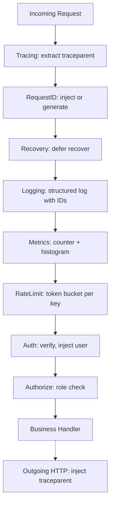
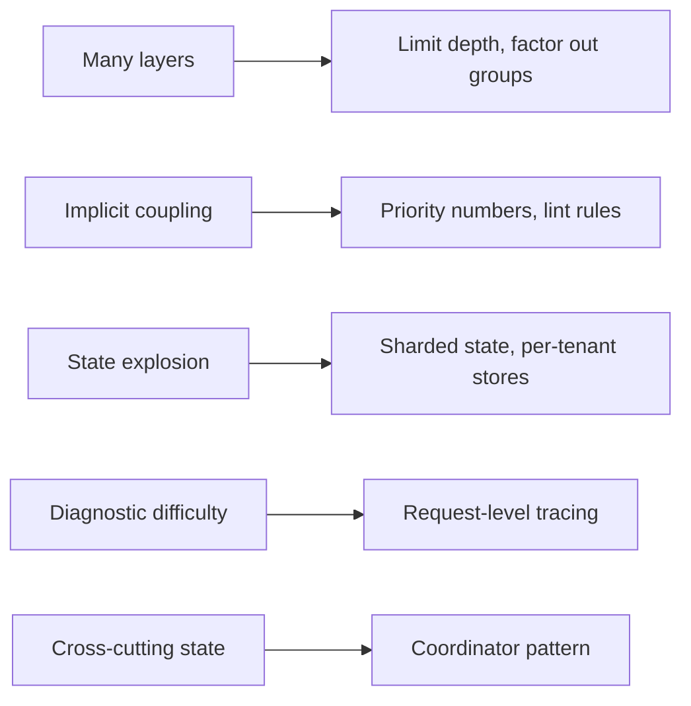
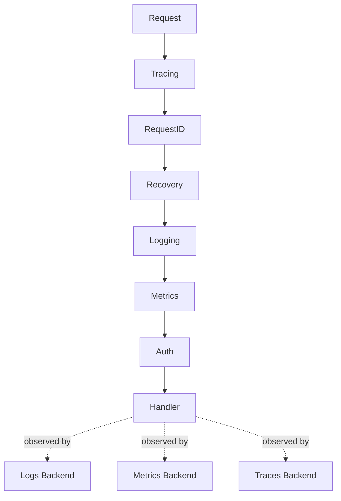

# Decorator Pattern — Interview Questions

Interview prep for the Go Decorator pattern across all skill levels. Decorator is the workhorse of cross-cutting concerns in Go: every HTTP middleware is one, every `bufio.NewReader` is one, every gRPC interceptor is one. A candidate's answers reveal five things at once: whether they can recognise Decorator under idiomatic Go (where it's rarely named), whether they can choose between struct-shape and function-shape for the right reason, whether they understand ordering invariants well enough not to put recovery outside tracing, whether they can handle panics across the chain without leaking responses, and whether they can keep Decorator separate from Proxy and Strategy when the boundaries blur.

Use this file before onsites at Google, Cloudflare, Uber, DigitalOcean, Datadog, or any team that ships HTTP services, observability stacks, or SDK middleware. Each question carries the level it targets, the ideal tiered answer, common wrong answers, and the follow-ups interviewers chain into.

---

## Table of Contents

1. [What interviewers actually test for](#1-what-interviewers-actually-test-for)
2. [Junior-level questions](#2-junior-level-questions)
3. [Middle-level questions](#3-middle-level-questions)
4. [Senior-level questions](#4-senior-level-questions)
5. [Live coding challenges](#5-live-coding-challenges)
6. [System design conversation starters](#6-system-design-conversation-starters)
7. [Common interview traps and red flags](#7-common-interview-traps-and-red-flags)
8. [Questions to ask the interviewer](#8-questions-to-ask-the-interviewer)
9. [Cross-references](#9-cross-references)

---

## 1. What interviewers actually test for

Decorator is the most over-used and most under-named pattern in Go. The interview questions sort candidates along several axes simultaneously.

| Dimension | Junior signal | Middle signal | Senior signal |
|-----------|---------------|---------------|---------------|
| Pattern recognition | Names Decorator when shown HTTP middleware | Identifies it in `bufio.Reader`, `gzip.Writer`, `tls.Client` | Reads grpc-go interceptors, otelhttp, chi internals and articulates the shape |
| Shape choice | Picks struct vs function and can defend | Knows when each fits, can convert between them | Designs library APIs that publish both shapes when callers need both |
| Ordering | Says "outermost runs first" | Articulates "observability outside resilience" and "rate-limit before auth" | Designs ordered chains with explicit priority, defends choices under questioning |
| Panic handling | Knows `defer recover()` exists | Knows recovery only catches *this goroutine*, handles double-write | Defends against `runtime.Goexit`, knows interaction with deadlines and response writers |
| Decorator vs Proxy vs Strategy | Confuses them | Can articulate the boundaries | Argues that Go practitioners rarely insist on the distinction and explains why |
| State and concurrency | Knows decorators can hold state | Uses atomics or mutexes correctly | Designs sharded state for hot-path decorators, knows escape analysis at the boundary |
| Generics | Has used `slices.SortFunc` | Writes a generic compose helper | Knows when generics add value to decorators and when they don't |

The meta-signal interviewers watch for: candidates who *over-decorate* lose senior points. Wrapping a charger in five decorators when one would do is a smell. Decorator pays off when the concern is genuinely cross-cutting. Senior candidates know when to *not* decorate.

One more axis: interviewers test Decorator by *not* naming it. They show a piece of HTTP middleware and ask "what's the design choice here?" Naming the GoF pattern is fine; *insisting* on it is not. Decorator and "middleware" are often interchangeable in Go culture; the candidate should switch register depending on what the interviewer uses.

---

## 2. Junior-level questions

These check whether the candidate can recognise Decorator in idiomatic Go, implement a small version, and avoid the obvious bugs. Aim for 1–2 minutes each.

---

### Q1 (junior). What is the Decorator pattern, and where does it show up in idiomatic Go?

**Ideal answer (junior).** Decorator wraps an object that satisfies an interface with another object that satisfies the *same* interface, adding behaviour before, after, or around the inner call without changing the inner object. The caller sees the same interface; the wrapper does the extra work and delegates.

```go
var c Charger = &StripeGateway{}
c = &LoggingCharger{Inner: c}
c = &RetryingCharger{Inner: c, Attempts: 3}
```

Each wrap adds one cross-cutting concern (logging, retry) without touching the underlying gateway.

**Ideal answer (middle).** Add: in Go, the most visible decorators are HTTP middleware (`func(http.Handler) http.Handler`) and the stdlib I/O wrappers (`bufio.NewReader(r io.Reader) io.Reader`, `gzip.NewWriter(w io.Writer) io.Writer`, `tls.Client(c net.Conn) net.Conn`). Each wraps a value of an interface type and returns a value of the same interface type, with new behaviour layered on.

**Ideal answer (senior).** Add: Decorator is what makes Go's small-interface culture pay off. Because `io.Reader`, `io.Writer`, `http.Handler`, and friends are one-method interfaces, any wrapper that satisfies the interface can transparently extend behaviour. The pattern is rarely named in code; the convention is "middleware" or just "wrapper". Naming an interface `XxxDecorator` is as wrong as naming one `XxxStrategy` — name the role, not the pattern.

**Common wrong answers.**
- "It's a creational pattern." — No, it's structural/behavioural depending on lens.
- "It's the same as Adapter." — Adapter changes the *interface*; Decorator keeps it the same.

**Follow-up.** *Show me three places in the stdlib where Decorator shows up.* (`bufio.NewReader`, `gzip.NewWriter`, `tls.Client`, `httptest.NewRecorder`, `context.WithTimeout`, `httputil.NewSingleHostReverseProxy`.)

---

### Q2 (junior). Walk me through the two Go shapes of Decorator and when each fits.

**Ideal answer (junior).** Two shapes.

**Shape 1 — Struct decorator.**

```go
type LoggingCharger struct {
    Inner Charger
    Log   *log.Logger
}

func (l *LoggingCharger) Charge(ctx context.Context, amount int) error {
    l.Log.Printf("Charge: %d", amount)
    return l.Inner.Charge(ctx, amount)
}
```

A struct holding an inner value of the interface type, plus method(s) that do work around the delegation.

**Shape 2 — Function decorator (middleware).**

```go
func Logging(next http.Handler) http.Handler {
    return http.HandlerFunc(func(w http.ResponseWriter, r *http.Request) {
        log.Printf("%s %s", r.Method, r.URL.Path)
        next.ServeHTTP(w, r)
    })
}
```

A function that takes the interface and returns the interface.

**Ideal answer (middle).** The choice is mostly mechanical:

- **Struct** when the decorator has state (counters, rate-limit budget, breaker state machine, cache) or configuration that should be locked at construction (logger reference, retry attempts, TTL).
- **Function** when the decorator is essentially stateless (state captured by closure if any), composes with other middleware in a chain, and the strategy interface is one method.

HTTP middleware is the canonical function-decorator case because chains are long, state is rare, and the chain composes cleanly.

**Ideal answer (senior).** The two shapes are duals: a struct with one method is equivalent to a function with a closure. The choice is about *ergonomics and evolution*. Struct decorators evolve cleanly — adding state, options, or methods is local. Function decorators are frozen once the signature is published. For library code where callers will write their own decorators, expose the function form unless there's a strong reason to require state.

**Common wrong answers.**
- "Always use struct — functions are slower." — Dispatch cost is ~1ns; invisible outside hot loops.
- "Always use functions — structs are heavyweight." — Both compile to the same machine code modulo dispatch.

**Follow-up.** *Convert a struct decorator to a function decorator.* (Move the state to closure-captured locals, return a `Charger` made from a func adapter.)

---

### Q3 (junior). Why is naming a decorator `XxxDecorator` considered un-idiomatic in Go?

**Ideal answer (junior).** Go names types after their role, not the pattern. `LoggingCharger` says "a `Charger` that adds logging". `XxxDecorator` says "this is the Decorator pattern applied to Xxx" — which the caller doesn't care about. Same reason `PaymentStrategy` is wrong: it's the pattern name, not the role.

**Ideal answer (middle).** Add: the same applies to `XxxMiddleware` in non-HTTP contexts. `LoggingMiddleware` is fine in HTTP because "middleware" is the domain vocabulary; outside of HTTP, prefer `LoggingCharger` or `LoggingClient`. Conventions communicate.

**Ideal answer (senior).** Add: the deeper rule is that the wrapper *satisfies the same interface as the inner*. If `LoggingCharger` is a `Charger`, the role-based name reads naturally everywhere the interface is used. `XxxDecorator` is a categorical label; it doesn't tell a reader what the type *does*. The Go culture treats types as nouns describing capability, not as artifacts of design pedagogy.

**Common wrong answers.** "It's just style." — Style in Go *is* the contract with reviewers. Breaking it costs attention forever.

**Follow-up.** *What about `chi.Middleware`?* (That's a *type alias*, not a struct name. `chi.Middleware = func(http.Handler) http.Handler`. It names the role of "a thing that wraps a handler". Acceptable — but the wrapper types themselves are still role-named.)

---

### Q4 (junior). Spot the bug.

```go
type CountingCharger struct {
    Inner Charger
    count int
}

func (c CountingCharger) Charge(ctx context.Context, amount int) error {
    c.count++
    return c.Inner.Charge(ctx, amount)
}
```

**Ideal answer (junior).** Value receiver. `c.count++` increments a *copy*. The caller's `CountingCharger` instance stays at zero. Fix: pointer receiver `func (c *CountingCharger)`.

**Ideal answer (middle).** Add: this is the most common Decorator bug in Go. The pattern is always to use a pointer receiver when the decorator has mutable state. Even when state seems immutable today, future maintenance often adds state — defaulting to pointer receivers avoids the trap.

**Ideal answer (senior).** Add: receiver kind also affects interface satisfaction. `*CountingCharger` satisfies `Charger`; `CountingCharger` (value) also does. Mixing them — methods on both receivers — leads to method set confusion and silent bugs where a method is callable on a value but not on a pointer or vice versa. Pick one consistently per type.

**Common wrong answers.**
- "Use `atomic.Int64`." — Fixes concurrency but doesn't fix the value-receiver bug. The value-copy issue is orthogonal.
- "Pass `count` by pointer." — Works but hides the intent. Pointer receiver is clearer.

**Follow-up.** *What if multiple goroutines call `Charge` simultaneously?* (Pointer receiver alone isn't enough — need `atomic.Int64` or a mutex around the counter.)

---

### Q5 (junior). What does this print?

```go
type LoggingCharger struct{ Inner Charger }
func (l *LoggingCharger) Charge(ctx context.Context, amount int) error {
    fmt.Println("before", amount)
    err := l.Inner.Charge(ctx, amount)
    fmt.Println("after", amount)
    return err
}

c := &StripeGateway{}
wrapped := &LoggingCharger{Inner: &LoggingCharger{Inner: c}}
wrapped.Charge(ctx, 100)
```

**Ideal answer (junior).**

```
before 100
before 100
after 100
after 100
```

Outer logger runs "before", delegates to inner logger which runs another "before", inner Stripe runs, then "after" prints twice on the way out.

**Ideal answer (middle).** Add: this is the signature of nested decorators. The execution model is *call-stack-based*: each layer's pre-work runs before the next layer's call; each layer's post-work runs after the next layer returns. Outermost runs first on the way in, last on the way out.

**Ideal answer (senior).** Add: the symmetry — pre-work order matches post-work reverse order — is a Liskov property. Each decorator preserves the inner's contract while extending it. A decorator that broke this (logging "before" without a matching "after") would violate the symmetric expectation; testing should assert both halves run.

**Common wrong answers.** Printing "before 100 after 100" once. Misses the nesting.

**Follow-up.** *How would you instrument a chain to verify the nesting order at runtime?* (Each layer logs with a unique prefix; the test asserts the sequence. Or each layer pushes/pops onto a shared slice; the test inspects the slice.)

---

### Q6 (junior). What's wrong with this decorator?

```go
type LoggingCharger struct {
    Inner *StripeGateway
    Log   *log.Logger
}

func (l *LoggingCharger) Charge(ctx context.Context, amount int) error {
    l.Log.Printf("Charge: %d", amount)
    return l.Inner.Charge(ctx, amount)
}
```

**Ideal answer (junior).** `Inner` is the concrete type `*StripeGateway`. The decorator only works with Stripe. To use it with PayPal, you'd have to write `LoggingPayPalCharger`. The fix: hold the interface, not the concrete type.

```go
type LoggingCharger struct {
    Inner Charger
    Log   *log.Logger
}
```

Now `LoggingCharger` wraps any `Charger`.

**Ideal answer (middle).** Add: this is one of the two foundational rules of Decorator in Go. The wrapper holds the *interface*, not a concrete type. The other rule: the wrapper *satisfies* the interface itself. Together these make the wrapper transparent — the caller can't tell the difference.

**Ideal answer (senior).** Add: the rule also applies recursively. If your decorator wraps another decorator, hold the *interface*, not the inner decorator's concrete type. Otherwise you've coupled to a specific layering, which breaks reconfiguration.

**Common wrong answers.**
- "Add a type assertion to handle both." — Forces every consumer to type-switch.
- "Use generics." — Doesn't fix the underlying issue; just hides it behind type parameters.

**Follow-up.** *When might hardcoding the concrete type be justified?* (Rarely — when the decorator depends on a specific implementation's behaviour beyond the interface contract. e.g., needing to call a non-interface method on `*StripeGateway`. Usually a smell; redesign first.)

---

### Q7 (junior). Show me the simplest possible HTTP middleware in Go.

**Ideal answer (junior).** Five lines.

```go
func Logging(next http.Handler) http.Handler {
    return http.HandlerFunc(func(w http.ResponseWriter, r *http.Request) {
        log.Printf("%s %s", r.Method, r.URL.Path)
        next.ServeHTTP(w, r)
    })
}
```

`http.HandlerFunc` is the adapter that lets a function value satisfy the `http.Handler` interface. The wrapper logs the request, then delegates to `next`.

**Ideal answer (middle).** Add: the shape `func(http.Handler) http.Handler` is the dominant Go middleware signature. `chi`, `gorilla/mux`, `go-kit`, and `echo` all use it (sometimes wrapped in a type alias like `chi.Middleware`). Knowing this signature is a junior signal; understanding why it's structured this way (function-of-function, closure-captured config) is a middle signal.

**Ideal answer (senior).** Add: the `http.HandlerFunc` adapter exists specifically to bridge the function-as-handler use case to the interface-as-handler design. It's the same trick as `sort.Interface` vs `sort.Slice`: when callers want both shapes, the lighter-weight one is exposed via an adapter. The same pattern recurs in user code: define an interface, define a func-type adapter, give consumers their choice.

**Common wrong answers.**
- "Mutate `r` directly to pass data through." — Works but tightly couples middlewares. Prefer `r.WithContext(ctx)` with values in the context.
- "Use a global `chain` variable." — Tests can't isolate.

**Follow-up.** *Add timing: log how long the request took.* (Save `start := time.Now()` before the delegate, log `time.Since(start)` after. Demonstrates closure capture for per-request state.)

---

### Q8 (junior). Identify the decorator in this code.

```go
type Repo interface {
    Get(ctx context.Context, id int) (User, error)
}

type DBRepo struct{ db *sql.DB }
func (r *DBRepo) Get(ctx context.Context, id int) (User, error) { /* ... */ }

type CachedRepo struct {
    Inner Repo
    TTL   time.Duration
    cache map[int]cacheEntry
}

func (c *CachedRepo) Get(ctx context.Context, id int) (User, error) {
    if u, ok := c.lookup(id); ok { return u, nil }
    u, err := c.Inner.Get(ctx, id)
    if err == nil { c.store(id, u) }
    return u, err
}
```

**Ideal answer (junior).** `CachedRepo` is the decorator. It implements `Repo`, holds an inner `Repo`, and adds caching around the inner's `Get` call. The cache layer is invisible to the caller — they still call `Get` on a `Repo`.

**Ideal answer (middle).** Add: notice three idiomatic choices. (1) The interface stays the same — both `DBRepo` and `CachedRepo` satisfy `Repo`. (2) The cache state is owned by the decorator, not the inner. (3) Disabling the cache is a one-line swap — pass `DBRepo` directly to the consumer.

**Ideal answer (senior).** Add: this is also Strategy *and* Decorator combined. `Repo` is a Strategy interface — the caller picks which implementation. `CachedRepo` is a Decorator — it extends behaviour without changing the contract. The pair is the foundational Go composition idiom: small interfaces (Strategy) plus same-interface wrappers (Decorator).

**Common wrong answers.**
- "It's Proxy." — Close, but Proxy *controls access*; Decorator *adds behaviour*. Caching adds behaviour.
- "It's Adapter." — Adapter changes interface; here the interface is unchanged.

**Follow-up.** *How would you make the cache thread-safe?* (Mutex around the map, or `sync.Map`. The mutex is in the decorator, not the inner.)

---

### Q9 (junior). What's the difference between Decorator and Proxy?

**Ideal answer (junior).** Both wrap an object and satisfy the same interface. The intent differs:

- **Decorator** *adds behaviour* to a real, existing object (logging, caching, retry).
- **Proxy** *controls access* to an object that might be remote, lazy, or restricted (RPC proxy, lazy-load proxy, access-check proxy).

In Go the line is fuzzy because both look the same syntactically. The textbook distinction matters more in Java/C# where Proxy often involves separate type hierarchies.

**Ideal answer (middle).** Add: a useful test — does the wrapper add a *concern* (cross-cutting, optional) or *control access* (mandatory, gating)? Caching is a concern; an auth check is access control. A logging wrapper is Decorator; a `LazyLoader` that constructs the real object on first access is Proxy.

**Ideal answer (senior).** Add: in Go, the distinction is largely academic. The same code can be called either. The community converges on "middleware" or "wrapper" rather than insisting on Decorator vs Proxy. Where the distinction *does* matter is in design discussions: senior engineers use "Proxy" to signal "controls access to something potentially absent" and "Decorator" to signal "adds behaviour to something present". The vocabulary helps reviewers but isn't enforceable in code.

**Common wrong answers.**
- "Proxy has to be remote." — Not necessarily; lazy proxy is local.
- "They're identical." — They overlap but have different intents.

**Follow-up.** *Where does `httputil.NewSingleHostReverseProxy` fit?* (It's a Proxy — controls access to a remote server. But it implements `http.Handler`, so it's also wrapped by HTTP middleware decorators. Both patterns coexist.)

---

### Q10 (junior). When is Decorator the wrong pattern?

**Ideal answer (junior).** Five cases.

1. **The "extra behaviour" is the whole point.** If logging is the only thing the wrapper does and it's the only consumer, just inline the log in the caller. Decorator pays off when the behaviour is *reused*.

2. **You need to add a new method.** Decorators preserve the interface. Adding a method means a different interface — the consumer breaks. Use a separate type or extend the interface.

3. **The "decorator" needs internals of the wrapped object.** A decorator should add behaviour *around* the call, not *modify* the wrapped object's state. If you're reaching inside to mutate fields, the design is off.

4. **The chain is two or three layers deep and never grows.** A single inline change is simpler than a wrapper. Wait until the third concern appears before introducing the abstraction.

5. **The wrapped operation is trivial.** A decorator on a one-line function is more code than it saves. Wait for non-trivial inner behaviour.

**Ideal answer (middle).** Add: a common over-application is decorating a method that has *one caller*. Decorator earns its keep when (a) the concern is cross-cutting (logging, retry, cache) and (b) multiple sites need it. Otherwise it's ceremony.

**Ideal answer (senior).** Add: another case is when the "decorator" actually wants to short-circuit the call (auth that rejects, rate limiter that drops). These are valid decorators but they break Liskov substitutability in spirit — the caller sees a "failed call" that isn't from the inner. Document that the wrapper may *not* delegate. Pattern still applies, but with care.

**Common wrong answers.**
- "Decorator is always good." — Cargo-culting.
- "Decorator only fits HTTP." — Too narrow; works for any single-method interface.

**Follow-up.** *Give an example where you started with Decorator and then refactored away from it.* (A retry decorator that grew to require per-call context, per-attempt state, and conditional logic — at that point, an explicit function with options is clearer than a decorator chain.)

---

## 3. Middle-level questions

These check whether the candidate can design middleware chains, handle ordering and panics correctly, manage stateful decorators safely, and reason about performance. Expect 3–5 minutes each.

---

### Q1 (middle). Walk me through the composition order rules for a middleware chain.

**Ideal answer (junior).** Outermost wraps last in code but runs first at request time.

```go
h := Chain(handler, Logging, Recovery, Auth)
// Logging runs first, then Recovery, then Auth, then handler.
```

The chain helper iterates the slice in reverse so the *first* listed middleware ends up as the outermost wrap.

**Ideal answer (middle).** Two rules to memorise:

1. **Observability outside resilience.** Tracing, logging, metrics should be outermost — they observe the *final* outcome, including any recovered panics or retried calls. Putting tracing inside retry would create one span per attempt; usually wrong.

2. **Rate limiting outside auth (usually).** Rate-limit on something cheap (IP, API key prefix) *before* auth runs. Otherwise an attacker can force auth code to run on every spam request.

A third softer rule: **panic recovery inside tracing**. If recovery is outermost, tracing closes the span normally even on panic. If tracing is outermost and recovery is inside, the trace might see a clean exit; you want tracing to see the failure.

**Ideal answer (senior).** Add: the order matters at the boundary of *what observes what*. Decisions are application-specific but the questions are universal: should this layer see authenticated traffic only? Should it see panic-induced failures? Should it short-circuit before the next layer runs? Answering these explicitly is the senior move; defaulting to a templated chain order without thinking is junior.

A real-world pattern: declare middleware with explicit priority numbers (`OrderTrace=0, OrderRecovery=100, OrderRateLimit=200, OrderAuth=300, OrderLogging=400, OrderHandler=1000`) and let the framework sort. Used in Knative, Istio. Overkill for small apps; gold for large ones.

**Common wrong answers.**
- "Order doesn't matter as long as all middlewares run." — Wrong. Tracing-outside-recovery vs recovery-outside-tracing have observable behaviour differences.
- "Recovery should always be outermost." — Sometimes, but if you want tracing to see the panic, recovery goes inside.

**Follow-up.** *Where does request-ID injection sit?* (Outermost or near-outermost. Every layer beneath it sees the ID via context. Putting it deep means upper layers lack the ID for correlation.)

---

### Q2 (middle). How do you safely recover from a panic in middleware?

**Ideal answer (junior).** A `defer` with `recover` inside the wrapped handler.

```go
func Recovery(next http.Handler) http.Handler {
    return http.HandlerFunc(func(w http.ResponseWriter, r *http.Request) {
        defer func() {
            if v := recover(); v != nil {
                log.Printf("panic: %v\n%s", v, debug.Stack())
                http.Error(w, "internal error", 500)
            }
        }()
        next.ServeHTTP(w, r)
    })
}
```

**Ideal answer (middle).** Three subtleties.

1. **`recover` only catches panics in *this* goroutine.** If the handler spawns a goroutine and that goroutine panics, your recovery won't catch it. The runtime kills the whole process. Either each spawned goroutine recovers itself, or the handler doesn't spawn unjoined goroutines.

2. **Don't write twice.** If the handler already called `w.WriteHeader(200)` before panicking, calling `http.Error(w, ..., 500)` is too late — the response is committed. You either swallow that case (log only) or wrap `ResponseWriter` to track whether headers have been sent.

3. **`runtime.Goexit` looks like a panic but `recover` returns nil.** The deferred function still fires; check whether the handler completed normally rather than only relying on `recover() != nil`.

**Ideal answer (senior).** Add: recovery should be *one* of many concerns, and its position in the chain matters (Q1). Recovery should be inside tracing so the span closes properly; outside auth so unauthenticated panics still produce 500s (or maybe inside auth so unauthenticated requests never reach panicking code). The right answer is application-specific.

Operationally: never `recover()` and pretend nothing happened. Emit a structured log with stack trace, increment a counter (`panics_recovered_total`), optionally send to Sentry/PagerDuty. A recovered panic is still a bug; production should know.

**Common wrong answers.**
- "Use `recover()` at the top level." — If a goroutine panics elsewhere, this doesn't help.
- "Recovery middleware fixes all panics." — Doesn't catch other goroutines; doesn't catch `runtime.Goexit`.

**Follow-up.** *What if the handler writes headers, then panics?* (Headers committed; you can't override status. Log and let the client see the partial response. If you wrap `ResponseWriter` with a `wroteHeader` flag, you can detect this and skip the write.)

---

### Q3 (middle). When should the decorator be a struct vs a function?

**Ideal answer (junior).** Struct if it has state; function if it's stateless.

**Ideal answer (middle).** More precisely:

| Signal | Lean toward |
|--------|-------------|
| Holds counters, breaker state, cache, rate-limit budget | Struct |
| Pure transformation, state captured by closure | Function |
| Configuration enforced at construction time | Struct (constructor signature documents requirements) |
| Composed in long chains | Function (lighter call-site syntax) |
| Library API published to other packages | Either — pick the form easier to *write* (consumers mirror) |
| Decorator likely to grow methods later | Struct (function shapes are frozen once published) |

HTTP middleware is the canonical function form because chains are long, state is rare, and ergonomics matter. Database wrappers, payment-gateway wrappers, and cache wrappers are usually structs because they own state.

**Ideal answer (senior).** Add: the choice also affects evolution. A struct decorator can add new methods, new constructors, new options — all backward-compatible. A function decorator's signature is fixed once published; adding a parameter is a breaking change. For long-lived library APIs, lean struct unless the function form is clearly cleaner.

Also: stateful function decorators (state captured by closure) work but read confusingly. A reader sees `RateLimit(10)` returning a function and wonders where the bucket is. A struct decorator with `RateLimitDecorator{Bucket: ...}` is more self-documenting. Use closures for true stateless wrappers; use structs when state is involved.

**Common wrong answers.**
- "Functions are slower." — Dispatch is ~1ns either way.
- "Structs are heavyweight." — A struct with one field and one method is the same machine code as a function with a closure.

**Follow-up.** *Refactor a stateful function decorator into a struct.* (Move the closure-captured state to struct fields; convert the closure into a method; let the constructor accept configuration.)

---

### Q4 (middle). Implement a generic decorator helper.

**Ideal answer (junior).** A `Chain` over an arbitrary interface T.

```go
type Middleware[T any] func(next T) T

func Chain[T any](base T, mws ...Middleware[T]) T {
    for i := len(mws) - 1; i >= 0; i-- {
        base = mws[i](base)
    }
    return base
}
```

Iterates in reverse so the *first* middleware in the slice ends up outermost.

**Ideal answer (middle).** Add: the generic form pays off when you have multiple interfaces (a `Charger` chain, a `Repo` chain, a `Logger` chain) and want one chain helper. Without generics, you'd duplicate the helper per type. With generics, one `Chain[T]` works for all.

But: the type parameter `T` doesn't constrain anything except `any`, so the helper can't call `T.Method()`. The middlewares themselves carry that knowledge; the helper just composes them.

**Ideal answer (senior).** Add: the helper is one of the few places generics genuinely simplify decorator code. For application code where you have one interface, plain `func Chain(h http.Handler, mws ...Middleware) http.Handler` is equally clear and avoids the type parameter syntax. Generics shine in shared utility packages used across multiple decorator chains.

Also note: the signature `func(T) T` is ambiguous — it could mean "transform" (returns a different `T`) or "decorate" (wraps and forwards). For decorators that always wrap-and-forward, the convention is fine; for mixed use (some transforms, some decorators), the ambiguity bites. Senior code documents the convention.

**Common wrong answers.**
- "Use `interface{}` instead." — Loses type safety; defeats the point.
- "Generics make this slow." — Monomorphisation means the dispatch is direct after instantiation; no slower than the non-generic form.

**Follow-up.** *What's the cost of generic compose vs the type-specific one?* (At compile time: generic instantiates per `T`, growing binary size. At runtime: identical after monomorphisation. For 3-5 type parameters with one Chain each, the overhead is invisible.)

---

### Q5 (middle). How do you test a decorator?

**Ideal answer (junior).** Use a fake inner.

```go
type fakeCharger struct {
    chargeReturn error
    chargeCalled bool
}
func (f *fakeCharger) Charge(_ context.Context, _ int) error {
    f.chargeCalled = true
    return f.chargeReturn
}

func TestRetryingCharger_RetriesOnError(t *testing.T) {
    f := &fakeCharger{chargeReturn: errors.New("transient")}
    r := &RetryingCharger{Inner: f, Attempts: 3}
    err := r.Charge(context.Background(), 100)
    if err == nil { t.Fatal("expected error") }
    if !f.chargeCalled { t.Error("inner never called") }
}
```

**Ideal answer (middle).** Three complementary approaches.

1. **Fake inner.** Tests the decorator's logic. Above.

2. **Chain-order tests.** When you have a chain, assert layers run in the expected order by having each layer append to a shared slice.

```go
var calls []string
mws := []Middleware{
    func(next H) H { return func() { calls = append(calls, "A"); next() } },
    func(next H) H { return func() { calls = append(calls, "B"); next() } },
}
chain := Chain(base, mws...)
chain()
// assert calls == []string{"A", "B", "base"}
```

3. **Transparency tests for embedded decorators.** If your decorator embeds the interface and only overrides one method, verify the *other* methods still forward correctly. Otherwise a refactor that drops the embedding breaks silently.

**Ideal answer (senior).** Add: property-based tests catch chain-composition bugs that example tests miss. For instance: "a chain of length N produces output X" can be expressed as "applying any middleware to its own identity is a no-op". Tests like this catch ordering inversions, premature returns, and lost errors.

For chains in production, runtime introspection helps: each decorator implements an `Unwrap()` method (mirroring `errors.Unwrap`), and a debug endpoint walks the chain. The test then asserts the chain structure at startup rather than only its behaviour at request time.

**Common wrong answers.**
- "Mock with gomock." — Works, but the dependency rarely earns its keep for simple decorators.
- "Test only the chain end-to-end." — Misses isolated decorator bugs; integration tests are slow.

**Follow-up.** *How do you test a panic-recovery middleware?* (Construct a handler that panics, wrap with Recovery, send a request, assert: response status is 500, the panic was logged, no goroutine was leaked. Use `httptest` and capture stdout/stderr.)

---

### Q6 (middle). What's the right way to handle decorator chains where ordering matters?

**Ideal answer (junior).** Document the order; write tests that assert it.

**Ideal answer (middle).** Three layered defences.

1. **Document in code comments.** Inline at the chain definition, what order is expected and why. A comment is the cheapest documentation; reviewers see it.

2. **Test the order.** A chain test that asserts the layers ran in the expected sequence catches refactors that accidentally reorder.

3. **Encode the order as data.** For large chains, give each middleware a priority number; sort before building.

```go
type Spec struct{ Order int; Fn Middleware }

func Build(handler http.Handler, specs ...Spec) http.Handler {
    sort.SliceStable(specs, func(i, j int) bool {
        return specs[i].Order < specs[j].Order
    })
    for i := len(specs) - 1; i >= 0; i-- {
        handler = specs[i].Fn(handler)
    }
    return handler
}
```

Now the order is explicit in the data, not implicit in the slice order. New middlewares fit in by picking an appropriate number.

**Ideal answer (senior).** Add: at large scale, encode the order as an *invariant* in the codebase. A linter or test asserts that, e.g., `Logging` always comes after `Recovery` in any chain. Tools: a custom `go vet` analyzer that inspects calls to `Chain(...)` and checks the argument order; or a startup-time validation that walks the chain and asserts properties (recovery is present, tracing wraps everything, etc.).

The deeper insight: chain order is a *contract* between decorators. If two decorators have an ordering requirement, that's a coupling. Couplings should be made explicit — either by documentation, tests, or runtime assertions. Hidden couplings are the source of "it worked yesterday" bugs.

**Common wrong answers.**
- "Trust the developer to get it right." — They won't, especially when a chain spans multiple packages.
- "Reorder until it works." — Means you don't understand the dependencies.

**Follow-up.** *How does chi handle ordering?* (chi's `Use(...)` appends to a slice; the slice is composed in order at route-handler attachment. Order is the order of `Use(...)` calls. Per-route middlewares wrap per-group middlewares wrap router-level middlewares. The convention is documented; chi doesn't enforce it programmatically.)

---

### Q7 (middle). Walk me through the cost of decorator chains. When does it matter?

**Ideal answer (junior).** Each decorator adds one indirect call (~1-2 ns for an interface dispatch). For chains of 5-10 middlewares, total overhead is ~10-20 ns per request. Invisible against the ~100 µs+ of actual request work.

**Ideal answer (middle).** Three places where it does matter.

1. **Hot inner loops.** If a decorated method is called millions of times per second in a tight loop, each layer adds dispatch cost. For 10M calls through 5 decorators, that's ~100ms of pure dispatch. Profile if performance matters.

2. **Closure allocation in middleware setup.** Each call to `Logging(handler)` creates a closure. If you call it at startup, it's free. If you call it per request (anti-pattern), you pay allocation + GC pressure per request.

3. **Generic decorator boxing.** Generic decorators may have hidden interface conversions during compilation. Profile or read `-gcflags="-m"` if hot-path performance matters.

**Ideal answer (senior).** Add: escape analysis at the decorator boundary is the subtlest cost. If a decorator captures a pointer in a closure, the captured value escapes to the heap — adding GC pressure. Sometimes inlining the decorator eliminates the escape; sometimes restructuring the captured state (passing as method receiver instead of closure) keeps it on the stack.

For ultra-hot paths (microservices handling 100k+ RPS), some teams forgo decorators entirely in the hot path and inline the cross-cutting concerns. Not idiomatic, but pragmatic. The decision is: how many decorators do I need vs how many nanoseconds can I afford?

**Common wrong answers.**
- "Decorators are always slow." — Wrong scale; usually invisible.
- "Generics avoid dispatch." — Sometimes (monomorphised), sometimes (interface conversions still happen).

**Follow-up.** *Show me a benchmark that distinguishes function decorators from struct decorators in dispatch cost.* (`go test -bench`. For one-method interfaces, both compile to similar code. The difference is in *allocation*: struct decorators allocate once at construction; function decorators may allocate per chain build. Per-call dispatch is identical.)

---

### Q8 (middle). How does context.Context flow through a decorator chain?

**Ideal answer (junior).** The context is a parameter; each decorator either passes it through or derives a new one.

```go
func Timeout(d time.Duration) Middleware {
    return func(next http.Handler) http.Handler {
        return http.HandlerFunc(func(w http.ResponseWriter, r *http.Request) {
            ctx, cancel := context.WithTimeout(r.Context(), d)
            defer cancel()
            next.ServeHTTP(w, r.WithContext(ctx))
        })
    }
}
```

The wrapper derives a child context with a deadline, passes a new `*http.Request` with that context to the next layer.

**Ideal answer (middle).** Two common operations.

1. **Derive a new context with a deadline or value.** The child context inherits cancellation from the parent.

```go
ctx, cancel := context.WithTimeout(r.Context(), d)
defer cancel()
```

2. **Inject a request ID, trace ID, or user info via context values.**

```go
ctx := context.WithValue(r.Context(), requestIDKey, id)
next.ServeHTTP(w, r.WithContext(ctx))
```

The *wrong* operation is deriving from `context.Background()` — that discards the parent's deadline and cancellation. Always derive from `r.Context()` (HTTP) or the caller-supplied context.

**Ideal answer (senior).** Add: context flow is the cleanest example of "decorators chain via the call stack". Each layer adds to the context; deeper layers see the accumulated context. Cancellation propagates from outside (the parent times out, all children see `ctx.Done()`) to inside.

A common bug: storing the context on a decorator struct instead of passing it as a parameter. The context becomes stale; goroutines using it see the wrong cancellation. Rule: never store `context.Context` in a struct. Always pass as a parameter.

For value-injection decorators (request ID, user, tenant), keep the keys unexported and provide accessor functions:

```go
type contextKey struct{ name string }
var requestIDKey = &contextKey{"requestID"}

func RequestID(ctx context.Context) string {
    if v, ok := ctx.Value(requestIDKey).(string); ok { return v }
    return ""
}
```

The decorator injects; consumers extract via the accessor. The key is unexported so no external code can collide.

**Common wrong answers.**
- "Pass context through a global." — Defeats the whole point.
- "Use channels." — context is the idiomatic mechanism.

**Follow-up.** *Why is `context.WithValue` discouraged for non-request-scoped data?* (Context values are untyped (`any`); they bypass the type system. For function-call parameters, use explicit arguments. Context values are for request-scoped metadata (request ID, trace ID, user) where threading every parameter through every function would be impractical.)

---

### Q9 (middle). How do you handle a decorator that needs per-key state (per-user rate limit, per-route cache)?

**Ideal answer (junior).** A map keyed by the key, protected by a lock.

```go
type PerUserRateLimit struct {
    Inner Charger
    mu       sync.Mutex
    limiters map[string]*rate.Limiter
}
```

**Ideal answer (middle).** Use `sync.Map` or sharded maps for high-concurrency cases.

```go
type PerKeyRateLimit struct {
    Inner    Charger
    limiters sync.Map // map[string]*rate.Limiter
    rps      rate.Limit
    burst    int
}

func (p *PerKeyRateLimit) limiterFor(key string) *rate.Limiter {
    if v, ok := p.limiters.Load(key); ok { return v.(*rate.Limiter) }
    lim := rate.NewLimiter(p.rps, p.burst)
    actual, _ := p.limiters.LoadOrStore(key, lim)
    return actual.(*rate.Limiter)
}
```

`LoadOrStore` is atomic — two goroutines that both miss won't create two limiters. The wasted creation (when both create but only one wins) is OK because limiters are cheap.

**Ideal answer (senior).** Add: per-key state is where decorators *leak memory*. If keys are unbounded (e.g., user IDs across all time), the map grows forever. Solutions:

1. **TTL eviction.** Each entry has a creation time; a sweeper removes old ones.
2. **LRU bounding.** Cap the map size; evict least-recently-used.
3. **Sharded maps for higher concurrency.** Split into N maps by hash of key.

For per-route or per-tenant state, the cardinality is bounded — a regular `sync.Map` works.

A second subtlety: per-key state means the decorator's behaviour depends on *who* is calling. Test cases must vary the key, not just the inputs. Otherwise tests pass with shared state and break under concurrency.

**Common wrong answers.**
- "One global rate limiter for everyone." — Misses the per-key requirement; a noisy user starves everyone.
- "Don't use a map; use channels." — Doesn't solve the per-key indexing problem.

**Follow-up.** *How do you handle a memory leak from unbounded keys?* (TTL-based eviction (`expvar` of map size to monitor); LRU cap; or restructure so the keys are bounded (per-tenant rather than per-user).)

---

### Q10 (middle). When would you use embedding to build a decorator?

**Ideal answer (junior).** When the interface has many methods and you want to decorate only one or two.

```go
type Charger interface {
    Charge(...) error
    Refund(...) error
    Status(...) (string, error)
}

type LoggingCharger struct {
    Charger // embedded
    log *log.Logger
}

func (l LoggingCharger) Charge(ctx context.Context, amount int) error {
    l.log.Printf("Charge: %d", amount)
    return l.Charger.Charge(ctx, amount)
}
// Refund and Status are forwarded automatically via embedding.
```

**Ideal answer (middle).** Benefits and costs.

Benefits:
- Only write code for the decorated methods. Others forward automatically.
- The promoted name (`l.Charger`) is readable and documents what's wrapped.

Costs:
- The embedded field is public (named after the type). Callers can mutate it: `l.Charger = otherImpl`. If you want this hidden, define a named non-exported field and forward manually.
- If the inner interface gains a new method, your wrapper *automatically* inherits it without decoration. Sometimes useful, sometimes a silent bug (a new method that should be logged isn't).
- Method-set subtleties around value vs pointer receivers. Mixing them with embedding leads to weird bugs.

Use embedding when the interface has 5+ methods and most don't need decoration. For 1-3 method interfaces, plain struct decorators are clearer.

**Ideal answer (senior).** Add: embedding-based decorators are the right answer for `database/sql.Driver`-style interfaces where the surface is wide and most methods pass through unchanged. They're the wrong answer for `http.Handler` where the interface is one method.

A subtle senior point: embedding lets you decorate at the *call boundary* (the wrapper's method runs, calls `Inner.Method`) while *not decorating* at the type assertion boundary. If a consumer does `if r, ok := charger.(Refunder); ok`, they get the *embedded* refunder, not your wrapper. Your decorator's logic isn't applied to refunds reached via type assertion. Sometimes that's fine; sometimes it's a bug. Senior code documents the assumption.

**Common wrong answers.**
- "Always embed for less typing." — Misses the silent-method-inheritance trap.
- "Never embed because it's magical." — Misses the genuine ergonomics for wide interfaces.

**Follow-up.** *Show me a case where embedding-based decoration broke unexpectedly.* (A new method added to the inner interface — say, `Cancel(ctx, id) error`. The decorator silently inherits the non-decorated version. Logging metrics don't apply to cancellations. The bug is invisible until someone checks the logs and notices cancellations missing.)

---

## 4. Senior-level questions

These check architectural judgment, evolution across versions, and the ability to design decorator-based subsystems for scale. Expect 5–10 minutes each.

---

### Q1 (senior). Design a complete HTTP observability stack using decorators. Walk me through the layers.

**Ideal answer (junior).** Stack the middlewares: tracing, logging, metrics, recovery, request-ID, auth.

**Ideal answer (middle).** Layer them with explicit roles:

```go
chain := mw.Chain(
    mw.Tracing(tracer),         // outermost — owns the span
    mw.RequestID(),             // inject ID early so all layers see it
    mw.Recovery(logger),        // catches panics, ensures the span closes
    mw.Logging(logger),         // logs with the request ID and trace ID
    mw.Metrics(prom),           // counts, latencies, status codes
    mw.RateLimit(rps, burst),   // before auth — cheap rejection of spam
    mw.Auth(verifier),          // verifies token, sets user in context
    mw.RequireRole("admin"),    // authorization, deeper than auth
)

handler := chain(http.HandlerFunc(handleAPI))
```

Each layer does one thing. The ordering reflects the rules from middle Q1.

**Ideal answer (senior).** A complete observability stack involves more than the chain. Five components to discuss.

1. **The trace propagation.** Outer tracing middleware extracts a parent trace from incoming headers (`traceparent`), starts a span, injects context. Outgoing HTTP calls add the trace header. Cross-service correlation works because the trace ID flows through.

2. **The request-scoped metadata.** Request ID, trace ID, user ID, tenant ID — all live in the context. Middlewares inject; handlers extract; logs and metrics include them.

3. **The metric cardinality.** A metric like `http_requests_total{path="/users/123"}` is unbounded — every user ID creates a new label. Sanitize at the middleware boundary: replace IDs with placeholders (`/users/:id`). High-cardinality labels live in traces (where they're aggregated lazily), not metrics.

4. **The log structure.** Structured logs (JSON, zap, zerolog) include `trace_id`, `span_id`, `request_id` from context. Logs join with traces via shared IDs.

5. **The async dispatch.** Trace span finalisation, metric histogram updates, log writes — all should be fast. If any is slow (network logging), buffer or async-dispatch. The middleware shouldn't block the request on observability work.



**Cross-cutting decisions:**

- **Sampling.** Trace every request? Or sample? Sampling decision lives in the tracing middleware; the rest doesn't care.
- **Privacy.** Logging request bodies leaks PII. Configure per-route to redact.
- **Budget.** Observability has a cost. For 100k RPS, a `time.Now()` call per layer costs CPU. Profile, batch, or async.

**Real libraries to reference:** `go.opentelemetry.io/contrib/instrumentation/net/http/otelhttp` for tracing; Prometheus client for metrics; zap or zerolog for structured logs. Each is a middleware-shaped decorator.

**Common wrong answers.**
- "Just use chi's recoverer and logger." — Misses the integration with tracing and metrics.
- "Roll your own everything." — Reinvents working libraries.

**Follow-up.** *How does this stack scale to 50 microservices?* (Standardise the stack as a shared internal library. Each service imports `observability.New(...)` which returns a configured chain. Updates propagate via library versioning.)

---

### Q2 (senior). Design a rate-limiting framework. Where do decorators fit?

**Ideal answer (junior).** Wrap the handler with a `RateLimit` middleware that checks a token bucket.

**Ideal answer (middle).** Three axes — algorithm, key, action — all wrappable.

```go
type Limiter interface {
    Allow(ctx context.Context, key string) (bool, error)
}

func RateLimit(lim Limiter, keyFn func(*http.Request) string, onExceeded http.Handler) Middleware {
    return func(next http.Handler) http.Handler {
        return http.HandlerFunc(func(w http.ResponseWriter, r *http.Request) {
            key := keyFn(r)
            ok, err := lim.Allow(r.Context(), key)
            if err != nil || !ok {
                onExceeded.ServeHTTP(w, r)
                return
            }
            next.ServeHTTP(w, r)
        })
    }
}
```

The decorator orchestrates; the algorithm, key extraction, and exceeded-action are pluggable strategies.

**Ideal answer (senior).** A full framework has more layers.

1. **Local vs distributed limiter.** Local uses in-memory token bucket. Distributed uses Redis. The `Limiter` interface abstracts the backend; consumers don't change when scaling.

2. **Per-tier limits.** Free users: 10 RPS. Premium: 100 RPS. The key function returns a tier-prefixed key; the configuration maps tiers to limits. The decorator stays simple.

3. **Composite limits.** Per-user *and* per-route *and* global. Stack decorators:

```go
chain := mw.Chain(
    mw.RateLimit(globalLimiter, alwaysSameKey, deny),
    mw.RateLimit(perRouteLimiter, byRoute, deny),
    mw.RateLimit(perUserLimiter, byUser, deny),
)
```

Each layer is an independent rate limit. A request must pass all three.

4. **Graceful degradation.** If Redis is down, fall back to a local limiter. Wrap the distributed limiter in a `FallbackLimiter` decorator.

5. **Cost-weighted requests.** Some requests cost more (a complex query is worth 10 tokens). The decorator extracts the cost from the request or route; the limiter's `Allow` accepts a cost parameter.

**Architectural insight.** Rate limiting is *the* canonical case where decorators excel — the concern is cross-cutting, the algorithms are pluggable, the keys are application-specific, and the chain composes. A framework that exposes each axis as a strategy lets users compose; a framework that bundles everything into one knob forces forks.

**Common wrong answers.**
- "One middleware, hardcoded algorithm." — Doesn't scale.
- "Wrap every handler manually with rate-limit logic." — Couples concerns; can't reconfigure.

**Follow-up.** *How does the decorator interact with circuit breakers?* (Both are decorators. Circuit breaker wraps the *upstream* call; rate limit wraps the *incoming* request. They compose: rate limit on the inbound side, breaker on the outbound. Cross-reference: Circuit Breaker pattern.)

---

### Q3 (senior). Critique this real-world decorator API.

```go
type Wrapper interface {
    Name() string
    SetName(string)
    Wrap(inner Charger) Charger
    Unwrap() Charger
    Config() Config
    SetConfig(Config)
    Metrics() Metrics
    Reset()
    OnError(func(error))
    OnSuccess(func(string))
}
```

**Ideal answer (junior).** Too wide. Lots of methods.

**Ideal answer (middle).** Several issues.

1. **Too many methods.** Ten methods on an interface for "wraps a Charger". Most are operational, not core.

2. **Mutable state in the interface.** `SetName`, `SetConfig`, `Reset` mutate the wrapper. Wrappers should be immutable; configuration goes in the constructor.

3. **Event callbacks mixed with the API.** `OnError`, `OnSuccess` belong elsewhere — either as a separate observation interface or as decorator-internal state.

4. **`Unwrap()` exposes the inner.** Reasonable for debugging but leaks abstraction if used in business logic.

5. **`Metrics()` couples observability to the wrapper.** Metrics are orthogonal; expose them via a separate registration mechanism.

**Ideal answer (senior).** Add: the right design is much smaller.

```go
type Charger interface {
    Charge(ctx context.Context, amount int) error
}

// Each decorator is its own type, constructed with its config:
type LoggingCharger struct{ Inner Charger; Log *log.Logger }
type RetryingCharger struct{ Inner Charger; Attempts int }
type MetricsCharger struct{ Inner Charger; Metrics *prom.HistogramVec }
```

Each wrapper is a `Charger`. No `Wrapper` interface needed. Composition is by stacking constructors. Configuration is per-decorator at construction.

The original `Wrapper` interface is a *meta-pattern* — a generic decorator framework — which is exactly the over-abstraction trap. Each decorator should be concrete. Composing them is trivial because they share the `Charger` interface; no extra abstraction earns its keep.

The Go idiom: *the wrapper IS the interface*. The "decorator" is just "a type that satisfies the same interface as the inner". Generic frameworks for decoration are usually unnecessary.

**Common wrong answers.**
- "Looks comprehensive — leave it." — Misses that "comprehensive" is the smell.
- "Add a `BaseWrapper` struct to embed." — Java thinking; Go doesn't need it.

**Follow-up.** *How would you allow callers to introspect a chain at runtime?* (Each decorator implements `Unwrap() Charger`. A walker function descends through `Unwrap()` calls. Used in debug endpoints or for testing chain structure. But don't bake it into the core interface — make it an optional method via type assertion.)

---

### Q4 (senior). How do you design a decorator chain for a published Go library?

**Ideal answer (junior).** Expose middleware functions; let consumers chain them.

**Ideal answer (middle).** Three principles.

1. **Expose the function-shape middleware.** `func(http.Handler) http.Handler` is the universal Go middleware signature. Other libraries (chi, gorilla, echo) accept this signature directly. Consumers compose freely.

2. **Provide a chain helper for ergonomics.** But don't require it — let consumers use chi's `Use(...)` or their own framework.

3. **Document the order requirements.** If your library's middlewares have ordering invariants (e.g., "RequestID must come before Logging"), say so loudly in package docs.

**Ideal answer (senior).** Add: published libraries face evolution constraints.

1. **The middleware signature is the API.** Once published, you cannot change it without a major version. Carefully design the signature *before* the first release. Avoid options structs in the signature; use functional options *outside* the middleware definition.

2. **Backward-compat for new options.** Each middleware accepts a constructor with functional options:

```go
func Logging(opts ...Option) Middleware { /* ... */ }
```

Adding a new option is non-breaking. Adding a positional parameter is breaking. The functional-options pattern preserves evolution flexibility.

3. **Document nil semantics.** What happens if the consumer passes `nil` to a constructor? Panic? Use defaults? Different libraries make different choices; document yours.

4. **Avoid global state.** Don't have a `package.DefaultLogger` that middlewares pick up implicitly. Consumers should pass dependencies explicitly. Globals make testing hard and version conflicts likely.

5. **Provide test helpers.** Each middleware should have a test helper that exposes the layer's internals (recorded calls, dropped requests, etc.) so consumers can write integration tests.

Real example: `go-chi/chi` exposes `chi.Middleware = func(http.Handler) http.Handler`. The package has a stable API for 6+ years because the middleware signature is the entire contract. Each middleware (RequestID, Logger, Recoverer) is documented; the chain order is exemplified in tutorials but not enforced. The library trusts consumers; the consumers know the conventions.

Contrast with `gin-gonic/gin` which uses `gin.HandlerFunc` — a different signature with a `*gin.Context` argument. Both work; both are stable. The choice cascades to every middleware in the ecosystem.

**Common wrong answers.**
- "Use the latest abstraction in the ecosystem." — Couples your library to that abstraction.
- "Define your own middleware type." — Fragments the ecosystem; consumers can't mix your middlewares with chi's.

**Follow-up.** *How does otelhttp design its middleware?* (Exposes `otelhttp.NewHandler(next http.Handler, ...) http.Handler` — same shape as standard middleware. Accepts functional options for tracer, span name, etc. Composes with any router. Stable for years.)

---

### Q5 (senior). Where do decorators fail at scale?

**Ideal answer (middle).** Several places.

1. **Too many layers.** A chain of 20+ middlewares is hard to reason about. Hot-path dispatch adds up (each layer ~1ns). Failure modes multiply — each layer is a potential bug.

2. **Implicit ordering coupling.** Layers depend on others being present (e.g., Logging assumes RequestID is set). Refactors break invisibly when the chain is rearranged.

3. **State explosion.** Each stateful decorator owns its own state. With 10 stateful layers (rate limit, breaker, cache, etc.), the memory and concurrency surface grows. Test coverage gets thin at intersections.

4. **Diagnostic difficulty.** A request fails — was it the auth layer? Rate limit? The handler itself? Logs help, but tracing the request through the stack requires effort.

5. **Cross-cutting state.** When two decorators need to share state (rate limiter and cache need the same key), the decorator boundary breaks down. You either pass shared state via context (hidden coupling) or restructure into a coordinator (no longer Decorator).

**Ideal answer (senior).** Add: mitigations.

1. **Limit chain depth.** Most production stacks have 6-10 layers. More than that is a smell; consolidate or factor.

2. **Encode order as data (middle Q6).** Priority numbers per middleware; sort before building.

3. **Sharded state.** For high-concurrency decorators, shard state by key hash. `sync.Map` works for moderate; explicit sharding (16-256 shards) for high.

4. **Request-level tracing.** Every layer reports to a shared span tree. Diagnosis is "look at the trace" rather than grep logs.

5. **Coordinator pattern for shared state.** When two decorators need to coordinate, pull the coordination out: a `RequestProcessor` holds the shared state and invokes the decorators in sequence. Sometimes a coordinator is clearer than chained decorators.

6. **Performance budget per layer.** Each layer has an SLO: ≤10µs of overhead. Profile under load; remove layers that exceed.



**The architectural rule.** Decorators are great for *pluggable cross-cutting concerns*. They struggle when concerns aren't really cross-cutting (need to share state, need specific ordering with neighbours), when the chain gets too long, or when dispatch becomes a bottleneck.

**Common wrong answers.**
- "Decorators always scale." — Optimistic.
- "Switch to AOP / aspects." — Java answer; Go doesn't have the runtime hooks.

**Follow-up.** *Show me a case where you replaced a decorator chain with a coordinator.* (Rate-limit-then-cache-then-call: the cache key depends on the rate-limit key. With three decorators, the key is computed twice. With a coordinator, the key is computed once and passed to both rate limiter and cache. Simpler, faster, more obviously correct.)

---

### Q6 (senior). Argue both sides: should every cross-cutting concern be a decorator?

**Ideal answer.** Two arguments.

**For Decorator everywhere:**

1. **Open/closed principle.** New concerns wrap existing chains without touching them.
2. **Composability.** Decorators compose into chains, into fallbacks, into recursive wrappers.
3. **Testability.** Each decorator is a single concern with isolated tests.
4. **Discoverability.** A chain definition documents the concerns in one place.
5. **Reusability.** A retry decorator works for any `Charger`; a logging decorator works for any `http.Handler`.

**Against:**

1. **Over-abstraction.** A decorator for one-line behaviour is more code than an inline call.
2. **Dispatch cost.** Hot loops with 10 layers pay ~20ns dispatch overhead.
3. **Cognitive load.** A reader follows the chain through six function returns to find the actual logic.
4. **Implicit ordering.** Decorators near each other in a chain may depend on each other; the dependency is invisible.
5. **State coupling.** Two decorators that need to share state break the boundary; either pass via context (hidden) or restructure into a coordinator.

**The senior answer.**

The right default is *not* "Decorator everywhere". It's "Decorator when the concern is genuinely cross-cutting and reused". The signs:

- The behaviour applies to multiple call sites.
- The behaviour can be reasoned about in isolation.
- The order is mostly stable; rare exceptions are documented.
- The state is independent or coordinated explicitly.

If none hold, inline it. If one or two hold, inline it but make the call site easy to extract later. If three or four hold, decorate it now.

Cost of *not* decorating when you should: cross-cutting concerns are duplicated and drift apart over time.
Cost of *decorating* when you shouldn't: a chain of one-use wrappers that obscure the real logic.

Both are real costs. Senior engineers triangulate based on team experience, codebase size, and the concern's actual cross-cutting-ness.

**Common wrong answers.**
- "Always decorate — it's clean." — Cargo-culted.
- "Never decorate — keep it simple." — Misses the genuine simplifications.

**Follow-up.** *Give an example of a cross-cutting concern that's better inlined than decorated.* (Validation of a request body in a single handler. Inlining is one function call; a "ValidationMiddleware" introduces an abstraction with one user. When there are 20 handlers all validating the same way, then decorate.)

---

### Q7 (senior). How do you migrate from inline cross-cutting code to a decorator chain?

**Ideal answer.** Multi-phase, non-breaking.

**Starting point:**

```go
func handleCharge(w http.ResponseWriter, r *http.Request) {
    start := time.Now()
    defer func() {
        log.Printf("%s %s %s", r.Method, r.URL.Path, time.Since(start))
        if rec := recover(); rec != nil {
            http.Error(w, "internal error", 500)
        }
    }()
    if r.Header.Get("Authorization") == "" {
        http.Error(w, "unauthorized", 401)
        return
    }
    // actual handler logic
}
```

Logging, recovery, auth — all inline. Repeated across N handlers.

**Phase 1 — Extract each concern as a middleware.**

```go
func Logging(next http.Handler) http.Handler { /* ... */ }
func Recovery(next http.Handler) http.Handler { /* ... */ }
func Auth(next http.Handler) http.Handler { /* ... */ }
```

Each is a `Middleware` (`func(http.Handler) http.Handler`). Unit tests for each.

**Phase 2 — Wrap one handler with the chain, leave others alone.**

```go
chargeHandler := Chain(
    http.HandlerFunc(handleCharge),
    Logging, Recovery, Auth,
)
http.Handle("/charge", chargeHandler)
```

Verify behaviour is unchanged. Compare logs, response codes, latencies.

**Phase 3 — Migrate handlers one by one.**

Each handler's inline logic is replaced by the chain. Old code is removed once tests pass.

**Phase 4 — Move the chain to one place (`router.go` or `main.go`).**

```go
chain := Chain(handler, Logging, Recovery, Auth)
// applied to all routes
```

Now adding a new handler doesn't require thinking about cross-cutting concerns; the chain applies automatically.

**Phase 5 — Add new middlewares as needed.**

Tracing? Add to the chain. Metrics? Add to the chain. Each new concern is a one-line chain addition rather than N edits.


**The principle.** The migration is staged so each phase is shippable and reversible. No big-bang rewrite. Tests at each phase confirm behaviour is preserved.

**Common wrong answers.**
- "Rewrite everything at once." — Risky; breaks production if any phase is wrong.
- "Add the middleware but leave the inline code." — Double execution. Tests catch this; reviewers should too.

**Follow-up.** *What if the inline logic has subtle differences between handlers (one uses Bearer token, another uses Basic auth)?* (Extract two `Auth` middlewares, or one parameterised by a token-extraction function. The middleware accepts the extractor as configuration; both handlers use the same chain with different configs.)

---

### Q8 (senior). What's the relationship between Decorator and Aspect-Oriented Programming?

**Ideal answer.** AOP and Decorator solve the same problem from different angles.

**AOP** uses runtime weaving — pointcuts and advice. A pointcut declares "where" (e.g., "every method named `*Service.*`"); the advice declares "what" (e.g., "log before, log after"). The compiler or runtime weaves the advice into the matched methods.

**Decorator** uses static composition — a wrapper holds the inner object and the wrapper's code is written explicitly. The "weaving" is the constructor call: `c = Logging(c)`.

In Java/Spring, AOP dominates because annotations and runtime proxies make the weaving invisible. In Go, AOP doesn't exist — there are no annotations, no runtime weaving. Decorators are how you achieve the same goal explicitly.

The trade-off:

- **AOP** is concise; you declare cross-cutting concerns once and they apply everywhere. But: hidden execution path, magic, hard to debug.
- **Decorator** is explicit; the chain is visible at the call site. But: more boilerplate; cross-cutting concerns are configured per-chain.

Go's culture favours the explicit form. The chain visibility outweighs the boilerplate cost. Decorator is the Go answer to AOP.

**Senior insight.** AOP fundamentally relies on the ability to *intercept* method calls without changing the caller. Go has no such facility. The closest analog is interface dispatch: if every method goes through an interface, you can wrap the interface and intercept at that boundary. Decorators are how Go intercepts; interfaces are the boundary.

This is also why Go doesn't have annotations: the runtime metadata that AOP needs doesn't exist. Code generation (via `//go:generate`) can produce static decorators that mimic AOP weaving, but the output is plain Go code with explicit wrappers — just generated.

**Common wrong answers.**
- "Go has AOP." — It doesn't; there's no runtime weaving.
- "AOP is bad; decorators are good." — Both have valid use cases; the language's culture decides which wins.

**Follow-up.** *Could you generate decorators with code generation?* (Yes — `wire`, `gomock`, or a custom generator can emit decorator wrappers from an interface definition. Useful for repetitive boilerplate. Not common because handwritten decorators are usually short enough.)

---

### Q9 (senior). Describe decorators in a gRPC context. What changes?

**Ideal answer.** gRPC's equivalent of HTTP middleware is the *interceptor*. Same pattern, different signatures.

```go
// Unary client interceptor
type UnaryClientInterceptor func(
    ctx context.Context,
    method string,
    req, reply any,
    cc *grpc.ClientConn,
    invoker UnaryInvoker,
    opts ...CallOption,
) error

// Unary server interceptor
type UnaryServerInterceptor func(
    ctx context.Context,
    req any,
    info *UnaryServerInfo,
    handler UnaryHandler,
) (resp any, err error)
```

Each interceptor wraps a call and may do work before, after, or around. `invoker(...)` or `handler(...)` delegates to the next layer.

```go
func LoggingInterceptor(ctx context.Context, req any, info *UnaryServerInfo, handler UnaryHandler) (any, error) {
    log.Printf("-> %s", info.FullMethod)
    resp, err := handler(ctx, req)
    log.Printf("<- %s (err=%v)", info.FullMethod, err)
    return resp, err
}
```

Compose with `grpc.ChainUnaryInterceptor(...)` or `grpc.ChainStreamInterceptor(...)`.

**Senior insight.** Three things change vs HTTP middleware.

1. **Untyped req/reply.** HTTP middleware sees `*http.Request`; gRPC interceptor sees `any`. Type-aware logic requires type assertion. The interceptor abstracts over methods.

2. **Streaming.** gRPC has unary and streaming RPCs. Streaming interceptors wrap the entire stream, including all message exchanges. The interface differs (`grpc.ServerStream`); decorators that touch the stream must wrap it.

3. **Method metadata.** `UnaryServerInfo.FullMethod` gives the method name. Decorators can match on method to apply selectively (e.g., auth only for `/admin.*`).

The deeper insight: gRPC interceptors are *Decorator + Strategy combined*, just like HTTP middleware. The strategy is the RPC method; the decorator is the interceptor. The chain composes both — pick which method, then wrap with cross-cutting concerns.

**Real examples.**
- `go-grpc-middleware/v2` provides chained interceptors for auth, logging, metrics, retry, recovery, validation, ratelimit. Each is a `UnaryServerInterceptor` or `StreamServerInterceptor`.
- `otelgrpc` provides tracing interceptors. Compose with the chain.
- Service meshes (Istio, Linkerd) implement equivalent functionality at the infrastructure layer using sidecar proxies — Decorator at the infrastructure level, same intent.

**Common wrong answers.**
- "gRPC interceptors are unique." — They're decorators.
- "Use HTTP middleware in gRPC." — Different signature, different chain helpers.

**Follow-up.** *How do streaming interceptors wrap the stream?* (Define a wrapped `grpc.ServerStream` type that embeds the original; override `SendMsg`, `RecvMsg`, `Context` as needed. Pass the wrapped stream to the handler. Each message exchange is now decorated.)

---

### Q10 (senior). When would you reject a decorator-based design during code review?

**Ideal answer.** Seven red flags.

**1. Decorator with no real cross-cutting payoff.**

```go
type SquareCharger struct{ Inner Charger }
func (s *SquareCharger) Charge(ctx context.Context, amount int) error {
    return s.Inner.Charge(ctx, amount*amount)
}
```

This isn't a decorator; it's a business-logic transform that pretends to be one. Reject; either move the squaring into the call site or rename to clarify intent (`AmountSquaringCharger` is at least honest).

**2. Decorator that swallows errors.**

```go
func (l *LoggingCharger) Charge(ctx context.Context, amount int) error {
    if err := l.Inner.Charge(ctx, amount); err != nil {
        l.log.Print(err)
        return nil // swallowed
    }
    return nil
}
```

Reject; always propagate the error unchanged. A decorator that hides failures is worse than no decorator.

**3. Decorator with leaky abstraction.**

```go
func (l *LoggingCharger) ApiKey() string {
    return l.Inner.(*StripeGateway).apiKey
}
```

The wrapper exposes implementation-specific methods. Callers must type-assert to `*LoggingCharger` to use them. Reject; expose via the inner's interface or don't expose at all.

**4. Decorator chain with implicit ordering and no tests.**

```go
chain := Chain(handler, Auth, Logging, Recovery, Tracing)
```

Is this the right order? Depends on the intent. If there's no test asserting "Recovery is inside Tracing", a future reorder breaks invariants silently. Reject; add an ordering test.

**5. Mutating the inner object through the decorator.**

```go
func (l *LoggingCharger) Charge(ctx context.Context, amount int) error {
    l.Inner.(*StripeGateway).apiKey = "logged_" + l.Inner.(*StripeGateway).apiKey
    return l.Inner.Charge(ctx, amount)
}
```

Decorators should not mutate the wrapped object. Reject.

**6. Hardcoded concrete inner type.**

```go
type LoggingCharger struct{ Inner *StripeGateway }
```

Should be the interface. Reject.

**7. Decorator named after the pattern.**

```go
type ChargerDecorator struct{ /* ... */ }
```

Reject; name after the role.

These aren't stylistic — they're correctness or testability bugs. Senior reviewers flag each.

**Common wrong answers.**
- "It's just style; let it ship." — Sometimes. But the patterns above cause real bugs.

**Follow-up.** *What's the test for "is this decorator warranted"?* (The behaviour is genuinely cross-cutting; it applies to multiple call sites; it can be reasoned about in isolation; the order with neighbours is stable. If yes to all four, decorate. If no to two or more, inline.)

---

## 5. Live coding challenges

These are the "implement in 15–20 minutes" exercises in onsite loops. The candidate codes on a shared editor while talking.

---

### Challenge 1. Implement an HTTP middleware chain.

Build a middleware system: each middleware wraps an `http.Handler`; the chain composes them; first listed runs first.

**Expected solution.**

```go
package mw

import (
    "log"
    "net/http"
    "time"
)

// Middleware is the canonical Go HTTP middleware signature.
type Middleware func(http.Handler) http.Handler

// Chain composes middlewares so the first listed runs first.
func Chain(h http.Handler, mws ...Middleware) http.Handler {
    for i := len(mws) - 1; i >= 0; i-- {
        h = mws[i](h)
    }
    return h
}

// Logging middleware
func Logging(logger *log.Logger) Middleware {
    return func(next http.Handler) http.Handler {
        return http.HandlerFunc(func(w http.ResponseWriter, r *http.Request) {
            start := time.Now()
            logger.Printf("-> %s %s", r.Method, r.URL.Path)
            next.ServeHTTP(w, r)
            logger.Printf("<- %s %s (%v)", r.Method, r.URL.Path, time.Since(start))
        })
    }
}

// Recovery middleware
func Recovery(logger *log.Logger) Middleware {
    return func(next http.Handler) http.Handler {
        return http.HandlerFunc(func(w http.ResponseWriter, r *http.Request) {
            defer func() {
                if v := recover(); v != nil {
                    logger.Printf("panic: %v", v)
                    http.Error(w, "internal server error", http.StatusInternalServerError)
                }
            }()
            next.ServeHTTP(w, r)
        })
    }
}

// RequestID injects an X-Request-ID into the context.
func RequestID() Middleware {
    return func(next http.Handler) http.Handler {
        return http.HandlerFunc(func(w http.ResponseWriter, r *http.Request) {
            id := r.Header.Get("X-Request-ID")
            if id == "" {
                id = newID()
            }
            ctx := context.WithValue(r.Context(), requestIDKey, id)
            w.Header().Set("X-Request-ID", id)
            next.ServeHTTP(w, r.WithContext(ctx))
        })
    }
}
```

Usage:

```go
handler := mw.Chain(
    http.HandlerFunc(handleAPI),
    mw.Recovery(logger),     // outermost
    mw.RequestID(),
    mw.Logging(logger),
)
http.Handle("/api", handler)
```

**What the interviewer is checking.**

- `Middleware` type alias for ergonomics. Yes.
- `Chain` iterates in reverse so first listed is outermost. Yes.
- Each middleware returns `http.Handler` via `http.HandlerFunc` adapter. Yes.
- Closures capture configuration (logger). Yes.
- Recovery uses `defer recover()`. Yes.
- RequestID injects into context (not into the request directly). Yes.

**Common stumbles.**

- Composing left-to-right (so last listed runs first) — confusing.
- Forgetting `defer recover()` — Recovery doesn't actually recover.
- Mutating `r` directly instead of `r.WithContext(...)` — affects other layers.
- Not setting `X-Request-ID` on the response — clients can't correlate.

**Follow-up.** *How does this compare to chi's middleware system?* (chi's `Use(...)` appends to a slice; the slice composes in order when the route handler is built. Same shape; same semantics. The implementation is nearly identical.)

---

### Challenge 2. Build retry+cache wrappers around a gateway.

Implement a payment gateway with retry and cache decorators. The cache decorator memoises idempotent charges; the retry decorator retries on transient errors.

**Expected solution.**

```go
package payment

import (
    "context"
    "errors"
    "fmt"
    "sync"
    "time"
)

type Gateway interface {
    Charge(ctx context.Context, idempotencyKey string, amount int) (string, error)
}

// Base gateway
type StripeGateway struct{ apiKey string }

func NewStripeGateway(apiKey string) *StripeGateway { return &StripeGateway{apiKey: apiKey} }

func (s *StripeGateway) Charge(ctx context.Context, key string, amount int) (string, error) {
    // Calls Stripe API
    return "stripe_ch_" + key, nil
}

// Retry decorator
type RetryingGateway struct {
    Inner    Gateway
    Attempts int
    Backoff  time.Duration
}

func (r *RetryingGateway) Charge(ctx context.Context, key string, amount int) (string, error) {
    var lastErr error
    for i := 0; i < r.Attempts; i++ {
        id, err := r.Inner.Charge(ctx, key, amount)
        if err == nil {
            return id, nil
        }
        if !isRetryable(err) {
            return "", err
        }
        lastErr = err
        select {
        case <-ctx.Done():
            return "", ctx.Err()
        case <-time.After(r.Backoff * time.Duration(1<<i)):
        }
    }
    return "", fmt.Errorf("retry exhausted after %d attempts: %w", r.Attempts, lastErr)
}

// Cache decorator — memoises by idempotency key
type CachingGateway struct {
    Inner Gateway
    TTL   time.Duration

    mu      sync.Mutex
    entries map[string]cacheEntry
}

type cacheEntry struct {
    chargeID string
    expires  time.Time
}

func NewCachingGateway(inner Gateway, ttl time.Duration) *CachingGateway {
    return &CachingGateway{
        Inner:   inner,
        TTL:     ttl,
        entries: make(map[string]cacheEntry),
    }
}

func (c *CachingGateway) Charge(ctx context.Context, key string, amount int) (string, error) {
    c.mu.Lock()
    if e, ok := c.entries[key]; ok && time.Now().Before(e.expires) {
        c.mu.Unlock()
        return e.chargeID, nil
    }
    c.mu.Unlock()

    id, err := c.Inner.Charge(ctx, key, amount)
    if err != nil {
        return "", err
    }

    c.mu.Lock()
    c.entries[key] = cacheEntry{chargeID: id, expires: time.Now().Add(c.TTL)}
    c.mu.Unlock()

    return id, nil
}

func isRetryable(err error) bool {
    // Heuristic — network errors, 5xx, etc.
    var netErr interface{ Timeout() bool }
    return errors.As(err, &netErr) && netErr.Timeout()
}
```

Usage:

```go
var g Gateway = NewStripeGateway("sk_test_...")
g = &RetryingGateway{Inner: g, Attempts: 3, Backoff: 100 * time.Millisecond}
g = NewCachingGateway(g, 5*time.Minute)

// Cache outside retry — cached responses don't trigger retries.
// Retry inside cache — retries happen only on cache miss.

id, err := g.Charge(ctx, "order_123", 1000)
```

**What the interviewer is checking.**

- Both decorators implement `Gateway`. Yes.
- Cache uses an idempotency key, not just amount. Yes — idempotency is about the operation, not the parameters.
- Retry uses exponential backoff with context cancellation. Yes.
- Retry distinguishes retryable from non-retryable errors. Yes — don't retry on `InvalidArgument`.
- Cache is thread-safe (mutex around the map). Yes.
- Cache outside retry: cached hits skip retries. Discussion of why.

**Common stumbles.**

- Cache inside retry: a cached failure still triggers retries.
- Cache key based on amount alone: two different orders with same amount conflict.
- Retry without backoff: hammers the inner immediately.
- Forgetting `ctx.Done()`: retries can't be cancelled.

**Follow-up.** *What if the inner gateway fails permanently — say, invalid API key?* (Retry decorator should detect non-retryable errors via `isRetryable` and stop early. Otherwise it wastes attempts.)

---

### Challenge 3. Implement a bufio.Reader-style decorator.

Write a buffered reader that wraps any `io.Reader` and reduces the number of underlying reads. Show that it satisfies `io.Reader` itself.

**Expected solution.**

```go
package bufread

import "io"

type Buffered struct {
    inner io.Reader
    buf   []byte
    r, w  int // read and write positions in buf
}

func New(inner io.Reader, size int) *Buffered {
    if size <= 0 {
        size = 4096
    }
    return &Buffered{
        inner: inner,
        buf:   make([]byte, size),
    }
}

func (b *Buffered) Read(p []byte) (int, error) {
    if b.r == b.w {
        // Buffer empty — refill from inner.
        n, err := b.inner.Read(b.buf)
        if n == 0 {
            return 0, err
        }
        b.r = 0
        b.w = n
    }
    n := copy(p, b.buf[b.r:b.w])
    b.r += n
    return n, nil
}
```

Usage:

```go
file, _ := os.Open("data.txt")
defer file.Close()
br := bufread.New(file, 8192)

buf := make([]byte, 100)
for {
    n, err := br.Read(buf)
    if n > 0 {
        // process buf[:n]
    }
    if err == io.EOF {
        break
    }
}
```

**What the interviewer is checking.**

- Implements `io.Reader`. Yes — `func (b *Buffered) Read(p []byte) (int, error)`.
- Wraps any `io.Reader`. Yes — constructor accepts the interface.
- Reduces inner reads by buffering. Yes — fills buffer once, serves multiple `Read` calls from buffer.
- Handles partial reads. Yes — copies what fits, advances read position.
- Handles EOF correctly. Yes — propagates EOF from inner.

**Common stumbles.**

- Returning the inner's error before draining the buffer. Should drain first, then propagate.
- Not handling the case where `p` is smaller than the buffer (need multiple reads to drain).
- Allocating per `Read` call. The buffer should be allocated once in the constructor.
- Confusing `Read(p)` semantics: must fill *up to* `len(p)` bytes, returning the actual count.

**Follow-up.** *How does the stdlib `bufio.Reader` differ?* (`bufio.Reader` is more elaborate — supports `Peek`, `ReadByte`, `ReadString`, `ReadLine`. The core read-buffering logic is similar to above. Add a `Buffered()` method to expose how many bytes are buffered, which helps callers decide whether to read more.)

---

### Challenge 4. Implement a circuit breaker middleware.

Build a circuit breaker that wraps a `Caller` (any function-like operation) and opens after N consecutive failures. While open, it short-circuits with an error; after a timeout, it tries again (half-open state).

**Expected solution.**

```go
package breaker

import (
    "context"
    "errors"
    "sync"
    "time"
)

type State int

const (
    Closed State = iota
    Open
    HalfOpen
)

var ErrOpen = errors.New("circuit breaker open")

type Caller interface {
    Call(ctx context.Context) error
}

type Breaker struct {
    Inner           Caller
    FailureThreshold int
    OpenDuration     time.Duration

    mu          sync.Mutex
    state       State
    failures    int
    openedAt    time.Time
}

func (b *Breaker) Call(ctx context.Context) error {
    if !b.allow() {
        return ErrOpen
    }
    err := b.Inner.Call(ctx)
    b.record(err)
    return err
}

func (b *Breaker) allow() bool {
    b.mu.Lock()
    defer b.mu.Unlock()
    switch b.state {
    case Open:
        if time.Since(b.openedAt) > b.OpenDuration {
            b.state = HalfOpen
            return true
        }
        return false
    case HalfOpen, Closed:
        return true
    }
    return false
}

func (b *Breaker) record(err error) {
    b.mu.Lock()
    defer b.mu.Unlock()
    if err != nil {
        b.failures++
        if b.failures >= b.FailureThreshold {
            b.state = Open
            b.openedAt = time.Now()
        }
        return
    }
    if b.state == HalfOpen {
        b.state = Closed
    }
    b.failures = 0
}
```

Usage:

```go
b := &breaker.Breaker{
    Inner:           myCallableService,
    FailureThreshold: 5,
    OpenDuration:     30 * time.Second,
}

err := b.Call(ctx)
if errors.Is(err, breaker.ErrOpen) {
    // Service is unavailable; fail fast.
    return fallbackResponse, nil
}
```

**What the interviewer is checking.**

- Three states: Closed, Open, HalfOpen. Yes.
- State transitions: Closed → Open on N failures; Open → HalfOpen after timeout; HalfOpen → Closed on success or HalfOpen → Open on failure. Yes.
- Mutex protects state. Yes — state is shared across goroutines.
- Mutex held only during state check/update, not during the inner call. Yes — otherwise the breaker serialises requests.
- Sentinel error `ErrOpen` for caller introspection. Yes.

**Common stumbles.**

- Holding the mutex during `Inner.Call` — all requests serialised through the breaker.
- Not differentiating Half-Open from Closed — every recovered request triggers a probe.
- Resetting failure count on every call instead of every success.
- Forgetting that Half-Open should allow only one probe at a time (some implementations limit concurrency).

**Follow-up.** *How would you handle a half-open burst — multiple requests arriving simultaneously after the open timeout?* (Limit half-open to one concurrent probe. The first request transitions to half-open; concurrent requests still see `Open`. Once the probe completes, the state moves to Closed (success) or Open (failure). Used in hystrix and gobreaker.)

---

### Challenge 5. Build a generic decorator helper.

Write a generic `Chain` function that composes decorators over any interface, plus an `Identity` no-op decorator.

**Expected solution.**

```go
package decorator

// Decorator wraps a value of type T with new behaviour.
type Decorator[T any] func(inner T) T

// Identity returns the inner unchanged. Useful as a no-op placeholder.
func Identity[T any](inner T) T { return inner }

// Chain composes decorators so the first listed wraps outermost.
func Chain[T any](base T, decorators ...Decorator[T]) T {
    for i := len(decorators) - 1; i >= 0; i-- {
        base = decorators[i](base)
    }
    return base
}

// If applies the decorator only if cond is true.
func If[T any](cond bool, d Decorator[T]) Decorator[T] {
    if !cond {
        return Identity[T]
    }
    return d
}

// Compose builds a single decorator from many.
func Compose[T any](decorators ...Decorator[T]) Decorator[T] {
    return func(inner T) T {
        return Chain(inner, decorators...)
    }
}
```

Usage:

```go
type Charger interface{ Charge(int) error }

logging := func(inner Charger) Charger { /* ... */ }
retry := func(inner Charger) Charger { /* ... */ }
metrics := func(inner Charger) Charger { /* ... */ }

c := decorator.Chain[Charger](&StripeGateway{},
    metrics,           // outermost
    retry,
    decorator.If(debug, logging),
)
```

**What the interviewer is checking.**

- `Decorator[T]` as a type parameter for any interface. Yes.
- `Chain` iterates in reverse so first decorator wraps outermost. Yes.
- `Identity` for no-op composition. Yes — useful for conditional chains.
- `If` for conditional decoration. Yes.
- `Compose` returns a `Decorator[T]` for re-use as a single unit. Yes.

**Common stumbles.**

- Iterating in forward order — last listed wraps outermost.
- Generic helpers that infer `T` poorly — sometimes need explicit type argument (`Chain[Charger](...)`).
- Allocating per call — `Compose` returns a closure; fine for setup but watch hot paths.

**Follow-up.** *What's the cost of this generic helper vs a type-specific one?* (At compile time: generic Chain[Charger] monomorphises into the same code as a hand-written non-generic Chain. At runtime: identical. The generic form earns its keep when you have multiple interfaces (Charger, Handler, Logger, etc.) — one helper covers all.)

---

## 6. System design conversation starters

Open-ended. The interviewer is gauging architectural reasoning.

---

### Starter 1. Design an observability stack for a fleet of microservices.

**Skeleton of a strong answer.**

Observability has three pillars: logs, metrics, traces. Each is a cross-cutting concern best implemented as a decorator at each service.

**Layer 1 — Tracing.** OpenTelemetry HTTP middleware (`otelhttp.NewHandler`) wraps every incoming request, extracts the parent trace from headers, starts a span. Outbound HTTP/gRPC clients inject the trace. Cross-service correlation works automatically.

```go
handler = otelhttp.NewHandler(handler, "service-name")
```

**Layer 2 — Structured logging.** A logging middleware extracts request ID and trace ID from context, includes them in every log line. Logs and traces correlate via shared IDs.

```go
handler = LoggingMiddleware(handler, zapLogger)
```

**Layer 3 — Metrics.** A metrics middleware records request count, duration histogram, status code. Cardinality is controlled by sanitising paths (`/users/:id` not `/users/123`).

```go
handler = MetricsMiddleware(handler, promRegistry)
```

**Layer 4 — Recovery.** A recovery middleware catches panics; logs with stack trace; emits a `panics_total` counter; returns 500. Inside tracing (so the span finishes).

**Layer 5 — Request ID.** A request ID middleware ensures every request has an ID, propagated via context and response header.

**Cross-cutting decisions:**

- **Centralised vs per-service.** A shared internal library exposes `obs.New(...)` returning a configured chain. Services import it. Updates propagate via library version bumps.
- **Sampling.** Trace 100% in dev, 1% in production. The sampling decision lives in the tracing middleware; the rest doesn't care.
- **PII redaction.** A logging middleware that redacts known PII fields (`email`, `phone`). Configured per-route if needed.
- **Backpressure.** If the observability backend is slow, the middleware shouldn't block requests. Buffer or async-dispatch.

**The pattern:** every observability concern is a decorator. The chain is built at the service entry point; the order is documented. New services adopt the chain by importing the shared library.



---

### Starter 2. Design a rate-limiter framework as a decorator system.

**Skeleton of a strong answer.**

Rate limiting at scale has three independent axes — algorithm, key, action. Each is a strategy, composed via a decorator middleware.

**Strategy 1 — Algorithm.** `Limiter` interface with `Allow(ctx, key) (bool, error)`. Implementations: token bucket, leaky bucket, sliding window, fixed window. Each picks different trade-offs (burst tolerance, memory, precision).

**Strategy 2 — Key extractor.** `KeyFunc func(*http.Request) string`. By IP, by user ID, by API key, by route. Composable via fallback: try user ID; if absent, use IP.

**Strategy 3 — Exceeded action.** What happens when the limit hits? Return 429 (default). Queue for later. Shadow-log without rejecting. Each is a `func(http.ResponseWriter, *http.Request)`.

**The decorator:**

```go
func RateLimit(lim Limiter, key KeyFunc, action func(http.ResponseWriter, *http.Request)) Middleware {
    return func(next http.Handler) http.Handler {
        return http.HandlerFunc(func(w http.ResponseWriter, r *http.Request) {
            ok, err := lim.Allow(r.Context(), key(r))
            if err != nil || !ok {
                action(w, r)
                return
            }
            next.ServeHTTP(w, r)
        })
    }
}
```

**Composing limits.** Multiple rate-limit decorators stack:

```go
chain := Chain(handler,
    RateLimit(globalLim, allKey, deny),
    RateLimit(perRouteLim, byRoute, deny),
    RateLimit(perUserLim, byUser, deny),
)
```

Each layer is independent; a request must pass all.

**Distributed state.** For multi-instance rate limiting, the `Limiter` uses Redis. The interface stays the same; the implementation hides distribution.

**Discussion points:**

- **Graceful degradation when Redis is down.** Wrap the distributed limiter in a fallback decorator that defers to a local limiter.
- **Cost-weighted requests.** Complex queries cost more tokens. The `Allow` signature evolves to `Allow(ctx, key, cost)`.
- **Observability.** Each rate-limit decision is a metric and a log line. Wrap the limiter with a `LoggingLimiter` decorator — decorators all the way down.

---

### Starter 3. Design a retry framework as a decorator system.

**Skeleton of a strong answer.**

Retries have several decision points, each a strategy.

**Strategy 1 — Policy.** Returns next delay and whether to retry.

```go
type Policy interface {
    NextDelay(attempt int, lastErr error) (time.Duration, bool)
}
```

Implementations: fixed, exponential, exponential-with-jitter, max-attempts-cap.

**Strategy 2 — Retryable predicate.** Decides whether an error is worth retrying.

```go
type Retryable func(err error) bool
```

Network errors? Yes. 5xx? Yes. 4xx? No (client bug).

**Strategy 3 — Operation.** The thing being retried.

```go
type Operation[T any] func(ctx context.Context) (T, error)
```

**The framework:**

```go
func Do[T any](ctx context.Context, op Operation[T], policy Policy, retryable Retryable) (T, error) {
    var zero T
    for attempt := 0; ; attempt++ {
        result, err := op(ctx)
        if err == nil {
            return result, nil
        }
        if !retryable(err) {
            return zero, err
        }
        delay, retry := policy.NextDelay(attempt, err)
        if !retry {
            return zero, err
        }
        select {
        case <-ctx.Done():
            return zero, ctx.Err()
        case <-time.After(delay):
        }
    }
}
```

**As a decorator.** Wrap any `Gateway` with retry:

```go
type RetryingGateway struct {
    Inner   Gateway
    Policy  Policy
    Predicate Retryable
}

func (r *RetryingGateway) Charge(ctx context.Context, amount int) error {
    _, err := Do(ctx, func(ctx context.Context) (struct{}, error) {
        return struct{}{}, r.Inner.Charge(ctx, amount)
    }, r.Policy, r.Predicate)
    return err
}
```

**Discussion points:**

- **Thundering herd.** Many clients retry simultaneously after a service comes back. Jitter in the policy prevents synchronisation.
- **Composition with circuit breakers.** The breaker wraps each retry attempt; the breaker may open mid-retry, short-circuiting subsequent attempts.
- **Observability.** Wrap the policy with a `LoggingPolicy` decorator; each attempt logs. Or use callbacks: `WithOnRetry(func(attempt, err))`.
- **Idempotency.** Retries assume the operation is idempotent. If not, the framework needs an idempotency key per request.

---

### Starter 4. Design a gRPC interceptor system.

**Skeleton of a strong answer.**

gRPC interceptors are decorators over RPC calls. Four phases.

**Phase 1 — Auth.** Verify the caller's identity. Extract token from metadata; verify; inject the user into context.

```go
func AuthInterceptor(ctx context.Context, req any, info *grpc.UnaryServerInfo, handler grpc.UnaryHandler) (any, error) {
    md, _ := metadata.FromIncomingContext(ctx)
    token := md.Get("authorization")
    user, err := verify(token)
    if err != nil { return nil, status.Errorf(codes.Unauthenticated, "%v", err) }
    ctx = context.WithValue(ctx, userKey, user)
    return handler(ctx, req)
}
```

**Phase 2 — Tracing.** Extract parent span from metadata; create a new span for this RPC; close on return.

`otelgrpc.UnaryServerInterceptor()` provides this out of the box.

**Phase 3 — Logging.** Structured log: method, request size, latency, status. Use the user from auth and trace ID from tracing.

**Phase 4 — Recovery.** Catch panics; return Internal status; emit a metric.

**Phase 5 — Rate limit.** Per-method, per-user. Reject with `ResourceExhausted` when over limit.

**Composing:**

```go
server := grpc.NewServer(
    grpc.ChainUnaryInterceptor(
        TracingInterceptor,
        RecoveryInterceptor,
        AuthInterceptor,
        RateLimitInterceptor,
        LoggingInterceptor,
    ),
)
```

**Discussion points:**

- **Streaming.** `StreamServerInterceptor` wraps the stream itself. Each message in/out goes through the wrapper.
- **Client interceptors.** Outbound calls (`UnaryClientInterceptor`) symmetric to server. Tracing injects parent span; retry wraps the call.
- **Method-specific interceptors.** Conditionally apply based on `info.FullMethod`. e.g., admin RPCs require additional authorization.
- **Mesh equivalents.** Service mesh (Istio, Linkerd) implements equivalent decoration at the sidecar — Decorator at infrastructure scale.

The pattern: same as HTTP middleware, different signature. gRPC ecosystem matures separately but the architectural ideas transfer.

---

### Starter 5. Design a request-context injection system.

**Skeleton of a strong answer.**

Many cross-cutting concerns inject metadata into request context — request ID, trace ID, user, tenant, locale. The decorator system layers them.

**Strategy 1 — Each injector is a middleware.**

```go
func RequestID() Middleware {
    return func(next http.Handler) http.Handler {
        return http.HandlerFunc(func(w http.ResponseWriter, r *http.Request) {
            id := r.Header.Get("X-Request-ID")
            if id == "" { id = uuid.NewString() }
            ctx := context.WithValue(r.Context(), requestIDKey, id)
            w.Header().Set("X-Request-ID", id)
            next.ServeHTTP(w, r.WithContext(ctx))
        })
    }
}

func User() Middleware { /* extract from JWT, inject */ }
func Tenant() Middleware { /* extract from header/subdomain, inject */ }
func Locale() Middleware { /* extract from Accept-Language, inject */ }
```

**Strategy 2 — Typed accessors.** The context key is unexported; accessors expose typed retrieval:

```go
type ctxKey struct{ name string }
var (
    requestIDKey = &ctxKey{"requestID"}
    userKey      = &ctxKey{"user"}
    tenantKey    = &ctxKey{"tenant"}
)

func RequestIDFromContext(ctx context.Context) string {
    if v, ok := ctx.Value(requestIDKey).(string); ok { return v }
    return ""
}
```

Callers use `RequestIDFromContext(ctx)`; they never touch the key directly.

**Strategy 3 — Order matters.** RequestID first (others depend on it for logging). User after Auth (auth populates user). Tenant after user (in multi-tenant systems where tenant derives from user).

```go
chain := Chain(handler,
    Tracing,
    RequestID,
    Recovery,
    Logging,    // logs with RequestID
    Auth,
    User,
    Tenant,
    Locale,
)
```

**Discussion points:**

- **Context size.** Too many values in context become hard to track. Limit to request-scoped metadata; not arbitrary state.
- **Type safety.** Context values are `any`. Always use typed accessors to recover the type.
- **Cross-service propagation.** When the service calls another service, it should propagate request ID and trace ID via outgoing headers. A client middleware wraps `http.Client` to do this.
- **Testing.** Tests inject values directly into context, bypassing the middleware. The accessor function is the test boundary.

The pattern's payoff: business logic never extracts headers, parses JWTs, or computes locales. It calls `RequestIDFromContext(ctx)` and gets the typed value. All extraction lives in the middleware layer; all consumption uses typed accessors.

---

## 7. Common interview traps and red flags

Things candidates do that lose points.

### Trap 1. Naming the wrapper `XxxDecorator`.

```go
type ChargerDecorator struct { /* ... */ }
```

Pattern name, not role name. Idiomatic Go names wrappers after the role (`LoggingCharger`, `RetryingCharger`). Candidates who write `XxxDecorator` signal "I learned the GoF book" instead of "I write Go".

### Trap 2. Forgetting to delegate.

```go
func (l *LoggingCharger) Charge(ctx context.Context, amount int) error {
    l.log.Printf("Charge: %d", amount)
    return nil // forgot to call l.Inner.Charge
}
```

Compiles, runs, silently produces wrong output. The decorator must call `Inner` (or document explicitly why not — e.g., short-circuit case).

### Trap 3. Holding the concrete type instead of the interface.

```go
type LoggingCharger struct{ Inner *StripeGateway }
```

The wrapper only works for Stripe. Should hold `Charger`.

### Trap 4. Value receiver with mutable state.

```go
func (c CountingCharger) Charge(...) error {
    c.count++ // mutates copy
    return c.Inner.Charge(...)
}
```

`count` never increments in the caller's instance. Pointer receiver.

### Trap 5. Outer panic recovery, inner tracing.

```go
chain := Chain(handler, Recovery, Tracing, Auth)
```

If the handler panics, Recovery (outer) catches it before Tracing (inner) can close the span. Span leaks or reports wrong duration. Recovery should be *inside* tracing.

### Trap 6. Swallowing errors.

```go
func (l *LoggingCharger) Charge(...) error {
    if err := l.Inner.Charge(...); err != nil {
        l.log.Print(err)
        return nil // swallowed
    }
    return nil
}
```

Always propagate the error. A decorator that hides failures is worse than no decorator.

### Trap 7. Mutating the inner object.

```go
func (l *LoggingCharger) Charge(...) error {
    l.Inner.(*StripeGateway).apiKey = "logged_" + ...
    return l.Inner.Charge(...)
}
```

Decorators add behaviour around the call; they don't modify the wrapped object's state. Type-asserting to mutate is a leaky abstraction.

### Trap 8. Building the chain per request.

```go
func handle(w http.ResponseWriter, r *http.Request) {
    Chain(actualHandler, Logging, Auth).ServeHTTP(w, r)
}
```

Closure allocation per request. Build the chain once at startup; serve it many times.

### Trap 9. Storing context in a struct.

```go
type LoggingCharger struct{ ctx context.Context; Log *log.Logger }
```

Context is per-call, not per-instance. Stale contexts cause subtle bugs (cancellation doesn't propagate, deadlines miss). Pass context as a method parameter.

### Trap 10. The typed-nil trap inside a decorator.

```go
var sg *StripeGateway      // nil
lc := &LoggingCharger{Inner: sg}  // Inner is non-nil interface wrapping nil
lc.Charge(ctx, 100)        // panic when LoggingCharger calls Inner.Charge
```

Defensive constructors prevent this:

```go
func NewLoggingCharger(inner Charger, log *log.Logger) *LoggingCharger {
    if inner == nil { panic("LoggingCharger: nil Inner") }
    return &LoggingCharger{Inner: inner, Log: log}
}
```

### Red flag. Couldn't articulate Decorator vs Proxy vs Strategy.

If the candidate hedges or says "they're all the same", they haven't internalised the distinctions. Decorator *adds*; Proxy *controls access*; Strategy *picks*. Even though they overlap in Go syntax, the *intent* is different and senior engineers know.

### Red flag. Uses reflection to introspect a chain.

```go
v := reflect.ValueOf(decorator)
// poke at the inner via reflection
```

Slow, fragile, type-unsafe. Use an `Unwrap()` method instead (mirroring `errors.Unwrap`).

### Red flag. Refuses to use Decorator because "it's a Java pattern".

Junior misunderstanding. Decorator is everywhere in Go — HTTP middleware, gRPC interceptors, `bufio.Reader`, `gzip.NewWriter`. Candidates who insist it's Java-only haven't read the Go standard library.

### Red flag. Insists every wrapper is a Decorator.

Opposite mistake. `http.HandlerFunc(f)` is an *adapter*, not a decorator — it changes the interface (function → Handler). `httputil.ReverseProxy` is a Proxy, not just a Decorator. Knowing when to use which name is itself a signal.

---

## 8. Questions to ask the interviewer

A candidate who asks good questions signals their level. Use these to probe the team's context.

### From a junior candidate

- "Does the codebase prefer struct decorators or function-shape middleware? Is there a convention?"
- "Where do middlewares live — alongside handlers, or in a shared `middleware` package?"
- "How does the team handle the order of HTTP middlewares — convention, documentation, or enforcement?"

Signal: aware of conventions, wants to fit in.

### From a middle candidate

- "How does the team decide when to introduce a new middleware vs extend an existing one?"
- "Have you seen the recovery-outside-tracing trap bite production? How was it caught?"
- "How do you test middleware in isolation vs as part of a chain?"
- "Where does request-context injection happen — at the gateway, per-service, or per-handler?"

Signal: thinking about correctness and evolution.

### From a senior candidate

- "How does the team handle ordering invariants in chains spanning multiple packages?"
- "When does a cross-cutting concern outgrow the decorator pattern — coordinator, AOP-like approach, or factor into the framework?"
- "How do you measure middleware overhead in production? Profiling, sampling, synthetic load?"
- "Have you regretted a published middleware API? What did the post-mortem reveal?"
- "Where do you draw the line between Decorator and Proxy in code review?"

Signal: long-term architecture thinking, operational awareness.

### Red flag questions (don't ask)

- "Is Decorator always better than other patterns?" — Looking for a rule. There isn't one.
- "Should every handler be wrapped in five middlewares?" — Signals over-application.
- "Does Go support Decorator?" — Signals not having used HTTP middleware.

---

## 9. Cross-references

Topics that come up alongside Decorator in onsite loops:

- **Strategy pattern** — Strategy picks; Decorator wraps. They share interfaces and compose constantly. See [../03-strategy-pattern/interview.md](../03-strategy-pattern/interview.md). Knowing the boundary is part of the interview.
- **Proxy pattern** — Proxy controls access; Decorator adds behaviour. The vocabulary distinction matters more in design discussions than in code. See [../11-proxy-pattern/](../11-proxy-pattern/) when present.
- **Adapter pattern** — Adapter changes the interface; Decorator preserves it. `http.HandlerFunc` is an adapter; `LoggingMiddleware` is a decorator. Both common in Go.
- **Chain of Responsibility** — Each handler decides whether to handle or pass on. Looks like Decorator but the semantics differ: Decorator always delegates (usually); CoR may not. The middleware "chain" name borrows vocabulary but isn't quite CoR.
- **Functional options** — Configuration at construction time; Decorator is behaviour at runtime. The two often appear in the same API. Knowing the boundary is the test.
- **Circuit breaker pattern** — A decorator pattern applied to fault tolerance. See [../circuit-breaker/](../circuit-breaker/) when present.
- **Interface design** — Naming, segregation, evolution. The most-used skill alongside Decorator.
- **Concurrency patterns** — Decorators with state need correct synchronisation. Atomic for counters; mutex for complex state; sharded maps for high-concurrency per-key state.
- **Error handling patterns** — `errors.Is`, `errors.As`, `errors.Unwrap`. The `Unwrap()` convention from `errors` extends naturally to decorator chains.
- **Generics** — `Decorator[T]`, `Chain[T]`. Pay off when the helper covers multiple interfaces; otherwise plain interface-based decorators are clearer.
- **Refactoring techniques** — Extracting middleware from inline code; migrating switch-based dispatch to decorator chains.
- **API versioning** — Evolving published middleware signatures across major versions.
- **Observability stack design** — Tracing, logging, metrics — each a decorator at the request boundary.

The Decorator pattern is the most-used cross-cutting concern abstraction in Go. The interview gold is in the *judgement* around it: when to wrap, when to inline, how to order the chain, how to handle panics and errors, how to evolve a published middleware without breaking callers. A candidate who reaches for a wrapper only when the concern is genuinely cross-cutting, names it after the role, handles panic recovery and ordering correctly, and knows the difference between Decorator and Proxy has internalised something deep about Go's design philosophy: *interfaces describe roles; small interfaces compose; the chain is visible at the call site; clarity beats cleverness*.

---

## Further reading

- The standard library's `bufio.Reader`, `gzip.NewWriter`, `tls.Client`, `httputil.NewSingleHostReverseProxy` — Decorator's canonical Go implementations.
- `net/http` middleware idiom — `func(http.Handler) http.Handler`.
- `go-chi/chi` — middleware system at the router level.
- `grpc-go` interceptors — `UnaryServerInterceptor`, `StreamServerInterceptor`. Decorator + Strategy combined.
- `otelhttp` and `otelgrpc` — tracing decorators for HTTP and gRPC.
- `gorilla/mux` middleware — older but widely deployed.
- `go-grpc-middleware/v2` — production-grade gRPC interceptors for auth, logging, metrics, retry.
- gobreaker and hystrix-go — circuit breaker decorators.
- Effective Go on interfaces: https://go.dev/doc/effective_go#interfaces
- Related: [junior.md](junior.md)
- Related: [middle.md](middle.md)
- Related: [../03-strategy-pattern/interview.md](../03-strategy-pattern/interview.md)
- Related: [../01-functional-options/](../01-functional-options/) when relevant
