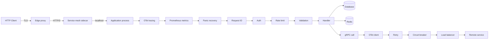
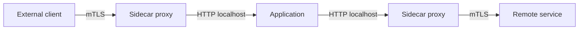
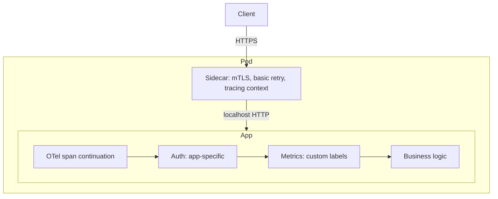
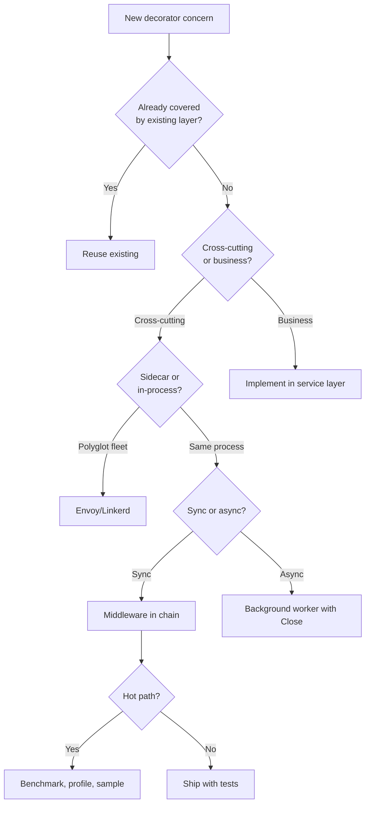

# Decorator Pattern — Senior

## 1. The architectural question

Junior taught the shape — wrap an object that implements interface `I` in another object that also implements `I`, do work around the delegated call. Middle taught the chain — ordering invariants, recovery, stateful decorators, the price of allocation. Senior is what happens when a decorator stops being a local convenience and becomes a *load-bearing piece of the system*.

The day your `http.Handler` middleware ships in v1.0.0 of an open-source library, every downstream consumer's chain order depends on it. The day your gRPC `UnaryServerInterceptor` ships in `grpc-go-middleware`, its semantics get baked into hundreds of production services. The day your `Tracer` decorator on `database/sql` panics on a particular driver, your customers' incident channels light up.

The senior-level forces:

1. **Distributed decorators** — interceptors in gRPC, sidecar filters in service meshes, server-scoped vs request-scoped wrappers. The middleware that runs on every RPC across forty services.
2. **Library design** — publishing decorators that downstream consumers will compose into chains you don't control. Backwards-compatible evolution of decorator APIs.
3. **Contract enforcement** — Liskov for decorator chains: the chain must behave like the inner. Decorators that silently change semantics (swallow errors, mutate ctx values, drop deadlines) are the source of half the production incidents in microservice fleets.
4. **Concurrency and lifecycle** — decorators that hold goroutines, request-scoped goroutines that outlive the request, leak prevention.
5. **Performance at scale** — PGO devirtualization of decorator chains, allocation hotspots in middleware setup, inlining limits, escape analysis at the boundary.
6. **Cross-cutting observability** — OpenTelemetry's `otelhttp` and `otelgrpc` are decorators. So are Prometheus collectors. So are Datadog tracers. The composition of three vendors' decorators on one handler is a real situation.
7. **Anti-pattern resistance** — decorator soup (twenty layers, none of which can be removed because nobody knows why they're there), hidden state, ordering accidents.

This file walks the senior-level shape of all of it. Sections 3-7 cover distributed decorators and middleware libraries. Sections 8-10 cover gRPC interceptors and OpenTelemetry. Sections 11-13 cover library design and contract testing. Sections 14-17 cover concurrency, performance, anti-patterns. Section 18 is postmortems. The rest is cross-language comparison, mistakes, questions, and reference material.

---

## 2. Table of Contents

1. [The architectural question](#1-the-architectural-question)
2. [Table of Contents](#2-table-of-contents)
3. [Distributed decorators: the picture from 30,000 feet](#3-distributed-decorators-the-picture-from-30000-feet)
4. [Request-scoped vs server-scoped decorators](#4-request-scoped-vs-server-scoped-decorators)
5. [Middleware libraries in the Go ecosystem](#5-middleware-libraries-in-the-go-ecosystem)
6. [chi, gorilla/mux, echo, gin: same idea, different ergonomics](#6-chi-gorillamux-echo-gin-same-idea-different-ergonomics)
7. [gRPC unary and stream interceptors](#7-grpc-unary-and-stream-interceptors)
8. [OpenTelemetry: otelhttp and otelgrpc as decorators](#8-opentelemetry-otelhttp-and-otelgrpc-as-decorators)
9. [Sidecar patterns: decorators that live in another process](#9-sidecar-patterns-decorators-that-live-in-another-process)
10. [Resilience decorators: gobreaker, rate.Limiter, hystrix-go](#10-resilience-decorators-gobreaker-ratelimiter-hystrix-go)
11. [Library design: publishing decorators for downstream consumers](#11-library-design-publishing-decorators-for-downstream-consumers)
12. [Decorator API evolution across major versions](#12-decorator-api-evolution-across-major-versions)
13. [Liskov and contract testing for decorator chains](#13-liskov-and-contract-testing-for-decorator-chains)
14. [Concurrency: decorators that hold goroutines, leak prevention](#14-concurrency-decorators-that-hold-goroutines-leak-prevention)
15. [Performance at scale: PGO, devirtualization, allocation hotspots](#15-performance-at-scale-pgo-devirtualization-allocation-hotspots)
16. [Anti-patterns: decorator soup, hidden state, ordering accidents](#16-anti-patterns-decorator-soup-hidden-state-ordering-accidents)
17. [Profiling and debugging decorator chains in production](#17-profiling-and-debugging-decorator-chains-in-production)
18. [Postmortems](#18-postmortems)
19. [Cross-language comparison](#19-cross-language-comparison)
20. [Common senior-level mistakes](#20-common-senior-level-mistakes)
21. [Tricky questions](#21-tricky-questions)
22. [Cheat sheet](#22-cheat-sheet)
23. [Further reading](#23-further-reading)

---

## 3. Distributed decorators: the picture from 30,000 feet

A request in a modern microservice fleet passes through dozens of decorators before any business logic runs. Most of them are invisible to application code — they're attached by frameworks, libraries, or infrastructure.

Trace one HTTP request entering a service and the decorator chain looks like this:



Each box is a decorator. Each box satisfies the same interface as the box it wraps:

- The edge proxy is an `http.Handler` that wraps another `http.Handler` (the upstream).
- The mesh sidecar is an L7 proxy that wraps the application; from the application's perspective it's transparent.
- Inside the process, every middleware is a `func(http.Handler) http.Handler`.
- Inside the gRPC client, every interceptor is a `grpc.UnaryClientInterceptor`.
- The retry and circuit-breaker wrappers are `grpc.UnaryClientInterceptor` too, sitting between the application code and the actual transport.

The architectural payoff: each concern (tracing, metrics, retry, recovery, auth) is one layer, owned by one team, swappable in isolation. The application code is `func(ctx context.Context, req *Request) (*Response, error)` — and stays that way no matter how many cross-cutting concerns the platform team adds.

The architectural risk: each layer has a contract that nobody documented. Reorder them and behaviour changes in non-obvious ways. Remove one and the system seems to keep working until the next incident, at which point you discover the recovery middleware was the only thing keeping panics from killing the process.

### 3.1 The "decorator stack" as system architecture

A useful mental model: the decorator stack *is* the system, viewed from the request's perspective. Application code is the innermost 5% of what runs. The other 95% is infrastructure decorators.

```
HTTP request
  → TLS termination          (5 μs)
  → HTTP/2 framing           (2 μs)
  → Mesh sidecar policies    (200 μs)
  → Tracing span start       (1 μs)
  → Metrics counter inc      (50 ns)
  → Panic recovery defer     (~0 ns until panic)
  → Auth (JWT validate)      (50 μs)
  → Rate limit check         (200 ns)
  → Request validation       (5 μs)
  → Handler                  (10 ms) ← business logic
  → Tracing span end         (1 μs)
  → Metrics histogram obs    (200 ns)
  → Response serialization   (5 μs)
```

The handler is two orders of magnitude more expensive than any single decorator, so the decorator overhead is invisible — until you have ten of them, or one of them does network I/O it shouldn't, or one of them allocates per-request when it shouldn't, or the auth decorator decides to hit Redis instead of using a JWT.

### 3.2 The "interceptor" terminology

Different libraries use different words for the same idea:

| Term | Library | Shape |
|------|---------|-------|
| Middleware | `chi`, `gorilla/mux`, `gin`, `echo`, `net/http` | `func(http.Handler) http.Handler` |
| Interceptor | `grpc-go`, `connect-go`, gRPC ecosystem | `func(ctx, req, info, handler) (resp, err)` |
| Filter | Java Servlet API, Envoy, Istio | `Filter.doFilter(req, resp, chain)` |
| Handler | OpenTelemetry HTTP instrumentation | Wraps `http.Handler` |
| Wrapper | `database/sql` driver wrappers, `httputil.ReverseProxy` | Wraps the inner type |
| Tap | Reactive Streams, RxGo | Inserts observation without modification |

They're all the same pattern. The naming reflects the ecosystem's history (Java's "servlet filter" came from the Servlet API; gRPC's "interceptor" came from the original gRPC C++ codebase). When reading any cloud-native Go codebase, treat all of these as "decorator" and apply the same reasoning.

---

## 4. Request-scoped vs server-scoped decorators

A core distinction that determines lifecycle, state ownership, and concurrency rules.

### 4.1 Server-scoped decorators

Created once at startup. Live for the lifetime of the process. Shared across every request.

```go
// Server-scoped — one instance, used by every request
type Metrics struct {
    requests *prometheus.CounterVec
    latency  *prometheus.HistogramVec
}

func NewMetrics(reg prometheus.Registerer) *Metrics {
    m := &Metrics{
        requests: prometheus.NewCounterVec(prometheus.CounterOpts{
            Name: "http_requests_total",
        }, []string{"method", "path", "status"}),
        latency: prometheus.NewHistogramVec(prometheus.HistogramOpts{
            Name: "http_request_duration_seconds",
        }, []string{"method", "path"}),
    }
    reg.MustRegister(m.requests, m.latency)
    return m
}

func (m *Metrics) Middleware(next http.Handler) http.Handler {
    return http.HandlerFunc(func(w http.ResponseWriter, r *http.Request) {
        start := time.Now()
        rec := &statusRecorder{ResponseWriter: w, status: 200}
        next.ServeHTTP(rec, r)
        m.requests.WithLabelValues(r.Method, r.URL.Path, strconv.Itoa(rec.status)).Inc()
        m.latency.WithLabelValues(r.Method, r.URL.Path).Observe(time.Since(start).Seconds())
    })
}
```

The `Metrics` struct holds the Prometheus collectors. The closure returned by `Middleware` captures the struct. Every request increments the same counters. The struct is read-write from every goroutine; the Prometheus client library guarantees thread-safety internally.

The lifecycle is bound to the server: create at startup, register with Prometheus, attach to the mux, never replaced. If you want to swap implementations, you swap the entire chain (rebuild and redeploy).

### 4.2 Request-scoped decorators

Conceptually "created per request" — but in Go this is misleading. The middleware *function* is created once at startup; what's per-request is the *state* it allocates inside its closure on each call.

```go
// Request-scoped state — local to each invocation
func RequestID(next http.Handler) http.Handler {
    return http.HandlerFunc(func(w http.ResponseWriter, r *http.Request) {
        id := r.Header.Get("X-Request-ID")
        if id == "" {
            id = uuid.NewString()
        }
        ctx := context.WithValue(r.Context(), requestIDKey, id)
        w.Header().Set("X-Request-ID", id)
        next.ServeHTTP(w, r.WithContext(ctx))
    })
}
```

`id` is a per-request variable. `ctx` is a per-request derived context. They live on the goroutine's stack during the request and are GC'd afterward. There's no shared mutable state.

This is the right shape for anything that:
- Generates per-request data (request ID, trace ID, deadline).
- Reads per-request input (auth tokens, query parameters).
- Writes per-request output (Set-Cookie, response headers).

### 4.3 The hybrid: server-scoped state, request-scoped logic

Most middlewares are both:

```go
type Auth struct {
    publicKey ed25519.PublicKey  // server-scoped, immutable
    cache     *jwtCache          // server-scoped, thread-safe
}

func (a *Auth) Middleware(next http.Handler) http.Handler {
    return http.HandlerFunc(func(w http.ResponseWriter, r *http.Request) {
        // request-scoped
        token := r.Header.Get("Authorization")
        claims, err := a.validate(r.Context(), token)
        if err != nil {
            http.Error(w, "unauthorized", 401)
            return
        }
        ctx := context.WithValue(r.Context(), claimsKey, claims)
        next.ServeHTTP(w, r.WithContext(ctx))
    })
}

func (a *Auth) validate(ctx context.Context, token string) (*Claims, error) {
    if c, ok := a.cache.Get(token); ok {
        return c, nil
    }
    c, err := jwt.Verify(token, a.publicKey)
    if err != nil {
        return nil, err
    }
    a.cache.Put(token, c)
    return c, nil
}
```

The struct holds the public key and the JWT cache — both shared, both thread-safe. The closure produces per-request claims and a per-request context. The function call boundary cleanly separates the two scopes.

### 4.4 The "request-scoped goroutine" trap

A common senior-level mistake: starting a goroutine in a request-scoped middleware that *outlives* the request.

```go
// ANTI-PATTERN
func AuditAsync(audit AuditService) func(http.Handler) http.Handler {
    return func(next http.Handler) http.Handler {
        return http.HandlerFunc(func(w http.ResponseWriter, r *http.Request) {
            rec := &captureRecorder{ResponseWriter: w}
            next.ServeHTTP(rec, r)
            
            // BAD: goroutine outlives the request, captures r
            go audit.Log(r.Context(), r.Method, r.URL.Path, rec.status)
        })
    }
}
```

Three problems:
1. **`r.Context()` is cancelled** when the request handler returns. The audit call now runs with a cancelled context and likely fails.
2. **`r` may be reused** by `net/http`'s pooling. The request object is not stable beyond `ServeHTTP`'s return.
3. **Goroutine leak under load.** If the audit service is slow, goroutines pile up. A few thousand RPS with a 10-second audit latency = tens of thousands of goroutines waiting.

The fix: copy what you need, use a *server-scoped* context (or a derived background context with a timeout), bound concurrency with a worker pool.

```go
type AsyncAudit struct {
    svc     AuditService
    queue   chan auditEvent
    workers int
}

func (a *AsyncAudit) Middleware(next http.Handler) http.Handler {
    return http.HandlerFunc(func(w http.ResponseWriter, r *http.Request) {
        rec := &captureRecorder{ResponseWriter: w}
        next.ServeHTTP(rec, r)
        
        select {
        case a.queue <- auditEvent{
            method: r.Method,
            path:   r.URL.Path,  // path is a string — safe to copy
            status: rec.status,
            time:   time.Now(),
        }:
        default:
            // Queue full — drop (or block, depending on policy)
            a.dropped.Inc()
        }
    })
}

func (a *AsyncAudit) worker(ctx context.Context) {
    for {
        select {
        case <-ctx.Done():
            return
        case e := <-a.queue:
            a.svc.Log(ctx, e)
        }
    }
}
```

The queue caps backpressure. The workers are server-scoped. The context is server-scoped. The middleware copies the data it needs out of `r`. No leaks, no use-after-pool.

---

## 5. Middleware libraries in the Go ecosystem

The middleware-as-decorator pattern is so dominant in Go that several ecosystems have grown up around it. Knowing the shape of each helps you read other people's code and choose the right tool.

### 5.1 The standard library baseline

`net/http` defines `http.Handler` and `http.HandlerFunc`. Middleware is `func(http.Handler) http.Handler`. There's no built-in chain; you wrap manually:

```go
h := http.HandlerFunc(handle)
var server http.Handler = h
server = Logging(server)
server = Auth(server)
server = Recovery(server)
http.Handle("/api", server)
```

Pros: zero dependencies, completely transparent.
Cons: order is visually inverted (last call = outermost), no helpers for grouping or per-route middleware.

### 5.2 chi (`github.com/go-chi/chi`)

Lightweight router with first-class middleware support. The canonical "stdlib-compatible" choice.

```go
r := chi.NewRouter()
r.Use(middleware.RequestID)
r.Use(middleware.Logger)
r.Use(middleware.Recoverer)

r.Route("/api", func(r chi.Router) {
    r.Use(authMiddleware)
    r.Get("/users", listUsers)
    r.Post("/users", createUser)
})
```

Middleware signature is `func(http.Handler) http.Handler` — identical to stdlib. `chi.Router.Use(...)` appends to the router's middleware slice. `Route(...)` creates a sub-router with its own middleware. Middleware applied at the parent router runs before middleware applied at the sub-router.

The chain is built lazily at first request and cached. Per-request cost is one indirect call per middleware layer.

`go-chi/render` adds JSON/XML encoding decorators around responses; `go-chi/cors` adds CORS handling; `go-chi/jwtauth` adds JWT validation. The ecosystem composes because every piece is `func(http.Handler) http.Handler`.

### 5.3 gorilla/mux (`github.com/gorilla/mux`)

Older, more mature router. Middleware via `Router.Use(...)`:

```go
r := mux.NewRouter()
r.Use(loggingMiddleware)
r.Use(authMiddleware)
r.HandleFunc("/api/users", listUsers).Methods("GET")
```

Same signature, same shape. gorilla/mux's middleware applies to all routes registered on the router; sub-routers via `Subrouter()` get their own middleware stack. The library was archived in 2022 (handed off to a community fork), so new projects should prefer chi or echo, but you'll meet gorilla/mux in any codebase older than 2020.

### 5.4 gin (`github.com/gin-gonic/gin`)

Faster but with its own handler signature: `func(*gin.Context)` instead of `(http.ResponseWriter, *http.Request)`. Middleware is `gin.HandlerFunc` too:

```go
r := gin.New()
r.Use(gin.Logger())
r.Use(gin.Recovery())

api := r.Group("/api")
api.Use(authMiddleware)
api.GET("/users", listUsers)
```

The "next" handler is invoked by calling `c.Next()`:

```go
func authMiddleware(c *gin.Context) {
    token := c.GetHeader("Authorization")
    if !validate(token) {
        c.AbortWithStatus(401)
        return
    }
    c.Next()  // explicit delegation
}
```

This is a different shape from the wrapper pattern — gin uses an "explicit chain" model where each middleware sees a `Context` that carries a pointer to the next handler. It's equivalent in expressiveness; the syntactic difference is that you call `c.Next()` instead of `next.ServeHTTP(w, r)`.

Performance: gin claims ~40x faster than stdlib `net/http` for routing, mostly due to its radix-tree router and avoidance of reflection. The middleware dispatch overhead is in the same order of magnitude as chi's.

### 5.5 echo (`github.com/labstack/echo`)

Similar shape to gin: custom `echo.Context`, `func(echo.Context) error` handlers, middleware as `func(echo.HandlerFunc) echo.HandlerFunc`.

```go
e := echo.New()
e.Use(middleware.Logger())
e.Use(middleware.Recover())

g := e.Group("/api")
g.Use(authMiddleware)
g.GET("/users", listUsers)

func authMiddleware(next echo.HandlerFunc) echo.HandlerFunc {
    return func(c echo.Context) error {
        if !validate(c.Request().Header.Get("Authorization")) {
            return echo.NewHTTPError(401)
        }
        return next(c)
    }
}
```

Echo's middleware shape is *exactly* `func(Handler) Handler` — the same pattern as stdlib, just with `echo.HandlerFunc` instead of `http.Handler`. No `c.Next()` indirection.

### 5.6 The choice

| If you want… | Use |
|--------------|-----|
| Zero dependencies, full control | stdlib `net/http` |
| Stdlib-compatible router with middleware ergonomics | `chi` |
| Maximum throughput, willing to use custom Context | `gin` or `echo` |
| Largest historical install base, legacy migration | `gorilla/mux` (archived, prefer chi for greenfield) |

For new code in 2026, chi is the dominant choice if you want to stay close to stdlib semantics. Gin/echo are common for high-throughput JSON APIs. The decorator pattern is identical across all of them; only the type signatures change.

---

## 6. chi, gorilla/mux, echo, gin: same idea, different ergonomics

A side-by-side of how each library expresses the same middleware.

### 6.1 The task: log every request with method, path, status, duration

**Stdlib:**
```go
func Logging(next http.Handler) http.Handler {
    return http.HandlerFunc(func(w http.ResponseWriter, r *http.Request) {
        start := time.Now()
        rec := &recorder{ResponseWriter: w, status: 200}
        next.ServeHTTP(rec, r)
        log.Printf("%s %s %d %s",
            r.Method, r.URL.Path, rec.status, time.Since(start))
    })
}

type recorder struct {
    http.ResponseWriter
    status int
}

func (r *recorder) WriteHeader(code int) {
    r.status = code
    r.ResponseWriter.WriteHeader(code)
}
```

**chi** (identical signature):
```go
r := chi.NewRouter()
r.Use(Logging)
```

Or use chi's built-in `middleware.Logger`:
```go
r.Use(middleware.Logger)
```

**gin:**
```go
func Logging() gin.HandlerFunc {
    return func(c *gin.Context) {
        start := time.Now()
        c.Next()
        log.Printf("%s %s %d %s",
            c.Request.Method, c.Request.URL.Path,
            c.Writer.Status(), time.Since(start))
    }
}

r := gin.New()
r.Use(Logging())
```

**echo:**
```go
func Logging(next echo.HandlerFunc) echo.HandlerFunc {
    return func(c echo.Context) error {
        start := time.Now()
        err := next(c)
        log.Printf("%s %s %d %s",
            c.Request().Method, c.Request().URL.Path,
            c.Response().Status, time.Since(start))
        return err
    }
}

e := echo.New()
e.Use(Logging)
```

The pattern is identical. The signature is different. The cognitive model — "wrap the next handler, do work around it" — translates one-to-one.

### 6.2 Comparison table

| Aspect | stdlib | chi | gorilla/mux | gin | echo |
|--------|--------|-----|-------------|-----|------|
| Handler type | `http.Handler` | `http.Handler` | `http.Handler` | `gin.HandlerFunc` | `echo.HandlerFunc` |
| Middleware signature | `func(Handler) Handler` | `func(Handler) Handler` | `func(Handler) Handler` | `gin.HandlerFunc` with `c.Next()` | `func(HandlerFunc) HandlerFunc` |
| Per-route middleware | Manual wrapping | `r.With(mw).Get(...)` | `r.Handle(...).Use(mw)` | `r.GET(path, mw, h)` | `e.GET(path, h, mw)` |
| Group middleware | Manual | `r.Route("/api", ...)` | `r.PathPrefix("/api").Subrouter()` | `r.Group("/api")` | `e.Group("/api")` |
| Built-in middleware | None | Many (RequestID, Logger, Recoverer, Timeout, …) | Some (LoggingHandler, CORSMethodMiddleware) | Many (Logger, Recovery, BasicAuth, …) | Many (Logger, Recover, BasicAuth, CORS, …) |
| Stdlib-compatible | N/A | Yes (drop-in) | Yes (drop-in) | No (custom context) | No (custom context) |
| Maintenance status (2026) | Active | Active | Archived/community | Active | Active |

The senior takeaway: pick the library by ergonomics and ecosystem fit, not by the middleware model. The model is the same.

---

## 7. gRPC unary and stream interceptors

gRPC's interceptor is the decorator pattern with two specializations: unary (request-response) and streaming (one-or-both sides streaming).

### 7.1 Unary server interceptor

```go
type UnaryServerInterceptor func(
    ctx context.Context,
    req interface{},
    info *UnaryServerInfo,
    handler UnaryHandler,
) (resp interface{}, err error)

type UnaryHandler func(ctx context.Context, req interface{}) (interface{}, error)
```

The interceptor receives the request, info about the method being called, and a `handler` (the next link in the chain). It must call `handler(ctx, req)` to delegate.

```go
func Logging(logger *log.Logger) grpc.UnaryServerInterceptor {
    return func(
        ctx context.Context,
        req interface{},
        info *grpc.UnaryServerInfo,
        handler grpc.UnaryHandler,
    ) (interface{}, error) {
        start := time.Now()
        resp, err := handler(ctx, req)
        logger.Printf("%s took %s err=%v",
            info.FullMethod, time.Since(start), err)
        return resp, err
    }
}
```

This is structurally identical to HTTP middleware. The interface boundary is `UnaryHandler` instead of `http.Handler`; the chain composes the same way.

Server setup:

```go
s := grpc.NewServer(
    grpc.ChainUnaryInterceptor(
        recovery.UnaryServerInterceptor(),
        tracing.UnaryServerInterceptor(),
        metrics.UnaryServerInterceptor(),
        auth.UnaryServerInterceptor(authFn),
        logging.UnaryServerInterceptor(logger),
    ),
)
```

`grpc.ChainUnaryInterceptor` applies interceptors in order, with the *first* interceptor in the list being the *outermost*. Same convention as chi, gorilla/mux, and most HTTP middleware libraries.

### 7.2 Unary client interceptor

Mirror image — wraps outgoing calls:

```go
type UnaryClientInterceptor func(
    ctx context.Context,
    method string,
    req, reply interface{},
    cc *ClientConn,
    invoker UnaryInvoker,
    opts ...CallOption,
) error
```

Used for client-side concerns: retries, circuit breakers, client-side tracing, request ID propagation.

```go
func RetryInterceptor(maxAttempts int) grpc.UnaryClientInterceptor {
    return func(
        ctx context.Context,
        method string,
        req, reply interface{},
        cc *grpc.ClientConn,
        invoker grpc.UnaryInvoker,
        opts ...grpc.CallOption,
    ) error {
        var lastErr error
        for i := 0; i < maxAttempts; i++ {
            err := invoker(ctx, method, req, reply, cc, opts...)
            if err == nil {
                return nil
            }
            if !isRetryable(err) {
                return err
            }
            lastErr = err
            // exponential backoff with jitter
            backoff := time.Duration(1<<i) * 100 * time.Millisecond
            backoff += time.Duration(rand.Int63n(int64(backoff)))
            select {
            case <-time.After(backoff):
            case <-ctx.Done():
                return ctx.Err()
            }
        }
        return fmt.Errorf("after %d attempts: %w", maxAttempts, lastErr)
    }
}
```

Client setup:

```go
conn, err := grpc.NewClient(addr,
    grpc.WithChainUnaryInterceptor(
        tracing.UnaryClientInterceptor(),
        metrics.UnaryClientInterceptor(),
        RetryInterceptor(3),
        TimeoutInterceptor(5*time.Second),
    ),
)
```

### 7.3 Stream interceptors

Stream RPCs (server-streaming, client-streaming, bidirectional) need different shapes because the call doesn't return a single response — it returns a `grpc.ServerStream` (server side) or `grpc.ClientStream` (client side) that is read/written incrementally.

```go
type StreamServerInterceptor func(
    srv interface{},
    ss ServerStream,
    info *StreamServerInfo,
    handler StreamHandler,
) error
```

To decorate the stream, you wrap the `ServerStream`:

```go
type wrappedServerStream struct {
    grpc.ServerStream
    ctx context.Context
}

func (w *wrappedServerStream) Context() context.Context { return w.ctx }

func TracingStream(tracer trace.Tracer) grpc.StreamServerInterceptor {
    return func(
        srv interface{},
        ss grpc.ServerStream,
        info *grpc.StreamServerInfo,
        handler grpc.StreamHandler,
    ) error {
        ctx, span := tracer.Start(ss.Context(), info.FullMethod)
        defer span.End()
        
        return handler(srv, &wrappedServerStream{
            ServerStream: ss,
            ctx:          ctx,
        })
    }
}
```

Note the nested decorator pattern: we decorate the *interceptor* and we decorate the *ServerStream*. Both wrap; both implement the same interface as what they wrap. Stream interceptors are decorators all the way down.

### 7.4 The `grpc-ecosystem/go-grpc-middleware` library

The de facto collection of interceptors for production gRPC services. Wraps:

- `recovery` — panic recovery, optional custom handler.
- `logging` — slog, zap, zerolog adapters.
- `auth` — pluggable token validation.
- `validator` — request validation via protoc-gen-validate.
- `retry` — client-side retry with policies.
- `ratelimit` — server-side rate limiting.
- `tags` — context tags for cross-cutting metadata.

Every entry in that list is a decorator. The library's design choice — provide each as a separate factory function returning an interceptor — means you compose only what you need, in the order you want.

### 7.5 Ordering rules for gRPC interceptors

Same principles as HTTP middleware, slight shifts:

```go
grpc.ChainUnaryInterceptor(
    recovery.UnaryServerInterceptor(),     // outermost — catches panics from everything below
    tracing.UnaryServerInterceptor(),      // wraps everything in a span
    metrics.UnaryServerInterceptor(),      // sees final status + duration
    auth.UnaryServerInterceptor(authFn),   // reject before handler runs
    validator.UnaryServerInterceptor(),    // validate after auth
    logging.UnaryServerInterceptor(),      // log final outcome
    // handler runs here
)
```

Recovery outermost: a panic in any interceptor or handler is caught. Tracing next: every request gets a span, including auth failures. Metrics next: every request is counted. Auth before validator: don't validate unauthenticated requests. Logging innermost (of the cross-cutters): logs see the resolved authentication context.

Get this wrong and your panics aren't recovered, your traces are incomplete, your metrics under-count, your logs leak unauthenticated request details. Each row in that order represents a production incident someone had.

---

## 8. OpenTelemetry: `otelhttp` and `otelgrpc` as decorators

OpenTelemetry's Go SDK ships instrumentation as decorators. Studying them is instructive because they're well-engineered, widely deployed, and demonstrate non-trivial decorator design.

### 8.1 `otelhttp` server-side

```go
import "go.opentelemetry.io/contrib/instrumentation/net/http/otelhttp"

handler := otelhttp.NewHandler(
    http.HandlerFunc(myAPIHandler),
    "/api/v1",  // operation name
    otelhttp.WithSpanNameFormatter(func(_ string, r *http.Request) string {
        return r.Method + " " + r.URL.Path
    }),
    otelhttp.WithFilter(func(r *http.Request) bool {
        return !strings.HasPrefix(r.URL.Path, "/health")
    }),
)
```

`otelhttp.NewHandler` is a decorator factory. It returns an `http.Handler` that wraps the input handler, extracts the incoming trace context from headers (via the configured propagator), starts a span, runs the inner handler, ends the span with status, and records metrics.

The decoration is substantial — it touches:
- Request headers (extract trace context).
- Request context (inject span).
- ResponseWriter (intercept status code for span attributes).
- Response headers (inject trace context for downstream — only on server, not on client).
- Metrics (request count, duration histogram).

The trick: it does all of this without breaking the `http.Handler` contract. The wrapped handler still satisfies `http.Handler`, callers can't tell from the type whether tracing is enabled, and the chain composes with any other middleware.

### 8.2 `otelhttp` client-side

```go
client := &http.Client{
    Transport: otelhttp.NewTransport(
        http.DefaultTransport,
        otelhttp.WithSpanNameFormatter(func(_ string, r *http.Request) string {
            return r.Method + " " + r.URL.Host
        }),
    ),
}
```

`otelhttp.NewTransport` decorates `http.RoundTripper`. Same pattern, different interface. Every outbound request from `client` gets traced, headers injected, metrics recorded.

`http.RoundTripper` is one of the cleanest decorator interfaces in the stdlib:

```go
type RoundTripper interface {
    RoundTrip(*Request) (*Response, error)
}
```

One method. Any wrapper of `RoundTripper` is a decorator. The standard library uses this for `http2.Transport`, `httputil.NewSingleHostReverseProxy`, and third-party libraries use it for retries, caching, rate limiting, mocking. Every observability vendor (Datadog, New Relic, Honeycomb, otel) ships a `RoundTripper` decorator.

### 8.3 `otelgrpc` interceptors

```go
import "go.opentelemetry.io/contrib/instrumentation/google.golang.org/grpc/otelgrpc"

s := grpc.NewServer(
    grpc.ChainUnaryInterceptor(
        otelgrpc.UnaryServerInterceptor(),
        otelgrpc.StreamServerInterceptor(),  // for streaming
    ),
)

conn, _ := grpc.NewClient(addr,
    grpc.WithChainUnaryInterceptor(otelgrpc.UnaryClientInterceptor()),
    grpc.WithChainStreamInterceptor(otelgrpc.StreamClientInterceptor()),
)
```

Same shape, gRPC-specific. The interceptors extract the trace context from gRPC metadata (gRPC's equivalent of HTTP headers), start spans, propagate context, record metrics.

### 8.4 The "stats handler" alternative

gRPC has a *second* extension point — `stats.Handler` — that's more powerful than interceptors for observability. Otel moved its gRPC instrumentation to `stats.Handler` in 2023.

```go
s := grpc.NewServer(
    grpc.StatsHandler(otelgrpc.NewServerHandler()),
)
```

`stats.Handler` sees more events (connection establishment, header send/recv, payload size) than interceptors do, and runs without participating in the interceptor chain. For pure observability, it's a better fit. For modifying behaviour (auth, retry, validation), interceptors remain the right choice.

The lesson: the same problem (observe RPCs) can be solved by two different decorator-shaped extension points, and the library's choice between them is an architectural decision. Interceptors are simpler to reason about. Stats handlers are more powerful but don't compose with interceptors directly.

### 8.5 The cost

Otel's instrumentation isn't free. Each span allocates ~1-2 KB on the heap (span context, attributes, links). At 50K RPS that's ~50-100 MB/s of allocation pressure — visible in heap profiles, occasionally triggering GC.

For latency-sensitive services, otel ships a sampling layer:

```go
import "go.opentelemetry.io/otel/sdk/trace"

provider := trace.NewTracerProvider(
    trace.WithSampler(trace.ParentBased(
        trace.TraceIDRatioBased(0.01),  // sample 1% of root spans
    )),
)
```

Unsampled spans are no-ops with minimal allocation. The decorator is still in the chain; it just emits less. The 1% sample rate is a common production setting; some critical paths sample 100% (paid-tier APIs); some hot paths sample 0.01% (per-byte read paths).

The senior takeaway: instrumentation decorators are mandatory but expensive. Choose the sampling layer carefully and measure the impact in heap profiles, not just in latency.

---

## 9. Sidecar patterns: decorators that live in another process

When a decorator gets too big, too cross-cutting, or too operationally distinct from the application, you can push it *out of the process* into a sidecar.

A sidecar is a separate process running on the same machine (usually the same Kubernetes pod) that intercepts traffic to/from the application. From the application's perspective, the sidecar is transparent — it talks to localhost. From the network's perspective, the sidecar is the visible endpoint.



### 9.1 What a sidecar typically decorates

| Concern | Sidecar | In-process equivalent |
|---------|---------|----------------------|
| mTLS termination | Envoy, Linkerd-proxy | `crypto/tls` |
| L7 routing | Envoy, Linkerd-proxy | Application router |
| Retries | Sidecar config | `retry` middleware |
| Circuit breaking | Envoy outlier detection | `gobreaker` |
| Rate limiting | Envoy global rate limit | `rate.Limiter` |
| Authentication | Sidecar plus auth service | `jwt` middleware |
| Tracing | Envoy with otel exporter | `otelhttp` |
| Metrics | Envoy admin /stats | `prometheus` middleware |

Sidecar = decorator at the network boundary. The mental model is the same — wrap the next layer, do work around it, delegate.

### 9.2 When sidecar wins

- **Polyglot fleet.** Twenty services in eight languages. Implementing the same circuit breaker in eight languages is wasteful and inconsistent. A sidecar implements it once.
- **Operational independence.** Platform team owns the sidecar; product teams own application code. Upgrading TLS policy is a sidecar redeploy, not a fleet-wide application redeploy.
- **Security boundary.** mTLS keys live in the sidecar's filesystem, not the application's. Application bugs can't leak them.
- **Centralised policy.** Rate limits and routing are configured in Istio/Consul, not in twenty different config files.

### 9.3 When sidecar loses

- **Latency.** A sidecar adds ~100-500µs per request (process boundary, possibly mTLS, possibly proxy re-encoding). For sub-millisecond budgets, this is too much.
- **Operational complexity.** Sidecar lifecycle is coupled to application pod lifecycle. Pod restarts, sidecar restarts, race conditions during startup.
- **Resource overhead.** Envoy uses ~50-100 MB RAM per pod even idle. For high-pod-count fleets, that's substantial.
- **Debugging.** A 502 from the sidecar is ambiguous — was it the application, the network, the sidecar config, or the upstream? Three logs to correlate.

### 9.4 The in-process middleware + sidecar combination

In practice, production services use both. Cross-cutting concerns that benefit from polyglot consistency (mTLS, basic retry, tracing context propagation) go to the sidecar. Concerns that need application-specific logic (business rules, custom auth, custom metrics labels) stay in-process.



The application's decorators *complement* the sidecar's. Each layer does what it's best at; together they cover everything.

### 9.5 The "decorator at every layer" rule

For distributed observability to work, *every layer* in the chain must propagate the trace context correctly:

1. The external client must inject `traceparent` headers.
2. The sidecar must preserve them.
3. The application's HTTP middleware must extract them.
4. The application's business logic must accept context and pass it down.
5. The outbound gRPC interceptor must inject them into outgoing metadata.
6. The outbound sidecar must preserve them.
7. The remote service repeats the process.

If any layer drops the headers, the trace is broken from that point. The decorator pattern is what makes this *possible* — every layer has a hook, every hook can read/write headers, every layer composes. But it's also what makes it *fragile* — one misconfigured decorator silently breaks observability for the whole fleet.

---

## 10. Resilience decorators: `gobreaker`, `rate.Limiter`, `hystrix-go`

The three canonical resilience decorators in Go: circuit breaker, rate limiter, hedging/timeout. Each is a small library that ships a decorator.

### 10.1 `gobreaker` — circuit breaker (`github.com/sony/gobreaker`)

A circuit breaker is a state machine: Closed (calls pass through), Open (calls fail fast), HalfOpen (one trial call decides).

```go
import "github.com/sony/gobreaker"

cb := gobreaker.NewCircuitBreaker(gobreaker.Settings{
    Name:        "stripe-charge",
    MaxRequests: 1,
    Interval:    60 * time.Second,
    Timeout:     30 * time.Second,
    ReadyToTrip: func(counts gobreaker.Counts) bool {
        return counts.ConsecutiveFailures > 5
    },
    OnStateChange: func(name string, from, to gobreaker.State) {
        log.Printf("circuit %s: %s -> %s", name, from, to)
    },
})

// Use it as a decorator:
type BreakerCharger struct {
    Inner Charger
    CB    *gobreaker.CircuitBreaker
}

func (b *BreakerCharger) Charge(ctx context.Context, amount int) error {
    _, err := b.CB.Execute(func() (interface{}, error) {
        return nil, b.Inner.Charge(ctx, amount)
    })
    return err
}
```

`CircuitBreaker.Execute` is the integration point. It's not itself a decorator — but it's used *inside* a decorator. The decorator (`BreakerCharger`) wraps `Charger`; the breaker tracks state.

Why a separate library and not just write your own: the state machine is non-trivial. `gobreaker` handles:
- Sliding window of success/failure counts.
- Probabilistic half-open transitions.
- Cooldown timing with jitter.
- Concurrent safety for the state.

Writing this from scratch and getting it right is hours of work. Using `gobreaker` is five lines.

### 10.2 `rate.Limiter` — token bucket (`golang.org/x/time/rate`)

The standard token-bucket rate limiter. Thread-safe. Used everywhere.

```go
import "golang.org/x/time/rate"

type RateLimitedCharger struct {
    Inner   Charger
    Limiter *rate.Limiter
}

func NewRateLimitedCharger(inner Charger, rps int, burst int) *RateLimitedCharger {
    return &RateLimitedCharger{
        Inner:   inner,
        Limiter: rate.NewLimiter(rate.Limit(rps), burst),
    }
}

func (r *RateLimitedCharger) Charge(ctx context.Context, amount int) error {
    if err := r.Limiter.Wait(ctx); err != nil {
        return fmt.Errorf("rate limit: %w", err)
    }
    return r.Inner.Charge(ctx, amount)
}
```

Three methods on `rate.Limiter`:
- `Allow()` — non-blocking check, returns `true` if a token is available.
- `Wait(ctx)` — blocks until a token is available, or ctx cancels.
- `Reserve()` — reserves a future token, returns a `Reservation` you can cancel.

For decorators, `Wait` is usually what you want — it respects context cancellation, and the caller gets back-pressure instead of errors.

### 10.3 `hystrix-go` — Netflix-style command isolation (`github.com/afex/hystrix-go`)

Older library, modelled on Netflix's Hystrix. Combines circuit breaker, timeout, and bulkhead (semaphore-based concurrency limit) into one "command":

```go
import "github.com/afex/hystrix-go/hystrix"

hystrix.ConfigureCommand("charge", hystrix.CommandConfig{
    Timeout:                1000,  // ms
    MaxConcurrentRequests:  100,
    RequestVolumeThreshold: 20,
    SleepWindow:            5000,  // ms
    ErrorPercentThreshold:  50,
})

func (h *HystrixCharger) Charge(ctx context.Context, amount int) error {
    return hystrix.Do("charge", func() error {
        return h.Inner.Charge(ctx, amount)
    }, func(err error) error {
        // fallback
        return ErrDegradedService
    })
}
```

Hystrix is no longer actively developed (Netflix archived it in 2020). New code should prefer `gobreaker` + `rate.Limiter` + explicit timeout context. But `hystrix-go` is in many production codebases and worth recognising.

### 10.4 The composed resilience chain

The senior version of "wrap with resilience":

```go
type ResilientCharger struct {
    Inner Charger
}

func WithResilience(inner Charger, opts ResilienceOpts) Charger {
    var c Charger = inner
    
    // Innermost: timeout, so it bounds the actual call
    c = WithTimeout(c, opts.Timeout)
    
    // Then retry — each retry gets its own timeout budget? Or shares the budget?
    // Senior choice: shared, via the outer ctx. Pass that down.
    c = WithRetry(c, opts.MaxAttempts, opts.RetryableErrors)
    
    // Then circuit breaker — it tracks the aggregate retry outcome
    c = WithBreaker(c, opts.BreakerSettings)
    
    // Then rate limit — even rejected requests count against the limit
    c = WithRateLimit(c, opts.RPS, opts.Burst)
    
    // Outermost: metrics, so we observe everything including rejections
    c = WithMetrics(c, opts.MetricsRegistry)
    
    return c
}
```

The ordering reflects what each layer should see:

- **Metrics outermost**: records *every* call, including ones rejected by rate limit or circuit breaker.
- **Rate limit next**: rejects excess load before any expensive logic.
- **Circuit breaker next**: stops calls when downstream is unhealthy.
- **Retry next**: handles transient failures.
- **Timeout innermost**: bounds individual call latency.

A common mistake: putting retry *inside* timeout. The total time budget is then `attempts × timeout` instead of `timeout`, which blows the SLA budget on requests that should have failed fast.

Another common mistake: putting the circuit breaker *inside* the retry. Then a single failure triggers `attempts` failed calls before the breaker even sees them. The breaker's trip threshold is now `threshold × attempts` real failures.

The compositional reasoning matters. Each layer has a clear job; the order encodes the policy.

---

## 11. Library design: publishing decorators for downstream consumers

When you ship a library, your decorators become other people's middleware. The design rules are stricter than for application code.

### 11.1 Rule 1: expose the interface, not the decorator type

Bad:

```go
// myhttp/myhttp.go
type LoggingMiddleware struct {
    Logger *log.Logger
}

func (l *LoggingMiddleware) Wrap(next http.Handler) http.Handler { ... }
```

Consumers now depend on `*LoggingMiddleware`. They can't easily replace it, can't easily test against a mock.

Good:

```go
func NewLogging(logger *log.Logger) func(http.Handler) http.Handler {
    return func(next http.Handler) http.Handler {
        return http.HandlerFunc(func(w http.ResponseWriter, r *http.Request) {
            // ...
            next.ServeHTTP(w, r)
        })
    }
}
```

The factory returns a `func(http.Handler) http.Handler` — the standard middleware signature. Consumers integrate with any router that accepts that signature.

### 11.2 Rule 2: provide configurability via functional options

```go
type Option func(*config)

type config struct {
    logger      *log.Logger
    skipPaths   []string
    statusLevel map[int]slog.Level
    formatter   func(*http.Request, int, time.Duration) string
}

func WithLogger(l *log.Logger) Option { return func(c *config) { c.logger = l } }
func WithSkipPaths(paths ...string) Option { return func(c *config) { c.skipPaths = paths } }
func WithFormatter(f func(*http.Request, int, time.Duration) string) Option {
    return func(c *config) { c.formatter = f }
}

func NewLogging(opts ...Option) func(http.Handler) http.Handler {
    cfg := defaultConfig()
    for _, opt := range opts {
        opt(&cfg)
    }
    return func(next http.Handler) http.Handler {
        // use cfg.logger, cfg.skipPaths, cfg.formatter
        return ...
    }
}
```

Functional options let you add knobs over time without breaking existing callers. New options have safe defaults; old callers don't change.

This pattern is everywhere in mature Go libraries: gRPC's `grpc.ServerOption`, otel's `trace.TracerOption`, AWS SDK's per-service `WithRegion`, etc.

### 11.3 Rule 3: don't lock callers into your context keys

Bad:

```go
type contextKey int
const userKey contextKey = 0

func Auth(next http.Handler) http.Handler {
    return http.HandlerFunc(func(w http.ResponseWriter, r *http.Request) {
        user := authenticate(r)
        ctx := context.WithValue(r.Context(), userKey, user)  // unexported key
        next.ServeHTTP(w, r.WithContext(ctx))
    })
}
```

Consumers downstream of `Auth` can't get the user out of context — the key is unexported.

Good:

```go
type ContextKey struct{ name string }

var UserContextKey = ContextKey{"user"}

func UserFromContext(ctx context.Context) (*User, bool) {
    u, ok := ctx.Value(UserContextKey).(*User)
    return u, ok
}
```

Expose the key as a value and provide a typed accessor. Consumers use the accessor, never touch the raw key.

The struct-as-key trick (`type ContextKey struct{ name string }`) prevents accidental key collisions with other packages — two packages with `type ContextKey int; const Key ContextKey = 0` would collide; struct keys are unique by package path.

### 11.4 Rule 4: never silently change ResponseWriter behaviour

Decorators that wrap `http.ResponseWriter` to capture status codes are common:

```go
type recorder struct {
    http.ResponseWriter
    status int
}

func (r *recorder) WriteHeader(code int) {
    r.status = code
    r.ResponseWriter.WriteHeader(code)
}
```

Looks fine. But `http.ResponseWriter` has *optional* extension interfaces — `http.Flusher`, `http.Hijacker`, `http.Pusher`, `http.CloseNotifier`. If the inner writer implements them, your wrapper does *not*, because the wrapper only exposes what's on its method set.

Downstream code that does `w.(http.Flusher).Flush()` now fails with a type assertion panic.

The fix: implement the extension interfaces conditionally:

```go
type recorder struct {
    http.ResponseWriter
    status int
}

func (r *recorder) WriteHeader(code int) {
    r.status = code
    r.ResponseWriter.WriteHeader(code)
}

func (r *recorder) Flush() {
    if f, ok := r.ResponseWriter.(http.Flusher); ok {
        f.Flush()
    }
}

func (r *recorder) Hijack() (net.Conn, *bufio.ReadWriter, error) {
    if h, ok := r.ResponseWriter.(http.Hijacker); ok {
        return h.Hijack()
    }
    return nil, nil, errors.New("hijack not supported")
}
```

Or use a library like `github.com/felixge/httpsnoop` that handles all the combinatorics for you.

The general principle: **a transparent decorator must preserve all interfaces the underlying type implements**. Type assertions are how Go programmers detect optional capabilities; breaking them silently is breaking the API contract.

### 11.5 Rule 5: document ordering requirements loudly

A decorator that has order requirements should say so in its godoc:

```go
// NewRequestID returns middleware that attaches a request ID to the context
// and as a response header.
//
// Order: this middleware should be placed near the outermost layer, before
// logging, tracing, or metrics that may want to reference the request ID.
//
// If a request ID is already present in the X-Request-ID header, it is
// preserved.
func NewRequestID(opts ...Option) func(http.Handler) http.Handler { ... }
```

The "should be placed near the outermost layer" sentence saves consumers from learning the ordering rule the hard way.

### 11.6 Rule 6: version the interface, not the implementation

If your decorator wraps an interface you don't control (e.g., `http.Handler`), versioning is trivial — the inner interface is the contract.

If your decorator wraps a *library-internal* interface (e.g., a custom `Charger`), you have to commit to that interface's stability. Adding a method breaks downstream implementers. Make the interface as small as possible from day one.

We cover this in §12.

---

## 12. Decorator API evolution across major versions

A library that ships decorators commits to compatibility for the lifetime of the major version. Evolving the API without breaking consumers requires discipline.

### 12.1 What's a breaking change for a decorator?

Any of these in v1 → v2 breaks consumers:

1. **Renaming or removing the factory function.**
2. **Changing the factory function's signature** (adding required parameters, changing parameter types).
3. **Adding a method to a decorated interface** if implementers are downstream.
4. **Changing the decorator's wrapping order** (if the library was responsible for composition).
5. **Changing context keys** consumers depend on.
6. **Changing log/metric format** (consumers depend on labels for alerts).
7. **Changing default behaviour** (a metric that was opt-in becomes opt-out).

Each of these has a different mitigation.

### 12.2 Pattern: optional parameters via functional options

Adding new behaviour: introduce a new `Option`.

```go
// v1.0
func NewLogging() func(http.Handler) http.Handler { ... }

// v1.1 — adds skip-paths feature
func NewLogging(opts ...Option) func(http.Handler) http.Handler { ... }
func WithSkipPaths(paths ...string) Option { ... }
```

Both `NewLogging()` and `NewLogging(WithSkipPaths("/health"))` compile. Existing callers don't change.

If `NewLogging()` had a required parameter that's becoming optional, you can't easily reverse — once the type is fixed, it's fixed. So default to functional options from v1.

### 12.3 Pattern: deprecation cycle for removal

```go
// v1.5 — deprecating Old in favour of New
//
// Deprecated: use NewLoggingHandler instead.
func NewLogging(opts ...Option) func(http.Handler) http.Handler { ... }

// New, preferred name with better semantics
func NewLoggingHandler(opts ...Option) func(http.Handler) http.Handler { ... }
```

The `Deprecated:` comment is a convention `go vet` and IDEs recognise. Consumers see warnings; existing code keeps compiling. In v2.0, remove `NewLogging`.

### 12.4 Pattern: capability detection for optional methods

If you need consumers' implementations to support a new method, do it via an optional interface:

```go
// v1.0
type Charger interface {
    Charge(ctx context.Context, amount int) error
}

// v1.5 — some implementations support refund
type Refunder interface {
    Refund(ctx context.Context, chargeID string) error
}

// Decorator can use Refund if available
func (l *LoggingDecorator) Refund(ctx context.Context, chargeID string) error {
    log.Printf("refund: %s", chargeID)
    if r, ok := l.Inner.(Refunder); ok {
        return r.Refund(ctx, chargeID)
    }
    return ErrRefundNotSupported
}
```

The original `Charger` interface is frozen; the new capability is segregated. Existing implementations don't break.

### 12.5 The "decorator wraps an interface you don't control" case

If you wrap `http.Handler`, you're fine — `http.Handler` is frozen.

If you wrap your own `Charger` interface, every change to `Charger` is a breaking change. Three strategies:

1. **Don't change `Charger`.** Freeze v1, add new behaviour via segregated optional interfaces.
2. **Major version bump.** v2 has a new `Charger` with the new method. Ship `v2` as a separate module (`github.com/me/lib/v2`). Consumers migrate at their pace.
3. **Wrapper interface.** Add a new type that wraps the old interface and the new behaviour. Consumers using the old interface continue to work; consumers wanting the new behaviour use the wrapper.

None of these are free. The senior choice depends on how widely deployed v1 is. For libraries with thousands of users, the deprecation cycle stretches across years.

### 12.6 Real example: gRPC interceptor evolution

gRPC-go's `UnaryServerInterceptor` signature has been stable since v1.0 (2016). Adding new metadata fields would break every implementation. So gRPC-go's strategy:

- The `info *UnaryServerInfo` parameter is a struct. New fields can be added to the struct without breaking implementations (they just don't read the new fields).
- The `req interface{}` is intentionally `interface{}` (now `any`) so the type can be specialised by the service definition.
- Cross-cutting metadata (auth tokens, deadlines, tracing) lives in `metadata.MD` accessed via the context, not in the interceptor signature.

This is *deliberate API design for evolution*. The signature can't grow new positional parameters, so all extension goes through `info` (struct, additive) or `ctx` (key-value, additive).

### 12.7 OpenTelemetry's signature evolution

OpenTelemetry-Go shipped v1.0 in late 2021 with a stable API. The library's commitment: no breaking changes to the v1.x API. Internally, every change goes through:

1. Add new functionality in a separate package or as a new option.
2. Mark the old way `Deprecated:` if it's being replaced.
3. Wait at least 6 months and a minor version before removing.
4. Major version bumps are explicitly planned and announced.

The result: otel-go has had ~40 minor versions in 4 years, zero breaking changes for code that follows the stable surface. This is the gold standard.

For your own libraries: pick a level of stability commitment, document it, stick to it. "I'll just rename this method in v1.2" is how you lose users.

---

## 13. Liskov and contract testing for decorator chains

Liskov substitution for decorators says: **a decorated value must behave like the inner value, except for the documented additions**. The chain `RetryingCharger(StripeGateway)` must still satisfy the contract of `Charger`. If `Charger.Charge` says "returns ErrInsufficientFunds for insufficient balance", the wrapped version must, too.

Decorators that violate this are the source of half the production incidents in middleware-heavy codebases. They look right, they compile, they pass unit tests, and they silently change semantics in ways that break callers.

### 13.1 The common violations

1. **Swallowing errors.** A logging decorator that logs the error and returns `nil`.
2. **Swallowing panics.** A recovery decorator that catches panics and returns `nil` instead of a typed error.
3. **Changing the context.** A timeout decorator that derives from `context.Background()` instead of the inner ctx.
4. **Dropping deadlines.** A retry decorator that doesn't respect ctx cancellation.
5. **Changing return values.** A caching decorator that returns stale data without indicating staleness.
6. **Adding side effects.** A metrics decorator that increments a counter but also writes to a database.
7. **Changing concurrency semantics.** A decorator that adds a mutex around a previously lock-free interface.

Each of these is a violation. None will be caught by the compiler. Most won't be caught by unit tests of the decorator alone (because the unit test exercises the decorator's added behaviour, not its conformance to the inner contract).

### 13.2 The contract test pattern

For an interface that has decorators, ship a shared test suite that every decorator (and every base implementation) must pass:

```go
// ChargerContract asserts the behavioural contract for any Charger.
// Run this for every implementation, including decorators wrapping
// the test fake.
func ChargerContract(t *testing.T, newCharger func() Charger) {
    t.Run("Positive amount succeeds", func(t *testing.T) {
        c := newCharger()
        _, err := c.Charge(context.Background(), 1000)
        if err != nil { t.Fatal(err) }
    })
    
    t.Run("Honours context cancellation", func(t *testing.T) {
        c := newCharger()
        ctx, cancel := context.WithCancel(context.Background())
        cancel()
        _, err := c.Charge(ctx, 1000)
        if !errors.Is(err, context.Canceled) {
            t.Errorf("got %v, want %v", err, context.Canceled)
        }
    })
    
    t.Run("Errors are propagated", func(t *testing.T) {
        c := newCharger()
        // simulate inner error somehow (depends on test fixture)
        _, err := c.Charge(context.Background(), 1)  // amount=1 triggers fake error
        if err == nil {
            t.Error("expected error, got nil")
        }
    })
    
    t.Run("Concurrent calls are safe", func(t *testing.T) {
        c := newCharger()
        var wg sync.WaitGroup
        for i := 0; i < 50; i++ {
            wg.Add(1)
            go func() {
                defer wg.Done()
                c.Charge(context.Background(), 1000)
            }()
        }
        wg.Wait()
    })
    
    t.Run("Deadline is respected", func(t *testing.T) {
        c := newCharger()
        ctx, cancel := context.WithTimeout(context.Background(), 10*time.Millisecond)
        defer cancel()
        time.Sleep(20 * time.Millisecond) // ensure timeout fires
        _, err := c.Charge(ctx, 1000)
        if !errors.Is(err, context.DeadlineExceeded) {
            t.Errorf("got %v, want %v", err, context.DeadlineExceeded)
        }
    })
}
```

Now every implementation and every decorator wrapping a test fake gets tested:

```go
// stripe_test.go
func TestStripeContract(t *testing.T) {
    ChargerContract(t, func() Charger {
        return NewStripeGateway(testAPIKey)
    })
}

// logging_decorator_test.go
func TestLoggingDecoratorContract(t *testing.T) {
    ChargerContract(t, func() Charger {
        return NewLoggingDecorator(newTestFakeCharger(), log.Default())
    })
}

// retry_decorator_test.go
func TestRetryDecoratorContract(t *testing.T) {
    ChargerContract(t, func() Charger {
        return NewRetryDecorator(newTestFakeCharger(), 3)
    })
}

// composed chain test
func TestComposedChainContract(t *testing.T) {
    ChargerContract(t, func() Charger {
        c := newTestFakeCharger()
        c = NewLoggingDecorator(c, log.Default())
        c = NewRetryDecorator(c, 3)
        c = NewMetricsDecorator(c, testRegistry)
        return c
    })
}
```

When a decorator violates the contract (e.g., a retry decorator that doesn't honour context cancellation), the contract test for that decorator fails. The bug is caught in CI, not in production at 3 AM.

### 13.3 What about decorator-specific behaviour?

Contract tests verify the *common* contract. Decorator-specific behaviour (the retry actually retries; the cache actually caches) needs its own tests:

```go
func TestRetryDecoratorRetries(t *testing.T) {
    fake := newTestFakeCharger()
    fake.errOnAttempt = []bool{true, true, false}  // fail twice, succeed
    
    c := NewRetryDecorator(fake, 3)
    _, err := c.Charge(context.Background(), 1000)
    if err != nil { t.Fatal(err) }
    if fake.attempts != 3 {
        t.Errorf("expected 3 attempts, got %d", fake.attempts)
    }
}
```

Contract tests + decorator-specific tests = full coverage.

### 13.4 Fuzz testing decorator chains

For decorators that wrap encoders, decoders, or parsers, fuzz testing finds disagreements between the base and the decorated version:

```go
func FuzzCachedRepo(f *testing.F) {
    f.Add(uint32(1))
    f.Fuzz(func(t *testing.T, id uint32) {
        base := newTestRepo()
        cached := NewCachedRepo(base, time.Minute)
        
        // First call: should match base
        u1, err1 := base.Get(context.Background(), int(id))
        u2, err2 := cached.Get(context.Background(), int(id))
        if !reflect.DeepEqual(u1, u2) || !errorsMatch(err1, err2) {
            t.Errorf("mismatch: base=(%v, %v), cached=(%v, %v)", u1, err1, u2, err2)
        }
        
        // Second call to cached: should be identical (cache hit)
        u3, err3 := cached.Get(context.Background(), int(id))
        if !reflect.DeepEqual(u2, u3) || !errorsMatch(err2, err3) {
            t.Errorf("cache inconsistency: first=(%v, %v), second=(%v, %v)", u2, err2, u3, err3)
        }
    })
}
```

Property-based testing: "the cached repo behaves like the base repo for the first call, and behaves identically on subsequent calls within TTL". Encoded as a fuzz target, the test explores edge cases automatically.

### 13.5 The "ordering invariant" test

For chains where order matters, write a test that asserts the order:

```go
func TestChainOrderIsCorrect(t *testing.T) {
    var calls []string
    record := func(name string) func(http.Handler) http.Handler {
        return func(next http.Handler) http.Handler {
            return http.HandlerFunc(func(w http.ResponseWriter, r *http.Request) {
                calls = append(calls, name+":in")
                next.ServeHTTP(w, r)
                calls = append(calls, name+":out")
            })
        }
    }
    
    h := http.HandlerFunc(func(w http.ResponseWriter, r *http.Request) {
        calls = append(calls, "handler")
    })
    
    chain := Chain(h, record("A"), record("B"), record("C"))
    chain.ServeHTTP(httptest.NewRecorder(), httptest.NewRequest("GET", "/", nil))
    
    want := []string{"A:in", "B:in", "C:in", "handler", "C:out", "B:out", "A:out"}
    if !reflect.DeepEqual(calls, want) {
        t.Errorf("calls = %v, want %v", calls, want)
    }
}
```

When a refactor inadvertently reverses the order, this test fails. The bug is caught before it ships.

---

## 14. Concurrency: decorators that hold goroutines, leak prevention

Decorators with their own goroutines need lifecycle management. The Go rule of thumb: **if you start a goroutine, you must own a way to stop it**.

### 14.1 The async batching decorator (anti-pattern)

```go
type BatchingMetrics struct {
    Inner   Service
    batch   []event
    mu      sync.Mutex
    sender  *batchSender
}

func NewBatchingMetrics(inner Service) *BatchingMetrics {
    b := &BatchingMetrics{Inner: inner}
    go b.flushLoop()  // started, never stopped
    return b
}

func (b *BatchingMetrics) flushLoop() {
    ticker := time.NewTicker(5 * time.Second)
    for range ticker.C {
        b.flush()
    }
}
```

Problems:
1. **No way to stop the goroutine.** If `BatchingMetrics` is replaced (hot-swap), the old goroutine runs forever.
2. **`ticker` is never stopped** — every time `NewBatchingMetrics` is called, a new ticker leaks.
3. **Process shutdown** doesn't drain pending events.

### 14.2 The correct shape

```go
type BatchingMetrics struct {
    Inner   Service
    batch   chan event
    done    chan struct{}
    wg      sync.WaitGroup
    flushed chan struct{}  // closed after final flush during Close
}

func NewBatchingMetrics(inner Service) *BatchingMetrics {
    b := &BatchingMetrics{
        Inner:   inner,
        batch:   make(chan event, 1024),
        done:    make(chan struct{}),
        flushed: make(chan struct{}),
    }
    b.wg.Add(1)
    go b.flushLoop()
    return b
}

func (b *BatchingMetrics) Close(ctx context.Context) error {
    close(b.done)
    
    // Wait for the loop to finish, but respect the ctx deadline
    waitCh := make(chan struct{})
    go func() {
        b.wg.Wait()
        close(waitCh)
    }()
    
    select {
    case <-waitCh:
        return nil
    case <-ctx.Done():
        return ctx.Err()
    }
}

func (b *BatchingMetrics) flushLoop() {
    defer b.wg.Done()
    defer close(b.flushed)
    
    ticker := time.NewTicker(5 * time.Second)
    defer ticker.Stop()
    
    var batch []event
    flush := func() {
        if len(batch) == 0 { return }
        b.Inner.SendBatch(batch)
        batch = batch[:0]
    }
    
    for {
        select {
        case e := <-b.batch:
            batch = append(batch, e)
            if len(batch) >= 100 {
                flush()
            }
        case <-ticker.C:
            flush()
        case <-b.done:
            // drain
            for {
                select {
                case e := <-b.batch:
                    batch = append(batch, e)
                default:
                    flush()
                    return
                }
            }
        }
    }
}
```

Notes:
- `defer ticker.Stop()` prevents ticker leak.
- `b.wg` tracks the goroutine; `Close` waits.
- The drain on shutdown processes pending events.
- `Close` respects context for bounded shutdown time.

### 14.3 The "fan-out then forget" anti-pattern

```go
func (s *AsyncProcessor) Process(req *Request) {
    for _, item := range req.Items {
        go s.processItem(item)  // fire and forget
    }
}
```

Each call spawns N goroutines. None of them are tracked. If `processItem` panics, the recovery middleware (if any) won't catch it because recovery only catches panics in *its own* goroutine.

Worse: if the goroutines outlive the request, they hold references to request-scoped objects (ctx, logger, db transactions) that may have been finalized.

Fix: bounded fan-out with `errgroup`:

```go
import "golang.org/x/sync/errgroup"

func (s *AsyncProcessor) Process(ctx context.Context, req *Request) error {
    g, ctx := errgroup.WithContext(ctx)
    g.SetLimit(10)  // max 10 concurrent
    
    for _, item := range req.Items {
        item := item
        g.Go(func() error {
            return s.processItem(ctx, item)
        })
    }
    
    return g.Wait()
}
```

`errgroup.WithContext` cancels the context if any goroutine returns an error. `SetLimit` bounds concurrency. `Wait` joins. No leaks; errors propagate; cancellation works.

### 14.4 Goroutine leaks detected with goleak

```go
import "go.uber.org/goleak"

func TestMain(m *testing.M) {
    goleak.VerifyTestMain(m)
}
```

`goleak` detects goroutines that survive the test. Any test that constructs a decorator must clean it up; if not, the test fails. This catches decorator-with-goroutine bugs in CI.

For services that need to shut down cleanly (Kubernetes pod termination, signal handlers), `goleak` in CI prevents regressions where a new decorator silently leaks a worker.

### 14.5 The pprof "goroutines" view in production

```
go tool pprof http://localhost:6060/debug/pprof/goroutine
```

In production, a goroutine leak shows up as a slowly-growing goroutine count. The pprof goroutine view groups goroutines by stack trace. A stack ending in `(*BatchingMetrics).flushLoop` with 47 occurrences means 47 leaked `BatchingMetrics` instances, each holding a worker.

The senior debugging step: graph `go_goroutines` from Prometheus over time. A flat line is healthy. An ascending line is a leak. The slope tells you the leak rate.

---

## 15. Performance at scale: PGO, devirtualization, allocation hotspots

Decorators look cheap in microbenchmarks but accumulate cost at scale. The senior-level concerns:

### 15.1 Interface dispatch cost

Every decorator layer dispatches through an interface. The cost is one indirect call (~1-2 ns) plus a possible cache miss on the itab if the type isn't hot.

For a chain of 8 middlewares:
- 8 indirect calls × ~1.5 ns = 12 ns of dispatch overhead per request.
- At 100K RPS = 1.2 ms/sec of CPU on dispatch alone.
- At 1M RPS = 12 ms/sec, ~1.2% of one core.

Usually negligible. Sometimes visible in profiles. Always worth understanding.

### 15.2 PGO and devirtualization (Go 1.21+)

Profile-Guided Optimization, available in Go 1.21+, can devirtualize hot interface calls by inlining the concrete type's method at the call site.

How it works:
1. Build the binary with `-pgo=auto` (or pass a profile file).
2. Run the binary in production, collect a CPU profile.
3. Rebuild with the profile, which guides the compiler's inlining decisions.
4. Frequently-called interface methods get devirtualized — the compiler emits a type check + direct call instead of an indirect call.

```go
// Before PGO: indirect call
c.Charge(ctx, amount)  // CALL [rax+offset], cost ~1.5 ns + possible mispredict

// After PGO devirtualization
if reflect.TypeOf(c) == typeOfLoggingCharger {
    (*LoggingCharger)(c).Charge(ctx, amount)  // direct call, ~0.5 ns, inlinable
} else {
    c.Charge(ctx, amount)  // fallback
}
```

In published benchmarks, PGO improves throughput by 2-7% on real services. For decorator-heavy chains, the lift is at the higher end because every layer is an interface dispatch.

Caveats:
- PGO needs a representative profile. Profile from staging or canary, not from a synthetic benchmark.
- PGO doesn't help with dynamically-determined decorator chains (e.g., per-tenant chains). It optimises calls the compiler can see at build time.
- The profile becomes part of the build artifact; check it into the repo (or generate it in CI) for reproducible builds.

### 15.3 Allocation hotspots in middleware setup

The bad pattern:

```go
func handle(w http.ResponseWriter, r *http.Request) {
    h := Chain(actualHandler,
        Logging,
        Recovery,
        Auth(authConfig),
    )
    h.ServeHTTP(w, r)
}
```

Each call to `Chain` allocates the middleware closures. At 50K RPS with 4 middlewares, that's 200K closure allocations per second. Each closure is ~32-64 bytes. ~10 MB/s of allocation pressure. GC kicks in more often.

The fix: build the chain once.

```go
var chain http.Handler

func init() {
    chain = Chain(actualHandler,
        Logging,
        Recovery,
        Auth(authConfig),
    )
}

func handle(w http.ResponseWriter, r *http.Request) {
    chain.ServeHTTP(w, r)
}
```

The chain is built once at init. Zero per-request allocation from chain construction.

### 15.4 Allocation hotspots in middleware bodies

Even with the chain built once, individual middlewares can allocate per request:

```go
func Logging(next http.Handler) http.Handler {
    return http.HandlerFunc(func(w http.ResponseWriter, r *http.Request) {
        // Allocates a new string and slice on every request
        log.Printf("%s %s", r.Method, r.URL.Path)
        next.ServeHTTP(w, r)
    })
}
```

`log.Printf` with format string + variadic args allocates the args slice (escape analysis usually puts it on the heap). For very hot paths, use a structured logger that pre-allocates:

```go
var logger = zap.NewProduction()

func Logging(next http.Handler) http.Handler {
    return http.HandlerFunc(func(w http.ResponseWriter, r *http.Request) {
        // zap with String fields: zero allocation for the field, single allocation for the entry pool
        logger.Info("request",
            zap.String("method", r.Method),
            zap.String("path", r.URL.Path),
        )
        next.ServeHTTP(w, r)
    })
}
```

Even better: skip logging on the hot path entirely; rely on sampling.

For most services, the right answer is "don't optimise prematurely". For services handling 100K+ RPS, every per-request allocation in middleware matters.

### 15.5 Escape analysis and the decorator boundary

A subtle effect: passing a value through an interface causes it to escape to the heap.

```go
func (l *LoggingCharger) Charge(ctx context.Context, amount int) error {
    l.logger.Log(amount)  // amount is int, doesn't escape
    return l.Inner.Charge(ctx, amount)
}
```

`amount` is a primitive, doesn't escape.

```go
func (l *LoggingCharger) Charge(ctx context.Context, req *ChargeRequest) error {
    l.logger.Log(req)  // req is *ChargeRequest, escapes via interface
    return l.Inner.Charge(ctx, req)
}
```

`req` passed to `Log(interface{})` escapes — the compiler can't prove the callee doesn't keep a reference. Each call to `LoggingCharger.Charge` causes a heap allocation if `req` would otherwise have been stack-allocated.

For pointer arguments this is already the case (they're already on the heap if shared across goroutines). For value arguments (small structs), interface-passing forces heap allocation that wouldn't otherwise happen.

In hot paths, use concrete types in middleware signatures where possible:

```go
// Hot path: concrete type, no heap escape
type ChargerMiddleware func(next ConcreteCharger) ConcreteCharger
```

This is an optimisation, not a default. Most middleware should use interfaces for flexibility.

### 15.6 Sync.Pool for per-request scratch buffers

Some middleware needs temporary buffers (encoding response, hashing request body). `sync.Pool` reuses them:

```go
var bufPool = sync.Pool{
    New: func() interface{} {
        b := make([]byte, 0, 4096)
        return &b
    },
}

func Hashing(next http.Handler) http.Handler {
    return http.HandlerFunc(func(w http.ResponseWriter, r *http.Request) {
        bufPtr := bufPool.Get().(*[]byte)
        defer func() {
            *bufPtr = (*bufPtr)[:0]
            bufPool.Put(bufPtr)
        }()
        
        // use *bufPtr for hashing
        next.ServeHTTP(w, r)
    })
}
```

`sync.Pool` reduces heap churn for short-lived buffers. The GC may still empty the pool between cycles, but in steady state most allocations are pool reuses.

### 15.7 The "hot path" benchmark discipline

For any middleware that goes in a hot path, benchmark it:

```go
func BenchmarkLoggingMiddleware(b *testing.B) {
    h := Logging(http.HandlerFunc(func(w http.ResponseWriter, r *http.Request) {}))
    r := httptest.NewRequest("GET", "/", nil)
    
    b.ReportAllocs()
    b.ResetTimer()
    for i := 0; i < b.N; i++ {
        h.ServeHTTP(httptest.NewRecorder(), r)
    }
}
```

```
BenchmarkLoggingMiddleware-8   1000000   1180 ns/op   320 B/op   4 allocs/op
```

4 allocs per request from one middleware is *a lot* if the request budget is 100. Pin down which allocations come from where (with `-gcflags="-m"` for escape analysis) and reduce them.

---

## 16. Anti-patterns: decorator soup, hidden state, ordering accidents

The four most common decorator anti-patterns at scale.

### 16.1 Decorator soup

```go
h := Outer(Inner(Auth(Cors(Cache(Compress(Gzip(Brotli(Trace(Span(Metric(Counter(Recover(Recovery(Defer(Log(Logger(...)))))))))))))))))
```

20 decorators. No one knows why. The chain was assembled over five years by different teams. Each layer was added "just in case". Removing any of them risks breaking something nobody understands.

Symptoms:
- Adding a new middleware "for safety" without checking if an existing one already covers it.
- Multiple layers doing the same thing (two logging middlewares, one for stdout, one for a SaaS).
- Middlewares that are dead code (added for an experiment, never removed).

Cure:
1. **Audit the chain periodically.** Write a single test that fails if the chain has more than N layers. Force the team to justify each new layer.
2. **Document each layer.** A `chain.md` file listing every middleware, what it does, why it's there, who owns it.
3. **Consolidate.** If two middlewares can be merged into one, merge them.
4. **Remove dead layers.** Disable a middleware in a canary; if nothing breaks, delete it.

### 16.2 Hidden state

```go
type DecoratorThatHidesState struct {
    Inner Service
}

func (d *DecoratorThatHidesState) Process(req *Request) (*Response, error) {
    if isAdmin(req) {
        globalAdminMode = true  // package-level variable
        defer func() { globalAdminMode = false }()
    }
    return d.Inner.Process(req)
}
```

The decorator mutates package-level state for the duration of one call. Concurrent requests stomp on each other. Sometimes the global state leaks past the defer (if a panic skips the defer). Sometimes the global state is read by an unrelated goroutine and behaves wrong.

The pattern shows up in seemingly innocent forms:
- Setting `log.SetPrefix` per request.
- Modifying `http.DefaultTransport` per call.
- Stashing data in `context.Background()` via a global.
- Using a package-level mutex to "serialize" the decorator's behaviour.

Cure: state lives on the decorator instance or in the request context. Never in package globals.

### 16.3 Ordering accidents

```go
// Year 1: simple chain
h := Chain(handler, Recovery, Logging, Auth)

// Year 2: someone adds metrics
h := Chain(handler, Recovery, Logging, Auth, Metrics)

// Year 3: someone adds tracing
h := Chain(handler, Recovery, Logging, Auth, Metrics, Tracing)

// Year 4: someone refactors
h := Chain(handler, Tracing, Recovery, Logging, Auth, Metrics)  // hmm, did this order matter?

// Year 5: production incident
```

The refactor in year 4 changed semantics. Tracing is now *outside* recovery, so a panic in the handler leaves a trace span open. Metrics is now *after* auth — unauthenticated requests don't get counted. Nobody noticed because the tests didn't check chain order; they checked that auth rejected bad tokens.

Cure: write a chain-order test (§13.5). Make the order self-documenting (the §6.4 order-numbers pattern from middle.md). Code-review checklist item: "did chain order change?".

### 16.4 The transparent decorator that isn't

```go
type CachingDecorator struct {
    Inner Service
    cache *Cache
}

func (c *CachingDecorator) Process(req *Request) (*Response, error) {
    if cached := c.cache.Get(req.ID); cached != nil {
        return cached, nil
    }
    resp, err := c.Inner.Process(req)
    if err == nil {
        c.cache.Put(req.ID, resp)
    }
    return resp, err
}
```

Looks transparent. But:
- The cached response doesn't include side effects (the inner might have written to the database; the cached call doesn't).
- If the request has a deadline, the cached call returns instantly — possibly fast enough that the caller's flow assumes work was done.
- If the response is mutable, the caller might modify it and corrupt the cache for the next call.
- Cache invalidation is the caller's responsibility but isn't documented.

A "transparent" decorator must actually be transparent. If it changes observable behaviour (skipping side effects, sharing mutable state, changing latency profile dramatically), it's not transparent and the caller needs to know.

Cure:
1. Document caching policy loudly. "This decorator caches responses for 5 minutes. Side effects of cached calls do not re-execute."
2. Return defensive copies, not shared references.
3. Expose cache stats (hit rate, evictions) so consumers can reason about behaviour.

---

## 17. Profiling and debugging decorator chains in production

When a chain misbehaves in production, the senior toolkit:

### 17.1 Per-middleware metrics

Add a histogram per middleware layer:

```go
func InstrumentedMiddleware(name string, mw func(http.Handler) http.Handler) func(http.Handler) http.Handler {
    return func(next http.Handler) http.Handler {
        // Wrap the inner with a recorder
        recordedNext := http.HandlerFunc(func(w http.ResponseWriter, r *http.Request) {
            start := time.Now()
            next.ServeHTTP(w, r)
            middlewareDuration.WithLabelValues(name, "inner").Observe(time.Since(start).Seconds())
        })
        
        // Wrap with the actual middleware
        wrapped := mw(recordedNext)
        
        return http.HandlerFunc(func(w http.ResponseWriter, r *http.Request) {
            start := time.Now()
            wrapped.ServeHTTP(w, r)
            middlewareDuration.WithLabelValues(name, "total").Observe(time.Since(start).Seconds())
        })
    }
}
```

For each middleware, you can now see:
- `total`: how long this middleware + everything inside took.
- `inner`: how long everything inside took.

The difference is the time spent in this middleware itself. When latency spikes, the heatmap immediately shows which layer regressed.

### 17.2 Tracing spans per layer

Every middleware starts a span (if observability budget allows):

```go
func Logging(next http.Handler) http.Handler {
    tr := otel.Tracer("middleware")
    return http.HandlerFunc(func(w http.ResponseWriter, r *http.Request) {
        ctx, span := tr.Start(r.Context(), "middleware.logging")
        defer span.End()
        next.ServeHTTP(w, r.WithContext(ctx))
    })
}
```

Trace waterfall shows the duration of each layer. The flamechart shows where time is spent. This is the highest-resolution view available short of a CPU profile.

Cost: a span per layer × number of middlewares × RPS = a lot of spans. Sample aggressively (1% of traces get full layer-by-layer; the rest get a single span for the whole request).

### 17.3 Continuous profiling

Tools like `pyroscope`, `parca`, Datadog Continuous Profiler, Google Cloud Profiler ingest CPU profiles continuously. The senior workflow:
1. Notice latency regression in dashboards.
2. Open the continuous profiler at the time of regression.
3. Diff the flamegraph vs a baseline (e.g., last week).
4. The diff shows which functions newly contributed to CPU.

For decorator chains, regressions usually appear as a specific middleware's `ServeHTTP` getting heavier. Maybe a new regex compiled per request. Maybe a JSON unmarshal added to a previously fast path.

### 17.4 The "request lifecycle log"

Add structured logging with a per-request ID at every layer:

```
2026-05-26T12:34:56.789Z request_id=abc123 layer=logging event=enter
2026-05-26T12:34:56.789Z request_id=abc123 layer=auth event=enter
2026-05-26T12:34:56.812Z request_id=abc123 layer=auth event=exit duration=23ms
2026-05-26T12:34:56.812Z request_id=abc123 layer=ratelimit event=enter
2026-05-26T12:34:56.812Z request_id=abc123 layer=ratelimit event=exit duration=0ms
2026-05-26T12:34:56.812Z request_id=abc123 layer=handler event=enter
2026-05-26T12:34:56.913Z request_id=abc123 layer=handler event=exit duration=101ms
2026-05-26T12:34:56.913Z request_id=abc123 layer=logging event=exit duration=124ms
```

For a single slow request, grep by `request_id`. The layer-by-layer breakdown is immediately visible. No instrumentation tooling required.

### 17.5 The `runtime.SetBlockProfileRate` trap

When you suspect a middleware is blocking (waiting on a mutex, a channel, network I/O), turn on the block profile:

```go
import "runtime"

func init() {
    runtime.SetBlockProfileRate(1)  // sample every blocking event
}
```

Then `go tool pprof http://localhost:6060/debug/pprof/block` shows where goroutines spend time blocked. Blocked on `(*sync.Mutex).Lock` in a middleware = contention point.

Caveat: block profiling has overhead. Run with `SetBlockProfileRate(100)` (sample 1% of events) in production, or only enable it during investigation.

### 17.6 Logging the chain at startup

The simplest debugging tool: log the chain composition at startup.

```go
log.Printf("middleware chain:")
for i, mw := range chainSpec {
    log.Printf("  %d. %s", i, mw.Name)
}
```

When a SRE investigates an incident, "what's the chain?" is the first question. Logging it at startup makes the answer trivially available.

---

## 18. Postmortems

Four real (anonymised) production incidents caused by decorator pattern misuse. The patterns repeat across organisations.

### 18.1 Postmortem 1: The retry-storm cascade

**Service:** Payment gateway, Go service, 5K RPS at peak.

**Symptom:** During a partial outage of the downstream Stripe API, our service's CPU spiked to 100% on every pod. Latency p99 jumped from 50ms to 8 seconds. Stripe started returning 429 (rate limit). The on-call engineer rolled back the most recent deploy; the situation didn't improve because no recent change was the cause.

**Root cause:** The middleware chain was:
```go
Chain(handler, Metrics, Recovery, Retry(3), Timeout(5s), Auth, ...)
```

The retry middleware was *outside* the timeout. Each call attempted up to 3 times, each with a 5-second timeout. When Stripe was returning 500s, every request took up to 15 seconds, holding goroutines and connections. The retry middleware was also re-counting the request in metrics on each attempt — three metrics increments per failed request.

Worse: when Stripe started rate-limiting (429), the retry logic retried the rate-limit errors. The number of requests to Stripe tripled at exactly the moment Stripe was asking us to back off. This is the classic "retry storm" pattern.

**Fix:**
1. Move retry *inside* the timeout: `Timeout(Retry(handler))`. Total budget = 5 seconds across all attempts.
2. Add a "non-retryable error" classifier that includes 429.
3. Add exponential backoff with jitter between retries.
4. Add a circuit breaker outside the retry: if Stripe's error rate exceeds 20%, fail fast.

**Lesson:** Retry without budget is a denial-of-service generator against your downstream. Timeout must bound the *total* time, not per-attempt. 429 is not retryable.

### 18.2 Postmortem 2: The recovery-that-didn't-recover

**Service:** Internal API gateway, 50K RPS.

**Symptom:** Process started crashing with stack traces in the log. The crashes were sporadic — maybe once an hour per pod. The team had a recovery middleware in place; they assumed panics were being caught. SLOs were missed; the on-call team escalated.

**Root cause:** The recovery middleware caught panics in *its own goroutine*. But several handlers spawned background goroutines:

```go
func bigHandler(w http.ResponseWriter, r *http.Request) {
    go func() {
        // expensive work, not connected to the response
        result := computeThing(r.URL.Query().Get("input"))
        cache.Store(result)
    }()
    w.WriteHeader(200)
}
```

When the background goroutine panicked (because of a malformed input), the panic propagated to the runtime and crashed the process. The recovery middleware never saw it — `recover()` only catches panics in the goroutine that called `defer`.

**Fix:**
1. Wrap every spawned goroutine in its own recovery:
   ```go
   go func() {
       defer recoverPanic()
       // work
   }()
   ```
2. Audit the codebase for `go func() {` and ensure each has a recovery (or doesn't run untrusted input).
3. Add a `safeGo` helper that takes a function and runs it with recovery.

**Lesson:** Recovery middleware only catches panics in the request goroutine. Goroutines spawned from a handler need their own recovery, or they crash the process.

### 18.3 Postmortem 3: The leaky tracing middleware

**Service:** GraphQL API, 8K RPS.

**Symptom:** Memory usage grew steadily — about 50 MB/day per pod. Pods OOM-killed by Kubernetes every ~7 days. The team initially blamed Go's GC; it took a week of pprof investigation to find the cause.

**Root cause:** A custom tracing middleware was created in 2022, before the team adopted OpenTelemetry. It looked like:

```go
type CustomSpan struct {
    Name      string
    StartTime time.Time
    Children  []*CustomSpan
    Parent    *CustomSpan
}

var spanRegistry = make(map[string]*CustomSpan)
var registryMu sync.Mutex

func Tracing(next http.Handler) http.Handler {
    return http.HandlerFunc(func(w http.ResponseWriter, r *http.Request) {
        id := r.Header.Get("X-Trace-ID")
        if id == "" { id = uuid.NewString() }
        
        span := &CustomSpan{Name: r.URL.Path, StartTime: time.Now()}
        registryMu.Lock()
        spanRegistry[id] = span
        registryMu.Unlock()
        
        next.ServeHTTP(w, r)
        
        // span.EndTime never set; never removed from registry
    })
}
```

The registry grew unboundedly. Spans were never removed; the original author had planned to add a "trace completion" callback but never did. Every request leaked one entry.

**Fix:**
1. Delete the custom tracing middleware.
2. Adopt OpenTelemetry with the `otelhttp` instrumentation.
3. Add an OOM-detection alert that catches memory growth before OOM.

**Lesson:** A "we'll finish it later" custom middleware shipped to production. Three years and 50 MB/day later, the cost compounded. Use battle-tested libraries (`otelhttp`, `gobreaker`, `rate.Limiter`) instead of homegrown implementations for cross-cutting concerns.

### 18.4 Postmortem 4: The context-replacement bug

**Service:** Microservices fleet, 200K aggregate RPS across 40 services.

**Symptom:** After deploying a new shared "platform middleware" library v2.0, requests started taking ~5 seconds longer on average across the entire fleet. Initial investigation focused on a database; nothing wrong. The platform team rolled back; latency returned to normal. The root cause took two weeks to find.

**Root cause:** v2.0 introduced a "context enrichment" middleware:

```go
func EnrichContext(next http.Handler) http.Handler {
    return http.HandlerFunc(func(w http.ResponseWriter, r *http.Request) {
        ctx := context.Background()  // BUG: discards r.Context()
        ctx = context.WithValue(ctx, "platform", true)
        ctx, cancel := context.WithTimeout(ctx, 30*time.Second)
        defer cancel()
        next.ServeHTTP(w, r.WithContext(ctx))
    })
}
```

The middleware replaced the request context with a fresh one. The original request's deadline (set by the caller — typically 100ms - 1s) was discarded. Now every request had a 30-second deadline.

Downstream code that expected the caller's deadline (e.g., to fail fast on slow database queries) instead waited the full 30 seconds before timing out. Aggregate latency increased dramatically.

**Fix:**
1. Always derive from `r.Context()`, never from `context.Background()` in middleware.
2. Add a linter rule that flags `context.Background()` inside middleware functions.
3. Add a contract test: middleware must preserve the inner context's deadline (or shorten it, never lengthen).

**Lesson:** A decorator that breaks the context contract breaks downstream behaviour silently. Context discipline is part of the decorator contract.

### 18.5 Postmortem 5: The double-instrumentation count

**Service:** Internal tool, 1K RPS.

**Symptom:** Prometheus `http_requests_total` counter doubled in value compared to actual request count. Dashboards showed 2K RPS when load tests showed 1K. Capacity planning was off; an autoscaler was overprovisioning by 2x.

**Root cause:** A team had adopted both `otelhttp` and a homegrown metrics middleware. Both incremented a request counter. Both used the metric name `http_requests_total`. Prometheus aggregated them, and the counter showed double.

```go
chain := Chain(handler,
    otelhttp.NewMiddleware("api"),  // increments http_requests_total
    HomegrownMetrics(),             // also increments http_requests_total
    Recovery,
)
```

**Fix:**
1. Remove the homegrown metrics middleware. Use only `otelhttp` (or its Prometheus exporter).
2. Add a startup check that asserts metric names are unique across middlewares.
3. Add a code review checklist item: "if you add a metric, what middleware already emits it?"

**Lesson:** Two decorators doing the same thing produces incorrect metrics. Audit the chain for duplicate concerns. Prefer one library that does each thing, not multiple.

---

## 19. Cross-language comparison

Decorator is a universal pattern; the syntactic and semantic specifics vary.

### 19.1 Java: Servlet filters and Spring interceptors

Java's Servlet API defines `javax.servlet.Filter`:

```java
public class LoggingFilter implements Filter {
    @Override
    public void doFilter(ServletRequest req, ServletResponse resp, FilterChain chain)
            throws IOException, ServletException {
        long start = System.currentTimeMillis();
        chain.doFilter(req, resp);  // delegate
        long elapsed = System.currentTimeMillis() - start;
        log.info("request took {}ms", elapsed);
    }
}
```

Configured in `web.xml` or via annotations. The `chain.doFilter` call is gin's `c.Next()` equivalent — explicit chain progression rather than wrapping.

Spring Framework adds `HandlerInterceptor`:

```java
public class AuthInterceptor implements HandlerInterceptor {
    @Override
    public boolean preHandle(HttpServletRequest req, HttpServletResponse resp, Object handler) {
        if (!authenticate(req)) {
            resp.sendError(401);
            return false;  // stop the chain
        }
        return true;
    }
    
    @Override
    public void postHandle(HttpServletRequest req, HttpServletResponse resp, Object handler, ModelAndView mv) {
        // after handler
    }
    
    @Override
    public void afterCompletion(HttpServletRequest req, HttpServletResponse resp, Object handler, Exception ex) {
        // even after exceptions
    }
}
```

Three explicit hooks (preHandle, postHandle, afterCompletion) instead of one decorator method. More structured, less flexible — you can't run arbitrary code between preHandle and the handler.

Go's `func(http.Handler) http.Handler` is more general and more idiomatic. Spring-style multi-method interceptors model a specific lifecycle; Go's wrappers model arbitrary composition.

### 19.2 .NET: middleware pipelines

ASP.NET Core's middleware:

```csharp
public class LoggingMiddleware {
    private readonly RequestDelegate _next;
    
    public LoggingMiddleware(RequestDelegate next) {
        _next = next;
    }
    
    public async Task InvokeAsync(HttpContext context) {
        var start = DateTime.UtcNow;
        await _next(context);  // delegate
        var elapsed = DateTime.UtcNow - start;
        // log
    }
}

// Register
app.UseMiddleware<LoggingMiddleware>();
```

Or as a lambda:

```csharp
app.Use(async (context, next) => {
    var start = DateTime.UtcNow;
    await next();
    // log elapsed
});
```

`next` is a `Func<Task>` (capture-and-call). The chain composes by `app.Use` calls in order.

Semantically identical to Go middleware. The difference: async/await is built into the runtime, so middleware naturally handles asynchronous I/O without explicit goroutines. Go's middleware is synchronous from the function's perspective; async work happens via goroutines and channels.

### 19.3 Rust: tower middleware

Rust's `tower` crate (used by `axum`, `tonic`, `hyper`) defines the middleware pattern as a trait:

```rust
pub trait Service<Request> {
    type Response;
    type Error;
    type Future: Future<Output = Result<Self::Response, Self::Error>>;
    
    fn poll_ready(&mut self, cx: &mut Context<'_>) -> Poll<Result<(), Self::Error>>;
    fn call(&mut self, req: Request) -> Self::Future;
}

pub trait Layer<S> {
    type Service;
    fn layer(&self, inner: S) -> Self::Service;
}
```

A `Layer` is "a thing that wraps a Service into another Service" — exactly Go's `func(http.Handler) http.Handler` in trait form. Composition via `ServiceBuilder::new().layer(L1).layer(L2).service(inner)`.

Tower's design is more ceremonious than Go's middleware (generics, async traits, lifetimes), but the pattern is identical. The benefits:
- Backpressure via `poll_ready` (Go has no equivalent — goroutines block instead).
- Compile-time-checked layer composition (Go is runtime).
- Zero-cost abstraction (Rust's monomorphization devirtualizes; Go uses interface dispatch).

Tower influenced many later middleware designs, including the Go ecosystem's adoption of more structured middleware libraries.

### 19.4 Python: ASGI middleware

Python's ASGI defines middleware as async callables:

```python
class LoggingMiddleware:
    def __init__(self, app):
        self.app = app
    
    async def __call__(self, scope, receive, send):
        if scope["type"] != "http":
            await self.app(scope, receive, send)
            return
        
        start = time.time()
        await self.app(scope, receive, send)
        elapsed = time.time() - start
        # log

# Usage
app = SomeApp()
app = LoggingMiddleware(app)
```

Same pattern. The callable wraps another callable. Composition by nesting.

Django uses a more structured form:

```python
class LoggingMiddleware:
    def __init__(self, get_response):
        self.get_response = get_response
    
    def __call__(self, request):
        start = time.time()
        response = self.get_response(request)
        elapsed = time.time() - start
        # log
        return response
```

Identical structure. Different framework conventions for registration.

### 19.5 The pattern is universal; the contracts vary

Every web framework in every language has middleware/decorators in some shape. The pattern is invariant. What varies:

| Language | Sync/Async | Composition | Compile-time vs Runtime |
|----------|-----------|-------------|------------------------|
| Go | Sync (with goroutines for parallelism) | Function wrapping | Runtime |
| Rust (tower) | Async | Layer composition | Compile-time (zero-cost) |
| .NET | Async | `app.Use(...)` order | Runtime |
| Java/Spring | Sync (Servlet) / Reactive (WebFlux) | Annotation or programmatic | Compile-time with reflection |
| Python (ASGI) | Async | Nested instantiation | Runtime |
| Node.js (Express) | Sync callbacks (req, res, next) | `app.use(...)` order | Runtime |

The Go decorator pattern looks lightweight by comparison — no traits, no lifetimes, no async/await, no annotations. The cost: contracts are by convention, not by type system. The benefit: the pattern is unbelievably easy to compose, and the runtime cost (interface dispatch) is negligible.

---

## 20. Common senior-level mistakes

Five mistakes I've seen senior Go engineers make. Watch for them in your own work and in review.

### 20.1 Mistake: treating decorators as free

```go
chain := Chain(handler,
    Logging,
    Tracing,
    Metrics,
    PerRequestThing1,
    PerRequestThing2,
    Validation,
    Auth,
    RateLimit,
    Recovery,
    Decompress,
    Custom1,
    Custom2,
    Custom3,
)
```

Ten-plus layers, none audited for cost. Each adds a slice header, an interface dispatch, possibly an allocation. At 100K RPS, ten layers × even 100 ns each = 1ms per second of CPU on dispatch alone.

The mistake isn't "having middleware". It's adding without measuring.

Fix: profile after each new layer is added in production. If a layer adds significant overhead, push back.

### 20.2 Mistake: wrapping `ResponseWriter` without preserving interfaces

```go
type recorder struct {
    http.ResponseWriter
    status int
}

func (r *recorder) WriteHeader(code int) {
    r.status = code
    r.ResponseWriter.WriteHeader(code)
}
```

(§11.4 already covered this.) The wrapper doesn't implement `http.Flusher`, `http.Hijacker`, etc. Downstream code that wants WebSocket upgrades (which use `Hijacker`) suddenly breaks.

Fix: use `github.com/felixge/httpsnoop` or implement the extension interfaces conditionally.

### 20.3 Mistake: assuming context cancellation propagates through decorators

```go
func Timeout(d time.Duration, next http.Handler) http.Handler {
    return http.HandlerFunc(func(w http.ResponseWriter, r *http.Request) {
        ctx, cancel := context.WithTimeout(r.Context(), d)
        defer cancel()
        next.ServeHTTP(w, r.WithContext(ctx))
    })
}
```

The timeout context is passed to the next handler. If the handler reads `r.Context()`, it sees the deadline. Good.

But: if the handler calls a function that doesn't take a context, that function ignores the deadline. If the handler spawns a goroutine that captures `r` (not `r.WithContext(ctx)`), that goroutine sees the original ctx without the deadline. Subtle.

Fix: audit every code path downstream of the timeout middleware to ensure context is threaded through. Lint rules like `contextcheck` help.

### 20.4 Mistake: building middleware that assumes the inner is well-behaved

```go
func Recovery(next http.Handler) http.Handler {
    return http.HandlerFunc(func(w http.ResponseWriter, r *http.Request) {
        defer func() {
            if rec := recover(); rec != nil {
                http.Error(w, "internal error", 500)
            }
        }()
        next.ServeHTTP(w, r)
    })
}
```

If `next` already wrote headers (e.g., started streaming a 200 response, then panicked mid-stream), `http.Error` panics or silently fails. The recovery doesn't actually recover the response.

Fix: wrap `w` in a `headersSent` tracker. Only write the error if headers haven't been sent. Otherwise, log the panic but leave the partial response alone.

### 20.5 Mistake: shipping a decorator without documentation

A `Recovery` middleware in a shared library. The team that uses it doesn't know:
- Does it log? At what level? With a stack trace?
- Does it write a body? What body?
- Does it integrate with the metrics middleware?
- Does it call a panic handler hook?
- Is the panic value re-raised or swallowed?

Each of these is a design choice. Without documentation, every consumer learns the answer by reading the source. Some get it wrong.

Fix: every shipped decorator has a `// Doc:` comment explaining behaviour, ordering requirements, side effects, and integration points.

---

## 21. Tricky questions

Five questions worth thinking through. Spoiler answers below each.

### 21.1 Q: Why does `chi.Router.Use` panic if called after routes are registered?

<details><summary>Answer</summary>

`chi` compiles its middleware chain when the first request is served. Adding middleware after that point would either:
- Apply to subsequent requests but not in-flight ones (confusing).
- Require recompiling the chain at every `Use` call (slow).
- Require atomic chain replacement (complex; chi chooses to forbid).

`chi` chooses to panic on `Use` after registration because the alternative is a runtime ambiguity. It forces all middleware to be configured before routes — a clean lifecycle, even if occasionally awkward.

gorilla/mux has the same constraint. gin allows `Use` after registration but applies only to subsequently-registered routes.

The senior takeaway: every middleware library has a lifecycle. Read the docs for the specific library you use.
</details>

### 21.2 Q: A team adds a `goroutine.Pool` decorator that runs the inner handler on a worker pool, so they can limit concurrency. The handler now panics with "use of closed network connection". Why?

<details><summary>Answer</summary>

`http.Handler` semantics include: the `ResponseWriter` and `Request` are valid for the duration of `ServeHTTP` and the goroutine that's running `ServeHTTP`. After `ServeHTTP` returns, the server reclaims the connection (puts it back in a keep-alive pool, sends the next response, or closes it).

The "worker pool" decorator delegates the handler to a *different* goroutine. From the outer `ServeHTTP`'s perspective, the handler returns immediately (it just enqueued the work). The server reclaims the connection. The worker goroutine is now trying to write to a connection that's already been recycled.

This is a fundamental violation of the `http.Handler` contract. The fix: don't run handlers on a worker pool. If you need concurrency limiting, use a semaphore in the middleware that *blocks* before delegating, but still runs the handler in the original goroutine.

```go
func ConcurrencyLimit(max int) func(http.Handler) http.Handler {
    sem := make(chan struct{}, max)
    return func(next http.Handler) http.Handler {
        return http.HandlerFunc(func(w http.ResponseWriter, r *http.Request) {
            sem <- struct{}{}
            defer func() { <-sem }()
            next.ServeHTTP(w, r)  // same goroutine
        })
    }
}
```
</details>

### 21.3 Q: A decorator chain works perfectly in unit tests but fails intermittently in production. The tests use `httptest.NewRequest`, the production traffic uses real `*http.Request`. What's a likely culprit?

<details><summary>Answer</summary>

`httptest.NewRequest` returns a request with no `Body`, no real connection, and a context that is `context.Background()`. Production requests have:
- A `Body` that is a `*http.body` reading from a TCP connection.
- A context that's cancelled if the client disconnects.
- Headers from real HTTP/2 or HTTP/1.1 negotiation.

Common culprits:
1. **Middleware reads the body** without `r.Body = io.NopCloser(bytes.NewReader(body))` — works in tests where Body is nil-but-still-readable; fails in production where Body can only be read once.
2. **Middleware doesn't handle context cancellation** — works in tests where context is never cancelled; fails in production when clients disconnect mid-request.
3. **Middleware assumes specific headers** — works in tests with default headers; fails in production when real clients send unexpected headers.
4. **Middleware accesses `r.RemoteAddr` or `r.TLS`** — empty in tests, populated in production.

The fix: use `httptest.NewServer` for integration-level tests; it gives real TCP, real contexts, and exercises the full middleware chain.
</details>

### 21.4 Q: You wrap `http.RoundTripper` with a tracing decorator. The decorator starts a span, calls the inner round-tripper, ends the span. In production, traces show the span as zero-duration. Why?

<details><summary>Answer</summary>

`http.RoundTripper.RoundTrip` returns a `*http.Response` whose `Body` is a streaming reader. The HTTP transport returns *as soon as headers are received*, before the body is fully read.

So your tracing span:
1. Starts.
2. Calls `inner.RoundTrip(req)` — returns immediately after headers.
3. Ends the span.
4. The caller reads the body — but the span is already closed.

The "request duration" recorded is the time-to-headers, not the time-to-body-complete. For most APIs that's still meaningful, but for streaming APIs (long polls, server-sent events, large downloads) the span is incomplete.

Fix: wrap the response body in a span-aware reader:

```go
type tracedBody struct {
    io.ReadCloser
    span trace.Span
}

func (t *tracedBody) Close() error {
    t.span.End()
    return t.ReadCloser.Close()
}

func (t *Tracing) RoundTrip(req *http.Request) (*http.Response, error) {
    ctx, span := tracer.Start(req.Context(), "http.client")
    resp, err := t.Inner.RoundTrip(req.WithContext(ctx))
    if err != nil {
        span.End()
        return nil, err
    }
    resp.Body = &tracedBody{ReadCloser: resp.Body, span: span}
    return resp, nil
}
```

`otelhttp.NewTransport` handles this correctly. It's worth knowing why.
</details>

### 21.5 Q: A decorator stores per-request data using `context.WithValue`. A downstream library can't find the value. What's the most common reason?

<details><summary>Answer</summary>

Three common reasons:

1. **Key type mismatch.** The decorator uses `string` as the key (`context.WithValue(ctx, "user", u)`); the downstream library uses a typed key (`context.WithValue(ctx, userKey, u)`). They don't collide — the values are stored under different keys.
   
   Convention: always use a typed key (`type contextKey struct{ name string }`) and provide accessor functions.

2. **Context wasn't propagated.** Some intermediate middleware did `next.ServeHTTP(w, r)` without `r.WithContext(ctx)`. The downstream sees the original request's context, not the enriched one.
   
   Audit: every middleware that creates a derived context must call `r.WithContext(ctx)` before `next.ServeHTTP`.

3. **The intermediate replaced the context.** Some middleware did `r.WithContext(context.Background())` (the §18.4 bug). The original values were discarded.
   
   Audit: middleware must derive from `r.Context()`, never replace with `Background()` or `TODO()`.

All three are silent failures — the compiler doesn't help. Contract tests for context propagation catch them in CI.
</details>

---

## 22. Cheat sheet

| Situation | Approach |
|-----------|----------|
| HTTP middleware | `func(http.Handler) http.Handler` |
| gRPC unary | `grpc.UnaryServerInterceptor` / `grpc.UnaryClientInterceptor` |
| gRPC stream | `grpc.StreamServerInterceptor` plus wrap `ServerStream` |
| Stdlib router | Manual wrapping at registration |
| chi router | `r.Use(mw)` for global, `r.With(mw).Get(...)` for per-route |
| gorilla/mux | `r.Use(mw)`, archived since 2022 — prefer chi |
| gin | `r.Use(mw)` with `gin.HandlerFunc` and `c.Next()` |
| echo | `e.Use(mw)` with `echo.HandlerFunc` |
| Tracing | `otelhttp.NewHandler` / `otelhttp.NewTransport` / `otelgrpc.UnaryServerInterceptor` |
| Metrics | `prometheus` HistogramVec around the chain |
| Recovery | Defer + `recover()`, `headersSent` check before writing 500 |
| Rate limiting | `golang.org/x/time/rate.Limiter` |
| Circuit breaker | `github.com/sony/gobreaker` |
| Library publishing | Functional options, expose `func(I) I`, document ordering |
| Lifecycle (goroutines) | `Close()` method, `errgroup`, `goleak` in tests |
| Performance | PGO for hot paths, build chain once at init, watch escape analysis |
| Contract testing | Shared suite that every implementation + decorator passes |
| Order rules | Metrics outermost; rate limit before auth; retry inside timeout; recovery inside tracing |
| Anti-pattern alarms | Chain depth > 10; duplicate concerns; package globals mutated; goroutines without Close |



---

## 23. Further reading

### 23.1 Standard library reading

- [`net/http`](https://pkg.go.dev/net/http) — `Handler`, `HandlerFunc`, `RoundTripper`, `Transport`. Every Go developer should read the source of `http.ServeMux` and `http.Transport`.
- [`io`](https://pkg.go.dev/io) — `Reader`, `Writer`, `Closer`. The cleanest decoratable interfaces in Go.
- [`bufio`](https://pkg.go.dev/bufio) — `Reader` and `Writer` are textbook decorators. Read the implementation.
- [`compress/gzip`](https://pkg.go.dev/compress/gzip), [`compress/flate`](https://pkg.go.dev/compress/flate) — Decorators on `io.Reader`/`io.Writer`.
- [`crypto/tls`](https://pkg.go.dev/crypto/tls) — `tls.Client` decorates `net.Conn`.
- [`net/http/httputil`](https://pkg.go.dev/net/http/httputil) — `ReverseProxy` is a middleware-shaped object.

### 23.2 Routers and middleware libraries

- [`go-chi/chi`](https://github.com/go-chi/chi) — Lightweight router, stdlib-compatible middleware.
- [`go-chi/render`](https://github.com/go-chi/render) — Decorators for JSON/XML rendering.
- [`gorilla/mux`](https://github.com/gorilla/mux) — Older, archived but still common.
- [`gin-gonic/gin`](https://github.com/gin-gonic/gin) — Faster, custom Context.
- [`labstack/echo`](https://github.com/labstack/echo) — Similar to gin, slightly different signature.
- [`urfave/negroni`](https://github.com/urfave/negroni) — Stdlib-compatible middleware-only library.

### 23.3 gRPC middleware ecosystem

- [`grpc/grpc-go`](https://github.com/grpc/grpc-go) — Reference implementation. Read `interceptor.go` and `server.go`.
- [`grpc-ecosystem/go-grpc-middleware`](https://github.com/grpc-ecosystem/go-grpc-middleware) — The canonical interceptor collection. Recovery, logging, auth, validation, retry, etc.
- [`bufbuild/connect-go`](https://github.com/bufbuild/connect-go) — Alternative gRPC-compatible RPC, simpler middleware model.

### 23.4 Observability decorators

- [`open-telemetry/opentelemetry-go`](https://github.com/open-telemetry/opentelemetry-go) — Core OTel SDK.
- [`open-telemetry/opentelemetry-go-contrib`](https://github.com/open-telemetry/opentelemetry-go-contrib) — Instrumentation for `net/http`, `grpc`, `database/sql`, `gorm`, etc. Each is a decorator.
- [`prometheus/client_golang`](https://github.com/prometheus/client_golang) — Metrics, including `promhttp.Handler` and `promhttp.InstrumentHandlerDuration` wrappers.
- [`uber-go/zap`](https://github.com/uber-go/zap) — Structured logging often used inside middleware.
- [`rs/zerolog`](https://github.com/rs/zerolog) — Alternative zero-allocation logger.
- [`grafana/pyroscope`](https://github.com/grafana/pyroscope) — Continuous profiling.

### 23.5 Resilience patterns

- [`sony/gobreaker`](https://github.com/sony/gobreaker) — Circuit breaker.
- [`golang.org/x/time/rate`](https://pkg.go.dev/golang.org/x/time/rate) — Token bucket rate limiter.
- [`afex/hystrix-go`](https://github.com/afex/hystrix-go) — Netflix-style command isolation (archived; reference only).
- [`avast/retry-go`](https://github.com/avast/retry-go) — Retry with backoff.
- [`cenkalti/backoff`](https://github.com/cenkalti/backoff) — Backoff algorithms.

### 23.6 HTTP wrappers and utilities

- [`felixge/httpsnoop`](https://github.com/felixge/httpsnoop) — Wraps `http.ResponseWriter` preserving extension interfaces.
- [`unrolled/secure`](https://github.com/unrolled/secure) — Security headers middleware.
- [`rs/cors`](https://github.com/rs/cors) — CORS middleware.
- [`tomasen/realip`](https://github.com/tomasen/realip) — Extract real IP behind proxies.

### 23.7 Testing decorators

- [`uber-go/goleak`](https://github.com/uber-go/goleak) — Detect goroutine leaks in tests.
- [`stretchr/testify`](https://github.com/stretchr/testify) — Mock and assertion helpers.
- [`golang/mock`](https://github.com/golang/mock) (gomock) — Code-generated mocks.

### 23.8 Reading list — articles and posts

- [The Go Programming Language Specification — Interfaces](https://go.dev/ref/spec#Interface_types) — The actual rules.
- [Effective Go — Embedding](https://go.dev/doc/effective_go#embedding) — When and why.
- ["Writing HTTP middleware in Go"](https://www.alexedwards.net/blog/making-and-using-middleware) — Alex Edwards' classic walkthrough.
- ["The functional options pattern"](https://dave.cheney.net/2014/10/17/functional-options-for-friendly-apis) — Dave Cheney on configurable decorators.
- ["gRPC interceptors"](https://kennethjenkins.net/posts/go-nats-jetstream/) — A practical write-up.
- [OpenTelemetry Go documentation](https://opentelemetry.io/docs/instrumentation/go/) — Official.

### 23.9 Other-language references for cross-language perspective

- [Tower (Rust) documentation](https://docs.rs/tower/latest/tower/) — The cleanest typed middleware system.
- [ASP.NET Core middleware](https://learn.microsoft.com/en-us/aspnet/core/fundamentals/middleware/) — Microsoft's version.
- [Java Servlet Filter API](https://jakarta.ee/specifications/servlet/) — The original.
- [Spring HandlerInterceptor](https://docs.spring.io/spring-framework/reference/web/webmvc/mvc-handlermapping-interceptor.html) — Java's structured form.

### 23.10 Further patterns to study

After internalising Decorator at this level, the patterns that naturally follow:

- **[../03-strategy-pattern/](../03-strategy-pattern/)** — Strategy picks an implementation; Decorator wraps one. They compose.
- **[../11-proxy-pattern/](../11-proxy-pattern/)** — Proxy controls access; Decorator adds behaviour. The boundary is fuzzy in Go.
- **[../05-observer-pattern/](../05-observer-pattern/)** — Observer notifies; sometimes implemented as a decorator that fans out events.
- **[../12-chain-of-responsibility/](../12-chain-of-responsibility/)** — A chain of conditional handlers; closely related to middleware.

Decorator is the most-used GoF pattern in idiomatic Go because the language is built around small interfaces. Mastery is not "knowing it exists" — it's knowing the ordering rules, the lifecycle ownership, the contract obligations, and the performance trade-offs. The middle file taught you to compose; this one taught you to compose at scale, under contract, in production, for years.
