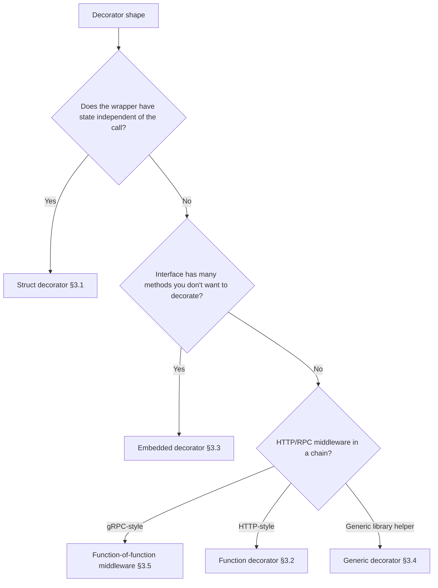
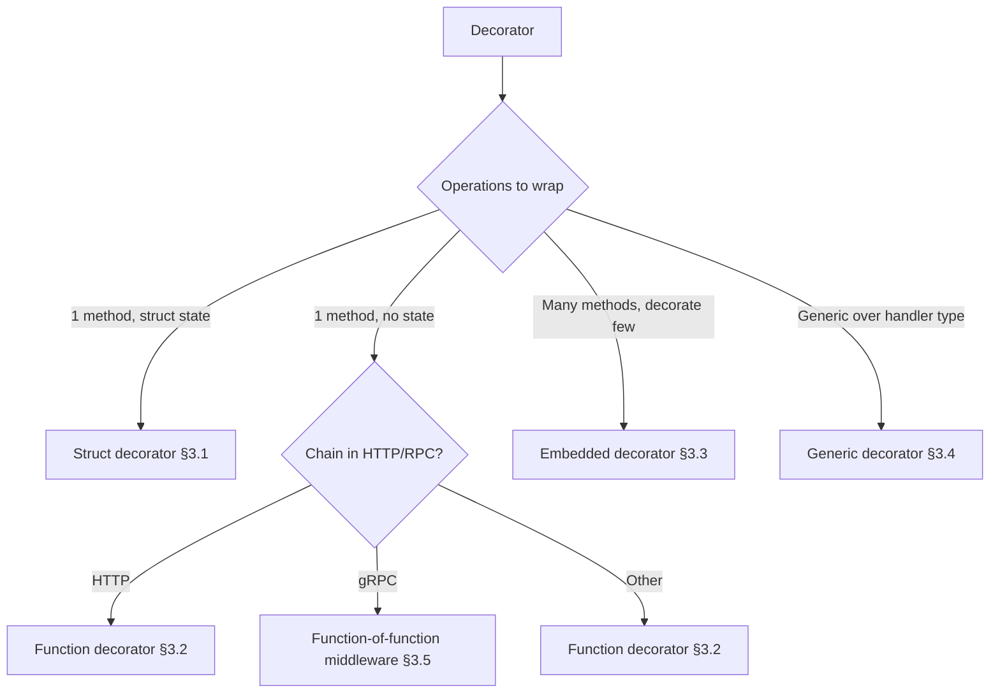
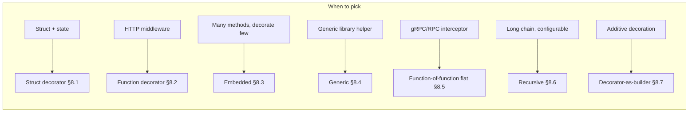
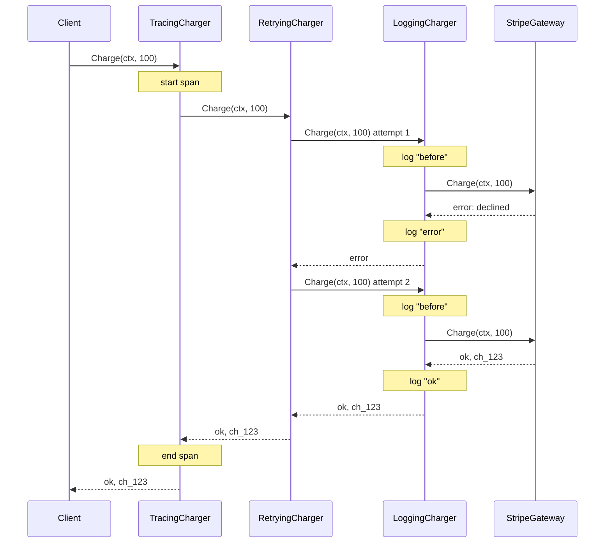
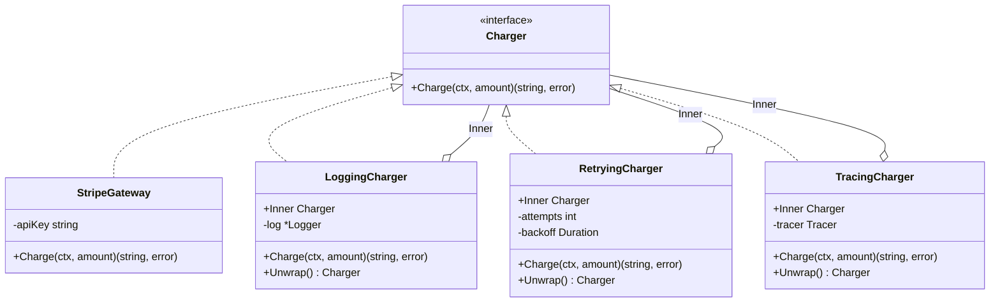
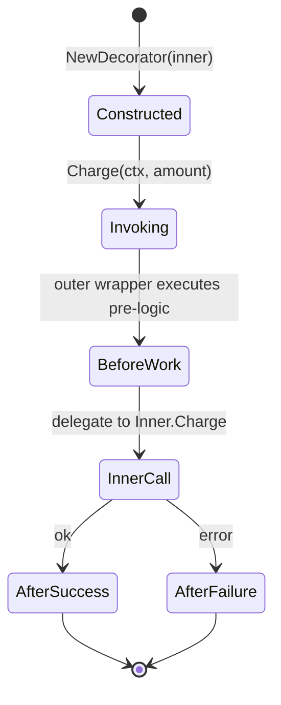

# Decorator Pattern — Specification

> **Focus:** A precise reference for the Decorator pattern as practised in the Go ecosystem. Decorator is the *workhorse* of Go's cross-cutting concerns — every `bufio.NewReader`, every HTTP middleware, every `gzip.NewWriter`, every gRPC interceptor, every OpenTelemetry instrumentation hook, every `slog` handler stack is a Decorator in the GoF sense. Where Strategy ([../03-strategy-pattern/](../03-strategy-pattern/)) chooses *which* implementation runs, Decorator chooses *what surrounds* the implementation. The two patterns share the structural skeleton — an interface with multiple satisfying types — but Decorator adds the constraint that the wrapper *is itself* a value of the wrapped interface, holding the wrapped value as a field.
>
> The audience files (`junior.md`, `middle.md`) teach *how* and *when*. This file is the canonical lookup: the pattern's historical antecedents from GoF through Aspect-Oriented Programming and Servlet filters to Go middleware; the Go spec mechanics that make each shape work; the five recognisable signature shapes; the standard-library APIs that embody each shape; the documented use in real third-party libraries; the formal invariants; the anti-patterns; the variants; the naming conventions; and the boundaries against neighbouring patterns (Strategy, Proxy, Adapter, Chain of Responsibility, Composite, Interceptor).
>
> **Primary sources:**
> - Erich Gamma, Richard Helm, Ralph Johnson, John Vlissides, *Design Patterns: Elements of Reusable Object-Oriented Software* (Addison-Wesley, 1994), Chapter 4 — "Decorator", pp. 175–184.
> - Gregor Kiczales, John Lamping, Anurag Mendhekar, Chris Maeda, Cristina Lopes, Jean-Marc Loingtier, John Irwin, *Aspect-Oriented Programming* (ECOOP 1997, LNCS 1241, pp. 220–242).
> - Sun Microsystems, *Java Servlet Specification 2.3* (2001) — Filter API (Chapter SRV.6).
> - Rod Johnson, Juergen Hoeller, et al., *Spring Framework Reference — AOP* (https://docs.spring.io).
> - Microsoft, *ASP.NET Core Middleware* documentation (https://learn.microsoft.com/aspnet/core/fundamentals/middleware).
> - Christian Neukirchen, *Rack: a Ruby Webserver Interface* (2007, https://rack.github.io).
> - Guido van Rossum, *PEP 318 — Decorators for Functions and Methods* (2003, https://peps.python.org/pep-0318/).
> - Rob Pike, *Go Proverbs* (Gopherfest, November 2015): https://go-proverbs.github.io
> - Go language specification: https://go.dev/ref/spec
> - *Effective Go*: https://go.dev/doc/effective_go
> - `net/http` source: https://pkg.go.dev/net/http
> - `bufio` package: https://pkg.go.dev/bufio
> - `compress/gzip`, `crypto/tls`, `net/http/httputil`, `context`, `log/slog`.
> - `go-chi/chi`: https://pkg.go.dev/github.com/go-chi/chi/v5
> - `gorilla/mux`: https://pkg.go.dev/github.com/gorilla/mux
> - `justinas/alice`: https://pkg.go.dev/github.com/justinas/alice
> - `google.golang.org/grpc` interceptors: https://pkg.go.dev/google.golang.org/grpc
> - `go.opentelemetry.io/contrib/instrumentation/net/http/otelhttp`, `.../google.golang.org/grpc/otelgrpc`.
> - `sony/gobreaker`: https://pkg.go.dev/github.com/sony/gobreaker
> - `golang.org/x/time/rate`: https://pkg.go.dev/golang.org/x/time/rate

---

## 1. Historical origins

The Decorator pattern is older than its name. The essence — *wrap an object in another object of the same interface that adds behaviour around the delegated call* — is implicit in every system that supports composition of streams, filters, or processing pipelines. Unix pipes (1973), Smalltalk streams (1980), the LISP advice mechanism (`defadvice`, 1981), and the Java I/O package (1996) all express it. The 1994 GoF book gave the OO presentation its current name. The Aspect-Oriented Programming research line (1997) generalised it. Servlet filters (1999), Ruby Rack (2007), Python decorators (2003), and the Go middleware ecosystem (2012–) made it the default architecture for HTTP, RPC, and cross-cutting infrastructure.

### 1.1 Gang of Four (1994)

The original Decorator is defined in *Design Patterns* (Gamma, Helm, Johnson, Vlissides, 1994), Chapter 4, with this intent:

> *"Attach additional responsibilities to an object dynamically. Decorators provide a flexible alternative to subclassing for extending functionality."*

The GoF Decorator has four participants: **Component** (the abstract interface that declares the operation), **ConcreteComponent** (the base implementation, the thing being decorated), **Decorator** (an abstract class that holds a reference to a Component and forwards calls to it), and **ConcreteDecorator** (the class that adds behaviour before or after the forwarded call). The 1994 example was a graphical user-interface widget (`VisualComponent`) wrapped by `BorderDecorator`, `ScrollDecorator`, and `ShadowDecorator` — each adding one visual aspect without modifying the widget.

Three points often get lost in modern retellings. **The Decorator and the ConcreteComponent share an interface** — the wrapper *is* a Component, not a sibling. **Multiple decorators stack** — the wrapped value of one decorator can itself be another decorator, producing a chain whose order is significant. **The client treats the chain as a single Component** — it cannot distinguish a wrapped object from an unwrapped one through the interface. Go retains all three. What changes is the *machinery*: structural interface satisfaction replaces explicit inheritance; embedding offers an alternative to manual forwarding; and the function-of-function shape (`func(next T) T`) is added to the toolbox alongside the struct shape.

### 1.2 Aspect-Oriented Programming (Kiczales, 1997)

Decorator's research-level generalisation arrived in *Aspect-Oriented Programming* (Gregor Kiczales et al., ECOOP 1997). The paper introduced **aspects** — modular units of cross-cutting concern — and the **weaver** that injects them at specified **join points**. The Java incarnation was AspectJ (Xerox PARC, 2001).

> *"Many issues in software design cross-cut the natural modular decomposition. Implementing such concerns in standard object-oriented or procedural code results in code tangling and code scattering. AOP provides a means to express these concerns as separate, modular units."*

The AOP vocabulary — *advice* (code that runs around a join point), *pointcut* (the predicate selecting join points), *weaving* (injection at compile or load time) — describes precisely what a Decorator chain does at runtime. A `before` advice is pre-delegation; an `after returning` advice is post-delegation; an `around` advice fully replaces the call (with the option to invoke `proceed()`).

Go has no compile-time weaver — the language deliberately rejects implicit code injection. But the *idea* of packaging cross-cutting concerns as composable units that wrap a base is the soul of every Go middleware library. The HTTP middleware `func(next http.Handler) http.Handler` is an *around* advice expressed as a first-class function. Go absorbed AOP's substance and discarded its syntax.

### 1.3 Java Servlet filters (1999) and the Java EE lineage

The Java Servlet Specification 2.3 (2001, drafted 1999) introduced the `Filter` API:

```java
public interface Filter {
    void doFilter(ServletRequest request, ServletResponse response,
                  FilterChain chain) throws IOException, ServletException;
}
```

A filter wraps a Servlet — or another filter — adding behaviour around the request. `FilterChain.doFilter(request, response)` is the equivalent of `next.ServeHTTP(w, r)` in Go: it forwards to the next link. Servlet filters were the first widely adopted Decorator-as-middleware realisation in the web layer; they defined the conventions every later HTTP framework inherited (ordered chains, `chain.doFilter()` delegation, declarative ordering). Spring's `HandlerInterceptor` (2003), .NET's `IHttpModule` (2002), and Ruby Rack (2007) all inherited the shape.

The Servlet-filter contribution to Go is direct. `gorilla/mux` (2012), `negroni` (2014), `alice` (2014), `chi` (2015) explicitly cite Servlet filters and Rack as parents. The `Middleware = func(next Handler) Handler` signature is Rack's `app.call(env)` re-expressed in Go's first-class-function vocabulary.

### 1.4 Spring AOP and .NET middleware

Spring AOP (2003) brought aspect-oriented programming into mainstream Java without requiring AspectJ's bytecode weaver. Spring intercepts method calls on managed beans via dynamic proxies — a Proxy-shaped Decorator chain — and declares advices with annotations (`@Around`, `@Before`, `@AfterReturning`).

.NET Core (2016) replaced classic ASP.NET's `IHttpModule` with a function-of-function middleware shape:

```csharp
public delegate Task RequestDelegate(HttpContext context);

app.Use(async (context, next) => {
    // before
    await next();
    // after
});
```

The signature `Func<RequestDelegate, RequestDelegate>` is **identical in shape** to Go's `func(http.Handler) http.Handler`. Both ecosystems converged on the idiom independently — or, more accurately, both inherited it from Rack and Servlet filters.

### 1.5 Ruby Rack (2007)

Christian Neukirchen's Rack (2007) reduced web architecture to one rule: a Rack application is *anything responding to `call(env)` returning `[status, headers, body]`*. Middleware is a class that takes another Rack app and delegates `call`:

```ruby
class Logger
  def initialize(app); @app = app; end
  def call(env)
    start = Time.now
    status, headers, body = @app.call(env)
    puts "#{env['REQUEST_METHOD']} #{env['PATH_INFO']} #{Time.now - start}"
    [status, headers, body]
  end
end

use Logger
use Rack::Auth::Basic
run MyApp
```

The `use Middleware` / `run App` vocabulary became lingua franca for Ruby web frameworks (Rails, Sinatra). Rack normalised outermost-first configuration order: `use Logger` *before* `use Auth` means Logger wraps Auth. Go's `chi.Router.Use` and `negroni.New().Use` adopted the convention directly.

### 1.6 Python decorators (PEP 318, 2003)

Guido van Rossum's *PEP 318 — Decorators for Functions and Methods* (2003) introduced Python's `@decorator` syntax:

```python
@logging
def charge(amount):
    return stripe.charge(amount)
# Equivalent to: charge = logging(charge)
```

The Python `@decorator` is a Decorator in the GoF sense — a higher-order function returning a wrapped function with the same call signature. PEP 318 codified function decorators; PEP 3129 (2007) extended them to classes. Flask's `@app.route`, Django's `@login_required`, `functools.lru_cache`, `dataclasses.dataclass` are all Decorator chains with syntactic sugar.

Go has no `@decorator` syntax — by deliberate design — but Python's terminology bled into Go usage. Go programmers freely call `func(next Handler) Handler` a "decorator" because the shape and intent are identical. The cross-language vocabulary established Decorator as the *default* term for cross-cutting wrappers in modern programming.

### 1.7 Go middleware emergence (2012–2016)

Go's middleware ecosystem coalesced between 2012 and 2016:

**Phase 1 (2009–2012): standard library establishes the shape.** `net/http` ships with `Handler`, `HandlerFunc`, and the registration functions. No middleware *type* is declared, but `http.StripPrefix`, `http.TimeoutHandler`, and `httputil.ReverseProxy` *are* decorators in disguise.

**Phase 2 (2012–2015): community converges.** `gorilla/mux` (2012) exposes `MiddlewareFunc`. `codegangsta/negroni` (2014) defines `HandlerFunc` and `Use`. `justinas/alice` (2014) reduces the idiom to `alice.New(mw1, mw2, mw3).Then(handler)`. `go-chi/chi` (2015) adopts the same signature.

**Phase 3 (2016–present): gRPC and OpenTelemetry generalise.** `google.golang.org/grpc` introduces `UnaryServerInterceptor` and `StreamServerInterceptor`. `go.opentelemetry.io/otel`'s `otelhttp` and `otelgrpc` ship decorators that wrap any handler to inject distributed tracing. `sony/gobreaker` exposes circuit breakers as decorators. `golang.org/x/time/rate` provides rate limiters that compose into any chain.

The standard library never published a `Middleware` type. The ecosystem standardised on the function-of-function signature regardless, because the shape was determined by the *language*: first-class functions, structural interface satisfaction, and the small `Handler` interface left only one natural way to express "wrap a handler".

### 1.8 The Go culture's contribution

Three Rob Pike proverbs frame Go's Decorator idiom:

> *"The bigger the interface, the weaker the abstraction."*
>
> *"A little copying is better than a little dependency."*
>
> *"Don't communicate by sharing memory; share memory by communicating."*

Go's distinctive contribution: **the function-of-function shape (`func(next T) T`) coexists with the struct shape on equal terms**, and the *adapter idiom* (a function type with a method satisfying the wrapped interface — `http.HandlerFunc`) makes the two shapes interchangeable at call sites. The pattern primarily expressed via inheritance in Java, dynamic proxies in Spring, and `@decorator` syntax in Python settled into Go as higher-order functions over single-method interfaces.

---

## 2. Underlying Go spec mechanics

The Decorator pattern uses eight language features. Each is quoted (or paraphrased with section reference) from the Go specification at https://go.dev/ref/spec.

### 2.1 Interface types and structural satisfaction

> **Interface types** ([spec §Interface types](https://go.dev/ref/spec#Interface_types)):
> *"An interface type defines a type set. A variable of interface type can store a value of any type that is in the type set of the interface."*

> **Implementing an interface** ([spec §Implementing an interface](https://go.dev/ref/spec#Implementing_an_interface)):
> *"A type `T` implements an interface if `T` is not an interface and is an element of the type set of the interface."*

Structural satisfaction is the foundation of Decorator in Go. The wrapper `*LoggingCharger` is a `Charger` because it has a `Charge` method, not because it declares `implements Charger`. A decorator can be added without modifying the wrapped type, and a wrapped value can be wrapped again without any participant knowing.

```go
type Charger interface { Charge(ctx context.Context, amount int) (string, error) }

type LoggingCharger struct{ Inner Charger }
func (l *LoggingCharger) Charge(ctx context.Context, amount int) (string, error) {
    return l.Inner.Charge(ctx, amount)
}
// *LoggingCharger satisfies Charger and itself accepts a Charger.
```

### 2.2 Function types as values

> **Function types** ([spec §Function types](https://go.dev/ref/spec#Function_types)):
> *"A function type denotes the set of all functions with the same parameter and result types. The value of an uninitialised variable of function type is `nil`."*

Functions are first-class values. The middleware shape `func(next http.Handler) http.Handler` is a value of a function type whose parameter and result are both `http.Handler`.

### 2.3 Closures

> **Function literals** ([spec §Function literals](https://go.dev/ref/spec#Function_literals)):
> *"Function literals are closures: they may refer to variables defined in a surrounding function. Those variables are then shared between the surrounding function and the function literal, and they survive as long as they are accessible."*

The function-of-function decorator depends on closures: the returned handler closes over `next`.

```go
func Logging(next http.Handler) http.Handler {
    return http.HandlerFunc(func(w http.ResponseWriter, r *http.Request) {
        log.Printf("%s %s", r.Method, r.URL.Path)
        next.ServeHTTP(w, r) // closure captures `next`
    })
}
```

Without closures, the function-of-function shape collapses; the alternative is a struct decorator that holds `next` as a field.

### 2.4 Embedded interfaces

> **Struct types — embedded fields** ([spec §Struct types](https://go.dev/ref/spec#Struct_types)):
> *"A field declared with a type but no explicit field name is called an embedded field. ... The unqualified type name acts as the field name."*

> **Selectors** ([spec §Selectors](https://go.dev/ref/spec#Selectors)):
> *"For a value `x` of type `T` or `*T` where `T` is not a pointer or interface type, `x.f` denotes the field or method at the shallowest depth in `T` where there is such an `f`."*

When a struct embeds an interface, the interface's methods are *promoted* to the struct's method set. The struct can override a subset; the rest are forwarded automatically. This is the embedding-based Decorator shape (§3.3):

```go
type LoggingCharger struct {
    Charger             // embed the interface
    log *log.Logger
}

// Override Charge; Refund and Status are promoted.
func (l LoggingCharger) Charge(ctx context.Context, amount int) error {
    l.log.Printf("Charge: %d", amount)
    return l.Charger.Charge(ctx, amount)
}
```

### 2.5 Type assertions

> **Type assertions** ([spec §Type assertions](https://go.dev/ref/spec#Type_assertions)):
> *"For an expression `x` of interface type, but not a type parameter, and a type `T`, the primary expression `x.(T)` asserts that `x` is not `nil` and that the value stored in `x` is of type `T`."*

Decorators probe whether the inner value satisfies a richer interface — the *optional-interface* idiom. The canonical case: a `http.ResponseWriter` wrapper must preserve `http.Flusher` and `http.Hijacker` if the inner supports them:

```go
func (s *statusRecorder) Flush() {
    if f, ok := s.ResponseWriter.(http.Flusher); ok { f.Flush() }
}
```

Type assertions also let `errors.Is`/`errors.As` walk a chain of error decorators (§4.9).

### 2.6 Deferred function calls

> **Defer statements** ([spec §Defer statements](https://go.dev/ref/spec#Defer_statements)):
> *"A defer statement invokes a function whose execution is deferred to the moment the surrounding function returns, either because the surrounding function executed a return statement, reached the end of its function body, or because the corresponding goroutine is panicking."*

`defer` is essential for "after"-style decorators:

```go
func (m *MetricsCharger) Charge(ctx context.Context, amount int) (err error) {
    start := time.Now()
    defer func() {
        m.duration.Observe(time.Since(start).Seconds())
        if err != nil { m.errors.Inc() }
    }()
    return m.Inner.Charge(ctx, amount)
}
```

The deferred closure inspects the *named return* `err` — the idiom for any "around" decorator recording both success and failure.

### 2.7 Panic and recover

> **Handling panics** ([spec §Handling panics](https://go.dev/ref/spec#Handling_panics)):
> *"While executing a function `F`, an explicit call to panic or a run-time panic terminates the execution of `F`. ... During the execution of the deferred function, a call to `recover` may be used to regain control of a panicking goroutine."*

The Recovery decorator catches panics in the wrapped call:

```go
func Recovery(next http.Handler) http.Handler {
    return http.HandlerFunc(func(w http.ResponseWriter, r *http.Request) {
        defer func() {
            if rec := recover(); rec != nil {
                log.Printf("panic: %v\n%s", rec, debug.Stack())
                http.Error(w, "internal error", http.StatusInternalServerError)
            }
        }()
        next.ServeHTTP(w, r)
    })
}
```

`recover` works only within the same goroutine — a goroutine spawned by the wrapped handler escapes the wrapper's recovery.

### 2.8 Method sets and receiver kinds

> **Method sets** ([spec §Method sets](https://go.dev/ref/spec#Method_sets)):
> *"The method set of a defined type `T` consists of all methods declared with receiver type `T`. The method set of a pointer to a defined type `T` is the set of all methods declared with receiver `*T` or `T`."*

Decorators with state must declare methods on pointer receivers; the consumer must hold the *pointer*:

```go
func (c *CountingCharger) Charge(ctx context.Context, amount int) error {
    c.n++  // visible to caller
    return c.Inner.Charge(ctx, amount)
}
// Anti-idiom: value receiver — c.n++ mutates a copy and is lost (`junior.md` §12 Q1).
```

### 2.9 Generics (Go 1.18+)

> **Type parameter declarations** ([spec §Type parameter declarations](https://go.dev/ref/spec#Type_parameter_declarations)):
> *"A type parameter list declares the type parameters of a generic function or type declaration."*

```go
type Middleware[T any] func(next T) T

func Compose[T any](base T, mws ...Middleware[T]) T {
    for i := len(mws) - 1; i >= 0; i-- { base = mws[i](base) }
    return base
}
```

Used sparingly in application code; valuable in library composers. Go forbids type parameters on methods, so generic interface-based decorators must bind the type at construction.

### 2.10 Why the pattern *requires* most of these

| Spec feature | Removed → pattern becomes |
|--------------|--------------------------|
| Interface types | No way to express the shared contract; decorator and decorated cannot have the same type |
| Structural satisfaction | Decorators must declare conformance explicitly; the wrap-without-touch property disappears |
| Function types as values | Only the struct shape remains; no `func(next T) T` middleware |
| Closures | Function-of-function middleware cannot capture `next`; only struct decorators work |
| Embedded interfaces | Multi-method decoration requires explicit forwarding for every method |
| Type assertions | Optional-interface probing impossible; `http.ResponseWriter` wrappers can't detect `Flusher` |
| Defer and recover | "After" cleanup and panic recovery decorators impossible |
| Method sets / pointer receivers | Stateful decorators silently lose updates |
| Generics | No reusable generic middleware composer; per-type duplication required |

Go has all nine. The Decorator pattern's expressiveness in Go is a direct consequence of this combination.

---

## 3. Canonical signature shapes

Five shapes account for essentially all Go decorator code. Each is documented with its declaration, the language features it leans on, and the standard-library or third-party APIs that exemplify it.

| Shape | Declaration | Used by |
|-------|-------------|---------|
| **Struct decorator** | `type Wrapper struct { Inner Iface; /* state */ }` with method | `bufio.Reader`, `gzip.Writer`, `tls.Conn`, retry/cache/breaker wrappers |
| **Function decorator** | `type Middleware func(next T) T` | `net/http` middleware, `chi.Middlewares`, `alice.Constructor` |
| **Embedded decorator** | `type Wrapper struct { Iface; /* state */ }` overriding one method | `sql.DB` test wrappers, custom `http.ResponseWriter` wrappers |
| **Generic decorator** | `type Middleware[T any] func(next T) T` | `golang.org/x/exp/slices` utilities, internal middleware composers |
| **Function-of-function middleware** | `func Mid(next T) T { return ... }` | gRPC interceptors, OpenTelemetry instrumentation, `otelhttp.NewHandler` |

### 3.1 Struct decorator

```go
type RetryingCharger struct {
    Inner    Charger
    Attempts int
    Backoff  time.Duration
}

func (r *RetryingCharger) Charge(ctx context.Context, amount int) (string, error) {
    var lastErr error
    for i := 0; i < r.Attempts; i++ {
        id, err := r.Inner.Charge(ctx, amount)
        if err == nil { return id, nil }
        lastErr = err
        if i < r.Attempts-1 {
            select {
            case <-time.After(r.Backoff):
            case <-ctx.Done(): return "", ctx.Err()
            }
        }
    }
    return "", lastErr
}

func NewRetryingCharger(inner Charger, attempts int, backoff time.Duration) *RetryingCharger {
    if inner == nil { panic("RetryingCharger: nil Inner") }
    if attempts < 1 { attempts = 1 }
    return &RetryingCharger{Inner: inner, Attempts: attempts, Backoff: backoff}
}
```

**Pick when:** the decorator has state (counters, breakers, caches), is configured at construction, or participates in dependency injection.

**Used by:** `bufio.Reader`, `bufio.Writer`, `gzip.Reader`, `gzip.Writer`, `tls.Conn`, `httputil.ReverseProxy`, `sony/gobreaker.CircuitBreaker`, most application-level retry/cache/log decorators.

### 3.2 Function decorator (middleware)

```go
type Middleware func(next http.Handler) http.Handler

func Logging(next http.Handler) http.Handler {
    return http.HandlerFunc(func(w http.ResponseWriter, r *http.Request) {
        start := time.Now()
        next.ServeHTTP(w, r)
        log.Printf("%s %s %s", r.Method, r.URL.Path, time.Since(start))
    })
}

// Composing:
h := http.HandlerFunc(handleAPI)
h = Auth(h); h = Recovery(h); h = Logging(h)
// h is now Logging(Recovery(Auth(handleAPI)))
```

The signature `func(next T) T` is the canonical middleware shape. The function takes the next handler and returns a wrapped handler closing over `next`.

**Pick when:** the decorator is stateless (or state is captured by closure), the chain is composed at startup, the consumer is HTTP/RPC middleware.

**Used by:** `net/http` middleware throughout the Go ecosystem; `chi.Middlewares`; `negroni.HandlerFunc`; `alice.Constructor`; `aws-sdk-go-v2`'s middleware stack.

### 3.3 Embedded decorator

```go
type Charger interface {
    Charge(context.Context, int) error
    Refund(context.Context, string) error
    Status(context.Context, string) (string, error)
}

type LoggingCharger struct {
    Charger // embed
    log *log.Logger
}

// Override only Charge; Refund and Status are promoted.
func (l *LoggingCharger) Charge(ctx context.Context, amount int) error {
    l.log.Printf("Charge: %d", amount)
    return l.Charger.Charge(ctx, amount)
}
```

The embedded interface promotes its methods onto the wrapper. Overridden methods replace the promoted ones.

**Pick when:** the interface has many methods (5+), few need decoration, and you accept the embedded field's exported status.

**Costs:** the embedded field is public (callers can mutate `lc.Charger = ...`); new methods added to the interface are silently inherited without decoration.

**Used by:** custom `http.ResponseWriter` wrappers (status recorders, gzip writers); `sql.DB` test wrappers.

### 3.4 Generic decorator (Go 1.18+)

```go
type Middleware[T any] func(next T) T

func Compose[T any](base T, middlewares ...Middleware[T]) T {
    for i := len(middlewares) - 1; i >= 0; i-- {
        base = middlewares[i](base)
    }
    return base
}

chain := Compose[http.Handler](http.HandlerFunc(handleAPI), LoggingMW, AuthMW, RecoveryMW)
```

The middleware type is parameterised by the decorated type. Go forbids type parameters on methods, so generic interface-based decorators must bind the type at construction.

**Pick when:** publishing a library helper (`Compose[T]`, `Tap[T]`, `Tee[T]`) consumers will instantiate over their own types. Otherwise, prefer §3.2.

**Used by:** experimental utility libraries (`samber/lo`); internal middleware composers in larger codebases.

### 3.5 Function-of-function flat middleware (gRPC interceptors)

```go
// from google.golang.org/grpc
type UnaryServerInterceptor func(
    ctx context.Context,
    req any,
    info *UnaryServerInfo,
    handler UnaryHandler,
) (resp any, err error)

type UnaryHandler func(ctx context.Context, req any) (any, error)
```

A variant of §3.2 with a flat signature: `(ctx, req, info, next) → (resp, err)` rather than `next → wrapped`. The interceptor receives request, metadata, and next handler at invocation time; it must invoke (or short-circuit).

```go
func LoggingInterceptor(
    ctx context.Context, req any, info *grpc.UnaryServerInfo, handler grpc.UnaryHandler,
) (any, error) {
    start := time.Now()
    resp, err := handler(ctx, req)
    log.Printf("%s took %v err=%v", info.FullMethod, time.Since(start), err)
    return resp, err
}
```

**Pick when:** building RPC interceptors where call metadata is supplied per invocation.

**Used by:** `google.golang.org/grpc` `UnaryServerInterceptor`/`StreamServerInterceptor`; `aws-sdk-go-v2`'s middleware steps; some database query interceptors.

### 3.6 Shape decision tree



---

## 4. Standard library use

Decorator is, alongside Strategy, the dominant idiom of the Go standard library. Every I/O wrapper, every HTTP middleware-shaped function, every cipher mode, every context derivative is a Decorator. This section walks through the most-used examples.

### 4.1 `bufio.NewReader` and `bufio.NewWriter`

```go
// from bufio
func NewReader(rd io.Reader) *Reader
func NewWriter(w io.Writer) *Writer
```

The canonical Go Decorator. `bufio.Reader` *is* an `io.Reader` and *wraps* an `io.Reader`, adding read buffering. The caller sees only `io.Reader`; the buffer is invisible.

```go
var r io.Reader = os.Stdin
r = bufio.NewReader(r)
data := make([]byte, 1024)
n, _ := r.Read(data)  // reads from buffer; refills from os.Stdin as needed
```

`bufio.Writer` mirrors this on the write side with a `Flush()` contract. `bufio.Scanner` wraps an `io.Reader` to add tokenisation, with `bufio.SplitFunc` as a nested Strategy.

### 4.2 `compress/gzip`

```go
// from compress/gzip
func NewReader(r io.Reader) (*Reader, error)
func NewWriter(w io.Writer) *Writer
```

`gzip.Reader` wraps an `io.Reader` of compressed bytes and exposes decompressed bytes through `io.Reader`. `gzip.Writer` wraps an `io.Writer` and compresses writes. Both compose with `bufio.NewReader`, `tls.Client`, `http.Response.Body`, and any other `io.Reader`/`io.Writer`.

```go
resp, _ := http.Get("https://example.com/feed.gz")
defer resp.Body.Close()
zr, _ := gzip.NewReader(resp.Body)
defer zr.Close()
io.Copy(os.Stdout, zr)
```

`compress/flate`, `compress/zlib`, `compress/lzw`, `compress/bzip2`, `klauspost/compress/zstd`, and `golang/snappy` follow the same shape.

### 4.3 `crypto/tls` — `tls.Client`, `tls.Server`

```go
// from crypto/tls
func Client(conn net.Conn, config *Config) *Conn
func Server(conn net.Conn, config *Config) *Conn
```

`tls.Conn` wraps a `net.Conn` and adds TLS encryption: writes are encrypted before forwarding; reads decrypt incoming bytes. `*tls.Conn` itself implements `net.Conn`, so the encryption is invisible to downstream consumers — every HTTPS server, every gRPC TLS connection passes through it.

```go
tcp, _ := net.Dial("tcp", "example.com:443")
tlsConn := tls.Client(tcp, &tls.Config{ServerName: "example.com"})
tlsConn.Handshake()
```

### 4.4 `net/http/httputil.NewSingleHostReverseProxy`

```go
func NewSingleHostReverseProxy(target *url.URL) *ReverseProxy
```

`httputil.ReverseProxy` satisfies `http.Handler` and wraps a target URL plus an underlying `http.RoundTripper`. The proxy is a *handler* (decorated by front-end middleware) *containing* a `RoundTripper` (decoratable on the back-end side):

```go
target, _ := url.Parse("http://upstream:8080")
proxy := httputil.NewSingleHostReverseProxy(target)
proxy.Transport = &loggingTransport{Inner: http.DefaultTransport}
http.Handle("/", Logging(Recovery(proxy)))
```

### 4.5 `httptest.NewRecorder` and the response-writer wrapper idiom

`httptest.ResponseRecorder` is an `http.ResponseWriter` whose write methods capture the response in memory. The closely related production idiom is the **status-recorder wrapper**:

```go
type statusRecorder struct {
    http.ResponseWriter
    status int
    bytes  int
}
func (s *statusRecorder) WriteHeader(code int) {
    s.status = code
    s.ResponseWriter.WriteHeader(code)
}
func (s *statusRecorder) Write(b []byte) (int, error) {
    n, err := s.ResponseWriter.Write(b)
    s.bytes += n
    return n, err
}

func Logging(next http.Handler) http.Handler {
    return http.HandlerFunc(func(w http.ResponseWriter, r *http.Request) {
        sr := &statusRecorder{ResponseWriter: w, status: 200}
        next.ServeHTTP(sr, r)
        log.Printf("%s %s %d %d bytes", r.Method, r.URL.Path, sr.status, sr.bytes)
    })
}
```

This is an embedded decorator (§3.3). Optional interfaces (`http.Flusher`, `http.Hijacker`, `http.Pusher`) need explicit re-implementation — the standard Go middleware gotcha (§7.7).

### 4.6 `context.WithValue`, `context.WithTimeout`, `context.WithCancel`

```go
func WithValue(parent Context, key, val any) Context
func WithCancel(parent Context) (ctx Context, cancel CancelFunc)
func WithTimeout(parent Context, timeout time.Duration) (Context, CancelFunc)
func WithDeadline(parent Context, d time.Time) (Context, CancelFunc)
```

Each returns a new `Context` that wraps its parent. Lookups (`Value(key)`) walk the chain outermost-to-innermost; cancellation propagates from any ancestor. Pure Decorators with strict ordering and immutability:

```go
ctx := context.Background()
ctx = context.WithValue(ctx, requestIDKey, "req-123")
ctx, cancel := context.WithTimeout(ctx, 5*time.Second)
defer cancel()
```

### 4.7 `net/http` middleware via `Handler` and `HandlerFunc`

```go
type Handler interface { ServeHTTP(ResponseWriter, *Request) }
type HandlerFunc func(ResponseWriter, *Request)
func (f HandlerFunc) ServeHTTP(w ResponseWriter, r *Request) { f(w, r) }
```

The function-of-function shape builds on `HandlerFunc`'s ability to convert a closure into a `Handler`:

```go
func Auth(next http.Handler) http.Handler {
    return http.HandlerFunc(func(w http.ResponseWriter, r *http.Request) {
        if r.Header.Get("Authorization") == "" {
            http.Error(w, "unauthorized", 401); return
        }
        next.ServeHTTP(w, r)
    })
}
```

`http.StripPrefix`, `http.TimeoutHandler`, `http.RedirectHandler`, `http.MaxBytesHandler` are all standard-library decorators.

### 4.8 `log/slog` — handler wrapping

```go
type Handler interface {
    Enabled(ctx context.Context, level Level) bool
    Handle(ctx context.Context, r Record) error
    WithAttrs(attrs []Attr) Handler
    WithGroup(name string) Handler
}
```

`WithAttrs` and `WithGroup` are *decorator constructors*: each returns a new handler wrapping the original. The community ships `slog-multi.Fanout`, `slog-sampling.SamplingHandler`, `slog-formatter.FormatterHandler` — all Decorators over `slog.Handler`. This is the Decorator-as-builder idiom (§8.7).

### 4.9 `errors.Is`, `errors.As`, and error wrapping

Wrapped errors are decorators over the `error` interface. `fmt.Errorf("...: %w", inner)` returns an error that *is* an `error` and *wraps* one. `errors.Is`/`errors.As` walk the chain via the optional `Unwrap()` method:

```go
type contextError struct{ op string; err error }
func (e *contextError) Error() string { return e.op + ": " + e.err.Error() }
func (e *contextError) Unwrap() error { return e.err }

errors.Is(err, ErrDeclined)  // walks the chain
```

Decorator at its purest: each link adds one piece of context; the inner is preserved unchanged.

### 4.10 Standard library summary

| Package | Decorator shape | Wrapped interface |
|---------|-----------------|-------------------|
| `bufio` | `NewReader`, `NewWriter`, `NewScanner` | `io.Reader`, `io.Writer` |
| `compress/gzip`, `compress/flate`, `compress/zlib`, `compress/lzw`, `compress/bzip2` | `NewReader`, `NewWriter` | `io.Reader`, `io.Writer` |
| `crypto/tls` | `Client(conn, config)`, `Server(conn, config)` | `net.Conn` |
| `crypto/cipher` | `NewCBCEncrypter(block, iv)`, `NewCTR(block, iv)`, `NewGCM(block)` | `cipher.Block` → `BlockMode`/`Stream`/`AEAD` |
| `net/http/httputil` | `NewSingleHostReverseProxy(target)`, `DumpRequest`, `DumpResponse` | `http.Handler` (proxy), `http.RoundTripper` (transport) |
| `net/http/httptest` | `NewRecorder()`, `NewServer(handler)` | `http.ResponseWriter`, the test environment |
| `net/http` | `StripPrefix`, `TimeoutHandler`, `RedirectHandler`, `MaxBytesHandler`, `MaxBytesReader` | `http.Handler`, `io.Reader` |
| `context` | `WithValue`, `WithCancel`, `WithTimeout`, `WithDeadline` | `context.Context` |
| `errors` | wrapped via `fmt.Errorf("...: %w", err)`; chain walked by `Is`/`As`/`Unwrap` | `error` |
| `log/slog` | `Handler.WithAttrs`, `Handler.WithGroup`, third-party fanout/sampling | `slog.Handler` |
| `database/sql` | `DB`, `Conn`, `Tx`, `Stmt` form a layered Decorator over `driver.Conn`/`driver.Stmt` | `database/sql/driver.*` |
| `text/template`, `html/template` | `Funcs`, `Option`, `Delims` mutate a template, but `Lookup`/`Clone` are decorator-shaped | `*template.Template` |
| `image/draw` | `NewOpaque(im)`, `NewGalleryImage`-style wrappers | `image.Image` |
| `io` | `MultiReader`, `MultiWriter`, `LimitReader`, `TeeReader`, `NopCloser`, `Pipe` | `io.Reader`, `io.Writer`, `io.Closer` |
| `os.exec` | `Cmd.StdinPipe`, `StdoutPipe`, `StderrPipe` each return a Decorator over the child's I/O | OS pipes |
| `bytes` | `NewReader`, `NewBuffer`, `Buffer.Next` — limited wrappers | `io.Reader`, `io.Writer` |

The pattern's standard-library footprint is so extensive that a full enumeration spans most of the I/O, networking, encoding, and infrastructure packages. The takeaway: nearly every Go I/O or handler chain in production is a Decorator stack.

---

## 5. Documented use in real libraries

The third-party ecosystem amplifies the standard library's idioms and standardises the function-of-function middleware shape across HTTP, RPC, observability, and resilience layers.

### 5.1 `go-chi/chi` — router middleware

```go
// from github.com/go-chi/chi/v5
type Middlewares []func(http.Handler) http.Handler

type Router interface {
    Use(middlewares ...func(http.Handler) http.Handler)
    With(middlewares ...func(http.Handler) http.Handler) Router
    Group(fn func(r Router)) Router
    Route(pattern string, fn func(r Router)) Router
}
```

Each middleware is a `func(next http.Handler) http.Handler` (§3.2). `chi.Use` appends; `chi.With` returns a sub-router; `chi.Route` creates scoped chains. The router builds one consolidated handler per route at registration time — *not per request* (`middle.md` §5.2).

```go
r := chi.NewRouter()
r.Use(middleware.RequestID)
r.Use(middleware.Logger)
r.Use(middleware.Recoverer)
r.Use(middleware.Timeout(60 * time.Second))

r.Route("/api", func(r chi.Router) {
    r.Use(authMiddleware)
    r.Get("/users", listUsers)
})
```

`chi/middleware` ships pre-built decorators for the dozen most common HTTP concerns: request ID, real-IP, logging, recovery, timeout, compression, CORS, throttling, basic auth, ETag, conditional GET.

### 5.2 `gorilla/mux` — `MiddlewareFunc`

```go
type MiddlewareFunc func(http.Handler) http.Handler
func (r *Router) Use(mwf ...MiddlewareFunc)
```

Identical to chi's middleware in shape. Both libraries share conventions because both inherited from Servlet filters and Rack. Migration between them is mostly import paths and route-pattern syntax; middleware is portable verbatim.

### 5.3 `justinas/alice` — the chain composer

```go
type Constructor func(http.Handler) http.Handler

func New(constructors ...Constructor) Chain
func (c Chain) Then(h http.Handler) http.Handler
func (c Chain) Append(constructors ...Constructor) Chain
```

The smallest possible middleware library — `Chain` is a slice of constructors, `Then` applies them outermost-first. ~50 lines total. Exists because before chi popularised in-router middleware, developers needed a chain composer separate from the router.

```go
chain := alice.New(Logging, Recovery, Auth).Then(handler)
http.Handle("/", chain)
```

### 5.4 `go-chi/render` — response rendering

```go
type Renderer interface {
    Render(w http.ResponseWriter, r *http.Request) error
}
```

A Decorator over `http.ResponseWriter` in the encoding-by-content-negotiation vein. Domain types decorate themselves with rendering behaviour. Used in chi-based services for typed JSON/XML/HTML responses.

### 5.5 `google.golang.org/grpc` — interceptors

```go
type UnaryServerInterceptor func(
    ctx context.Context, req any,
    info *UnaryServerInfo, handler UnaryHandler,
) (resp any, err error)

type StreamServerInterceptor func(
    srv any, ss ServerStream,
    info *StreamServerInfo, handler StreamHandler,
) error
```

Plus symmetric `UnaryClientInterceptor` and `StreamClientInterceptor`. These are the §3.5 function-of-function-with-flat-signature decorators specialised for RPC. The server gets request, info, and the next handler; it must invoke (or short-circuit).

Composition is via `grpc.ChainUnaryInterceptor`:

```go
s := grpc.NewServer(
    grpc.ChainUnaryInterceptor(
        recovery.UnaryServerInterceptor(),
        otelgrpc.UnaryServerInterceptor(),
        auth.UnaryServerInterceptor(authFunc),
        logging.UnaryServerInterceptor(logger),
    ),
)
```

`grpc-ecosystem/go-grpc-middleware` ships a curated collection of interceptors mirroring HTTP middleware concerns (auth, logging, retry, metrics, tracing, validation).

### 5.6 `go.opentelemetry.io/contrib/.../otelhttp` and `otelgrpc`

```go
func NewHandler(handler http.Handler, operation string, opts ...Option) http.Handler
func NewTransport(base http.RoundTripper, opts ...Option) http.RoundTripper
```

OpenTelemetry's HTTP instrumentation wraps an `http.Handler` (or `http.RoundTripper`) to inject distributed-tracing spans:

```go
http.Handle("/api", otelhttp.NewHandler(apiHandler, "api"))
client := &http.Client{Transport: otelhttp.NewTransport(http.DefaultTransport)}
```

`otelgrpc` provides the gRPC equivalents (`UnaryServerInterceptor`, etc.), composed via `grpc.ChainUnaryInterceptor`.

### 5.7 `sony/gobreaker` — circuit breaker

```go
func NewCircuitBreaker(st Settings) *CircuitBreaker
func (cb *CircuitBreaker) Execute(req func() (any, error)) (any, error)
```

`Execute` wraps an arbitrary `func() (any, error)`. The breaker tracks success/failure ratios, opens on repeated failures, refuses to call while open, probes periodically. Typically wrapped into a typed Decorator that satisfies an integration's strategy interface:

```go
type BreakerCharger struct {
    Inner Charger
    cb    *gobreaker.CircuitBreaker
}

func (b *BreakerCharger) Charge(ctx context.Context, amount int) (string, error) {
    v, err := b.cb.Execute(func() (any, error) {
        return b.Inner.Charge(ctx, amount)
    })
    if err != nil { return "", err }
    return v.(string), nil
}
```

The two-level wrap is a common Go idiom for adapting general-purpose resilience primitives to typed interfaces.

### 5.8 `golang.org/x/time/rate` — rate limiter

```go
func NewLimiter(r Limit, b int) *Limiter
func (lim *Limiter) Wait(ctx context.Context) error
```

Like `gobreaker`, not itself a Decorator over a typed interface — the canonical usage wraps it:

```go
type RateLimitedCharger struct {
    Inner   Charger
    limiter *rate.Limiter
}

func (r *RateLimitedCharger) Charge(ctx context.Context, amount int) (string, error) {
    if err := r.limiter.Wait(ctx); err != nil {
        return "", fmt.Errorf("rate limit: %w", err)
    }
    return r.Inner.Charge(ctx, amount)
}
```

### 5.9 Library summary

| Library | Decorator | Shape | Notes |
|---------|-----------|-------|-------|
| `go-chi/chi` | `Middlewares []func(http.Handler) http.Handler` | Function (§3.2) | The de-facto Go HTTP router |
| `gorilla/mux` | `MiddlewareFunc func(http.Handler) http.Handler` | Function (§3.2) | Older router; same shape |
| `justinas/alice` | `Constructor func(http.Handler) http.Handler` | Function (§3.2) | Pure chain composer |
| `urfave/negroni` | `Handler` interface; `HandlerFunc` adapter | Function + adapter (§3.2 + §3.3) | Pre-chi era |
| `google.golang.org/grpc` | `UnaryServerInterceptor`, `StreamServerInterceptor`, etc. | Function-of-function flat (§3.5) | Server and client variants |
| `grpc-ecosystem/go-grpc-middleware` | Concrete interceptor implementations | Function-of-function flat (§3.5) | Auth, logging, retry, metrics |
| `go.opentelemetry.io/.../otelhttp` | `NewHandler`, `NewTransport` | Struct decorator (§3.1) | Wraps `http.Handler`, `http.RoundTripper` |
| `go.opentelemetry.io/.../otelgrpc` | `UnaryServerInterceptor`, etc. | Function-of-function flat (§3.5) | gRPC tracing |
| `sony/gobreaker` | `CircuitBreaker.Execute(func() (any, error))` | Generic-callable wrapper | Adapted per-interface in callers |
| `golang.org/x/time/rate` | `Limiter.Wait(ctx)` | Primitive; wrapped into decorator | Token-bucket rate limiting |
| `aws-sdk-go-v2` | `middleware.FinalizeMiddleware`, etc. | Multi-method interface (§3.5) | Layered SDK middleware stack |
| `go-kit/kit` | `endpoint.Middleware func(Endpoint) Endpoint` | Function (§3.2) | Service-layer middleware (Go kit) |
| `slog-multi`, `slog-sampling`, `slog-formatter` | Decorators over `slog.Handler` | Struct decorator (§3.1) | Structured logging composition |

The recurring pattern: HTTP and slog favour the function-of-function shape; RPC and SDK middleware favour the flat shape with metadata; observability libraries (otel) favour struct decorators because they need configuration.

---

## 6. The specification of the pattern itself

An implementation of the Decorator pattern in Go consists of the following six elements. A correct implementation has all six; a missing element is a defect or a sign that you've chosen a different pattern.

**Element A — A shared interface.** A type — almost always an interface — whose values represent both the wrapped object and its wrappers. Decorator without a shared interface degenerates into ordinary delegation or composition; the *substitutability* invariant is what defines it.

**Element B — A base implementation (ConcreteComponent).** At least one type that provides the base behaviour, with no inner wrapped value. The base is the terminal of any decoration chain.

**Element C — One or more decorators.** Types or functions that satisfy the shared interface *and* hold an inner value of the same interface. The decorator's method body invokes the inner, often with work before, after, or around the call.

```go
type LoggingCharger struct {
    Inner Charger  // (C) inner value of the shared interface
    log   *log.Logger
}

func (l *LoggingCharger) Charge(ctx context.Context, amount int) error {
    l.log.Printf("Charge: %d", amount)         // before
    err := l.Inner.Charge(ctx, amount)         // delegate
    if err != nil { l.log.Printf("err: %v", err) } // after
    return err
}
```

**Element D — A composition mechanism.** Either explicit nesting (`A(B(C(base)))`), a chain helper (`Chain(base, A, B, C)`), or repeated wrapping (`x = A{Inner: x}; x = B{Inner: x}`). The mechanism determines the order; the order determines runtime behaviour.

**Element E — Conventions for ordering and lifetimes.** (1) The outermost decorator runs first on the way in and last on the way out (`middle.md` §5). (2) The chain is constructed once at startup or per route, never per request (`middle.md` §5.2). (3) Decorator state outlives any individual call but may not outlive the process; document the lifetime.

**Element F — Optional but recommended: an unwrap path.** A way to traverse the chain at runtime — usually an `Unwrap() Inner` method on each decorator, mirroring `errors.Unwrap`. Lets callers introspect (`middle.md` §15.3) and lets tests assert structure.

A "Decorator API" without all six elements is one of the following:

| Missing element | Resulting pattern |
|-----------------|-------------------|
| A (no shared interface) | Plain delegation; composition without substitutability |
| B (no base) | An abstract interface with no implementations; an unused type |
| C (no inner) | A Strategy implementation, not a Decorator |
| D (no composition) | A single wrapper; useful but not a *pattern* |
| E (no order convention) | Brittle behaviour that changes when callers reorder |
| F (no unwrap) | Working but opaque; harder to debug |

### 6.1 The five recognisable shapes (recap)



### 6.2 Invariants

A correct Go Decorator satisfies these invariants. Violations are defects or surprising designs.

| Invariant | Statement |
|-----------|-----------|
| **Interface preservation** | The decorator's method signatures match the wrapped interface exactly. No extra parameters, no different return types. |
| **Substitutability (Liskov)** | A caller holding a value of the shared interface cannot distinguish a wrapped value from an unwrapped one through the interface. |
| **Delegation** | Each method either invokes the inner (the default) or documents why it short-circuits. Forgetting to delegate is a defect (`junior.md` §10.1). |
| **Idempotent wrapping** | Wrapping a decorator a second time with the same wrapper has no special meaning; the chain length grows by one, the behaviour repeats. Decorators must tolerate this. |
| **Error propagation** | The decorator returns the inner's error unchanged unless its express purpose is to transform errors. Swallowing errors is a defect (`junior.md` §11.4). |
| **No mutation of Inner** | The decorator does not reach inside the inner value to modify its state. Mutation happens through the interface or not at all (`junior.md` §10.3). |
| **Receiver consistency** | Stateful decorators use pointer receivers; value receivers silently lose mutations (`junior.md` §12 Q1). |
| **No identity dependence** | The consumer does not compare decorator values for equality, does not use them as map keys, and does not depend on `==`. |
| **Concurrency contract is explicit** | Either the decorator is safe for concurrent use (typical for stateless or atomic-counter decorators), or it is not, and the documentation says which. |
| **Nil-Inner is rejected at construction** | A decorator with `Inner == nil` panics on first call. Constructors validate (`junior.md` §11.1). |
| **Optional-interface preservation** | When wrapping a value that exposes optional interfaces (`http.Flusher`, `http.Hijacker`, error `Unwrap`), the decorator preserves them via type assertion + delegation. |

### 6.3 The relationship to GoF roles

| GoF role | Go realisation |
|----------|----------------|
| **Component** (abstract interface) | Single-method interface (§3.1) or function type |
| **ConcreteComponent** | Any type satisfying the interface — the base of the chain |
| **Decorator** (abstract class holding a Component) | A struct with an `Inner` field of the interface type, or a function-of-function closure |
| **ConcreteDecorator** | A specific decorator type or middleware constructor |

The mapping is one-to-one. The structural-typing twist is that *ConcreteDecorator* values can be added without modifying *Component* — a property the GoF book did not have to address because Smalltalk and C++ both required explicit inheritance.

### 6.4 The relationship to higher-order functions

A function decorator (§3.2) is a higher-order function: it takes a function and returns a function. The "Decorator pattern" naming for `func(next T) T` is a GoF anachronism — higher-order functions predate the book by decades — but the *role* is the same: wrap a callable to add behaviour. The pattern's persistence in Go culture under the GoF name reflects how thoroughly the language community absorbed the OO vocabulary even while expressing the pattern functionally.

### 6.5 The optional-interface preservation idiom

A decorator wrapping a value that *also* satisfies a richer interface must preserve that capability:

```go
type bodyCounter struct {
    http.ResponseWriter
    n int
}

func (b *bodyCounter) Write(p []byte) (int, error) {
    n, err := b.ResponseWriter.Write(p)
    b.n += n
    return n, err
}

// Preserve Flusher
func (b *bodyCounter) Flush() {
    if f, ok := b.ResponseWriter.(http.Flusher); ok { f.Flush() }
}

// Preserve Hijacker
func (b *bodyCounter) Hijack() (net.Conn, *bufio.ReadWriter, error) {
    if h, ok := b.ResponseWriter.(http.Hijacker); ok { return h.Hijack() }
    return nil, nil, fmt.Errorf("hijack not supported")
}

// Preserve Pusher (HTTP/2)
func (b *bodyCounter) Push(target string, opts *http.PushOptions) error {
    if p, ok := b.ResponseWriter.(http.Pusher); ok { return p.Push(target, opts) }
    return http.ErrNotSupported
}
```

The decorator declares one method per optional interface it must preserve, each guarded by a type assertion on the inner. The standard library's middleware ecosystem (chi, gorilla, gin, echo) does this consistently. Skipping it breaks HTTP/2 server-push, WebSocket upgrades (Hijacker), and streaming responses (Flusher) silently — symptoms that surface only in integration testing.

---

## 7. Anti-patterns

What people do that violates the pattern's intent. Each is observed in production Go code; each should be rejected in code review.

### 7.1 The leaky decorator (exposing inner methods)

```go
func (l *LoggingCharger) ApiKey() string {
    if s, ok := l.Inner.(*StripeGateway); ok { return s.apiKey }
    return ""
}
```

The decorator exposes implementation-specific methods. Consumers must type-assert to `*LoggingCharger`, defeating substitutability. Either add the method to the shared interface (usually wrong), or provide it through a separate channel.

**Rule:** the decorator exposes *exactly* the wrapped interface, no more.

### 7.2 State mutation through Inner

```go
func (l *LoggingCharger) Charge(ctx context.Context, amount int) error {
    if s, ok := l.Inner.(*StripeGateway); ok {
        s.apiKey = "logged_" + s.apiKey   // mutating the inner
    }
    return l.Inner.Charge(ctx, amount)
}
```

The decorator reaches inside and modifies inner state. This violates substitutability, couples the decorator to the concrete inner, and creates non-deterministic behaviour when the inner is shared between chains.

**Rule:** interact with the inner only through the interface.

### 7.3 Stateful decorator with race condition

```go
type CountingCharger struct {
    Inner Charger
    n     int  // unprotected
}
func (c *CountingCharger) Charge(ctx context.Context, amount int) error {
    c.n++  // race
    return c.Inner.Charge(ctx, amount)
}
```

Unsynchronised mutable state. `go test -race` will fire. Fix with `atomic.Int64` for counters or `sync.Mutex` for complex state:

```go
type CountingCharger struct {
    Inner Charger
    n     atomic.Int64
}
func (c *CountingCharger) Charge(ctx context.Context, amount int) error {
    c.n.Add(1)
    return c.Inner.Charge(ctx, amount)
}
```

**Rule:** decorator state is concurrent-access state. Use `sync/atomic` for counters, `sync.Mutex` otherwise. Document the contract.

### 7.4 Decorator that swallows errors

```go
func (l *LoggingCharger) Charge(ctx context.Context, amount int) (string, error) {
    id, err := l.Inner.Charge(ctx, amount)
    if err != nil { l.log.Printf("err: %v", err); return "", nil } // BAD
    return id, nil
}
```

The decorator returns `nil` despite the error. Consumers cannot detect failure. The bug compounds when the swallowing decorator is several layers up.

**Rule:** propagate the inner's error unchanged unless the decorator's express purpose is to transform errors.

### 7.5 Per-request chain construction

```go
// Anti-idiom — built per request
func handle(w http.ResponseWriter, r *http.Request) {
    h := http.HandlerFunc(actual)
    h = Auth(h); h = Recovery(h); h = Logging(h)
    h.ServeHTTP(w, r)
}
```

Allocates closures and constructs the chain on every request. Pointless: the chain is identical across requests. At high RPS, shows in pprof as allocator pressure.

```go
// Correct: build once
var apiHandler = Chain(http.HandlerFunc(actual), Logging, Recovery, Auth)
```

**Rule:** build chains at startup, route registration, or sub-router scope — never per request.

### 7.6 Embedding when explicit forwarding is clearer

```go
type LoggingCharger struct {
    Charger // embed
    log *log.Logger
}
```

Embedding works but introduces issues: the `Charger` field is exported and mutable (`lc.Charger = ...`); new interface methods are silently inherited *without* decoration; method-set rules around value/pointer receivers are subtle.

For 2-3 method interfaces, explicit forwarding is shorter and avoids the gotchas. Embed only when the interface is large (5+ methods).

**Rule:** embed only when forwarding cost outweighs embedding's downsides.

### 7.7 Losing optional interfaces on wrap

```go
type statusRecorder struct {
    http.ResponseWriter
    status int
}
// No Flush() — type assertion to http.Flusher fails on the wrapper.
```

A handler calling `w.(http.Flusher).Flush()` finds the wrapped writer no longer satisfies `http.Flusher`. Streaming breaks silently. `chi`, `gorilla`, `gin`, `echo` all ship wrappers that handle `Flusher`, `Hijacker`, `Pusher`. `felixge/httpsnoop` generates these via reflection.

**Rule:** when wrapping a value with optional interfaces, declare a method for each and delegate via type assertion.

### 7.8 The "MustHave" wrapper that panics

```go
func (m *MustCharger) Charge(ctx context.Context, amount int) string {
    id, err := m.Inner.Charge(ctx, amount)
    if err != nil { panic(err) }
    return id
}
```

The method signature differs from the wrapped interface (drops the `error`). The wrapper is no longer a `Charger`. The `Must` idiom (`template.Must`) is fine for initialisation-time helpers, not for decorators.

**Rule:** decorators preserve the interface exactly.

### 7.9 Per-layer constructor signature explosion

```go
NewLoggingCharger(inner, log)
NewRetryingCharger(inner, attempts, backoff, jitter)
NewMetricsCharger(inner, registry, namespace, subsystem, labels)
```

For constructors with more than two parameters, prefer Functional Options (`../01-functional-options/`):

```go
NewMetricsCharger(inner, WithRegistry(reg), WithNamespace("billing"), WithLabels(labels))
```

**Rule:** decorator constructors with more than two parameters benefit from Functional Options.

### 7.10 The "Decorator" that's actually an Adapter or Proxy

```go
type StripeAdapter struct{ client *stripe.Client }
func (s *StripeAdapter) Charge(ctx context.Context, amount int) error {
    return s.client.PaymentIntents.New(...)
}
```

The wrapper doesn't share the interface with what it wraps — it adapts. This is **Adapter**, not Decorator. A remote-call wrapper with no inner is **Proxy**.

**Rule:** Decorator both *implements* and *holds* a value of the shared interface.

---

## 8. Variants and dialects

The pattern has seven recognisable variants in Go practice. Each is appropriate in different situations.

### 8.1 Struct decorator (default for stateful or configured wrappers)

The default Go shape when the decorator has state, configuration, or a constructor that validates inputs. See §3.1.

**Used by:** `bufio.Reader`, `bufio.Writer`, `gzip.Reader`, `gzip.Writer`, `tls.Conn`, retry/cache/breaker wrappers, `otelhttp.Handler`.

### 8.2 Function decorator (HTTP middleware)

The default Go shape when the decorator is stateless or captures state by closure, and participates in a chain. See §3.2.

**Used by:** `net/http` middleware, `chi.Middleware`, `gorilla/mux.MiddlewareFunc`, `alice.Constructor`, `go-kit.Endpoint` middleware.

### 8.3 Embedded decorator

The wrapper embeds the wrapped interface and overrides a subset of methods. See §3.3.

**Used by:** `http.ResponseWriter` wrappers in chi/gorilla/gin/echo, some `sql.DB` test wrappers, occasional `slog.Handler` wrappers.

### 8.4 Generic decorator (Go 1.18+)

Parameterised over the wrapped type. Library utility shape. See §3.4.

**Used by:** internal middleware composers; experimental utility libraries.

### 8.5 Function-of-function flat middleware (gRPC interceptors)

The wrapper receives the next handler as a parameter at invocation time alongside call metadata. See §3.5.

**Used by:** `google.golang.org/grpc` interceptors, `grpc-ecosystem/go-grpc-middleware`, `otelgrpc`.

### 8.6 Recursive decorator (a wrapper that wraps decorators that wrap decorators)

Any decorator pattern allows arbitrary nesting:

```go
c := &StripeGateway{}
c = &LoggingCharger{Inner: c}
c = &RetryingCharger{Inner: c}
c = &MetricsCharger{Inner: c}
c = &TracingCharger{Inner: c}
```

The "variant" is the recognition that the chain is a *linked list* of decorators terminated by a non-decorator base. This shape supports:

- **Unwrap traversal:** if each decorator exposes `Unwrap() Inner`, callers can walk the chain (§12.3 of `middle.md`).
- **Conditional layers:** decorators can be added or skipped at construction (`If(cond, mw)` helper, §12.1 of `middle.md`).
- **Layer replacement:** the chain can be rebuilt with one decorator swapped (uncommon in production; useful in tests).

### 8.7 Decorator-as-builder (method-chain decoration)

```go
// from log/slog
type Handler interface {
    Enabled(ctx context.Context, level Level) bool
    Handle(ctx context.Context, r Record) error
    WithAttrs(attrs []Attr) Handler
    WithGroup(name string) Handler
}
```

The wrapped type itself provides methods that return decorated copies. `slog.Handler.WithAttrs(attrs)` returns a new `Handler` that decorates the original with additional attributes. The original is unchanged (immutable decoration). This is the same pattern as `context.WithValue` (which also returns a wrapped value via a package-level function).

```go
base := slog.NewJSONHandler(os.Stdout, nil)
h := base.WithAttrs([]slog.Attr{slog.String("svc", "billing")})
h = h.WithGroup("request")
h = h.WithAttrs([]slog.Attr{slog.String("trace_id", traceID)})
```

The method-chain form is preferred when the decoration is *additive* (attrs accumulate, groups nest) and immutability is important (each step returns a distinct handler value, the original is unaffected).

### 8.8 Dialect comparison



---

## 9. Code conventions

Established by community usage. Not enforced by the language; expected by readers.

### 9.1 Naming

| Identifier | Convention | Example |
|------------|------------|---------|
| Shared interface | Role noun, often ending in `-er` | `Reader`, `Handler`, `Charger`, `Logger` |
| Base implementation | Concrete role noun | `StripeGateway`, `os.File`, `JSONHandler` |
| Decorator type | Adjective + role noun | `LoggingCharger`, `BufferedReader`, `TimeoutHandler`, `RetryingCharger` |
| Decorator constructor | `NewAdjectiveRole` or `Adjective` (for function decorators) | `NewBufferedReader`, `NewRetryingCharger`, `Logging`, `Auth`, `Recovery` |
| Middleware type | `Middleware`, sometimes per-package | `chi.Middlewares`, `gorilla.MiddlewareFunc`, `alice.Constructor` |
| Chain composer | `Chain`, `Compose`, `Pipe`, `Then` | `alice.New(...).Then`, `chi.Chain`, `grpc.ChainUnaryInterceptor` |
| Inner field | `Inner`, `inner`, or the interface name when embedded | `Inner Charger`, embedded `http.ResponseWriter` |

The `-ing` form (`Logging`, `Retrying`, `Caching`) is the convention for function-style decorator constructors that return a `Middleware`. The `Adjective + Noun` form (`LoggingCharger`, `BufferedReader`) is the convention for struct decorator type names.

### 9.2 Constructor entry points

| Style | Example | Notes |
|-------|---------|-------|
| `NewAdjectiveRole(inner, opts...)` | `NewBufferedReader(r io.Reader) *Reader` | Standard for struct decorators |
| `Verb(next T) T` | `Logging(next http.Handler) http.Handler` | Standard for function decorators |
| `VerbOption(args) Middleware` | `Timeout(d time.Duration) Middleware` | When the decorator is configured |
| `Wrap(inner T, opts ...Option) T` | rare; mixed conventions | Functional options for decorators |
| Method on the inner | `handler.WithAttrs(attrs)` | Decorator-as-builder (§8.7) |

Constructors return the *concrete* decorator type, not the interface. This is the *"Accept interfaces, return structs"* proverb (`Strategy/specification.md` §9.5):

```go
// Good — returns the concrete type
func NewBufferedReader(r io.Reader) *Reader

// Anti-idiom — returns the interface, hides decorator-specific methods
func NewBufferedReader(r io.Reader) io.Reader
```

Returning the concrete type lets the immediate caller use decorator-specific methods (`Reader.Buffered()`, `Reader.Peek()`) before passing the value into a consumer that accepts the interface.

### 9.3 Receiver convention

For decorators with state, declare methods on pointer receivers (`*Wrapper`). For stateless decorators (rare — the closure usually captures any per-call state), value receivers are acceptable but inconsistent with the convention; prefer pointer receivers everywhere for uniformity.

```go
// Good — pointer receiver, state-safe
func (l *LoggingCharger) Charge(...) error { /* ... */ }

// Anti-idiom — value receiver, mutation lost
func (l LoggingCharger) Charge(...) error { l.n++ /* ineffective */ }
```

### 9.4 Inner field naming

| Convention | When |
|------------|------|
| `Inner` (exported) | Standard for struct decorators when consumers may want to introspect |
| `inner` (unexported) | When the inner is implementation detail and should not be mutated externally |
| Embedded (interface as field name) | When using the embedded-decorator shape (§3.3) |
| `next` (in function decorators) | The closure variable in function-style middleware |
| `base`, `wrapped`, `parent` | Occasional alternatives; less common |

The Go community has not converged on a single name. `Inner` and `inner` are the most common; `next` is used inside function decorators. Pick one and stay consistent within a codebase.

### 9.5 Unwrap convention

When decorators expose introspection via an `Unwrap()` method, the convention mirrors `errors.Unwrap`:

```go
// For typed decorators returning the same interface:
func (l *LoggingCharger) Unwrap() Charger { return l.Inner }

// For error decorators:
func (e *contextError) Unwrap() error { return e.err }
```

The method name is always `Unwrap`. The return type is the wrapped interface. The caller (`errors.Is`, `errors.As`, or application code traversing the chain) walks until `Unwrap` returns `nil` or the value no longer satisfies an `Unwrap()`-providing interface.

### 9.6 Ordering documentation

Document the chain order in code, not just comments:

```go
// Order is significant. Layers run outermost-first on the way in:
//   Tracing  → Recovery → RateLimit → Auth → Logging → handler
//
// Reasoning:
//   - Tracing wraps everything so spans cover recovery work.
//   - Recovery inside tracing so panics close spans cleanly.
//   - RateLimit before Auth so unauth requests can't burn auth CPU.
//   - Auth before Logging because we only log authenticated traffic.
var apiHandler = Chain(http.HandlerFunc(serveAPI),
    Tracing,
    Recovery,
    RateLimit,
    Auth,
    Logging,
)
```

In larger codebases, the explicit-order Middleware spec (`middle.md` §6.4) gives each middleware a numeric priority and sorts at composition time. This is overkill for small services but invaluable when 20+ middlewares are configured by separate teams.

### 9.7 Godoc conventions

```go
// LoggingCharger wraps a Charger to log each Charge call. Successful charges
// are logged at Info level with the charge identifier; failed charges are
// logged at Error level with the wrapped error. The decorator is safe for
// concurrent use by multiple goroutines.
type LoggingCharger struct {
    // Inner is the wrapped Charger. Must not be nil.
    Inner Charger
    // Log is the logger used for emit. If nil, log.Default() is used.
    Log *log.Logger
}

// NewLoggingCharger returns a *LoggingCharger wrapping inner. Panics if
// inner is nil.
func NewLoggingCharger(inner Charger, log *log.Logger) *LoggingCharger {
    if inner == nil { panic("LoggingCharger: nil inner") }
    if log == nil { log = stdlog.Default() }
    return &LoggingCharger{Inner: inner, Log: log}
}

// Charge logs the call, delegates to Inner.Charge, and logs the outcome.
// The return value is the unchanged result from Inner.Charge.
func (l *LoggingCharger) Charge(ctx context.Context, amount int) (string, error) {
    // ...
}
```

Three documentation conventions:

1. The decorator's godoc states what it wraps, what it adds, and its concurrency contract.
2. The `Inner` field's godoc states the nil-policy.
3. Each decorated method's godoc states what the wrapper does and that the return value is preserved (or transformed, with explanation).

### 9.8 Testing conventions

| Test target | Pattern |
|-------------|---------|
| Decorator with fake inner | A small struct satisfying the interface, with hooks for assertion (`middle.md` §10.1) |
| Decorator chain ordering | Append to a shared `[]string` log inside each layer's wrapper; assert the slice (`middle.md` §10.2) |
| Decorator transparency for non-decorated methods | Call the non-decorated method, assert the inner was invoked (`middle.md` §10.3) |
| Decorator race-safety | `go test -race` with concurrent calls; assert state via atomic reads |
| Decorator with `httptest` | `httptest.NewRecorder` and `httptest.NewRequest` for HTTP middleware tests |

### 9.9 Error wrapping convention

```go
func (r *RetryingCharger) Charge(ctx context.Context, amount int) (string, error) {
    var lastErr error
    for i := 0; i < r.Attempts; i++ {
        id, err := r.Inner.Charge(ctx, amount)
        if err == nil { return id, nil }
        lastErr = err
    }
    return "", fmt.Errorf("RetryingCharger: exhausted %d attempts: %w", r.Attempts, lastErr)
}
```

Decorators that produce their own errors wrap the inner's error with `%w`, preserving the chain for `errors.Is`/`errors.As`. Decorators that simply propagate the error do not wrap (re-wrapping for context without value is noise).

---

## 10. Related patterns

The Decorator pattern shares space with six classical patterns. Each is distinct but often confused.

### 10.1 Strategy

> **Strategy** is *which* implementation runs. **Decorator** is *what surrounds* the implementation.

Both share the structural skeleton (interface with multiple implementations); they differ in *intent*:

```go
// Strategy: pick between alternatives
var c Charger
if useStripe { c = &StripeGateway{...} } else { c = &PayPalGateway{...} }

// Decorator: wrap with cross-cutting behaviour
c = &LoggingCharger{Inner: c}
c = &RetryingCharger{Inner: c}
```

They compose natively because both use the same interface. Covered in `../03-strategy-pattern/`.

### 10.2 Proxy

> **Proxy** controls *access* to an object. **Decorator** *adds* behaviour to a real object.

A Proxy intercepts calls and may decide whether/how to forward them: a remote proxy translates to RPC, a security proxy checks permissions, a virtual proxy lazy-loads. The wrapped object may not exist yet.

```go
type LazyCharger struct {
    once  sync.Once
    inner Charger
    init  func() Charger
}

func (l *LazyCharger) Charge(ctx context.Context, amount int) error {
    l.once.Do(func() { l.inner = l.init() })
    return l.inner.Charge(ctx, amount)
}
```

The line between Proxy and Decorator is fuzzy in Go — both wrap, both delegate, both implement the same interface. Go programmers rarely insist on the distinction. Covered in `../11-proxy-pattern/`.

### 10.3 Adapter

> **Adapter** translates one interface to another. **Decorator** preserves an interface.

```go
// Adapter: Stripe's SDK type doesn't satisfy Charger
type StripeAdapter struct{ client *stripe.Client }
func (s *StripeAdapter) Charge(ctx context.Context, amount int) error {
    _, err := s.client.PaymentIntents.New(...)
    return err
}
```

`StripeAdapter` is *not* a Decorator: its inner type differs from the wrapper's interface. A Decorator over `Charger` would hold `Inner Charger`.

| Aspect | Adapter | Decorator |
|--------|---------|-----------|
| Inner type | Different interface | Same interface |
| Purpose | Bridge two interfaces | Add behaviour to one |
| Substitutability | Replaces an absent implementation | Interchangeable with wrapped |

Covered in `../05-adapter-pattern/`.

### 10.4 Chain of Responsibility

> **Chain of Responsibility** passes a request along a chain until one handler chooses to handle it. **Decorator** passes the call through every layer.

Same shape; different semantics. Each Chain link may *choose* to handle and stop, or pass on. In a Decorator chain, every layer runs subject to short-circuit on errors.

HTTP middleware sits in an ambiguous spot — an Auth middleware returning 401 short-circuits, which is Chain-of-Responsibility-like. Go practice doesn't distinguish; both are called "middleware". Covered in `../06-chain-of-responsibility/`.

### 10.5 Composite

> **Composite** treats a tree of objects as a single object. **Decorator** treats a single wrapper as a single object.

A Composite is recursive — each node is a leaf or another Composite holding multiple children. A Decorator chain is a *degenerate* Composite with branching factor 1. Composite's purpose is uniform handling of a *collection*; Decorator's purpose is *wrapping* a single object. Covered in `../07-composite-pattern/`.

### 10.6 Interceptor (a.k.a. Pipeline)

*Interceptor* (Java/.NET/gRPC), *middleware* (Rack/Express/ASP.NET Core/Go HTTP), *filter* (Servlet/Akka), *advice* (AspectJ/Spring AOP), and *decorator* (GoF/Python) refer to substantially the same pattern.

| Term | Where | Distinguishing trait |
|------|-------|---------------------|
| **Decorator** | GoF, Python | OO Decorator; wraps a single object |
| **Middleware** | Rack, Express, Go HTTP | Function-of-function in a chain |
| **Interceptor** | gRPC, Spring, .NET | Receives next handler as parameter (flat signature) |
| **Filter** | Servlet, Akka | Chain managed by container; can vote to abort |
| **Advice** | AspectJ | Declared as separate aspect, woven at compile/load time |

Go uses *middleware* and *interceptor* most often. *Filter* is rare. *Advice* is not used (no aspect weaver).

### 10.7 Summary

| Pattern | Distinct from Decorator in Go? | Notes |
|---------|--------------------------------|-------|
| Strategy | Yes — different intent | Same skeleton; "which" vs "what surrounds" |
| Proxy | Subtle — same structure | "Add behaviour" vs "control access" |
| Adapter | Yes — different inner type | Wrapper's interface ≠ wrapped's interface |
| Chain of Responsibility | Subtle — same shape, different semantics | Short-circuit vs pass-through |
| Composite | Yes — tree vs linear | Decorator is degenerate Composite |
| Interceptor | No — same pattern, different name | Synonym in most contexts |

---

## 11. The pattern as a graph

Relationships between the pieces, visualised.








---

## 12. Quick-reference: canonical signatures

| Signature | Shape | Notes |
|-----------|-------|-------|
| `type Wrapper struct { Inner Iface; /* state */ }` with method on `*Wrapper` | Struct decorator (§3.1) | Default for stateful or configured decorators |
| `func Mid(next T) T { return func(...) {...} }` | Function decorator (§3.2) | HTTP middleware, slog handler wrappers |
| `type Wrapper struct { Iface; /* state */ }` with override method | Embedded decorator (§3.3) | Multi-method interfaces |
| `type Middleware[T any] func(next T) T` | Generic decorator (§3.4) | Library helpers, generic composers |
| `func Mid(ctx, req, info, handler) (resp, err)` | Function-of-function flat (§3.5) | gRPC interceptors |
| `func NewWrapper(inner Iface, opts ...Option) *Wrapper` | Functional-options constructor | When parameters exceed two |
| `func (w *Wrapper) Unwrap() Iface { return w.Inner }` | Unwrap method | Mirrors `errors.Unwrap`; enables chain traversal |
| `Chain(base, A, B, C)` or `alice.New(A, B, C).Then(base)` | Chain composer | Outermost-first slice order |
| `inner.WithX(args)` returning wrapped inner | Decorator-as-builder (§8.7) | `slog.Handler.WithAttrs`, `context.WithValue` |

---

## 13. The pattern's limits

Cases where the Decorator pattern is the *wrong* tool, summarised from §4, §7, and §10:

| Situation | Better choice |
|-----------|---------------|
| The "decoration" replaces the inner's behaviour entirely | Strategy — you're choosing an implementation, not wrapping one |
| The wrapper's interface differs from the wrapped's | Adapter — you're translating, not decorating |
| The chain has *short-circuit semantics* where intermediate layers choose to consume | Chain of Responsibility (still works as Decorator but the intent differs) |
| The "decorator" exists only because the wrapped type is missing some method | Add the method to the wrapped type, or change the interface — the abstraction is wrong |
| Every decorator in the chain duplicates the same configuration | Move configuration to the wrapped value; the decorators have nothing to add |
| The wrapper's purpose is to *create* the wrapped value lazily | Proxy (virtual proxy); the inner isn't a stable reference |
| The decoration needs to run only once at startup | Don't use a decorator; configure the wrapped value directly |
| Multiple decorators need to share state | The state belongs in the wrapped value or in a separate registry — not in decorators |

The pattern is best when:

- The behaviour to add is *cross-cutting* — logging, tracing, retry, caching, timing, auth.
- Each decorator is *cohesive* — one concern per wrapper.
- The chain is *configurable* — different deployments stack different layers.
- The wrapped interface is *stable* — interface changes ripple through every decorator.
- The consumer is *agnostic* — it cannot distinguish a decorated value from a bare one.

Outside that envelope, reach for one of the alternatives.

---

## 14. Further reading

### 14.1 Original sources

- Erich Gamma, Richard Helm, Ralph Johnson, John Vlissides, *Design Patterns: Elements of Reusable Object-Oriented Software* (Addison-Wesley, 1994), Chapter 4 — "Decorator", pp. 175–184.
- Gregor Kiczales, John Lamping, Anurag Mendhekar, Chris Maeda, Cristina Lopes, Jean-Marc Loingtier, John Irwin, *Aspect-Oriented Programming* (ECOOP 1997, LNCS 1241, pp. 220–242). https://www.cs.ubc.ca/~gregor/papers/kiczales-ECOOP1997-AOP.pdf
- Sun Microsystems, *Java Servlet Specification 2.3* (2001), Chapter SRV.6 — "Filtering".
- Guido van Rossum, *PEP 318 — Decorators for Functions and Methods* (2003). https://peps.python.org/pep-0318/
- Christian Neukirchen, *Rack: a Ruby Webserver Interface* (2007). https://rack.github.io
- Robert C. Martin, *Agile Software Development: Principles, Patterns, and Practices* (Prentice Hall, 2002) — Open/Closed Principle and Decorator.
- Joshua Bloch, *Effective Java* (3rd edition, Addison-Wesley, 2018), Item 18: *"Favor composition over inheritance"*.

### 14.2 Go specification sections

- Interface types: https://go.dev/ref/spec#Interface_types
- Implementing an interface: https://go.dev/ref/spec#Implementing_an_interface
- Method sets: https://go.dev/ref/spec#Method_sets
- Method declarations: https://go.dev/ref/spec#Method_declarations
- Function types: https://go.dev/ref/spec#Function_types
- Function literals: https://go.dev/ref/spec#Function_literals
- Struct types: https://go.dev/ref/spec#Struct_types
- Selectors: https://go.dev/ref/spec#Selectors
- Type assertions: https://go.dev/ref/spec#Type_assertions
- Defer statements: https://go.dev/ref/spec#Defer_statements
- Handling panics: https://go.dev/ref/spec#Handling_panics
- Type parameter declarations: https://go.dev/ref/spec#Type_parameter_declarations

### 14.3 Go essays and proverbs

- *Effective Go — Interfaces*: https://go.dev/doc/effective_go#interfaces
- *Effective Go — Embedding*: https://go.dev/doc/effective_go#embedding
- *Effective Go — Defer*: https://go.dev/doc/effective_go#defer
- *Effective Go — Recover*: https://go.dev/doc/effective_go#recover
- *Go FAQ — Why doesn't Go have inheritance?*: https://go.dev/doc/faq#inheritance
- *Go Proverbs*: https://go-proverbs.github.io
- Rob Pike, *Go at Google: Language Design in the Service of Software Engineering* (2012): https://go.dev/talks/2012/splash.article
- Russ Cox, *Codebase Refactoring* — discussion of decorator chains for tracing.
- Dave Cheney, *SOLID Go Design* (2016): https://dave.cheney.net/2016/08/20/solid-go-design
- Mat Ryer, *How I write HTTP services after eight years* (2018, updated 2022): https://grafana.com/blog/2024/02/09/how-i-write-http-services-in-go-after-13-years/
- Eli Bendersky, *Decorator pattern in Go*: https://eli.thegreenplace.net/2022/decorator-pattern-in-go/
- Eli Bendersky, *HTTP middleware in Go*: https://eli.thegreenplace.net/2022/elegant-go-http-middleware/

### 14.4 Standard library documentation

- `bufio` package: https://pkg.go.dev/bufio
- `compress/gzip` package: https://pkg.go.dev/compress/gzip
- `crypto/tls` package: https://pkg.go.dev/crypto/tls
- `crypto/cipher` package: https://pkg.go.dev/crypto/cipher
- `net/http` package: https://pkg.go.dev/net/http
- `net/http/httputil` package: https://pkg.go.dev/net/http/httputil
- `net/http/httptest` package: https://pkg.go.dev/net/http/httptest
- `context` package: https://pkg.go.dev/context
- `errors` package: https://pkg.go.dev/errors
- `log/slog` package: https://pkg.go.dev/log/slog
- `io` package: https://pkg.go.dev/io
- `database/sql` package: https://pkg.go.dev/database/sql

### 14.5 Third-party library documentation

- `go-chi/chi`: https://pkg.go.dev/github.com/go-chi/chi/v5
- `go-chi/chi/middleware`: https://pkg.go.dev/github.com/go-chi/chi/v5/middleware
- `gorilla/mux`: https://pkg.go.dev/github.com/gorilla/mux
- `justinas/alice`: https://pkg.go.dev/github.com/justinas/alice
- `urfave/negroni`: https://pkg.go.dev/github.com/urfave/negroni
- `google.golang.org/grpc`: https://pkg.go.dev/google.golang.org/grpc#UnaryServerInterceptor
- `grpc-ecosystem/go-grpc-middleware`: https://pkg.go.dev/github.com/grpc-ecosystem/go-grpc-middleware/v2
- `go.opentelemetry.io/contrib/instrumentation/net/http/otelhttp`: https://pkg.go.dev/go.opentelemetry.io/contrib/instrumentation/net/http/otelhttp
- `go.opentelemetry.io/contrib/instrumentation/google.golang.org/grpc/otelgrpc`: https://pkg.go.dev/go.opentelemetry.io/contrib/instrumentation/google.golang.org/grpc/otelgrpc
- `sony/gobreaker`: https://pkg.go.dev/github.com/sony/gobreaker
- `golang.org/x/time/rate`: https://pkg.go.dev/golang.org/x/time/rate
- `felixge/httpsnoop`: https://pkg.go.dev/github.com/felixge/httpsnoop
- `go-kit/kit/endpoint`: https://pkg.go.dev/github.com/go-kit/kit/endpoint
- `aws-sdk-go-v2 middleware`: https://pkg.go.dev/github.com/aws/aws-sdk-go-v2/aws/middleware

### 14.6 Historical and theoretical references

- Gregor Kiczales et al., *An Overview of AspectJ* (ECOOP 2001) — the canonical AOP system, generalising Decorator.
- David Gelernter and Nicholas Carriero, *Coordination Languages and their Significance* (1992) — early formalisation of cross-cutting coordination patterns.
- John C. Reynolds, *Definitional Interpreters for Higher-Order Programming Languages* (1972) — higher-order functions as substrate for Decorator.
- Bertrand Meyer, *Object-Oriented Software Construction* (Prentice Hall, 1988) — composition vs inheritance trade-offs.

### 14.7 Related Go design discussions

- Discussion of optional-interface preservation in HTTP middleware: https://github.com/felixge/httpsnoop
- Go proposal #18177 (richer HTTP middleware contracts — declined): https://github.com/golang/go/issues/18177
- Go proposal #56345 (slog handler composition design): https://github.com/golang/go/issues/56345
- Russ Cox, *Error Handling — Problem Overview* (Go 2 draft): https://go.googlesource.com/proposal/+/master/design/go2draft-error-handling-overview.md — error decorators and `Unwrap`.

### 14.8 Related skill files in this roadmap

- `junior.md` — the minimum implementation, three idiomatic shapes, the canonical middleware chain
- `middle.md` — struct vs function decorators, generic decorators, ordering invariants, recovery, stateful decorators, testing, context handling, performance
- `../01-functional-options/` — Functional Options versus Decorator constructor APIs
- `../02-builder-pattern/` — Builder versus Decorator-as-builder (§8.7)
- `../03-strategy-pattern/` — Strategy versus Decorator
- `../05-adapter-pattern/` — Adapter versus Decorator
- `../06-chain-of-responsibility/` — Chain of Responsibility versus Decorator
- `../07-composite-pattern/` — Composite versus Decorator
- `../11-proxy-pattern/` — Proxy versus Decorator

---

## 15. Glossary

| Term | Definition |
|------|------------|
| **Decorator** | A type whose values wrap another value of the same interface, adding behaviour around the delegated call. |
| **ConcreteDecorator** | A specific decorator type or middleware constructor. |
| **Component** | The abstract interface shared by the decorator, the wrapped object, and the base. In Go, almost always a single-method or small interface. |
| **ConcreteComponent** | The base implementation — the value at the bottom of the chain, with no inner wrapped value. |
| **Inner** | The wrapped value held by a decorator. By Go convention, named `Inner`, `inner`, or the interface name when embedded. |
| **Middleware** | The function-of-function decorator shape `func(next T) T`, especially in HTTP/RPC contexts. |
| **Interceptor** | A function-of-function decorator with a flat signature including call metadata, as in gRPC. |
| **Chain** | A linked list of decorators terminated by a base. The outermost decorator runs first on the way in. |
| **Outermost-first ordering** | The convention that the first decorator added to a chain runs first on the request side and last on the response side. |
| **Function-of-function shape** | A higher-order function `func(T) T` whose argument and return type are both the wrapped interface — the canonical Go middleware signature. |
| **Embedded decorator** | A struct that embeds the wrapped interface as an anonymous field, overriding selected methods. |
| **Optional-interface preservation** | The discipline of declaring methods on a wrapper for each optional interface the inner may satisfy (`http.Flusher`, `http.Hijacker`, `http.Pusher`), each delegating via type assertion. |
| **Unwrap method** | A method `Unwrap() T` exposing the inner for chain traversal, mirroring `errors.Unwrap`. |
| **Decorator-as-builder** | The idiom where the wrapped type provides methods (e.g., `slog.Handler.WithAttrs`) that return decorated copies of itself. |
| **Liskov substitutability** | The invariant that a decorated value is indistinguishable from an undecorated value through the shared interface. |
| **Cross-cutting concern** | A concern (logging, tracing, retry, auth, metrics) that applies to many parts of a system; the classic motivation for Decorator and Aspect-Oriented Programming. |
| **Aspect-Oriented Programming (AOP)** | The research lineage (Kiczales et al., 1997) that generalises Decorator with weavers, advices, and pointcuts. |
| **Advice** | In AOP, a unit of code that runs around a join point — equivalent to a Decorator's wrapping logic. |
| **Filter** | The Servlet-Spec term for middleware — a chain element with `chain.doFilter()` as the delegation idiom. |
| **Composition over inheritance** | The principle that variation and extension are best expressed by holding values, not by subclassing. The foundation under Decorator in Go. |
| **Function literal** | A Go function defined inline, often as the closure body of a function-of-function decorator. |
| **Named function type** | A type definition whose underlying type is a function type, allowing methods to be defined on it (e.g., `http.HandlerFunc`). |
| **HandlerFunc adapter** | The Go idiom `type F func(...); func (f F) Method(...) { f(...) }` that converts a function value into an interface satisfier. The canonical bridge between function and struct decorator shapes. |
