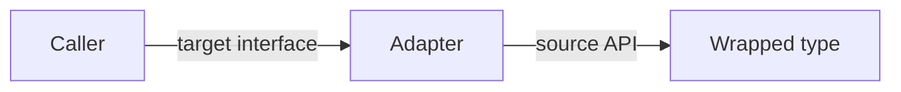

# Adapter Pattern — Junior

## 1. What the Adapter pattern actually is

You have a type that *does the right thing* but doesn't have the *right shape*. The codebase expects `io.Writer`, but the third-party library exposes a `Send(buf []byte)` method. The HTTP handler chain expects `http.Handler`, but your business logic is a `func(context.Context, Request) (Response, error)`. The metrics package expects a `prometheus.Collector`, but your in-house metrics produce a different struct.

The Adapter pattern wraps the "wrong shape" type in a thin layer that *translates* between interfaces — without changing the underlying type. From the caller's perspective, the adapter looks like what they expected. From the wrapped type's perspective, nothing happened.

```go
// Third-party library:
type Acme struct{}
func (a *Acme) Send(buf []byte) error { /* sends bytes */ }

// What our codebase wants:
//   io.Writer with a Write([]byte) (int, error) method

// Adapter:
type AcmeWriter struct{ Acme *Acme }

func (w *AcmeWriter) Write(p []byte) (int, error) {
    if err := w.Acme.Send(p); err != nil {
        return 0, err
    }
    return len(p), nil
}

// Now Acme works wherever io.Writer is expected:
var w io.Writer = &AcmeWriter{Acme: &Acme{}}
io.Copy(w, source)
```

Three observations:

1. **The adapter is small** — a struct and one method. That's by design. Adapters do the bare minimum to bridge interfaces.
2. **The wrapped type is untouched.** `Acme` doesn't know it's being adapted. We didn't modify the third-party library.
3. **The caller is also untouched.** They use `io.Writer` like always; the adapter is invisible.

This pattern is one of the most-used in real Go code, especially around third-party libraries, legacy APIs, and stdlib interface boundaries. This file teaches:

- The minimum implementation and the three shapes (object, function, interface adapter).
- How Adapter differs from Decorator, Facade, and Proxy (they all wrap, but differently).
- When the adapter is the right call vs when you should change the underlying API.
- How `io.Reader`, `http.HandlerFunc`, and `bufio.NewReader` are all forms of Adapter (mostly).

---

## 2. Table of Contents

1. [What the Adapter pattern actually is](#1-what-the-adapter-pattern-actually-is)
2. [Table of Contents](#2-table-of-contents)
3. [Why this pattern is unavoidable](#3-why-this-pattern-is-unavoidable)
4. [The three Go shapes](#4-the-three-go-shapes)
5. [Object adapter — wrapping a struct](#5-object-adapter--wrapping-a-struct)
6. [Function adapter — wrapping a function](#6-function-adapter--wrapping-a-function)
7. [Interface adapter — bridging two interfaces](#7-interface-adapter--bridging-two-interfaces)
8. [Adapter in the standard library](#8-adapter-in-the-standard-library)
9. [A second worked example — legacy logging library](#9-a-second-worked-example--legacy-logging-library)
10. [Adapter vs Decorator vs Facade vs Proxy](#10-adapter-vs-decorator-vs-facade-vs-proxy)
11. [Common mistakes a junior makes](#11-common-mistakes-a-junior-makes)
12. [Tricky points](#12-tricky-points)
13. [Quick test](#13-quick-test)
14. [Cheat sheet](#14-cheat-sheet)
15. [What to learn next](#15-what-to-learn-next)

---

## 3. Why this pattern is unavoidable

Go's interfaces are *structural*. If your type has the right methods, it satisfies any interface that lists them. You don't `implements` anything explicitly.

That sounds like adapters should be unnecessary. They're not. Three things keep adapters relevant:

1. **You don't own the third-party type.** Method names, signatures, receiver kinds — all are fixed by the upstream library. If your stdlib expects `Read(p []byte) (int, error)` and the upstream gives you `ReadBytes(buf *Buffer)`, you can't add a `Read` method to a type you don't own. You wrap.

2. **Two interfaces serve the same purpose with different signatures.** `io.Reader` reads bytes. So does `bufio.Reader.ReadByte()`. They share a *concept* but not a *method set*. To use one where the other is expected, you adapt.

3. **A function value needs to look like an interface.** Go's "named function type with a method" trick is a function-to-interface adapter. `http.HandlerFunc` adapts a `func(w, r)` into an `http.Handler`. This is the most common adapter you'll write without realising.

Structural typing reduces the *frequency* of adapters in Go vs Java or C#, but doesn't eliminate them. Every codebase has a handful.

---

## 4. The three Go shapes

| Shape | Source | Target | Example |
|-------|--------|--------|---------|
| **Object adapter** | A struct with the wrong methods | Interface | Wrapping a third-party SDK as `io.Writer` |
| **Function adapter** | A function value | Interface | `http.HandlerFunc` adapting `func` to `Handler` |
| **Interface adapter** | One interface | Another interface | Wrapping `io.ReadCloser` to expose only `io.Reader` |

All three follow the same rule: the adapter has the target interface's methods, and those methods translate calls into the source type's API.



You'll see all three in any non-trivial Go codebase. Knowing which shape to pick takes some judgement; we cover it in §10.

---

## 5. Object adapter — wrapping a struct

The most common shape. Adapt a concrete type to satisfy an interface.

```go
// Source — what we have:
package legacypkg

type SnailMailer struct{ smtp *SMTPClient }

func (m *SnailMailer) Deliver(to string, subject string, body string) error {
    return m.smtp.Send(to, subject, body)
}
```

```go
// Target — what we want:
package mail

type Mailer interface {
    Send(ctx context.Context, msg Message) error
}

type Message struct {
    To      string
    Subject string
    Body    string
}
```

```go
// Adapter:
package adapters

type SnailMailAdapter struct {
    Inner *legacypkg.SnailMailer
}

func (a *SnailMailAdapter) Send(ctx context.Context, msg mail.Message) error {
    // Ignore ctx (legacy lib doesn't support cancellation)
    // — or check ctx.Err() before delivering, as a courtesy.
    if err := ctx.Err(); err != nil {
        return err
    }
    return a.Inner.Deliver(msg.To, msg.Subject, msg.Body)
}
```

Usage:

```go
var m mail.Mailer = &adapters.SnailMailAdapter{Inner: &legacypkg.SnailMailer{}}
m.Send(ctx, mail.Message{To: "alice@example.com", Subject: "Hi"})
```

The adapter:

- Has the target interface's method (`Send(ctx, msg)`).
- Delegates to the source's `Deliver(to, subject, body)`.
- Translates the argument shape (a `Message` struct into three positional arguments).
- Inserts whatever the target expects but the source doesn't have (a context check).

That's the entire object adapter pattern. The translation logic stays small and focused; if it gets large, the adapter is probably masking a deeper mismatch (§11.4).

---

## 6. Function adapter — wrapping a function

Go's killer feature for adapting functions to interfaces: a named function type can have methods.

```go
type Mailer interface {
    Send(ctx context.Context, msg Message) error
}

// MailerFunc is a function value, but it has a Send method, so it satisfies Mailer.
type MailerFunc func(ctx context.Context, msg Message) error

func (f MailerFunc) Send(ctx context.Context, msg Message) error {
    return f(ctx, msg)
}
```

Now any function with the right signature becomes a `Mailer`:

```go
m := MailerFunc(func(ctx context.Context, msg Message) error {
    return smtpClient.Send(msg.To, msg.Subject, msg.Body)
})

// m is a Mailer. Use it anywhere a Mailer is expected.
sendWelcomeEmail(m, user)
```

This is exactly what `http.HandlerFunc` does:

```go
type Handler interface {
    ServeHTTP(ResponseWriter, *Request)
}

type HandlerFunc func(ResponseWriter, *Request)

func (f HandlerFunc) ServeHTTP(w ResponseWriter, r *Request) { f(w, r) }
```

The adapter is the named type + the one-method receiver. Five lines of code. Pure boilerplate. But it lets every plain function with the right signature *be* an `http.Handler`.

### When to use the function adapter shape

- The interface has *one* method (or one primary method).
- You want to support both function and struct implementations.
- You're publishing a library and care about how compactly callers can pass behaviour.

For interfaces with two or more meaningful methods, the function adapter doesn't fit — you'd need a struct holding multiple function fields. At that point use the object adapter shape (§5).

---

## 7. Interface adapter — bridging two interfaces

Sometimes you don't want all of an interface — just a slice. Or you want to use one interface as another.

```go
// You have an io.ReadCloser (returned by http.Response.Body)
// You want to pass it to something that only needs io.Reader
// (so the consumer can't accidentally close it).

func readBody(r io.ReadCloser) {
    onlyRead := io.Reader(r)  // Go's interface assignment is free —
    io.Copy(os.Stdout, onlyRead) // the consumer can't see Close()
}
```

When the conversion is more than a trivial assignment, write an explicit adapter:

```go
// Wrap an io.Reader so it also implements io.Closer (as a no-op).
type readerToReadCloser struct{ r io.Reader }

func (rc readerToReadCloser) Read(p []byte) (int, error) { return rc.r.Read(p) }
func (rc readerToReadCloser) Close() error                { return nil } // no-op

// Now an io.Reader can be passed where io.ReadCloser is needed.
func NewReadCloser(r io.Reader) io.ReadCloser { return readerToReadCloser{r: r} }
```

Real-world example: `io.NopCloser(r io.Reader) io.ReadCloser` does exactly this. It's in the stdlib because the need is common — you have a reader, the API wants a `ReadCloser`, and you have nothing to close.

### When to use the interface adapter shape

- You're connecting two interfaces from different packages.
- One interface is a strict superset of the other (just expose the subset).
- One interface needs a method the other lacks (provide a no-op or sensible default).

---

## 8. Adapter in the standard library

You've used adapters in stdlib without thinking. A partial list:

| Where | What it adapts |
|-------|----------------|
| `io.NopCloser(r io.Reader) io.ReadCloser` | Adds a no-op `Close()` |
| `strings.NewReader(s string) *strings.Reader` | Adapts `string` to `io.Reader` |
| `bytes.NewReader(b []byte) *bytes.Reader` | Adapts `[]byte` to `io.Reader` |
| `bufio.NewReader(r io.Reader)` | Adapts a slow Reader to a buffered one (sort of) |
| `http.HandlerFunc` | Adapts `func` to `Handler` |
| `http.FileServer(root FileSystem)` | Adapts a `FileSystem` to an HTTP handler |
| `flag.Value` interface | Adapts arbitrary types to `flag`'s string parsing |
| `sort.Reverse(data Interface) Interface` | Adapts a sort interface to its reverse |
| `httputil.NewSingleHostReverseProxy` | Adapts an inner Handler to a proxy |
| `template.FuncMap` | Adapts arbitrary funcs to template functions |
| `errors.Is` and `errors.As` | Adapt typed errors to comparable / extractable values |

`sort.Reverse` is worth looking at:

```go
// from sort
type reverse struct {
    Interface
}

func (r reverse) Less(i, j int) bool { return r.Interface.Less(j, i) }

func Reverse(data Interface) Interface { return &reverse{data} }
```

That's an interface adapter in 5 lines. The `reverse` struct embeds `sort.Interface`, *overrides* `Less`, and the embedded methods (`Len`, `Swap`) pass through. The wrapped interface looks the same to the sort algorithm, but `Less` is inverted, so the sort runs backwards. Beautiful.

Read `io.NopCloser`'s source while you're at it. It's a 7-line file. The pattern fits in your head.

---

## 9. A second worked example — legacy logging library

A real adapter you'll write at some point: bridging an old logger to a new one.

```go
// Old code uses an in-house logger.
package legacy

type Logger interface {
    Info(args ...any)
    Error(format string, args ...any)
    Debugf(format string, args ...any)
}
```

```go
// New code uses log/slog.
package main

func handle(log *slog.Logger) {
    log.Info("starting", "user", userID)
}
```

You want existing code that depends on `legacy.Logger` to *actually* log via `slog`. Adapter:

```go
package adapters

import (
    "fmt"
    "log/slog"
)

type SlogLegacyAdapter struct {
    Slog *slog.Logger
}

func (a *SlogLegacyAdapter) Info(args ...any) {
    a.Slog.Info(fmt.Sprint(args...))
}

func (a *SlogLegacyAdapter) Error(format string, args ...any) {
    a.Slog.Error(fmt.Sprintf(format, args...))
}

func (a *SlogLegacyAdapter) Debugf(format string, args ...any) {
    a.Slog.Debug(fmt.Sprintf(format, args...))
}
```

Usage:

```go
slogLogger := slog.New(slog.NewJSONHandler(os.Stdout, nil))
legacyLogger := &adapters.SlogLegacyAdapter{Slog: slogLogger}

// Old code path keeps using legacy.Logger — but slog handles it now.
legacy.HandleRequest(req, legacyLogger)
```

Three observations:

1. **Conversion is lossy.** `Info(args ...any)` doesn't carry key-value semantics; we collapse it into a sprintf string. If you want structured logging, you can't always recover it from a legacy positional API. Some information is gone forever.
2. **Inverse direction adapter is symmetric.** If you want new code using `slog` to *delegate* to a legacy logger (the other direction), write a `LegacySlogAdapter` with the inverse translation. Both adapters share the same structure.
3. **Adapters are a migration tool.** Once all legacy callers move to `slog`, the legacy interface and the adapter can be deleted. The adapter is *temporary scaffolding*, not a permanent abstraction.

---

## 10. Adapter vs Decorator vs Facade vs Proxy

Four GoF patterns that look alike. The differences matter once you've seen each.

### Adapter

> Converts one interface to another.

Two interfaces, different shapes; the adapter translates calls. The wrapped object provides the same *behaviour*; only the shape differs.

### Decorator

> Adds behaviour to an object while keeping the same interface.

One interface, the wrapper provides *extra behaviour* (logging, retry, caching). Same shape in, same shape out, more behaviour in the middle.

### Facade

> Provides a simpler interface to a complex subsystem.

The facade hides several types behind one. It's not just translating shape — it's collapsing multiple objects into a single, easier-to-use entry point.

### Proxy

> Controls access to an object.

Same interface as the wrapped object, but the proxy decides whether/how/when to forward calls. Remote proxies forward over a network; security proxies check permissions; virtual proxies lazy-load.

### Decision table

| Goal | Pattern |
|------|---------|
| Make a type satisfy a different interface | Adapter |
| Add cross-cutting behaviour (log, retry, cache) | Decorator |
| Hide a complex subsystem behind one type | Facade |
| Control access (remote, restricted, lazy) | Proxy |

In Go specifically, Adapter and Decorator are sometimes implementationally indistinguishable. The intent is what differs:

- **Adapter** *changes* the interface.
- **Decorator** *enriches* it.

If you can answer "which interface does this satisfy that the inner type doesn't?" — you're writing an Adapter. If the answer is "the same interface, plus extra behaviour" — Decorator.

---

## 11. Common mistakes a junior makes

### 11.1 Adding business logic to the adapter

```go
func (a *SlogAdapter) Info(args ...any) {
    if shouldFilter(args) { return }   // BAD — business logic in adapter
    a.Slog.Info(fmt.Sprint(args...))
}
```

The adapter's *only* job is to translate. Filtering is policy, not translation. Put it in a Decorator that wraps the adapter, or in the caller.

### 11.2 Adapter that owns too much

```go
type DBAdapter struct {
    conn    *sql.DB
    cache   *Cache
    metrics *Metrics
    log     *log.Logger
}
```

A single adapter hosting four collaborators isn't an adapter — it's a facade. Adapters are *small*. If you find yourself adding fields beyond the wrapped type, you've grown into Facade territory; rename and refactor.

### 11.3 Adapter that exposes the inner type

```go
func (a *SlogAdapter) Inner() *slog.Logger { return a.Slog }
```

Callers can now reach around the adapter to call slog directly. The adapter's contract is now leaky — implementations that don't have an `Inner()` method can't substitute for it. Don't expose the wrapped type.

### 11.4 Writing an adapter when you should change the underlying API

```go
// Adapter that does substantial work to bridge old to new
type MassiveAdapter struct{ Old *OldClient }

func (m *MassiveAdapter) DoNewThing(ctx context.Context, req NewReq) (NewResp, error) {
    // 100 lines of translation, validation, error mapping, retry logic...
}
```

If the adapter is this large, the abstraction mismatch is structural. The right fix is to update the underlying API — either upstream the change to the old library, or wrap it once in a new domain type and ditch the legacy interface entirely. Don't keep the legacy interface alive forever with a 100-line adapter.

### 11.5 Returning a struct when the interface would do

```go
// Anti-idiom
func NewSlogAdapter(s *slog.Logger) *SlogLegacyAdapter { return &SlogLegacyAdapter{Slog: s} }

// Caller now ties code to *SlogLegacyAdapter — defeats the adapter's purpose
```

The adapter exists to provide the *target interface*. Return that interface (or the adapter's pointer type, but document the type as an implementation detail). Don't let consumers depend on the adapter's concrete type.

---

## 12. Tricky points

### 12.1 The "nil source" trap

```go
adapter := &SlogLegacyAdapter{} // forgot Slog
adapter.Info("hello")            // nil pointer dereference
```

Constructors should validate:

```go
func NewSlogLegacyAdapter(s *slog.Logger) *SlogLegacyAdapter {
    if s == nil { panic("NewSlogLegacyAdapter: nil slog") }
    return &SlogLegacyAdapter{Slog: s}
}
```

Or document that `nil` defaults to `slog.Default()`. Either is fine; just don't surprise the caller.

### 12.2 Adapting through type assertion

```go
func adaptHandler(h interface{}) http.Handler {
    if hh, ok := h.(http.Handler); ok { return hh }
    if hf, ok := h.(func(http.ResponseWriter, *http.Request)); ok {
        return http.HandlerFunc(hf)
    }
    panic("unsupported handler type")
}
```

This is "structural adapter at runtime" — based on what the value happens to be, build a different adapter. Useful for plugin systems; brittle for application code. Prefer explicit constructors.

### 12.3 Method-promoted adapter via embedding

```go
type ReverseSorter struct {
    sort.Interface
}

func (r ReverseSorter) Less(i, j int) bool { return r.Interface.Less(j, i) }
```

Embedding the interface promotes all its methods. The adapter *overrides* the one it cares about; the rest pass through. Elegant, but careful: if the inner interface gains a new method, your wrapper gets it automatically — sometimes good, sometimes bad.

### 12.4 The receiver kind matters for the function adapter

```go
type MailerFunc func(ctx context.Context, msg Message) error

// Pointer receiver — doesn't work
func (f *MailerFunc) Send(ctx context.Context, msg Message) error {
    return (*f)(ctx, msg)
}
// MailerFunc(f).Send(ctx, msg) — but *MailerFunc isn't comparable, can't use as map key, etc.

// Value receiver — idiomatic
func (f MailerFunc) Send(ctx context.Context, msg Message) error {
    return f(ctx, msg)
}
```

Function values are small (a pair of pointers). Use a value receiver. Pointer receiver on a function type is unusual and usually a mistake.

---

## 13. Quick test

**Q1.** Which pattern fits?

```
You have a third-party PDF library with a method `Render(opts RenderOptions) ([]byte, error)`.
Your code uses an interface: `type Renderer interface { Render(ctx context.Context, doc Doc) ([]byte, error) }`.
You want the PDF library to satisfy `Renderer`.
```

<details><summary>Answer</summary>

Adapter. The shapes are different (`RenderOptions` vs `(ctx, doc)`), and your job is purely to translate. Write a small wrapper that maps `(ctx, doc)` into the library's `RenderOptions` (checking `ctx.Err()` first) and returns the result.

Not Decorator — you're not adding behaviour. Not Facade — you're not hiding a subsystem. Not Proxy — you're not controlling access.
</details>

**Q2.** Which shape is right?

```go
// You want any function with this signature to act as a Charger:
type Charger interface { Charge(ctx context.Context, amount int) error }
```

<details><summary>Answer</summary>

Function adapter. Define `type ChargerFunc func(ctx context.Context, amount int) error` with a `Charge` method that invokes itself. Now any function with the right signature can be wrapped via `ChargerFunc(fn)` and used as a `Charger`.

This is the `http.HandlerFunc` pattern. Five lines of code, dramatically improves the API.
</details>

**Q3.** Spot the bug:

```go
type LegacyAdapter struct{ Logger *legacy.Logger }

func (a *LegacyAdapter) Info(args ...any) {
    if a.Logger == nil { return }   // silently swallows
    a.Logger.Info(args...)
}
```

<details><summary>Answer</summary>

The adapter silently no-ops when the logger is nil. Callers think they're logging, but nothing happens. Bug: in production, you'd lose log entries with no warning.

Fix: validate in the constructor (`if logger == nil { panic(...) }`) or use a sensible default (`legacy.Default`). Don't silently discard.
</details>

---

## 14. Cheat sheet

| What | How |
|------|-----|
| The adapter has the target interface's methods | Each method translates and delegates |
| Object adapter | Struct holds a source, methods translate |
| Function adapter | Named func type with a method satisfying the interface |
| Interface adapter | Struct wraps one interface to expose another |
| Construction | Validate nil source; return concrete type (callers depend on interface) |
| Receiver kind | Value receiver for function adapters; pointer for object adapters with state |
| Translation logic | Tiny — args-shuffling, missing-method shims |
| Anti-patterns | Adding business logic, exposing the inner type, owning multiple collaborators |
| Lifecycle | Often *temporary* — for migration or third-party bridging |
| Related patterns | Decorator (same iface, more behaviour); Facade (collapses many); Proxy (controls access) |

---

## 15. What to learn next

1. **[middle.md](middle.md)** — Two-way adapters, generic adapter helpers, multi-interface adapter, adapters in dependency injection wiring, testing adapters.
2. **[../04-decorator-pattern/](../04-decorator-pattern/)** — Re-read; note where you'd use Adapter vs Decorator in real cases.
3. **[../10-facade-pattern/](../10-facade-pattern/)** — When the adapter grows up.
4. **[../11-proxy-pattern/](../11-proxy-pattern/)** — Cousins of Adapter; remote proxies *are* adapters that cross a network.

Adapter is the *workhorse* of integration. Every library boundary, every legacy migration, every "I have a func but I need an interface" call site is an adapter. Spotting them early — and keeping them small — is what separates clean Go code from `XxxAdapterImpl` chaos.
