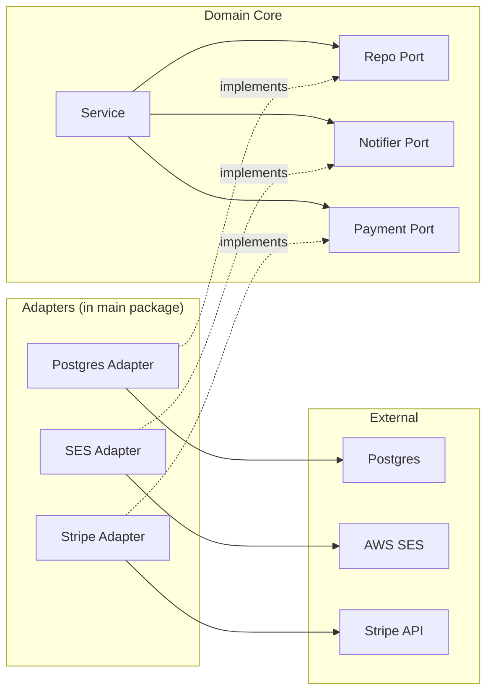

# Adapter Pattern — Senior

## 1. What this level covers

Junior taught the shape; middle covered the variants and the production traps. Senior is about *architecture*:

- Designing adapter APIs that other teams will write against (libraries).
- Evolving adapters across major version boundaries without breaking consumers.
- Hexagonal architecture (ports and adapters) applied at the Go service level.
- Real-world adapter ecosystems: `database/sql` drivers, `http.RoundTripper`, gRPC ↔ HTTP, OpenTelemetry instrumentation.
- Anti-patterns that show up only at scale: god adapters, adapter chains, leaky abstractions through type assertions.
- Concurrency in adapters that must serve thousands of QPS.
- Postmortems — real bugs traced to adapter mistakes.
- Cross-language: what Go-style structural adapters look like in Java/Rust/C#.

The decisions at this level are usually irreversible. A bad adapter API design at v1 becomes infrastructure for years.

---

## 2. Table of Contents

1. [What this level covers](#1-what-this-level-covers)
2. [Table of Contents](#2-table-of-contents)
3. [Designing adapter APIs for downstream consumers](#3-designing-adapter-apis-for-downstream-consumers)
4. [Evolution: adapters across major versions](#4-evolution-adapters-across-major-versions)
5. [Hexagonal architecture in Go](#5-hexagonal-architecture-in-go)
6. [Real ecosystem: database/sql drivers](#6-real-ecosystem-databasesql-drivers)
7. [Real ecosystem: http.RoundTripper](#7-real-ecosystem-httproundtripper)
8. [Real ecosystem: gRPC ↔ HTTP](#8-real-ecosystem-grpc--http)
9. [Real ecosystem: OpenTelemetry instrumentation](#9-real-ecosystem-opentelemetry-instrumentation)
10. [Anti-patterns at scale](#10-anti-patterns-at-scale)
11. [Concurrency in adapters](#11-concurrency-in-adapters)
12. [Performance — when adapters cost](#12-performance--when-adapters-cost)
13. [Contract testing across packages](#13-contract-testing-across-packages)
14. [Postmortems](#14-postmortems)
15. [Cross-language comparison](#15-cross-language-comparison)
16. [Common senior mistakes](#16-common-senior-mistakes)
17. [Tricky questions](#17-tricky-questions)
18. [Cheat sheet](#18-cheat-sheet)
19. [Further reading](#19-further-reading)

---

## 3. Designing adapter APIs for downstream consumers

When you publish a library, the *interfaces* you expose become *adapter contracts* — every consumer writes an adapter to bridge their world to yours. The shape of those contracts determines how painful that adapter is to write.

### 3.1 Small interfaces win

```go
// Hard to adapt — 12 methods, many irrelevant to most consumers
type Store interface {
    Get(...) (Item, error)
    Put(...) error
    Delete(...) error
    Watch(...) error
    Snapshot() ([]byte, error)
    Restore([]byte) error
    /* ... 6 more ... */
}
```

A consumer who only wants `Get` and `Put` writes an adapter implementing 12 methods, 10 of them stubs. The stubs are a smell — they lie about the underlying capability. The library accumulates "not supported" implementations forever.

```go
// Easy to adapt — segregated
type Reader interface { Get(...) (Item, error) }
type Writer interface { Put(...) error; Delete(...) error }
type Watcher interface { Watch(...) error }
type Backupable interface { Snapshot() ([]byte, error); Restore([]byte) error }
```

Each consumer adapts only what they need. Adapters are tiny. Capability is declared by *which interfaces* the adapter implements.

### 3.2 Return concrete types from constructors

```go
// Anti-idiom — library returns interface
func NewStore() Store { return &realStore{} }

// Idiomatic — library returns concrete; consumers use interface in their parameter types
func NewStore() *Store { return &Store{} }
```

A consumer who wants additional methods (introspection, debug) loses access if the constructor returns an interface. Returning concrete preserves consumer optionality.

### 3.3 Provide adapter helpers (the `HandlerFunc` trick)

For single-method interfaces, always provide the named-func-type adapter:

```go
type Store interface { Get(id string) (Item, error) }

type StoreFunc func(id string) (Item, error)

func (f StoreFunc) Get(id string) (Item, error) { return f(id) }
```

Now consumers can pass either a struct or a plain function. This is one of the highest-leverage API design decisions in Go: five lines of boilerplate, dramatically improved ergonomics.

---

## 4. Evolution: adapters across major versions

Adapters are *contracts* — they constrain how you can evolve the interface.

### 4.1 Adding a method is breaking

```go
// v1.0
type Store interface { Get(id string) (Item, error) }

// v1.1 — ADDS a method
type Store interface {
    Get(id string) (Item, error)
    GetWithMeta(id string) (Item, Meta, error)  // new
}
```

Every adapter implementing v1.0 silently fails to implement v1.1. Type assertions and direct uses still compile (Go's structural typing), but the interface check breaks. This is a v2.0 change, not v1.1.

Fix: a *new* interface for the new method:

```go
type Store interface { Get(id string) (Item, error) }
type StoreWithMeta interface {
    Store
    GetWithMeta(id string) (Item, Meta, error)
}
```

Old code uses `Store`. New code requiring metadata uses `StoreWithMeta`. The library checks at runtime:

```go
if swm, ok := s.(StoreWithMeta); ok {
    item, meta, err := swm.GetWithMeta(id)
    // use the rich path
} else {
    item, err := s.Get(id)
    // use the legacy path
}
```

This is the *optional interface* pattern. `net/http` uses it heavily: `http.Hijacker`, `http.Flusher`, `http.Pusher` are all optional interfaces that `ResponseWriter` implementations *may* satisfy.

### 4.2 Removing a method is breaking

Obvious, but worth stating. Once a method is in an interface, removing it breaks every adapter. Even if no one is using it.

### 4.3 Changing a method signature is breaking

```go
// v1
Get(id string) (Item, error)

// v2 — adds context
Get(ctx context.Context, id string) (Item, error)
```

Every adapter must be rewritten. The migration plan is usually:

1. Add `GetCtx` (new signature) as an *additional* method via an optional interface.
2. Wait for consumers to migrate.
3. In v2.0, drop `Get` and rename `GetCtx` back to `Get`.

The two-phase migration spans a major version. Plan for years, not weeks.

---

## 5. Hexagonal architecture in Go

The "ports and adapters" architecture, applied at the Go service level:



### 5.1 Where each piece lives

- **Domain package** (`order/`, `user/`, `billing/`) — declares the *ports* (interfaces it needs). Has no external imports beyond stdlib.
- **Adapter packages** (`adapters/postgres`, `adapters/stripe`) — implement the ports. Each imports one external dependency.
- **Composition root** (`cmd/server/main.go`) — wires adapters to domain services.

### 5.2 Why it pays off

- Domain code is *testable* without spinning up Postgres, Stripe, or AWS.
- Replacing Stripe with PayPal is a `main.go` change. Domain code doesn't move.
- Each adapter is *small* (the thin-adapter rule from middle §4). All complexity stays in domain.

### 5.3 Why it sometimes doesn't

- For small apps (<5k LOC), the overhead exceeds the benefit.
- For exploratory code, it slows iteration.
- The discipline only works if everyone on the team follows it. One person reaching directly into `*sql.DB` from domain code unravels months of design.

Use it for *core* services that you expect to maintain for years. Skip it for scripts and prototypes.

---

## 6. Real ecosystem: database/sql drivers

`database/sql` is the canonical multi-method adapter ecosystem in Go.

```go
// from database/sql/driver
type Driver interface {
    Open(name string) (Conn, error)
}

type Conn interface {
    Prepare(query string) (Stmt, error)
    Close() error
    Begin() (Tx, error)
}

type Stmt interface {
    Close() error
    NumInput() int
    Exec(args []Value) (Result, error)
    Query(args []Value) (Rows, error)
}

// ... and more
```

Each database driver (`pq`, `pgx`, `mysql`, `sqlite3`) is an adapter implementing these interfaces. The `database/sql` package speaks to drivers through this interface — it doesn't import any specific driver. Drivers self-register via `sql.Register("postgres", &pq.Driver{})` in their `init()`.

Two architectural lessons:

### 6.1 The "interfaces upstream of implementations" rule

`database/sql/driver` is in the standard library — drivers depend on it, not vice versa. This is essential for the architecture: stdlib can't depend on third-party drivers.

In your own code, the equivalent rule: interfaces live in the *consumer's* package, adapters live in the *implementation's* package. The implementation package depends on the consumer, never the other way.

### 6.2 Backwards-compatible evolution via optional interfaces

`database/sql/driver` originally had:

```go
type Conn interface {
    Prepare(query string) (Stmt, error)
    Close() error
    Begin() (Tx, error)
}
```

Then context was added everywhere in Go 1.8 (2017). Rather than break every driver, new methods were introduced as *optional interfaces*:

```go
type ConnPrepareContext interface {
    PrepareContext(ctx context.Context, query string) (Stmt, error)
}

type ConnBeginTx interface {
    BeginTx(ctx context.Context, opts TxOptions) (Tx, error)
}
```

`database/sql` checks at runtime: if the driver implements `ConnPrepareContext`, use it; otherwise fall back to `Prepare`. Drivers can adopt context support at their own pace. v1.0 drivers from 2014 still work in 2026.

This is the *gold standard* for adapter API evolution. Study it.

---

## 7. Real ecosystem: http.RoundTripper

```go
type RoundTripper interface {
    RoundTrip(*Request) (*Response, error)
}
```

A one-method interface. Every HTTP transport adapter (real network, mock, recording, retrying, tracing) implements `RoundTripper`. They compose by wrapping:

```go
var rt http.RoundTripper = http.DefaultTransport
rt = &retryRoundTripper{Inner: rt, attempts: 3}
rt = &tracingRoundTripper{Inner: rt, tracer: tr}
rt = &loggingRoundTripper{Inner: rt, log: log.Default()}

client := &http.Client{Transport: rt}
```

`RoundTripper` is also an *adapter target*. Library code that needs to fake HTTP calls writes a custom `RoundTripper`:

```go
type fakeRoundTripper struct{ resp *http.Response }
func (f *fakeRoundTripper) RoundTrip(r *http.Request) (*http.Response, error) {
    return f.resp, nil
}
```

Architectural payoff: HTTP testing works without any network. The adapter mocks at the transport layer, so `http.Client.Do` works exactly as it does in production.

OpenTelemetry's `otelhttp.NewTransport(rt)` wraps any `RoundTripper` with span creation. Prometheus' `promhttp.RoundTripperFunc` wraps with metrics. The whole ecosystem stacks on this one interface.

---

## 8. Real ecosystem: gRPC ↔ HTTP

gRPC and HTTP are different protocols. Adapters bridge them.

### 8.1 grpc-gateway

`grpc-gateway` reads protobuf service definitions and generates an HTTP/JSON adapter. The adapter:

- Accepts HTTP requests with JSON bodies.
- Translates each to a gRPC call against the same service.
- Translates the gRPC response back to JSON.

For each gRPC method, the generator produces a small HTTP handler that's effectively an adapter. The user writes the gRPC service once; both HTTP/JSON and gRPC/protobuf clients work.

### 8.2 connect-go

Connect (from Buf) is a single library that serves both gRPC and HTTP/JSON from the same code. Its core type is an HTTP handler that internally adapts to a typed protobuf-style method call. Adapter pattern, applied to the protocol layer.

### 8.3 Lessons

- When you need to support multiple protocols, *one* logical service with *N* adapters is cleaner than *N* parallel implementations.
- The adapters can be code-generated — saves writing the translation boilerplate by hand.
- Protocol-level adapters are usually thin: header conversion, body serialisation, status code mapping. Business logic stays in the underlying service.

---

## 9. Real ecosystem: OpenTelemetry instrumentation

OpenTelemetry's Go instrumentation libraries (`otelhttp`, `otelgrpc`, `otelsql`, `otelfiber`) are all adapters that wrap existing libraries to emit telemetry. Each wraps a standard interface (`http.Handler`, `grpc.UnaryServerInterceptor`, `sql.Driver`, etc.) and produces the same interface with spans/metrics added.

`otelhttp` example:

```go
handler := http.HandlerFunc(myHandler)
wrapped := otelhttp.NewHandler(handler, "my-service")
// wrapped is still http.Handler, but every request now produces a span
```

The architectural insight: when an ecosystem standardises on small interfaces (`http.Handler`, `RoundTripper`, `sql.Driver`), instrumentation can be *cross-cutting* and *non-invasive*. You don't modify your application code; you add an adapter at the edge.

This is *only* possible because the underlying interfaces are small and stable. Adapter-friendly APIs unlock cross-cutting tooling.

---

## 10. Anti-patterns at scale

### 10.1 The god adapter

An adapter that wraps a single dependency but accumulates dozens of methods and several collaborators over time. By year two, it's the only thing in the project that knows how to talk to Postgres, and it has 2000 lines.

Fix: split by responsibility. A `UserStore` adapter, a `BillingStore` adapter, an `EventStore` adapter — each thin. The fact that all three talk to Postgres is incidental.

### 10.2 Adapter chains masquerading as architecture

```go
// Three layers of adapters between the caller and the implementation
type FrontendAdapter struct{ Inner BackendAdapter }
type BackendAdapter struct{  Inner DBAdapter }
type DBAdapter struct{       Inner *sql.DB }
```

Each adapter is *thin* (good), but the chain adds three layers of indirection for no reason. Usually the result of organic growth: someone added a "shim" between every layer "in case it changes".

Fix: collapse adjacent thin adapters into one. Three thin adapters in series rarely justify their existence.

### 10.3 Type assertions defeating the abstraction

```go
func (s *Service) Process(repo Repo) {
    if sqlrepo, ok := repo.(*SQLRepo); ok {
        // bypass the interface for "optimized" path
        sqlrepo.bulkInsert(...)
    } else {
        for _, item := range items { repo.Insert(item) }
    }
}
```

The service now *depends* on `*SQLRepo` existing. Replacing the SQL repo with a Mongo one breaks the optimization. The abstraction leaks.

Fix: declare an *optional interface* (`BulkInserter`) and assert against that. Multiple implementations can satisfy `BulkInserter` independently.

### 10.4 Adapters that hide errors

```go
func (a *Adapter) Save(ctx context.Context, e Entity) error {
    err := a.inner.Save(e)
    if err != nil {
        log.Printf("Adapter.Save: %v", err)
        return nil // !
    }
    return nil
}
```

The error is logged but not propagated. Upstream code thinks the save succeeded. Months later, data inconsistency surfaces. The trace leads to this adapter.

Fix: always propagate. Logging *and* returning is fine. Swallowing is never fine.

### 10.5 Adapter constructors that perform I/O

```go
func NewStripeAdapter(apiKey string) (*StripeAdapter, error) {
    client := stripe.New(apiKey)
    if err := client.Ping(); err != nil { return nil, err } // network call in constructor
    return &StripeAdapter{client: client}, nil
}
```

`main()` now blocks on Stripe's API before the service can start. If Stripe is down, the service won't boot. If Stripe times out, startup hangs.

Fix: defer the check to first use, or expose a separate `Verify(ctx)` method. Constructors should not do I/O unless the user opts in.

---

## 11. Concurrency in adapters

Adapters are usually shared across goroutines. Three concerns:

### 11.1 Wrap concurrent-safe sources

```go
type DBAdapter struct{ db *sql.DB }

func (a *DBAdapter) Get(ctx context.Context, id string) (User, error) {
    var u User
    err := a.db.QueryRowContext(ctx, "SELECT id, name FROM users WHERE id=$1", id).Scan(&u.ID, &u.Name)
    return u, err
}
```

`*sql.DB` is goroutine-safe. The adapter is too — no shared mutable state. Stateless adapters are by far the easiest.

### 11.2 Wrap non-concurrent sources

```go
type LegacyClient struct{ /* NOT concurrent-safe */ }

type Adapter struct {
    mu     sync.Mutex
    client *LegacyClient
}

func (a *Adapter) Charge(ctx context.Context, amount int) error {
    a.mu.Lock()
    defer a.mu.Unlock()
    return a.client.Charge(amount)
}
```

The mutex serialises all calls. Fine for a low-QPS adapter; a bottleneck for hot-path. Better: a pool of clients.

### 11.3 Lazy initialisation

```go
type Adapter struct {
    once   sync.Once
    client *Client
    apiKey string
}

func (a *Adapter) lazy() *Client {
    a.once.Do(func() { a.client = NewClient(a.apiKey) })
    return a.client
}
```

`sync.Once` ensures one initialisation under concurrency. Useful when the underlying client is expensive to construct and may not always be used.

---

## 12. Performance — when adapters cost

Adapters add one method call per operation. Numbers:

```
BenchmarkDirect-8                  500000000   2.1 ns/op   0 B/op
BenchmarkAdapter-8                 400000000   2.6 ns/op   0 B/op
BenchmarkAdapterInterface-8        300000000   3.4 ns/op   0 B/op
BenchmarkThreeAdapterChain-8       200000000   4.2 ns/op   0 B/op
BenchmarkGenericAdapter-8          300000000   3.6 ns/op   0 B/op
```

Almost never an issue. Where it shows up:

### 12.1 Escape analysis at interface conversion

```go
func process(items []Item) {
    for _, item := range items {
        var c Charger = &chargerAdapter{Item: item}
        c.Charge()
    }
}
```

`&chargerAdapter{Item: item}` allocates on the heap once per iteration if the compiler can't prove the interface stays in the frame. At 1M iterations, that's 1M allocations.

Fix: keep one adapter, mutate (if safe) or pre-allocate:

```go
adapter := &chargerAdapter{}
for _, item := range items {
    adapter.Item = item
    var c Charger = adapter
    c.Charge()
}
```

### 12.2 PGO devirtualization

Go 1.21+ profile-guided optimization can devirtualize hot interface calls when the profile shows the same concrete type dominates. For a long-running service with consistent adapter types, this can reclaim most of the dispatch cost.

To benefit: collect a CPU profile in production (`go tool pprof`), feed it to `go build -pgo=cpu.pprof`. Hot-path adapter calls get inlined.

### 12.3 The "interface in inner loop" smell

If you're constructing-and-discarding adapters inside a tight loop, refactor to construct once. The allocation cost dominates the dispatch cost.

---

## 13. Contract testing across packages

When package A defines an interface and package B provides an adapter, who tests the adapter satisfies the interface?

### 13.1 The compile-time check

```go
var _ A.Iface = (*B.Adapter)(nil)
```

Forces the compiler to verify. If the adapter misses a method or has wrong signatures, the build breaks.

### 13.2 The behaviour test

```go
func runIfaceContract(t *testing.T, x Iface) {
    t.Helper()
    // exercise every method with expected inputs
    err := x.Do(ctx, validInput)
    if err != nil { t.Fatalf("Do(valid): %v", err) }
    // ... etc
}
```

Each adapter implementation calls the contract test with its own instance. The contract enforces behaviour, not just signatures.

### 13.3 Liskov substitutability

Every adapter for the same interface should behave *identically* for the same input. Different implementations may have different *capabilities* (some support batch, some don't), expressed via optional interfaces — but for the methods they do implement, behaviour is identical.

Use property-based testing (`testing/quick` or `gopter`) to fuzz the same inputs against multiple adapters. Divergent behaviour = bug somewhere.

---

## 14. Postmortems

### 14.1 The case of the silenced context

A legacy SMS gateway had no context support. The adapter dropped `ctx` silently — `Send(ctx, msg)` ignored cancellation. During an incident, retry storms hit the gateway because the application thought slow sends could be cancelled but they couldn't. Eventually the gateway rate-limited the IP.

Fix: the adapter now spawns a goroutine that races the legacy call against `ctx.Done()`. If context cancels first, the adapter returns; the goroutine still runs (in vain). Documentation states this clearly. The application reduced retry aggressiveness based on the documented limitation.

Lesson: silently dropping context is a *correctness* bug, not just an aesthetic one.

### 14.2 The leaky adapter

A `database/sql` adapter exposed an `Underlying() *sql.DB` method "for testing". Three years later, a refactor changed `*sql.DB` to a custom connection pool. Two hundred call sites had reached past the adapter via `Underlying()`. The migration took six months.

Lesson: never expose the inner type. If tests need access, structure the test to inject the inner type before construction; don't extract it after.

### 14.3 The shared state adapter

A logger adapter held a `[]string` buffer for batching. Two goroutines using the same adapter raced on `append`. Lost log lines. Took two months to find because the loss only appeared under load.

Fix: the adapter now uses `sync.Mutex` around the buffer access. Or, better, the inner logger is replaced with one that's already concurrent-safe.

Lesson: stateful adapters need the same concurrency analysis as any other shared object.

### 14.4 The optional interface that wasn't checked

A service code path expected `Cache.Invalidate()`. The adapter being used didn't implement `Invalidator` (an optional interface). The code did a type assertion: `c.(Invalidator).Invalidate()`. Production: nil pointer dereference, service crash.

Fix: always check the assertion:

```go
if inv, ok := c.(Invalidator); ok {
    inv.Invalidate()
}
```

Lesson: type assertions without `ok` check are landmines. Linters catch some; vigilance catches the rest.

---

## 15. Cross-language comparison

| Language | Adapter mechanism | Notes |
|----------|-------------------|-------|
| Java | Adapter class implementing target interface, holding source as field | Explicit `implements`; requires recompilation when interface changes |
| C# | Extension methods + explicit adapter classes | Extension methods bridge some shape differences without a wrapper class |
| Rust | `impl Trait for Source` via newtype pattern | Compile-time check; no runtime dispatch unless `dyn Trait` |
| Kotlin | Delegation (`class A : I by source`) | Built-in language feature for "wrap and forward" |
| Scala | Implicit conversions, type classes | Adapter can be invisible at the call site |
| TypeScript | Structural typing like Go | Often no adapter needed; matches Go's situation |
| Python | Duck typing | No adapter; method existence checked at call time |

Go's structural typing reduces the *frequency* of adapters but doesn't eliminate them. Compared to Java, you write fewer adapters. Compared to Kotlin's delegation, you write more boilerplate.

The trade-off: Go's adapters are *visible* (you can find them by searching for the type name), whereas Kotlin's `by` delegation can hide significant amounts of forwarding logic. Verbosity helps debuggability.

---

## 16. Common senior mistakes

### 16.1 Designing for the adapter's first user, not future ones

The first consumer of your library shapes the interfaces you publish. If they only need read access, you design a one-method `Reader`. Then a second consumer needs writes — you add `Write` to `Reader` "for simplicity". Now read-only adapters must stub `Write`.

Imagine the *next ten* consumers before publishing.

### 16.2 Exposing the adapter type as a contract

```go
package adapters
type SlogAdapter struct{ ... }

// Caller code:
var x *adapters.SlogAdapter = adapters.New(slogger)
```

If `SlogAdapter` is exported and used as a type, you can never refactor it without breaking callers. Keep adapter types unexported; expose only the constructor and target interface.

### 16.3 Adapters that "almost" satisfy the contract

```go
func (a *Adapter) Send(ctx context.Context, msg Message) error {
    if ctx.Err() != nil { return nil } // !
    return a.inner.Deliver(...)
}
```

The adapter returns `nil` when the context is cancelled — silently appearing to succeed. The contract says "respect cancellation by returning an error". The adapter violates Liskov.

### 16.4 Letting test adapters drift from production behaviour

Test fakes are also adapters (to the same interface). When the real adapter handles a new edge case, the fake must too. If they drift, tests pass against the fake and break against production.

Solution: contract tests (§13) that exercise *both* fake and real adapters. Drift gets caught at CI time.

### 16.5 Skipping the compile-time interface check

```go
type StoreAdapter struct{ db *sql.DB }
func (s *StoreAdapter) Get(...) (Item, error) { /* ... */ }
// No `var _ Store = (*StoreAdapter)(nil)`
```

A typo in the method name produces an adapter that doesn't satisfy `Store`. The next caller using `StoreAdapter` as `Store` gets a confusing compile error far from the bug. Add the check at the adapter's declaration site.

### 16.6 Treating adapters as forever

Adapters are *scaffolding*. Most should be deleted within a year or two — when the legacy library is gone, when the migration completes, when the interface stabilises. If you have adapters older than three years, audit them: are they still needed?

---

## 17. Tricky questions

**Q1.** When is the right time to write an adapter vs change the underlying API?

<details><summary>Answer</summary>

Write an adapter when:
- You don't own the underlying API (third-party library).
- The change is large and you need a transition period.
- Multiple consumers can't all migrate at once.

Change the API when:
- You own both ends.
- The adapter would be substantial (>50 lines).
- The mismatch is structural, not just shape.

Rule of thumb: adapters >100 lines suggest the underlying API needs work.
</details>

**Q2.** A consumer wants to use methods specific to the wrapped type (e.g., `*sql.DB`-specific methods). How do you support that without exposing the inner type?

<details><summary>Answer</summary>

Two options:

1. **Add the methods to your interface** if they're broadly applicable. The interface widens; consumers can call them through the abstraction.

2. **Optional interfaces.** Define a separate interface (`BulkInserter`) that some implementations satisfy. Consumers type-assert: `if bi, ok := s.(BulkInserter); ok { ... }`. Implementations that don't support it are transparently skipped.

Never expose the concrete type. The whole abstraction collapses.
</details>

**Q3.** You have a 20-method interface. How do you decide whether to use embedding or explicit forwarding in an adapter?

<details><summary>Answer</summary>

**Embedding** when:
- Most methods pass through unchanged.
- The wrapped type's method set is stable.
- You don't mind future additions to the inner interface being silently inherited.

**Explicit forwarding** when:
- Each method needs translation (different argument shapes).
- The inner interface may grow and you want compile errors when it does.
- You want the adapter to be readable as a list of explicit translations.

For a 20-method interface where 18 pass through and 2 translate, embed and override the 2. For a 20-method interface where all 20 translate, write all 20 explicitly — embedding wouldn't save anything.
</details>

**Q4.** A library you depend on changed an interface in a backwards-incompatible way. Your adapter no longer compiles. How do you minimise damage to your consumers?

<details><summary>Answer</summary>

1. *Don't* propagate the breakage. Pin the library at the old version while planning.
2. Write a *transition adapter* that exposes the old interface to your consumers but uses the new library internally. Your consumers don't see the breakage.
3. Plan a major version bump where you expose the new interface and consumers migrate.
4. Eventually delete the transition adapter.

The transition adapter is a *cost*. It exists to give consumers time. If you don't have many consumers, just bump major and break — the transition adapter is overhead they didn't need.
</details>

**Q5.** When should an adapter be a public type vs a function returning the interface?

<details><summary>Answer</summary>

**Function returning interface** (default):
- Consumers depend on the interface, not the adapter.
- You can change the adapter's internals freely.
- Testing happens against the interface.

**Public adapter type**:
- Almost never. Exceptions:
  - The adapter has methods *beyond* the interface that consumers need (and you've decided those extras are part of the contract).
  - You're publishing a library where callers want to embed the adapter into their own types.

The default is "private adapter, public constructor returning interface". Override only with strong reason.
</details>

---

## 18. Cheat sheet

| Decision | Choose |
|----------|--------|
| Adapter or Decorator? | Adapter changes interface; Decorator preserves it |
| Adapter or Facade? | Adapter is 1:1; Facade hides many objects |
| Library evolution: add method | Optional interface, never widen the existing one |
| Adapter exposure | Private type, public constructor returning interface |
| Stateful adapter concurrency | Stateless if possible; mutex if not; pool if hot |
| Test for satisfaction | `var _ Iface = (*Adapter)(nil)` at declaration |
| Behaviour test | Shared contract test running against every implementation |
| Context dropped in inner library | Document loudly; race goroutines if cancellation matters |
| Inner type access for tests | Inject before construction; never expose after |
| Constructor I/O | Defer to first use or separate `Verify(ctx)` |

---

## 19. Further reading

- **Go blog: "Strings, bytes, runes and characters in Go"** — illustrates adapter design across types
- **Go blog: "Errors are values"** — adapter design for error wrapping
- **`net/http` source: `server.go`** — `HandlerFunc` is the canonical adapter
- **`database/sql/driver/driver.go`** — optional interface pattern at the stdlib level
- **`golang.org/x/net/http2`** — RoundTripper adapter for HTTP/2
- **`google.golang.org/grpc`** — interceptor and credentials are adapter-driven
- **`go.opentelemetry.io/otel/instrumentation/...`** — instrumentation as cross-cutting adapter
- **Alistair Cockburn, "Hexagonal Architecture"** — the architectural foundation
- **"Domain-Driven Design" (Eric Evans), chapter on adapters** — the strategic side

Adapter pattern in Go is unglamorous but load-bearing. The architectural decisions you make about *which* interfaces to publish, *where* to place adapters, and *when* to delete them shape the long-term maintainability of any service that integrates with the outside world.
