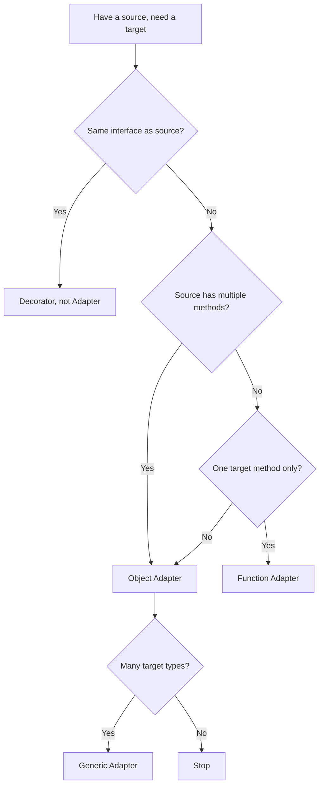

# Adapter Pattern — Specification

## 1. Origins

The Adapter pattern was formalised in *Design Patterns: Elements of Reusable Object-Oriented Software* (Gamma, Helm, Johnson, Vlissides, 1994), where it appears under structural patterns:

> "Convert the interface of a class into another interface clients expect. Adapter lets classes work together that couldn't otherwise because of incompatible interfaces."

The book distinguishes two flavours:

- **Class Adapter** — uses multiple inheritance (the adapter inherits from both the target and the source).
- **Object Adapter** — uses composition (the adapter holds a reference to the source).

Go has no inheritance, so only Object Adapter applies. The "Class Adapter" form is sometimes approximated through interface embedding (`type Wrapper struct{ Iface }`), but this is structural composition, not multiple inheritance.

### 1.1 Pre-GoF antecedents

The pattern existed long before 1994:

- **CORBA** (1991) bridges between languages via Interface Description Language adapters.
- **Macintosh System 7's `WMgr`** wrapped older single-app APIs to fit the multi-app Window Manager.
- **Smalltalk-80** had a culture of writing "wrapper" classes for type conversion.

The GoF book canonicalised the name and the structural diagram. The idea predates it.

### 1.2 Go community evolution

Go's structural typing reduces the *frequency* of adapter writing but doesn't eliminate the pattern. Key Go-era milestones:

- **Go 1.0 (2012)**: `net/http.HandlerFunc` introduced the "named function type with method" pattern, now considered the canonical Go adapter idiom.
- **Go 1.0**: `sort.Reverse` demonstrated embedded-interface adapters (override one method, promote the rest).
- **Go 1.5 (2015)**: `io.NopCloser` formalised the "add a method to satisfy a wider interface" pattern.
- **Go 1.8 (2017)**: `database/sql/driver` added context-aware methods as *optional* interfaces — preserving backwards compatibility with old drivers. The canonical example of evolving an adapter ecosystem.
- **Go 1.18 (2022)**: Generics enabled `Adapter[T]`-style helpers in utility libraries.
- **Go 1.21 (2023)**: Profile-guided optimization (PGO) can devirtualize hot adapter call sites, reducing dispatch overhead.

---

## 2. Underlying Go language mechanics

The Adapter pattern relies on several Go language features. The Go spec sections (https://go.dev/ref/spec) that make adapters possible:

### 2.1 Interfaces and structural satisfaction

> "An interface type T may use a (possibly qualified) interface type name E as an interface element. This is called *embedding* interface E in T. The type set of T is the intersection of the type sets defined by T's explicitly declared methods and the type sets of T's embedded interfaces."

Adapters satisfy interfaces *structurally*. No `implements` keyword; if the method set matches, the type satisfies the interface. This is what makes a struct's `func (a *Adapter) Read(p []byte) (int, error)` automatically work as `io.Reader`.

### 2.2 Method sets

> "The method set of a type determines the interfaces that the type implements. The method set of a defined type T consists of all methods declared with receiver type T."

For a type `T`:
- The method set of `T` (value receiver) contains methods with `(t T)` receivers.
- The method set of `*T` (pointer receiver) contains methods with `(t *T)` *and* `(t T)` receivers.

Adapter receivers must match the use site. If callers pass `*Adapter`, pointer receivers work. If callers pass `Adapter`, only value receivers do.

### 2.3 Function types as first-class values

> "Function types A function type denotes the set of all functions with the same parameter and result types."

Functions in Go are values. Named function types (`type ChargerFunc func(...)`) can have methods. This enables the `http.HandlerFunc` adapter idiom — a function value that satisfies an interface.

### 2.4 Type assertions

> "A type assertion provides access to an interface value's underlying concrete value."

Adapters that need to check optional capabilities use type assertions:

```go
if c, ok := value.(io.Closer); ok { c.Close() }
```

This enables the *optional interface* pattern in `database/sql/driver` and elsewhere.

### 2.5 Interface embedding in structs

> "A field declared with a type but no explicit field name is called an embedded field. ... A field or method f of an embedded field in a struct x is called *promoted* if x.f is a legal selector that denotes that field or method f."

A struct can embed an interface, promoting all its methods. This enables the `sort.Reverse` adapter pattern: embed `sort.Interface`, override `Less`, promote `Len` and `Swap`.

### 2.6 Generics (Go 1.18+)

> "Type parameters Generic types and functions are similar to functions, but they have one or more type parameters that are replaced with type arguments at instantiation time."

Generic adapters parameterise over data types:

```go
type Adapter[T any] struct{ Inner Source[T] }
```

Useful for utility code; usually overkill for domain-specific adapters.

---

## 3. The five canonical signature shapes

### 3.1 Object adapter (Concrete struct wrapping concrete source)

```go
type Adapter struct {
    inner *Source
}

func (a *Adapter) TargetMethod(...) error {
    return a.inner.SourceMethod(...)
}

var _ TargetIface = (*Adapter)(nil)
```

The default shape. Used everywhere stdlib has an interface mismatch with a concrete type.

### 3.2 Function adapter (Named function type with method)

```go
type TargetFunc func(args) error

func (f TargetFunc) TargetMethod(args) error {
    return f(args)
}
```

Canonical example: `http.HandlerFunc`. Use when the target interface has one method and you want callers to pass either functions or structs.

### 3.3 Interface adapter (Wraps one interface to expose another)

```go
type Adapter struct {
    Source  // embedded interface
}

func (Adapter) ExtraMethod() {}  // adds a method the source lacks
```

Canonical example: `io.NopCloser`. Use when the source already satisfies most of the target; you only need to add (or override) a few methods.

### 3.4 Generic adapter (Type-parameterised)

```go
type Adapter[T any] struct {
    inner Source[T]
}

func (a *Adapter[T]) Method(t T) error { return a.inner.Method(t) }
```

Used in utility libraries (`golang.org/x/exp/slices`, etc.). Adapter infrastructure that works for many types.

### 3.5 Two-way adapter pair

```go
// Forward
type V1ToV2 struct{ V1 OldIface }
func (a *V1ToV2) NewMethod(...) { a.V1.OldMethod(...) }

// Reverse
type V2ToV1 struct{ V2 NewIface }
func (a *V2ToV1) OldMethod(...) { a.V2.NewMethod(...) }
```

Used during API migrations. Both directions exist so consumers on either side keep working.

---

## 4. Standard library adapters

Be accurate about which stdlib types are *real* adapters vs other patterns.

### 4.1 True adapters

- **`io.NopCloser(r io.Reader) io.ReadCloser`** — interface adapter (adds Close).
- **`strings.NewReader(s string) *strings.Reader`** — object adapter (string → io.Reader).
- **`bytes.NewReader(b []byte) *bytes.Reader`** — object adapter ([]byte → io.Reader).
- **`http.HandlerFunc`** — function adapter (func → Handler).
- **`http.FileServer(root FileSystem)`** — interface adapter (FileSystem → Handler).
- **`sort.Reverse(data Interface) Interface`** — interface adapter via embedding.
- **`httputil.NewSingleHostReverseProxy(target)`** — object adapter (URL → Handler).
- **`flag.Value`** interface — any type adapts itself to `flag` by implementing this.
- **`encoding.TextMarshaler` / `TextUnmarshaler`** — type adapters to text format.
- **`errors.Is` / `errors.As` / `errors.Unwrap`** — error adapter chain.

### 4.2 Looks like adapter but isn't

- **`bufio.NewReader(r io.Reader)`** — *Decorator*, not Adapter. Same interface (`io.Reader`); adds buffering behaviour.
- **`gzip.NewReader(r io.Reader)`** — *Decorator*. Same interface; transforms bytes.
- **`tls.Client(conn net.Conn, ...)`** — *Decorator*. Same interface (`net.Conn`); adds encryption.
- **`io.MultiReader(...)`** — *Composite*, not Adapter. Combines multiple readers into one.
- **`io.TeeReader(r, w)`** — *Decorator*. Same interface; adds side effect.

### 4.3 Hybrid (mostly Adapter)

- **`context.WithValue(parent, k, v)`** — Adapter? Decorator? Both: adapts a context to include a value, decorates by extending the chain.

In the strict GoF sense, what matters is whether the *interface* changes. Wrappers that preserve the interface are decorators; those that change it are adapters.

---

## 5. Real-world library examples

### 5.1 `database/sql/driver`

```go
// from database/sql/driver/driver.go
type Driver interface {
    Open(name string) (Conn, error)
}

type Conn interface {
    Prepare(query string) (Stmt, error)
    Close() error
    Begin() (Tx, error)
}
```

Every database driver (`pq`, `pgx`, `mysql`) is an adapter implementing these interfaces. The architectural lesson: stdlib defines the interfaces; third parties write adapters. Stdlib never imports third-party code.

The driver also exposes *optional interfaces* for capabilities added later:

```go
type ConnPrepareContext interface {
    PrepareContext(ctx context.Context, query string) (Stmt, error)
}

type ConnBeginTx interface {
    BeginTx(ctx context.Context, opts TxOptions) (Tx, error)
}
```

`database/sql` checks at runtime: if the driver implements `ConnPrepareContext`, use it; otherwise fall back to `Prepare`. This is the gold-standard pattern for evolving adapter contracts.

### 5.2 `http.RoundTripper`

```go
type RoundTripper interface {
    RoundTrip(*Request) (*Response, error)
}
```

A one-method interface. Every transport adapter (real network, mock, recording, retrying, tracing) implements `RoundTripper`. Composition through wrapping: `&retryRoundTripper{Inner: &tracingRoundTripper{Inner: http.DefaultTransport}}`.

OpenTelemetry's `otelhttp.NewTransport(rt)` wraps any `RoundTripper` with span creation. Prometheus' `promhttp.RoundTripperFunc` adds metrics. Whole ecosystems stack on this one interface.

### 5.3 `net/http` Handler/HandlerFunc

```go
type Handler interface {
    ServeHTTP(ResponseWriter, *Request)
}

type HandlerFunc func(ResponseWriter, *Request)

func (f HandlerFunc) ServeHTTP(w ResponseWriter, r *Request) { f(w, r) }
```

The function adapter that established the Go idiom. Used hundreds of times in real codebases. Every framework (chi, gorilla, gin, echo, fiber) accepts `Handler` and provides similar adapters.

### 5.4 OpenTelemetry instrumentation

`otelhttp`, `otelgrpc`, `otelsql`, `otelfiber` are all adapters that wrap existing libraries to emit telemetry:

```go
handler := http.HandlerFunc(myHandler)
wrapped := otelhttp.NewHandler(handler, "my-service")
// wrapped is still http.Handler, with span emission added
```

These are technically decorators (same interface, added behaviour), but the library's purpose is to *bridge* between application code and telemetry backends — which is adapter intent.

### 5.5 grpc-gateway

`grpc-gateway` generates HTTP/JSON adapters from protobuf service definitions. Each gRPC method gets a small HTTP handler that:

1. Parses the request as JSON.
2. Calls the gRPC service.
3. Translates the response.

The whole library is an adapter generator: protobuf → HTTP.

### 5.6 connect-go (Buf)

A single library serving both gRPC and HTTP/JSON from the same code. Internally adapts the protocol layer to a typed method call.

### 5.7 Logger adapters

- **`log/slog` Handler** — adapts the `slog.Logger` API to any underlying log sink.
- **`go-kit/log`** — common interface adapted to zap, zerolog, logrus, slog, etc.
- **uber-go/zap** — has adapters to/from logrus, slog.

The ecosystem standardised on small interfaces; adapters bridge between them.

### 5.8 Cobra command tree

`*cobra.Command` doesn't directly need adapter pattern, but command flag binding uses `pflag.Value` — an adapter interface for any custom type to satisfy:

```go
type Value interface {
    String() string
    Set(string) error
    Type() string
}
```

Custom flag types adapt themselves to `pflag` by implementing this.

---

## 6. Formal specification

### 6.1 Components

A Go Adapter implementation consists of:

| Element | Description |
|---------|-------------|
| **Source type** | The existing type (struct or interface) with the "wrong" shape. |
| **Target interface** | The interface the consumer expects. |
| **Adapter type** | A struct (or named function type) that holds the source and implements the target. |
| **Constructor** | A function returning the target interface, hiding the adapter's concrete type. |
| **Compile-time check** | `var _ TargetIface = (*Adapter)(nil)` enforces satisfaction at the declaration site. |

### 6.2 Invariants

1. **The adapter implements the target interface fully.** Every method in the target is implemented by the adapter.
2. **Translation is faithful.** Inputs to target methods reach the source unchanged (or with documented transformation).
3. **Errors propagate.** Errors from the source bubble through the adapter unchanged (or wrapped).
4. **The adapter is thin.** It contains translation logic only; no policy, no business rules.
5. **The adapter is substitutable.** Any other implementation of the target interface produces observably equivalent behaviour for the same input.
6. **The adapter does not expose the source.** Consumers cannot reach past it via accessors.
7. **The adapter is single-purpose.** It wraps one source and exposes one target (or composite source for one target). Not "everything that talks to Postgres."

Violation of invariant 4 (thin) usually means the wrong pattern: probably Decorator or Facade.

### 6.3 GoF role mapping

| GoF term | Go equivalent |
|----------|---------------|
| Target | The consumer's interface |
| Client | The consumer code calling the target |
| Adaptee | The source type (sometimes called "wrapped" or "inner") |
| Adapter | The wrapper type |

---

## 7. Anti-patterns

### 7.1 Naming after the pattern

```go
type SmtpStrategyAdapter struct { ... }  // bad
type Mailer struct { ... }                // good
```

Name the type by its *role*, not the pattern it implements. `Mailer` says what it does; `SmtpStrategyAdapter` says what design book it's from.

### 7.2 Exposing the inner type

```go
func (a *Adapter) Inner() *Source { return a.inner }
```

Defeats the abstraction. Callers reach past the adapter; replacing the source breaks them.

### 7.3 The god adapter

A single adapter that grew to wrap multiple dependencies, hold collaborators, and contain business logic. By year two it's the only thing in the project that knows how to talk to Postgres, and it has 2000 lines.

Fix: split by responsibility.

### 7.4 Adapter for code you own

```go
package internal
type FooAdapter struct{ inner *Bar }  // both Foo and Bar are yours
```

When you own both sides, change one. Adapters earn their keep at *external* boundaries.

### 7.5 Constructor doing I/O

```go
func NewAdapter(apiKey string) (*Adapter, error) {
    client := NewClient(apiKey)
    if err := client.Ping(); err != nil { return nil, err }  // bad
    return &Adapter{client}, nil
}
```

Defer to first use or expose `Verify(ctx)`.

### 7.6 Hidden state mutation

```go
type Adapter struct { Inner *Source; cache map[string]any }

func (a *Adapter) Get(k string) any {
    if v, ok := a.cache[k]; ok { return v }
    v := a.Inner.Get(k)
    a.cache[k] = v
    return v
}
```

This is a Decorator (caching) wearing Adapter clothes. And it's not thread-safe. Rename, add a mutex.

### 7.7 Lossy translation hidden

```go
func (a *Adapter) Info(msg string, kv ...any) {
    a.legacy.Print(msg)  // kv dropped silently
}
```

The kv pairs disappear. Either synthesise them into the string or document the loss.

### 7.8 Returning typed nil

```go
func NewAdapter() Iface {
    var a *Adapter
    if shouldCreate { a = &Adapter{} }
    return a  // (*Adapter, nil) — non-nil interface
}
```

`a == nil` checks on the returned value fail. Return untyped `nil`.

### 7.9 Spawning goroutines without lifecycle

```go
func NewAdapter() *Adapter {
    a := &Adapter{}
    go a.healthCheck()  // leak
    return a
}
```

Accept `ctx` or provide `Close()`. Otherwise the goroutine outlives any reasonable use.

### 7.10 Type assertions to concrete inner

```go
if r, ok := a.Inner.(*bytes.Reader); ok { r.Seek(...) }
```

Couples the adapter to a specific source. Use optional interfaces instead.

---

## 8. Variants and dialects

| Variant | Description |
|---------|-------------|
| **Pure adapter** | One source, one target, thin translation. The default. |
| **Two-way adapter** | A pair (forward + reverse) for migrations. |
| **Multi-target adapter** | One source, multiple target interfaces (one struct, many methods). |
| **Composite adapter** | One target backed by multiple sources (close to a Facade). |
| **Generic adapter** | Type-parameterised; works across multiple value types. |
| **Optional-interface adapter** | Source partially implements target; adapter fills gaps via optional sub-interfaces. |
| **Generator-produced adapter** | Code-generated from a schema (grpc-gateway, protoc-gen-go). |

The decision flow:



---

## 9. Code conventions

### 9.1 Naming

- **Adapter type name** — name by role, not by pattern. `Mailer`, not `MailerAdapter`. Reserve `Adapter` suffix for cases where the role *is* "adapter" (cross-system bridging).
- **Constructor** — `NewX(...)` returning the target interface. Or `FromY(...)` when there are multiple constructors producing the same target.
- **Function-type adapter** — `XxxFunc` (e.g., `ChargerFunc`, mirroring `http.HandlerFunc`).
- **Local field** — `inner`, `source`, `client`, or a domain-specific name.

### 9.2 Receivers

- **Object adapter** — pointer receiver (`*Adapter`).
- **Function adapter** — value receiver (the function value is small; pointer adds indirection).
- **Embedded-interface adapter** — pointer or value, depending on whether the override mutates state.

### 9.3 Constructor return type

Return the target interface, not the concrete adapter type. Exception: when consumers will use methods beyond the target.

### 9.4 Compile-time check

Always include:

```go
var _ TargetIface = (*Adapter)(nil)
```

at the adapter's declaration site. Costs zero bytes; catches missing methods early.

### 9.5 Godoc

```go
// MailAdapter adapts the legacy SMTPClient to the modern Mailer interface.
// Context cancellation is checked before delivery but cannot abort in-flight calls.
type MailAdapter struct{ ... }
```

Document the lossy translations. Document the lifecycle. Make the contract visible.

### 9.6 Testing

- **Compile-time check** — caught by the `var _` declaration.
- **Behaviour test** — adapter satisfies the target's contract; pass the same test against the real implementation too.
- **Round-trip test** — for two-way adapters, verify data survives wrap-and-unwrap.

---

## 10. Related patterns

| Pattern | Distinction |
|---------|-------------|
| **Decorator** | Same interface, added behaviour (logging, caching). Adapter changes interface. |
| **Facade** | Hides a *subsystem* (multiple types) behind one. Adapter hides one type. |
| **Proxy** | Same interface, controls *access* (remote, restricted, lazy). Adapter changes interface; doesn't gate access. |
| **Bridge** | Separates abstraction from implementation, both can vary. Adapter changes one of them post-hoc. |
| **Strategy** | Swappable implementations of one interface. Adapters can be strategies (each is a Strategy implementation of the target interface, the source being the implementation detail). |
| **Composite** | One interface, multiple instances treated as one. Adapter is one wrapping one. |

In Go specifically:

- Adapter and Decorator are often syntactically similar — both wrap a value and implement an interface. The difference is whether the *interface* changes.
- Adapter and Facade differ in *how many sources* they wrap (one vs many).
- Adapter and Proxy differ in *intent* (translate vs control access).

---

## 11. Further reading

- **Go source: `src/io/io.go`** — `NopCloser`, `MultiReader`, `TeeReader`, `LimitReader`.
- **Go source: `src/sort/sort.go`** — `Reverse` (embedded-interface adapter).
- **Go source: `src/net/http/server.go`** — `HandlerFunc` (canonical function-to-interface adapter).
- **Go source: `src/database/sql/driver/driver.go`** — optional interface ecosystem.
- **Go source: `src/net/http/transport.go`** — `RoundTripper` and how decorators stack.
- **Go blog: "Errors are values"** (2015) — error wrapping as an adapter pattern.
- **Go blog: "Codecs in the Go standard library"** — encoding adapters.
- **Effective Go §"Interfaces"** — the structural-typing rationale.
- **"The Go Programming Language" §7** (Donovan & Kernighan) — interface design.
- **GoF, "Design Patterns" (1994), §"Adapter"** — the original.
- **Alistair Cockburn, "Hexagonal Architecture" (2005)** — ports-and-adapters at the architectural level.
- **Domain-Driven Design (Evans, 2003)** — adapters as anti-corruption layers.
- **grpc-gateway documentation** — code-generated adapter at scale.
- **OpenTelemetry Go documentation** — instrumentation adapter ecosystem.

---

## 12. Glossary

| Term | Meaning |
|------|---------|
| **Target interface** | The interface the consumer expects. |
| **Source / Adaptee** | The existing type with the "wrong" shape. |
| **Adapter** | The thin wrapper translating between source and target. |
| **Object adapter** | Adapter implemented as a struct holding the source. |
| **Function adapter** | Named function type with a method satisfying the target. |
| **Optional interface** | A separate interface for capabilities some adapters support but others don't. |
| **Thin adapter** | One that does translation only, no policy or business logic. |
| **Lossy translation** | A translation where information is dropped (context, structured fields, etc.). |
| **Round-trip** | Wrap then unwrap; verify data survives. |
| **Hexagonal** | Architectural style placing adapters at every external boundary. |
| **Anti-corruption layer** | DDD term for a boundary adapter protecting one bounded context from another's model. |
| **Compile-time interface check** | `var _ Iface = (*Adapter)(nil)` — forces the compiler to verify satisfaction. |
