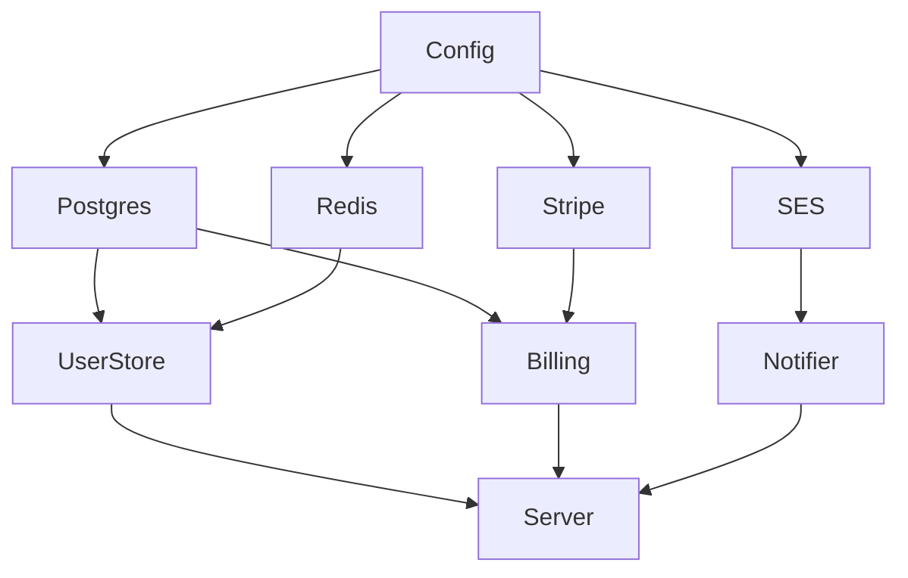
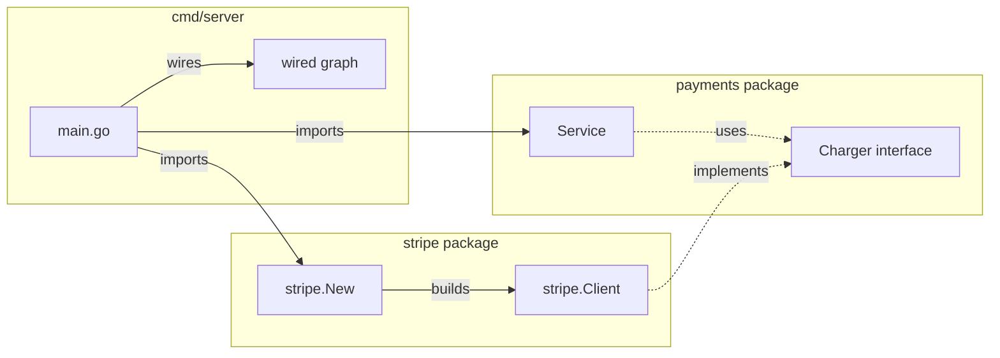
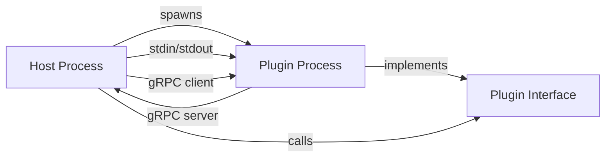
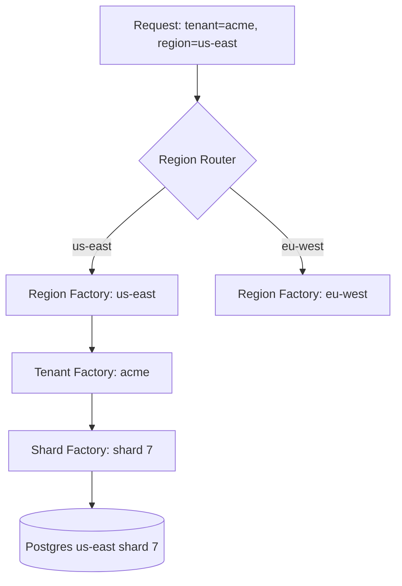

# Factory Pattern — Senior

## 1. What this level covers

Junior taught the shape; middle covered registries, generics, and lifecycle. Senior is about *architecture*:

- Factories as the seam where dependency injection happens — and the tools (`uber-go/dig`, `google/wire`) that scale that seam.
- Code generation for factory wiring — wire's compile-time DI, why it beats runtime reflection.
- Factory in plugin architectures (`hashicorp/go-plugin`) — out-of-process factories, gRPC handshakes, version negotiation.
- Factory contracts across packages — who owns the interface, who owns the constructor, who owns the registry.
- Hot-reload factories with `atomic.Pointer` — swap implementations under live traffic without locks.
- Factory in distributed systems — per-region, per-tenant, per-shard factories with isolation guarantees.
- API evolution: adding constructor parameters without breaking callers — variadic options, builder bridges, deprecation paths.
- Real ecosystems studied: `database/sql.Open` + driver registration, `image.Decode` + `RegisterFormat`, `http.RoundTripper`, `log/slog` handlers.
- Anti-patterns that show up only at scale: god factories, ambient registries, factory soup.
- Concurrency in registration — init-time vs runtime registration, the `sync.Map` debate.
- Performance considerations — the real cost of one indirection.
- Postmortems — real outages traced to factory mistakes.
- Cross-language: how Spring, Guice, Dagger, and Rust's `Default` compare.

The decisions at this level are usually irreversible. A bad factory API at v1 ossifies into infrastructure. A bad DI strategy at week one ossifies into Wednesday firefights at year three.

---

## 2. Table of Contents

1. [What this level covers](#1-what-this-level-covers)
2. [Table of Contents](#2-table-of-contents)
3. [Factory as the DI seam](#3-factory-as-the-di-seam)
4. [DI containers: uber-go/dig](#4-di-containers-uber-godig)
5. [Code-generated DI: google/wire](#5-code-generated-di-googlewire)
6. [Factory contracts across packages](#6-factory-contracts-across-packages)
7. [Factory in plugin architectures](#7-factory-in-plugin-architectures)
8. [Hot-reload factories with atomic.Pointer](#8-hot-reload-factories-with-atomicpointer)
9. [Factory in distributed systems: per-region, per-tenant](#9-factory-in-distributed-systems-per-region-per-tenant)
10. [API evolution: adding constructor parameters](#10-api-evolution-adding-constructor-parameters)
11. [Real ecosystem: database/sql.Open + drivers](#11-real-ecosystem-databasesqlopen--drivers)
12. [Real ecosystem: image.Decode + RegisterFormat](#12-real-ecosystem-imagedecode--registerformat)
13. [Real ecosystem: http.RoundTripper construction](#13-real-ecosystem-httproundtripper-construction)
14. [Real ecosystem: slog handlers](#14-real-ecosystem-slog-handlers)
15. [Concurrency in registration](#15-concurrency-in-registration)
16. [Performance considerations](#16-performance-considerations)
17. [Anti-patterns at scale](#17-anti-patterns-at-scale)
18. [Postmortems](#18-postmortems)
19. [Cross-language comparison](#19-cross-language-comparison)
20. [Common senior mistakes](#20-common-senior-mistakes)
21. [Tricky questions](#21-tricky-questions)
22. [Cheat sheet](#22-cheat-sheet)
23. [Further reading](#23-further-reading)

---

## 3. Factory as the DI seam

Every non-trivial Go service has a *composition root* — usually `main.go` or `cmd/server/wire.go` — where concrete dependencies are constructed and wired into abstractions. Factories *are* that wiring code:

```go
func main() {
    cfg := config.Load()

    db, err := postgres.New(cfg.PG)          // factory
    if err != nil { log.Fatal(err) }
    defer db.Close()

    cache := redis.New(cfg.Redis)            // factory
    defer cache.Close()

    users := userstore.New(db, cache)        // factory
    billing := billing.New(cfg.Stripe, db)   // factory
    notifier := mail.New(cfg.SES)            // factory

    srv := http.NewServer(users, billing, notifier) // factory
    srv.Listen(cfg.Addr)
}
```

This is *manual DI*. Each factory takes its dependencies as parameters, returns a configured object. The composition root threads them together. No framework, no reflection, no magic — just functions calling functions.

For services with 20-30 dependencies, manual DI scales. For services with 200, the composition root becomes a 600-line block of construction. The dependency graph is *implicit* in the order of construction. Adding a new dependency means finding the right place in the topological order and not breaking anything else.



When the graph has 200 nodes and 600 edges, you have three options:

1. **Live with manual wiring.** Discipline keeps it readable; teams of 5+ struggle.
2. **Runtime DI container** — `uber-go/dig`. The graph is built at runtime via reflection.
3. **Compile-time DI** — `google/wire`. The graph is built at code-generation time, output is plain Go.

Sections 4 and 5 cover the two non-manual approaches. They are *the* architectural decision for any large Go service.

---

## 4. DI containers: uber-go/dig

`uber-go/dig` is Uber's reflection-based DI container. You register *providers* (factories), then ask for a built object; dig resolves the graph at runtime.

```go
import "go.uber.org/dig"

c := dig.New()

c.Provide(config.Load)            // func() *Config
c.Provide(postgres.New)           // func(*Config) (*sql.DB, error)
c.Provide(redis.New)              // func(*Config) *redis.Client
c.Provide(userstore.New)          // func(*sql.DB, *redis.Client) *UserStore
c.Provide(billing.New)            // func(*Config, *sql.DB) *Billing
c.Provide(mail.New)               // func(*Config) *Mailer
c.Provide(http.NewServer)         // func(*UserStore, *Billing, *Mailer) *Server

err := c.Invoke(func(s *Server) error {
    return s.Listen(":8080")
})
```

Each `Provide` registers a factory keyed by its *return type*. `Invoke` looks at its parameter types, finds matching providers, recursively resolves their dependencies, and calls everything in topological order.

### 4.1 What dig gives you

- **Graph resolution.** You don't write the wiring; the container does. Adding a new provider is one line.
- **Detection of cycles.** Dig refuses to build a graph with a cycle (compile-time-ish error: it fails at `Invoke`).
- **Detection of missing deps.** If `UserStore` needs `*sql.DB` and no one provides it, `Invoke` returns an error naming the missing type.
- **Single instance per type by default.** `Provide` creates a singleton — every consumer of `*sql.DB` gets the same `*sql.DB`. Use `dig.Group` or `dig.Name` for multi-instance.

### 4.2 What dig costs you

- **Runtime errors.** Missing providers and cycles surface at `Invoke`, not at `go build`. CI catches them only if you have a test that invokes the full graph.
- **Reflection cost.** Resolving the graph requires walking parameter types via `reflect`. For 200 providers, ~5-50ms at startup. Negligible for long-running servers, painful for CLI tools that should start in <100ms.
- **Type-keyed providers are fragile.** If two providers return the same type (`*sql.DB` for primary and replica), dig refuses to register both. You must use `dig.Name("primary")` to disambiguate — and consumers must declare names in struct tags. Easy to mistype, hard to refactor.
- **Errors are stringly typed.** A typo in a `dig.Name` tag fails at runtime with a string-comparison message. No compile check.

### 4.3 Group providers

For "many things implementing the same interface" (handler registry, middleware chain), dig groups:

```go
type Handler interface { Handle(*http.Request) (*http.Response, error) }

c.Provide(NewUserHandler, dig.Group("handlers"))
c.Provide(NewBillingHandler, dig.Group("handlers"))
c.Provide(NewAdminHandler, dig.Group("handlers"))

c.Invoke(func(in struct {
    dig.In
    Handlers []Handler `group:"handlers"`
}) {
    router := mux.New()
    for _, h := range in.Handlers {
        router.Register(h)
    }
})
```

This is a factory *family* expressed declaratively. Each `Provide` adds to the group; the consumer gets the whole slice. Cleaner than maintaining a manual slice and remembering to append.

### 4.4 When dig is right

- **Large services** (>50 providers) where the manual composition root is becoming unreadable.
- **Teams with rotating membership** — new joiners can add a provider without understanding the entire graph.
- **Servers**, not CLIs (startup cost is fine for daemons, painful for short-lived processes).

### 4.5 When dig is wrong

- **Small services.** A 20-line composition root reads better than `dig.New()` + 20 `Provide` calls.
- **Teams that don't lint the dig graph in CI.** Without a test that calls `Invoke` against the full graph, missing providers leak to production startup.
- **Tools requiring fast cold start.** Reflection is not free.

---

## 5. Code-generated DI: google/wire

`google/wire` (Google-internal then OSS) generates the composition root as plain Go code at build time. You declare the graph in a `wire.go` file; `wire` generates `wire_gen.go` with manual-DI code.

```go
//go:build wireinject

package main

import "github.com/google/wire"

func InitializeServer(cfg *Config) (*Server, error) {
    wire.Build(
        postgres.New,
        redis.New,
        userstore.New,
        billing.New,
        mail.New,
        http.NewServer,
    )
    return nil, nil
}
```

`wire` reads this file, walks the dependency graph based on parameter types, and emits:

```go
// wire_gen.go (generated)
package main

func InitializeServer(cfg *Config) (*Server, error) {
    db, err := postgres.New(cfg)
    if err != nil { return nil, err }
    cache := redis.New(cfg)
    users := userstore.New(db, cache)
    billing := billing.New(cfg, db)
    mailer := mail.New(cfg)
    server := http.NewServer(users, billing, mailer)
    return server, nil
}
```

That's it. The output is the same manual DI you'd write by hand — but maintained by a code generator.

### 5.1 What wire gives you

- **Compile-time graph check.** Missing provider? `go generate` fails with a clear message naming the type. Wire failures cannot reach production.
- **Zero runtime cost.** The generated code is plain function calls. No reflection. Identical performance to handwritten DI.
- **Readable output.** The generated file is checked in; reviewers see exactly what runs. Stack traces point at real factory code, not a reflection trampoline.
- **No framework dependency at runtime.** `wire` is a build-time tool; your binary doesn't import it.

### 5.2 What wire costs you

- **Two-file workflow.** Every change to the graph needs `go generate ./...`. Forgetting to regenerate is a common bug — the build still compiles, but with the old graph.
- **Provider sets.** Grouping providers into reusable bundles (`wire.NewSet(...)`) is verbose. For 5 providers, easy; for 200, you write a lot of sets.
- **Limited dynamic resolution.** Wire can't pick a provider based on runtime data (e.g., "use Postgres in prod, SQLite in dev"). You handle that with separate `InitializeServer` functions per build tag.
- **Generics support is patchy.** As of 2026, wire's generics handling is limited; complex generic factories may not resolve.

### 5.3 Wire vs dig — the matrix

| Aspect | dig | wire |
|--------|-----|------|
| Error detection | Runtime (at `Invoke`) | Compile time (at `go generate`) |
| Resolution mechanism | Reflection | Code generation |
| Startup cost | 5-50ms reflection scan | Zero |
| Runtime dependency | Yes (`go.uber.org/dig`) | No |
| Dynamic graphs (config-driven) | Easy | Hard; needs multiple init funcs |
| Onboarding | Read 1 doc, write `Provide` calls | Read 1 doc + run code gen |
| Best for | Servers with dynamic configs | Servers with static graphs |
| Stack trace quality | Indirect (through dig internals) | Direct (looks like handwritten) |
| IDE support | Limited (types via reflection) | Full (generated code is plain Go) |

The Go community has consolidated around **wire for new projects** and **dig for legacy or dynamic graphs**. If you're starting a service in 2026 and the graph is mostly static, wire is the default. If your graph mutates based on config at startup (multi-tenant SaaS with N tenants), dig handles that without code-gen.

### 5.4 The "no framework" third option

For services <50 providers, neither tool. Just write the composition root as plain Go. The discipline of *not* using a DI framework keeps the graph small. When your `main.go` hits 800 lines, you've earned wire.

---

## 6. Factory contracts across packages

A factory is a *contract* between three roles:

| Role | Owns | Example |
|------|------|---------|
| Consumer | The interface | `package payments` defines `type Charger interface { Charge(...) error }` |
| Provider | The implementation | `package stripe` implements `Charger` |
| Wirer | The constructor call | `cmd/server/main.go` calls `stripe.New(cfg)` and passes the result to `payments.Service` |

Each role has rules.

### 6.1 The consumer's rules

- Declare *interfaces*, not concrete types, in your package's API.
- Don't declare the factory function; let the provider package own it.
- Don't import the provider package — that creates a back-dependency.
- Accept the interface in your constructor: `func New(c Charger) *Service`.

### 6.2 The provider's rules

- Implement the consumer's interface.
- Provide a constructor: `func New(cfg Config) (*StripeClient, error)`.
- Return a *concrete pointer*, not an interface. The consumer will accept it via interface parameter — Go's structural typing makes this work.
- Document required configuration up-front (struct tags, validation, fail-fast in the constructor for bad config but not for I/O).

### 6.3 The wirer's rules

- Live in `main` or `cmd/`.
- Import everything; this is the *only* place that should know about both `package payments` and `package stripe`.
- Construct in topological order. Tools (wire, dig) automate this; manual code does it by hand.
- Defer cleanup. Every factory that returns a closeable should be paired with `defer x.Close()` in the same function.

### 6.4 Diagram



The arrows of dependency point *inward*: provider depends on consumer (to implement the interface), wirer depends on both. The consumer depends on neither. This is the Dependency Inversion Principle, applied at the package level.

### 6.5 What breaks the contract

Three common violations:

1. **Consumer imports provider.** `package payments` imports `stripe` for "convenience". Now `payments` can't be unit-tested without Stripe, and swapping to PayPal touches `payments`.
2. **Provider exposes its concrete type as the API.** `func New() *StripeClient` is fine; `var Default *StripeClient = New()` exposed at package level forces consumers to type-assert.
3. **Wirer leaks into the rest of the code.** If `dig.Container` or `wire.Set` references appear in `package payments`, the framework has leaked. Keep DI tooling at the edge.

---

## 7. Factory in plugin architectures

Plugins are factories with *extreme* indirection: the implementation lives in a separate binary, communicates over RPC, and can be loaded/unloaded at runtime. HashiCorp's `go-plugin` library is the canonical Go implementation.

### 7.1 The architecture



The host spawns the plugin as a subprocess. The plugin starts a local gRPC server. Host and plugin negotiate a protocol over stdout, then communicate via gRPC for the rest of their lives. The factory step is *finding and spawning* the plugin.

### 7.2 Host-side factory

```go
import "github.com/hashicorp/go-plugin"

client := plugin.NewClient(&plugin.ClientConfig{
    HandshakeConfig: handshake,
    Plugins:         pluginMap,
    Cmd:             exec.Command("./plugins/auth-plugin"),
    AllowedProtocols: []plugin.Protocol{plugin.ProtocolGRPC},
})
defer client.Kill()

rpcClient, err := client.Client()
if err != nil { return err }

raw, err := rpcClient.Dispense("auth")
if err != nil { return err }

authPlugin := raw.(AuthPlugin) // type assertion to known interface
result, err := authPlugin.Authenticate(ctx, token)
```

This is a *factory chain*:

1. `plugin.NewClient` — factory for the plugin process supervisor.
2. `client.Client()` — factory for the gRPC connection.
3. `rpcClient.Dispense("auth")` — factory for the plugin proxy object.

Each step is a real factory and can fail with its own error semantics. Production code wraps the whole chain in a single typed function.

### 7.3 Version negotiation

Plugins must agree on a *protocol version*. The handshake config encodes it:

```go
var handshake = plugin.HandshakeConfig{
    ProtocolVersion:  2,
    MagicCookieKey:   "AUTH_PLUGIN",
    MagicCookieValue: "v2-2026",
}
```

Host with `ProtocolVersion: 2` refuses to talk to a plugin built with `ProtocolVersion: 1`. The factory step fails immediately if versions mismatch — far better than silent corruption from incompatible RPCs.

For *multi-version* support (host can talk to v1 or v2 plugins), use `VersionedPlugins`:

```go
VersionedPlugins: map[int]plugin.PluginSet{
    1: { "auth": &AuthPluginV1{} },
    2: { "auth": &AuthPluginV2{} },
},
```

The factory dispatches based on the plugin's declared version.

### 7.4 Why use plugins at all

Use cases:

- **Vault** uses go-plugin for backends (auth methods, secret engines). New backends ship without recompiling the core.
- **Terraform** uses go-plugin for providers (AWS, GCP, Cloudflare). Provider lifecycle is independent of Terraform's.
- **Packer**, **Consul**, **Nomad** all use it.

The factory pattern's role: a single interface (`AuthPlugin`) with N implementations, where N changes at deploy time, not compile time.

### 7.5 The costs

- **Process overhead.** Each plugin is a process. 50ms-200ms to spawn. 5-20MB resident memory per plugin.
- **Serialisation cost.** Every call crosses process boundary via gRPC. Tens of microseconds per call vs nanoseconds in-process.
- **Crash isolation works both ways.** A plugin crash doesn't kill the host (good). A host crash leaves orphan plugin processes (cleanup needed).
- **Debug story is painful.** You're debugging two processes that communicate via gRPC. `delve` can attach to either; getting both is work.

Plugins are the right factory when the value of *deploy-time extensibility* outweighs the cost of *cross-process indirection*. Vault, Terraform — yes. A web service's payment provider — no.

---

## 8. Hot-reload factories with atomic.Pointer

A *hot-reload factory* lets you swap the constructed object under live traffic without restarting the process or holding locks. The classic implementations: feature flag clients, config-driven HTTP clients, dynamically-reconfigured TLS certificates.

The mechanism: `atomic.Pointer[T]`. One pointer, swapped atomically. Readers never block.

### 8.1 The pattern

```go
type HotClient struct {
    inner atomic.Pointer[Client]
}

func NewHotClient(initial *Client) *HotClient {
    hc := &HotClient{}
    hc.inner.Store(initial)
    return hc
}

func (h *HotClient) Get() *Client {
    return h.inner.Load()
}

func (h *HotClient) Swap(newClient *Client) {
    h.inner.Store(newClient)
}
```

Readers call `Get()` — one atomic load (~1ns on amd64). Writers call `Swap()` — one atomic store. No mutex, no contention.

### 8.2 The reload loop

```go
func (h *HotClient) WatchConfig(ctx context.Context, ch <-chan Config) {
    for {
        select {
        case <-ctx.Done():
            return
        case cfg := <-ch:
            newClient, err := buildClient(cfg)
            if err != nil {
                slog.Error("hot-reload failed", "err", err)
                continue  // keep the old client
            }
            old := h.inner.Swap(newClient)
            go drainAndClose(old)
        }
    }
}

func drainAndClose(c *Client) {
    time.Sleep(30 * time.Second) // grace period for in-flight requests
    c.Close()
}
```

Three subtleties:

1. **Build before swap.** If `buildClient` fails, the old client keeps serving. No transient nil pointer.
2. **Drain before close.** In-flight calls hold a reference to the old client. Closing immediately would race with them. Sleep long enough for the worst-case request to finish, then close.
3. **Don't reset the pointer to nil.** Always swap to a *valid* client. Code reading `h.Get()` should never see nil.

### 8.3 When this beats sync.RWMutex

Reader-writer lock alternative:

```go
type Locked struct {
    mu     sync.RWMutex
    client *Client
}

func (l *Locked) Get() *Client {
    l.mu.RLock()
    defer l.mu.RUnlock()
    return l.client
}
```

Each `Get` takes `RLock`/`RUnlock`. Under high read contention, the lock's internal atomic ops become the bottleneck — ~20-50ns per call vs ~1ns for `atomic.Pointer.Load`.

Numbers:

```
BenchmarkAtomicPointer-12     1000000000   1.1 ns/op   0 B/op
BenchmarkRWMutex-12            500000000   3.4 ns/op   0 B/op
BenchmarkRWMutexContended-12    50000000  28.9 ns/op   0 B/op  # 16 goroutines
```

For *anything* that's read on the hot path and rarely written, `atomic.Pointer` is the right tool.

### 8.4 The tradeoffs

- **Memory cost.** The old pointer stays live until the grace period. Each swap holds two clients briefly. Fine for typical pointer-sized objects.
- **Reference identity is not preserved.** `h.Get()` returns a different `*Client` after a swap. Code that caches the pointer (`c := h.Get(); ... use c repeatedly ...`) keeps using the old one for the duration of the cache. Usually fine — the in-flight request finishes with old config, the next request gets new config.
- **No transactional swap.** If you need "swap A and B together", you need a struct holding both, swapped as one pointer:

  ```go
  type Pair struct { A *AClient; B *BClient }
  var pair atomic.Pointer[Pair]
  ```

  One atomic swap, both updated. This generalises: any group of related state can be a struct swapped atomically.

### 8.5 Real-world uses

- **`golang.org/x/sync/atomic`** docs reference this pattern.
- **`tls.Config.GetCertificate`** uses an atomically-swapped certificate behind the scenes in many production servers (Caddy, Traefik) for ACME renewals.
- **OpenTelemetry's MeterProvider** swaps registered instruments atomically.
- **prometheus-go's** registry uses atomic operations to allow metric registration under live traffic.

The pattern's name in distributed systems is *copy-on-write reload*. Build the new state, swap the pointer, release the old. No reader ever waits.

---

## 9. Factory in distributed systems: per-region, per-tenant

In a single-process service, you have one factory per dependency. In a distributed multi-tenant service, you often need *N* per dependency — one per region, one per tenant, one per shard.

### 9.1 The per-region factory

```go
type RegionalClients struct {
    mu      sync.RWMutex
    clients map[string]*Client
}

func (r *RegionalClients) Get(region string) (*Client, error) {
    r.mu.RLock()
    c, ok := r.clients[region]
    r.mu.RUnlock()
    if ok {
        return c, nil
    }

    r.mu.Lock()
    defer r.mu.Unlock()
    if c, ok := r.clients[region]; ok {
        return c, nil // double-check after locking
    }

    c, err := buildForRegion(region)
    if err != nil {
        return nil, err
    }
    r.clients[region] = c
    return c, nil
}
```

This is a *lazy* per-region factory. First call for a region constructs; subsequent calls return cached. Double-checked locking handles the race between two goroutines first-calling the same region.

Better with `sync.Map` for high-cardinality keys or `singleflight` to deduplicate concurrent construction:

```go
import "golang.org/x/sync/singleflight"

type RegionalClients struct {
    clients sync.Map        // map[string]*Client
    sf      singleflight.Group
}

func (r *RegionalClients) Get(region string) (*Client, error) {
    if c, ok := r.clients.Load(region); ok {
        return c.(*Client), nil
    }
    v, err, _ := r.sf.Do(region, func() (interface{}, error) {
        // build once even under concurrent first-calls
        c, err := buildForRegion(region)
        if err != nil { return nil, err }
        r.clients.Store(region, c)
        return c, nil
    })
    if err != nil { return nil, err }
    return v.(*Client), nil
}
```

`singleflight` collapses concurrent construction of the same region into one build. Without it, ten goroutines first-calling `Get("us-east")` would do ten builds (potentially expensive — connection pool, TLS handshake, region warmup).

### 9.2 The per-tenant factory

Same shape, but the cardinality may be 10,000+ tenants. Two new concerns:

- **Memory.** Cached clients pin tenant connection pools, TLS sessions, etc. 10,000 tenants × 5MB = 50GB. Add eviction (LRU) or use shared backends with per-tenant credentials.
- **Lifecycle.** When a tenant is deleted, you must clear the cache entry and `Close()` its client. Otherwise leaks accumulate.

```go
type TenantFactory struct {
    lru *lru.Cache[string, *TenantClient] // bounded
}

func (f *TenantFactory) Get(tenantID string) (*TenantClient, error) {
    if c, ok := f.lru.Get(tenantID); ok {
        return c, nil
    }
    c, err := buildForTenant(tenantID)
    if err != nil { return nil, err }
    if old, evicted := f.lru.AddWithEviction(tenantID, c); evicted {
        go old.Close() // cleanup evicted entry
    }
    return c, nil
}
```

### 9.3 The per-shard factory

```go
type ShardedDB struct {
    shards [N]*sql.DB
}

func New(cfgs [N]ShardCfg) (*ShardedDB, error) {
    s := &ShardedDB{}
    for i, cfg := range cfgs {
        db, err := sql.Open("postgres", cfg.DSN)
        if err != nil { return nil, fmt.Errorf("shard %d: %w", i, err) }
        s.shards[i] = db
    }
    return s, nil
}

func (s *ShardedDB) ForKey(key string) *sql.DB {
    h := fnv.New32()
    h.Write([]byte(key))
    return s.shards[h.Sum32()%N]
}
```

The factory builds N clients up front. `ForKey` routes by hash. This is *eager* per-shard construction — appropriate when N is small (8-64) and all shards are always live.

### 9.4 Distribution-level architecture



Each layer is its own factory. The composition: routing then caching then construction. Each layer has its own concurrency model (sync.Map, singleflight, sync.RWMutex). Each layer's cache has its own eviction policy.

### 9.5 Failure isolation across factories

If a region goes down, the per-region factory for that region returns errors. The per-region factory for *other* regions keeps working. This is the *bulkhead* — failures are isolated to one factory cell.

A common bug: a single shared mutex across all regions. One slow region's factory holds the lock; all other regions block. Fix: lock-per-region, or `atomic.Pointer` per region (§8), or sharded locks.

---

## 10. API evolution: adding constructor parameters

A factory signature is a *contract*. Every consumer call site references it. Changing the signature breaks every call site at the source level.

### 10.1 The breakage

```go
// v1.0
func New(addr string) (*Client, error)

// v1.1 — needs timeout
func New(addr string, timeout time.Duration) (*Client, error)
```

Every call site updates. For an internal library with 5 callers, fine. For an open-source library with 1000 downstream users, this is a *major version bump*.

### 10.2 Solution 1: variadic options (the standard answer)

```go
// v1.0
func New(addr string, opts ...Option) (*Client, error)

type Option func(*config)
func WithTimeout(d time.Duration) Option { return func(c *config) { c.timeout = d } }
```

Adding `WithTimeout` is *additive*. Existing call sites compile unchanged. New call sites pass the option. This is functional options — see Pattern 01.

The factory keeps the same signature forever. The option set grows. Backwards compatibility is preserved.

### 10.3 Solution 2: Config struct

```go
type Config struct {
    Addr    string
    Timeout time.Duration  // added in v1.1
}

func New(cfg Config) (*Client, error)
```

Adding fields to `Config` is additive — old callers pass `Config{Addr: x}`, new fields default to zero. Easier than options for *many* required parameters; clunkier when there's one required + many optional.

### 10.4 Solution 3: Builder

```go
b := NewBuilder().Addr("...").Timeout(5*time.Second)
c, err := b.Build()
```

Adding builder methods is additive. Good when construction has many optional fields and validation logic. See Pattern 02.

### 10.5 Solution 4: New constructor variant

```go
func New(addr string) (*Client, error)            // v1.0, kept
func NewWithTimeout(addr string, t time.Duration) (*Client, error)  // v1.1
```

Acceptable for one or two extensions. Beyond that, you get `NewWithTimeoutAndRetry`, `NewWithTimeoutAndRetryAndAuth` — combinatorial explosion.

### 10.6 Solution 5: Deprecation cycle

When you *must* change the signature (a refactor demands it):

```go
// v1.5 (deprecated, will be removed in v2)
//
// Deprecated: use NewV2(Config) instead.
func New(addr string) (*Client, error) { return NewV2(Config{Addr: addr}) }

func NewV2(cfg Config) (*Client, error) { /* real impl */ }
```

Phase 1: introduce `NewV2`, deprecate `New`. Callers see a `// Deprecated:` warning (golangci-lint catches it). Phase 2 (v2.0): remove `New`. Phase 3 (v2.x): rename `NewV2` back to `New` if you want — but probably not, the noise of `V2` is fine.

### 10.7 The strictness matrix

| Strategy | Required params | Optional params | Add-without-break? | Compile error on misuse? |
|----------|----------------|-----------------|--------------------|--------------------------|
| Variadic options | 1-2 positional | Many | Yes | Weak (zero value is silent default) |
| Config struct | 0-many fields | 0-many fields | Yes (additive fields) | Weak (missing field = zero) |
| Builder | 1+ via methods | Many | Yes | Strong (Build() returns error) |
| New variant | Any | Any | Yes (new function) | Strong (compile error on signature mismatch) |
| Signature change | Any | Any | No | Strong (compile breakage) |

The default for evolving APIs in Go: **variadic options + Config struct**. Required parameters as positional args; everything else as options. The constructor never breaks.

### 10.8 Optional interface for capability evolution

When you need to add a *capability* (not just config), use an optional interface (Adapter §4.1, §6.2 in `database/sql`):

```go
type Closer interface { Close() error }
type ClosableClient interface { Client; Closer }  // optional

c := New(...)
if cc, ok := c.(ClosableClient); ok {
    defer cc.Close()
}
```

Old factories return `*Client`; new factories return `*ClientV2` which also implements `Closer`. Consumers type-assert. Adoption is gradual.

---

## 11. Real ecosystem: database/sql.Open + drivers

`database/sql` is the canonical *registry-based factory* in the Go stdlib. Every Go developer has touched it. Studying its design is essential.

### 11.1 The architecture

```go
// in package database/sql/driver
type Driver interface {
    Open(name string) (Conn, error)
}

// in package database/sql
var (
    driversMu sync.RWMutex
    drivers   = make(map[string]driver.Driver)
)

func Register(name string, driver driver.Driver) {
    driversMu.Lock()
    defer driversMu.Unlock()
    if driver == nil { panic("sql: Register driver is nil") }
    if _, dup := drivers[name]; dup {
        panic("sql: Register called twice for driver " + name)
    }
    drivers[name] = driver
}

func Open(driverName, dataSourceName string) (*DB, error) {
    driversMu.RLock()
    driveri, ok := drivers[driverName]
    driversMu.RUnlock()
    if !ok {
        return nil, fmt.Errorf("sql: unknown driver %q (forgotten import?)", driverName)
    }
    // ... build *DB wrapping driveri.Open(dataSourceName)
}
```

The whole `database/sql` package depends on the interface `driver.Driver`, not on any specific driver. Drivers self-register via `init()`:

```go
// in github.com/lib/pq
func init() {
    sql.Register("postgres", &Driver{})
}

// consumer:
import _ "github.com/lib/pq"  // blank import triggers init
db, err := sql.Open("postgres", "...")
```

### 11.2 Why this is the gold standard

- **Open/Closed.** Adding a new database means writing a driver and registering it. Zero changes to `database/sql`.
- **Decoupling.** `database/sql` doesn't import any driver. Drivers don't import each other. The user's `main.go` imports both.
- **Discoverability.** `sql.Drivers()` lists registered drivers. Useful for diagnostics ("did pq's init run?").
- **Failure mode is good.** Forget the blank import? You get a clear error: "unknown driver".
- **Versioning is backwards-compatible.** New driver capabilities (context, named args, multi-result) are *optional interfaces* (`driver.ConnPrepareContext`, `driver.QueryerContext`). Old drivers keep working. See Adapter senior §6.2.

### 11.3 Lessons for your own registries

If you're building a registry-based factory in your codebase, copy the design:

1. **Interface in the registry package, implementations in separate packages.**
2. **`Register(name, factory)` keyed by string.**
3. **Self-registration via `init()`** so blank imports activate the implementation.
4. **Lookup function returns a clear error** on miss ("did you forget to import the driver?").
5. **Mutex around the map** — registrations can happen at unpredictable times if implementations are imported indirectly.
6. **Refuse duplicate registration** (panic) — duplicate registrations indicate a bug.
7. **For capability evolution, use optional interfaces.** Never widen the core interface.

### 11.4 What database/sql got wrong (the small list)

- **`Open` is misleadingly named.** It doesn't actually open a connection — it builds a `*sql.DB` that connects lazily on first query. Beginners pinging right after `Open` and getting success think the DB is up; the real failure happens later. The fix would be a separate `Connect(ctx)` method (added in Go 1.8 as `OpenDB` + `PingContext`, but `Open` still exists for compatibility).
- **Driver names are strings.** A typo gives a runtime error. A typed `sql.Postgres()` would be safer. Constrained by the registry model.
- **No type safety on driver value types.** `driver.Value` is `interface{}` (now `any`). Type assertions everywhere. Hard to evolve.

These are the costs of a *string-keyed* registry. For a small ecosystem, accept them. For a large one, consider type parameters.

---

## 12. Real ecosystem: image.Decode + RegisterFormat

The `image` package uses the same pattern as `database/sql`, but with a twist: detection is *content-based*, not name-based.

```go
// in image package
type format struct {
    name, magic  string
    decode       func(io.Reader) (Image, error)
    decodeConfig func(io.Reader) (Config, error)
}

var (
    formatsMu sync.Mutex
    formats   atomic.Value // []format
)

func RegisterFormat(name, magic string, decode func(io.Reader) (Image, error), decodeConfig func(io.Reader) (Config, error)) {
    formatsMu.Lock()
    defer formatsMu.Unlock()
    fs, _ := formats.Load().([]format)
    formats.Store(append(fs, format{name, magic, decode, decodeConfig}))
}

func Decode(r io.Reader) (Image, string, error) {
    rr := asReader(r)
    f := sniff(rr)
    if f.decode == nil {
        return nil, "", ErrFormat
    }
    m, err := f.decode(rr)
    return m, f.name, err
}
```

Each format (JPEG, PNG, GIF) registers a *magic byte string* — the file's leading bytes. `Decode` sniffs the reader, picks the format whose magic matches, calls that format's decoder. The user never names the format.

```go
import _ "image/jpeg"
import _ "image/png"
import _ "image/gif"

img, format, err := image.Decode(file) // format auto-detected
```

### 12.1 Design choices

- **Slice, not map.** Order of registration matters for ambiguous magics (rare). Linear scan over 5-10 formats is faster than map lookup.
- **`atomic.Value` for the slice.** Reads (during `Decode`) are lock-free. Writes (during `init` — registration) take a mutex. The hot path is reads.
- **Magic-based dispatch.** No string name from the user. The format is determined by the data itself.

This is the "content-addressed factory". Useful when the input self-identifies. Other examples:

- **MIME sniffing** in `net/http.DetectContentType`.
- **Decompression libraries** like `archive/zip` (zip's leading signature `PK\x03\x04`).
- **Cryptographic format autodetection** (PEM vs DER).

### 12.2 When content-based beats name-based

| Factor | Content-based | Name-based |
|--------|--------------|------------|
| User specifies format? | No | Yes (driver name string) |
| Robust to wrong names? | Yes (data wins) | No (typo = error) |
| Works with unknown sources? | Yes (sniff anything) | No (must know the name) |
| Cost per call | O(formats) sniff | O(1) map lookup |
| Failure mode | "format not recognised" | "unknown driver" |

For databases, you know the format. For images, you might not. Pick by use case.

---

## 13. Real ecosystem: http.RoundTripper construction

`http.RoundTripper` is a one-method interface (see Adapter senior §7). Its factory ecosystem is *composition-heavy*: real factories wrap other RoundTrippers.

```go
type RoundTripper interface {
    RoundTrip(*Request) (*Response, error)
}

// Factory 1: the real transport
transport := &http.Transport{
    MaxIdleConns:        100,
    IdleConnTimeout:     90 * time.Second,
    TLSHandshakeTimeout: 10 * time.Second,
}

// Factory 2: instrumentation wrap
transport = otelhttp.NewTransport(transport)

// Factory 3: retry wrap
transport = retryablehttp.NewTransport(transport, 3)

// Factory 4: rate limit wrap
transport = ratelimit.NewTransport(transport, 100 /*rps*/)

client := &http.Client{Transport: transport}
```

Each wrap is a factory: takes a `RoundTripper`, returns a `RoundTripper`. The result is a single RoundTripper composed of multiple layers. The factory pattern, applied to a chain.

### 13.1 The wrap-factory contract

A well-behaved wrap factory:

- Takes the inner `RoundTripper` as a parameter (don't construct it inside — that breaks composition).
- Returns a new `RoundTripper`, not a concrete type — so it can be wrapped further.
- Forwards on every method that doesn't need observation.
- Defaults: if the inner is nil, use `http.DefaultTransport`.

```go
func NewRetryTransport(inner http.RoundTripper, maxAttempts int) http.RoundTripper {
    if inner == nil { inner = http.DefaultTransport }
    return &retryTransport{inner: inner, max: maxAttempts}
}
```

### 13.2 Order matters

```go
transport = retryTransport(transport)   // retries propagate up
transport = otelTransport(transport)    // wraps retries -> one span per request
```

vs.

```go
transport = otelTransport(transport)    // first
transport = retryTransport(transport)   // wraps otel -> one span per attempt
```

The two compositions produce *different observability*: spans-per-request vs spans-per-attempt. Both are valid choices. The factory order encodes a semantic decision.

### 13.3 Lesson for your own composable factories

When you build a wrap-factory ecosystem:

- Make wrapping order semantically meaningful and *document it*.
- Provide a typed builder if order matters and is easy to get wrong:

  ```go
  b := NewClientBuilder().
      WithRetries(3).        // applied first
      WithMetrics().         // applied second
      WithTracing().         // applied third
      Build()
  ```

  The builder fixes order so users don't think about it.

---

## 14. Real ecosystem: slog handlers

Go 1.21's `log/slog` is a factory-heavy ecosystem. The library defines `Handler` as the extension point; many handler implementations exist.

```go
type Handler interface {
    Enabled(context.Context, Level) bool
    Handle(context.Context, Record) error
    WithAttrs(attrs []Attr) Handler
    WithGroup(name string) Handler
}
```

Factories:

```go
// Built-in
slog.NewJSONHandler(os.Stdout, nil)
slog.NewTextHandler(os.Stdout, nil)

// Third-party
zaphandler.New(zapLogger)
otelslog.NewHandler(otelLogger)
chiroslog.New(chiHandler)
```

Each factory returns a `Handler`. Users compose them via `slog.New(handler)`.

### 14.1 The fan-out factory pattern

A common need: write the same log to JSON file *and* OpenTelemetry. A *fan-out handler* is a factory that takes multiple handlers and returns one:

```go
type MultiHandler struct{ handlers []slog.Handler }

func NewMulti(hs ...slog.Handler) *MultiHandler {
    return &MultiHandler{handlers: hs}
}

func (m *MultiHandler) Enabled(ctx context.Context, l slog.Level) bool {
    for _, h := range m.handlers {
        if h.Enabled(ctx, l) { return true }
    }
    return false
}

func (m *MultiHandler) Handle(ctx context.Context, r slog.Record) error {
    var errs []error
    for _, h := range m.handlers {
        if err := h.Handle(ctx, r); err != nil { errs = append(errs, err) }
    }
    return errors.Join(errs...)
}

func (m *MultiHandler) WithAttrs(attrs []slog.Attr) slog.Handler {
    next := make([]slog.Handler, len(m.handlers))
    for i, h := range m.handlers { next[i] = h.WithAttrs(attrs) }
    return &MultiHandler{handlers: next}
}

func (m *MultiHandler) WithGroup(name string) slog.Handler {
    next := make([]slog.Handler, len(m.handlers))
    for i, h := range m.handlers { next[i] = h.WithGroup(name) }
    return &MultiHandler{handlers: next}
}
```

The factory's payoff: one `slog.Logger`, multiple sinks. The user writes:

```go
logger := slog.New(NewMulti(
    slog.NewJSONHandler(file, nil),
    otelslog.NewHandler(otelLogger),
))
```

### 14.2 The shape of slog factories

- All return `Handler` (interface), not a concrete type. Wrappers can compose freely.
- Most take `(io.Writer, *Options)` — writer is required, options optional. Variadic options were considered and rejected (slog opted for `*Options` struct for forward-compat).
- Handler builders chain via `WithAttrs` and `WithGroup` — these are *factories on a handler*, returning a new handler. Pure, immutable; the original handler is unchanged.

The `slog` design ("handler factory returns interface; methods return new handlers") is *immutable factory composition*. It's the same pattern you'd use for any functional, composable system.

---

## 15. Concurrency in registration

Registries are *write-rarely, read-often* data structures. The concurrency model matters.

### 15.1 The init-time-only model

```go
var registry = map[string]Factory{
    "json": NewJSONHandler,
    "xml":  NewXMLHandler,
}
```

All entries declared at package init. No runtime registration. No concurrency. Cleanest model when you control all the producers.

### 15.2 The init() registration model

```go
var (
    mu       sync.RWMutex
    registry = map[string]Factory{}
)

func Register(name string, f Factory) {
    mu.Lock()
    defer mu.Unlock()
    if _, dup := registry[name]; dup {
        panic("duplicate: " + name)
    }
    registry[name] = f
}
```

Used by `database/sql`. Registration happens in `init()` of imported packages. After all `init()`s finish, the registry is frozen — no more writes. Reads (during `Open`) take `RLock`.

The mutex is *load-bearing* during init (multiple packages can init in parallel), and *vestigial* after init (writes never happen again). The cost: one RLock/RUnlock per Open call — a few ns. Acceptable.

### 15.3 The atomic.Value frozen-after-init model

```go
var registry atomic.Value // map[string]Factory

func init() {
    registry.Store(map[string]Factory{})
}

func Register(name string, f Factory) {
    cur := registry.Load().(map[string]Factory)
    next := make(map[string]Factory, len(cur)+1)
    for k, v := range cur { next[k] = v }
    next[name] = f
    registry.Store(next)
}

func Lookup(name string) (Factory, bool) {
    f, ok := registry.Load().(map[string]Factory)[name]
    return f, ok
}
```

Lookup is lock-free (one atomic load). Registration copies the whole map — O(N) per registration. Fine if N is small (< 100). The `image` package uses a slice version of this.

### 15.4 The sync.Map model

```go
var registry sync.Map

func Register(name string, f Factory) {
    _, loaded := registry.LoadOrStore(name, f)
    if loaded { panic("duplicate: " + name) }
}

func Lookup(name string) (Factory, bool) {
    v, ok := registry.Load(name)
    if !ok { return nil, false }
    return v.(Factory), true
}
```

`sync.Map` is optimised for *high read concurrency, occasional write*. For a registry that's mostly read after init, regular `map` + `RWMutex` is faster (one atomic op on each read, vs sync.Map's two). Use `sync.Map` only if registrations happen *continuously*, not just at init.

### 15.5 Comparison

| Model | Read cost | Write cost | When to use |
|-------|-----------|-----------|-------------|
| Static map | 1 map lookup | N/A | All producers known at compile time |
| RWMutex + map | RLock + lookup (~5-10ns) | Lock + insert | Standard registry pattern |
| atomic.Value + map | Atomic load + lookup (~2-5ns) | O(N) copy | Frozen-after-init, hot read path |
| sync.Map | Specialised (~5-15ns) | Specialised (~50ns) | Continuous registration |

Default for new code: **RWMutex + map**. Switch to atomic.Value if profiling shows the lock is a bottleneck. Switch to sync.Map only with continuous writes.

---

## 16. Performance considerations

A factory call has overhead beyond a direct constructor. Most of the time it doesn't matter. When it does, here's the breakdown.

### 16.1 The dispatch cost

```
BenchmarkDirect-12              500000000   2.1 ns/op   0 B/op
BenchmarkFactoryFunc-12         400000000   2.5 ns/op   0 B/op
BenchmarkFactoryFromMap-12      200000000   8.3 ns/op   0 B/op
BenchmarkFactoryReturnIface-12  200000000   8.9 ns/op  16 B/op
BenchmarkGenericFactory-12      300000000   3.5 ns/op   0 B/op
```

- **Direct construction:** `&Foo{x: 1}` inlined.
- **Factory function:** one extra call frame. ~0.4ns.
- **Factory from map:** map lookup (~6ns) + funcval call (~1ns).
- **Factory returning interface:** boxing allocates the interface header. 16B per call.
- **Generic factory:** GCShape stencilling avoids dispatch overhead in most cases.

In a hot loop calling factories millions of times per second, the 8-9 ns interface return matters. Outside hot loops, never.

### 16.2 Allocation at the return boundary

```go
func New() *Foo { return &Foo{} }      // *Foo escapes via return -> heap alloc
func NewVal() Foo { return Foo{} }     // value return -> stack copy
```

Returning a pointer almost always heap-allocates. Returning a value copies but stays on the stack. For tiny structs (<64 bytes), value returns are faster. For larger, pointers win.

If a factory is called millions of times and the constructed object is small and short-lived, consider returning a value.

### 16.3 sync.Pool for factories of expensive objects

If a factory builds an expensive object that's used briefly and discarded:

```go
var bufPool = sync.Pool{
    New: func() interface{} { return new(bytes.Buffer) },
}

func GetBuffer() *bytes.Buffer {
    buf := bufPool.Get().(*bytes.Buffer)
    buf.Reset()
    return buf
}

func PutBuffer(buf *bytes.Buffer) {
    bufPool.Put(buf)
}
```

`sync.Pool` is a *recycling factory*. `Get` returns a pooled or freshly-constructed object; `Put` returns it. Reduces allocation pressure. See `bytes.Buffer` ecosystems and `encoding/json` decoders.

### 16.4 PGO devirtualization

Go 1.21+ profile-guided optimization can devirtualize hot factory call sites. If profile data shows `factory["json"]` is always `NewJSONHandler`, the compiler inlines `NewJSONHandler` at the call site, eliminating the map lookup *and* the interface dispatch.

For a long-running production service with stable factory patterns, PGO can claw back most of the factory cost. Collect a `cpu.pprof` from prod; rebuild with `go build -pgo=cpu.pprof`. Numbers improve.

### 16.5 The "interface in inner loop" trap

```go
for _, x := range items {
    f := getFactory(x.Type)  // map lookup per iteration
    obj := f(x.Args)
    process(obj)
}
```

If `x.Type` is the same for most items, the map lookup is wasted work. Hoist:

```go
factoriesByType := make(map[Type]Factory)
for _, x := range items {
    f, ok := factoriesByType[x.Type]
    if !ok {
        f = getFactory(x.Type)
        factoriesByType[x.Type] = f
    }
    process(f(x.Args))
}
```

Or pre-sort and switch factories at group boundaries. Either way, the cost amortises.

---

## 17. Anti-patterns at scale

### 17.1 The god factory

A single factory builds a `Server` that holds twelve dependencies, each built by a sub-factory hard-coded in the body:

```go
func NewServer(cfg *Config) (*Server, error) {
    db, err := sql.Open("postgres", cfg.DSN)  // hidden
    if err != nil { return nil, err }
    cache := redis.New(cfg.RedisAddr)         // hidden
    mailer := ses.New(cfg.AWSKey)             // hidden
    /* ... eight more ... */
    return &Server{db: db, cache: cache, mailer: mailer, ...}, nil
}
```

Tests can't substitute the database, the cache, or any of the dependencies. Mocking requires patching at the network layer. Every dependency upgrade ripples through the factory.

Fix: invert. Pass dependencies as parameters; let `main.go` build them.

### 17.2 The ambient registry

A package-global registry that's mutated from anywhere:

```go
package metrics
var globalRegistry = NewRegistry()
func Register(name string, m Metric) { globalRegistry.Add(name, m) }
```

Every consumer who imports `metrics` can mutate the registry. Tests share global state. Two tests register the same metric — second panics. Test ordering becomes load-bearing.

Fix: pass the registry as a parameter. Each test creates its own. `main.go` creates one and threads it through.

### 17.3 Factory soup

Five layers of factories, each "for flexibility":

```go
NewFactoryBuilder().WithFactory(NewBuilderFactory()).Build()
```

Each layer claims to add value; in aggregate, they make the call site unreadable. The actual constructor is buried under boilerplate.

Fix: collapse layers. If a factory has only one parameter and only one user, inline it.

### 17.4 The init-time I/O factory

```go
func init() {
    db, err := sql.Open("postgres", os.Getenv("DSN"))
    if err != nil { panic(err) }
    if err := db.Ping(); err != nil { panic(err) }  // network call
    DB = db
}
```

`init` runs at package load. Package load happens during binary startup. If the database is unreachable, the binary panics before `main` runs. CI gets confused, tests can't run, debugging is painful.

Fix: lazy initialisation. `sync.Once`-wrapped factory, called on first use. Or explicit init in `main`, returning errors.

### 17.5 The leaky factory

```go
func New() (*Client, *DB, *Cache, *Mailer, *Tracer, error) {
    /* ... */
}
```

The factory returns five values plus an error. Every caller destructures all five. Adding a sixth requires rewriting every call site.

Fix: bundle into a struct. `func New() (*Deps, error)` returning `*Deps{Client, DB, ...}`. Adding a field doesn't break callers.

### 17.6 The string-keyed factory with no enum

```go
factory["postgress"](cfg)  // typo — runtime error
```

Strings give you no compile help. For a small registry, type the keys:

```go
type DriverName string
const (
    Postgres DriverName = "postgres"
    MySQL    DriverName = "mysql"
)

factory[Postgres](cfg)
```

Typo on `Postgress` won't compile. Names are renamable by IDE. Documentation is centralised.

---

## 18. Postmortems

### 18.1 The init-order outage

A new microservice imported `package metrics`, which had a global registry initialised in `init()`. The registry started a background goroutine that connected to StatsD. `package config` (imported before `metrics`) read environment variables.

In test builds, `config` was tested without `metrics`. In production, importing both triggered a load order where `metrics` ran before `config` was fully initialised. The metrics goroutine read `config.StatsD` while it was still the zero value (empty string). It tried to dial `""`, failed, retried in a tight loop, saturated CPU.

Service deployed Monday morning. By 10 AM CPU was 100% on every pod. Rollback took 40 minutes because the broken binary needed manual investigation.

**Lesson:** `init()` should not do I/O, should not start goroutines, should not depend on other packages' init order. Build *factories* that the user calls explicitly; don't do work at import time.

### 18.2 The duplicate registration crash

A new driver was added to `database/sql` ecosystem under the name "pgx". A separate refactor accidentally also registered "pgx" elsewhere. The second `sql.Register("pgx", ...)` panicked at process start (`database/sql` panics on duplicate).

The duplicate registration was in code that only ran in production (a feature flag). Staging was fine. Production crashed every pod immediately on deploy. The orchestrator (Kubernetes) interpreted the crash loop as a configuration issue and started thrashing. SRE on-call took 90 minutes to identify the cause because the panic was at process startup, before any structured logging was configured.

**Lesson:** registries that panic on duplicate registration are aggressive. The panic is correct (silent overwrite would be worse), but the failure mode at scale is brutal. Two mitigations:

1. **Validate registration in CI.** Have a test that imports every driver package together and verifies no duplicates.
2. **Log registrations at startup** with names. When the panic happens, the log shows what was registered before the conflict.

### 18.3 The hot-reload race

A service had a config-driven feature flag client. The client was rebuilt and swapped via `atomic.Pointer.Store` every 5 minutes when config changed. The build step took ~2 seconds (network calls to LaunchDarkly).

A bug: under heavy load, the build call sometimes timed out (>30s). The reload loop logged the error and skipped. But the loop's retry policy was wrong — on the next 5-minute tick, it would *cancel* the in-flight build and start a new one. The cancelled context propagated to LaunchDarkly's SDK, which panicked on a nil internal state. The panic killed the reload goroutine. Configuration freezes; service degrades.

The bug was found three weeks later when someone noticed the flag changes weren't propagating.

**Lesson:** in a hot-reload factory:

- The reload goroutine is single-threaded; concurrent rebuilds shouldn't be possible by design.
- A failed build should *not* affect the current state. Old state keeps serving.
- The reload goroutine should restart on panic. `recover` at the top of the loop is appropriate here.
- Monitor "time since last successful reload" and alert.

### 18.4 The tenant factory memory leak

A multi-tenant service used a per-tenant factory pattern (§9.2). The factory cached client objects in a `map[TenantID]*Client`, no eviction. New tenants were onboarded weekly.

After 18 months, 4,200 tenants. Each client held a Postgres connection pool (10 connections × ~2MB each) and an HTTP client (mostly idle). Memory: 4,200 × 25MB ≈ 100GB. The service started OOMing.

The map had been written when the team had 50 tenants and growth was slow. By the time it mattered, the assumption was forgotten.

**Lesson:** any *unbounded cache* in a long-running service is a memory leak waiting to happen. Even if growth is slow today, the leak is *latent*. Make the bound explicit at write time:

- LRU with a max size.
- TTL eviction for inactive tenants.
- A metric counting cache size, alerting when it exceeds a threshold.

The metric alone would have surfaced the problem 12 months earlier.

### 18.5 The plugin version skew

A service used `hashicorp/go-plugin` for authentication backends. The host was upgraded to a new auth interface (added a `Refresh` method). The plugins were not upgraded. The host's *runtime version check* passed (both at version 2). The interface contract had changed without bumping the version.

Production: the host called `auth.Refresh(...)` on plugins that didn't implement it. The gRPC client returned "method not found". The host treated that as auth failure. Users couldn't log in.

The rollback was easy (revert host), but the lesson stuck.

**Lesson:** the *protocol version* must bump every time the interface changes. Even adding an optional method is a bump. If the team can't be relied on to remember, automate: a CI check that hashes the interface definition and refuses to build if the version field didn't change.

---

## 19. Cross-language comparison

| Language | Factory mechanism | DI tooling | Notes |
|----------|------------------|------------|-------|
| Java | `static` factory methods, `@Bean` in Spring | Spring, Guice, Dagger | Spring's runtime DI is the dominant model; Dagger is compile-time |
| C# | Static factory methods, `IServiceCollection` builder | Microsoft.Extensions.DependencyInjection | Built into ASP.NET Core; almost universal in .NET |
| Rust | `Default::default()`, `From::from`, builder structs | None standard; some crates (`shaku`) for DI | Compile-time everything; trait-based factories |
| Kotlin | Companion objects' `invoke`, Koin/Hilt DSL | Koin (runtime), Hilt (compile-time), Dagger | DSL-heavy; same patterns as Java with nicer syntax |
| Python | `__init__`, class methods, `@cached_property` | `dependency-injector`, `wired`, FastAPI's DI | Decorator-driven; the standard library has no DI |
| TypeScript | Factory functions, class constructors, `InversifyJS` | InversifyJS, NestJS DI | NestJS popularised Angular-style DI in Node |
| Scala | Implicits, companion-object `apply`, MacWire | MacWire (compile-time), Guice | Macro-driven compile-time DI is mature |
| C++ | Factory functions, `std::make_unique` | None standard; Boost.DI | Manual; templates substitute for some DI use cases |

### 19.1 Compile-time vs runtime DI

The cross-language battle is *compile-time* DI (Dagger, MacWire, wire) vs *runtime* DI (Spring, Guice, dig).

| Aspect | Compile-time | Runtime |
|--------|--------------|---------|
| Error detection | At build | At first invoke |
| Generated code reviewable? | Yes (Dagger, wire) | No |
| Reflection cost | None | 5-100ms scan |
| Dynamic resolution | Hard | Easy |
| Tooling support | Strong (IDE sees real code) | Weak (IDE sees `@Inject`) |
| Magic factor | Low | High |
| Onboarding | Steep (must understand codegen) | Easy ("just annotate") |

Go's preference (`wire`) reflects the language's culture: explicit code, no magic, compile-time checks. Java's preference (Spring) reflects *its* culture: dynamic, configurable, runtime-driven.

### 19.2 What Go doesn't have

- **Annotation-driven DI** (`@Inject`). Go has no runtime annotations.
- **Service locator patterns** at scale (used pejoratively in most Java codebases, but common).
- **Constructor injection via reflection** of arbitrary types (dig is the closest).

What Go *gains* by not having these: shorter compile errors, simpler call stacks, no framework lock-in. What it *loses*: less plug-and-play extensibility, more boilerplate at the composition root.

---

## 20. Common senior mistakes

### 20.1 Treating factories as forever

Factories accumulate. After 5 years, a service has 800 factories. Most are still there because deleting requires care. The cost of factories at scale isn't writing them — it's the *cognitive load* of maintaining 800 of them.

Periodically audit. Any factory whose only caller is `main.go` and whose inner is one line — inline it. Any factory wrapping another factory that wraps another — flatten. Pay maintenance debt explicitly.

### 20.2 Designing for the factory's first user, not future ones

The first consumer of `New(addr string)` only needed `addr`. The second needed `timeout`. The third needed `tls`. The fourth needed `retries`. Each was added as a new positional parameter "for now". By the fifth user, the signature is `New(addr, timeout, tls, retries, headers, auth, opts ...interface{})`.

Imagine the next ten users *before* the factory's signature solidifies. Variadic options (§10.2) keep it open-ended.

### 20.3 Exposing the registry as a public mutable

```go
package drivers
var Registry = map[string]Factory{}
```

Any package can now mutate `Registry` directly. Race conditions during init. Tests can stomp each other. The registry has no invariants left.

Fix: unexport the registry, expose `Register(name, f)` and `Lookup(name)` functions. Encapsulation gives you a place to enforce invariants (no duplicates, no nil factories, type-safe keys).

### 20.4 Factories that perform I/O without context

```go
func New(addr string) (*Client, error) {
    conn, err := net.Dial("tcp", addr) // blocks indefinitely
    if err != nil { return nil, err }
    return &Client{conn: conn}, nil
}
```

The factory has no context. `main.go` calls it during startup; if `addr` is wrong or unreachable, startup hangs forever. Health checks fail. Orchestrator kills the pod.

Fix: accept `context.Context` for all I/O. Caller decides the timeout.

```go
func New(ctx context.Context, addr string) (*Client, error) {
    var d net.Dialer
    conn, err := d.DialContext(ctx, "tcp", addr)
    // ...
}
```

### 20.5 Skipping the compile-time interface check on the factory's return

```go
type Driver interface { Open(...) (Conn, error) }

func NewMyDriver() *MyDriver { return &MyDriver{} }
// no `var _ Driver = (*MyDriver)(nil)`
```

A typo in `MyDriver.Open` method makes it not satisfy `Driver`. Code compiles. First use of `NewMyDriver` as `Driver` gets a confusing error in unrelated code. Pin the contract at the declaration site:

```go
var _ Driver = (*MyDriver)(nil)
```

### 20.6 Conflating Factory with Service Locator

A factory *creates*. A service locator *finds*. They look similar — both are functions that return objects — but their semantics differ:

```go
func New(cfg) *Foo { return &Foo{...} }       // factory: creates
func Lookup(name) *Foo { return registry[name] } // locator: finds

func main() {
    cfg := config.Load()
    foo := New(cfg)        // foo is mine; I own its lifecycle
    bar := Lookup("bar")   // bar is borrowed; someone else owns it
}
```

Mixing them creates confusion: who owns the lifecycle? Who calls `Close`? A senior engineer reading the code can't tell. Document and choose deliberately.

---

## 21. Tricky questions

**Q1.** A consumer of your library calls `factory["postgres"]` and gets nil. They blame your library. The actual cause: they forgot the blank import. How do you make this failure mode less confusing?

<details><summary>Answer</summary>

Three layers of defence:

1. **Lookup returns an error**, not a sentinel value:

   ```go
   func Lookup(name string) (Factory, error) {
       f, ok := registry[name]
       if !ok {
           return nil, fmt.Errorf("driver %q not found; did you forget to import the driver package? (e.g., `import _ \"github.com/lib/pq\"`)", name)
       }
       return f, nil
   }
   ```

2. **List available drivers** in the error message:

   ```go
   return nil, fmt.Errorf("driver %q not found; available: %v", name, registeredNames())
   ```

   The user instantly sees they typed "postgress" instead of "postgres".

3. **A typed enum of known driver names** (for cases where the set is closed):

   ```go
   type DriverName string
   const (
       Postgres DriverName = "postgres"
       MySQL    DriverName = "mysql"
   )
   ```

   Now `factory[Postgres]` won't typo. Doesn't work for open ecosystems where third parties register new names.

`database/sql`'s actual error is helpful: `sql: unknown driver "postgress" (forgotten import?)`. Copy that pattern.
</details>

**Q2.** You're designing a factory for a 50-field configuration object. Some fields are required, most are optional, several are mutually exclusive. Functional options? Builder? Config struct? Something else?

<details><summary>Answer</summary>

50 fields is past the point where any single pattern is clean. Hybrid:

- **Required fields as positional parameters.** `func New(addr string, secret string, opts ...Option)`. Forces the user to pass them; compiler enforces.
- **Optional fields as functional options.** Most additions are additive: `WithTimeout`, `WithRetries`. Each option is small and discoverable.
- **Mutually-exclusive fields via dedicated constructors.** `NewWithTLS(...)` vs `NewInsecure(...)` if TLS-vs-no-TLS is a fundamental choice.
- **Validation in the factory.** After applying all options, validate the resulting config; return an error for invalid combinations.

Builder works if you need *complex* validation logic between fields (every step revalidates). Config struct works if there's no validation — just pure data.

Avoid: variadic options with 50 functions. Documentation explosion. Discoverability fails.

The 50-field case is also a smell — break the config into substructs (`TLSConfig`, `RetryConfig`, `ObservabilityConfig`) and pass each as a separate parameter.
</details>

**Q3.** Your factory returns an interface. A consumer needs a method that's on the concrete type but not the interface. How do you handle it without breaking the abstraction?

<details><summary>Answer</summary>

Four approaches, in increasing order of decoupling:

1. **Add the method to the interface.** If it's broadly useful, widen.
2. **Optional interface.** Define a separate interface for the extra method:

   ```go
   type Closer interface { Close() error }
   if c, ok := obj.(Closer); ok { c.Close() }
   ```

   Implementations that don't support it are gracefully skipped. This is the `database/sql/driver` pattern.

3. **Return a concrete type.** `func New() *MyImpl`. Consumers use the concrete type if they need extras; pass to interface-accepting functions when they don't.

4. **Two factories.** `New() Interface` and `NewConcrete() *Impl`. The concrete one has the extras. Most callers use `New`.

The wrong answer: type-assert to the concrete inside library code. That couples the library to a specific implementation — breaks the abstraction (Adapter senior §10.3).

In practice: option 2 (optional interface) is the most common solution in Go's stdlib. It's also the most flexible — multiple implementations can independently choose whether to support the extra capability.
</details>

**Q4.** You need to load 10 plugins from disk at startup, each ~200ms to initialise. Sequential is 2 seconds. How do you parallelise correctly?

<details><summary>Answer</summary>

```go
g, ctx := errgroup.WithContext(ctx)
results := make([]Plugin, 10)
for i, path := range paths {
    i, path := i, path  // capture
    g.Go(func() error {
        p, err := LoadPlugin(ctx, path)
        if err != nil { return err }
        results[i] = p
        return nil
    })
}
if err := g.Wait(); err != nil {
    // some loaded successfully; close them
    for _, p := range results {
        if p != nil { p.Close() }
    }
    return err
}
return results, nil
```

Key points:

- `errgroup` with `ctx` so if one fails, the others can short-circuit.
- Pre-sized `results` slice indexed by plugin position; no slice append, no lock.
- On error, *close successfully loaded plugins*. Without this, partial load leaks.
- The `ctx` passed to `LoadPlugin` lets cancellation propagate — if plugin 3 fails fast, plugin 9 stops loading.

What goes wrong without `errgroup`:

- Naked `go` and `WaitGroup`: no error propagation.
- No cancellation: a hung plugin (network call inside) blocks startup forever.
- No cleanup on partial failure: handles, file descriptors, goroutines leak.

For 10 plugins, the parallelism cap doesn't matter. For 100+, use `g.SetLimit(n)` to cap concurrent loads.
</details>

**Q5.** Your factory returns a `*Client` that holds a goroutine pool. You're refactoring to a `ClientPool` that holds *N* `*Client`s. The interface changes from `*Client` to `*ClientPool`. How do you roll out without breaking 50 consumers?

<details><summary>Answer</summary>

Multi-phase rollout:

**Phase 1: Introduce ClientPool, keep Client.** `*ClientPool` is a new factory. `*Client` still works exactly as before.

```go
func NewPool(cfg Config) (*ClientPool, error) { /* new */ }
func New(cfg Config) (*Client, error) { /* keep */ }
```

**Phase 2: Refactor `*Client` to be a `*ClientPool` of size 1.** Behavior identical; consumers don't notice.

```go
func New(cfg Config) (*Client, error) {
    p, err := NewPool(cfg.PoolSize(1))
    if err != nil { return nil, err }
    return &Client{pool: p}, nil
}
```

**Phase 3: Mark `*Client` deprecated.**

```go
// Deprecated: use NewPool instead.
func New(cfg Config) (*Client, error) { /* ... */ }
```

CI lints flag callers; consumers migrate over weeks.

**Phase 4 (months later): remove `*Client` in a major version bump.**

The whole rollout takes 2-6 months for a 50-consumer surface. Trying to do it in a single PR fails 80% of the time — someone's consumer breaks, the PR gets reverted.

The alternative — "big bang" rewrite — is sometimes necessary for security or correctness, but plan for an emergency response when consumers break.
</details>

---

## 22. Cheat sheet

| Decision | Choose |
|----------|--------|
| Composition root style | Manual DI <50 deps; wire <500 deps; dig for dynamic graphs |
| Wire vs dig | wire by default; dig only if graph mutates at runtime |
| Adding constructor param | Variadic options; never widen positional args |
| Registry concurrency | RWMutex + map (default); atomic.Value for read-hot; sync.Map only for continuous writes |
| Registry duplicates | Panic (loud failure beats silent overwrite) |
| Self-registration | Always via `init()`; blank-import idiom; document required imports in package docs |
| Factory I/O | Defer to first use; if eager, accept `context.Context` |
| Hot-reload | `atomic.Pointer[T]`; build then swap; drain old before close |
| Per-tenant cache | Bounded LRU + close on eviction |
| Cross-package contract | Consumer owns interface; provider owns concrete + constructor; wirer owns composition |
| Plugins | Use `go-plugin` only when extensibility justifies process overhead |
| Performance | Don't optimise factory dispatch until profile says so; sync.Pool for hot recyclables |
| Constructor returning interface | Avoid; return concrete pointer, let callers narrow via interface params |
| Init-time work | Zero I/O, zero goroutines, zero panics in `init()` |
| Test fakes | Same registry, name like `"memory"` or `"fake"`; contract tests against all impls |

---

## 23. Further reading

- **`database/sql/sql.go`** — the canonical registry-based factory in stdlib. Source dive is worth the hour.
- **`image/format.go`** — content-based factory dispatch via `RegisterFormat`.
- **`log/slog/handler.go`** — modern factory ecosystem with immutable composition.
- **`net/http/transport.go`** — `RoundTripper` wrap-factory chain in production.
- **`github.com/google/wire/_tutorial`** — wire by example. Walk through the four steps; understand the `wire_gen.go` output.
- **`go.uber.org/dig/dig.go`** — read the resolver. Understand reflection-based DI viscerally.
- **`github.com/hashicorp/go-plugin/examples/grpc`** — minimum viable plugin host + plugin. The handshake choreography is subtle.
- **HashiCorp Engineering Blog: "Plugin Architecture in Go"** — the design tradeoffs from the team that's lived with it for a decade.
- **Uber Engineering: "Dependency Injection in Go with dig and fx"** — the practical patterns Uber uses across 4000+ Go services.
- **Sam Boyer, "Wire: Automated Initialization in Go"** — Google's announcement post. Explains why compile-time DI for Go.
- **Dave Cheney, "Constructors and the factory pattern"** — early Go community wisdom, still relevant.
- **Bill Kennedy, "Design Philosophy on Factories"** — opinionated, but the opinions are well-grounded.
- **Martin Fowler, "Inversion of Control Containers and the Dependency Injection pattern"** — the canonical taxonomy of DI styles.
- **Mark Seemann, "Dependency Injection Principles, Practices, and Patterns"** — .NET-flavoured but transferable; the architectural principles outlive any language.

Factory pattern in Go is unglamorous but load-bearing. The architectural decisions you make about *which* factories to publish, *where* the registry lives, and *how* the wiring happens shape the long-term maintainability of any service that integrates anything with anything else. Choose carefully, then live with the choice for years.
