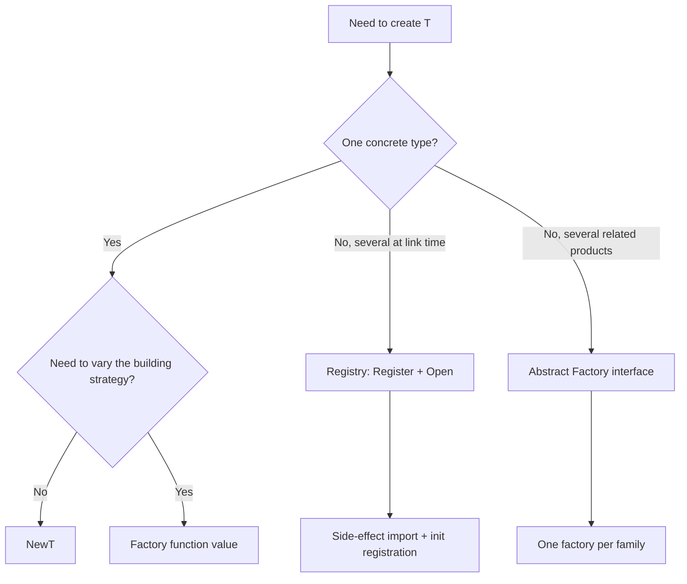

# Factory Pattern — Specification

## 1. Origins

The Factory pattern is two patterns in *Design Patterns: Elements of Reusable Object-Oriented Software* (Gamma, Helm, Johnson, Vlissides, 1994), both filed under creational patterns:

> "Factory Method: Define an interface for creating an object, but let subclasses decide which class to instantiate. Factory Method lets a class defer instantiation to subclasses."

> "Abstract Factory: Provide an interface for creating families of related or dependent objects without specifying their concrete classes."

The book treats these as distinct:

- **Factory Method** — a virtual method on a base class that subclasses override to produce a product. The variation point is the subclass of the *creator*.
- **Abstract Factory** — an object whose methods each produce a different product, with multiple concrete factories producing different *families* of products. The variation point is the choice of factory.

A third, informal variant — the **Simple Factory** (sometimes called Static Factory or just "factory function") — appears throughout the book's examples but is not named as a separate pattern. It is a single function or static method that returns one of several concrete types based on its arguments.

Go collapses all three into ordinary functions. There is no class, no virtual method, and no inheritance, so the *machinery* of Factory Method disappears. What remains is the *intent*: separate the decision of which concrete type to create from the code that uses it. In Go, that decision lives in a package-level function — by convention `New`, `NewX`, `Make`, or `Open`.

### 1.1 Pre-GoF antecedents

Constructor abstraction predates GoF by decades:

- **CLU** (Liskov, 1974) had `create` operations that hid representation from the cluster's clients — the first explicit "factory function" idiom in a typed language.
- **Smalltalk-80** (1980) used class-side methods (`Stream new`, `OrderedCollection withAll:`) as factories; the metaclass system made every class itself a factory object.
- **CORBA** (1991) introduced `ObjectFactory` interfaces for distributed object creation, defined in IDL and bound at runtime.
- **C++ "named constructor" idiom** (Cargill, late 1980s; Coplien, 1992) — static member functions returning instances, used when overloaded constructors became ambiguous.

The GoF book canonicalised the names and split the concept into two patterns. The idea — *don't let callers `new` your types directly* — predates it by twenty years.

### 1.2 Effective Go and the "New" convention

Go's standard formulation appears in *Effective Go* (2009, updated through 2024) under §"Allocation with new":

> "It's idiomatic in Go to use a function whose name begins with `New` to create a value of a specific type. Such functions are constructors."

And later, in §"Composite literals":

> "Note that, unlike in some other languages, in Go it's perfectly OK to return the address of a local variable; the storage associated with the variable survives after the function returns."

These two paragraphs created the entire idiom. A constructor in Go is a regular function whose name starts with `New`, returns either the concrete type or an interface, and frequently allocates with `&Type{...}` rather than `new(Type)`. There is no privileged keyword, no special syntax, no compiler magic.

The Go authors deliberately rejected language-level constructors. Rob Pike, in his 2012 talk *"Go at Google: Language Design in the Service of Software Engineering"*:

> "We removed several complications: ... no constructors; no destructors; no operator overloading; no default parameter values; no exceptions."

Pike's argument was that constructors in C++ and Java entangled themselves with inheritance, exception safety, and partial-construction problems. By making construction "just a function," Go made it composable, testable, and replaceable.

### 1.3 Rob Pike on small interfaces

The Factory pattern as it exists in Go cannot be separated from Pike's interface philosophy. In *"Go Proverbs"* (Gophercon 2015):

> "The bigger the interface, the weaker the abstraction."

And from the same talk:

> "Accept interfaces, return structs."

The second proverb is the keystone. A factory that returns an interface couples every caller to that interface forever; a factory that returns a concrete struct lets callers decide which interface they need. The exception — when the factory must hide multiple possible concrete types behind one return — is the *abstract factory* case, and Go expresses it with an interface.

### 1.4 Go community evolution

| Year | Milestone |
|------|-----------|
| Go 1.0 (2012) | `New` convention codified in *Effective Go*. `bytes.NewBuffer`, `bufio.NewReader`, `strings.NewReader` ship in stdlib. |
| Go 1.0 (2012) | `sql.Open` + `sql.Register` establishes the registry-factory idiom for pluggable backends. |
| Go 1.1 (2013) | `flag.NewFlagSet` lands; first stdlib factory taking a *struct of options*. |
| Go 1.4 (2014) | `image.RegisterFormat` finalises the decoder-registry pattern, copied by `encoding/gob`, `archive/zip`, `database/sql`. |
| Go 1.7 (2016) | `context.WithTimeout`, `context.WithCancel` — factory-as-decorator, returning both a value and a cleanup. |
| Go 1.11 (2018) | Go modules; `go-plugin` (Hashicorp) matures, demonstrating factory + RPC plugin loading. |
| Go 1.16 (2021) | `embed` allows compiled-in resources; static factory output becomes deterministic. |
| Go 1.18 (2022) | Generics. `Factory[T]` and `Pool[T any]`-style parameterised factories enter the ecosystem. |
| Go 1.21 (2023) | `slog.New(handler)` ships — modern stdlib factory style with options. |
| Go 1.22 (2024) | `http.NewServeMux` gains pattern-matching; the factory return shape stays stable. |

The throughline: every major Go release added factories, never inheritance. The pattern survived as a *naming convention plus a few stdlib templates*, not as a structural pattern with diagrams.

---

## 2. Underlying Go language mechanics

The Go spec (https://go.dev/ref/spec) defines the substrate on which factories are built. Five sections are load-bearing.

### 2.1 Function types and function values

> "A function type denotes the set of all functions with the same parameter and result types. The value of an uninitialized variable of function type is `nil`."

Functions are first-class values. A factory is a function; a *factory value* is the function itself, assignable to variables, stored in maps, passed as arguments. This makes registry-based factories possible — you do not need a class hierarchy, only a `map[string]func(...) T`.

### 2.2 The `new` built-in

> "The built-in function `new` takes a type T, allocates storage for a variable of that type at run time, and returns a value of type *T pointing to it. The variable is initialized as described in the section on initial values."

`new(T)` zero-initialises and returns `*T`. It is a primitive factory for any type. The convention is that user-level constructors named `NewT` should return something more useful — typically a pointer to a struct with non-zero fields, or an interface — and reserve `new(T)` for the rare case when zero values suffice.

### 2.3 The `make` built-in

> "The built-in function `make` takes a type T, optionally followed by a type-specific list of expressions. It returns a value of type T (not *T). The memory is initialized as described in the section on initial values."

`make` is the factory for the three built-in types that need internal structure: `make(chan T)`, `make(map[K]V)`, `make([]T, n)`. `new` and `make` are *separated* in Go precisely because slices, maps, and channels require initialised internal state — they are not satisfied by a zeroed pointer. The split is itself a design decision: distinct factories for distinct needs.

### 2.4 Package initialisation and `init`

> "If a package has multiple `init` functions (possibly in multiple files), they are called in the order they are presented to the compiler. ... Package initialization — variable initialization and the invocation of `init` functions — happens in a single goroutine, sequentially, one package at a time."

Registry factories (see §3.2) rely on this. Each driver, codec, or format registers itself in `init`, and the registration sequence is deterministic per binary but unspecified across binaries with different import sets. `database/sql`'s `sql.Register("postgres", ...)` is the canonical example.

The Go spec also guarantees:

> "Package initialization happens before the program's `main` function begins execution. ... If any imported packages have not been initialized, their initialization is done first."

So by the time `main` runs, every transitively imported registry has been populated. This is what makes the `import _ "github.com/lib/pq"` line meaningful — the side effect is the registration.

### 2.5 Type assertions and type switches

> "A type assertion `x.(T)` asserts that the dynamic type of `x` is identical to the type T. ... For an expression `x` of interface type and a type `T`, the primary expression `x.(T)` asserts that `x` is not nil and that the value stored in `x` is of type `T`."

Factories that return interfaces let callers recover the concrete type via assertion when necessary. Type switches generalise this for factories that may produce many concrete types from one entry point.

### 2.6 Generics (Go 1.18+)

> "A function or type declaration may have type parameters. Type parameters are enclosed in square brackets and act as type variables in the rest of the declaration."

Parameterised factories use type parameters to avoid `interface{}` and the lossy reflection that comes with it:

```go
func New[T any]() *T            { return new(T) }
func NewSlice[T any](n int) []T { return make([]T, n) }
```

Useful in container code; usually overkill for domain factories where the produced type is fixed.

### 2.7 Interface conversion and the nil interface trap

> "A value `x` of type `V` is *assignable to* a variable of type `T` ... if V and T have identical underlying types and at least one of V or T is not a named type."

Subtler: an interface value is nil only if *both* its type and value words are nil. A factory that returns a typed nil pointer behind an interface yields a non-nil interface — a classic bug. The spec doesn't warn about this; the FAQ does:

> "Under the covers, interfaces are implemented as two elements, a type T and a value V. An interface value is nil only if the V and T are both unset."

This is the single most repeated Go interview question because constructors trip on it.

---

## 3. The four canonical shapes

### 3.1 The `NewX` function

```go
type Server struct {
    addr string
    log  *slog.Logger
}

func NewServer(addr string, log *slog.Logger) *Server {
    if log == nil {
        log = slog.Default()
    }
    return &Server{addr: addr, log: log}
}
```

The default shape. One function, fixed argument list, returns the concrete type (Pike: "return structs"). Use when:

- There is one concrete type to produce.
- The caller will use it through its methods, not through an interface.
- The arguments fit naturally in a parameter list (rule of thumb: ≤ 4 parameters; beyond that, use functional options or a config struct).

This is the form used by `bytes.NewBuffer`, `bufio.NewReader`, `strings.NewReader`, `time.NewTicker`, `sync.NewCond`. It is the most common factory in Go by an order of magnitude.

### 3.2 Registry-based factory

```go
var (
    driversMu sync.RWMutex
    drivers   = make(map[string]Driver)
)

func Register(name string, d Driver) {
    driversMu.Lock()
    defer driversMu.Unlock()
    if d == nil {
        panic("sql: Register driver is nil")
    }
    if _, dup := drivers[name]; dup {
        panic("sql: Register called twice for driver " + name)
    }
    drivers[name] = d
}

func Open(driverName, dataSourceName string) (*DB, error) {
    driversMu.RLock()
    driveri, ok := drivers[driverName]
    driversMu.RUnlock()
    if !ok {
        return nil, fmt.Errorf("sql: unknown driver %q (forgotten import?)", driverName)
    }
    return openDriver(driveri, dataSourceName)
}
```

The shape: a package-level map plus a `Register` function called from imported packages' `init`, plus a lookup factory (`Open`, `Decode`, `NewWith`). Used when the set of concrete types is open-ended and decided at compile-link time, not at source time. Canonical: `database/sql`, `image`, `encoding/gob`, `archive/zip`.

Invariants for registry factories:

- The map must be protected by a mutex; `init` runs sequentially per package but unrelated packages can call `Register` from goroutines after `main` starts.
- Duplicate registration is a programmer error and should panic at `init` time, not silently overwrite.
- The factory must return a clear error when the key is unknown — and the convention is to mention the import (`forgotten import?`).
- Names are typically lowercase, stable strings; once a name is published, it cannot be renamed without breaking imports.

### 3.3 Factory function value

```go
type LoggerFactory func(name string) *slog.Logger

func DefaultFactory(name string) *slog.Logger {
    return slog.Default().With("component", name)
}

func TestFactory(buf *bytes.Buffer) LoggerFactory {
    return func(name string) *slog.Logger {
        h := slog.NewTextHandler(buf, nil)
        return slog.New(h).With("component", name)
    }
}
```

A named function type whose values are themselves factories. Used when:

- The caller (often a test or a framework) needs to inject a different production strategy.
- The factory itself needs to be configurable without subclassing.
- You want to pass "how to build X" as a first-class argument.

This is dependency injection in its lightest form. No DI container required; the function value *is* the container. Common in tests where production code wants `LoggerFactory` to be parameterised on a sink.

### 3.4 Abstract factory interface

```go
type WidgetFactory interface {
    NewButton() Button
    NewScrollbar() Scrollbar
    NewWindow() Window
}

type MacFactory struct{}
func (MacFactory) NewButton() Button       { return &macButton{} }
func (MacFactory) NewScrollbar() Scrollbar { return &macScrollbar{} }
func (MacFactory) NewWindow() Window       { return &macWindow{} }

type WinFactory struct{}
func (WinFactory) NewButton() Button       { return &winButton{} }
// ... etc.
```

The GoF Abstract Factory, ported faithfully. Used when:

- Multiple products must be produced together (a "family").
- Switching one product implies switching the others (a Mac window with a Windows scrollbar would be incoherent).
- The decision of *which family* is made once, high up, then passed down.

Rare in Go application code; common in compilers, rendering engines, and cross-platform UI toolkits. The Go stdlib has no perfect example because the stdlib has few cross-cutting product families; the closest is `crypto/cipher`'s `Block` plus the mode constructors built on it.

### 3.5 Decision diagram



---

## 4. Standard library factories

### 4.1 `bufio.NewReader` and `bufio.NewWriter`

```go
func NewReader(rd io.Reader) *Reader            { return NewReaderSize(rd, defaultBufSize) }
func NewReaderSize(rd io.Reader, size int) *Reader { ... }
func NewWriter(w io.Writer) *Writer             { return NewWriterSize(w, defaultBufSize) }
```

Pattern: simple `NewT` with a sensible default (4096 bytes), plus a `NewTSize` for callers who need control. The factory returns `*Reader`, not `io.Reader` — callers may want `ReadByte`, `ReadRune`, `Peek`, `UnreadByte`, none of which are on `io.Reader`. Pike's "return structs" exemplified.

### 4.2 `bytes.NewBuffer` and `bytes.NewReader`

```go
func NewBuffer(buf []byte) *Buffer           { return &Buffer{buf: buf} }
func NewBufferString(s string) *Buffer       { return &Buffer{buf: []byte(s)} }
func NewReader(b []byte) *Reader             { return &Reader{s: b, i: 0, prevRune: -1} }
```

Three factories, three argument types, one package. `NewBuffer` and `NewBufferString` differ only in input type; `NewReader` produces a read-only view. The split exists because the operations differ: a `*Buffer` is read-write and growable; a `*Reader` is read-only and indexable.

### 4.3 `strings.NewReader` and `strings.NewReplacer`

```go
func NewReader(s string) *Reader { return &Reader{s, 0, -1} }
func NewReplacer(oldnew ...string) *Replacer { ... }
```

`NewReplacer` takes a variadic `...string`, paired as `old, new, old, new, ...`. The factory validates pairing in the function body and panics if odd. This is a common Go choice: validate eagerly at construction, panic on programmer error, return errors only for runtime-variable failures.

### 4.4 `image.Decode` and `image.RegisterFormat`

```go
func RegisterFormat(name, magic string, decode func(io.Reader) (Image, error),
                    decodeConfig func(io.Reader) (Config, error)) { ... }

func Decode(r io.Reader) (Image, string, error) { ... }
```

The textbook registry factory. Each format package (`image/png`, `image/jpeg`, `image/gif`) calls `RegisterFormat` from its `init`. `Decode` reads a magic number, looks up the matching decoder, dispatches. The caller writes:

```go
import (
    "image"
    _ "image/png"
    _ "image/jpeg"
)
```

The blank imports trigger the `init` registrations. The factory then knows about the formats without `image` importing them. Stdlib-as-bidirectional-DI.

### 4.5 `database/sql.Open` and `sql.Register`

```go
func Register(name string, driver driver.Driver) { ... }
func Open(driverName, dataSourceName string) (*DB, error) { ... }
```

The most widely-copied factory in Go. `Open` does not actually open a connection — it validates arguments, parses the DSN, and returns a `*DB` (a connection *pool*). The first real connection is lazy. This is deliberate: factory should not do I/O.

The pattern's lesson: `Open` is a misleading name from a 1990s database API; modern Go would call it `New`. The convention stuck because too much code uses it.

### 4.6 `crypto/cipher`

```go
func NewCBCEncrypter(b Block, iv []byte) BlockMode
func NewCBCDecrypter(b Block, iv []byte) BlockMode
func NewGCM(cipher Block) (AEAD, error)
func NewGCMWithNonceSize(cipher Block, size int) (AEAD, error)
```

A family of factories that share an input shape (a `Block` cipher) and produce mode-of-operation wrappers. The factories panic on programmer errors (mismatched IV length, invalid nonce size) and return errors only for runtime issues. The naming reveals which is which: `NewCBC*` cannot fail except on programmer error, `NewGCM*` can.

### 4.7 `net/http` — Client, Server, RoundTripper

```go
type Client struct {
    Transport     RoundTripper
    CheckRedirect func(req *Request, via []*Request) error
    Jar           CookieJar
    Timeout       time.Duration
}

var DefaultClient = &Client{}

// No NewClient factory exists.
```

Conspicuously absent: there is no `http.NewClient`. The `Client` type is a struct with public fields, intended for direct construction via composite literal:

```go
c := &http.Client{Timeout: 5 * time.Second}
```

This is the *anti-factory* lesson. When all fields are optional and the zero value is meaningful, no factory is needed. Adding one would be ceremony.

Compare with `http.NewServeMux`, which *does* exist because a `ServeMux` needs an initialised internal map.

### 4.8 `flag.NewFlagSet`

```go
func NewFlagSet(name string, errorHandling ErrorHandling) *FlagSet
```

A factory that takes a name (for usage text) and a behaviour enum (for error handling). The enum is `ContinueOnError`, `ExitOnError`, or `PanicOnError`. The factory shape — name plus behaviour-enum — is unusual in Go but common at boundaries with C-style libraries.

### 4.9 `text/template` and `html/template`

```go
func New(name string) *Template { ... }
func Must(t *Template, err error) *Template {
    if err != nil { panic(err) }
    return t
}
```

`New` is the standard factory. `Must` is the *combinator factory* — it takes a `(value, error)` pair and panics on error, returning just the value. The Go community calls this the "Must" idiom. Used when:

- Construction failure means the program cannot proceed.
- The factory is called at package init time, where returning an error has nowhere to go.

```go
var tmpl = template.Must(template.New("home").Parse(homeHTML))
```

`Must` is itself a factory of factories: it wraps another factory's output.

### 4.10 `regexp.Compile` and `regexp.MustCompile`

```go
func Compile(expr string) (*Regexp, error) { ... }
func MustCompile(expr string) *Regexp {
    re, err := Compile(expr)
    if err != nil {
        panic(`regexp: Compile(` + quote(expr) + `): ` + err.Error())
    }
    return re
}
```

The pair `Compile / MustCompile` is the model the rest of stdlib copies. `Compile` for runtime input; `MustCompile` for compile-time constants. Two names, one underlying factory, two failure modes.

### 4.11 `context.WithTimeout`, `context.WithValue`, `context.WithCancel`

```go
func WithCancel(parent Context) (ctx Context, cancel CancelFunc)
func WithTimeout(parent Context, timeout time.Duration) (Context, CancelFunc)
func WithValue(parent Context, key, val any) Context
```

These are *decorator factories*: they take an existing context and return a new one with added behaviour. The return-pair shape `(Context, CancelFunc)` is unique to context — the factory returns both a product and a cleanup function. This is the closest Go gets to RAII, expressed without a destructor.

### 4.12 `make` — the built-in factory

```go
make(chan T, n)         // factory for channels
make(map[K]V)           // factory for maps
make(map[K]V, hint)     // factory for maps with size hint
make([]T, n)            // factory for slices
make([]T, n, capacity)  // factory for slices with capacity
```

`make` is the language-level factory for the three composite primitives that need internal state. It is the only construction primitive other than composite literals (`T{...}`) and `new(T)`. The fact that Go reserved a keyword for it suggests how central factories are to the language design.

---

## 5. Real library examples

### 5.1 `uber-go/dig` — reflective DI container

```go
c := dig.New()
c.Provide(NewLogger)
c.Provide(NewServer)
c.Invoke(func(s *Server) { s.Run() })
```

`dig` is a registry of factory functions, keyed by their return type. Each `Provide` adds a constructor; `Invoke` walks the dependency graph and calls each constructor exactly once in topological order. The library is essentially a runtime version of the registry pattern in §3.2, but with type-based lookup instead of string-based.

The trade-off: reflection-driven, harder to debug, more flexible. Used in large applications where the wiring graph is dynamic.

### 5.2 `google/wire` — compile-time DI

```go
// wire.go
//go:build wireinject

func InitializeServer() (*Server, error) {
    wire.Build(NewLogger, NewDB, NewServer)
    return nil, nil
}
```

`wire` generates `wire_gen.go` at compile time:

```go
func InitializeServer() (*Server, error) {
    logger := NewLogger()
    db, err := NewDB(logger)
    if err != nil { return nil, err }
    return NewServer(logger, db), nil
}
```

Same factory model as `dig`, but the dependency resolution happens at code-generation time, not runtime. No reflection, no runtime cost, full visibility in stack traces. The factories themselves are ordinary `NewX` functions; `wire` only composes them.

The architectural lesson: factories that take their dependencies as parameters (rather than constructing them inside) compose with both DI styles.

### 5.3 `hashicorp/go-plugin`

```go
client := plugin.NewClient(&plugin.ClientConfig{
    HandshakeConfig: handshake,
    Plugins:         map[string]plugin.Plugin{"kv": &KVPlugin{}},
    Cmd:             exec.Command("./plugin-bin"),
})
defer client.Kill()

rpcClient, _ := client.Client()
raw, _ := rpcClient.Dispense("kv")
kv := raw.(KV)
```

The library is a multi-layer factory: `NewClient` produces a plugin host, `Dispense` produces a typed proxy to the remote plugin. Each plugin process registers its own factory map for the types it serves. This is the registry pattern (§3.2) crossed with an RPC layer.

### 5.4 `ent` — code-generated entity factories

```go
client, err := ent.Open("postgres", dsn)
user, err := client.User.Create().SetName("alice").Save(ctx)
```

`ent`'s code generator produces a fluent builder API from a schema. `Create()` returns a `*UserCreate` builder, and `Save(ctx)` is the terminal factory that inserts the row and returns the `*User`. Two patterns combined: Builder (§10) for argument assembly, Factory for the final product.

The generated code follows the `New`/`Open` convention strictly; user-written extensions plug into the same naming.

### 5.5 `kubernetes/client-go` REST client factory

```go
config, err := rest.InClusterConfig()
clientset, err := kubernetes.NewForConfig(config)
pods, err := clientset.CoreV1().Pods("default").List(ctx, metav1.ListOptions{})
```

`NewForConfig` is the entry factory; it returns a `*Clientset` containing sub-factories for each API group (`CoreV1()`, `AppsV1()`, `BatchV1()`). Each sub-factory returns a typed client whose factories return resource-specific clients. Five levels of factories before any HTTP request happens — the cost of supporting an API with hundreds of versioned resource types.

### 5.6 `prometheus/client_golang` — collector factories

```go
reqs := prometheus.NewCounterVec(
    prometheus.CounterOpts{Name: "http_requests_total", Help: "..."},
    []string{"method", "code"},
)
prometheus.MustRegister(reqs)
```

`NewCounterVec`, `NewHistogram`, `NewGauge`, etc. are factories returning typed collectors. `MustRegister` is the standard `Must` combinator (§4.9, §4.10) applied to registry registration. The library's API is essentially "factory + register" repeated for each metric type.

---

## 6. Formal specification

### 6.1 Components

A Go Factory implementation consists of:

| Element | Description |
|---------|-------------|
| **Product type** | The concrete type (or interface) the factory returns. |
| **Factory function** | The function — typically named `NewX`, `Open`, `Make`, `From`, `Compile` — that produces the product. |
| **Parameter shape** | Positional args, variadic options, or a config struct. |
| **Failure mode** | Returned error, panic, or none. |
| **Lifecycle hook** | Optional `Close` / cancel function for resource cleanup. |
| **Registry** (optional) | A map plus a `Register` function for open-ended factory dispatch. |
| **Default constructor** (optional) | A zero-arg `NewX` returning sensible defaults. |

### 6.2 Invariants

1. **The factory returns a usable value.** Either the value is fully initialised or an error is returned. No half-constructed products escape.
2. **The factory does not panic on runtime input.** Panic only on programmer error (nil where non-nil is required, structurally invalid arguments). Use error returns for everything dependent on inputs.
3. **The factory does no I/O unless documented.** Constructors are called eagerly, often in tests, often before logging is ready. I/O hidden in a constructor surprises everyone.
4. **The factory does not start goroutines without a cleanup contract.** If it spawns, it returns a `Close` method or accepts a `context.Context`.
5. **The factory's return type is stable.** `New` returns `*T` or `iface`, never `interface{}` (unless the factory's entire purpose is dynamic dispatch).
6. **Default values are zero-valid.** Optional fields not provided to the factory must have a usable zero value, or be defaulted inside the factory body.
7. **Registry factories validate keys.** Unknown key → error, not silent default.
8. **Registry factories are thread-safe.** Concurrent `Register` and lookup must not race.
9. **Returning typed nil is forbidden.** `var p *T; return p` behind an interface return creates non-nil interface — never do this.
10. **The factory is replaceable.** A test can substitute it (function-value variant) or shadow it (registry variant).

Violation of invariant 3 (no I/O) is the single most common production bug. `sql.Open` famously violates it weakly — it parses the DSN, which can fail — but does not actually connect.

### 6.3 GoF role mapping

| GoF term | Go equivalent |
|----------|---------------|
| Creator | The package containing the `NewX` function (no class needed) |
| ConcreteCreator | A specific function or registry entry |
| Product | The interface or struct type returned |
| ConcreteProduct | The actual struct type behind the interface |
| Client | Code calling the factory |

The collapse is dramatic: GoF needs four roles, Go uses two (the function and its return type). The variation that GoF achieves through subclassing the Creator, Go achieves through varying the function or the registry entry.

---

## 7. Anti-patterns

### 7.1 `log.Fatal` in a constructor

```go
func NewServer(cfg Config) *Server {
    if cfg.Addr == "" {
        log.Fatal("addr required")    // bad
    }
    return &Server{addr: cfg.Addr}
}
```

`log.Fatal` calls `os.Exit(1)`, which skips deferred functions, never returns, and cannot be caught. A test that constructs the server with bad config now kills the test binary. Return an error.

### 7.2 Hidden I/O

```go
func NewClient(apiKey string) *Client {
    resp, _ := http.Get("https://api/whoami")   // bad — bare GET in constructor
    return &Client{key: apiKey, user: resp.User}
}
```

Construction now requires network access. Tests cannot construct the client without mocking the HTTP stack at the wrong layer. Move I/O to a `Verify(ctx)` method or do it lazily on first call.

### 7.3 Eager construction of expensive dependencies

```go
func NewService() *Service {
    return &Service{
        cache: NewRedisCache(),       // connects immediately
        store: NewPostgresStore(),    // connects immediately
        queue: NewKafkaProducer(),    // connects immediately
    }
}
```

Every dependency boots at `main`'s entry, with no way to disable any of them. The service cannot start in a degraded mode. Factories should accept their dependencies, not create them:

```go
func NewService(cache Cache, store Store, queue Queue) *Service {
    return &Service{cache: cache, store: store, queue: queue}
}
```

This is the rule that makes `wire` and `dig` possible.

### 7.4 Singleton named `NewX`

```go
var instance *Server
var once sync.Once

func NewServer() *Server {
    once.Do(func() { instance = &Server{...} })
    return instance
}
```

A `NewX` function that returns the same pointer every call is lying. Either name it `Default()` / `Instance()` (the singleton convention) or actually return a new value. Hiding singletons behind `New` breaks the contract every Go reader expects.

### 7.5 Returning typed nil

```go
func New(cfg *Config) Logger {
    var l *defaultLogger
    if cfg.Enabled {
        l = &defaultLogger{...}
    }
    return l   // bad — interface is non-nil even when l is nil
}
```

The interface return is *never nil* — it carries the type `*defaultLogger`. Callers writing `if log != nil` will always proceed and dereference nil. Return untyped `nil` explicitly:

```go
if !cfg.Enabled {
    return nil
}
return &defaultLogger{...}
```

### 7.6 Registry without a mutex

```go
var drivers = make(map[string]Driver)

func Register(name string, d Driver) {
    drivers[name] = d   // bad — map writes are not safe
}
```

Even if all `Register` calls happen during `init`, a third party might call `Register` from a goroutine started in `init` (which is legal). Lock the map. The cost is one mutex per package; the bug class avoided is data race.

### 7.7 The "configurator masquerading as factory"

```go
func New(opts ...Option) *Server {
    s := &Server{}
    for _, o := range opts {
        o(s)
    }
    s.realInit()   // a second phase, doing all the actual work
    return s
}
```

If the factory has a "real init" phase, the option assembly is incomplete. Either run init eagerly (and accept the cost) or use a Builder where the terminal `Build()` is the factory. Don't pretend the option pass is construction when it isn't.

### 7.8 Per-call factory inside hot path

```go
for _, item := range items {
    parser := json.NewDecoder(bytes.NewReader(item))   // allocation per iteration
    _ = parser.Decode(&out)
}
```

Each iteration constructs a new decoder. For one-shot parsing, `json.Unmarshal` would be cheaper; for streaming, lift the factory out of the loop. The cost of repeated factory calls is real and shows up under load.

### 7.9 Factory exposed for what should be private

```go
func NewInternalState() *InternalState { ... }   // exposed in public API
```

Sometimes the test package needs construction access. The solution is not a public factory in `pkg`; it is a `pkg_test` helper or an `internal/testutil` package. Public factories anchor your API forever.

### 7.10 Side effects in `init` for factory registration

```go
func init() {
    if err := http.Get("https://config/load"); err != nil { ... }   // bad
    Register("foo", &fooDriver{...})
}
```

`init` should be fast, deterministic, and offline. Network calls, file reads beyond `embed`, and time-dependent logic in `init` make the binary's startup non-deterministic. Registration itself is fine; *loading* configuration is not.

---

## 8. Variants and dialects

| Variant | Description |
|---------|-------------|
| **`New`** | The default — `func NewT(args...) *T`. |
| **`Make`** | Used when the factory returns a value type rather than a pointer (e.g., `make` for maps and slices). Rare for user code. |
| **`Open`** | Used for factories that conceptually "open" a resource — files, databases, archives. By convention pairs with `Close`. |
| **`From`** | Used when the factory is conversion-heavy: `time.FromUnix`, `url.ParseFromBytes`. Reads as "make a T from an X". |
| **`Must`** | Wraps another factory; panics instead of returning error. For constants. |
| **`Compile`** | Used when the factory does parsing / compilation: `regexp.Compile`, `template.New(...).Parse`. |
| **`Default`** / **`Instance`** | Returns a process-wide singleton, distinct from `New`. |
| **`With`** | Decorator-factory: takes an existing value and returns a derived one. `context.WithTimeout`. |
| **Registry-based** | Lookup by string key from a registered set; `sql.Open`, `image.Decode`. |
| **Generic** | Type-parameterised: `New[T any]() *T`. |
| **Lazy** | Returns a thunk or a struct whose first call does the real construction. Useful for expensive deps. |
| **Abstract** | An interface whose methods are themselves factories — `WidgetFactory.NewButton()`. |
| **Builder-terminated** | A Builder's `Build()` method *is* the factory. |

### 8.1 Lazy factory

```go
type lazyClient struct {
    once sync.Once
    cli  *Client
    err  error
}

func (l *lazyClient) get() (*Client, error) {
    l.once.Do(func() {
        l.cli, l.err = doExpensiveConstruction()
    })
    return l.cli, l.err
}
```

Lazy factories defer real work until first use. The trade-off: latency moves from startup to first request. Useful when the dependency may never be used in a given run (a CLI tool with many subcommands, only one is run).

### 8.2 Generic factory

```go
type Factory[T any] func() T

func Pool[T any](f Factory[T]) *sync.Pool {
    return &sync.Pool{New: func() any { return f() }}
}
```

Parameterising the factory lets generic infrastructure (pools, caches, builders) work with any product type without `interface{}` casts. Common in `golang.org/x/exp/...` and in third-party utility libraries.

---

## 9. Code conventions

### 9.1 Naming

- **`NewX`** — the default. One concrete type; return either `*X` or an interface.
- **`OpenX`** — for resources: files, databases, archives. Implies a `Close`.
- **`MustX`** — a `Compile`/`Parse`/`Open` variant that panics on error. Used only when failure means the program cannot proceed.
- **`MakeX`** — for value-type returns. Rare outside built-ins.
- **`X.New()`** — method on a parent type, when the factory needs access to the parent's state. `template.New("foo")`.
- **`FromX`** — conversion-factory. `url.ParseRequestURI`, `time.UnixMilli`.

### 9.2 Argument ordering

When the factory takes a context, parent value, or surrounding state, that argument comes first:

```go
context.WithTimeout(parent Context, timeout time.Duration)
bufio.NewReader(rd io.Reader)
crypto/cipher.NewCBCEncrypter(b Block, iv []byte)
```

This mirrors method-receiver semantics: the thing being "extended" is conceptually the receiver.

### 9.3 Return shape

| Situation | Return shape |
|-----------|--------------|
| Concrete struct, no failure | `*T` |
| Concrete struct, can fail | `(*T, error)` |
| Interface, no failure | `Iface` |
| Interface, can fail | `(Iface, error)` |
| Resource with cleanup | `(T, CleanupFunc)` or `(T, CleanupFunc, error)` |
| `Must` wrapper | `T` (panic on error) |

### 9.4 Default values

If the factory has optional parameters expressed as a struct, the zero value of the struct should be valid:

```go
type Config struct {
    Timeout time.Duration   // 0 = no timeout
    Logger  *slog.Logger    // nil = slog.Default()
    Retries int             // 0 = no retries
}

func New(cfg Config) *Client {
    if cfg.Logger == nil { cfg.Logger = slog.Default() }
    return &Client{...}
}
```

`Client{}` should be constructable; a meaningful zero value is the Go convention.

### 9.5 Compile-time interface check

When the factory returns an interface, anchor the implementation with:

```go
var _ Iface = (*concreteT)(nil)
```

Costs nothing, catches missing methods at the declaration site.

### 9.6 Godoc

```go
// NewServer returns a server listening on addr. The server does not bind
// the port until Run is called; construction is cheap and side-effect-free.
// addr must be a host:port string; an empty addr causes Run to return ErrNoAddr.
func NewServer(addr string) *Server { ... }
```

Document the lifecycle. Specify the cheap-vs-expensive boundary. Specify error conditions.

### 9.7 Testing

- **Constructor-only test**: confirm the factory accepts valid input, rejects invalid input, and produces a non-nil result.
- **Default-value test**: zero-value config produces a working product.
- **Registry test**: registering twice panics; unknown key returns error; concurrent registration is safe.
- **Replacement test**: in code that uses factory function values, substitute a fake; verify the rest of the system works.

---

## 10. Related patterns

| Pattern | Distinction |
|---------|-------------|
| **Builder** | Assembles a product over multiple calls; the terminal `Build()` is itself a factory. Use when args are many or order-dependent. |
| **Abstract Factory** | A factory of factories — one interface, multiple methods, each producing a related product. |
| **Singleton** | A factory that returns the same instance every call. Different intent; name it `Default()`. |
| **Prototype** | Clones an existing instance instead of constructing a new one. Rare in Go; `proto.Clone` is the visible example. |
| **DI Container** | A registry of factories, resolved by type or name. `wire`, `dig`. |
| **Dependency Injection (constructor)** | A factory that takes its collaborators as parameters. The opposite of "factory that creates its own dependencies". |
| **Functional Options** | A factory whose variadic parameters are functions mutating the product. Common in Go for many-option types. |
| **Decorator** | Wraps a value and returns the same interface; some factories (`context.With*`) are decorators by another name. |
| **Provider** (Spring/Guice) | Roughly equivalent to "factory function value" in Go terminology. |

In Go specifically:

- **Builder vs Factory.** A factory takes input and returns the product immediately. A builder takes input incrementally, then returns the product on `Build()`. Sometimes a `New` function takes a Builder as input.
- **Factory vs Constructor (in OO sense).** Go has no constructors. Every "constructor" *is* a factory. The pattern is degenerate to the point of being the default style.
- **Factory vs `init`.** `init` is not a factory; it has no return value. But `init` populates the *registries* that factories dispatch from.
- **Factory vs `make`/`new`.** The built-ins are primitive factories for built-in types. User code uses `New`/`Make` for everything else.

---

## 11. Further reading

- **Go source: `src/bytes/buffer.go`, `src/bytes/reader.go`** — canonical `NewBuffer`, `NewReader`.
- **Go source: `src/bufio/bufio.go`** — `NewReader`, `NewReaderSize`, default-plus-explicit pair.
- **Go source: `src/database/sql/sql.go`** — `Open` and `Register`, the registry-factory blueprint.
- **Go source: `src/image/format.go`** — `RegisterFormat` and `Decode`.
- **Go source: `src/text/template/template.go`** — `New` and `Must`.
- **Go source: `src/regexp/regexp.go`** — `Compile` / `MustCompile` pair.
- **Go source: `src/context/context.go`** — `With*` decorator-factories with cleanup pairs.
- **Effective Go §"Allocation with new"** (https://go.dev/doc/effective_go#allocation_new) — the `New` convention.
- **Effective Go §"Allocation with make"** — `make` vs `new`.
- **Effective Go §"Composite literals"** — why returning `&T{...}` is idiomatic.
- **Go FAQ §"Why is my nil error value not equal to nil?"** — the typed-nil trap.
- **Go blog: "Constants"** (Pike, 2014) — why Go has compile-time evaluation for immutable factories.
- **Rob Pike, "Go Proverbs" (Gophercon 2015)** — "accept interfaces, return structs".
- **Rob Pike, "Go at Google: Language Design in the Service of Software Engineering" (2012)** — why Go has no constructors.
- **GoF, "Design Patterns" (1994), §"Factory Method"** — the original.
- **GoF, "Design Patterns" (1994), §"Abstract Factory"** — the family-of-products variant.
- **Martin Fowler, "Inversion of Control Containers and the Dependency Injection pattern" (2004)** — registries and factory injection.
- **Joshua Bloch, "Effective Java" §"Consider static factory methods instead of constructors"** — the Java-side argument for factories over `new`.
- **Coplien, "Advanced C++ Programming Styles and Idioms" (1992)** — the named-constructor idiom.
- **`google/wire` documentation** — compile-time DI in Go.
- **`uber-go/dig` documentation** — runtime DI in Go.
- **`hashicorp/go-plugin` documentation** — RPC-bridged factory loading.
- **`ent` documentation** — code-generated factories from schema.
- **kubernetes `client-go` documentation** — multi-layer typed factories at scale.
- **`prometheus/client_golang` documentation** — factory + register, applied across a domain.

---

## 12. Glossary

| Term | Meaning |
|------|---------|
| **Factory function** | A function that returns a value of a named type, hiding allocation and initialisation. |
| **Constructor** | In Go, identical to "factory function." There is no language-level constructor. |
| **Product** | The value a factory produces. |
| **Registry** | A package-level map from string keys (or types) to factories, populated via `Register`. |
| **`init` registration** | The pattern of calling `Register` from `init`, triggered by a side-effect import. |
| **`Must` combinator** | A wrapper factory that panics on error, used for compile-time constants. |
| **Typed nil** | A nil pointer behind a non-nil interface — the most common factory bug. |
| **Lazy factory** | A factory that defers real work until first use. |
| **Decorator-factory** | A factory that takes an existing value and returns a derived one (`context.WithTimeout`). |
| **Abstract factory** | An interface whose methods are themselves factories, producing a family of related products. |
| **Builder-terminated factory** | A Builder pattern whose terminal `Build()` method *is* the factory. |
| **Side-effect import** | `import _ "..."`, used solely to trigger the package's `init` and its `Register` calls. |
| **Default constructor** | A `NewX()` taking no arguments and returning sensible defaults. |
| **Compile-time interface check** | `var _ Iface = (*Adapter)(nil)` — forces the compiler to verify a factory's product implements its return interface. |
