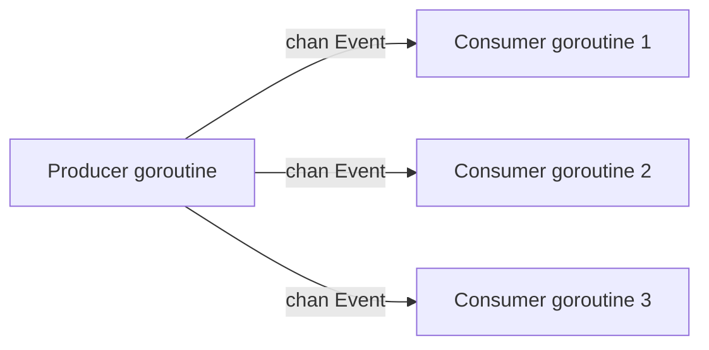
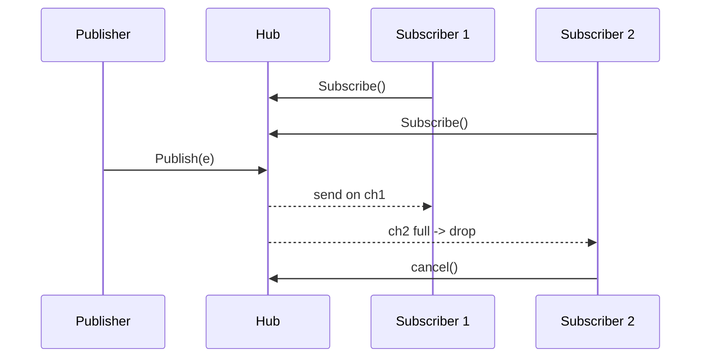

# Observer Pattern — Junior

## 1. What the Observer pattern actually is

A *subject* holds some state. Other components want to *react* when that state changes. Instead of the subject knowing each consumer by name, it keeps a list of "observers" — anyone who registered to be told — and pushes a notification when the state mutates.

Classic example: a UI button. The button doesn't know which screen owns it; it maintains a list of click handlers and fires them all on click. Add a handler, remove one, swap one — the button code doesn't change.

In Go, this pattern shows up in two distinct shapes:

1. **Struct-based** — a `Subject` with `Subscribe`, `Unsubscribe`, `Notify` methods, holding a `[]Observer`. Closest to the GoF book.
2. **Channel-based** — observers receive over a `chan T`. No interface, no list, no method calls — just sends on a channel. This is what Go does *natively*.

You'll meet both. The channel-based form is more idiomatic for in-process Go code; the struct-based form earns its place when observers come in many shapes or live across package boundaries with rich behaviour.

This file teaches both shapes, why channels often replace explicit Observer in Go, where the stdlib hides Observer (`signal.Notify`, `http.Server.ConnState`), and the mistakes that make Observer leak, deadlock, or silently drop events.

---

## 2. Table of Contents

1. [What the Observer pattern actually is](#1-what-the-observer-pattern-actually-is)
2. [Table of Contents](#2-table-of-contents)
3. [Why Go often uses channels instead](#3-why-go-often-uses-channels-instead)
4. [The classic struct-based Observer](#4-the-classic-struct-based-observer)
5. [The channel-based Observer](#5-the-channel-based-observer)
6. [Picking between the two shapes](#6-picking-between-the-two-shapes)
7. [Observer in the standard library](#7-observer-in-the-standard-library)
8. [Worked example: temperature sensor](#8-worked-example-temperature-sensor)
9. [Common mistakes a junior makes](#9-common-mistakes-a-junior-makes)
10. [Tricky points](#10-tricky-points)
11. [Quick test](#11-quick-test)
12. [Cheat sheet](#12-cheat-sheet)
13. [What to learn next](#13-what-to-learn-next)

---

## 3. Why Go often uses channels instead

In Java, the GoF Observer is a fixed cast: a `Subject` interface, a `Subscribe(Observer)` method, an `Observer` interface with `update(...)`. Verbose because the language has no other way to express "send a value somewhere".

Go has a built-in primitive — the channel — whose entire purpose is "deliver values from one goroutine to others". A channel *is already* an observer hook:

```go
events := make(chan Event, 16)

// "Subscribe" — keep a receiver.
go func() {
    for e := range events {
        handle(e)
    }
}()

// "Notify" — send.
events <- Event{Kind: "user.created", ID: 42}
```

No `Subject` struct, no `Observer` interface, no slice mutation. The channel plays both roles. For a single observer or a small set of well-known consumers, this is the right shape.



When you need *fan-out* (one event to many observers) or *dynamic subscribe/unsubscribe*, the bare channel isn't enough — a channel broadcasts to *one* receiver, not many. That's where the struct-based Observer returns.

The decision in short:

- **One known consumer per event** → plain channel.
- **Many consumers, fixed set** → one channel each, producer fans out.
- **Dynamic set of consumers** → struct-based Observer or channel-based hub.
- **Cross-process, durable, replayable** → message broker (Kafka, NATS) — that's Pub/Sub, not Observer.

---

## 4. The classic struct-based Observer

The GoF shape in idiomatic Go. A `Subject` keeps `[]Observer`, exposes `Subscribe`, `Unsubscribe`, and `Notify`. Each observer implements a small interface.

```go
package events

import "sync"

// Observer is the strategy each subscriber implements.
type Observer interface {
    OnEvent(e Event)
}

// Event is the payload pushed to every observer.
type Event struct {
    Kind string
    Data any
}

// Subject keeps the list of observers and notifies them on Publish.
type Subject struct {
    mu        sync.RWMutex
    observers map[int]Observer
    nextID    int
}

func NewSubject() *Subject {
    return &Subject{observers: make(map[int]Observer)}
}

// Subscribe registers o and returns a handle for Unsubscribe.
func (s *Subject) Subscribe(o Observer) int {
    s.mu.Lock(); defer s.mu.Unlock()
    id := s.nextID; s.nextID++
    s.observers[id] = o
    return id
}

// Unsubscribe removes the observer with the given handle.
func (s *Subject) Unsubscribe(id int) {
    s.mu.Lock(); defer s.mu.Unlock()
    delete(s.observers, id)
}

// Publish notifies every observer in turn.
func (s *Subject) Publish(e Event) {
    s.mu.RLock()
    snapshot := make([]Observer, 0, len(s.observers))
    for _, o := range s.observers {
        snapshot = append(snapshot, o)
    }
    s.mu.RUnlock()

    // Call observers OUTSIDE the lock — see §10.1.
    for _, o := range snapshot {
        o.OnEvent(e)
    }
}
```

Two concrete observers:

```go
type logObserver struct{ prefix string }

func (l *logObserver) OnEvent(e Event) {
    fmt.Printf("[%s] %s: %v\n", l.prefix, e.Kind, e.Data)
}

type metricObserver struct {
    mu     sync.Mutex
    counts map[string]int
}

func (m *metricObserver) OnEvent(e Event) {
    m.mu.Lock(); defer m.mu.Unlock()
    if m.counts == nil { m.counts = make(map[string]int) }
    m.counts[e.Kind]++
}
```

Usage:

```go
s := events.NewSubject()
logID := s.Subscribe(&logObserver{prefix: "audit"})
mID   := s.Subscribe(&metricObserver{})

s.Publish(events.Event{Kind: "user.signup", Data: "alice"})
s.Publish(events.Event{Kind: "user.signup", Data: "bob"})

s.Unsubscribe(logID)
// Only the metric observer hears the next one.
s.Publish(events.Event{Kind: "user.delete", Data: "alice"})
```

What this design gets right:

- **Map keyed by integer handle**, not a slice — unsubscribe is O(1), no "find this observer" comparisons.
- **Snapshot under the lock, then call observers outside it** — see §10.1.
- **`sync.RWMutex`** — publishes are reads; subscribe/unsubscribe are writes.

What it doesn't try to do: async delivery (`Publish` blocks until every observer returns), ordered delivery across observers (map iteration is random — §10.2), or handling slow observers. These trade-offs are typical for a synchronous in-process observer; if you need async or backpressure, the channel-based shape is better.

---

## 5. The channel-based Observer

The idiomatic Go shape. Subscribers receive `chan Event`. The subject keeps a slice of channels and sends on each.

```go
package events

import (
    "context"
    "sync"
)

type Event struct {
    Kind string
    Data any
}

type Hub struct {
    mu          sync.Mutex
    subscribers []chan Event
}

func NewHub() *Hub { return &Hub{} }

// Subscribe returns a receive-only channel and a cancel func.
// The buffer (8) absorbs short bursts without blocking the producer.
func (h *Hub) Subscribe() (<-chan Event, func()) {
    ch := make(chan Event, 8)
    h.mu.Lock()
    h.subscribers = append(h.subscribers, ch)
    h.mu.Unlock()

    cancel := func() {
        h.mu.Lock(); defer h.mu.Unlock()
        for i, c := range h.subscribers {
            if c == ch {
                h.subscribers = append(h.subscribers[:i], h.subscribers[i+1:]...)
                close(ch)
                return
            }
        }
    }
    return ch, cancel
}

// Publish sends e on every subscriber's channel.
// If a subscriber's buffer is full, the event is dropped for that subscriber.
func (h *Hub) Publish(ctx context.Context, e Event) {
    h.mu.Lock()
    snapshot := make([]chan Event, len(h.subscribers))
    copy(snapshot, h.subscribers)
    h.mu.Unlock()

    for _, ch := range snapshot {
        select {
        case ch <- e:
        case <-ctx.Done():
            return
        default:
            // slow subscriber — drop
        }
    }
}
```

Consumer:

```go
h := events.NewHub()
ch, cancel := h.Subscribe()
defer cancel()

go func() {
    for e := range ch {
        fmt.Println("got", e.Kind, e.Data)
    }
}()

h.Publish(ctx, events.Event{Kind: "user.signup", Data: "alice"})
```

Why this shape is common:

- **Decoupled lifetimes** — each consumer runs in its own goroutine; a slow one affects only itself (thanks to `default`).
- **Natural backpressure / drop policy** — the buffer size and `select` together let you choose block, drop, or queue.
- **No callback inversion** — the consumer's code is a plain loop, not a method called by foreign code.

Trade-off: harder to test deterministically (you wait for sends, not return values), and overflow behaviour needs explicit design. Pick the buffer size deliberately.



---

## 6. Picking between the two shapes

Both are "Observer" in the GoF sense. The picking rule:

| Signal | Lean toward |
|--------|-------------|
| Observers have different signatures (`OnEvent`, `OnError`, `OnClose`) | Struct-based |
| Each observer is a goroutine processing events at its own pace | Channel-based |
| Deliver synchronously and wait for all observers | Struct-based |
| Fan-out across goroutines with independent backpressure | Channel-based |
| Observers come and go frequently at runtime | Either; channel-based is often cleaner (`defer cancel()`) |
| Events typed differently per observer kind | Struct-based with multiple interfaces |
| One event type, many listeners | Channel-based hub |

Heuristic: **start with channels.** Move to the struct-based form only when channels stop fitting — observers want different methods, or the "goroutine looping over a channel" model breaks down.

---

## 7. Observer in the standard library

You've used Observer in the stdlib many times without thinking about it.

| Where | Shape | What it does |
|-------|-------|--------------|
| `os/signal.Notify(ch, sig...)` | Channel-based | Signal runtime sends OS signals to your channel |
| `time.NewTicker(d).C` | Channel-based | Ticker sends ticks on the channel |
| `time.After(d)` | Channel-based (single shot) | Channel receives once |
| `http.Server.ConnState` | Callback (one observer) | Server calls your function on every connection state change |
| `runtime.SetFinalizer(obj, fn)` | Callback | Runtime calls `fn(obj)` when GC decides `obj` is unreachable |
| `context.Context.Done()` | Channel-based | Context closes the channel when cancelled |
| `fsnotify` (third-party but ubiquitous) | Channel-based | Filesystem events arrive on a channel |

The most instructive is `os/signal`:

```go
func Notify(c chan<- os.Signal, sig ...os.Signal)
func Stop(c chan<- os.Signal)
```

A textbook channel-based Observer. The *subject* is the package-level signal manager; the *observer* is whatever owns `c`. `Notify` is subscribe; `Stop` is unsubscribe.

```go
sigs := make(chan os.Signal, 1)
signal.Notify(sigs, syscall.SIGINT, syscall.SIGTERM)
defer signal.Stop(sigs)

s := <-sigs
log.Printf("got %v, shutting down", s)
```

The buffer size of 1 is deliberate: if your consumer is briefly busy, the signal isn't lost. The runtime drops signals when the buffer is full — so a buffered channel with capacity 1 is the canonical pattern.

`http.Server.ConnState` is the callback flavour:

```go
srv := &http.Server{
    Addr: ":8080",
    ConnState: func(c net.Conn, state http.ConnState) {
        log.Printf("conn %s -> %s", c.RemoteAddr(), state)
    },
}
```

One observer per server (a field, not a slice), synchronous: the server blocks on your callback. Designs that need multiple observers use slices; designs that genuinely need one use a function field.

---

## 8. Worked example: temperature sensor

A sensor publishes readings. Three observers: a logger, a max-tracker, and an alert.

```go
package sensor

import (
    "fmt"
    "sync"
)

type Reading struct{ Celsius float64 }

type Observer interface{ OnReading(r Reading) }

type Sensor struct {
    mu        sync.RWMutex
    observers map[int]Observer
    nextID    int
}

func New() *Sensor { return &Sensor{observers: make(map[int]Observer)} }

func (s *Sensor) Subscribe(o Observer) int {
    s.mu.Lock(); defer s.mu.Unlock()
    id := s.nextID; s.nextID++
    s.observers[id] = o
    return id
}

func (s *Sensor) Unsubscribe(id int) {
    s.mu.Lock(); defer s.mu.Unlock()
    delete(s.observers, id)
}

func (s *Sensor) Update(r Reading) {
    s.mu.RLock()
    snapshot := make([]Observer, 0, len(s.observers))
    for _, o := range s.observers {
        snapshot = append(snapshot, o)
    }
    s.mu.RUnlock()
    for _, o := range snapshot {
        o.OnReading(r)
    }
}

// Three observers:

type Logger struct{}

func (Logger) OnReading(r Reading) { fmt.Printf("reading: %.2f\n", r.Celsius) }

type MaxTracker struct {
    mu  sync.Mutex
    max float64
}

func (m *MaxTracker) OnReading(r Reading) {
    m.mu.Lock(); defer m.mu.Unlock()
    if r.Celsius > m.max { m.max = r.Celsius }
}

func (m *MaxTracker) Max() float64 {
    m.mu.Lock(); defer m.mu.Unlock()
    return m.max
}

type Alert struct{ Threshold float64 }

func (a Alert) OnReading(r Reading) {
    if r.Celsius >= a.Threshold {
        fmt.Printf("ALERT: %.2f exceeds %.2f\n", r.Celsius, a.Threshold)
    }
}
```

Usage:

```go
s := sensor.New()
s.Subscribe(sensor.Logger{})
max := &sensor.MaxTracker{}
s.Subscribe(max)
s.Subscribe(sensor.Alert{Threshold: 30})

s.Update(sensor.Reading{Celsius: 22.5})
s.Update(sensor.Reading{Celsius: 31.0})  // logger + max + ALERT
s.Update(sensor.Reading{Celsius: 18.0})

fmt.Println("max:", max.Max()) // 31.0
```

Four things to notice:

1. **The sensor knows nothing about observers.** Adding "send temperature to a database" is a new struct implementing `Observer`. The sensor file doesn't change.
2. **Each observer owns its own state and synchronisation.** `MaxTracker` has its own mutex because its method may be called concurrently.
3. **Notification order is non-deterministic** — `map` iteration is random. For ordered delivery, use a `[]Observer` plus an ID-to-index map.
4. **All observers run on the publisher's goroutine.** If `Alert.OnReading` calls a slow webhook, `Update` blocks. See §9.2.

---

## 9. Common mistakes a junior makes

### 9.1 Forgetting to unsubscribe

```go
func handleRequest() {
    ch, _ := hub.Subscribe()
    for e := range ch {
        if e.Kind == "done" {
            return // returned WITHOUT cancelling
        }
    }
}
```

Every request leaks one subscriber. After 10,000 requests, the hub has 10,000 dead channels and walks them all on every publish. Always `defer cancel()` right after `Subscribe`.

### 9.2 Blocking observers

A struct-based observer whose `OnEvent` calls a slow API blocks every other observer:

```go
func (SlowObserver) OnEvent(e Event) {
    http.Post("https://slow.example.com", "...", nil) // 5 seconds
}
```

Publishing one event now takes 5 seconds per slow observer. Fixes: move slow work into a goroutine inside the observer (loses backpressure), or switch to a channel-based hub with a per-observer buffered channel and a drain goroutine — the publisher picks block-vs-drop via `select`.

### 9.3 Modifying the observer list while iterating

```go
for _, o := range s.observers {
    o.OnEvent(e) // observer may call s.Subscribe or s.Unsubscribe
}
```

If `OnEvent` triggers a subscribe/unsubscribe, you're mutating the map you're iterating. Undefined behaviour, may panic under the race detector. The §4 snapshot pattern fixes it.

### 9.4 Notifying under the write lock

```go
func (s *Subject) Publish(e Event) {
    s.mu.Lock()         // !
    defer s.mu.Unlock()
    for _, o := range s.observers {
        o.OnEvent(e)    // user code holding s.mu
    }
}
```

If an observer calls `s.Subscribe`, it tries to re-acquire `s.mu` and deadlocks (Go mutexes are not re-entrant). Even when no observer touches `s`, holding the lock during user code blocks every other publish. Use the snapshot-under-lock pattern.

### 9.5 Comparing observers with `==` for unsubscribe

```go
func (s *Subject) Unsubscribe(target Observer) {
    for i, o := range s.observers {
        if o == target { // !
            // ...
        }
    }
}
```

Works only if observers are comparable. Two distinct subscriptions of an "equal" observer get the wrong one removed; a slice- or func-backed observer panics at runtime. Use handles: `Subscribe` returns an opaque ID, `Unsubscribe(id)` deletes by ID.

### 9.6 Designing the Observer interface around the wire format

```go
type Observer interface {
    OnEvent(rawJSON []byte) // !
}
```

Now every observer parses the same JSON, and a schema change breaks all of them. Pass a typed value: `OnEvent(e Event)`. The subject parses once.

---

## 10. Tricky points

### 10.1 Snapshot under lock, call outside lock

Repeating from §4 because it's the central rule:

```go
func (s *Subject) Publish(e Event) {
    s.mu.RLock()
    snapshot := make([]Observer, 0, len(s.observers))
    for _, o := range s.observers {
        snapshot = append(snapshot, o)
    }
    s.mu.RUnlock()

    for _, o := range snapshot { // lock NOT held here
        o.OnEvent(e)
    }
}
```

Why: observers may re-enter (subscribe/unsubscribe), slow observers would block every publish, and mutating the map during iteration is undefined. The snapshot costs one allocation per publish — `sync.Pool` the slice only if profiling shows it matters.

### 10.2 Observer iteration order

`map[int]Observer` iteration is random. If observers depend on each other ("logger must see event before metric counter") that's already a coupling smell. If order matters for test predictability, use a `[]Observer` (entry struct with `{id, o}`) — iteration is subscription order, unsubscribe is O(n) with a tiny constant.

### 10.3 Channel send strategies

Three policies, three forms:

```go
// 1. Block until receiver — backpressure on publisher.
ch <- e

// 2. Drop on slow subscriber.
select {
case ch <- e:
default:
}

// 3. Block, but cap latency.
select {
case ch <- e:
case <-ctx.Done():
case <-time.After(50 * time.Millisecond):
}
```

Logging? Drop. Critical financial event? Block — and pre-allocate a generous buffer.

### 10.4 Closing the channel on unsubscribe

Order matters: remove from the subscriber list *first* (so concurrent `Publish` won't send on a closed channel), *then* close. Holding the hub's lock around both steps is what makes it safe. Closing first causes a panic on the next send.

### 10.5 Multiple goroutines reading the same channel

```go
ch := make(chan Event)
go func() { for e := range ch { handleA(e) } }()
go func() { for e := range ch { handleB(e) } }()
```

This doesn't broadcast — each event goes to *one* of the goroutines. Channels distribute, not duplicate. For fan-out, each subscriber owns its own channel.

### 10.6 Self-unsubscribing observers

```go
func (l *LoggingObserver) OnEvent(e Event) {
    if e.Kind == "stop" {
        l.subj.Unsubscribe(l.id)
    }
}
```

Safe *only* with the snapshot pattern — the lock isn't held while `OnEvent` runs, so re-entering `Unsubscribe` doesn't deadlock. Self-unsubscribe is a normal use case; design for it.

---

## 11. Quick test

**Q1.** Why does Go's `os/signal` package use a channel rather than a callback function?

<details><summary>Answer</summary>

The runtime delivers signals from a non-Go context and must do as little work as possible there. Sending on a buffered channel is non-blocking and async by construction; a user callback would need a separate goroutine anyway. The channel-based design also lets the consumer `select` on signals, `ctx.Done()`, and a timeout in one place. Callbacks can't compose that way.
</details>

**Q2.** What's wrong here?

```go
func (s *Subject) Publish(e Event) {
    s.mu.Lock()
    defer s.mu.Unlock()
    for _, o := range s.observers {
        o.OnEvent(e)
    }
}
```

<details><summary>Answer</summary>

Three problems: (1) the lock is held while user code runs, so any observer calling `s.Subscribe`/`s.Unsubscribe` deadlocks (Go mutexes aren't re-entrant); (2) a slow observer blocks every other publish; (3) mutation of the observers map during iteration is undefined. Fix: snapshot observers under the lock, release, then iterate the snapshot (§4).
</details>

**Q3.** Channel-based or struct-based?

```
A configuration loader watches a YAML file. When the file changes, every component
that uses the config needs to refresh. Components are added and removed at runtime.
```

<details><summary>Answer</summary>

Channel-based. Each component's reload logic lives in its own goroutine — give it a `chan Config` and have the loader fan out on file change. Components `loader.Subscribe()` and cancel via `defer cancel()`. Struct-based would also work but adds an `Observer` interface where a plain `for cfg := range ch` loop is shorter.
</details>

**Q4.** What's the bug?

```go
sigs := make(chan os.Signal) // unbuffered
signal.Notify(sigs, syscall.SIGINT)
s := <-sigs
```

<details><summary>Answer</summary>

Unbuffered channel. The runtime won't block delivering signals — it drops them if the consumer isn't already at `<-sigs` the instant a signal arrives. Canonical: `make(chan os.Signal, 1)`. A buffer of 1 is enough because subsequent signals of the same kind are redundant.
</details>

---

## 12. Cheat sheet

| Goal | Approach |
|------|----------|
| One known consumer per event | Plain channel, no Subject |
| Many consumers, fixed at compile time | One channel each, producer fans out |
| Many consumers, dynamic | Channel-based hub (§5) or struct-based subject (§4) |
| Observers have different methods | Struct-based with one or more interfaces |
| Synchronous, wait for all observers | Struct-based, call in `Publish` |
| Async with backpressure / drop | Channel-based with buffered chan |
| Notify outside the lock | Snapshot under lock, iterate outside |
| Unsubscribe | Opaque handle from `Subscribe`; never `==` on observers |
| Pair Subscribe with cancel | `defer cancel()` immediately after `Subscribe` |
| Signal-style subscription | Buffered chan, capacity 1 |
| Event payload | Typed struct, not raw bytes |
| Deterministic order | Slice of observers, not a map |
| Self-unsubscribe | Safe under the snapshot pattern |

---

## 13. What to learn next

In order:

1. **[middle.md](middle.md)** — Topic-based subscriptions, expiring subscriptions, ordered delivery, observer composition, generic observers, deterministic testing.
2. **[../16-pubsub-pattern/](../16-pubsub-pattern/)** — Observer's bigger cousin. Pub/Sub generalises to many publishers, durable messages, out-of-process delivery (Kafka, NATS).
3. **[../14-state-pattern/](../14-state-pattern/)** — When the subject's state machine drives the events.
4. **[../04-decorator-pattern/](../04-decorator-pattern/)** — Wrapping observers with logging, metrics, retries.

The Observer pattern is half "GoF interface dance" and half "use channels". The skill is recognising when you've outgrown a plain channel but haven't yet outgrown in-process delivery. The struct-based subject in §4 is the right shape for that middle ground; everywhere else, prefer channels.
