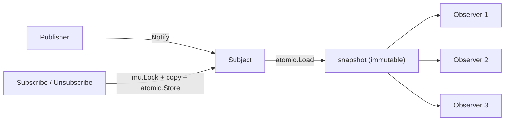
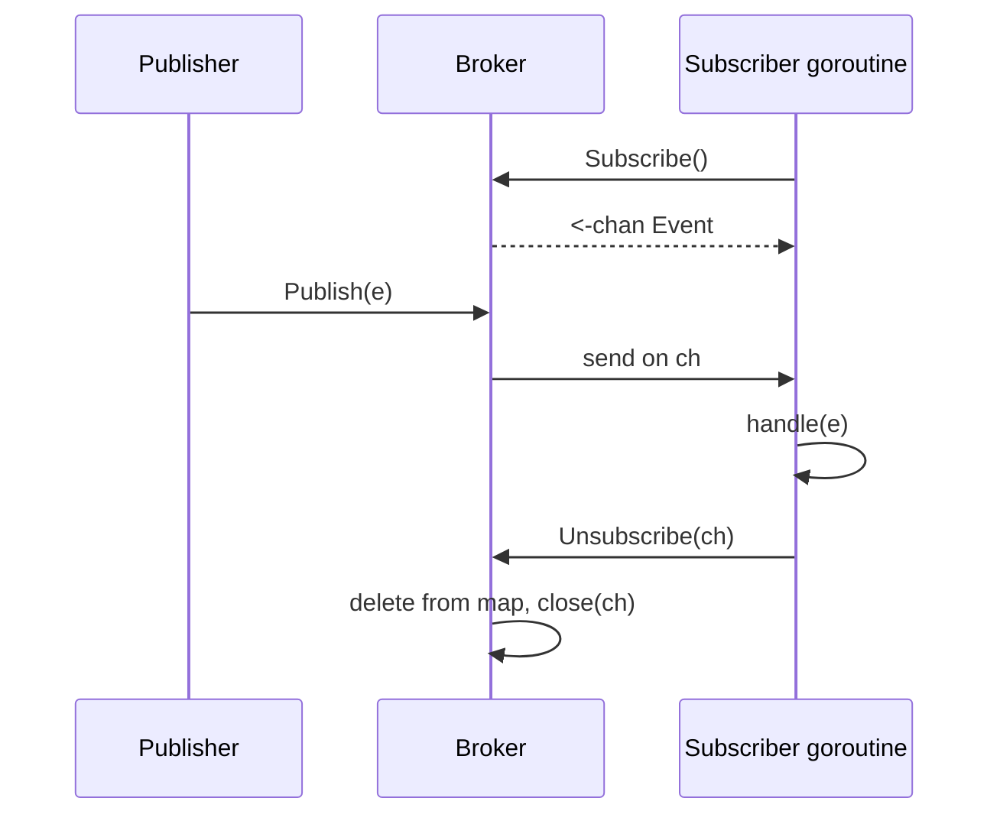
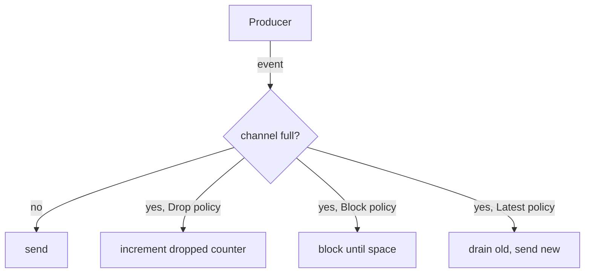

# Observer Pattern — Middle

## 1. What this level adds

Junior taught the shape: a `Subject` holds a slice of `Observer`s, `Subscribe` appends, `Notify` loops. That works for a single-goroutine demo. Middle is about everything that breaks the moment real code uses it:

- Concurrent subscribe/notify safely — `sync.RWMutex` and the copy-on-write subscriber list.
- Channel-based pub-sub — when you stop returning observer interfaces and start fanning out on channels.
- Async notification — each observer in its own goroutine; what that buys you and what it costs.
- Slow observers — drop, buffer, or apply backpressure?
- The idiomatic `Subscribe` that returns an `unsubscribe func()` instead of an ID.
- Filtering and predicate-based subscriptions.
- Typed events — generics, hierarchical event names, per-topic observers.
- Testing observers without flake.
- Notification cost as N grows — when O(N) starts to hurt.
- The bugs that bite in production.

By the end you should be able to design an observer subsystem that survives parallel publishers, slow subscribers, and the test suite.

---

## 2. Table of Contents

1. [What this level adds](#1-what-this-level-adds)
2. [Table of Contents](#2-table-of-contents)
3. [Concurrent observers — RWMutex and copy-on-write](#3-concurrent-observers--rwmutex-and-copy-on-write)
4. [Channel-based pub-sub](#4-channel-based-pub-sub)
5. [Async notification — fan-out goroutines](#5-async-notification--fan-out-goroutines)
6. [Slow observers — drop, buffer, backpressure](#6-slow-observers--drop-buffer-backpressure)
7. [Subscribe returning an unsubscribe func](#7-subscribe-returning-an-unsubscribe-func)
8. [Filtering and predicates](#8-filtering-and-predicates)
9. [Hierarchical and typed events](#9-hierarchical-and-typed-events)
10. [Generic Observer[T]](#10-generic-observert)
11. [Testing observers](#11-testing-observers)
12. [Performance — cost of N observers](#12-performance--cost-of-n-observers)
13. [Coding patterns](#13-coding-patterns)
14. [Common middle-level mistakes](#14-common-middle-level-mistakes)
15. [Debugging observer bugs](#15-debugging-observer-bugs)
16. [Tricky points](#16-tricky-points)
17. [Test](#17-test)
18. [Cheat sheet](#18-cheat-sheet)
19. [Summary](#19-summary)

---

## 3. Concurrent observers — RWMutex and copy-on-write

The first thing the junior version gets wrong: a single mutex, held during `Notify`. That serialises every publisher and every observer. Two patterns fix it.

### 3.1 The naive (and wrong) version

```go
type Subject struct {
    mu        sync.Mutex
    observers []Observer
}

func (s *Subject) Subscribe(o Observer)   { s.mu.Lock(); s.observers = append(s.observers, o); s.mu.Unlock() }
func (s *Subject) Notify(e Event) {
    s.mu.Lock()
    defer s.mu.Unlock()
    for _, o := range s.observers {
        o.OnEvent(e)   // ! holds the lock during arbitrary observer code
    }
}
```

Two failures:

1. While `Notify` runs, no one can `Subscribe` or `Unsubscribe`.
2. If an observer's `OnEvent` calls back into the subject (subscribes a new observer, publishes another event), you deadlock on the same goroutine — `sync.Mutex` is not reentrant.

### 3.2 RWMutex

```go
type Subject struct {
    mu        sync.RWMutex
    observers []Observer
}

func (s *Subject) Subscribe(o Observer) {
    s.mu.Lock()
    s.observers = append(s.observers, o)
    s.mu.Unlock()
}

func (s *Subject) Notify(e Event) {
    s.mu.RLock()
    snapshot := s.observers
    s.mu.RUnlock()
    for _, o := range snapshot {
        o.OnEvent(e)
    }
}
```

Better — multiple `Notify` calls can run concurrently (each holds a read lock briefly, then releases before calling observers). But there's still a subtle bug: `snapshot := s.observers` copies the slice *header*, not the backing array. If `Subscribe` runs concurrently and `append` allocates a new backing array, you're safe. If `append` reuses the existing one (capacity left over), the iteration sees the new entry — and `len(snapshot)` doesn't, so the new entry isn't visited. Inconsistent, but not racy.

The deeper issue is mutation: if `Unsubscribe` rewrites the slice in place (via `s.observers[i] = s.observers[last]` swap-and-trim), the snapshot can see torn writes. Not safe.

### 3.3 Copy-on-write

The bulletproof pattern: the observer list is *immutable*. Every mutation creates a new slice.

```go
type Subject struct {
    mu        sync.Mutex
    observers atomic.Pointer[[]Observer]
}

func NewSubject() *Subject {
    s := &Subject{}
    empty := []Observer{}
    s.observers.Store(&empty)
    return s
}

func (s *Subject) Subscribe(o Observer) {
    s.mu.Lock()
    defer s.mu.Unlock()
    cur := *s.observers.Load()
    next := make([]Observer, len(cur)+1)
    copy(next, cur)
    next[len(cur)] = o
    s.observers.Store(&next)
}

func (s *Subject) Notify(e Event) {
    obs := *s.observers.Load() // O(1), lock-free
    for _, o := range obs {
        o.OnEvent(e)
    }
}
```

Reads are lock-free — `atomic.Pointer.Load` is a single load instruction. Writes (Subscribe / Unsubscribe) take a mutex to serialise the read-modify-write but never block readers. The slice each `Notify` reads is fixed and safe to iterate without further coordination.

Cost: each subscribe/unsubscribe allocates a fresh slice. Fine when subscribe rate is low compared to notify rate (the common case). Bad if you're churning subscriptions in a hot loop.



### 3.4 Choosing between them

- **Few observers, infrequent changes**: RWMutex is fine. Simpler.
- **Many observers, frequent reads**: copy-on-write. Lock-free fast path matters.
- **Mostly writes**: neither is great; rethink the design — probably you want a different pattern (e.g., a queue).

The standard library favours RWMutex; high-throughput pub-sub systems (e.g., `prometheus/client_golang`'s notifier, `nats.go`'s subscription tree) lean towards copy-on-write or sharded maps.

---

## 4. Channel-based pub-sub

When observers are independent goroutines that already have channels, the interface-based observer disappears. The channel *is* the observer.

```go
type Broker struct {
    mu   sync.RWMutex
    subs map[chan Event]struct{}
}

func NewBroker() *Broker {
    return &Broker{subs: make(map[chan Event]struct{})}
}

func (b *Broker) Subscribe() <-chan Event {
    ch := make(chan Event, 16)
    b.mu.Lock()
    b.subs[ch] = struct{}{}
    b.mu.Unlock()
    return ch
}

func (b *Broker) Unsubscribe(ch <-chan Event) {
    b.mu.Lock()
    for s := range b.subs {
        if s == ch {
            delete(b.subs, s)
            close(s)
            break
        }
    }
    b.mu.Unlock()
}

func (b *Broker) Publish(e Event) {
    b.mu.RLock()
    defer b.mu.RUnlock()
    for ch := range b.subs {
        select {
        case ch <- e:
        default: // dropped — see §6
        }
    }
}
```

The consumer side is plain Go:

```go
ch := broker.Subscribe()
go func() {
    for e := range ch {
        handle(e)
    }
}()
```

### 4.1 Buffered vs unbuffered

| Buffer | Behaviour | When to use |
|--------|-----------|-------------|
| Unbuffered (`make(chan Event)`) | `Publish` blocks until the consumer reads | Synchronous handoff; backpressure is implicit |
| Small buffer (8-32) | Absorbs short bursts; drops or blocks beyond | Default for log streams, metrics |
| Large buffer (1k+) | Hides slow consumers | Use sparingly — buffers turn memory into a slow-consumer pillow |
| Unbounded (queue) | Doesn't drop; can OOM | Almost never the right answer |

Rule of thumb: pick the *smallest* buffer that absorbs your normal burst pattern. The buffer's job is to smooth jitter, not to compensate for a permanently slow consumer.

### 4.2 The closed-channel problem

```go
ch := broker.Subscribe()
broker.Unsubscribe(ch) // closes ch
broker.Publish(e)      // tries to send on closed channel — panic
```

The bug: `Publish` doesn't know the subscriber unsubscribed mid-loop. Two fixes:

```go
// Fix A: hold a write lock during Unsubscribe so no concurrent Publish is iterating.
// (Already true here — Unsubscribe takes mu.Lock; Publish takes mu.RLock; they're exclusive.)

// Fix B: never close in Unsubscribe; let the consumer close.
func (b *Broker) Unsubscribe(ch <-chan Event) {
    b.mu.Lock()
    delete(b.subs, /* ... */)
    b.mu.Unlock()
    // consumer notices delete by stopping its goroutine on a separate signal
}
```

Fix A is simpler and correct because the locks serialise everything. Closing is fine if and only if no `Publish` can be running concurrently.



---

## 5. Async notification — fan-out goroutines

Per-observer goroutines decouple slow observers from fast ones.

```go
func (s *Subject) Notify(e Event) {
    obs := *s.observers.Load()
    var wg sync.WaitGroup
    for _, o := range obs {
        wg.Add(1)
        go func(o Observer) {
            defer wg.Done()
            o.OnEvent(e)
        }(o)
    }
    wg.Wait()
}
```

`Notify` returns when every observer has finished. A slow observer no longer blocks fast ones; the call still waits for the slowest.

### 5.1 Fire-and-forget

If `Notify` shouldn't wait at all:

```go
func (s *Subject) Notify(e Event) {
    for _, o := range *s.observers.Load() {
        go o.OnEvent(e)
    }
}
```

`Notify` returns immediately. Each observer runs to completion in its own goroutine. Problems:

- **Ordering**: observers may handle events out of order if multiple `Notify` calls overlap.
- **Cleanup**: there's no `wg.Wait()` anywhere; on shutdown you can't know when in-flight notifications finished.
- **Goroutine bloat**: each event spawns N goroutines. At 10k events/sec × 100 observers = 1M goroutines/sec.

For the third problem, a per-observer goroutine *pool* is the answer:

```go
type asyncObserver struct {
    inner Observer
    ch    chan Event
}

func newAsyncObserver(inner Observer, buf int) *asyncObserver {
    a := &asyncObserver{inner: inner, ch: make(chan Event, buf)}
    go func() {
        for e := range a.ch {
            a.inner.OnEvent(e)
        }
    }()
    return a
}

func (a *asyncObserver) OnEvent(e Event) {
    a.ch <- e // one goroutine per observer, not per event
}
```

Each observer has *one* worker goroutine; events queue on its channel. Fixed goroutine count, FIFO ordering per observer.

### 5.2 The `sync.WaitGroup` pattern

When you really need synchronous "all observers handled this event before I return" semantics (e.g., domain events in a transaction):

```go
func (s *Subject) Notify(ctx context.Context, e Event) error {
    obs := *s.observers.Load()
    g, ctx := errgroup.WithContext(ctx)
    for _, o := range obs {
        o := o
        g.Go(func() error { return o.OnEvent(ctx, e) })
    }
    return g.Wait()
}
```

`errgroup` (from `golang.org/x/sync`) collects the first error and cancels the context. Useful when one failing observer should stop the others or roll back work.

---

## 6. Slow observers — drop, buffer, backpressure

The defining problem of pub-sub. Three policies; pick by the loss tolerance of your domain.

### 6.1 Drop on full

```go
select {
case ch <- e:
default:
    // drop — count it for visibility
    atomic.AddUint64(&dropped, 1)
}
```

Used by: metric pipelines, log streams, telemetry. The receiver is best-effort; dropping is acceptable. Always *count* drops — silent drops are the worst kind.

### 6.2 Buffer (and accept the memory)

```go
ch := make(chan Event, 4096)
```

Absorb bursts. Works until the consumer falls behind by more than 4096 events; then you're back to dropping or blocking.

The buffer is a band-aid. If the consumer is *permanently* slower than the producer, the buffer fills regardless of size. The right fix is to make the consumer faster (or accept drops).

### 6.3 Block (backpressure)

```go
ch <- e // blocks until consumer reads
```

The producer slows to the consumer's speed. Correct for systems where every event matters (financial transactions, control planes). The cost: a slow consumer drags the entire publisher down. One stuck observer can halt the whole system.

Compromise: timeout the send.

```go
select {
case ch <- e:
case <-time.After(50 * time.Millisecond):
    // give up, count it
}
```

Or use the consumer's own context:

```go
select {
case ch <- e:
case <-consumerCtx.Done():
    // consumer is shutting down, skip
}
```

### 6.4 Adaptive policy

For mature systems, the policy is per-subscriber:

```go
type subscription struct {
    ch     chan Event
    policy DeliveryPolicy // Drop, Block, Latest
}
```

`Latest` (keep only the most recent event):

```go
func deliverLatest(ch chan Event, e Event) {
    for {
        select {
        case ch <- e:
            return
        default:
            // drain one
            select {
            case <-ch:
            default:
                // race: drained by consumer
            }
        }
    }
}
```

Used by `etcd` watcher channels and some configuration-reload streams: the consumer cares only about the latest state, not history.



---

## 7. Subscribe returning an unsubscribe func

The junior pattern (return an ID, pass it back to `Unsubscribe`) works but is awkward. The idiomatic Go API returns a closure that unsubscribes when called.

```go
type Subject struct {
    mu        sync.Mutex
    observers map[*observerEntry]struct{}
}

type observerEntry struct {
    fn func(Event)
}

func (s *Subject) Subscribe(fn func(Event)) (unsubscribe func()) {
    entry := &observerEntry{fn: fn}
    s.mu.Lock()
    s.observers[entry] = struct{}{}
    s.mu.Unlock()
    return func() {
        s.mu.Lock()
        delete(s.observers, entry)
        s.mu.Unlock()
    }
}
```

Usage:

```go
unsub := subject.Subscribe(func(e Event) { log.Println(e) })
defer unsub()
```

The map key is the entry pointer — guaranteed unique without an ID counter. The returned closure captures the entry; calling it deletes that exact subscription.

### 7.1 Why this is better than IDs

- **No ID tracking.** The caller doesn't keep a number; the closure carries everything.
- **`defer`-friendly.** Subscribe + defer Unsubscribe in two lines.
- **Idempotent.** Calling `unsub()` twice does nothing (delete on a missing key is a no-op).
- **Refactor-safe.** Renaming the subject doesn't break callers — they hold an opaque `func()`.

Used by: `context.WithCancel` (returns `cancel func()`), `time.AfterFunc` (returns `*Timer` with `Stop()` — similar shape), `signal.Notify` patterns.

### 7.2 Variant: typed observer

```go
type Sub[E any] struct {
    subs map[*Sub[E]]chan E
}
```

The closure pattern composes with generics — Subscribe returns `(<-chan E, func())`. See §10.

---

## 8. Filtering and predicates

Sometimes an observer wants only a slice of events. Two designs.

### 8.1 Filter in the observer

```go
unsub := subject.Subscribe(func(e Event) {
    if e.Kind != "order.created" { return }
    handleOrderCreated(e)
})
```

Cheapest to implement, costliest to run: every observer fires for every event, then most discard immediately. At high event rates the dispatch overhead dominates.

### 8.2 Filter at subscribe time

```go
type Predicate func(Event) bool

func (s *Subject) SubscribeIf(pred Predicate, fn func(Event)) func() {
    return s.Subscribe(func(e Event) {
        if pred(e) {
            fn(e)
        }
    })
}
```

Still dispatches to every subscriber, but the predicate check is colocated with the subscription — readable and uniform.

### 8.3 Index by topic / event kind

```go
type TopicBroker struct {
    mu   sync.RWMutex
    subs map[string]map[*entry]func(Event)
}

func (b *TopicBroker) Subscribe(topic string, fn func(Event)) func() {
    e := &entry{}
    b.mu.Lock()
    if b.subs[topic] == nil {
        b.subs[topic] = map[*entry]func(Event){}
    }
    b.subs[topic][e] = fn
    b.mu.Unlock()
    return func() {
        b.mu.Lock()
        delete(b.subs[topic], e)
        b.mu.Unlock()
    }
}

func (b *TopicBroker) Publish(topic string, e Event) {
    b.mu.RLock()
    subs := b.subs[topic]
    b.mu.RUnlock()
    for _, fn := range subs {
        fn(e)
    }
}
```

Now `Publish("order.created", e)` only iterates `order.created` subscribers. O(observers-of-this-topic) instead of O(all-observers). This is the model that most pub-sub libraries (NATS, Redis pub-sub, Kafka consumer groups) standardise on.

---

## 9. Hierarchical and typed events

### 9.1 Hierarchical topics

```
order.*
  order.created
  order.cancelled
  order.refunded
payment.*
  payment.charged
  payment.failed
```

A subscriber to `order.*` should receive every event whose topic starts with `order.`. Implement as a trie or via prefix matching:

```go
func (b *TopicBroker) Publish(topic string, e Event) {
    b.mu.RLock()
    defer b.mu.RUnlock()
    for sub, fn := range b.subs {
        if matches(sub, topic) {
            fn(e)
        }
    }
}

func matches(pattern, topic string) bool {
    if strings.HasSuffix(pattern, ".*") {
        return strings.HasPrefix(topic, strings.TrimSuffix(pattern, "*"))
    }
    return pattern == topic
}
```

For NATS-style `>` (multi-level wildcard) or `*` (single-level), use a subscription tree. Performance: trie matching is O(depth), beating linear scan when subscribers grow.

### 9.2 Typed event structs

```go
type Event interface{ kind() string }

type OrderCreated struct {
    ID     string
    Amount int
}
func (OrderCreated) kind() string { return "order.created" }

type OrderCancelled struct {
    ID     string
    Reason string
}
func (OrderCancelled) kind() string { return "order.cancelled" }
```

Subscribers receive `Event`, type-switch to react:

```go
unsub := subject.Subscribe(func(e Event) {
    switch ev := e.(type) {
    case OrderCreated:
        handleCreated(ev)
    case OrderCancelled:
        handleCancelled(ev)
    }
})
```

The interface is a sealed union by convention. The `kind()` method exists so the dispatcher can route or log without a type switch.

### 9.3 Per-type subject

For maximum type safety, one subject per event type:

```go
type OrderCreatedSubject struct { /* ... */ }
type OrderCancelledSubject struct { /* ... */ }
```

Verbose, but each subscriber gets the right type with no assertion. Combined with generics (§10) you get the brevity back.

---

## 10. Generic Observer[T]

Go 1.18+ generics make typed observers ergonomic.

```go
type Observer[T any] func(T)

type Subject[T any] struct {
    mu        sync.Mutex
    observers map[*observerEntry[T]]Observer[T]
}

type observerEntry[T any] struct{}

func New[T any]() *Subject[T] {
    return &Subject[T]{observers: map[*observerEntry[T]]Observer[T]{}}
}

func (s *Subject[T]) Subscribe(fn Observer[T]) (unsubscribe func()) {
    e := &observerEntry[T]{}
    s.mu.Lock()
    s.observers[e] = fn
    s.mu.Unlock()
    return func() {
        s.mu.Lock()
        delete(s.observers, e)
        s.mu.Unlock()
    }
}

func (s *Subject[T]) Notify(v T) {
    s.mu.Lock()
    snapshot := make([]Observer[T], 0, len(s.observers))
    for _, fn := range s.observers {
        snapshot = append(snapshot, fn)
    }
    s.mu.Unlock()
    for _, fn := range snapshot {
        fn(v)
    }
}
```

Usage:

```go
orderCreated := New[OrderCreated]()
unsub := orderCreated.Subscribe(func(o OrderCreated) {
    log.Printf("order %s for %d", o.ID, o.Amount)
})
defer unsub()

orderCreated.Notify(OrderCreated{ID: "o-1", Amount: 1000})
```

Type-safe end to end. No `any`, no assertions, no `kind()` method.

### 10.1 Generic broker with channels

```go
type Broker[T any] struct {
    mu   sync.RWMutex
    subs map[chan T]struct{}
}

func NewBroker[T any]() *Broker[T] {
    return &Broker[T]{subs: make(map[chan T]struct{})}
}

func (b *Broker[T]) Subscribe(buf int) (<-chan T, func()) {
    ch := make(chan T, buf)
    b.mu.Lock()
    b.subs[ch] = struct{}{}
    b.mu.Unlock()
    return ch, func() {
        b.mu.Lock()
        if _, ok := b.subs[ch]; ok {
            delete(b.subs, ch)
            close(ch)
        }
        b.mu.Unlock()
    }
}

func (b *Broker[T]) Publish(v T) {
    b.mu.RLock()
    defer b.mu.RUnlock()
    for ch := range b.subs {
        select {
        case ch <- v:
        default:
        }
    }
}
```

The whole pattern in 30 lines, type-safe per event type. This is what most modern Go pub-sub helpers look like.

### 10.2 When generics don't help

- One subject handles many event *types* — you're back to `interface{}` or a sealed union.
- The receivers don't care about type (logging sinks). Pass `any`; the consumer formats with `%v`.

---

## 11. Testing observers

Observer code is async-friendly to write and async-hostile to test. Three techniques.

### 11.1 Synchronous test mode

```go
type Subject struct {
    notifyMode notifyMode // sync or async
    // ...
}

type notifyMode int
const (
    syncMode notifyMode = iota
    asyncMode
)

func (s *Subject) Notify(e Event) {
    obs := *s.observers.Load()
    if s.notifyMode == syncMode {
        for _, o := range obs { o.OnEvent(e) }
        return
    }
    var wg sync.WaitGroup
    for _, o := range obs {
        wg.Add(1)
        go func(o Observer) { defer wg.Done(); o.OnEvent(e) }(o)
    }
    wg.Wait()
}
```

Test mode runs everything in the publisher's goroutine. No timing surprises. Production mode fans out.

Some teams find a flag like this unnecessarily clever. The cleaner version: write `Notify` synchronously and let *consumers* opt into goroutines:

```go
func (s *Subject) Notify(e Event) {
    for _, o := range *s.observers.Load() {
        o.OnEvent(e)
    }
}

// Observer that wants async behaviour wraps itself
type AsyncObserver struct{ inner Observer; ch chan Event }
```

Tests stay synchronous; the production system layers async on top.

### 11.2 Waiting for the right number of calls

If async is non-negotiable:

```go
func TestSubject_NotifyAllObservers(t *testing.T) {
    s := New()
    var got atomic.Int64
    var wg sync.WaitGroup
    wg.Add(3)
    for i := 0; i < 3; i++ {
        s.Subscribe(func(e Event) {
            got.Add(1)
            wg.Done()
        })
    }
    s.Notify(Event{})
    waitTimeout(t, &wg, time.Second)
    if got.Load() != 3 {
        t.Errorf("got %d notifications, want 3", got.Load())
    }
}

func waitTimeout(t *testing.T, wg *sync.WaitGroup, d time.Duration) {
    done := make(chan struct{})
    go func() { wg.Wait(); close(done) }()
    select {
    case <-done:
    case <-time.After(d):
        t.Fatal("timeout waiting for observers")
    }
}
```

The `waitTimeout` helper protects against tests hanging forever. Always time-bound async waits in tests.

### 11.3 Channel-based assertions

When observers communicate via channels:

```go
ch := broker.Subscribe()
broker.Publish(Event{ID: "1"})

select {
case got := <-ch:
    if got.ID != "1" { t.Errorf("got %q", got.ID) }
case <-time.After(time.Second):
    t.Fatal("did not receive event")
}
```

Direct, no `time.Sleep`, no race detector flak.

### 11.4 Test the negative

Make sure unsubscribed observers don't fire:

```go
called := 0
unsub := s.Subscribe(func(_ Event) { called++ })
unsub()
s.Notify(Event{})
if called != 0 {
    t.Errorf("unsubscribed observer fired: called=%d", called)
}
```

Common bug: `unsubscribe` deletes from a copied slice but the `Notify` iteration still sees the old one. The negative test catches it.

---

## 12. Performance — cost of N observers

`Notify` is fundamentally O(N) — each observer must hear about the event.

```
BenchmarkNotify_10_observers-8       50000000   30 ns/op    0 B/op
BenchmarkNotify_100_observers-8      10000000  240 ns/op    0 B/op
BenchmarkNotify_1000_observers-8      1000000 2400 ns/op    0 B/op
BenchmarkNotify_10000_observers-8      100000   24 µs/op    0 B/op
```

Linear, as expected. The constant per observer is ~2-3 ns for an interface method call with no work.

### 12.1 Per-event allocations

Watch out for these:

- **`Notify` allocates a snapshot every time** — fix with copy-on-write (§3.3) so the snapshot is just an atomic pointer load.
- **Events boxed into `interface{}`** — each call allocates if `Event` is a struct. Use generics or concrete types to avoid.
- **Closures captured per call** — `Subscribe(func(e Event){...})` allocates the closure once at subscribe time, then reuses it. Good. `for { Subscribe(func(){...}); ... }` allocates on every iteration — bad.

### 12.2 Topic-indexed broker scaling

With a flat list, N subscribers cost O(N) per publish *regardless* of how many care. With topic indexing:

```
BenchmarkPublish_FlatList_10000subs-8        100000    24 µs/op
BenchmarkPublish_Indexed_10000subs-8        1000000   1.2 µs/op  (only 100 listeners on this topic)
```

20x improvement when most subscribers don't care about the event. Topic indexing is the standard scalability move.

### 12.3 Lock contention

A single mutex around subscribe/notify becomes the bottleneck at high publish rates. Shard the broker:

```go
type ShardedBroker struct {
    shards [16]*Broker
}

func (b *ShardedBroker) shardFor(topic string) *Broker {
    h := fnv.New32a()
    h.Write([]byte(topic))
    return b.shards[h.Sum32()%16]
}
```

Publish goes to one shard; subscribers register on one shard. The shard count is a knob — 16-64 for CPU-bound, more for highly concurrent.

### 12.4 Goroutine cost

Per-event-per-observer goroutines (`go o.OnEvent(e)`) allocate ~2 KB of stack each. At 1M events/sec × 100 observers, that's 200 GB of stack churn — most of it short-lived but trashing the scheduler. Use per-observer worker goroutines instead.

---

## 13. Coding patterns

### 13.1 The publisher with a `Close()`

```go
type Subject struct {
    mu       sync.Mutex
    obs      map[*entry]func(Event)
    closed   bool
}

func (s *Subject) Publish(e Event) {
    s.mu.Lock()
    if s.closed {
        s.mu.Unlock()
        return
    }
    snapshot := make([]func(Event), 0, len(s.obs))
    for _, fn := range s.obs {
        snapshot = append(snapshot, fn)
    }
    s.mu.Unlock()
    for _, fn := range snapshot {
        fn(e)
    }
}

func (s *Subject) Close() {
    s.mu.Lock()
    s.closed = true
    s.obs = nil
    s.mu.Unlock()
}
```

After `Close`, `Publish` is a no-op. Subscribers don't get a notification — they should learn the subject is dead via a separate mechanism (context cancellation, a `Done()` channel).

### 13.2 The done-channel pattern

```go
type Subject struct {
    done chan struct{}
    /* ... */
}

func (s *Subject) Done() <-chan struct{} { return s.done }

func (s *Subject) Close() {
    s.mu.Lock()
    if s.done != nil { close(s.done); s.done = nil }
    s.mu.Unlock()
}
```

Subscribers select on the event channel *and* `Done()`:

```go
for {
    select {
    case e := <-ch:
        handle(e)
    case <-subject.Done():
        return
    }
}
```

### 13.3 The middleware-style observer

```go
type Observer func(Event)

type Middleware func(Observer) Observer

func Logging(log *log.Logger) Middleware {
    return func(next Observer) Observer {
        return func(e Event) {
            log.Printf("event: %+v", e)
            next(e)
        }
    }
}

func RecoverPanic(log *log.Logger) Middleware {
    return func(next Observer) Observer {
        return func(e Event) {
            defer func() {
                if r := recover(); r != nil {
                    log.Printf("observer panicked: %v", r)
                }
            }()
            next(e)
        }
    }
}

func Chain(o Observer, mw ...Middleware) Observer {
    for i := len(mw) - 1; i >= 0; i-- {
        o = mw[i](o)
    }
    return o
}
```

Usage:

```go
o := Chain(handler,
    RecoverPanic(log),
    Logging(log),
)
unsub := subject.Subscribe(o)
```

Logging + recover-panic around the handler, composed at subscribe time. Same shape as `http.Handler` middleware.

### 13.4 The dispatcher table

When the event-to-handler mapping is dense:

```go
type Handler func(Event)

var handlers = map[string]Handler{
    "order.created":  handleOrderCreated,
    "order.cancelled": handleOrderCancelled,
    /* ... */
}

func dispatch(e Event) {
    if h, ok := handlers[e.Kind]; ok {
        h(e)
    }
}
```

This is *one* observer that dispatches internally. Useful when you have one consumer that handles many event kinds.

---

## 14. Common middle-level mistakes

### 14.1 Holding the lock during observer code

```go
// Wrong
func (s *Subject) Notify(e Event) {
    s.mu.RLock()
    defer s.mu.RUnlock()
    for _, o := range s.observers {
        o.OnEvent(e) // ! locks the subject for the duration of every observer
    }
}
```

If an observer's `OnEvent` calls back into the subject (subscribe, unsubscribe, publish), you deadlock or starve. Snapshot the observer list under the lock, release, then iterate.

### 14.2 Forgetting to copy the slice when iterating

```go
// Wrong
s.mu.RLock()
snapshot := s.observers
s.mu.RUnlock()
for _, o := range snapshot { /* ... */ } // snapshot shares backing array with s.observers
```

If `Subscribe` appends concurrently *and* the underlying array hasn't been reallocated, the iteration might see partial writes. Either use copy-on-write (so the slice is immutable) or copy on read:

```go
s.mu.RLock()
snapshot := make([]Observer, len(s.observers))
copy(snapshot, s.observers)
s.mu.RUnlock()
```

### 14.3 Panicking observer kills the publisher

```go
for _, o := range observers {
    o.OnEvent(e) // if this panics, no further observer is called
}
```

One bad observer takes down the dispatch. Wrap in recover:

```go
func safeCall(o Observer, e Event) {
    defer func() {
        if r := recover(); r != nil {
            log.Printf("observer panic: %v\n%s", r, debug.Stack())
        }
    }()
    o.OnEvent(e)
}
```

Or use the middleware in §13.3. Always isolate observers from each other.

### 14.4 Closing a channel from the producer side

```go
// Anti-pattern
func (b *Broker) Publish(e Event) {
    for ch := range b.subs {
        select {
        case ch <- e:
        default:
            close(ch) // !
        }
    }
}
```

Closing on send-full says "this channel is dead" — but the consumer might still be ready to read. Worse, a second publisher sending to the same (closed) channel panics. Channels are closed by *senders* (and by exactly one of them). Track subscriber health some other way.

### 14.5 Subscribing from inside an observer

```go
// Risk
subject.Subscribe(func(e Event) {
    subject.Subscribe(handler) // re-entering Subscribe
})
```

If `Subscribe` takes the same lock that `Notify` holds, you deadlock. Even with copy-on-write you get strange ordering: did the new observer see *this* event or only future ones? Document the answer; better, refuse to allow it.

### 14.6 Letting the subscriber list grow forever

```go
ch := broker.Subscribe()
go func() { for e := range ch { handle(e) } }()
// process exits, goroutine stops, but subscription is still in the broker
```

Without an explicit `Unsubscribe` or a context-bound subscription, dead subscribers accumulate. Each `Publish` does pointless work. Production fix: tie subscriptions to a `context.Context`.

```go
func (b *Broker) SubscribeCtx(ctx context.Context) <-chan Event {
    ch, unsub := b.Subscribe()
    go func() { <-ctx.Done(); unsub() }()
    return ch
}
```

---

## 15. Debugging observer bugs

### 15.1 "Observer not called"

Walk the chain:

1. Is `Subscribe` actually being called? Print at subscribe time.
2. Is the subject the *same instance* as the one being notified? Check pointers.
3. Did `Unsubscribe` fire prematurely? Check the lifetime of the returned closure — if the caller dropped its reference and the closure was `defer unsub()`, the deferred call may have run earlier than expected.
4. Does the predicate (§8.2) reject this event? Log inside the predicate.

### 15.2 "Observer called twice"

Usually a double-subscribe. Two patterns:

- The subscribe code ran twice due to a retry / restart loop.
- Two subjects share the same observer slice (aliasing).

Print the entry pointer at subscribe and at dispatch. Duplicate addresses confirm the first; same address with different subject pointers confirms the second.

### 15.3 Goroutine leaks

`go run -trace` or pprof's goroutine profile:

```bash
curl http://localhost:6060/debug/pprof/goroutine?debug=2 > goroutines.txt
```

Look for many goroutines blocked in `chan receive` for the observer's channel. That's an unsubscribed-but-still-running goroutine. Fix with a context-aware loop:

```go
for {
    select {
    case e := <-ch:
        if !ok { return }
        handle(e)
    case <-ctx.Done():
        return
    }
}
```

### 15.4 Lost events under load

If a fraction of events go missing:

- The channel is buffered and `Publish` uses `default:` — drops on full.
- The observer goroutine is slow and the buffer is too small.
- A subscriber unsubscribed mid-publish; events sent before the delete were OK, after were not.

Check the drop counter. Always *have* a drop counter.

### 15.5 Reverse-order events

Two `Publish` calls overlap, both spawn goroutines, the second's goroutine finishes first. Observer sees event 2 before event 1. For order-sensitive observers, use per-observer worker goroutines with a single channel — events go through one FIFO.

---

## 16. Tricky points

### 16.1 Reentrancy

What if an observer calls `subject.Publish(other)` during its own `OnEvent`?

- Recursive publish in the same goroutine: fine for stack-only state, dangerous if the second publish triggers the first observer again (infinite recursion).
- Recursive publish reaching the same observer: that observer must be reentrant-safe. Most aren't.

Two defences:

1. Detect via a goroutine-local depth counter, refuse to nest beyond a limit.
2. Don't publish synchronously — drop the event onto a queue, return immediately; a worker drains the queue. The publisher's stack is bounded.

### 16.2 Order guarantees

```go
subject.Publish(e1)
subject.Publish(e2)
```

Does observer X see `e1` before `e2`?

- **Synchronous notify, single publisher**: yes.
- **Synchronous notify, multiple publishers**: interleaved, but each *publisher's* events arrive in order.
- **Async notify (per-event goroutine)**: no guarantees at all.
- **Async notify via per-observer queue**: per-observer order is preserved.

Document the guarantee you provide. Consumers will rely on it whether you document or not.

### 16.3 Memory ordering and atomic.Pointer

```go
s.observers.Store(&next)
```

The `atomic` package's pointer ops have release/acquire semantics: a `Load` synchronises-with a previous `Store` in the happens-before relation. So readers see the fully-initialised `next` slice, not partial writes. This is why copy-on-write with `atomic.Pointer` is safe without an additional mutex on the read side.

If you replace `atomic.Pointer` with a plain pointer field, the read might see a stale slice or a torn pointer. Don't do this.

### 16.4 Unsubscribe returning false

Some APIs return `bool` from `Unsubscribe`:

```go
ok := s.Unsubscribe(id)
```

When is `ok == false`? Usually "already unsubscribed". Decide whether that's a programmer error (panic) or a fact of life (silent no-op). Most Go libraries pick silent no-op — matches `delete()` on a missing map key.

### 16.5 Observer holding the subject

```go
type Logger struct { subject *Subject }
func (l *Logger) OnEvent(e Event) {
    if shouldUnsubscribe(e) {
        l.subject.Unsubscribe(l)
    }
}
```

The observer needs to know about the subject so it can unsubscribe itself. Either pass the subject in (creates a cycle: observer → subject → observer slice → observer) or use the closure pattern from §7 — the unsubscribe func captures the subject without exposing it to the observer.

### 16.6 Generic subjects in interfaces

```go
type EventSource[T any] interface {
    Subscribe(fn func(T)) func()
    Publish(v T)
}
```

Type parameters on interfaces are fine but you can't put `[T any]` interfaces in a heterogeneous slice. If you need a registry of subjects of *different* types, fall back to `any` at the boundary:

```go
var subjects = map[string]any{}

func GetSubject[T any](name string) *Subject[T] {
    return subjects[name].(*Subject[T])
}
```

Trade compile-time safety for the ability to enumerate. Usually worth it for registries.

---

## 17. Test

**Q1.** Spot the bug.

```go
type Subject struct {
    mu        sync.RWMutex
    observers []Observer
}

func (s *Subject) Notify(e Event) {
    s.mu.RLock()
    defer s.mu.RUnlock()
    for _, o := range s.observers {
        o.OnEvent(e)
    }
}

func (s *Subject) Subscribe(o Observer) {
    s.mu.Lock()
    defer s.mu.Unlock()
    s.observers = append(s.observers, o)
}

// In an observer:
func (o *MyObserver) OnEvent(e Event) {
    o.subject.Subscribe(newObserver()) // ?
}
```

<details><summary>Answer</summary>

Deadlock. `Notify` holds `mu.RLock`. The observer calls `Subscribe`, which wants `mu.Lock` — but a writer cannot acquire while readers hold the lock. The writer waits for readers to release; the reader can't release until the observer returns; the observer can't return until the writer acquires. Classic upgrade deadlock.

Fix: snapshot under read-lock, release, then dispatch:

```go
func (s *Subject) Notify(e Event) {
    s.mu.RLock()
    snapshot := make([]Observer, len(s.observers))
    copy(snapshot, s.observers)
    s.mu.RUnlock()
    for _, o := range snapshot {
        o.OnEvent(e)
    }
}
```

Or use copy-on-write so `Notify` doesn't take any lock at all.
</details>

**Q2.** What's wrong with this broker?

```go
func (b *Broker) Publish(e Event) {
    b.mu.RLock()
    defer b.mu.RUnlock()
    for ch := range b.subs {
        ch <- e
    }
}
```

<details><summary>Answer</summary>

Two problems.

1. **Slow subscriber stalls every publisher.** `ch <- e` blocks if the channel is full. While blocked, the read lock is held, so no `Subscribe` or `Unsubscribe` can run, and other publishers also block (they need `mu.RLock`, which is shared but not while a writer is queued).

2. **No drop / backpressure policy.** A single dead consumer pauses the whole broker.

Fix: `select` with `default` (drop) or with a short timeout, plus a drop counter:

```go
func (b *Broker) Publish(e Event) {
    b.mu.RLock()
    defer b.mu.RUnlock()
    for ch := range b.subs {
        select {
        case ch <- e:
        default:
            atomic.AddUint64(&b.dropped, 1)
        }
    }
}
```

For high-throughput systems, also release the lock before sending (snapshot the channel slice).
</details>

**Q3.** Which is more idiomatic in Go?

```go
// A
id := subject.Subscribe(handler)
defer subject.Unsubscribe(id)

// B
unsub := subject.Subscribe(handler)
defer unsub()
```

<details><summary>Answer</summary>

B. The closure carries the unsubscribe state itself; the caller doesn't manage an ID. Matches `context.WithCancel` and many other Go APIs. A also works but adds a free integer the caller must shepherd around.

The closure form makes incorrect use harder: there's no integer to lose, no chance of unsubscribing the wrong subscription.
</details>

**Q4.** What's the issue?

```go
broker := NewBroker()
ch := broker.Subscribe()
go func() {
    for e := range ch {
        handle(e)
    }
}()

// later, in a different goroutine
broker.Close()
```

<details><summary>Answer</summary>

Depends on `Close`. If `Close` closes every subscriber's channel, the consumer goroutine sees `range` end and exits cleanly — good. If `Close` doesn't close subscriber channels (just sets a `closed` flag and skips publishing), the consumer goroutine blocks on `<-ch` forever — a leak.

Solutions:

- `Close` closes all subscriber channels. Document it. (Subscribers must handle the close, e.g., by treating it as "the broker is gone".)
- `Close` also signals via a separate `Done()` channel that subscribers select on.

```go
for {
    select {
    case e, ok := <-ch:
        if !ok { return }
        handle(e)
    case <-broker.Done():
        return
    }
}
```

Pick a contract and stick to it. Inconsistent close semantics are a top source of subtle leaks.
</details>

**Q5.** Why might this benchmark mislead?

```go
func BenchmarkNotify(b *testing.B) {
    s := New()
    for i := 0; i < 1000; i++ {
        s.Subscribe(func(_ Event) {})
    }
    for i := 0; i < b.N; i++ {
        s.Notify(Event{})
    }
}
```

<details><summary>Answer</summary>

The observer is `func(_ Event) {}` — does nothing. The compiler may inline it, eliminate the call, or otherwise optimise the loop into nothing. The benchmark measures the *framework* cost (interface dispatch, snapshot) but not realistic per-observer work.

Fix:

```go
var sink int64
s.Subscribe(func(_ Event) {
    atomic.AddInt64(&sink, 1)
})
```

Force a side effect. Or have observers do realistic work — a map lookup, a small allocation. Otherwise your "1000 observers in 240 ns" is a measurement of the empty case, not your system's behaviour.
</details>

---

## 18. Cheat sheet

| Scenario | Approach |
|----------|----------|
| Single goroutine, small N | Plain `[]Observer`, no lock |
| Concurrent subscribe/notify | `sync.RWMutex` + snapshot-then-release |
| Notify >> Subscribe | Copy-on-write via `atomic.Pointer[[]Observer]` |
| Decoupled consumers | Channel-based broker — `Subscribe` returns `<-chan Event` |
| Slow observer mustn't block | `select` with `default` (drop); count drops |
| Strict delivery | Block on send, accept the back-pressure |
| Keep latest only | "Latest" policy — drain stale, send fresh |
| Idiomatic unsubscribe | `Subscribe` returns `unsubscribe func()` |
| Many event kinds | Topic-indexed broker, prefix matching for hierarchy |
| Type-safe | Generic `Subject[T]` and `Broker[T]` |
| Per-observer ordering | One worker goroutine per observer, fed by its own channel |
| Survive panics | `defer recover()` per dispatch; isolate observers |
| Tie to lifecycle | `context.Context` driven subscriptions; auto-unsubscribe on cancel |
| Testing | Synchronous notify in tests; channel-based assertions with timeouts |

---

## 19. Summary

The middle-level observer in Go is a small set of decisions made well:

- **Concurrency model**: RWMutex for moderate use; copy-on-write for high read/write ratios.
- **Delivery contract**: synchronous and ordered, async per-observer, or fire-and-forget — pick one per subject and document it.
- **Slow-observer policy**: drop, buffer, block — chosen by domain tolerance, never left implicit.
- **Subscribe shape**: return an `unsubscribe func()`, not an ID.
- **Type model**: generics when the event type is fixed; sealed-interface unions when one subject carries many.
- **Topic structure**: flat for small systems, indexed for large, hierarchical when subscribers genuinely care about prefixes.
- **Lifetime**: tie subscriptions to a context whenever a subscriber is anything but immortal.

Most production observer code in Go is a thin layer over channels and a mutex. The pattern's value isn't in its abstraction — Go barely needs the abstraction — but in the *vocabulary*: drop/buffer/backpressure, copy-on-write subscriber list, per-observer worker, hierarchical topic. These names let you discuss design without redrawing the diagram.

The next step is **[senior.md](senior.md)** — observer at scale: distributed event buses, durable subscriptions and replay, dead-letter handling, ordered delivery across partitions, backpressure protocols (credit-based, reactive streams), and case studies in real Go ecosystems (`etcd` watchers, `nats.go`, `prometheus` notifier, Kubernetes informers).
