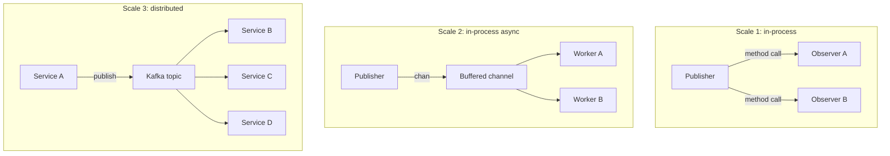
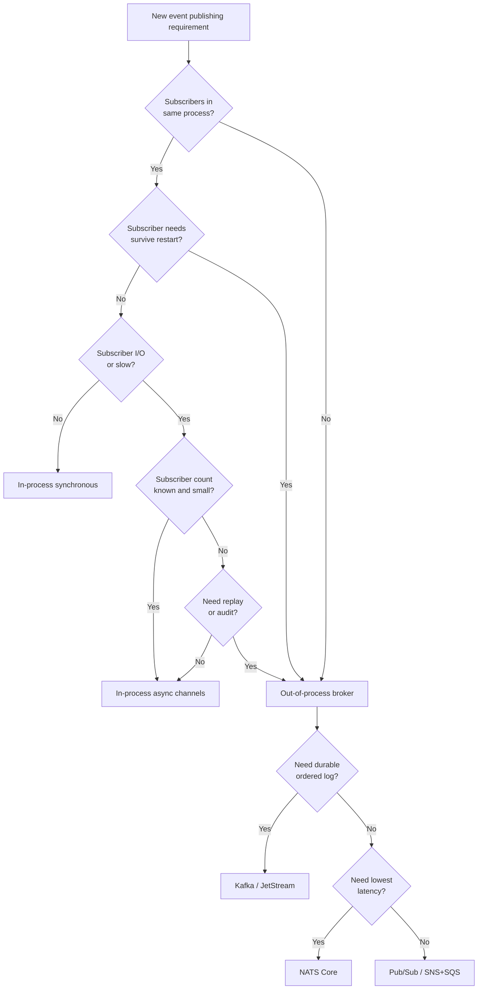
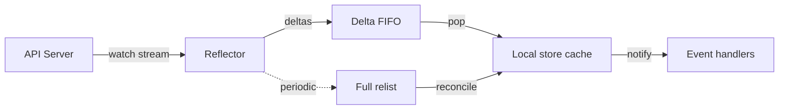
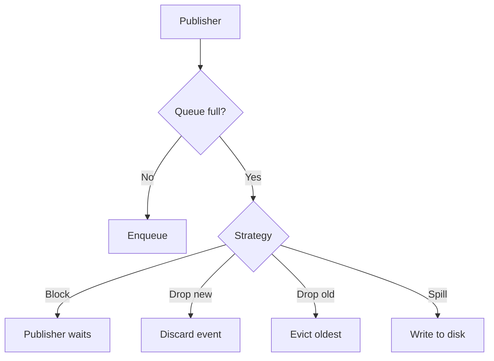
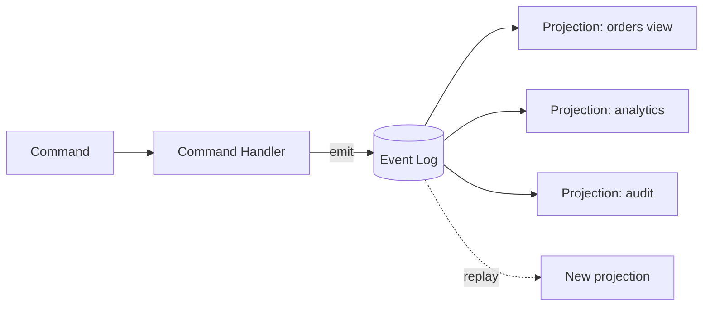
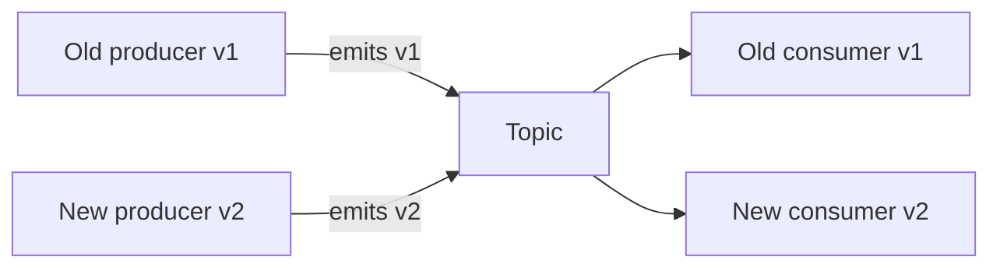
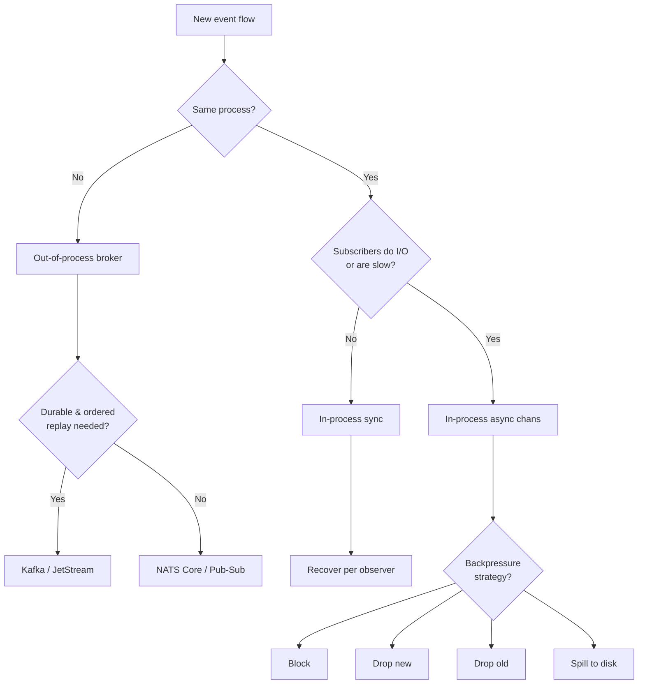

# Observer Pattern — Senior

## 1. The architectural question

Junior taught the shape — a `Subject` holds a list of `Observer`s and calls `Notify` to fan a single event out to all of them. Middle taught the mechanics in Go — channels vs callbacks, goroutine-safe subscriber lists, removing observers without races, the cost of synchronous fan-out. Senior is what happens when the observer pattern stops being a struct in one process and becomes the *spine of a distributed system*.

The day your service publishes `OrderCreated` to Kafka, every downstream team's pipeline depends on that event's shape, ordering, and delivery semantics. The day your Kubernetes informer skips an event because the watch cursor expired, half a deployment ends up in a state nobody can explain. The day your in-process observer fans out to a slow logger that does synchronous I/O, the request hot path tail latency triples and nobody can find the source for a week.

The senior-level forces:

1. **Observer is the distributed pub-sub pattern** — Kafka, NATS, RabbitMQ, Google Pub/Sub, AWS SNS+SQS, Redis Streams. Every event-driven architecture is an observer pattern scaled across machines.
2. **In-process vs out-of-process is a deployment decision, not a design decision** — the *same* observer interface in code can be backed by a channel, a goroutine, or a Kafka topic. Knowing when to switch is a senior judgement call.
3. **Backpressure is the central problem** — fast publishers, slow subscribers, bounded memory. The naïve observer pattern has no story here; production systems live or die by it.
4. **Ordering guarantees are subtle and expensive** — total order across all events, partial order within a key, no order. Each tier costs progressively more throughput.
5. **Event sourcing is the Observer pattern with a durable log** — the same fan-out shape, but events are persisted and replayable. CQRS, audit, time-travel debugging.
6. **The Go ecosystem ships Observer in a hundred places** — `fsnotify`, prometheus collector callbacks, etcd watchers, kubernetes informers, gRPC server streams, `sync.Cond.Broadcast`. Every one of them is the same pattern with different operational guarantees.
7. **Anti-patterns at scale** — observer chains causing N+1 fanout storms, synchronous notification in the request hot path, observers that do I/O, leaks via forgotten unsubscribe, lock contention on shared subscriber lists.
8. **API evolution under fire** — once an event type ships, downstream consumers freeze its shape. Adding fields, deprecating events, partitioning the schema — all need plans.

This file covers all of it. Sections 3-6 walk the in-process to out-of-process transition. Sections 7-10 cover the Go ecosystem's Observer instances. Sections 11-13 cover ordering, backpressure, event sourcing. Sections 14-17 cover concurrency at scale, anti-patterns, API evolution. Section 18 is postmortems. The rest is cross-language comparison, mistakes, questions, and reference material.

---

## 2. Table of Contents

1. [The architectural question](#1-the-architectural-question)
2. [Table of Contents](#2-table-of-contents)
3. [Observer at three scales](#3-observer-at-three-scales)
4. [In-process Observer: limits and signals to switch](#4-in-process-observer-limits-and-signals-to-switch)
5. [Out-of-process Observer: Kafka, NATS, Pub/Sub](#5-out-of-process-observer-kafka-nats-pubsub)
6. [Decision: when does Observer leave the process](#6-decision-when-does-observer-leave-the-process)
7. [fsnotify: the OS as the Subject](#7-fsnotify-the-os-as-the-subject)
8. [Prometheus collectors: pull-based Observer](#8-prometheus-collectors-pull-based-observer)
9. [etcd watchers and Kubernetes informers](#9-etcd-watchers-and-kubernetes-informers)
10. [gRPC server streams and bidi as Observer](#10-grpc-server-streams-and-bidi-as-observer)
11. [Backpressure strategies at scale](#11-backpressure-strategies-at-scale)
12. [Ordering guarantees: total, partial, none](#12-ordering-guarantees-total-partial-none)
13. [Event sourcing as the Observer pattern](#13-event-sourcing-as-the-observer-pattern)
14. [Concurrency at scale: lock-free lists, sharded subscribers](#14-concurrency-at-scale-lock-free-lists-sharded-subscribers)
15. [API evolution: non-breaking event schema changes](#15-api-evolution-non-breaking-event-schema-changes)
16. [Anti-patterns](#16-anti-patterns)
17. [Profiling and debugging Observer chains](#17-profiling-and-debugging-observer-chains)
18. [Postmortems](#18-postmortems)
19. [Cross-language comparison](#19-cross-language-comparison)
20. [Common senior-level mistakes](#20-common-senior-level-mistakes)
21. [Tricky questions](#21-tricky-questions)
22. [Cheat sheet](#22-cheat-sheet)
23. [Further reading](#23-further-reading)

---

## 3. Observer at three scales

The pattern has the same shape at three radically different scales. Recognising the scale you're operating at is the first senior skill.



| Scale | Mechanism | Typical latency | Failure model |
|-------|-----------|-----------------|----------------|
| 1. In-process synchronous | Direct method call | nanoseconds | Caller blocks; panic propagates |
| 2. In-process asynchronous | Goroutine + channel | microseconds | Buffer fills; subscriber lag |
| 3. Out-of-process distributed | Kafka, NATS, etc. | milliseconds | Network partition; broker down; subscriber crash; duplicate delivery |

The interface in Go code can be identical across all three scales — a `func(event Event) error` callback, or a `Subscribe(topic string) <-chan Event` shape — but the operational implications are utterly different. A senior engineer's job is matching the scale to the requirement.

### 3.1 Same code, different reality

```go
type Publisher interface {
    Publish(ctx context.Context, event Event) error
}

type Subscriber interface {
    Subscribe(ctx context.Context, topic string) (<-chan Event, error)
}
```

That interface compiles three implementations:

```go
// In-process synchronous
type localPublisher struct {
    subscribers map[string][]chan Event
    mu          sync.RWMutex
}

// In-process asynchronous with workers
type bufferedPublisher struct {
    queue chan envelope
}

// Kafka-backed
type kafkaPublisher struct {
    producer *kafka.Producer
}
```

All three satisfy `Publisher`. A test uses `localPublisher`. Staging uses `bufferedPublisher`. Production uses `kafkaPublisher`. The application code that calls `Publish` doesn't change.

**But the semantics absolutely change.** `localPublisher.Publish` blocks the caller until every subscriber has processed. `bufferedPublisher.Publish` returns once the event is enqueued. `kafkaPublisher.Publish` returns once the broker acknowledges (or fire-and-forget, or once replicated to `n` brokers, depending on `acks` config). The error semantics, ordering, durability, and latency are all different.

The interface is a useful abstraction at the code level. It is a *dangerous abstraction* at the design level if the team mistakes it for behavioural equivalence.

### 3.2 The "abstraction leak" reality

In practice, code written against the in-process Subject is rarely portable to Kafka without rework, because:

- In-process callers expect synchronous error returns. Kafka returns "queued for delivery" — actual delivery errors come back via async callbacks or DLQ.
- In-process subscribers crash via panic; Kafka subscribers crash via process death and a different consumer takes over (rebalance).
- In-process events are exactly-once by construction. Kafka events are at-least-once unless you do extra work.
- In-process subscriber lists are constant-time enumerable; Kafka consumer groups need broker-side coordination.

A senior engineer designs the interface knowing this — usually by exposing an "at-least-once delivery" contract from day one, even if the initial implementation is in-process and synchronous. That way, the day production moves to Kafka, application code already handles idempotency, retries, and out-of-order delivery.

---

## 4. In-process Observer: limits and signals to switch

The simplest Observer is a `[]Observer` field on a struct with a mutex. It works perfectly for a long time and then it doesn't. Knowing when it stops working is the architectural skill.

### 4.1 The naïve in-process subject

```go
type Event struct {
    Topic   string
    Payload []byte
    Time    time.Time
}

type Observer func(ctx context.Context, event Event)

type Subject struct {
    mu        sync.RWMutex
    observers map[string][]Observer
}

func (s *Subject) Subscribe(topic string, o Observer) {
    s.mu.Lock()
    defer s.mu.Unlock()
    s.observers[topic] = append(s.observers[topic], o)
}

func (s *Subject) Publish(ctx context.Context, event Event) {
    s.mu.RLock()
    obs := s.observers[event.Topic]
    s.mu.RUnlock()
    for _, o := range obs {
        o(ctx, event)
    }
}
```

This is fine for:

- Configuration reload listeners (5 observers, called once per minute).
- Test fixture event capture.
- Metric counters incremented per event.
- In-process plugin systems with a small, known plugin set.

It breaks when one or more of these become true:

1. **A subscriber does I/O.** A 50ms HTTP call inside an observer blocks the publish path for 50ms. At 1000 events/sec, the publish goroutine spends every cycle blocked on one observer.
2. **The subscriber list grows large.** 1000 subscribers means 1000 function calls per event. If publish runs in the request hot path, that's 1000× amplification.
3. **A subscriber panics.** With no isolation, one bad observer takes down the publish path. All other observers stop receiving.
4. **Subscribers need persistence.** Process restart loses all subscriptions. Some subscribers need to receive events emitted while they were offline.
5. **Subscribers run in another process.** Now you need network anyway.

Each of these is a signal to evolve the design.

### 4.2 Adding isolation and timeouts

The first evolution adds defensive boundaries:

```go
func (s *Subject) Publish(ctx context.Context, event Event) {
    s.mu.RLock()
    obs := s.observers[event.Topic]
    s.mu.RUnlock()
    
    for _, o := range obs {
        func(o Observer) {
            defer func() {
                if r := recover(); r != nil {
                    log.Printf("observer panic on topic %s: %v", event.Topic, r)
                }
            }()
            
            // Bounded delivery time per observer
            obsCtx, cancel := context.WithTimeout(ctx, 100*time.Millisecond)
            defer cancel()
            o(obsCtx, event)
        }(o)
    }
}
```

Now a panicking observer doesn't kill the others. A slow observer doesn't block forever. This is the minimum production-ready in-process Subject.

But it's still synchronous: the publisher pays the worst-case observer's latency on every call. For request-path publishing, that's unacceptable.

### 4.3 Adding asynchrony via per-subscriber channels

```go
type asyncObserver struct {
    name   string
    queue  chan Event
    closed atomic.Bool
}

type AsyncSubject struct {
    mu        sync.RWMutex
    observers map[string][]*asyncObserver
}

func (s *AsyncSubject) Subscribe(topic string, bufferSize int, name string) *asyncObserver {
    o := &asyncObserver{
        name:  name,
        queue: make(chan Event, bufferSize),
    }
    s.mu.Lock()
    s.observers[topic] = append(s.observers[topic], o)
    s.mu.Unlock()
    return o
}

func (o *asyncObserver) Events() <-chan Event { return o.queue }

func (s *AsyncSubject) Publish(ctx context.Context, event Event) error {
    s.mu.RLock()
    obs := s.observers[event.Topic]
    s.mu.RUnlock()
    
    for _, o := range obs {
        if o.closed.Load() {
            continue
        }
        select {
        case o.queue <- event:
            // delivered
        case <-ctx.Done():
            return ctx.Err()
        default:
            // backpressure decision — see §11
            metrics.Dropped.Inc()
        }
    }
    return nil
}
```

The subscriber runs its own goroutine reading from the channel. The publisher pays only the channel-send cost. The publisher and subscribers are now decoupled in time.

This is the canonical "in-process pub-sub" shape. It works up to roughly the limits of a single Go process — say, 100K events/sec across hundreds of subscribers if the events are small and subscriber processing is fast.

### 4.4 When in-process stops scaling

The signals that you've outgrown in-process:

| Signal | Why it matters |
|--------|----------------|
| Subscribers need to survive publisher restart | In-process subscribers die with the process |
| Subscribers run in different services | Cross-process means network anyway |
| Replay required for new subscribers | Need durable log |
| Multiple publisher instances | Need shared topic across instances |
| Subscriber teams own separate deployment cycles | Coupling them in one binary is operationally wrong |
| Total event volume exceeds memory or single-CPU dispatch | Need horizontal scaling |
| Audit/compliance requires durable event history | In-process events are ephemeral |

When two or more of these apply, you switch to out-of-process. Section 5 covers what that looks like.

---

## 5. Out-of-process Observer: Kafka, NATS, Pub/Sub

The moment Observer crosses a process boundary, it becomes pub-sub messaging. The pattern is the same — fan an event out to N consumers — but the implementation lives in a broker.

### 5.1 The broker landscape

| System | Model | Ordering | Durability | Typical use |
|--------|-------|----------|------------|-------------|
| Kafka | Partitioned log | Per-partition | Configurable retention (hours to forever) | Event sourcing, analytics, cross-team event bus |
| NATS Core | Pub-sub | None | None (fire-and-forget) | Low-latency messaging, control plane |
| NATS JetStream | Stream | Per-stream | Configurable retention | Mid-weight event bus |
| RabbitMQ | Queues + exchanges | Per-queue (FIFO) | Optional persistence | Task queues, RPC, complex routing |
| Google Pub/Sub | Topic + subscription | None by default; ordering keys optional | 7 days default | GCP-native event bus |
| AWS SNS + SQS | Topic + queues | FIFO topics available | SQS retention up to 14 days | AWS-native fan-out |
| Redis Streams | Stream | Per-stream | In-memory + AOF | Lightweight events, small-scale |
| NATS JetStream KV | KV with watch | Per-key | Configurable | Config distribution, leader election |

Each has its own libraries, operational characteristics, and idioms. But the Observer shape is the same — a producer calls "publish", subscribers receive events through some delivery mechanism.

### 5.2 Kafka in Go: the canonical event bus

```go
import "github.com/twmb/franz-go/pkg/kgo"

// Producer
producer, _ := kgo.NewClient(
    kgo.SeedBrokers("kafka-1:9092", "kafka-2:9092"),
    kgo.ProducerLinger(10*time.Millisecond),
    kgo.RequiredAcks(kgo.AllISRAcks()),
    kgo.ProducerBatchCompression(kgo.SnappyCompression()),
)

err := producer.ProduceSync(ctx, &kgo.Record{
    Topic: "orders",
    Key:   []byte(orderID),  // determines partition
    Value: payload,
    Headers: []kgo.RecordHeader{
        {Key: "schema-version", Value: []byte("v2")},
        {Key: "trace-id", Value: []byte(traceID)},
    },
}).FirstErr()
```

```go
// Consumer (member of a consumer group)
consumer, _ := kgo.NewClient(
    kgo.SeedBrokers("kafka-1:9092"),
    kgo.ConsumerGroup("billing-service"),
    kgo.ConsumeTopics("orders"),
    kgo.DisableAutoCommit(),
)

for {
    fetches := consumer.PollFetches(ctx)
    if errs := fetches.Errors(); len(errs) > 0 {
        log.Printf("fetch errors: %v", errs)
        continue
    }
    fetches.EachRecord(func(r *kgo.Record) {
        if err := process(r); err != nil {
            // Don't commit offset — message will be redelivered
            return
        }
    })
    if err := consumer.CommitUncommittedOffsets(ctx); err != nil {
        log.Printf("commit failed: %v", err)
    }
}
```

The "consumer group" abstraction is the key new concept. Multiple instances of the billing service form a group; Kafka assigns partitions among them. Add another instance, rebalance happens, partitions redistribute. The group is the unit of scaling for a logical subscriber.

This is fundamentally different from in-process Observer:

- One in-process subscriber receives every event.
- One Kafka consumer group receives every event, but split among its members.
- Different consumer groups each receive a full copy of every event.

That's how Kafka achieves both load balancing (within a group) and fan-out (across groups) with a single mechanism.

### 5.3 NATS in Go: lower latency, simpler model

```go
import "github.com/nats-io/nats.go"

nc, _ := nats.Connect("nats://nats-1:4222,nats://nats-2:4222")
defer nc.Close()

// Publish — fire-and-forget
nc.Publish("orders.created", payload)

// Subscribe
sub, _ := nc.Subscribe("orders.*", func(msg *nats.Msg) {
    log.Printf("received on %s: %s", msg.Subject, msg.Data)
})
defer sub.Unsubscribe()

// Queue group — like Kafka consumer group, load balances among members
qsub, _ := nc.QueueSubscribe("orders.*", "billing-workers", func(msg *nats.Msg) {
    process(msg)
})
```

NATS Core is fire-and-forget by default — no persistence, no replay, no delivery guarantees beyond best-effort. The latency is correspondingly low (sub-millisecond for in-region).

JetStream adds durability:

```go
js, _ := jetstream.New(nc)
stream, _ := js.CreateStream(ctx, jetstream.StreamConfig{
    Name:     "ORDERS",
    Subjects: []string{"orders.*"},
    Retention: jetstream.LimitsPolicy,
    MaxAge:   24 * time.Hour,
})

ack, _ := js.Publish(ctx, "orders.created", payload)

consumer, _ := stream.CreateConsumer(ctx, jetstream.ConsumerConfig{
    Durable:   "billing",
    AckPolicy: jetstream.AckExplicitPolicy,
})

iter, _ := consumer.Messages()
for {
    msg, _ := iter.Next()
    if err := process(msg); err != nil {
        msg.Nak()
        continue
    }
    msg.Ack()
}
```

JetStream is positionally between in-process channels and Kafka: durable, ordered, lower operational footprint than Kafka, but lower throughput ceiling.

### 5.4 Google Pub/Sub

Cloud-managed broker; the Go SDK is straightforward:

```go
import "cloud.google.com/go/pubsub"

client, _ := pubsub.NewClient(ctx, projectID)
topic := client.Topic("orders")
defer topic.Stop()

// Publish
result := topic.Publish(ctx, &pubsub.Message{
    Data:        payload,
    OrderingKey: orderID,  // optional, enables in-order delivery
    Attributes:  map[string]string{"schema": "v2"},
})
serverID, err := result.Get(ctx)

// Subscribe
sub := client.Subscription("billing")
sub.Receive(ctx, func(ctx context.Context, msg *pubsub.Message) {
    if err := process(msg); err != nil {
        msg.Nack()
        return
    }
    msg.Ack()
})
```

The mental model: same as Kafka but managed. The operational characteristics differ — Pub/Sub has its own semantics around ordering (off by default, opt-in per topic), at-least-once delivery, and message retention (7 days default).

### 5.5 Choosing the broker

A quick decision table:

| Requirement | Choice |
|-------------|--------|
| Cross-team event bus with durable replay | Kafka |
| Low-latency control plane in same datacentre | NATS Core |
| Mid-weight durable events, small ops footprint | NATS JetStream |
| Task queue with complex routing | RabbitMQ |
| GCP-native | Google Pub/Sub |
| AWS-native fan-out | SNS + SQS |
| Single-DC, lightweight, already running Redis | Redis Streams |
| Sub-microsecond, in-process only | Go channels |

Senior choice is usually about operational alignment, not technical features. If you already run Kafka, the marginal cost of using it for a new event stream is near zero. If you've never run Kafka, deploying a cluster for one stream is a significant investment.

---

## 6. Decision: when does Observer leave the process

A practical framework for the switching decision.



The implicit progression:

1. Start in-process synchronous (the cheapest).
2. Add async channels when subscribers grow or do I/O.
3. Move out-of-process when teams or processes diverge, or when replay/durability matters.
4. Within out-of-process, pick the broker by ordering, durability, and operational fit.

### 6.1 The "interface stays, implementation changes" trap

Tempting design:

```go
type EventBus interface {
    Publish(ctx context.Context, event Event) error
    Subscribe(topic string, handler func(Event) error) error
}
```

And then:

```go
type localBus struct { ... }   // for tests
type kafkaBus struct { ... }   // for prod
```

This compiles. But the contract `EventBus.Publish` advertises is undefined:

- For `localBus`, `Publish` is synchronous, returns nil after every subscriber has processed, propagates errors.
- For `kafkaBus`, `Publish` is asynchronous (or synchronous to broker ack, depending on config), returns nil if delivery to the broker succeeded, but provides no guarantee that subscribers have processed.

Application code that does `if err := bus.Publish(ctx, ev); err != nil { /* compensate */ }` works correctly with `localBus` and is *meaningless* with `kafkaBus`.

The senior fix: design the interface to the weakest contract. If the production target is at-least-once with eventual delivery, *both* implementations expose at-least-once semantics. The test fixture deliberately mimics broker behaviour — asynchronous delivery, potential duplicates, no synchronous error propagation:

```go
type localBus struct {
    queue chan envelope
}

func (b *localBus) Publish(ctx context.Context, event Event) error {
    select {
    case b.queue <- envelope{event}:
        return nil  // enqueued; no claim about delivery
    case <-ctx.Done():
        return ctx.Err()
    }
}
```

Now application code is forced from day one to handle the realities of distributed delivery — idempotency, retries, compensation. Moving to Kafka becomes a deployment change, not a code change.

### 6.2 Signal: "publish-and-forget" appears in code

If application code starts doing `go bus.Publish(...)` to avoid blocking, that's a signal the interface is wrong. The bus should expose an async interface or the publish should be transparently fast. Sprinkling `go` everywhere produces goroutine leaks and lost events.

---

## 7. fsnotify: the OS as the Subject

A great study in Observer outside of distributed messaging. `github.com/fsnotify/fsnotify` wraps OS-level filesystem watchers (inotify on Linux, kqueue on macOS, ReadDirectoryChangesW on Windows) and exposes them as Go channels.

```go
import "github.com/fsnotify/fsnotify"

watcher, _ := fsnotify.NewWatcher()
defer watcher.Close()

watcher.Add("/etc/config")

for {
    select {
    case event := <-watcher.Events:
        if event.Op&fsnotify.Write != 0 {
            log.Printf("config file written: %s", event.Name)
            reloadConfig()
        }
    case err := <-watcher.Errors:
        log.Printf("watcher error: %v", err)
    }
}
```

The OS kernel is the Subject. The Go process is the Observer. The "subscription" is a syscall (`inotify_add_watch`) registering interest in a path; the "notification" is a kernel-to-userspace event queue.

Senior observations:

1. **Lost events under load.** The kernel buffer is finite (default ~16KB on Linux, ~1024 events). If your process can't keep up, the kernel emits `IN_Q_OVERFLOW` and *events are lost*. There's no replay. If your application uses fsnotify for correctness (not just optimisation), you must reconcile by polling on overflow.
2. **No total ordering across watches.** Two files in two directories may emit events in an order that doesn't reflect on-disk causality. Don't trust the order of unrelated events.
3. **Recursive watches don't exist on Linux.** You have to manually `Add` every subdirectory. New directories created during watching aren't automatically watched. Common bug in CI tools.
4. **macOS coalesces events.** A burst of writes may appear as one event. Linux gives you each event.
5. **The watcher holds OS resources.** `inotify_init` uses a kernel file descriptor; the per-process and per-user limits (`fs.inotify.max_user_watches`) are finite. Watching all of `/` is a recipe for resource exhaustion.

The pattern lessons that generalise:

- Every Subject has a finite buffer. Subscribers must reconcile on overflow.
- "I subscribed once" is rarely enough — subscriptions need lifecycle management.
- The OS, the network, the broker — all are Subjects with their own quirks. Read their documentation; don't assume.

---

## 8. Prometheus collectors: pull-based Observer

Prometheus turns the Observer pattern upside down: instead of the Subject pushing events to Observers, the Observer (Prometheus server) *pulls* current state from the Subject (your service).

```go
import "github.com/prometheus/client_golang/prometheus"

type cacheCollector struct {
    cache *MyCache
    
    sizeDesc *prometheus.Desc
    hitsDesc *prometheus.Desc
}

func (c *cacheCollector) Describe(ch chan<- *prometheus.Desc) {
    ch <- c.sizeDesc
    ch <- c.hitsDesc
}

func (c *cacheCollector) Collect(ch chan<- prometheus.Metric) {
    stats := c.cache.Stats()
    ch <- prometheus.MustNewConstMetric(c.sizeDesc, prometheus.GaugeValue, float64(stats.Size))
    ch <- prometheus.MustNewConstMetric(c.hitsDesc, prometheus.CounterValue, float64(stats.Hits))
}

func init() {
    prometheus.MustRegister(&cacheCollector{cache: globalCache})
}
```

Every scrape (typically every 15-30 seconds), Prometheus's HTTP handler iterates registered collectors and calls `Collect`. Your collector is the Observer of your service's state.

Senior observations:

1. **`Collect` runs on the scrape goroutine.** It must be fast and non-blocking. A `Collect` that takes 5 seconds blocks the entire scrape; a single slow collector blocks all the others.
2. **`Collect` may run concurrently with itself** if multiple Prometheus servers scrape the same endpoint. Don't mutate state.
3. **Don't allocate `Desc`s in `Collect`.** Allocate once in the constructor; reuse. Allocation pressure on the scrape path shows up as GC pauses on the metric endpoint.
4. **High-cardinality labels kill Prometheus servers.** A collector that emits `http_requests_total{user_id="u_abc123"}` for millions of users creates millions of time series. The server runs out of memory. Aggregate first.
5. **The pull model has a built-in delay.** Events that happen between scrapes aren't observed at sub-scrape granularity. For high-resolution observability, use OpenTelemetry traces or logs.

The push-vs-pull choice is a classic Observer trade-off:

| Aspect | Push (the Subject pushes) | Pull (the Observer pulls) |
|--------|---------------------------|---------------------------|
| Subscriber count | Subject must know each | Subject doesn't care |
| Latency | Low — push as it happens | Bounded by poll interval |
| Backpressure | Subscriber may overflow | Observer paces itself |
| Failure mode | Lost messages | Stale data |
| Resource usage | Per-event cost | Per-poll cost |

Prometheus chose pull because it scales the subscriber side without coordinating with the Subject. It pays for that choice in latency and the inability to capture transient state.

---

## 9. etcd watchers and Kubernetes informers

These are Observer at distributed-database scale and are textbook material for senior engineers because they encode every hard problem the pattern has: ordering, durability, reconciliation, leaky abstraction.

### 9.1 etcd watch

etcd is a strongly-consistent KV store with a `Watch` primitive — a long-lived gRPC stream that emits events when keys change.

```go
import clientv3 "go.etcd.io/etcd/client/v3"

cli, _ := clientv3.New(clientv3.Config{
    Endpoints: []string{"etcd-1:2379", "etcd-2:2379"},
})
defer cli.Close()

watchChan := cli.Watch(ctx, "/config/", clientv3.WithPrefix(), clientv3.WithRev(lastRev))
for wresp := range watchChan {
    if err := wresp.Err(); err != nil {
        log.Printf("watch error: %v — need to restart from latest known rev", err)
        break
    }
    for _, ev := range wresp.Events {
        switch ev.Type {
        case clientv3.EventTypePut:
            handlePut(ev.Kv)
        case clientv3.EventTypeDelete:
            handleDelete(ev.Kv)
        }
    }
}
```

The crucial concept: **revisions**. Every write to etcd gets a monotonic revision number. You watch *from a revision*. If you reconnect, you watch from `lastRev+1` and etcd replays everything you missed — provided etcd still has that revision in its history (controlled by compaction).

If etcd has compacted past your revision, you get `ErrCompacted`. At that point, you must:

1. List the current state (`Get` with the prefix at current revision).
2. Reset your local cache.
3. Resume watching from the current revision.

This is the "watcher reconciliation" pattern. It appears everywhere distributed Observer is correctly implemented.

### 9.2 Kubernetes informers

Kubernetes informers wrap etcd watch + reconciliation into a higher-level abstraction. An informer is "a local in-memory cache of objects of a given kind that stays in sync with the API server".

```go
import (
    "k8s.io/client-go/informers"
    "k8s.io/client-go/tools/cache"
)

factory := informers.NewSharedInformerFactory(clientset, 30*time.Second)
podInformer := factory.Core().V1().Pods().Informer()

podInformer.AddEventHandler(cache.ResourceEventHandlerFuncs{
    AddFunc: func(obj interface{}) {
        pod := obj.(*corev1.Pod)
        log.Printf("pod added: %s/%s", pod.Namespace, pod.Name)
    },
    UpdateFunc: func(oldObj, newObj interface{}) {
        oldPod := oldObj.(*corev1.Pod)
        newPod := newObj.(*corev1.Pod)
        log.Printf("pod updated: %s/%s", newPod.Namespace, newPod.Name)
    },
    DeleteFunc: func(obj interface{}) {
        pod := obj.(*corev1.Pod)
        log.Printf("pod deleted: %s/%s", pod.Namespace, pod.Name)
    },
})

stopCh := make(chan struct{})
defer close(stopCh)
factory.Start(stopCh)
factory.WaitForCacheSync(stopCh)
```

What's happening under the hood:



- **Reflector** issues a `LIST` followed by a `WATCH` from the listed revision. Events are written to a FIFO queue.
- **Delta FIFO** sequences events for each object key.
- **Indexer** is the local cache, indexed by object key.
- **Event handlers** are invoked when the cache updates.
- **Periodic relist** every `resyncPeriod` (30s above) re-emits all known objects as `Update` events. This is the reconciliation mechanism — if anything ever drifted, the next resync fixes it.

The informer is one of the most carefully-engineered Observer implementations in the Go ecosystem. Worth reading the source.

Senior observations:

1. **The cache eventually matches the server.** It is *not* guaranteed to match at any instant. Don't write `if podsCache.Get(name) == nil { create() }` — race condition between cache check and decision.
2. **Handlers run on a single goroutine per informer.** Slow handlers block all subsequent events. Long-running work goes to a workqueue.
3. **`Update` events fire on resync even if the object didn't change.** Handlers must be idempotent.
4. **Object pointers are shared.** Don't mutate the object you receive in the handler — other handlers see the same pointer. Always `DeepCopy` before mutating.
5. **Informer reconnects on watch error.** The library handles the relist-and-rewatch dance for you. Your code sees a brief gap, no data loss.

### 9.3 The pattern: Reflect → Cache → Notify → Reconcile

This four-step pattern is the senior shape of distributed Observer:

1. **Reflect.** Pull initial state to establish a baseline.
2. **Cache.** Keep a local materialised view.
3. **Notify.** Run handlers on incremental changes.
4. **Reconcile.** Periodically re-list to recover from any drift.

Every robust distributed Observer implementation has these four steps. The naïve "just subscribe and react" misses the reconciliation step, and the system silently drifts under network partitions.

---

## 10. gRPC server streams and bidi as Observer

gRPC's streaming RPCs are Observer in transport form.

```protobuf
service NotificationService {
  rpc Subscribe (SubscribeRequest) returns (stream Notification);
}
```

```go
// Server side
func (s *NotificationServer) Subscribe(req *pb.SubscribeRequest, stream pb.NotificationService_SubscribeServer) error {
    sub := s.bus.Subscribe(req.UserId)
    defer s.bus.Unsubscribe(sub)
    
    for {
        select {
        case event := <-sub.Events():
            if err := stream.Send(&pb.Notification{
                Type:    event.Type,
                Payload: event.Payload,
            }); err != nil {
                return err
            }
        case <-stream.Context().Done():
            return stream.Context().Err()
        }
    }
}

// Client side
client := pb.NewNotificationServiceClient(conn)
stream, _ := client.Subscribe(ctx, &pb.SubscribeRequest{UserId: userID})
for {
    notif, err := stream.Recv()
    if err == io.EOF {
        return
    }
    if err != nil {
        log.Printf("stream error: %v — reconnect", err)
        return
    }
    handle(notif)
}
```

The pattern:

- Server holds a per-stream subscription on the in-process event bus.
- Server forwards events over the gRPC stream.
- Client reads events from the stream.

Senior observations:

1. **The stream is the subscription.** When the client disconnects, `stream.Context().Done()` fires and the server unsubscribes. This is the cleanest "automatic unsubscribe on client gone" pattern in distributed systems.
2. **Backpressure flows through HTTP/2 flow control.** If the client doesn't read fast enough, the server's `stream.Send` blocks (or returns an error if the send buffer is full). The TCP-level backpressure is preserved end-to-end.
3. **Reconnection is the client's responsibility.** When the stream dies, the client must reconnect and re-subscribe. The server has no memory of past subscriptions across streams.
4. **No persistence.** Events emitted while the client is disconnected are lost. If durability is needed, use Kafka behind the scenes and resume from offset.
5. **One subscriber per stream.** This is one-to-one, not one-to-many. For fan-out, the server-side bus is what does the multiplication.

The gRPC stream Observer composes cleanly with an in-process or Kafka bus. The stream is the *delivery channel*; the bus is the *Subject*. Many production architectures have:

- Kafka as the durable Subject across services.
- An in-process consumer that holds connections from many gRPC clients.
- gRPC streams as the delivery channel to end users.

The "fan-out service" sits between Kafka and the clients. It's an Observer (of Kafka) and a Subject (to the gRPC clients).

---

## 11. Backpressure strategies at scale

Backpressure is *the* central problem of asynchronous Observer. Fast publishers, slow subscribers, finite memory. The naïve in-process Observer has no answer. Every production system must.

### 11.1 The four strategies



| Strategy | Behaviour | Cost | When to use |
|----------|-----------|------|-------------|
| Block | Publisher waits for space | Latency on producer | Pipelines where producer can wait |
| Drop new | Discard incoming event | Lost events (newest) | Metrics, telemetry where rate matters more than completeness |
| Drop old | Evict oldest from queue | Lost events (oldest) | UI updates, current-state notifications |
| Spill to disk | Buffer overflow on disk | Latency, disk I/O, complexity | Durable pipelines (Kafka does this internally) |

### 11.2 Blocking with bounded queue

The simplest correct strategy:

```go
func (b *Bus) Publish(ctx context.Context, ev Event) error {
    select {
    case b.queue <- ev:
        return nil
    case <-ctx.Done():
        return ctx.Err()
    }
}
```

Producer blocks if the queue is full. If the caller has a deadline (via `ctx`), they fail fast when the bus is saturated. This is the right default — it propagates pressure to the producer, which can shed load (e.g., return 503).

### 11.3 Drop-new with metrics

```go
func (b *Bus) Publish(ctx context.Context, ev Event) error {
    select {
    case b.queue <- ev:
        return nil
    default:
        b.dropped.Inc()
        return ErrBusFull
    }
}
```

Producer never blocks. If the queue is full, the event is dropped. The metric is *mandatory* — without it, you can't detect when you start losing data.

This is the right choice when:
- Loss is acceptable (telemetry, debug logs).
- The producer cannot tolerate latency (request hot path).
- The downstream is rate-limited and excess events serve no purpose.

### 11.4 Drop-old with ring buffer

```go
type RingBus struct {
    mu    sync.Mutex
    ring  []Event
    head  int
    size  int
    cap   int
    full  bool
    cond  *sync.Cond
}

func (r *RingBus) Publish(ev Event) {
    r.mu.Lock()
    defer r.mu.Unlock()
    r.ring[r.head] = ev
    r.head = (r.head + 1) % r.cap
    if r.full {
        // overwriting; size stays at cap
    } else {
        r.size++
        if r.size == r.cap {
            r.full = true
        }
    }
    r.cond.Signal()
}
```

When the buffer is full, new events overwrite the oldest. Subscribers reading the buffer see only the most recent N events. This is the right choice for "current state" notifications — config updates, presence indicators, leader changes. Old events have no value once new ones exist.

### 11.5 Spilling to disk

When in-memory queueing isn't enough, persistent buffering becomes necessary. This is what Kafka does internally: every event is written to a partition log on disk before consumers read it.

In-process equivalents:

- BadgerDB or BoltDB as an embedded persistent queue.
- A separate process running NATS JetStream or Redis Streams.

The cost is significant — disk I/O latency, complexity of managing the buffer, recovery on crash. Usually the signal to spill is "we've exceeded what an in-process queue can hold, but we don't want to deploy Kafka". JetStream is often the sweet spot.

### 11.6 Per-subscriber backpressure

A single slow subscriber should not slow down the publisher or the other subscribers. The fan-out implementation determines this:

```go
// Each subscriber has its own channel; publisher fans out
func (b *Bus) Publish(ev Event) {
    for _, sub := range b.subs {
        select {
        case sub.ch <- ev:
            // delivered
        default:
            sub.dropped.Inc()
            // continue to next subscriber — don't let one slow sub block others
        }
    }
}
```

The slow subscriber's queue fills first; its events drop first; the others stay healthy. This is the standard pattern. The opposite ("publish blocks until all subscribers receive") is the cause of the most common Observer outages.

### 11.7 Backpressure at the broker level

Out-of-process brokers have their own backpressure mechanisms:

- **Kafka.** Producers buffer in the client; if the buffer fills and `block.on.buffer.full` is true, `Send` blocks. Otherwise it returns an error. Consumers pull at their own pace; the broker stores until retention expires.
- **NATS Core.** No backpressure — fire-and-forget. Slow consumers get disconnected with `SLOW_CONSUMER`.
- **NATS JetStream.** Acknowledgement-based; the server tracks unacked messages per consumer.
- **RabbitMQ.** Producer can be flow-controlled via `connection.blocked`. Consumers acknowledge.
- **Pub/Sub.** Subscriber pulls at its own rate; flow control via `MaxOutstandingMessages` on the subscriber.

Knowing each broker's backpressure model is part of operating it. The default config is rarely the right one for production.

---

## 12. Ordering guarantees: total, partial, none

Ordering is the second hardest distributed problem after exactly-once. Every Observer system makes a choice; senior engineers know which choice and what it costs.

### 12.1 The ordering hierarchy

| Level | Guarantee | Cost | Example |
|-------|-----------|------|---------|
| Total order | Every subscriber sees every event in the same order | Single-writer or consensus (Raft); throughput ceiling | etcd watch within a key range |
| Per-key partial order | Events with the same key are ordered relative to each other | Partitioning by key | Kafka with key-based partitioning |
| Causal order | Events related by happens-before are ordered | Vector clocks, lamport timestamps | Distributed databases with causal consistency |
| No order | Events may arrive in any order | Cheapest | NATS Core, Pub/Sub without ordering keys |

### 12.2 Total order: only inside a single partition

A single Kafka partition gives you total order. Multiple partitions give you per-key order (events with the same key go to the same partition). No partitioning at all (or random partitioning) gives you no useful order across consumers.

For total order across the entire topic, you need exactly one partition. That caps throughput at one consumer's worth of bandwidth. For high-volume systems, total order is unaffordable.

### 12.3 Per-key partial order: the production default

The Kafka model: events are partitioned by key. All events for one user, one order, one entity end up on the same partition and are consumed in publish order. Events across keys may interleave.

```go
producer.ProduceSync(ctx, &kgo.Record{
    Topic: "orders",
    Key:   []byte(orderID),  // all events for this order go to the same partition
    Value: payload,
})
```

The consumer processing partition 5 sees events in the order they were produced *for the keys mapped to partition 5*. This is enough for most business workflows: "all events for order X are processed in order".

Caveat: if you ever change the number of partitions, the key-to-partition mapping changes. Events for the same key produced before and after the resize may end up on different partitions, breaking ordering during the transition.

### 12.4 No order: when it's fine

Many event streams don't need order at all:

- Metrics aggregation — sum is commutative.
- Audit logs that include a timestamp — order is derived from the timestamp at read time.
- Caches that store the latest value — late events are no-ops.
- Idempotent operations — re-applying in any order yields the same result.

If your system tolerates no order, you get the cheapest broker semantics. NATS Core, unordered Pub/Sub, even UDP multicast become viable.

### 12.5 Designing for "out of order is normal"

The senior position: assume events arrive out of order unless you've paid for ordering. Design consumers to handle it:

- Include sequence numbers or timestamps in events; reorder at read time if needed.
- Use idempotent handlers; re-applying produces the same state.
- For workflows that need order, use a state machine keyed on entity ID; reject events that arrive "too early" or "too late".

This shifts the cost from infrastructure to application code, which is usually the right trade-off because application code knows the domain.

---

## 13. Event sourcing as the Observer pattern

Event sourcing is "store events as the source of truth; derive state by replaying them". It's the Observer pattern with a durable log and a replay primitive.



Each projection is an Observer of the event log. New projections subscribe from offset zero and rebuild state from scratch. This is the architectural payoff of event sourcing: a new feature that needs a new view of the data deploys without database migration.

### 13.1 Implementation sketch

```go
type Event struct {
    AggregateID string
    Type        string
    Payload     []byte
    Sequence    int64
    Timestamp   time.Time
}

type EventStore interface {
    Append(ctx context.Context, expectedVersion int64, events ...Event) error
    Read(ctx context.Context, aggregateID string, fromVersion int64) ([]Event, error)
    Subscribe(ctx context.Context, fromOffset int64) (<-chan Event, error)
}

type Projection interface {
    Handle(ctx context.Context, ev Event) error
}

func RunProjection(ctx context.Context, store EventStore, p Projection, lastOffset int64) error {
    ch, err := store.Subscribe(ctx, lastOffset+1)
    if err != nil {
        return err
    }
    for ev := range ch {
        if err := p.Handle(ctx, ev); err != nil {
            return err
        }
        lastOffset = ev.Sequence
        // persist lastOffset for resume on restart
    }
    return nil
}
```

Three Observer roles in one diagram:

1. The event log is the Subject.
2. Each projection is an Observer.
3. The command handler is *both* — it observes new commands and publishes events.

### 13.2 The replay superpower

Adding a new projection means starting `RunProjection` with `lastOffset=0`. The projection rebuilds state by consuming every historical event. If the event log retains all events (Kafka with infinite retention; an append-only DB table), this works indefinitely.

For high-volume systems, full replay becomes expensive. Common optimisations:

- **Snapshots.** Periodically dump projection state; resume from snapshot + subsequent events.
- **Compaction.** For "current state" events, retain only the latest per key (Kafka's "log compaction" mode).
- **Partitioned replay.** Replay only the partitions relevant to the projection.

### 13.3 The CQRS connection

Event sourcing pairs naturally with Command-Query Responsibility Segregation:

- Commands mutate state; they produce events.
- Queries read from projections (read models) optimised for the query shape.
- The event log is the synchronisation point.

The Observer pattern is what connects commands to queries. Without it, you'd have to read events out-of-band, miss late ones, etc. With it, projections stay current as long as the Observer is healthy.

### 13.4 The costs

Event sourcing is not free. The senior trade-offs:

- **Schema evolution.** Events stored years ago are still in the log. New code must handle old event shapes. Versioning is mandatory.
- **Eventual consistency.** Projections lag the log. Read-your-writes requires careful tracking of "I just published, has the projection seen it yet?".
- **Operational complexity.** Replaying terabytes of events to rebuild a projection is hours of work. Coordinating that with running traffic is hard.
- **Storage.** Logs grow forever (or until compaction). Cost-vs-flexibility trade-off.

Event sourcing wins when the audit trail, replayability, or temporal queries pay back the complexity. It loses when the application is fundamentally CRUD and the audit log can be a separate concern.

---

## 14. Concurrency at scale: lock-free lists, sharded subscribers

When subscriber count and event rate both grow large, the naïve `mu.RLock()` around the subscriber map becomes a bottleneck.

### 14.1 The contention pattern

```go
type Bus struct {
    mu   sync.RWMutex
    subs map[string][]*Subscriber
}

func (b *Bus) Publish(ev Event) {
    b.mu.RLock()
    subs := b.subs[ev.Topic]
    b.mu.RUnlock()
    for _, s := range subs {
        s.deliver(ev)
    }
}
```

At 1M events/sec across 100 publish goroutines, the RWMutex sees 1M lock acquisitions per second. RWMutex is cheap when uncontended, but the cache line bouncing across 100 cores adds up. Profile and you see significant time in `sync.(*RWMutex).RLock`.

### 14.2 Copy-on-write subscriber list

The classic optimisation: read the list lock-free via `atomic.Value`, replace the entire list on subscribe/unsubscribe.

```go
type Bus struct {
    subs atomic.Pointer[subsMap]
    mu   sync.Mutex  // serialises writers
}

type subsMap map[string][]*Subscriber

func (b *Bus) Publish(ev Event) {
    subs := b.subs.Load()
    for _, s := range (*subs)[ev.Topic] {
        s.deliver(ev)
    }
}

func (b *Bus) Subscribe(topic string, s *Subscriber) {
    b.mu.Lock()
    defer b.mu.Unlock()
    
    old := b.subs.Load()
    newMap := make(subsMap, len(*old)+1)
    for k, v := range *old {
        newMap[k] = v
    }
    newMap[topic] = append(newMap[topic], s)
    b.subs.Store(&newMap)
}
```

Reads are lock-free; one atomic load per publish. Writes copy the entire map; expensive but rare. The trade-off makes sense when reads vastly outnumber writes (the common case for event buses).

### 14.3 Sharded subscriber lists

When even the copy-on-write is too slow (millions of subscribers, frequent churn), shard the subscriber map:

```go
type ShardedBus struct {
    shards [256]*shard
}

type shard struct {
    mu   sync.RWMutex
    subs map[string][]*Subscriber
}

func (b *ShardedBus) shardFor(topic string) *shard {
    return b.shards[xxhash.Sum64String(topic)%256]
}

func (b *ShardedBus) Publish(ev Event) {
    s := b.shardFor(ev.Topic)
    s.mu.RLock()
    subs := s.subs[ev.Topic]
    s.mu.RUnlock()
    for _, sub := range subs {
        sub.deliver(ev)
    }
}
```

Different topics now contend on different mutexes. 256 shards spreads contention across cores. At very large scale this becomes the standard pattern (`sync.Map` uses a similar internal design).

### 14.4 The delivery goroutine question

For each subscriber, do you deliver on the publisher's goroutine or on a per-subscriber worker?

| Approach | Pros | Cons |
|----------|------|------|
| Publisher delivers directly | Lowest latency for that subscriber | Slow subscribers slow publisher |
| Channel + worker per subscriber | Decouples publisher from subscriber speed | Goroutine cost; channel overhead |
| Channel + worker pool | Bounded goroutine count | Head-of-line blocking; more code |

At scale, "channel + worker per subscriber" is the usual answer. Each subscriber's worker reads from its own channel; slow subscribers fill their own channel; backpressure happens at the publisher's `select` (drop or block per policy).

### 14.5 Hot subscriber, cold subscriber

In any large bus, subscribers have wildly different processing rates. The senior pattern: dedicate more resources to hot subscribers.

```go
type Subscriber struct {
    name    string
    workers int            // number of worker goroutines
    queues  []chan Event   // one per worker
    next    atomic.Uint32  // round-robin across queues
}

func (s *Subscriber) Deliver(ev Event) {
    idx := s.next.Add(1) % uint32(s.workers)
    select {
    case s.queues[idx] <- ev:
    default:
        s.dropped.Inc()
    }
}
```

A hot subscriber with 8 workers consumes 8× the events per second of a cold one with a single worker. The publisher doesn't care; the topology is the subscriber's choice.

For preserving per-key order, dispatch by `hash(key) % workers` instead of round-robin. Same key always goes to the same worker.

---

## 15. API evolution: non-breaking event schema changes

Once an event ships, its schema is part of the API. Downstream consumers parse it; changes to it can break them. Senior teams version events from day one.

### 15.1 The forward/backward compatibility rules



For a healthy event ecosystem:

- **Old consumers must read new events.** Forward compatibility: v2 events readable by v1 code. Achieved by adding optional fields only.
- **New consumers must read old events.** Backward compatibility: v1 events readable by v2 code. Achieved by treating absent fields as default values.

Protobuf and Avro give you both for free with field IDs. JSON does it via ignoring unknown fields on read.

### 15.2 Concrete additive evolution

```protobuf
// v1
message OrderCreated {
    string order_id = 1;
    string user_id = 2;
    int64  amount  = 3;
}

// v2 — adds currency, optional
message OrderCreated {
    string order_id = 1;
    string user_id  = 2;
    int64  amount   = 3;
    string currency = 4;  // new; old producers emit "", new consumers default to "USD"
}
```

This is safe. Old producers don't emit field 4; old consumers don't read field 4. Everyone keeps working.

### 15.3 Breaking changes need a new event type

Renaming `amount` to `amount_cents` is breaking. Removing `user_id` is breaking. Changing the semantic meaning of a field (was minutes, now seconds) is breaking and worse because it doesn't even fail compilation.

For breaking changes, emit a *new* event type:

```protobuf
message OrderCreatedV2 {
    string order_id     = 1;
    string user_id      = 2;
    int64  amount_cents = 3;
    string currency     = 4;
}
```

Producers emit both `OrderCreated` and `OrderCreatedV2` for some transition window. Consumers migrate at their own pace. After all consumers are on V2, producers stop emitting V1.

This sounds expensive — and it is. That's why senior teams plan v1 schemas with great care.

### 15.4 Schema registries

For Kafka-scale event ecosystems, schema registries (Confluent Schema Registry, Buf Schema Registry) enforce compatibility automatically. Producers register schemas before publishing; consumers fetch schemas to deserialise.

```go
schemaID := registry.Register(ctx, "orders-value", schema)
producer.Produce(ctx, &kgo.Record{
    Topic: "orders",
    Value: encodeWithSchemaID(schemaID, payload),
})
```

The registry rejects incompatible schema updates. CI fails before bad events reach production.

### 15.5 Tombstones and deprecation

For event types you want to retire:

1. Stop adding new consumers of the type.
2. Migrate existing consumers to the replacement.
3. Stop producers from emitting the type.
4. After retention expires, the events are gone.

Some systems use "tombstone" events to mark a type as deprecated. New consumers see the tombstone, refuse to subscribe.

---

## 16. Anti-patterns

The Observer mistakes that kill production systems.

### 16.1 Leak via forgotten unsubscribe

```go
func ServeRequest(w http.ResponseWriter, r *http.Request) {
    sub := bus.Subscribe("notifications")
    for {
        select {
        case ev := <-sub.Events():
            handle(ev)
        case <-r.Context().Done():
            return  // forgot to Unsubscribe!
        }
    }
}
```

The subscription stays registered after the handler returns. The channel never drains. The bus retains the subscriber forever. Memory grows with every request.

Fix:

```go
sub := bus.Subscribe("notifications")
defer bus.Unsubscribe(sub)
```

Every `Subscribe` must have a paired `Unsubscribe`. `defer` is the discipline. Static analysis can flag missing `defer Unsubscribe` calls if subscribe is named conventionally.

### 16.2 Observer chain causing N+1 fanout

```go
// Subject A emits to subjects B, C, D
// Subject B has 10 subscribers, each of which is also a subject with 10 subscribers
// 1 event in → 1 × 3 × 10 × 10 = 300 deliveries
```

In-process chained Observer where each layer fans out multiplies the event count. Innocent-looking topology becomes O(n²) or worse under load.

Detection: count deliveries per published event in a load test. If a single business event triggers >100 deliveries, the topology is suspect.

Fix: flatten the chain. Subscribers should be leaves; intermediate "republisher" nodes are usually a smell.

### 16.3 Synchronous notification in the request hot path

```go
func (s *Service) CreateOrder(ctx context.Context, o *Order) error {
    if err := s.repo.Save(ctx, o); err != nil {
        return err
    }
    s.bus.Publish(ctx, OrderCreated{OrderID: o.ID})  // synchronous, fans out
    return nil
}
```

If `Publish` runs subscribers synchronously and one subscriber does I/O, the request waits. Tail latency of `CreateOrder` is dominated by the slowest subscriber.

Fix: make `Publish` always-async (enqueue and return), or move event emission outside the request path (write to outbox, separate worker drains).

### 16.4 Observer that does I/O

A subscriber that, on every event, hits a database or calls an external service. At low event rates it works; at high rates it overwhelms the dependency.

Detection: alerts on the dependency's latency or error rate, correlated with event publishing rate.

Fix:
- Batch: subscriber accumulates events and writes in bulk.
- Throttle: subscriber processes at most N events/sec, drops or queues the rest.
- Move work async: subscriber enqueues to its own internal queue, separate workers do the I/O.

### 16.5 The "everyone subscribes to everything" topology

```go
bus.Subscribe("*", logger)
bus.Subscribe("*", metrics)
bus.Subscribe("*", audit)
bus.Subscribe("*", trace)
```

Every event triggers every cross-cutter. The bus becomes a hot path with high fanout. Subscribers do redundant work (e.g., logger and trace both stringify the same event).

Fix: cross-cutters should not subscribe via the bus. They belong in middleware/decorators (§04 decorator-pattern) on the publisher side, before the event hits the bus.

### 16.6 Outbox-less dual-write

```go
func (s *Service) CreateOrder(ctx context.Context, o *Order) error {
    if err := s.repo.Save(ctx, o); err != nil {
        return err
    }
    return s.bus.Publish(ctx, OrderCreated{OrderID: o.ID})  // may fail!
}
```

If `Save` succeeds and `Publish` fails, the database has the order but no event was emitted. Downstream projections never see the order.

Fix: the **outbox pattern**.

```go
func (s *Service) CreateOrder(ctx context.Context, o *Order) error {
    return s.db.WithinTx(ctx, func(tx Tx) error {
        if err := s.repo.Save(ctx, tx, o); err != nil {
            return err
        }
        return s.repo.AppendOutbox(ctx, tx, OrderCreated{OrderID: o.ID})
    })
}

// Separate process polls outbox, publishes to bus, marks rows as published
```

Order and event are written in one transaction. A separate publisher process drains the outbox table to the bus. At-least-once delivery; idempotent consumers tolerate duplicates.

---

## 17. Profiling and debugging Observer chains

When Observer-shaped code misbehaves, the debugging tools matter.

### 17.1 Goroutine profile for leaks

```go
import _ "net/http/pprof"

// curl http://localhost:6060/debug/pprof/goroutine?debug=2
```

A leaked subscriber goroutine usually shows up as many copies of the same stack — all blocked on `<-sub.Events()`. The count grows over time. If you see 10,000 goroutines stuck on the same line of subscriber code, you have a leak.

### 17.2 Block profile for subscriber slowness

```go
runtime.SetBlockProfileRate(1)
// curl http://localhost:6060/debug/pprof/block
```

Shows time spent blocked on channels and mutexes. A slow subscriber's channel send shows up here. So does contention on the bus's subscriber map.

### 17.3 Per-subscriber metrics

Every subscriber exposes:

- Received counter.
- Processed counter.
- Errored counter.
- Lag (events received - events processed; gauge).
- Processing latency (histogram).

Without these, debugging an Observer outage is groping in the dark. With them, "subscriber X has lag of 100k and processing latency of 5s" pinpoints the problem in seconds.

### 17.4 Tracing through the bus

For distributed Observer (Kafka, etc.), trace context must propagate via message headers:

```go
producer.ProduceSync(ctx, &kgo.Record{
    Headers: []kgo.RecordHeader{
        {Key: "traceparent", Value: []byte(traceparent(ctx))},
    },
})

// On consumer
ctx = trace.ContextWithSpanContext(ctx, extractTraceparent(record.Headers))
```

Without trace propagation, distributed Observer is a black hole — events go in, events come out, no way to correlate. With it, distributed traces span producer → broker → consumer end-to-end.

### 17.5 Replay-from-logs for postmortem

If the bus is Kafka, log the offsets your service consumed. After an incident, replay from that offset against a debug consumer to inspect what arrived. The ability to "rewind and re-watch" is one of the operational superpowers of durable event logs.

---

## 18. Postmortems

Five real-world (or composite) Observer postmortems.

### 18.1 Postmortem 1: The slow logger

**Service:** Trading platform, 50K orders/sec, in-process event bus.

**Symptom:** Order acknowledgement latency p99 spiked from 5ms to 800ms over the course of an hour. SLA breach. No deploy in the window.

**Root cause:** The audit logger subscribed to `OrderCreated` and wrote each event as a separate row to a Postgres audit table. As order volume grew, the logger's per-event write latency climbed. The bus published *synchronously*, so the publisher waited on the logger. Every order paid for the slow audit write.

**Fix (immediate):** Made the logger asynchronous — its `Handle` method enqueued to a channel; a separate worker pool drained the channel and batched 100 rows per insert.

**Fix (long-term):**
1. Audited every subscriber for I/O on the synchronous path.
2. Changed the bus's default to async-with-backpressure-metric.
3. Added a CI lint that flags `bus.Publish` inside HTTP/gRPC handler functions without an explicit `// ASYNC` comment.

**Lesson:** Synchronous in-process Observer in a hot path means every subscriber is in the latency budget. The default must be async; sync is the special case requiring justification.

### 18.2 Postmortem 2: The lost Kubernetes pod events

**Service:** Internal operator managing CRDs across 10K clusters.

**Symptom:** Some pod scheduling decisions were inexplicably delayed by 30 minutes. The operator received pod events late.

**Root cause:** The operator used a single shared informer for all namespaces. Under load, the informer's internal `DeltaFIFO` filled. Watch events arrived faster than handlers processed them. The library doesn't drop events; it backs up. Eventually the watch channel from API server filled; the API server marked the watch as "too slow" and closed it. The informer's recovery logic kicked in (relist + rewatch), but during the relist all event handling paused. The 30-minute delay was the relist time on a 100K-object namespace.

**Fix:**
1. Split the operator across multiple namespace-scoped informers; each had its own FIFO and was independently sized.
2. Sized the workqueue and handler goroutine count to actually keep up with peak event rate.
3. Added monitoring for FIFO depth and "last sync time" per informer. Alert if either crossed thresholds.

**Lesson:** Reconciliation is built in — but it's slow. The healthy operating point keeps the in-memory queue empty; the moment it backs up, you're heading for a relist storm.

### 18.3 Postmortem 3: The unrecoverable Kafka partition

**Service:** Payments pipeline. Events flow `Orders → Kafka → Billing`.

**Symptom:** Billing service stopped processing events on partition 12 of the `orders` topic. Lag grew indefinitely. Other partitions worked fine.

**Root cause:** A specific event on partition 12 caused a deserialisation panic in the billing consumer. The consumer's error handling logged the panic and *did not commit the offset*, intending to retry. The next poll fetched the same event; same panic; same non-commit. Infinite loop.

**Fix:**
1. Added a "poison-pill" path: after 5 failed attempts on the same offset, log loudly and commit anyway (skipping the bad event), or move it to a DLQ topic.
2. Made the deserialisation defensive — any panic is caught and logged.
3. Added schema-registry-based validation that rejects malformed events at the producer.

**Lesson:** A consumer that retries forever on a poison message is worse than a consumer that drops it. Decide upfront: skip, DLQ, or alert.

### 18.4 Postmortem 4: The leaking gRPC stream subscriptions

**Service:** Real-time notifications service. Mobile clients subscribed via long-lived gRPC streams.

**Symptom:** Memory grew steadily for 12 hours after deploy, OOM at 11pm. Restart, memory grew again.

**Root cause:** When a mobile client lost connectivity, the TCP connection took up to 15 minutes to time out at the kernel level (default keep-alive). During that window, the server's stream was still "open" from its perspective. The in-process bus's subscriber list grew with every reconnect; old subscribers were never removed because the server hadn't seen `stream.Context().Done()` fire.

Mobile clients reconnected aggressively (every few seconds when on flaky networks). Result: hundreds of thousands of zombie subscribers in the bus, each holding a 64KB channel buffer.

**Fix:**
1. Set explicit gRPC keep-alive parameters: `KeepaliveParams{Time: 30s, Timeout: 10s}`. Server detects dead connections in 40s.
2. Added per-subscriber `lastActivity` timestamp; a janitor goroutine swept subscribers older than 5 minutes.
3. Added a metric for active subscriber count and alerted on sustained growth.

**Lesson:** Lifecycle of a subscription must be tied to a *reliably detectable* event. Default TCP timeouts are not reliable. Keep-alive at the application layer is mandatory.

### 18.5 Postmortem 5: The reordered events that corrupted state

**Service:** Inventory management. Stock decrements and increments flowed through Kafka.

**Symptom:** Customer support reports of stock counts off by 1-2 units. Random products. No pattern.

**Root cause:** Producer published `StockDecrement(product=X, qty=1)` and `StockIncrement(product=X, qty=1)` in quick succession. Both events used the *product category* as the partitioning key, not the product ID. Multiple products shared a category; events for different products on the same category interleaved. When two operations happened in quick succession on the same product, they could land on different partitions and be processed by different consumers in unpredictable order.

**Fix:**
1. Changed the partitioning key to `product_id`. All events for a product now go to the same partition, processed in order.
2. Added integration tests that publish bursts of events for the same key and verify final state.

**Lesson:** Kafka guarantees per-partition order. The partition is determined by the key. The key must be the *finest* granularity at which order matters. Get this wrong and ordering bugs are intermittent, hard to reproduce, and corrupting.

---

## 19. Cross-language comparison

Observer in the major language ecosystems.

### 19.1 Java: `Observable`, RxJava, Spring `ApplicationEvent`

Java had `java.util.Observable` from day one (deprecated in Java 9). The pattern survived in libraries:

```java
// Spring ApplicationEvent
@Component
public class OrderEventListener {
    @EventListener
    public void onOrderCreated(OrderCreatedEvent event) {
        // handle
    }
}

ApplicationEventPublisher publisher;
publisher.publishEvent(new OrderCreatedEvent(order));
```

Spring's events are synchronous by default, async with `@Async`. Same shape as in-process Go observer.

RxJava brought reactive streams: `Observable<T>` is "a stream of events with backpressure operators". Equivalent to Go's `<-chan T` with structured operations (`filter`, `map`, `flatMap`).

### 19.2 .NET: `IObservable<T>`, Rx.NET

.NET's `IObservable<T>` / `IObserver<T>` is the standard interface:

```csharp
public interface IObservable<out T> {
    IDisposable Subscribe(IObserver<T> observer);
}
public interface IObserver<in T> {
    void OnNext(T value);
    void OnError(Exception error);
    void OnCompleted();
}
```

`Subscribe` returns `IDisposable` — the unsubscription is `Dispose()`. Cleaner than Go's "remember the handle and call Unsubscribe" pattern.

Rx.NET adds operators (`Throttle`, `Buffer`, `Window`) for backpressure and composition.

### 19.3 JavaScript: EventEmitter, RxJS

Node.js's `EventEmitter`:

```javascript
const emitter = new EventEmitter();
emitter.on('order.created', (order) => { /* handle */ });
emitter.emit('order.created', order);
```

Simple, synchronous, no backpressure. The default in-process pattern.

RxJS: full reactive streams.

```javascript
const subscription = orders$.pipe(
    filter(o => o.amount > 100),
    debounceTime(500),
).subscribe(o => console.log(o));

subscription.unsubscribe();
```

The "Observable" name in RxJS is the GoF Subject, lazy and operator-composable. Influenced a generation of frontend frameworks.

### 19.4 Erlang/Elixir: process mailboxes

Erlang's actor model *is* the Observer pattern, baked into the language:

```erlang
% Subscriber
loop() ->
    receive
        {order_created, Order} -> handle(Order), loop()
    end.

% Publisher
Pid ! {order_created, Order}.
```

Every process has a mailbox; sending a message is fire-and-forget; the receiver processes when it gets to it. Backpressure is implicit (mailbox is unbounded; if it grows, you have a problem; OTP gives you tools to detect).

Elixir's `Phoenix.PubSub` and `GenStage` build distributed Observer on top.

### 19.5 Python: signals, asyncio, RxPY

Django signals:

```python
from django.db.models.signals import post_save
from django.dispatch import receiver

@receiver(post_save, sender=Order)
def order_saved(sender, instance, **kwargs):
    # handle
    pass
```

Synchronous, per-process. Like an in-process Go bus.

asyncio's `Queue` and `Event` provide async observer-like primitives.

### 19.6 The pattern is universal; the affordances differ

| Language | Pattern affordance | Backpressure | Cancellation |
|----------|--------------------|--------------|--------------|
| Go | Channels + goroutines | Manual (buffered chan + select default) | Context cancellation |
| Java | Listener interfaces, RxJava | RxJava operators | Dispose returned subscription |
| .NET | `IObservable<T>` + Rx.NET | Rx operators | Dispose subscription |
| JavaScript | EventEmitter, RxJS | RxJS operators | Unsubscribe method |
| Erlang | Process mailboxes | Mailbox size detection | Process death |
| Python | Signals, asyncio queues | Manual | Cancel tasks |

Go's affordance — channels + select + context — is one of the cleanest. The cost is that backpressure and lifecycle are manual: there's no built-in operator for "throttle to 100 events/sec"; you write it.

---

## 20. Common senior-level mistakes

### 20.1 Treating in-process and Kafka as interchangeable

Six months of code written against an in-process bus. The team decides to "scale to Kafka". They discover that every `Publish` call returns immediately in Kafka but blocked-until-delivered in their tests. Half the business logic is wrong.

Fix: design the interface for the *weakest* contract from day one. At-least-once, async, eventual delivery. The in-process implementation pretends to be a broker.

### 20.2 Unbounded subscriber queues

```go
queue := make(chan Event, 1_000_000)  // "big enough"
```

It's never big enough. Either it stays mostly empty (you wasted memory) or it fills (you have a runaway problem the size of the buffer can't fix). Buffer sizes should be small (hundreds) and the policy on overflow should be explicit (block, drop, spill).

### 20.3 Subscribing in code paths that don't reliably unsubscribe

`Subscribe` inside a `for` loop, a deferred function with a typo, a goroutine that exits on panic without cleanup. Every leaked subscription is a future OOM.

Fix: every `Subscribe` site must be reviewed for a paired `Unsubscribe`. Use `defer` immediately.

### 20.4 Trusting the order across partitions

"Events for order X arrived before events for order Y, so X happened first." Not true if X and Y are on different partitions, consumed by different workers, on different machines.

Fix: include logical timestamps (HLC, vector clock, or wall-clock-with-ID) in events. Don't rely on consumption order across partitions.

### 20.5 Outbox-less dual writes (§16.6 expanded)

Database write succeeds, broker publish fails. Or vice versa. Either way, state and events disagree.

Fix: outbox pattern. Single transaction commits both the state change and the event row. Separate process publishes from outbox.

### 20.6 Logging every event at info level

Each event triggers a log line. Disk fills, log shipper backs up, the logger's subscriber slows down, the bus backs up, the publisher slows down, the request path's tail latency spikes.

Fix: sample. Log every Nth event at info; log every event at debug only when debug is enabled. Cardinality discipline.

---

## 21. Tricky questions

### 21.1 Q: Why does Kafka allow you to commit an offset for an event you haven't actually processed?

<details><summary>Answer</summary>

Because Kafka deliberately separates "I fetched this event" from "I processed this event". The consumer is the authority on what "processed" means. The library can't enforce it.

This is what makes "at-least-once" achievable. If you commit *after* processing, a crash before commit means redelivery. If you commit *before* processing, a crash after commit means the event is lost. The default in mature consumer code is commit-after, but the API doesn't enforce it because there are valid use cases for commit-before (idempotent state machines that don't care about reprocessing duplicates).

Auto-commit (`enable.auto.commit=true`) is "commit periodically without asking" — convenient and *almost always wrong* for production consumers because it commits offsets for events still in-flight.
</details>

### 21.2 Q: An in-process subject has 1000 subscribers. A new event arrives. The publisher iterates the subscriber list and calls each. Subscriber 500 panics. What happens to subscribers 501-999?

<details><summary>Answer</summary>

Depends entirely on the implementation. Three possibilities:

1. **No isolation.** The panic propagates up; subscribers 501-999 never receive the event; the goroutine dies; if it's the only publisher goroutine, the entire bus is down.

2. **Per-subscriber `recover()`.** The panic is caught; logged; iteration continues; subscribers 501-999 receive normally. This is the correct production pattern.

3. **Each subscriber runs in its own goroutine.** The panicking goroutine dies but the others continue. But also: now you have a subscriber whose goroutine is dead and won't receive any future events either, until something notices and respawns it.

Production-quality buses choose option 2 (recover) plus option 3 (per-subscriber goroutine). The recover prevents fatal cascades; the goroutines decouple latencies.
</details>

### 21.3 Q: Your Kubernetes informer's `AddFunc` handler does a 200ms database query. Pods are being created at 50/sec. What's the failure mode?

<details><summary>Answer</summary>

The informer dispatches handlers on a single goroutine per informer. Handlers are called serially. At 50 pods/sec and 200ms per handler, the handler can only process 5/sec. Lag grows at 45/sec.

The Delta FIFO fills up. Eventually the watch from the API server falls behind. The API server may close the watch with "too slow". The informer relists (which is expensive — fetches all current state again).

The fix is to *not* do work in the event handler. Enqueue to a `workqueue.RateLimitingInterface`. Separate workers (typically 5-10) pop from the queue and do the actual work. Standard controller pattern.

```go
podInformer.AddEventHandler(cache.ResourceEventHandlerFuncs{
    AddFunc: func(obj interface{}) {
        key, _ := cache.MetaNamespaceKeyFunc(obj)
        queue.Add(key)  // fast; just records the key
    },
})

go runWorkers(queue, 10, func(key string) error {
    // 200ms work happens here, across 10 workers in parallel
    return processKey(key)
})
```

This is the controller-runtime pattern. Event handlers are dispatchers; workers do the heavy lifting.
</details>

### 21.4 Q: Two services subscribe to the same Kafka topic via the same consumer group. They both crash and restart. On restart, one consumer gets all partitions assigned; the other gets none. Why?

<details><summary>Answer</summary>

Kafka's default partition assignment strategy (`RangeAssignor` or `RoundRobinAssignor`) is deterministic given the consumer group membership at rebalance time. If both consumers came up at exactly the same time and there's only one *topic* with N partitions, each gets N/2. But:

If consumer A came up first and registered with the group coordinator before consumer B, A may have been assigned all partitions during a rebalance that completed before B joined. B's join triggers another rebalance, which should redistribute — but only if B's join is processed within the rebalance timeout window.

If B's startup is *very slow* (e.g., loading a large cache), B may join after A's rebalance completed and before A's session times out. B is then in the group but holds no partitions until the *next* rebalance.

The cooperative sticky assignor (newer default) reduces this by allowing incremental rebalances.

The fix in operational practice: monitor partition assignment per consumer. If one consumer is unassigned for long, restart it. Use the cooperative assignor for smoother behaviour.
</details>

### 21.5 Q: You have an event-sourced aggregate with 5 million historical events. A new projection is added. How long does it take to catch up, and how do you operate the projection during catchup?

<details><summary>Answer</summary>

Catchup time = (5M events) / (events/sec the projection can process). If your projection processes 5K events/sec, that's 1000 seconds (~17 minutes). If 500/sec, that's 10000 seconds (~3 hours).

During catchup:

1. The projection is *not* useful. Queries against it return stale or empty data.
2. The projection consumes the event log at maximum speed, often saturating one CPU core.
3. The projection's writes (to its own store) are batched for throughput.

Operational patterns:

1. **Hidden until ready.** Don't route reads to the projection until it has caught up to (current_log_offset - epsilon). Track the catchup progress in a metric.
2. **Snapshot if possible.** If the projection has a natural snapshot (e.g., daily rollup), restore from snapshot and only replay events since.
3. **Parallel replay.** If the projection can be partitioned (e.g., by aggregate ID), run multiple workers in parallel.
4. **Backpressure on producers.** If the catchup risks falling further behind (events arrive at higher rate than projection processes), throttle producers temporarily. Rare; usually new projections catch up faster than they fall behind.

Senior teams plan projection rebuilds as deployment operations, not as incidents.
</details>

---

## 22. Cheat sheet

| Situation | Approach |
|-----------|----------|
| In-process synchronous notifications | `[]Observer` with mutex; recover per observer |
| In-process async, low fanout | Per-subscriber buffered chan + goroutine |
| In-process async, large fanout | Sharded subscriber list + per-subscriber worker pool |
| Out-of-process, durable, ordered | Kafka with key-based partitioning |
| Out-of-process, low-latency | NATS Core or JetStream |
| GCP-native | Google Pub/Sub |
| AWS-native fan-out | SNS + SQS |
| Kubernetes resource watching | client-go informer; workqueue for handlers |
| Filesystem watching | `fsnotify`; reconcile on overflow |
| Metric collection | Prometheus pull collector; keep `Collect` fast |
| Event sourcing | Append-only log + projections + snapshots |
| Backpressure on hot subscriber | Drop, block, or spill — chose explicitly per stream |
| Lifecycle of subscription | Always `defer bus.Unsubscribe(sub)` |
| Cross-service trace propagation | Trace headers in events; OTel context extract/inject |
| Schema evolution | Additive only; new event types for breaking changes; schema registry |
| Order requirement | Partition by the *finest* key at which order matters |
| Reconciliation | Periodic full sync to recover from drift |
| Dual-write safety | Outbox pattern with transactional emit |



---

## 23. Further reading

### 23.1 Standard library and Go-native

- [`sync.Cond`](https://pkg.go.dev/sync#Cond) — Low-level Observer primitive: `Broadcast` notifies all `Wait`ers.
- [`context`](https://pkg.go.dev/context) — Context cancellation is an Observer pattern: child contexts observe their parent.
- [`os/signal`](https://pkg.go.dev/os/signal) — `signal.Notify` is an Observer of OS signals.
- [`reflect.Select`](https://pkg.go.dev/reflect#Select) — Dynamic multiplexed channel reads; useful for building dynamic Observer buses.

### 23.2 Messaging brokers and clients

- [`twmb/franz-go`](https://github.com/twmb/franz-go) — Pure-Go Kafka client; recommended over `confluent-kafka-go` for new code.
- [`segmentio/kafka-go`](https://github.com/segmentio/kafka-go) — Alternative Kafka client, simpler API.
- [`nats-io/nats.go`](https://github.com/nats-io/nats.go) — NATS Core and JetStream client.
- [`googleapis/google-cloud-go/pubsub`](https://github.com/googleapis/google-cloud-go) — Google Pub/Sub client.
- [`aws/aws-sdk-go-v2`](https://github.com/aws/aws-sdk-go-v2) — SNS, SQS, EventBridge.
- [`rabbitmq/amqp091-go`](https://github.com/rabbitmq/amqp091-go) — RabbitMQ client.
- [`redis/go-redis`](https://github.com/redis/go-redis) — Redis Streams.

### 23.3 Kubernetes and etcd

- [`kubernetes/client-go`](https://github.com/kubernetes/client-go) — Informers, workqueues, leader election.
- [`kubernetes-sigs/controller-runtime`](https://github.com/kubernetes-sigs/controller-runtime) — Higher-level controller framework.
- [`etcd-io/etcd`](https://github.com/etcd-io/etcd) — `client/v3` for watches.
- [Kubernetes Informers Deep Dive](https://lairdnelson.wordpress.com/2018/01/07/understanding-kubernetes-tools-cache-package-part-0/) — Multi-part series.

### 23.4 Observability and instrumentation

- [`prometheus/client_golang`](https://github.com/prometheus/client_golang) — Custom collectors, the pull-based Observer.
- [`open-telemetry/opentelemetry-go`](https://github.com/open-telemetry/opentelemetry-go) — Distributed tracing; observer of span lifecycle.
- [`fsnotify/fsnotify`](https://github.com/fsnotify/fsnotify) — Cross-platform filesystem observer.

### 23.5 Event sourcing and CQRS

- [`EventStore/EventStoreDB`](https://github.com/EventStore/EventStore) — Database designed for event sourcing.
- [`getstream/stream-go`](https://github.com/GetStream/stream-go2) — Activity streams.
- [Greg Young — CQRS Documents](https://cqrs.files.wordpress.com/2010/11/cqrs_documents.pdf) — Foundational.
- [Martin Fowler — Event Sourcing](https://martinfowler.com/eaaDev/EventSourcing.html) — Classic article.

### 23.6 Concurrency and backpressure

- [`golang.org/x/sync/errgroup`](https://pkg.go.dev/golang.org/x/sync/errgroup) — Goroutine groups with shared cancellation.
- [`golang.org/x/sync/semaphore`](https://pkg.go.dev/golang.org/x/sync/semaphore) — Weighted semaphores.
- [`uber-go/goleak`](https://github.com/uber-go/goleak) — Detect leaked subscriber goroutines in tests.

### 23.7 Reactive streams in other ecosystems

- [ReactiveX](http://reactivex.io/) — Cross-language reactive streams; the modern Observer formalisation.
- [Project Reactor (Java)](https://projectreactor.io/) — Reactive Streams implementation.
- [RxJS](https://rxjs.dev/) — JavaScript reactive streams.
- [Rust `tokio::sync::broadcast`](https://docs.rs/tokio/latest/tokio/sync/broadcast/index.html) — Tokio's multi-producer multi-consumer channel.

### 23.8 Articles and reading list

- [The Log: Jay Kreps — What every software engineer should know about real-time data's unifying abstraction](https://engineering.linkedin.com/distributed-systems/log-what-every-software-engineer-should-know-about-real-time-datas-unifying) — Foundational.
- [Designing Data-Intensive Applications (Kleppmann)](https://dataintensive.net/) — Chapter 11 covers stream processing in depth.
- [Confluent — Exactly-once semantics in Kafka](https://www.confluent.io/blog/exactly-once-semantics-are-possible-heres-how-apache-kafka-does-it/) — How to achieve it, and why most people don't need it.
- [Microsoft — The Outbox Pattern](https://learn.microsoft.com/en-us/azure/architecture/patterns/outbox) — Reliable event publishing.
- [martinfowler.com — What do you mean by Event-Driven](https://martinfowler.com/articles/201701-event-driven.html) — Disambiguates four different "event-driven" styles.

### 23.9 Adjacent patterns

After internalising Observer at this level, the patterns that naturally follow:

- **[../16-pubsub-pattern/](../16-pubsub-pattern/)** — Observer's distributed sibling. Same idea, broker-mediated.
- **[../12-chain-of-responsibility-pattern/](../12-chain-of-responsibility-pattern/)** — Sequential handlers vs Observer's parallel fan-out.
- **[../13-command-pattern/](../13-command-pattern/)** — Commands and events are duals; CQRS combines them.
- **[../04-decorator-pattern/](../04-decorator-pattern/)** — Cross-cutting concerns belong in decorators on the publisher side, not in subscribers on the bus.
- **[../14-state-pattern/](../14-state-pattern/)** — State machines often consume event streams.

Observer is the pattern that scales most dramatically with system size. In one process it's a struct with a slice. At ten services it's NATS. At a hundred services it's Kafka with schema registry, partitioned topics, consumer groups, outbox publishers, idempotent consumers, replay tooling, and an SRE on-call for the broker. The pattern is invariant; the operational reality is night and day. Senior mastery is recognising the transition points before you've crossed them.
