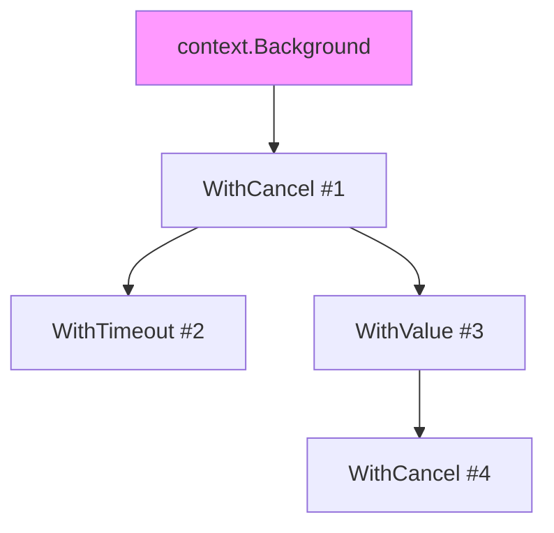
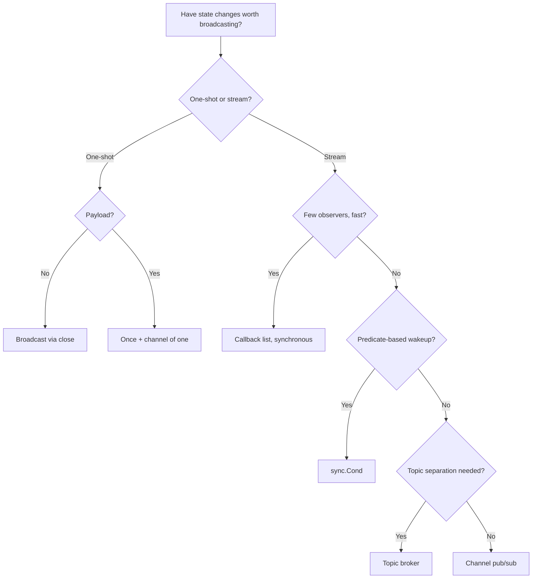

# Observer Pattern — Specification

## 1. Origins

The Observer pattern was formalised in *Design Patterns: Elements of Reusable Object-Oriented Software* (Gamma, Helm, Johnson, Vlissides, 1994), where it appears under behavioural patterns:

> "Define a one-to-many dependency between objects so that when one object changes state, all its dependents are notified and updated automatically."

The GoF book describes a `Subject` holding a list of `Observer` references and notifying them by calling `Update()` on each. Two interface roles, one direction of dependency, no assumed transport.

### 1.1 Pre-GoF antecedents

The pattern long predates the 1994 catalogue:

- **Smalltalk-80 MVC (Krasner & Pope, 1988)** — the Model is the subject; Views and Controllers are observers. The `changed:` / `update:` protocol is the canonical Smalltalk Observer machinery. The MVC paper, "A Cookbook for Using the Model-View-Controller User Interface Paradigm in Smalltalk-80," is the practical origin of "many views on one model" in production object systems.
- **Lisp Flavors and CLOS daemons (1980s)** — `:before` / `:after` method daemons fire on slot changes; structurally a built-in observer mechanism.
- **InterViews (1988)** at Stanford — the C++ GUI toolkit that pre-figured Qt's signals/slots and Cocoa's KVO.
- **Hoare, "Communicating Sequential Processes" (1978)** — CSP gives the *channel*-based variant that Go adopts. Processes communicate by passing values along synchronised channels rather than holding references to each other. In CSP terms, a subject *sends* events on a channel and observers *receive* them; the coupling is the channel name, not an object reference.

CSP matters for Go specifically. The Observer pattern in Go has two intellectual parents: GoF (reference lists of typed observers) and Hoare (channel-based event streams). Both are idiomatic; both appear in the standard library.

### 1.2 Go community evolution

- **Go 1.0 (2012)** — `os/signal.Notify` shipped the canonical channel-based observer in the standard library; `sync.Cond` shipped the canonical condition-variable observer.
- **Go 1.0** — `runtime.SetFinalizer` is an observer of GC events (still considered a hazard, but present).
- **Go 1.5 (2015)** — `runtime/trace` introduced a streaming event observer; `runtime.SetBlockProfileRate` exposed observable blocking events.
- **Go 1.7 (2016)** — `context.Context` formalised the cancellation chain: `Done()` returns a channel that is closed when the context is cancelled. Each child context observes its parent.
- **Go 1.11 (2018)** — `expvar` and `net/http/pprof` matured as pull-based observer endpoints. Prometheus' `collector` interface, modelled on `expvar`, became the dominant Go observability shape.
- **Go 1.18 (2022)** — Generics enabled `Topic[T]` and `Broker[E]` shapes that are type-safe across event types without `interface{}` casts.
- **Go 1.21 (2023)** — `log/slog` handlers act as observers of log records emitted by `slog.Logger`.
- **Go 1.22 (2024)** — `runtime/pprof` added structured per-goroutine sampling, observable through `pprof.Lookup(...).WriteTo`.

The community converged on a split: **channels for streams, callback lists for single-shot subscribers, `sync.Cond` for condition-driven wakeups, broadcast via `close(chan)` for one-shot fanout.**

---

## 2. Underlying Go language mechanics

The Go spec (https://go.dev/ref/spec) defines the primitives an observer implementation rests on. The sections most relevant to this pattern:

### 2.1 Channels

> "A channel provides a mechanism for concurrently executing functions to communicate by sending and receiving values of a specified element type."

A channel is the simplest observer transport. The subject sends; receivers observe. Buffering, blocking, and direction (`chan<- T`, `<-chan T`) determine the contract.

> "A channel may be constrained only to send or only to receive by conversion or assignment. ... A new, initialized channel value can be made using the built-in function `make`, which takes the channel type and an optional capacity as arguments."

```go
events := make(chan Event, 16) // buffered observer mailbox
```

Buffering decouples subject and observer in time but not in fate: a full buffer turns the subject's send into a block.

### 2.2 Close semantics

> "The close built-in function closes a channel, which must be either bidirectional or send-only. ... After calling close, and after any previously sent values have been received, receive operations will return the zero value for the channel's type without blocking. The multi-valued receive operation returns a received value along with an indication of whether the channel is closed."

```go
v, ok := <-ch
// ok == false  ⇒  channel closed and drained
```

`close` is the only Go primitive that performs **one-to-many broadcast at zero allocation**. Every receiver of a closed channel wakes up immediately. This is the foundation of the "broadcast via `close(chan)`" idiom used by `context.Context`, `errgroup.Group`, and many shutdown protocols.

> "Sending to or closing a closed channel causes a run-time panic. ... Closing the nil channel also causes a run-time panic."

The closer owns the channel; sending after close is a panic, not a recoverable error. Observer designs must establish a single closer.

### 2.3 Select

> "A select statement chooses which of a set of possible send or receive operations will proceed. ... If one or more of the communications can proceed, a single one that can proceed is chosen via a uniform pseudo-random selection."

```go
select {
case e := <-events:
    handle(e)
case <-ctx.Done():
    return
}
```

`select` is what lets an observer **listen to multiple subjects simultaneously** (events, cancellation, timeouts) without ad-hoc threading.

### 2.4 sync.RWMutex

The subject's subscriber list is read on every notify and written on subscribe/unsubscribe. `sync.RWMutex` is the standard guard:

> "A RWMutex is a reader/writer mutual exclusion lock. The lock can be held by an arbitrary number of readers or a single writer."

Notifying is read-heavy after warmup. `RLock`/`RUnlock` around the iteration; `Lock`/`Unlock` only when the slice is mutated.

### 2.5 sync.Cond

> "Cond implements a condition variable, a rendezvous point for goroutines waiting for or announcing the occurrence of an event. Each Cond has an associated Locker L (often a *Mutex or *RWMutex), which must be held when changing the condition and when calling the Wait method."

`sync.Cond` is the in-language observer of a predicate. The subject calls `Signal()` (wake one) or `Broadcast()` (wake all); the observer calls `Wait()` after acquiring the mutex and re-checks the predicate in a loop:

```go
c.L.Lock()
for !condition() {
    c.Wait()
}
// condition is true; mutex held
c.L.Unlock()
```

It is the lowest-level observer in the standard library and the one most often misused.

### 2.6 sync/atomic

> "Package atomic provides low-level atomic memory primitives useful for implementing synchronization algorithms."

Single-value observable state — counters, flags, generation numbers — can be exposed via `atomic.LoadInt64`, `atomic.LoadPointer`, or, from Go 1.19, `atomic.Pointer[T]`. The observer reads without locking; the subject writes atomically. This is what `expvar.Int` does internally.

### 2.7 Generics (Go 1.18+)

> "Type parameters Generic types and functions are similar to functions, but they have one or more type parameters that are replaced with type arguments at instantiation time."

```go
type Topic[E any] struct {
    mu   sync.RWMutex
    subs []chan<- E
}

func (t *Topic[E]) Publish(e E) { ... }
func (t *Topic[E]) Subscribe() <-chan E { ... }
```

Generics make it possible to write a single broker that is **type-safe across event types** without erasing to `interface{}`. Pre-generics, every project re-implemented the same broker per event type or paid a type-assertion tax.

### 2.8 Goroutines and scheduling

> "A 'go' statement starts the execution of a function call as an independent concurrent thread of control, or goroutine, within the same address space."

Async observer notification typically spawns one goroutine per subscriber or one shared dispatch loop. The lifecycle of those goroutines becomes the lifecycle of the subscription. Goroutine leaks are the dominant observer bug.

---

## 3. The canonical signature shapes

Five shapes account for almost every Go observer in the wild. The choice depends on **delivery semantics** (sync vs async), **fanout topology** (one-to-many vs many-to-many), and **subscriber identity** (anonymous channel vs named callback).

### 3.1 Struct-based subject with callback list

The closest analogue to the GoF diagram.

```go
type Observer interface {
    OnEvent(e Event)
}

type Subject struct {
    mu  sync.RWMutex
    obs []Observer
}

func (s *Subject) Subscribe(o Observer) (unsubscribe func()) {
    s.mu.Lock()
    s.obs = append(s.obs, o)
    s.mu.Unlock()
    return func() {
        s.mu.Lock()
        defer s.mu.Unlock()
        for i, x := range s.obs {
            if x == o {
                s.obs = append(s.obs[:i], s.obs[i+1:]...)
                return
            }
        }
    }
}

func (s *Subject) Notify(e Event) {
    s.mu.RLock()
    snap := append([]Observer(nil), s.obs...) // copy under RLock
    s.mu.RUnlock()
    for _, o := range snap {
        o.OnEvent(e) // outside the lock
    }
}
```

Three discipline points: snapshot under `RLock`, dispatch outside the lock, return an `unsubscribe` closure so the caller does not need to identify itself by reference equality later.

### 3.2 Channel-based pub/sub

```go
type Broker struct {
    mu   sync.RWMutex
    subs map[chan Event]struct{}
}

func (b *Broker) Subscribe(buf int) (<-chan Event, func()) {
    ch := make(chan Event, buf)
    b.mu.Lock()
    if b.subs == nil { b.subs = map[chan Event]struct{}{} }
    b.subs[ch] = struct{}{}
    b.mu.Unlock()
    unsub := func() {
        b.mu.Lock()
        if _, ok := b.subs[ch]; ok {
            delete(b.subs, ch)
            close(ch)
        }
        b.mu.Unlock()
    }
    return ch, unsub
}

func (b *Broker) Publish(e Event) {
    b.mu.RLock()
    defer b.mu.RUnlock()
    for ch := range b.subs {
        select {
        case ch <- e:
        default:
            // slow subscriber; drop or count
        }
    }
}
```

The non-blocking `select` with `default` is the **slow-consumer policy** baked into the design. Alternatives: block (back-pressure to the publisher), drop newest, drop oldest, or kill the subscriber.

### 3.3 sync.Cond — predicate-based observer

```go
type Queue struct {
    mu   sync.Mutex
    cond *sync.Cond
    buf  []Item
    closed bool
}

func New() *Queue {
    q := &Queue{}
    q.cond = sync.NewCond(&q.mu)
    return q
}

func (q *Queue) Push(it Item) {
    q.mu.Lock()
    q.buf = append(q.buf, it)
    q.mu.Unlock()
    q.cond.Signal()
}

func (q *Queue) Pop() (Item, bool) {
    q.mu.Lock()
    defer q.mu.Unlock()
    for len(q.buf) == 0 && !q.closed {
        q.cond.Wait()
    }
    if len(q.buf) == 0 { return Item{}, false }
    it := q.buf[0]
    q.buf = q.buf[1:]
    return it, true
}
```

`sync.Cond` is the right answer when the **predicate is more than "an event happened"** — e.g., "the buffer is non-empty AND we are not shutting down." Channels handle the simple case; condition variables handle the compound case.

### 3.4 Broadcast via `close(chan)`

```go
type Once struct {
    done chan struct{}
    once sync.Once
}

func (o *Once) Done() <-chan struct{} { return o.done }

func (o *Once) Fire() {
    o.once.Do(func() { close(o.done) })
}
```

One-shot broadcast: every observer that selects on `Done()` wakes up the instant `close` runs. This is exactly the shape of `context.Context.Done()` and `errgroup.Group`'s internal signalling.

> "After calling close, and after any previously sent values have been received, receive operations will return the zero value for the channel's type without blocking."

The zero-value receive is what makes `case <-done:` work as a signal.

### 3.5 Topic-based broker (generic)

```go
type Topic[E any] struct {
    mu   sync.RWMutex
    subs map[*subscription[E]]struct{}
}

type subscription[E any] struct {
    ch     chan E
    filter func(E) bool
}

func (t *Topic[E]) Subscribe(filter func(E) bool, buf int) (<-chan E, func()) { ... }
func (t *Topic[E]) Publish(e E)                                                { ... }
```

Generics buy two things: **no `interface{}` boxing per event** and **compile-time type safety at the subscription boundary**. Used by modern Go event buses such as `watermill` (in its generic adapters) and many internal frameworks.

---

## 4. Standard library uses

Be precise about which standard-library types are observers and which only look like them.

### 4.1 True observers

- **`os/signal.Notify(c chan<- os.Signal, sig ...os.Signal)`** — channel-based observer; the runtime is the subject, your channel is the observer mailbox. From the package docs: "Notify causes package signal to relay incoming signals to c. ... Package signal will not block sending to c: the caller must ensure that c has sufficient buffer space."
- **`context.Context.Done() <-chan struct{}`** — broadcast-via-close. The cancellation chain is a tree of subjects (parent contexts) each notifying their children. `context.WithCancel`, `WithTimeout`, `WithDeadline` are observer factories.
- **`sync.Cond`** — predicate observer.
- **`runtime/trace`** — streaming observer of runtime events. `trace.Start(w)` registers `w` as the observer; events flow until `trace.Stop()`.
- **`expvar`** — pull-based observer. Variables register themselves; HTTP handlers expose them.
- **`runtime.SetFinalizer(obj, finalizer)`** — observer of GC reclamation. Discouraged for almost everything but real.
- **`net/http/pprof`** — pull-based observer of `runtime/pprof` profiles.
- **`log/slog.Handler`** — every `slog.Record` is fanned out to the configured handler, which acts as an observer of log emissions.
- **`reflect.Value.Watch` / channel reflection (`reflect.Select`)** — runtime-dynamic observer composition.

### 4.2 The context cancellation chain as observer factory

`context.WithCancel(parent)` returns a *child* context whose `Done()` channel will close when *either* the parent's `Done()` closes *or* the returned `cancel` is invoked. Internally the implementation runs:

```go
// runtime equivalent
go func() {
    select {
    case <-parent.Done():
        child.cancel(parent.Err())
    case <-child.Done():
    }
}()
```

Each `WithCancel` creates a small observer relay. Cancellation propagates through the tree by closing channels at every level. This is *the* most-used observer in Go.



Cancelling `#1` closes `Done()` on `#1`, `#2`, `#3`, `#4` simultaneously. Each child observes its parent.

### 4.3 Prometheus collector callbacks

The Prometheus client library is a textbook Go observer. A `Collector` registers itself with a `Registry`; on each scrape, the registry calls back into the collector:

```go
type Collector interface {
    Describe(chan<- *Desc)
    Collect(chan<- Metric)
}
```

The HTTP scrape is the trigger; collectors are the observers; the registry is the broker. The choice of `chan<- Metric` as the callback channel is deliberate: collectors stream metrics, the registry consumes, GC happens incrementally.

### 4.4 expvar

```go
expvar.Publish("uptime", expvar.Func(func() any { return time.Since(start) }))
```

Pull-based observer: `/debug/vars` walks the registered variables on demand. The variable is the subject of its own state; the HTTP handler is the observer triggered by each scrape.

### 4.5 sync.Cond in the standard library

- **`os/exec`** — uses `*sync.Cond` for `Wait` synchronisation in older Go versions.
- **`net/http`** — connection-pool wakeups for keep-alive reuse.
- **`golang.org/x/sync/semaphore`** — predicate-based waiter list.

---

## 5. Real-world library examples

### 5.1 fsnotify

```go
watcher, _ := fsnotify.NewWatcher()
defer watcher.Close()
watcher.Add("/etc/myapp")

for {
    select {
    case event := <-watcher.Events:
        handle(event)
    case err := <-watcher.Errors:
        log.Println(err)
    }
}
```

A channel-based observer with two channels: data and errors. The kernel (inotify on Linux, FSEvents on macOS, ReadDirectoryChangesW on Windows) is the subject; the watcher is the bridge; the consumer is the observer. This is the canonical Go shape for OS-event observation.

### 5.2 etcd clientv3 watchers

```go
cli, _ := clientv3.New(clientv3.Config{Endpoints: ...})
ch := cli.Watch(ctx, "/keys/", clientv3.WithPrefix())
for resp := range ch {
    for _, ev := range resp.Events {
        switch ev.Type {
        case mvccpb.PUT:    onPut(ev)
        case mvccpb.DELETE: onDelete(ev)
        }
    }
}
```

A long-lived observer over gRPC. The `<-chan WatchResponse` closes when the context is cancelled or the connection drops with no retry budget. Range-over-channel terminates on close, which is also the cancellation signal — observer lifetime equals channel lifetime.

### 5.3 Kubernetes informers (client-go)

```go
factory := informers.NewSharedInformerFactory(client, time.Minute)
podInf := factory.Core().V1().Pods().Informer()

podInf.AddEventHandler(cache.ResourceEventHandlerFuncs{
    AddFunc:    func(obj any)             { ... },
    UpdateFunc: func(old, new any)        { ... },
    DeleteFunc: func(obj any)             { ... },
})

stop := make(chan struct{})
defer close(stop)
factory.Start(stop)
```

A callback-list observer over a shared cache. One informer per resource type fans events out to N handlers. The `stop chan struct{}` is broadcast-via-close: closing it stops every informer subordinate to the factory. This is the closest large-scale Go system to the GoF diagram: typed subjects, typed events, multiple handlers per subject.

### 5.4 segmentio/kafka-go consumers

```go
r := kafka.NewReader(kafka.ReaderConfig{
    Brokers: []string{"kafka:9092"},
    Topic:   "events",
    GroupID: "svc-a",
})
for {
    m, err := r.ReadMessage(ctx)
    if err != nil { return err }
    handle(m)
}
```

A blocking-pull observer. The broker is remote; the local goroutine is the observer; `ReadMessage` is a blocking receive. Compared to the channel-based variants above, this places **the iteration in the observer**, not in a callback or `range`. Subscription lifetime equals goroutine lifetime.

### 5.5 nats.go subscribers

```go
nc, _ := nats.Connect("nats://...")
sub, _ := nc.Subscribe("orders.created", func(m *nats.Msg) {
    onOrder(m.Data)
})
defer sub.Unsubscribe()
```

Callback-based observer over a network broker. Compare to:

```go
sub, _ := nc.SubscribeSync("orders.created")
for {
    m, err := sub.NextMsg(time.Second)
    if err != nil { break }
    onOrder(m.Data)
}
```

`nats.go` offers both shapes — push (callback) and pull (sync receive) — from the same broker. The choice is purely consumer-side ergonomics.

### 5.6 gRPC streaming RPCs

```go
stream, _ := client.Watch(ctx, &pb.WatchRequest{...})
for {
    ev, err := stream.Recv()
    if errors.Is(err, io.EOF) { return nil }
    if err != nil            { return err }
    handle(ev)
}
```

Server-streaming RPCs are an observer over the wire. The server pushes; the client pulls. The HTTP/2 connection is the transport; the protobuf message is the event. `stream.Recv` is the observer's per-event step.

### 5.7 Other notable Go observers

- **`golang.org/x/sync/errgroup`** — `(*Group).Wait()` observes the first non-nil error and cancellation across N goroutines. The `cancel` function closes a `done` channel as a broadcast.
- **`go.uber.org/fx` lifecycle hooks** — `OnStart` / `OnStop` are observers of process lifecycle phases.
- **`hashicorp/raft`** — `(*Raft).LeaderCh()` returns a `<-chan bool` that observes leadership transitions.
- **`docker/docker` events** — `client.Events(ctx, ...)` returns `<-chan events.Message` for Docker daemon state changes.
- **`go-redis` pub/sub** — `rdb.Subscribe(ctx, "ch").Channel()` returns a `<-chan *Message`.

---

## 6. Formal specification

### 6.1 Components

| Element | Description |
|---------|-------------|
| **Subject** | The type whose state changes are being observed. Owns the subscriber registry. |
| **Event** | The value passed to observers on notification. May be empty (`struct{}` for "something happened"). |
| **Observer / Subscriber** | An entity that receives events. In Go: a `chan<- E`, a callback function, or a struct satisfying an interface. |
| **Subscription handle** | The token returned by `Subscribe` that the caller uses to unsubscribe. Typically a `func()` closure. |
| **Notify / Publish** | The subject's operation that delivers an event to all current observers. |
| **Dispatch policy** | The rule governing what happens when an observer cannot accept the event (block, drop, async, kill). |
| **Lifecycle root** | The `context.Context` or `chan struct{}` whose closure tears down the subscription tree. |

### 6.2 Invariants

1. **No observer receives events for which it did not subscribe.** Filtering, if any, is applied before delivery.
2. **No event is silently dropped without policy.** If drops happen, the policy is documented and metered.
3. **The notify path holds no lock across observer code.** Observer callbacks must execute outside the subject's lock.
4. **The subscriber list is consistent under concurrent subscribe/notify.** Either snapshot-then-iterate or guard the iteration with the read lock.
5. **`Unsubscribe` is idempotent.** Calling the returned closure twice is safe.
6. **Closed channels are never sent to.** The closer owns the channel.
7. **Subscriptions have bounded lifetimes.** Either tied to a `context.Context`, or explicitly released by `Unsubscribe`.
8. **The subject does not retain references to observers after `Unsubscribe`.** This is the GC invariant — failure causes a memory leak.
9. **Observer ordering is unspecified by default.** If consumers need a specific order, the subject documents it.
10. **Re-entrant subscribe/unsubscribe during notify is well-defined.** Either explicitly allowed (post-snapshot) or explicitly forbidden (panic).

Violation of invariant 3 is the most common production bug. A panicking observer or one calling back into the subject under the lock will deadlock or crash the dispatch loop.

### 6.3 GoF role mapping

| GoF term | Go equivalent |
|----------|---------------|
| Subject | The struct holding subscriber state and exposing `Subscribe` / `Notify`. |
| ConcreteSubject | Same struct; Go does not separate "Subject" interface from impl in most cases. |
| Observer | A callback `func(E)`, an interface satisfaction, or a `chan<- E`. |
| ConcreteObserver | The implementation actually doing work on receipt. |
| Update() | `OnEvent(e Event)` method, or `ch <- e`, or `cb(e)`. |
| Attach() / Detach() | `Subscribe` / `Unsubscribe` (often returned as a closure). |
| Notify() | `Publish(e)` or internal `notify(e)` after state change. |

### 6.4 Delivery semantics matrix

| Property | Synchronous callback | Async via channel | Broadcast-via-close | sync.Cond |
|----------|----------------------|-------------------|---------------------|-----------|
| Back-pressure | Implicit (slow observer slows subject) | Configurable (block / drop) | Not applicable (signal only) | Implicit (predicate wait) |
| Order preserved | Yes (registration order) | Per subscriber yes; across subscribers no | All wake simultaneously | Wake order unspecified |
| Re-entrance | Caller responsibility | Safe | Safe | Mutex must be held |
| Best for | Few observers, fast handlers | Streaming, fan-out | One-shot signals | Predicate wakeups |

---

## 7. Anti-patterns

### 7.1 Synchronous notify in the hot path

```go
func (s *Server) handleRequest(r Request) {
    s.metrics.Notify(RequestEvent{Path: r.Path}) // calls every observer inline
    ...
}
```

Every observer's latency adds to the request. One slow handler (a network log shipper, an unexpected GC pause) stalls every caller. Fix: dispatch through a buffered channel into a worker pool, or accept the latency and put it in the SLO.

### 7.2 Leaked subscriptions

```go
ch, _ := broker.Subscribe(16) // unsub ignored
go func() {
    for e := range ch { handle(e) }
}()
```

The `unsub` return value is the lifecycle handle. Discarding it means the goroutine and channel live forever, and the broker's slice grows monotonically. Always pair `Subscribe` with `defer unsub()` or tie the subscription to a `context.Context`.

### 7.3 Observer calling back into the subject

```go
func (o *MyObs) OnEvent(e Event) {
    o.subject.Subscribe(somethingElse) // re-entrant!
}
```

If `Notify` holds a lock during dispatch, this deadlocks. If `Notify` does not hold a lock but iterates a non-snapshotted slice, this either misses or duplicates events depending on append timing. Treat the observer callback as a leaf: it may read its own state, emit metrics, write to channels — it must not mutate the subject.

### 7.4 Unbounded subscriber growth

```go
func (s *Subject) Subscribe(cb func(E)) { s.cbs = append(s.cbs, cb) }
```

No unsubscribe. Every request handler that calls this leaks. Within a day the subject's slice has a million entries and the notify loop is dominant CPU.

Fix: return an `unsubscribe func()`; assert in tests that the post-unsubscribe slice length matches.

### 7.5 Unbounded channel buffer

```go
ch := make(chan Event, 1<<20)
```

A million-event buffer is not a back-pressure strategy; it is a delayed OOM. Pick a small buffer (4–256) and define overflow policy.

### 7.6 Closing the subscriber's channel from the subject without coordination

```go
func (b *Broker) Stop() {
    for ch := range b.subs { close(ch) }
}
```

If any other goroutine still sends on those channels, this panics. The closer must be the sole sender, or there must be a single-fire `sync.Once` around close.

### 7.7 Notifying under a write lock

```go
func (s *Subject) Notify(e Event) {
    s.mu.Lock()
    defer s.mu.Unlock()
    for _, o := range s.obs { o.OnEvent(e) }
}
```

Any observer that calls `Subscribe` deadlocks; any slow observer blocks subscription churn. The lock must be released — or downgraded to `RLock` with a snapshot — before calling out.

### 7.8 Using `time.After` inside a long-lived observer loop

```go
for {
    select {
    case e := <-ch:        handle(e)
    case <-time.After(s):  tick()
    }
}
```

`time.After` allocates a fresh timer that lives until firing. In a hot loop this leaks timers. Use a single `*time.Ticker` or `time.NewTimer` with `Reset`.

### 7.9 Observer state shared by reference

```go
broker.Publish(metricsSnapshot) // map mutated after publish
```

Synchronous observers may copy the value before yielding control, but asynchronous observers see whatever the sender mutates later. Either send immutable values (slices/maps must be cloned) or send pointers to immutable snapshots.

### 7.10 Subscribe-then-immediately-publish race

```go
ch, _ := broker.Subscribe(8)
broker.Publish(SomeEvent)  // may or may not arrive
```

If the subject already saw an event before `Subscribe` returned, the new subscriber sees nothing. For correctness in streaming systems, expose a `Replay(n)` or `Snapshot()` operation alongside `Subscribe`.

### 7.11 Panic in observer kills the dispatch loop

```go
for _, o := range snap { o.OnEvent(e) } // o panics, the rest never run
```

Wrap observer invocation in `defer recover()` if the subject is to be robust against misbehaving observers. The recovery must be opt-in per subject; silent recovery hides bugs.

### 7.12 Observer holding the only reference to a large object

```go
broker.Subscribe(func(e Event) {
    bigCache.Store(e) // big cache is otherwise unreferenced
})
```

The closure keeps `bigCache` reachable through the broker's slice; unsubscribing forgets to release it; the cache survives until the broker dies. Audit closures captured by long-lived subjects.

---

## 8. Variants and dialects

| Variant | Description |
|---------|-------------|
| **Synchronous (inline)** | Subject calls every observer's `OnEvent` from `Notify` directly. Lowest latency, weakest isolation. |
| **Asynchronous (per-observer goroutine)** | Each observer is fed by a dedicated goroutine reading from a buffered channel. Strong isolation, more memory. |
| **Asynchronous (shared dispatch loop)** | A single goroutine reads from the publish channel and fans out. Bounded fanout cost. |
| **Broadcast-via-close** | One-shot signals only; no payload. `context.Context.Done()`, `errgroup`. |
| **Topic-based** | Subscribers register on a named topic; publish targets a single topic. Pub/sub brokers. |
| **Filtered subscription** | Subscriber provides a predicate evaluated on the publisher's goroutine. Reduces fanout cost when most events are uninteresting. |
| **Hierarchical** | A tree of subjects; events bubble up from leaves or propagate down from root. `context.Context` cancellation is the canonical example. |
| **Replay-capable** | Subject retains the last N events; new subscribers receive them on attach (NATS JetStream, Kafka). |
| **Watermarked** | Each subscriber tracks an offset/version; on reconnect it resumes from there (etcd watch revision, Kubernetes resourceVersion). |
| **Pull-based** | Inverted: observers poll the subject on a schedule. Prometheus scrapes, `expvar`. |
| **Push-pull hybrid** | Subject pushes a "data ready" notification; observer pulls the actual data. Reduces fanout payload. |

The decision flow:



---

## 9. Code conventions

### 9.1 Naming

- **Subject struct** — name by role: `Broker`, `Bus`, `Hub`, `Topic`, `Watcher`, `Notifier`. Avoid the literal `Subject`.
- **Event type** — domain noun, suffix `Event` only if the type is reused across subjects (`OrderCreated`, not `OrderCreatedEvent`, unless ambiguous).
- **Observer interface** — `XxxHandler`, `XxxListener`, or `XxxObserver`; prefer the most domain-faithful term.
- **Subscribe / Unsubscribe** — `Subscribe`, `Watch`, `Listen`, `OnX` for the attach side. Return an `unsubscribe func()` rather than a separate `Unsubscribe(token)` method when possible.
- **Notify / Publish** — `Publish`, `Notify`, `Emit`, `Fire`. `Publish` for pub/sub; `Notify` for callback lists; `Emit` for event-emitter style.
- **Channel-returning subscribe** — return `<-chan E` (receive-only) so consumers cannot send on the subject's channel.

### 9.2 Receivers

- **Subject methods** — pointer receivers (`*Broker`). The subject holds mutable state.
- **Event type methods** — value receivers if the event is small and immutable.

### 9.3 Returning channels

Always return *receive-only* channels (`<-chan E`) from `Subscribe`. The closer of the channel is the subject, and the subject must be the only sender:

```go
func (b *Broker) Subscribe(buf int) (<-chan Event, func()) { ... }
```

The directional restriction is enforced by the compiler.

### 9.4 Context plumbing

For any long-lived observer, take a `context.Context` and tie subscription lifetime to it:

```go
func (b *Broker) Subscribe(ctx context.Context, buf int) (<-chan Event, error) {
    ch := make(chan Event, buf)
    go func() {
        <-ctx.Done()
        b.unsubscribe(ch)
        close(ch)
    }()
    return ch, nil
}
```

The caller cancels by cancelling its context. This is the same shape as `clientv3.Watch` and `nats.Subscribe` with `WithContext`.

### 9.5 Compile-time interface check

When the subject takes an `Observer` interface:

```go
var _ Observer = (*MyObserver)(nil)
```

at the implementation's declaration site. Catches missing methods at the implementer, not at the call site.

### 9.6 Godoc

```go
// Broker dispatches typed events to all current subscribers.
//
// Publish is non-blocking: a subscriber whose channel is full
// will miss events. Subscribers that need lossless delivery
// must use a sufficiently large buffer or process inline.
//
// Subscribe returns the receive channel and an unsubscribe
// function. Calling unsubscribe is idempotent and closes the
// channel.
type Broker struct{ ... }
```

Document delivery semantics, lossiness, ordering, and lifecycle. These are the questions every caller will ask.

### 9.7 Testing

- **Subscribe / publish round-trip** — subscribe, publish, assert receipt.
- **Unsubscribe leak test** — subscribe N times, unsubscribe N times, assert internal slice length is 0.
- **Slow-consumer test** — fill the buffer, publish more, assert policy (drop or block).
- **Concurrent subscribe + publish** — run with `-race`; the race detector catches most subject-lock errors.
- **Context cancellation** — cancel a context, assert the subscription channel closes.

---

## 10. Related patterns

| Pattern | Distinction |
|---------|-------------|
| **Mediator** | A hub coordinating peer interactions. Observer is one-to-many; Mediator is many-to-many through a central object. A Broker that observers also publish into is closer to a Mediator. |
| **Publish-Subscribe (distributed)** | Observer scaled across processes via a network broker (NATS, Kafka, Redis pub/sub). Same intent; transport is different. Pattern 16-pubsub-pattern in this catalogue. |
| **Strategy** | Swappable algorithms. An observer that fully determines reaction policy is a Strategy registered through Observer plumbing. |
| **Command** | A request as an object. Events in Observer are often Commands in disguise — distinguish "this happened" (Event) from "do this" (Command). |
| **Event Sourcing** | The history of events is the source of truth; current state is a projection. An Observer that persists every event is the foundation of Event Sourcing. |
| **Reactor / proactor** | I/O readiness patterns (epoll, kqueue). Reactor is Observer over OS file descriptors; the Go runtime implements one internally. |
| **Iterator** | A pull-mode traversal. Channel-based observers are an iterator over an unbounded stream. |
| **Chain of Responsibility** | Sequential handling until one accepts. Observer broadcasts to all simultaneously. |

In Go specifically:

- Observer and **PubSub** (chapter 16) differ in scope: Observer is in-process; PubSub spans processes.
- Observer and **Mediator** differ in directionality: in Observer the subject does not know what observers will do; in Mediator the hub coordinates them.
- Observer and **Iterator** converge on a channel: a `<-chan E` returned by `Subscribe` is both an observer subscription and an iterator over events.

---

## 11. Further reading

- **Go source: `src/os/signal/signal.go`** — `Notify`, `Stop`, `Reset`; the textbook channel-based observer in the standard library.
- **Go source: `src/context/context.go`** — `cancelCtx`, `propagateCancel`; the broadcast-via-close cancellation tree.
- **Go source: `src/sync/cond.go`** — `Cond`, `Wait`, `Signal`, `Broadcast`; the lowest-level predicate observer.
- **Go source: `src/runtime/trace/trace.go`** — streaming runtime event observer.
- **Go source: `src/expvar/expvar.go`** — pull-based observer registry.
- **Go source: `src/sync/atomic/value.go`** — `Value` for lock-free observable single values.
- **Go blog: "Go concurrency patterns: Pipelines and cancellation"** (Sameer Ajmani, 2014) — the canonical statement of channel + cancellation patterns.
- **Go blog: "Go Concurrency Patterns: Context"** (Sameer Ajmani, 2014) — the cancellation chain as observer factory.
- **Go blog: "Share Memory By Communicating"** (Andrew Gerrand) — CSP rationale for Go.
- **Effective Go §"Concurrency"** — channels-as-coordination idiom.
- **"The Go Programming Language" §8** (Donovan & Kernighan) — goroutines and channels.
- **GoF, "Design Patterns" (1994), §"Observer"** — the original.
- **Hoare, "Communicating Sequential Processes"** (1978, *Communications of the ACM*) — the theoretical ancestor of Go's channels.
- **Krasner & Pope, "A Cookbook for Using the Model-View-Controller User Interface Paradigm in Smalltalk-80"** (1988) — MVC, the original Observer in production object systems.
- **Reactive Streams specification** (reactive-streams.org) — the modern statement of back-pressure-aware observation.
- **fsnotify documentation** — the OS-event observer ecosystem.
- **etcd clientv3 documentation, "Watch"** — long-lived gRPC observer with revision-based replay.
- **Kubernetes "client-go informers" documentation** — large-scale callback-list observers over shared caches.
- **NATS documentation, "Subjects and Subscriptions"** — push/pull observer duality at the broker level.
- **Prometheus Go client documentation, "Collector"** — pull-based observer in observability tooling.

---

## 12. Glossary

| Term | Meaning |
|------|---------|
| **Subject** | The entity whose state changes are observed. |
| **Observer** | The entity receiving event notifications. |
| **Event** | A value describing the change. May be empty for "something happened." |
| **Notify** | The subject's act of delivering an event to all current observers. |
| **Subscribe** | Attach an observer to a subject; returns a handle. |
| **Unsubscribe handle** | A closure or token used to detach. Must be idempotent. |
| **Broadcast** | A single notification reaching every current observer. |
| **Broadcast-via-close** | Idiom that uses `close(chan)` to wake every receiver at once. |
| **Back-pressure** | Mechanism by which slow observers slow the publisher; opposite is drop policy. |
| **Drop policy** | What happens when an observer's mailbox is full: drop newest, drop oldest, block, or kill. |
| **Replay** | Delivering past events to a newly attached observer. |
| **Watermark** | A subscriber-side position/version used to resume after disconnect. |
| **Topic** | A named partition of events; subscribers register on topics. |
| **Filter** | A predicate evaluated before delivery, on the publisher's goroutine. |
| **Dispatch loop** | The goroutine that reads from the publish queue and fans out. |
| **Hot path** | Code on the latency-critical request path. |
| **Cancellation chain** | A tree of `context.Context` values; cancelling the root cancels every descendant. |
| **Pull-based observer** | One that polls the subject (Prometheus, `expvar`). Opposite of push-based. |
