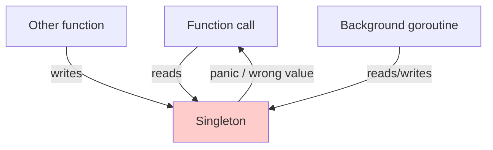
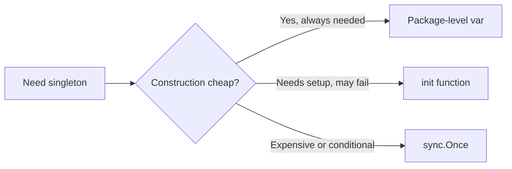
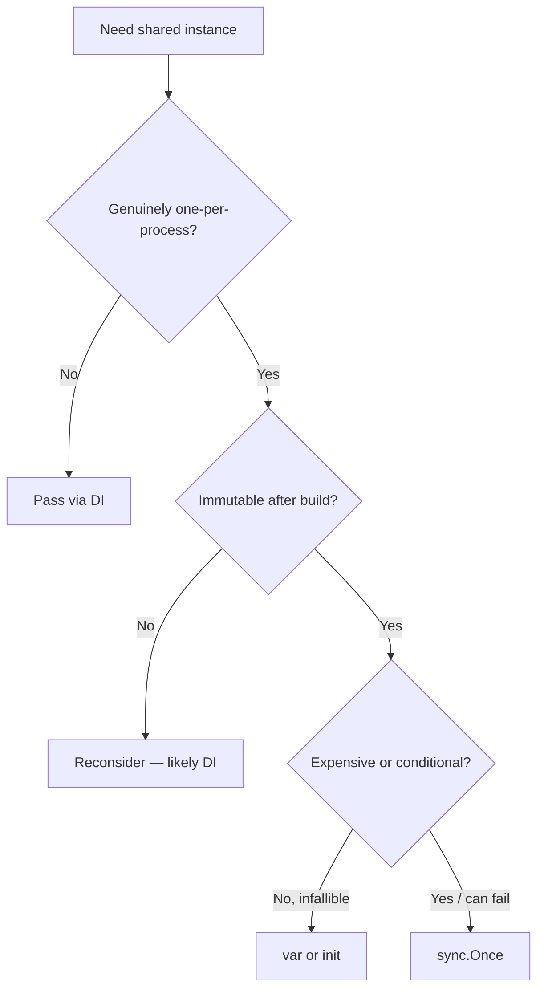

# Singleton Pattern — Junior

## 1. What the Singleton pattern actually is

A *singleton* is a type with exactly one instance for the lifetime of the program, plus a well-known way to reach it. Anywhere in the code, `db.Default()` (or `Logger()`, or `Config()`) returns the same object. There is no "make me a new one"; the type itself guarantees uniqueness.

The classic motivation is that some resources are *globally one*:

- The standard input stream — there is only one `os.Stdin`.
- The wall clock — there is only one notion of "now".
- A connection pool to a single database — you do not want each function opening its own pool.
- A process-wide config loaded from disk at startup.

The GoF book describes Singleton as a class that hides its constructor and exposes a static `getInstance()` method. Go has neither private constructors nor static methods, so the pattern looks different here: it is usually a package-level variable, sometimes wrapped in a `sync.Once` for lazy initialisation, sometimes initialised in `init()`. The shape is small. The hard part is knowing *when* singleton is the right answer and when it is a trap.

```go
// A package-level var, exported via an accessor.
var defaultClient = &http.Client{Timeout: 30 * time.Second}

func DefaultClient() *http.Client { return defaultClient }
```

That is a Go singleton. There is no class machinery. The thing that makes it a singleton is the fact that every caller in every package sees the same `*http.Client`.

This file teaches:

1. The three Go shapes: package-level `var`, `init()` function, and `sync.Once`.
2. Why `sync.Once` is the canonical pattern for *lazy* singletons.
3. Why Singleton is the most controversial GoF pattern and how to spot when it is hurting you.
4. The stdlib singletons you have already been using (`http.DefaultClient`, `log.Default()`, `time.Local`, `http.DefaultServeMux`).
5. The alternative — dependency injection — and when to reach for it instead.

If you have ever written `log.Println("hello")`, you have used a singleton: `log.Println` calls into a package-level default logger. The pattern is everywhere, and most of the time it is fine. The skill is knowing the few cases where it is *not* fine.

---

## 2. Table of Contents

1. [What the Singleton pattern actually is](#1-what-the-singleton-pattern-actually-is)
2. [Table of Contents](#2-table-of-contents)
3. [Why Singleton is controversial](#3-why-singleton-is-controversial)
4. [The three Go shapes](#4-the-three-go-shapes)
5. [Shape A — package-level var (eager)](#5-shape-a--package-level-var-eager)
6. [Shape B — init() function (eager, with setup)](#6-shape-b--init-function-eager-with-setup)
7. [Shape C — sync.Once (lazy, the canonical Go pattern)](#7-shape-c--synconce-lazy-the-canonical-go-pattern)
8. [When Singleton is acceptable](#8-when-singleton-is-acceptable)
9. [When Singleton is harmful](#9-when-singleton-is-harmful)
10. [Singletons in the standard library](#10-singletons-in-the-standard-library)
11. [The alternative — dependency injection](#11-the-alternative--dependency-injection)
12. [Common mistakes a junior makes](#12-common-mistakes-a-junior-makes)
13. [Tricky points](#13-tricky-points)
14. [Quick test](#14-quick-test)
15. [Cheat sheet](#15-cheat-sheet)
16. [What to learn next](#16-what-to-learn-next)

---

## 3. Why Singleton is controversial

Of all the GoF patterns, Singleton has the worst reputation. Senior engineers will sometimes flat-out refuse to add one to a codebase. The reasons are not Go-specific — they apply to every language — but they hit Go hard because Go's culture is built around small, testable, explicit code.

The objections, in order of importance:

1. **Hidden global state.** A function that calls `db.Default().Query(...)` does not advertise that it talks to a database. Reading the signature `func ProcessOrder(o Order) error` tells you nothing about what it depends on. The dependency is in the body, not the contract.
2. **Tests cannot isolate.** Two tests that mutate the singleton step on each other. If `t.Run("a")` writes to `Config()` and `t.Run("b")` reads from it, the order of execution decides whether the suite passes. Parallel tests amplify this.
3. **Initialisation order across packages is murky.** Singletons initialised in `init()` run in an order Go does not let you fully control. A singleton that depends on another singleton can read it before it is ready.
4. **They never die.** A singleton lives for the program's lifetime. If it holds a connection pool, the pool is alive even when no test needs it. Memory leaks via singletons are common.
5. **Mutation is invisible.** Anyone in any package can write to the singleton. Tracing the cause of a wrong value means searching the whole codebase for assignments.



The picture above is the problem in one diagram: the singleton is touched from *everywhere*, and the call graph does not show it.

The flip side is that some things genuinely are global. There is only one process clock, one set of OS environment variables, one stdin/stdout. Trying to *avoid* having a singleton for those means passing them through every function signature for no benefit. Singleton is the right shape when the resource is *intrinsically* singular and *immutable*.

The decision rule for the rest of this file: **prefer dependency injection until the cost of passing the value through call sites is clearly worse than the cost of going global.** That tilts heavily toward DI for application code and toward singletons for low-level utilities (loggers, clocks, RNG).

---

## 4. The three Go shapes

| Shape | Initialisation | Use when |
|-------|----------------|----------|
| **Package-level `var`** | Eager, when the package is loaded | The value is cheap to construct and always needed |
| **`init()` function** | Eager, when the package is loaded | Construction needs a few statements or can fail (`log.Fatal`) |
| **`sync.Once`** | Lazy, on first use | Construction is expensive, may not be needed, or depends on runtime input |

All three give you a singleton — one shared instance — but they differ in *when* the instance is built and how much control you have over failure during construction.



You will see all three in real Go code, often in the same package. Knowing which to pick is half the pattern.

---

## 5. Shape A — package-level var (eager)

The simplest singleton. Declare the value at package scope, expose it (or an accessor).

```go
package httpx

import (
    "net/http"
    "time"
)

// DefaultClient is the package-wide HTTP client.
var DefaultClient = &http.Client{
    Timeout: 30 * time.Second,
}
```

Callers use it directly:

```go
resp, err := httpx.DefaultClient.Get("https://example.com")
```

Or via an accessor, which gives you a hook to swap implementations in tests:

```go
package httpx

var defaultClient = &http.Client{Timeout: 30 * time.Second}

func DefaultClient() *http.Client { return defaultClient }

// for tests
func SetDefaultClient(c *http.Client) { defaultClient = c }
```

Five things to notice:

1. The variable is initialised at program startup, before `main` runs. There is no "first call" — it is just there.
2. There is no synchronisation needed because the initialiser runs on a single goroutine before any other code.
3. The value is mutable from the package (and from anywhere if exported as a `var`).
4. If construction can fail or needs more than a literal expression, this shape does not work — use `init()` instead.
5. Tests that want a different value need a setter (`SetDefaultClient`) or must construct their own. We come back to this in §9.

### 5.1 When this shape is enough

- The default value is correct for 95% of code paths.
- Tests that need a different one can either set the package var or build their own instance and pass it.
- The value does not depend on environment variables, config files, or anything that should be loaded before use.

`http.DefaultClient`, `http.DefaultServeMux`, and `log.Default()` are this shape in the stdlib.

---

## 6. Shape B — init() function (eager, with setup)

When construction needs multiple statements, validation, or can fail, the package-level `var` cannot hold it. Move it into `init()`.

```go
package config

import (
    "encoding/json"
    "log"
    "os"
)

type Config struct {
    DSN     string
    Timeout int
}

var cfg *Config

func init() {
    path := os.Getenv("CONFIG_PATH")
    if path == "" {
        path = "/etc/myapp/config.json"
    }
    f, err := os.Open(path)
    if err != nil {
        log.Fatalf("config: open %s: %v", path, err)
    }
    defer f.Close()

    c := &Config{}
    if err := json.NewDecoder(f).Decode(c); err != nil {
        log.Fatalf("config: parse %s: %v", path, err)
    }
    cfg = c
}

func Default() *Config { return cfg }
```

Same flavour as Shape A — one shared instance — but now the construction is procedural and can call `log.Fatal` on failure.

### 6.1 The init order gotcha

`init` functions in a package run in *file order* (the order the files appear when you `ls`). Across packages, Go runs `init` after all imported packages have finished their own `init`. That sounds tidy, but it means:

- You cannot control the order of `init` calls *within* a package beyond "alphabetical by filename".
- A singleton built in package `B`'s `init` cannot rely on package `A`'s singleton being usable until the import graph guarantees `A` has run.
- If two packages mutually depend (which is forbidden anyway), you cannot share singletons between them via init.

For most code this is invisible. When it bites, the bug is "my logger is nil at startup", and it is painful to diagnose. Reach for `sync.Once` instead when ordering matters.

### 6.2 Why init can be worse than var

`init` runs *unconditionally* whenever the package is imported. If you import the package for one helper function, you still pay the cost of reading the config file. `sync.Once` lets you defer that cost until the singleton is actually touched.

`init` also crashes the process via `log.Fatal` on any error. Tests cannot intercept this — the test binary itself dies before any test runs. If construction can fail and you want graceful handling, do not use `init`.

---

## 7. Shape C — sync.Once (lazy, the canonical Go pattern)

`sync.Once` is the Go idiom for thread-safe lazy initialisation. The standard library uses it; production code uses it; once you internalise this shape you will see it everywhere.

```go
package db

import (
    "database/sql"
    "fmt"
    "os"
    "sync"

    _ "github.com/lib/pq"
)

var (
    defaultOnce sync.Once
    defaultDB   *sql.DB
    defaultErr  error
)

func Default() (*sql.DB, error) {
    defaultOnce.Do(func() {
        dsn := os.Getenv("DATABASE_URL")
        if dsn == "" {
            defaultErr = fmt.Errorf("db.Default: DATABASE_URL not set")
            return
        }
        d, err := sql.Open("postgres", dsn)
        if err != nil {
            defaultErr = fmt.Errorf("db.Default: open: %w", err)
            return
        }
        if err := d.Ping(); err != nil {
            defaultErr = fmt.Errorf("db.Default: ping: %w", err)
            return
        }
        defaultDB = d
    })
    return defaultDB, defaultErr
}
```

What `sync.Once.Do` guarantees:

1. The function passed to `Do` runs *exactly once* across all goroutines, even under contention.
2. Every caller of `Do` blocks until the first call completes, then sees the result.
3. Subsequent calls are nearly free — just a flag check.

That is the entire contract. You cannot reset a `sync.Once` (though Go 1.21 added `OnceFunc`, `OnceValue`, `OnceValues` as helpers). Once it has fired, that singleton is final for the program lifetime.

### 7.1 Why this is the canonical pattern

- **Lazy.** No work until someone needs it. Programs that import the package for an unrelated symbol do not pay the cost.
- **Thread-safe.** Two goroutines calling `Default()` simultaneously cannot both run the initialiser.
- **Error-friendly.** Unlike `init`, the constructor can return an error and let the caller decide what to do.
- **Composes well with config.** You can read environment variables, open files, dial sockets — all inside the `Do` closure.

### 7.2 The shorter Go 1.21 version

Since Go 1.21, you can wrap a function with `sync.OnceValues`:

```go
package db

import (
    "database/sql"
    "fmt"
    "os"
    "sync"
)

var Default = sync.OnceValues(func() (*sql.DB, error) {
    dsn := os.Getenv("DATABASE_URL")
    if dsn == "" {
        return nil, fmt.Errorf("db.Default: DATABASE_URL not set")
    }
    return sql.Open("postgres", dsn)
})
```

Now `db.Default()` is a function that runs the body once and caches `(*sql.DB, error)`. Subsequent calls return the cached pair. This is the most concise modern singleton.

`sync.OnceFunc` (no return), `sync.OnceValue` (one return), and `sync.OnceValues` (two returns) cover the common cases. If you need more than two returns, fall back to the manual `sync.Once` shape.

### 7.3 Double-checked locking is wrong in Go (do not invent it)

In Java and C++ you may have seen "double-checked locking" — check a flag without a lock, then lock and check again. *Do not write this in Go.* It is racy without memory barriers, and the compiler may reorder reads. `sync.Once` is the correct primitive; use it.

```go
// WRONG. Do not write this.
var inst *Thing
var mu sync.Mutex

func Default() *Thing {
    if inst != nil {     // unsynchronised read — race
        return inst
    }
    mu.Lock()
    defer mu.Unlock()
    if inst == nil {
        inst = build()
    }
    return inst
}
```

The race detector (`go test -race`) catches this. Use `sync.Once`:

```go
var (
    once sync.Once
    inst *Thing
)

func Default() *Thing {
    once.Do(func() { inst = build() })
    return inst
}
```

Shorter, correct, and zero overhead after the first call.

---

## 8. When Singleton is acceptable

Singletons are *not* universally bad. Some resources are intrinsically singular, and modelling them as anything else is busywork. The acceptance criteria:

1. **The resource is genuinely one per process.** Stdin/stdout are file descriptors the OS gives the process; there is no "other stdout" to switch to. The wall clock is one. The default random number generator (when seeded for non-cryptographic use) can be one.
2. **The value is effectively immutable after construction.** A logger that, once built, is never reconfigured is safe. A connection pool that exposes thread-safe methods is safe. A config that callers mutate is a disaster.
3. **You expose an accessor, not the raw var.** `Default()` not `Var`. Future you may want to add a `sync.Once`, validation, or a swap-for-tests hook — easier when callers go through a function.
4. **Tests have an escape hatch.** Either a `Set...` function, or an interface that consumers depend on so they can pass their own implementation.

Examples that pass the test:

- `time.Now()` — there is exactly one wall clock. Replacing it for tests is done via interface (`clock.Clock`), not by mutating `time`.
- `log.Default()` — a package-wide logger that callers can replace if they need to.
- `http.DefaultServeMux` — a process-wide HTTP route table. Most servers register handlers on it.
- A `metrics.Default()` — a Prometheus registry shared across the binary.
- A pseudo-random generator for non-cryptographic use (`math/rand` had a global one until Go 1.20 made each goroutine independent).

Examples that fail the test:

- Application configuration. Pass it through `main` into your constructors. Treating config as a singleton hides which functions read which keys.
- Database connection pools in application code. Pass `*sql.DB` to the repository, do not call `db.Default()` from deep inside a handler.
- Anything stateful that more than one part of the code writes to.

The pattern in one sentence: *singletons are for global, immutable infrastructure, not for application data.*

---

## 9. When Singleton is harmful

The clearer harm cases, with examples you can recognise in code review.

### 9.1 Hidden dependency

```go
func ProcessOrder(o Order) error {
    db := database.Default()        // hidden dependency
    log := logging.Default()        // another one
    metrics := metrics.Default()    // another one
    // ... business logic ...
}
```

Reading `ProcessOrder`'s signature, you cannot tell it talks to a database, logs, or emits metrics. Three call sites further away, this function is used in a context where you wanted *no* database access — but it happens anyway, silently. Compare to:

```go
func ProcessOrder(o Order, db *sql.DB, log *slog.Logger, m Metrics) error {
    // dependencies are visible
}
```

The signature now tells the reader (and the compiler) what is needed.

### 9.2 Tests that share state

```go
// In package config
var current *Config

func Set(c *Config) { current = c }
func Get() *Config  { return current }

// Test A
func TestFeatureA(t *testing.T) {
    config.Set(&Config{Timeout: 1 * time.Second})
    // run code that reads Get()
}

// Test B
func TestFeatureB(t *testing.T) {
    // forgot to set — reads whatever A left behind
    // passes locally, fails in CI when test order changes
}
```

The bug ships because the suite passes on the developer's machine. In CI with `-shuffle=on`, the suite fails intermittently. Singletons that tests *mutate* are a permanent source of flakes.

### 9.3 Initialisation leaks

```go
package metrics

var registry = prometheus.NewRegistry()

func init() {
    go func() {
        for range time.Tick(time.Second) {
            // background goroutine started at import
        }
    }()
}
```

The goroutine runs for the program's lifetime. Tests that import this package leak the goroutine into the test binary. There is no way to stop it. A small singleton turns into a permanent system resource cost.

### 9.4 Mutability surprise

```go
package httpx

var DefaultClient = &http.Client{Timeout: 30 * time.Second}
```

If `DefaultClient` is exported as a `var`, anyone in any package can write:

```go
httpx.DefaultClient = nil           // disable globally
httpx.DefaultClient.Timeout = 0     // no timeout, forever
```

These mutations are far from the bug they cause. Prefer:

```go
var defaultClient = &http.Client{...}
func DefaultClient() *http.Client { return defaultClient }
```

The function returns the value; the variable is private. Callers cannot reassign it.

### 9.5 Concurrent access without synchronisation

```go
var counters = map[string]int{}

func Inc(name string) { counters[name]++ } // race
```

`map` is not safe for concurrent writes. As soon as two goroutines call `Inc`, the race detector lights up and the program may crash. Singletons over mutable maps must use `sync.Mutex` or `sync.Map`. Better: do not make `counters` a singleton — pass it where it is needed.

---

## 10. Singletons in the standard library

The stdlib uses singletons sparingly, deliberately, and (usually) well. Studying them shows what acceptable shapes look like.

| Name | Where | Shape | Mutable? |
|------|-------|-------|----------|
| `os.Stdin`, `os.Stdout`, `os.Stderr` | `os` | Package-level `var` (file pointers) | Yes — can be reassigned |
| `http.DefaultClient` | `net/http` | Package-level `var` | Yes |
| `http.DefaultServeMux` | `net/http` | Package-level `var` | Yes (routes added) |
| `log.Default()` | `log` | Package-level `var`, exposed via function | Yes (via SetFlags, SetOutput) |
| `time.Local`, `time.UTC` | `time` | Package-level `var` | Effectively no |
| `math/rand.Default()` (Go 1.20+) | `math/rand` | Package-level `*Rand`, per-goroutine seeded | Yes |
| `expvar.Publish` registry | `expvar` | Internal package-level map | Yes (publish only) |
| `runtime.MemStats` | `runtime` | Mutable struct populated by call | No (struct is the snapshot) |

Read `net/http`'s defaults briefly:

```go
// from net/http
var DefaultClient = &Client{}

var DefaultServeMux = &defaultServeMux

var defaultServeMux ServeMux
```

`DefaultClient` is a fully-default `*http.Client` (no timeout, no transport overrides). `DefaultServeMux` is the process-wide HTTP router. Functions like `http.HandleFunc("/", h)` register on `DefaultServeMux`, and `http.ListenAndServe(addr, nil)` serves from it.

This is the *plain `var` singleton* — the simplest shape. Both are mutable because the stdlib wants to allow customisation. The downside is real: in a large program, multiple parts of the code may register handlers on `DefaultServeMux` without coordination, and the result is hard to audit. Production codebases usually construct their own `*http.ServeMux` and pass it explicitly:

```go
mux := http.NewServeMux()
mux.HandleFunc("/api", api.Handler)
http.ListenAndServe(":8080", mux)
```

That is the DI alternative to the global mux. Both work; the explicit one is easier to reason about.

`log.Default()` is more disciplined:

```go
// log package
var std = New(os.Stderr, "", LstdFlags)

func Default() *Logger { return std }
```

The package var is unexported. The accessor returns the value. Callers mutate it via methods (`std.SetOutput(w)`), but they cannot replace the `Logger` itself with `log.std = nil`. That is the safer shape for an exported singleton.

`time.Local` and `time.UTC` are *true singletons*: they represent immutable time zones. There is one UTC. Treating them as singletons matches the domain.

---

## 11. The alternative — dependency injection

Dependency injection (DI) is the opposite of singleton. Instead of `db.Default()`, you pass the database into the function (or constructor) that needs it.

```go
// Singleton style
func ProcessOrder(o Order) error {
    return db.Default().Exec("...", o.ID)
}

// DI style
func ProcessOrder(o Order, db *sql.DB) error {
    return db.Exec("...", o.ID)
}

// DI with a struct
type OrderService struct {
    db  *sql.DB
    log *slog.Logger
}

func (s *OrderService) Process(o Order) error {
    return s.db.Exec("...", o.ID)
}
```

The struct form is the most common shape in Go production code. Dependencies are fields; methods use the fields. `main` wires the dependencies once:

```go
func main() {
    db, err := sql.Open("postgres", os.Getenv("DSN"))
    if err != nil { log.Fatal(err) }
    defer db.Close()

    log := slog.New(slog.NewTextHandler(os.Stdout, nil))

    svc := &OrderService{db: db, log: log}
    httpHandler := api.NewHandler(svc)
    http.ListenAndServe(":8080", httpHandler)
}
```

Compare the trade-offs:

| Aspect | Singleton | DI |
|--------|-----------|-----|
| Discoverability of deps | Hidden in function bodies | Explicit in signatures |
| Testability | Requires global swap or interface | Pass test double directly |
| Wiring cost | Zero — call anywhere | A few lines in `main` |
| Lifetime control | Process-wide, no shutdown | Caller controls (defer Close) |
| Risk of state leakage | High | Low |
| Adding a new dep | Free at call site | Refactor signature/struct |

DI is more typing upfront. It saves you when the project grows.

### 11.1 The DI sweet spot

Most application code wants DI. The wiring happens once in `main` (or in a small `wire.go` file that uses a tool like `google/wire`); the rest of the code is dependency-explicit and trivially testable.

Reserve singletons for genuinely process-wide things: loggers, clocks, RNGs, stdin/stdout, the HTTP DefaultClient *if you have decided that is the right default for the binary*.

### 11.2 When DI also misuses singleton

A common mistake: build a giant `App` struct that holds every dependency, then pass `*App` everywhere.

```go
// Anti-pattern
type App struct {
    DB      *sql.DB
    Log     *slog.Logger
    Cache   *redis.Client
    Auth    *auth.Service
    Mailer  *mail.Mailer
    // 20 more fields
}

func ProcessOrder(app *App, o Order) error {
    return app.DB.Exec("...", o.ID)
}
```

`ProcessOrder` accepts `*App`, but only uses `App.DB`. The dependency is hidden inside the bag. This is a singleton in disguise — `*App` is "everything you might need, ever". Prefer narrow function signatures or narrow service structs.

---

## 12. Common mistakes a junior makes

### 12.1 Singleton with mutable shared map and no mutex

```go
// Anti-pattern
var cache = map[string]string{}

func Get(k string) string  { return cache[k] }
func Set(k, v string)      { cache[k] = v }
```

Two goroutines calling `Set` simultaneously cause a data race and may crash the runtime. Either guard with `sync.Mutex`, switch to `sync.Map`, or stop making it a singleton:

```go
var (
    mu    sync.RWMutex
    cache = map[string]string{}
)

func Get(k string) string {
    mu.RLock()
    defer mu.RUnlock()
    return cache[k]
}

func Set(k, v string) {
    mu.Lock()
    defer mu.Unlock()
    cache[k] = v
}
```

### 12.2 Exporting the singleton var instead of an accessor

```go
// Anti-pattern
var DefaultClient = &http.Client{...}
```

Anyone can write `httpx.DefaultClient = nil`. Better:

```go
var defaultClient = &http.Client{...}
func DefaultClient() *http.Client { return defaultClient }
```

(The stdlib's `http.DefaultClient` is the older shape; new code should prefer the accessor form.)

### 12.3 Hiding a constructor that can fail

```go
// Anti-pattern
var DB = mustOpen()

func mustOpen() *sql.DB {
    d, err := sql.Open("postgres", os.Getenv("DSN"))
    if err != nil { panic(err) }
    return d
}
```

The package fails to load if `DSN` is unset or the DB is unreachable. Tests that import the package crash. Use `sync.Once` + accessor that returns an error:

```go
var (
    once sync.Once
    db   *sql.DB
    err  error
)

func Default() (*sql.DB, error) {
    once.Do(func() { db, err = sql.Open("postgres", os.Getenv("DSN")) })
    return db, err
}
```

### 12.4 Treating config as a mutable singleton

```go
// Anti-pattern
var Cfg = &Config{}

func Load() { /* mutates Cfg */ }
```

Anywhere can call `Load` again. Anywhere can write `Cfg.Timeout = 0`. Better: load once, pass the immutable value to consumers.

```go
type Config struct {
    DSN     string
    Timeout time.Duration
}

func Load() (*Config, error) { /* ... */ }

func main() {
    cfg, err := Load()
    if err != nil { log.Fatal(err) }
    svc := NewService(cfg)
    // svc holds its own *Config; no globals
}
```

### 12.5 Constructor doing I/O in init()

```go
// Anti-pattern
func init() {
    resp, _ := http.Get("https://config.example.com/me")
    json.NewDecoder(resp.Body).Decode(&cfg)
}
```

Now your program (and every test that imports the package) makes a network call at startup. If the config server is down, the binary will not load. If the test machine has no network, the test suite cannot start. Push I/O into an explicit `Init(ctx)` function the binary calls from `main`.

---

## 13. Tricky points

### 13.1 Lazy vs eager

| | Eager (`var` / `init`) | Lazy (`sync.Once`) |
|---|---|---|
| When constructed | Program start | First use |
| Startup cost | Paid always | Paid only if used |
| Error handling | `panic` / `log.Fatal` or assign error var | Return error from accessor |
| Suitable for | Always-needed, cheap, infallible | Expensive, conditional, fallible |
| Test friendliness | Worse — runs even in tests that do not need it | Better — does not run unless touched |

Most production singletons want to be lazy. Use `sync.Once` (or `sync.OnceValues` since Go 1.21) by default.

### 13.2 Goroutine safety of the singleton itself

`sync.Once` makes *construction* safe. It does not make the resulting object thread-safe. If your singleton is a `map`, you still need a mutex to access it. If it is `*http.Client`, it is already safe (the stdlib documents `*http.Client` as safe for concurrent use). Read the docs for the thing you are wrapping.

### 13.3 Resetting a singleton in tests

You cannot reset `sync.Once`. If you need to swap a singleton for tests, expose a setter:

```go
package db

var defaultDB *sql.DB

func SetDefault(d *sql.DB) *sql.DB {
    old := defaultDB
    defaultDB = d
    return old
}
```

Tests do:

```go
func TestFoo(t *testing.T) {
    fake := &sql.DB{} // or a real test DB
    old := db.SetDefault(fake)
    t.Cleanup(func() { db.SetDefault(old) })
    // ... run code under test ...
}
```

The cleaner answer is: do not let the code under test reach for a global. Pass the dependency in. The setter is the escape hatch when refactoring is not possible yet.

### 13.4 Singleton vs cached factory

A factory that caches its result is sometimes confused with a singleton:

```go
var cache = map[string]*Client{}

func GetClient(name string) *Client {
    if c, ok := cache[name]; ok { return c }
    c := newClient(name)
    cache[name] = c
    return c
}
```

This is *not* a singleton — there is one `*Client` per `name`, not one for the whole program. It is the *registry* pattern (covered in `factory-pattern/middle.md`). Mixing them up leads to thinking you have isolation when you do not.

### 13.5 Singletons across plugin boundaries

If you load Go plugins (`plugin` package), each plugin gets its own copy of imported packages' state. A singleton in package `foo` is *not* the same value in the main binary and in the plugin. This is rarely a concern, but worth knowing if you ever debug it.

### 13.6 Singletons and `go test -race`

Always run `go test -race` against code that touches singletons. The race detector catches the obvious bugs: unsynchronised map writes, double-checked locking, unguarded var assignments. If a singleton-heavy package is race-free under load, you have caught most of the pitfalls.

---

## 14. Quick test

**Q1.** Which is the safer singleton shape?

```go
// A
package log
var Logger = &slog.Logger{}

// B
package log
var logger = &slog.Logger{}
func Default() *slog.Logger { return logger }
```

<details><summary>Answer</summary>

B. The variable is unexported; only the accessor is public. External callers cannot reassign `log.logger = nil`. They can still mutate the `*slog.Logger`'s methods (which is what you usually want), but they cannot swap the pointer out from under everyone.

A is the older stdlib shape (`http.DefaultClient`, `os.Stdout`). It works but invites accidental mutation.
</details>

**Q2.** What is wrong here?

```go
package config

var cfg *Config

func init() {
    f, _ := os.Open(os.Getenv("CONFIG_PATH"))
    json.NewDecoder(f).Decode(&cfg)
}

func Get() *Config { return cfg }
```

<details><summary>Answer</summary>

Several problems:

1. `init` does I/O. Tests importing this package open a file at startup. If `CONFIG_PATH` is unset, `os.Open("")` returns an error, which is ignored, and `f` is nil — `json.NewDecoder(nil)` will panic. Tests cannot intercept.
2. Errors from `os.Open` and `Decode` are silently dropped. A bad config file gives a zero-value `*Config` with no signal to the caller.
3. The `cfg` variable is mutable from inside the package. There is no way to make it immutable post-init.

Better: a `Load(path string) (*Config, error)` function that callers run from `main`. The result is passed to consumers via DI. No `init`, no globals.
</details>

**Q3.** Lazy or eager?

```
A connection to a metrics backend (Prometheus) that is used by every HTTP handler in the server.
```

<details><summary>Answer</summary>

Either works, but eager via DI is preferred. `main` constructs the metrics client, passes it to the HTTP handlers via a struct. The handlers do not call `metrics.Default()`; they read `s.metrics`.

A lazy singleton (`sync.Once`) is the second-best option if you cannot refactor handlers to take an explicit dependency. Eager `init` is acceptable but suffers the usual init drawbacks: tests pay the cost, no error path.

The dimension that matters more here than lazy-vs-eager is *who owns the lifetime*. If `main` constructs it, `main` can `defer m.Close()`. A global singleton has no Close site.
</details>

**Q4.** Why is this wrong?

```go
var instance *Service
var mu sync.Mutex

func Default() *Service {
    if instance == nil {
        mu.Lock()
        defer mu.Unlock()
        if instance == nil {
            instance = &Service{}
        }
    }
    return instance
}
```

<details><summary>Answer</summary>

It is double-checked locking. The first `if instance == nil` is unsynchronised — another goroutine may be in the middle of the inner `instance = &Service{}` and the compiler/CPU is allowed to reorder writes so the pointer is visible before the struct is initialised. The race detector flags it.

The Go way is `sync.Once`:

```go
var (
    once     sync.Once
    instance *Service
)

func Default() *Service {
    once.Do(func() { instance = &Service{} })
    return instance
}
```

Shorter, correct, and zero overhead after the first call.
</details>

---

## 15. Cheat sheet

| What | How |
|------|-----|
| Eager singleton, always needed | `var x = &T{...}` at package scope |
| Eager singleton, needs setup | `init()` function builds it |
| Lazy singleton, may fail | `sync.Once` + accessor returning `(*T, error)` |
| Lazy singleton, Go 1.21+ | `sync.OnceValues(func() (*T, error) { ... })` |
| Expose the singleton | Accessor function (`Default()`), not exported `var` |
| Thread safety of the resource | Use `sync.Mutex` or pick a thread-safe type |
| Reset for tests | Provide `SetDefault(*T) *T` that returns the old value |
| When to use | Process-wide infra (logger, clock, stdin/stdout, default HTTP client) |
| When to avoid | Application data, config, mutable state shared by tests |
| Naming | `Default()` / `Default<T>()` for the accessor; never `New<T>` |
| Forbidden | Double-checked locking, hidden I/O in `init`, mutating singletons from tests without a lock |



---

## 16. What to learn next

In order:

1. **[middle.md](middle.md)** — Singleton with options (configurable defaults), interface-based singletons for testability, the "clock" pattern (`clock.Clock` interface with `clock.System` default), `sync.OnceValue`/`OnceValues` in depth, singleton lifetimes in long-running servers, registries that *look* like singletons.
2. **[../06-factory-pattern/](../06-factory-pattern/)** — `Default()` is a factory that caches. Knowing both patterns makes the choice obvious in code review.
3. **[../01-functional-options/](../01-functional-options/)** — When the singleton needs configuration knobs at construction time.
4. **The `sync` package** — `sync.Once`, `sync.OnceFunc`, `sync.OnceValue`, `sync.OnceValues`, `sync.Map`, `sync.Mutex`. Read the docs straight through; it is short and high-value.
5. **The `time/clock` packages** (community: `github.com/benbjohnson/clock`) — the canonical example of "replace singleton with interface for tests". Same pattern works for the random number generator, the logger, the filesystem.

The Singleton pattern in Go is *small in machinery, large in trade-offs*. Writing one is two lines; deciding to write one is the part you need judgement for. The default answer is "no, pass it via DI". The exceptions are narrow and reusable — once you have written the lazy `sync.Once` pattern three times, you know it for life.
