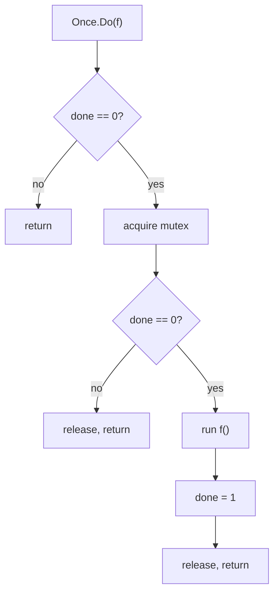
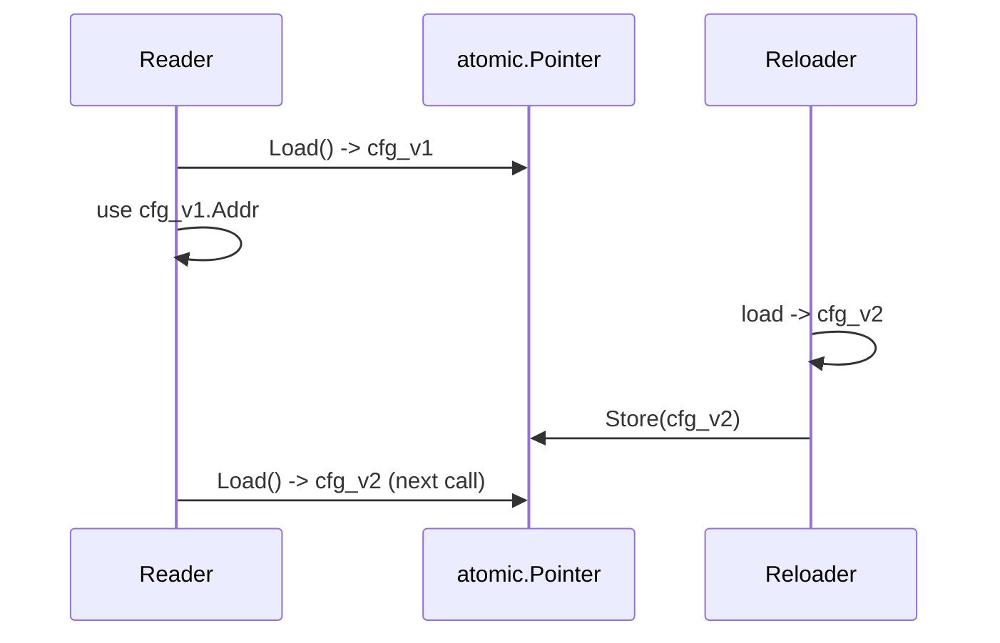
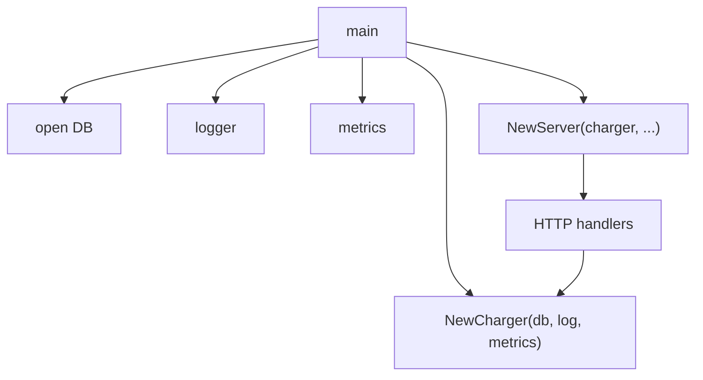

# Singleton Pattern — Middle

## 1. What this level adds

Junior taught the shape: one shared instance, lazily constructed under `sync.Once`. Middle is about *what actually happens* when you reach for a singleton in production:

- `sync.Once` internals — atomic fast path, mutex slow path, the memory model guarantees that make it correct.
- Resettable singletons — the testing-only escape hatch and why it's safer than it looks.
- Singletons that can fail — `sync.Once` plus a captured error, the "remember the failure" pattern.
- Hot-reload of a singleton — `atomic.Pointer[T]` swaps without breaking readers.
- Package-var vs function-gated — when each fits.
- Why `init()` is a footgun for singletons, even though it looks tempting.
- Generic singleton helpers and where they earn their keep.
- Testing singletons: isolation, restoring state, the parallel-test trap.
- Replacing the singleton with dependency injection (DI) — usually the right call.
- Common production mistakes — mutable global state, init-order surprises, slow shutdown.

By the end you should be able to look at a `var X = newX()` line in a code review and know whether to merge it, refactor it, or burn it.

---

## 2. Table of Contents

1. [What this level adds](#1-what-this-level-adds)
2. [Table of Contents](#2-table-of-contents)
3. [sync.Once internals — fast path vs slow path](#3-synconce-internals--fast-path-vs-slow-path)
4. [Singleton with error return](#4-singleton-with-error-return)
5. [Resettable singletons for testing](#5-resettable-singletons-for-testing)
6. [Hot-reload via atomic.Pointer](#6-hot-reload-via-atomicpointer)
7. [Package-var vs function-gated singleton](#7-package-var-vs-function-gated-singleton)
8. [Why init() is dangerous for singletons](#8-why-init-is-dangerous-for-singletons)
9. [Generic singleton helpers](#9-generic-singleton-helpers)
10. [Testing singletons](#10-testing-singletons)
11. [Replacing singleton with DI](#11-replacing-singleton-with-di)
12. [Common middle-level mistakes](#12-common-middle-level-mistakes)
13. [Performance — sync.Once fast-path cost](#13-performance--synconce-fast-path-cost)
14. [Debugging singleton bugs](#14-debugging-singleton-bugs)
15. [Tricky points](#15-tricky-points)
16. [Test](#16-test)
17. [Cheat sheet](#17-cheat-sheet)
18. [Summary](#18-summary)

---

## 3. sync.Once internals — fast path vs slow path

`sync.Once` is the standard tool for one-shot initialisation. To use it well, you should know what it does.

### 3.1 The structure

Simplified from the runtime:

```go
type Once struct {
    done atomic.Uint32
    m    Mutex
}

func (o *Once) Do(f func()) {
    if o.done.Load() == 0 {
        o.doSlow(f)
    }
}

func (o *Once) doSlow(f func()) {
    o.m.Lock()
    defer o.m.Unlock()
    if o.done.Load() == 0 {
        defer o.done.Store(1)
        f()
    }
}
```

Two paths:

1. **Fast path** — `done.Load() == 0` check. An atomic load. On x86 effectively free; on ARM/POWER it adds an acquire fence. After init finishes once, every subsequent call takes this path and returns immediately.
2. **Slow path** — first call enters `doSlow`, takes the mutex, double-checks `done` (another goroutine may have raced in), runs `f`, stores `done = 1` *inside* the lock.



### 3.2 Why the double-check

Without the inner `done.Load()`, two goroutines that race past the outer check both take the lock and both call `f`. The double-check is the classic *double-checked locking* pattern. The atomic on `done` plus the mutex's happens-before ordering makes it safe.

### 3.3 The memory model contract

The Go memory model guarantees: after `Once.Do(f)` returns in *any* goroutine, the writes performed by `f` are visible to every other goroutine that observes `done == 1`. That's why `var instance *T; once.Do(func() { instance = newT() })` then `return instance` from another goroutine is safe — provided every read goes through `once.Do`. Read `instance` directly outside `once.Do` and you've left the contract.

### 3.4 What sync.Once does NOT do

- Does **not** prevent recursive `Do` on the same Once — `f` calling `once.Do(f)` deadlocks.
- Does **not** retry on failure. If `f` panics, `done` is still set to 1 (the `defer o.done.Store(1)` runs before unlock). The singleton is permanently broken — subsequent calls return immediately, with whatever partial state `f` managed to write before panicking.
- Does **not** return errors. `f` takes no params and returns nothing; capture state in enclosing variables.

The panic-but-mark-done behaviour catches many engineers. We address it explicitly in §4.

---

## 4. Singleton with error return

Real constructors fail: TLS handshake fails, file missing, network unreachable. `sync.Once` doesn't model this; the standard pattern captures the error in a sibling variable.

### 4.1 The error-capturing pattern

```go
var (
    once   sync.Once
    client *Client
    err    error
)

func Get() (*Client, error) {
    once.Do(func() { client, err = newClient() })
    return client, err
}
```

If `newClient` succeeds, every caller gets `(client, nil)`. If it fails, every caller gets `(nil, err)` — the *same* error, forever.

### 4.2 Retry-on-failure variant

If failure is transient and you want subsequent callers to retry, drop `sync.Once` and double-check by hand:

```go
type lazyClient struct {
    mu     sync.Mutex
    loaded atomic.Bool
    client *Client
}

func (l *lazyClient) Get() (*Client, error) {
    if l.loaded.Load() { return l.client, nil }
    l.mu.Lock()
    defer l.mu.Unlock()
    if l.loaded.Load() { return l.client, nil }
    c, err := newClient()
    if err != nil { return nil, err }
    l.client = c
    l.loaded.Store(true)
    return l.client, nil
}
```

The `atomic.Bool` gives a lock-free read; the mutex serialises the slow-path write. Essentially what `sync.Once` does, plus retry-on-error.

### 4.3 sync.OnceValues (Go 1.21+)

```go
var getClient = sync.OnceValues(func() (*Client, error) { return newClient() })

func Get() (*Client, error) { return getClient() }
```

`sync.OnceValues` (and single-value `sync.OnceValue`) wrap Once + state capture into a closure. Same semantics — if the constructor fails, every subsequent call returns the captured `(zero, err)`. The cleanest expression when you don't need retry and don't need test reset.

### 4.4 Choosing between them

| Need | Use |
|------|-----|
| One-shot, success-only | `sync.Once` |
| One-shot, may fail, error captured | `sync.OnceValues` |
| Retry-on-failure | mutex + nil check (or atomic + DCL for fast path) |
| Construction is expensive *and* may fail | mutex + DCL with atomic flag |

---

## 5. Resettable singletons for testing

The biggest practical problem with a singleton is that tests can't get a fresh instance. The cleanest solution is *don't use a singleton in business code* (see §11). When you must, expose a controlled reset.

### 5.1 The reset function (test-only)

```go
package config

var (
    once     sync.Once
    instance *Config
)

func Get() *Config {
    once.Do(func() { instance = loadConfig() })
    return instance
}

// reset is for tests only. Unexported on purpose.
func reset() {
    once = sync.Once{}
    instance = nil
}
```

Expose it to tests via a sibling file:

```go
// export_test.go
package config

func Reset() { reset() }
```

`export_test.go` is compiled only during `go test`. Production cannot call `Reset`. Tests in external packages (e.g., `config_test`) can.

### 5.2 The full reset cycle

```go
func TestSomething(t *testing.T) {
    config.Reset()              // start clean
    t.Cleanup(config.Reset)     // clean up after test

    cfg := config.Get()
    // ...
}
```

`t.Cleanup` is the right hook — it runs even if the test fails or skips. `defer config.Reset()` in the test body works but is fragile (no run if `t.Fatal` triggers `runtime.Goexit`).

### 5.3 Risks: parallel tests and partial resets

Two tests calling `Reset` and `Get` concurrently race on the package state — `TestB.Reset` can wipe the singleton mid-test for `TestA`. Either don't `t.Parallel()` singleton-touching tests, group them under one non-parallel parent, or refactor to be injectable (§11).

Always reset *both* halves — `once = sync.Once{}` alone leaves a stale instance; `instance = nil` alone leaves an "already ran" Once. Either omission leaves the package unusable.

---

## 6. Hot-reload via atomic.Pointer

Sometimes a singleton needs to be replaced *at runtime* — config reload, certificate rotation, feature-flag update. Readers must always see a fully-initialised instance, never a partial write. `atomic.Pointer[T]` (Go 1.19+) is the right tool.

### 6.1 The pattern

```go
var current atomic.Pointer[Config]

func init() { current.Store(loadConfig()) }

func Get() *Config { return current.Load() }

func Reload() error {
    cfg, err := loadConfigFromDisk()
    if err != nil { return err }
    current.Store(cfg)
    return nil
}
```

Reads are wait-free: `Load()` is a single atomic pointer read. Writes swap the pointer atomically. No mutex, no torn reads.

### 6.2 Why immutable Config matters

Readers can hold onto a `*Config` past the next `Reload`. They see the *old* config — fine, *as long as the old config doesn't mutate*. Treat `Config` as immutable: every field is read-only after construction.

```go
type Config struct {
    Addr    string
    Timeout time.Duration
    Tags    []string   // OK iff no one appends to it
}
```

If `Reload` builds a *new* `Config` with a *new* slice, readers iterating the old slice see a stable snapshot. If anyone does `cfg.Tags = append(cfg.Tags, "...")`, you've mutated the old `Config` that other goroutines are still reading — race detector catches it; correctness is gone.

**Rule:** build the new value first; *then* `Store` it. Never mutate after publishing.

### 6.3 Reload flow



The reader's in-flight use of `cfg_v1` continues against the immutable snapshot. Next `Load()` sees `cfg_v2`.

### 6.4 atomic.Pointer vs Once-based singleton

| Aspect | `sync.Once` | `atomic.Pointer[T]` |
|--------|-------------|---------------------|
| Init style | Lazy on first read | Eager or explicit `Reload()` |
| Updates after init? | No — fixed for lifetime | Yes — atomic swap any time |
| Read cost | atomic load + check | atomic load |
| Test reset | Re-make `Once{}`, nil instance | Just `Store(newConfig)` |

For things you might refresh, `atomic.Pointer[T]` is clearer. For things constructed exactly once (DB pool, logger), `sync.Once` is the canonical idiom. GC frees old versions once readers drop their references — memory is bounded by in-flight versions.

---

## 7. Package-var vs function-gated singleton

Two shapes; both common; pick deliberately.

### 7.1 Package-var (eager)

```go
var Default = newLogger()
```

Construction runs at *package init time* — before `main()`, in dependency order. Pros: zero ceremony (`log.Default.Info("hi")`), initialised once by the runtime. Cons: can't fail gracefully (panic = program won't start), hard to substitute in tests, init-order across packages is subtle (§8), unused code paths still pay the cost.

### 7.2 Function-gated (lazy)

```go
var (
    once          sync.Once
    defaultLogger *Logger
)

func Default() *Logger {
    once.Do(func() { defaultLogger = newLogger() })
    return defaultLogger
}
```

Construction defers until first call. Pros: unused → not built; can add an error return later without breaking the shape; tests can reset. Cons: every call pays the ~0.3 ns atomic load (usually invisible).

### 7.3 Pick by lifecycle

- **Cheap, can't fail, always needed** → package-var. `http.DefaultServeMux`, the `bytes.Buffer{}` zero value.
- **Expensive or may fail** → function-gated, returning `(*T, error)`.
- **Needs config from `main()`** (env, CLI flags) → function-gated, called from `main()` after config parses.

A clean hybrid:

```go
var Default = sync.OnceValue(func() *Logger { return newLogger() })

func main() {
    log := Default()
    // ...
}
```

The *variable* exists at init time (a closure); the *instance* is constructed lazily. Cleanest in modern Go.

---

## 8. Why init() is dangerous for singletons

`init()` looks like the natural home for "set up the singleton once". It's not — for three concrete reasons.

### 8.1 Init order is fragile

Within a package, `init()` runs in source-file alphabetical order. Across packages, in *import-dependency* order.

```go
// db/db.go
func init() { DB = sql.Open(...) }

// telemetry/telemetry.go
func init() { Tracer = newTracer(db.DB) }   // assumes db.DB is ready
```

Works *only if* `telemetry` imports `db`. If both are imported by `main` but neither imports the other, init order is by file path — undefined at design time. A new import in `main.go` can silently shift the order.

### 8.2 Testability collapses

```go
func init() {
    apiKey = os.Getenv("API_KEY")
    if apiKey == "" { log.Fatal("API_KEY required") }
}
```

Tests can't unset the env var without the binary refusing to start. Tests can't substitute a fake key. Tests can't run *at all* without `API_KEY` set.

Fix — construct explicitly from `main()`:

```go
func main() {
    cfg := mustLoadConfig()
    client := newClient(cfg)
    runApp(client)
}
```

Tests now build their own client and never touch `init`.

### 8.3 init() can't return errors

```go
func init() { db = sql.Open(...) }   // ignores error
```

If `sql.Open` fails, the error vanishes. The program continues, holding a `*sql.DB` that doesn't work; the first query fails inscrutably 30 seconds later. `panic(err)` works but is also bad — no logging, no graceful shutdown, no operator message. `main()` with `log.Fatalf` is fail-fast *and* readable.

### 8.4 The one place init() is fine

Registry self-registration (see `06-factory-pattern/middle.md` §4). Each package registers a value into a shared map. No construction, no errors, no ordering surprises beyond "register before lookup". Standard library: `database/sql`, `image`, `encoding/...`. Everything else — explicit construction from `main()`.

---

## 9. Generic singleton helpers

Go 1.18+ lets us write reusable singleton helpers without `interface{}` casting.

### 9.1 A generic Lazy

```go
type Lazy[T any] struct {
    once sync.Once
    val  T
    err  error
    init func() (T, error)
}

func NewLazy[T any](init func() (T, error)) *Lazy[T] {
    return &Lazy[T]{init: init}
}

func (l *Lazy[T]) Get() (T, error) {
    l.once.Do(func() { l.val, l.err = l.init() })
    return l.val, l.err
}
```

Usage:

```go
var dbHandle = NewLazy(func() (*sql.DB, error) {
    return sql.Open("postgres", os.Getenv("DB_DSN"))
})

db, err := dbHandle.Get()
```

This is `sync.OnceValues` in spirit; the named type lets you embed it in larger structs and pass it around.

### 9.2 A generic Atomic singleton

```go
type Atomic[T any] struct{ p atomic.Pointer[T] }

func (a *Atomic[T]) Get() *T  { return a.p.Load() }
func (a *Atomic[T]) Set(v *T) { a.p.Store(v) }
```

Useful for multiple "single-instance" pieces of state with the same swap semantics — config, feature flags, routing tables.

### 9.3 When generics are worth it

For application code, you rarely need these helpers — the boilerplate they save is small and the indirection costs readability. For library code that publishes a "lazy initialisation" abstraction, the generic helper is worth its weight. If three singletons differ only in type, use the helper. If they differ in init logic or error handling, write each by hand.

---

## 10. Testing singletons

Singletons resist testing by design — they're global mutable state, often initialised once per process.

### 10.1 Don't test through the singleton

```go
// Bad — test reaches through global state.
func TestRoutesPost(t *testing.T) {
    config.Reset()
    config.Load("test-config.yaml")
    // tests something that reads config.Get() internally
}
```

The test depends on reset working, no other test touching the package, the YAML being present — each a landmine. Refactor to take the config as a parameter:

```go
func RoutesPost(cfg *Config, ...) { /* ... */ }
```

The singleton becomes a *convenience* in `main.go`, not load-bearing logic.

### 10.2 Test isolation with t.Cleanup

```go
func withCleanConfig(t *testing.T, cfg *Config) {
    t.Helper()
    config.Reset()
    config.Set(cfg)
    t.Cleanup(config.Reset)
}

func TestWithFooEnabled(t *testing.T) {
    withCleanConfig(t, &Config{FooEnabled: true})
    if !config.Get().FooEnabled { t.Fatal("FooEnabled should be true") }
}
```

The helper makes per-test setup uniform. `t.Helper()` points error reports at the test, not the helper.

### 10.3 Don't t.Parallel singleton-touching tests

Tests calling `t.Parallel()` share the package state and reset each other under each other's feet. Drop `t.Parallel()`, or group singleton tests under one non-parallel parent `t.Run`.

### 10.4 Mock the source, not the singleton

Production:

```go
var current = sync.OnceValue(func() *Config { return loadFromDisk("/etc/app.yaml") })
```

Hard to test. Refactor to take the source as a parameter:

```go
type ConfigSource func() (*Config, error)
func NewLazyConfig(src ConfigSource) func() (*Config, error) { return sync.OnceValues(src) }

var current = NewLazyConfig(func() (*Config, error) { return loadFromDisk("/etc/app.yaml") })
```

Tests build their own with an in-memory source. You're no longer testing the package-level singleton — you're testing the helper with controlled inputs.

### 10.5 The "snapshot and restore" idiom

```go
func TestSwapLogger(t *testing.T) {
    old := log.Default
    t.Cleanup(func() { log.Default = old })
    log.Default = newTestLogger()
    // ...
}
```

For singletons exposed as package vars, this is the canonical isolation idiom. Always restore in `t.Cleanup` — `t.Fatal` skips deferred resets.

---

## 11. Replacing singleton with DI

Most of the time, the singleton is the wrong answer to *"how do I get this thing in three places without re-constructing it three times?"*. The right answer is **dependency injection**.

### 11.1 The refactor

Before:

```go
func Charge(ctx context.Context, amount int) error {
    db := database.Get()       // singleton
    log := logger.Get()        // singleton
    metrics := metrics.Get()   // singleton
    log.Info("charging", amount)
    metrics.Inc("charge_attempted")
    return db.RecordCharge(ctx, amount)
}
```

After:

```go
type Charger struct {
    db      *sql.DB
    log     *slog.Logger
    metrics *metrics.Registry
}

func NewCharger(db *sql.DB, log *slog.Logger, m *metrics.Registry) *Charger {
    return &Charger{db: db, log: log, metrics: m}
}

func (c *Charger) Charge(ctx context.Context, amount int) error {
    c.log.Info("charging", amount)
    c.metrics.Inc("charge_attempted")
    return c.db.RecordCharge(ctx, amount)
}
```

`Charger` doesn't know its deps are singletons. Tests build their own:

```go
func TestCharge(t *testing.T) {
    c := NewCharger(openTestDB(t), discardLogger(), metrics.NewRegistry())
    _ = c.Charge(ctx, 100)
}
```

`main()` wires the real ones in:

```go
func main() {
    db := mustOpenDB()
    charger := payment.NewCharger(db, slog.Default(), metrics.Default())
    // ...
}
```

### 11.2 Wiring tree



`main()` is the *composition root*. Everything below it receives dependencies; nothing reaches back to a global.

### 11.3 Cross-cutting concerns and DI tooling

For things that genuinely *are* one-per-process (loggers, metrics registries, default `http.Client`), use a singleton via a package var *and* allow injection where testability matters. Use the global by default; switch to DI when testability matters for that subsystem.

For large services, hand-writing `main()` wiring becomes unwieldy. Tools like `google/wire` (compile-time), `uber-go/fx` and `uber-go/dig` (runtime, reflection-based) generate the dependency graph. The principle is the same — singletons retreat from package vars to `main()`'s wiring. Reach for tooling when the wiring is the bottleneck.

---

## 12. Common middle-level mistakes

### 12.1 Mutating the singleton's exposed fields

```go
cfg := config.Get()
cfg.Tags = append(cfg.Tags, "extra")  // mutating the shared instance
```

Other readers see the appended tag, or a torn read if the slice reallocates. Make the singleton read-only after construction (document it) or self-synchronised (`AddTag(string)` taking the lock internally). Never expose mutable slices/maps without a sync contract.

### 12.2 Package-var init depending on another package's state

```go
var Default = newConfig()    // calls env.Region — but env may not be ready
```

If `config` doesn't import `env`, `env.Region` is the zero value. Production reads `""`. Fix: import `env` explicitly, or lazy-init the config.

### 12.3 Forgetting to Close the singleton

```go
var DB = mustOpenDB()
```

Process shutdown — no one calls `DB.Close()`. Connections don't flush. Move construction into `main()`:

```go
func main() {
    db := mustOpenDB()
    defer db.Close()
    runApp(db)
}
```

For signal-driven shutdown, register a goroutine on `signal.NotifyContext` that calls `db.Close()` when ctx cancels.

### 12.4 Calling Get() inside the constructor

```go
func GetA() *A {
    once.Do(func() { a = newA(); b = newB(a) })
    return a
}
```

If `newA()` calls `GetB()` — which is also `Once.Do`-protected with the *same* Once — you deadlock. Use separate Onces; construct inline when there's a dependency.

### 12.5 Panicking inside Once.Do

```go
once.Do(func() {
    instance = mustOpen()   // panics on failure
})
```

If `mustOpen` panics, the deferred `done.Store(1)` still runs before unlock — `done` becomes 1. Subsequent calls return immediately with `instance == nil`; the next access dereferences `nil`. The singleton is permanently broken. To get retry-on-panic, wrap manually:

```go
type RetryableOnce struct {
    mu   sync.Mutex
    done bool
}

func (r *RetryableOnce) Do(f func()) {
    r.mu.Lock()
    defer r.mu.Unlock()
    if r.done { return }
    f()                  // panic here leaves done == false
    r.done = true
}
```

Whether you *want* retry is a design choice — "permanently broken on first failure" is sometimes correct (no point retrying to open a missing file).

### 12.6 sync.Once copied by value

`sync.Once` must not be copied after first use — `go vet -copylocks` catches obvious cases. Always pass `*Service` around, never `Service` by value.

### 12.7 Singleton capturing a request context

```go
func Get(ctx context.Context) *Client {
    once.Do(func() { client = newClient(ctx) })
    return client
}
```

The *first* caller's `ctx` is captured. If it's request-scoped, the captured ctx cancels when that request ends — affecting all subsequent users. Singletons should not capture short-lived contexts. Use `context.Background()` inside the constructor, or pass ctx into *methods*, not the constructor.

---

## 13. Performance — sync.Once fast-path cost

### 13.1 Microbenchmark

```go
func BenchmarkOnce(b *testing.B) {
    var once sync.Once
    once.Do(func() {})   // warm
    b.ResetTimer()
    for i := 0; i < b.N; i++ { once.Do(func() {}) }
}
```

Modern x86: ~0.3 ns/op — one atomic load + branch. ARM: ~0.5 ns/op due to the acquire fence.

| Operation | x86 cost |
|-----------|----------|
| `once.Do` fast path | ~0.3 ns |
| `atomic.Pointer.Load` | ~0.3 ns |
| `mutex.Lock`+`Unlock` (uncontended) | ~15 ns |
| Map lookup by string | ~30 ns |
| Function call | ~1 ns |

`sync.Once` on the fast path is in the noise. Worry only if you're calling `Get()` millions of times per second per goroutine and have already optimised everything else.

### 13.2 The contention path

If many goroutines call `Once.Do` *during* initialisation, they all queue on the mutex. First finishes, the rest wake, check `done`, see it's set, return. Bounded — total time ≈ init time + N·lock-release. Matters only when init is slow (hundreds of ms). Pre-warm from `main()` via `db.Get()` to avoid the thundering herd.

### 13.3 The work is the bottleneck, not the gate

If `Get()` is hot, the singleton lookup is ~0.3 ns. The work the singleton does (DB query, log write, network call) is microseconds to milliseconds. The gate is never the bottleneck.

---

## 14. Debugging singleton bugs

### 14.1 "Works in production, fails in tests"

Singleton state leaks between test cases. Use `go test -count=10 ./...` — pass once, fail on the second run means the singleton holds state from the first run. `go test -shuffle=on ./...` runs in random order; pass/fail flips reveals init-order dependence.

### 14.2 "Data race detected" with no explicit shared state

`go test -race ./...`. Singletons are the most common source — code reaches into a global from many goroutines and somewhere a write happens without synchronisation. Common offender: singleton with an exposed slice or map field, no sync.

### 14.3 "Init takes forever"

A slow init is usually a DB / network call in a package's `init` function. Move it to lazy. Use `runtime/trace` to confirm.

### 14.4 "Singleton is nil after reset"

```go
func reset() {
    once = sync.Once{}
    // forgot: instance = nil
}
```

Subsequent `Get()` runs `once.Do`, sets `instance` — but any code reading `instance` outside `once.Do` may see the stale value. Reset both Once *and* the instance variable.

### 14.5 "Closing the singleton, then someone calls it"

```go
defer db.Close()
go func() { db.Query(...) }()   // db closed while query runs
```

Goroutines outlive their parent function's return. Use `context.Context` for shutdown coordination:

```go
ctx, cancel := context.WithCancel(context.Background())
defer cancel()
go worker(ctx, db)

<-shutdownSignal
cancel()      // workers see ctx.Done(), drain
db.Close()    // safe now
```

---

## 15. Tricky points

### 15.1 sync.Once must not be copied

Pass `*Service`, never `Service` by value — copying `sync.Once` gives you a distinct Once that re-runs init. `go vet -copylocks` catches obvious cases.

### 15.2 The "one Once for many singletons" anti-pattern

```go
var once sync.Once
var a *A
var b *B

func GetA() *A { once.Do(func() { a = newA(); b = newB() }); return a }
func GetB() *B { once.Do(func() { a = newA(); b = newB() }); return b }
```

DRY-looking, but: if `newA` panics, `b` never gets set. If you only call `GetA`, you still pay for `newB`. Cleaner — one Once per singleton:

```go
var (
    onceA sync.Once; a *A
    onceB sync.Once; b *B
)
func GetA() *A { onceA.Do(func() { a = newA() }); return a }
func GetB() *B { onceB.Do(func() { b = newB() }); return b }
```

### 15.3 Singleton with a finalizer

`runtime.SetFinalizer(singleton, Close)` doesn't work — the global reference keeps the object alive forever; the finalizer never runs. Even if it could, finalizers run on a separate goroutine at unpredictable times. Use explicit `Close()` from `main()`.

### 15.4 The typed-nil interface trap

```go
var defaultLogger Logger = nil   // typed nil

l := Default()
if l != nil { l.Log("hi") }   // panic — nil receiver
```

`defaultLogger` is a nil concrete value wrapped in an interface. The interface is *not* nil (it has a type descriptor). `l != nil` is true; the method call panics on the nil receiver. Avoid by keeping the package-level var typed as the concrete pointer, not the interface, until you actually assign a real value.

### 15.5 Mutation after Store breaks atomic.Pointer

```go
cfg := load()
Config.Store(cfg)
cfg.Tags = append(cfg.Tags, "reloaded")  // racy post-publish mutation
```

Build first, *then* `Store`. After publishing, the value is shared — never mutate.

---

## 16. Test

**Q1.** Find the bug.

```go
var (
    once   sync.Once
    config *Config
)

func Get() *Config {
    once.Do(loadConfig)
    return config
}

func loadConfig() {
    f, err := os.Open("/etc/app.yaml")
    if err != nil { return }   // silent
    config = parse(f)
}
```

<details><summary>Answer</summary>

`os.Open` failure returns silently. `config` is nil; `Once.done == 1`, so retry never happens. Every subsequent `Get()` returns nil and the caller's `cfg.Field` panics. Fix with `sync.OnceValues`:

```go
var Get = sync.OnceValues(func() (*Config, error) {
    f, err := os.Open("/etc/app.yaml")
    if err != nil { return nil, err }
    return parse(f), nil
})
```

</details>

**Q2.** Why does this fail intermittently with `go test -race -count=5`?

```go
var once sync.Once
var db *DB

func Get() *DB { once.Do(func() { db = newDB() }); return db }
func Reset()   { once = sync.Once{}; db = nil }

func TestA(t *testing.T) { t.Parallel(); Reset(); if Get() == nil { t.Error("nil") } }
func TestB(t *testing.T) { t.Parallel(); Reset(); if Get() == nil { t.Error("nil") } }
```

<details><summary>Answer</summary>

`t.Parallel` makes them run concurrently. `TestB.Reset` can wipe `db` between `TestA.Get` and `TestA`'s nil check. Plus race detector flags the unsynchronised writes to `db` and `once`. Fix: drop `t.Parallel()` for these tests, or refactor to inject the DB instead of using a singleton.

</details>

**Q3.** What does this print?

```go
var x = compute()
func compute() int { fmt.Println("compute"); return 42 }
func init() { fmt.Println("init1") }
func init() { fmt.Println("init2, x =", x) }
func main() { fmt.Println("main, x =", x) }
```

<details><summary>Answer</summary>

```
compute
init1
init2, x = 42
main, x = 42
```

Package-level vars init *before* `init()`. Multiple `init()` in the same file run in source order. `x` is constructed eagerly — if `compute()` panicked, the program would never start. Exactly why package-level eager init is dangerous for anything that can fail.

</details>

**Q4.** Which is correct for hot-reload?

```go
// A
func Reload() { cfg := load(); Config.Store(cfg); cfg.Tags = append(cfg.Tags, "x") }
// B
func Reload() { cfg := load(); cfg.Tags = append(cfg.Tags, "x"); Config.Store(cfg) }
```

<details><summary>Answer</summary>

**B**. Contract for `atomic.Pointer`: immutable snapshot, swap by pointer. All mutations *before* `Store`. A swaps first then mutates the now-shared object — readers that did `Load()` between Store and append see one set of tags, readers after see another. Build first, *then* publish.

</details>

**Q5.** Is `init()` ever the right place for a singleton?

<details><summary>Answer</summary>

Yes, narrowly: (1) self-registration in a registry (no construction, no errors, no ordering issues beyond "before lookup" — `database/sql` drivers, `image` decoders), and (2) compile-time constants like `regexp.MustCompile` (panic is correct for programmer errors). Anything with external dependencies (env, files, network) — construct explicitly from `main()`.

</details>

---

## 17. Cheat sheet

| Need | Tool |
|------|------|
| One-shot lazy init, no errors | `sync.Once` |
| One-shot lazy init with error | `sync.OnceValues` or `sync.Once` + captured `err` |
| Retry on failure | mutex + nil check (DCL with `atomic.Bool` for fast path) |
| Hot-reloadable | `atomic.Pointer[T]` with immutable T |
| Eager init, can't fail | package-var `var X = newX()` |
| Cross-cutting (logger, metrics) | package-var, allow injection where testability matters |
| Need test reset | unexported `reset()` + `_test.go` export |
| Many singletons same shape | generic `Lazy[T]` helper |
| Construction depends on `main()` config | function-gated, called from `main` |
| Resource needs Close | explicit `Close()` from `main`, `defer` it |
| Want DI testability | drop the singleton, take dep as parameter |

### Anti-cheat-sheet (don't)

| Don't | Because |
|-------|---------|
| `var X = mustOpenDB()` | Crashes at import, untestable |
| `init() { x = network.Connect() }` | Same; plus error vanishes |
| Singleton holding request `context.Context` | First caller's ctx leaks to everyone |
| `runtime.SetFinalizer(singleton, Close)` | Finalizer never runs — global ref keeps it alive |
| `sync.Once` copied by value | Distinct Onces — init runs multiple times |
| Reset `Once` but not the instance | Stale pointer leaks across reset |
| `t.Parallel()` + singleton reset | Tests race; flaky |
| Mutate `atomic.Pointer` target after `Store` | Readers see mid-mutation; race fires |

---

## 18. Summary

Singletons in Go are *easy to write and hard to live with*. The pattern is two atomic operations and a closure; the cost is paid in:

- **Testability** — every singleton makes the test that touches it harder to isolate.
- **Init ordering** — every package-level var or `init()` couples startup behaviour to dependency-graph layout.
- **Coupling** — every `package.Get()` call is a hidden dependency that the function signature doesn't reveal.

Middle-level wisdom: use the singleton for things that genuinely are one-per-process and stable (the `slog.Default()` logger, `http.DefaultClient`, the metrics registry). For everything else, *dependency injection* via constructor parameters is clearer, safer, and tests itself.

The technical tools — `sync.Once`, `sync.OnceValues`, `atomic.Pointer[T]` — are well-engineered and correct. Lean on them where the singleton is appropriate. Don't reach for them just because you want global access.

Next step: **[senior.md](senior.md)** — singleton at scale: dependency graphs, shutdown ordering, hot-reload coordination across multiple singletons, signal-driven reload, the trade-off between `atomic.Pointer` and `RCU`-style versioning, plus case studies of production singletons (logger frameworks, config services, connection pools) and how their authors solved the trade-offs.
