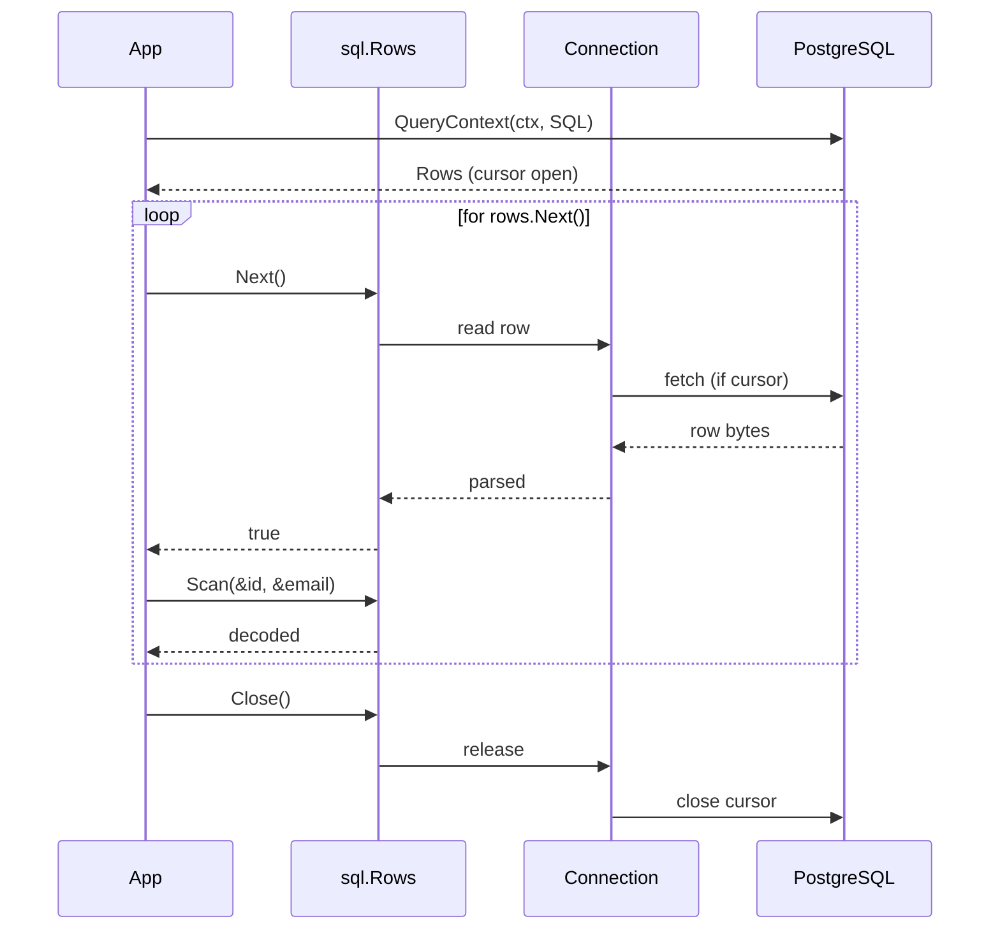
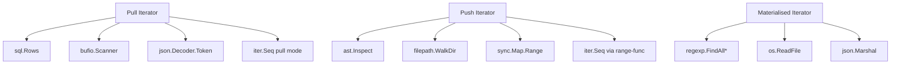
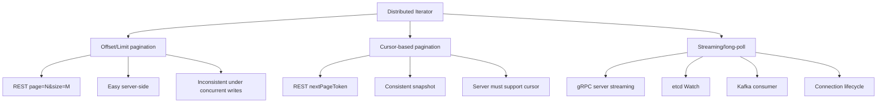
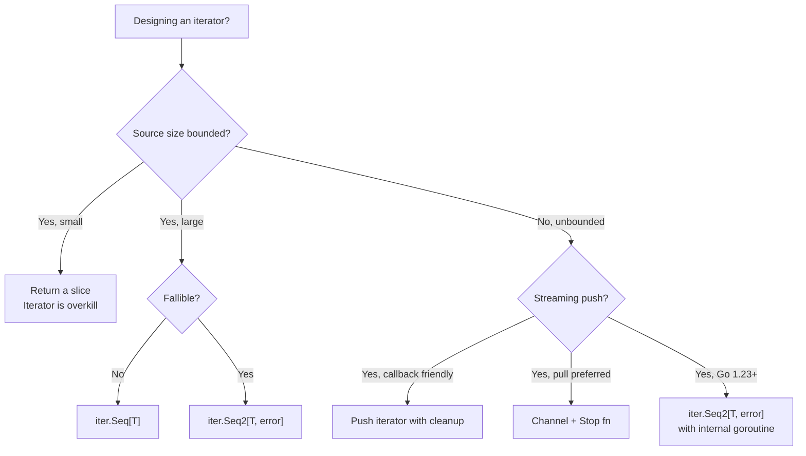

# Iterator Pattern — Senior

## 1. The architectural question

Junior taught the shape — an object that yields one element at a time via `Next()`/`Value()`, hiding the structure of the underlying collection. Middle taught the variants — `iter.Seq` and `iter.Seq2` from Go 1.23, push vs pull, error propagation, lazy composition with `slices.Collect` and the `iter` package. Senior is what happens when an iterator stops being a local convenience and becomes the *public contract of a library, a database driver, a Kubernetes controller, or a Kafka consumer*.

The day your `*sql.Rows` ships in `database/sql`, every Go program that talks to a relational database depends on its loop shape. The day your `bufio.Scanner` ships, every shell-script-replacement-in-Go follows the same `for s.Scan()` rhythm. The day your Kubernetes `Watch` returns an `iter.Seq2[*Pod, error]`, controller-runtime authors rewrite their reconcile loops.

The senior-level forces:

1. **Iterator design in published APIs** — `sql.Rows`, `bufio.Scanner`, `ast.Inspect`, `filepath.WalkDir`, `regexp.FindAllStringSubmatchIndex`. The shape of these iterators determined how a generation of Go programmers wrote code. Some shapes aged well; some didn't.
2. **`iter.Seq` adoption strategy** — Go 1.23 shipped the `iter` package and range-over-func. Libraries now choose between push iterators (callback), pull iterators (`Next`/`Value`), and the new `iter.Seq[T]`/`iter.Seq2[K, V]` shape. The choice is not aesthetic — it has API stability, error handling, and performance consequences.
3. **Backward compatibility** — `*sql.Rows` cannot become an `iter.Seq` overnight. Real libraries keep `Next()`/`Value()` *and* expose an `iter.Seq` adapter. The transition strategy across major versions matters.
4. **Distributed iterators** — paginated REST APIs (`nextPageToken`), gRPC streaming, etcd `Watch`, Kafka consumers, Bigtable `Table.ReadRows`. The iterator hides not just collection layout but also network protocol, cursor management, snapshot semantics, and resumption.
5. **Context cancellation** — every iterator over an unbounded or slow source must honour `ctx.Done()`. Iterators that don't are a class of bug, not a corner case.
6. **Concurrent iteration safety** — most Go iterators are *not* safe for concurrent iteration. The contract must be explicit. The few that are (`sync.Map.Range`) document it loudly.
7. **Memory considerations** — lazy iteration is the whole point of the pattern. Materialising into a slice defeats it. But sometimes you must — and the trade-off is real.
8. **Real ecosystems** — `client-go` list/watch, etcd `clientv3.Watch`, Sarama/segmentio Kafka consumers, Bigtable `Table.ReadRows`, AWS SDK paginators. Each is an iterator under the hood; each has its own conventions, its own postmortems.
9. **Anti-pattern resistance** — leaked iterators (forgotten `Close()`), materialised-millions, infinite iteration on broken streams, iterators with hidden side effects, iterators that capture goroutines.

This file walks the senior-level shape of all of it. Sections 3-6 cover iterator design in published APIs and `iter.Seq` adoption. Sections 7-10 cover distributed iterators, context, and concurrency. Sections 11-14 cover memory, performance, and real ecosystems. Section 15 is postmortems. The rest is anti-patterns, cross-language comparison, mistakes, questions, and reference material.

---

## 2. Table of Contents

1. [The architectural question](#1-the-architectural-question)
2. [Table of Contents](#2-table-of-contents)
3. [Iterator design in published APIs: three canonical case studies](#3-iterator-design-in-published-apis-three-canonical-case-studies)
4. [`iter.Seq` and `iter.Seq2`: the Go 1.23 shape](#4-iterseq-and-iterseq2-the-go-123-shape)
5. [Adoption strategy: how a library moves to `iter.Seq`](#5-adoption-strategy-how-a-library-moves-to-iterseq)
6. [Backward compatibility: keeping `Next()`/`Value()` and adding `iter.Seq`](#6-backward-compatibility-keeping-nextvalue-and-adding-iterseq)
7. [Distributed iterators: paginated APIs, cursors, snapshots](#7-distributed-iterators-paginated-apis-cursors-snapshots)
8. [Iterator with context cancellation](#8-iterator-with-context-cancellation)
9. [Concurrent iteration safety](#9-concurrent-iteration-safety)
10. [Memory considerations: lazy vs materialised](#10-memory-considerations-lazy-vs-materialised)
11. [Real ecosystems: client-go, etcd, Kafka, Bigtable](#11-real-ecosystems-client-go-etcd-kafka-bigtable)
12. [Performance at scale: per-element overhead, batching](#12-performance-at-scale-per-element-overhead-batching)
13. [Anti-patterns: leaks, materialisation, side effects](#13-anti-patterns-leaks-materialisation-side-effects)
14. [Profiling and debugging iterators in production](#14-profiling-and-debugging-iterators-in-production)
15. [Postmortems](#15-postmortems)
16. [Cross-language comparison](#16-cross-language-comparison)
17. [Common senior-level mistakes](#17-common-senior-level-mistakes)
18. [Tricky questions](#18-tricky-questions)
19. [Cheat sheet](#19-cheat-sheet)
20. [Further reading](#20-further-reading)

---

## 3. Iterator design in published APIs: three canonical case studies

Three iterators from the Go standard library define the design space. Every iterator you ship is a variation on one of these.

### 3.1 `database/sql.Rows` — the resource-owning pull iterator

```go
rows, err := db.QueryContext(ctx, "SELECT id, email FROM users WHERE active = $1", true)
if err != nil {
    return err
}
defer rows.Close()

for rows.Next() {
    var id int64
    var email string
    if err := rows.Scan(&id, &email); err != nil {
        return err
    }
    // ... use id, email
}
if err := rows.Err(); err != nil {
    return err
}
```

Five primitives:

- `Next() bool` — advances; returns `false` when no more rows or on error.
- `Scan(dest ...any) error` — decodes the current row into destinations.
- `Err() error` — call after the loop to distinguish *exhausted* from *errored*.
- `Close() error` — must be called; releases the underlying connection.
- `Columns()`, `ColumnTypes()` — metadata access during iteration.

The design encodes hard requirements:

1. **Resource ownership.** `Rows` holds a `*sql.Conn` (or pooled equivalent). Forgetting `Close()` leaks the connection, which means pool exhaustion in 10 minutes under load.
2. **Error after exhaustion.** `Next() == false` is ambiguous — it could mean "no more rows" or "the network died". `Err()` after the loop disambiguates.
3. **Streaming, not buffered.** Each `Next()` may trigger a network round-trip (for cursors) or read from a streaming response. The driver decides whether to prefetch.
4. **Single-use, single-goroutine.** `Rows` is not safe for concurrent iteration. The contract is explicit in the godoc.

What aged well:
- The `defer rows.Close()` idiom is universal. Every Go programmer learns it once.
- The `Err()`-after-loop pattern is unusual but correct. It separates two failure modes that the boolean return collapses.

What aged badly:
- `Scan` with `...any` and out-parameters is awkward — type errors caught at runtime, not compile time. Sqlx, sqlc, and pgx all offer better shapes.
- No `iter.Seq` adapter in the standard library as of Go 1.23. Third-party wrappers exist but you can't iterate `rows` with `range rows` in stdlib.



### 3.2 `bufio.Scanner` — the line/token pull iterator with internal buffer

```go
f, err := os.Open("/var/log/syslog")
if err != nil { return err }
defer f.Close()

scanner := bufio.NewScanner(f)
scanner.Buffer(make([]byte, 0, 64*1024), 1024*1024) // grow to 1 MB
for scanner.Scan() {
    line := scanner.Text()
    if strings.Contains(line, "ERROR") {
        process(line)
    }
}
if err := scanner.Err(); err != nil {
    return err
}
```

Three primitives, very similar to `sql.Rows`:

- `Scan() bool` — read the next token; returns `false` at EOF or error.
- `Text()` / `Bytes()` — the current token.
- `Err() error` — distinguishes EOF from real error (`io.EOF` is *not* returned; it's the absence of `Err`).

Design choices:

1. **Buffered.** Scanner holds an internal buffer; it reads chunks from the underlying `io.Reader`, finds tokens, returns them.
2. **Pluggable token boundary.** `scanner.Split(bufio.ScanWords)` switches from lines to words. Custom `SplitFunc` lets you scan TLVs, fixed-width records, anything.
3. **Token reuse caveat.** `scanner.Bytes()` returns a slice into the internal buffer. The next `Scan()` *overwrites* it. If you need to keep the bytes, copy them. This is a senior-level footgun documented in the godoc but missed routinely.
4. **Max token size.** Default 64 KB. A line longer than that returns `bufio.ErrTooLong`. The `Buffer` method raises the cap. The `Scanner` actively refuses pathologically long inputs — the design assumes log files, not arbitrary streams.

```go
// ANTI-PATTERN: keeping a slice into the scanner buffer
var lines [][]byte
for scanner.Scan() {
    lines = append(lines, scanner.Bytes())  // BUG: all entries point at the same buffer
}
// After the loop, all `lines[i]` are equal to the last scanned line.

// FIX: copy
for scanner.Scan() {
    b := scanner.Bytes()
    cp := make([]byte, len(b))
    copy(cp, b)
    lines = append(lines, cp)
}
```

Or use `scanner.Text()`, which allocates a new string each call — slower but safer.

What aged well:
- `SplitFunc` is genuinely flexible. The same scanner reads lines, words, runes, custom framings.
- The "token boundaries can be customised" abstraction is right.

What aged badly:
- The default max-token-size has caused thousands of bug reports. People don't read the godoc; they hit `bufio.ErrTooLong` in production on a long JSON line.
- The "bytes returned alias the buffer" trap. A new design would copy by default and offer a zero-copy variant explicitly.

### 3.3 `go/ast.Inspect` — the push iterator with visitor

```go
import "go/ast"

ast.Inspect(file, func(n ast.Node) bool {
    if call, ok := n.(*ast.CallExpr); ok {
        if id, ok := call.Fun.(*ast.Ident); ok && id.Name == "panic" {
            fmt.Println("found panic at", fset.Position(call.Pos()))
        }
    }
    return true  // continue
})
```

One primitive: `Inspect(root, func(Node) bool)`. The caller passes a closure; the function calls it for every node in the tree, in depth-first pre-order. Return `false` to stop descending into the current subtree.

This is the **push iterator** shape — also called the *internal iterator* in design pattern literature. The library drives the loop; the caller provides a callback.

Trade-offs vs the pull shape:

| Aspect | Pull (`Rows.Next`, `Scanner.Scan`) | Push (`ast.Inspect`) |
|--------|-----------------------------------|----------------------|
| Caller controls flow | Yes (loop, break, return) | Limited (return false; can't easily abort outer scope) |
| Caller can interleave iterators | Yes (open A, open B, alternate) | Hard (callback nesting required) |
| Implementation simplicity | Caller's job to drive | Library does the walking — simpler for caller |
| Resource lifecycle | Caller calls `Close()` | Implicit — closure scope |
| Error propagation | Via `Err()` after loop | Via captured variable in closure |

Push iterators are right when the iteration *structure* is non-trivial (a tree, a graph) and you want to hide the traversal logic. Pull iterators are right when iteration is linear and the caller wants control over flow.

What aged well:
- For tree traversal, push is unambiguously better. `ast.Inspect` is a clean API.
- The `return false` to prune subtrees is exactly the right primitive.

What aged badly:
- No way to abort the whole walk early. You can `return false` to skip a subtree, but to stop entirely you have to panic or set a captured flag (and then keep returning `false` for all remaining nodes — wasteful).
- No context support. If you're walking a huge AST and the user cancels, you can't honour it.
- The `iter.Seq` shape (Go 1.23) would let `ast.Inspect` be replaced by `for n := range ast.Walk(file)` with `break` working naturally. The standard library has not done this yet, but third-party AST walkers have.

### 3.4 The honourable mentions

- **`filepath.WalkDir`** — push iterator over a directory tree. Returns `filepath.SkipDir` to prune subtrees. Has context-like cancellation via the error return.
- **`regexp.FindAllStringSubmatchIndex`** — materialised iterator. Returns a slice of all matches. Convenient but un-streamable. For very large inputs, use `FindAllStringSubmatchIndexN` with a limit, or build a manual loop with `FindStringSubmatchIndex`.
- **`encoding/json.Decoder.Token`** — pull iterator over a JSON stream. Returns one token at a time (`{`, `}`, key, value). Used for streaming-decode large JSON without loading it all.
- **`net/http.Header.Values`** — was a `[]string` returner until Go 1.14, when adding it broke nothing because slices iterate trivially. A slice is itself an iterator API.



---

## 4. `iter.Seq` and `iter.Seq2`: the Go 1.23 shape

Go 1.23 (released August 2024) added two things that changed iterator design in the language:

1. **Range-over-func.** `for x := range f { ... }` works when `f` has the right shape.
2. **The `iter` package.** Standard types `iter.Seq[V]` and `iter.Seq2[K, V]`, plus helpers in `slices` and `maps`.

### 4.1 The types

```go
package iter

type Seq[V any]      func(yield func(V) bool)
type Seq2[K, V any]  func(yield func(K, V) bool)
```

A `Seq[V]` is a function that, when called, drives an iteration by calling `yield` for each element. If `yield` returns `false`, the producer stops. The compiler turns `for x := range seq { ... }` into a closure-passing call.

```go
// Producer
func Count(n int) iter.Seq[int] {
    return func(yield func(int) bool) {
        for i := 0; i < n; i++ {
            if !yield(i) {
                return
            }
        }
    }
}

// Consumer
for i := range Count(10) {
    fmt.Println(i)
    if i == 5 {
        break  // sets yield's return to false; producer stops
    }
}
```

`Seq2[K, V]` is the same shape for two-value yields (map-like, or value+error):

```go
func Lines(r io.Reader) iter.Seq2[int, string] {
    return func(yield func(int, string) bool) {
        s := bufio.NewScanner(r)
        i := 0
        for s.Scan() {
            if !yield(i, s.Text()) {
                return
            }
            i++
        }
    }
}

for lineNum, line := range Lines(f) {
    fmt.Printf("%d: %s\n", lineNum, line)
}
```

### 4.2 Why this matters architecturally

Before Go 1.23, libraries had to choose:

- **Pull (`Next()`/`Value()`)** — caller controls flow but every iterator is a custom struct.
- **Push (callback)** — library controls flow but `break` doesn't work; errors flow through closures.
- **Channels** — natural-looking `for x := range ch` but goroutine cost, channel allocation, no synchronous backpressure, hard to bound lifecycle.

`iter.Seq` is the missing fourth option:

- Looks like `for x := range ch` — caller-friendly.
- No goroutine; the producer runs *synchronously* in the consumer's goroutine.
- `break` works because the yield returns `false`.
- No channel allocation.
- Composes with `slices.Collect`, `slices.Sorted`, `maps.All`, etc.

### 4.3 Error propagation in `iter.Seq2`

A common pattern: `iter.Seq2[T, error]` returns each element with its potential error.

```go
func ReadRecords(ctx context.Context, db *sql.DB) iter.Seq2[Record, error] {
    return func(yield func(Record, error) bool) {
        rows, err := db.QueryContext(ctx, "SELECT id, name FROM records")
        if err != nil {
            yield(Record{}, err)
            return
        }
        defer rows.Close()
        
        for rows.Next() {
            var r Record
            if err := rows.Scan(&r.ID, &r.Name); err != nil {
                if !yield(Record{}, err) {
                    return
                }
                continue
            }
            if !yield(r, nil) {
                return
            }
        }
        if err := rows.Err(); err != nil {
            yield(Record{}, err)
        }
    }
}

// Usage
for r, err := range ReadRecords(ctx, db) {
    if err != nil {
        log.Printf("scan error: %v", err)
        continue
    }
    process(r)
}
```

This is **the canonical shape for fallible iterators in modern Go**. It collapses three previously-separate things — element, error, EOF — into one range loop.

Compare to the `sql.Rows` shape:

```go
// Pre-Go-1.23 shape
for rows.Next() {
    var r Record
    if err := rows.Scan(&r.ID, &r.Name); err != nil {
        return err
    }
    process(r)
}
if err := rows.Err(); err != nil {
    return err
}
rows.Close()

// Go 1.23+ shape
for r, err := range ReadRecords(ctx, db) {
    if err != nil { return err }
    process(r)
}
// Close happens inside the iterator via defer.
```

The new shape is shorter and harder to get wrong. Forgotten `Close` is now the iterator implementer's bug, not the caller's.

### 4.4 The "pull" form via `iter.Pull`

Sometimes you need the inverse — convert a push iterator (`Seq`) back into a pull style (`Next()`-like). The `iter` package provides this:

```go
func iter.Pull[V any](seq Seq[V]) (next func() (V, bool), stop func())
func iter.Pull2[K, V any](seq Seq2[K, V]) (next func() (K, V, bool), stop func())
```

```go
seq := Count(10)
next, stop := iter.Pull(seq)
defer stop()

for {
    v, ok := next()
    if !ok { break }
    fmt.Println(v)
    if v == 3 { break }
}
```

`iter.Pull` internally spins up a goroutine that runs the producer; `next` reads from it via a channel-like rendezvous. **It allocates a goroutine.** Use only when you genuinely need pull-style flow (interleaving two iterators, custom protocols). For ordinary loops, `for v := range seq` is cheaper.

### 4.5 Composing with `slices` and `maps`

```go
import "slices"

// Collect all elements
xs := slices.Collect(Count(10))  // []int{0,1,...,9}

// Sort
sorted := slices.Sorted(Count(10))

// Take first N
first5 := slices.Collect(Limit(Count(1000000), 5))

// Filter, map
evens := slices.Collect(Filter(Count(10), func(i int) bool { return i%2 == 0 }))
```

`slices.Collect` materialises a `Seq[V]` into a `[]V`. Useful for tests, small results, or when you genuinely need a slice. **Don't `Collect` an unbounded iterator** — it OOMs.

`slices.All`, `slices.Values`, `maps.All`, `maps.Keys`, `maps.Values` go the other direction — from a slice/map to a `Seq`. The whole standard library now composes uniformly.

---

## 5. Adoption strategy: how a library moves to `iter.Seq`

You ship a library. You have `Next()`/`Value()` iterators from 2020. Go 1.23 ships. Customers ask for `iter.Seq`. What do you do?

### 5.1 The strategy matrix

| Library size | Customer count | Stability commitment | Strategy |
|--------------|----------------|---------------------|----------|
| Small, internal | <10 | Low | Switch to `iter.Seq` outright |
| Small, public | 10-100 | Medium | Add `iter.Seq` adapter; deprecate old over 2 versions |
| Large, public | 100+ | High | Add `iter.Seq` alongside; never deprecate old |
| Standard library | All Go users | Forever | Add `iter.Seq`-returning method; old API stays forever |

The standard library's pattern (as seen in `slices.All`, `maps.All`, etc.) is the gold standard: **add new methods that return `iter.Seq`, leave old methods alone, never deprecate**. A library with a million users has no other option.

### 5.2 Pattern: add an `.All()` method that returns `iter.Seq`

This is the dominant pattern in the Go ecosystem since 1.23.

```go
type RecordSet struct {
    rows *sql.Rows
    // ...
}

// Legacy API — unchanged.
func (rs *RecordSet) Next() bool { ... }
func (rs *RecordSet) Value() Record { ... }
func (rs *RecordSet) Err() error { ... }
func (rs *RecordSet) Close() error { ... }

// New API in v1.5 — returns iter.Seq2 for range-over-func.
func (rs *RecordSet) All() iter.Seq2[Record, error] {
    return func(yield func(Record, error) bool) {
        defer rs.Close()
        for rs.Next() {
            if !yield(rs.Value(), nil) {
                return
            }
        }
        if err := rs.Err(); err != nil {
            yield(Record{}, err)
        }
    }
}
```

Now callers can do either:

```go
// Old style — still works
for rs.Next() {
    r := rs.Value()
    // ...
}
if err := rs.Err(); err != nil { ... }
rs.Close()

// New style — Go 1.23+
for r, err := range rs.All() {
    if err != nil { ... }
    // ...
}
// rs.Close() handled by All()
```

Zero breakage. Old callers keep working. New callers get the modern shape.

### 5.3 Pattern: factory functions return `iter.Seq` directly

For new functions added in v1.23+, skip the legacy shape entirely:

```go
// New in v1.5 — no Next()/Value() variant exists
func (db *DB) StreamRecords(ctx context.Context, filter Filter) iter.Seq2[Record, error] {
    return func(yield func(Record, error) bool) {
        rows, err := db.QueryContext(ctx, "SELECT ...", filter.Args()...)
        if err != nil {
            yield(Record{}, err)
            return
        }
        defer rows.Close()
        
        for rows.Next() {
            select {
            case <-ctx.Done():
                yield(Record{}, ctx.Err())
                return
            default:
            }
            var r Record
            if err := rows.Scan(&r.ID, &r.Name); err != nil {
                if !yield(Record{}, err) { return }
                continue
            }
            if !yield(r, nil) { return }
        }
        if err := rows.Err(); err != nil {
            yield(Record{}, err)
        }
    }
}
```

New features can use the modern shape from day one.

### 5.4 The "wrap don't replace" rule

Bad:

```go
// v2.0 — breaking change
type RecordSet struct { ... }
// Removed: Next(), Value(), Err(), Close()
// Replaced with: iterator() iter.Seq2[Record, error]
```

Every customer breaks. Every. Single. One.

Good:

```go
// v1.5 — additive
type RecordSet struct { ... }
// Existing: Next(), Value(), Err(), Close()  // unchanged
// New: All() iter.Seq2[Record, error]
```

If `iter.Seq` adoption is universal in 3 years, you can document the legacy shape as `Deprecated` in v1.10 and remove it in v2.0. By then, customers have had ample time to migrate.

### 5.5 The minimum-Go-version question

Adding `iter.Seq` requires Go 1.23. If your library's `go.mod` says `go 1.21`, you can't reference `iter.Seq` without bumping it.

Bumping the minimum Go version is itself a breaking change for some users. Strategies:

- **Major version bump** (`v2`): bump min Go, add `iter.Seq`. Customers migrate.
- **Build tags**: ship `iter.Seq` methods behind `//go:build go1.23`. The library compiles on older Go without the new API.
- **Separate module**: `github.com/me/lib/iter` as a submodule that requires Go 1.23. Main module stays put.

In practice, by mid-2026 most actively-maintained libraries have moved to Go 1.23 as their minimum. The transition cost is real but bounded.

---

## 6. Backward compatibility: keeping `Next()`/`Value()` and adding `iter.Seq`

The technical details of the dual-API strategy.

### 6.1 The wrapper that bridges both worlds

```go
// Iterator is the legacy, pull-style API.
type Iterator[T any] struct {
    next  func() (T, bool, error)
    closeFn func() error
    
    current T
    err     error
    closed  bool
}

func (it *Iterator[T]) Next() bool {
    if it.closed { return false }
    v, ok, err := it.next()
    if err != nil {
        it.err = err
        return false
    }
    if !ok { return false }
    it.current = v
    return true
}

func (it *Iterator[T]) Value() T { return it.current }

func (it *Iterator[T]) Err() error { return it.err }

func (it *Iterator[T]) Close() error {
    if it.closed { return nil }
    it.closed = true
    return it.closeFn()
}

// All returns a range-over-func iterator. Calling it consumes the iterator.
// Do not mix calls to Next() with iteration via All().
func (it *Iterator[T]) All() iter.Seq2[T, error] {
    return func(yield func(T, error) bool) {
        defer it.Close()
        for it.Next() {
            if !yield(it.current, nil) {
                return
            }
        }
        if it.err != nil {
            yield(*new(T), it.err)
        }
    }
}
```

The same iterator object can be used either way. The godoc warns about mixing — calling `Next()` then `All()` then `Next()` again is undefined.

### 6.2 The "from `iter.Seq` back to `Next()`" adapter

Some callers want a pull-style API for an `iter.Seq`:

```go
func NewIterator[T any](seq iter.Seq2[T, error]) *Iterator[T] {
    next, stop := iter.Pull2(seq)
    return &Iterator[T]{
        next: func() (T, bool, error) {
            v, e, ok := next()
            return v, ok, e
        },
        closeFn: func() error {
            stop()
            return nil
        },
    }
}
```

`iter.Pull2` spawns a goroutine. The cost is real (one goroutine per iterator, ~2 KB stack at minimum). For high-rate iterator construction (e.g., per-request), prefer not to convert; use the form natural to the call site.

### 6.3 Real example: how `database/sql` would adopt (and why it hasn't)

`*sql.Rows` is the most-used iterator in Go. Adding `All()` would let:

```go
// Imagined future API
for r, err := range rows.All() {
    if err != nil { return err }
    var id int64
    var name string
    if err := r.Scan(&id, &name); err != nil { return err }
    // ...
}
```

The `Scan` call is still needed because `*sql.Rows` doesn't know your target struct. The Go core team has discussed this; the current state (mid-2026) is that `database/sql` has not yet added `All()`. The conservatism is intentional — a stdlib change ships forever.

Third-party libraries (sqlx, sqlc, pgx) have added `iter.Seq` adapters faster. The pattern: a generic `Rows[T]` type that knows its row type and yields directly:

```go
type Rows[T any] struct {
    raw  *sql.Rows
    scan func(*sql.Rows) (T, error)
}

func (r *Rows[T]) All() iter.Seq2[T, error] {
    return func(yield func(T, error) bool) {
        defer r.raw.Close()
        for r.raw.Next() {
            v, err := r.scan(r.raw)
            if !yield(v, err) { return }
            if err != nil { continue }
        }
        if err := r.raw.Err(); err != nil {
            yield(*new(T), err)
        }
    }
}
```

### 6.4 The "mixed loop" pitfall

```go
// BUG: mixing Next() and All()
for it.Next() {
    if filter(it.Value()) {
        for v, err := range it.All() {  // resumes from current state — surprising
            // ...
        }
    }
}
```

Decide on one API per call site. Documentation should say so loudly:

> Calling `All()` on an iterator that has been partially advanced via `Next()` continues from the current position. Calling `Next()` after `All()` has been consumed returns `false`.

### 6.5 What changes for testing

Old tests look like:

```go
func TestIteratorReturnsAllRecords(t *testing.T) {
    it := repo.All()
    var got []Record
    for it.Next() {
        got = append(got, it.Value())
    }
    if err := it.Err(); err != nil {
        t.Fatal(err)
    }
    if !reflect.DeepEqual(got, want) {
        t.Errorf("got %v, want %v", got, want)
    }
}
```

New tests use `slices.Collect`:

```go
func TestIteratorReturnsAllRecords(t *testing.T) {
    seq := repo.All()
    var got []Record
    for r, err := range seq {
        if err != nil { t.Fatal(err) }
        got = append(got, r)
    }
    if !reflect.DeepEqual(got, want) {
        t.Errorf("got %v, want %v", got, want)
    }
}
```

When testing, prefer to drain into a slice and assert on the slice — it makes failure messages much better.

---

## 7. Distributed iterators: paginated APIs, cursors, snapshots

When the data lives on another machine, the iterator hides not just collection layout but also network protocol, cursor state, and snapshot semantics. The senior-level concerns multiply.

### 7.1 Three patterns for distributed iteration



| Pattern | Examples | Snapshot semantics | Latency to first | Resumable | Server cost |
|---------|----------|--------------------|--------------------|-----------|-------------|
| Offset/limit | Github REST v3 `?page=N`, OData `$skip=N` | None — reads at each page | Low | Page number | Index seek per page |
| Cursor token | GCP `nextPageToken`, Stripe `starting_after`, AWS `NextToken` | Stable snapshot per token | Low | Token | Cursor maintained server-side |
| Server streaming | gRPC stream, etcd Watch, Kafka | Defined by protocol (Watch is at revision) | Connection setup | Connection state | Persistent connection |

### 7.2 Pagination iterator: the canonical shape

```go
type PaginatedClient struct {
    httpClient *http.Client
    baseURL    string
}

func (c *PaginatedClient) ListUsers(ctx context.Context) iter.Seq2[User, error] {
    return func(yield func(User, error) bool) {
        nextToken := ""
        for {
            page, err := c.fetchPage(ctx, nextToken)
            if err != nil {
                yield(User{}, fmt.Errorf("fetch page (token=%q): %w", nextToken, err))
                return
            }
            for _, u := range page.Users {
                if !yield(u, nil) {
                    return
                }
            }
            if page.NextPageToken == "" {
                return
            }
            nextToken = page.NextPageToken
            
            // Honour cancellation between pages
            select {
            case <-ctx.Done():
                yield(User{}, ctx.Err())
                return
            default:
            }
        }
    }
}

func (c *PaginatedClient) fetchPage(ctx context.Context, token string) (*Page, error) {
    u, _ := url.Parse(c.baseURL + "/users")
    q := u.Query()
    if token != "" {
        q.Set("page_token", token)
    }
    u.RawQuery = q.Encode()
    
    req, _ := http.NewRequestWithContext(ctx, "GET", u.String(), nil)
    resp, err := c.httpClient.Do(req)
    if err != nil { return nil, err }
    defer resp.Body.Close()
    
    if resp.StatusCode != 200 {
        return nil, fmt.Errorf("unexpected status %d", resp.StatusCode)
    }
    var p Page
    if err := json.NewDecoder(resp.Body).Decode(&p); err != nil {
        return nil, err
    }
    return &p, nil
}
```

Key design points:

- **Iterator is lazy.** No network call happens until the first `yield`. If the consumer breaks immediately, only one page is fetched.
- **Page is opaque.** The iterator hides whether the page is 10 or 1000 elements. The caller iterates per *element*.
- **Cancellation between pages.** A `select { ... ctx.Done() ... }` check between page fetches lets long iterations be cancelled.
- **Errors carry context.** Wrapping the error with the failed token helps debugging.

### 7.3 Cursor-based iteration with retry on transient failures

Real APIs fail. The iterator should retry transient errors:

```go
func (c *PaginatedClient) ListUsersResilient(ctx context.Context) iter.Seq2[User, error] {
    return func(yield func(User, error) bool) {
        nextToken := ""
        for {
            page, err := c.fetchPageWithRetry(ctx, nextToken, 3)
            if err != nil {
                yield(User{}, err)
                return
            }
            for _, u := range page.Users {
                if !yield(u, nil) { return }
            }
            if page.NextPageToken == "" { return }
            nextToken = page.NextPageToken
        }
    }
}

func (c *PaginatedClient) fetchPageWithRetry(ctx context.Context, token string, maxAttempts int) (*Page, error) {
    var lastErr error
    backoff := 100 * time.Millisecond
    for attempt := 0; attempt < maxAttempts; attempt++ {
        page, err := c.fetchPage(ctx, token)
        if err == nil { return page, nil }
        if !isRetryable(err) { return nil, err }
        lastErr = err
        select {
        case <-ctx.Done():
            return nil, ctx.Err()
        case <-time.After(backoff):
        }
        backoff *= 2
    }
    return nil, fmt.Errorf("after %d attempts: %w", maxAttempts, lastErr)
}
```

The senior concern: where does the retry belong — inside the iterator or in a decorator over it? Both work. Inside is simpler; decorator is more testable. For libraries, document which.

### 7.4 Snapshot consistency

Cursor-based pagination on most databases is *snapshot-stable*: the cursor token references a server-side snapshot taken at the first request. Writes after that point are invisible to the iteration.

But not all APIs guarantee this. GitHub's REST API explicitly says pagination is *not* snapshot-stable — items can be repeated or skipped under concurrent writes. The same is true of MongoDB's natural-order pagination, of Elasticsearch's `from`/`size`, and of any "offset-based" API.

The iterator's godoc must say which:

```go
// ListUsers returns an iterator over all users matching the filter.
//
// Snapshot semantics: the iteration is snapshot-stable as of the first
// request. Users created after the iteration started are not visible.
// Users deleted during iteration may or may not appear, depending on
// when they're deleted relative to the cursor's position.
//
// Best effort: the iterator retries transient errors up to 3 times.
// Non-retryable errors stop the iteration.
func (c *Client) ListUsers(ctx context.Context, filter Filter) iter.Seq2[User, error] { ... }
```

Without that documentation, callers either assume snapshot stability (and write code that breaks when it isn't) or assume no stability (and write defensive deduplication for no reason).

### 7.5 Resumable iteration via persisted cursors

For very long iterations (batch jobs, daily exports), persist the cursor:

```go
type ResumableIterator struct {
    client      *PaginatedClient
    checkpoint  CheckpointStore  // file, redis, dynamodb, etc.
    key         string
}

func (r *ResumableIterator) All(ctx context.Context) iter.Seq2[User, error] {
    return func(yield func(User, error) bool) {
        token, _ := r.checkpoint.Load(ctx, r.key)
        for {
            page, err := r.client.fetchPage(ctx, token)
            if err != nil {
                yield(User{}, err)
                return
            }
            for _, u := range page.Users {
                if !yield(u, nil) {
                    // Save progress before exiting — caller wants to resume later
                    r.checkpoint.Save(ctx, r.key, token)
                    return
                }
            }
            if page.NextPageToken == "" {
                r.checkpoint.Delete(ctx, r.key) // iteration complete
                return
            }
            token = page.NextPageToken
            r.checkpoint.Save(ctx, r.key, token)  // checkpoint after each page
        }
    }
}
```

Trade-off: checkpoint frequency. Per-page is cheap and gives at-most-one-page reprocessing on restart. Per-element is expensive and gives near-zero reprocessing. The right frequency depends on the cost of duplicate work and the cost of checkpoint storage.

### 7.6 The "ListAndWatch" pattern (Kubernetes-style)

For systems that need both bulk-load and follow-changes, the canonical pattern is:

1. **List** — paginate the current state into the iterator's consumer.
2. **Watch** — open a stream from the list's revision; receive updates indefinitely.

```go
func (c *ResourceClient) ListAndWatch(ctx context.Context) iter.Seq2[Event, error] {
    return func(yield func(Event, error) bool) {
        // Phase 1: list
        resourceVersion := ""
        for {
            page, err := c.list(ctx, resourceVersion)
            if err != nil {
                yield(Event{}, err)
                return
            }
            for _, item := range page.Items {
                if !yield(Event{Type: EventAdded, Item: item}, nil) {
                    return
                }
            }
            if page.NextToken == "" {
                resourceVersion = page.ResourceVersion
                break
            }
        }
        
        // Phase 2: watch from the list's revision
        events, err := c.watch(ctx, resourceVersion)
        if err != nil {
            yield(Event{}, err)
            return
        }
        for e := range events {
            if !yield(e, nil) { return }
        }
    }
}
```

This is the conceptual shape of Kubernetes informers, etcd watchers, Bigtable change streams, and most CDC (change-data-capture) systems. The iterator unifies the "snapshot" and "tail" phases into one stream that the consumer doesn't have to manage.

---

## 8. Iterator with context cancellation

Every iterator that does I/O or that can run for an unbounded time **must** honour `ctx.Done()`. This is non-negotiable in production code.

### 8.1 Where to check

Three places:

1. **Before each network call.** Don't issue a request you already know is doomed.
2. **Between elements.** A consumer that breaks gets the iterator's `return`, but a consumer that doesn't break (because the iterator is producing infinitely) needs the iterator to check.
3. **At blocking I/O.** Use context-aware APIs (`db.QueryContext`, `http.NewRequestWithContext`) so the underlying syscall returns on cancellation.

```go
func StreamRecords(ctx context.Context, db *sql.DB) iter.Seq2[Record, error] {
    return func(yield func(Record, error) bool) {
        rows, err := db.QueryContext(ctx, "SELECT ...")  // (1) context-aware query
        if err != nil {
            yield(Record{}, err)
            return
        }
        defer rows.Close()
        
        for rows.Next() {
            // (2) check between elements
            select {
            case <-ctx.Done():
                yield(Record{}, ctx.Err())
                return
            default:
            }
            
            var r Record
            if err := rows.Scan(&r.ID, &r.Name); err != nil {
                if !yield(Record{}, err) { return }
                continue
            }
            if !yield(r, nil) { return }
        }
        if err := rows.Err(); err != nil {
            yield(Record{}, err)
        }
    }
}
```

### 8.2 The "ctx in the iterator constructor" question

Should the iterator capture `ctx` at construction time, or accept it per-call?

```go
// Option A: ctx in constructor
func (c *Client) ListUsers(ctx context.Context) iter.Seq2[User, error] { ... }

// Option B: no ctx in constructor; iterator can't be cancelled
func (c *Client) ListUsers() iter.Seq2[User, error] { ... }

// Option C: ctx passed per element (impossible with iter.Seq's signature)
```

**Always use Option A.** The iterator captures the context at construction; cancellation flows through the captured context. This is consistent with how `db.QueryContext` returns `*sql.Rows` that's bound to the original ctx.

The consequence: an iterator is bound to a context. Reusing it across requests means reusing the original request's context, which may already be cancelled. Construct one iterator per request scope.

### 8.3 Cancellation latency

If the iterator is mid-call to a slow backend, cancellation takes effect when the backend's I/O returns. For a database query that's already executing, that's the time to interrupt the query (PostgreSQL: ~10 ms via cancel request; MySQL: depends on the query's check points).

For long-running iterations, design the iterator to break iteration into chunks that respect cancellation more frequently. E.g., for a cursor query that returns 10K rows in one network round trip, the cancellation only takes effect at the next round trip. Setting a smaller page size makes cancellation more responsive at the cost of more network round trips.

### 8.4 Deadlines vs cancellation

Both flow through `ctx`. The iterator doesn't care which — `ctx.Done()` fires on either. But the caller should know:

```go
// Caller: deadline-bound iteration
ctx, cancel := context.WithTimeout(ctx, 30*time.Second)
defer cancel()

for r, err := range repo.ListUsers(ctx) {
    if err != nil {
        if errors.Is(err, context.DeadlineExceeded) {
            // Partial result; handle accordingly
            log.Warn("hit timeout, processed N records so far")
            break
        }
        return err
    }
    process(r)
}
```

For batch jobs, deadline is the safety net. For interactive requests, cancellation is the user-driven case. The same iterator handles both because the same `ctx.Done()` signal flows.

### 8.5 The `errors.Is(err, context.Canceled)` check

Iterators that return `ctx.Err()` on cancellation should make this discoverable:

```go
for r, err := range repo.ListUsers(ctx) {
    if err != nil {
        switch {
        case errors.Is(err, context.Canceled):
            // Caller cancelled; don't log as failure
            return nil
        case errors.Is(err, context.DeadlineExceeded):
            log.Warn("timeout during iteration")
            return err
        default:
            return fmt.Errorf("iteration: %w", err)
        }
    }
    process(r)
}
```

This is the senior-level error-handling pattern. Surface the cause, classify it, act accordingly.

---

## 9. Concurrent iteration safety

Most Go iterators are **not** safe for concurrent iteration from multiple goroutines. The contract must be explicit.

### 9.1 The default assumption

By convention, a Go iterator is single-iterator, single-goroutine:

```go
// Default: NOT safe for concurrent use
type Iterator[T any] struct {
    pos  int
    data []T
}

func (it *Iterator[T]) Next() bool { ... }
func (it *Iterator[T]) Value() T   { ... }
```

Two goroutines calling `Next()` on the same `Iterator` is a data race. The godoc must say "not safe for concurrent use".

### 9.2 The `sync.Map.Range` exception

`sync.Map.Range` is safe for concurrent use *with concurrent writes to the map*. It returns a consistent (eventually) view; new inserts may or may not be visible.

```go
var m sync.Map
m.Store("a", 1)

// Other goroutines may Store/Delete during this:
m.Range(func(k, v any) bool {
    fmt.Println(k, v)
    return true
})
```

The implementation: `sync.Map` keeps a "read" snapshot and a "dirty" overlay. Range iterates the read snapshot, which is immutable; writes go to dirty. Readers see a stable view; the eventual consistency comes from periodic promotion of dirty to read.

This is the **only** standard-library iterator that's safe under concurrent modification. Everything else either panics (`map`-range during write) or returns undefined data.

### 9.3 The "fork" question

Can one iterator be split into N concurrent iterators?

```go
seq := someIterator()
// Want: 4 workers, each processes 1/4 of elements
```

No, not directly. `iter.Seq` is a closure with one yield receiver. You can't pass it to four goroutines and have each consume.

Two strategies:

1. **Materialise then partition.**
   ```go
   xs := slices.Collect(seq)
   n := len(xs) / 4
   for i := 0; i < 4; i++ {
       go process(xs[i*n:(i+1)*n])
   }
   ```
   Defeats laziness; OOMs on large iterators.

2. **Fan out via channel.**
   ```go
   ch := make(chan Item, 100)
   go func() {
       defer close(ch)
       for x := range seq {
           ch <- x
       }
   }()
   // N workers all read from ch
   for i := 0; i < 4; i++ {
       go func() {
           for x := range ch {
               process(x)
           }
       }()
   }
   ```
   Each item is processed by *one* worker; the channel distributes. This works and is the canonical Go pattern.

### 9.4 The race detector

`go test -race` catches most concurrent iteration bugs:

```go
func TestIteratorIsConcurrentSafe(t *testing.T) {
    it := makeIterator()
    var wg sync.WaitGroup
    for i := 0; i < 10; i++ {
        wg.Add(1)
        go func() {
            defer wg.Done()
            for v := range it.All() {
                _ = v
            }
        }()
    }
    wg.Wait()
}
```

If the iterator is not concurrent-safe, the race detector flags accesses to `it.pos` or `it.current` from multiple goroutines. Don't ship without running tests with `-race`.

### 9.5 The "thread-confined" pattern

For data sources that produce in one goroutine and consume in another, the **thread-confined iterator** is right:

- Producer goroutine owns the iterator state.
- Consumer goroutine receives via channel.
- No shared mutable state between them.

```go
func produceAndIterate(ctx context.Context, src DataSource) iter.Seq[Item] {
    return func(yield func(Item) bool) {
        ch := make(chan Item, 100)
        go func() {
            defer close(ch)
            for {
                item, ok := src.Read(ctx)
                if !ok { return }
                select {
                case ch <- item:
                case <-ctx.Done():
                    return
                }
            }
        }()
        for item := range ch {
            if !yield(item) {
                // Caller broke; signal producer to stop
                // (closing ch from the receive side is wrong; use ctx)
                return
            }
        }
    }
}
```

Note the subtle bug above — if `yield` returns `false`, we return, but the producer goroutine keeps reading and may block on `ch <- item` forever. The fix: pair the goroutine with a cancellable context.

```go
func produceAndIterate(ctx context.Context, src DataSource) iter.Seq[Item] {
    return func(yield func(Item) bool) {
        innerCtx, cancel := context.WithCancel(ctx)
        defer cancel()
        
        ch := make(chan Item, 100)
        go func() {
            defer close(ch)
            for {
                item, ok := src.Read(innerCtx)
                if !ok { return }
                select {
                case ch <- item:
                case <-innerCtx.Done():
                    return
                }
            }
        }()
        for item := range ch {
            if !yield(item) {
                return  // defer cancel() stops producer
            }
        }
    }
}
```

Now the producer dies on consumer-break. Goroutine leak prevented.

---

## 10. Memory considerations: lazy vs materialised

The iterator pattern's reason for being is **laziness**. Materialising defeats it. But materialising is sometimes the right answer.

### 10.1 The lazy default

Iterators should produce one element at a time, on demand. Memory usage is `O(1)` regardless of dataset size — only the current element + iteration state.

```go
// Lazy: streams a 10 GB file, ~64 KB peak memory
for line := range LinesFromFile("/var/log/huge.log") {
    if strings.Contains(line, "ERROR") {
        process(line)
    }
}
```

### 10.2 When materialisation is justified

- **Small datasets.** If you know the result fits in tens of MB, materialise. Loops over slices are cleaner than range-over-func, and benchmarks show ~2x speedup.
- **Random access required.** Sorting, indexing, repeated traversal — you need a slice.
- **Cross-goroutine handoff with bounded data.** Easier to ship a slice across a channel than an iterator.
- **Caching the result.** Same query, multiple callers — materialise once, share the slice.

### 10.3 When materialisation is a bug

- **Unbounded sources.** Streams, watch APIs, log tails — never `slices.Collect` these.
- **Large datasets.** A million rows from a database, each row 1 KB = 1 GB resident memory. Process streaming.
- **Long-running services.** Each materialisation is a transient allocation; GC reclaims it eventually. But while it's live, RSS is high. For services with tight memory budgets (containers with 256 MB), this is the difference between healthy and OOM-killed.

### 10.4 Mixing styles: bounded materialisation

When you need slice-like operations but want bounded memory:

```go
// Process in batches of N
func Batched[T any](seq iter.Seq[T], n int) iter.Seq[[]T] {
    return func(yield func([]T) bool) {
        batch := make([]T, 0, n)
        for x := range seq {
            batch = append(batch, x)
            if len(batch) >= n {
                if !yield(batch) { return }
                batch = make([]T, 0, n)  // fresh slice; caller might keep it
            }
        }
        if len(batch) > 0 {
            yield(batch)
        }
    }
}

// Usage
for batch := range Batched(repo.AllRecords(ctx), 1000) {
    if err := db.BulkInsert(ctx, batch); err != nil {
        return err
    }
}
```

The iterator yields slices of size N. Memory per batch is bounded; throughput improves by 100x vs one-row-at-a-time inserts.

### 10.5 The "scanner buffer reuse" optimization

For iterators that produce variable-sized values (lines, JSON tokens, log records), reusing the buffer between yields avoids per-element allocation:

```go
// ANTI-PATTERN for hot paths: every line is a new string allocation
func Lines(r io.Reader) iter.Seq[string] {
    return func(yield func(string) bool) {
        s := bufio.NewScanner(r)
        for s.Scan() {
            if !yield(s.Text()) { return }  // Text() allocates
        }
    }
}

// Better for hot paths: yield bytes that alias the buffer
// Caller must copy if they want to retain.
func LineBytes(r io.Reader) iter.Seq[[]byte] {
    return func(yield func([]byte) bool) {
        s := bufio.NewScanner(r)
        for s.Scan() {
            if !yield(s.Bytes()) { return }
        }
    }
}
```

The trade-off:
- `Lines` is safer (each string is independent) but slow (allocates per line).
- `LineBytes` is fast but unsafe — if the caller keeps the byte slice and `yield` runs again, the slice's underlying data is overwritten.

Document the contract. Most libraries pick safety; some performance-critical ones (log parsers, packet decoders) pick speed and document loudly.

### 10.6 Streaming a large response: the `json.Decoder.Token` example

`encoding/json` has two shapes: `json.Unmarshal` (materialises) and `json.Decoder` (streams). For a 1 GB JSON file:

```go
// MATERIALISES — 1 GB+ resident
var data []Record
json.Unmarshal(buf, &data)

// STREAMS — ~1 KB resident
dec := json.NewDecoder(r)
dec.Token()  // consume opening [
for dec.More() {
    var rec Record
    if err := dec.Decode(&rec); err != nil { return err }
    process(rec)
}
dec.Token()  // consume closing ]
```

The streaming form is harder to write. But it's the only viable shape above a certain data size. Iterators are how you make streaming ergonomic — wrap the `json.Decoder` calls in an `iter.Seq2[Record, error]` and the call site looks like a loop again.

---

## 11. Real ecosystems: client-go, etcd, Kafka, Bigtable

Four ecosystems where iterators are load-bearing. Each one's choices reflect a specific deployment reality.

### 11.1 Kubernetes `client-go` list/watch

The dominant Go API for talking to a Kubernetes API server. Every controller, every operator, every kubectl command goes through it.

```go
// Simple list — paginated, in-memory
pods, err := clientset.CoreV1().Pods("default").List(ctx, metav1.ListOptions{
    Limit: 500,
})

// Watch — server-streaming, infinite
watcher, err := clientset.CoreV1().Pods("default").Watch(ctx, metav1.ListOptions{
    ResourceVersion: pods.ResourceVersion,
})
defer watcher.Stop()

for event := range watcher.ResultChan() {
    switch event.Type {
    case watch.Added:    handleAdd(event.Object)
    case watch.Modified: handleUpdate(event.Object)
    case watch.Deleted:  handleDelete(event.Object)
    case watch.Error:    handleError(event.Object)
    }
}
```

The iterator here is `watch.Interface`:

```go
type Interface interface {
    Stop()
    ResultChan() <-chan Event
}
```

A channel-as-iterator. The channel closes when the watch ends; the consumer ranges over it.

Why a channel rather than `iter.Seq`?
- `client-go` predates Go 1.23 by a decade.
- Channels integrate naturally with `select { case <-events: ... case <-ctx.Done(): ... }` — multiple sources, no callback nesting.
- The watch is inherently asynchronous (server pushes events when they happen).

The senior-level pitfall: **the channel-based watch leaks goroutines if you forget `Stop()`**. The library spawns a goroutine that reads from the HTTP/2 stream and writes to the channel; without `Stop`, that goroutine lives forever.

```go
// CORRECT
watcher, _ := clientset.CoreV1().Pods("").Watch(ctx, opts)
defer watcher.Stop()

// WRONG — leak even if ctx is cancelled
watcher, _ := clientset.CoreV1().Pods("").Watch(ctx, opts)
go consumeEvents(watcher.ResultChan())
// no Stop called — goroutine leaks
```

`client-go`'s informer pattern wraps this in a higher-level abstraction (the `SharedInformer`), which handles list+watch, resync, and cache population. From the user's perspective, the iterator is a `cache.Store` populated by background goroutines.

### 11.2 etcd `clientv3.Watch`

etcd's watcher is the model for many "subscribe to changes" APIs:

```go
client, _ := clientv3.New(clientv3.Config{Endpoints: []string{"localhost:2379"}})
defer client.Close()

rch := client.Watch(ctx, "config/", clientv3.WithPrefix())
for resp := range rch {
    if resp.Err() != nil {
        log.Printf("watch error: %v", resp.Err())
        break
    }
    for _, ev := range resp.Events {
        fmt.Printf("%s %q -> %q\n", ev.Type, ev.Kv.Key, ev.Kv.Value)
    }
}
```

`Watch` returns `clientv3.WatchChan`, a channel of `WatchResponse`. Each response batches events that arrived together. The channel closes when the context is cancelled or the watch is broken.

Design points:

- **Resumable.** Pass `WithRev(rev)` to resume from a specific revision. Combined with the snapshot phase, this is the read-from-snapshot-then-tail pattern.
- **Batched events.** Each `WatchResponse` contains 1-N events. The server batches events that happen close in time; the consumer iterates each batch.
- **Compaction races.** If the watch's revision falls behind etcd's compaction watermark, the watcher returns `ErrCompacted`. The consumer must restart with a fresh snapshot.

The compaction race is the canonical senior-level pitfall:

```go
for resp := range rch {
    if err := resp.Err(); err != nil {
        if errors.Is(err, rpctypes.ErrCompacted) {
            // Re-list, re-watch with fresh revision
            return resyncAndWatch(ctx)
        }
        return err
    }
    // ...
}
```

Without that branch, your watcher silently dies after a long pause and never recovers.

### 11.3 Kafka consumers

The dominant Kafka clients (`segmentio/kafka-go`, `Sarama`, `confluent-kafka-go`) all expose an iterator-shaped consumer:

```go
// segmentio/kafka-go
reader := kafka.NewReader(kafka.ReaderConfig{
    Brokers: []string{"localhost:9092"},
    Topic:   "events",
    GroupID: "my-consumer-group",
})
defer reader.Close()

for {
    m, err := reader.ReadMessage(ctx)
    if err != nil {
        if errors.Is(err, context.Canceled) { return nil }
        return err
    }
    process(m)
    
    // CommitMessages is explicit — at-least-once delivery
    if err := reader.CommitMessages(ctx, m); err != nil {
        return err
    }
}
```

The iterator is `reader.ReadMessage` — pull-style, blocking, context-aware. The fundamental Kafka semantics:

- **Offset management.** Each message has a position; the consumer commits offsets to mark "processed up to here". Crashes resume from the last committed offset.
- **At-least-once.** Default behaviour: messages may be redelivered on consumer crash before commit. Exactly-once requires extra coordination.
- **Partition assignment.** A consumer group partitions topics across members; each consumer sees a subset.
- **Lag.** The distance between the latest produced offset and the consumer's committed offset. Lag is the canonical Kafka health metric.

The senior anti-pattern: committing in a goroutine separate from processing:

```go
// ANTI-PATTERN
for {
    m, _ := reader.ReadMessage(ctx)
    go process(m)            // process in background
    reader.CommitMessages(ctx, m)  // commit immediately
}
```

If `process` crashes after the commit, the message is lost. The fix: commit *after* processing, in the same goroutine.

### 11.4 Bigtable `Table.ReadRows`

Google Bigtable's Go client exposes a callback-based row iterator:

```go
client, _ := bigtable.NewClient(ctx, project, instance)
tbl := client.Open("my-table")

err := tbl.ReadRows(ctx, bigtable.PrefixRange("user_"), func(r bigtable.Row) bool {
    fmt.Println(r.Key())
    return true  // continue
}, bigtable.RowFilter(bigtable.LatestNFilter(1)))
```

A push iterator. The callback returns `false` to stop, `true` to continue. The callback runs synchronously on the goroutine that called `ReadRows`.

Compared to a pull iterator:
- Resource management is simpler — `ReadRows` opens the stream, drives it, closes it. No `Close()` for the caller.
- But the caller can't interleave two `ReadRows` calls easily.
- Errors come back as `ReadRows`'s return value, not per-element.

Modern Google Cloud Go libraries (Spanner, Firestore) have moved toward `iter.Seq` shapes since Go 1.23. Bigtable's Go client has not as of mid-2026 (the API predates `iter.Seq` and the migration is non-trivial).

### 11.5 AWS SDK paginators

The AWS SDK for Go v2 ships paginators for every paginated API:

```go
import "github.com/aws/aws-sdk-go-v2/service/s3"

p := s3.NewListObjectsV2Paginator(client, &s3.ListObjectsV2Input{
    Bucket: aws.String("my-bucket"),
})

for p.HasMorePages() {
    page, err := p.NextPage(ctx)
    if err != nil { return err }
    for _, obj := range page.Contents {
        process(obj)
    }
}
```

Two-level iterator: outer over pages, inner over items. Each `NextPage` is a network call. The paginator hides cursor management.

The SDK has not (yet, mid-2026) added `iter.Seq` adapters. Customers who want `range`-style iteration write their own:

```go
func ListAll(ctx context.Context, p *s3.ListObjectsV2Paginator) iter.Seq2[types.Object, error] {
    return func(yield func(types.Object, error) bool) {
        for p.HasMorePages() {
            page, err := p.NextPage(ctx)
            if err != nil {
                yield(types.Object{}, err)
                return
            }
            for _, obj := range page.Contents {
                if !yield(obj, nil) { return }
            }
        }
    }
}
```

This is exactly the shape of §7.2. The pattern transfers cleanly across distributed APIs.

---

## 12. Performance at scale: per-element overhead, batching

Iterators amortise work over many elements. Per-element overhead matters at high rates.

### 12.1 The cost components

For one element of an iterator:

| Cost | Order of magnitude |
|------|--------------------|
| Closure call (yield) | ~2 ns |
| Interface dispatch (if Next/Value) | ~1.5 ns |
| Allocation per element | ~50 ns + GC pressure |
| Network round-trip (per-page) | ~1 ms |
| Database row fetch (cached) | ~1 µs |
| Database row fetch (cold) | ~100 µs |

The dominant cost is almost always the data source, not the iterator machinery. But:

- At 100M elements processed/sec (e.g., parsing a 1 GB log file), the per-element overhead matters.
- Allocations per element compound into GC pressure.

### 12.2 The `iter.Seq` vs `Next()`/`Value()` benchmark

```go
func BenchmarkNextValue(b *testing.B) {
    data := make([]int, 1000)
    for i := range data { data[i] = i }
    
    b.ResetTimer()
    var sum int
    for i := 0; i < b.N; i++ {
        it := NewSliceIterator(data)
        for it.Next() {
            sum += it.Value()
        }
    }
    _ = sum
}

func BenchmarkRangeFunc(b *testing.B) {
    data := make([]int, 1000)
    for i := range data { data[i] = i }
    
    b.ResetTimer()
    var sum int
    for i := 0; i < b.N; i++ {
        for v := range SliceSeq(data) {
            sum += v
        }
    }
    _ = sum
}

func BenchmarkRawSlice(b *testing.B) {
    data := make([]int, 1000)
    for i := range data { data[i] = i }
    
    b.ResetTimer()
    var sum int
    for i := 0; i < b.N; i++ {
        for _, v := range data {
            sum += v
        }
    }
    _ = sum
}
```

Typical results (Go 1.23, AMD64):

```
BenchmarkNextValue-8     500000   2400 ns/op  (per 1000 elements)
BenchmarkRangeFunc-8    1000000   1100 ns/op
BenchmarkRawSlice-8     5000000    280 ns/op
```

Raw slice iteration is ~4x faster than `iter.Seq`, ~9x faster than `Next()/Value()`. The cost of abstraction is real.

For hot inner loops over collections you own, raw slice iteration. For library APIs that hide source layout, `iter.Seq`. For legacy APIs, `Next()/Value()`.

### 12.3 Batching for network-backed iterators

The single most effective optimisation for distributed iterators: increase batch size.

```go
// Per-row fetch: 1 ms latency per row, 1000 rows = 1 second
for r, err := range client.ListUsers(ctx, opts.WithPageSize(1)) {
    // ...
}

// Per-batch fetch: 1 ms latency per 100 rows, 1000 rows = 10 ms
for r, err := range client.ListUsers(ctx, opts.WithPageSize(100)) {
    // ...
}
```

A 100x batch size reduces latency by ~100x for the same total work. The constraint is server-side memory and network packet size.

The iterator hides batching. The caller still iterates one element at a time. The library decides when to fetch.

### 12.4 Prefetch

For iterators where the consumer is CPU-bound and the producer is I/O-bound, prefetch:

```go
func Prefetch[T any](seq iter.Seq2[T, error], buffer int) iter.Seq2[T, error] {
    return func(yield func(T, error) bool) {
        type item struct{ v T; err error }
        ch := make(chan item, buffer)
        
        ctx, cancel := context.WithCancel(context.Background())
        defer cancel()
        
        go func() {
            defer close(ch)
            for v, err := range seq {
                select {
                case ch <- item{v, err}:
                case <-ctx.Done():
                    return
                }
            }
        }()
        
        for it := range ch {
            if !yield(it.v, it.err) { return }
        }
    }
}
```

The producer goroutine fetches ahead by up to `buffer` elements. The consumer reads from the channel. When consumer is slow, producer blocks on the channel; when producer is slow, consumer blocks on the read.

This is **parallelism**, not just concurrency — producer and consumer run on different cores.

Costs:
- One goroutine per prefetched iterator. ~2 KB stack.
- Channel allocation.
- Producer keeps running until consumer breaks; cancellation through `ctx` is required.

For high-rate iterators where consumer and producer are both expensive, this 10x's throughput. For light iterators, the goroutine cost dominates.

### 12.5 Pooling per-element values

If the iterator yields heap-allocated values, pool them:

```go
var recordPool = sync.Pool{
    New: func() any { return new(Record) },
}

func ReadRecords(ctx context.Context, r io.Reader) iter.Seq2[*Record, error] {
    return func(yield func(*Record, error) bool) {
        dec := json.NewDecoder(r)
        for dec.More() {
            rec := recordPool.Get().(*Record)
            *rec = Record{}  // zero
            if err := dec.Decode(rec); err != nil {
                recordPool.Put(rec)
                yield(nil, err)
                return
            }
            if !yield(rec, nil) {
                recordPool.Put(rec)
                return
            }
            // Caller must NOT keep rec; we reuse it.
            recordPool.Put(rec)
        }
    }
}
```

The danger: callers who keep the pointer beyond the next iteration see stale data. Document loudly:

> The returned `*Record` is reused on the next iteration. To keep the value, copy it.

For libraries, this is usually too fragile. Prefer to allocate per element; let the caller pool if they need to.

---

## 13. Anti-patterns: leaks, materialisation, side effects

The five most common iterator anti-patterns at scale.

### 13.1 The forgotten `Close()`

```go
// BUG
rows, _ := db.QueryContext(ctx, "SELECT ...")
for rows.Next() {
    if shouldStop(rows) {
        return  // BUG: rows not closed; connection leaks
    }
    // ...
}
// missing rows.Close()
```

Every `*sql.Rows`, every `Watch`, every paginator that holds a network resource must be closed. `defer` is the only safe form:

```go
rows, err := db.QueryContext(ctx, "SELECT ...")
if err != nil { return err }
defer rows.Close()  // defensive

for rows.Next() {
    if shouldStop(rows) { return nil }
    // ...
}
return rows.Err()
```

The `iter.Seq` form fixes this — the iterator owns the close:

```go
func (r *Repo) AllUsers(ctx context.Context) iter.Seq2[User, error] {
    return func(yield func(User, error) bool) {
        rows, err := r.db.QueryContext(ctx, "SELECT ...")
        if err != nil { yield(User{}, err); return }
        defer rows.Close()  // iterator's responsibility, not caller's
        // ...
    }
}
```

This is one of the strongest arguments for `iter.Seq` over `Next()/Value()` in new APIs — resource management moves inside the iterator.

### 13.2 Materialising the stream

```go
// ANTI-PATTERN: 100 million rows OOMs the process
all, _ := slices.Collect(repo.AllRecords(ctx))
for _, r := range all {
    process(r)
}
```

If `repo.AllRecords` is unbounded or large, `slices.Collect` allocates a slice of all elements. RSS balloons. The GC keeps the slice alive (we hold the reference). OOM.

The fix is to *not* materialise. The iterator gives you streaming for free; use it.

```go
for r, err := range repo.AllRecords(ctx) {
    if err != nil { return err }
    process(r)
}
```

But sometimes you genuinely need a slice (sorting, repeated traversal). Then bound it: `slices.Collect(Limit(seq, 100000))`, or process in batches (§10.4), or use a different algorithm.

### 13.3 Iterator with side effects

```go
// BUG: iterator mutates external state
func (s *Store) Iter() iter.Seq[Item] {
    return func(yield func(Item) bool) {
        for _, item := range s.data {
            s.lastAccessed[item.ID] = time.Now()  // SIDE EFFECT
            if !yield(item) { return }
        }
    }
}
```

The caller didn't ask for `lastAccessed` to be updated. The iteration *looks* read-only but isn't. Two consumers iterating produce different `lastAccessed` updates depending on iteration order.

The fix: iteration is read-only by convention. Side effects belong in a separate method that the caller calls explicitly.

A subtle version of the same anti-pattern:

```go
func (s *Store) Iter() iter.Seq[Item] {
    return func(yield func(Item) bool) {
        s.mu.Lock()
        defer s.mu.Unlock()
        for _, item := range s.data {
            if !yield(item) { return }
        }
    }
}
```

The iterator holds the lock for the entire iteration. The caller doesn't know. If the caller does anything inside the loop that tries to take the same lock, deadlock.

Fix: snapshot under lock, iterate without lock.

```go
func (s *Store) Iter() iter.Seq[Item] {
    s.mu.RLock()
    snap := make([]Item, len(s.data))
    copy(snap, s.data)
    s.mu.RUnlock()
    
    return func(yield func(Item) bool) {
        for _, item := range snap {
            if !yield(item) { return }
        }
    }
}
```

Trade-off: snapshot allocates. For large stores, this is the cost of safety. Or document: "Iter holds a read lock; callers must not call other Store methods inside the loop."

### 13.4 Infinite iteration on broken streams

```go
// BUG: an unbounded iterator with no error path
func (c *Consumer) Messages(ctx context.Context) iter.Seq[Message] {
    return func(yield func(Message) bool) {
        for {
            m, err := c.read(ctx)
            if err != nil {
                continue  // BUG: spin forever on persistent error
            }
            if !yield(m) { return }
        }
    }
}
```

If `c.read` keeps erroring (broken connection, expired token, dead broker), the iterator spins forever. CPU goes to 100%. Logs fill with errors. The consumer never sees the problem.

Fix options:
1. **Return errors via `Seq2[T, error]`.** Let the caller decide.
2. **Bounded retry inside the iterator.** Backoff + give up after N attempts.
3. **Circuit-break.** Stop iterating; require explicit restart.

```go
func (c *Consumer) Messages(ctx context.Context) iter.Seq2[Message, error] {
    return func(yield func(Message, error) bool) {
        backoff := 100 * time.Millisecond
        for {
            m, err := c.read(ctx)
            if err != nil {
                if !yield(Message{}, err) { return }
                select {
                case <-time.After(backoff):
                case <-ctx.Done():
                    return
                }
                backoff = min(backoff*2, 30*time.Second)
                continue
            }
            backoff = 100 * time.Millisecond
            if !yield(m, nil) { return }
        }
    }
}
```

The caller sees errors. If the caller wants to give up, they break. The iterator doesn't pretend errors don't exist.

### 13.5 Iterator with hidden goroutines

```go
// BUG: spawns a goroutine the caller doesn't know about
func (c *Client) Stream(ctx context.Context) iter.Seq[Event] {
    ch := make(chan Event, 100)
    go func() {
        for {
            e := c.read()
            ch <- e
        }
    }()
    return func(yield func(Event) bool) {
        for e := range ch {
            if !yield(e) { return }
        }
    }
}
```

Problems:
1. The goroutine is started in `Stream`, before the consumer touches the `Seq`. If the consumer never iterates, the goroutine leaks.
2. If the consumer breaks (`yield` returns false), the goroutine continues. `c.read` runs forever.
3. No way for the caller to know a goroutine exists.

Fix:

```go
func (c *Client) Stream(ctx context.Context) iter.Seq[Event] {
    return func(yield func(Event) bool) {
        // Goroutine starts only when iteration starts.
        innerCtx, cancel := context.WithCancel(ctx)
        defer cancel()  // stops the goroutine when iteration ends
        
        ch := make(chan Event, 100)
        go func() {
            defer close(ch)
            for {
                select {
                case <-innerCtx.Done(): return
                default:
                }
                e, err := c.read(innerCtx)
                if err != nil { return }
                select {
                case ch <- e:
                case <-innerCtx.Done(): return
                }
            }
        }()
        
        for e := range ch {
            if !yield(e) { return }
        }
    }
}
```

Goroutine starts when iteration starts. `defer cancel()` stops it on iterator return or `yield(false)`. No leak.

---

## 14. Profiling and debugging iterators in production

When an iterator misbehaves in production:

### 14.1 Per-iterator metrics

Track:
- Active iterators (gauge) — going up over time means leak.
- Total iterations (counter) — divide by time for rate.
- Time-per-iteration (histogram) — slow iterators block consumers.
- Errors-per-iterator (counter labelled by type).

```go
var (
    iteratorsActive = prometheus.NewGauge(prometheus.GaugeOpts{
        Name: "iterators_active",
    })
    iteratorElements = prometheus.NewCounterVec(prometheus.CounterOpts{
        Name: "iterator_elements_total",
    }, []string{"name"})
)

func Instrumented[T any](name string, seq iter.Seq2[T, error]) iter.Seq2[T, error] {
    return func(yield func(T, error) bool) {
        iteratorsActive.Inc()
        defer iteratorsActive.Dec()
        
        for v, err := range seq {
            iteratorElements.WithLabelValues(name).Inc()
            if !yield(v, err) { return }
        }
    }
}
```

Active iterators climbing without bound = leak. The dashboard catches it before alerts fire.

### 14.2 Tracing per-element

For traced systems, span each iterator invocation. Don't span per-element — that's a span flood. Span the iteration as a whole, with element count and duration as attributes.

```go
func TracedIterator[T any](tracer trace.Tracer, name string, seq iter.Seq2[T, error]) iter.Seq2[T, error] {
    return func(yield func(T, error) bool) {
        ctx, span := tracer.Start(context.Background(), "iterator."+name)
        defer span.End()
        
        var count int64
        for v, err := range seq {
            count++
            if !yield(v, err) {
                span.SetAttributes(attribute.Int64("count", count), attribute.Bool("broke_early", true))
                return
            }
        }
        span.SetAttributes(attribute.Int64("count", count))
        _ = ctx
    }
}
```

The trace shows iteration durations as spans; flame graphs reveal slow iterators.

### 14.3 The pprof goroutines view

If you suspect an iterator with hidden goroutines:

```
go tool pprof http://localhost:6060/debug/pprof/goroutine
```

A growing count of goroutines stuck in `(*Watcher).run` or `Prefetch` means an iterator's worker isn't shutting down. Combine with `goleak` in tests.

### 14.4 The `goleak` test harness

```go
import "go.uber.org/goleak"

func TestMain(m *testing.M) {
    goleak.VerifyTestMain(m)
}

func TestIteratorClosesResources(t *testing.T) {
    seq := repo.AllUsers(context.Background())
    for u, err := range seq {
        if err != nil { t.Fatal(err) }
        _ = u
    }
}
```

If `repo.AllUsers` starts a goroutine that doesn't exit when iteration ends, `goleak` fails the test. CI catches the leak before production does.

### 14.5 The "iterator broke early" stat

In production, knowing how often consumers break out of iteration is useful:

```go
broke := false
for v, err := range seq {
    if shouldStop(v) {
        broke = true
        break
    }
    process(v)
}
if broke {
    earlyBreakCounter.Inc()
}
```

A high break-early rate suggests over-fetching — the iterator is doing more work than the consumer needs. Tune page sizes downward, or use `Limit`-like wrappers.

---

## 15. Postmortems

Five real or composite postmortems involving iterator-shaped APIs.

### 15.1 The forgotten Close

**Service:** Internal user-search service, ~10K RPS.
**Symptom:** Database connection pool exhausted within 8 minutes of startup. Service returns 503; restarting buys another 8 minutes.
**Root cause:** A new endpoint added by a junior engineer iterated `*sql.Rows` and returned early on a validation error. The early return skipped `rows.Close()`. Each early-return leaked one connection. At 10K RPS with a 5% validation error rate, that's 500 leaks/second. The pool of 200 connections drained in ~24 minutes; queue backed up, latency spiked, restart triggered, 8-minute cycle.

```go
// Buggy code
rows, _ := db.QueryContext(ctx, query)
for rows.Next() {
    var u User
    if err := rows.Scan(&u.ID, &u.Email); err != nil {
        return err  // BUG: rows not closed
    }
    if !u.IsValid() {
        return ErrInvalidUser  // BUG: rows not closed
    }
    out = append(out, u)
}
return rows.Err()  // Close was here; never reached on early return
```

**Fix:** Add `defer rows.Close()` right after the query. Code review checklist updated to flag every `*sql.Rows` without a paired `defer .Close()` immediately below.

**Long-term fix:** Migrate the repo to a generated iterator (sqlc-style) where `Close` is automatic.

**Lesson:** Resource-owning iterators are bug magnets. `defer` is non-negotiable. The `iter.Seq` shape eliminates this class of bug — the iterator owns the close — but legacy code paths take years to migrate.

### 15.2 The goroutine leak in the Watch wrapper

**Service:** Kubernetes-native controller-runtime operator.
**Symptom:** Operator pod memory grew from 40 MB at startup to 800 MB over 4 days. Eventually OOM-killed by kubelet. Restart, repeat.
**Root cause:** A custom wrapper around `clientset.Watch` returned a channel without ever calling `watcher.Stop()`. Every time the operator reconciled a custom resource, it created a new watcher. The watcher's underlying goroutine read from the API server; without `Stop`, the goroutine ran forever, holding a reference to the HTTP/2 stream, the JSON decoder, and a 64 KB buffer per goroutine.

```go
// Buggy wrapper
func watchPods(ctx context.Context) <-chan watch.Event {
    w, _ := clientset.CoreV1().Pods("").Watch(ctx, opts)
    return w.ResultChan()
    // BUG: w.Stop() never called
}
```

**Detection:** pprof showed 4000+ goroutines stuck in `(*streamWatcher).receive`. Total goroutine count grew linearly with reconcile rate.

**Fix:** Always call `Stop()` on the watcher; redesign the wrapper to return `(chan, func())` where the second is a cleanup function.

```go
func watchPods(ctx context.Context) (<-chan watch.Event, func()) {
    w, _ := clientset.CoreV1().Pods("").Watch(ctx, opts)
    return w.ResultChan(), w.Stop
}

ch, stop := watchPods(ctx)
defer stop()
for e := range ch { ... }
```

**Lesson:** Channel-as-iterator APIs hide goroutine lifecycle. The cleanup must be explicit. `goleak` in CI catches this before it reaches prod.

### 15.3 Infinite iteration on a broken Kafka consumer

**Service:** Event-processing pipeline consuming from Kafka, ~50K events/sec.
**Symptom:** Two consumer instances pegged at 100% CPU. No events processed for 47 minutes. No error logs.
**Root cause:** A Kafka broker hosting the assigned partition went down. The client returned a network error on every `ReadMessage`. The consumer's loop was:

```go
// Buggy
for {
    m, err := reader.ReadMessage(ctx)
    if err != nil {
        log.Debug("read error", err)  // debug, not warn
        continue
    }
    process(m)
}
```

`continue` immediately retried with no backoff. `log.Debug` was filtered out in production logging config. The consumer spun in a 100K-iterations-per-second tight loop, each iteration failing in ~10 µs.

**Detection:** A separate alert fired on "consumer lag growing" (no commits in 5 minutes). On-call engineer SSH'd in, saw 100% CPU, took a CPU profile showing 99% time in `(*Reader).ReadMessage` returning errors.

**Fix:**

```go
backoff := time.Second
for {
    m, err := reader.ReadMessage(ctx)
    if err != nil {
        log.Warn("read error", err)
        select {
        case <-time.After(backoff):
        case <-ctx.Done(): return
        }
        backoff = min(backoff*2, 30*time.Second)
        continue
    }
    backoff = time.Second
    process(m)
}
```

**Lesson:** Iterators that loop on a fallible source need backoff *and* error visibility. A retry loop without backoff is a CPU bug. A retry loop without warn-level logging is an observability bug.

### 15.4 Materialised millions of rows in a report

**Service:** Internal analytics dashboard.
**Symptom:** A "generate report" endpoint OOM-killed every time. Crashed on every retry. Pod restart took 90 seconds, during which the dashboard was down.
**Root cause:** The report endpoint executed a query expecting ~10K rows; in production, after data growth, it returned 8M rows. The code:

```go
// Buggy
rows, _ := db.QueryContext(ctx, reportQuery)
defer rows.Close()

var all []ReportRow
for rows.Next() {
    var r ReportRow
    rows.Scan(...)
    all = append(all, r)  // BUG: materialises 8M × 200 bytes = 1.6 GB
}

return summarise(all)  // expects []ReportRow
```

The summary function genuinely needed a slice (sorting + percentile). The naive fix — pass the iterator instead of the slice — doesn't work because summarise needs random access.

**Fix:** Two-phase summary. Pass 1 streams the iterator to compute counts, sums, and a t-digest for percentiles. Pass 2 (if needed for top-N) streams again with a small heap. Total memory: ~10 KB instead of 1.6 GB.

```go
var stats Statistics
hh := minHeap[ReportRow]{maxSize: 100}

for r, err := range rowsToSeq(rows) {
    if err != nil { return err }
    stats.Observe(r)
    hh.Push(r)
}

return Summary{
    Total:    stats.Count,
    Average:  stats.Mean(),
    P99:      stats.Percentile(0.99),
    TopRows:  hh.Sorted(),
}
```

**Lesson:** Whenever you `append` inside an iterator, ask "does this scale with data size?". If yes, redesign. Streaming summarisation is a learned skill; once you have it, materialising feels wasteful.

### 15.5 The watch that didn't resume after compaction

**Service:** Distributed configuration system reading from etcd.
**Symptom:** After ~6 hours, services stopped seeing config updates. Restart fixed it. The bug went unnoticed for weeks because most config rarely changed.
**Root cause:** The etcd watcher fell behind the compaction watermark (etcd was compacting old revisions). The watcher channel received an `ErrCompacted` event, then closed. The consumer's `for resp := range rch` exited silently. The consumer assumed "channel closed = context cancelled" and returned to its idle state.

```go
// Buggy
rch := client.Watch(ctx, "/config/", clientv3.WithPrefix())
for resp := range rch {
    if resp.Err() != nil {
        return  // BUG: doesn't distinguish ErrCompacted from cancellation
    }
    for _, ev := range resp.Events {
        applyConfig(ev)
    }
}
```

The service didn't crash; it just stopped receiving updates. Latency on detecting stale config was hours.

**Fix:**

```go
for {
    rch := client.Watch(ctx, "/config/", clientv3.WithPrefix(), clientv3.WithRev(rev))
    for resp := range rch {
        if err := resp.Err(); err != nil {
            if errors.Is(err, rpctypes.ErrCompacted) {
                // Resync: re-list, get a fresh revision, restart watch
                newRev, err := resync(ctx)
                if err != nil { return err }
                rev = newRev
                break  // restart inner loop
            }
            return err
        }
        for _, ev := range resp.Events {
            applyConfig(ev)
        }
        rev = resp.Header.Revision + 1
    }
    // If we get here without ErrCompacted, ctx cancelled.
    if ctx.Err() != nil { return ctx.Err() }
}
```

The outer loop restarts the watch on compaction. The inner loop processes events. Revision tracking ensures we don't miss events on restart.

**Lesson:** Streaming iterators over remote state need a recovery loop. Channel-closed doesn't mean "done forever" — it can mean "transient failure, please reconnect". Document which error conditions require resync.

---

## 16. Cross-language comparison

The iterator pattern shows up in every language with different surface. Knowing the shape in each helps you read polyglot code and choose ideas worth porting.

### 16.1 Java: `Iterator`, `Iterable`, `Stream`

```java
// Iterator: pull-style, mutable
Iterator<User> it = users.iterator();
while (it.hasNext()) {
    User u = it.next();
    process(u);
}

// Iterable: anything that returns an Iterator
for (User u : users) {  // enhanced for-loop uses iterator()
    process(u);
}

// Stream (Java 8+): functional, lazy, composable
users.stream()
    .filter(u -> u.isActive())
    .map(u -> u.getEmail())
    .limit(100)
    .forEach(System.out::println);
```

| Aspect | Java `Iterator` | Go `iter.Seq` |
|--------|----------------|----------------|
| Shape | Pull (`hasNext` + `next`) | Push (closure-driven) |
| Resource cleanup | Implicit (GC) or try-with-resources | `defer` inside the iterator |
| Errors | Checked exceptions | `iter.Seq2[T, error]` |
| Concurrent iteration | Most: no. `ConcurrentHashMap.entrySet().iterator()`: weakly consistent | Generally no; explicit annotation |
| Composition | Streams pipeline | Manual or via `github.com/samber/lo`/similar |

Java's `Iterator` is more like Go's `Next()/Value()`. Java's `Stream` is *almost* like Go's `iter.Seq` — both are lazy, both compose — but Streams allocate intermediate operations as objects; `iter.Seq` is just a closure.

Java's `Spliterator` (Java 8+) is the parallel-friendly variant — it can be split into sub-iterators. Go has no equivalent; you partition manually.

### 16.2 Python: generators

```python
# Generator function
def read_lines(path):
    with open(path) as f:
        for line in f:
            yield line.rstrip()

# Consumer
for line in read_lines("/var/log/syslog"):
    if "ERROR" in line:
        process(line)
```

Python's `yield` keyword turns a function into a generator — calling it returns a generator object whose `next()` resumes execution at the last `yield`. The runtime handles the coroutine-like state machine.

| Aspect | Python generator | Go `iter.Seq` |
|--------|------------------|----------------|
| Shape | Pull from caller, but written push-style | Push via closure |
| Suspension | Real coroutine state | Closure call; producer's stack is the consumer's |
| Error propagation | Exceptions | `Seq2[T, error]` |
| `send` value into generator | Yes (Python's coroutines) | No |
| Cleanup | `try`/`finally` inside the generator, runs on close | `defer` inside the closure |

Python generators are the closest cross-language analogue to Go's `iter.Seq`. The mental model — "function that yields" — transfers directly. Python's generators are heavier (each is a coroutine with its own frame); Go's are zero-cost in the common case (the closure just calls).

Python 3.10+ added `aiter`/`async for` for async iterators — `async def` with `yield` produces an async generator. Go has no async/await; the equivalent is a regular `iter.Seq` plus context.

### 16.3 Rust: the `Iterator` trait

```rust
let users: Vec<User> = vec![...];

let emails: Vec<String> = users
    .iter()
    .filter(|u| u.is_active)
    .map(|u| u.email.clone())
    .take(100)
    .collect();
```

Rust's `Iterator` trait is the most ergonomic of any language:

```rust
pub trait Iterator {
    type Item;
    fn next(&mut self) -> Option<Self::Item>;
    
    // 70+ default methods: map, filter, take, fold, ...
}
```

One required method (`next`). Returns `Option<Item>` — `None` means exhausted, `Some(x)` is the next element. All combinators (`map`, `filter`, `take`) are default methods provided by the trait, so any type that implements `Iterator` gets them for free.

| Aspect | Rust `Iterator` | Go `iter.Seq` |
|--------|----------------|----------------|
| Shape | Pull (`next`) | Push (closure) |
| Composition | First-class: 70+ combinators | Manual or third-party |
| Laziness | Always | Always |
| Zero-cost | Yes — combinators inline | Yes — closure inlines |
| Error propagation | `Iterator<Item=Result<T,E>>` then `collect::<Result<Vec<T>,E>>()` | `Seq2[T, error]` |
| Parallel | `rayon`'s `ParallelIterator` | Manual channel fan-out |

Rust's `Iterator` is widely considered the gold standard for iterator design. Go's `iter.Seq` adopted some of the same ideas (laziness, zero-cost combinators) but stuck with the push shape because of language constraints (no traits, no associated types until generics).

Rust's `?` operator on `Result`-yielding iterators is unbeatable for ergonomics:

```rust
let lines: Result<Vec<String>, io::Error> = reader.lines().collect();
let lines = lines?;
```

Go has nothing this concise. The `for v, err := range seq { if err != nil { return err } ... }` pattern is the closest.

### 16.4 C#: `IEnumerable<T>` and LINQ

```csharp
IEnumerable<User> users = ...;

var activeEmails = users
    .Where(u => u.IsActive)
    .Select(u => u.Email)
    .Take(100)
    .ToList();
```

C#'s `IEnumerable<T>` with `yield return` is between Java's `Iterator` and Python's generators. LINQ is the composition layer (filter, map, take, group). The query syntax (`from u in users where u.IsActive select u.Email`) compiles to the method-chain form.

C#'s `IAsyncEnumerable<T>` (C# 8+) is the async version with `await foreach`. Closer in spirit to async generators in Python.

### 16.5 JavaScript/TypeScript: iterators and generators

```javascript
// Generator
function* readLines(path) {
    const data = await fs.readFile(path, 'utf8');
    for (const line of data.split('\n')) {
        yield line;
    }
}

for (const line of readLines('/var/log/syslog')) {
    process(line);
}

// Async generator
async function* fetchPages(url) {
    let next = url;
    while (next) {
        const page = await fetch(next).then(r => r.json());
        for (const item of page.items) yield item;
        next = page.next;
    }
}

for await (const item of fetchPages('/api/users')) {
    process(item);
}
```

Generators (`function*`) and async generators (`async function*`) are first-class. The protocol — return an object with `next()` returning `{value, done}` — is interoperable with `for-of` and `for-await-of`.

JS's design is closest to Python's. The lazy semantics, the `yield`-driven flow, the explicit `done` flag — all the same primitives.

### 16.6 The summary table

| Language | Iterator shape | Errors | Async | Comp. |
|----------|----------------|--------|-------|-------|
| Go (legacy) | Pull (Next/Value) | `Err()` method or separate ret | Via ctx | Manual |
| Go (1.23+) | Push (closure) | `Seq2[T, error]` | Via ctx | `slices`, `maps` packages |
| Java | Pull (hasNext/next) | Checked exceptions | `CompletionStage` chains | Streams |
| Python | Pull from outside, push inside (`yield`) | Exceptions | `async def` + `yield` | itertools |
| Rust | Pull (next → Option) | `Iterator<Item=Result>` | `Stream` trait (futures) | 70+ default methods |
| C# | Pull (`IEnumerable.GetEnumerator`) | Exceptions | `IAsyncEnumerable` | LINQ |
| JS/TS | Pull (`next() → {value, done}`) | Exceptions | `for await` | Manual; some libs |

Go's `iter.Seq` is recent but well-positioned. It picked the push shape (which historically Go avoided), got cancellation through `ctx`, got error propagation through `Seq2`, and integrates with the `slices` and `maps` packages for composition.

---

## 17. Common senior-level mistakes

Six mistakes that hit even experienced engineers.

### 17.1 Treating `iter.Seq` as a value when it's a function

```go
// BUG
seq := repo.AllUsers(ctx)  // seq is iter.Seq2[User, error]
n := 0
for range seq { n++ }      // 1st: counts; advances "internal state"???
for range seq { n++ }      // 2nd: ???
```

`iter.Seq` is a function. Calling `range` on it *calls* the function, which starts fresh each time. So both loops iterate the *same elements*.

Wait — that's actually fine? It depends:

- If the iterator captures a stateful underlying source (e.g., a `*sql.Rows`), the second iteration is empty (rows are consumed).
- If the iterator is built fresh each call (e.g., over an in-memory slice), the second iteration sees all elements again.

This duality is confusing. The rule:

> An `iter.Seq` is single-use unless the docs say otherwise. Don't iterate it twice.

For slice-backed iterators, you can iterate `slices.Values(xs)` as many times as you want — `slices.Values` returns a fresh iterator each call. For database-backed iterators, one iteration consumes the rows.

### 17.2 Capturing the loop variable in a goroutine

```go
// Pre-Go-1.22 BUG; fixed in Go 1.22+
for v, err := range seq {
    if err != nil { continue }
    go process(v)  // BUG in Go 1.21 and earlier
}
```

In Go 1.21 and earlier, `v` was reused across iterations; the goroutine saw the loop's final value. In Go 1.22+, each iteration has its own `v`. The bug class disappeared.

But the principle still matters for older code and for nested closures. If your library's `go.mod` targets 1.21, this bug is still live.

### 17.3 Forgetting that `break` doesn't cleanup

```go
for v, err := range seq {
    if shouldStop(v) { break }
    process(v)
}
// BUG: if seq holds resources (a *sql.Rows behind it), did it close?
```

`break` causes `yield` to return `false`, which causes the producer to return. If the producer has `defer rows.Close()` inside, it runs. If not, leak.

This is why iterator implementers should always `defer` their cleanup inside the closure.

### 17.4 Mixing iteration styles in one loop

```go
// BUG
for v, err := range seq {
    if err != nil {
        for x, e := range seq {  // BUG: reuses seq
            // ...
        }
    }
}
```

`seq` is the same function. The inner `range seq` calls it again from scratch (or, for stateful iterators, finds it already exhausted). Surprising behaviour.

Fix: each iterator is single-use; if you need to iterate again, get a fresh one.

### 17.5 Buffering inside an iterator without bounding

```go
// BUG: unbounded buffer
func PrefetchAll[T any](seq iter.Seq[T]) iter.Seq[T] {
    return func(yield func(T) bool) {
        var all []T
        for x := range seq { all = append(all, x) }  // OOM on large input
        for _, x := range all {
            if !yield(x) { return }
        }
    }
}
```

The "Prefetch" suggests bounded look-ahead. The implementation reads everything. For 100M element iterators, this is a memory bomb.

Bounded prefetch (§12.4) uses a channel with a fixed buffer. Read up to N ahead, no more.

### 17.6 Not separating "no more" from "error"

```go
// BUG
func ReadRecords(r io.Reader) iter.Seq[Record] {
    return func(yield func(Record) bool) {
        dec := json.NewDecoder(r)
        for dec.More() {
            var rec Record
            dec.Decode(&rec)  // BUG: errors silently dropped
            if !yield(rec) { return }
        }
    }
}
```

`Seq[T]` has no error channel. The decoder might fail mid-record and the consumer never knows.

For fallible iterators, always use `Seq2[T, error]`. `Seq[T]` is for infallible sources (a slice, a map, a generator over `[1..N]`).

---

## 18. Tricky questions

Five questions a senior should be able to answer.

### 18.1 "Why doesn't `database/sql` have an `iter.Seq` adapter yet?"

The Go team is conservative with the standard library. Adding `(*sql.Rows).All() iter.Seq2[*sql.Row, error]` is straightforward in theory but raises questions:

1. **What does the yielded row look like?** `*sql.Row` doesn't exist; `*sql.Rows` is the type. Yielding `*sql.Rows` itself just gives you the current row to `Scan` — not very different from the current API.
2. **Should the iterator auto-Scan into a struct?** That needs generics + reflection — fundamentally different from the current type-erased API.
3. **Resource ownership.** Does `All()` close the rows when iteration ends? If yes, calling `All()` twice (forbidden, but hard to enforce) is confusing.
4. **Driver compatibility.** Every database driver in the ecosystem would need to support whatever shape is chosen.

The pragmatic answer (mid-2026): third-party libraries (sqlx, pgx, sqlc-generated code) ship `iter.Seq` adapters tailored to their type. The stdlib waits.

The right answer for a senior engineer to give in an interview: explain the trade-offs, name the third-party solutions, predict that stdlib will eventually adopt — likely with a generic adapter that takes a Scan function, like `database/sql/iter.Values[T](*sql.Rows, func(*sql.Rows) (T, error)) iter.Seq2[T, error]`.

### 18.2 "When would you use a push iterator (callback) instead of `iter.Seq`?"

Three legitimate cases:

1. **The traversal logic is non-trivial and stateful.** `ast.Inspect`'s tree walk has bookkeeping (parent pointers, sibling chains) that's cleaner inside the library than exposed through `iter.Seq`. Push lets the library hide this.

2. **The callback returns a complex value.** `filepath.WalkDir`'s callback returns `error`, and the error has special semantics — `filepath.SkipDir` prunes the subtree. `iter.Seq` only has yield-returning-bool; you can't easily encode pruning.

3. **Backwards compatibility.** A library shipped before Go 1.23. Adding `iter.Seq` is one path; staying with the callback shape (which still works fine) is another. For libraries with millions of users, "if it ain't broke" wins.

In a green-field design in Go 1.23+, push is rarely the better choice. `iter.Seq` is the default.

### 18.3 "How would you implement `slices.Take` (limit first N elements)?"

```go
func Take[T any](seq iter.Seq[T], n int) iter.Seq[T] {
    return func(yield func(T) bool) {
        if n <= 0 { return }
        count := 0
        for v := range seq {
            if !yield(v) { return }
            count++
            if count >= n { return }
        }
    }
}
```

Watch outs:

- `n <= 0` short-circuit. Otherwise an off-by-one yields one element.
- `if !yield(v) { return }` *before* incrementing count, so consumer-break works.
- After `count >= n`, return *before* fetching the next element from the upstream iterator — that's the whole point of lazy `Take`.

Common bug: incrementing count before yielding can cause one-too-many fetched elements. Always yield first, count after.

### 18.4 "An iterator returns errors but no event happens for 10 minutes. Is it broken?"

Depends on the iterator's contract. Three cases:

1. **Bounded source (paginated list).** No events for 10 minutes means broken. The iterator should be making periodic requests; long silence indicates a hang.
2. **Watch / streaming source (etcd, Kafka).** Silence is normal — nothing happened upstream. But the connection must be alive. Healthy watchers send periodic keep-alives (etcd's progress notifications, Kafka's heartbeats). Without keep-alives, you can't tell "no events" from "connection dead".
3. **Long-poll source.** Each poll has a timeout; the iterator should re-poll on timeout. If you see one 10-minute gap, that's one poll cycle, which might be normal.

The senior answer: ask "does the iterator surface health?" An iterator with no error channel can't distinguish "quiet" from "dead". Wrap with a heartbeat-detecting decorator:

```go
func WithHeartbeat[T any](seq iter.Seq2[T, error], threshold time.Duration) iter.Seq2[T, error] {
    return func(yield func(T, error) bool) {
        last := time.Now()
        timer := time.NewTimer(threshold)
        defer timer.Stop()
        
        // ... complex to integrate with iter.Seq's sync model
        // Often easier to use a channel-based intermediate
    }
}
```

In practice, this needs a goroutine + channel to detect quiet periods. Hence the gravitational pull toward channel-based watchers for streaming sources.

### 18.5 "What's the difference between an iterator and a generator?"

In Go specifically:

- **Iterator** (informal, pre-1.23) usually means a type with `Next() bool` and `Value()` methods. Example: `*sql.Rows`.
- **Generator** isn't an official term in Go. In Python, it's a function with `yield`. The Go 1.23 `iter.Seq` is the closest analogue.

Across languages, the distinction is fuzzy. Both produce a sequence on demand. Calling the same thing "iterator" or "generator" is largely a community convention.

The senior answer to a "what's the difference" question: clarify what the asker means. If they're comparing Python's `yield` to Go, point to `iter.Seq`. If they're comparing Rust's `Iterator` trait to Java's `Iterator` interface, point to the shape (`hasNext`/`next` vs `next() -> Option`). Don't get into semantic hair-splitting.

---

## 19. Cheat sheet

### When to choose each iterator shape

| Use case | Shape | Notes |
|----------|-------|-------|
| In-memory collection | `slices.Values` / `maps.All` | Zero-cost |
| Database rows (new code) | `iter.Seq2[T, error]` wrapper around `*sql.Rows` | `defer rows.Close()` inside |
| Database rows (legacy) | `*sql.Rows.Next()/Scan()/Err()/Close()` | Document `defer` discipline |
| Paginated REST | `iter.Seq2[T, error]` over pages | Cancellation between pages |
| File line-by-line | `bufio.Scanner` or `iter.Seq[string]` wrapper | Mind buffer reuse |
| Tree traversal | Push iterator (callback) | `iter.Seq` if exit-early-with-break matters |
| Streaming RPC | Channel-based (legacy) or `iter.Seq2` (new) | Goroutine cleanup mandatory |
| Watch / change stream | Channel with explicit `Stop()` | Resync on compaction errors |
| Async coordination | `iter.Pull` + goroutine | Has overhead; use only when needed |

### Discipline checklist

- [ ] Every resource-holding iterator has `defer .Close()` inside (or callers `defer` it).
- [ ] Every I/O iterator accepts `ctx context.Context` and honours cancellation.
- [ ] Every fallible iterator uses `iter.Seq2[T, error]`, not `iter.Seq[T]` with hidden errors.
- [ ] Every iterator that spawns goroutines has a way to stop them.
- [ ] Every iterator's documentation says: concurrent-safe or not, snapshot-stable or not, single-use or repeatable.
- [ ] No iterator silently materialises an unbounded stream.
- [ ] No iterator has side effects on read.
- [ ] CI runs `go test -race` and `goleak.VerifyTestMain`.

### Common shapes

```go
// 1. Iterator over a slice (infallible)
func Values[T any](xs []T) iter.Seq[T] {
    return func(yield func(T) bool) {
        for _, x := range xs {
            if !yield(x) { return }
        }
    }
}

// 2. Iterator with errors
func Lines(r io.Reader) iter.Seq2[string, error] {
    return func(yield func(string, error) bool) {
        s := bufio.NewScanner(r)
        for s.Scan() {
            if !yield(s.Text(), nil) { return }
        }
        if err := s.Err(); err != nil {
            yield("", err)
        }
    }
}

// 3. Iterator with context + database
func Records(ctx context.Context, db *sql.DB) iter.Seq2[Record, error] {
    return func(yield func(Record, error) bool) {
        rows, err := db.QueryContext(ctx, "SELECT ...")
        if err != nil { yield(Record{}, err); return }
        defer rows.Close()
        for rows.Next() {
            select {
            case <-ctx.Done(): yield(Record{}, ctx.Err()); return
            default:
            }
            var r Record
            if err := rows.Scan(&r.ID, &r.Name); err != nil {
                if !yield(Record{}, err) { return }
                continue
            }
            if !yield(r, nil) { return }
        }
        if err := rows.Err(); err != nil {
            yield(Record{}, err)
        }
    }
}

// 4. Paginated remote iterator
func ListAll(ctx context.Context, c *Client) iter.Seq2[Item, error] {
    return func(yield func(Item, error) bool) {
        token := ""
        for {
            page, err := c.fetchPage(ctx, token)
            if err != nil { yield(Item{}, err); return }
            for _, it := range page.Items {
                if !yield(it, nil) { return }
            }
            if page.NextToken == "" { return }
            token = page.NextToken
        }
    }
}

// 5. Bounded prefetch wrapper
func Prefetch[T any](seq iter.Seq2[T, error], buf int) iter.Seq2[T, error] {
    return func(yield func(T, error) bool) {
        type pair struct{ v T; err error }
        ctx, cancel := context.WithCancel(context.Background())
        defer cancel()
        ch := make(chan pair, buf)
        go func() {
            defer close(ch)
            for v, err := range seq {
                select {
                case ch <- pair{v, err}:
                case <-ctx.Done(): return
                }
            }
        }()
        for p := range ch {
            if !yield(p.v, p.err) { return }
        }
    }
}
```

### Quick-decision tree



---

## 20. Further reading

- **Go 1.23 release notes — iter package.** The original specification and rationale.
  - https://go.dev/blog/range-functions
  - https://pkg.go.dev/iter

- **Russ Cox, "Range Over Function Types" proposal.** The design document behind `iter.Seq`.
  - https://go.googlesource.com/proposal/+/master/design/56413-range-func.md

- **`database/sql` package documentation.** The canonical resource-owning iterator in Go.
  - https://pkg.go.dev/database/sql

- **Kubernetes `client-go` informers.** The reference design for list-and-watch iterators in production.
  - https://github.com/kubernetes/client-go/tree/master/informers

- **etcd `clientv3.Watch`.** Compaction handling, revision tracking, resync patterns.
  - https://pkg.go.dev/go.etcd.io/etcd/client/v3

- **Sarama and segmentio/kafka-go consumer designs.** Two different takes on iterator-shaped Kafka consumers.
  - https://github.com/IBM/sarama
  - https://github.com/segmentio/kafka-go

- **Rust `Iterator` trait documentation.** The cross-language design reference for iterators.
  - https://doc.rust-lang.org/std/iter/trait.Iterator.html

- **Python PEP 255: Simple Generators.** The original generator proposal; design reasoning still applicable.
  - https://peps.python.org/pep-0255/

- **`go.uber.org/goleak`.** Detecting goroutine leaks in tests; mandatory for iterators that spawn goroutines.
  - https://github.com/uber-go/goleak

- **AWS SDK for Go v2 paginator design.** The dominant paginator-shaped API in cloud Go.
  - https://aws.github.io/aws-sdk-go-v2/docs/making-requests/#using-operation-paginators

- **Bigtable `Table.ReadRows` documentation.** Push-iterator design under high-volume reads.
  - https://pkg.go.dev/cloud.google.com/go/bigtable

- **GoF Design Patterns, Iterator chapter.** The original 1994 description. Surface terminology only; Go's implementation has moved well beyond it.

- **"Iteration in Go" — Eli Bendersky's blog.** Historical perspective on iteration patterns before and after Go 1.23.
  - https://eli.thegreenplace.net/

- **The `samber/lo` and `samber/mo` libraries.** Functional combinators for Go's iterators.
  - https://github.com/samber/lo

The senior takeaway: iterators look simple — produce one element at a time — and become complex the moment they cross a network boundary, hold a resource, span goroutines, or need to survive a long iteration. Master the shape; the consequences are everywhere in production systems.
