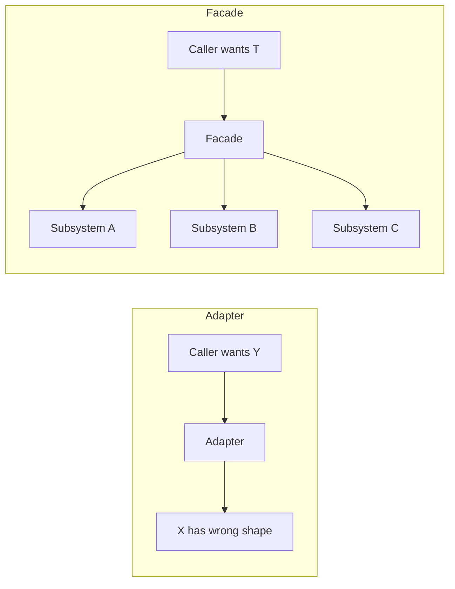
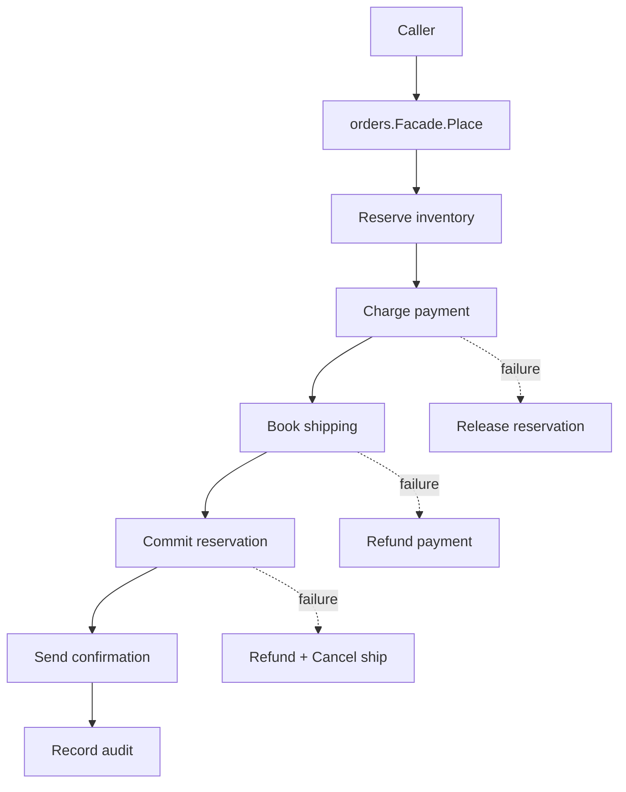
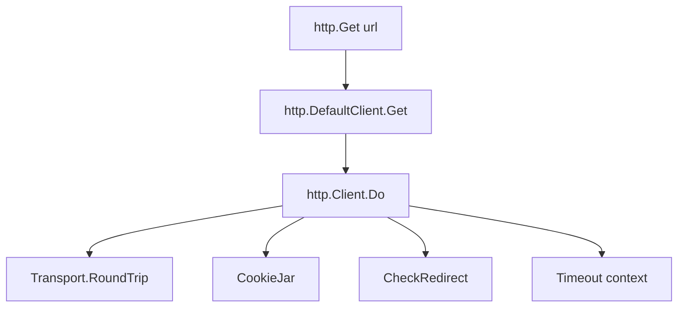
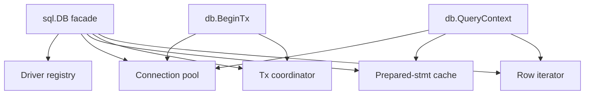

# Facade Pattern — Junior

## 1. What the Facade pattern actually is

You have a subsystem made of several pieces that have to be wired together correctly. A database client has a connection pool, a query parser, a transaction manager, and a result iterator. An HTTP client has a transport, a cookie jar, a redirect policy, and a timeout. A video pipeline has a demuxer, a decoder, a filter graph, and an encoder. The pieces are all legitimate types in their own right — but most callers don't want to touch them individually. They want one object that "just does the thing".

The Facade pattern names this: build a single type whose job is to *present a small, friendly interface over a larger, lumpier subsystem*. The facade holds references to the collaborators, sequences them correctly, and hides the wiring. Callers see one method, not eight.

```go
// Without a facade — the caller assembles every part
transport := &http.Transport{TLSClientConfig: tlsCfg, MaxIdleConns: 10}
jar, _ := cookiejar.New(nil)
client := &http.Client{Transport: transport, Jar: jar, Timeout: 30 * time.Second}
req, _ := http.NewRequest("GET", url, nil)
resp, err := client.Do(req)

// With a facade — one type does everything
resp, err := http.Get(url)
```

`http.Get` is a facade. Internally it constructs a request, runs it through `http.DefaultClient` (which itself is a facade over `Transport` + `CookieJar` + redirect policy + timeout), and returns the response. The caller writes one line.

This file teaches:

1. What makes Facade different from Adapter (the two are often confused).
2. The simplest Go facade — a struct combining several collaborators.
3. Two heavyweight stdlib facades: `net/http.Client` and `database/sql.DB`.
4. When to reach for a facade and when it's the wrong tool.
5. The mistakes juniors make (god facade, leaky facade, lifetime confusion).

If you've used `http.Get`, `sql.Open`, or `template.ParseFiles`, you've already used Facade. Like Strategy, the pattern doesn't usually announce itself by name — but recognising it changes how you organise packages.

---

## 2. Table of Contents

1. [What the Facade pattern actually is](#1-what-the-facade-pattern-actually-is)
2. [Table of Contents](#2-table-of-contents)
3. [Facade vs Adapter](#3-facade-vs-adapter)
4. [The simplest Go facade](#4-the-simplest-go-facade)
5. [Worked example: an order processing facade](#5-worked-example-an-order-processing-facade)
6. [`net/http.Client` as a facade](#6-nethttpclient-as-a-facade)
7. [`database/sql.DB` as a facade](#7-databasesqldb-as-a-facade)
8. [When to use a facade](#8-when-to-use-a-facade)
9. [When NOT to use a facade](#9-when-not-to-use-a-facade)
10. [Common mistakes a junior makes](#10-common-mistakes-a-junior-makes)
11. [Tricky points](#11-tricky-points)
12. [Quick test](#12-quick-test)
13. [Cheat sheet](#13-cheat-sheet)
14. [What to learn next](#14-what-to-learn-next)

---

## 3. Facade vs Adapter

These two are siblings in the GoF book and they sit next to each other in any beginner's confusion. The distinction is small but important.

| | **Adapter** | **Facade** |
|---|-------------|------------|
| Number of wrapped types | One | Several |
| Purpose | Make an *incompatible* interface fit a desired one | Make a *complex* subsystem easier to use |
| Caller's question | "I have an X, but I need a Y" | "I want to do task T without learning the whole subsystem" |
| Typical name | `XAsY`, `XAdapter` | `Client`, `Service`, `Manager` |



A concrete example. Suppose you have a third-party logger that takes `string` arguments, but your code calls `Write([]byte)`:

```go
// Adapter — wraps ONE thing, fixes its shape
type LoggerWriter struct{ log *thirdparty.Logger }

func (lw *LoggerWriter) Write(p []byte) (int, error) {
    lw.log.Info(string(p))
    return len(p), nil
}
```

That's Adapter. One wrapped type, shape conversion. Now compare to a payment facade:

```go
// Facade — wraps SEVERAL things, simplifies a workflow
type PaymentFacade struct {
    fraud    *fraud.Checker
    gateway  *stripe.Client
    ledger   *accounting.Ledger
    notifier *email.Notifier
}

func (p *PaymentFacade) Charge(ctx context.Context, order Order) error {
    if err := p.fraud.Check(ctx, order); err != nil { return err }
    txID, err := p.gateway.Charge(ctx, order.AmountCents)
    if err != nil { return err }
    if err := p.ledger.Record(txID, order); err != nil { return err }
    return p.notifier.SendReceipt(order.Email, txID)
}
```

Four collaborators, one method. That's Facade. The caller doesn't need to know what fraud-checking, gateway-charging, ledger-recording, or notifying look like individually.

The line gets blurry when a facade has only *two* collaborators (is it a fancy adapter?). The honest answer: don't worry about labels. If the goal is *shape conversion*, call it an adapter. If the goal is *workflow simplification*, call it a facade. They can also overlap; that's fine.

---

## 4. The simplest Go facade

A Go facade is almost always just a struct that holds its collaborators as fields and exposes methods that delegate to them. No magic, no inheritance.

```go
type Facade struct {
    a *SubsystemA
    b *SubsystemB
    c *SubsystemC
}

func New(a *SubsystemA, b *SubsystemB, c *SubsystemC) *Facade {
    return &Facade{a: a, b: b, c: c}
}

func (f *Facade) DoTask(ctx context.Context, in Input) (Output, error) {
    // orchestrate a, b, c in the right order, handle errors, compensate on failure
}
```

The next section walks a real example. Before that, the rules of the shape:

### 4.1 What makes a facade idiomatic Go

- The facade is a *plain struct* with collaborator fields. No magic.
- It's constructed via `New` taking the collaborators as parameters (dependency injection).
- It exposes a *small* surface — usually the verbs of one workflow, not "everything the subsystem can do".
- The collaborators are still accessible if a caller really needs them. The facade does not seal off the subsystem; it only hides it from the *common* path.

The last point matters: a good facade is a *shortcut*, not a *prison*. We'll see this in `database/sql.DB` — the facade is rich, but raw drivers and `*sql.Tx` are still reachable for advanced cases.

---

## 5. Worked example: an order processing facade

Take a more developed example. An order processing system has these moving parts:

- `inventory.Reservation` — holds stock for a short window.
- `payment.Gateway` — charges the customer.
- `shipping.Carrier` — books a shipment.
- `notification.Sender` — sends order confirmation.
- `audit.Recorder` — writes an audit trail.

A naive caller has to remember every step *and* the compensation policy: if `pay.Charge` succeeds but `carrier.Book` fails, the charge must be refunded; if anything before `res.Commit()` fails, the reservation must be released. Every order-placing caller would have to repeat this. A facade collapses it:

```go
package orders

import (
    "context"
    "errors"
    "fmt"
    "log"
)

type Facade struct {
    inventory    InventoryService
    payment      PaymentService
    shipping     ShippingService
    notification NotificationService
    audit        AuditService
}

func New(
    inv InventoryService,
    pay PaymentService,
    sh ShippingService,
    notif NotificationService,
    aud AuditService,
) *Facade {
    return &Facade{
        inventory:    inv,
        payment:      pay,
        shipping:     sh,
        notification: notif,
        audit:        aud,
    }
}

// Place runs the full place-order workflow.
func (f *Facade) Place(ctx context.Context, o Order) (Receipt, error) {
    res, err := f.inventory.Reserve(ctx, o.Items)
    if err != nil {
        return Receipt{}, fmt.Errorf("Place: reserve: %w", err)
    }
    defer func() {
        // Release if we haven't committed by the end of the function.
        if res != nil && !res.Committed() {
            _ = res.Release(ctx)
        }
    }()

    charge, err := f.payment.Charge(ctx, o.AmountCents)
    if err != nil {
        return Receipt{}, fmt.Errorf("Place: charge: %w", err)
    }

    ship, err := f.shipping.Book(ctx, o.Address, o.Items)
    if err != nil {
        if refundErr := f.payment.Refund(ctx, charge.ID); refundErr != nil {
            err = errors.Join(err, fmt.Errorf("refund: %w", refundErr))
        }
        return Receipt{}, fmt.Errorf("Place: ship: %w", err)
    }

    if err := res.Commit(ctx); err != nil {
        // At this point we have a charge and a shipment but no reservation
        // commit. Compensate.
        _ = f.payment.Refund(ctx, charge.ID)
        _ = f.shipping.Cancel(ctx, ship.ID)
        return Receipt{}, fmt.Errorf("Place: commit reservation: %w", err)
    }

    // Best-effort follow-ups: failure here does not undo the order.
    if err := f.notification.SendConfirmation(ctx, o.Email, charge.ID); err != nil {
        log.Printf("Place: notification failed: %v", err)
    }
    if err := f.audit.Record(ctx, "order_placed", o, charge.ID, ship.ID); err != nil {
        log.Printf("Place: audit failed: %v", err)
    }

    return Receipt{ChargeID: charge.ID, ShipmentID: ship.ID}, nil
}
```

Usage:

```go
of := orders.New(invSvc, paySvc, shipSvc, notifSvc, auditSvc)
rcpt, err := of.Place(ctx, order)
```

Notice five things:

1. **One method covers the workflow.** The complexity is internal.
2. **The facade owns the policy** — what's fatal, what's best-effort, what triggers compensation. Callers don't decide.
3. **The collaborators are still real types.** Anyone who needs a raw `payment.Gateway` for a refund or a partial charge still has it. The facade is *additional*, not exclusive.
4. **The interfaces (`InventoryService`, etc.) are declared in this package.** That's "accept interfaces" — the facade doesn't import the concrete service packages; it imports nothing and lets implementations live wherever.
5. **Compensation logic is now testable and reusable.** Without the facade, every caller would re-implement (or forget) the same refund-on-shipping-failure path.



---

## 6. `net/http.Client` as a facade

The clearest stdlib facade. The HTTP client has many moving parts:

- **Transport** — how bytes actually go on the wire (`http.Transport` handles connection pooling, TLS, keep-alives).
- **CookieJar** — stores and replays cookies across requests.
- **CheckRedirect** — policy for how many redirects to follow and which to refuse.
- **Timeout** — overall deadline for a request (separate from connect/read/write timeouts inside the transport).

A simplified view of the type:

```go
// from net/http (simplified)
type Client struct {
    Transport     RoundTripper
    CheckRedirect func(req *Request, via []*Request) error
    Jar           CookieJar
    Timeout       time.Duration
}
```

`Client.Do(req)` is the facade method. It does, in order:

1. Apply cookies from the jar to the request.
2. Apply the timeout (wraps the context).
3. Dispatch the request via the `Transport`'s `RoundTrip`.
4. Inspect the response for redirects; if needed, recurse with `CheckRedirect`'s permission.
5. Store any `Set-Cookie` headers back in the jar.
6. Return the final response.

The caller writes:

```go
resp, err := http.DefaultClient.Do(req)
```

Six steps, one call. The package layers even smaller facades on top: `http.Get`, `http.Post`, `http.PostForm`, `http.Head` — each two lines internally, each delegating to `http.DefaultClient.Do`. That's *facade on facade*: `http.Get` simplifies `Client.Get`, which simplifies `Client.Do`, which orchestrates over `Transport`, `Jar`, `CheckRedirect`.



### 6.1 Why this is a good facade

- **The common path is one line.** `resp, err := http.Get(url)` covers 90% of HTTP needs.
- **Advanced cases stay reachable.** You can construct `*http.Client` directly with a custom `Transport`, supply your own `CookieJar`, override `CheckRedirect`. Nothing is sealed.
- **Each collaborator is still a public type.** You can use `http.Transport` on its own without ever touching `Client`, e.g., for low-level connection management.

This is the template: a facade simplifies the *most common* path while leaving the *less common* paths open.

---

## 7. `database/sql.DB` as a facade

`*sql.DB` is a heavier facade because it's also an abstract factory (it produces `*sql.Stmt`, `*sql.Rows`, `*sql.Tx`). Focus on its facade side. A real database client has a **driver** (wire protocol), a **connection pool**, a **prepared-statement cache**, **transaction state**, and **cursor iteration**. A naive caller has to manage all of these — pick a driver, manage the pool, prepare statements, hold connections during transactions, iterate result sets, release everything.

`*sql.DB` collapses this:

```go
db, err := sql.Open("postgres", dsn)
if err != nil { return err }
defer db.Close()

var name string
err = db.QueryRowContext(ctx, "SELECT name FROM users WHERE id=$1", uid).Scan(&name)
```

Two lines. Behind the scenes:

1. `sql.Open` looks up the registered driver by name (`"postgres"` was registered by importing `lib/pq` or `pgx` with a blank import).
2. `db.QueryRowContext` checks out a connection from the pool, prepares (or reuses) the statement, sends the query, reads the first row, returns it via `Scan`.
3. The connection goes back to the pool.



The facade keeps it short for callers who just want to run a query. For callers who need more, `*sql.Tx`, `*sql.Stmt`, and `*sql.Rows` are still public — you can manage transactions explicitly, prepare statements explicitly, iterate result sets row by row. The facade doesn't hide these; it just lets you skip them when the simple API is enough.

### 7.1 The two-level structure

`*sql.DB` is also interesting because it's a *driver-agnostic* facade. The `database/sql` package itself doesn't know about postgres or mysql:

```go
// in your code
import _ "github.com/lib/pq"  // registers "postgres" driver

db, _ := sql.Open("postgres", dsn)
```

The blank import runs `lib/pq`'s `init()`, which calls `sql.Register("postgres", &driver{})`. After that, `sql.Open("postgres", ...)` looks up the driver in a map and uses it. The facade is *the same* regardless of driver — only the driver implementation differs.

This is a deeper version of Facade: the facade also acts as an *abstract factory* over a driver family. We cover the factory side in `../06-factory-pattern/` and the abstract-factory specifics in `middle.md`.

---

## 8. When to use a facade

Reach for a facade when at least one of these is true.

- **You're publishing an SDK or library.** External users shouldn't learn your internal architecture to do common things. Cover the common 80% in one or two methods; leave the subsystem reachable for the rest. `aws-sdk-go`'s service clients are facades over signers, transports, retry policies, paginators.
- **You're hiding internal architecture from other teams.** A domain team builds five collaborating services; outside teams should see one. Seams are where coupling lives — if five other teams import all five of your internals, you can't refactor without coordinating with five teams.
- **You repeat the same orchestration in many call sites.** Three controllers calling the same five services in the same order is a facade waiting to happen.
- **You want a transaction or rollback policy in one place.** When step 3 fails, step 2 must be undone. Encode the policy once in the facade, not in every caller.

---

## 9. When NOT to use a facade

A facade is the wrong choice when:

- **The caller actually needs the subsystem.** If callers regularly inspect connections, manage transactions explicitly, or replace a collaborator, forcing them through a facade only adds indirection. Provide the facade as *an option*, not the only door — `sql.Open` is a facade, but `driver.NewConnector` is still public for callers who need it.
- **There's only one thing to wrap.** That's an adapter (or just nothing). A facade implies *multiple* collaborators.
- **The orchestration is trivial.** A "facade" that forwards a single call is noise:

  ```go
  // not a facade — just a wrapper with no value
  type Facade struct{ db *sql.DB }
  func (f *Facade) GetUser(id int) (User, error) { return queryUser(f.db, id) }
  ```

  A facade earns its keep when it *combines* or *orchestrates*.
- **The facade would have to grow forever.** If every caller demands a new facade method, the facade becomes a junk drawer — see §10.1. Build *several small* facades instead, one per use case.

---

## 10. Common mistakes a junior makes

### 10.1 The god facade

```go
type Facade struct {
    /* 20 fields */
}

func (f *Facade) Place(...) error          { /* ... */ }
func (f *Facade) Refund(...) error         { /* ... */ }
func (f *Facade) Cancel(...) error         { /* ... */ }
func (f *Facade) ListOrders(...) error     { /* ... */ }
func (f *Facade) ReportRevenue(...) error  { /* ... */ }
func (f *Facade) GenerateInvoice(...) error{ /* ... */ }
// ... 30 more
```

When a facade has 30 methods and 20 fields, it's no longer simplifying anything — it's just a class that knows about everything. Split it. Build several facades, each scoped to one workflow or one role (a `Checkout` facade, a `Refunds` facade, a `Reports` facade).

A useful heuristic: a facade should fit one screen. If it doesn't, it's two facades pretending to be one.

### 10.2 The leaky facade

```go
type Facade struct {
    DB *sql.DB  // exported field!
}

func (f *Facade) Register(...) { /* ... */ }
```

Exposing the collaborators as exported fields invites callers to bypass the facade. Some will. Now the facade no longer owns the orchestration — half the codebase calls `f.DB.Query(...)` directly.

Either keep the fields unexported, *or* if access is intentional, expose a method (`f.DB() *sql.DB`) and document it as "the unsafe escape hatch". The point: leakage should be *deliberate*.

### 10.3 The facade that re-exposes everything

```go
// 30 methods, each forwarding one call
func (f *Facade) ReserveStock(...)   { return f.inv.Reserve(...) }
func (f *Facade) ReleaseStock(...)   { return f.inv.Release(...) }
func (f *Facade) ChargeCard(...)     { return f.pay.Charge(...) }
func (f *Facade) RefundCard(...)     { return f.pay.Refund(...) }
// ...
```

If your facade re-exposes every method of every collaborator, you haven't built a facade — you've built a redirection layer. The point of a facade is to *combine* methods into higher-level operations. If you find yourself one-to-one re-exporting, either delete the facade or rethink the API.

### 10.4 The facade that does I/O in its constructor

```go
func New(dsn string) (*Facade, error) {
    db, err := sql.Open("postgres", dsn)
    if err != nil { return nil, err }
    if err := db.Ping(); err != nil { return nil, err } // blocking network call
    return &Facade{db: db}, nil
}
```

The facade's constructor pings the database. Now every test that builds the facade needs a live database. Defer I/O — let the facade construct lazily or expose a `Start(ctx)` / `Ready(ctx)` method.

### 10.5 The facade that doesn't propagate context

```go
func (f *Facade) Place(o Order) (Receipt, error) {
    // no ctx parameter — uses context.Background internally
    ...
}
```

A facade that hides context cancels its callers' ability to cancel, time out, or propagate deadlines. Every facade method that does I/O takes `ctx context.Context` as its first argument. No exceptions.

### 10.6 Returning the facade as an interface "for testability"

```go
type Facade interface { /* ... */ }

func New(...) Facade { return &facadeImpl{...} }
```

Defining a facade as an interface from day one assumes the caller wants to swap implementations. They usually don't. Return `*Facade` (the concrete struct). If a test needs to fake the facade, the test can define a small interface *at the test boundary* and either depend on it directly or use a generated mock.

The principle: accept interfaces, return concrete types. The facade is what you return, so it's concrete.

---

## 11. Tricky points

### 11.1 Lifetime ownership — who closes what?

A facade typically holds several collaborators. Some of them have `Close` methods (database pools, HTTP connections, file handles). Who closes them?

Two options:

**Option A — the facade owns and closes them.**

```go
type Facade struct {
    db   *sql.DB
    http *http.Client
}

func (f *Facade) Close() error {
    err := f.db.Close()
    // http.Client doesn't need closing, but if it did...
    return err
}
```

Callers do `defer f.Close()`. This is the right model when the collaborators were constructed *inside* the facade (`New` opens the DB itself).

**Option B — the caller owns them.**

```go
func New(db *sql.DB, hc *http.Client) *Facade { return &Facade{db: db, http: hc} }
```

The caller created the DB; the facade just uses it. The facade has no `Close` because it doesn't own anything. Closing is the caller's job.

Pick one model per facade and stick with it. The biggest source of bugs in facades is "I thought you closed it / I thought you owned it". Document the ownership in the constructor's doc comment.

### 11.2 Configuration vs collaborators

A facade has two kinds of fields: *collaborators* (things it delegates to) and *configuration* (knobs that control its own behaviour). Don't mix them in the constructor signature:

```go
// confusing — which are deps, which are config?
func New(db *sql.DB, retries int, timeout time.Duration, http *http.Client, prefix string) *Facade

// clearer — collaborators positional, config via options
func New(db *sql.DB, http *http.Client, opts ...Option) *Facade
```

For config-heavy facades, functional options pair nicely (see `../01-functional-options/`).

### 11.3 The facade *is* the package

For many Go packages, *the package itself* is the facade. `http.Get` is a package-level function backed by `http.DefaultClient`. Both forms coexist — package-level for the no-state common path, struct-level (`&http.Client{Timeout: 5 * time.Second}`) for callers with per-instance configuration.

### 11.4 Facades and circular imports

A facade in package `orders` imports `inventory`, `payment`, `shipping`. If any of those imports `orders` back, you get a cycle. The fix is to declare the collaborator *interfaces* in the facade's package — implementations satisfy them structurally without importing the facade:

```go
// in package orders
type InventoryService interface {
    Reserve(ctx context.Context, items []Item) (Reservation, error)
}
```

`inventory` never imports `orders`. No cycle.

### 11.5 Testing a facade

A good facade is straightforward to test because you stub the collaborators:

```go
func TestFacade_Place_RollsBackOnShippingFailure(t *testing.T) {
    inv := &fakeInventory{ /* always succeeds */ }
    pay := &fakePayment{ /* records refund calls */ }
    sh  := &fakeShipping{ shouldFail: true }
    notif := &fakeNotifier{}
    aud := &fakeAuditor{}

    f := orders.New(inv, pay, sh, notif, aud)
    _, err := f.Place(ctx, sampleOrder)

    if err == nil { t.Fatal("expected error") }
    if !pay.refunded { t.Fatal("expected refund on shipping failure") }
}
```

You pass fakes via the constructor. The facade's orchestration is exercised; the collaborators are stand-ins. This is why facades take interfaces, not concrete types: tests need to substitute.

---

## 12. Quick test

**Q1.** Which is a facade, which is an adapter?

```go
// A
type GzipFile struct{ f *os.File }
func (g *GzipFile) Read(p []byte) (int, error) { /* read & decompress */ }

// B
type Checkout struct{
    inv     *inventory.Service
    pay     *payment.Gateway
    ship    *shipping.Carrier
}
func (c *Checkout) Place(ctx context.Context, o Order) error { /* ... */ }
```

<details><summary>Answer</summary>

A is an Adapter — it wraps *one* thing (`*os.File`) and reshapes it (file bytes become decompressed bytes via the `io.Reader` interface).

B is a Facade — it wraps *several* collaborators and presents one workflow method.

The number-of-wrapped-types rule is the cleanest way to tell them apart.
</details>

**Q2.** What's wrong here?

```go
type Facade struct {
    DB   *sql.DB
    HTTP *http.Client
}

func (f *Facade) Register(user User) error {
    if err := saveUser(f.DB, user); err != nil { return err }
    return sendWelcome(f.HTTP, user.Email)
}
```

<details><summary>Answer</summary>

Two problems:

1. **The collaborator fields are exported.** Any caller can now do `f.DB.Query(...)` and bypass the facade. The orchestration is no longer owned by the facade.
2. **No `context.Context` parameter.** `Register` does I/O via `saveUser` and `sendWelcome` but cannot be cancelled or have a deadline applied.

Fix:

```go
type Facade struct {
    db   *sql.DB
    http *http.Client
}

func (f *Facade) Register(ctx context.Context, user User) error {
    if err := saveUser(ctx, f.db, user); err != nil { return err }
    return sendWelcome(ctx, f.http, user.Email)
}
```
</details>

**Q3.** A package exposes `Open(name) (*Session, error)`. The `Session` has 40 methods covering connection management, transactions, queries, prepared statements, and admin operations. Most callers only need `Query` and `Exec`. Is this a good facade?

<details><summary>Answer</summary>

It's a god facade. 40 methods means callers must read 40 method docs to know what's relevant. The fix isn't to delete methods — the advanced ones may have real users — but to **split the surface**:

- Move the rarely-used admin operations into their own type (`*Admin`, accessed via `Session.Admin()`).
- Keep `Session` focused on the common path (`Query`, `Exec`, `Begin`, `Close`).

This is how `database/sql` does it: `*sql.DB` is the everyday facade, `*sql.Tx` is the transactions facade, `*sql.Conn` is the per-connection escape hatch. Each is small.
</details>

---

## 13. Cheat sheet

| What | How |
|------|-----|
| Wraps how many types | Several (otherwise it's Adapter or nothing) |
| Purpose | Simplify a multi-step workflow over a complex subsystem |
| Shape in Go | Struct with collaborator fields + workflow methods |
| Naming | After the workflow (`Checkout`, `Onboarding`) or the subsystem (`Client`, `DB`), not `XxxFacade` |
| Fields | Unexported; collaborators injected via constructor |
| Subsystem | Still public — facade is a shortcut, not a prison |
| Context | First parameter on every method that does I/O |
| Configuration | Functional options, not extra constructor params |
| Lifetime | Document who closes what; either facade owns it or caller does |
| Interface or struct | Return concrete struct; let callers define small interfaces at the boundary |
| When to split | When the facade grows past one screen or covers more than one workflow |

---

## 14. What to learn next

In order:

1. **[middle.md](middle.md)** — Multi-level facades, facade composition, facades over remote services (gRPC, REST), how facades interact with middleware and decorators, generic facades.
2. **[../09-adapter-pattern/](../09-adapter-pattern/)** — The sibling pattern. Read it side by side with this one to lock in the distinction.
3. **[../04-decorator-pattern/](../04-decorator-pattern/)** — When you want to add cross-cutting concerns (logging, metrics, retries) *to* a facade without changing its surface.
4. **[../06-factory-pattern/](../06-factory-pattern/)** — Facades often own factories (`*sql.DB` is both). Understand the factory side independently.

Facade is the pattern you reach for the moment a package starts to leak its internal shape onto callers. It's also the pattern most commonly *overused* by junior developers — every collaborator collection becomes a facade, even when there's nothing to simplify. The skill is recognising the line: a facade earns its keep when it owns *orchestration*, not when it just *holds references*.
