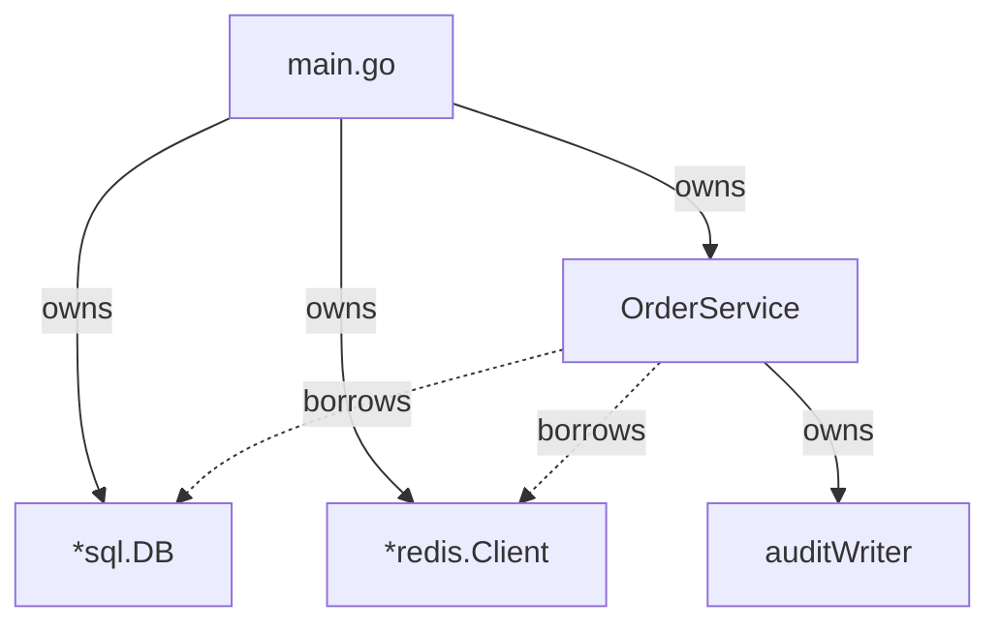
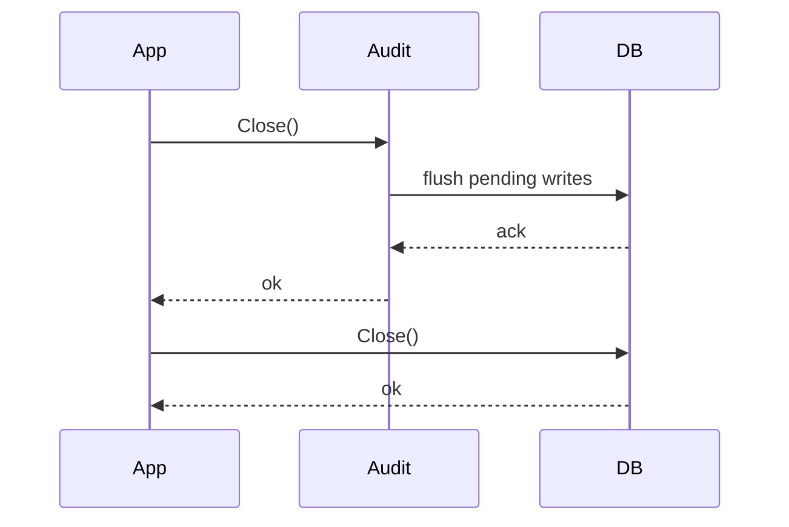
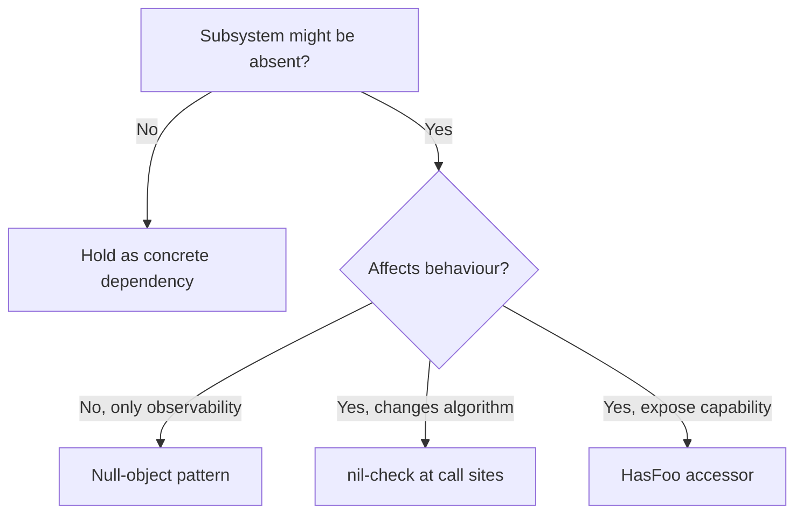
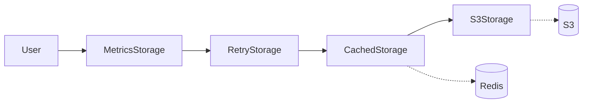
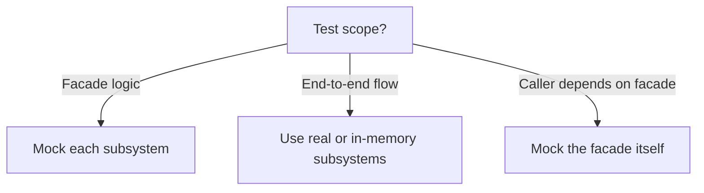

# Facade Pattern — Middle

## 1. What this level adds

Junior taught the shape: a struct that wraps several subsystems and exposes a small, task-oriented API. Middle is about *production patterns*:

- Lifetime management — does the facade *own* its subsystems or *borrow* them?
- Resource cleanup — `Close()` semantics, ordering, idempotency.
- Thread safety of facade methods and the subsystems behind them.
- Facades with optional capabilities — some subsystems may be `nil`.
- Concurrency — protecting shared subsystems used by many goroutines.
- Layered facades — facade over facade, and the depth limit.
- Facade ↔ DI — who provides the dependencies, and where the wiring lives.
- Generic facades — when type parameters earn their keep here.
- Testing — mocking individual subsystems vs the whole facade.

By the end you should be able to design a facade that survives concurrent use, restarts cleanly, and tests in isolation.

---

## 2. Table of Contents

1. [What this level adds](#1-what-this-level-adds)
2. [Table of Contents](#2-table-of-contents)
3. [Lifetime: owning vs borrowing subsystems](#3-lifetime-owning-vs-borrowing-subsystems)
4. [Resource cleanup and Close()](#4-resource-cleanup-and-close)
5. [Thread safety of facade methods](#5-thread-safety-of-facade-methods)
6. [Facade with optional capabilities](#6-facade-with-optional-capabilities)
7. [Concurrency: protecting shared subsystems](#7-concurrency-protecting-shared-subsystems)
8. [Layered facades](#8-layered-facades)
9. [Facade ↔ Dependency Injection](#9-facade--dependency-injection)
10. [Generic facade considerations](#10-generic-facade-considerations)
11. [Testing facades](#11-testing-facades)
12. [Coding patterns](#12-coding-patterns)
13. [Common middle-level mistakes](#13-common-middle-level-mistakes)
14. [Tricky points](#14-tricky-points)
15. [Test](#15-test)
16. [Cheat sheet](#16-cheat-sheet)
17. [Summary](#17-summary)

---

## 3. Lifetime: owning vs borrowing subsystems

The first design choice for any facade: who owns the subsystems? Two stances, and they have very different consequences.

### 3.1 Owning facade

```go
type OrderService struct {
    db    *sql.DB
    cache *redis.Client
    queue *kafka.Producer
}

func NewOrderService(cfg Config) (*OrderService, error) {
    db, err := sql.Open("postgres", cfg.DSN)
    if err != nil { return nil, fmt.Errorf("order: open db: %w", err) }

    rdb := redis.NewClient(&redis.Options{Addr: cfg.RedisAddr})
    if err := rdb.Ping(context.Background()).Err(); err != nil {
        db.Close()
        return nil, fmt.Errorf("order: ping redis: %w", err)
    }

    q, err := kafka.NewProducer(cfg.KafkaBrokers)
    if err != nil {
        db.Close(); rdb.Close()
        return nil, fmt.Errorf("order: kafka: %w", err)
    }

    return &OrderService{db: db, cache: rdb, queue: q}, nil
}
```

The facade built each subsystem, so:

1. The facade must close them — nothing else holds the handle.
2. Construction failure must unwind partially-built state (cascading `Close()` calls).
3. The facade's lifetime *is* the subsystems' lifetime.

Right stance when the facade is the *root owner* of those resources — typically a top-level service in `main()`.

### 3.2 Borrowing facade

```go
func NewOrderService(db *sql.DB, cache *redis.Client, queue *kafka.Producer) *OrderService {
    return &OrderService{db: db, cache: cache, queue: queue}
}
```

The caller hands in already-built subsystems:

1. The facade does *not* close them — someone else owns lifecycle.
2. Construction can't fail (no I/O happens).
3. Multiple facades can share the same `*sql.DB`. Pools and clients are routinely shared.

Right stance when the subsystem is a *shared resource* — a single `*sql.DB` is meant to be passed around, not duplicated per facade.

### 3.3 The hybrid: owning some, borrowing others

Most production facades are hybrid:

```go
type OrderService struct {
    db    *sql.DB        // borrowed
    cache *redis.Client  // borrowed
    audit *auditWriter   // owned (created internally)
}

func NewOrderService(db *sql.DB, cache *redis.Client, cfg Config) (*OrderService, error) {
    a, err := newAuditWriter(cfg.AuditPath)
    if err != nil { return nil, fmt.Errorf("order: audit: %w", err) }
    return &OrderService{db: db, cache: cache, audit: a}, nil
}

func (o *OrderService) Close() error { return o.audit.Close() }  // own only
```

Rule of thumb: **if the facade constructed it, the facade closes it**. If it received it as a parameter, leave it alone.



Solid arrows are ownership; dashed are borrowed references. Closing `Order` closes only `Audit`. `main` closes `DB` and `Cache` separately.

### 3.4 Why this matters

Mixed ownership rules cause real bugs: a borrowed `*sql.DB` closed by the facade → "database closed" elsewhere; an owned subsystem forgotten → FD leak; two facades owning the same resource → double-close panic.

Document ownership in the constructor's GoDoc:

```go
// NewOrderService builds an OrderService over db and cache. Caller retains
// ownership of db and cache. The audit log is owned by OrderService; call
// Close() to flush it.
func NewOrderService(db *sql.DB, cache *redis.Client, cfg Config) (*OrderService, error) { ... }
```

---

## 4. Resource cleanup and Close()

A facade that owns anything needs a cleanup path. Three patterns, each with its own pitfalls.

### 4.1 Close() method

```go
func (o *OrderService) Close() error {
    var errs []error
    if err := o.audit.Close(); err != nil {
        errs = append(errs, fmt.Errorf("audit close: %w", err))
    }
    if err := o.queue.Close(); err != nil {
        errs = append(errs, fmt.Errorf("queue close: %w", err))
    }
    return errors.Join(errs...)
}
```

Three points: (1) every subsystem gets a chance to close — a naive `if err != nil { return err }` would skip later cleanup; (2) errors are aggregated via `errors.Join` (Go 1.20+), preserving `errors.Is`/`errors.As`; (3) cleanup order matters (next).

### 4.2 Cleanup ordering

When subsystems depend on each other, close order is the *reverse* of construction order.

```go
func (o *OrderService) Close() error {
    var errs []error
    errs = append(errs, o.cache.Close())  // first (independent)
    errs = append(errs, o.audit.Close())  // needs db for final flush
    errs = append(errs, o.db.Close())     // last
    return errors.Join(errs...)
}
```

Why reverse? Same reason you flush a `bufio.Writer` before closing the underlying `*os.File`: the inner subsystem may write *to* the outer during shutdown.



If you closed `DB` first, `Audit.Close()` would fail trying to flush.

### 4.3 Idempotent Close

`Close()` can be called multiple times — by the user, by deferred test cleanup, by a panic-recovery handler. Guard it:

```go
type OrderService struct {
    closed atomic.Bool
    // ...
}

func (o *OrderService) Close() error {
    if !o.closed.CompareAndSwap(false, true) {
        return nil  // already closed
    }
    // ... actual cleanup
}
```

Without this guard, double-close can panic on a closed channel, surface confusing "already closed" errors, or run cleanup logic twice (e.g., file delete).

### 4.4 Context-aware shutdown

For facades that own long-running goroutines, `Close()` must *wait* — with a budget.

```go
type OrderService struct {
    cancel context.CancelFunc
    wg     sync.WaitGroup
}

func NewOrderService(ctx context.Context, cfg Config) (*OrderService, error) {
    ctx, cancel := context.WithCancel(ctx)
    o := &OrderService{cancel: cancel}
    o.wg.Add(1)
    go func() { defer o.wg.Done(); o.runBackgroundFlusher(ctx) }()
    return o, nil
}

func (o *OrderService) Close(ctx context.Context) error {
    o.cancel()
    done := make(chan struct{})
    go func() { o.wg.Wait(); close(done) }()
    select {
    case <-done:    return nil
    case <-ctx.Done(): return fmt.Errorf("close: %w", ctx.Err())
    }
}
```

Caller passes a shutdown deadline; the facade drains within it or surfaces a timeout. Production services often `Close(ctx)` with ~30s budget during SIGTERM.

---

## 5. Thread safety of facade methods

A facade's thread-safety contract is the *union* of its subsystems' contracts — plus any shared state the facade itself adds.

### 5.1 The simple case: all subsystems are thread-safe

```go
func (o *OrderService) PlaceOrder(ctx context.Context, req OrderRequest) error {
    // Each call thread-safe in isolation; OrderService has no shared state.
    if _, err := o.db.ExecContext(ctx, "INSERT ...", req.ID); err != nil { return err }
    if err := o.cache.Del(ctx, "order:"+req.ID).Err(); err != nil { return err }
    return o.queue.Send(ctx, req)
}
```

If every subsystem is thread-safe and the facade adds no shared state, the facade is thread-safe by composition. Say so in the GoDoc: `// OrderService methods are safe for concurrent use.`

### 5.2 The not-so-simple case: shared mutable state

The moment the facade adds its own cache, counter, or flag, you need a mutex.

```go
type OrderService struct {
    db    *sql.DB
    cache *redis.Client

    mu       sync.Mutex
    inFlight map[string]struct{}  // dedup in-progress orders
}

func (o *OrderService) PlaceOrder(ctx context.Context, req OrderRequest) error {
    o.mu.Lock()
    if _, dup := o.inFlight[req.ID]; dup {
        o.mu.Unlock()
        return fmt.Errorf("order %s already in flight", req.ID)
    }
    o.inFlight[req.ID] = struct{}{}
    o.mu.Unlock()

    defer func() {
        o.mu.Lock(); delete(o.inFlight, req.ID); o.mu.Unlock()
    }()
    // ... actual work
    return nil
}
```

Three rules:

1. Hold the lock only over the map operation, never across the DB call.
2. Always release in defer (panic-safe).
3. Document the contract — whole facade, or specific methods.

### 5.3 Read-heavy state: RWMutex

For read-heavy state (e.g., a config snapshot), `sync.RWMutex` lets readers proceed in parallel:

```go
type FeatureFacade struct {
    mu       sync.RWMutex
    features map[string]bool
}

func (f *FeatureFacade) Enabled(name string) bool {
    f.mu.RLock(); defer f.mu.RUnlock()
    return f.features[name]
}

func (f *FeatureFacade) Reload(newMap map[string]bool) {
    f.mu.Lock(); defer f.mu.Unlock()
    f.features = newMap
}
```

`Enabled` runs concurrently; `Reload` blocks briefly.

### 5.4 What `-race` catches and what it misses

`go test -race` catches data races: concurrent map access, unsynchronized read/write, concurrent channel close. It does **not** catch logical races (lock held but protected logic still wrong), races inside cgo, or races on code paths the tests don't exercise. Treat `-race` as a safety net, not a verifier.

---

## 6. Facade with optional capabilities

Real systems have subsystems that are not always present:

- Metrics might be disabled in tests.
- A cache may be optional — falls back to DB.
- Tracing may be no-op in non-production environments.

The facade should accept `nil` subsystems gracefully.

### 6.1 The naive (and dangerous) approach

```go
func (o *OrderService) Place(req OrderRequest) error {
    o.metrics.Inc("orders.attempted")  // nil-pointer panic if metrics absent
    // ...
}
```

If `metrics` is `nil`, the method panics. The nil-guard at every call site (`if o.metrics != nil { ... }`) works but pollutes every method — easy to forget one.

### 6.2 Null-object pattern

```go
type Metrics interface {
    Inc(name string)
    Observe(name string, v float64)
}

type noopMetrics struct{}
func (noopMetrics) Inc(string)              {}
func (noopMetrics) Observe(string, float64) {}

func NewOrderService(db *sql.DB, m Metrics) *OrderService {
    if m == nil { m = noopMetrics{} }
    return &OrderService{db: db, metrics: m}
}

func (o *OrderService) Place(req OrderRequest) error {
    o.metrics.Inc("orders.attempted")  // safe; real or noop
    // ...
}
```

The constructor turns `nil` into a noop. Every method can call `o.metrics.Foo()` without checking. The cleanest answer when the optional subsystem has a stable interface — logs, metrics, traces — at the cost of one indirect call.

### 6.3 Capability flags

When a subsystem is *truly* absent (not just no-op), expose a capability flag:

```go
func (o *OrderService) HasCache() bool { return o.cache != nil }

func (o *OrderService) GetOrder(ctx context.Context, id string) (*Order, error) {
    if o.cache != nil {
        if cached, ok := o.cacheLookup(ctx, id); ok { return cached, nil }
    }
    return o.dbLookup(ctx, id)
}
```

`HasCache()` lets advanced callers branch on capability; internal methods nil-check before use. Right call when the optional subsystem affects *behaviour*, not just observability.

### 6.4 Decision flow



---

## 7. Concurrency: protecting shared subsystems

A facade often holds subsystems that are *individually* thread-safe — but the facade's own *combined operations* may not be.

### 7.1 The compound-operation race

```go
func (a *AccountService) Transfer(ctx context.Context, from, to string, amt int64) error {
    var bal int64
    a.db.QueryRowContext(ctx, "SELECT balance FROM accounts WHERE id=$1", from).Scan(&bal)
    if bal < amt { return errors.New("insufficient funds") }
    a.db.ExecContext(ctx, "UPDATE accounts SET balance=balance-$1 WHERE id=$2", amt, from)
    a.db.ExecContext(ctx, "UPDATE accounts SET balance=balance+$1 WHERE id=$2", amt, to)
    return nil
}
```

Each SQL call is thread-safe in isolation. Their *composition* is not — two concurrent `Transfer` calls can both pass the balance check, both deduct, and overdraw. The fix isn't a Go mutex; it's a DB transaction with row locking:

```go
func (a *AccountService) Transfer(ctx context.Context, from, to string, amt int64) error {
    tx, err := a.db.BeginTx(ctx, &sql.TxOptions{Isolation: sql.LevelSerializable})
    if err != nil { return err }
    defer tx.Rollback()

    var bal int64
    if err := tx.QueryRowContext(ctx,
        "SELECT balance FROM accounts WHERE id=$1 FOR UPDATE", from).Scan(&bal); err != nil {
        return err
    }
    if bal < amt { return errors.New("insufficient funds") }
    if _, err := tx.ExecContext(ctx, "UPDATE accounts SET balance=balance-$1 WHERE id=$2", amt, from); err != nil { return err }
    if _, err := tx.ExecContext(ctx, "UPDATE accounts SET balance=balance+$1 WHERE id=$2", amt, to); err != nil { return err }
    return tx.Commit()
}
```

The facade's job is to *recognize the compound operation* and use the subsystem's coordination primitive — here, row-level lock via `FOR UPDATE`.

### 7.2 In-memory coordination

For in-memory subsystems, the facade owns the mutex. Check-then-act under one lock; don't read first and write later:

```go
func (r *RateLimiter) Allow(key string) bool {
    r.mu.Lock(); defer r.mu.Unlock()
    if r.counters[key] >= r.limit { return false }
    r.counters[key]++
    return true
}
```

### 7.3 The "lock the right thing" trap

```go
func (c *CartFacade) AddItem(userID, item string) {
    c.mu.Lock()
    cart := c.carts[userID]
    c.mu.Unlock()                          // released too soon
    cart.Items = append(cart.Items, item)  // race on *Cart
}
```

The map is protected; the `*Cart` it points to is not. Two goroutines for the same user race on `cart.Items`. Give each cart its own lock:

```go
type Cart struct {
    mu    sync.Mutex
    Items []string
}

func (c *CartFacade) AddItem(userID, item string) {
    c.mu.Lock()
    cart, ok := c.carts[userID]
    if !ok { cart = &Cart{}; c.carts[userID] = cart }
    c.mu.Unlock()

    cart.mu.Lock()
    cart.Items = append(cart.Items, item)
    cart.mu.Unlock()
}
```

The facade lock guards only the map; per-user contention sits on the cart's own lock — scales much better.

---

## 8. Layered facades

Facades can wrap facades. Sometimes this is great; sometimes it's a code smell.

### 8.1 When layering helps

```go
type Storage interface {
    Get(ctx context.Context, key string) ([]byte, error)
    Put(ctx context.Context, key string, val []byte) error
}

type S3Storage struct{ client *s3.Client }  // direct adapter

type CachedStorage struct {                  // adds caching on top
    inner Storage
    cache *redis.Client
}

func (c *CachedStorage) Get(ctx context.Context, key string) ([]byte, error) {
    if val, err := c.cache.Get(ctx, key).Bytes(); err == nil {
        return decompress(val), nil
    }
    val, err := c.inner.Get(ctx, key)
    if err != nil { return nil, err }
    _ = c.cache.Set(ctx, key, compress(val), time.Hour).Err()
    return val, nil
}
```

`CachedStorage` is a facade over `Storage` — adds capability without changing the interface. The layered design lets you stack compression, encryption, retry, metrics — each its own layer.



Each layer is testable in isolation and opt-in — production wires the stack, tests wire only `S3Storage` or a fake.

### 8.2 When layering hurts

```go
func (o *OrderService) GetOrder(id string) (*Order, error) {
    return o.inner.GetOrder(id)  // pure forwarding
}
```

A facade that does nothing but forward is a *pass-through wrapper*, not a facade. Either remove it (let callers use `OrderRepository` directly) or add real behaviour (auth, logging, aggregation). A facade's value comes from *what it adds*.

### 8.3 The depth limit

Each layer adds a call, a layer in stack traces, and another place to look when debugging. Beyond 3-4 layers the cognitive cost is real. For stacking cross-cutting concerns, the middleware pattern (decorator) is more idiomatic than deep facade chains.

---

## 9. Facade ↔ Dependency Injection

A facade's constructor signature declares what it depends on. Who provides those dependencies is a separate question.

### 9.1 Direct construction in main()

The simplest form: `main` wires everything.

```go
func main() {
    db := mustOpenDB(cfg.DSN); defer db.Close()
    cache := redis.NewClient(...); defer cache.Close()

    orderSvc := order.NewOrderService(db, cache, cfg.Order)
    userSvc  := user.NewUserService(db, cfg.User)
    apiSvc   := api.NewAPIService(orderSvc, userSvc)

    apiSvc.Run(ctx)
}
```

`main()` is the composition root — each facade gets exactly the subsystems it needs, by name, in plain code. For ≤50 dependencies this is more idiomatic than Wire/Dig.

### 9.2 Facade as a DI scope

A facade often *is* a DI scope: it holds related dependencies and presents them as a unit.

```go
type Services struct {
    Order *OrderService
    User  *UserService
    Auth  *AuthService
}

func NewServices(db *sql.DB, cache *redis.Client, cfg Config) (*Services, error) {
    user, err := NewUserService(db, cfg.User)
    if err != nil { return nil, err }
    auth, err := NewAuthService(db, user, cfg.Auth)
    if err != nil { return nil, err }
    order, err := NewOrderService(db, cache, user, cfg.Order)
    if err != nil { return nil, err }
    return &Services{Order: order, User: user, Auth: auth}, nil
}
```

`Services` is a facade *plus* a container. HTTP handlers get a `*Services` and pick the relevant sub-service.

### 9.3 Wire-style providers

For larger graphs, declarative wiring (Wire, Dig) helps. Wire generates code at build time — runtime cost is zero, just a function with explicit calls. The facade's constructor doesn't change; only the assembly is automated.

### 9.4 What NOT to put inside the facade

The facade holds *constructed* subsystems, not *factories* for them.

```go
// Anti-pattern
type OrderService struct {
    dbFactory func() (*sql.DB, error)  // constructs lazily
}

func (o *OrderService) GetOrder(id string) (*Order, error) {
    db, _ := o.dbFactory()
    defer db.Close()  // re-opens & closes per call!
    // ...
}
```

This opens a DB per call. The facade's job is to *use* subsystems, not construct them — build once in the constructor (or accept built ones), use in methods. The only exception is genuine lazy init via `sync.Once`: still build-once-on-first-use, not per-call.

---

## 10. Generic facade considerations

Go 1.18+ generics are useful for facades that wrap a typed inner object.

### 10.1 Typed cache facade

```go
type Codec[V any] interface {
    Encode(V) ([]byte, error)
    Decode([]byte) (V, error)
}

type Cache[V any] struct {
    inner *redis.Client
    codec Codec[V]
    ttl   time.Duration
}

func (c *Cache[V]) Get(ctx context.Context, key string) (V, error) {
    var zero V
    b, err := c.inner.Get(ctx, key).Bytes()
    if err != nil { return zero, err }
    return c.codec.Decode(b)
}

func (c *Cache[V]) Put(ctx context.Context, key string, v V) error {
    b, err := c.codec.Encode(v)
    if err != nil { return err }
    return c.inner.Set(ctx, key, b, c.ttl).Err()
}
```

`Cache[Order]`, `Cache[User]`, etc. give type-safe APIs over the same Redis client. Without generics, callers deal with `[]byte` or `any` plus manual codec dispatch.

### 10.2 Where generics don't help

A *behaviour-oriented* facade — `PlaceOrder`, `Login`, `Transfer` — doesn't gain from generics. Methods target specific operations on specific types; parameterising them produces awkward APIs.

Rule of thumb: generics fit when the facade is *uniform over its element type* (cache, pool, queue). Avoid them when the facade is *uniform over its task domain* (order processing, user management).

### 10.3 Generic facade limits

- No method-level type parameters as of Go 1.22 — only struct-level. `Get[V]` and `GetMap[K, V]` on the same instance needs free functions.
- Constraints can't reference fields. `[T Cloneable]` works; `[T HasField("Name")]` doesn't.
- Mocks must also be generic. Plan for it.

---

## 11. Testing facades

A facade is a unit *and* an integration point. Testing strategy depends on which view you care about.

### 11.1 Unit test: mock each subsystem

Each subsystem behind an interface; mock in tests.

```go
type DB interface     { Insert(ctx context.Context, id string) error }
type Cache interface  { Del(ctx context.Context, key string) error }

func TestOrderService_Place(t *testing.T) {
    db, cache := &mockDB{}, &mockCache{}
    o := &OrderService{db: db, cache: cache}

    if err := o.Place(ctx, OrderRequest{ID: "o1"}); err != nil { t.Fatal(err) }

    if !db.insertCalled { t.Error("expected db.Insert call") }
    if !cache.delCalled { t.Error("expected cache.Del call") }
}
```

You're testing the *facade's logic* — which subsystems it calls, with what arguments, in what order — without standing up real infrastructure.

### 11.2 Integration test: real or in-memory subsystems

Many subsystems have in-memory drop-ins: `*sql.DB` with SQLite `:memory:`, `miniredis` for Redis, `testcontainers` for Kafka.

```go
func TestOrderService_Integration(t *testing.T) {
    db := openSQLite(t)
    cache := miniredis.RunT(t).Client()
    o := order.NewOrderService(db, cache, testCfg)

    require.NoError(t, o.Place(ctx, OrderRequest{ID: "o1"}))
    // assert state in db / cache
}
```

Slower than mocks, but catches bugs mocks miss: SQL syntax, encoding issues, ordering races between calls.

### 11.3 Mock individual subsystem vs whole facade



- Mock individual subsystems when the *facade* is the unit under test.
- Mock the facade when *something that depends on it* is the unit. For HTTP handler tests, define `type OrderService interface { Place(...) error }` and pass a `fakeOrderService` — no DB, no Redis, no Kafka.

### 11.4 Test cleanup as a facade test

`Close()` deserves dedicated tests:

```go
func TestOrderService_Close_Idempotent(t *testing.T) {
    o := newTestOrderService(t)
    require.NoError(t, o.Close())
    require.NoError(t, o.Close())  // second call must not error
}

func TestOrderService_Close_PartialFailure(t *testing.T) {
    db := &mockDB{closeErr: errors.New("db close failed")}
    cache := &mockCache{}
    o := &OrderService{db: db, cache: cache}

    require.Error(t, o.Close())
    require.True(t, cache.closeCalled, "cache must close even if db errored")
}
```

The first guards idempotency; the second confirms error aggregation — all subsystems get the chance to close.

---

## 12. Coding patterns

### 12.1 The "options carry subsystems" pattern

Required deps as positional args; optional ones as functional options with sensible defaults:

```go
type Option func(*OrderService)

func WithMetrics(m Metrics) Option { return func(o *OrderService) { o.metrics = m } }
func WithTracer(t Tracer) Option   { return func(o *OrderService) { o.tracer = t } }

func NewOrderService(db *sql.DB, cache *redis.Client, opts ...Option) *OrderService {
    o := &OrderService{
        db: db, cache: cache,
        metrics: noopMetrics{}, tracer: noopTracer{},
    }
    for _, opt := range opts { opt(o) }
    return o
}
```

### 12.2 The "exposing a subsystem" anti-pattern

```go
type OrderService struct {
    DB *sql.DB  // exported — facade inside out
}
```

Callers can now bypass the facade and talk to the DB directly; invariants vanish. Keep subsystems unexported. If raw access is genuinely needed, provide a `RawDB()` method and document why.

### 12.3 The "context everywhere" rule

Every facade method doing I/O takes `context.Context` first and passes it to subsystem calls:

```go
func (o *OrderService) Place(ctx context.Context, req OrderRequest) error {
    if _, err := o.db.ExecContext(ctx, ...); err != nil { return err }
    return o.queue.Send(ctx, req)
}
```

A facade method that omits `ctx` but does I/O is doing it wrong.

### 12.4 The "thin method" rule

Each facade method should: validate input, call 1-N subsystems in the right order, aggregate errors, return. Beyond that — multi-step workflows, sagas, complex orchestration — pushes into application-service territory. The facade is a *unifying surface*, not a business-logic engine.

---

## 13. Common middle-level mistakes

### 13.1 Closing a borrowed subsystem

```go
func NewOrderService(db *sql.DB) *OrderService { return &OrderService{db: db} }
func (o *OrderService) Close() error           { return o.db.Close() }  // borrowed!
```

`db` was passed in — the caller owns it. Symptom: other code seeing `sql: database is closed` after this facade's `Close()` runs.

### 13.2 Forgetting to close on partial init failure

```go
// Anti-pattern: db leaks if openCache fails.
func NewOrderService(cfg Config) (*OrderService, error) {
    db, _ := openDB(cfg)
    cache, err := openCache(cfg)
    if err != nil { return nil, err }  // db leaks!
    return &OrderService{db: db, cache: cache}, nil
}
```

Use a deferred rollback flag:

```go
func NewOrderService(cfg Config) (*OrderService, error) {
    db, err := openDB(cfg)
    if err != nil { return nil, err }
    ok := false
    defer func() { if !ok { db.Close() } }()

    cache, err := openCache(cfg)
    if err != nil { return nil, err }
    defer func() { if !ok { cache.Close() } }()

    o := &OrderService{db: db, cache: cache}
    ok = true
    return o, nil
}
```

### 13.3 Holding a lock across I/O

```go
func (o *OrderService) Place(ctx context.Context, req OrderRequest) error {
    o.mu.Lock()
    defer o.mu.Unlock()
    return o.db.ExecContext(ctx, "INSERT ...")  // serialised!
}
```

Every `Place` blocks every other, though the DB itself is thread-safe. Hold the mutex only over the facade's in-memory state.

### 13.4 Mixing `sync.Mutex` and `sync.RWMutex`

Two methods on the same struct using different mutex types is almost always a bug. Pick one. If you genuinely have two independent pieces of state, give them separately named locks (`accountMu`, `cacheMu`).

### 13.5 Exposing internal types in the facade signature

`func (o *OrderService) ConnPool() *internal.ConnectionPool { ... }` makes a change to the internal type a breaking change to the public API. Return your *own* types or accepted interfaces.

### 13.6 Treating the facade as a god object

If every dependency lives in one struct (`db`, `cache`, `queue`, `emailer`, `pdfGen`, `paymentAPI`, plus 20 more), the "facade" is just the application object. Split by domain: `OrderService`, `BillingService`, `NotificationService`. Each is a small facade over the subsystems it actually needs.

---

## 14. Tricky points

### 14.1 Transitive lifetime

```go
type Cache struct {
    inner *redis.Client  // borrowed
    pool  *bufferPool    // owned
}
type OrderService struct { cache *Cache /* borrowed? owned? */ }
```

If `OrderService` owns `cache`, then `OrderService.Close()` calls `cache.Close()`, which closes `pool` but not `inner`.

The rule: **ownership is transitive; borrowing is not**. If A owns B and B owns C, then A (via B) is responsible for C. If A borrows B, A is responsible for neither B nor what B owns.

Document the chain in each constructor's GoDoc:

```go
// NewOrderService takes ownership of cache; caller must not close cache.
func NewOrderService(cache *Cache) *OrderService { ... }
```

### 14.2 Error aggregation in Close()

`errors.Join(nil, err, nil)` returns `err`; all-nil returns nil; multi-error preserves `errors.Is` for *each* component:

```go
err := errors.Join(io.ErrClosedPipe, sql.ErrConnDone)
errors.Is(err, io.ErrClosedPipe)  // true
errors.Is(err, sql.ErrConnDone)   // true
```

A caller can check for *any* of the close errors. Don't lose information by collapsing to a single string.

### 14.3 The "init in constructor, use elsewhere" race

```go
func NewOrderService(cfg Config) (*OrderService, error) {
    o := &OrderService{}
    go o.warmCache()      // starts before fields are set
    o.db = openDB(cfg)
    return o, nil
}
```

`warmCache` may read `o.db` before `openDB` returns. Initialise all fields *before* spawning goroutines, or pass them as arguments: `go warmCache(db)`.

### 14.4 Methods that return subsystem-typed errors

Returning raw `sql.ErrNoRows` forces callers to know about the storage backend. Translate at the facade boundary:

```go
var ErrNotFound = errors.New("order: not found")

func (o *OrderService) Get(ctx context.Context, id string) (*Order, error) {
    var ord Order
    err := o.db.QueryRowContext(ctx, ...).Scan(&ord.ID, ...)
    if errors.Is(err, sql.ErrNoRows) { return nil, ErrNotFound }
    if err != nil { return nil, fmt.Errorf("order: get %s: %w", id, err) }
    return &ord, nil
}
```

Callers depend on `order.ErrNotFound`, not `sql.ErrNoRows`. The facade owns its error vocabulary.

### 14.5 Sharing a context across goroutines

A naive `WaitGroup` fan-out discards each goroutine's error. Use `errgroup`:

```go
import "golang.org/x/sync/errgroup"

func (o *OrderService) PlaceBatch(ctx context.Context, reqs []OrderRequest) error {
    g, gCtx := errgroup.WithContext(ctx)
    for _, r := range reqs {
        r := r
        g.Go(func() error { return o.Place(gCtx, r) })
    }
    return g.Wait()
}
```

`errgroup` cancels the derived ctx on the first error, returns the first non-nil error, and waits for all goroutines.

### 14.6 The facade that opens its own context

```go
func (o *OrderService) BackgroundFlush() {
    ctx := context.Background()  // ignores caller cancellation
    o.flush(ctx)
}
```

Background work that ignores cancellation is a leak source. Give the facade its own root context in the constructor and tie background work to it, so `Close()` cancels everything.

---

## 15. Test

**Q1.** What's wrong here?

```go
func NewOrderService(db *sql.DB) *OrderService { return &OrderService{db: db} }
func (o *OrderService) Close() error            { return o.db.Close() }
```

<details><summary>Answer</summary>

`db` was received as a parameter — *borrowed*. The facade must not close it; the caller, who still uses `db`, will see "database is closed" afterward. Either remove `Close()` or change the constructor to *take config* and open the DB internally (taking config = owning, taking built dep = borrowing).
</details>

**Q2.** Find the race.

```go
type StatsFacade struct {
    cache map[string]int
}
func (s *StatsFacade) Inc(key string) { s.cache[key]++ }
func (s *StatsFacade) Get(key string) int { return s.cache[key] }
```

<details><summary>Answer</summary>

Go maps are not thread-safe. Concurrent `Inc`/`Get` from goroutines triggers "concurrent map writes" or "concurrent map read and map write" panics. Wrap with `sync.Mutex` (or `sync.RWMutex` if reads dominate); `sync.Map` is overkill for counters.
</details>

**Q3.** What ownership does this constructor signal?

```go
func NewReportingService(cfg Config) (*ReportingService, func(), error) { ... }
```

<details><summary>Answer</summary>

The returned `func()` cleanup tells the caller: *I own resources; call this to release them*. This is the Wire/Dig idiom — cleanup is separate from the facade's API, so there's no risk of confusing `Close()` with a business method. The trade-off: less idiomatic than `io.Closer`, and mixing both styles in one codebase confuses readers. Pick one per project.
</details>

**Q4.** Spot the lifetime bug.

```go
func NewApp(cfg Config) (*App, error) {
    audit, err := NewAuditService(cfg.Audit)
    if err != nil { return nil, err }
    orders, err := NewOrderService(cfg.Order, audit)
    if err != nil { return nil, err }  // leaks audit
    return &App{orders: orders, audit: audit}, nil
}

func (a *App) Close() error {
    if err := a.audit.Close(); err != nil { return err }  // closed too early
    return a.orders.Close()
}
```

<details><summary>Answer</summary>

Two bugs: (1) partial-init failure leaks `audit` — fix with `defer audit.Close()` guarded by an `ok` flag; (2) close order is reversed — `orders` depends on `audit`, so `orders.Close()` must run first. Also, the first error short-circuits the second close; aggregate with `errors.Join`.
</details>

---

## 16. Cheat sheet

| Scenario | Pattern |
|----------|---------|
| Facade constructs deps | Own them; `Close()` releases them |
| Facade receives deps | Borrow; do not close |
| Mixed | Document each field's ownership |
| Cleanup order | Reverse of construction order |
| Idempotent close | `atomic.Bool` swap flag |
| Optional metrics/tracer | Null-object (noopMetrics, noopTracer) |
| Optional cache (affects behaviour) | `HasCache()` accessor or nil-check |
| Thread-safe by composition | All deps thread-safe, no shared state |
| Adding shared state | `sync.Mutex` over a short critical section |
| Compound DB operation | Database transaction, not Go mutex |
| Layered facade | Each layer adds value; remove pass-through wrappers |
| Test facade logic | Mock each subsystem via interface |
| Test integration | Use in-memory or testcontainer subsystems |
| Test what depends on facade | Mock the facade itself |
| Error wrapping | Own error vocabulary; wrap subsystem errors |
| Lifecycle ctx | Constructor takes parent ctx; `Close(ctx)` waits with deadline |

---

## 17. Summary

A junior facade is a struct with a few fields and a few methods. A middle facade is a *contract*:

- About **who owns what** — the facade closes only what it constructed.
- About **what happens on cleanup** — reverse order, idempotent, aggregated errors.
- About **concurrency** — thread-safe by composition, or with a clearly scoped mutex.
- About **optional capabilities** — null-objects for observability, `HasFoo` for behavioural opt-ins.
- About **testability** — interfaces at the subsystem boundary so each can be mocked.

The pattern's value comes from *what you choose not to expose*. A facade that leaks its subsystem types, errors, or lifecycle is just a struct with extra steps. A facade that owns its surface — interface, errors, lifetime — is a tool teams can rely on without reading the implementation.

Next: **senior.md** — facade design at scale: facade composition across binaries, facade vs aggregate root in DDD, distributed-system facades (gRPC, GraphQL), and case studies in real Go services.
