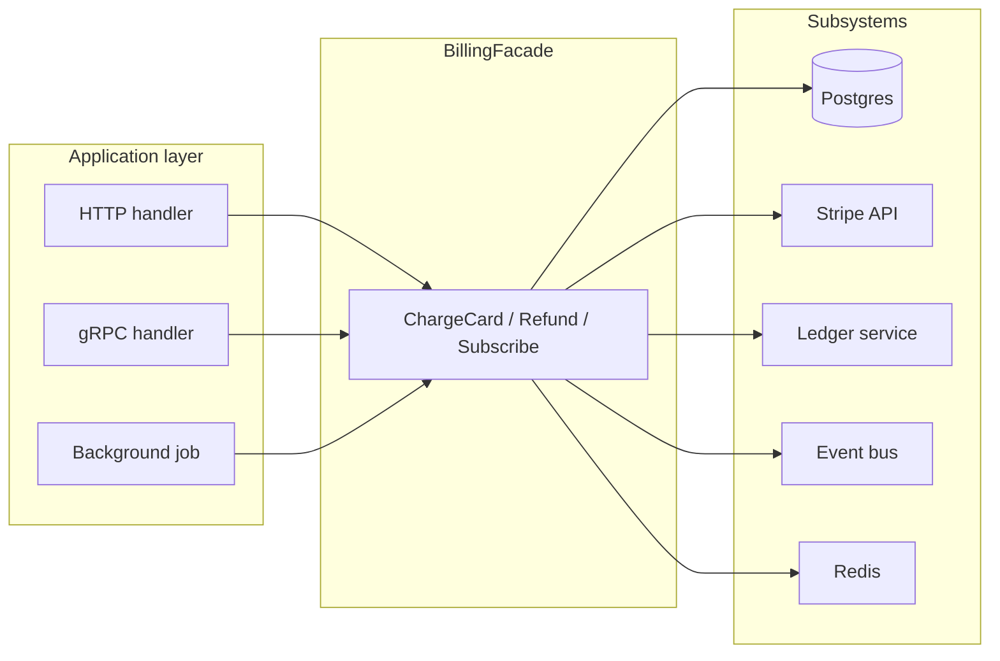
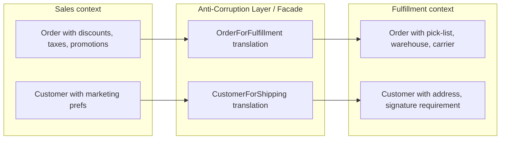
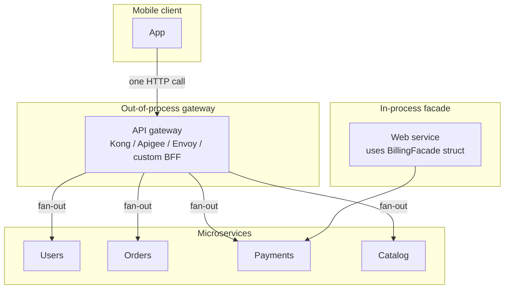
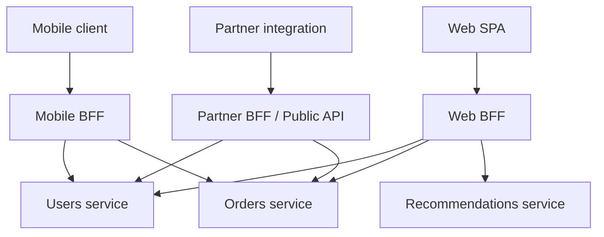
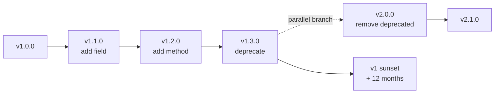
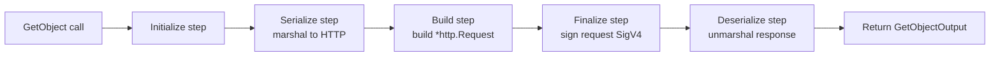
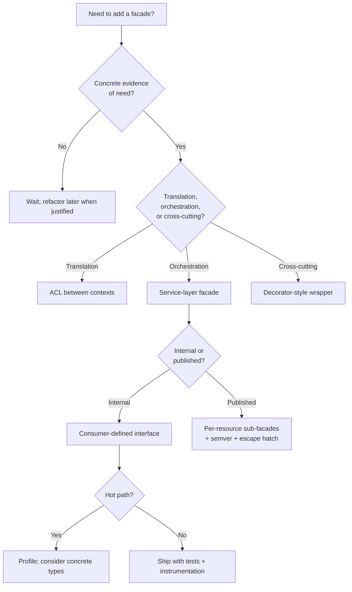

# Facade Pattern — Senior

## 1. The architectural question

Junior taught the shape — one struct, a handful of injected subsystems, a few methods that hide the orchestration. Middle taught the discipline — interface boundaries, error translation, transaction span, dependency injection without going theatrical about it. Senior is what happens when a facade stops being a local convenience and becomes *the system's public contract*.

The day your `BillingFacade` ships as the entry point for every other service in the company, you no longer control its evolution. Every method signature is now load-bearing for a dozen downstream teams. Adding a parameter is a coordinated rollout. Returning a new error type is an outage. Removing a method is a multi-quarter migration. The facade has stopped being code and become *governance*.

The day your team publishes a Go SDK that wraps your REST API, the SDK is a facade — and every choice (context placement, option structs, error semantics, retry policy) is now stamped into hundreds of customer codebases. You will live with those choices for years.

The day the platform team introduces a "clientset" facade over forty service clients to make life easier for application teams, the clientset becomes a chokepoint for every dependency upgrade, every TLS rotation, every observability change. The convenience curve and the coupling curve both go up together.

The senior-level forces:

1. **Facade as a service boundary** — between layers (domain ↔ infrastructure), between bounded contexts (billing ↔ inventory), between owning teams (platform ↔ application). The boundary the facade defines is the boundary the org's communication patterns will follow. Conway's law sits on top of facades like a hat.
2. **SDK design** — facades shipped as libraries. AWS SDK for Go, Google Cloud client libraries, Stripe Go SDK, Twilio Go SDK. The constraints: backward compatibility for years, zero hidden global state, predictable concurrency, no surprises when consumers compose multiple facades in one process.
3. **Microservice gateways** — the facade is sometimes a process, not a struct. API gateways (Kong, Envoy, Apigee) and Backend-for-Frontend services are facades at the network boundary. Knowing when an in-process facade should become an out-of-process gateway is a senior judgement call.
4. **API evolution** — adding methods, deprecating methods, evolving signatures without breaking consumers. Functional options, semantic versioning, deprecation windows, type aliasing.
5. **Concurrency at scale** — a facade that holds a single mutex can serialise a whole service. Read-mostly fan-out, per-tenant sharding, immutable snapshots, deferred initialisation. Lock contention through a facade is one of the classic incident causes.
6. **Anti-patterns** — god facade (everything goes through one struct), leaky facade (subsystem types in the signature), facade chains (facade calling facade calling facade), facade hiding too much (no escape hatch when you need lower-level control).
7. **Knowing when to remove the facade** — when subsystem APIs stabilise, when a facade becomes a translation layer with no value-add, when the cost of indirection exceeds the cost of duplication, when consumers' needs diverge so much that one facade can't serve them.

This file walks the senior-level shape of all of it. Sections 3-7 cover facade as boundary and SDK design. Sections 8-11 cover gateway, evolution, and concurrency. Sections 12-14 cover anti-patterns and removal. Section 15 covers real ecosystems. Section 16 is postmortems. The rest is cross-language comparison, mistakes, questions, and reference material.

---

## 2. Table of contents

1. [The architectural question](#1-the-architectural-question)
2. [Table of contents](#2-table-of-contents)
3. [Facade as a service boundary](#3-facade-as-a-service-boundary)
4. [Facade between bounded contexts](#4-facade-between-bounded-contexts)
5. [SDK design as facade — the contract is forever](#5-sdk-design-as-facade--the-contract-is-forever)
6. [AWS SDK and Google Cloud client libraries](#6-aws-sdk-and-google-cloud-client-libraries)
7. [Facade vs API gateway in microservices](#7-facade-vs-api-gateway-in-microservices)
8. [Backward-compatible evolution of facade APIs](#8-backward-compatible-evolution-of-facade-apis)
9. [Concurrency at scale: lock contention through a facade](#9-concurrency-at-scale-lock-contention-through-a-facade)
10. [Tenant-scoped and shard-aware facades](#10-tenant-scoped-and-shard-aware-facades)
11. [Observability and context propagation through facades](#11-observability-and-context-propagation-through-facades)
12. [Anti-patterns: god facade, leaky facade, facade chain, facade hiding too much](#12-anti-patterns-god-facade-leaky-facade-facade-chain-facade-hiding-too-much)
13. [Escape hatches: when consumers must reach the subsystem](#13-escape-hatches-when-consumers-must-reach-the-subsystem)
14. [Replacing a facade with direct subsystem use — when and how](#14-replacing-a-facade-with-direct-subsystem-use--when-and-how)
15. [Real ecosystems: client-go, aws-sdk-go-v2, database/sql.DB](#15-real-ecosystems-client-go-aws-sdk-go-v2-databasesqldb)
16. [Postmortems](#16-postmortems)
17. [Cross-language comparison](#17-cross-language-comparison)
18. [Common senior-level mistakes](#18-common-senior-level-mistakes)
19. [Tricky questions](#19-tricky-questions)
20. [Cheat sheet](#20-cheat-sheet)
21. [Further reading](#21-further-reading)

---

## 3. Facade as a service boundary

The most consequential way to use Facade is as the explicit boundary between layers, between modules, or between teams. The shape is small. The implications are vast.



The application layer never touches the subsystems directly. Every call goes through `BillingFacade`. This is intentional — and the consequences propagate through the org chart.

### 3.1 What the boundary buys you

- **One place to add tracing, metrics, logging.** Every operation that hits Stripe is one call on the facade, so the facade's tracing wrapper covers the world.
- **One place to enforce invariants.** "Every charge must record an audit row" is enforced by the facade. The application can't forget.
- **One place to evolve.** When Stripe deprecates an API version, the facade absorbs the change. Application code is untouched.
- **One place to test.** Mocking the facade is one fake; mocking five subsystems is five fakes plus orchestration glue.
- **A team contract.** The billing team owns the facade. Other teams consume it through Go's standard package mechanisms — imports, interfaces, semver.

### 3.2 What the boundary costs you

- **An extra layer of indirection.** Every call goes through an interface dispatch. At 100K QPS, that's 100K extra allocations of result structs if you're not careful.
- **A coordination overhead.** Adding a feature that needs a new field in the request requires the facade team's review even if the underlying subsystem already supports it.
- **A risk of becoming a god object.** The facade accumulates methods. Five becomes fifty becomes five hundred. (See §12.1.)
- **A risk of leaking abstractions.** When subsystem-specific behaviour (Stripe's idempotency keys, Postgres's deadlock errors) leaks through the facade's signature, consumers learn the subsystem anyway. (See §12.2.)

### 3.3 The interface for boundary facades

A senior-grade boundary facade is an interface (consumer-side) plus a struct (provider-side), with the interface owned by the consumer:

```go
// Package application — defines what it needs from billing
package application

type Billing interface {
    Charge(ctx context.Context, req ChargeRequest) (*ChargeResult, error)
    Refund(ctx context.Context, req RefundRequest) (*RefundResult, error)
}

// Package billing — provides the implementation
package billing

type Facade struct {
    db     *sql.DB
    stripe StripeClient
    ledger LedgerClient
    bus    EventBus
}

var _ application.Billing = (*Facade)(nil)  // compile-time check
```

The interface lives where it's used (the application), not where it's implemented (billing). This is Go's "accept interfaces, return structs" applied to the largest boundary in the system: mocks in application tests are trivial, billing depends on nothing but its own subsystems, and switching implementations is a DI concern.

### 3.4 The boundary lines up with the org chart

When the billing team owns `BillingFacade`, the boundary is both a code and a team boundary: facade-change PRs need billing-team approval, SLAs are negotiated at the facade, on-call is scoped accordingly. This is good when teams are stable; bad when ownership is ambiguous, when the facade is owned by a team but consumed by twenty teams that evolve faster than the owners ship, or when the original team has moved on and the facade has tripled in scope. Senior judgement: a facade is a contract; treat its evolution with public-API rigour.

---

## 4. Facade between bounded contexts

DDD names the boundary between bounded contexts an "Anti-Corruption Layer" (ACL). In Go code, the ACL is most often expressed as a facade. The point: vocabulary in one context (`Order`, `Customer`, `LineItem` in sales) means something subtly different than the same words in another context (`Order`, `Customer`, `LineItem` in fulfillment). Letting one context's types leak into another corrupts both.



The facade translates. It does not pass through. In Go:

```go
// fulfillment/facade.go — owned by fulfillment team
package fulfillment

type Facade struct {
    sales SalesReader  // interface, not concrete sales type
    wms   WMSClient
}

func (f *Facade) Ship(ctx context.Context, salesOrderID string) error {
    so, err := f.sales.GetOrder(ctx, salesOrderID)
    if err != nil {
        return err
    }
    // Translate sales.Order -> fulfillment.Order
    fo := translateOrder(so)
    return f.wms.CreatePick(ctx, fo)
}

func translateOrder(so sales.Order) Order {
    return Order{
        ID:       so.ID,
        Items:    extractFulfillableItems(so.Lines),    // drop digital, drop services
        Address:  so.ShippingAddress,                   // map type
        Priority: derivePriority(so.CustomerTier),      // sales concept, fulfillment translation
    }
}
```

`sales.Order` is rich with discount logic, tax calculations, promotion stacks. None of that matters to fulfillment. The facade extracts what's relevant and drops what isn't. Equally important: it *renames* fields and *re-types* enums to use the fulfillment vocabulary. A field called `Customer.Tier` in sales becomes `Order.Priority` in fulfillment, because that's how fulfillment thinks about it.

Without the ACL, fulfillment code starts referencing `salesOrder.PromoStack[2].DiscountKind`, and now any change in the sales promo system breaks fulfillment. With the ACL, the translation is one place, owned by fulfillment, that the sales team must coordinate on when they change sales-internal types.

The senior-level move: **the facade between bounded contexts is the most expensive facade to lose**. When a team merges two contexts under one tech lead and "removes the unnecessary translation layer", the next refactor of either context now requires opening both. Two months later, every change to sales requires touching fulfillment files. The contexts have re-fused.

---

## 5. SDK design as facade — the contract is forever

When you publish a Go SDK — say, `github.com/yourcompany/yourservice-go` — you are publishing a facade over your service's REST or gRPC API. Every choice you make is now in customer code. You cannot break compatibility without breaking every customer.

The SDK facade has properties that an internal facade doesn't:

1. **You don't control the upgrade cadence.** Customers upgrade when they want, not when you ship.
2. **You don't see the consumers.** A million customers might use one method in a way you didn't anticipate.
3. **You can't refactor the call sites.** Changing a method signature is a major version.
4. **Errors must be programmatic.** Customers will branch on `errors.Is(err, ErrNotFound)`; if your error types change shape, their code breaks.
5. **Concurrency must be safe by default.** Customers will share one client across goroutines without reading docs.
6. **The client is long-lived.** It will be allocated at process start and used for the lifetime of the process.

### 5.1 The skeleton of a senior-grade SDK facade

```go
// Package yourservice provides a client for the YourService API.
package yourservice

// Client is the entry point. Methods are safe for concurrent use.
type Client struct {
    httpClient  *http.Client
    baseURL     string
    apiKey      string
    userAgent   string
    retryPolicy RetryPolicy
}

func NewClient(apiKey string, opts ...Option) (*Client, error) {
    c := &Client{
        httpClient:  http.DefaultClient,
        baseURL:     "https://api.yourservice.com",
        apiKey:      apiKey,
        userAgent:   "yourservice-go/" + Version,
        retryPolicy: defaultRetryPolicy(),
    }
    for _, opt := range opts {
        if err := opt(c); err != nil {
            return nil, err
        }
    }
    return c, nil
}

type Option func(*Client) error

func WithBaseURL(u string) Option        { return func(c *Client) error { c.baseURL = u; return nil } }
func WithHTTPClient(h *http.Client) Option {
    return func(c *Client) error {
        if h == nil { return errors.New("http client cannot be nil") }
        c.httpClient = h
        return nil
    }
}
func WithRetryPolicy(p RetryPolicy) Option { return func(c *Client) error { c.retryPolicy = p; return nil } }
```

Functional options are the standard mechanism. They allow adding new options without breaking constructor signatures, defaults that work for 95% of consumers, and validation at construction time.

### 5.2 Resource sub-facades

Real-world SDK facades fan out into resource-specific sub-facades. The AWS SDK calls these "service clients"; Stripe calls them "resources"; Google Cloud calls them "service clients" too.

```go
// One Client, many resource accessors
func (c *Client) Customers() *CustomersService {
    return &CustomersService{client: c}
}

func (c *Client) Invoices() *InvoicesService {
    return &InvoicesService{client: c}
}

func (c *Client) Subscriptions() *SubscriptionsService {
    return &SubscriptionsService{client: c}
}

// Each sub-service is itself a small facade
type CustomersService struct {
    client *Client
}

func (s *CustomersService) Create(ctx context.Context, req CreateCustomerRequest) (*Customer, error) {
    return s.client.do(ctx, "POST", "/v1/customers", req, &Customer{})
}

func (s *CustomersService) Get(ctx context.Context, id string) (*Customer, error) {
    return s.client.do(ctx, "GET", "/v1/customers/"+id, nil, &Customer{})
}
```

Each sub-service is a focused facade. The parent `Client` is itself a facade that hands out the focused ones. Customer code reads:

```go
cust, err := client.Customers().Create(ctx, yourservice.CreateCustomerRequest{
    Email: "alice@example.com",
})
```

Pleasant. Discoverable. Each `*Service` is small enough to be reviewable.

### 5.3 Errors are part of the API

Customers will branch on errors. Your error types are part of your public contract.

```go
var (
    ErrNotFound     = errors.New("yourservice: resource not found")
    ErrUnauthorized = errors.New("yourservice: unauthorized")
    ErrRateLimited  = errors.New("yourservice: rate limited")
    ErrServerError  = errors.New("yourservice: server error")
)

type APIError struct {
    StatusCode int
    Code       string  // machine-readable, stable
    Message    string  // human-readable, may be reworded
    RequestID  string  // for support tickets
}

func (e *APIError) Error() string { return e.Message }
func (e *APIError) Is(target error) bool {
    switch target {
    case ErrNotFound:     return e.StatusCode == 404
    case ErrUnauthorized: return e.StatusCode == 401 || e.StatusCode == 403
    case ErrRateLimited:  return e.StatusCode == 429
    case ErrServerError:  return e.StatusCode >= 500
    }
    return false
}
```

Customers branch with `errors.Is(err, yourservice.ErrNotFound)` and inspect with `errors.As(err, &apiErr)`. Senior decisions: sentinels for common cases (they never change); typed errors for structured data (new fields are additive); `Is()` method for cross-mapping; stable `Code` separate from human-facing `Message`.

### 5.4 Concurrency contract

State explicitly in the doc comment of `Client`: safe for concurrent use, one client per process, no per-call mutation of `Client` fields, no global mutable state, retries don't block other goroutines. Customers will assume this forever — so the implementation must honour it forever.

---

## 6. AWS SDK and Google Cloud client libraries

The two biggest Go SDKs in the wild — `aws-sdk-go-v2` and the various `cloud.google.com/go/*` packages — both organise around the facade pattern. Studying their shapes is the fastest way to learn good SDK facade design.

### 6.1 aws-sdk-go-v2: per-service facade

```go
cfg, _ := config.LoadDefaultConfig(ctx)
s3Client := s3.NewFromConfig(cfg)
ddbClient := dynamodb.NewFromConfig(cfg)

out, err := s3Client.GetObject(ctx, &s3.GetObjectInput{
    Bucket: aws.String("my-bucket"),
    Key:    aws.String("path/to/key"),
})
```

Each service client (`s3.Client`, `dynamodb.Client`) is a facade over request signing (SigV4), HTTP pooling, endpoint resolution, adaptive retries, middleware chain, response unmarshalling and error mapping, pagination. The customer sees `s3Client.GetObject(...)`. Hidden under that: a hundred files of middleware, signers, and resolvers.

Senior takeaways: per-service facade, not god facade (one `aws.Client` would force every customer to compile-import 200+ services); shared `aws.Config` as cross-cutting facade for credentials/region/retry; middleware is exposed via `WithAPIOptions(...)` so the facade isn't a black box; major versions live at `/v2`, `/v3` import paths (§8); service-specific errors (`*types.NoSuchKey`) are `errors.As`-comparable.

### 6.2 cloud.google.com/go: hierarchical sub-facades

```go
client, _ := storage.NewClient(ctx, option.WithCredentialsFile("/path/to/key.json"))
defer client.Close()
rc, _ := client.Bucket("my-bucket").Object("path/to/key").NewReader(ctx)
```

Notable differences from aws-sdk-go-v2: hierarchical sub-facades (`Client -> Bucket -> Object -> Reader`, fluent style); explicit `Close()` for the gRPC connection pool (AWS uses HTTP pooling which the GC eventually reclaims); generic `option.ClientOption` instead of typed functional options.

### 6.3 SDK design lessons distilled

| Decision | aws-sdk-go-v2 | cloud.google.com/go |
|----------|---------------|---------------------|
| Per-service vs global | Per-service | Per-service |
| Construction | `New[Service]FromConfig(cfg)` | `[service].NewClient(ctx, ...opts)` |
| Versioning | Import-path major versions | Import-path major versions |
| Errors | `*types.XxxError` per service | gRPC status via `status.FromError` |
| Resource cleanup | None required (HTTP pool) | `Close()` required (gRPC pool) |
| Pagination | `Paginator` types | `Iterator` types |

For your own SDK: pick one style and stick with it; per-service sub-facades scale and god facades don't; make `Close()` explicit when resource cleanup is non-trivial; define error mapping at the facade boundary so consumers never see raw HTTP errors.

---

## 7. Facade vs API gateway in microservices

Both a facade and an API gateway "hide complexity behind a simple front". The difference is whether the simplification is in-process or out-of-process.



The API gateway is a *deployment unit*. It's a process or a sidecar that lives at the network edge, terminates client connections, fans out to backend services, and aggregates the responses. The in-process facade is a *struct* in your Go binary. It lives in the same process as the caller.

### 7.1 When to use which

| Concern | In-process facade | Out-of-process gateway |
|---------|-------------------|------------------------|
| Caller and subsystems in same language | Likely | Likely |
| Caller and subsystems in different languages | Doesn't work (Go struct doesn't help a Python client) | Required |
| Need cross-cutting concerns enforced for all callers (rate limit, auth) | Hard (every caller process must include the facade) | Easy (gateway is in front of everything) |
| Latency sensitive | Lower (no extra hop) | Higher (extra network hop) |
| Aggregation of multiple backend calls | Possible but uses caller's goroutines | Possible, isolated from caller |
| Client diversity (mobile, web, partner) | One facade per consumer type is duplicative | BFF (Backend For Frontend) is the right answer |
| Versioning | Tied to caller binary release | Independent deploy |
| Failure isolation | Caller is the SPoF | Gateway is the SPoF |

The senior decision: most systems have **both**. A web server in Go has an in-process facade (`BillingFacade`) over its in-process subsystems (Stripe, ledger), and the web server itself sits behind an out-of-process API gateway that fans out to the web server plus the user service plus the catalog service. The two patterns compose.

### 7.2 BFF (Backend-for-Frontend) pattern

When one backend serves mobile, web, and partner clients, each client has different aggregation and shaping needs. A BFF is a per-client gateway:



Each BFF is a facade — same pattern, just deployed separately. Mobile BFF returns smaller payloads, batches requests, transforms field names. Web BFF returns richer payloads with hypermedia. Partner BFF stabilises a public contract for years.

The mistake is to have one shared BFF for all three. Mobile's needs evolve fast; the partner contract must be stable. One BFF for both means every mobile change requires a partner-team review. Three BFFs, three facades, three teams' ownership. Conway's law wins.

### 7.3 In-process facade calling out-of-process gateway

A common shape: the in-process facade in your service is itself a wrapper around an HTTP call to a gateway or other service. The in-process facade adds local timeout policy, local circuit breaking, local retries, trace-header propagation, local error mapping. The gateway adds cross-service auth, rate limiting, and traffic shaping. The two layers are not redundant — they serve different purposes. The senior failure mode is *thinking they're redundant* and removing the in-process facade because "the gateway does that". Then the developer experience degrades, tracing gets uneven, and retries are inconsistent.

---

## 8. Backward-compatible evolution of facade APIs

Once a facade is published — internally as a stable Go package across teams, or externally as an SDK — its method signatures are frozen. Every change must preserve backward compatibility or be marked as a breaking change with the appropriate ceremony.

### 8.1 The seven rules of facade evolution

1. Never remove a method. Even if "nobody uses it".
2. Never change a method's signature. Add a new method; deprecate the old.
3. Never change observable behaviour. Fixing a bug that returns wrong errors might break a caller who depends on the wrong error.
4. Never change struct field types. Add new fields; deprecate old fields.
5. Never change error semantics. If `ErrNotFound` meant "no row" and now means "no row OR soft-deleted", callers branch differently.
6. Never tighten input validation without warning. Callers that sent `Limit: -1` expecting "unlimited" will break.
7. Mark deprecations with `// Deprecated:` and keep them working for at least one major version cycle.

### 8.2 Adding a parameter without breaking callers

The wrong way is to add a positional parameter (breaks every caller). The right ways are variadic options (`Charge(ctx, customerID, amount, opts ...ChargeOption)`) or a request struct with optional fields:

```go
type ChargeRequest struct {
    CustomerID     string
    Amount         Money
    IdempotencyKey string             // new in v1.5, optional
    Metadata       map[string]string  // new in v2.0, optional
}

func (b *BillingFacade) Charge(ctx context.Context, req ChargeRequest) (*Charge, error)
```

Request structs scale linearly with parameters. Functional options are pleasant for 1-3 optionals. For a facade with rich method signatures, prefer request structs from the start.

### 8.3 Adding a method

This is almost always safe. The new method extends the interface; existing callers don't use it. But:

- If consumers define their own *interface* mirroring your facade (Go's structural typing makes this common), adding a method to your struct doesn't break them. Adding a method to the interface they declared *does*.
- Mock implementations in consumer test suites might need updates — but only if they use the interface, and only if they update to the new version.

The senior practice: when publishing an interface as part of an SDK, document explicitly whether consumers should embed your interface (forward-compatible) or define their own (and be aware they need to add methods).

### 8.4 Deprecating a method

```go
// Deprecated: Use ChargeWithMetadata instead. Charge will be removed in v3.0.0.
func (b *BillingFacade) Charge(ctx context.Context, customerID string, amount Money) (*Charge, error) {
    return b.ChargeWithMetadata(ctx, customerID, amount, nil)
}

func (b *BillingFacade) ChargeWithMetadata(ctx context.Context, customerID string, amount Money, metadata map[string]string) (*Charge, error) {
    // new implementation
}
```

`// Deprecated:` triggers staticcheck warnings (SA1019) and IDE strikethroughs. Callers see them in their editor.

Plan a minimum deprecation window:
- For internal facades: at least one quarter, often longer.
- For published SDKs: at least one major version, usually two.

### 8.5 Major-version migration via import paths

Go's module system encodes major versions ≥ 2 in the import path (`github.com/yourcompany/sdk` → `github.com/yourcompany/sdk/v2`). v1 and v2 can coexist in the same binary, so consumers migrate gradually — calling both APIs side by side, then deleting v1 imports when done. The same idea works for internal facades with package paths (`pkg/billing` → `pkg/billing/v2`).

Senior practice: never overwrite a published v1. Publish v2 in parallel. Let consumers migrate at their own cadence. Sunset v1 loudly and support it for as long as humanly reasonable.

### 8.6 Evolution lanes



The v1 lane keeps shipping bug fixes during deprecation. The v2 lane is parallel. Consumers migrate at their own pace.

---

## 9. Concurrency at scale: lock contention through a facade

A facade is often a single struct shared across every goroutine in the service. If it holds a mutex, that mutex is in the path of every operation. Senior performance work on facades is mostly about not turning the facade into a bottleneck.

### 9.1 The accidental serialiser

```go
type CacheFacade struct {
    mu    sync.Mutex
    redis *redis.Client
    stats Stats
}

func (c *CacheFacade) Get(ctx context.Context, key string) (string, error) {
    c.mu.Lock()
    defer c.mu.Unlock()
    c.stats.Reads++
    return c.redis.Get(ctx, key).Result()
}
```

This serialises every cache read across the entire process. At 50K QPS, the mutex queue depth dwarfs the actual Redis latency. The diagnostic: `runtime/pprof` shows most of the time spent in `sync.(*Mutex).Lock`.

The mutex was meant to protect `c.stats.Reads`. The fix:

```go
type CacheFacade struct {
    redis *redis.Client
    stats atomicStats
}

type atomicStats struct {
    reads  atomic.Int64
    writes atomic.Int64
}

func (c *CacheFacade) Get(ctx context.Context, key string) (string, error) {
    c.stats.reads.Add(1)
    return c.redis.Get(ctx, key).Result()
}
```

`atomic.Int64` has a single CAS-like operation. No critical section. No queue. Per-CPU contention only.

### 9.2 RWMutex for read-mostly facades

```go
type ConfigFacade struct {
    mu     sync.RWMutex
    config *Config
}

func (c *ConfigFacade) Get(key string) string {
    c.mu.RLock()
    defer c.mu.RUnlock()
    return c.config.Lookup(key)
}

func (c *ConfigFacade) Reload(new *Config) {
    c.mu.Lock()
    defer c.mu.Unlock()
    c.config = new
}
```

`RWMutex` lets many readers proceed in parallel while writers (`Reload`) are rare. Good for config snapshots, feature flags, rate-limit tables.

But `RWMutex` is still contended on reads (it has internal state). For very high-frequency reads:

### 9.3 Copy-on-write with atomic.Pointer

```go
type ConfigFacade struct {
    config atomic.Pointer[Config]
}

func NewConfigFacade(initial *Config) *ConfigFacade {
    c := &ConfigFacade{}
    c.config.Store(initial)
    return c
}

func (c *ConfigFacade) Get(key string) string {
    return c.config.Load().Lookup(key)
}

func (c *ConfigFacade) Reload(new *Config) {
    c.config.Store(new)
}
```

Reads are wait-free pointer loads. Writes are pointer stores. The trade-off: writes don't see "the same `*Config` for the duration of the write" — a reader can grab the old pointer just before `Store`, and the writer can't rendezvous. For config-style usage where each operation reads-once, this is fine.

This pattern shines for facades that publish snapshots (config, feature flags, routing tables). Don't use it for mutable state (counters, queues) without further structure.

### 9.4 Sharding the facade

When the facade itself is contended (not just one field), shard it by hash of key:

```go
type UserCacheFacade struct {
    shards []*shardedCache  // len = power of 2
    mask   uint32
}

type shardedCache struct {
    mu    sync.Mutex
    items map[string]Item
}

func (f *UserCacheFacade) Get(key string) (Item, bool) {
    s := f.shards[fnvHash32(key)&f.mask]
    s.mu.Lock()
    defer s.mu.Unlock()
    it, ok := s.items[key]
    return it, ok
}
```

This is what `sync.Map` does internally for hot keys. For 16-shard or 32-shard sharding, contention drops by a factor close to the shard count.

### 9.5 Fan-out under a facade

Some facade methods naturally aggregate multiple subsystem calls. Use `errgroup.WithContext` so that one failure cancels the rest:

```go
func (b *BillingFacade) CustomerSummary(ctx context.Context, id string) (*Summary, error) {
    var cust *Customer
    var invs []*Invoice
    var subs []*Subscription

    g, ctx := errgroup.WithContext(ctx)
    g.Go(func() error { var e error; cust, e = b.customers.Get(ctx, id); return e })
    g.Go(func() error { var e error; invs, e = b.invoices.List(ctx, id); return e })
    g.Go(func() error { var e error; subs, e = b.subscriptions.List(ctx, id); return e })

    if err := g.Wait(); err != nil {
        return nil, err
    }
    return &Summary{Customer: cust, Invoices: invs, Subscriptions: subs}, nil
}
```

Senior gotchas: facade-spawned goroutines are part of the caller's request lifetime; don't fan out unbounded (use `errgroup.SetLimit` or a semaphore); don't roll your own error aggregation.

---

## 10. Tenant-scoped and shard-aware facades

In multi-tenant systems, the facade often has to route based on tenant. The naive approach — a top-level facade plus tenant-id-as-argument on every call — works for small systems but doesn't scale to dozens of subsystem clients per tenant.

### 10.1 Tenant lookup in the facade

```go
type BillingFacade struct {
    tenants     TenantResolver
    stripeCache *clientCache[StripeClient]
}

type TenantResolver interface {
    Stripe(tenantID string) (StripeConfig, error)
}

func (b *BillingFacade) Charge(ctx context.Context, tenantID string, req ChargeRequest) (*Charge, error) {
    cfg, err := b.tenants.Stripe(tenantID)
    if err != nil {
        return nil, err
    }
    stripe, err := b.stripeCache.GetOrCreate(tenantID, func() (StripeClient, error) {
        return NewStripeClient(cfg)
    })
    if err != nil {
        return nil, err
    }
    return stripe.Charge(ctx, req)
}
```

The facade holds a cache of per-tenant clients. Each tenant has its own Stripe API key, its own retry policy, its own rate limit. The facade's job is to route the call to the right client without leaking tenant logic into the caller.

### 10.2 Shard-aware facade

When the data layer is sharded, the facade routes single-key calls (`Get(orderID)`) to the right shard via a hash router, and scatter-gathers cross-shard calls (`GetByCustomer(customerID)`) across all shards with bounded concurrency:

```go
func (o *OrdersFacade) GetByCustomer(ctx context.Context, customerID string) ([]*Order, error) {
    var mu sync.Mutex
    var results []*Order
    g, ctx := errgroup.WithContext(ctx)
    g.SetLimit(8)  // bounded fan-out
    for _, s := range o.shards {
        s := s
        g.Go(func() error {
            orders, err := s.GetOrdersByCustomer(ctx, customerID)
            if err != nil {
                return err
            }
            mu.Lock()
            results = append(results, orders...)
            mu.Unlock()
            return nil
        })
    }
    if err := g.Wait(); err != nil {
        return nil, err
    }
    sortByCreatedAt(results)
    return results, nil
}
```

Senior practices: limit fan-out concurrency (a 64-shard scatter at unbounded concurrency saturates connections and amplifies failure); decide partial-failure policy explicitly; cache the router so routing is O(1); make each shard call a child span so traces show the real shape.

---

## 11. Observability and context propagation through facades

A facade is a perfect place to attach observability — but only if you do it consistently.

### 11.1 The instrumented facade

```go
type BillingFacade struct {
    inner   Billing  // the unwrapped implementation
    tracer  trace.Tracer
    metrics *Metrics
    logger  *slog.Logger
}

func (b *BillingFacade) Charge(ctx context.Context, req ChargeRequest) (*Charge, error) {
    ctx, span := b.tracer.Start(ctx, "billing.Charge",
        trace.WithAttributes(
            attribute.String("customer_id", req.CustomerID),
            attribute.Int64("amount_cents", req.Amount.Cents()),
            attribute.String("currency", req.Amount.Currency),
        ))
    defer span.End()

    start := time.Now()
    out, err := b.inner.Charge(ctx, req)
    elapsed := time.Since(start)

    b.metrics.ChargeLatency.WithLabelValues(req.Amount.Currency, status(err)).Observe(elapsed.Seconds())

    if err != nil {
        span.RecordError(err)
        span.SetStatus(codes.Error, err.Error())
        b.logger.ErrorContext(ctx, "charge failed",
            slog.String("customer_id", req.CustomerID),
            slog.String("error", err.Error()),
            slog.Duration("elapsed", elapsed))
        return nil, err
    }

    return out, nil
}
```

This is *decorator-style* instrumentation — `BillingFacade` here is wrapping an inner `Billing` interface. That's a common move: the underlying facade is your business code, then you wrap it with an observability facade. The caller sees one facade; behind it is a chain of facades.

The senior discipline: don't put observability inside the business facade. Make it a separate layer that wraps the inner. This keeps business logic clean and lets you turn observability on or off (in tests, in benchmarks) by skipping the wrapper.

### 11.2 Context propagation

Every facade method takes `ctx context.Context` as the first parameter. The contract:

1. The facade *must* pass `ctx` to all subsystem calls.
2. The facade *may* derive a new context (`context.WithTimeout`, `context.WithValue`) and pass it downward.
3. The facade *must not* substitute `context.Background()` for the incoming context — that silently drops deadlines, cancellation, and trace headers.
4. The facade *should not* return new contexts to the caller.

The most common bug: in a goroutine spawned by the facade, using either the request `ctx` (which gets cancelled the moment the caller's request returns) or `context.Background()` (which loses the trace span). The right shape for fire-and-forget is a *detached* context that inherits values (trace IDs) but is independent of the caller's cancellation:

```go
type detached struct{ parent context.Context }
func (d *detached) Deadline() (time.Time, bool) { return time.Time{}, false }
func (d *detached) Done() <-chan struct{}       { return nil }
func (d *detached) Err() error                  { return nil }
func (d *detached) Value(key any) any           { return d.parent.Value(key) }

func (b *BillingFacade) AsyncRefund(ctx context.Context, req RefundRequest) {
    bgCtx, cancel := context.WithTimeout(&detached{ctx}, 30*time.Second)
    go func() {
        defer cancel()
        if err := b.inner.Refund(bgCtx, req); err != nil {
            b.logger.ErrorContext(bgCtx, "async refund failed", slog.Any("err", err))
        }
    }()
}
```

Senior takeaway: fire-and-forget at the facade is a code smell. Most "async" work belongs in a durable queue with retries and observability. A loose goroutine inside the facade is a memory leak waiting to happen.

---

## 12. Anti-patterns: god facade, leaky facade, facade chain, facade hiding too much

Four anti-patterns deserve names because they appear at scale.

### 12.1 God facade

```go
type ServiceFacade struct {
    db        *sql.DB
    redis     *redis.Client
    stripe    StripeClient
    sendgrid  EmailClient
    twilio    SMSClient
    s3        S3Client
    kafka     Producer
    elastic   SearchClient
    // ... and 30 more
}

// 200 methods spanning user management, billing, search, notifications, analytics, ...
```

The facade started with 5 methods. Then somebody added one more "because it's faster to put it here than create a new facade". A year later, every team's work flows through one struct, one package, one CODEOWNERS entry. The build is slow because everyone imports it. Reviews bottleneck on the owners. Refactoring is impossible because every change ripples.

How to break it up:

- Split by **bounded context**: `UsersFacade`, `BillingFacade`, `SearchFacade`, `NotificationsFacade`. Each has its own interface, owner, and lifecycle.
- Each consumer holds only the facades it needs. The application layer has explicit dependencies.
- The original god facade can be a *composition*: a struct that embeds the sub-facades. Existing call sites work; new code uses the focused ones. Then delete the god facade once the migration is done.

```go
// Transitional aggregation facade — still accessible, but composed.
type ServiceFacade struct {
    Users         *UsersFacade
    Billing       *BillingFacade
    Search        *SearchFacade
    Notifications *NotificationsFacade
}

// Old call site, deprecated but still works
svc.Users.Get(ctx, id)
```

### 12.2 Leaky facade

```go
type DataFacade struct {
    db *sql.DB
}

func (d *DataFacade) GetUser(ctx context.Context, id string) (*sql.Rows, error) {
    return d.db.QueryContext(ctx, "SELECT ... WHERE id = $1", id)
}
```

Returning `*sql.Rows` from the facade means every caller has to know how to:
- Iterate it.
- Close it.
- Map rows into structs.
- Handle scanner errors.

The facade hides nothing. It's pure indirection.

Fix: return a domain type, never a subsystem type.

```go
func (d *DataFacade) GetUser(ctx context.Context, id string) (*User, error) {
    var u User
    err := d.db.QueryRowContext(ctx, "SELECT ... WHERE id = $1", id).Scan(&u.ID, &u.Name, &u.Email)
    if errors.Is(err, sql.ErrNoRows) {
        return nil, ErrUserNotFound
    }
    if err != nil {
        return nil, fmt.Errorf("get user: %w", err)
    }
    return &u, nil
}
```

A leaky facade is more dangerous than no facade, because callers *think* they're abstracted but they aren't. The first time the facade migrates from Postgres to a different store, every caller breaks because they were relying on `sql.Rows`.

### 12.3 Facade chain

```go
// Facade A calls Facade B calls Facade C calls Facade D
HTTPFacade -> ServiceFacade -> BillingFacade -> StripeFacade -> http.Client
```

Each layer adds indirection. None adds value. The architectural rationalisation ("each layer has its own responsibilities") is usually retrofitted; the layers grew organically and nobody wants to be the one who cuts.

The diagnostic: a stack trace from a real panic has 8 frames before reaching the actual `http.Do`.

Fix: collapse middle layers. Keep the outermost (which provides the consumer's interface) and the innermost (which talks to the actual subsystem). The middle layers usually do nothing but pass through.

The judgement call: a layer that *translates* (domain types ↔ wire types) is useful. A layer that *just renames methods* is not. The test: "What does this layer do that the layers above and below don't?" If the honest answer is "nothing", delete it.

### 12.4 Facade hiding too much

```go
type EmailFacade struct {
    client EmailClient
}

func (e *EmailFacade) Send(ctx context.Context, to, subject, body string) error {
    return e.client.Send(ctx, to, subject, body)
}
```

A caller wants to send an email with a Reply-To header. The facade doesn't support it. The caller has three options:

1. Add a `replyTo` parameter — but now every method might need every header, and the facade balloons.
2. Bypass the facade and use `EmailClient` directly — but the team owns the facade and bypassing is "not allowed".
3. Add `SendWithOptions(ctx, opts)` — but now there are two ways to send, and the API is confused.

The root problem: the facade was designed for the *current* set of use cases, not the *evolving* set. The senior fix at design time: take options, not positional args, from the start.

```go
type EmailFacade struct {
    client EmailClient
}

type SendRequest struct {
    To      string
    Subject string
    Body    string
    ReplyTo string             // optional
    Headers map[string]string  // arbitrary headers
}

func (e *EmailFacade) Send(ctx context.Context, req SendRequest) error {
    // ...
}
```

The escape hatch is to expose the underlying client *too*, in advanced cases. (See §13.)

---

## 13. Escape hatches: when consumers must reach the subsystem

Sometimes the abstraction is too tight. A caller needs `sql.Tx` semantics, or a Stripe-specific idempotency key, or a low-level Redis response code. The facade can't anticipate every case. Senior practice: provide an explicit escape hatch:

```go
type Repository struct{ db *sql.DB }

func (r *Repository) GetUser(ctx context.Context, id string) (*User, error) { /* ... */ }

// Escape hatch: explicit transactional access for callers that need it.
func (r *Repository) WithTx(ctx context.Context, fn func(tx *sql.Tx) error) error {
    tx, err := r.db.BeginTx(ctx, nil)
    if err != nil {
        return err
    }
    if err := fn(tx); err != nil {
        _ = tx.Rollback()
        return err
    }
    return tx.Commit()
}

// Most-explicit escape hatch. Use only when high-level methods don't suffice.
func (r *Repository) DB() *sql.DB { return r.db }
```

`r.DB()` is the rope ladder out of the abstraction. Most callers will never use it; the few who need it get a documented way. Stripe's Go library does the same with `stripe.Backend()` access for advanced cases.

When you don't provide an escape hatch, consumers will add one-line wrappers they nag you to merge, vendor your facade, reach into private fields via reflection, or re-implement the subsystem call themselves. All four are worse than a documented `.Inner()` or `.DB()` accessor.

---

## 14. Replacing a facade with direct subsystem use — when and how

Facades aren't forever. Signals it's time to remove:

1. **The subsystem's API has stabilised and is good enough.** When `database/sql` was released, every codebase had its own wrapper. Now most code uses `*sql.DB` directly because the stdlib API is solid.
2. **The facade is pure pass-through.** Every method is `return inner.X()`.
3. **Different consumers' needs have diverged.** The one-size-fits-all fits none of them.
4. **The boundary it defended has been refactored away.** Subsystem and consumer are now in the same module, same owner, same release train.
5. **The facade is on the hot path and the overhead matters.** Interface dispatch, allocations for request structs, mutex contention.

### 14.1 The removal procedure

This is *not* "delete and update call sites" — that's a big-bang refactor that breaks the world.

1. **Identify the canonical replacement.** Document the new pattern.
2. **Add `// Deprecated:` comments.** Every facade method gets one pointing to the replacement.
3. **Wait.** New code uses the new pattern. Old code stays the same.
4. **Convert one consumer at a time.** PR per consumer; test each; watch metrics.
5. **Audit for regressions.** Don't lose tracing or metrics in the migration.
6. **Delete the facade when no one imports it.**

### 14.2 What to keep when you delete a facade

A facade was usually three things in one: translation, orchestration, cross-cutting concerns (tracing, metrics, error translation, retry policy). Removing it cleanly means splitting those three into three places. Sometimes the replacement is a decorator around the subsystem, sometimes a factory that returns an instrumented client, sometimes a linter rule. "Letting callers do it themselves" usually means losing the cross-cutting concerns — and that's how facade removals cause incidents.

---

## 15. Real ecosystems: client-go, aws-sdk-go-v2, database/sql.DB

Three production-grade facade implementations worth studying.

### 15.1 Kubernetes client-go: clientset as facade

`k8s.io/client-go/kubernetes.Clientset` is a facade over dozens of resource-specific clients:

```go
cs, _ := kubernetes.NewForConfig(cfg)
pods, _ := cs.CoreV1().Pods("default").List(ctx, metav1.ListOptions{})
deps, _ := cs.AppsV1().Deployments("default").List(ctx, metav1.ListOptions{})
```

`Clientset` hands out group clients (`CoreV1()`, `AppsV1()`, `BatchV1()`, ...). Each group client is a small facade for one API group. Each resource (Pods, Deployments) is a third-level facade with `.Get`, `.List`, `.Create`, `.Update`, `.Delete`, `.Watch`.

What's interesting:

- **The facade is generated from API definitions.** Code generators read `apis/`; adding a resource regenerates the facade. This solves the "huge facade is unmaintainable" problem by removing manual maintenance.
- **Multiple deserialisation layers** over the same API: typed (`*v1.Pod`), `dynamic.Interface` (untyped), `informers.SharedInformerFactory` (cached watches). Three facades, each tuned for a different use case.
- **`RESTClient()` is the escape hatch.** Most code doesn't touch it.

Studying client-go is a master class in scaling facade design to a 100+ resource API surface.

### 15.2 aws-sdk-go-v2: per-service client and middleware pipeline

Already discussed in §6.1. The point worth repeating here: every `s3.Client` is a facade that internally constructs a middleware pipeline:



Every step is a middleware. The facade `s3.Client.GetObject(...)` orchestrates the steps. Customers can inject middleware at any step using `WithAPIOptions(...)`.

This is **facade composed of decorators**. The facade provides the simple `GetObject` API; the decorator chain provides the cross-cutting concerns (signing, retry, tracing, metrics). The two patterns reinforce each other.

### 15.3 database/sql.DB: facade over driver implementations

`*sql.DB` is a facade over `database/sql/driver.Driver` implementations. The driver implements `driver.Driver`, `driver.Conn`, `driver.Stmt`; the facade exposes a stable API over connection pooling, statement caching, transaction lifecycle, and context propagation.

What's beautiful:

- **The facade is in the stdlib; drivers are third-party.** Stdlib owns the contract; driver authors implement it; consumers don't care which driver is loaded.
- **Switching drivers is a one-line change.** `import _ "github.com/lib/pq"` → `import _ "github.com/jackc/pgx/v5/stdlib"`.
- **Escape hatch via `db.Conn(ctx).Raw(...)`** for driver-specific operations (`COPY`, listen/notify).
- **Backward compatibility for over a decade.** No breaking changes since Go 1.0; new methods (`ExecContext`, `QueryRowContext`) are additive. The textbook discipline of API evolution.

If you ever design a facade for third-party use, study `database/sql.DB`'s evolution closely.

---

## 16. Postmortems

Five short postmortems from systems where a facade was the cause or the cure.

### 16.1 Postmortem: the god facade and the 45-minute build

**Setup.** A B2B SaaS had one `ServiceFacade` in their Go monolith. Over four years it grew to 412 methods spanning users, billing, products, inventory, search, analytics, partner integrations, admin tools. Every team's code imported `pkg/service`.

**Symptoms.** Build time 45 minutes (incremental 8-12 min). Review bottleneck: 8 platform engineers were the sole CODEOWNERS for `pkg/service`; median review latency 2.3 days. Integration tests ran 90 min serially due to shared DB fixture. New-hire onboarding 4-6 weeks.

**Investigation.** A new VP asked "why does adding a field take a week?" The answer: every package imported `pkg/service` (so any change recompiled everything), every PR touched the same file (reviews queued), tests were serial because of shared setup.

**Fix.** Split `ServiceFacade` into 14 bounded-context facades, each in its own package with its own CODEOWNERS. The old struct became a transitional composition embedding the new ones. Migrated call sites over 6 months; deleted the god facade.

**Outcome.** Build 12 min (incremental 30-90s); review latency 8 hours; tests parallelisable, 22 min; onboarding 1-2 weeks.

**Lesson.** A god facade is a tax on every engineer and every build. The cost is invisible because it accumulates slowly. Spot it early; budget the refactor before the cost crushes velocity.

### 16.2 Postmortem: the leaky facade and the database migration

**Setup.** A fintech with a `DataFacade` over Postgres. The facade had 60 methods that all returned `*sql.Rows`/`*sql.Row`. Callers scanned themselves. The company decided to migrate from Postgres to CockroachDB.

**Symptoms.** Half the call sites broke on migration day: subtly different `sql.ErrNoRows` propagation, CockroachDB's serial-transaction retry errors needed retry loops around every transaction, and `Columns()` ordering for `SELECT *` differed.

**Investigation.** The "facade" wasn't a facade — it was a thin pass-through. Callers knew Postgres semantics by heart. The migration broke not because the databases differ but because the abstraction was fake.

**Fix.** Rewrote the facade to return domain types (`*User`, `*Order`); moved scanning into the facade; added transaction-retry wrapping inside. The rewrite took 3 weeks; the migration ran 6× longer than estimated.

**Outcome.** After the rewrite, swapping drivers was a one-line change. Future migrations (in-memory store, sharded cluster) were contained.

**Lesson.** A leaky facade is worse than no facade. Subsystem types in the public signature make the abstraction a lie.

### 16.3 Postmortem: the facade mutex that took down the service

**Setup.** A consumer-facing service at 80K QPS. The team had built a `FeatureFlagFacade` to centralise feature-flag evaluation. The facade held a `sync.Mutex` to guard against concurrent reloads of the flag set.

**Initial code.**
```go
type FeatureFlagFacade struct {
    mu    sync.Mutex
    flags map[string]Flag
}

func (f *FeatureFlagFacade) IsEnabled(name string) bool {
    f.mu.Lock()
    defer f.mu.Unlock()
    return f.flags[name].Enabled
}

func (f *FeatureFlagFacade) Reload(newFlags map[string]Flag) {
    f.mu.Lock()
    defer f.mu.Unlock()
    f.flags = newFlags
}
```

**Symptoms.** During a traffic spike on a Friday afternoon, p99 latency climbed from 45ms to 1.8s. CPU was at 40%. Goroutine count was at 50K. Healthchecks started timing out.

**Investigation.** `pprof` showed 92% of CPU in `sync.(*Mutex).Lock`. The mutex was held for ~50ns per call but was being contended by 80K goroutines per second × ~10 flag checks per request = 800K mutex acquisitions per second per core. Queue depth on the mutex was massive.

**Fix.**
```go
type FeatureFlagFacade struct {
    flags atomic.Pointer[map[string]Flag]
}

func (f *FeatureFlagFacade) IsEnabled(name string) bool {
    return (*f.flags.Load())[name].Enabled
}

func (f *FeatureFlagFacade) Reload(newFlags map[string]Flag) {
    f.flags.Store(&newFlags)
}
```

After deploy, p99 latency returned to 38ms. CPU dropped to 28%.

**Lesson.** A facade is in the path of every operation. A mutex that's "barely held" is still a serialisation point. For read-mostly state, `atomic.Pointer` with copy-on-write is dramatically faster.

### 16.4 Postmortem: the SDK that changed error types in a patch release

**Setup.** A widely-used internal SDK returned `ErrNotFound` (sentinel) when a resource was missing. v1.4.7 "improved" this to return `*APIError{StatusCode: 404}`.

**Symptoms.** Within hours, customer services showed cascading "unexpected error" logs; one filled its disk logging stack traces.

**Investigation.** Customers had `if err == sdk.ErrNotFound`. The new `*APIError` was not equal to the sentinel; every "not found" case fell through to the generic error branch.

**Fix.** Reverted v1.4.7. v1.4.8 kept the new type but added `Is(target error) bool` so `errors.Is(err, ErrNotFound)` works. Docs updated to require `errors.Is`. CI gained a job that builds every customer service against the new SDK.

**Lesson.** Error semantics are part of the API. A patch release can't change them. The right shape (typed error with `Is` method) should have shipped in v2.0.0 with deprecation, not a patch.

### 16.5 Postmortem: the facade chain that hid a connection leak

**Setup.** Four layers: `BillingHandler` → `BillingService` → `BillingFacade` → `StripeFacade` → `http.Client`. Each justified by "separation of concerns".

**Symptoms.** After a feature ship, FD count climbed monotonically until `EMFILE` after 6 hours; Kubernetes restarted the process. Only the new feature triggered it.

**Investigation.** `goroutine` profile: thousands blocked in `http.(*Transport).getConn`. The new feature called `StripeFacade.RawRequest(...)` (escape hatch) and didn't close the response body. Finding the leak took 3 days because stack traces were 8 frames deep, each layer's "cleanup" was a metric increment not a body close, and the escape hatch bypassed three layers' cleanup paths.

**Fix.** Collapsed four layers into two; reshaped the escape hatch to `func(*http.Response) error` so the body closes before return; added a `goleak`-style FD leak test in CI.

**Lesson.** Facade chains compound the cost of every bug. When tracing a problem requires reading four layers, the chain isn't separation — it's obfuscation. Collapse layers that don't add value.

---

## 17. Cross-language comparison

### 17.1 Java

Java's textbook facade is a class with methods that orchestrate other classes:

```java
public class BillingFacade {
    private final StripeClient stripe;
    private final Database db;
    public ChargeResult charge(ChargeRequest req) throws BillingException { /* orchestrate */ }
}
```

Differences from Go: Spring's `@Service`/`@Repository` annotations mark facade-like classes for DI (Go uses constructors or `wire`/`fx`); checked exceptions force the facade to declare what it throws (Go uses error values by convention); JPMS modules can hide internals (Go uses lowercase identifiers). Spring's `RestTemplate`/`WebClient` and the AWS SDK for Java are facades with shapes nearly identical to Go's.

### 17.2 C# / .NET

```csharp
public class BillingFacade {
    private readonly IStripeClient _stripe;
    public async Task<ChargeResult> ChargeAsync(ChargeRequest req, CancellationToken ct) { /* ... */ }
}
```

Async/await is built-in; `Task<T>` replaces Go's `(T, error)`; `CancellationToken` plays the role of `context.Context`; ASP.NET Core's DI container is built-in (Go uses `wire`/`fx`). The Microsoft SDKs (Azure SDK, AWS SDK for .NET) use the same per-service-facade shape as Go's.

### 17.3 Python

```python
class BillingFacade:
    def __init__(self, stripe, db, events):
        self.stripe, self.db, self.events = stripe, db, events
    def charge(self, customer_id: str, amount: Money) -> ChargeResult: ...
```

Duck typing makes the pattern invisible; cross-cutting concerns use `@instrumented` Python decorators; `async def` for I/O; the Pythonic facade is often just a module. boto3's `client.s3.get_object(...)` is structurally identical to Go's `s3.NewFromConfig(cfg).GetObject(...)`.

### 17.4 The pattern is universal; the contracts vary

| Aspect | Go | Java | C# | Python |
|--------|----|------|----|--------|
| Interface declaration | Implicit, consumer-side | Explicit `interface` | Explicit `interface` | Duck typing or `Protocol` |
| Async model | Goroutines + context | CompletableFuture | Task + CancellationToken | async/await + asyncio |
| Error handling | `(T, error)` | Checked exceptions | Exceptions | Exceptions |
| Cross-cutting | Interface wrapping | Annotations + AOP | Annotations + Filters | Function decorators |
| DI | Constructor / wire / fx | Spring / Guice | Built-in (ASP.NET) | Manual or DI container |
| SDK style | Per-service client | Per-service client | Per-service client | Per-service client |

Go's facade ergonomics are simpler — fewer keywords, fewer ceremonies — but the underlying patterns are the same.

---

## 18. Common senior-level mistakes

Six mistakes I've seen senior Go engineers make. Watch for them in your own work and in review.

### 18.1 Mistake: introducing a facade preemptively

A team designs a new service. Day one, they introduce `Repository`, `EmailFacade`, `BillingFacade` — each with one method, none translating anything, constructors nine layers of DI deep. Cost: every new method touches three files (interface, impl, mock). Benefit: zero, because there's only one consumer.

Senior practice: introduce the facade when you have *concrete evidence* of need — two consumers, a real translation, or a test seam that's actually painful. Until then the direct call is cheaper. Facades should be introduced *late*; refactoring toward one is easy, refactoring away from one is hard because every call site is written against its shape.

### 18.2 Mistake: making the facade interface too wide

```go
type Billing interface {
    Charge(ctx context.Context, req ChargeRequest) (*Charge, error)
    Refund(ctx context.Context, req RefundRequest) (*Refund, error)
    GetCharge(ctx context.Context, id string) (*Charge, error)
    ListCharges(ctx context.Context, customerID string) ([]*Charge, error)
    UpdateCharge(ctx context.Context, id string, updates ChargeUpdates) (*Charge, error)
    // ... 40 more methods
}
```

The interface has every method anyone might use. Mocks become 40-method monsters. Test setup is painful. Adding a method updates every mock implementation in the codebase.

Fix: Interface Segregation Principle. Split into focused interfaces:

```go
type ChargeCreator interface {
    Charge(ctx context.Context, req ChargeRequest) (*Charge, error)
}

type ChargeReader interface {
    GetCharge(ctx context.Context, id string) (*Charge, error)
    ListCharges(ctx context.Context, customerID string) ([]*Charge, error)
}
```

Consumers depend on the narrow interface they need. The `*BillingFacade` struct satisfies all of them.

### 18.3 Mistake: putting business logic inside the facade

When the facade accumulates `if isWeekend() && req.Currency == "USD"` and `if !req.Customer.IsVerified` and "100 lines of policy" before calling Stripe, it has stopped being a facade — it's now a domain service. Tests get harder (policy + orchestration tangled together), refactoring gets harder (policy is wrapped in subsystem glue).

Senior practice: keep the facade thin. Policy lives in domain types (`Customer.CanCharge(amount) error`). The facade orchestrates subsystems; the domain enforces invariants. They are different layers:

```go
func (b *BillingFacade) Charge(ctx context.Context, req ChargeRequest) (*Charge, error) {
    cust, err := b.customers.Get(ctx, req.CustomerID)
    if err != nil {
        return nil, err
    }
    if err := cust.CanCharge(req.Amount); err != nil {
        return nil, err
    }
    return b.stripe.Charge(ctx, req)
}
```

### 18.4 Mistake: not bounding goroutines spawned inside the facade

```go
func (b *BillingFacade) SendReceiptToAll(ctx context.Context, customers []string) error {
    for _, id := range customers {
        id := id
        go func() {
            b.email.SendReceipt(ctx, id)  // fire and forget
        }()
    }
    return nil
}
```

10,000 customers means 10,000 goroutines hammering the email service. SendGrid's rate limit triggers. Some sends fail. The caller has no way to know.

Fix: bounded concurrency, error aggregation, observability.

```go
func (b *BillingFacade) SendReceiptToAll(ctx context.Context, customers []string) error {
    g, ctx := errgroup.WithContext(ctx)
    g.SetLimit(16)
    for _, id := range customers {
        id := id
        g.Go(func() error {
            return b.email.SendReceipt(ctx, id)
        })
    }
    return g.Wait()
}
```

Better still: enqueue receipts onto a durable queue. Spawning goroutines for "background work" in a facade is almost always wrong — the work isn't durable, isn't retried, isn't observable.

### 18.5 Mistake: trusting that all callers will use the facade

The facade has tracing and metrics; an internal helper (`chargeStripe`) doesn't. As long as everyone goes through `Facade.Charge`, instrumentation is correct. Then someone on the team adds a fast-path helper that calls `chargeStripe` directly. Six months later an incident reveals 15% of charges have no traces.

Fix: put the instrumentation in the lowest layer (`chargeStripe`) so no path misses it; or hide the helper from same-package code (Go's `internal/`); or add a linter rule that bans direct subsystem calls outside `Facade`. The principle: every cross-cutting concern should live where you cannot accidentally bypass it.

### 18.6 Mistake: not versioning the facade contract

A team ships `BillingFacade` v1. Six months later they "improve" `Charge` to take a new `Currency` field — every existing call compile-errors. Or they silently change a default and existing callers get different results.

Fix: treat every facade as a versioned API. New optional fields are fine; renamed fields are not. If you must rename, deprecate the old field (`// Deprecated: Use Amount instead. Will be removed in v2.0.0.`) and bridge it at the method boundary. Internal facades feel exempt from this discipline. They aren't — two consumers means two upgrade timelines means breaking-change pain.

---

## 19. Tricky questions

Five questions worth thinking through. Spoiler answers below each.

### 19.1 Q: When does adding a facade make a system harder to test, not easier?

<details><summary>Answer</summary>

Three situations: when the facade is over an already-easy-to-mock subsystem (`*sql.DB` + `sqlmock` or testcontainers — wrapping adds a layer without removing one); when the facade has its own logic that needs testing, so callers still mock the facade *and* the facade itself has a test surface; when the facade's interface is unstable, so every change cascades into mock updates across the codebase.

Senior judgement: a facade helps testing when it consolidates *messy* subsystem usage into a *clean* interface. A facade over an already-clean interface adds friction without benefit.
</details>

### 19.2 Q: A `Repository` facade adds 8% to p50 latency on a hot endpoint. The team wants to remove it. Should they?

<details><summary>Answer</summary>

Probably not. Investigate first: is the 8% noise (at sub-ms absolute, it's tiny)? Can the facade be inlined by using concrete types instead of interfaces on the hot path? Can the request struct be eliminated to reduce GC pressure? Does PGO devirtualize the hot interface call?

If after all this the facade is still 8% and the endpoint is genuinely hot enough that it matters — *split the endpoint, not the facade*. Provide `Repository.GetUserFast(ctx, id)` as a direct concrete-type call; keep the facade for everything else. The senior anti-pattern is removing the facade entirely and losing all its other benefits for a tiny win.
</details>

### 19.3 Q: A customer of your SDK says retries are too aggressive on idempotent operations. How do you let them disable retries per-call?

<details><summary>Answer</summary>

Three options: per-call option (`client.Customers.Create(ctx, req, WithNoRetry())` — explicit, but every method needs to accept options); per-call retry override (`WithRetryPolicy(NoRetry{})` — composes with custom policies); per-call context value (`ctx = ContextWithRetryPolicy(ctx, NoRetry{})` — doesn't change signatures but hides intent in context).

The best answer depends on what your SDK already uses. The wrong answer is to **change the global default**, which breaks every customer that relied on retries.

Senior practice: never change defaults. Add knobs for the customer's case. Document the trade-off.
</details>

### 19.4 Q: A senior says "delete `ServiceFacade`, it's pure pass-through" in a `Handler -> ServiceFacade -> RepoFacade -> sql.DB` chain. Are they right?

<details><summary>Answer</summary>

Look at what `ServiceFacade` actually does: if it only forwards (`return s.repo.Get(ctx, id)`) — yes, delete it; if it adds tracing/metrics/retries/transaction span — no, those concerns need a home; if it translates HTTP DTOs ↔ entities — no, the translation is value; if it orchestrates multiple repos per call — no.

Senior practice: before deleting a layer, write down what it does. If the list is empty, delete with confidence. Common compromise: keep the layer for orchestrating methods, but let the handler call the repo directly for simple gets — two paths, two clarities.
</details>

### 19.5 Q: A team has a `KubernetesFacade` wrapping `client-go`'s clientset. They say it makes their code "cleaner". A new engineer asks: "but `client-go` is already a facade. Why wrap it?"

<details><summary>Answer</summary>

Legitimate reasons to wrap an existing facade: project-specific terminology (your code uses `WorkloadID`, not `(Namespace, PodName)` — an ACL); cross-cutting concerns specific to your service (tracing, retries, mocks); bounded interface (clientset has 200+ methods, your service uses 8 — wrap a `PodLister`/`ConfigMapReader` interface for the minimum surface area).

Illegitimate reasons: "It looks cleaner" (if it only renames methods, you've created the facade chain anti-pattern); "in case we switch from Kubernetes" (YAGNI; `client-go`'s shape is K8s-specific anyway); "it enforces our policies" (real policies belong in admission webhooks or builders, not a facade callers can bypass).

Senior judgement: wrap when you have a concrete bounded surface or a real translation. Don't wrap to feel architected.
</details>

---

## 20. Cheat sheet

| Situation | Approach |
|-----------|----------|
| Boundary between application and infrastructure | Facade with consumer-defined interface; return domain types |
| Cross-context boundary (DDD) | Facade as Anti-Corruption Layer; translate, don't pass through |
| Publishing an SDK | Per-resource sub-facades, functional options, sentinel + typed errors, `Is` method |
| Backward compatibility | Never change signatures; new options additive; `// Deprecated:` for sunset |
| Major version bump | Use import-path versioning (`/v2`), maintain v1 in parallel |
| Read-mostly state in a facade | `atomic.Pointer[T]` for copy-on-write snapshots |
| Read/write balanced state | `sync.RWMutex`; profile under load |
| Hot key contention | Shard the state by hash of key |
| Fan-out across subsystems | `errgroup` with `SetLimit`; child spans for tracing |
| Tenant-scoped clients | Per-tenant client cache inside the facade |
| Adding an option without breaking | Variadic options or request struct with optional fields |
| Removing the facade | Add deprecations, migrate one consumer at a time, keep instrumentation |
| Escape hatch | Expose `.Inner()` or `.DB()` accessor for advanced cases, document |
| God facade detection | Methods > 30, owners overloaded, build slow due to import fan-out |
| Leaky facade detection | Subsystem types in public signature; callers know subsystem details |
| Facade chain detection | Stack traces > 6 frames before reaching real work |
| Instrumentation placement | Wrap the inner with a tracing/metrics facade; keep business facade clean |
| Context propagation | Always pass `ctx`; never substitute `context.Background()`; detach explicitly for fire-and-forget |
| Anti-pattern alarms | Mutex on hot path, fire-and-forget goroutines, missing escape hatch |



---

## 21. Further reading

### 21.1 Standard library reading

- [`database/sql`](https://pkg.go.dev/database/sql) — `*sql.DB` is the canonical Go facade. Read the package source for connection pooling, statement caching, transaction lifecycle.
- [`net/http`](https://pkg.go.dev/net/http) — `*http.Client` is a facade over `Transport`. `Server` is a facade over connection lifecycle. Read both.
- [`os/exec`](https://pkg.go.dev/os/exec) — `*Cmd` is a facade over OS process APIs.
- [`io`](https://pkg.go.dev/io) — `MultiReader`, `MultiWriter`, `TeeReader` are tiny facades over `Reader`/`Writer`.
- [`encoding/json`](https://pkg.go.dev/encoding/json) — `Encoder`/`Decoder` are facades over the lower-level scanner and codec.

### 21.2 SDK and client libraries

- [`aws-sdk-go-v2`](https://github.com/aws/aws-sdk-go-v2) — Per-service facades. Read `aws.Config`, then dive into `service/s3` or `service/dynamodb`.
- [`cloud.google.com/go`](https://github.com/googleapis/google-cloud-go) — Per-service clients. Read `storage` package for hierarchical sub-facades.
- [`k8s.io/client-go`](https://github.com/kubernetes/client-go) — Clientset as facade over generated resource clients. Read `kubernetes/clientset.go`.
- [`github.com/stripe/stripe-go`](https://github.com/stripe/stripe-go) — Per-resource facades, idempotency keys, retry handling.
- [`github.com/twilio/twilio-go`](https://github.com/twilio/twilio-go) — Similar shape to Stripe.
- [`github.com/google/go-github`](https://github.com/google/go-github) — GitHub API client with deeply nested facade hierarchy.

### 21.3 API gateway and BFF references

- [Kong](https://github.com/Kong/kong) — Open-source API gateway.
- [Envoy](https://github.com/envoyproxy/envoy) — L7 proxy used in service meshes.
- [Apigee](https://cloud.google.com/apigee) — Enterprise gateway.
- ["Pattern: Backends For Frontends" — Sam Newman](https://samnewman.io/patterns/architectural/bff/) — The seminal post on BFF.

### 21.4 SDK design and API evolution

- ["Design philosophy on packaging" — Go blog](https://go.dev/blog/package-names) — How Go thinks about package design.
- ["Module compatibility promise" — Go documentation](https://go.dev/doc/modules/version-numbers) — Backward compatibility rules.
- ["Functional options for friendly APIs" — Dave Cheney](https://dave.cheney.net/2014/10/17/functional-options-for-friendly-apis) — The pattern in depth.
- [Go API review guidelines (Google style guide)](https://google.github.io/styleguide/go/decisions) — Many of Google's API decisions apply broadly.

### 21.5 Concurrency, DDD, postmortems, cross-language

- [`sync/atomic`](https://pkg.go.dev/sync/atomic), [`errgroup`](https://pkg.go.dev/golang.org/x/sync/errgroup), [`singleflight`](https://pkg.go.dev/golang.org/x/sync/singleflight), [Go memory model](https://go.dev/ref/mem), [Profiling Go programs](https://go.dev/blog/pprof).
- *Domain-Driven Design* (Eric Evans), *Implementing DDD* (Vaughn Vernon), [Bounded Context — Martin Fowler](https://martinfowler.com/bliki/BoundedContext.html).
- [AWS Builders' Library](https://aws.amazon.com/builders-library/), [GitHub Engineering blog](https://github.blog/category/engineering/), [Stripe Engineering](https://stripe.com/blog/engineering).
- *PoEAA* (Martin Fowler) — Repository, Gateway, Service Layer; [Spring docs](https://docs.spring.io/spring-framework/reference/); [Azure SDK for .NET guidelines](https://azure.github.io/azure-sdk/dotnet_introduction.html); [boto3 docs](https://boto3.amazonaws.com/v1/documentation/api/latest/index.html).

### 21.6 Further patterns to study

After internalising Facade at this level, the patterns that naturally follow:

- **[../06-factory-pattern/](../06-factory-pattern/)** — Factory makes the facade; facade uses what the factory built.
- **[../04-decorator-pattern/](../04-decorator-pattern/)** — Decorators wrap a facade to add cross-cutting concerns. The pair is everywhere.
- **[../11-proxy-pattern/](../11-proxy-pattern/)** — Proxy controls access; facade simplifies access. A remote facade is often a proxy.
- **[../09-adapter-pattern/](../09-adapter-pattern/)** — Adapter converts one interface to another; facade hides a system. ACL is where they meet.
- **[../03-strategy-pattern/](../03-strategy-pattern/)** — Strategy picks an implementation; a facade often holds the strategy.
