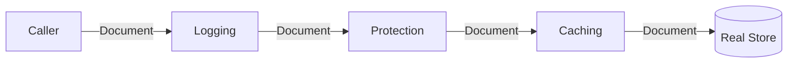

# Proxy — Middle

## 1. Introduction
> Focus: the common proxy variations, a production-shaped Go example, and what each variation costs versus calling the real object directly.

At the middle level you stop thinking "proxy = caching wrapper" and start choosing a *variation* deliberately, wiring proxies together, and handling the concurrency they introduce.

---

## 2. The variations, side by side

| Variation | Controls | Typical trigger | Adds |
|-----------|----------|-----------------|------|
| Virtual | *when* the real object is built | first call | lazy init cost, once-guard |
| Protection | *whether* a call is allowed | every call | auth check |
| Caching | *whether* the real call happens | repeat inputs | memory + invalidation |
| Logging/metrics | nothing; observes | every call | I/O / counter overhead |
| Remote | *where* the call runs | every call | serialization + network |

All share one structural rule: **same interface as the real subject**, so they're interchangeable and composable.

---

## 3. A realistic protection proxy

```go
type Document interface {
    Read(ctx context.Context, id string) (string, error)
    Delete(ctx context.Context, id string) error
}

type Store struct{ /* db handle */ }

func (s *Store) Read(ctx context.Context, id string) (string, error) { /* ... */ return "", nil }
func (s *Store) Delete(ctx context.Context, id string) error          { /* ... */ return nil }

// ProtectedStore gates Delete behind a role check.
type ProtectedStore struct {
    real Document
    auth func(ctx context.Context) Role
}

func (p *ProtectedStore) Read(ctx context.Context, id string) (string, error) {
    return p.real.Read(ctx, id) // reads allowed for everyone
}

func (p *ProtectedStore) Delete(ctx context.Context, id string) error {
    if p.auth(ctx) != RoleAdmin {
        return ErrForbidden // blocked before reaching the real object
    }
    return p.real.Delete(ctx, id)
}
```

The proxy enforces policy in one place. Handlers and business logic stay unaware that authorization happens here.

---

## 4. Concurrency-safe caching proxy

The junior caching proxy had a racy map. The middle version locks:

```go
type CachingStore struct {
    real Document
    mu   sync.RWMutex
    docs map[string]string
}

func (c *CachingStore) Read(ctx context.Context, id string) (string, error) {
    c.mu.RLock()
    if v, ok := c.docs[id]; ok {
        c.mu.RUnlock()
        return v, nil
    }
    c.mu.RUnlock()

    v, err := c.real.Read(ctx, id)
    if err != nil {
        return "", err
    }
    c.mu.Lock()
    c.docs[id] = v
    c.mu.Unlock()
    return v, nil
}

func (c *CachingStore) Delete(ctx context.Context, id string) error {
    if err := c.real.Delete(ctx, id); err != nil {
        return err
    }
    c.mu.Lock()
    delete(c.docs, id) // invalidate on write — the hard part of caching
    c.mu.Unlock()
    return nil
}
```

The trade-off is now explicit: you bought read speed with the cost of **cache invalidation** — every mutating method must purge stale entries.

---

## 5. Composing proxies

Because each proxy implements `Document`, you stack them:

```go
var doc Document = &Store{}
doc = &CachingStore{real: doc, docs: map[string]string{}}
doc = &ProtectedStore{real: doc, auth: roleFromCtx}
doc = &LoggingStore{real: doc} // outermost: logs every call
```

Order matters. Logging outermost sees *all* calls including cache hits; protection before caching means denied calls never populate the cache. Decide the order from the semantics you want, and document it.

---

## 6. Virtual proxy with error handling

`sync.Once` can't return an error, so a fallible lazy init needs care:

```go
type LazyConn struct {
    mu   sync.Mutex
    real *sql.DB
    dsn  string
}

func (l *LazyConn) get() (*sql.DB, error) {
    l.mu.Lock()
    defer l.mu.Unlock()
    if l.real != nil {
        return l.real, nil
    }
    db, err := sql.Open("postgres", l.dsn)
    if err != nil {
        return nil, err // not cached — next call retries
    }
    l.real = db
    return db, nil
}
```

Note the deliberate choice: failure is *not* cached, so a transient connection error can recover on the next call (unlike `sync.OnceValue`, which caches failure permanently).

---

## 7. Trade-offs over the naive approach

| Benefit | Cost |
|---------|------|
| Cross-cutting concern in one place | Extra indirection layer |
| Interchangeable with the real object | Must track interface exactly |
| Composable (stack proxies) | Order-dependent behavior |
| Lazy/cached for performance | Invalidation + concurrency complexity |

If the proxy adds nothing the real object couldn't do simply, it's over-engineering — see `professional.md` for when *not* to introduce one.

---

## 8. Diagram



---

## 9. Best practices
- Keep proxies thin — one responsibility each; stack them for combinations.
- Always make caching proxies concurrency-safe and invalidate on writes.
- Don't cache failures unless you mean to.
- Preserve `context.Context` propagation through every proxy method.

---

## 10. Common middle-level mistakes
- Racy cache map (missing mutex).
- Forgetting to invalidate the cache on `Delete`/`Update`.
- Wrong proxy stacking order (e.g., caching denied results).
- Swallowing errors in the proxy instead of forwarding them.
- Dropping `context` cancellation by not threading `ctx` through.

---

## 11. Summary
Pick the proxy variation by what it controls: creation (virtual), access (protection), repeat work (caching), or observation (logging). In Go they're interchangeable structs satisfying one interface, so they compose into a stack — but the order encodes behavior, and caching brings invalidation and concurrency costs you must own. `senior.md` covers idiomatic refactors, performance, and where the pattern breaks down.
