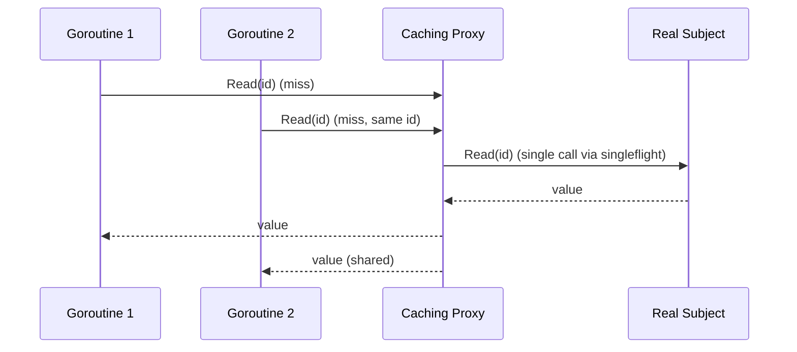

# Proxy — Senior

## 1. Introduction
> Focus: idiomatic Go refactorings of the proxy, its performance and concurrency implications, and the cases where the pattern is the wrong tool.

At senior level the proxy is rarely introduced as "the Proxy pattern." It shows up as middleware, `RoundTripper` wrappers, and interceptors. The skill is recognizing the shape, implementing it idiomatically, and knowing when a closure or the standard library already gives it to you.

---

## 2. The idiomatic Go proxy is often a function

For single-method subjects, an interface-implementing struct is overkill. `http.RoundTripper` is the canonical example — a one-method interface that everyone proxies:

```go
type RoundTripperFunc func(*http.Request) (*http.Response, error)

func (f RoundTripperFunc) RoundTrip(r *http.Request) (*http.Response, error) {
    return f(r)
}

// A caching proxy as a higher-order function.
func WithCache(next http.RoundTripper, c *cache.Cache) http.RoundTripper {
    return RoundTripperFunc(func(r *http.Request) (*http.Response, error) {
        if r.Method == http.MethodGet {
            if resp, ok := c.Get(r.URL.String()); ok {
                return resp, nil
            }
        }
        resp, err := next.RoundTrip(r)
        if err == nil && r.Method == http.MethodGet {
            c.Set(r.URL.String(), resp)
        }
        return resp, err
    })
}
```

This is a proxy: same interface, controls access (cache short-circuit), composable. The func-adapter idiom removes the boilerplate struct.

---

## 3. Refactor: scattered checks → protection proxy

**Before** — every handler repeats the auth check:

```go
func deleteHandler(w http.ResponseWriter, r *http.Request) {
    if role(r) != Admin { http.Error(w, "forbidden", 403); return }
    store.Delete(r.Context(), id(r))
}
func archiveHandler(w http.ResponseWriter, r *http.Request) {
    if role(r) != Admin { http.Error(w, "forbidden", 403); return }
    store.Archive(r.Context(), id(r))
}
```

The check is duplicated and easy to forget on a new endpoint.

**After** — a protection proxy enforces it for the whole interface, so no handler can skip it:

```go
type guarded struct {
    real Store
    role func(context.Context) Role
}
func (g guarded) Delete(ctx context.Context, id string) error {
    if g.role(ctx) != Admin { return ErrForbidden }
    return g.real.Delete(ctx, id)
}
// Archive likewise guarded...
```

Now the policy lives in one type, and adding a method to `Store` forces you to decide its guard explicitly.

---

## 4. Performance implications
- **Indirection cost:** an interface method call through a proxy is an interface dispatch (a couple of ns) plus the proxy's own work. Negligible unless you proxy a hot inner loop millions of times — then consider whether the proxy belongs at a coarser layer.
- **Caching proxies** trade memory and invalidation complexity for latency. Measure hit rate; a proxy with a 5% hit rate adds lookup cost for almost no benefit.
- **Lazy proxies** move cost to first call, creating a cold-start spike (see `optimize.md`). Warm them if first-call latency matters.
- **Lock contention:** an `RWMutex`-guarded cache shared across many goroutines can itself become the bottleneck; shard the cache or use `sync.Map` / a sharded LRU if profiling shows it.

---

## 5. Concurrency implications
- A proxy that adds state (cache, counters, lazy slot) must be safe for concurrent use if the real subject was.
- Lazy init must use `sync.Once` (no error) or a mutex-guarded getter (with error), and must decide whether to cache failures.
- Beware *singleflight* needs: if 100 goroutines miss the cache simultaneously, a naive caching proxy makes 100 backend calls. Wrap the miss path in `golang.org/x/sync/singleflight` to collapse them into one.

```go
v, err, _ := g.sf.Do(id, func() (any, error) { return c.real.Read(ctx, id) })
```

---

## 6. Where the pattern fails
- **As a dumping ground:** a proxy that does caching *and* auth *and* logging *and* retries is a god-object. Split into one proxy per concern and stack them.
- **Leaky abstraction:** if callers must know the proxy exists (e.g., to flush its cache), the transparency is broken — expose explicit cache-control methods or rethink the design.
- **Hidden cost:** a virtual proxy that lazily dials a remote service can turn a cheap-looking method call into a multi-second network operation. Surprising latency is a real failure mode; document it.
- **Interface drift:** when the real subject's interface grows, every proxy must implement the new method or stop compiling. Many proxies → high maintenance. Embedding the interface can auto-forward, but then new methods silently bypass the proxy's control — a subtle bug.

---

## 7. The embedding trap

```go
type loggingStore struct {
    Store // embedded: auto-forwards all methods
}
func (l loggingStore) Delete(ctx context.Context, id string) error {
    log.Println("delete", id)
    return l.Store.Delete(ctx, id)
}
```

Embedding saves boilerplate, but if `Store` gains a `Purge` method, `loggingStore` forwards it **unlogged and ungated** — the proxy's control silently doesn't apply. For protection proxies this is a security hole. Prefer explicit forwarding when the proxy enforces policy; reserve embedding for pure observation where silent pass-through is acceptable.

---

## 8. Diagram: singleflight caching proxy



---

## 9. Best practices
- Use the func-adapter idiom for single-method subjects.
- One concern per proxy; compose by stacking.
- Explicit forwarding for policy-enforcing proxies; embedding only for pure observation.
- Add singleflight to caching proxies that face concurrent misses.
- Document any latency a virtual/remote proxy hides.

---

## 10. Summary
Idiomatic Go proxies are often func-adapters (`RoundTripperFunc`-style) and appear as middleware and interceptors. Keep each proxy single-purpose, forward explicitly when enforcing policy (embedding can silently bypass control), and treat caching proxies' invalidation, contention, and thundering-herd behavior as first-class concerns. The pattern fails when it becomes a god-object, leaks its presence, or hides surprising cost. `professional.md` covers when to introduce one at the team level and how to review for these failure modes.
