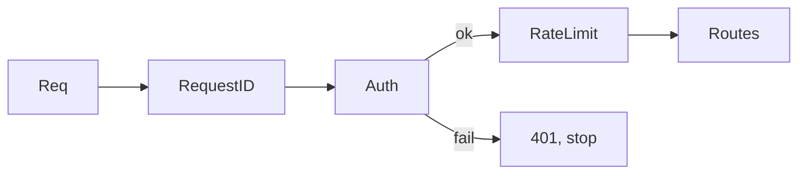

# Chain of Responsibility — Middle

## 1. Introduction
> Focus: the common CoR variations, a production-shaped middleware example, and the trade-offs versus a single big handler with `if/else`.

At middle level you choose between the object chain and the function chain, decide each handler's "claim vs forward" policy deliberately, and handle ordering, context, and early termination correctly.

---

## 2. Variations

| Variation | Each handler... | Terminal behavior |
|-----------|-----------------|-------------------|
| **Pure CoR** | handles and stops, or forwards | first claimant wins |
| **Pipeline** | always does work, then forwards | all run unless one short-circuits |
| **Filter chain** | accepts/rejects, then forwards | rejection short-circuits |
| **Broadcast** (not strict CoR) | all handlers see it | no short-circuit |

HTTP middleware is the *pipeline* variation: every link runs (logging, metrics) and any link may short-circuit (auth failure).

---

## 3. Realistic middleware chain

```go
type Middleware func(http.Handler) http.Handler

func RequestID(next http.Handler) http.Handler {
    return http.HandlerFunc(func(w http.ResponseWriter, r *http.Request) {
        ctx := context.WithValue(r.Context(), ridKey, newID())
        next.ServeHTTP(w, r.WithContext(ctx)) // enrich, then forward
    })
}

func Auth(next http.Handler) http.Handler {
    return http.HandlerFunc(func(w http.ResponseWriter, r *http.Request) {
        if !valid(r) {
            http.Error(w, "unauthorized", http.StatusUnauthorized)
            return // short-circuit: next never runs
        }
        next.ServeHTTP(w, r)
    })
}

func Chain(h http.Handler, mw ...Middleware) http.Handler {
    for i := len(mw) - 1; i >= 0; i-- {
        h = mw[i](h)
    }
    return h
}

handler := Chain(routes, RequestID, Auth, RateLimit)
```

Order: `RequestID → Auth → RateLimit → routes`. The loop wraps from the inside out so the first listed runs first.

---

## 4. Claim-vs-forward policy

Each handler must make its policy explicit:

```go
func (v LengthValidator) Handle(req *Req) error {
    if len(req.Body) > v.max {
        return ErrTooLong // claim: reject, stop chain
    }
    return v.next.Handle(req) // forward: not my concern
}
```

The bug to avoid: a handler that neither claims nor forwards (forgets to call `next`), silently dropping the request.

---

## 5. Building chains dynamically

Sometimes the chain is data-driven (configured per route, per tenant):

```go
func buildChain(handlers []Handler) Handler {
    for i := 0; i < len(handlers)-1; i++ {
        handlers[i].SetNext(handlers[i+1])
    }
    return handlers[0]
}
```

This lets you assemble different chains from config without changing handler code — a key CoR benefit over a hardcoded `if/else` ladder.

---

## 6. Trade-offs vs a single handler

| CoR | Single big handler |
|-----|--------------------|
| Each concern isolated, testable alone | All logic in one function |
| Reorder/insert/remove links cheaply | Edit the monolith each time |
| Runtime-configurable chains | Hardcoded order |
| Indirection; flow harder to trace | Linear, easy to read |

Use CoR when the set or order of handlers varies, or when concerns deserve isolation. For a fixed, short sequence, a plain function with sequential checks is clearer — don't add a chain for two `if`s.

---

## 7. Context and cancellation
Each link must forward `context.Context` (and respect cancellation):

```go
func Timeout(d time.Duration) Middleware {
    return func(next http.Handler) http.Handler {
        return http.HandlerFunc(func(w http.ResponseWriter, r *http.Request) {
            ctx, cancel := context.WithTimeout(r.Context(), d)
            defer cancel()
            next.ServeHTTP(w, r.WithContext(ctx))
        })
    }
}
```

Dropping `ctx` (passing `context.Background()`) breaks the whole chain's cancellation.

---

## 8. Diagram



---

## 9. Best practices
- One responsibility per handler.
- Make claim-vs-forward explicit; never forget `next`.
- Forward `context` unchanged (or derived), never dropped.
- Define terminal behavior for an unclaimed request.
- Keep the wiring (order) in one obvious place.

---

## 10. Common middle-level mistakes
- Forgetting to call `next` → request silently dropped.
- Wrong order (auth after the protected work).
- No terminal/default handler for unclaimed requests.
- Dropping `context`, killing cancellation.
- Using CoR for a fixed two-step check (over-engineering).

---

## 11. Summary
CoR comes in pure, pipeline, and filter variations; Go's middleware is the pipeline form where every link runs and any can short-circuit. Make each handler's claim-vs-forward policy explicit, forward context faithfully, and keep wiring centralized. Choose CoR when handler set/order varies or concerns deserve isolation — not for a fixed pair of checks. `senior.md` covers idiomatic refactors, performance, and where the chain becomes a liability.
