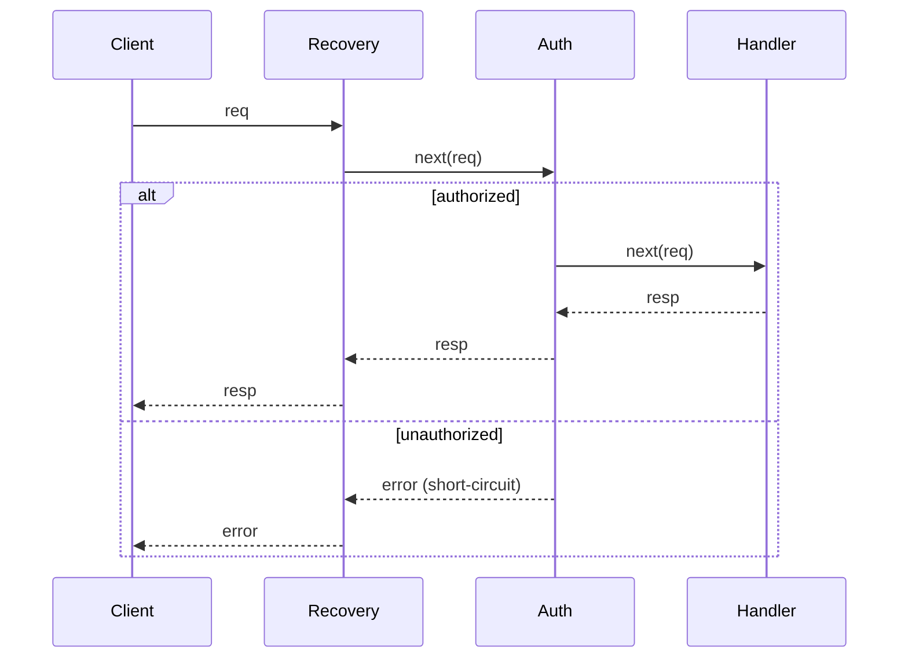

# Chain of Responsibility — Senior

## 1. Introduction
> Focus: idiomatic Go refactorings of CoR, its performance and concurrency implications, and the cases where a chain is the wrong structure.

At senior level CoR is the middleware mental model applied beyond HTTP — to message processing, gRPC interceptors, and validation pipelines. The skill is building reusable, observable chains and recognizing when a chain has become an untraceable maze.

---

## 2. The function-chain is the idiomatic refactor

The object form (handler structs with `SetNext`) is rare in Go. Refactor it to a slice of middleware:

**Before** — linked structs:
```go
lead := &TeamLead{}; mgr := &Manager{}; dir := &Director{}
lead.SetNext(mgr); mgr.SetNext(dir)
```

**After** — composable functions with a terminal:
```go
type Approver func(Request) (Decision, bool) // (decision, claimed)

func chain(approvers ...Approver) Approver {
    return func(r Request) (Decision, bool) {
        for _, a := range approvers {
            if d, ok := a(r); ok {
                return d, true // first claimant wins
            }
        }
        return Decision{}, false // unclaimed
    }
}
```

The slice form makes order explicit, supports dynamic assembly, and avoids `SetNext` mutation hazards.

---

## 3. gRPC and the interceptor chain
gRPC's `UnaryServerInterceptor` is CoR: each interceptor calls `handler(ctx, req)` to continue or returns early. `grpc.ChainUnaryInterceptor(a, b, c)` builds the chain. Recognizing this lets you write auth/logging/recovery interceptors as chain links rather than ad-hoc wrappers.

```go
func Recovery(ctx context.Context, req any, info *grpc.UnaryServerInfo, next grpc.UnaryHandler) (resp any, err error) {
    defer func() {
        if r := recover(); r != nil {
            err = status.Errorf(codes.Internal, "panic: %v", r)
        }
    }()
    return next(ctx, req) // forward along the chain
}
```

---

## 4. Performance implications
- **Per-link cost:** each link is a function call (and an interface dispatch in the object form). For an HTTP request handling milliseconds of work, a 6-link chain's overhead is nanoseconds — irrelevant.
- **Hot inner loops:** a chain invoked millions of times per second (e.g., per-packet) pays real indirection cost; flatten it or move the chain to a coarser boundary.
- **Allocation:** building the chain once at startup costs nothing per request. Re-building it per request (a common bug) allocates closures on every call — build once, reuse.

```go
// BAD: rebuilds the chain every request
func handler(w, r) { Chain(routes, mw...).ServeHTTP(w, r) }
// GOOD: build once
var h = Chain(routes, mw...)
```

---

## 5. Concurrency implications
- A chain is usually built once and invoked concurrently. Handlers MUST be stateless or internally synchronized.
- Per-request state belongs in the request/`context`, not in the handler struct. A handler that stashes per-request data in a field is a data race under concurrent use.
- Short-circuiting must be goroutine-safe: writing the response and returning is fine; mutating shared chain state is not.

---

## 6. Observability of a chain
A chain's flow is invisible at runtime, which makes failures hard to trace. Senior practice:
- Give each link a name and emit a span/log on entry/exit so traces show the path.
- On short-circuit, log *which* link stopped the request and why (a silent 401 is hard to debug).
- Expose per-link latency to find the slow middleware.

---

## 7. Where the pattern fails
- **Untraceable mazes:** a long, dynamically-assembled chain where no one can predict the path. Cap length; document the order; prefer static chains where possible.
- **Hidden ordering dependencies:** middleware B assumes A ran first (e.g., auth assumes request-ID exists). These coupling assumptions are fragile — document required ordering or merge tightly-coupled links.
- **Swallowed requests:** a link that forgets to forward drops the request silently. A linter or a test that asserts "unclaimed → terminal handler runs" catches this.
- **CoR for a fixed sequence:** if the order never varies and is short, a plain function is clearer. The chain's flexibility is wasted overhead.

---

## 8. Diagram: interceptor chain with short-circuit



---

## 9. Best practices
- Prefer the function/slice chain over `SetNext` structs.
- Build the chain once; never per request.
- Keep handlers stateless; per-request data in `context`.
- Name links and emit spans for traceability.
- Document required ordering between coupled links.

---

## 10. Summary
The idiomatic Go CoR is a slice of middleware/interceptors built once and invoked concurrently; gRPC and `net/http` both realize it. Keep links stateless, build the chain at startup (not per request), and make the flow observable with named spans and short-circuit logging. The pattern fails as an untraceable maze, when links carry hidden ordering dependencies, or when a request is silently swallowed — and it's overkill for a fixed short sequence. `professional.md` covers team-level adoption and review.
