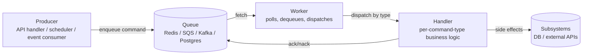

# Command — Senior

## 1. Mental model for senior engineers

At junior level, Command is "wrap an action in a value". At middle level, it's the spine of job queues, CQRS handlers, and reversible operations. At senior level, the question changes: **when is Command an architectural decision rather than a syntactic one?**

The honest answer in Go: most of the time, it is not. A `func(ctx context.Context) error` is already Command. Closures already capture parameters. Function values already round-trip through channels, slices, and maps. The pattern only becomes architecturally interesting when *some property that a function value cannot provide* drives the design — usually one of these:

1. **Serialization.** A closure cannot be marshalled to JSON, written to Redis, and re-executed on another host. A struct can.
2. **Inspection.** A worker logging `cmd=send-email user=u123 attempt=3` needs to read fields off the command. A closure is opaque; you cannot ask it its name.
3. **Dispatch by type.** A CQRS bus routes `CreateOrder` to one handler and `CancelOrder` to another. The struct type *is* the routing key.
4. **Lifecycle hooks.** `cobra.Command` runs `PreRun`, `Run`, `PostRun` per invocation. A bare function has no hooks.
5. **Reversibility.** A migration step or saga step is a `(Forward, Compensate)` pair, not one function.
6. **Idempotency metadata.** A retried command carries an idempotency key, an attempt counter, a correlation ID. A closure has nowhere to put them.

Senior judgement is recognising which of these are actually in play. A worker pool that runs anonymous local work — `pool.Submit(func(ctx) error { ... })` — needs none of the above and gains nothing from a struct. A durable, retryable, cross-process job pipeline needs all of them and a `func` is structurally incapable.

The pattern also blurs with Strategy. Strategy is "pick *how* to do something" (`SortAlgorithm`, `Compressor`, `RetryPolicy`). Command is "describe *what* to do, deferred". In Go both are usually a function value, which is why people conflate them. The discriminator is who decides the parameters: a Strategy is *given* the data at call time (`compressor.Compress(data)`); a Command *carries* the data inside it (`cmd.Run(ctx)` already knows what to compress). When the same function value plays both roles depending on caller, you are working with a hybrid, and the right name is whichever clarifies the call site.

---

## 2. Architecture: producer → queue → worker → handler

A production Command-based system is rarely one struct and one invoker. It is a pipeline with four roles:



The producer never executes the command. The worker never knows the business logic. The handler never knows the transport. Each role has one responsibility:

- **Producer** validates the request, constructs a command struct, enqueues it. The producer's job ends the moment the queue acknowledges receipt.
- **Queue** durably stores commands, provides at-least-once delivery, supports retries with backoff, and exposes a dead-letter destination for poison messages.
- **Worker** is the runtime: it polls the queue, decodes the envelope, applies per-type timeouts and concurrency limits, and hands the decoded command to the right handler. The worker itself is generic.
- **Handler** is the business code. One handler per command type. Pure in its inputs (the command struct plus injected dependencies), explicit in its side effects.

Two dispatch styles dominate:

| Style | Routing key | Pros | Cons |
|-------|-------------|------|------|
| **Dispatch by type** | `reflect.Type` or `cmd.Name()` | Type-safe, statically discoverable, refactor-friendly | Type name leaks into wire format; renames are breaking changes |
| **Dispatch by handler ID** | Opaque string registered at startup | Decouples wire identifier from Go type | Easy to misspell, hard to grep, no compiler help |

Most Go libraries go with type-driven dispatch and pay the rename tax in versioning (see §9). The dispatch table itself is a `map[string]Handler` or `map[reflect.Type]Handler`; the senior decision is whether that map is global (registry side-effect at `init()`) or constructor-injected. Global registries make package initialisation order matter and break tests that need isolated dispatchers; injected registries are more verbose but make the wiring explicit.

The four-role pipeline is what `asynq`, `river`, `machinery`, and most in-house Go job systems look like under the surface. Once you can see them all as the same shape, library-shopping becomes a matter of trade-offs rather than evaluation.

---

## 3. Real Go libraries decomposed

### 3.1 `asynq` — task struct, payload, queue selection

`hibiken/asynq` is a Redis-backed task queue. Its Command is `asynq.Task`:

```go
type Task struct {
    typename string
    payload  []byte
    opts     []Option
}

func NewTask(typename string, payload []byte, opts ...Option) *Task
```

The producer constructs a `Task`, the client serialises it, Redis stores it, the server (worker) dequeues it and dispatches by `typename` through `asynq.ServeMux`:

```go
mux := asynq.NewServeMux()
mux.HandleFunc("email:send", handleSendEmail)
mux.HandleFunc("image:resize", handleResizeImage)

func handleSendEmail(ctx context.Context, t *asynq.Task) error {
    var p SendEmailPayload
    if err := json.Unmarshal(t.Payload(), &p); err != nil {
        return fmt.Errorf("%w: %v", asynq.SkipRetry, err) // poison message
    }
    return smtp.SendContext(ctx, p.To, p.Subject, p.Body)
}
```

Per-task options carry the Command metadata the function form cannot:

```go
client.Enqueue(task,
    asynq.Queue("critical"),
    asynq.MaxRetry(5),
    asynq.Timeout(30*time.Second),
    asynq.Deadline(time.Now().Add(time.Hour)),
    asynq.Unique(time.Hour),     // idempotency window
    asynq.ProcessAt(scheduledAt),
)
```

What to take away: the *envelope* (type + payload + options) is the Command. The *handler* is registered separately and looked up by name. The split is what enables retries, dead-lettering, scheduling, and observability without each handler reimplementing them.

### 3.2 `river` — typed jobs via generics

`riverqueue/river` (Postgres-backed) uses Go 1.18 generics to make the same pattern type-safe at compile time:

```go
type SendEmailArgs struct {
    To      string `json:"to"`
    Subject string `json:"subject"`
    Body    string `json:"body"`
}

func (SendEmailArgs) Kind() string { return "send_email" }

type SendEmailWorker struct {
    river.WorkerDefaults[SendEmailArgs]
    smtp SMTPClient
}

func (w *SendEmailWorker) Work(ctx context.Context, job *river.Job[SendEmailArgs]) error {
    return w.smtp.Send(ctx, job.Args.To, job.Args.Subject, job.Args.Body)
}

workers := river.NewWorkers()
river.AddWorker(workers, &SendEmailWorker{smtp: smtpClient})

client.Insert(ctx, SendEmailArgs{To: "a@b.c", Subject: "hi", Body: "hello"}, nil)
```

`river.Job[SendEmailArgs]` is parameterised by the args type. The worker registration uses generic constraints so the compiler enforces that `SendEmailWorker.Work` receives the matching args. `Kind()` is the routing key.

Senior takeaway: generics turn a `map[string]func(json.RawMessage) error` into a typed registration. The runtime still dispatches by string (the wire format demands it), but the Go-side glue is statically checked. No `reflect.TypeOf`, no `any` casting in handler code. This is the post-Go-1.18 default for new task systems.

### 3.3 `machinery` — signature struct, broker abstraction

`RichardKnop/machinery` predates the generics era and models a command as a `Signature`:

```go
type Signature struct {
    UUID           string
    Name           string
    RoutingKey     string
    Args           []Arg
    Headers        Headers
    RetryCount     int
    RetryTimeout   int
    ETA            *time.Time
    GroupUUID      string
    ChordCallback  *Signature
    OnSuccess      []*Signature
    OnError        []*Signature
}
```

The `Signature` carries everything the runtime needs: identifier, name (routing key), arguments, retry policy, scheduling time, chained continuations on success or failure. The broker abstraction lets the same signatures travel over AMQP, Redis, or SQS. Handlers are registered against names:

```go
server.RegisterTask("send_email", sendEmail)
```

`machinery`'s value at senior level is its breadth: it shows what a fully featured Command envelope looks like once continuations (`OnSuccess`), groups (fan-out), and chords (fan-out then aggregate) are first-class. Most teams do not need that complexity. Recognising when you do is the senior call — typically when the workflow has more than three branches or needs cross-task aggregation.

### 3.4 `cobra` — Command with lifecycle hooks

`spf13/cobra` is the canonical Command-pattern application of Go in the wild:

```go
type Command struct {
    Use     string
    Short   string
    Long    string
    PreRunE  func(cmd *Command, args []string) error
    RunE     func(cmd *Command, args []string) error
    PostRunE func(cmd *Command, args []string) error
    PersistentPreRunE  func(cmd *Command, args []string) error
    PersistentPostRunE func(cmd *Command, args []string) error
}
```

Each Cobra `Command` is a node in a tree. The lifecycle hooks (`PersistentPreRun` → `PreRun` → `Run` → `PostRun` → `PersistentPostRun`) run in defined order and traverse the tree (persistent hooks from the root down). This is more than the GoF Command — it is Command plus Composite plus Template Method — but the spine is still Command: encapsulate intent as a value with `Run`.

Senior takeaway: when a Command form needs *lifecycle*, plain `func(ctx) error` is insufficient and a struct earns its weight. CLI frameworks, ETL step runners, and test harnesses all hit this.

### 3.5 `os/exec.Cmd` — Command for processes

`exec.Cmd` is Command for OS processes:

```go
cmd := exec.CommandContext(ctx, "ffmpeg", "-i", in, out)
cmd.Stdout = &stdout
cmd.Stderr = &stderr
cmd.Env = append(os.Environ(), "LANG=C")

if err := cmd.Start(); err != nil { return err }
if err := cmd.Wait(); err != nil { return err }
```

`Start` and `Wait` are split because the command's lifecycle outlives a single function call — you may want to read its output while it runs, kill it via `cmd.Process.Kill()`, or attach to its stdin. `Run` is the convenience method `Start` + `Wait`. The struct holds enough state (`Process`, `ProcessState`, `Stdout`, `Stderr`, `Env`, `Dir`) that no closure-based design could replace it.

This is Command where the *receiver* is the operating system. The struct fields are not parameters of a function call; they are configuration of an external process that this Go program merely starts. The shape generalises to anything that wraps a long-lived external resource — Postgres `*sql.Tx`, NATS `Subscription`, gRPC `ClientStream`. Once a Command needs to expose mid-execution observation or control, it must be a struct.

---

## 4. Generics-based Command (Go 1.18+)

Pre-1.18 command buses paid for type safety with reflection:

```go
type Bus struct {
    handlers map[reflect.Type]func(context.Context, any) error
}

func (b *Bus) Send(ctx context.Context, cmd any) error {
    h, ok := b.handlers[reflect.TypeOf(cmd)]
    if !ok { return fmt.Errorf("no handler for %T", cmd) }
    return h(ctx, cmd) // handler must type-assert
}
```

The cost: every handler started with a type assertion, every register-time mistake produced a runtime error, and refactoring across the bus boundary was a grep job. Generics let us do better:

```go
type Command interface {
    CommandName() string
}

type Handler[T Command] func(ctx context.Context, cmd T) error

type Bus struct {
    handlers map[string]func(context.Context, json.RawMessage) error
}

func Register[T Command](b *Bus, h Handler[T]) {
    var zero T
    name := zero.CommandName()
    b.handlers[name] = func(ctx context.Context, raw json.RawMessage) error {
        var cmd T
        if err := json.Unmarshal(raw, &cmd); err != nil {
            return fmt.Errorf("decode %s: %w", name, err)
        }
        return h(ctx, cmd)
    }
}

func Send[T Command](ctx context.Context, b *Bus, cmd T) error {
    h, ok := b.handlers[cmd.CommandName()]
    if !ok { return fmt.Errorf("no handler for %s", cmd.CommandName()) }
    raw, err := json.Marshal(cmd)
    if err != nil { return err }
    return h(ctx, raw)
}
```

Usage:

```go
type CreateOrder struct {
    UserID string `json:"user_id"`
    Total  int64  `json:"total"`
}

func (CreateOrder) CommandName() string { return "create_order" }

Register[CreateOrder](bus, func(ctx context.Context, cmd CreateOrder) error {
    return orders.Create(ctx, cmd.UserID, cmd.Total)
})

Send(ctx, bus, CreateOrder{UserID: "u1", Total: 9999})
```

Senior trade-offs to be aware of:

- **Erasure inside the map.** The bus still stores `func(ctx, json.RawMessage) error` because Go generics are not reified — you cannot key a map by a type parameter. The boundary at `Register[T]` and `Send[T]` is where the type safety lives.
- **Marshalling on the in-process path.** The JSON round-trip is the price of treating the bus as if it might one day be cross-process. If the bus is in-process only, you can skip serialisation with a separate fast-path map keyed by `reflect.Type` and `any` values; this is what `mediatr`-style in-process buses do.
- **No partial application.** `Send[T]` requires `T` to satisfy `Command`, so commands without `CommandName()` cannot be sent. That is the point.

The generics design is the canonical shape for new Go services. It also dovetails with `river`'s `Worker[Args]` and with typed event buses (Watermill's typed handlers).

---

## 5. Reversible commands and sagas

The saga pattern is what you get when you put reversibility on every step of a multi-step workflow and decide explicitly what happens when one fails. Each step is a Command with a compensate counterpart:

```go
type Step struct {
    Name       string
    Forward    func(ctx context.Context, state *SagaState) error
    Compensate func(ctx context.Context, state *SagaState) error
}

type Saga struct {
    Name  string
    Steps []Step
}

type SagaState struct {
    ID   string
    Data map[string]any
    mu   sync.Mutex
}
```

An in-memory executor:

```go
func (s *Saga) Execute(ctx context.Context, state *SagaState) error {
    var completed []Step
    for _, step := range s.Steps {
        if err := step.Forward(ctx, state); err != nil {
            return s.compensate(ctx, state, completed, fmt.Errorf("step %s: %w", step.Name, err))
        }
        completed = append(completed, step)
    }
    return nil
}

func (s *Saga) compensate(ctx context.Context, state *SagaState, completed []Step, cause error) error {
    var compErrs []error
    for i := len(completed) - 1; i >= 0; i-- {
        if err := completed[i].Compensate(ctx, state); err != nil {
            compErrs = append(compErrs, fmt.Errorf("compensate %s: %w", completed[i].Name, err))
        }
    }
    if len(compErrs) > 0 {
        return fmt.Errorf("saga %s failed (%w); compensation also failed: %w",
            s.Name, cause, errors.Join(compErrs...))
    }
    return cause
}
```

What this code refuses to hide is the failure mode that defines real-world sagas: **compensation can also fail**. Two distinct outcomes:

| Forward result | Compensate result | State |
|----------------|-------------------|-------|
| All ok | n/a | Success |
| One failed | All compensations ok | Cleanly reverted |
| One failed | Some compensation failed | **Inconsistent** — needs human intervention |

The third row is why production sagas log compensation failures to a separate channel (PagerDuty, dead-letter queue) and persist saga state in a durable store. An in-memory saga is acceptable for orchestrating local transactions; for cross-service work (charge card, ship order, send confirmation), the saga state must outlive the process. Libraries like `temporal-io/sdk-go` and `cadence-workflow/cadence-go-client` exist because rolling your own durable saga executor is a multi-month project.

A few senior rules for compensations:

- Compensations must be idempotent. If the saga executor retries, compensations may run twice.
- Compensations may not assume the forward step completed; sometimes they run on partial state.
- Compensations are *business inverses*, not just technical undoes. The compensation of "charge card" is "refund card", not "delete the charge row".
- The order of compensation is reverse of forward. Always. No exceptions.

---

## 6. Idempotency

Commands often retry. A worker that crashes mid-execution will be redelivered the same command. A producer that times out waiting for an ack may resend. Without idempotency, retries multiply side effects: two charges, two emails, two inventory decrements.

Idempotency belongs on the command struct itself:

```go
type ChargeCard struct {
    IdempotencyKey string `json:"idempotency_key"`
    CustomerID     string `json:"customer_id"`
    AmountCents    int64  `json:"amount_cents"`
}
```

The key is generated by the producer (UUID, request ID, or a deterministic hash of the input), and is carried unchanged through every retry. There are two places to enforce dedup:

| Layer | Where it lives | Pros | Cons |
|-------|----------------|------|------|
| **At the queue** | `asynq.Unique(window)`, SQS message deduplication | One config flag, no handler changes | Window-bound; misses retries past the window |
| **At the handler** | Insert into `idempotency_keys` table with unique constraint, check before performing the side effect | Permanent, observable, transactional | Schema work, requires storage |

The queue-level form prevents duplicate *enqueues* within a small window. The handler-level form prevents duplicate *effects* across any timeframe and survives queue replays, dead-letter requeues, and operator-triggered redelivery. Production systems use both; the queue-level form catches storms, the handler-level form catches everything else.

The canonical handler-level pattern:

```go
func handleCharge(ctx context.Context, cmd ChargeCard) error {
    tx, err := db.BeginTx(ctx, nil)
    if err != nil { return err }
    defer tx.Rollback()

    _, err = tx.ExecContext(ctx,
        `INSERT INTO idempotency_keys (key, command, created_at)
         VALUES ($1, $2, now())`,
        cmd.IdempotencyKey, "charge_card")
    if err != nil {
        if isUniqueViolation(err) {
            return nil // already processed; return success
        }
        return fmt.Errorf("insert idempotency key: %w", err)
    }

    if err := stripe.Charge(ctx, cmd.CustomerID, cmd.AmountCents); err != nil {
        return fmt.Errorf("charge: %w", err)
    }
    return tx.Commit()
}
```

The unique-constraint insert is the gate. If two workers run this concurrently for the same key, only one wins the insert; the loser sees the unique violation and returns success without retrying the side effect. This pattern works whether the side effect is a database write, a Stripe call, or an email send — the discipline is the same: claim the key first, do the work second, commit third.

Edge cases: external API calls (Stripe) accept their own `Idempotency-Key` header — pass `cmd.IdempotencyKey` through. Two layers of idempotency (yours and theirs) compose safely. The danger is the in-between state where you claimed the local key but Stripe is uncertain whether the charge went through. The senior fix is to claim *after* the external call confirms, but that opens a duplicate window — there is no perfect answer, only documented choices.

---

## 7. Observability

A Command-driven system without observability is a Command-driven system with random behaviour. The minimum surface area is three things: a name, a span, and a counter.

### 7.1 Naming

Every command type has a stable name. Use it in logs, metrics, traces, and the wire format. The name must be:

- Stable across renames (you carry the old name forever or run a migration).
- Lowercase, snake_case or dot.notation, never the Go type name unless you accept that renames are breaking changes.
- Short enough to be a metric label without exploding cardinality.

```go
const (
    CmdChargeCard    = "billing.charge_card"
    CmdRefundCharge  = "billing.refund_charge"
    CmdSendReceipt   = "billing.send_receipt"
)
```

### 7.2 Span per command

The dispatcher is the place to start a span. Handlers should never have to remember to do this:

```go
func (b *Bus) dispatch(ctx context.Context, name string, raw json.RawMessage) error {
    ctx, span := b.tracer.Start(ctx, "cmd."+name,
        trace.WithSpanKind(trace.SpanKindConsumer),
        trace.WithAttributes(
            attribute.String("command.name", name),
            attribute.Int("command.payload_bytes", len(raw)),
        ))
    defer span.End()

    h, ok := b.handlers[name]
    if !ok {
        span.SetStatus(codes.Error, "unknown command")
        return fmt.Errorf("unknown command: %s", name)
    }
    err := h(ctx, raw)
    if err != nil {
        span.RecordError(err)
        span.SetStatus(codes.Error, err.Error())
    }
    return err
}
```

A correlation ID belongs in `context.Context` from the producer onward. The dispatcher attaches it to the span as an attribute; the handler logs it on every emitted record. Lost correlation IDs are the single biggest cause of "we can't reproduce this in production".

### 7.3 Metrics

Three metrics cover 95% of operational needs:

| Metric | Type | Labels | Why |
|--------|------|--------|-----|
| `commands_executed_total` | counter | `name`, `status` (ok/err) | Throughput and error rate per type |
| `command_duration_seconds` | histogram | `name` | Latency percentiles |
| `commands_in_flight` | gauge | `name` | Detect stuck handlers, sizing |

Cardinality: `name` is bounded by your command catalogue (tens to low hundreds). Do not put `customer_id` or `idempotency_key` in labels; those go in span attributes or logs.

### 7.4 Structured logs

Logs from a handler should be greppable as `cmd=name correlation_id=...`:

```go
log := slog.With(
    slog.String("cmd", cmd.CommandName()),
    slog.String("correlation_id", correlationFromContext(ctx)),
    slog.String("idempotency_key", cmd.IdempotencyKey),
)
log.InfoContext(ctx, "handling command")
```

`slog.With(...)` returns a child logger that carries those fields on every subsequent record. This is the senior alternative to manually re-adding the same fields to every log call.

### 7.5 Dead-letter logging

When a command exhausts retries and lands in the dead-letter queue, the DLQ writer emits a single, structured record that includes the full command payload, the last error, all attempt timestamps, and the trace ID. This is what a human will read at 3am. Make it readable.

---

## 8. Testing commands

Commands as plain data structs are trivially testable:

```go
func TestChargeCard_Validate(t *testing.T) {
    tests := []struct {
        name string
        cmd  ChargeCard
        want error
    }{
        {"ok", ChargeCard{CustomerID: "c1", AmountCents: 100}, nil},
        {"no customer", ChargeCard{AmountCents: 100}, ErrMissingCustomer},
        {"zero amount", ChargeCard{CustomerID: "c1"}, ErrInvalidAmount},
        {"negative", ChargeCard{CustomerID: "c1", AmountCents: -1}, ErrInvalidAmount},
    }
    for _, tt := range tests {
        t.Run(tt.name, func(t *testing.T) {
            got := tt.cmd.Validate()
            if !errors.Is(got, tt.want) {
                t.Fatalf("got %v, want %v", got, tt.want)
            }
        })
    }
}
```

Handlers are tested with the dependencies they were constructed with, swapped for fakes. The struct shape makes the test inputs explicit; no closures hiding captured state.

The harder thing to test is the dispatcher itself — the part that routes a wire-format command to the right handler. A table-driven dispatcher test:

```go
func TestBus_Dispatch(t *testing.T) {
    var called string
    bus := NewBus()
    Register[CreateOrder](bus, func(ctx context.Context, c CreateOrder) error {
        called = "create_order:" + c.UserID
        return nil
    })
    Register[CancelOrder](bus, func(ctx context.Context, c CancelOrder) error {
        called = "cancel_order:" + c.OrderID
        return nil
    })

    tests := []struct {
        name       string
        send       func() error
        wantCalled string
        wantErr    error
    }{
        {"create", func() error { return Send(ctx, bus, CreateOrder{UserID: "u1"}) }, "create_order:u1", nil},
        {"cancel", func() error { return Send(ctx, bus, CancelOrder{OrderID: "o2"}) }, "cancel_order:o2", nil},
        {"unknown", func() error { return bus.dispatch(ctx, "ghost", nil) }, "", ErrUnknownCommand},
    }
    for _, tt := range tests {
        t.Run(tt.name, func(t *testing.T) {
            called = ""
            err := tt.send()
            if !errors.Is(err, tt.wantErr) { t.Fatalf("err: got %v want %v", err, tt.wantErr) }
            if called != tt.wantCalled { t.Fatalf("called: got %q want %q", called, tt.wantCalled) }
        })
    }
}
```

A few senior testing rules:

- Test the handler in isolation with fakes for subsystems, *not* through the dispatcher. The dispatcher gets its own tests.
- Test the dispatcher with stub handlers, *not* real ones. The dispatcher's job is routing; a real handler dragged into the test couples the two.
- Test the wire format separately: marshal a known struct, assert the JSON, unmarshal, assert equality. This is the test that catches versioning bugs before deploy (see §9).
- For sagas, write tests where the *Nth* step fails and assert that exactly N-1 compensations ran in reverse order. The off-by-one in compensation indexing is the single most common saga bug.

---

## 9. Versioning serialized commands

The moment a command leaves the process — written to Redis, Postgres, Kafka, or any queue with non-trivial latency — it is a wire format that can be read by a different version of your code than wrote it. Versioning is mandatory; the question is which discipline you use.

### 9.1 Forward and backward compatibility with JSON

Default to additive change. New fields are optional with sensible zero values. Old fields are kept and marked deprecated. Both directions must hold:

- **Backward compatibility**: a new producer writes a command with new fields; an old consumer must still be able to decode it (ignoring the new fields).
- **Forward compatibility**: an old producer writes a command without new fields; a new consumer must handle the missing fields with a documented default.

```go
type SendEmail struct {
    To      string `json:"to"`
    Subject string `json:"subject"`
    Body    string `json:"body"`
    // Added in v1.5; defaults to text/plain for old messages.
    ContentType string `json:"content_type,omitempty"`
    // Added in v1.6; defaults to nil for old messages.
    Headers map[string]string `json:"headers,omitempty"`
}

func (c SendEmail) Validated() SendEmail {
    if c.ContentType == "" { c.ContentType = "text/plain" }
    return c
}
```

The `Validated()` (or `WithDefaults()`) helper centralises the "old format → new format" upgrade so handlers never branch on absent fields.

### 9.2 Breaking changes need versioned command names

When a change cannot be additive — renaming a field, changing a type, splitting one command into two — bump the command name:

```go
const (
    CmdSendEmail   = "send_email"     // legacy, deprecated
    CmdSendEmailV2 = "send_email.v2"  // new shape
)
```

Both handlers stay registered until the queue has drained of v1 messages and you have shipped a producer that no longer writes them. Then you delete the v1 handler in a follow-up release.

### 9.3 Handler migration patterns

Three strategies in order of preference:

1. **In-place additive upgrade.** The default. New fields, optional, zero-defaulted. No version bump.
2. **Side-by-side versions.** Two command names, two handlers, drain v1 over time.
3. **Schema migration on read.** The handler accepts either shape, decides which by a sentinel field. Avoid this; it pushes the version branch into every handler and the branches accumulate.

### 9.4 Dead-letter queue as a versioning backstop

When a handler genuinely cannot decode an incoming command — corrupt payload, removed command type, version skew across a deployment — the worker should not crash and should not retry forever. The right behaviour is "log, increment a metric, push to dead-letter, ack". The DLQ then becomes the failure-mode surface for the versioning system:

- An old worker hitting a brand-new command type writes `unknown_command` to the DLQ.
- A new worker hitting an undeployable legacy payload writes `decode_failure` to the DLQ.
- Operations replays the DLQ once all workers are on the new version.

Without a DLQ, version skew at deploy time turns into a pager event. With a DLQ, it turns into a metric chart.

---

## 10. Trade-offs at scale

The function-form vs struct-form decision recurs at the architectural level. The senior framing:

| Concern | Function form | Struct form (Command bus) |
|---------|---------------|--------------------------|
| Local, in-process work | Default | Overengineered |
| Cross-process delivery | Impossible (no serialisation) | Required |
| Per-type retries, timeouts, metrics | Manual on every call site | Centralised in the worker |
| Refactoring the call graph | Easy (rename, grep, recompile) | Harder (wire-format implications, two-deploy renames) |
| Onboarding new engineers | Lower friction (just functions) | Higher friction (bus, registry, naming conventions) |
| Audit trail of state changes | Requires extra instrumentation | Free — every command is a record |
| Debugging a stuck workflow | Trace through Go code | Inspect command in queue, replay locally |
| Coupling between producer and consumer | High (same binary, same types) | Low (wire contract only) |
| Per-command-type SLO | Hard | Natural |

The bus is justified when more than one of those rows tilts toward the right column for your system. A single-binary worker pool of anonymous local work needs no bus. A multi-team, multi-service backend with audit, retries, and per-tenant SLAs probably needs one. A startup with three engineers should not build one preemptively — the bus is easy to retrofit when the second column becomes the right answer, and hard to remove once teams build around it.

### 10.1 When a Bus becomes a god object

The pathology is the same as the god facade. The bus accumulates concerns until every team's work flows through one struct, one package, one CODEOWNERS entry. Symptoms:

- The bus has a hundred command types, and the handler registry is a 500-line `init()` function.
- A new team's first PR is "register six new commands on the central bus".
- Build time inflates because every service imports the package transitively.
- Renaming a command requires a coordinated rollout across teams.
- The bus has special-case code paths for specific tenants or specific command types.

The remediation is structural: split the bus by bounded context. `BillingBus`, `OrdersBus`, `NotificationsBus`. Each has its own command catalogue, its own queue, its own worker fleet. The shared infrastructure is the framework (queue client, dispatcher generics, observability wrappers), not the registry. Conway's law sits on top of buses the same way it sits on top of facades.

### 10.2 Context propagation through commands

`context.Context` is the third invisible parameter to every command. The discipline:

- The producer derives the outgoing context from the request context (trace IDs, correlation IDs).
- Wire-format propagation of trace headers happens at the queue boundary. `asynq`, `river`, and `machinery` all support this; if you write your own queue, you must marshal trace context manually.
- The worker reconstructs a span from the wire format and starts a child span when dispatching.
- The handler receives a context that is already correlated with the producer's trace.

Lost propagation is the most common debugging frustration in command-driven systems. Test for it once with an integration test that asserts the trace ID is preserved across the queue boundary; that test catches every regression for years.

### 10.3 Error classification

Handlers should classify their errors. Senior practice uses sentinel errors and `errors.Is`/`errors.As` so the worker can decide retry vs dead-letter:

```go
var (
    ErrPermanent = errors.New("permanent failure; do not retry")
    ErrTransient = errors.New("transient failure; retry")
    ErrPoison    = errors.New("malformed command; dead-letter")
)

func handleCharge(ctx context.Context, cmd ChargeCard) error {
    if cmd.AmountCents <= 0 {
        return fmt.Errorf("%w: amount must be positive", ErrPoison)
    }
    err := stripe.Charge(ctx, cmd.CustomerID, cmd.AmountCents)
    var apiErr *stripe.Error
    if errors.As(err, &apiErr) {
        if apiErr.Type == "card_declined" {
            return fmt.Errorf("%w: %v", ErrPermanent, err)
        }
        if apiErr.HTTPStatusCode >= 500 {
            return fmt.Errorf("%w: %v", ErrTransient, err)
        }
    }
    return err
}

func (w *Worker) dispatch(ctx context.Context, cmd Envelope) {
    err := w.handlers[cmd.Name](ctx, cmd.Payload)
    switch {
    case err == nil:
        w.ack(cmd)
    case errors.Is(err, ErrPoison):
        w.deadLetter(cmd, err)
    case errors.Is(err, ErrPermanent):
        w.deadLetter(cmd, err)
    case errors.Is(err, ErrTransient):
        w.nackRetry(cmd, err)
    default:
        w.nackRetry(cmd, err) // unknown errors default to retry
    }
}
```

The classification lives in the handler (it knows the semantics); the action lives in the worker (it owns the queue). The boundary is the sentinel.

### 10.4 The Go 1.22 loop variable fix

Before Go 1.22, a common bug appeared exactly in command-construction loops:

```go
for _, x := range xs {
    cmds = append(cmds, func() error { return process(x) }) // pre-1.22: all closures saw final x
}
```

Go 1.22 changed loop variable semantics so each iteration gets a fresh `x`. The bug is gone in new code. The trap: you may still inherit pre-1.22 code or work on a project pinned to an older Go version. When reviewing command-construction loops, check the `go` directive in `go.mod`; if it is below `1.22`, the old shadowing pattern (`x := x` inside the loop) is still necessary. This is one of the few places where the Go version line in `go.mod` is load-bearing for correctness, not just for features.

---

## 11. Closing — what mastery looks like

Mastery of Command in Go is, more than anything, knowing when not to use it.

The default in Go is a function value. `func(ctx context.Context) error` is Command. A `chan func() error` is a command queue. A `map[string]http.HandlerFunc` is a command registry. The pattern is so embedded in the language that calling it "the Command pattern" is mostly a documentation exercise.

The struct form is a deliberate escalation, justified by exactly the forces in §1: serialization, inspection, typed dispatch, lifecycle, reversibility, idempotency metadata. When one of those forces is in play, the struct earns its weight, and the bus that consumes it earns its complexity. When none of them are in play, the struct is ceremony.

Mastery is the discipline to:

- Default to function values for local work.
- Recognise the four-role pipeline (§2) as the architectural shape that almost every production job system reaches.
- Pick the right Go library (asynq, river, machinery, Temporal) by matching its envelope to your needs, not by brand familiarity.
- Use generics (§4) to make the dispatcher type-safe without hiding the wire format.
- Treat sagas (§5) as compensating commands plus a durable executor, not as a magical primitive.
- Put idempotency on the command (§6), not in the handler's wishful thinking.
- Spend the observability budget (§7) on names, spans, and the three metrics that matter.
- Test the handler and the dispatcher separately (§8); test the wire format explicitly.
- Version commands by addition (§9), not by hope.
- Recognise the bus drifting toward god-object status (§10) and split it before it ossifies.

The pattern's strength is not its specific shape — Go has half a dozen idiomatic shapes, and any of them can be Command. The strength is the separation it enforces between *what to do* and *when, how, and whether to do it*. A senior engineer designs that separation deliberately, sizes the apparatus to the system's actual needs, and resists the urge to introduce a command bus on a project that would be better served by a slice of closures.

---

## Further reading

- `hibiken/asynq` — Redis-backed task queue, full Command pattern
- `riverqueue/river` — Postgres-backed, generics-typed jobs
- `RichardKnop/machinery` — broker-abstracted task framework with chords/groups
- `spf13/cobra` — Command pattern at CLI scale, with lifecycle hooks
- `temporal-io/sdk-go` — durable workflows, sagas, signal/query commands
- Vaughn Vernon, *Implementing Domain-Driven Design*, chapters on Application Services and Commands
- Chris Richardson, *Microservices Patterns*, chapter on the Saga pattern
- Martin Fowler, "CQRS" and "Event Sourcing" essays — the conceptual ground beneath the Command bus
